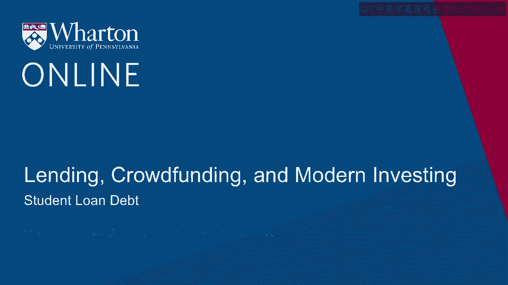
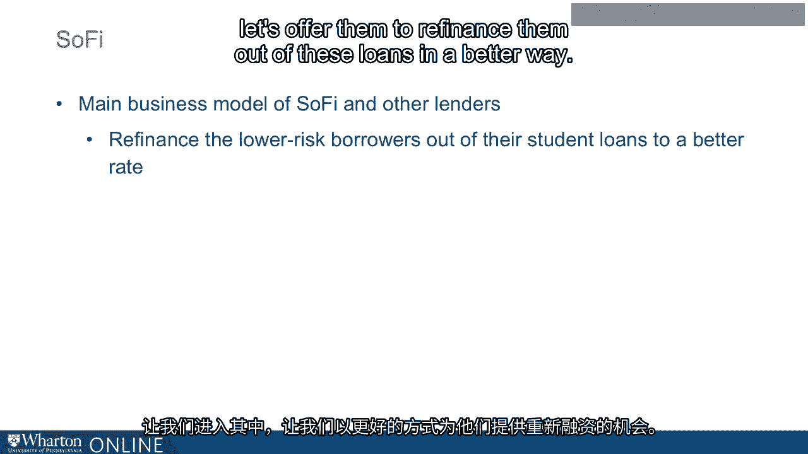
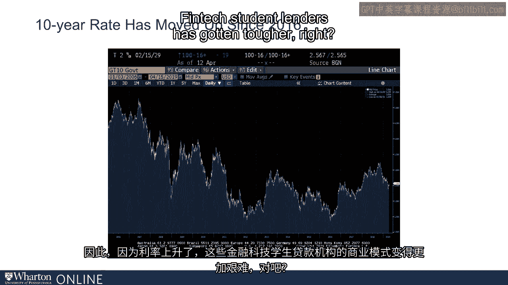
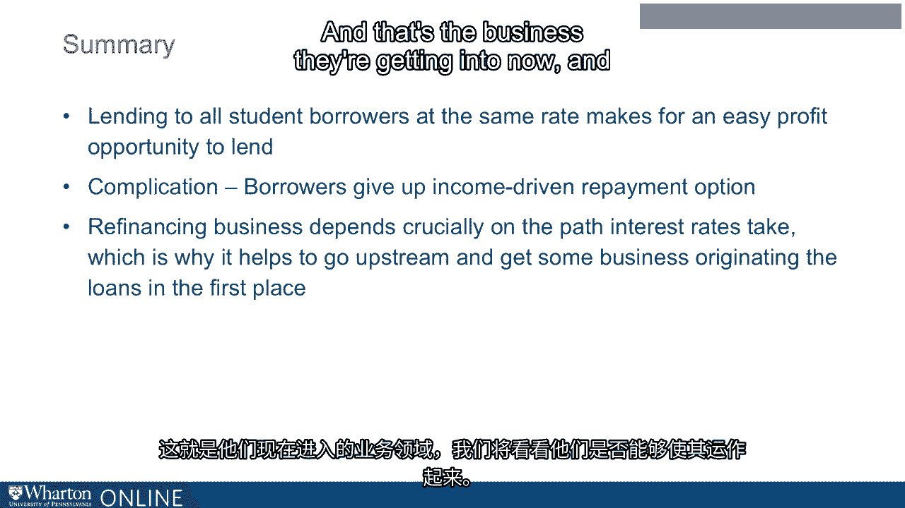

# 沃顿商学院《金融科技（加密货币／区块链／AI）｜wharton-fintech》（中英字幕） - P83：17_学生贷款债务.zh_en - GPT中英字幕课程资源 - BV1yj411W7Dd

 Okay， well， so we saw that everybody getting a federal grad school loan for 2018-19 got。

 the same rate， which was 6。6%。 Remember， that was calculated off the treasury rate。

 They added just one spread to that risk-free treasury rate with that one spread of 3。6%。

 for the treasury rate is supposed to reflect the average risk of a grad school borrower。 Okay。

 and we also saw that students who get into distress have access to income-driven， repayment。

 and this has really， really taken off in the past few years。

 And it is a big part of why we see the student loan debt load increase so much， this gigantic。

 level that it has hit now。 So let's think about the opportunity that this can present to a lender entering this space。

 Okay， so think about the graduates who are doing better。

 We already seen the graduates who have hit a rough patch， access to income-driven repayment。

 those that are doing better。 You've got the job you hope for。

 and you expect rightly or wrongly that this is going to continue。

 You're going to have this high paying job going forward from here， and you'd like， so。

 now you're a low risk。 You may be previously， maybe you could have been high or low。

 but now you know you're a， low risk。 That's how you view yourself。

 So a lender could come along to you and say， "Well， okay， you're paying 6。6% on your loan。"， Well。

 you know， that represents an average risk level， but now we can see your low risk。

 so we're going to offer you something better。 How about 4%， how about 4%， right？

 So from the lender's point of view， they're now 4%， well that's higher than 3%， so there's。

 still a risk spread from their point of view， and maybe they view you as being low risk。

 enough that they can make money low and do it 4%， and from your point of view， great。 You know。

 you're paying 6。6， now you're paying 4。 Geez， let's do it。 So this has been just that right there。

 That's been the main logic， the business model behind the biggest player in the space， which。

 is so far， sort for social finance， so far， then so far is not the only player in this， space。

 You've got common bond， you've got some other lenders in this space now。

 That was basically the business model that all these borrowers are lumped into one pool。

 and all paying the same rate。 Well， you know， now especially that they have finished their program。

 they've gotten jobs， so they haven't， we can see who the better risks are。 Let's go in there。

 let's offer them to refinance them out of these loans at a better rate。

 So that's been the basic business model。 Now you have， of course。

 bear in mind that from the borrower's point of view， as I've， been sort of hinting at here。

 there's a bit of a projection， a bit of a risk， a speculation。

 on your part when you do refinance into a sofied loan because you are giving up your right。

 to enter income， driven repayment。 That's a federal program， it's for federal student loans， right？

 If you're going to， if you're refinancing to sofied， then you've got to find out， well。

 what are they offering me？ If I hit a rough， anyone。

 anyone can hit a rough patch for whatever reason， what are， they offering me in that situation？ So。

 but that's a trade-off， and many people felt that， well， it's worth it。

 I like that low interest rate， I'm going to do that。

 And that's been driving the ramping up of these businesses。 Now let me add， by the way。

 that this whole business of refinancing people out of their。

 student loans has kind of slowed down recently。 Well。

 I would have slowed down because rates have gone up。 Rates have gone up。

 Just the treasury rates have gone up。 So I put on the screen here a Bloomberg。

 this is the screenshot from the Bloomberg terminal。

 which is sort of those you're not familiar with this。

 This is the go-to financial information database that people turn to in the financial markets。

 The Bloomberg， yes， it's the same Bloomberg who was mayor of New York， and this is how。

 he made that money。 And so I went to that Bloomberg terminal。

 I told it to show me the 10-year treasury rate over the period going back some years。

 Just show me where the rates have gone。 And you see that rates came way down from 2006。

 which was this graph stars 2006。 They came way down through the crisis and stayed down in the years post-crisis。

 But now in recent years， they've come up a little bit。 They've come up a little bit。

 Because they've come up， the business model of these FinTech student lenders has gotten。

 tougher， because if you took out a student loan， let's say in 2016， a rate to really， low。

 then that rate you got was keyed off of the very low 10-year rate of 2016。

 Now a few years down the road， rates have gone up。 So even if you're paying a credit spread。

 which is in some sense too high because you're， a low risk， well。

 it's maybe the rate the spread over the treasury rate is too high。

 But you got that rate over a treasury rate， which is really low。 Now everything's come up。

 it may be hard for SoFi to offer you something that's more attractive， than your loan。

 which was keyed off of a very low treasury rate back in 2016。

 So it's gotten harder for them to make money this way to offer to refinance people out。

 of their student loans。 So if you look at these issuers at the SoFi and so on。

 what you'll notice is they're trying， to transition away a little bit from that business model of focusing on refinance to。

 being the lender that helps that loans to you in the first place。

 So that you never even take out a federal loan in the first place， you just borrow from。

 SoFi originally。 And of course they have to， now they're making a little harder on themselves because they're。

 loaning to you before you get a job or don't get a job and they're sort of taking a bigger， risk。

 But I think from their point of view， well， this is a way that we can get around this problem。

 we have， which is that we're so dependent on what happens to interest rates in the overall。

 market between the time you take out your loan and the time that you might want to refinance。

 We don't want to be so beholden to that。 So let's be the original lender。 But of course， as we said。

 if they're the original lender， you're never going to get， income driven repayment。

 And so you're going to have to find out， well， what are they going to offer you？

 What are they going to offer you to smooth over the rough patches in your life going， down the road？

 So that's what we're seeing now in this market is it started off with refinancing， but the。

 path of interest rates has made that tougher and that's encouraged them to go further upstream。

 to the original origination。 And it remains to be seen how well that goes for them and how well that works out for the。

 borrowers who are now sort of depending on SOFI and so on to help them through the rough。

 patches versus the federal plan。 So to summarize， lending to all student borrowers at the same rate is going to create this opportunity。

 down the road for refinance-focused lenders to refinance those people who turn out to。

 be the better risks。 There is this complication from the borrower's point of view that， yeah。

 I could do that。 Maybe it's a good idea。 Maybe it's not。

 It's a hard for me to judge necessarily whether I would take advantage of income-driven repayment。

 down the road and now I'm giving that up by refinancing it to SOFI。 For some people。

 it's clear to them that they'll never need it to others， maybe not so clear。

 And then the path that interest rates have taken over the past few years have shown these。

 lenders that this is a risky business model。 It's too driven by the path that interest rates take。

 so why not move further upstream and， be the original lender and that's the business they're getting into now and we'll see if they。

 can make that work。 So that's what I want to say about lending to consumers。

 The last point I want to make in the next module is going to be a business model that has really。

 taken off recently where you have marketplace lending to small businesses。 [ Silence ]。

