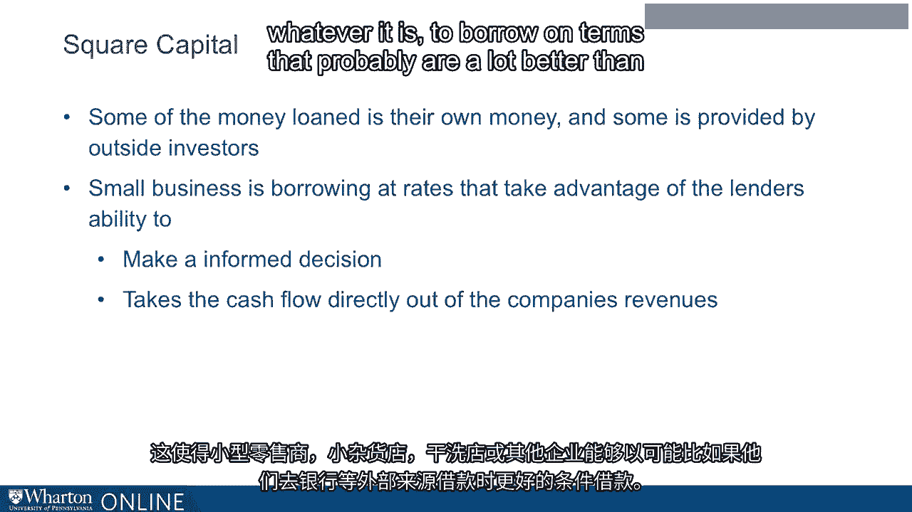
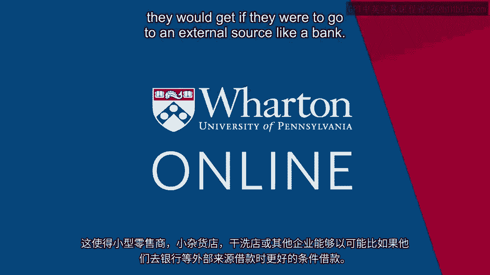

# 沃顿商学院《金融科技（加密货币／区块链／AI）｜wharton-fintech》（中英字幕） - P84：18_向小企业贷款.zh_en - GPT中英字幕课程资源 - BV1yj411W7Dd

 Okay， well there's a special kind of marketplace lending that is aimed at small business。

 especially。

 retailers。 Okay， so now we're going to small business and not your consumer borrower。

 So I'm talking here about lending by companies that are called payment aggregators and the。

 biggest example of this is Square。 You've probably seen Square when you go to a coffee shop or other small retailer。

 They ring you up on this distinctive Square hardware。 Well okay。

 that Square is one of these but there are others。 And they have expanded on an old idea which is known as merchant cash advance。

 And so I'm going to walk through what this is and sort of what their special advantage。

 is here and how this has turned into a big business both for the payment aggregators。

 and also for the retailers。 It's a big source of funding for the retailers。

 But payment aggregators like Square， they see every sale you make， every tip a customer， makes。

 Every time someone uses a card and they can also potentially see other payments even。

 the cash payments that people make in your business。 Okay， they see all that information。 Okay。

 and so with that level of information about your business and of course information。

 about other businesses in your same industry， other businesses in your same neighborhood。

 they've got tremendous amount of data about your future prospects， your future prospects。

 and maybe they can also make a judgment about the benefit that you would get from a loan。

 If they were to loan you $10，000 or whatever， they could see how you could potentially use。

 that to grow your business。 So they once again， big data there， they see every transaction you make。

 They see all sorts of other transactions in your neighborhood。

 They see coffee shops just like yours in other towns。

 And they have all this information that they can see about your business and that would。

 help them think about potentially making you a loan。

 And so they can make you a loan and the loan might take the form of， okay， I'll just show。

 it right there on your hardware， your square hardware at your business that， okay， we are。

 willing to loan you $10，000。 All right， loan you $10，000。 And if we loan you $10，000。

 you have to repay us $11，000， okay。 So they can make that offer and as I say。

 they can see so much information about you。 They can make a pretty advanced credit granting decision of whether this is a good idea。

 And furthermore， and this is sort of the beauty part from their point of view， they've got。

 a huge advantage over a bank， right？ So let's say a bank loans you $10，000， they gave you $10。

000 and now you have to pay them， back， you know， $11，000。 Well of course they've got to。

 the bank has to hope that you see it as worth your while， to repay the loan。

 And once they give you the $10，000 and now you've got money coming in and you have the。

 bank loan but you also have your payroll， you have， you know， you can buy more inventory。

 you can do other pay the rent。 However it is， you have all these expenses。

 the bank is just one of them， maybe you pay， the bank， maybe you don't， right？

 So you have some discretion over， you know， when you pay the bank and how much， okay？

 So the bank has to worry about that。 So the big advantage of the payment aggregator， such as Square。

 is that all the money that， people are spending at your store goes through them before it gets back to you。

 Every time someone uses a card， they process that payment and what they can do is they。

 can take their repayment of the loan they made to you directly out of your cash flow。

 before you even get it， okay？ And so what this does for you is allows you to credibly commit to repay the loan because。

 yeah， they can just take it right out of your cash flow。

 There's no worry there that once you get your money， then you're going to maybe spend。

 it on something else， right？ You can credibly commit that you will repay them because they know it because they can。

 take it directly out of your cash flow。 So it allows a small retailer to borrow in a way that would be very difficult to borrow。

 from some external source like a bank， right？ They're borrowing directly from the organization that's processing their payments in the first。

 place。 Now， as I said， this is not by itself a completely new idea。

 the idea of a merchant cash advance， where the institution processing your payments is taking the repayment directly out of your。

 cash flow。 This has been around for years。 The sort of special sauce here is this kind of big data approach that Square can see not。

 just you but people like you， elsewhere， people in your neighborhood， doing transacting with。

 sort of the same customer base， making their other sorts of transactions， right？ The dry cleaners。

 the bodega， whatever it is， they see that too and that helps them think。

 about your ability to repay the loan and the use to which you could put the money from， the loan。

 So this is a tremendous advantage。 If you look at。

 I keep bringing up Square because this is just an interesting example。

 Square went public just a few years ago。 People really weren't talking about Square Capital so much at the time but Square Capital。

 that's the division of Square that does this。 This is of course taken off now as a big source of their revenue and a big source of funding。

 for retailers in the country now。 And it's also， as I call it。

 marketplace lending here because not only are they making these。

 loans but also they're providing this as an opportunity to institutional investors to。

 front the cash that they then loan， right？ So a lot of the cash that they loan is not really their own cash。

 It is posted by big institutional investors who want to essentially buy a piece of this， action。

 They want to be making these loans to these retailers。

 They like the story and so they supply the capital that then gets loaned out。 So that is the。

 that's a summarize that basically this is a way that small business is borrowing。

 at rates that take advantage of the lender's ability to number one， make a very informed。

 credit-granting decision based not only on their own， their own， the finances of this。

 company but companies like them。 And then number two takes advantage of this ability to take the cash flow directly out。

 of the company's revenues and pay themselves off directly and that allows this small retailer。

 the small bidega， the dry cleaner， whatever it is to borrow on terms that probably are。

 a lot better than they would get if they were to go to an external source like a bank。

 [BLANK_AUDIO]。

