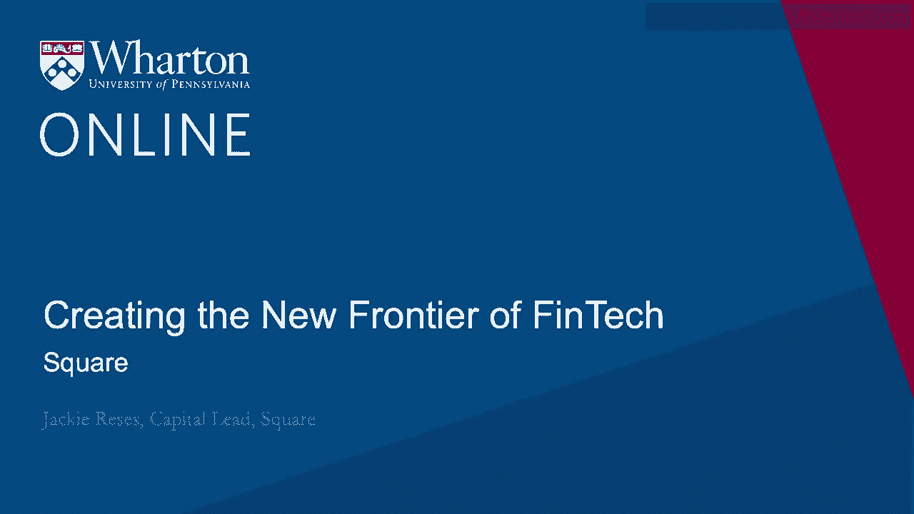

# 沃顿商学院《金融科技（加密货币／区块链／AI）｜wharton-fintech》（中英字幕） - P85：19_打造金融科技先锋-Square.zh_en - GPT中英字幕课程资源 - BV1yj411W7Dd

 Hi， my name is Jackie Reese。 I am the capital lead of Square。 Square is a financial services。

 company that started with payments and then evolved across a broad ecosystem of products。

 The products can range from a point of sale， both a horizontal point of sale and vertical。

 points of sale that could serve retailers specifically or restaurants specifically or。

 services companies that take appointments。 And then there's a breadth of products that。

 also serve small businesses like invoices， loyalty cards， gift cards， capital， payroll。

 And so it's really this huge seller ecosystem to support the growth of small businesses。

 In addition to that， there's a second ecosystem that we've built and that's the ecosystem。

 around Square Cash App。 And for Cash App， there is an ecosystem of over 15 million。

 monthly users who have used the cash card and built cash accounts in order to move money。

 peer-to-peer payments， use a debit card。 And there's an incredible amount of utility。

 for consumers on that set of products as well。 There are three things that I think are really。

 interesting about Square。 First， the ecosystem is fascinating and it's the ecosystem around。

 financial services。 Square started in payments and then evolved the business far beyond into。

 a breadth of products that continue to create an ecosystem for small businesses around the， country。

 Second， it's an incredibly disruptive company and in every aspect of the product。

 it has disrupted and created and invented a new way of thinking about financial products。

 which makes it really interesting。 And then third， Square sits at a really interesting。

 place as it relates to economic empowerment and bringing the underserved into the financial， system。

 And if you think about the creation of Square， which was the very first white。

 dongle and credit card reader， the purpose of that product was not to read a credit card。

 It was to bring people into the financial system who might not have been able to ever。

 take credit cards in their business before because they're able to now have an easy mobile。

 device that is simple to use and handy。 And it meant more than just the ability to take。

 a credit card for so many small businesses when the company was started。 So when Square。

 was started， it was trying to solve the problem that small businesses couldn't take credit， cards。

 And what that actually meant is that they couldn't make the sale。 And so let me。

 step back and explain what that means。 Ten years ago， there was no mobile payment system。

 for credit cards。 Jack and Jim， the two founders of Square created a little white dongle that's。

 now somewhat iconic as being perceived as such a core design of Square。 And that dongle。

 plugged into the headphone jack of a mobile device。 What that enabled a small business。

 to do was two things。 First， they could take the credit card。 Very simple。 Within a few， minutes。

 they were able to get up and running and have access to the payment system very。

 simply in a mobile device that they might already own。 The second thing that enabled。

 them to do was actually get into the financial system so that they could make the sale。 Prior。

 Square， the way credit card companies worked is that it took weeks of getting access to。

 a seller's personal data in order to be given a credit card account。 They had to be underwritten。

 for risk。 And with Square， we really changed the paradigm of what risk looks like so that。

 a seller was able to be onboarded onto the system immediately and only removed from the。

 system if anything looked off。 And so that was a total change in risk behavior。 Yeah。

 I think there are four interesting dynamics happening in FinTech today。 First， there's。

 a disaggregation between the data and the data source。 And so you're seeing interesting。

 businesses built around APIs that have really separated the customer experience and the。

 back end sources of data。 And I think that'll be really interesting as different combinations。

 of data and end user tools are pulled together to create a great experience。 Second， user。

 interface， so much cleaner。 We're very used to financial apps that are complicated， lots， of words。

 hard to use。 I think that is completely changing with very simple apps that consumers。

 can easily use。 Next and related is really design。 You're seeing a lot of design first， products。

 It's making a huge difference in the ability to use them。 And I think they're。

 getting a lot of consumer residents across the country。 And then last slightly different， topic。

 but the ideas around blockchain are having a significant impact on the invention。

 of infrastructure related to the financial system。 And as we see transactions changing。

 around the world and evolving around the world， you'll start to see more blockchain technology。

 deployed across lots of different financial companies around the world。 I think business。

 models and banks will have a significant change over time。 If you look at two of the big core。

 businesses today， wealth management and lending， both of them are seeing a significant amount。

 of interest from FinTechs who are really disrupting the user experience and the product flow of。

 both of those significantly impactful industries within finance。 And over the course of 20 years。

 I would expect to see models changing the consumer's having more power in how their product is。

 used and having the products look more beautiful and easy to use far more than they are today。

 where they still are incredibly cumbersome in most cases。 I think the one fundamental issue。

 that will remain within banking is that there's always going to be a cost of capital。 And。

 I think banks do have an edge around regulatory compliance the way they operate in terms of。

 their scale and the cost of capital， they're going to have to work with that advantage to。

 figure out how they evolve over time。 One of the biggest challenges we're facing right。

 now is related to privacy。 There's a lot of interest in looking at privacy law around。

 the world。 We've seen a lot of changes with the introduction of GDPR in Europe。 And the。

 challenge that we're facing in the United States is that there is a very significant。

 interest in pursuing some type of legislation and regulatory regime around privacy， yet it's。

 being adopted and evaluated on a state-by-state basis。 It's hard to have national level products。

 when you could have such variation from state to state。 And I think the challenge is going。

 to be how to deal with building legislation and momentum on a national level so that we。

 can create one regime that makes sense for all of the United States。 I think there are。

 a few things that are really important in understanding in Fintech。 First is the idea。

 of product development。 It's a combination of engineering and design and having an appreciation。

 for how the two work together。 I think that's absolutely critical for working in any company， today。

 The second thing is understanding blockchain and cryptocurrency and really delving into。

 understanding the infrastructure and the impact that it could have on a company。 And then last。

 I think AI is going to change almost every job out there。 And so having an appreciation。

 for and learning about AI is going to be super critical in any financial education。

 I think one of the most interesting things about Fintech today is that no amount of historical。

 skill base will actually help you in creating something that's disruptive。 And so it doesn't。

 matter what you did in school， where you worked right after school， or how you think about。

 what you want to do。 It's really about the creativity and your willingness to invent。

 in terms of whether someone is going to be successful in Fintech。 Most of the models。

 that we see today are fairly new。 And so having more of a mindset around growth and a mindset。

 around invention is far more important than anything else a person could have。 [BLANK_AUDIO]。

