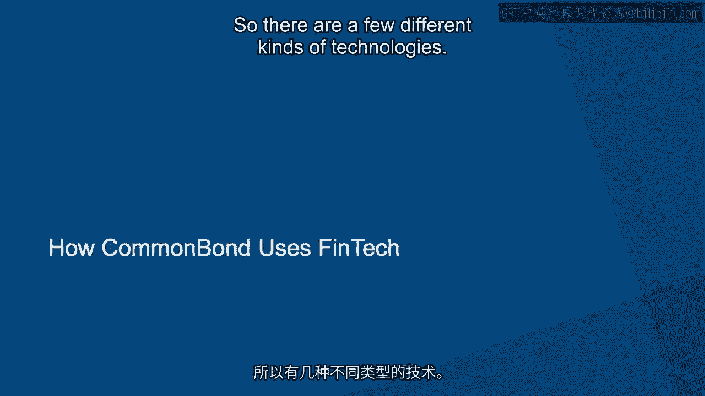
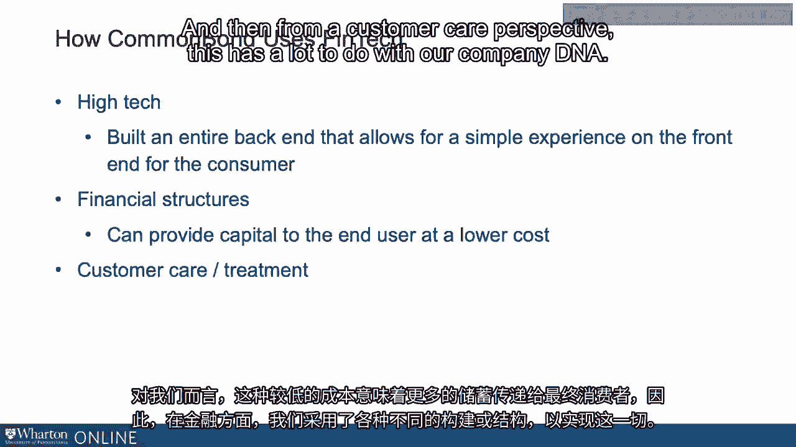
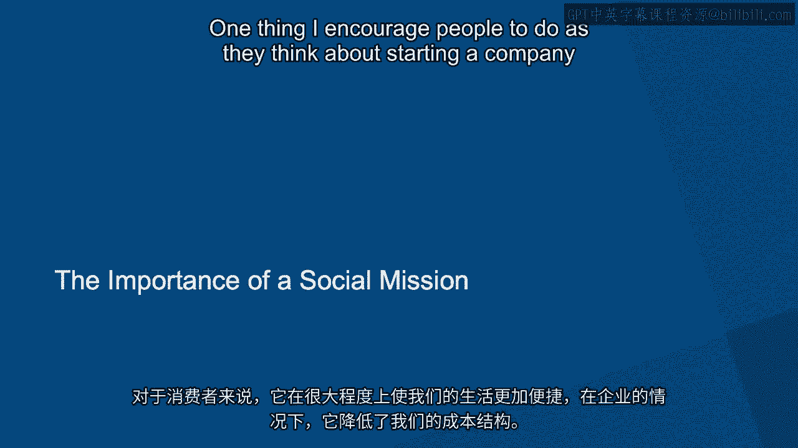

# 沃顿商学院《金融科技（加密货币／区块链／AI）｜wharton-fintech》（中英字幕） - P86：20_打造金融科技先锋-Commonbond.zh_en - GPT中英字幕课程资源 - BV1yj411W7Dd

 Hello， this is David Klein， CEO and co-founder of Common Bond。

 Common Bond is a financial technology company based here in New York。

 We help people with their student loans。 If you're a student in school and you need a way to finance your education which is likely。

 expensive， we can help。 If you've graduated college。

 whether as an undergraduate or a graduate and you have。

 student loans you now need to pay off for a long time， we can help。

 We can consolidate your loans in one， likely lower your rate and save you a lot of money。

 And then the third way we help is if you are now employed anywhere in the country， we offer。

 student loan benefits to employers to provide their employees as a way to attract and retain。

 top talent。 The impetus for Common Bond is that I was going back to business school and I was fortunate。

 enough to get accepted to Warden。 That's where I ultimately decided to go and I needed to pay my way 100% with student loans。

 And in that experience， what I realized is that the incumbents， predominantly the federal。

 government and private banks， were charging rates that were unnecessarily high， the process。

 was overly opaque and the customer service was pretty poor。

 And so I went back to business school with the express purpose of starting and running。

 a company at or before graduation to use my background in finance to leverage the fact。

 I now had this personal pain of needing to take out student loans and it not being a。

 very good experience。 I paired that up with my entrepreneurial ambition and that was really the birth of Common。

 Bond。 So there are a few different kinds of technologies that are behind the FinTech moniker in my opinion。

 Some are your usual suspects， right？ So what I'll call high tech。

 what you'd expect technology to mean。 It has to do with developers。

 it has to do with code and it has to do with releasing。

 that code into production and creating a better experience for the end consumer。

 But we also have technology in the form of financial structures， new and innovative ways。

 to do things。 We have technologies as it relates to customer treatment。

 new and innovative ways to do things， again in service of the customer。

 If I just walk through those three things for a moment， what I'd say on the， I'll call。

 high technology or pure technology side of things， we've built a loan origination system， in house。

 We've built an application experience that automates more of the experience than anybody。

 else in the industry from what we're able to tell what that does is it simplifies and。

 speeds up the application experience for our end user。

 It simplifies things in that it automatically allows you as an applicant or a consumer to。

 do things like verify graduation from school or verify outstanding payments across your。

 multiple different student loan servicers before you refinance。

 It allows you to automatically provide income information， all of which is information that's。

 important to our underwriting process。 So from what I call the high technology perspective。

 that code perspective， we've built an entire， back end that allows for a very simple experience on the front end for the consumer。

 From a financial perspective， we've created financial structures that work for exactly。

 what we want to do。 At the end of the day， we serve a two-sided market on the one side or capital providers。

 on the other side of the consumers。 Our product is in fact capital。

 We're providing capital from capital providers to consumers in an efficient way。

 And because we can do that efficiently and because by the way we're 100% digital and。

 we don't have brick and mortar branches， we can provide that capital to the end user at， lower cost。

 And that lower cost to us means more savings to the ultimate consumer。

 So there's a whole host of different construct structures that we use on the financial side。

 in order to enable all that。 And then from a customer care perspective。

 this has a lot to do with our company DNA from。

 the start。 We've said customer care， customer treatment， customer service is a primary priority for。

 us。 In fact， it's our value number one in our company values。

 It's what I believe truly differentiates businesses and companies at scale over time。

 And so we've done a lot from a process perspective as we designed the product and we designed。

 the experience to make sure that that simplicity and that speed doesn't just stop with a lot。

 of the automation that our technology， our high technology drives， but continues with。

 the way that we interact human to human with our applicants and borrowers as well。

 When I think about ways that we use technology to empower strong human to human interaction。

 one of the places my mind goes is to an acquisition to a company we acquired not too long ago。

 And what they are is an AI powered financial platform for Gen Z。 Very specifically what it means。

 there are a lot of people who are currently in high， school， currently in college。

 and they're looking for ways to set themselves up for future， success in life。

 specifically future financial success。 And one of the biggest decisions they have to make at this point in their life is how。

 they're going to pay for school and there are myriad ways to do that。

 First one is paying for school through taking out a loan but not all。

 It also includes federal government money， includes grant money， includes scholarships。

 includes financial aid， includes personal savings， family savings， et cetera。

 And so this platform helps our money mentors， people on the other end of these exchanges。

 with consumers， inform and coach the folks on the other side through a lot of these。

 questions about how do I pay for school， how do I start applying for scholarships， how。

 do I think about engaging with my financial aid office， et cetera， et cetera。

 This is a long winded way of saying this company has now part of common bond， has created。

 AI technology that empowers one of our money mentors， consider them a coach， a financial。

 coach to provide the best guidance to the user at any given point in time。

 And so we've built models in the background that auto generate text messages to the end。

 user that we believe the end user will find interesting， compelling， interesting enough。

 to engage back。 And this technology is actually modeling in the background at any given point in time。

 A/B tests around when we send a text using AI technology， which text is going to generate。

 the highest response。 And as we test that or as we learn that we're testing new types of messages to send to people。

 So we're constantly looking for that message that's going to resonate most for the end， user。

 It's a win-win-win。 It's a win for us because we don't need to increase our cost basis。

 but rather decrease， our cost basis while at the same time providing the right guidance to our consumer at the。

 right time。 So it's a win for the consumer。 And then it's a win for scalability and sustainability because to the extent we can make that happen。

 well， consistently over time， it makes us a more sustainable and profitable company。

 And there's this virtuous cycle that develops that when you can do that as a company， you're。

 around longer to serve consumers better。 Student debt in the U。S。 is a big deal。

 It's a big deal in part because 44 million people in this country hold 1。5 trillion in。

 student debt。 And so you have a lot of people that are looking to pay down this student debt over a。

 relatively long period of time。 From a macroeconomic perspective。

 what that means is that people need to pay down their， student debt before they get to other items。

 like taking out a loan to buy a car， taking， out a loan to buy a home。

 maybe even floating on their credit card， a little lecture for， disposable cash to consume。

 It also gets in the way， potentially， of saving money。

 Instead of putting all that money away in a savings account to save for the future， it's。

 going primarily towards student loan servicers。 So that hopefully sets the stage for what student debt is and what it means in the U。

S。 how big of an issue it is for how many people。 And therefore。

 I think underscores the need to solve it。 For us at Common Bond， from the very beginning。

 what we've said is that we're going to help， solve this issue by decreasing the cost of that debt。

 So there might be companies out there that have a mission to decrease college tuition。

 There might be companies out there with a mission to help people manage all of their， debt。

 student debt， or otherwise。 For us， it was very expressly。

 how do we help reduce the cost of financing education？ And so that's what got us in this space。

 That's what led us to figure out， hey， how can we create an experience？

 And a product that not only is simple and quick for a user to get through， but actually。

 doesn't over-indec somebody over time。 And so we've been able to save a lot of our borrowers a significant amount of money over。

 time。 There are some borrowers for whom we save hundreds of dollars every month in freed up cash flow。

 There are some borrowers for whom we save tens of thousands of dollars over time on， lower interest。

 And so that's how we've approached the issue of student debt and the role we play in helping。

 solve it or reduce the burden of it。 So when I think about technology。

 I think in its most basic form， it's moving data from， one place to the next。 In fact。

 if you think about anything you've ever done technologically， kind of in the nuts。

 and bolts of technology， that's effectively what you're doing。

 The next layer is that you need to tell source data where to go。

 So you need to let the data know where its destination is。

 And the way that tends to happen is through models。 And models can happen in many different forms。

 We have technologists and coders building models inside of our high technology infrastructure。

 We have risk analysts modeling how to underwrite somebody based on a host of risk factors。

 We have risk analysts modeling how to price somebody based on a number of factors。

 And we have a lot of folks in our finance organization that are pulling data from one。

 source and getting it into the next。 And it too goes through a model of some sort so that the source data knows where it goes。

 as far as destination and how to reconstitute itself once it's in its new destination。

 That at its core is really what technology is， what coding is。

 And we have different contexts for that across our business。 Again， and in some。

 we have technologists coders who do that on the high technology side to。

 make sure that data gets from one place to the next to make a transaction seamless and。

 automatic for the user。 We do that within the risk and underwriting function to make sure that within a split。

 second based on hundreds of variables， we know what price or interest rate a user is， going to get。

 And we do that on the finance side of our organization as we think about all the data。

 that whether you're a FinTech company or a non-Fit10 company needs to get its hands。

 on on a daily basis to see a clear field of how things are going inside the business and。

 outside the business to pull the appropriate operational lovers to run the business well。

 So that's what technology looks like here at Commonbond， just using as a base the simple。

 concept that at the end of the day technology is taking data from one place into the other。

 and using a model or an algorithm in between to direct that the data is going to the right， place。

 There's no doubt in my mind that financial technology only increases in scale and robustness。

 from here。 The signs are all around us。 You have everyone from the JP Morgan Chases of the World spending。

 They just recently announced $11 billion this year alone on financial technologies。

 You have their peers spending $9 billion， $10 billion a year on financial technologies in。

 and of themselves。 These budgets are among the largest that these banks have and they've been growing。

 The banks tell us that they'll likely continue to grow。

 At the same time you have a significant number of new companies that have come online in。

 the last call at five years and increasingly so over time that are looking to disrupt different。

 parts of finance which is a massive and complex system for which disruption is ripe and has。

 been ripe for a long period of time。 I think those two things are connected。

 I think one of the reasons why large banks are spending more and more money on financial。

 technologies is because they feel the pressure from a lot of the smaller companies that have。

 been around for two， three， five， probably no more than seven， eight years， raising the。

 bar for the kinds of technology required in every nook and cranny of the massive and complex。

 financial system。 I think what we're going to see happen over the next three， five。

 ten years is that financial， technology companies， those upstarts that have been around for three。

 five， seven years， are going to continue to build at a pace that's faster than what a large bank can do。

 That'll put increasing pressure on large banks to spend increasing sums of money on financial。

 technologies to compete。 You also might get some acquisitions of smaller companies by the larger companies to accelerate。

 a lot of that technology， if not also a lot of that customer loyalty to feed the beast。

 of the larger financial institution。 Then I think you'll see some financial or rather some FinTech companies that gain significant。

 scale in a short period of time and become independent long-term competitors to the large。

 financial institution。 There's no doubt in my mind that financial technology is an area that we'll continue to。

 see grow in investment， in robustness， and accelerate。 The good news is accelerate great experience。

 great product for the end user as far as the， eye can see。

 I've been asked why should you care about financial technology？ I think there's two answers。

 One from a consumer's perspective and the other from just a company perspective。

 From a consumer's perspective， financial technology is all around us。 Whether we know it or not。

 it's all around us。 Moving from a world of banking that was brick and mortar to then online and now mobile。

 that's， all financial technology。 The fact that we want to take care of things in one click。

 not several， that's financial， technology。 The fact that I can pay people back now on my phone。

 whether through PayPal or Venmo or， any other kind of payments system， in less than a minute。

 that's financial technology。 There's a host of things happening， what do you want to call it。

 beneath the surface， over all of our heads or what have you that affects all of us as consumers day to day to。

 make our lives frankly easier and to position our financial health better now and into the， future。

 That's why people should care about financial technology。

 The reason companies should care about financial technology is because every company， whether。

 they're a FinTech company， a bank， a financial institution or not has to care about financial。

 technology。 Why？ Because in order for a company to be a company。

 there needs to be an exchange of funds。 There's a profit and loss statement。

 There's cash flow statement。 There's balance sheet with assets， liabilities and equity。

 There's capital raising， either through investors or through the profit making ability of your。

 product。 There's a flow of funds element to every company。

 Those are relatively complex transactions that have the capacity to be simplified with。

 the use of technology and in fact have been simplified with the use of technology for。

 the past 10 years and increasingly so in the past 10 years that will continue。

 Financial technology is all around us。 Whether we're consumers or whether we're running companies。

 it's a large part of making our， lives easier in the case of consumer and reducing our cost structure in the case of the company。

 One thing I encourage people to do as they think about starting a company is to think。

 about having a social mission。 We have a one-for-one social mission at Commonbond whereby for every degree we fund。

 we fund， the education of a student in need。 We've partnered up with a nonprofit based here in New York called Pencila Promise which with。

 a chain of hundreds of schools globally and to date we're very proud of having donated。

 over a million dollars to date to the social promise。

 The reason I say all of this is because I would love to see a world in which more and。

 more companies that started out started out with a social mission。 Ruby Parker did it。

 another group of Wharton alum in eyewear。 Tom Shues did it in Shoeir。 In each of these cases。

 the one-for-one model establishes that the better you do as a company。

 the more you grow as a for-profit company， the more social good you do。 Frankly。

 the only reason we have that is because that was something that was very important。

 to us from day one。 As we thought about what is our revenue model going to be。

 as we thought about what is our， market entry strategy is going to be。

 and we thought about how are we going to fund ourselves。 We also。

 in the same breath that the same conceptual plane thought about what's our。

 social mission going to be。 I think the more people think about what their social mission is going to be on that same。

 conceptual plane as revenue model， as market entry strategy， I think we'll see a lot more。

 companies out there with a strong social mission and we'll end up seeing the corporate world。

 and business in general being an incredible source of positive social change in the communities。

 in the world around us。 That's a hope that I have。

 We're a model that's doing our part and hopefully encouraging and empowering more of that elsewhere。

 It's something that I like to communicate to folks who are just thinking about whether。

 starting a FinTech company or anything else， thinking about and holding themselves to。

 a standard of a social mission is just as important as a revenue model。 [BLANK_AUDIO]。

