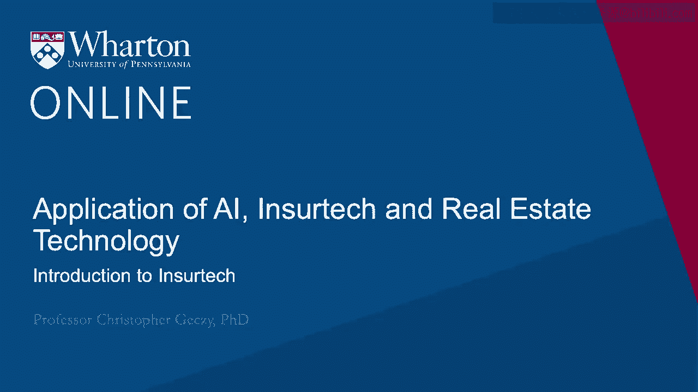
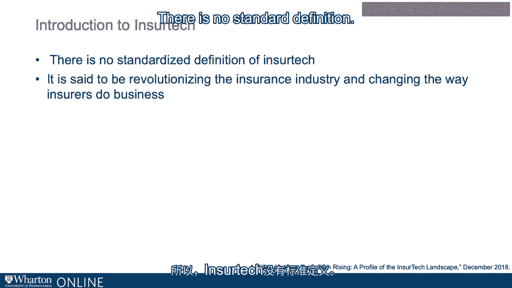
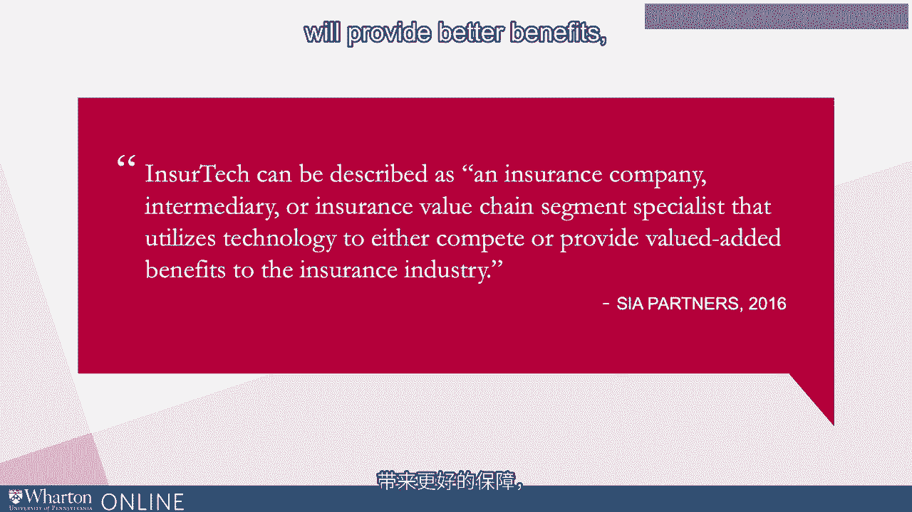
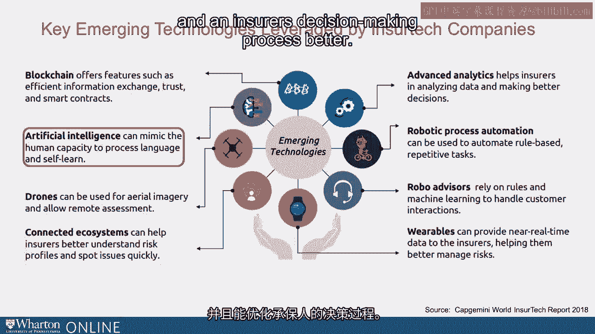

# 沃顿商学院《金融科技（加密货币／区块链／AI）｜wharton-fintech》（中英字幕） - P87：0_简介.zh_en - GPT中英字幕课程资源 - BV1yj411W7Dd

 Okay， we're now going to take a look at a specialty area of FinTech known as EnsureTech。

 or the application of various kinds of technologies in the insurance industry。

 The insurance industry is huge。 It's global。 It's diversified across applications and sub-segments。

 According to some recent calibrations， gross-written premium stood at almost $5 trillion at the。

 end of 2017。 Gross-written premium is essentially the amount of insurance written。

 not including commissions， and some costs。 That premium is growing fastest in emerging markets。

 That income was estimated by Ernst & Young to have grown 23% in 2018 versus 14% in 2017。

 The insurance industry is a very old and traditional industry。 In fact。

 some say contracts that help people ensure various risks go back as many as thousands， of years。

 It's clear， however， that the advent of modern technologies is changing and even some would。

 say disrupting the state industry via all kinds of methodologies and mediums。 Wearables。

 driverless vehicles， IoT or the Internet of Things， big data， natural language， processing。

 blockchain， distributed ledger technologies。 Even the possibility of climate change affecting those who are insured。

 along with many others， are adding up through the avenues of technology to serve as a disrupting force。

 New technologies are also offering all kinds of potential opportunities to do today's business。

 better in the industry or to grow markets to make better decisions and address what。

 we could call the customer experience， all coming together as insured tech。

 There is no standardized definition of insured tech。

 Some would say that even though it's disrupting and revolutionizing the industry and rapidly。

 today already changing the way insurers， providers， service providers and ultimately。

 customers experience insurance， there's no standard definition。

 I like the definition that Cya put together。 Insurance tech can be described as an insurance company intermediary or value chain segment。

 component that utilizes technology to compete or provide better benefits， value-added benefits。

 in the industry。 The ecosystem of technologies that are coming to play in the insurance industry are many。

 some of which you have already probably been exposed to。 Like blockchain。

 efficient information exchange， trust， the ability to write contracts that。

 are self-referential and self-aware and which offer a certain kind of immutability ultimately。

 appropriate because after all insurance is essentially in the form of a contract。

 Products that help insurers， their service providers， underwriters and others make better。

 decisions taking more from data， expanding to new data， augmenting data。

 The insurance industry and the processing of insurance requires vast amounts of repetitive。

 tasks making insurance ripe for process automation。

 Controls based or potentially ultimately self-aware， increasing reliability， decreasing mistakes。

 and ultimately automating what traditionally has been a human task-oriented area。

 Robot advisors who rely on rules or other kinds of machine learning techniques to interact。

 with customers。 It could be customers interacting with technology online or over the phone。

 either enhancing， making more immediate or more accurate customer interactions。

 A very interesting area known as wearables， providing data both about the insured or those。

 who are related to the insured， all the way back to insurers， helping them manage risks。

 understanding the insured， perhaps improving the customer experience in real time or an。

 aggregated way。 Connecting ecosystems which could be by the way as broad and far reaching as social media。

 or based on data already collected within the ecosystem of the insured linking back to。

 the entire value chain of insurance， understanding the client better to better profile their risks。

 and potentially spot both service lapses and rising risks in a more accurate way or in。

 a faster way。 Technologies like drone technologies or visual processing technologies using for aerial imagery。

 remote assessment and integrity of images and imagery used in the insurance underwriting。

 process or for claims。 Artificial intelligence， AI including natural language processing。

 mimicking the human capacity， to process language， to learn。

 to extract patterns not easily seen using traditional technologies。

 including even advanced statistics and ultimately making a customer's experience and an insurers。

 decision making process better。 Thanks for watching。

