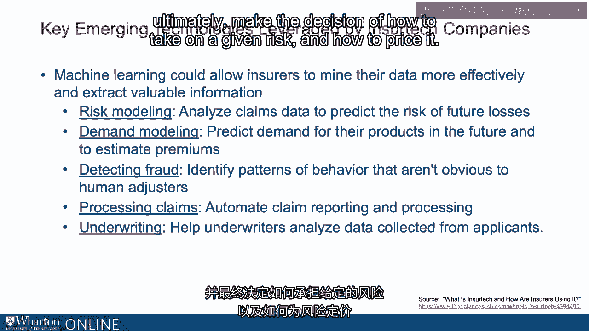

# 沃顿商学院《金融科技（加密货币／区块链／AI）｜wharton-fintech》（中英字幕） - P88：1_新兴技术-人工智能和机器学习.zh_en - GPT中英字幕课程资源 - BV1yj411W7Dd

 The area of artificial intelligence is especially exciting as it might be applied to the FinTech。

 Robo-advising and SureTech areas。 What is an artificial intelligence again？

 Well ultimately it's a description of software which can perform all kinds of tasks that。

 are historically normally associated with reasoning by humans。 That could be learning。

 it could be simulating self-awareness including potentially the perception。

 of emotions and insurers have focused on harnessing artificial intelligence first with respect。

 to customer interactions， chatbots for example or programs that communicate with customers。

 verbally through text， ultimately guiding decision making。

 Allstate for example the well-known insurance company created a chat bot called ABBY， the。

 Allstate Business Insurance Expert。 ABBY specifically residing on Allstate's website provides answers 24/7 365 days a year to answer。

 policy owners queries。 Other insurance companies have followed specifically focusing on answering customer questions。

 helping them complete applications or even filing claim reports。

 Another type of InSureTech is machine learning which is a subset of AI allowing computers。

 and their software algorithms to simulate learning or data augmentation and knowledge。

 augmentation over time。 Using rules or models to simulate the way the brain works。

 This kind of learning machine learning allows computers to extract patterns from data and。

 that could be structured data in the form of numerical data or unstructured data in the。

 form of text or other elements including pictures rather than following highly specific instructions。

 Of course instructions are important in the definition of the algorithms that machine learning。

 represent but in as far as machine learning can self-replicate or operate under a broader。

 set of instructions。 Machine learning gives the appearance of being closer to the activities of the human brain。

 Not many insurers are currently using what we call deep learning， machine learning。

 Certain insurance companies are applying it to huge amounts of data that they collect。 NAICS。

 so the National Association of Insurance Commissioners indicates that only about 10-15%。

 of the data collected by insurance companies is currently actively used。

 Machine learning could allow those insurers to look at large amounts of data， sometimes。

 known as big data， to extract patterns that are useful for their businesses。

 Some examples could include risk modeling allowing insurers to analyze their claims。

 data in order to predict risk better。 Of course the historical data in the form of the history of losses may not be the only。

 data that are important in understanding how to price risk and how to predict the risk。

 Insurance could create models to predict demand for their own products and also develop new。

 products and therefore understand how to price them or determine their premium。

 Fraud as you might expect is a potential problem in the insurance industry。

 Machine learning including analyzing pictures and looking for certain markers of fraud could。

 both allow insurers to promulgate their business models better but also potentially decrease。

 costs due to the dead weight loss of fraud。 Those may be obvious to human adjusters but also of course may not be。

 The automation of claims which of course could lead to happier policy holders is another。

 area where machine learning and its efficiency and speed may apply， automating reporting。

 processing， and speeding along the customer experience。

 And finally one of the most important areas of insurance underwriting。

 Underwriters are those human decision makers who analyze data and ultimately make the decision。

 of how to take on a given risk and how to price it。 Computers can aid that decision making process。

 They can flag risks in the process。 They can also point out inconsistencies in data that human underwriters may not be able。

 to see。 They can also check external sources like social media to verify accuracy of input data。

 [BLANK_AUDIO]。