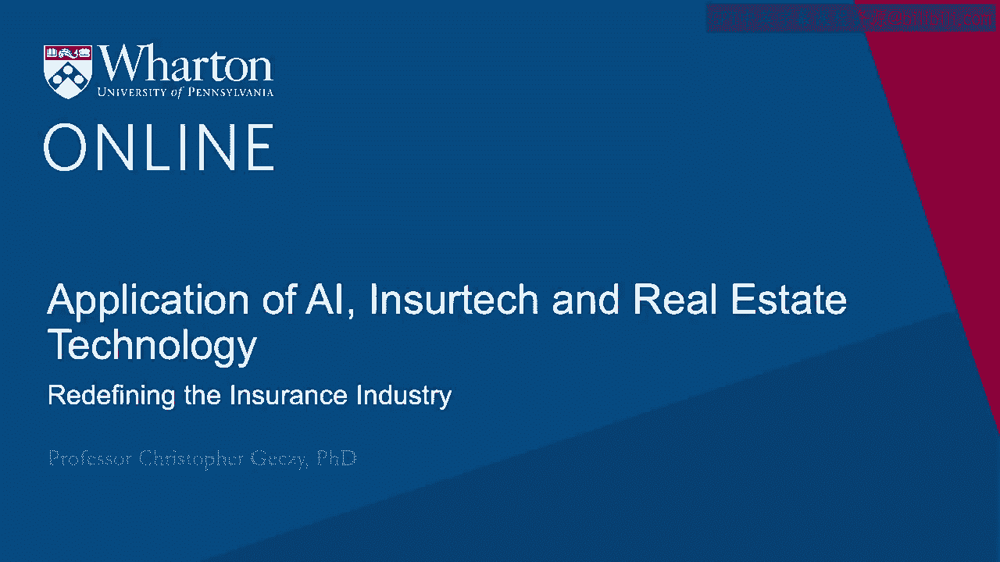
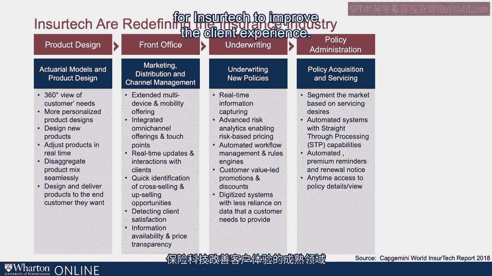

# 沃顿商学院《金融科技（加密货币／区块链／AI）｜wharton-fintech》（中英字幕） - P89：2_重新定义保险行业.zh_en - GPT中英字幕课程资源 - BV1yj411W7Dd

 A useful model for how ensure tech can influence the entire value change of the insurance industry。

 breaks it up into five pieces。 Product-oriented， selling and marketing， risk-taking or underwriting。

 administering servicing clients， and policies and then claims and claims management or paying out on insurance claims。

 The product design component is multifaceted。 First of all。

 it starts with the customer experience and understanding customer's insurance。

 needs and risk management needs。 The customer experience ultimately leads to questions and identification of market segments。

 as well as questions of customization。 Can an insurer or an element of the insurance ecosystem provide a better experience to clients。

 by understanding the needs they have for risk management across their lives， whether it。

 has to do with their cars， their homes， their lives， their financial future？

 And then can we customize it？ Can the industry design new products？

 Can it adjust the product offerings in real time？ Can it disaggregate the product mix both in time and in the cross-section of the insured。

 to provide what is most valuable to them and can they do it seamlessly？ Can they do it quickly？

 And can they do it dynamically？ Design and delivering products to the end customer they want。

 Marketing distribution and the management of sales， of course， could be augmented by extending。

 the ability to reach the client。 Creating different client touch points。

 providing real time interactions with clients， not， just pull but push。

 identification of cross selling opportunities known as the wallet， share for clients。

 And that could link back to concepts of financial planning as we've heard elsewhere or it could。

 be very specific to insurance。 Connecting client happiness levels and satisfaction。

 Providing increased price transparency， supporting customization as well as competition and appropriate。

 pricing。 Underwriting， the ability to capture information provide rapid feedback to clients on their。

 durability and the pricing of insurance。 Understanding clients beyond the data they provide on an application。

 Automating workflow so that the task of underwriting is made most efficient， ultimately tying back。

 to client experience。 Being able to gather data to offer real time discounts and couponing to clients。

 Getting behind the client eyes and understanding their behavior， ultimately to provide a better。

 underwriting experience and risk management。 Post underwriting and premium generation。

 policy administration or the acquisition and， servicing of a policy comes to bear。

 Servicing after acquisition of insurance policies really is the area where insurers are in touch。

 with their clients。 Post acquisition， the servicing element of clients is often monetized in the spirit of。

 the best clients being an insurance company's best clients。

 The ability to again segment the market with respect to their desires for servicing characteristics。

 like self servicing or servicing at all hours of the day。

 As well as things like automated reminders to pay and sending out renewal notices or updates。

 with life events and again connecting back to financial plans。

 All are ripe areas for insurance tech to improve the client experience。

 And finally， servicing and paying out of claims。 The servicing and paying out of claims once they've been filed is in fact the point of。

 which many see insurance as being most valuable。 In other words。

 the point at which they think of their insurance companies historically is。

 when they're either writing a premium check or they are requesting or filing a claim。

 The ability to lower wait times and improve the customer experience as a result of technological。

 transformation holds a great promise in the ecosystem of the insurance industry with respect。

 to their insurance。 And that could range from notification of claims。

 the ability to submit digital evidence， the， electronic filing of claim forms。

 status monitoring and analytics identifying fraud and fraudulent， claims。 Ultimately。

 potentially lowering the cost for all insured。 [BLANK_AUDIO]。

