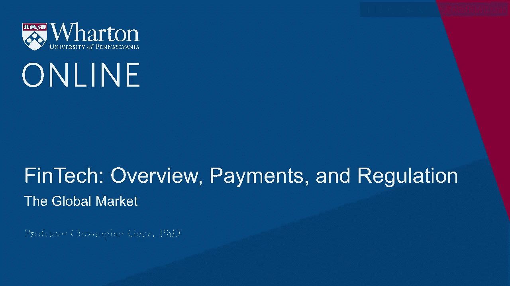
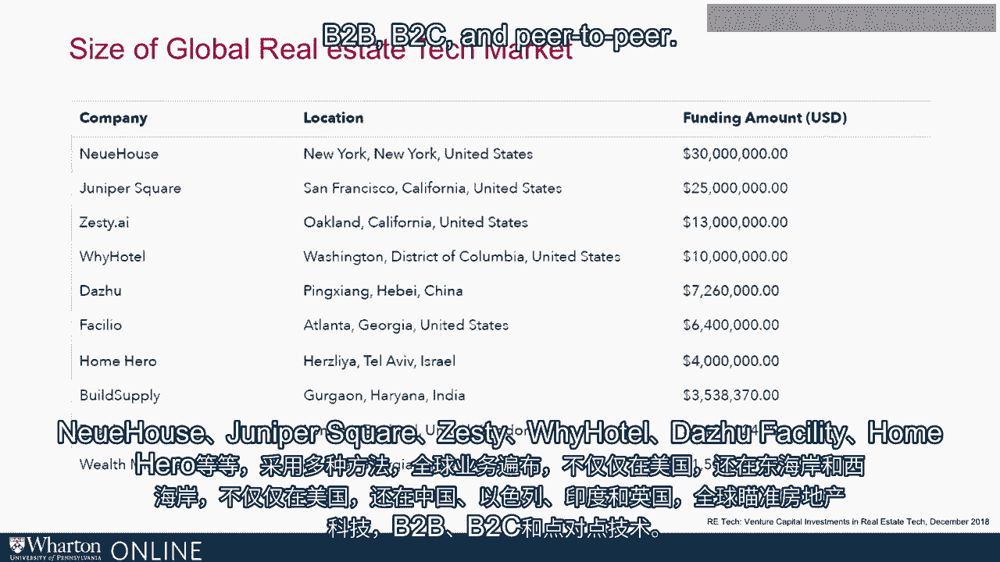
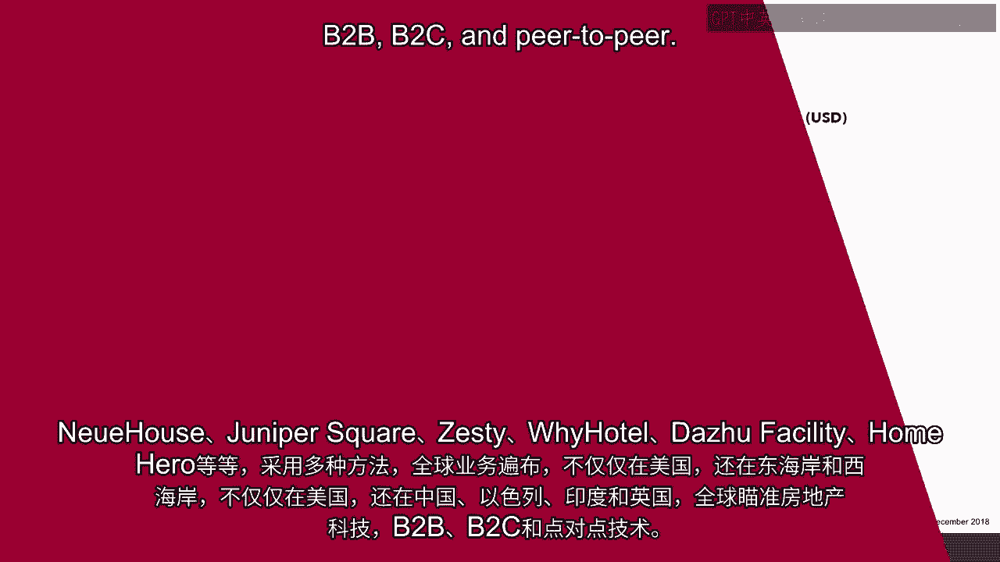

# 沃顿商学院《金融科技（加密货币／区块链／AI）｜wharton-fintech》（中英字幕） - P8：7_全球市场.zh_en - GPT中英字幕课程资源 - BV1yj411W7Dd

 Now FinTech is clearly a global phenomenon， and although much of the money raised and deployed。

 and many of the customers are basically in the United States， it would be completely。

 false to presume that most FinTech activity today or in the future will be based in the。

 United States or involving United States customers。

 A simple look at the top 10 FinTech deals in 2018 reveals that only about 40% of the deals。

 done of the largest deals were based in the United States。 The largest Refinitiv。

 which is a B2B platform， which was bought out with a base level $17。

 billion was indeed based in the US。 However， the series C funding round done by Ant Financial。

 which was at $14 billion， saw a Chinese company take in the cash。

 The third and fourth positions were held by Worldplay and Netz at about $13。5 billion。

 both in the UK and Denmark respectively， one in a purely M&A transaction， the other once。

 again in a buyout funding round。 So in other words。

 it's not just a venture capital space by way of funding， it's a buyout， space。

 it's not just venture capital， it's private equity， and it's a global phenomenon。 40% US。

 the rest seeing activity around the world。 Take China， for example。

 a large and developing market for FinTech even today。 The top five deals were specifically。

 in fact the second was Ant Financial in 2018。 And throughout the entire year， we saw about $18。

2 billion of additional funding across， venture capital， private equity and M&A deals。

 This is once again from the Pulse of FinTech report from a partner， KPMG。 The pattern across time。

 both by deal count and capital invested， follows the pattern we， saw in the US。

 A general increase in activity， money flowing into the space， deal counts being somewhat， cyclical。

 having a recent downturn but a general upward average trend， indicating ongoing potential。

 interest here， once again in China。 The UK， although on an absolute basis。

 larger than we saw in China， at about $20。7 billion， added up in the aggregate across the year。

 also had a weaker 2018 than was seen over， this last several years。 Again， a positive upward trend。

 cyclicality in the funding， reflecting the global phenomenon， of FinTech。 Europe， of course。

 in the aggregate larger than the UK， about at the level of the combination， of China in the UK。

 saw about $34。2 billion。 Again from the Pulse of FinTech report from KPMG。 Same trend。

 an increase in the number of deals， a bit of weakness in 2018， cyclicality in the， flows。

 reflecting varying but positive demand。 Another important and bridging area within the FinTech cluster is real estate technology。

 The global market snapshot of venture investments reveals very interesting patterns that correspond。

 to what we saw previously， namely some a measure of weakness in 2018 but historically increasing。

 deal flow。 Newhouse， Juniper Square， Zesty raised between $13 and $30 million。

 The median funding level was $3 million in December but the total funding level of about。

 $108 million as of December of 2018 was down dramatically from what we saw previously。

 All that being said， the global real estate tech market is strong。 Newhouse， Juniper Square， Zesty。

 Y Hotel， Jazu， Fassilia， Home Hero and so on have multiple， approaches are globally represented。

 not just in the United States but East Coast and West， Coast， not just the United States but China。

 Israel， India and the UK。 Globally targeting technology and real estate， B2B， B2C and peer to peer。

 Thank you。

 Have a great morning。 Have a great day。 Have a great night。 Have a great night。

