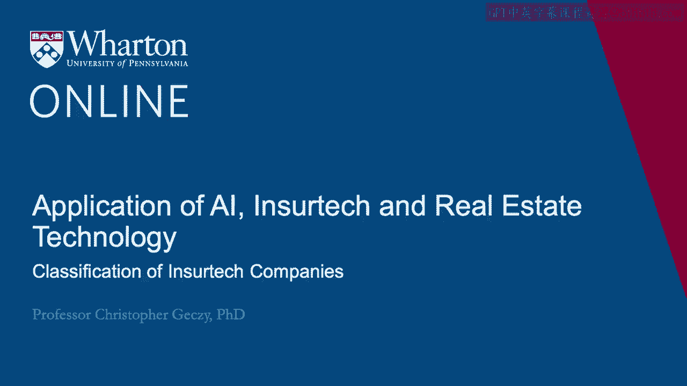
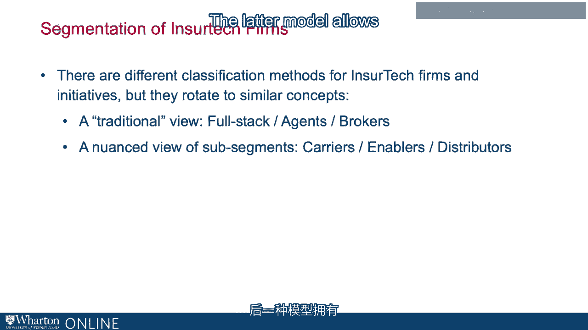
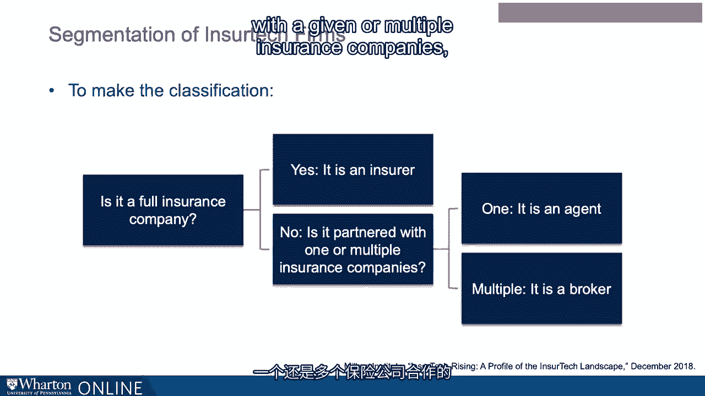
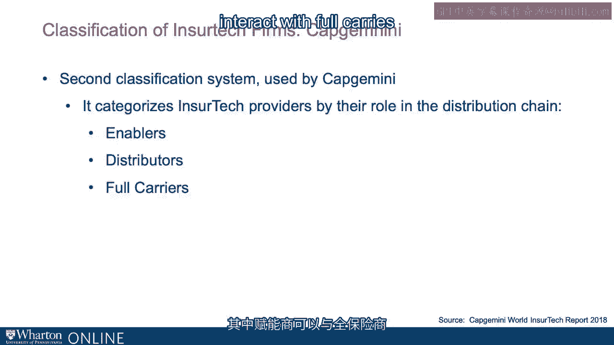
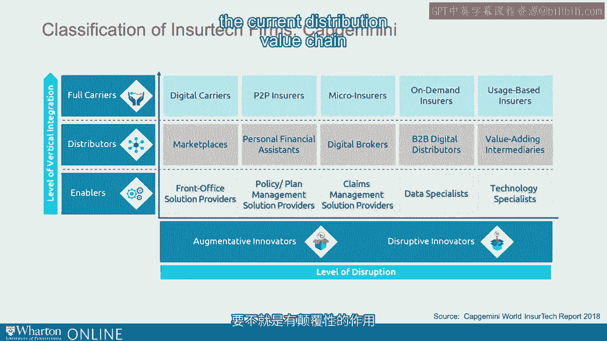

# 沃顿商学院《金融科技（加密货币／区块链／AI）｜wharton-fintech》（中英字幕） - P90：3_保险科技公司的分类.zh_en - GPT中英字幕课程资源 - BV1yj411W7Dd

 So a number of different approaches have emerged to classifying。

 in Shurtech firms， based on how the industry itself is organized。

 I'm going to talk about two of them， one originating from the Milken Institute。

 another originating from Capgemini， which is a well-known consulting firm。

 Traditional view separates the insure tech industry into full stack agent and brokerage components。

 whereas the nuanced view， which includes multiple sub-segments， puts them into three categories。

 carriers， which is isomorphic to full stack providers。

 and then more subtly enablers and distributors， which are not exactly the same thing as agents and brokers。

 but are a kind of rotation of them。 The latter model allows a significantly greater level of subtlety。

 The traditional view of full stack insurers， agents and brokers。

 classifies in Shurtech firms first into platforms that actually do underwriting。 In other words。

 they make the risk-taking decision and then assume the risk， or perhaps could sell it off to。

 in the case of an insurance company to a reinsure。

 but in most cases manages from beginning to end the insurance prospect gathering function。

 the underwriting the risk-taking， then the policy maintenance and claims process。

 The agent component of the industry reflect platforms or groups or companies that act on behalf of a carrier。

 essentially extending the carrier in the form of client-facing activity。

 Brokers specifically provide customers with policies both by traditional carriers and insure tech platforms。

 That may be in the context of being paid a commission。

 or may be narrowing or broadening of a particular area of insurance。

 Those brokerage platforms could be， for example， online and short-tech approaches to bring you traditional carriers to a conversation or to a customer decision-making point。

 or could include both traditional and insure tech providers。

 or could be only focused on technologically enabled and sure tech platforms。

 allowing or providing various sorting algorithms to provide customization。

 or product or cost competition or comparisons to clients。 It's a simple classification。

 It asks whether a given firm is a full insurance company， if it is full-stop。

 if it is partnered with a given or multiple insurance companies。

 if it's an agent stop or if it's more than one， then it's a broker。 Again。

 a more nuanced view categorizes elements of the insurance chain。

 by where they stand relative to distribution。 As full carriers， distributors or enablers。

 which can interact with full carriers and distributors at various points。

 full carriers， as in the milk and model， could be digital。 However。

 they could also be P2P or micro insurers， where segmenting the market is inherent。

 in the definition and the business model of the company。

 Segmentation can also be with respect to customization of the product。

 providing on-demand insurance services as opposed to constant insurance services。

 Distributors could be online or open architecture marketplaces。

 They could be highly customized with respect to customer demand and characteristics。

 They could be digital brokers themselves， or they could be B2B。 Finally。

 enablers could integrate into full-carry or distributor activities。

 in the way they augment or improve or address front office solutions。

 management of policies or claims， or help the full carriers or distributors do their jobs better。

 by way of augmenting or harnessing the value of data or specifics of technologies。 Drones。

 for example， as we mentioned earlier。 In other words， they are either augmentative or disruptive。

 with respect to the current。

 distribution value chain or a distribution value chain itself。 It's really three dimensions。

 if you think about it。 When looking at the three-insure tech platform types。

 disaggregated by product offering， Milken found a significant amount of dispersion。 For example。

 in the auto health or life areas， the brokerage part of the FinTech platform space was more popular。

 At least is more prevalent in the world today。 However， when we look at personal liability。

 business insurance， services related to financial planning， and retirement， endowment。

 retirement and pension， we don't see the brokerage model being as prevalent。 Full stack， of course。

 simply by the numbers， you might not expect to be as prevalent because of its large scale。 However。

 it is important to notice that except for the financial planning area。

 Milken found that the full stack platform providers were indeed everywhere。

 By way of prevalence again， in the traditional areas， auto health and life。

 along with home rental insurance， title insurance and so on， the brokerage model。

 the client-facing model， is where much of the industry has been focusing。

 at least if you look at the number of product offerings。

 One issue with the three platform description of the industry is that a significant number of insurance companies are really technology solution providers。

 focusing on at least three sub areas。 First， human resources and benefit solutions， second。

 data solutions， and third， infrastructure solutions。

 Those HR focused sub segments effectively focus on applying technology to help firms manage human capital more efficiently and cost effectively。

 Those focusing on data solutions are providing specialization in collections and aggregating vast data in order to support insurance or reinsurance carriers and others。

 to underwrite risk or evaluate risk。 And finally， infrastructure providers focusing on processing things more efficiently。

 and that can range from claims to underwriting to client-facing activities。

 providing application programming interfaces or APIs， supporting integration or customization。

 both of products and services。 As of a recent mark to market。

 the number of providers in the infrastructure and human resources areas dominated the margin。

 the number of data solution providers。 And when ChirTech has induced a rapid expansion of the type of full carriers that exist。

 Capgemini identified a number of examples of the different kinds of in ChirTech firms that we now see in the industry。

 In a very interesting way， for example， consider now the existence of digital carriers。

 which file traditional models， but are conducted partially or totally online or using mobile technology and app technology。

 And not just in the US， Zong-An does the same thing for property in China。

 P2P insurance or community-based insurance where members of an exchange or a pool put their money together to apply or to distribute group coverage。

 Riker insurance， like the example BIMA， which we'll talk more about in just a second。

 segmenting the market focusing on those who are closer to the base of the pyramid。

 On-demand activities， buying insurance as opposed to every day， just on the days when you need them。

 or usage-based insurance， when you're engaged only in an activity as opposed to along the dimension of time。

 providing insurance just when you're engaged in the risky activity that the insurance provides to。

 All of these examples are made possible by the application of technology in one way or the other。

 either through mobilization， the existence of web-based solutions。

 or based on data that can be analyzed in real time that are finally disaggregated。

 very challenging to do without the application of insured tech technology。

 Many are familiar with the distribution methodology of a marketplace online。

 essentially a site that allows individuals or those who are signing up or using the services to compare policies。

 products， pricing across potential providers。 It's more of something that you sign up for。

 It's a pull technology。 A push technology or personal financial assistant technology allows customers in a highly customized format to manage policies to receive recommendations on coverage。

 on plans， on characteristics， so that in a one-stop setting。

 the customer can optimize their coverage and change it if the need arises。

 Digital brokers allow direct comparisons， and in some cases， purchasing of policies。

 and then distribution distributors typically focused on commercial arenas allow very technical comparisons for businesses that have different needs。

 Finally， value-adding intermediaries， which are perhaps some of the newest arrivals in insured tech。

 are in a push technology using techniques， including social media platforms。

 to proactively connect potential customers who are similar in their purchasing potential。

 their perspectives on insurance， and their insurance needs to help them pool their payments。

 or to negotiate with carriers。 Enablers address the entire value chain from traditional carrier activity through new arrival and shared tech carriers。

 either helping improve processes and solutions in the front office， in policy and plan management。

 in claims management， in connecting data external as well as internal data for carriers。

 or applying external technology like drones and digital picture capture and integrity verification。

 enabling， if you will， the traditional and new activities of carriers and those along the distribution value chain。

 So as you can see， wherever we look in the distribution chain， whether it's for full stack carriers。

 distributors or enablers， in shared tech is rapidly infiltrating， supporting， expanding。

 ultimately for the betterment of the industry， as well as the policy owner and the consumer。

 the customer experience。 It's no surprise then that we see how rapidly the value of the industry is expanding。

 and that's what we'll talk about next。 [BLANK_AUDIO]。

