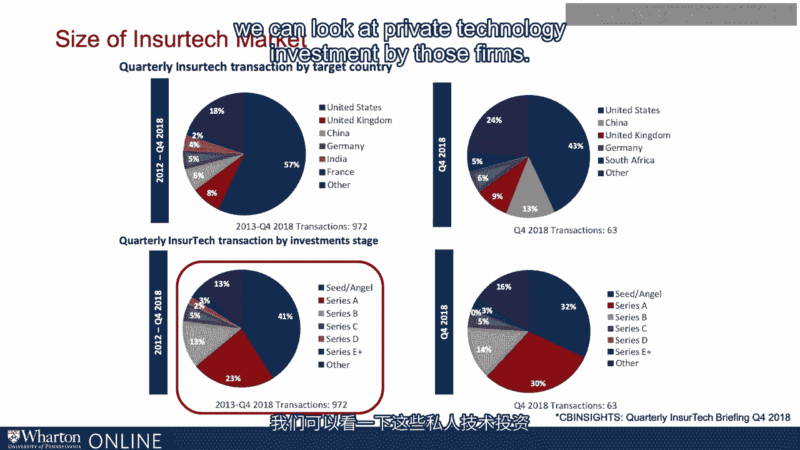
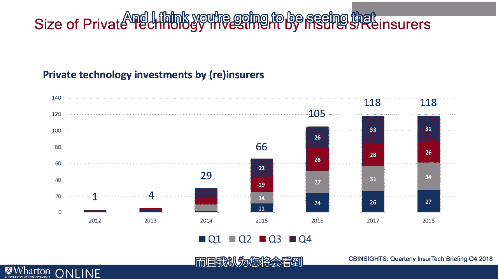

# 沃顿商学院《金融科技（加密货币／区块链／AI）｜wharton-fintech》（中英字幕） - P91：4_保险科技行业的投资市场规模.zh_en - GPT中英字幕课程资源 - BV1yj411W7Dd

 One of the most exciting things in insurance today， but also something I suspect has some。

 in the industry fairly terrified， is how rapidly insured tech is growing and becoming。

 not just a maybe but a must for current carriers， current distributors， current enablers。

 As money has flowed in and the possibilities， the dreams that insured tech represents have。

 become closer to reality。 Getting a handle on the size of the market is a bit of a challenge。

 however， what seems， to be clear is that it's large and growing。 For example。

 one recent estimate of the size of the industry， this is in 2018， is that revenue。

 was already about half a billion dollars and that's a significant number if we consider。

 the growth of the industry which we'll show you in just a second from just a couple years， ago。

 Some have suggested that the cumulative growth rates over the next five years will see it。

 reach about $1。2 billion in revenues by 2023。 Across the world。

 the Asia Pacific or APAC regions will likely have the greatest growth。

 rate in part because of the growth in financial hubs like Singapore and Hong Kong， Mumbai。

 and elsewhere。 In fact， the sub-segment of health insurance is expected to have the highest growth rate。

 again by some。 Others have suggested that the industry is growing by the metrics of investments。

 In 2017， total insure-tech investments surmounted $3 billion with about 200 deals having been。

 done during the year。 Over 80% of those involved in insure or reinsure making the investment。

 Industry natives investing in technological advancements in the industry at some point。

 along the value chain。 The estimates for that level of investment was forecasted to be a 45% growth rate。

 In terms of the market for corporate control as well as venture capital and private equity。

 investments， you can see dramatic growth。 From 2013 in just about 90 deals having been done to 2017 and just out of 260 deals being。

 done。 Recent private investment seems to have peaked in 2016 but still remains substantial at just。

 under $6 billion in 2018。 When we drill down both by segment and by geography into some of these numbers。

 we see， that really is a global phenomenon and also is not just a health insurance phenomenon。

 Although we saw a slight decline in global private investment and investment activity。

 from venture capital and private equity firms in the last year， if you look at it a little。

 bit longer horizon comparing 2015 to 2017， the number of startups has absolutely skyrocketed。

 During the SMA， we count something like 50 in 2015 or as we now count almost 1200 at some。

 point launching in 2017。 AXA， the global insurance company。

 identifies at least six different areas of disruption。

 for the insurance industry in its insurer tech entrance。 Mobile platforms， home office connectivity。

 P2P and sharing economies， connected health， blockchain， connected cars and so on。 IoT。

 all disrupting the insurance industry。 Mobile platforms allowing products to be distributed。

 bought and sold。 Home offices and homes in general connecting back to the kind of information aggregation。

 that for example property and casualty insurers might like。 For example。

 monitoring the status of a home。 Take connected health。

 being able to isolate people's bodily functions or state of their， being or take connected cars。

 Being able to reroute traffic and understand traffic patterns where the ability to drive。

 more safely might arise。 Of course， blockchain with data privacy and data integrity at the heart of the insurance。

 industry。 Mad junk to these trends in insurer tech is the movement of business processes。

 data aggregation， sharing and so on to the cloud。 For a recent survey from OVOM。

 the increase in software as a service， SaaS， really most， of it in the cloud。

 grew from about 13% in 2016 to 26% doubling in 2018。

 What they identify at around the same order of magnitude is claims systems， processing， data。

 fraud detection systems and customer relation management and marketing systems all。

 moving to the cloud。 Embracing， perhaps some would say by necessity。

 this new modus of cloud based software as a， service。

 And of course with the advent of ongoing data sharing， aggregation， collection and dissemination。

 its integrity is on everyone's mind。 Blockchain has as good an application in insurance as anywhere else。

 So we can see examples。 AI Hong Kong recently launched an application to share very private life insurance policy。

 data with its distribution chain using blockchain secrecy technology。

 The insurance company AXA in Europe offers specific insurance， flight delay insurance。

 organized on a blockchain platform with smart contracts。 OVOM's annual survey， again。

 highlighting the growth in the space。 Carriers and consortiums。

 collections of carriers are almost surely going to increase the use。

 of blockchain along the entire value spectrum and insurance because of concerns around data。

 technology and what it provides for the ability to in real time aggregate to simulate and。

 change contracts to be specific and customized。 For example。

 in the fourth quarter of 2018 over 63 insured tech deals were announced in。

 the United States at about a billion， six in value compared to one year before that。

 That was a 24% increase in deal count and an increase in funding volume by just under， 160%。

 Those 63 transactions surmounted those in the third quarter but were lower than Q1 and Q2。

 Around the globe in the UK we saw some variation down 9% from the previous quarter with China。

 being the second largest investor after US based flows。

 Since 2012 the UK has been responsible for under 10% of total investments。 That having been said。

 investment from international markets still remains strong。

 XUS transactions represent just under 50% about 43% of total transactions since 2012 and just。

 under 60% since the fourth quarter of 2018。 Very early stage investing remains strong which makes these numbers even more impressive。

 Very early or seed stage investments as well as first post seed round known as Series A。

 account for just under 65% of total transactions since 2012。 In addition。

 insured tech funding is maturing。 Mid and later stages were about 45% of financing in 2018 via Series A。

 B or C stages。 We'll see what happens next but it's reasonable to expect consolidation as time moves on。

 Across segments P and C otherwise known as property and casualty insurance increased。

 its funding volume by just under 60% in 2018 Q3 and in Q4 up by 90%。

 That marked 41 property and casualty transactions just a little higher than the 40 transactions。

 in Q3 but a 52% increase over the prior year。 Life and health as we mentioned earlier one of the largest areas of insured tech focus。

 was a 362% increase from the fourth quarter of 2017。

 Deal count increased overall by 10% from Q3 and funding volume increased by 26% again。

 in life and health。 To get a bit of a more of a refined view of the time series pattern take a look at CB。

 insights historical record for funding volume across all stages here going back to 2012。

 when really this is a life and health arena。 With the exception perhaps of the second quarter of 2012 as time moves on you can see。

 property and casualty came to the game and we see dramatic growth across the entire industry。

 You don't need a regression model but perhaps could use the ocular technique to see perhaps。

 a structural break around 2015 and then ever increasing funding volume reaching that $1。6。

 billion mark in the fourth quarter of 2018。 The geographic detail points out a couple things。

 First the United States over the previous five years represents the greatest preponderance。

 of transactions by way of target country。 That seems to be true in the fourth quarter of 2018 as well as over the last five years。

 The UK， China and Germany followed by India and France represent the remaining top players。

 again by target country in the ordering remains fairly constant in the last quarter of 2018。

 With respect to stage of the investment what we saw in the last five years namely that。

 seed and angel rounds were larger by comparison to series A also remain true in the fourth。

 quarter of 2018 with series B and series C being dramatically smaller。

 When we look at the pattern of in shirt check transaction by investment stage over the last。

 five years we see that the seed and angel stage financing was by far the largest component。

 followed by series A， B and C。 That pattern remained true in the most recent data from the fourth quarter of 2018。

 Again the later stage financing series D， E and so on and later stages have not yet ramped。

 up in the industry which makes sense given the pattern across time that we saw in the。

 previous graph。 It also again raises the possibility of consolidation as companies and efforts move through the various。

 stages of maturity in this part of the industry。 An important question that you might be wondering about is what the incumbents are doing。

 That's an interesting question to ask in all industries。

 If we're thinking about startups or disruptors affecting an industry we look at the data we。

 just did。 If we're thinking about what the insurance industry has been doing we can look at private。

 technology investment by those firms。

 If we look at the pattern across time of incumbent investment we see that it was essentially。

 nascent if we go back to 2012。 We only saw essentially one deal in the fourth quarter。

 However by 2014 we saw just under 30 by 2015 we saw 66 and then by 2017 and 2018 we saw。

 almost 120 deals。 Another way to interpret this is that outside disruption was putting pressure and has been。

 putting pressure on insurance incumbents and insurance incumbents by acquisition or by。

 direct investment have now joined the party。 Again the question wasn't if but when the current incumbents invested or purchased into。

 the FinTech space。 I think you're going to be seeing that continue to increase as time move forward。

 [BLANK_AUDIO]。

