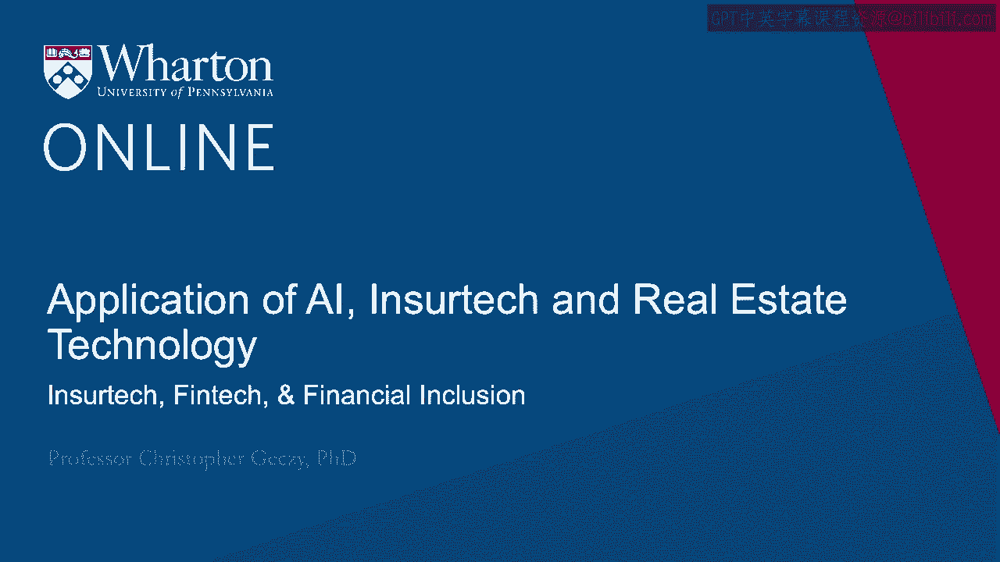
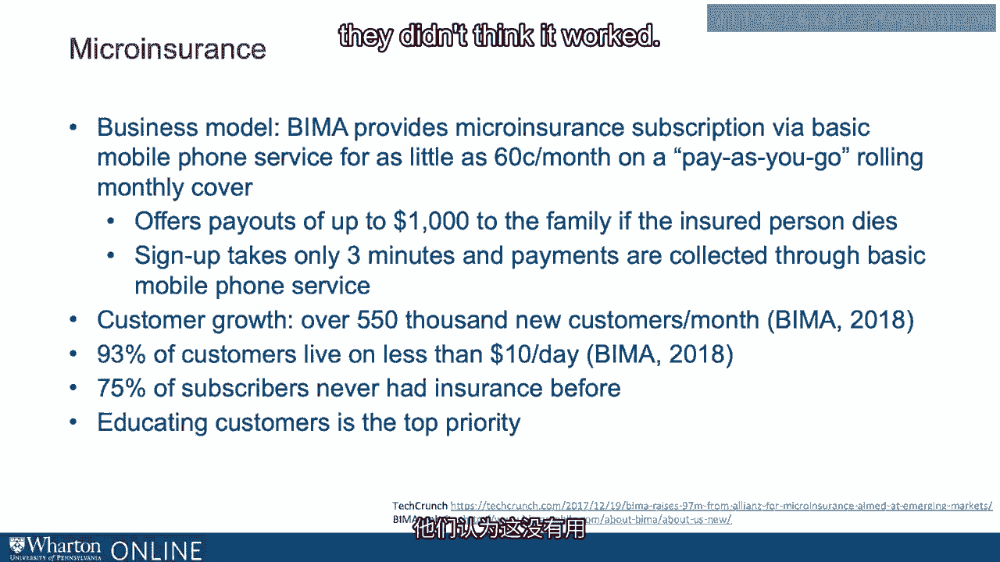
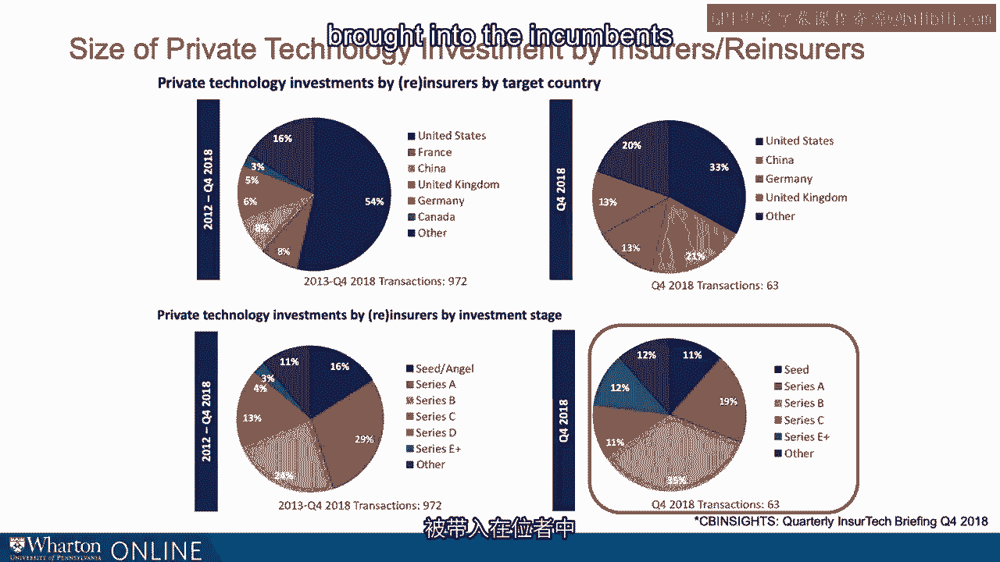

# 沃顿商学院《金融科技（加密货币／区块链／AI）｜wharton-fintech》（中英字幕） - P92：5_保险科技、金融科技与金融普惠.zh_en - GPT中英字幕课程资源 - BV1yj411W7Dd

 One of the most interesting and gratifying areas that ensure tech has made a difference。

 and perhaps FinTech more broadly has made a difference， is that the so-called base， of the pyramid。

 Where technological advancements have allowed the reaching out to markets that have traditionally。

 been underserved。 The definition of the base of the pyramid。

 some would say by the CK-Prahalad notion， four or five or some would say six billion people around the world living on less than。

 two dollars equivalent per day， represent what one U。S。 president described as the great。

 powerful mass at the base of the economic pyramid。 Those who are underserved。

 those who are challenged by the iron ring of hostile environments， where direct insurance。

 which could ensure away some of the risk is the hostile environment， are either impractical。

 expensive， or not profitable to provide。 A leading example of an enterprise focusing on the base of the pyramid is the Mid-Yarn。

 Network， which was founded by Pierre Midyar in 2004。 Midyar， as many of you know。

 was the co-founder of eBay。 It's an interesting model。

 It's a nonprofit-profit model that combines a four-profit limited liability company with。

 a 501(c)(3) organization in the U。S。 that makes grants。

 It's either donated or invested more than $1。5 billion since its inception。 It's $1。5 half。

 $676 million of for-profit investments， just under $800 million in grants。 Targeting micro-finance。

 micro-insurance， infrastructure， and technologically enabled， activities focused， again。

 on the base of the pyramid， much of which could be classified， as FinTech。

 One example via investments in LeapFrog is specifically micro-insurance。

 Inter-insurance is the provision of insurance products or services to low-income， low-net-worth。

 population who would otherwise have limited access to insurance but who have tremendous， needs。

 They could be exposed to challenging geopolitical environments or histories。

 harsh physical environments， perhaps exposed to earthquakes， pestilence， fires， volcanoes。

 or they could be exposed， to geopolitical challenges as well as poverty。

 The kinds of products that have been provided by micro-insurance range from traditional term。

 life policies but also the kinds of policies that focus on risks that are especially specific。

 to the base of the pyramid， namely， accident insurance and disability insurance， which。

 if not otherwise provided， could see a family highly exposed to a given wage earners' physical。

 health， casualty insurance， ensuring crops and livestock， and ensuring against earthquakes。

 and tsunamis and natural disasters， even these days expanding to savings plans。

 The kinds of insurers who are involved today are large multinational insurance companies。

 like Tokyo Marine， Credit Unions， or other mutuals， governments， NGOs， and also small。

 community organizations and regional insurers。 The benefits of micro-insurance are traditional。

 The pooling of risk， providing financial protection in a traditional manner。

 But also allowing those who are insured to take risks that provide betterment in their， lives。

 For example， drought insurance， providing the ability for small farmers to withstand the。

 shock that would otherwise wipe them out， who have natural exposure to variation in， weather。

 Or safeguarding families from falling back into poverty from the death of a breadwinner or。

 having a destroyed house。 The Indian Ministry of Health found that 25% of all hospitalization in India pushed individual。

 or families into poverty due to the cost of treatment。 We could also target specific populations。

 For example， in South Africa， all life， which is a subdivision of Sanlam， has focused on providing。

 insurance to those who are already HIV positive or those living in flood zones or to micro-entrepreneurs。

 Micro-insurance is also valuable because it can complement other social welfare programs。

 or bolster other so-called micro-finance activities。 For example。

 the ability to assign a term life policy to secure a business or a mortgage， loan。

 A very interesting example is BIMA， which is an insurance tech leader and some would say。

 an insurance business disruptor。 It's a mobile insurance and health company that provides accident。

 life and health insurance， to low-income population members in 15 African-American and Asian and Latin American countries。

 With its largest markets in Ghana and Sri Lanka。 How does it do it？

 It provides insurance underwriting and customer interaction using mobile technology。

 Micro-insurance subscriptions via cell phones。 The BIMA business model is a Pay as You Go subscription model enabled by mobile phone technology。

 The products which can cost as little as 60 cents a month in the Pay as You Go rollover。

 approach offers payouts up to $1，000 to a family if the insured person dies。

 It's a streamline model。 It takes only three minutes to sign up and the payments are collected through mobile phone。

 services using local country technology。 Simply BIMA has indicated that it has grown by over 550。

000 customers a month and that， the overwhelming majority of those customers live on less than $10 a day。

 And in fact， three quarters of them have never had insurance before。

 There was that BIMA tell us that one major component of their offering is educating customers。

 on how life insurance works because many of them had simply never been exposed to it and。

 faced a trust gap because they've never been exposed。

 They didn't think it worked。 They needed to be shown by example。

 BIMA recently received a $300 million valuation at the sale of leapfrogs staked to alliance。

 the European insurer for almost $100 million。 There are some subtle differences when we consider what the incumbents have been doing。

 with respect to investment around the globe or with respect to maturity of investment they've。

 been making。 Clearly in the last five years technology developed in the United States has led the fray。

 54% of private technology investments by insurers themselves have focused on the United States。

 That has been diversifying however compared to the last five years。 For example。

 in the last five years 54% of private technology investment by incumbents。

 has been in the United States whereas in the fourth court of 2018 only 33% has been。

 21% was in China 13% in Germany and 13% in the UK compared to 8 and 6 over the last， five years。

 In other words we see a rapid internationalization of investment targeting by those who are moving。

 quickly to ramp up as incumbents。 We also see that they are investing further along the life cycle of the companies targeted。

 Only 16% of investments were seed or angel stage whereas 29% and 24% respectively were。

 Series A or Series B。 It's not that surprising that incumbents are outsourcing technological development and。

 we can see that trend continue in the most recent time period when 35% of targeted investments。

 fell into the Series B classification。 This is a pattern that we see in other industries historically where independent disruptors。

 those who finance and carry out innovation are brought into the incumbents as the incumbents。

 respond to the disruption。 And Shirtec is an outstanding example of that pattern。 [BLANK_AUDIO]。

