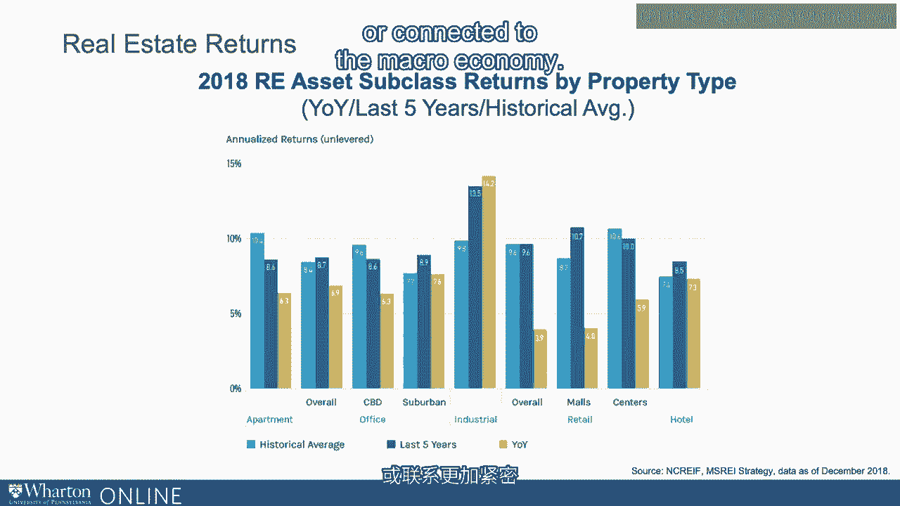
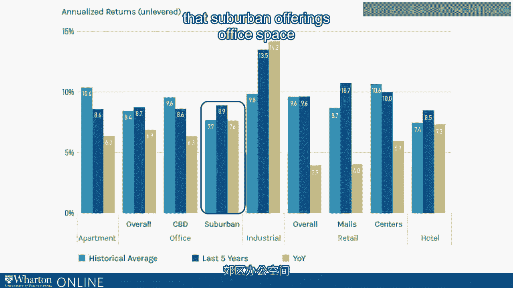
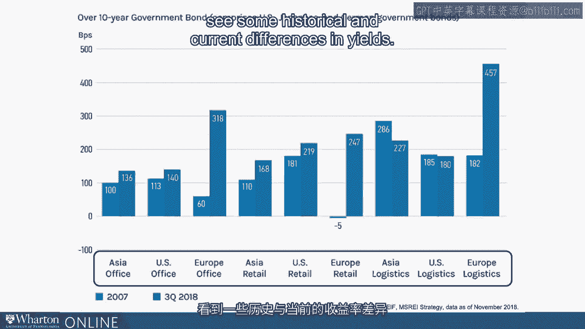

# 沃顿商学院《金融科技（加密货币／区块链／AI）｜wharton-fintech》（中英字幕） - P93：6_行业背景.zh_en - GPT中英字幕课程资源 - BV1yj411W7Dd

 Hi， welcome back now to our next lecture in our FinTech module called real estate tech。

 or a retech in some in some parlances。 Real estate is an incredible interesting area in part because of the size of the space by。

 almost any measure real estate which is sometimes classified as a so-called alternative investment。

 is vast as an asset class， as an area of interest and certainly as an area of identified interest。

 with respect to FinTech digital methods and technologies and also interest by those who。

 overlap in both areas。 It's called alternative although depending upon your phenomenology or your metaphysics。

 you might presume that real estate preceded humanity。

 Here in other words was probably real estate before humans。

 Real estate around the globe is a large area getting a handle on exactly how large either。

 with respect to market cap or valuation or returns is a challenge in part because of。

 its vast nature。 How we define it， how we track it and so on but what's clear is that it's very large。

 To give you a sense around the globe sales of commercial properties as of a most recent。

 market market here fiscal year 2017 was almost a trillion dollars， US dollars obviously。

 Within United States just the commercial section of what we call real estate asset classes。

 in fiscal year 2017 was about $376 billion in the US。

 That's about 57% of the total around the globe。 Another area which we'll define in a second the residential sector for real estate saw。

 5。3 million homes， what are called existing homes and almost 670，000 new homes being， sold in 2018。

 That's a measure of size by volume of trades or transactions。 There are about 86。

000 real estate brokerage firms in the United States。

 Again from the most recent economic census data we have available to us and 2 million。

 active real estate licenses that is to say those who are qualified as brokers to sell。

 real estate in the United States。 It's big by many different measures from many different perspectives。

 In addition many professional asset allocators and investors are expecting real estate to。

 expand although there are some immediate concerns about what some would call bubbles in certain。

 areas。 Increasing allocation to real assets as part of investment plans has been democratized。

 You might have heard of the famous endowment model followed by university endowments and。

 foundations that allocate to tangible asset classes of which real estate is at the heart。

 or even individuals who might purchase real estate in some sense。

 Although there are some trends against some demographics especially in the US especially。

 those we might call millennials as we've discussed who have differing preferences over。

 owning some areas of real estate。 Initiation or rate of return or ROR has been ongoing and positive in the US and around。

 the world over recent historical periods。 On the graph you see in front of you is what we call the neck-craft data moving across。

 multiple what we call sectors in real estate apartment buildings office buildings or office。

 spaces industrial properties retail properties and then hotels roughly speaking although。

 variance is going to occur generally thought to be from lower risk on the left to higher。

 risk less pro-cyclical on the left to more percyclical on the right in other words more。

 attuned or connected to the macro economy and then within those sub sectors suburban office。

 space versus central business district or CBD malls versus retail centers or apartments。

 and hotels treated separately。 What you see is over longer term data available historical time periods real estate overall。

 has produced returns that are of the same order of magnitude say of US or global equities。

 You can see apartments have including all returns that is coming from cash flow plus price appreciation。

 has been around 10 percent。 In the last five years is a little bit less around 8。

6 percent and over the most recent， year available 2017 to 2018 about 6。3 percent。

 There is variation across classes industrial properties have appreciated on average more。

 than we might say that suburban office space in the aggregate as appreciated less but one。

 things clear it's been positive it has been positive across diverse kinds of real estate。

 it's been an area of organic growth。 It's not to say though that that's resulted in forward looking valuations that are at。

 historical peaks in fact one way one statistic useful for measuring by the either expected。

 real estate returns or current what are called yields on real estate are to look at cap rates。

 Cap rate stands for capitalization rate and it's essentially the rate of cash flows coming。

 from a property scaled by the value of the price of the property。

 It's often compared to a dividend yield in stocks or a yield on bonds here you can see。

 a rate spread compared to the 10 year government bond yield as of the third quarter of 2018。

 and the end of 2017。 It's a comparable spread in part because real estate is often held over longer holding periods。

 than say a typical stop can or might be held although certainly people hold stocks for a。

 year and it serves as a benchmark spread。 Real estate has and is expected to earn based on current cap rates more than US government。

 bonds but those spreads have actually decreased in very recent times。

 Still in part because of risk in part because of for living expectations they tended to have。

 yields or cash flow percentages above US treasuries。

 And as you can see there's diversity both across type of property and geographic location in。

 the yield spreads。 For example although they're of the same order of magnitude office space in Asia or Asia。

 Pacific in the aggregate has earned or is expected to earn on the basis of capitalization。

 rates greater yield than office space in Europe。 So again across office retail and other spaces in Asia US in Europe we do see some historical。

 and current differences in yields。 [BLANK_AUDIO]。

