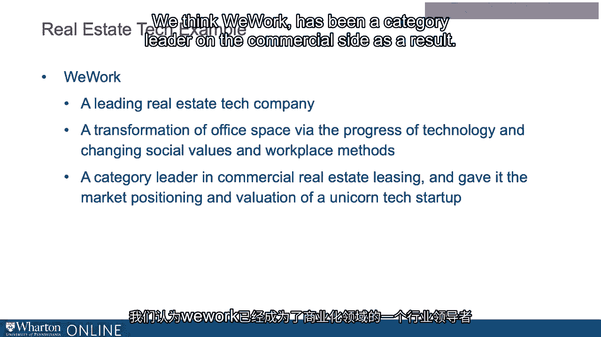

# 沃顿商学院《金融科技（加密货币／区块链／AI）｜wharton-fintech》（中英字幕） - P94：7_房地产科技是什么.zh_en - GPT中英字幕课程资源 - BV1yj411W7Dd

 Now， what is real estate tech？

 How do we define it？ Well， just like in other spaces of FinTech broadly。

 there are all kinds of categories， acronyms， names that come to bear。

 We're calling it real estate tech， but you could call it a real tech， prop tech， proptology， retech。

 CRE tech， which is commercial real estate tech， and in part， it's challenging to put。

 a specific overarching name on it because the segmentation of real estate technology and。

 how it's being manifested in startups or companies adopting technology is bifurcated， either。

 on the commercial side or the non-commercial side。 The commercial sector， CRE。

 or residential sectors of the industry， we're just going to， call it real estate tech broadly。

 even though there are very different players and very， different characteristics。

 And we know of relatively few companies that currently span both spaces。

 So one way to think about the industry given this challenge is to rotate the definitions。

 a bit and focus either on being additive， focusing on operational efficiency， or on disruption。

 by way of creating， say， new platforms。 And in fact， maybe some examples could help illustrate。

 One company that's been around for quite some time in which many follow is a firm called， Zillow。

 It's not necessarily today thought of as providing a revolutionary technology， although。

 I'm sure there are those who would disagree。 And that's in part because online platforms， portals。

 aggregators for listing of residential， properties or multi-family or land as Zillow lists have been on the scene since the 1990s。

 And we're developed in the late 1990s， mid and late 1990s。combo。

 Zillow has combined a bunch of different functions and ultimately connected back to brokers。

 expanding data access， democratizing data access for those who are buying or selling。

 as well as connecting to brokers to become a market leader。

 Zillow said the other day and their Zillow's compatriots， realtor。com， Redfin， and of。

 course others that I'm leaving out， but which are also leaders， are useful to understand。

 what your own properties are doing or as they said， their spouses spending their time looking。

 at their neighbor's properties， giving a kind of democratized view into regions and。

 to individual properties， into being able to search and ultimately aggregate functionalities。

 in a one-stop shop。 Another one on another side of the business is a little bit more， let's say。

 transformative， by way of introducing a brand new methodology。

 We work and we'll talk more about we work in a second。

 It's often considered to be not just a provider of real estate， transitory real estate or real。

 estate services， but a real estate tech company。 The concept of shared workspaces。

 either rented or leased， that's been around for decades and， decades。 Of course。

 it's a platform technology， it's app based， so it's not like it's necessarily。

 bringing brand new deep learning technology to the game。

 It's a transformation of office space via the progress of technology and also linking back。

 into social values and workplace methods。 We think we work has been a category leader on the commercial side as a result and of。

 course we all know it now as a unicorn startup。 [BLANK_AUDIO]。

