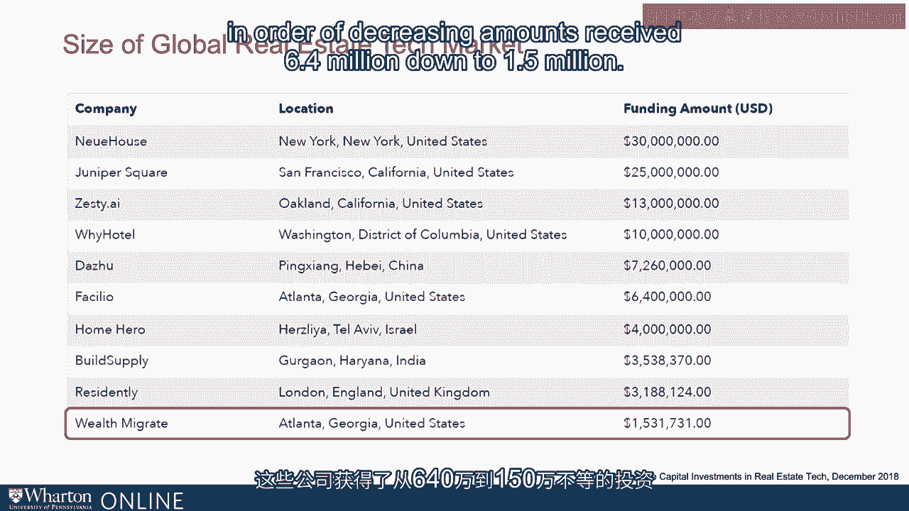
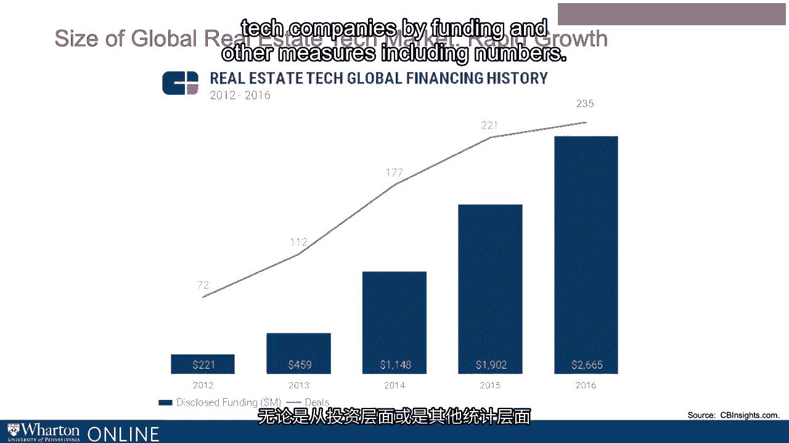

# 沃顿商学院《金融科技（加密货币／区块链／AI）｜wharton-fintech》（中英字幕） - P95：8_全球房地产科技市场规模.zh_en - GPT中英字幕课程资源 - BV1yj411W7Dd

 So what can we say today about the level or change in the size of the global real estate。

 tech market？ Again， depends upon your perspective and where we look in the value chain of real estate。

 or within a given category versus another。 We can look at tech companies funded。

 We can look at the amount of the funding。 We can look at examples。

 What we found was that a couple or a few dozen， depending upon the statistic， companies were。

 funded in the last part of 2018。 Take November， December。

 each saw something like two dozen real estate tech companies。

 having been funded to the tune of somewhere between three billion and 108 million for funding。

 levels。 The biggest amount raised globally was $30 million by Newhouse， Juniper Square and Zesty。

 with median funding being much smaller around $3。2 million in December 1。4 in November。 Newhouse。

 the company that received a reported $30 million in funding is located in New York。

 Whereas Juniper Square is located in San Francisco， receiving $25 million and again Zesty from。

 Oakland， California at $13 million。 Y Hotel， again a U。S。

-based company just eclipsed Dazu from King Jing， Hime China， which was， at $7。3 million。 Fosselo。

 Home Hero， Build-Suppai， Residentally and Wealth Migrate in order of decreasing。

 amounts received $6。4 million down to $1。5 million。

 This pattern of funding is part and parcel of an ongoing trend and if we look at the industry。

 tracking organization CBInsights。com， you'll see that what was aggregated in 2012 at approximately。

 72 deals worth $221 million was along a path of increase in 2013， about 112 deals， $460。

 million through 2016， 235 deals worth $2。7 billion。 So if you patch the data together。

 you can see ongoing spread， ongoing investment， ongoing。

 preponderance of real estate tech companies by funding and other measures including numbers。

 [BLANK_AUDIO]。

