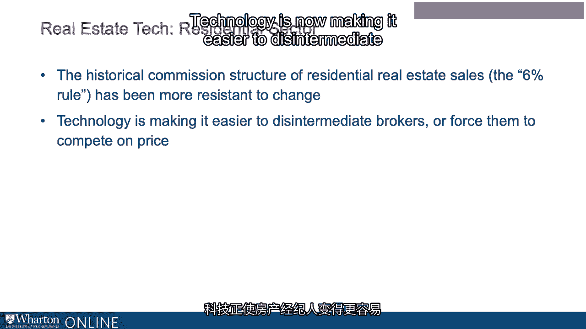
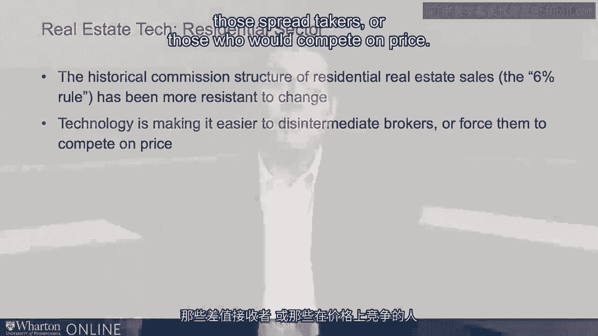
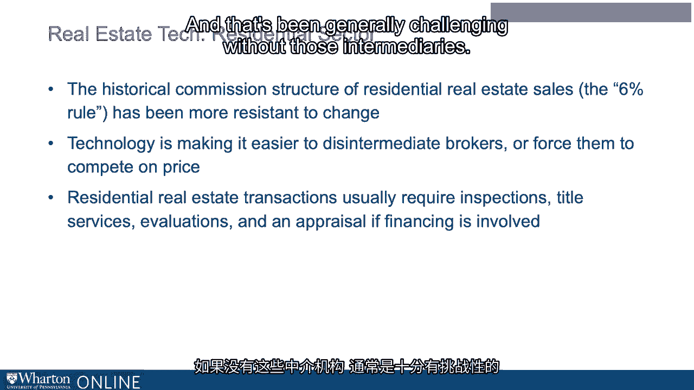

# 沃顿商学院《金融科技（加密货币／区块链／AI）｜wharton-fintech》（中英字幕） - P96：9_典型的房地产科技公司.zh_en - GPT中英字幕课程资源 - BV1yj411W7Dd

 It's useful to look at examples， in part because of the way the industry has evolved。

 First， with operational efficiency companies。 And then secondly。

 especially more recently with disruptors。 We started by looking at Zillow and WeWork。

 You could also have looked at Trulia or LoopNet or others or WeWork and its competitors。

 Let's take a look at a couple of those。 First， focusing on the residential real estate sector。

 The residential sector has long maintained a pricing system and data availability industrially。

 The MLS services or multiple listing services has been in place for decades and has been。

 run by local affiliates of NAR the National Association of Realtors。 It's a trade organization。

 Without access to so-called MLS data， historically it's been a challenge to do important exercises。

 like creating comparables or ultimately shopping for purchases or understanding what market。

 trends are for those who are selling their properties。

 Realtors historically have had what is in essence special access which has been addressed。

 by some of the players we've mentioned already。 Today。

 the multiple listing services is still owned at least in part by the NAR but there。

 has been pressure and of course the advent of business models like we've mentioned Zillow。

 and Trulia and LoopNet and Redfin such that the MLS data has been made available。

 It's been democratized。 The aggregators have had access to now bring their business models out to both consumers。

 and those intermediaries who serve them in accessing， selling and buying real estate。

 Where we might have expected disruption to see its greatest influence say in the historical。

 commission structure in real estate both residential and commercial。

 In some areas known as the 6% rule， there's a 6% commission on some real estate split by。

 buy-in seller brokers。 That's been fairly resistant to change。 That even said。

 again coming back to the model of operational efficiency and/or disruption。

 technology is now making it easier to disintermediate those spread takers or those who would compete。

 on price。 It's been possible， although it's been very challenging without a broker to be involved。

 in the real estate market and many many people do that every year without paying a commission。

 but it's been a challenge in part because of the barrier to entry in areas like pricing。

 and knowing what's going on in a given market。 In part that's because residential real estate transactions require a host of adjunct activities。

 including inspections， title services， valuations， appraisals and so on and that's been generally。

 challenging without those intermediaries。

 [BLANK_AUDIO]。

