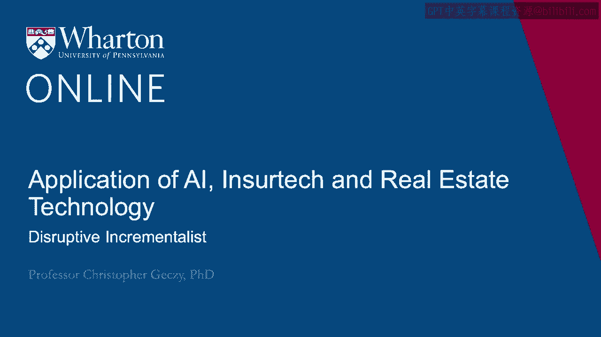
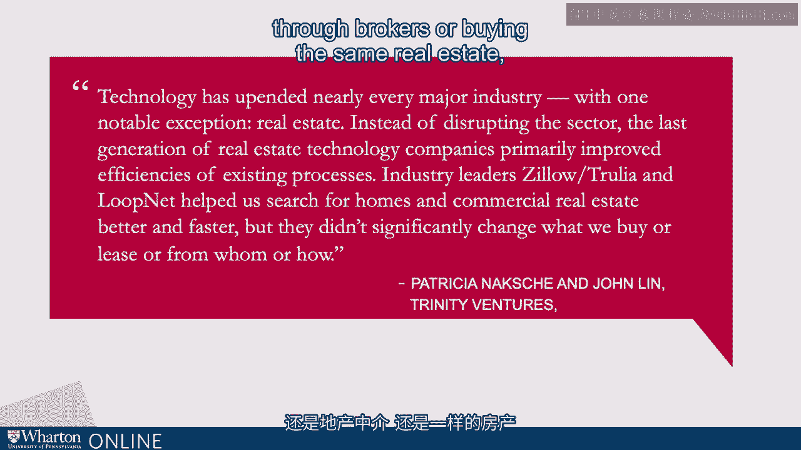
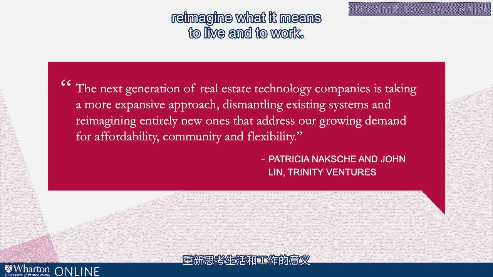

# 沃顿商学院《金融科技（加密货币／区块链／AI）｜wharton-fintech》（中英字幕） - P97：10_颠覆性的渐进主义者.zh_en - GPT中英字幕课程资源 - BV1yj411W7Dd

 Some market participants have really underscored this difference， this distinction between adding。

 operational efficiency or to some degree democratizing of MLS style listings or disruption。

 Some say that what has led to the situation today， the legacy pathway of real estate technology。

 only recently has led to disruption instead of emphasizing what I would call incremental。

 efficiency or operational improvements。 Recently two venture capitalists from the firm Trinity Ventures wrote the following on a。

 blog and I thought it was well-phrased。 Technology has upended every major industry with one exception。

 real estate。 Instead of completely disrupting the sector， my emphasis added there。

 the last generation， of this technology primarily improved existing processes and platforms。

 Certain industry leaders like the ones that we've discussed， for example Zillow， Trulia。

 Lupnet Redfin， Realtor。com and others， help us search for homes， commercial real estate， better。

 faster with greater reach and efficiency but it doesn't necessarily change the underlying。

 economic characteristic that the industry is based on。 What are we buying？ What are we leasing？

 Who are we doing it from？ Those are traditional players。 Through brokers。

 we're buying the same real estate， we're selling the same real estate and。

 so on。 The next generation however they proffer is more likely to take an expansive approach。

 dismantling systems， reimaging what it means to live and to work。

 You could even suggest that firms like Airbnb are really real estate technologies and I。

 wouldn't necessarily disagree with that。 They would thus say I would presume that the disruptive state is now upon us and we'll see。

 much more of that in the present and going forward where there are fundamental shifts。

 in how we conduct ourselves， where and how we live and where and how we work。 [BLANK_AUDIO]。

