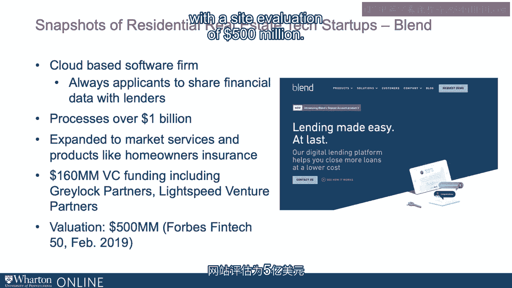

# 沃顿商学院《金融科技（加密货币／区块链／AI）｜wharton-fintech》（中英字幕） - P98：11_住宅房地产科技创业公司.zh_en - GPT中英字幕课程资源 - BV1yj411W7Dd

 Again， it's useful to consider what recent startups look like to get a sense of disruption。

 versus incremental advantage。 Take for example， Blend。

 Blend is a cloud-based software from Vasten San Francisco， which essentially allows those。

 who are seeking mortgages， applicants to share financial data with lenders to cut down on。

 the deadweight cost of approvals， seeking for example real-time financing。 On a daily basis。

 Blend reports that it processes more than a billion dollars。 And now by the way。

 as you might expect， is expanding its business model to market services。

 and products like homeowners insurance。 Reportedly。

 Blend received about $160 million of investment funding from some well-known， venture capitalists。

 Bukreya Luck Partners and Lightspeed， with a cited valuation of， $500 million。

 Lending Home is a lending platform， what we call "Robo Lending，" offering intermediate。

 term loans for active participants， some would call those house flippers。

 Those are essentially underwritten by accredited investors or essentially millionaire-level。

 providers of capital through the platform as well as institutional investors。

 One might wonder hedge funds and so on。 Lending Home has funded more than $3。5 billion in loans。

 according to what it's reported， having received almost $170 million in VC funding from the well-known foundation capital。

 which I believe also funded many other successful companies including Netflix and RIBIT Capital。

 the valuation being around $1 billion。 Open Door is a company relying on big data technologies。

 artificial intelligence algorithms， to value homes and to buy them in almost two dozen cities。

 charging the seller and fixing， up and reselling those homes。

 One of the long-term service providers and stalwarts in the real estate technology area， Zillow。

 has also entered the business。 About $1 billion in funding， with about $400 million from SoftBank。

 at a valuation of $1。

 billion。 Substantial players in different parts of the value chain providing different kinds of services。

 either adding substantial value or disrupting an ancient industry。 [BLANK_AUDIO]。

