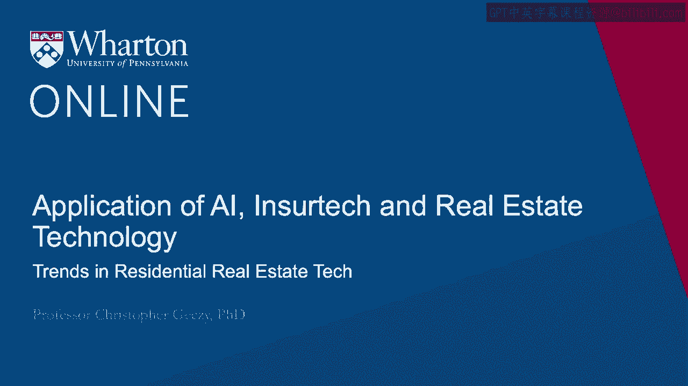
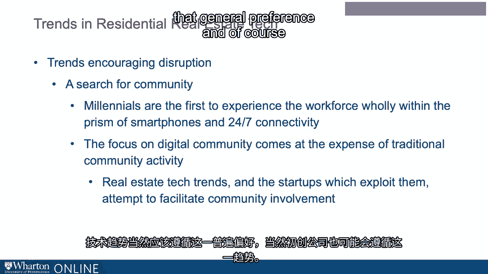
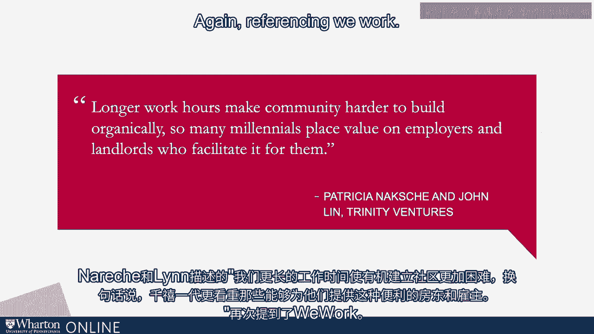
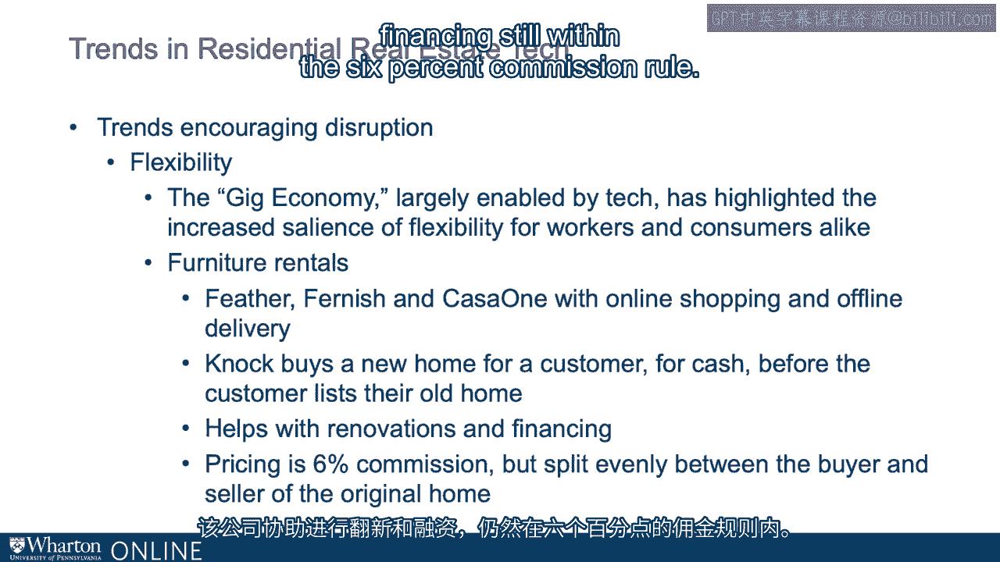

# 沃顿商学院《金融科技（加密货币／区块链／AI）｜wharton-fintech》（中英字幕） - P99：12_住宅房地产科技趋势.zh_en - GPT中英字幕课程资源 - BV1yj411W7Dd

 Some of the same pundits we've referenced already also highlight significant deltas。

 in the residential marketplace， essentially demographic changes， emphasis on certain。

 preferences in transaction type or outcomes that are really resulting in some of the disruptions。

 focusing especially on the financing side but not limited to the financing side of real。

 estate transactions。 Affordability， for example， referencing millennials who reportedly in the data spent a greater。

 share of income on rent than previous generations reflecting a preference not to own but in。

 fact to lease。 According to census data， millennials are more likely to live at home than others in previous。

 generations at the same age。 The proportion of U。S。

 citizens who had married kids in a job and lived on their own by age。

 34 collapsed from about 45% in 1975 to 24% recently in 2016。 In addition。

 where there are jobs that people like， home ownership is often out of the question。

 for those who are not earning high wages。 For example。

 one apropos geographic arena in San Francisco has seen a median sales price， of almost $1。4 million。

 focusing on affordability firms like Divi which is a rent to own marketplace。

 out which is by the way an alternative to mortgages for those who in a time where credit for substantial。

 purchases has been rationed provides alternatives or bungalow which combines a marketplace for。

 roommates with property managers we see disruption。 Second。

 some point to a desire to have a community for workplaces and living places。 Again。

 referencing the millennial generation who represent the first part of the workforce。

 to operate entirely with the advent of smartphones and constant connectivity。

 They've engineered or they've been experiencing a focus on digital community。 Well。

 24 hours a day adds up to 24 hours a day。 It's at the expense of traditional community activity。

 So it may be internally important for those people including those who are younger but。

 not limited to those who are younger to have community。

 Tech trends of course should be expected to follow that general preference and of course。

 start-ups are likely to follow。 But Naxxian Lin described our longer work hours making community hard to build organically。

 millennials in other words placing value on landlords and employers who facilitate it， for them。

 Again， referencing we work。 And then of course flexibility with the immediacy inherent in the demand economy。

 the gig economy， enabled about technology and all kinds of areas highlighting what has become important for。

 many workers and consumers flexibility。 Future rental。

 outsourcing of temporary transient workplace technologies， workplace physical， structures。

 It's often treated like a tech business。 Feather furnish。

 Casa One are online shopping and offline delivery companies。

 The company NAC has a model that I find personally very interesting of buying a new home for a。

 customer for cash before the customer lists their old home actually。

 That company helps with renovations and financing。

 Still within the 6% commission role but now again split traditionally between buyer and。

 seller。 [BLANK_AUDIO]。

