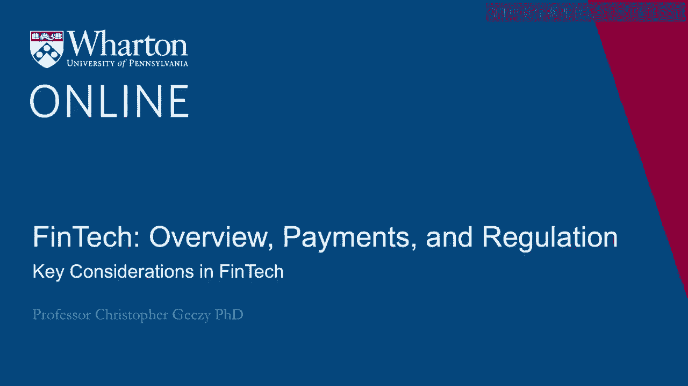
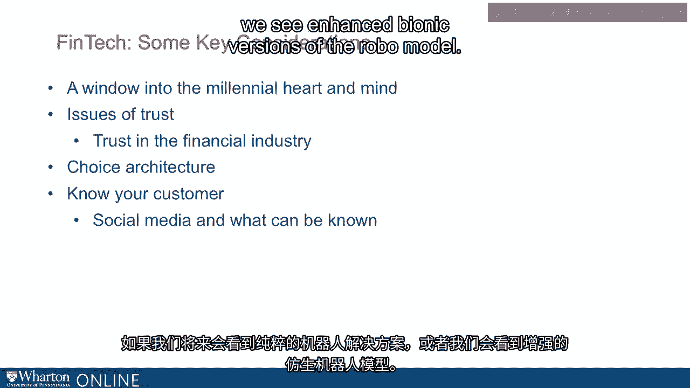

# 沃顿商学院《金融科技（加密货币／区块链／AI）｜wharton-fintech》（中英字幕） - P9：8_金融科技的关键考量.zh_en - GPT中英字幕课程资源 - BV1yj411W7Dd

 So there are a number of key considerations to think about in framing what FinTech means。

 to an investor， to a client， business， or consumer-oriented， or to an employee， or an， entrepreneur。

 The first is often offered as one of the motivating purposes of FinTech。 That is to say。

 to capture the heart and mind of the very important demographic known as， millennials。

 Now apologies in advance because I suspect some of you watching this lecture are indeed。

 millennials and we talk about you as though you're not living in the room very often。

 But millennials stand a good chance of inheriting in the US as much as $45 trillion of wealth。

 over the next 30 years。 Disabilities have lived through and witnessed financial crises and give a kind of opportunity。

 to companies who target not just their current wealth but the present value of their future， wealth。

 They have different views of the world。 They want to interact with technology in a different way。

 And especially important for FinTech， they have varying levels of trust for financial。

 organizations which make a kind of push-pull relationship with financial technology。 In addition。

 issues of trust abound more generally across demographics when it comes to adoption， of technology。

 when it comes to belief and trust in algorithms， and what we know about。

 them has been rapidly expanding。 Finally， choice architecture and what we can know about consumers and customers is becoming。

 ever more important。 It is now widely understood that how we give clients and consumers and investors a series。

 of choices for the selection of products and services is critical。 There are a number of choices。

 the characteristic of choices， and in no other area than financial。

 technology might this be a determining characteristic of success。 And finally。

 what we can know about customers extracting from social media gives us a view。

 into what the future might be like if we are ever going to see a pure Robo solution or we。

 see enhanced Bionic versions of the Robo model。

 [BLANK_AUDIO]。

