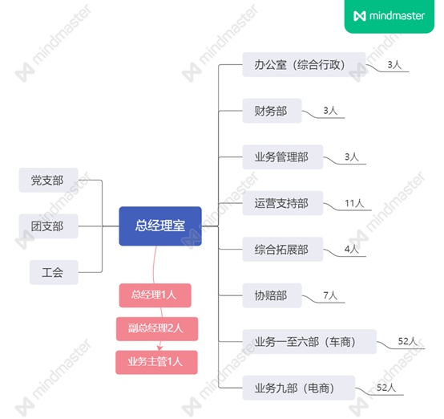

# 第三部分 垄断企业分子公司的脑力无产者

## 第十章 国有保险企业调研

编者按：这是一篇优秀的报告，内容详实，结构清晰。这篇文章描述了某国有保险公司区县支公司的基本情况。由于该公司是垄断资本下属公司，利润比私企更为丰厚，因此待遇也比私企更好。然而，“这种剥削”与“那种剥削”都是剥削，只是程度不同而已。

从文中我们可以看出该公司内部森严的等级、不平等的薪酬结构以及资本怎么具体压榨员工。在这个区县支公司，国企的领导层渲染着奋斗逼的文化，熬着有毒的鸡汤，为了自身收入，严酷地盘剥着基层员工，俨然一副“厂主”与“工头”的模样。而基层员工的权益却时常被侵犯，他们加班没有加班费，节假日经常不能休假，而稍微发发怨言就被通报批评，与私企的雇佣劳动者无异。企业为了最大限度压迫员工，通过过程控制、全体待机等方式，试图从各个方面掌控员工的行为，甚至一度在员工身上安装定位环。

员工也有怨言，但是往往敢怒不敢言，年轻人会选择离职，年纪大的却不得不忍气吞声，毕竟，私企的剥削更为严重。但是怨言和愤怒在积聚，而这总有爆发的一天。

## 一、发展历史

A公司是B市（某发达地区二线城市）一家国营保险集团下属财产险公司的区县支公司，主营财产保险业务（以车辆保险为主，兼营财产险，责任险，健康险，意外险等）。集团总

部下属十多家子公司，拥有二十万左右员工，其财产险公司网点遍布全国31个省（自治区、直辖市），参与大多数国内重要项目和工程的承保工作。

## 二、管理体系

（一）分工与部门划分

注：党支部，团支部，工会因不是职能部门且人数不常定，故不统计人数

公司有员工139人（包含正式工、派遣与外包）。与一般保险公司类似，除领导班子外主要分为业务部门和非业务部门。业务部门主要有负责非车险业务的综合拓展部，负责车险以及和车商（4S店、经销商以及二手车商）对接的业务一至六部，负责车险电子商务平台的业务九部（以下简称电商部）。非业务部门主要包括办公室（综合行政）、财务部、业务管理部、运营支持部、协赔部。以下是部门情况概述。

业务一至六部（车商）：这六个车商业务部门为主要业务部门，因工作内容基本相同整合概述。以下简称车商业务部。

车商业务部目前有员工52人，大部分为专科与本科学历。各部门一般设有部门经理（副经理或主管）一名对部门员工进行管理。部门日常工作分三大类：（1）业务拓展及办理。部门各成员主要派驻到各车商门店驻点办公，通过和车商的合作从车商处获取新车保险业务，并为新客户以及续保客户办理业务、出具单证。（2）日常咨询和文案工作。部门员工须为客户提供咨询，引导出险客户前往合作车商进行维修等。部门员工还需整理并上报各种报表、数据、单证资料。（3）客户维系。部门员工须定期维系可续保客户，并促使其投保。此业务理论上和电商部协同作业，但在旧车的续保业务方面有时会和电商部产生矛盾。

员工无法享受正常的午休，且经常会被要求无偿加班，在收入方面也有各式各样严格考核指标，因此新进员工的流动性通常较大。老员工因为各种原因较为稳定。

业务九部（电商）：主要负责电子商务平台的车险客户维护与电话销售，分为两个团队开展工作。目前有员工52人，常设部门经理（副经理或主管）一名，两个团队各设团队长一名。电商部日常的工作相对单调，整天都在打电话。员工主要依托公司的优惠活动，电话营销招揽车险客户投保。公司对员工每日的有效通话时长以及通话次数有考核，如未达到目标的有效通时通次，则须加班完成后方可下班。员工会经常在休息日加班。由于电商部几乎很少有正式工，流动性是全公司最大的。此外，经常由于公司的安排，有时会和车商业务部产生业务上的矛盾。

运营支持部门：运营支持部主要负责对业务部门进行技术上的支持，有员工11人，学历均为本科以上，常设部门经理（副经理或主管）一名负责日常管理。部门主要从事三方面业务：（1）各业务部门销售保险单证的打印和整理；（2）到店客户的柜面接待服务；（3）受理客户的电话咨询投诉工作。

员工午休时间和正常下班半小时内，会安排两名员工值班以提供必要的服务，值班为轮流进行。

业务管理部：有员工3人，本科学历以上。员工日常负责市场信息和数据的收集调研，并以此制定业务部门的相关考核指标。也负责对业务部门业务进度的监督和管控，对进度落后的部门和个人制定加班方案。此外，业务管理部还负责不定期的前往车商门店对车商部门业务员进行抽查（包括是否在岗，易容仪表，是否着工作服，办公环境卫生整洁等）并考评。故而业务部门对业务管理部多有积怨。

协赔部：协赔部员工7人，以专科以上学历为主。主要负责车险事故现场的查看，出险客户和维修机构的对接，车辆损失的核定等工作。因其工作性质，协赔部需要进行倒班和轮休，以满足夜间出险客户的需求。此外，协赔部会引导出险客户至公司指定的维修机构进行维修，以此使公司获得对车商的谈判筹码，以便获取车商提供的新车保险业务。

其他职能部门：略。

（二）层级划分与薪资体系

注：因为公司工资条实行保密制度也不允许员工之间公然讨论收入，所以这里的收入为大致推测

理论上国有企业为公有制经济，应该实行按劳分配。但现实中，即使是国有企业，管理层通常都比普通一线员工的薪资收入高出很多。

整个公司的层级简单地讲大体可分为上中下三个层级。

公司的上层：上层是由总经理室成员构成，包括总经理、副总经理以及业务主管。他们是公司的司令部，掌握了全部的话语权。他们召开公司会议讨论研究上级公司的指示和任务，根据情况分解发派到各个职能部门执行。执行过程中，会根据情况进行调整。除了总领全局之外，他们平时也经常代表公司到各个车商和企业进行访问和商务洽谈此。此外，在公司召开的各种晨会和夕会中，他们会给全公司员工灌输一套奋斗理论，并通过强灌各种鸡汤来维持公司的团结，已达促进业务发展的目的。他们的薪资收入与公司利润挂钩。虽然我们无法探知他们真实的收入状况，但从某些方面我们仍可窥见一斑，比如，他们未完成上级的指标，动辄被扣款上万，这说明他的薪酬非常高。从各个方面来说，他们都是公司里的“厂主”和“技术专家”。

公司的中层：公司中层往往是从有经验，业务水平优秀的员工中选拔上来的。和领导班子的工作相似，他们负责从总经理室那边得到指示和任务，再结合自己部门的实际情况去对其进行分解，把任务分派到各个员工身上。不同的是，业务部门的中层干部们的收入主要受公司利润和部门指标完成情况的双重因素影响；而非业务部门一般只受到公司利润的单方面影响。故而在科室任务达成情况优良的情况下，业务部门的中层干部收入会远远高于非业务部门的中层领导。但其工作压力也远比非业务部门的要大。在平时，业务部门的中层干部通常会在部门传播一些“正能量”思想，奋斗思想等。并向基层员工灌输，员工之所以能工作并有这样的收入，都是公司提供的平台这类的福报思想。以此让员工认识到自己对公司其实并不重要，只有努力为公司创造利润才有存在的价值。他们好比是公司里的“工头”，代表着“厂主”和“技术专家”们履行着监督职责。

公司的基层：第三个阶层就是基层员工们，这个阶层唯一要做的就是根据上一阶层的安排，去把任务具体落实完成。这个阶层大体分为两个部分。其中少数人担任部门中的主管或协管（从最下面提拔出来），这部分人虽然不是真正的干部或领导，但也与普通员工有所区分。他们除了干自己的活之外，还负责协助中层干部管理部门内部事务。他们属于基层员工里的优秀者，也有被拔擢的希望。所以他们是积极的，活跃的，也许某一天，他们可以从第三阶级跃升到第二阶级。他们通常会配合中层干部对部门中的不满情绪进行安抚，团结人心来确保部门内部的和谐，保障业务的顺利开展。剩下的就是完全没有任何职务的一般员工。他们是公司里的普罗大众，但这样的一些人，终究也是有区别的，有关系的，会来事的，领导喜欢的就会被安排好的岗位，尤其是业务部门，这样的人会被安排到轻松的，事少的，收入高的车商门店中去。而相反的则会被安排在一些，事情多还收入一般的门店，这样往往会陷入一种“陷阱”，事情多工作就不好开展，任务也不好达成，引至领导的批评并直接影响到本身的收入。

在招聘员工时，公司常常会打出“国营企业”，“收入稳定”以及“高薪不累”等宣传口号。通常会把收入水平按照优秀业务员的收入写到10k乃至15k，但是实际到岗后会发现按照公司的各种规章制度以及罚则等等，很少有员工能有到这样优异的收入，故而新进员工的流动性就会很大。不过，五险一金方面公司还是执行到位的，虽然工资会有部分拖延，但社保和公积金每月是准时缴纳的。此外对正式工公司还会提供职工互助医疗和年金的福利。

（三）劳动过程

由于保险业务的开展并非标准化的劳动，员工对于个人的劳动有一定程度上的安排和调整能力。但是公司方面也相应的可以通过各种手段对其进行监管和把控，来最大限度压榨员工。

过程把控：新车的保险业务受到汽车销售的影响不太可控，旧车的保险业务是可控的。公司通过业管部统计后将各员工相应的业务做成续保跟进表，每个员工根据表格进行电话呼出和填写每次呼出的结果。这样中层干部以及业务管理部可直接从定期的跟进表中获知每个员工的完成情况，并作出相应的应对措施例，比如加班、罚款等。

全天待机：保险行业具有一定特殊性，无论是前端的销售或是后端的理赔，几乎需要一线员工全天24小时的进行待机。只要上级领导或公司有需求或者是客户有需求，便要进行即时的回应。哪怕是休息天也好，深夜凌晨也好，只要有电话呼入或接收到信息，你就要进入到工作中去对其进行处理。这样的情况自微信，钉钉等APP的出现后越发严重。毕竟客户的选择很多，而如果因为没有及时回复而导致业务的流失，领导是不会接受这样的解释的。

活动与团购：保险公司经常性的会组织针对各类客户的优惠活动和保险团购。在这种情况下，往往需要员工进行加班工作。期间由于时间的局促，往往需要员工在短时间内对大量的客户进行告知和促成。在这种情况下，“白加黑”，“六加一”就是很普通的一件事情。

会议和培训：往往保险公司会经常性的组织公司晨会和夕会，进行业务进度通报，灌输“正能量”和“鸡汤”。遇到上级公司重要指示、重要事务，或者遇到新产品的上线等情况，公司也会召集临时性的会议和培训。这类会议和培训通常会在正常下班时间后召开，以确保不会影响白天的工作。在今年疫情之后，随着办公软件的应用，有时也会在非工作时间召开临时的语音或视频会议。总之务必不要浪费工作时间。

## 三、压迫、剥削制度与文化

保险公司本身并不创造实际的价值，而是通过投机的方式让钱“生”钱。不光对外的业务上追求利润，对内也有各种各样的方法对员工进行压迫和剥削。虽然公司属于国有企业，但因为领导们的收入和公司利润、业务完成情况挂钩，因此公司领导会尽量压缩员工收入、增加员工工作时间以及通过各种方式来节省开支，俨然一副“厂主”与“工头”的模样。

2016年到2017年这段时间，机动车商业险保费还尚未进行改革，保费收入和返点都处于一个比较高的水平。那时因为业务需求，每隔一两个月时间公司就会进行所谓的“团购”活动。有时是公司直接进行，有时是和车商合作举行。所谓“团购”就是在一定时间范围内，加大对客户的返现或赠送油卡的力度，以便快速吸收大量客户投保。这类活动通常会在4至7天左右，在这期间休息日是完全取消的，而且公司也不会给你安排进行调休。而因为活动的时间限制，需要在活动前期大量打电话通知客户。由于数量实在庞大，而且白天工作时间会有其他业务和工作经手，所以下班后加班联系客户就是家常便饭。当然这样休息日和下班后的加班都是所谓“自愿”的，公司一贯的说辞是，业务做进来都是你们业务员自己的收入，所以你们是在给自己加班，给自己赚钱。这段时间由于公司的任务和利润都算还行，故而在能完成的情况下对于员工到底在做什么也并没有很严格的管束。员工的收入也相对还算可观，一年下来也总有个十万左右。而B市一般普通职员的月收入大概在3k至4k，这样相较下就算很不错了。

近两年来，随着商业车险的各种改革和监管措施的出台，保险公司在车险业务这块受到较大的冲击。期间又因为领导班子调动的原因对于下面员工的管控和罚则也越来越严格，各种扣款措施和罚则纷纷出台。例如迟到一次扣罚20元，未打卡一次扣罚30元，未规范着工作服扣罚20元，办公区域未整理整洁扣罚20
元，各种你能想到的和想不到的罚则多如牛毛。业务方面推出了奖惩措施，但奖惩不成比例，完成并超出进度在奖金上可能上浮10%，但是完不成可能下降20%。具体的幅度总是由领导班子研究后公布，但往往奖少罚多。管控还不仅限于行为和经济方面。公司热衷于通常宣扬那些空洞的“正能量”，毫无营养的“心灵鸡汤”，和让人恶心的“奋斗逼”思想。公司灌输的理念不是国企职工当家作主，而是“没有公司，你什么都不是”，因为所有的展业平台都是公司提供给你的。这种似是而非的洗脑话术，和纳粹戈培尔那句“没有祖国，你什么都不是”如出一辙。整个公司都萦绕在“正能量”之下，“负能量”的话哪怕是真的，你也不能说。有同事在工作场合说了抱怨的话，招致的是在公司晨会的通报批评。

这段时间，公司甚至派发过一种带有定位功能的电子工牌，要求员工随身携带，即使下班后也要带回家。相当于只要公司愿意，随时可以对你进行定位。如果让公司发现工牌一直在同一个位置或者处于没电关机的状态，那么就会进行相应的惩罚和通报。虽然很多员工对这种严重侵犯人权的措施私下里都有怨言，但也仅仅在私下的状态绝不敢拿上台面来说，不过这一措施在后来不了了之。可见公司对员工的管控到如此地步。在这两年里，加班依然存在，加班依然免费。但是收入与前两年相比有所下降。

2020年是最惨的一年，年初疫情爆发。在地方政府的要求下，各企业和经营单位停止营业。一开始公司也按照要求安排员工在家办公，后来公司不顾风险，在尚未具备复工条件时，强行于二月中旬开始营业办公。期间有员工曾向当地主管部门匿名反应，情况被通报上级公司，上级公司自查自纠后，却回复未发现违规复工的情况，此事就此不了了之。

九月以来，新一次的车辆商业险改革开始，保费收入进一步大幅下调。在这种情况下，公司再次加大了考核力度，奖惩变得更加直观了。譬如，完成任务的情况下，每超出一台额外奖励20元，完不成每台扣罚30元。但是任务的目标本身就定得很高，孰难孰易可想而知。这一年依旧降薪，加班，令人窒息。唯一使人稍稍释怀得是自九月的改革过后，再也不用业务员垫钱送给客户了，这至少减轻了很大的压力。

公司除了职能部门外，还设有党支部、团支部以及工会。党支部书记由总经理担任，党员人数大概十多人。由于不是党员身份，并无法探知支部内部会议的内容。不过可以判断的是，支部的党员们大概没有一个人读过《宣言》，更不会有什么马列理论基础。比起这些，公司还是比较喜欢资本家那些成功学，管理学的思想，鼓吹这么一套理论的支部水平也就大致可以判断了。此外这个月支部还发展了三名积极分子，其中两人是班子成员，一人是鼓吹“奋斗”的领导的跟屁虫，都没有什么理论水平。工人阶级的先锋队不停地发展这样的人进入，也是一件十分悲哀的事情。团支部则更是人山人海，毕竟如今团员遍地都是。但团支部的日常除了让青年员工（无论是否团员）在手机上上省团委的团课外，便是收收团费，除此外毫无存在感。至于工会，工会主席目前是一名副总经理。除了日常组织工会活动（基本就是爬爬山或出去拓展玩玩）以及发放节日礼品和生日卡外，也不会有更多帮助员工争取利益的行为。公司的员工们可能也无法理解工会的作用，更不会通过工会去反馈什么压迫和剥削的情况。简单地来讲，这就是公司的工会而非员工的工会。

## 四、员工思想

面对剥削与压迫，自然会产生不满与怨言，当然这也只是停留在私下的层面。

一，无论监管部门对车险进行怎样的改革，员工的工作量实际是没有减少，反而增加的。但是因为公司的收入和利润的减少，对员工支付的薪资也大幅缩水，这是最不能令人接受的。此外年终奖也是按照领导随心所欲，时有时无。所以最直观的就是员工努力却得不到回报。

二，随意且强制的加班使员工身心俱疲，最夸张的时候一整个季度三个月都没有休息日。这样高强度的加班，不光造成人生理上的损害，对员工的社交以及家庭关系也会有很大程度上的影响。年假也要看领导肯不肯给以及肯给几天。但其实就算休假了你依然要继续办公，“工作性质”使然。

三，许多业务上的任务动则以政治任务的名义压下来，迫使员工不得不去完成，甚至强制员工自行购买。本质上就是一种强买强卖的行为，而员工迫于压力又不得不买，对于这样极大损害员工经济利益的行为员工是十分排斥的。

四，溜须拍马的人纷纷拔擢，真正劳动的人得不到保障。但是又出现多做多错，不做不错的情况。那些不干事的受到好评和表扬，干事的人却会引致麻烦。这在很大程度上引发员工对领导层管理上的不满。但大家又不好说，也不能说。长期压抑。

在各种不满和积怨产生后，刚刚进入社会的新新社会人们往往选择离职。他们没有贷款也没有家室，一人吃饱全家不饿。对于他们来说，此处不留爷，自有留爷处。更多年纪大一些的员工往往还是选择继续下去，毕竟如果贸然离职，工资收入断了，贷款是不会断的，家里的开支也是不会断的。而且就综合的情况而言，B市整体的薪资水平普遍偏低，且私有企业的剥削更加恶劣。A公司纵然有这样那样的问题，但总体而言各方面还是高于B市大多数企业的。比起个人创业的风险，大家也并没有什么更好的选择，只能背负着苦架继续前进下去。毕竟，太阳照常升起。

然而，当人们认识到自己奴隶般的状态后，改变这种状态的那一天就不会太远了。

## 第十一章 某通信运营商的县级分公司

编者按：本文作者描述了某运营商县级分公司的基本情况。运营商是垄断资本的典型代表，拥有高额垄断利润，员工待遇明显高于私企。但是即使在这样的企业中，我们仍然看到：（1）企业内部森严的等级以及与此挂钩的不平等收入；（2）企业的违法现象，比如加班并不支付加班费。

作者笔下的垄断国有资本，提供给员工比私企更好的待遇和福利，但员工仍然改变不了雇佣劳动者的命运。他们在企业中并不享有主人翁的地位，他们在权益被侵犯时往往只能忍气吞声，显然，这样的国企仍然是资本式的国企。

由于企业内部的矛盾并不尖锐，他们自身的斗争性也相对较弱。相比于大城市的产业工人，甚至相比于大城市的脑力无产者，他们的压力更小，矛盾更加缓和，因此，他们可能觉醒得更晚。但是，近年来随着经济下滑和生活压力加剧，员工的压力也越来越大了。

矛盾在日常的压迫中缓慢地积累着，这是十年如一日的日子。在这样的日子里，一个又一个如作者般的劳动者正在逐步觉醒。

## 一、基本情况

本单位为某通信运营商的县级分公司。所在区县的人均GDP在全市范围内处于最后几名，不足全国平均的二分之一。县公司绩效一般，在全市范围内处于中间偏后，其中政企部门的绩效长期处于倒数。

据调查，该公司基本情况与所在地级市其他各县级分公司类似，具有一定的代表性。通信运营商从事国家规定的垄断行业，但各大运营商彼此竞争激烈。前些年，运营商凭借垄断地位盈利颇丰，员工待遇较高。近年来，国家提出“携号转网”和“提速降费”等政策，再加上恶性竞争的影响，运营商基层工作人员待遇每况愈下。

## 二、组织架构和人员情况

（一）职位层级

公司领导层共4人，其中党委书记兼总经理1人、分管市场副经理1人、分管网络及建设维护副经理1人，以上三人均属于某级别的经理（领导级别）。另有政企经理1人，政企部门为新设置部门，专门负责政府、大企业等集团客户业务。公司中层共20人。中层是实际工作中的主力，工作压力一般比基层员工大。其他正式员工60余人。另有负责卫生、保安、维护施工等工作人员约10人，该10人均为外包人员。

（二）员工基本情况

从年龄看。公司经理大多为40岁左右。近年来，公司有领导层年轻化趋向，上级曾发文件要求，新提拔的经理原则上年龄应在35岁以下。县公司中层大多数年龄为30-40岁，仅有1名人员年龄在40岁以上，1名年龄在30岁以下。其他员工年龄大多数也为30-40岁，有少数超过40岁或不足30岁。他们中大部分都是在24岁前进入公司工作。

从来源看。非领导层公司正式员工大体分为3类：原邮电局转入公司的老员工、省公司统招员工、其他正式员工。为表述清晰，将此三类员工命名为邮电局老员工、统招员工和社招员工。

其中，社招人员中仅有4人是全日制本科学历，其他全是专科学历。应上级公司关于提升员工整体学历的要求，公司和本市一所大学合作，给员工机会，取得成人自考本科学历。这种学历水分很大，员工不需参加实际学习，只要过了最后的考试即可。

社招员工是由区县公司在社会上自主招聘。先在县公司面试，后到市公司参加笔试，通过即可录用。超过80%的社招员工工作年限已经超过十年，约一半已经超过十五年。

在区县公司中，邮电局老员工、统招员工、社招员工，三部分人员比例大约为1:1:5，考虑到邮电局老员工中有部分已经退休，统招员工中有部分已经离职，实际工作中社招员工比例更高，可达1:1:7。在省公司、市公司和市区的区县公司中，统招员工比例会有所上升。

## 三、收入及其他福利

（一）薪资情况

员工工资与职级挂钩。自2016年以来，省公司统招的本科大学生定级约为5级，根据年份有上下浮动，硕士研究生比本科生高1级，一般市公司内没有博士研究生。邮电局老员工一般职级为8级左右。社招员工职级大多为1-4级,许多工作数年的基层社招员工职级仅有1-2级。社招员工是公司主力，但职级明显低于其他人员，具体情况详见后文第五部分。

员工工资由每月工资和年终奖两部分构成。月工资包括基本工资、职位工资、绩效工资和补贴。其中，补贴除常规补贴外，还包括过节费、取暖费、防暑降温费等。基本工资和职位工资由职级决定，每月不变，绩效工资由上月绩效决定，计算较为复杂，不再赘述。每月工资发放日期为当月最后几个工作日，没有扣押工资的情况。

由于绩效和竞赛奖金不同，同一职级不同员工间收入有差距，5级员工间差距可达1500元。即使是同一员工，不同月份间收入也有差距，多则可达上千元。5级员工平均每月工资约5000元，每年工资及奖金共约80000元。2级员工平均每月工资约3000元，每年工资及奖金共约45000-50000元。以上工资及奖金均为工资卡实发到手的钱，不包括五险二金等其他的收益。

近年来入职的大学生在入职前会缴纳履约保证金，本科生3000元，硕士研究生5000元。在缴纳时公司并未说明何时归还。理论上说，在员工入职后即应返还，至少应在工作半年转正之后返还。但实际上，2018届入职员工在入职约十个月后反还。尽管多次在员工交流群众讨要说法，2019届入职员工的保证金至今仍未返还。

领导层工资状况未知，但根据传闻和缴纳党费等情况推测，经理月工资不低于15000元，不高于30000元，年终奖未知。

（二）加班费

节假日如十一假期加班营销，公司会统一申请加班费，为国家法律规定的三倍工资，下月月底跟随月工资一同发放。

除这种节假日营销以外，所有的加班都没有加班费。日常加班名义上是员工自愿加班完成工作，员工也不会主动申请加班费。如果要申请加班费，需要在系统中提交申请，包括原因、时间、地点、保存的工作照片等信息。提交申请后先由区县公司总经理批准，再由市公司相关部门批准后才视为正式加班，发放加班费。市公司很不喜欢区县公司提交加班申请。有一次十一假期前，市公司发文，严禁区县公司在节假日实际没有加班，却以加班费的名义给员工发钱。

我曾在参加工作日区县公司组织的营销活动后自行申请加班费，但县公司领导没有予以批准。我后来还被综合部邀请谈心谈话，内容大约是：工作日没有申请加班费这种说法、员工应当一起努力为公司提高绩效、加班完成工作是很正常的积极上进的表现等，加班费也不了了之。

（三）社保和公积金

公司缴纳五险一金和补充企业年金，按实际应得收益购买，缴纳比例较高。但由于社保缴纳得多，相应扣发工资也多，故每月实际到手工资不高，许多员工对此有些许怨言。很多职级不高的社招员工，每月实发工资只有一两千元。

（四）休息休假

员工依法享有年休假和其他假期（如产假）。如无特殊情况，公司一般会批准员工的年休假。

公司会在国家法定假期（如十一假期）组织营销，统一申请加班费。基层员工对假期营销多有怨言，但一般会遵循公司要求。在营销中有很多闲逛偷懒的机会，很多员工会边聊天边逛街。

一般情况下，员工的病假和正当理由的事假，公司会予以批准。按照规定，公司会扣除员工相应的绩效分和工资。员工的病假、产假等时间较长的假期中，没有绩效工资和补贴，其他工资正常发放。很多职级较低的员工，基本工资和职位工资不高，扣除五险二金后剩下的很少。很多时候，员工请假只需跟领导说一下，公司领导为了表示人文关怀，不会将请假正式提到系统内，不扣工资。

（五）其他福利

每年8月，公司会组织所有正式员工体检。为保护隐私，体检报告直接发放至员工个人手中，公司一般无权过问。普通社会人员参加同等水平体检，费用约1000元。据观察，公司员工身体基本健康，但会有常见的程度较轻的办公室职业病。

每年中秋、春节等节日，公司会发放福利。一般有食用油、大米、酱油等调料品和其他食品。公司还会不定时发放洗衣液、卫生纸、肥皂等日用品，大约每年有2到3次。前段时间疫情较为严重时期，公司还会发放口罩，能够保证员工个人的使用。

公司有自己的食堂，早餐2元，午餐7元，区县级别的公司里没有晚餐。午餐一般为一荤一素一汤，主食不限。每天变换花样，一周循环一次。食物味道尚可，基本能满足一般人的口味要求。领导也会跟员工一起在食堂用餐。上一任总经理几乎每天中午都在食堂吃。他待人较为温和，中午吃饭时大家会一起看电视、聊聊天，气氛很好。现任领导每周大约两次在食堂吃，他较为严肃，大家中午吃饭时都很安静。

如有上级公司巡查，应中央廉政精神要求，中午食堂会专门为其准备午餐而不是去外面的饭店吃午餐。

公司不提供住宿，市公司会在社会上租赁房子供各区县公司总经理使用，所租赁房屋水平大约中等偏上。另外，市公司还会为新入职统招员工提供租房补贴，每月600元，持续半年。半年后新入职员工转正，该补贴取消。

在还未转正时，新入职员工基本工资和补贴全额发放，绩效奖金按照全市平均水平全额发放，职位工资按照60%发放。转正后平均实发工资会提升几百元。由于转正后租房补贴取消，有入职绩效较差的区县的员工，在转正后工资反而不如转正前拿得多。

公司也会有其他的一些福利。比如公司会不定期举办运动会，约每年一次，报名参加的人会发一套运动服；公司会每几年组织一次员工外出旅游；公司会每几年发一套工作服装。

## 四、工作情况

（一）工作时间

按照规定，每天工作时间为上午8:30-12:00，夏季（5月1日-10月1日）下午2:00-6:00，冬季（10月1日-次年5月1日）下午1:30-5:30。但几乎所有区县都会要求员工早上提前来公司开晨会，最多的区县要求提前半小时，即8:00来公司开晨会。大多数员工晚上都会加班半小时或一小时以上，某些较为辛苦的员工每天加班时间甚至有三小时以上。平均来说，市场部员工最为辛苦。

每周工作时间为周一到周五全天和周六上午半天，但周六没有打卡签到。许多工作未完成的员工，周六周日会自行来到公司工作。

公司会定期组织营销活动，每过一段时间组织一轮营销。组织营销时，每周三次，部门内人员轮流参加。营销时间大多从下午4点开始，持续到晚上8点以后。此类工作日营销均由县公司组织，没有加班费。

（二）工作环境

员工均有自己的工位，每人配一台工作使用的电脑，内网外网均可接入。办公室内有中央空调，冬季取暖，夏季降温。领导层有单独的办公室，但除总经理外面积都不大。客户经理均有外出走访任务，每周至少外出四天，外出可申请公务用车，也可骑自己的电瓶车。原则上，开自己的汽车外出走访可以申请油补。

（三）同事关系

一般来说，同事关系比较融洽。大家并不局限于工作关系，私下里也大都是好朋友。员工们会将买的好吃的东西带来公司一起吃、买的物超所值的东西与大家分享。领导层与员工一般不会产生冲突，领导层如果对员工工作不满，会有训斥，但不会辱骂。员工对领导层的某些要求如有不满，多是私下抱怨，明面上不会表现出来。

但是也有例外情况。传闻，某区县公司领导曾在晚上被人殴打。有人说，他手不干净，喜欢调戏妇女，因此被人打了；也有小部分人说，是他对待员工太苛刻了，所以被打了。该领导被打后，选择报警。但由于与他关系差的人太多，案件难以调查，被打的事也不了了之，市公司便把他调离了该区县。

（四）工作状态

三大部门工作状态如下。

政企部门员工大体可以分为两类。一类工作主要是在办公室内，平时需要统计数据、填报表格、调度指标等。此类工作十分无聊，且需要长时间坐在办公室内使用电脑，会让人产生厌倦感。另一类是负责对外面向客户的，平时需要各种走访、营销或在营业厅面向群众。此类工作也很让人厌烦，有时一天需要走访三四家集团。

网络和建设维护部与第二类情况相似，只不过不需走访客户，而是要去现场指挥施工。

综合部和市场部与第一类相似，但市场部员工是营销活动的主力，需带头外出营销。

以我为例，区县政企部门。早上8:00到公司开晨会，领导安排今日工作。每天的工作包括但不限于：统计各种数据、填报表格和申请单、电话调度各乡镇网格发展业务、办理或取消集团产品业务，枯燥又恼人。另外，还要参加电视电话会议，大约每周一次，这种会议一般都在晚上下班一小时后开始，持续约两个小时。晚上八点回家吃饭是常态。最烦人的是集团号码过户，每一个过户都需要上传8张盖过公章的资料，还要刷身份证、拍照验证身份，每办一个就需要十几分钟。有时，一个集团就有几十个需要过户的号码，一整天都办不完。

（五）补充情况

公司领导层为追求绩效指标，有时会下令让员工强制为家人朋友办理某项业务，或以内购会的名义让员工购买某些卖不出去的积压产品。最多一次，在某年元旦前后，整个市公司所有正式员工每人花费约2000元，购买公司积压的智能后视镜和智能门锁。

## 五、其他状况

（一）历史情况

大约十年前，公司和邮电局老员工及统招类员工签订劳动合同。社招类员工与第三方公司签约，公司以类似劳务派遣的方式与第三方公司合作来雇佣员工的。那时公司效益好，正式员工少，待遇极好。据说，老邮电局员工在2003年的工资每月就有上万元。每到发工资的时候，他们都能领到一沓百元大钞，让那些劳务派遣的社招类员工十分羡慕。传闻，有领导在那时凭借高工资，买了许多路边的门店，向外出租。

一般来说，统招员工和社招员工工作量差不多，社招员工略高。邮电局员工年龄较大，有些已经退休，没有退休的大多岗位较为清闲。除极少数特别的员工外，绝大部分人工作都算认真、尽职尽责，没有耍横、捣乱、摆资历、长期不干活等情况。

作为工作主力的社招类员工，不仅没和公司签订劳动合同，其待遇也和正式员工有天壤之别，让人心生芥蒂。在2012年左右，国家要求国有企业限制劳务派遣的比例。公司开始大量吸收社招类员工为正式员工，签订劳动合同。当时公司规定，所有社招员工必须参加考试，通过后即可签订劳动合同成为正式员工。考试内容大约为工作能力和基本能力。

此时，许多领导层严格禁止员工私底下建立QQ群互相联系，不让员工组织形成力量。尽管如此，还是有些地市的社招类员工组织起来到省公司抗议，具体情况已不可考。转正后，社招类员工待遇虽还和之前的正式员工有差距，但已不像从前那样悬殊了。

（二）离职情况

公司一般不会开除员工，如有解除劳动关系的，均为员工自己提出离职。由于有员工离职率的考核，公司领导一般不愿意员工离职。在员工提出离职后，领导会百般挽留、能拖就拖，并会提出尽可能满足员工的需求。若员工去意已决，公司也会依照规定办理离职手续。

近年来，新入职员工均为省公司通过校园招聘统一招收的员工，学历多为硕士研究生，也有少部分本科生。这类员工学历较高、眼界开阔、思想活跃且大多没有养家糊口的负担，故离职的全部是此类员工。常见的离职原因有：区县公司地处僻远、工作劳累没有休息、薪资达不到满意目标等。离职后常见的去向：考研、考公、考教师编、通过当地政府的人才引进进入机关、到大城市另找工作等。

2018年，有一名大学生不满于周六还要工作，说：“国家规定周六不上班，我签订的劳动合同上也没说周六上班。如果你要我周六上班，那你拿法律条文出来。该我完成的工作我完成，工作日我正常上班，你也不能扣我工资。”对于其他非工作日的营销类工作，他的态度也是如此。公司拿他没有办法，只好在这方面妥协。原本周六要全天工作，从他以后，如果没有工作，许多员工周六下午就不来上班了。其他的员工私底下十分赞赏他的行为，但都没有勇气效仿。该员工在工作不到一年后，辞职去考研了。

（三）工会组织

工会在员工中几乎没有存在感，只会在过节时发些福利时出现。员工平时在与公司出现矛盾时不够团结，且法律意识淡薄，遇到不满往往选择忍气吞声。仅有少数区县公司的基层工作人员会将不满表达出来。但他们不是通过工会等官方渠道反映，而是采取指桑骂槐、消极怠工等方式斗争。该区县的员工，家庭大多有另外的收入，即使不靠工资，也能维持家庭的正常运转。

工会有时会组织面向全公司的捐款。捐款对象包括但不限于：用不起手机的贫困学生；新冠肺炎爆发地湖北；公司内部患重病的员工。捐款时，工会会要求领导干部带头捐，捐款数额一般不会超过200元。捐款原则上是自愿参加、自己决定金额，但是有的领导十分重视捐款，如有不捐的员工领导会单独谈话，促使其捐款。

（四）生活情况

除少数大学生和3个老家外地，在本地工作生活的员工外，职工均是本县人。约90%已组建家庭，对象一般也有工作。大多数员工家庭通过工作积累或家庭支持，都有至少有一套房子。当地房价不高，在几年前平均房价仅两三千元。即使现在，房价平均也只有五千多元。很多有家庭的员工，都在几年前行业情况较好、工资较高时，购买了不止一套房子。只有近年来新入职的大学生，才会租房子住。

关于劳动再生产的花费（关于劳动再生产的花费，这里只参考了我和几个同事，是一个大体的估计）。

以一个单身男青年为例。如果生活简朴，只计算基本费用，则有以下情况。租房：650元，吃饭：700元，日用花费：150元，共计1500元。其中，租的房子是县城边缘的较为老旧的房子，甚至会缺少一些必须的电器；上下班通勤靠自行车；早饭、午饭在公司吃，晚饭及周末在家买菜做饭吃；日用花费包括话费、水电费、日用品等。

如果正常生活，则有以下情况。租房：900元，吃饭：1000元，日用花费：300元，其他花费：300元，共计2500元。

如果生活品质较好，每月花费不低于3000元。

以一个有自己房子的6口之家为例。如果生活简朴，只计算基本费用，每月消费不会高于3000元。如果正常生活，每月花费大约5000-6000元。如果生活品质较好，每月花费不低于8000元。

如果老人没有收入，仅靠夫妻二人收入，普通家庭每月剩余不多。有些家庭甚至是月光族，每年盈余要靠年终奖。

子女上学是个重大问题。各种校外补习班的花钱不少，对普通家庭来说是个负担（但补习班并不是占比最高的费用，实际上绝大部分家庭，占比最高的费用还是食品）。由于公立学校数量不足，有的人会花很多钱上私立学校，这给家庭带来了很大的负担。在县城里，仅有一所公立高中和两所私立高中，招生数量难以满足需求。有的初中生甚至要复读两年准备中考。有能力的家庭会选择让子女上私立高中，或者送到其他区县甚至其他市上高中。

## 六、总结

尽管目前工资不高，但其他的福利待遇相较一般私企还是很好的。除加班外，也几乎没有违反劳动法的地方。员工如果对于工资要求不高，不犯大错，一般可以安稳工作到退休。

在一般的生活工作中的矛盾主要包括：工作量大、效益低、工资少、恶心人的营销活动、各种乱七八糟挤占休息时间的会议、形式主义的各种检查。矛盾主要存在于员工和公司之间，普通员工间基本没有矛盾。一般来说，营销活动主要是市场部副经理发起、卫生整洁的检查是综合部主任发起、工作会议是总经理发起，这三人作为公司的代表承接了不少员工私底下的怨言。

总体来说，公司内部矛盾比私企小，员工斗争意识也不强。对于加班，员工大多逆来顺受，经常有人说：“领导要我们加班，有什么办法呢？”，也有人说：“工作没完成，不加班怎么办呢？”偶尔有某个大学生呼吁大家要团结起来争取权益，也很少得到响应，大家只把呼吁当成玩笑话。在大学生离职另寻出路后，情况又会变得跟之前差不多。

总体而言，通信运营商的员工是令人羡慕的好工作。

但近年来通信行业作为一个产业在走下坡路，许多业务被新型的互联网、计算机企业抢走。运营商这种央企，体量庞大、转型困难，被互联网企业牵着鼻子走，利润也随之减少。

前几年，由于行业衰落，各大运营商为了保住业务量、争抢用户资源，竞相推出了“无限流量”，“开套餐，送宽带”等产品优惠，导致了恶性竞争。近两年，中央提出“携号转网”、“提速降费”，加剧了运营商之间的恶性竞争。同时，国资委又要求，运营商要保证上缴的利润不能少。收入减少，利润却不能减，又不能凭空变出钱来，负担只能压在基层员工的身上。另外，中央对国有企业下发了廉洁的指示，许多隐性福利、五花八门的补贴也相继取消。

事实上，基层员工的压力越来越大，工资也不见涨，甚至有所下降。许多年轻人不愿再选择在运营商工作。许多三十多岁的员工也有离职另寻出路的想法，但年龄大，出去也没什么好工作干，就还一直待在这里。

在平缓的发展中，矛盾还在积聚。

## 第十二章 一线城市医疗器械制造公司海外销售人员调研

编者按：本文是一篇优秀的调研报告，调研对象是某医疗器材公司海外销售雇员群体。

该群体员工属于典型的脑力无产者，由于“普遍拥有更为特殊的专业能力（例如小语种），因此议价能力相对较强，企业尚可对他们开出相对较高的薪资。”

该群体由于相对较好的工资待遇，以及被资本家分割成原子化的个体而无法团结，因此，虽然“资本家在招聘和提拔员工的过程中肆意进行性别和年龄歧视，以员工的人身和财产安全为代价开拓海外市场，为了逃避赔偿以逼迫员工自离的方式进行裁员”，但是他们“虽有不满，却普遍认为这是整个海外销售行业的行规，反抗和维权意识薄弱。”

然而，逃避却并不能改变资本压迫他们的现实。加班没有加班费，社保公积金长期违法缴纳（今年合法了），“尽管自己已经辛勤工作，却仍旧无法脱离自身所处的阶级。一线城市高昂的消费使财富的积累变得异常缓慢，靠为资本家工作实现阶级跨越的梦想似乎遥遥无期。”

虽然当前该群体员工还处于阶级意识萌芽期，但作者却对他们的觉醒抱着乐观态度，因为资本对员工的压迫日益严重。“一方面，由于中国企业开拓发展中国家市场的意愿越来越强烈，语言类特别是小语种专业的全国招生人数日渐水涨船高，甚至某些专业已经出现了过剩的趋势。未来将会有越来越多的毕业生进入海外销售就业市场。当销售代表们的专业技能不再稀缺，企业必然会降低其工资待遇，对他们的剥削与压榨程度也会越来越高。另一方面，受日益复杂的国际形势影响，我国的海外销售业务开展得并不理想。特别是今年的新冠疫情更是使海外销售行业的发展雪上加霜。利润的降低使得资本家进一步开始牺牲员工的利益，即使是本次报告中的大型上市公司也在今年直接取消了年度调薪。这无不预示着该行业危机的到来。而随着工资待遇的降低，不满开始渐渐在这一群体中蔓延。”

## 一、公司及部门介绍

该公司主营医疗器械的研发、制造和销售，属于大型上市公司，员工数超过2000人，在国内一二线城市以及国外建有30多个研发销售分公司和办事处，也有自己的工厂。员工中研发人员近600人，其余为销售、人力、财务等人员以及签有正式劳动合同的工人。公司有相对固定的上下游企业，上游企业主要是原材料供应商，主要供应机械配件，下游企业则是货代公司，为公司提供销售发货方面的服务。

本次的访谈对象供职于销售部门，对其他部门的情况缺乏了解。销售部门分为国内销售和海外销售两大体系，这两者在组织结构以及实际工作方面几乎没有交集，因此本次调研主要围绕该公司的海外销售体系展开。

该公司海外销售的两大主要产品为超声器械和内镜器械，公司声称其业务遍布160多个国家和地区，但实际上由于我国医疗器械行业的总体水平和发达国家相比尚有一定差距，故公司实际业务集中在亚非拉的发展中国家，依靠中低端产品的价格优势打开市场。

按纵向管理结构划分，海外销售体系最大的领导是海外销售总监和副总监，总监负责全部产品的销售战略制定，副总监只负责特定明星产品的销售。总监之下是公司按销售区域划定的区域总经理，通常按大洲划分。区域总经理手下按照产品下设该区域的各个产品总经理，负责特定产品的销售。产品总经理会将自己所在的区域划分成若干小区域，通常以具体国家为单位，每个小区域设置区域经理来管理特定产品在该小区域的销售。而区域经理下面是访谈对象这样的销售代表，他们才是该公司在海外销售领域的基层员工，直接负责具体的销售事务。

| 职级                                 | 范围                                 |
|-|-|
| 总监/副总监                          | 全球。总监负责全部，副总监负责某产品 |
| 区域总经理/某区域产品总经理          | 大洲。区域总负责全部，产品总负责某产品 |
| 区域经理                             | 某国                                 |
| 销售代表                             | 基层                                 |

从中可以发现在类似这样的大型上市公司中，庞大的企业规模和复杂的管理结构使得基层员工普遍对其他部门的工作情况缺乏了解，公司不会向员工主动讲解这些内容，员工在没有业务交叉的情况下也缺乏主动了解的欲望。例如访谈对象身为海外销售代表，却对同一部门的国内销售人员工作情况一无所知，这严重局限了基层员工的眼界，阻碍了工人阶级跨部门联合的可能。

## 二、部门人员情况

公司整个海外销售体系共有300多位员工，男女比例方面，男性员工是女性员工数量的两倍，存在着隐性的性别歧视现象。公司认为女性销售人员在结婚特别是生产后会将重心转移到家庭，不能持续承担海外出差任务，再加上对安全的考虑，在招聘过程中会优先考虑男性，对于入职的女性所给予的晋升机会也非常有限。

年龄结构方面，其中75%的员工年龄在25-35之间，年轻人是整个体系的中坚力量，20%的员工年龄在35-45之间，至于超过45岁的员工只占5%。像大多数私企一样，该公司对年轻员工的欢迎程度要远远超过大龄员工，在招聘时也基本只考虑年龄在30岁以内的求职者。

在专业方面，除相关后勤支持类岗位外，主要海外销售代表几乎都是语言类专业科班出身或自身有着优秀的外语能力。又由于公司主要的海外市场在亚非拉地区，因此事实上许多销售代表都是小语种专业出身，例如西班牙语、葡萄牙语、法语、阿拉伯语等。由于一线城市本身就会聚拢全国各地的青年，因此海外销售体系汇聚了来自全国各地的员工。

值得一提的是，海外销售体系离职率较高，整个体系内只有三分之一的员工超过了三年工龄，每年都有大量工作一两年的员工离职。离职原因主要是对薪资待遇的不满和对海外出差的拒绝。

## 三、部门工作情况

作为一名基层海外销售代表，日常的工作主要通过网络进行。包括向前来咨询的客户介绍产品、提供资料、报价、处理询盘，对于下单的客户跟进发货、处理付款回款，在海外进行产品注册，主动开发新客户等内容。入职两到三年的销售代表将被分配海外出差任务，具体频率大概两三个月一次，一次十天左右，或者直接派驻海外分公司执行常驻任务，但由于今年的新冠疫情，导致全年的海外出差业务大大减少。而单纯的网络沟通实际上比较繁琐，按照访谈对象的话说“虽然不算重复，但每天都有新的让人很烦躁的事情”。公司每月会对销售代表的业绩进行排名，虽然并未实行所谓末位淘汰制，但这种变相的压力依然会使员工因不想排在后面而陷入业绩焦虑。

从整个体系角度来说，如果公司要完成一个新的项目，通常是由高层即总经理进行决策，随后将决策传达到海外销售总监那里，销售总监再将项目布置给相关的区域总经理，区域总经理根据需要找到对应的小区域经理，由区域经理制定具体的完成计划，由其手下的销售代表负责具体实施。完成项目后，区域经理需要向区域总经理和海外销售总监进行工作汇报，并由这两位领导评定项目的完成情况。

该部门采用弹性工作制，员工可于上午七点半到八点间打卡上班，下午五点到五点半间打卡下班，只要上满八小时即可。午休时间为中午十二点到一点半。出于恢复精力的考虑，基本上所有员工都会在吃完饭后趴在办公桌上午睡。但由于睡眠时间比较短暂，员工在下午开始工作时依然会感觉很疲惫。下班后员工根据通勤时间不同大概在六七点能回到家中，时间会在做饭、运动、玩手机和追剧等活动中迅速流逝，为保证第二天的精力，许多员工十点就会上床睡觉。由于员工普遍对自身工作感到无聊又烦躁，故很多人都将下班视为一天中最快乐的时刻。

必须注意的是，对于海外销售代表来说，一个很大的职业风险来自海外出差或常驻时面临的人身和财产威胁。公司为了获得海外市场的利润，经常会派员工出差或常驻到亚非拉一些治安状况堪忧的国家和地区。公司针对这种恶劣条件的补偿措施只有给出差员工购买意外险和提高个别艰苦地区的出差补助，并无任何保护措施来减少伤害事件的发生。然而意外险只针对人身意外，并不保护员工的财产安全，且员工对于公司安排的出差任务普遍没有拒绝权和选择权。这就导致员工在海外经常遭遇持刀抢劫等财产威胁，例如访谈对象认识的一名员工在非洲出差过程中就曾被抢走现金。

一个很大的矛盾点是，目前我国现行法律并没有针对出差期间公司对员工财产损失补偿的相关规定。虽然劳动者可以以用人单位未提供劳动保护条件或者危害人身安全为由立刻解除劳动合同。但显而易见的是，在海外销售行业，绝大多数企业都不能在海外为员工提供足够的安全保障措施，在这种大环境下，员工想要在这一行工作就只能被迫承担风险，在遭受财产损失时自认倒霉。因此在前往治安较差国家前，员工普遍会担忧和害怕，但最后往往不敢拒绝公司的海外业务要求，为了保住职位前往国外。

今年下半年，尽管国际疫情依然十分严重，公司仍然恢复了一部分海外出差业务，员工不得不冒着感染病毒的风险前往工作。这也是近年来中国企业在海外扩张过程中的普遍问题，出于利益考虑，企业会往治安混乱的国家和地区派出员工，并且不会采取一定措施加强对海外员工的保护和补偿。毕竟，资本并不会顾及劳动者的利益。事实上，正是这些企业开拓发展中国家市场的需求催生了越来越多的大学开设对应的小语种专业，这些学生的就业途径十分单一，几乎只能配合资本海外扩张的大潮成为海外销售的主力军。在这种情况下，拒绝海外出差的销售代表在企业眼里也就失去了存在的意义和价值，如果还想继续在这个行业工作，销售代表们除了服从出差安排也没有其他选择余地。

## 四、部门工资和待遇

除自建的工厂外，公司不包员工吃住，只提供每天十块钱的餐补，考虑到一线城市高昂的物价水平，员工基本要自己承担工作期间的吃住费用。海外销售体系内的员工工资主要由底薪、提成和年终奖构成。每月发薪日是15号。需要注意的是，同一体系内同一级别的员工，公司会按照所负责区域和产品的不同给出不同的底薪，为此公司实行严格的工资保密制度，并禁止员工互相询问工资，例如访谈对象只知道自己目前的工资数，即每月8000底薪加2000左右的提成和每年一万左右的年终奖。这一措施加重了劳动者之间的隔阂，使得同一部门内员工的联合和团结变得更为困难。除此之外，公司福利只有节日发放的礼品卡。19年以前，公司业绩处于上升期，每年普遍调薪15%，然而19年开始公司由于经营不善出现了业绩下滑，开始降低调薪幅度，20年受新冠疫情的冲击，公司业绩进一步下跌，索性取消了年度调薪。

每年的二季度和四季度是海外销售的旺季，此时相比淡季工作量会加大，有时需要加班处理工作。然而公司并不按劳动法规定的内容来支付加班费，公司自己规定的加班费还不足劳动法规定的四分之一，且在实际操作中存在着不支付加班费，让员工无偿加班的情况。并且，根据访谈对象的说法，这种免费加班在行业内几乎是默认的。不过让访谈对象感到比较满意的是，该公司海外销售体系淡季几乎不加班，旺季的加班频率也不是很高，其最长一次加班是在结束工作后加班了两小时，公司并未支付加班费。公司为员工购买五险一金，但今年以前只按底薪购买，今年该城市出台新政，规定员工五险一金直接由税务局代替征收，即意味着员工终于能够按自己的实际工资缴纳五险一金。

## 五、阶级关系

如前所述，由于公司海外销售体系的业务庞大，基层员工一般只参与自己区域的销售工作。即区域总经理（大多按大洲划分）是员工平时所能接触到的最高负责人，具有该区域所有事项的决策权和人事权。

在区域总经理之下是负责小区域（大多按国家划分）的区域经理，这部分人负责自己区域的具体销售任务的执行，可以管理和领导自己手下的销售代表，并需要向区域总经理汇报工作。而一线的销售代表们是真正的基层劳动者，负责直接与客户对接，需要向区域经理汇报工作。

在经理和总经理身上，可以发现阶级意识发生了明显的变化。区域经理只比销售代表高一个级别，大多都是三十岁上下的青年，平时也与销售代表们在一个办公室中工作，阶级意识上普遍更偏向基层，如果出现纠纷也能够代表销售代表向区域总经理提出意见。然而区域总经理在公司中已经属于中层管理者，对于生产资料有一定的支配权，收入也远远高于销售代表和区域经理，因此思想上容易将自己视为资产阶级的一员，缺乏对基层员工的理解。

在管理方面，海外销售体系对员工的管理比较严格。除通常的考勤要求外，还对员工的着装打扮有严格规定。除周五外，员工日常必须穿正装上岗。由于曾出现过夏季公司高层领导周五前来巡视，训斥女员工穿无袖装的情况，基本员工在周五也都不敢穿休闲装，依然以正装为主。

在请假和离职方面，通常员工请假比较顺利。但公司近年来由于经营问题开始加大裁员量，甚至会因某款产品销量不好而裁掉某一地区的一整条产品线，其中包括入职仅仅半年的应届生。而一旦决定裁员，公司会要求员工自离，同时承诺给予一定经济补偿。尽管该补偿低于国家规定的裁员法定补偿，但员工在这种威逼利诱下出于怕麻烦以及担心后续找工作受影响等心理基本最后都会接受。

同时，在如此一个规模庞大的企业中竟然并未成立工会，只有员工自己组织的兴趣社团。许多员工在思想上也认为工会是个可有可无的组织。可以看出就职于大型公司的脑力无产者依然缺乏基本的维权和斗争思想。

## 六、员工生活

大部分销售代表都是不满三十岁的年轻人，在一线城市租房度日。鉴于一线城市的高房价，许多员工并没有长远留下的打算，而是打算利用一线城市的工作积攒金钱和工作经验，以便日后前往二线城市安家发展。他们为此租住在不足十平米的单间中，与两三个人共用浴室、厨房和客厅。例如访谈对象租住在离公司较近的一个小区中，房东将本来的两室一厅的住宅改造成四室一厅，专门租给年轻的劳动者，一个单间面积6平米左右，月租为2000元。

然而，许多青年劳动者发现，尽管自身已经在一线城市取得了和同龄人相比相对较高的工资，但巨大的生活成本依然使攒钱的过程变得异常艰辛。例如，访谈对象每月的房租加水电煤气费用约2500元，尽管已经出于节约成本的目的选择了自己做饭，除租房外日常费用依然达到了2500元，另外还有约500元的日常社交费用，以及一些其他开销。由于父母认为访谈对象已经在大城市获得了体面的工作，加之家中还有一个在读书的弟弟，故经常希望其用工资反哺原生家庭。另一个值得担忧的现象则是消费主义对青年劳动者思想的腐蚀。据访谈对象所述，自己由于有明确的二线城市买房目标而有意控制日常花销，但身边不少相同工资的劳动者却热衷于购买远超自己财力的名牌衣物、手提包、化妆品、护肤品等，因此许多人工作了几年还是“月光”，攒不下工资。更有甚者，在花光自己的工资后会选择刷父母的信用卡或者利用花呗等限制条件较少的小额贷款进行超前消费。在这种不良风气的影响下，即使是有意节省的访谈对象也为了融入群体开始购买昂贵的奢侈品。

对于基层员工们来说，日常的社交圈比较狭小，基本局限于同事之间。日常主要的娱乐都是通过手机来进行的。例如追剧、刷抖音等，微博则成了青年劳动者获取新闻信息的主要来源。销售代表们日常关系比较融洽，在薪资待遇方面普遍存在着对公司的不满情绪，但这种情绪还处于朴素的初级阶段，从员工们对工会的无所谓态度可以看出，这种不满并未转化成联合与斗争的意愿。一旦遇到自身权益受到侵害的情况，员工们首先想到的还是寻求HR的帮助，但HR作为资本的代言人，其态度完全由领导的态度决定，并不能很好地站在员工角度维护劳动者利益。一般遇到这种情况，势单力薄的劳动者通常都会选择放弃维权。

## 七、总结

近年来，随着我国资本海外扩张的加速，在一线城市出现了越来越多的从事海外销售的脑力无产者。他们在拥有海外销售体系的大型企业的总部工作，与传统国内销售相比，他们普遍拥有更为特殊的专业能力（例如小语种），因此议价能力相对较强，企业尚可对他们开出相对较高的薪资，对他们的剥削与压榨似乎还没有到类似于国内销售和程序员等群体的地步。

然而，问题依然存在。首先，海外销售的相对独立性导致这一群体普遍缺乏与其他部门劳动者的接触与了解，工资保密制度又在无形间对海外销售内部进行了分化，这导致他们对外缺乏部门间联合的条件，对内也做不到真正的团结和坦诚。

而没有劳动者之间的团结，单靠个人是无法捍卫自身权益的。资本家在招聘和提拔员工的过程中肆意进行性别和年龄歧视，以员工的人身和财产安全为代价开拓海外市场，为了逃避赔偿以逼迫员工自离的方式进行裁员，凡此种种，劳动者们虽有不满，却普遍认为这是整个海外销售行业的“行规”，反抗和维权意识薄弱。这一方面是因为该行业目前的总体待遇比之其他行业已算是相对较好，另一方面也是因为多年个人奋斗观念的影响使他们本能地认为现行的社会秩序无法改变，社会只有剥削者和被剥削者两个阶级，而要想脱离被剥削者的行列只能努力成为剥削者。但他们很快发现，尽管自己已经辛勤工作，却仍旧无法脱离自身所处的阶级。一线城市高昂的消费使财富的积累变得异常缓慢，靠为资本家工作实现阶级跨越的梦想似乎遥遥无期。这也促使越来越多的海外销售们投身消费主义，以无节制的物质享受来麻痹自己，而忽略社会生活中真正的矛盾点。

尽管如此，我对这一群体阶级意识的觉醒还是持乐观态度的。一方面，由于中国企业开拓发展中国家市场的意愿越来越强烈，语言类特别是小语种专业的全国招生人数日渐水涨船高，甚至某些专业已经出现了过剩的趋势。未来将会有越来越多的毕业生进入海外销售就业市场。当销售代表们的专业技能不再稀缺，企业必然会降低其工资待遇，对他们的剥削与压榨程度也会越来越高。另一方面，受日益复杂的国际形势影响，我国的海外销售业务开展得并不理想。特别是今年的新冠疫情更是使海外销售行业的发展雪上加霜。利润的降低使得资本家进一步开始牺牲员工的利益，即使是本次报告中的大型上市公司也在今年直接取消了年度调薪。这无不预示着该行业危机的到来。而随着工资待遇的降低，不满开始渐渐在这一群体中蔓延。虽然目前只是处于萌芽阶段，由于缺乏科学的理论指导还达不到广泛的觉醒和团结，但星星之火可以燎原，如果资本家的压迫加剧，相信会有越来越多的人开始反思和行动。
