# “十五五”时期中国能源行业关键议题

2025年7月

## 知识星球TOP资源分享社群

汇聚全网付费资源  
让更多人获取高价值信息

- ◆付费文章
- ◆付费课程
- ◆财经&股市
- ◆付费社群
- ◆副业&搞钱
- ◆行业报告

时政 • 历史 • 职场 • 体制 • 自媒体  
学习 • 军事 • 软件 • 影音 • 社会学

公众号：知识星球TOP  
微信号：jntsg8  
微信号：jntsg2

## 添加微信 免费进群

## 目录

- 前言：变革中锚定未来，以责任与洞见照亮征程 1
- “十五五”时期能源行业关键议题 3

## 全球能源系统重构 4

- 趋势一：以能源安全为核心的新经贸秩序重塑能源产业价值链，驱动区域联盟崛起与能源贸易多极化 5
- 趋势二：全球能源投资区域分化显著，中国持续引领，增量重心逐步向中东、拉美拓展 9
- 趋势三：技术正成为重构能源格局的关键力量，智能技术与新兴能源技术共同构建更加灵活、稳定、低碳的能源体系 13
- 趋势四：全球能源转型中长期趋势不可逆转，碳监管在贸易和产能调控中作用日益关键，成为转型重要抓手 18

## 化石能源高效转型 21

- 趋势五：油气行业中长期需求仍将维持高位，能源巨头调整升级转型战略 22
- 趋势六：化工产业高端化与产能外迁并进，中国凭借产业链与市场优势崛起为全球化工新材料产能重心 24
- 趋势七：煤炭达峰尚需时日，调节电源与煤化工双轮驱动产业功能重塑 28

## 新能源发展新周期 34

- 趋势八：新兴市场驱动新能源需求增长，系统解决能力与本地交付能力共同构成新能源企业核心竞争力 35
- 趋势九：中国新能源产业进入源网荷储一体化发展新周期，呈现市场化、智能化、多元化新特征 37
- 趋势十：新能源发电进入全面市场化竞争阶段，将推动电价机制与商业模式双重变革 40
- 趋势十一：储能迈入高增长与市场化并进阶段，经济性提升推动商业模式创新 43
- 趋势十二：新能源产业主体下沉到地方，能源企业角色分工明确 45

### 前言：变革中锚定未来，以责任与洞见照亮征程

迈入十五五，国际政治格局动荡加剧，大国博弈持续升温，全球化逆流更为明显，能源安全与自主可控重新成为各国能源战略焦点。同时，全球绿色转型持续推进，清洁能源投资将继续保持增长。能源，已然成为全球政治、经济、安全与科技竞争的交汇点。

同时，我们看到全球能源需求重心随着新兴经济体崛起而东移，亚洲、非洲、中东成为能源消费与技术应用的主要增量市场。全球能源供应格局更趋区域化、多元化，传统能源与新能源在互补与竞争中构建起新的供应体系。面对气候变化压力、能源系统转型与产业重构的多重挑战，全球能源行业步入深度调整与重塑的新时代。

尽管能源行业正在经历前所未有的结构性变化，但支撑全球能源系统运行的底层逻辑仍未根本改变。未来五年全球能源发展的主线与趋势将在“变”与“不变”两个维度切换、更迭：

#### 变化：全球能源系统性重构与多元化演变加速

- **全球能源地缘政治格局深度调整。**
- **全球能源供应格局加速演变。**
- **能源消费模式从“集中+稳定”转向“分布+弹性”。**
- **技术革命推动商业新范式。**

中美战略博弈、地区间冲突加剧能源安全焦虑，推动各国加快“自主可控”的能源体系建设。能源合作模式由全球化转向“区域联盟+战略资源控制”主导，中东推进“油气+氢能+绿色电力”出口，欧盟加快构建“欧洲能源共同体”，亚非国家推动区域协同。

油气供应重心从俄乌方向向中东、美洲等地区转移，绿氢、绿电等新型能源贸易路线逐步成形。预计到2030年，全球新增油气投资将继续向中东集中，同时新建跨境输电和氢气通道数量倍增，形成多元化、可控性的“能源走廊”体系。

新兴经济体电气化、城市化和数字化进程加快，带来全天候、可调节的用能需求。能源消费模式由传统工业主导向智能制造、电气化交通、数据中心等新兴载体转移，负荷曲线更为复杂，对系统柔性提出更高要求。

AI、大模型、边缘计算等技术广泛应用于新能源预测、调度、交易、碳管理等场景，推动能源产业从“产品导向”向“数据驱动+系统集成”升级。未来五年全球能源技术与数字技术融合市场年均增长将超过12%，能源科技企业与平台型公司的边界日益模糊。

#### 不变：支撑全球能源系统运行的底层逻辑依然稳固

尽管能效提升，但随着全球人口增长、新兴经济体工业化与电气化进程持续推进，到2030年，全球一次能源消费总量仍将保持年均1.5%~2%温和增长。中国和印度的能源需求增长是全球能源消费扩张的核心动力；东南亚、中东和非洲等新兴市场的能源需求也将持续扩张，支撑全球能源消费总量的稳定增长。

尽管可再生能源供给侧能力快速增长，但到2030年，石油、天然气和煤炭仍占全球一次能源消费的73%。在航空、航运、重工业等难以电气化的场景，替代方案在未来五年难以形成大规模应用，化石能源仍为不可替代的能源形式。

美国能源转型政策出现回摆，对全球转型步调造成扰动，但欧盟、亚洲、中东、拉美的主要经济体仍坚定推进能源转型，虽然节奏因地而异，但清洁低碳的转型方向不可逆。根据IEA和IRENA等机构预测，到2030年，全球发电结构中可再生能源占比有望达到50%，全球清洁能源装机较2022年实现翻番，电动汽车保有量突破2亿辆，电力系统绿色化与交通电气化进程全面加速，标志着能源转型已从政策倡导进入系统性落地阶段。

能源系统的稳定性、可负担性和自主可控仍是各国政府在能源政策制定中的核心考量因素。即便在全球绿色转型背景下，能源转型也必须在“绿色低碳”“能源安全”与“经济承受力”三者间寻求平衡。一方面，地缘冲突、极端气候事件频发，以及全球供应链不稳定，使得能源安全再度成为国家战略重点。另一方面，成本因素仍是决定可再生能源技术能否获得长期政策支持和市场接受度的关键，特别是对尚处于示范或初期商业化阶段的技术。

> 未来五年全球能源行业的变化以结构重构、主体多元、技术驱动为主要特征，而其不变的底层逻辑则是能源的安全性、经济性与可持续性的统筹平衡。对中国而言，在绿色转型大方向确立的同时，传统能源与新能源将在较长时期内共存共进、协同演化。传统能源仍是未来五年保障能源安全的“压舱石”，在电力保供、工业支撑、交通运输等关键领域短期难以被替代。与此同时，风光、氢能、储能与电动化等新兴能源形态加速成长，推动全球脱碳，也孕育着新一轮技术和产业升级。

十五五，中国能源行业发展的重心将“内外双发力”：内需端，新能源发展从以设备部署为核心转向以系统稳定性、消纳能力与响应能力为导向的系统协同优化；外需端，欧美市场壁垒加高，“东南亚+中东+拉美”正在成为中国能源企业新的外部支点。同时，中国能源企业也必将在内外双重压力中锚定新机遇，在结构优化与全球布局中瞄准发力点。

十五五，德勤中国能源资源与工业行业团队仍将以严谨审慎的态度及对行业的高度责任感，潜心钻研，深耕实践，探索能源产业链关键节点的技术突破与模式创新，解读主要市场的政策演进与产业深意，与所有能源产业参与者共同寻求破局之道。

白岩  
德勤（中国）能源资源与工业行业主管合伙人  
2025.07.09

### “十五五”时期能源行业关键议题

全球能源格局正处于深度重塑期，能源转型、地缘政治、技术革命叠加，打破了既有能源体系的稳定性与可预测性。中国作为全球能源消费与制造大国，既面临国际规则重构的外部挑战，也承载着推动能源转型、保障能源安全的内在需求。本系列议题从全球能源系统重构、化石能源高效转型、新能源进入发展新周期三个层次，全面探讨中国在未来能源版图中的战略定位与产业机遇，旨在提供系统化、前瞻性的洞察。

| 模块 | 趋势 | 内容 |
|---|---|---|
| 全球能源系统重构 | 趋势一 | 以能源安全为核心的新经贸秩序重塑能源产业价值链，驱动区域联盟崛起与能源贸易多极化 |
| 全球能源系统重构 | 趋势二 | 全球能源投资区域分化显著，中国持续引领，增量重心逐步向中东、拉美拓展 |
| 全球能源系统重构 | 趋势三 | 技术正成为重构能源格局的关键力量，智能技术与新兴能源技术共同构建更加灵活、稳定、低碳的能源体系 |
| 全球能源系统重构 | 趋势四 | 全球能源转型中长期趋势不可逆转，碳监管在贸易和产能调控中作用日益关键，成为转型重要抓手 |
| 化石能源高效转型 | 趋势五 | 油气行业中长期需求仍将维持高位，能源巨头调整升级转型战略 |
| 化石能源高效转型 | 趋势六 | 化工产业高端化与产能外迁并进，中国凭借产业链与市场优势崛起为全球化工新材料产能重心 |
| 化石能源高效转型 | 趋势七 | 煤炭达峰尚需时日，调节电源与煤化工双轮驱动产业功能重塑 |
| 新能源发展新周期 | 趋势八 | 新兴市场驱动新能源需求增长，系统解决能力与本地交付能力共同构成新能源企业核心竞争力 |
| 新能源发展新周期 | 趋势九 | 中国新能源产业进入源网荷储一体化发展新周期，呈现市场化、智能化、多元化新特征 |
| 新能源发展新周期 | 趋势十 | 新能源发电进入全面市场化竞争阶段，将推动电价机制与商业模式双重变革 |
| 新能源发展新周期 | 趋势十一 | 储能迈入高增长与市场化并进阶段，经济性提升推动商业模式创新 |
| 新能源发展新周期 | 趋势十二 | 新能源产业主体下沉到地方，能源企业角色分工明确 |

## 全球能源系统重构

中国是全球最大的能源消费国和能源生产国，其能源产业的发展已深度嵌入全球体系之中。当前，资源获取途径、技术变革与国际规则的变革正在重塑全球能源格局，也在很大程度上决定中国能源安全与产业升级的发展空间。唯有立足全球视角，才能系统把握中国能源行业面临的机遇与挑战，制定具有前瞻性和务实的发展战略。

地缘格局、投资流向与技术进步共同推动全球能源体系向区域化、绿色化、智能化方向演进。尽管转型节奏受短期扰动影响，但多极贸易与技术协同正推动能源系统迈向更具灵活性、韧性与可持续性的未来。

### 趋势一：以能源安全为核心的新经贸秩序重塑能源产业价值链，驱动区域联盟崛起与能源贸易多极化

在能源转型持续推进、地缘冲突频发的背景下，全球主要经济体愈发将能源与关键矿产资源视为国家安全的重要组成部分，各国能源战略正从“效率导向”转向“安全优先”。国家间围绕资源获取、贸易路径和产业合作等策略不断调整，推动全球能源产业价值链由“资源出口国->消费国”的线性关系，演化为“区域联盟+战略资源控制”的多极格局。这一转变正深刻影响能源与矿产资源的生产与贸易。

#### 区域资源联盟崛起，区域市场地位提升

在全球化趋于碎片化的背景下，各国以共同利益为基础，强化区域间技术标准、基础设施和资源配置方面的协作，形成更紧密的政治与经济互依。

**美欧国家**：通过《矿产安全伙伴关系（MSP）》等多边机制，推动关键资源近岸开发，与加拿大、澳大利亚、非洲、拉美等国在锂、钴、镍等战略资源开发领域展开合作。截至2024年9月，该机制下已支持32个项目，涵盖稀土、石墨、钴、铜、镍、锰等重要资源。

**中国**：围绕“一带一路”倡议，持续加大沿线国家的能源投资。根据Wood Mackenzie统计，2024年底，中国在“一带一路”国家承建电力项目369个，累计投资约2810亿美元，涉及水电、光伏、风电项目的投资、电力工程总包和本地化运营的全产业链输出。在资源领域，2024年中国在“一带一路”国家的金属与矿业投资达到220亿美元，创历史新高。这一系列布局不仅扩大了中国企业在新兴市场的影响力，也为区域能源合作奠定基础。

**中东、拉美、非洲**：资源型国家逐步摆脱初级资源出口依赖，提升本地化加工与产业话语权。沙特、阿联酋、阿曼等正联合开发绿氢走廊，玻利维亚、智利和阿根廷则通过推动“锂三角”机制提升对全球锂资源供应链的影响力。

#### 战略资源地位持续上升，全球能源通道多元化

为应对地缘冲突引发的运输风险，各国纷纷加快部署多元化、替代性的能源流通路径，建立“可控+多元”的资源流通网络。

**油气通道延伸**：传统的霍尔木兹海峡、马六甲海峡、苏伊士运河通道仍是主轴，跨里海走廊、北极航道、非洲天然气出口新线等路径加速形成。

**新能源通道初具雏形**：2030年，全球氢能及其衍生物（如绿氨、绿色甲醇）的贸易通道初步形成，连接澳大利亚、中东、北非等主要生产国与欧洲、亚洲主要市场。储能产品方面，东亚的生产优势持续巩固，产品出口至全球市场；欧美则通过政策吸引本地投资，建立区域内的供应链体系。

**基础设施投资扩展**：中东国家在巩固传统油气出口通道基础上，持续扩建港口与出口枢纽，如阿联酋哈利法港、沙特朱拜勒工业港等；印度提出“印度-中东-欧洲经济走廊”（IMEC），美国、欧盟予以支持，意在建设红海、苏伊士的替代性通道。

#### 能源资源贸易格局加速重构

新的经贸格局下，能源贸易呈现多极化特征。这里聚焦原油、天然气和锂三大品类，分析其未来五年贸易流向。**原油和天然气**仍是全球能源供需和地缘格局中的关键资源，主导国际贸易的主要流向；**锂**作为电气化进程中的重要原材料，其贸易格局变化将反映出资源保障与产业链布局的调整。这三类资源代表能源安全与资源战略的重要领域，可反映全球贸易的主要趋势。

##### 原油

- **俄罗斯原油加强“东进”**：由于受到西方制裁，俄罗斯原油出口从欧洲转向亚洲。未来针对俄罗斯的广泛制裁可能持续数年，即使俄乌冲突结束，贸易中断不太可能完全恢复。预计俄罗斯将进一步加大向中国和印度的出口，少量出口欧洲。
- **中东国家出口多元化**：沙特、阿联酋原油出口目前仍以中国、日韩、印度为主要市场；预计未来将进一步提高市场多元性，增加向东南亚、欧盟、拉美出口。
- **美国出口增长不确定性加大**：美国原油出口连续增长并在2024年达到创纪录的410万桶/日，已经成为欧洲第一大原油供应商，占比18%左右。未来美国将持续投资页岩油开发和扩大原油出口，并主要流向欧洲和亚洲。目前其关税政策尚未涉及油气及关键矿产行业，但关税政策变化可能导致美国重油进口价格上升，限制其原油产出和出口。
- **拉美和非洲出口崛起**：随着新油田开发和基础设施建设，巴西、圭亚那、尼日利亚、安哥拉可能成为区域的重要原油出口国。例如，巴西原油出口预计将在2030年达到530万桶/日，原油出口从全球第九跃升为第六。

###### 图表1：全球原油贸易流向

来源：德勤研究

##### LNG

液化天然气（LNG）通过海运方式打破了传统管道天然气的地理限制，成为全球天然气贸易的主力形式。2024年LNG贸易在国际天然气贸易占比60%。

- **美国与卡塔尔双雄格局确立，供应端更集中**：美国目前约有94百万吨/年的LNG出口能力，预计到2028年将增至172百万吨/年。卡塔尔计划将其北方气田的LNG产能从目前的77百万吨/年扩展至2030年的142百万吨/年。预计2030年，美国和卡塔尔LNG出口全球占比将从目前的40%增加到60%，俄罗斯、澳大利亚、非洲份额相对下降。
- **亚洲市场主导需求增长**：中国、印度、东南亚LNG需求年增长4%-6%，其中预计中国2033年LNG需求比2023年增长55%。中国与卡塔尔签订长期协议，印度也与卡塔尔、阿联酋和澳大利亚签订长期供应协议。
- **亚洲LNG接收基础设施扩张**：亚洲目前约有700Mt/年的LNG气化能力并持续建设。
- **LNG贸易路径更加多元化**：中美贸易摩擦导致中国基本停止进口美国LNG，更多转向卡塔尔、澳洲；美国和欧洲LNG联系深化。

###### 图表2：全球LNG贸易流向

来源：德勤研究

##### 锂资源

- **锂供应多元化，新兴生产国快速崛起**：当前供应高度集中，澳大利亚、智利和中国合计占据85%~90%的产量；未来，阿根廷、津巴布韦、巴西、加拿大等新兴生产国将显著扩产，新兴国家供应占比上升，而非洲锂矿开发项目逐步投产，有望成为重要的供应地。
- **中国锂加工主导地位弱化**：目前中国是最大锂进口国，进口比例57.5%，澳大利亚和津巴布韦为主要进口来源，也是最大精炼与出口国；随着美国、澳大利亚建设本地锂加工能力，预计中国在全球锂加工环节占比下降。
- **“锂三角”国家资源控制加强**：智利、玻利维亚、阿根廷或将形成区域性联盟“锂三角”，对锂资源出口进行更强管控，优先本地加工，提高出口价格。
- **欧美需求快速上升，进口来源多元化**：随着欧洲推进“绿色协议”及美国推动本地制造业发展，欧美对锂资源需求大幅提升，加速与澳大利亚、加拿大、阿根廷等国建立战略供应合作，减少对中国进口的依赖。
- **资源地到终端市场直供趋势增强**：全球锂资源贸易格局正出现结构性调整，“资源国->中国加工->全球市场”的传统路径正在被逐步打破。随着澳大利亚、阿根廷等国加快本地精炼能力建设，并推动对欧美终端市场的直接出口，全球锂资源贸易模式更加多元。

###### 图表3：全球锂矿产能格局

来源：德勤研究

全球能源与矿产资源贸易正经历从全球化、高效配置向区域化、安全优先的转变。能源和矿产出口国正通过加强本地加工、组建区域联盟、控制通道主动塑造贸易规则；而主要消费国则加快推进资源获取多元化与本土化生产布局，推动全球贸易流向更趋分散与多极。

在这一背景下，企业的全球投资策略需更加重视地缘平衡，提前识别资源出口国的政策动向，布局多元合作。本地化能力成为竞争核心，深耕区域市场，适应本地规则、提升参与度，是获取资源稳定保障的关键。同时，跨区域协同能力重要性上升，未来竞争不仅是单一市场的拓展，更依赖于在多区域之间实现资源、物流与市场的有效衔接与联动。

## 趋势三：全球能源投资区域分化显著，中国持续引领，增量重心逐步向中东、拉美拓展

全球能源投资区域分化显著，中国持续引领投资；拉美、中东、印度等新兴市场成为新增长极。

尽管全球经济面临多重不确定性，2024年全球能源投资仍逆势增长至3.12万亿美元，较上年增加1470亿美元，其中1210亿美元增量来自清洁能源相关投资。同时，2024年清洁能源相关投资也首次突破2万亿美元，这也印证了能源转型的不可逆趋势。

- **预计“十五五”时期全球能源投资仍将维持增长态势**：根据国际能源署测算，当前全球清洁能源年投资额仍较《巴黎协定》目标所需规模低约40%。这意味着各国需继续加强资金支持，以确保兑现应对气候变化承诺。同时，过去几年中清洁能源投资的持续提升很大程度上受益于技术迭代带来的项目经济性提升，而当前氢能等新兴技术步入产业化前夜，将开启新一轮投资窗口。在传统能源领域，为保障能源安全，以国家石油公司为主的油气企业将持续推进上游资源勘探与开采，全球油气投资有望保持复苏态势。

- **全球能源投资增量重心将逐步向拉美、中东、印度等新兴市场拓展**：这些区域面临能源基础设施升级与绿色转型的双重压力，且具有明确的能源战略（如沙特的2030愿景），为未来的投资提供确定性。

- **先发区域与新兴市场能源投资侧重点不同**：预计“十五五”时期，中、欧、美等先发区域的能源投资将更加侧重于前瞻性技术的研发（氢、核等）以及新兴业态的搭建；而新兴市场投资主要集中在大型能源开发项目、能源基础设施建设等。

#### 图表4：全球能源投资趋势

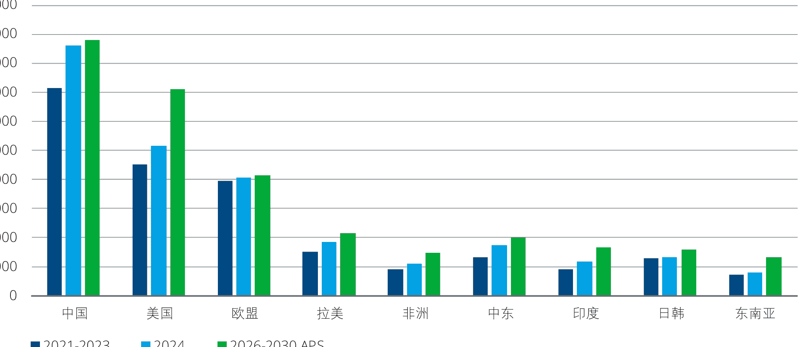

> 注：该数据由IEA基于2024年6月政策情境预测，美国投资预测数据可能因政策变化存在不确定性

来源：IEA，德勤研究

#### 中国境内能源投资重心向电网、储能以及终端消费环节转移

中国能源投资在过去几年中实现了跨越式增长，2024年投资总额达8610亿美元。预计“十五五”时期整体投资规模仍有增长空间，但增速有所减缓，同时将迎来新旧动能的转换：

- **投资重心从可再生能源开发和化石能源向电网、储能以及终端消费环节转移**：在过去几年的可再生能源项目投资高峰后，能源供给端转型取得显著进展，“十五五”期间需要加强中下游环节以加强配送和消纳水平，从而进一步解锁清洁能源替代的潜力。

- **智能化相关投资在各个环节都占有重要份额**：新的能源系统格局下，对各环节数字化的要求向更高智能化跃升，带动更多资金用于部署AI、IoT等技术，提升电网的系统性调节调度能力、终端消费环节能效管理方案的开发应用等。例如，过去几年中国家电网与南方电网的年度投资总额超7000亿元，其中智能化改造占比达17%。

#### 图表5：中国能源投资领域分布变化趋势

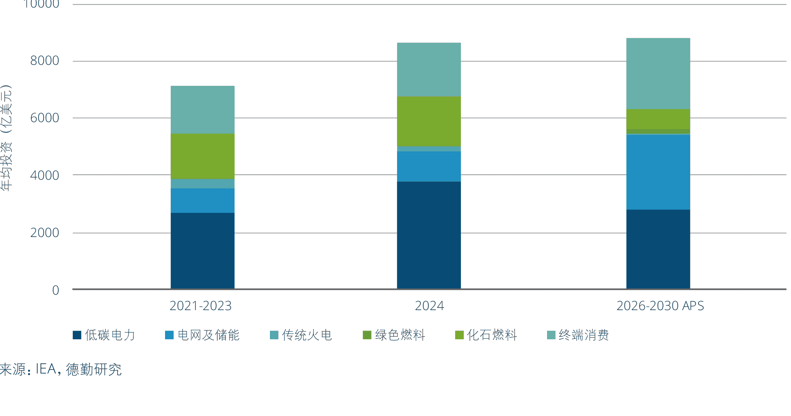

来源：IEA，德勤研究

#### 中国海外能源投资区域布局多元化

2024年中国能源领域海外投资有所回暖，总投资额较前一年增长28.4亿美元，达到148.4亿美元，其中西亚和欧洲市场是主要的增长点，而拉美市场凭借资源禀赋与政策支持，在海外投资中一直占据重要份额。展望未来，中国能源海外投资预计呈现区域分布、领域分布和投资模式的三重多元化：

- **投资区域的多元化**：未来拉美、中东等新兴市场仍是产能布局的前沿阵地，而与欧洲等主要市场的贸易往来将为该区域的投资托底。

- **投资领域的多元化**：可再生能源在海外投资中的比重预计将持续提升，虽然针对化石燃料的投资呈现下降趋势，但油气企业的海外投资领域开始向大型化工项目拓展。

- **投资模式的多元化**：新兴能源技术对本土化供应链的高要求，推动投资模式从单一资产并购转向“绿地投资+并购”的格局转变。

#### 图表6：中国能源海外投资区域分布变化

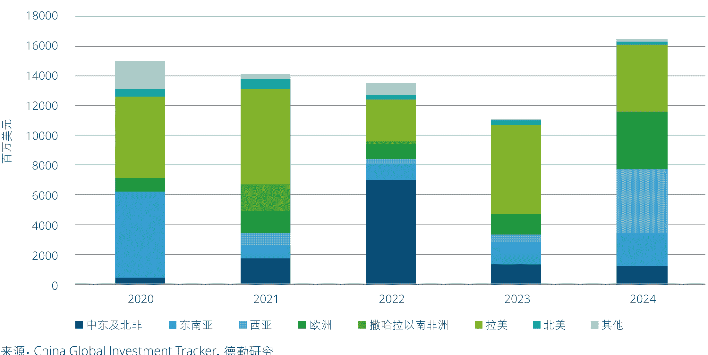

来源：China Global Investment Tracker，德勤研究

#### 图表7：中国能源海外投资领域分布变化

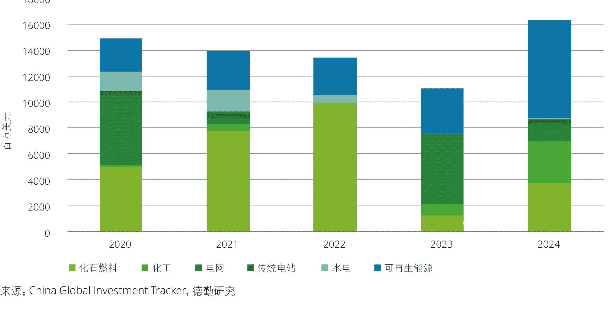

来源：China Global Investment Tracker，德勤研究

#### 图表8：中国能源海外投资模式分布变化

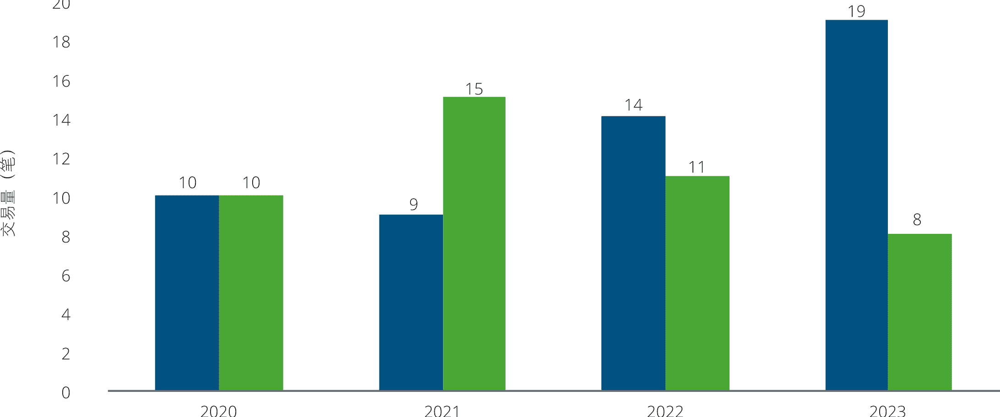

来源：China Global Investment Tracker，德勤研究

> “十五五”时期中东、拉美市场能源投资的快速增长，以及中国围绕电网、储能和终端消费环节的投资，将为能源企业提供增长机遇。与此同时，不同区域在政策、气候条件、市场需求等方面存在显著差异，要求企业提升海外布局的敏捷性与针对性。一方面，需要密切跟踪重点市场政策变化，制定更具针对性的应对策略；另一方面，应积极构建本地化合作网络，响应市场对供应链本土化的要求。通过以产业联盟、“抱团出海”等形式共同出海，企业不仅可以优化项目成本结构，还能提升整体配套能力与市场响应速度，在全球能源投资中占据有利位置。

### 趋势三：技术正成为重构能源格局的关键力量，智能技术与新兴能源技术共同构建更加灵活、稳定、低碳的能源体系

#### 人工智能与能源系统深度融合，推动能源生产、运营与消费模式变革

人工智能正在逐步融入能源系统的各个领域和环节。无论是电力系统的精准调度，还是油气与矿业的风险控制与效率提升，AI正以其强大的数据感知、预测、优化能力嵌入能源产业的核心环节。未来，基于AI的“平台+场景+算法”的智能能源系统将成为推动能源安全、绿色低碳与运营效率协同提升的关键力量。

#### 图表9：AI赋能能源行业典型场景

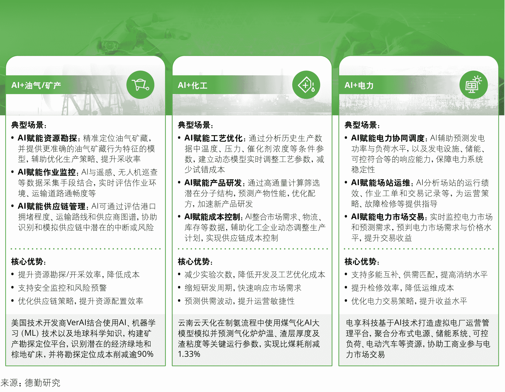

##### AI+油气/矿产

**典型场景：**
- **AI赋能资源勘探：** 精准定位油气矿藏，并提供更准确的油气矿藏行为特征模型，辅助优化生产策略、提升采收率。
- **AI赋能作业监控：** AI与遥感、无人机巡查等数据采集手段结合，实时评估作业环境、运输道路通畅度等。
- **AI赋能供应链管理：** AI可通过评估港口拥堵程度、运输路线和供应商图谱，协助识别和模拟供应链中潜在的中断或风险。

**核心优势：**
- 提升资源勘探/开采效率，降低成本
- 支持安全监控和风险预警
- 优化供应链策略，提升资源配置效率

美国技术开发商VerAI结合使用AI、机器学习（ML）技术以及地球科学知识，构建矿产勘探定位平台，识别潜在的经济绿地和棕地矿床，并将勘探定位成本削减90%。

##### AI+化工

**典型场景：**
- **AI赋能工艺优化：** 通过分析历史生产数据中温度、压力、催化剂浓度等条件参数，建立动态模型实时调整工艺参数，减少试错成本。
- **AI赋能产品研发：** 通过高通量计算筛选潜在分子结构，预测产物性能，优化配方，加速新产品研发。
- **AI赋能成本控制：** AI整合市场需求、物流、库存等数据，辅助化工企业动态调整生产计划，实现供应链成本控制。

**核心优势：**
- 减少实验次数，降低开发及工艺优化成本
- 缩短研发周期，快速响应市场需求
- 预测供需波动，提升运营敏捷性

云南云天化在制氨流程中使用煤气化AI大模型模拟并预测气化炉炉温、渣层厚度及渣黏度等关键运行参数，实现比煤耗削减1.33%。

##### AI+电力

**典型场景：**
- **AI赋能电力协同调度：** AI辅助预测发电功率与负荷水平，以及发电设施、储能、可控负荷等的响应能力，保障电力系统稳定性。
- **AI赋能场站运维：** AI分析场站的运行绩效、作业工单和交易记录等，为运营策略、设备检修等提供指导。
- **AI赋能电力市场交易：** 实时监控电力市场和预测需求，预判电力市场需求与价格水平，提升交易收益。

**核心优势：**
- 支持多能互补、供需匹配，提高消纳水平
- 提升检修效率，降低运维成本
- 优化电力交易策略，提升收益水平

电享科技基于AI技术打造虚拟电厂运营管理平台，聚合分布式电源、储能系统、可控负荷、电动汽车等资源，协助工商业参与电力市场交易。

来源：德勤研究

- **AI+油气、矿业：AI赋能生产勘探与供应链管理智能化升级**  
油气企业以及矿产企业在全球供应链中扮演重要角色，并以强劲的生产勘探投资来支撑对石油、天然气、金属矿产等资源的旺盛需求，以及应对地缘政治等因素对供应链的影响。AI可凭借其对数据深入、精准的分析能力，有效提升矿产勘探价值链各环节的效率，减少勘探成本，甚至通过创建模拟油气矿藏行为特征的模型，辅助优化生产策略，提升采收率。  

此外，全球供应链格局的转变对物流效率、成本规避、应变能力等提出了挑战。AI可通过评估港口拥堵程度、运输路线和供应商图谱，协助识别和模拟供应链中潜在的中断或风险，在路线规划、库存策略、订单管理等方面提供决策支持。

- **AI+化工：加速产品研发创新，助力生产工艺优化**  
人工智能在化工行业的应用主要集中在两个方向：一是推动化工生产过程的智能化，实现流程设计、操作优化和安全管理等环节的数字化升级；二是助力新材料的研发与合成，提升研发效率和精度。此外，AI可进一步整合市场需求、物流、库存等数据，辅助化工企业动态调整生产计划，实现供应链成本控制。

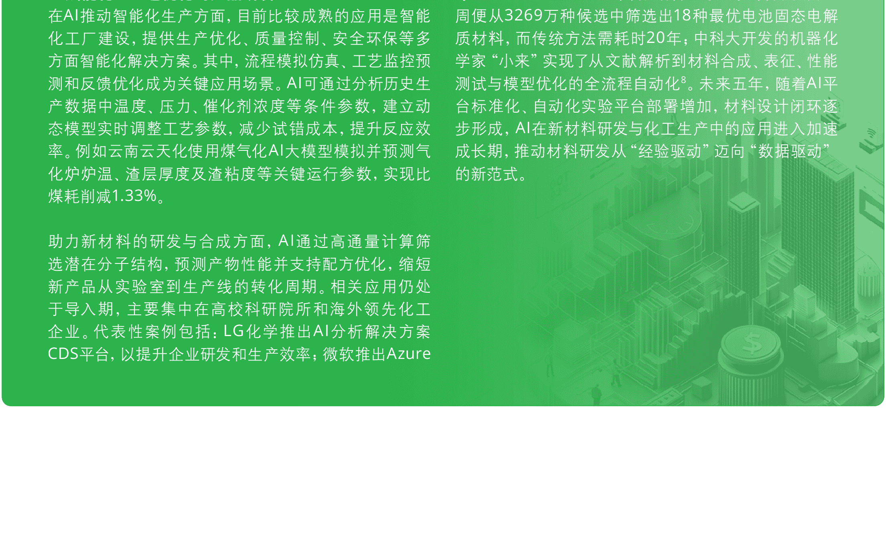

#### AI赋能化工工艺优化与产品研发

在AI推动智能化生产方面，目前比较成熟的应用是智能化工厂建设，提供生产优化、质量控制、安全环保等多方面智能化解决方案。其中，流程模拟仿真、工艺监控预测和反馈优化成为关键应用场景。AI可通过分析历史生产数据中温度、压力、催化剂浓度等条件参数，建立动态模型实时调整工艺参数，减少试错成本，提升反应效率。例如云南云天化使用煤气化AI大模型模拟并预测气化炉炉温、渣层厚度及渣黏度等关键运行参数，实现比煤耗削减1.33%。

助力新材料的研发与合成方面，AI通过高通量计算筛选潜在分子结构，预测产物性能并支持配方优化，缩短新产品从实验室到生产线的转化周期。相关应用仍处于导入期，主要集中在高校科研院所和海外领先化工企业。代表性案例包括：LG化学推出AI分析解决方案CDS平台，以提升企业研发和生产效率；微软推出Azure Quantum Elements平台，结合AI与量子计算，仅用一周便从3269万种候选中筛选出18种最优电池固态电解质材料，而传统方法需耗时20年；中科大开发的机器人化学家“小来”实现了从文献解析到材料合成、表征、性能测试与模型优化的全流程自动化。未来五年，随着AI平台标准化、自动化实验平台部署增加，材料设计闭环逐步形成，AI在新材料研发与化工生产中的应用进入加速成长期，推动材料研发从“经验驱动”迈向“数据驱动”的新范式。

- **AI+电力：AI支撑源网荷储协同，提升新能源预测与调度效率**

在电力行业，AI技术将全面赋能预测、预警、诊断、调度、交易等业务场景，并基于自身的学习能力，在应用中自主优化迭代，持续提升预测精度和泛化能力，促进电力系统智能化水平快速跃升。例如在交易环节，通过实时监控电力市场和预测需求，AI系统可以自主决策，快速执行交易，确保在最优价格点卖出或买入电力。这样的自动化交易系统将有助于提高发电企业参与市场的响应速度，优化交易效率。

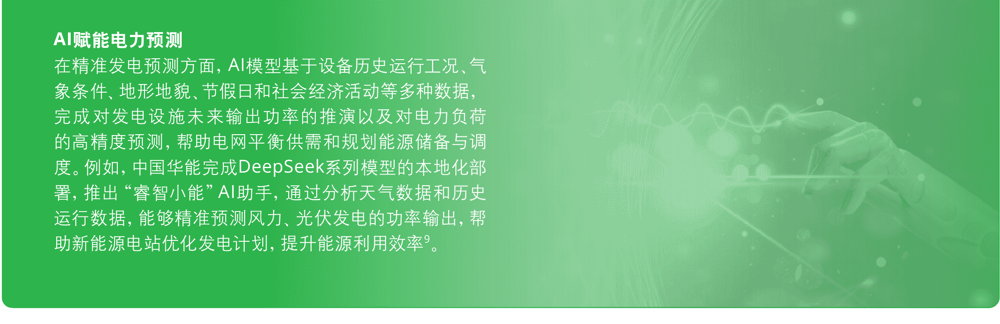

#### 能源技术体系加速演进，关键赛道多点突破

新能源技术为全球经济增长带来巨大机遇，成为世界各国及产业界瞩目的焦点。在政策及资本驱动下，能源技术正以前所未有的速度迭代创新并落地应用，多项高潜力技术已来到规模化前夜。在“十五五”时期，有望看到新能源技术从能源生产端到消纳端的全面爆发。

在能源生产端，钙钛矿光伏电池因其优异的光电转换效率和相对低廉的生产成本，在光伏建筑一体化（BIPV）等领域显示巨大应用潜力，甚至可制成附着于车辆、电子设备表面的柔性轻量化组件，实现光伏应用场景的创新升级。当前已有多家企业建成兆瓦级中试产线，随着钙钛矿光伏电池产业化进程提速，预计“十五五”期间量产效率将突破30%。小型模块化反应堆（SMR）凭借高灵活性、经济性与稳定性，被视为数据中心供能等场景下的创新解决方案。2024年全球首个陆上商用SMR——海南昌江“玲龙一号”反应堆进入设备安装阶段，预计将于2026年建成投运，该项目将成为SMR技术商业化进程中的重要里程碑。

在消纳端，氢燃料电池、固态电池等技术的发展将进一步为交通去碳化提速，而氢冶金技术的推广将打通能源与生产原材料的边界，充分释放氢能在工业领域的应用潜力。此外，直接空气碳捕集、电转液（PtL）合成SAF等前瞻性技术将进一步扩大示范规模，驱动二氧化碳再利用的资源闭环。

#### 图表10：前沿清洁能源技术产业化进展

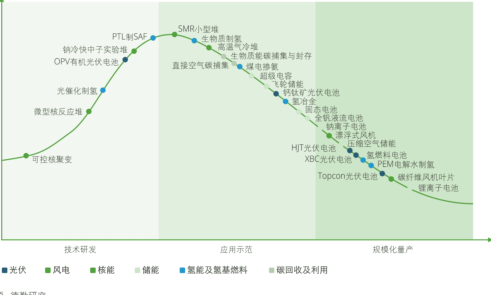

来源：德勤研究

注：本图参考IEA在《储能技术路线图》中提出的技术成熟度曲线，在其基础上增加光伏、风电、储能等领域新兴技术；图形中纵轴表示该技术对投资的需求程度与技术风险性，横轴表示该技术当前所处的产业化阶段（以截至2025年3月示范项目及量产进展为判断依据）。

#### 新型储能与绿氢应用技术市场需求爆发，“十五五”将是角逐未来主流技术路线关键期

在新能源高比例并网的趋势下，新型储能已成为支撑系统平衡、保障电力安全、提升新能源消纳能力的关键环节。同时，绿氢作为“跨能源、跨产业”的连接技术，其终端应用能力的突破正在成为中长期推动能源系统深度耦合和价值链延伸的关键因素。当前新型储能技术与绿氢应用技术呈现百花齐放的格局，随着“十五五”时期市场需求的爆发，主要技术路线的示范项目加速落地，未来的技术格局将逐步清晰。

#### 长时储能：全钒液流电池与压缩空气储能竞争未来主流技术路线，成本仍是关键

随着风电、光伏装机占比的持续提升，新型储能装机需求在全球范围内迎来爆发。预计2025—2030年中国内地新增新型储能装机约190GW，是现有装机规模的2.4倍。锂电池仍是当前新型储能的主流，装机占新型储能装机规模的90%以上，但其储能时长仅有2—4小时，难以支撑中长期的日间平衡需求。容量型长时储能技术将在“十五五”时期快速发展，而液流电池和压缩空气储能被视为最具潜力的技术选项。

- **全钒液流电池**：与锂离子电池同属于电化学储能技术，但在安全性和循环寿命上具有显著优势，并且能量单元与功率单元相互分离，具有较高的灵活性，易于扩展。全钒液流电池的原材料供应链成熟，商业化进程较为领先。截至2024年，国内液流电池储能装机量达1.81GWh，其中全钒液流电池占比超80%。

- **压缩空气储能**：具有规模大、寿命长、建设周期短、站址布局相对灵活等优点，有望成为抽水蓄能在大规模储能电站领域的重要补充。当前建成新型储能项目中，压缩空气储能规模占比尚不足1%，但在近一年来示范项目落地显著提速，截至2024年9月，国内投运并网/在建/拟建的压缩空气储能项目共有105个。

综合技术成熟度、建设周期、部署成本等因素来看，压缩空气储能较适用于源侧与电网侧的大规模储能场景，有望通过电力辅助服务市场机制实现收益，而全钒液流电池则将主要以长时+短时混合储能的模式实现商业化落地。在未来更高交易频次、高价格波动的电力市场环境下，储能效率与成本将成为项目业主选取技术路线的关键考量，也将是决定这两类储能技术规模化进程的核心指标。

#### 氢能应用技术：氢能产业化提速，应用技术准备度决定下游消纳推进节奏

随着多国氢能产业政策的出台和可再生能源制氢成本的不断优化，全球绿氢产能建设步入快车道。尽管2024年全球低碳氢产量还不足100万吨，从现有的规划项目来看，到2030年绿氢产能规模可能达到每年4900万吨。然而，氢能产业是否能在未来几年中实现前所未有的增长速度，下游绿氢应用技术准备度将成为决定性因素。未来几年中绿氢消纳的主要潜在场景包括：

- **交通领域——氢燃料电池**：通过氢能与电能的转换为重卡、公交和船舶等提供动力。随着功率密度和寿命等性能指标持续优化，氢燃料电池已步入商业化起步阶段，2024年国内氢燃料电池车销量突破5000辆。但未来仍面临加氢站建设以及与电动车的市场竞争等考验。

- **化工领域——绿氢合成氨/甲醇**：使用由绿氢和二氧化碳合成的绿氨或绿色甲醇替代传统化石燃料，被视为远洋航运等“难减排”行业脱碳的核心路径。在市场需求驱动下，风光制氢-合成氨/甲醇一体化项目快速落地，但应用成本、技术标准、配套设施等问题仍需产业链上下游合力突破。

- **工业领域——氢冶金**：以氢气代替碳还原铁矿石是钢铁行业脱碳的关键路径，面对不断收紧的碳监管政策以及下游客户价值链减排目标的传导，全球多家钢铁企业布局了氢冶金示范项目。而规模化应用仍受制于绿氢成本。

未来的绿氢应用领域技术不仅需具备更高的经济性和安全性，还需充分考虑与现有基础设施的兼容性。例如在航运业推动绿色甲醇和绿氨的应用需要对现有船舶进行技术改造，涉及庞大的投资和较长的周期，可能拖慢燃料替代节奏。

> 能源技术与智能化技术的深度融合创新将深刻影响能源行业竞争格局和商业模式。在新兴能源技术加速迭代、多种技术路线并行格局下，行业格局从龙头企业引领转向多个细分领域“冠军”赛跑。AI在能源领域的深度应用，不仅能推动行业效率提升与成本削减，也将为能源即服务（EaaS）等新兴商业模式的发展提供土壤，并促进跨领域的生态合作，例如电力企业与AI算法开发商的协同创新。  
> 对企业而言，拥抱新兴技术时在考察成本、效率等指标外，还需要充分评估基础设施兼容性、认证机制成熟度等因素，确保商业化落地的可行性。同时规避潜在风险，例如新兴技术标准不统一可能影响产品认可度，应用AI技术时可能存在的数据合规风险等。

### 趋势四：全球能源转型中长期趋势不可逆转，碳监管在贸易和产能调控中作用日益关键，成为转型重要抓手

在能源安全优先的考量下，一些国家的能源转型策略有所调整，例如当前美国的转型政策呈现一定不确定性。但即使短期内全球绿色转型节奏有所放缓，中长期来看趋势依然不可逆转。其中碳监管在国际贸易和产能调控中作用日益关键，将成为“十五五”时期推进转型的主要抓手。

#### 绿色转型仍是全球能源政策主旋律

##### 外部能源政策环境

为应对气候变化目标与地缘风险叠加的挑战，各国加快对本土清洁能源产业部署，力求提升本国在未来能源体系中的主动权。

- 全球已有超过50个国家和地区发布氢能发展战略，试图在未来燃料领域实现技术与市场的领先；
- 尽管美国在气候政策上有所回摆，但对先进核能、小型模块化反应堆、绿色燃料等清洁能源前沿技术投资依然维持高位，体现出其能源政策兼顾“去碳”与“自主”；
- 欧盟推出《2025可负担能源行动计划》，推动天然气、电力、氢能等基础设施一体化发展，提升成员国间能源调度与储备能力；
- 中东、拉美、东南亚等新兴市场国家陆续制定发布能源转型路线图，通过发展可再生能源实现绿色转型与经济发展的双赢。例如沙特政府提出到2030年可再生能源在能源结构中占比达到50%的目标，巴西则在2024年发布《未来燃料法》，旨在通过支持绿色柴油、可持续航空燃料和生物甲烷等产业从而引领全球能源转型。

##### 中国能源政策

#### 图表11：中国近期重点能源政策回顾（自2024年7月绿色转型顶层设计文件发布以来关键政策）

| 分类 | 政策内容 |
|---|---|
| 顶层指导 | 《2030年前碳达峰行动方案》2021.01 |
| 顶层指导 | 《关于加快经济社会发展全面绿色转型的意见》2024.07 |
| 法律 | 《中华人民共和国能源法》2025.01.01起施行 |
| 法律 | 《中华人民共和国可再生能源法》修订中 |
| 法律 | 《中华人民共和国电力法》修订中 |
| 市场机制 | 《关于支持电力领域新型经营主体创新发展的指导意见》2024.11 |
| 市场机制 | 《关于深化新能源上网电价市场化改革促进新能源高质量发展的通知》2025.01 |
| 市场机制 | 《关于全面加快电力现货市场建设工作的通知》2025.04.16 |
| 市场机制 | 绿电绿证市场交易机制（待完善） |
| 市场机制 | 绿电与碳市场衔接机制（待完善） |
| 产业政策 | 《加快工业领域清洁低碳氢应用实施方案》2024.12 |
| 产业政策 | 《新型储能制造业高质量发展行动方案》2025.01 |
| 产业政策 | 《光伏制造行业规范条件》2024.11 |
| 行动方案 | 《关于大力实施可再生能源替代行动的指导意见》2024.10 |
| 行动方案 | 《加快构建新型电力系统行动方案（2024—2027年）》2024.07 |
| 行动方案 | 《配电网高质量发展行动实施方案（2024—2027年）》2024.08 |
| 行动方案 | 《电力系统调节能力优化专项行动实施方案（2025—2027年）》2024.12 |
| 行动方案 | 《新一代煤电升级专项行动实施方案（2025—2027年）》2025.03 |

来源：德勤研究

- **能源法明确可再生能源优先地位，绿电最低比重目标或将逐步落地到行业与企业主体**

  绿电替代正从供给侧政策逐步过渡到消费端制度建设阶段。《能源法》释放了制定可再生能源消纳最低比重目标的信号，意味着可再生能源将从“项目优先上网”转向“消费端配额考核”。而根据此前国家发展改革委等部门发布的《电解铝行业节能降碳专项行动计划》中提出的“2025年电解铝行业可再生能源利用比例达到25%以上”的具体目标，未来绿电消费责任将逐步分解到行业与重点用能企业。预计“十五五”期间，将建立分行业最低绿电使用比例指标体系，如数据中心、冶金、化工、交通等；地方政府也将以项目审批、能评审查、电价机制等为手段，将绿电消费责任压实到重点用能单位；电网企业、电力交易机构、绿电平台将成为政策执行的中介枢纽，推动绿电合约（PPA）、绿证交易、时间分布优化等机制常态化。

- **新型电力系统建设将是“十五五”前中期的重要主题，市场成为能源转型的重要驱动**

  自2024年下半年以来，相关部门相继推出针对新型电力系统建设、配电网改造、煤电升级改造等的多个实施方案，重点任务与时间节点安排清晰。为支撑高比例可再生能源的消纳，新型电力系统建设将是“十五五”前中期的重要主题，特别是灵活性改造、智能化升级等有助于提升系统韧性的项目将成为投资重点。同时，在硬件设施之外，市场的作用也将充分显现。石油、天然气等化石能源完成价格机制改革后，电力市场化改革在近期按下了提速键，电力价格机制的完善将改写电力资产价值体系，从而优化供需匹配模式。此外，《加快工业领域清洁低碳氢应用实施方案》的出台也显示，在氢能等新兴领域，在产能进入快速爆发期后，政策层面也将注重从消费端激发需求，保障产业的有序发展。

#### 碳监管范围及力度持续加大
##### 国际市场碳规则外溢加速

自2023年10月1日以来，欧盟碳边境调节机制（即碳关税，CBAM）的过渡期已平稳运行超过一年，距其正式实施也仅剩不到一年时间。英国政府也在2024年10月宣布将于2027年1月1日开始实施英国版的碳边境调节机制。碳关税制度在全球范围内的扩散落地，将直接推高相关企业出口钢铁、水泥、铝等高碳产品的成本，倒逼企业强化碳管理能力以适应贸易出口要求。

与此同时，投资者与消费者对于可持续相关信息的关注度与日俱增。为适应国际大客户在采购中对低碳供应链的硬性要求，以及提升对绿色资本等的吸引力，能源与制造业企业在ESG绩效、碳排放信息披露、绿电替代等方面的能力打造将成为“十五五”时期的重要议题。

#### 图表12：全球碳关税发展概览

| 地区 | 时间/阶段 | 机制名称与内容 |
|---|---|---|
| 欧盟 | 2026 | 机制名称：Carbon Border Adjustment Mechanism（CBAM）；状态：试运行阶段于2023年10月启动，将于2026年1月1日起正式生效并征税；适用范围：钢铁、水泥、电力、铝、化肥、氢气等碳密集型产品；特点：全球第一个正式落地的碳边境机制，数据申报已启动 |
| 日本 | 2028 | 机制名称：碳定价机制考虑中（可能含边境措施）；状态：2023年起设立专家小组评估CBAM可行性，未宣布明确实施时间表；但计划在2028财年（即2028年4月至2029年3月）开始对化石燃料进口商征收碳税 |
| 加拿大 | （未标注年份） | 机制名称：提案包括Foreign Pollution Fee Act、Clean Competition Act（CCA）、Fair Trade and Climate Act等；状态：多个版本立法草案已提出，但尚未达成共识 |
| 美国 | （未标注年份） | 状态：尚未提出具体CBAM立法，但已启动对欧盟CBAM影响的专项评估；适用范围：铜、锂等资源出口品；特点：高度关注欧盟CBAM影响，推进碳标签、绿色矿产认证与碳市场建设 |
| 英国 | 2027 | 机制名称：UK Carbon Border Adjustment Mechanism（UK CBAM）；状态：已宣布将在2027年实施；适用范围：与欧盟类似，预计包括钢铁、铝、水泥、化肥、氢气等；特点：政策设计将借鉴欧盟CBAM，细则制定中 |
| 澳大利亚 | （计划实施） | 机制名称：拟议中的CBAM；状态：2023年提出立法框架，目标2026年前后实施；适用范围：高碳排行业（暂未具体明确）；特点：强调公平贸易与减排政策对接，目前处于政策咨询阶段 |
| 智利 | （考虑实施） | 状态：2023年发布碳泄漏和贸易影响评估报告，正就边境调节机制展开讨论；适用范围：出口导向型高排放行业（矿产、能源等）；特点：关注出口导向行业与对欧贸易的联动性 |

来源：德勤研究

#### 中国碳市场扩容，石化企业减排压力增加

2025年3月26日，生态环境部正式发布《全国碳排放权交易市场覆盖钢铁、水泥、铝冶炼行业工作方案》。工作方案将钢铁、水泥、铝冶炼行业纳入碳市场，新增约1500家重点排放单位，使全国碳市场覆盖二氧化碳排放总量的占比提升至60%以上。这意味着，全国碳市场的调控功能正从单一的电力行业，向更多工业源扩展，碳配额开始对实体制造企业的经营成本、投资决策和技术路径产生实质性影响。对能源企业而言，这不仅是交易主体的扩大，更是碳资产管理能力的升级窗口。

根据“十四五”至“十五五”政策路径，民航、造纸、石化等行业也将陆续纳入全国碳市场。其中，石化行业碳排放总量位居全国各类工业部门前列，碳排放强度大、流程复杂，对碳监测、报告与核查（MRV）体系的要求也更高，预计将在“十五五”中后期进入纳管阶段。

#### 图表13：中国碳市场行业覆盖路线展望

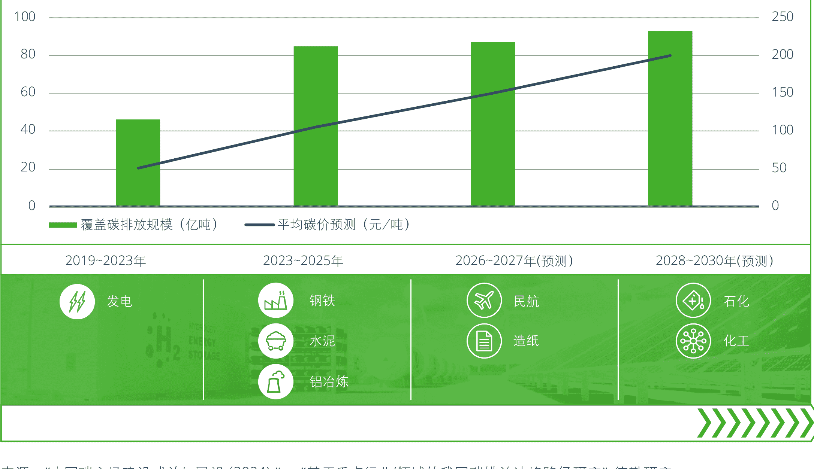

来源：《中国碳市场建设成效与展望（2024）》《基于重点行业/领域的我国碳排放达峰路径研究》、德勤研究

> “十五五”时期，尽管全球能源转型政策存在一定不确定性，但在部分细分领域中仍蕴含充足的发展潜力。例如，氢能、绿色燃料等新兴产业将是未来几年中许多国家大力支持的方向，碳监管政策的收紧也将进一步激发绿色采购、能效管理、碳资产管理等服务需求。

对企业而言，部署绿色替代、碳捕集利用等减排技术，以及推进碳排放披露、开展产品绿色认证、碳足迹认证等，不再仅仅是出于碳合规的考量，也是实现产品/方案绿色增值、提升投资者吸引力的必然选择。

## 化石能源高效转型

化石能源虽不再处于增量核心，但其在能源安全、产业支撑和经济韧性中的作用依然不可替代。2025至2030年，油气、石化和煤炭等产业将在双重压力下迈向高效转型：一方面，需要稳定供应与保障基础工业体系的稳定运行；另一方面，必须提升清洁化、低碳化水平以回应政策约束与市场诉求。因此，未来化石能源的关键词不再是简单的“退出”，而是“提效、降碳、重构角色”，其转型将成为能源体系与产业体系深度融合的关键一环。

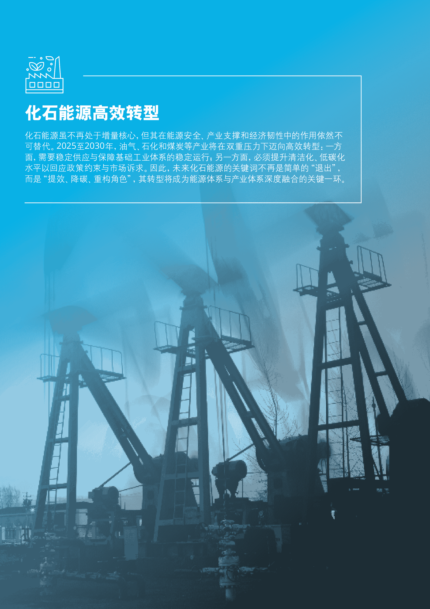

### 趋势五：油气行业中长期需求仍将维持高位，能源巨头调整升级转型战略

### 2025-2026年国际油价受增产计划和关税不确定性影响面临下行压力

2025年油价面临多重下行压力，主要受到供应增加和关税政策不确定性影响。欧佩克+宣布自5月起日均增产41.1万桶，远高于此前宣布的13.5万桶/日。多个机构纷纷下调原油价格预期。考虑到关税政策可能影响2025和2026年全球经济增长前景，未来油价仍存在下行风险。然而，供应侧投资不足、新能源推广速度不及预期等因素，可能推高油价，从而使油价维持高波动。

从各大机构对未来油价的预测来看，在现行政策情景下，多数机构认为今年布伦特原油价格徘徊于65-75美元/桶，而对2026年及之后的油价预测则呈现较大的差异性，显示未来油价高度取决于国际环境、政策执行与技术替代节奏。

#### 图表14：各大机构布伦特原油价格走势预测

| 布伦特原油价格（美元/桶） | 国际能源署 | 美国能源信息署 | 世界银行 | 摩根大通 | 高盛 | 巴克莱银行 | 德勤全球 |
|---|---:|---:|---:|---:|---:|---:|---:|
| 2024 | 81 | 81 | 81 | 81 | 81 | 81 | 81 |
| 2025E | 79 | 74 | 64 | 66 | 60 | 66 | 73 |
| 2026E | 70-85 | 66 | 60 | 58 | 58 | 60 | 72.4 |
| 2030E | 69-94 | — | — | — | — | — | 78.4 |

来源：根据公开信息整理，德勤研究

### 全球石油需求预计在2030-2035年达到峰值并长期维持高位

中长期来看，全球石油需求预计将在2030～2035年后达到峰值，但峰值后需求并不会急剧下降，而是长期维持高位。

IEA《世界能源展望2024》指出，在目前的市场条件和政策下，2030年全球石油需求达到约1.06亿桶/日，随后进入平台期或缓降。据Vitol预测，到2030年，全球石油需求将进一步增长至近1.1亿桶/日，并在2030年代中期之前维持这一高位。到2040年，需求仍维持在约1.05亿桶/日。

这种需求长期处于高位的趋势，带来了对石化产品、塑料以及航空燃料的持续需求。虽然交通运输领域对汽油和柴油的消费预计将逐步减少，但来自其他行业的增长将在很大程度上对冲这一下降。全球正推进应对气候变化的进程，但整体来看，各国仍将平衡减排与经济发展的关系。在这一背景下，石油在未来较长时期内，仍将在全球能源结构中占据重要地位。

#### 油气巨头重新评估转型战略，加大传统能源领域投资

能源安全和可负担性逐渐成为政策制定的优先考虑，能源转型可能延迟。未来很长时间全球石油需求仍将处于高位，而目前全球油气行业的投资处于低位。

伍德麦肯兹的分析表明，在延迟能源转型的情景下，当前的投资水平不足以满足全球新增能源需求，全球上游油气投资需增加30%，即从每年5000亿美元上升至6600亿美元，才能确保2050年前每日额外供应600万桶石油和150亿立方英尺天然气。

在传统油气业务利润更有保障和可再生能源接连亏损的对比下，全球多家能源巨头已开始重新评估其转型战略，加大传统能源投资，或缩减新能源投资。

#### 图表15：国际油气巨头调整转型战略

| 公司 | 战略调整内容 |
|---|---|
| 英国石油公司 | 放弃了到2030年前减油气产量的目标，其首席执行官大幅缩减了原本激进的能源转型计划 |
| 壳牌 | 对其战略进行大幅调整，将资源集中于利润率更高的传统油气项目，稳定石油产量的同时提高天然气生产量，削弱低碳与可再生能源部门的地位 |
| 道达尔 | 计划将2025年在“低碳分子”领域的资本支出削减至5亿美元，较2024年减少约44%；电动汽车充电和沼气发展缺乏可观回报，将重新配置资源 |
| 挪威国家石油公司 | 将未来两年对可再生能源的投资削减50%，并放弃“到2030年将一半固定资产预算用于可再生能源和低碳产品”的承诺；其石油和天然气产量将从2024年的200万桶油当量/日增长至2030年的220万桶油当量/日 |
| 埃克森美孚 | 将扩大石油天然气投资，计划2025年投资270至290亿美元，并在2026年至2030年间每年投资280至330亿美元；其目标是到2030年将石油和天然气总产量提高至540万桶/日 |

来源：Oil Price，德勤研究根据公开资料整理

中国“三桶油”当前聚焦于提升油气主业效率，同时有选择地投资于新能源领域。中石油加快非常规资源开发，强化鄂尔多斯、四川、塔里木等盆地的页岩气与深层油气勘探。中石化则提出“油气热氢服”五大业务协同战略，积极拓展氢能、换电、可降解材料，计划建设全国最大加氢站网络，并与宁德时代合作全面布局换电生态。中海油将推动油气勘探开发与新能源融合发展，逐步扩大海上风电规模。整体来看，三大油企在稳步推进油气保供的同时，对新能源投资注重产业协同，优先发展与现有业务紧密结合的氢能、风电等领域，稳中求进地应对能源转型机遇。

> 随着近期油价承压下行，油气企业正面临盈利空间收窄的现实压力，但中长期全球需求依然稳健，这为企业调整投资节奏、优化资源配置提供了窗口期。一方面，短期油价波动要求企业更加注重成本控制和现金流管理，稳住基本盘；另一方面，中长期稳定的需求预期又意味着核心油气资产依然具备战略价值。在这种背景下，企业既要避免对新能源盲目冒进，也不能忽视技术升级和业务转型的长期必要性。

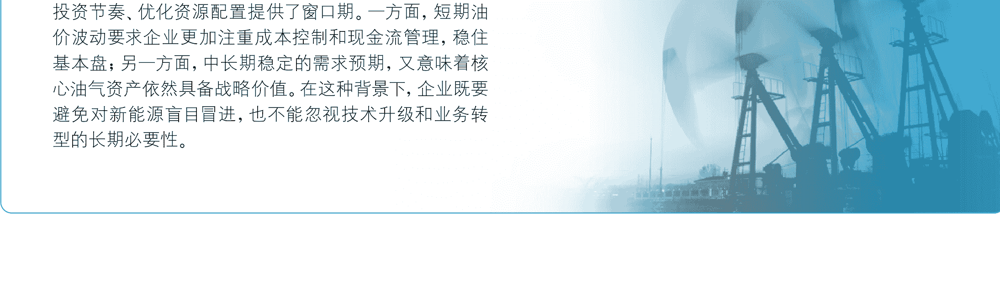

### 趋势六：化工产业高端化与产能外迁并进，中国凭借产业链与市场优势崛起为全球化工新材料产能重心

随着全球能源结构的深度低碳化，化石能源的功能定位发生转变。其传统“燃料属性”不断弱化，“材料属性”日益凸显，石油、天然气、煤炭等资源不再只是能源供给的基础，更成为生产高性能材料的关键原料。这一变化推动全球化工产业从“大化工”模式向“高精专”转型，产业价值链重心向精细化学品、功能性材料和绿色新材料倾斜，推动价值链向高端延伸。与此同时，大宗化学品领域的产能过剩愈发严重，行业利润率承压，国际化工巨头相继调整产品结构，削减传统产能，聚焦新材料领域投资。在这一全球产业重塑背景下，中国凭借完整的产业链体系、庞大稳定的市场需求以及政策推动，正在加速建设高端化工新材料产能，逐步崛起为全球化工产业的核心力量。结合全球趋势、中国企业海外并购机遇，以及国内新材料产业的发展势能，中国正站在全球化工产业格局重塑的战略高地。

向全球市场输出低价大宗化学品，进一步挤压欧美等传统高成本地区的竞争空间。预计到2030年，欧美和日本将聚焦于高端材料，逐步退出对成本敏感的传统大宗化工领域；中国依托完整的产业链、强大的制造能力及庞大的市场需求，在巩固基础化工产能优势的同时，加快建设高端新材料产能，成为全球化工产能的核心区域；中东与东南亚则以资源和成本优势为基础，继续深耕基础化工，并延伸至部分中端产品，形成多极协同的新一代全球化工产业版图。

#### 全球化工产业向高端化演化，区域分工加速

**大宗化学品产能过剩，产业重心向高附加值演化。** 在低碳转型和技术迭代双重驱动下，全球化工产业正在经历结构性调整：一方面，大宗化学品领域产能持续扩张、价格下行，行业利润率显著承压。根据中石油经研院预测，到2030年全球乙烯产能有望达到2.7亿吨/年左右，大幅超过需求增速。这一趋势不仅拉低了全球基础化工品的市场价格，也引发了行业利润率持续下滑。另一方面，新能源汽车、5G通信、可穿戴设备、绿色建筑等新的应用场景快速释放对高性能材料的需求，带动产业价值链加速向高附加值方向迁移。

**全球化工产业格局分化，区域化与专业化并行。** 中东地区依托天然气资源优势，亚洲新兴市场依凭低成本制造能力，持续向全球市场输出低价大宗化学品，进一步挤压欧美等传统高成本地区的竞争空间。

#### 国际化工巨头调整产品布局，中国化工企业海外并购迎来窗口期

**国际化工巨头传统产品业务利润下滑，加快战略调整。** 受全球供需过剩、成本上升与竞争格局变化影响，国际化工巨头普遍面临传统产品利润下滑压力，加快战略转型。一方面剥离低效资产、收缩传统产线，另一方面聚焦新材料板块加大布局。如巴斯夫提出“2030战略”，削减传统产能，投资65亿美元用于中国湛江一体化新材料项目，布局亚洲新材料市场。陶氏化学则退出低效聚乙烯业务，增资美国半导体材料项目。科思创（Covestro）聚焦高性能聚碳酸酯和可持续PU材料，近年来80%研发投向可降解塑料和电池材料。

**中国化工企业迎来良好的海外并购机遇。** 三类资产具有吸引力：
- 一、具有一定技术壁垒但利润承压的中端化工资产，能够帮助中国企业快速填补技术短板，并借助原有品牌和渠道拓展海外市场；
- 二、位于欧美、拥有成熟品牌与市场渠道的资产，可以为中国企业打开发达市场通道；
- 三、因环保法规被迫出售的欧洲资产，若转移至中国，通过升级改造和本地工程能力赋能，有望实现盈利能力重构。

#### 图表16：化工企业海外并购资产类型

| 资产类型 | 说明 | 典型领域 |
|---|---|---|
| 具备技术壁垒但利润下滑的中端化工产能 | 巨头战略聚焦高端材料，主动剥离利润下滑、但仍具技术和市场基础的中端化工资产 | 工业涂料、高纯度技术化学品、精细化工中间体 |
| 具备品牌和欧美市场渠道的资产 | 巨头为降低运营成本，或规避碳排放法规，出售部分位于欧美高成本地区的产线 | 高性能纤维及复合材料初级加工 |
| 因环保法规被迫出售的资产 | 某些资产在欧洲被迫出售，但其设备先进、技术成熟，可以在中国通过升级实现绿色转型 | 染料、颜料、特种助剂、农药中间体 |

来源：根据公开信息整理，德勤研究

#### 中国将成为全球化工产能新中心

在产业链完整性、工程实施能力与本土市场支撑的共同作用下，中国正在加快迈向化工新材料产能中心。截至2024年，中国化工新材料产业规模约1.18万亿元，同比增长10.9%。随着新能源车、5G通信、高端制造等新兴产业对高性能材料需求的持续释放，预计到2027年，该产业规模将突破1.6万亿元，稳居全球化工产业的重要一极。

随着技术迭代不断推进，化工新材料覆盖范围随技术迭代持续拓展。高端聚烯烃、工程塑料等细分品类直接受益于节能环保、新能源、新一代信息技术和高端装备等新兴产业的发展，已形成较大市场规模，预计中长期市场需求将保持增长韧性。

尽管当前高端材料仍存在一定进口依赖，但在关键原材料供应链加快国产化的趋势下，具备产能扩张潜力。新材料将成为炼化及精细化工企业实现结构优化和高质量发展的关键布局方向。

#### 图表17：重点化工新材料领域一览

| 细分品类 | 2024年国内产业规模（亿元） | 2024年全球产业规模（亿元） | 主要应用领域 |
|---|---:|---:|---|
| 工程塑料 | 969.6 | 6348.08 | 汽车、电子、建筑、高端装备 |
| 高端聚烯烃 | 1128.2 | 5589.61 | 汽车、包装、医疗、光伏 |
| 聚氨酯材料 | 2485.2 | 4344.23 | 建筑、交通、冷链、汽车 |
| 高性能橡胶 | 1890 | 4188.01 | 汽车、电子、高端装备、交通 |
| 功能性膜材料 | 778 | 3658.76 | 电子、包装、航空航天、医疗 |
| 锂电池材料 | 2865.1 | 3171.12 | 汽车、电子、储能 |
| 氟硅材料 | 746.6 | 2433.82 | 光伏、高端装备、汽车、半导体 |
| 电子化学品 | 380.2 | 1535.19 | 半导体、光伏、电子 |
| 高性能纤维 | 280.8 | 1169.46 | 航空航天、汽车、风电、高端装备 |

来源：赛迪顾问，德勤研究

#### 图表18：代表性化工新材料规划产能项目

| 项目 | 投资方 | 投资额 | 品类 | 预计投产时间 |
|---|---|---|---|---|
| 岳阳100万吨/年乙烯炼化一体化项目乙烯工程 | 中石化湖南石化 | 356.8亿元 | 乙烯、裂解汽油、高端聚烯烃 | 2025年12月 |
| 镇海炼化二期扩能与先进材料项目 | 中石化镇海炼化 | 416亿元 | 高端聚烯烃、先进材料（如碳纤维、高性能工程塑料）、特种化学品 | 2025年1月 |
| 吉林石化炼油化工转型升级项目 | 中石油吉林石化 | 339亿元 | 聚合级乙烯、聚合级丙烯等 | 预计2025年内投产 |
| 烟台HMDI扩能项目（2万吨/年扩产至4万吨/年，HMDI装置同时兼产3万吨/年HDI产品） | 万华化学 | 35.62亿元 | 二环己基甲烷二异氰酸酯（HMDI）、六亚甲基二异氰酸酯（HDI） | 预计2025年内投产 |
| 福州TDI二期扩建36万吨/年项目 | 万华化学 | 16.26亿元 | 聚氨酯TDI | 预计2025年内投产 |
| 福建MDI装置技改扩能项目（40万吨/年技改扩能至80万吨/年） | 万华化学 | 主装置投资：约2.21亿元 | 聚氨酯MDI | 预计2025年内投产 |
| 烟台海阳新一代电池材料产业园 | 万华化学 | 168亿元 | 电池正负极材料 | 预计2026年6月投产10万吨磷酸铁锂生产线，2032年12月全面投产 |
| 重庆聚氨酯MDI优化提升项目（40万吨/年扩产至53万吨/年） | 巴斯夫 | —— | 聚氨酯MDI | 2024年12月试运行 |
| 上海聚氨酯减振元件Cellasto工厂扩建项目 | 巴斯夫 | 约5亿元人民币 | 聚氨酯减振元件（Cellasto） | 预计2027年投产 |
| 湛江一体化基地 | 巴斯夫 | 总投资约100亿欧元 | 工程塑料、聚氨酯、涂料等 | 2022年9月首套装置（工程塑料改性装置）顺利投产；预计2030年项目全面投产 |

来源：德勤研究根据公开资料整理

## “十五五”时期中国能源行业关键议题｜化石能源高效转型

随着全球能源结构向低碳化加速推进，化石能源的“燃料属性”逐渐弱化，其“材料属性”日益凸显，石油、天然气、煤炭等资源正更多用于高性能材料的合成与应用。化工企业正面临一系列关键抉择与系统性变革挑战。首先，传统以规模与成本取胜的模式已难以为继，企业需从资源加工者向材料创新者和应用场景嵌入者转型，构建产品力和系统集成能力。其次，面对“卡脖子”环节集中暴露，提升原创技术突破能力与关键原料自主可控能力将是中长期发展的决定性因素。此外，在全球区域化、绿色化趋势加快的背景下，企业还需统筹国际产能配置、政策适应能力与ESG合规体系建设，提升跨周期抗压与全球协同运营能力。未来领先企业的核心竞争力将从“拼价格、拼产能”向“拼技术、拼生态”跃迁，那些能够在价值链高端稳住技术优势、在供应链重构中灵活应变、并在绿色转型中建立品牌影响力的企业，将在新一轮产业重塑中脱颖而出。

### 趋势七：煤炭达峰尚需时日，调节电源与煤化工双轮驱动产业功能重塑

#### 全球煤炭需求达峰尚早，亚洲需求稳中有增，欧美需求萎缩延缓

自2022年全球能源格局因地缘冲突与供应链波动发生深刻变化以来，主要经济体普遍对煤炭政策进行了短期内的务实调整，强化煤炭保供措施以应对能源供应风险。然而，从中长期趋势来看，全球“去煤”进程并未根本逆转，而是呈现出区域推进路径分化、实施节奏因地调整的局面。

#### 全球煤炭需求增长势头延续，峰值时间延后

根据国际能源署（IEA）于2024年12月发布的《2024年煤炭市场报告》，全球煤炭需求达峰尚需时日。2024年全球煤炭消费量预计达到87.7亿吨，较2023年小幅增长1%。IEA最新预测显示，煤炭需求将持续增长至2027年，届时预计将达到88.73亿吨。这一趋势较其在2023年报告中预测的“2025年前后全球煤炭消费达到峰值”的判断有所延后，反映出全球能源安全压力下，煤炭“兜底”作用短期仍不可或缺。

中国、印度、东盟等亚洲经济体仍是全球煤炭需求增长的主力，支撑了整体需求的高位运行。欧盟和美国虽持续推进减煤进程，但在政策、技术与市场因素影响下，需求萎缩的速度有所放缓。

#### 主要经济体煤炭政策趋势：短期稳煤，长期脱煤

在全球能源格局动荡、供应安全面临挑战的背景下，主要经济体短期内普遍强化煤炭保供措施，以稳定能源系统应对风险。但从长期来看，各国并未背离原有“去煤”与能源低碳化路径，正致力于在保障能源安全与推动绿色转型之间实现战略平衡。

- **欧盟**：2024年煤炭消费同比减少12%，虽低于2023年23%的降幅，但依然延续下降态势。2022年起，部分成员国短期增加煤电使用应对天然气短缺；但德国等国于2023年重申2030年“退出煤炭”计划。整体欧盟碳市场（EU ETS）持续压制煤电经济性，“去煤”方向明确。
- **美国**：2024年煤炭消费减少5%，下降幅度明显低于2023年的17%，反映出政策调整带来的阶段性缓冲。2025年3月12日，美国环境保护署（EPA）撤销拜登时期关于“燃煤电厂”的监管规定，松绑汽车尾气排放及环境标准。然而，市场层面煤电退役进程未止，天然气与新能源持续挤压煤电份额。长期来看，美国去煤趋势不变，政策波动主要受选举周期与能源市场变化影响。
- **印度**：2024年煤炭消费增长6%，虽较2023年10%的高增速有所放缓，但需求依然强劲。2023年电力结构中70%以上依赖煤电，2024年产量目标10亿吨，并强调2030年前不承诺削减煤炭消费。
- **中国**：据中国煤炭工业协会公布的数据，2024年煤炭消费48.9亿吨，同比增长5%，略低于2023年的6%。供应方面，2024年煤炭产量约45.7亿吨，同比下降1.7%；投资方面，煤电灵活性改造项目加速，重点支持新能源接入与系统调节。政策导向来看，“2030年前碳达峰”目标明确，煤炭作为能源安全“压舱石”，其角色正由“主力电源”向“调节电源”转变。未来重点主要聚焦推进煤电与新能源协同，以及推动煤化工高端化发展。

## 图表19：全球煤炭消费变化（2023-2027）

- 中国
- 印度
- 东南亚
- 美国
- 欧盟
- 其他
- 预测值

来源：IEA

## 图表20：2023-2024主要经济体煤炭消费变化

- 2023
- 2024

来源：IEA、德勤研究

#### 煤电角色正由“主力电源”向“调节电源”转变，风光储与煤电融合发展提速

电力行业占中国煤炭消费总量的54%，煤电行业对煤炭需求的方向性意义重大。随着能源系统低碳化进程推进，煤电的角色正由“主力电源”向“调节性电源”过渡，成为减少新能源波动性的重要手段。

新《能源法》明确提出煤炭在能源供应体系中承担**基础保障**和**系统调节**作用。进入“十五五”时期，能源价格机制优化，将推动煤电机组的容量补偿与辅助服务价值得到体现，支撑其从主力电源向电力系统“灵活性调节器”的转型。

2025年4月，国家发改委、能源局联合发布《新一代煤电升级专项行动实施方案（2025-2027年）》，对煤电灵活性响应的深度、速度、能耗等技术指标提出更高要求。以深度调峰技术为例，未经改造的煤电机组灵活性运行负荷往往不能低于40%；通过技术升级，煤电机组可以实现在40%额定负荷以下正常运转，参与调峰调频。根据该方案，现役机组最小发电出力占额定功率比例应在25%-35%之间，而新建机组则需达到25%以下，显著提升其在高比例新能源电力系统中的适应性和支撑能力。该行动方案不仅有助于巩固煤电在电力系统中的“兜底保障”作用，更将有效缓解当前灵活性资源不足的问题，从而支撑2025—2027年年均新增2亿千瓦以上新能源的合理消纳利用。

## 图表21：《新一代煤电升级专项行动实施方案（2025-2027年）》主要技术指标要求

|  | 现役机组 | 新建机组 | 新一代示范机组 |
|---|---|---|---|
| 深度调峰最小发电出力 | 最小发电出力达到额定负荷的25%~35% | 25% | 20% |
| 负荷变化速率技术要求 | 0.8%~2.5%额定功率/分钟 | 50%负荷率以上：2.2%额定功率/分钟；30%-50%负荷率：1%额定功率/分钟 | 50%负荷率以上：4%额定功率/分钟；30%-50%负荷率：2%额定功率/分钟 |
| 启停调峰能力 | 鼓励 | 鼓励 | 要求 |
| 宽负荷高效技术要求 | 30%负荷条件下，煤耗较设计工况增幅不高于25% | 30%负荷条件下，煤耗较设计工况增幅不高于20% | 30%负荷条件下，煤耗较设计工况增幅不高于15%；设计工况煤耗：270克/千瓦时 |
| 清洁降碳技术要求 | 积极推进实施低碳化改造 | 应预留低碳化改造条件，鼓励实施 | 需采用降碳措施，度电碳排放水平较2024年同类型机组降低10%~20% |

来源：国家发改委、能源局

煤电灵活性改造不仅是推动电力系统高比例新能源接纳的关键路径，更孕育出广阔的产业升级与投资机遇。其低成本、高潜力的特点，使其成为当前能源转型背景下最具现实可行性的灵活性资源补充手段。同时，灵活性改造将拉动相关设备制造、智能控制系统、工程服务等多个产业链环节发展，形成新的经济增长点。此外，煤电与煤炭企业通过产业链一体化，有效对冲煤价波动风险，增强整体盈利韧性，也为煤炭行业在“去煤”大势下寻找到结构性转型突破口。

**风光储和煤电融合发展提速。** 煤电灵活性改造是当前成本最低的灵活性资源之一，单位成本仅为0.12元~0.4元/度。^13 截至2024年第三季度末，中国煤电灵活性调节能力已超过6亿千瓦（600GW），成为支撑高比例新能源并网的关键资源。按照改造计划，到2027年有望释放56GW灵活性调节能力。若全面推广启停调峰技术，中长期潜力超过400GW^14，成为新能源发展的关键支撑。

**广阔的市场规模与技术设备机遇。** 据电力规划设计总院估算，2024年到2027年全国火电灵活性改造约4亿千瓦，平均每年改造约1亿千瓦^15。按每千瓦投资在50-200元测算，对应市场规模达50~200亿元/年。“十五五”期间，新一代煤电设备以及智能化技术也将加速推广应用，预计将累计带动千亿级投资。

**煤电一体化推动企业产业协同发展。** 多数大型煤企已布局电力、供热、煤化工等下游业务，正通过煤电一体化发展模式实现产业链优化。通过自有电厂对内部煤炭的优先采购，实现高比例长协煤的稳定兑现，降低煤价波动对企业整体利润的冲击，提升经营稳健性。

#### 图表22：中国煤炭消费量变化

来源：《中国能源展望2060》（2025年版），德勤研究

#### 煤化工延伸煤炭产业价值链，但经济性高度取决于煤炭与原油价格

中国煤炭消费主要集中在电力、钢铁、建材及煤化工四个行业，其中化工用煤在非电用煤的占比约为23%。2020年至2024年，化工煤消费量由2.0亿吨增至2.9亿吨，年均复合增长率（CAGR）达9.7%，远高于同期动力煤整体消费增速（CAGR为5.0%）。这一增长反映出煤化工在推动煤炭资源“原料化”利用、延伸能源产业链方面的战略价值持续增强。

#### 西北地区为中国煤化工的核心区域

新疆、陕西等煤炭资源丰富的地区凭借低廉的煤价和供水、铁路运输等完善的配套基础设施，为煤化工项目提供了重要支撑。目前西北主要的煤化工省份共规划煤制烯烃2135万吨、煤制油1800万吨、煤制气400亿方、煤制甲醇960万吨、煤炭综合利用3920万吨（以进料计），耗煤量总计3.78亿吨。其中，新疆已规划的现代煤化工项目投资额高达8000多亿元，其中：规划煤制烯烃项目共9个，合计1195万吨，投资规模2575亿元；煤制天然气项目11个，合计400亿方，投资规模3109亿元；煤制油项目3个，合计700万吨，投资规模1043亿元。

#### 图表23：主要煤化工大省新增煤化工项目规划产能（万吨）

来源：生态环境部，鄂尔多斯市人民政府，流程工业网，煤化工信息网，现代煤化工等，天风证券研究所

#### 煤制烯烃、煤制油、煤制气和煤制甲醇为主要领域

- **煤制烯烃**  
  2024年国内聚乙烯、聚丙烯各工艺产能占比中，油制烯烃工艺分别占据78%和54%，煤制烯烃在结构上具备提升空间。煤制烯烃的单吨煤耗相对较高，依托西部低价煤资源，通过异地生产+东部消费，可有效降低原料与运输综合成本，增强经济效益。中国神华、陕煤化工、宝丰能源等积极布局新型煤基烯烃装置。
- **煤制油和煤制气**  
  在原油进口依赖度较高的背景下，煤制油和煤制气被视为保障能源安全的重要手段。煤制天然气作为天然气调峰补充，在资源富集区具有较强政策支持。
- **煤制合成氨/甲醇**  
  传统煤化工中合成氨和甲醇为核心产品，全国合成氨产能中89%依赖煤炭，甲醇产能中76%为煤基路线。目前产能存在结构性过剩，“碳耗双控”政策下，行业整体进入存量优化阶段。

#### 煤化工项目的经济性高度依赖于煤价和油价的波动

煤化工项目的经济性高度依赖于煤价和油价的波动。煤化工产品成本中，煤炭作为主要原料占据较大比例，因此煤价变化直接影响生产成本。以煤制油为例，当煤价在500-600元/吨，且油价维持在60-70美元/桶时，项目可实现盈亏平衡。然而，若煤价上涨或油价下跌，煤化工产品的经济性将受到严重冲击。此外，不同工艺路线对油价的敏感程度也有所不同，例如煤制油对油价要求较高，而煤制气和煤制烯烃则更具竞争力。因此，在评估煤化工项目的可行性时，需综合考虑煤炭供需格局、国际油价趋势以及区域煤价差异，以确保项目的长期盈利能力。

- **煤制烯烃**：当原油价格位于70美元/桶时，石脑油制烯烃的成本为5790元/吨，相对应的煤制烯烃竞争煤价为417元/吨¹⁶。在西部低煤价区域，煤制烯烃具有明显的成本优势。若油价维持在中高位区间，煤制烯烃产业链将持续受益，具备良好的扩张动能。在油价中枢高位维持背景下，煤制烯烃路线拥有成本优势。
- **煤制油气**：如果煤价为100元/吨，综合行业内煤制天然气项目的平均成本水平，在不考虑管输费用和过程中产生的各种税费时，经济规模下煤制天然气项目的生产成本约为1.07元/m³，相较于进口LNG平均价格（2.75元/m³），煤制天然气价格具有一定的竞争优势¹⁷。

> 对行业而言，煤电灵活性改造与煤化工高端化升级，为电力系统稳定和煤炭资源“原料化”利用提供了结构性支撑，推动煤炭在“去煤”趋势中重塑价值。同时，煤化工对煤炭资源的高效转化依赖于企业对先进气化、液化及净化技术的掌握，这些核心技术研发周期长、投入大，形成了较高的进入门槛。技术领先的龙头企业凭借研发优势和规模效应，能够主导大型煤化工项目，获取更高利润率，并巩固其市场主导地位。而中小企业则因技术积累不足，面临被边缘化和市场份额萎缩的风险。

## 新能源发展新周期

“十五五”时期，新能源产业将迈入从高速扩张转向高质量融合发展的新周期。一方面，外部需求结构发生变化，以中东、拉美、东南亚为代表的新兴市场成为增量主力；另一方面，中国新能源内部逻辑也发生转变，从单点发力走向“源网荷储”一体化系统协同。随着新能源全面进入电力市场，发电侧也从政策主导走向市场竞争，电价机制和商业模式正在经历深度调整。储能作为支撑灵活性与系统稳定性的核心设施，正进入需求爆发与市场机制并进的新阶段。与此同时，新能源开发主体结构也在重塑，地方能源集团加速崛起，形成央企、地方国企、民企多元协同的新格局，标志着产业体系进一步下沉与分工明确。以上趋势相互交织，共同推动新能源产业由政策驱动、单点突破阶段，走向市场主导、系统融合的发展新周期。

### 趋势八：新兴市场驱动新能源需求增长，系统解决能力与本地交付能力共同构成新能源企业核心竞争力

在全球新能源渗透率不断提升的背景下，新兴市场正成为未来设备与系统增量的主要来源。据国际能源署统计，过去一年全球新增能源需求中约80%来自新兴市场与发展中经济体。这些国家普遍具备优越的自然条件，伴随清洁能源技术成本持续下行，正在加快可再生能源开发步伐。然而，受限于本地制造能力、资金与技术储备，相当一部分市场对高性价比设备与成熟解决方案依赖度较高，为中国企业提供重要窗口。值得关注的是，市场竞争焦点正从单纯的设备供给，延伸至本地化生产运营、系统集成与EPC总包等全链条服务。

#### 中东市场：政策推动下长期增长确定性强

中东日照条件优越，清洁能源项目收益潜力大。沙特、阿联酋、卡塔尔等国将其作为绿色转型和经济多元化重要抓手，出台激励政策，大力发展可再生电力与绿氢产业。根据中东光伏产业协会测算，2023年中东地区光伏发电占比仅2%，预计2030年将提升至11%。该地区光伏装机预计将在2033年达到160GW，是2023年的八倍之多。多个大型光伏项目集中招标，带动组件、电解槽、储能系统等设备需求爆发，加之制造与物流成本优势，吸引众多外资企业加快布局。

中东地区的新能源设备进口主要来源于中国，尤其是光伏和储能设备，电解槽设备来源相对分散，供应商包括蒂森克虏伯、西门子、阳光氢能等。中东多数可再生能源项目开发由主权基金（如沙特的ACWA Power、阿联酋的Masdar）与外资企业（如道达尔、法国电力公司、中国能建、中电投）联合主导，项目周期长、资金门槛高，但一旦进入，市场稳定、回报较好。中资企业已经在光伏组件、电解槽、储能等设备环节形成竞争优势，并进入EPC和项目开发市场。随着本地化要求提升，中资企业在当地设立服务中心、仓储中心或本地合资工厂，以应对中长期发展和政策要求。

#### 拉美市场：未来竞争焦点将从设备供给延伸至储能系统集成与电网柔性解决方案

依托资源禀赋和政策支持，拉美可再生装机快速增长。当前新能源投资主要集中在巴西、智利、墨西哥和阿根廷这些具备政策支持、市场潜力与一定基础设施的国家。光伏由于受到电网承载力不足及部分国家退补影响，组件需求趋缓，但中长期潜力仍在。储能正成为新焦点，智利和巴西已将储能纳入电力规划，未来储能装机有望增长，政策稳定性将是关键。

拉美新能源市场竞争日益激烈，中国企业在光伏组件、电池储能、逆变器等设备端具备显著成本与供应链优势，成为主力供应商。2024年中国对巴西光伏组件出口达22.5GW，占巴西全年市场超75%。华为、阳光电源在逆变器市场份额领先；阿特斯、通威、隆基等则深入终端项目开发与本地化制造。与此同时，欧洲（如西门子Gamesa）、美国（如NextEra）等企业更专注于风电或项目投资领域，注重资本运作和中长期收益。拉美市场未来竞争焦点将从设备供给延伸至储能系统集成与电网柔性解决方案，企业需强化本地化能力与政策适应能力。

#### 图表24：拉美国家新能源市场差异性

| 国家 | 特点 | 当前痛点 | 未来竞争焦点 |
|---|---|---|---|
| 巴西 | 政策支持强、市场最大、组件进口占比高、储能潜力大 | 电网接入能力不足，分布式政策调整 | 储能系统集成、本地化制造 |
| 智利 | 电价市场化程度高，光储结合发展迅速 | 电网容量有限，需提升灵活性 | 储能优化、电网柔性解决方案 |
| 墨西哥 | 风电资源丰富，分布式光伏增长 | 电网限制多，本地保护主义抬头，政策不稳定 | 逆变器与电池系统本地部署 |
| 阿根廷 | 政策支持增强，新能源设备需求增长 | 经济不确定性高，汇率波动，融资渠道有限 | 本地储能及逆变器系统示范、融资支持机制搭建 |

来源：德勤研究

#### 东南亚市场：“东南亚+美国出口”或将受阻，但“东南亚+本地市场”依然成立

东南亚拥有良好的太阳能资源与增长迅速的电力需求，区域内多国推出绿电采购和税收激励等支持本地化制造与能源转型。根据测算，该区域可再生能源装机规模预计将从2024年的112GW增长至2030年的203GW，复合年增长率达到10.5%。不过，整体电网基础薄弱、市场机制尚未成熟仍是发展瓶颈。近年来，该地区不仅是中国新能源设备出口的重要市场，还成为光伏、电池等产业链产能外迁首选地。截至2024年第一季度，中国企业在东南亚布局光伏组件产能已达近50GW，电池片产能约45GW，硅片产能约27GW¹⁹。宁德时代、亿纬锂能等也在印尼、泰国等地建设电池工厂。

尽管中国企业在东南亚新能源设备市场占据主导，但美国2025年4月起对柬埔寨、越南、泰国等加征高额“对等关税”，叠加既有反倾销、反补贴措施，显著抬高出口成本。尽管加征关税暂缓90天执行，但长期关税风险加剧，“东南亚制造”作为中转地的优势正被削弱。

随着出口路径受限，东南亚本地销售与应用市场有望成为新能源企业新增长点。区域制造业、电商物流和数据中心快速发展，带动分布式光伏与储能需求增长；政府推动绿电采购机制和减碳目标，为工业园区、商业楼宇等B端用户提供绿电替代机会。同时，印尼、菲律宾等国农村与岛屿地区电力覆盖不足，推动微电网与独立储能系统建设；各国也加快实施公共能源项目和储能试点。整体看，东南亚正从“制造中转地”转向“新能源消费市场”，本地化运营与交付能力成为企业竞争关键。

## 图表25：主要新兴市场可再生能源装机规模预测（2024-2030）

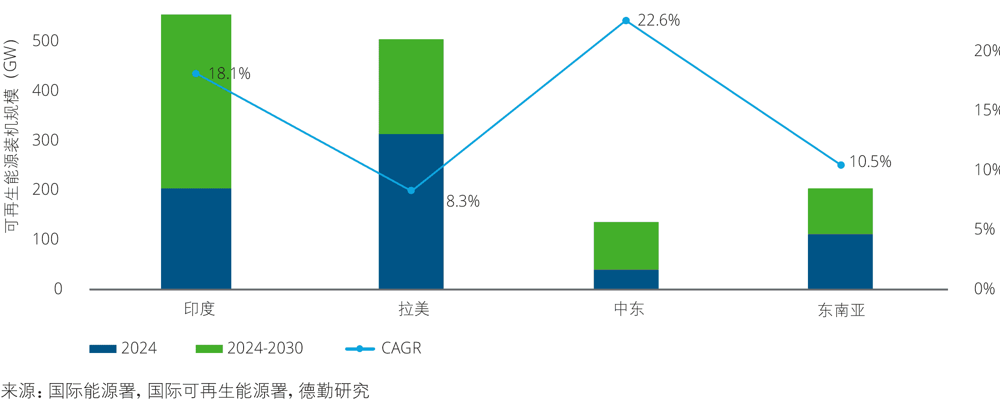

> “十五五”时期，中东、拉美、东南亚等新兴市场将为中国新能源设备制造业的韧性增长提供广阔市场空间，成为中国企业产品出口以及产能布局的重心。但新兴市场竞争激烈，针对产品性能、系统集成能力、本地化生产和运营要求不断提升。

这要求企业在开拓国际市场的过程中，不仅要将本地化需求融入产品创新策略，例如开发耐高温、耐风沙型产品以适应新兴市场的气候条件，还要加强售后运维、渠道拓展与品牌影响力等软实力建设。同时，企业也需积极探索面向市场需求的新型业务模式，如“能源即服务”（Energy-as-a-Service，EaaS）、租赁+运维打包、综合能源解决方案等，在提供设备之外，延伸服务链条，提升客户粘性与项目盈利能力。

### 趋势九：中国新能源产业进入源网荷储一体化发展新周期，呈现市场化、智能化、多元化新特征

#### 新能源产业迎来新周期起点

在中国新能源产业过去的发展历程中，技术的迭代不断提升新能源项目经济性，支持新能源产业从补贴时代过渡到平价上网时代。随着供给端转型取得显著进展，当前能源转型的焦点转向消纳环节，电力供需分配逻辑发生变化。而新能源项目全面入市交易标志着新能源产业正式来到“源网荷储一体化”新周期的起点。新周期的变化主要体现在：

- **市场机制更灵活：**随着电力市场化改革不断深化，电力系统供需平衡从政策主导转向市场调节，市场交易品类扩充同时价格波动性提升，市场主体多元化。
- **基础设施更具韧性：**为支撑高比例可再生能源的消纳，储能装机将迎来爆发式增长，同时在集中式与分布式并举的电力生产格局下，电网向“大电网+微电网”的方向发展。
- **智能化要求提升：**电力体系设施规模日益庞大，并且从单向输配转向多元互动，为满足源网荷储协同调度以及电力交易收益提升等需求，智能化赋能成为关键。
- **能源服务多元化：**工业园区等下游用户对能源的需求不再局限在电力供应，还包括节能增效、绿电替代以及冷、热、气等需求，新能源厂商从单一设备供应商向综合能源服务商转型。

#### 图表26：新能源上下游产业链图

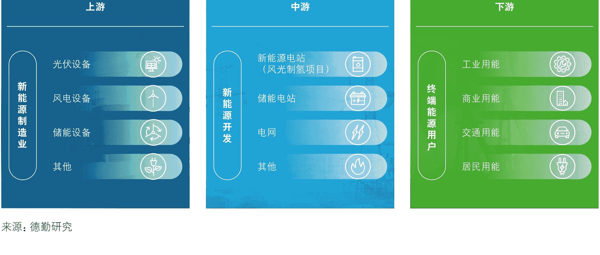

来源：德勤研究

## 上游新能源设备制造业有望2025年完成产能出清

中国新能源制造业在快速扩张后，已进入以技术升级与产能优化为主的新阶段。伴随着政策层面的引导以及行业层面自律共识的加强，产业上游加速结构调整，预计将在2025年完成阶段性出清，主要基于以下考量：

- **技术更迭节奏指向2025为关键拐点**：多数新能源龙头在2023-2024年集中发布了新产能与新技术路线图，产品迭代目标设定在2025年形成技术主导。根据中国光伏行业协会（CPIA）预测，到2025年N型电池渗透率将超过50%，P型产能将逐步边缘化。
- **新建产能集中释放加剧竞争**：2022-2023年大批新能源产能集中开工，建设周期一般为18-24个月，2024-2025年产能集中落地，在需求相对稳定的情况下，老旧产能与中低端项目将率先出清。
- **绿色金融、双碳标准形成外部压力**：效率低、碳排高的企业难以获得金融资源和出口市场。
- **从“比价格”到“比能力”**：未来市场竞争中，“低成本”不再是核心竞争力，取而代之的是围绕产品效率、系统集成能力、碳足迹表现、售后运维等维度竞争。

在“十五五”时期，随着供需关系完成调整，上游企业盈利水平有望迎来复苏。同时，出海仍然是重要的布局方向。在此趋势下，中国新能源制造业呈现更加多元、立体的竞争格局：

- **上游企业向下游以及跨领域拓展业务**：随着行业利润向中下游转移，部分上游制造商拓展新能源开发与运营项目，例如光伏领先企业隆基绿能与建筑开发商、房地产公司共同投资开发BIPV项目。同时，部分制造商凭借技术储备布局氢能等新兴赛道，向综合能源开发商发展，例如阳光电源凭借电解槽与储能技术开发光伏制氢一体化解决方案。

#### 中游电网投资将保持强劲增长势头，电氢耦合助力可再生能源消纳

随着清洁能源产业步入新周期，中游新能源开发与配送环节进入“高效开发-灵活消纳”协同发展的新阶段，核心变化体现在：

- **新能源电站运营策略精细化**：新能源项目从全量上网转向市场化交易，意味着电站运营商为追求更高收益率，在关注发电效率的同时需提前锁定下游需求，并基于负荷需求与电力市场价格波动优化发电曲线。
- **电氢耦合拓宽消纳路径**：“电-氢-热”多能转换路径的打通将重塑能源生产消费逻辑。当前电氢耦合正在成为提升可再生能源消纳率的新选项，内蒙古、吉林等省份公布多个风光制氢一体化项目，“十五五”时期将成为绿电制氢产能爆发期。
- **电网投资升级以提升调度平衡能力**：作为连接电力生产和消费的桥梁，未来五年中，电网建设投资预计将保持强劲的增长势头，主要聚焦特高压建设和配电网改造等关键领域，预计“十五五”时期主网和配电网年均投资规模均将达到3000亿元以上。

#### 图表27：电网建设投资趋势预测

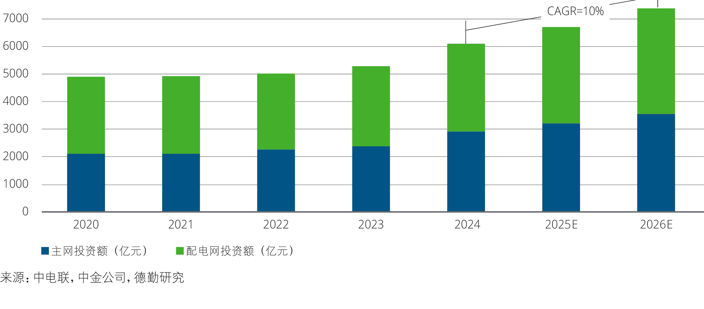

来源：中电联，中金公司，德勤研究

## 下游新兴产业崛起开启可再生能源开发利用新场景

随着数字经济与低碳转型的加速推进，以数据中心为代表的新兴产业在激发巨大用能需求的同时，其用能特性与需求也深刻改变了能源开发与利用的方式，带动能源系统从“供给驱动”向“需求引导、融合协同”转变。

- **数据中心、交通等领域成为源网荷储一体化重点场景：**“十五五”时期，数据中心、低碳交通等领域对稳定、低碳电力的巨大需求使其成为可再生能源分布式开发与就地消纳的重要场景。根据中国信通院测算，截至2023年底，我国数据中心总耗电量达到1,500亿千瓦时，占我国全社会用电量的1.6%；预计到2030年，数据中心的用电量将在此基础上增长2-5倍。而根据2025年3月发布的《关于推动交通运输与能源融合发展的指导意见》，到2027年交通基础设施沿线可再生能源装机容量将超过5000万千瓦。
- **绿电直供零碳园区模式快速发展：**工业园区通过整合绿电资源、储能设备、可调节负荷、智能化平台等多种资源构建能源供应方案，实现可再生能源就近消纳，并满足入驻企业对碳足迹削减、绿色替代等的需求。根据不完全统计，全国27个省份已布局源网荷储一体化项目，总装机超1亿千瓦，其中园区级项目分布最为广泛。
- **“产”“能”融合拓宽收益机制：**电力市场化改革与碳金融工具的发展，为“源网荷储一体化”项目提供了更多的潜在盈利路径，特别是工业场景与绿电的深度融合有望在“十五五”期间获得更多支持，例如针对零碳产品的绿色消费激励机制等。

#### 数能融合：算力发展带动绿电需求，源网荷储算一体化模式快速推广

随着以人工智能、云计算、大数据为代表的算力产业迅速崛起，数据中心、电信机房等新型基础设施对稳定、低碳电力的需求激增。同时，由于输配电网的规划及建设节奏往往滞后于数据中心的投运速度，日益增长的用电需求对电力基础设施提出考验，甚至在部分区域出现“算力等电”的现象。为了缓解电力保供压力，亟需推动源网荷储与算力系统的协同布局。数据中心对电力供应的核心诉求体现在：

- **用能成本控制：**电力成本在数据中心运营成本中占比超过50%，随着电力市场化改革推进，数据中心可跟随电价信息调整用电负荷来实现成本节约。
- **用能去碳化：**针对数据中心的能效考核、碳排放强度考核不断收紧；运营商、云服务提供商以及互联网公司的价值链减排目标同样要求数据中心加快绿电替代。
- **高稳定性与高可靠性供电：**数据中心用电要求全天候不间断供电，并且对电能质量要求极高。可再生能源的波动性使电能质量治理成为必要环节。

在此趋势下，源网荷储算一体化将在“十五五”时期快速发展。数据中心可通过部署分布式光伏、风电、小型模块化核反应堆（SMR）或与周边清洁能源基地直接耦合来提升绿电直供比例，并借助储能系统来优化经济性，保障用能质量，甚至通过隔墙售电、需求响应等机制来实现额外收益。算力与电力的深度耦合还将催生“零碳算力”等新型业态，充分挖掘能源绿色价值。

> “十五五”时期，国内政策导向、技术迭代、市场机制等因素共同推动产能加速出清，中国新能源设备制造业竞争格局将从“规模取胜”走向“能力突围”。电网建设和储能的大规模部署在带动高额投资的同时，将显著提升新能源消纳水平，实现供需平衡。此外，新能源产业与氢能、算力、交通等领域的深度融合，将推动关键技术、标准体系、市场机制以及商业模式等的全面革新。在全新的能源生产、消纳场景中，IT设备制造商、充电软件平台开发商、码头运营商等有望凭借技术或资源优势跨领域参与能源生态互动，形成更为多元的竞争格局。

在此趋势下，企业需要借助研发或合作持续扩充能力矩阵，围绕下游重点场景打造“源网荷储一体化”解决方案，完成从单一设备供应商向能源综合服务商的角色转换。

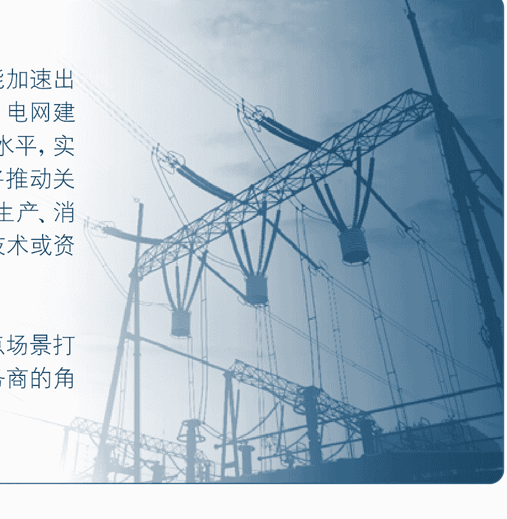

### 趋势十：新能源发电进入全面市场化竞争阶段，将推动电价机制与商业模式双重变革

#### 新能源项目转向市场化定价，电价短期波动但长期趋稳

2025年发布的《关于深化新能源上网电价市场化改革促进新能源高质量发展的通知》明确要求新能源电量全部参与市场交易，通过“基准价+上下浮动”机制形成价格。根据中电联统计，2024年全年各电力交易中心的累计交易电量达到6.18万亿千瓦时，价格区域分化明显，但相较煤电已经显示出竞争力。例如甘肃省2024年新能源成交均价为231.04元/兆瓦时，与煤电的均价354.42元/兆瓦时相比，有明显的经济优势。电价机制的改革将在“十五五”时期带来以下影响：

- **电价峰谷差拉大**：新能源出力的波动性以及出力时段与负荷曲线的错位将导致电价峰谷差进一步拉大，激发分时段用能管理、电力交易策略优化等服务需求。
- **电价短期上行但中长期趋稳**：受新能源波动性、调节资源有限及脱碳成本等影响，工商业电价可能在“十五五”初期迎来小幅上涨，但随着风光发电效率的持续优化以及电网调配能力的提升，中长期电价将逐步趋稳。
- **高耗能企业用能成本提升**：由于高耗能企业电价不受上浮限制，可能承担更多上涨压力，促使企业寻求节能改造或通过绿电直供等方式控制用能成本。

## 图28：2024年部分电力市场新能源交易价格

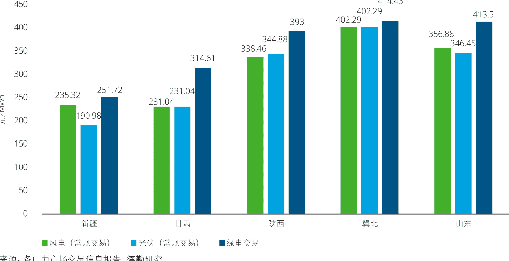

来源：各电力市场交易信息报告，德勤研究

#### 电力资产价值重估，企业“重装机”逻辑正被“轻资产+强运营”替代

在新的价格机制下，不同类型的电力资产被赋予新的市场定位，资产价值不再单纯由发电量决定，而更多取决于其在电力系统中提供的灵活性、可靠性和辅助服务能力。

- **储能资产价值上升**：储能可通过峰谷套利、参与调频调峰、提供备用容量等方式获得收益，是保障系统稳定、匹配新能源波动的重要工具。近年来，多地试点推进储能参与电力现货市场和辅助服务市场，储能项目收益结构趋于多元化。
- **火电的“容量价值”重新凸显**：中国常规火电发电小时数整体呈现下降趋势，但在新能源高比例接入的背景下，其可调节性与应急响应能力被重新评价。“谁能快速启动、谁能保证冬季和晚高峰不出问题”，成为火电站在市场中的新逻辑。
- **新能源项目面临精细化运营压力**：随着补贴取消、“绿电自负盈亏”成为常态，新能源项目必须根据区域电价、发电波动、负荷预测等因素动态调整上网策略，同时通过配置储能、参与绿电交易、锁定中长期电价等方式对冲风险。

在这一背景下，电力企业面临新的发展选择：

- 不再盲目追求装机规模，而是更加注重资产结构的灵活性和组合效率。
- **“重装机”逻辑正被“轻资产+强运营”替代**，在经营策略中更加注重以创新的商业模式和融资模式挖掘专利技术、品牌影响力、数据资产等无形资产的价值，比如通过开发虚拟电厂、负荷聚合平台、能源工业互联网平台等数字化平台对分布式能源资源进行整合，并通过渠道服务、数据服务等方式实现价值延伸。
- 企业间的差距将更多体现在交易能力、技术能力和系统适应能力上，而非仅靠电量取胜。

#### 新商业模式加快涌现，电力基础设施适配性是新兴商业模式落地的核心决定因素

随着电力市场机制的完善、新能源渗透率提升、电力数字化能力增强，多个新商业模式正在形成并试图进入主流市场。电力基础设施适配性是这些商业模式落地的核心因素，主要体现在：

- **配电网感知和控制能力**：决定是否可接入市场，多数地区的配网仍以被动调度为主，难以动态接入分布式响应资源。
- **计量系统适配性**：计量系统滞后使得很多C端负荷无法进入市场结算体系，如未安装高精度智能电表、缺乏边缘控制器的居民/商用场景无法分清“贡献与收益”。
- **技术接口标准和平台规范**：缺乏统一标准会导致设备接入虚拟电厂、储能系统接调度平台时存在高度定制化障碍，制约规模复制。
- **交易市场机制**：辅助服务市场、负荷响应市场是否在全国范围内形成统一激励与结算模式。

以下选取5类代表性新型电力商业模式，分别从技术与制度支撑、现实可行性等维度进行分析。其中独立储能项目已经进入商业化示范阶段，随着电力现货价差的回归以及辅助服务市场机制的完善，有望率先通过峰谷价差套利、调频辅助服务等机制实现规模化落地。而车网互动等新兴模式在市场机制之外，仍需期待电池管理、负荷聚合等技术层面的迭代来为其落地铺平道路。

#### 图表29：中国新型电力商业模式落地可行性分析

| 模式 | 当前落地可能性 | 典型落地场景 | 当前基础设施适配性 | 未来大规模落地关键假设 |
|---|---|---|---|---|
| 虚拟电厂（VPP） | 可在局部区域试点 | 工业园区、商业综合体、园区型储能站 | 配电网数字化程度有限，缺标准接口与结算机制 | 聚合商入市，用户侧能管系统普及，接口放开 |
| 储能套利+辅助服务 | 部分省份可商业化运作 | 现货试点省份、峰谷价差大地区 | 多地尚未标准化接入储能与结算体系，峰谷价差不稳定 | 电价真实反映成本，储能纳入统一市场规则 |
| 工业负荷聚合平台 | 工业园区具备落地基础 | 高耗能产业区、数据中心群 | 工业企业多数缺乏实时控制设备；区域电网缺乏多负荷聚合接入与协调能力；响应考核与通信协议不统一 | 能源管理系统覆盖率提高；区域调度具备负荷调用能力；聚合平台成熟 |
| 园网荷储一体化园区 | 在新建园区/产业区可推广 | 智慧园区、开发区 | 园区配电网具备独立管理条件，易于整体设计与改造；老旧园区电网灵活性低，升级成本高；区域能量交易机制缺位 | 电网公司支持园区级局域市场调度与运维；多能系统标准化集成；配套能源服务政策明确 |
| 面向居民侧的聚合+交易平台（如电动汽车群控） | 近期难以规模落地 | 智慧小区、电动车充电站群 | 居民用电侧仍多为低频计量设备；缺乏双向可调接口；配网对家庭侧负荷不可感、不可控；V2G接口标准化未建立 | 智能电表全覆盖，V2G标准落地，C端可入市交易 |

来源：德勤研究

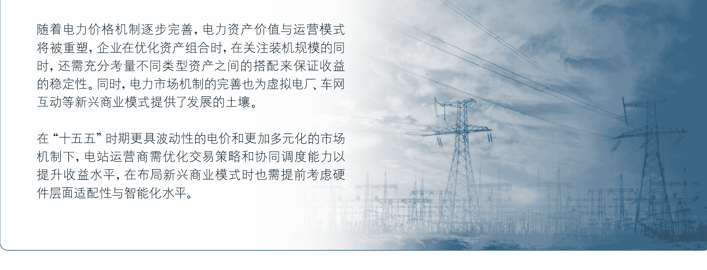

随着电力价格机制逐步完善，电力资产价值与运营模式将被重塑，企业在优化资产组合时，在关注装机规模的同时，还需充分考量不同类型资产之间的搭配来保证收益的稳定性。同时，电力市场机制的完善也为虚拟电厂、车网互动等新兴商业模式提供了发展的土壤。

在“十五五”时期更具波动性的电价和更加多元化的市场机制下，电站运营商需优化交易策略和协同调度能力以提升收益水平，在布局新兴商业模式时也需提前考虑硬件层面适配性与智能化水平。

### 趋势十一：储能迈入高增长与市场化并进阶段，经济性提升推动商业模式创新

#### “十五五”时期全球储能装机需求加速释放，场景多元化驱动增长

储能正成为构建新型电力系统的重要支撑，在“十五五”期间，全球储能装机需求将呈现爆发式增长。2024年11月举行的COP29气候会议达成了《全球储能和电网承诺》，目标到2030年实现全球部署1500GW储能。根据CNESA数据，截至2024年底全球电力储能累计装机规模为372GW。据此推算，预计2025-2030年期间每年新增储能装机规模近200GW。尽管不同市场中驱动因素有所差异，“十五五”时期储能装机规模将迎来全球性增长：

- **海外市场**：欧美市场储能装机将主要受益于用户光储系统需求复苏，以及英国、意大利、德国等多国推进的大型电网侧储能项目拉动，项目经济性高度依赖电价水平以及贸易政策稳定性。中东市场则聚焦大型可再生能源及制氢项目的配套需求。拉美、东南亚等区域电网基础设施薄弱，配储成为保障电力系统稳定性的刚需。
- **国内市场**：尽管政策取消新能源项目强制配储要求，但电价改革仍将通过市场机制推动配储需求。同时数据中心等新兴产业对稳定、高质量绿电的需求促进工商业配储的推广，虚拟电厂、独立储能等新兴业态也将进一步促进储能装机规模爆发。

#### 图表30：全球储能装机规模预测

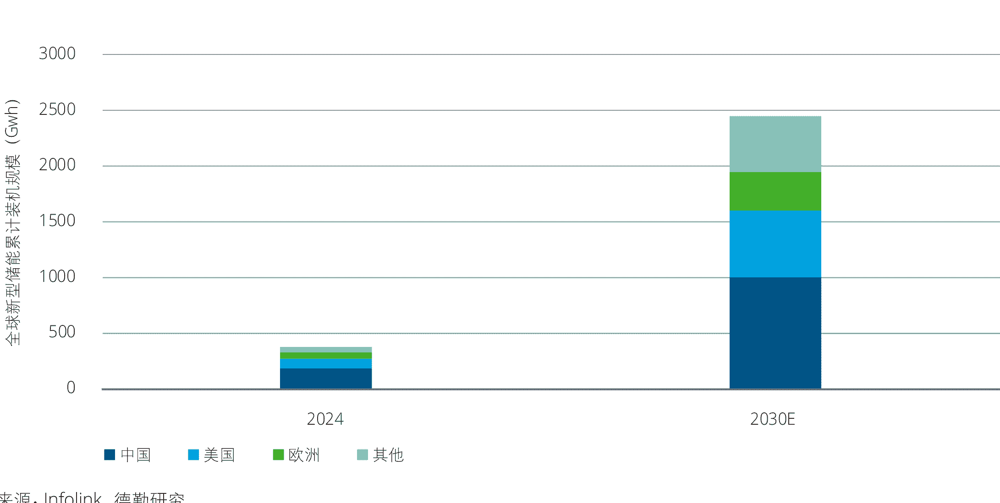

来源：Infolink，德勤研究

#### 电力市场化改革推动储能从“配角”走向“主体”，商业模式持续演进

随着中国电力市场化交易准入的放开，储能的角色正从新能源的辅助设施转变为新型电力系统的重要主体，并通过更为多元的收益机制提升经济性。

- **市场地位确立：** 2024年9月发布的《电力市场注册基本规则》明确允许新型储能入市交易后，同年11月国家发改委、能源局联合发布《关于支持电力领域新型经营主体创新发展的指导意见》，明确赋予独立储能、虚拟电厂等新型主体参与中长期交易、现货市场及辅助服务市场的资格。这意味着储能电站可在满足准入门槛的情况下直接参与，或以虚拟电厂聚合的形式参与交易，降低了改造成本。
- **收益机制多元：** 储能收益模式不再局限于峰谷价差套利，还可通过调峰、调频服务、备用容量等多种收益机制的叠加大大提升经济性。近年来，多地试点推进储能参与电力现货市场和辅助服务市场，例如广东调频辅助服务市场为储能提供0.5-1.2元/kWh补偿，甘肃试点储能作为备用电源参与交易，储能项目收益结构趋于多元化。

#### 储能企业竞争维度拓展，重点布局集成能力、低碳和跨领域合作

面对需求快速扩张与市场规则升级，“十五五”时期，储能企业竞争焦点将从单一产品性能向集成能力、碳足迹以及生态协同能力等多个维度拓展：

- **技术竞争从电芯性能向系统性能能力延伸：** 电力现货市场交易与风光制氢等场景对储能系统提出高频次、高效率、高精度调控需求，推动企业技术布局从聚焦电芯技术转向BMS、PCS、热管理等综合能力提升。
- **碳足迹成为储能进入国际市场的通行证：** 欧盟《新电池法规》要求2025年完成电池碳足迹声明，2028年满足碳足迹限值，预计“十五五”时期全球范围内碳监管政策将持续收紧，削减碳足迹并建立排放溯源体系将成为重要竞争力。
- **跨领域融合成为趋势：** 储能企业与科技企业、运营商、新能源车企等合作开发负荷聚合平台，通过虚拟电厂等新兴模式参与电力市场交易，或与新能源企业合作开发风光制氢一体化解决方案，以适应客户对系统运行经济性的更高要求。例如南网储能科技与蔚来能源在2024年2月签署框架合作协议，共同推动换电站作为分布式储能接入虚拟电厂平台，从而提升资产运营效率和效益。

> “十五五”将成为储能产业发展的重大机遇期，全球多个市场迎来需求爆发，同时国内储能设施有机会依托独立储能、虚拟电厂等新型商业模式实现收益增值，而在储能性能之外，响应能力、安全性、绿色属性等也将成为下游客户的重要考量。

储能企业面临从“硬件制造商”向“系统解决方案商”转型的全新窗口期。市场端对响应速度、收益模型与政策适应能力提出更高要求，企业需在系统集成能力、智能化控制、交易策略与项目服务能力等方面实现快速补强。同时，碳足迹监管正在成为全球通行门槛，出口导向型企业必须构建碳排放溯源与绿色制造体系。未来的领先企业，将是那些能够灵活适应市场规则、提供跨场景解决方案、并实现全球本地化交付与服务的系统型参与者。储能企业的核心竞争力正在从“单点突破”走向“系统集成+市场运作+绿色合规”的综合能力重塑。

### 趋势十二：新能源产业主体下沉到地方，能源企业角色分工明确

#### 地方能源集团加速崛起

2023年以来地方能源集团加速资产重组，贵州能源集团、广西能源集团、新疆能源集团、湖南能源集团、四川能源发展集团等多家地方能源集团先后揭牌成立或完成整合。大型地方能源集团在资产规模和营收规模方面已逐渐看齐能源央企，成为新能源产业版图中的重要竞争力量。例如四川省水电巨头川投集团与新能源巨头能投集团于2025年2月合并为四川能源发展集团，总资产超3900亿元，现有装机规模3560万千瓦。地方能源集团的崛起将促进地方经济增长与能源转型的双赢：

- **统筹新能源的开发和利用：** 平台型企业的成立有利于改变地方能源企业布局分散、协同性不强、业务同质化等问题，提升企业竞争力。特别是地方能源集团对区域内资源的统筹能力有利于保障分布式新能源开发规划的落实。
- **提供地方财政收入来源：** 新能源产业对地方财政和税收的贡献显著，将成为继土地财政之后，为地方创造持续稳定收入的新型“绿色资产”。
- **带动地方绿色产业集群：** 新能源项目的开发能够有效拉动基建需求，促进相关装备制造业和配套产业的集聚，并以绿电直供零碳园区等模式吸引算力、高端制造、现代化工等领域企业入驻，形成绿色产业集群。

#### 行业格局变化，不同企业定位更加明确

从新能源开发指标的分配来看，地方能源集团将逐步成为地方政府推进可再生能源开发利用的主要抓手。例如2024年贵州省累计下发34.2GW风光指标，其中贵州能源集团获得了5.3GW，排在所有开发业主之首。在此趋势下，新能源开发格局将发生变化，形成全新的竞争态势：

- **传统能源央企强化产业链引领地位：** 传统能源央企仍将是新能源开发主力军，特别是在“沙戈荒”新能源基地、深远海风电开发等大型集中式项目中发挥主导作用。据不完全统计，包括华电、华能、国家能源集团和三峡集团在内的电力央企承担的部分“沙戈荒”新能源大基地项目电力装机容量已经超过了175GW。同时作为产业链链主，能源央企将持续推进新能源技术创新迭代，引领产业链高质量发展，并通过海外项目投资、参与国际规则制定等方式带动产业链出海。
- **地方能源集团立足资源禀赋：** 地方能源集团依托本地资源优势，吸引多元主体共同参与可再生能源开发，提升与本地电源、电力基础设施以及产业用能需求的协调性，实现能源转型与经济增长双轨推进。
- **民营企业发挥细分领域专长：** 民营企业凭借技术与商业模式深耕细分领域，完善能源产业生态。在新能源设备、电力交易算法等细分领域具备技术壁垒的民营企业有机会进入央国企供应链，在链主的带动下实现市场拓展。

#### “十五五”时期能源央国企业务布局分化

随着央企、地方国企与民企在新能源产业中的分工体系逐渐清晰，未来几年中，能源央企与地方能源集团预计将根据各自定位，实行差异化的业务布局：

- **能源央企加速专业化整合与资产证券化：** 在地方国企加速资产整合的同时，传统能源央企也在调整其资产架构。作为前沿技术突破和国际市场布局的主力，能源央企将聚焦主业打造专业化平台，例如国电投将远达环保打造为集团境内水电资产整合平台。同时能源央企仍有一定比例的电力资产未注入上市平台，预计“十五五”时期能源央企将加速资产证券化来拓宽融资渠道，提升核心竞争力。
- **地方能源集团强化区域协同与生态构建：** 随着全国统一电力大市场的推进，相邻省份能源集团有望加强合作，优化跨区域电力调配与消纳，实现资源互补。同时地方能源集团有机会通过产业基金、零碳产业园等模式向新能源产业链上的民企乃至下游用能产业拓展合作关系，共建“产”“能”结合的多元生态。

> “十五五”时期能源产业格局的变化将优化资源配置效率，同时也将推动行业集中度提升，能源央国企业及民企均需要围绕自身在产业链中的定位与发展战略，建立更为精细化的投资、资产管理、运维、交易等策略。能源央企将继续发挥集中式项目开发与产业链引领优势提升竞争力，同时对资产类型、项目收益率以及运维成本等提出更高要求。地方能源集团未来将在产业联动、绿色园区运营和区域电力协同中扮演综合的平台型角色，以实现经济效益与绿色转型的平衡。民营企业则需聚焦细分赛道，通过技术专长、商业模式创新切入合作生态，在设备制造、电力交易、智能运维环节形成差异化价值。”

## 附件

### “十五五”时期能源行业关键议题及领先企业行动

全球能源格局正处于深度重塑期，能源转型、地缘政治、技术革命叠加，打破了既有能源体系的稳定性与可预测性。中国作为全球能源消费与制造大国，既面临国际规则重构的外部挑战，也承载着推动能源转型、保障能源安全的内在需求。本系列议题从全球能源系统重构、化石能源高效转型、新能源创新突围三个层次，全面探讨中国在未来能源版图中的战略定位与产业机遇，旨在提供系统化、前瞻性的洞察。

| 模块 | 趋势 | 内容 |
|---|---|---|
| 全球能源系统重构 | 趋势一 | 以能源安全为核心的新经贸秩序重塑能源产业价值链，驱动区域联盟崛起与能源贸易多极化 |
| 全球能源系统重构 | 趋势二 | 全球能源投资区域分化显著，中国持续引领，增量重心逐步向中东、拉美拓展 |
| 全球能源系统重构 | 趋势三 | 技术正成为重构能源格局的关键力量，智能技术与新兴能源技术共同构建更灵活、稳定、低碳的能源体系 |
| 全球能源系统重构 | 趋势四 | 全球能源转型中长期趋势不可逆转，碳监管在贸易和产能调控中作用日益关键，成为转型重要抓手 |
| 化石能源高效转型 | 趋势五 | 油气行业中长期需求仍将维持高位，能源巨头调整升级转型战略 |
| 化石能源高效转型 | 趋势六 | 化工产业高端化与产能外迁并进，中国凭借产业链与市场优势崛起为全球化工新材料产能重心 |
| 化石能源高效转型 | 趋势七 | 煤炭达峰尚需时日，调节电源与煤化工双轮驱动产业功能重塑 |
| 新能源发展新周期 | 趋势八 | 新兴市场驱动新能源需求增长，系统解决能力与本地交付能力共同构成新能源企业核心竞争力 |
| 新能源发展新周期 | 趋势九 | 中国新能源产业进入源网荷储一体化发展新周期，呈现市场化、智能化、多元化新特征 |
| 新能源发展新周期 | 趋势十 | 新能源发电进入全面市场化竞争阶段，将推动电价机制与商业模式双重变革 |
| 新能源发展新周期 | 趋势十一 | 储能迈入高增长与市场化并进阶段，经济性提升推动商业模式创新 |
| 新能源发展新周期 | 趋势十二 | 新能源产业主体下沉到地方，能源企业角色分工明确 |

#### 重点领域代表性企业

在油气、化工、煤炭、发电、光伏、储能、电气设备七个重点领域上市企业以及地方能源集团共计八类企业中，我们从营收规模与盈利能力两个维度出发，识别出一批在ROE等关键指标上表现突出的企业。这些企业既具备头部规模，又展现出较强的经营质量，具有一定的行业参考价值。

| 企业名称 | 股票代码 | 所在地 | 总收入(2024年报，万元) | 净利润同比增长率(%) | 资产负债率(%) | ROE（%） |
|---|---|---|---:|---:|---:|---:|
| 中国海油 | 600938.SH/0883.HK | 北京 | 42050600 | 11.38 | 29.05 | 19.51 |
| 海油发展 | 600968.SH | 北京 | 5230662.63 | 18.66 | 43.71 | 14.12 |
| 联合能源集团 | 0467.HK | 香港 | 1622692.85 | 193.25 | 49.1 | 11.93 |
| 陕天然气 | 002267.SZ | 陕西 | 897943.26 | 33.01 | 54.07 | 11.15 |
| 中国石油 | 601857.SH/0857.HK | 北京 | 293798100 | 2.2 | 37.89 | 11.12 |
| 海油工程 | 600583.SH | 天津 | 2981489.4 | 33.38 | 41.38 | 8.47 |
| 石化油服 | 600871.SH/1033.HK | 北京 | 8109617.8 | 7.73 | 88.82 | 7.45 |
| 中海油服 | 601808.SH/2883.HK | 天津 | 4821809.7 | 4.11 | 46.44 | 7.34 |
| 中国石化 | 600028.SH/0386.HK | 北京 | 307456200 | -16.07 | 53.29 | 6.05 |
| 延长石油国际 | 0346.HK | 陕西 | 2702639.87 | -74.58 | 53.56 | 4.26 |

| 企业名称 | 股票代码 | 所在地 | 总收入(2024年报，万元) | 净利润同比增长率(%) | 资产负债率(%) | ROE（%） |
|---|---|---|---:|---:|---:|---:|
| 云天化 | 600096.SH | 云南 | 6057937.62 | 17.93 | 49.96 | 25.95 |
| 卫星化学 | 002648.SZ | 浙江 | 4536486.69 | 26.77 | 53.62 | 21.78 |
| 宝丰能源 | 600989.SH | 宁夏 | 3233806.42 | 12.16 | 50.63 | 15.54 |
| 万华化学 | 600309.SH | 山东 | 18098536.66 | -22.49 | 66.15 | 14.22 |
| 华鲁恒升 | 600426.SH | 山东 | 3402458.6 | 9.14 | 30.07 | 13.03 |
| 恒力石化 | 600346.SH | 辽宁 | 22997696.84 | 2.01 | 76.78 | 11.42 |
| 中石化炼化工程 | 2386.HK | 北京 | 6419821 | 5.58 | 61.26 | 7.91 |
| 中伟股份 | 300919.SZ | 湖南 | 4022289 | -24.66 | 59.82 | 7.34 |
| 新凤鸣 | 603225.SH | 浙江 | 6690171.05 | 1.32 | 71.37 | 6.46 |
| 格林美 | 002340.SZ | 深圳 | 3310129.21 | 9.19 | 65.18 | 5.34 |

## “十五五”时期中国能源行业关键议题｜附件

| 企业名称 | 股票代码 | 所在地 | 总收入(2024年报，万元) | 净利润同比增长率(%) | 资产负债率(%) | ROE（%） |
|---|---|---|---:|---:|---:|---:|
| 陕西煤业 | 601225.SH | 陕西 | 17387481.33 | 5.28 | 43.71 | 24.86 |
| 兖矿能源 | 600188.SH/1171.HK | 山东 | 12453419.4 | -20.94 | 62.96 | 19.32 |
| 晋控煤业 | 601001.SH | 山西 | 1357590.47 | -14.93 | 28.89 | 15.87 |
| 中国神华 | 601088.SH/1088.HK | 北京 | 33837500 | -3.41 | 23.3 | 14.84 |
| 山煤国际 | 600546.SH | 山西 | 2789560.62 | -46.75 | 50.52 | 14.1 |
| 物产环能 | 603071.SH | 浙江 | 4465051.32 | -30.25 | 43.96 | 13.84 |
| 中煤能源 | 601898.SH/1898.HK | 北京 | 18190755.1 | -10.05 | 46.33 | 12.28 |
| 淮北矿业 | 600985.SH | 安徽 | 6501232.76 | -22 | 46.58 | 12.19 |
| 易大宗 | 1733.HK | 香港 | 3626945.95 | -55.64 | 47.8 | 10.74 |
| 平煤股份 | 601666.SH | 河南 | 2926328.19 | -41.3 | 61.79 | 8.89 |

| 企业名称 | 股票代码 | 所在地 | 总收入(2024年报，万元) | 净利润同比增长率(%) | 资产负债率(%) | ROE（%） |
|---|---|---|---:|---:|---:|---:|
| 国电电力 | 600795.SH | 北京 | 17730983.68 | 75.28 | 73.4 | 18.76 |
| 长江电力 | 600900.SH | 北京 | 8252385.74 | 19.3 | 60.79 | 15.79 |
| 大唐发电 | 601991.SH/0991.HK | 北京 | 12347362.9 | 215.4 | 71.04 | 15.77 |
| 华润电力 | 0836.HK | 深圳 | 9749745.74 | 33.63 | 66.91 | 15.63 |
| 中电控股 | 0002.HK | 香港 | 8423630.26 | 80.3 | 52.88 | 11.38 |
| 浙能电力 | 600023.SH | 浙江 | 8750475.41 | 18.92 | 43.65 | 11.02 |
| 国投电力 | 600886.SH | 北京 | 5675079.85 | -0.92 | 63.22 | 10.98 |
| 江苏国信 | 002608.SZ | 江苏 | 3666823.09 | 73.12 | 53.32 | 10.6 |
| 中国广核 | 003816.SZ/1816.HK | 广东 | 8680441.49 | 0.83 | 59.49 | 9.3 |
| 中国核电 | 601985.SH | 北京 | 7619531.72 | -17.38 | 68.27 | 8.73 |

| 企业名称 | 股票代码 | 所在地 | 总收入(2024年报，万元) | 净利润同比增长率(%) | 资产负债率(%) | ROE（%） |
|---|---|---|---:|---:|---:|---:|
| 德业股份 | 605117.SH | 浙江 | 1110260.98 | 65.29 | 37.45 | 40.32 |
| 阳光电源 | 300274.SZ | 安徽 | 7745389.69 | 16.92 | 65.07 | 34.16 |
| 捷佳伟创 | 300724.SZ | 广东 | 1880534.33 | 69.18 | 67.03 | 27.88 |
| 横店东磁 | 002056.SZ | 浙江 | 1847388.18 | 0.58 | 57.58 | 19.14 |
| 晶盛机电 | 300316.SZ | 浙江 | 1749182.72 | -44.93 | 43.16 | 15.89 |
| 阿特斯 | 688472.SH | 江苏 | 4602386.54 | -22.6 | 65 | 10.14 |
| 福斯特 | 603806.SH | 江西 | 1906239.61 | -29.33 | 21.66 | 8.17 |
| 福莱特 | 601865.SH/6865.HK | 浙江 | 1868260.25 | -63.52 | 49.24 | 4.58 |
| 信义光能 | 0968.HK | 安徽 | 2192144.7 | -73.43 | 39.56 | 3.44 |
| 协鑫集成 | 002506.SZ/3800.HK | 江苏 | 1618355.47 | -56.7 | 87.59 | 2.84 |

| 企业名称 | 股票代码 | 所在地 | 总收入(2024年报，万元) | 净利润同比增长率(%) | 资产负债率(%) | ROE（%） |
|---|---|---|---:|---:|---:|---:|
| 海博思创 | 688411.SH | 北京 | 824807.22 | 12.06 | 71.32 | 23.45 |
| 宁德时代 | 300750.SZ | 福建 | 36201255.4 | 16.4 | 65.24 | 23.4 |
| 亿纬锂能 | 300014.SZ | 广东 | 4840971.41 | 0.63 | 59.36 | 11.27 |
| 科华数据 | 002335.SZ | 福建 | 771963.77 | -37.9 | 62.46 | 6.95 |
| 欣旺达 | 300207.SZ | 广东 | 5583062.11 | 36.43 | 63.44 | 6.27 |
| 国轩高科 | 002074.SZ | 安徽 | 3511625.05 | 28.56 | 72.28 | 4.73 |
| 海辰储能 | H02113.HK | 福建 | 1291675.7 | 113.17 | 73.11 | 3.3 |
| ST易事特 | 300376.SZ | 广东 | 299975.16 | -66.38 | 42.48 | 2.74 |
| 中创新航 | 3931.HK | 江苏 | 2775152.6 | 100.83 | 60.76 | 1.69 |
| 派能科技 | 688063.SH | 上海 | 198606.6 | -92.03 | 21.13 | 0.44 |

| 企业名称 | 股票代码 | 所在地 | 总收入(2024年报，万元) | 净利润同比增长率(%) | 资产负债率(%) | ROE（%） |
|---|---|---|---:|---:|---:|---:|
| 汇川技术 | 300124.SZ | 广东 | 3681042.86 | -9.62 | 50.28 | 16.33 |
| 国电南瑞 | 600406.SH | 江苏 | 5698236.96 | 5.94 | 43.11 | 15.79 |
| 哈尔滨电气 | 1133.HK | 黑龙江 | 3872142.9 | 193.27 | 77.5 | 11.49 |
| 精达股份 | 600577.SH | 安徽 | 2227191.96 | 31.72 | 53.35 | 10.19 |
| 正泰电器 | 601877.SH | 浙江 | 6404288.62 | 5.1 | 63.28 | 9.54 |
| 运达股份 | 300772.SZ | 浙江 | 2212958.83 | 12.24 | 84.99 | 8.51 |
| 东方电气 | 600875.SH/1072.HK | 四川 | 6859303.71 | -17.7 | 69.62 | 7.69 |
| 特变电工 | 600089.SH | 新疆 | 9632591.36 | -61.37 | 56.63 | 6.36 |
| 金风科技 | 002202.SZ/2208.HK | 新疆 | 5651621 | 39.78 | 73.96 | 4.89 |
| 中国西电 | 601179.SH | 陕西 | 2212900.03 | 19.09 | 46.18 | 4.83 |

#### 重点领域与关键议题关联度分析

评估十二个关键议题对上述八类企业影响，分为高、中、低三级。每个议题选择高关联度的企业，整理分析其对应行动。

| 趋势 | 油气 | 化工 | 煤炭 | 发电 | 光伏 | 储能 | 电力设备 | 地方能源集团 |
|---|---|---|---|---|---|---|---|---|
| **全球能源系统重构** |  |  |  |  |  |  |  |  |
| 1. 以能源安全为核心的新经贸秩序重塑能源产业价值链，驱动区域联盟崛起与能源贸易多极化 | 高 | 高 | 中 | 低 | 低 | 高 | 低 | 低 |
| 2. 全球能源投资区域分化显著，中国持续引领，增量重心逐步向中东、拉美拓展 | 低 | 低 | 低 | 高 | 高 | 高 | 高 | 低 |
| 3. 技术正成为重构能源格局的关键力量，智能技术与新能源技术共同构建更加灵活、稳定、低碳的能源体系 | 高 | 高 | 高 | 高 | 高 | 高 | 高 | 高 |
| 4. 全球能源转型中长期趋势不可逆转，碳监管在贸易和产能调控中作用日益关键，成为转型重要抓手 | 中 | 高 | 中 | 高 | 高 | 高 | 中 | 中 |
| **化石能源高效转型** |  |  |  |  |  |  |  |  |
| 5. 油气行业中长期需求仍将维持高位，能源巨头调整升级转型战略 | 高 | 中 | 中 | 中 | 低 | 低 | 低 | 低 |
| 6. 化工产业高端化与产能外迁并进，中国凭借产业链与市场优势崛起为全球化工新材料产能重心 | 中 | 高 | 中 | 低 | 低 | 低 | 低 | 低 |
| 7. 煤炭达峰尚需时日，调节电源与煤化工双轮驱动产业功能重塑 | 中 | 高 | 高 | 中 | 低 | 低 | 低 | 中 |
| **新能源发展新周期** |  |  |  |  |  |  |  |  |
| 8. 新兴市场驱动新能源需求增长，系统解决能力与本地交付能力共同构成新能源企业核心竞争力 | 低 | 低 | 低 | 高 | 高 | 高 | 高 | 中 |
| 9. 中国新能源产业进入源网荷储一体化发展新周期，呈现市场化、智能化、多元化新特征 | 低 | 低 | 低 | 高 | 高 | 高 | 高 | 高 |
| 10. 新能源发电进入全面市场化竞争阶段，将推动电价机制与商业模式双重变革 | 低 | 低 | 低 | 高 | 高 | 中 | 中 | 高 |
| 11. 储能迈入高增长与市场化并进阶段，经济性提升推动商业模式创新 | 低 | 低 | 低 | 中 | 中 | 高 | 中 | 中 |
| 12. 新能源产业主体现沉到地方，能源企业角色分工明确 | 低 | 低 | 低 | 中 | 中 | 中 | 中 | 高 |

#### 领先企业行动

### 趋势一：以能源安全为核心的新经贸秩序重塑能源产业价值链，驱动区域联盟崛起与能源贸易多极化

#### 油气企业

普遍采取拓展多元化国际贸易合作关系，配合本土增储上产来保障稳定供应，例如：

- **中海油**于2024年8月成功中标全球第三大盐下超深水油田巴西梅罗油田1,200万桶原油贸易长期合约资源。这是中资企业在巴西首次以现场公开竞价形式中标巴西盐下石油公司（PPSA）管理的巴西政府权益产量（份额油）。
- **中石化**于2024年6月宣布与马来西亚国家石油公司签署备忘录，将一起探讨在大宗商品及特殊化学品、原油与液化天然气贸易等领域合作。
- **中石油（集团公司）**目前建成了中亚—俄罗斯、中东、非洲、美洲和亚太五个海外油气合作区。2024年9月与苏里南国家石油公司正式签署苏里南浅海14区块及15区块石油产品分成合同，是中企首次实现苏里南油气区块油气勘探、开发及作业。

#### 化工企业

国际贸易环境对化工企业带来成本压力，同时中美贸易争端可能导致乙烷、LPG等原料受到关税影响。对此，领先化工企业寻求与中东、印尼等资源国企业加强合作关系，以控制原料成本并拓展市场渠道，例如：

- 2023年7月，沙特阿美通过其全资子公司AOC以246亿元人民币的价格收购了荣盛石化10%的股权，并与**荣盛石化**签订了长期销售协议。沙特阿美将向荣盛石化子公司浙江石油化工有限公司（浙石化）供应48万桶/天的原油，荣盛石化有望通过沙特阿美的全球销售网络进一步开拓产品国际市场。
- 2025年4月25日，**万华化学**与科威特石化工业公司（以下简称“PIC”，科威特石油公司KPC全资子公司）签署合资协议，PIC投资6.38亿美元认购万华化学全资子公司万华化学（烟台）石化有限公司25%的股权。
- **中伟股份**已与印尼具有镍资源开采权企业通过共同投资、获得包销权等方式积极合作，强化关键原料供应。同时，中伟股份在印尼建立镍资源冶炼四大原料生产基地，布局产能近20万吨。
- 2025年1月，**格林美**宣布其印尼红土镍矿湿法冶炼项目全面建成，年产能达15万吨电镍。该项目是格林美在印尼镍资源布局的核心项目。

#### 储能企业

- **宁德时代**旗下公司CBL于2024年10月与印尼电池集团共同成立一家合资企业，投资约11.8亿美元，在印尼西爪哇省Karawang地区建设一座JV电池制造工厂。

### 趋势二：全球能源投资区域分化显著，中国持续引领，增量重心逐步向中东、拉美拓展

#### 发电企业

- **国电电力**1月16日公告，公司拟参股投资建设沙特第五轮萨达维200万千瓦光伏项目。项目由公司全资子公司国电电力香港公司与阿布扎比未来能源公司、韩国电力公司投资建设，国电电力香港公司参股比例40%。
- **国投电力**于2024年10月12日披露计划投资建设位于苏格兰北海区域的英奇角海上风电项目，预计出资额不超过9.62亿英镑，项目规划装机容量1,080MW，拟安装72台15MW风电机组。投资建设英奇角项目旨在增加公司海外优质清洁能源资产，增强核心竞争力。
- **上海电力**匈牙利Tokaj光伏项目在2024年8月迎来全容量并网发电。该项目装机容量为20万千瓦，预计首年发电量约为2.9亿千瓦时。

#### 光伏企业

- 2024年12月16日，**德业股份**发布公告称，公司拟在马来西亚设立境外全资子公司德业马来西亚公司（暂定名，最终以实际注册登记为准）并投资建设马来西亚生产基地，以从事光伏设备及储能电池等相关业务。本次对外投资的总金额不超过1.5亿美元。
- **晶科能源**股份有限公司2024年11月发布预案，拟发行全球存托凭证（GDR）并在德国法兰克福证券交易所挂牌上市，募资不超过45亿元，将用于美国1GW高效组件项目等产能建设项目以及补充流动资金等用途。
- **阳光电源**于2024年11月宣布将在海外发行GDR，并拟在德国法兰克福证券交易所上市。募集资金总额（含发行费用）不超过48.78亿元，主要用于其年产20GWh先进储能装备制造项目、海外逆变设备及储能产品扩建项目等四个项目。
- 2024年7月，**晶科能源**全资子公司JinkoSolar Middle East DMCC与沙特阿拉伯王国公共投资基金全资子公司Renewable Energy Localization Company以及Vision Industries Company签订《股东协议》，计划投资约10亿美元，在沙特阿拉伯建设并运营10GW N型TOPCon高效光伏电池及组件项目。

#### 储能企业

- 2024年，**海博思创**与Fluence达成战略合作，并与法国独角兽企业NW、澳大利亚能源集团Tesseract等商业伙伴建立了合作关系，共同探索国际市场新机遇。
- 2024年，**亿纬锂能**马来西亚工厂储能项目按照既定规划稳步推进，预计2026年初开始量产，支持海外全球交付。同时，亿纬锂能针对海外市场推出“合作研发+技术授权+服务支持”的CLS全球合作经营模式，有效构建全球化产业协同网络，完善产业链布局并推动技术迭代。CLS合作模式首个落地项目ACT公司已经取得阶段性成果。
- 2025年3月18日，**派能科技**首座海外工厂开业仪式在意大利举行。该工厂由派能科技全资子公司Pylon Technologies Europe Holding B.V.与意大利公司Energy S.p.A.（简称“Energy”）共同投资建设，用于制造派能科技储能产品。

#### 电力设备企业

### 趋势三：技术正成为重构能源格局的关键力量，智能技术与新兴能源技术共同构建更加灵活、稳定、低碳的能源体系

#### 油气企业

- 2024年10月14日，**中海油**携手科大讯飞、中国电信合作打造的“海能”人工智能模型正式发布。此次发布会推出具有海油特色的5个专业场景模型和6个通用场景模型。2025年2月14日，中国海油“海能”人工智能模型平台正式接入DeepSeek系列模型。2025年5月28日，中国海油发布“人工智能+”专项行动方案，并发布五款科技与数智化产品，包括海能BMS（业务管理系统）、海能EAM（生产设备设施资产管理系统）、海能-智擎、璇玑云、天枢云。
- 2024年5月，**中国石油**联合中国移动、华为、科大讯飞启动“昆仑大模型”的四方共建工作。同年8月底，中国石油发布四方共建的330亿参数昆仑大模型建设成果，并通过了国家生成式人工智能服务备案，成为我国能源化工行业首个通过备案的大模型。2025年2月8日，中国石油昆仑大模型正式完成DeepSeek大模型私有化部署。2025年5月28日，中国石油发布3000亿参数昆仑大模型。
- **中国石化**在呼和浩特数据中心构建包含高速计算资源、高容量存储、高效数据流转网络的异构智算资源池，预计2025年智算总算力达到100PFlops。2025年2月5日，中国石化成功完成DeepSeek在国产化算力环境上的全尺寸部署，并接入长城大模型应用系统。

#### 化工企业

- 2024年8月，由**万华化学**与华为联手合作的万华化学智算新区首台国产AI算力服务器上架暨自主可控国产算力底座揭牌仪式在万华磁山全球数据中心举行，标志着万华化学人工智能平台的搭建正式拉开帷幕。
- **卫星化学**2024年年报显示，公司拓展AI领域应用，提高资源利用效率和生产效益，为生产经营赋能。连云港石化“危化品车辆装卸AI视觉智慧化安全监测系统”凭借其创新性、示范性和经济价值，入选2024年江苏省级十大数字社会典型场景项目名单。卫星化学“基于AI的高端新材料柔性智造模型”成功入选“2024年浙江省人工智能应用场景名单”。

#### 煤炭企业

- **中煤能源**2025年3月在投资者互动平台表示，公司正在积极探索DeepSeek等AI技术在相关业务领域的应用，预期在生产数据的深度挖掘和分析、优化生产操作、提高生产效率、提升安全生产水平、提高辅助决策能力等方面发挥积极作用。
- **平煤股份**2025年1月公布拟与焦作煤业（集团）有限责任公司、河南省地球物理空间信息研究院有限公司、河南豫信数智科技有限公司合资设立河南省豫智数能科技有限公司。据悉，豫智科技以煤矿智慧化、行业垂直大模型为切入口，创建“人工智能+智慧矿山”应用的创新联合体。各股东将统筹各方资源，每年立项煤矿人工智能研发产品（技术）项目建设，充分与高校、科研机构开展合作，实现优势互补。

#### 发电企业

- 2025年2月，**中电控股**推出智能管理系统“Grid-V”（俗称“天眼通”），提升供电可靠性。该系统融合人工智能（AI）技术，实时识别变电站、高压开关设备和架空电缆等关键电力设施的潜在风险和异常，自动按照风险情况作出分级，并发出警报通知工程人员。
- 2025年4月，**国电电力**正式发布《2024年环境、社会和公司治理报告》。该报告通过鲸牛科技ESG AI工具的深度应用，实现了ESG信息披露的智能化升级，成为国内首份以AI技术赋能全流程编制的ESG报告。

#### 光伏企业

- 2025年5月，**阳光电源**在合肥成立全资子公司——合肥阳光源智科技有限公司，注册资本1亿元人民币。该公司的经营范围涵盖人工智能理论与算法软件开发、人工智能应用软件开发、人工智能基础资源与技术平台、人工智能基础软件开发等多项AI核心业务。
- 2024年6月，**捷佳伟创**等注资100万元在杭州成立新公司迈海数智科技有限公司，该公司经营范围包含人工智能行业应用系统集成服务、人工智能基础软件开发、人工智能应用软件开发、数字技术服务等。

#### 储能企业

- **宁德时代**在2025年第十三届储能国际峰会暨展览会上发布其首个智慧储能管理平台——“天恒·智储”，通过“大数据平台+AI大模型”与“先进机理算法融合+AI助手工具”等创新集合，为储能电站构建了涵盖智能预警、运行分析、电站体检和智慧运维在内的全套标准化能力。通过AI算法，宁德时代把故障预警时间提前了7天，典型案例可实现电站综合效率平均提升3%，可用损耗平均下降25%。
- **海博思创**在2025年第十三届储能国际峰会暨展览会上发布以“电网（Grid）、人工智能（AI）、感知（Sense）、芯片（Chip）”四大技术为核心的“智慧储能解决方案”；其海博AI云平台聚焦人工智能和大数据技术，利用先进的物联网和边缘计算技术，实现了储能设备云边端的无缝互联、端到端的人机交互。
- 锂电企业**中创新航**位于葡萄牙的电池工厂于当地时间2月24日动工。工厂已经获得相关政府审查与批准，并将打造为全球领先的零碳AI（数智化）超级工厂。该零碳AI超级工厂计划投资约20亿欧元（约合人民币150亿元），规划年产能15GWh，预计2027年实现交付。

#### 电力设备企业

- 2025年4月，浙江运达攀风新能源装备有限公司成立。该公司由**运达股份**全资子公司杭州运达尚阳科技有限公司等共同持股，注册资本1500万元，经营范围包含对外承包工程、数字技术服务、软件开发、人工智能应用软件开发等。
- 2025年3月，**特变电工**股份有限公司全资成立了新疆准能科技有限公司，注册资本达到1000万元。该公司业务范围涵盖人工智能应用软件开发、网络技术服务以及风力发电技术服务等。
- **国电南瑞**在2025年5月召开的业绩说明会上表示，2025年公司将紧密跟踪人工智能、数字孪生等先进数字技术发展，重点针对智利、西班牙等国外大停电事件进行深入分析，围绕大电网安全防御、设备主动防御、数字孪生电网、新型微电网等方面加大科研投入。

#### 地方能源集团

- 2025年2月，**京能集团**党委副书记、总经理阚兴参加并代表京能集团与海淀区政府、智源研究院共同签订关于推动人工智能大模型发展的战略合作协议。
- **山东能源集团**依托华为公司盘古大模型建设了集团人工智能训练中心，这是盘古大模型在矿山领域的首次商业部署，旨在探索和发掘煤矿生产领域的采、掘、机、运、通、洗选等全场景的人工智能应用。2023年以来，山东能源将大模型与煤矿生产深度融合，从采煤、掘进、主运、辅运、提升、安监、防冲、洗选、焦化9个专业发力，在兴隆庄煤矿、济二煤矿等32个矿单位落地了63个应用场景。
- 2024年12月，广东能源集团企业服务有限公司成立。公司由**广东能源集团**天然气有限公司、广东省电力工业燃料有限公司、广东省电力开发有限公司等共同持股，注册资本1.5亿元人民币，经营范围含人工智能基础资源与技术平台、工业互联网数据服务、智能机器人的研发、人工智能行业应用系统集成服务等。

### 趋势四：全球能源转型中长期趋势不可逆转，碳监管在贸易和产能调控中作用日益关键，成为转型重要抓手

#### 化工企业

碳监管收紧激发低碳新材料、资源回收等业务机遇，同时化工领先企业通过工艺技改、绿氢替代等措施加快低碳转型，例如：

- **万华化学**推出了一系列“好房子”解决方案，包括玻纤增强聚氨酯门窗型材、PIR板材、PIR保温装饰一体板、PIR岩棉复合板、楼地面保温隔声一体化系统以及屋面保温防水一体化系统等关键技术和产品，已在山东烟台万华人才中心等示范项目中成功应用。
- **宝丰能源**2024年11月25日晚间公告，公司子公司内蒙古宝丰煤基新材料有限公司300万吨/年烯烃项目第一系列100万吨/年烯烃生产线试生产，成功产出合格产品。该项目是目前为止全球单厂规模最大的煤制烯烃项目，也是全球唯一一个规模化用绿氢替代化石能源生产烯烃的项目。
- 2023年至今，**格林美**先后与广汽集团、东风乘用车等签署了新能源全生命周期价值链的战略合作协议，并打通了与比亚迪、宁德等核心电池厂的锂镍钴定向循环通道。

#### 发电企业

发电企业加快火电低碳化改造、绿电开发的同时，积极拓展绿色燃料等低碳新业务，例如：

- **国家能源集团**烟台龙源技术公司自主研发的混氨燃烧技术，实现了40兆瓦燃煤锅炉燃烧35%比例混氨燃料，锅炉运行平稳，效率高于同等负荷下的纯燃煤工况，锅炉尾部NOx浓度低于纯燃煤工况，NH3燃尽率达到99.99%。
- 2025年4月27日，**国电电力**北京国电电力有限公司以农林废弃物为原料制绿色甲醇关键技术开发招标采购项目公开招标项目招标公告。项目旨在调研国电电力产业公司所在区域的可再生能源资源、农林废弃物种类和可用数量，结合农林废弃物的气化技术，构建适合国电电力产业公司的农林废弃物制绿色甲醇技术路线。
- 2024年11月，中电全资附属的中电源动控股有限公司（中电源动）分别与中海油广东永顺清洁能源有限公司（中海油）签署意向性协议成立合资公司，提供液化天然气加注服务；及与特来电新能源有限公司（特来电）签订合作协议，扩大在大湾区电动车充电及其他创新能源业务的合作。
- 2025年4月，湛江钢铁与**华润电力**合作建成国内首个工业园区大型分散式风电项目，首次在钢铁厂区应用抗台风海上风机，实现“就地发电、就地使用”的新模式。该项目计划于2025年9月全容量并网，总装机容量20兆瓦。

#### 光伏企业

- **协鑫科技**为实现碳足迹削减目标，建设产品全生命周期碳足迹管理平台“协鑫碳链”，减少能源消耗，改进生产工艺。2024年6月，协鑫科技旗下工业硅粉、颗粒硅、拉晶和切片4个环节碳足迹获得了TÜV莱茵权威严格认证。
- 2024年7月，**阳光电源**旗下的高新技术企业阳光慧碳与意法半导体（简称ST）签署了一项广泛的合作协议，共同推动全球范围内ST及其供应链的减碳行动。双方将探索多种潜在的合作方式，包括在产品和系统层面的碳足迹核算、内部碳定价，在ST的设施内部署产品和解决方案，以及开展一个潜在的试点项目等。

#### 储能企业

- **中创新航**位于葡萄牙的零碳电池工厂于2025年2月24日动工。该零碳AI超级工厂计划投资约20亿欧元（约合人民币150亿元），规划年产能15GWh，预计2027年实现交付。
- 2025年2月6日，**国轩高科**低碳能源新材料研究院在庐江县揭牌运营。该研究院由庐江县政府与国轩高科共同建设，将围绕动力及储能电池材料产业链共性关键技术、新能源材料智能制造两个技术方向，开展技术攻关和成果孵化。

#### 油气企业

从财务数据来看，油气巨头均在大幅提升上游勘探、开采等环节的投资。例如从“三桶油”财报数据来看：

- **中海油**2025年资本支出预算总额为1250亿—1350亿元，勘探、开发、生产资本化预计分别占资本支出预算总额的约16%、61%和20%。中国海油副董事长及首席执行官周心怀表示，未来三年如果油价处于合理区间，在65—85美元/桶区间范围内波动，中国海油还是会有比较大的资本开支，范围或将在1100亿—1350亿元之间。
- **中石油**2024全年资本性支出2758.49亿元，同比增长0.2%，其中炼油化工和新材料板块的资本性支出较去年翻倍。2025年资本性支出预算为2622亿元，较2024年预算值增长1.6%，其中油气与新能源分部资本开支预计2100亿元，主要继续聚焦于国内松辽、鄂尔多斯、准噶尔、塔里木、四川、渤海湾等重点盆地的规模效益勘探开发以及页岩气、页岩油开发，加快储气能力建设，以及持续推进海外重点项目产能建设。
- **中石化**2024年继续增储上产，勘探及开发板块资本支出人民币823亿元，在四川盆地超深层页岩气、松辽盆地风险勘探、渤海湾盆地页岩油等勘探项目取得重大突破。公司全年油气当量产量515.35百万桶，同比增长2.2%。2025年继续维持在勘探方面高投入，计划资本支出1,643亿元，其中勘探及开发板块分配767亿元。

### 趋势六：化工产业高端化与产能外迁并进，中国凭借产业链与市场优势崛起为全球化工新材料产能重心

## 化工企业：

化工企业通过新建产能或并购海外产能项目来快速布局化工新材料业务，例如：

- **卫星化学**2025年2月27日在投资者互动平台表示，公司超高分子量聚乙烯（UHMWPE）项目属于公司连云港基地高端新材料产业园重点项目之一，目前产业园项目正在建设，预计2025年底开始陆续建成。超高分子量聚乙烯下游应用广阔，在轻量化材料、机器人材料、防护装备、体育用品（如滑雪板等）均有较好应用前景。
- **万华化学**于2025年4月完成对法国康睿（Vencorex）特种异氰酸酯业务的收购，包括其位于法国的核心生产基地及7万吨HDI单体产能。该收购标志着万华在欧洲市场的战略突破，同时获得了康睿在欧洲销售渠道和品牌资源。
- 2024年6月，桐昆集团股份有限公司与**新凤鸣**集团股份有限公司调整了此前联手启动的泰昆石化（印尼）有限公司印尼北加炼化一体化项目。项目调整后规模为1000万吨/年炼油、PX产能200万吨/年、乙烯产能120万吨/年，建成投产后，年产的558万吨成品油、苯、液化气等产品将由印尼市场消化，年产的200万吨PX将被运回中国市场消化，全密度聚乙烯（FDPE）、高密度聚乙烯（HDPE）等合计年产170万吨的产品将由印尼及东盟市场共同消化。
- 在新能源材料领域，**云天化**积极布局磷酸铁锂产业，规划50万吨/年的磷酸铁锂产能（与多氟多合作），预计2025年产能释放50%。
- **宝丰能源**于2024年7月成立新疆宝丰煤基新材料有限公司。同月，新疆宝丰煤炭清洁高效转化耦合植入绿氢制低碳化学品和新材料示范项目进入环评公示阶段。

### 趋势七：煤炭达峰尚需时日，调节电源与煤化工双轮驱动产业功能重塑

## 化工企业：

煤化工企业在新疆、宁夏等西北省份快速推进煤制烯烃等项目产能建设，例如：

- 2025年4月，宁夏**宝丰能源**四期烯烃新材料项目开工，项目位于宁东能源化工基地，总投资205亿元。
- 2024年7月19日，新疆宝丰煤基新材料有限公司成立，**宝丰能源**持股100%，将布局第三基地新疆准东基地，规划400万吨煤制烯烃产能。

## 煤炭企业：

煤炭企业加快整合煤化工产能或燃煤电厂资产，例如：

- 根据**中国神华**2024年年报，截至2024年末，公司商品煤产量实现3.27亿吨，同比上涨0.8%；煤炭销售量实现4.59亿吨，同比上涨2.1%。发电业务中，火电装机38.4GW，通过煤电联营对冲价格波动。
- 为减少潜在同业竞争，2025年1月，**中国神华**以8.53亿元对价收购国家能源集团所持国家能源集团杭锦能源有限责任公司100%股权。根据双方签订的避免同业竞争协议及其相关补充协议约定，目前国家能源集团和中国神华正在协商启动新一批的注资交易，继续推进煤炭优质资产注入中国神华。
- 作为打造“煤电一体化”运营模式的重要举措，**陕西煤业**于2024年12月6日公告称，将通过非公开协议方式现金收购陕煤集团持有的陕煤电力集团88.6525%股权，交易作价156.95亿元。

### 趋势八：新兴市场驱动新能源需求增长，系统解决能力与本地交付能力共同构成新能源企业核心竞争力

## 发电企业：

- **长江电力**在2024年业绩发布会表示，公司在2024年和2023年分别在秘鲁收购了一些清洁能源电站，目前电站运营状况良好。后续，公司会进一步将长江电力在发电资产管理方面成功的经验、技术和人力资源向海外进行延伸，并开展综合智慧、综合能源项目的开发。

## 光伏企业：

面向海外光储系统、光伏制氢等需求，领先光伏企业向储能、电解槽等领域延伸业务布局，推出一体化解决方案，并加强海外产能以及知识产权、品牌影响力等软实力建设，例如：

- 在东南亚，**阳光电源**宣布与菲律宾上市企业CREC签署1.5GWh储能系统合作协议，阳光电源将为其提供PowerTitan 2.0储能系统。此次CREC项目从签订协议到第一批货物装运的交付周期仅为2个月，原因在于阳光电源PowerTitan 2.0储能系统交直流一体化设计，可在工厂预安装和预调试，到现场立即并网，满足客户需求。
- **阿特斯**已在美国德克萨斯州梅斯基特和印第安纳州杰斐逊维尔市分别建立了5GW的N型新技术光伏组件工厂和5GW高效N型电池片项目。其中，美国组件工厂在2023年正式投产，并于今年一季度交付210尺寸产品；美国电池工厂正在进行土建部分的施工和机电部分设计，预计2025年内投产。

## 储能企业：

储能企业同样根据海外市场需求进行本地化产能布局以及针对性创新。例如：

- **亿纬锂能**在2月举行了马来西亚工厂首颗电池下线仪式，标志着亿纬锂能首个海外工厂开始生产运营，该工厂已具备年产6.8亿只圆柱电池的优质产能。亿纬锂能还在其年报中披露，马来西亚工厂储能项目按照既定规划稳步推进，预计2026年初开始量产，支持海外全球交付。
- **海博思创**在2025年5月全新推出MagicBlock平台，以及平台下的HyperBlockM产品。通过深入欧洲、中东、非洲、北美及亚太地区，与客户和合作伙伴广泛交流，海博思创从零开始重塑产品平台，MagicBlock平台摒弃单一电芯或PCS的限制，提供灵活的系统架构，可根据项目需求自由配置，广泛适用于可再生能源并网、调频调峰或独立储能电站等场景。

## 电力设备企业：

- **国电南瑞**在2024年业绩发布会表示，未来将重点关注“一带一路”沿线国家和地区市场，提升产品和服务的本地化适应性，做大直流输电、调度自动化、变电站保护及自动化、AMI及智能电表等产品市场规模，打造柔性输电、配网自动化、微网及储能、智能运检等业务增长点，加强境外营销网络及运营能力建设，积极参与国际标准制定，提升国际品牌影响力。

## 发电企业：

- **大唐发电**积极推动新能源+产业拓展，辽宁大连瓦房店风储一体化专案、内蒙古多伦风光制氢一体化科技专案、河北唐山光氢储和氢能综合应用一体化示范项目。
- **长江电力**在2024年业绩发布会表示，长期来看水、风、光一体化是未来发展方向，这有利于大水电效益的提升。另一方面，抽水蓄能与配套的新能源项目也能实现业务协同。
- 2024年6月，小桔充电与华润电力达成战略合作，小桔充电依托城市级解决方案，为**华润电力**提供定制化充电运营管理云平台，涵盖场站管理、安全防护、运维管理等关键功能，并持续提供充电站开发建设、运营等服务，助力华润电力加速全国充电网络建设，提升场站运营效率与安全标准。

## 光伏企业：

- **阳光电源**于2025年3月发布了工商业255CS系列产品方案，在光储融合场景具备“交流耦合”和“直流耦合”模式；针对大工业场景推出“专为大工业”而生的800CS系列产品；为高耗能园区打造“光储充一体化”系统；在限电频发区域，则以储能为核心构建离网备电方案，保障稳定供电；此外还有针对小微商业场景的100度电产品方案、大型用户侧场景下的5000度电产品方案。
- **阳光电源**2024年3月与国网甘肃省电力公司电力科学研究院、国家电力投资集团有限公司甘肃分公司联合实施了业内首个光储全场景构网实测。此外，该公司的储能变流器已通过中国质量认证中心颁发的全球首个构网技术认证，获得业内首个“构网型储能”全系准入认证。

## “十五五”时期中国能源行业关键议题｜附件

## 储能企业：

- **科华数据**2024年年报显示，公司“绿电+AI+光充储算一体化”理念，利用绿电为高耗能的算力提供清洁的能源支持，借助AI技术实现能源分配和使用的精细化管理，构建起光、充电、储能和算力一体化协同发展的全新模式。
- **亿纬锂能**于2025年4月3日与深圳顺丰泰森控股（集团）有限公司正式签署战略合作协议。亿纬锂能将为顺丰新能源车辆、两三轮车电池应用及零碳园区建设提供核心支持，助力顺丰新能源运力升级。双方还将携手打造光储充一体化零碳产业园标杆项目，为行业提供可复制的绿色转型方案。

## 电力设备企业：

- **国电南瑞**在2024年业绩发布会表示，国电南瑞实施的智慧能源项目以源网荷储一体化管控系统为核心，通过整合新能源、智能调控与数字化技术，实现了能源生产消费的精准调控与高效利用。目前重点在布局电网的数字孪生、新型的输电技术、功率半导体、新型微电网等领域。同时做大电网外的业务，打造更安全、更可靠、更稳定和更智能的4S储能方案。

## 地方能源集团：

- 2025年2月，以新设合并方式组建的**四川能源发展集团**在成都揭牌成立。未来，围绕企业核心优势，四川能源发展集团将加快打造集源网荷储一体、水风光氢天然气（页岩气）等多能互补的国内领先、世界一流新型能源企业。
- 2025年3月，上海电气集团与**河北建投集团**管理层进行深入交流。旨在以此次交流为契机，聚焦沙戈荒大基地、源网荷储一体化及低碳园区建设等领域，进一步深化战略对接，加大合作力度。
- **京能集团**披露2024年度“提质增效重回报”行动方案，表示公司将利用存量煤电优势，加大新能源开发建设规模，积极开拓“风光”资源，合理配置储能，发挥多能互补在保障能源安全中的作用。

## 发电企业：

- **中电控股**与特来电于2022年成立合资公司华灯特来电新能源科技（广东）有限公司，专注为内地湾区城市提供电动车充电服务。最新达成的协议进一步加强双方合作，双方并在车网互联、虚拟电厂、微电网等前沿领域展开深入合作，共同开拓新的市场机遇。
- **大唐发电**2024年业绩说明会提到，公司正在积极稳妥推进虚拟电厂、氢能等创新业态发展，加快推动“新能源+算力”“新能源+气象”发展模式落地，打造效益新增长极。

## 光伏企业：

- **信义光能**2024年年报显示，集团二零二四年下半年放缓新太阳能发电项目的建设速度，但仍积极寻找潜在项目及开展前期可行性研究。由于强制性储能和市场化售电要求的增加，以及土地供应限制和电网连接问题，给项目投资回报带来不确定性。为此，集团尚未制订二零二五年的新并网容量目标。

## 地方能源集团：

- 2025年1月，**广东能源集团**首家虚拟电厂正式启动。该虚拟电厂由广东能源集团综合能源服务业务板块平台企业粤电售电公司负责建设。粤电售电公司通过整合系统内部资源，将可调负荷、充电桩、储能、分布式电源等多种资源聚合起来，搭建了可参与电力系统运行和电力市场交易的虚拟电厂平台，完成了与电网侧虚拟电厂主站平台的接入。
- 2024年6月，**浙能集团**首台虚拟电厂机组通过72小时试运行。因其不依赖传统的集中式发电设施，该项目共节约8400万元电源或者电网配套项目的投资费用。目前该项目已成功接入省内各区域40余个用户侧资源，有效优化资源配置，提高新能源消纳水平，与同容量传统煤电相比，每年可减排二氧化碳近8万吨。
- **京能集团**2022年启动虚拟电厂建设，截至目前，京能集团虚拟电厂聚合规模突破180万千瓦；同时京能集团还成立能加科技公司，积极布局城市型“光储充”分布式能源项目。

### 趋势十一：储能迈入高增长与市场化并进阶段，经济性提升推动商业模式创新

## 储能企业：

- **海博思创**在2025年4月的第十三届储能国际峰会暨展览会上提出“储能+X”全域融合模式，覆盖风电、光伏、火电等多能源场景，并围绕“储能+充电/油田/矿山/数据中心等”多负荷端应用场景，发布了智慧储能解决方案平台。
- 2024年12月，**南网储能**公司储能科研院与鼎和保险公司新型电力系统金融与保险研究院共同签署了《电化学储能产业链一体化服务平台》业务合作协议，并联合成立了南网系统内首家“电化学储能保险认证实验室”，开创了“新型储能+保险”商业发展模式的创新探索。

### 趋势十二：新能源产业主体下沉到地方，能源企业角色分工明确

## 地方能源集团：

- 2025年5月，**陕投集团**与正泰集团就创建绿色能源全链合作新模式、联合创建零碳园区示范项目、创新科技应用合作和党建联建共建领域开展务实合作事宜进行座谈交流并签订战略合作框架协议。
- 2024年11月，**广东能源集团**牵头成立注册资本20亿元的广东储能产业发展有限公司，是广东省首家省属储能产业专业化平台企业，聚焦“提升产业链整合能力，打造链主企业引领的新型储能产业集群”的定位，按照能源企业“保供电”本质安全要求，以“半固态/固态电池”为核心技术路线，推动打造链主企业引领的新型储能产业集群。

## 联系人

**吕岩**  
**德勤中国能源、资源及工业行业主管合伙人**  
电话：+86 10 85207816  
电子邮件：sanlv@deloittecn.com.cn

**陈岚**  
**德勤中国研究主管合伙人**  
电话：+86 21 61412778  
电子邮件：lydchen@deloittecn.com.cn

**屈倩如**  
**德勤中国研究总监**  
电话：+65 91111540  
电子邮件：jqu@deloitte.com

**徐欣馨**  
**德勤中国研究经理**  
电话：+86 10 85207020  
电子邮件：xinxxu@deloittecn.com.cn

**曹彤**  
**德勤中国能源、资源及工业行业高级经理**  
电话：+86 10 85125299  
电子邮件：tocao@deloittecn.com.cn

## 尾注：

- 1. Joint Statement of the Minerals Security Partnership Principals' Meeting 2024，美国国务院，2024-09-27，https://2021-2025.state.gov/joint-statement-of-the-minerals-security-partnership-principals-meeting-2024/
- 2. Record year for Chinese overseas power projects: 24 GW installed in Belt & Road countries，Wood Mackenzie，2025-01-27，https://www.woodmac.com/press-releases/china-br-2025/
- 3. Global LNG Outlook 2024-2028, Institute for Energy Economics and Financial Analysis，https://www.energy.gov/sites/default/files/2024-06/067%20IEEFA%2C%20Global%20LNG%20Outlook%202024-2028.pdf?utm_source=chatgpt.com，2024-04
- 4. Global Gas and LNG Outlooks，BNEF
- 5. Clarksons，https://www.clarksons.com/broking/derivatives/lng-lpg/
- 6. Competition will increase in the Asia LNG market，EIU，December 14, 2023，https://viewpoint.eiu.com/analysis/article/1453713128
- 7. FACTBOX: China set to raise African lithium output in 2024 with diversification plans，S&P Global Commodity Insights，https://www.spglobal.com/commodityinsights/pt/market-insights/latest-news/metals/041224-factbox-china-set-to-raise-african-lithium-output-in-2024-with-diversification-plans
- 8. “AI技术在能源和化工行业的应用前景与潜在受益企业分析”，天风证券、上海葱菁化工中间体有限公司，2025-04-04，https://zhuanlan.zhihu.com/p/1888953157909999739
- 9. 电力系统成AI技术“新阵地”，中国能源报，2025-03-24
- 10. IEA Global Hydrogen Review 2024
- 11. 2030年产能将达2.7亿吨！全球乙烯格局生变，http://www.ccrcte.com.cn/special/info?id=177
- 12. Coal 2024，IEA，https://www.iea.org/reports/coal-2024/executive-summary
- 13. 《中国煤电发展的动因和转型切入点》报告，国际能源转型学会（ISETS），Ember，https://ember-energy.org/app/uploads/2024/11/China-coal-power-transition-1.pdf
- 14. 《新一代煤电升级专项行动实施方案》出炉，煤电灵活性改造势在必行，华泰证券
- 15. “到2027年存量煤电机组实现‘应改尽改’——煤电机组灵活性改造有了新目标”，中国能源报，https://paper.people.com.cn/zgnyb/html/2024-03/25/content_26049870.htm
- 16. 2025年煤炭策略报告：或跃在渊，信达能源，https://finance.sina.com.cn/stock/relnews/cn/2025-01-06/doc-inecztfv2403999.shtml
- 17. 国内煤制气发展现状与趋势，重庆石油天然气交易中心，https://www.chinacqpgx.com/hy/shownews?id=11331
- 18. Can the Middle East and Africa become a global leader in renewable energy? Wood Mackenzie，2024-12-03，https://www.woodmac.com/news/opinion/middle-east-and-africa-renewable-energy/
- 19. 光伏企业“出海”正逐步加速 一体化布局引领行业发展，21世纪经济网，2024-07-21
- 20. 信通院《中国绿色算力发展研究报告》https://www.caict.ac.cn/kxyj/qwfb/ztbg/202407/P020240711551514828756.pdf

## 办事处地址

- **北京**
  - 北京市朝阳区针织路23号楼
  - 国寿金融中心12层
  - 邮政编码：100026
  - 电话：+86 10 8520 7788
  - 传真：+86 10 6508 8781

- **长沙**
  - 长沙市开福区芙蓉中路一段109号
  - 华创国际广场2号栋1317单元
  - 邮政编码：410008
  - 电话：+86 731 8522 8790

- **成都**
  - 成都市高新区交子大道365号
  - 中海国际中心F座17层
  - 邮政编码：610041
  - 电话：+86 28 6789 8188
  - 传真：+86 28 6317 3500

- **重庆**
  - 重庆市渝中区瑞天路10号
  - 企业天地8号德勤大楼30层
  - 邮政编码：400043
  - 电话：+86 23 8823 1888
  - 传真：+86 23 8857 0978

- **大连**
  - 大连市中山路147号
  - 申贸大厦15楼
  - 邮政编码：116011
  - 电话：+86 411 8371 2888
  - 传真：+86 411 8360 3297

- **广州**
  - 广州市珠江东路28号
  - 越秀金融大厦26楼
  - 邮政编码：510623
  - 电话：+86 20 8396 9228
  - 传真：+86 20 3888 0121

- **海口**
  - 海南省海口市美兰区国兴大道3号
  - 互联网金融大厦B栋1202单元
  - 邮政编码：570100
  - 电话：+86 898 6866 6982

- **杭州**
  - 杭州市上城区飞云江路9号
  - 赞成中心东楼1206室
  - 邮政编码：310008
  - 电话：+86 571 8972 7688
  - 传真：+86 571 8779 7915

- **哈尔滨**
  - 哈尔滨市南岗区长江路368号
  - 开发区管理大厦1618室
  - 邮政编码：150090
  - 电话：+86 451 8586 0060
  - 传真：+86 451 8586 0056

- **合肥**
  - 安徽省合肥市蜀山区潜山路111号
  - 华润大厦A座1506单元
  - 邮政编码：230022
  - 电话：+86 551 6585 5927
  - 传真：+86 551 6585 5687

- **香港**
  - 香港金钟道88号
  - 太古广场一座35楼
  - 电话：+852 2852 1600
  - 传真：+852 2541 1911

- **济南**
  - 济南市市中区二环南路6636号
  - 中海广场28层2802-2804单元
  - 邮政编码：250000
  - 电话：+86 531 8973 5800
  - 传真：+86 531 8973 5811

- **澳门**
  - 澳门殷皇子大马路43-53A号
  - 澳门广场19楼H-L座
  - 电话：+853 2871 2998
  - 传真：+853 2871 3033

- **南昌**
  - 南昌市红谷滩区绿茵路129号
  - 联发广场写字楼41层08-09室
  - 邮政编码：330038
  - 电话：+86 791 8387 1177
  - 传真：+86 791 8381 8800

- **南京**
  - 南京市建邺区江东中路347号
  - 国金中心办公楼一期40层
  - 邮政编码：210019
  - 电话：+86 25 5790 8880
  - 传真：+86 25 8691 8776

- **宁波**
  - 宁波市海曙区和义路168号
  - 万豪中心1702室
  - 邮政编码：315000
  - 电话：+86 574 8768 3928
  - 传真：+86 574 8707 4131

- **青岛**
  - 山东省青岛市崂山区香港东路195号
  - 上实中心9号楼1006-1008室
  - 邮政编码：266061
  - 电话：+86 532 8896 1938

- **上海**
  - 上海市延安东路222号
  - 外滩中心30楼
  - 邮政编码：200002
  - 电话：+86 21 6141 8888
  - 传真：+86 21 6335 0003

- **沈阳**
  - 沈阳市沈河区青年大街1-1号
  - 沈阳市府恒隆广场办公楼1座
  - 3605-3606单元
  - 邮政编码：110063
  - 电话：+86 24 6785 4068
  - 传真：+86 24 6785 4067

- **深圳**
  - 深圳市深南东路5001号
  - 华润大厦9楼
  - 邮政编码：518010
  - 电话：+86 755 8246 3255
  - 传真：+86 755 8246 3186

- **苏州**
  - 苏州市工业园区苏绣路58号
  - 苏州中心广场58幢A座24层
  - 邮政编码：215021
  - 电话：+86 512 6289 1238
  - 传真：+86 512 6762 3338 / 3318

- **天津**
  - 天津市和平区南京路183号
  - 天津世纪都会商厦45层
  - 邮政编码：300051
  - 电话：+86 22 2320 6688
  - 传真：+86 22 8312 6099

- **武汉**
  - 武汉市江汉区建设大道568号
  - 新世界国贸大厦49层01室
  - 邮政编码：430000
  - 电话：+86 27 8538 2222
  - 传真：+86 27 8526 7032

- **厦门**
  - 厦门市思明区鹭江道8号
  - 国际银行大厦26楼E单元
  - 邮政编码：361001
  - 电话：+86 592 2107 298
  - 传真：+86 592 2107 259

- **西安**
  - 西安市高新区唐延路11号
  - 西安国寿金融中心3003单元
  - 邮政编码：710075
  - 电话：+86 29 8114 0201
  - 传真：+86 29 8114 0205

- **郑州**
  - 郑州市金水东路51号
  - 楷林中心8座5A10
  - 邮政编码：450018
  - 电话：+86 371 8897 3700
  - 传真：+86 371 8897 3710

## 关于德勤

德勤中国是一家立足本土、连接全球的综合性专业服务机构，由德勤中国的合伙人共同拥有，始终服务于中国改革开放和经济建设的前沿。我们的办公室遍布中国31个城市，现有超过2万名专业人才，向客户提供审计、税务、咨询等全球领先的一站式专业服务。

我们诚信为本，坚守质量，勇于创新，以卓越的专业能力、丰富的行业洞察和智慧的技术解决方案，助力各行业的客户与合作伙伴把握机遇，应对挑战，实现世界一流的高质量发展目标。

德勤品牌始于1845年，其中中文名“德勤”于1978年起用，寓意“敬德修业，业精于勤”。德勤全球专业网络的成员机构遍布150多个国家或地区，以“因我不同，成就不凡”为宗旨，为资本市场增强公众信任，为客户转型升级赋能，为人才激活迎接未来的能力，为更繁荣的经济、更公平的社会和可持续的世界开拓前行。

Deloitte（“德勤”）泛指一家或多家德勤有限公司，以及其全球成员所网络和它们的关联机构（统称为“德勤组织”）。德勤有限公司（又称“德勤全球”）及其每一家成员所和它们的关联机构均为具有独立法律地位的法律实体，相互之间不因第三方而承担任何责任或约束力。德勤有限公司及其每一家成员所和它们的关联机构仅对自身行为承担责任，而对相互的行为不承担任何法律责任。德勤有限公司并不向客户提供服务。请参阅 www.deloitte.com/cn/about 了解更多信息。

德勤亚太有限公司（一家担保责任有限公司，是境外设立有限责任公司的其中一种形式，成员以其所担保的金额为限对公司承担责任）是德勤有限公司的成员所。德勤亚太有限公司的每一家成员及其关联机构均为具有独立法律地位的法律实体，在亚太地区超过100个城市提供专业服务，包括奥克兰、曼谷、北京、班加罗尔、河内、香港、雅加达、吉隆坡、马尼拉、墨尔本、孟买、新德里、大阪、首尔、上海、新加坡、悉尼、台北和东京。

本通讯中所含内容乃一般性信息，任何德勤有限公司、其全球成员所网络或它们的关联机构并不因此构成提供任何专业建议或服务。在作出任何可能影响您的财务或业务的决策或采取任何相关行动前，您应咨询合资格的专业顾问。

我们并未对本通讯所含信息的准确性或完整性作出任何（明示或暗示）陈述、保证或承诺。任何德勤有限公司、其成员所、关联机构、员工或代理方均不对任何方因使用本通讯而直接或间接导致的任何损失或损害承担责任。

© 2025。欲了解更多信息，请联系德勤中国。  
Designed by CoRe Creative Services. RITM2110300

这是环保纸印刷品