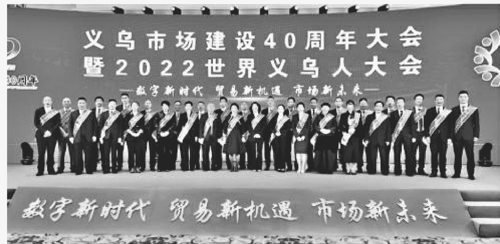

## 义乌

## 中国政府与市场发展

## 经验

胡宏伟 著

浙江文化艺术发展基金资助项目

义乌如何创造『全球最大小商品市场』的经济奇迹

政府与市场的关系一直是我国改革面临的核心问题

浙江文艺出版社

## 义乌的意义不只是最大的市场

这就是义乌：

- 全球最大的小商品批发市场；
- 世界小商品之都；
- 买全球，卖全球；
- 汇集210多万种商品，联动全国210多万家中小微企业；
- 2023年出口总值突破5000亿元，商品远销233个国家和地区；
- 每年纷至沓沓的各国外商逾50万人次；
- 拥有市场主体110多万户，关联拉动全国3200万人就业；

……

义乌最著名的标签有两个：市场；最大的市场。

义乌发生了什么？为什么是义乌？自1982年正式开放小商品市场开始，伴随着义乌市场40多年的发展历程，这样的追问从未停歇。

从现有资料看，美国芝加哥大学的中国问题专家Mazur博士，可能是第一位“意外”关注到中国专业市场的西方学者。1987年5月，这位能讲一口流利的普通话、还起了个中文名字的“马紫梅”博士，站立在人头攒动、熙熙攘攘的义乌小商品市场里，她惊叹“不亚于看到了一处从未发现过的异域文明”。马博士一口气问了一连串的“why”——为什么美国在工业文明初期，没有出现过像义乌小商品市场这样的超大型专业市场？为什么一场前所未有的专业市场浪潮，偏偏会出现在20世纪末的中国？而在中国，最大的专业市场又为什么出现在了过去并不出名的义乌？

差不多20年后，2008年7月，马紫梅博士的芝加哥大学同事、1991年诺贝尔经济学奖获得者、98岁高龄的罗纳德·科斯教授，在芝加哥大学主持了以“中国的经济改革”为主题的论坛。这次会议被认为是过去数十年西方学术界关于中国改革最为认真的一次讨论。科斯自掏腰包，邀请了包括来自浙江的数十位中国学者，他对发生于中国特别是浙江的巨变充满好奇。

在论坛最后一天的总结演讲中，科斯希望所有人都能持续关注中国的经济变革。在他看来，中国对世界的意义重大，“为中国而奋斗，就是为世界而奋斗”（The struggle for China is the struggle for the world）。

“最大的市场”——义乌，无疑是科斯所热切关注的有关中国变革的优质区域样本注解。但是，时至今日，中国改革开放46年间，各地市场的蜕变和崛起风起云涌，义乌不是唯一的，却是最成功的市场，那么，义乌究竟做对了什么？企图机械地学习、复制“最大的市场”既不可能亦无必要，那么什么才是义乌样本背后最具共性意义的东西？

在本书的调研、梳理、撰写过程中，一个基本的判断和结论愈加清晰起来：政府行为与市场活力在社会主义市场经济改革取向下的辩证关系的探索和富有成效的实践，是义乌之所以成为义乌的关键与本质。正如吴敬琏先生所言：“政府与市场的关系，一直是中国改革面临的核心问题。”

义乌是“最大的市场”，但义乌的意义不只是最大的市场。

## 历史的最深处：从亚当·斯密到凯恩斯

政府与市场的辩证关系的缘起以及相关激辩，不是源于义乌，也不是源于中国改革，实际上早已穿越百年。

简而言之，市场经济就是由市场决定资源配置的经济。党的十八届三中全会明确指出，要“使市场在资源配置中起决定性作用”。现代市场经济萌生于农耕文明和工业文明的转折时期，其与被誉为“现代经济学之父”的亚当·斯密密不可分。

1723年6月5日，亚当·斯密出生于苏格兰法夫郡的小镇柯卡尔迪。1767年，结束欧洲大陆旅行的亚当·斯密回到家乡，9年后，他一生中最重要的经济学巨著《国民财富的性质和原因的研究》（简称《国富论》）出版。1902年，近代中国启蒙先贤严复以《原富》为名，用文言文第一次将《国富论》译介于国人。

《国富论》的出版，确立了亚当·斯密在现代经济学领域高山仰止的奠基人地位。1790年，亚当·斯密去世，之后200多年，《国富论》的巨大影响绵延不绝。经济学家罗森伯格认为，“过去的200多年，经济学史的特点就是对亚当·斯密著作的不断注释”。

亚当·斯密在《国富论》中极为强调自由市场、自由贸易和在自由市场主导下人的劳动分工，并分析得出了“市场机制本身驱使近代社会的经济不断发展”的结论。亚当·斯密认为，人类的行为由六种自然的动机所推动：自爱、同情心、追求自由的欲望、正义感、劳动习惯和交换倾向。由于深信人类动机的自然平衡和对市场调节带来的自然秩序的信仰，亚当·斯密提出了他的著名论断：每个人在追求自身利益时，都会“被一只看不见的手引导着去达到并非出于其本意的目的”。由此，亚当·斯密不仅被誉为“现代经济学之父”，还被定义为极端推崇市场至上的“自由放任主义之父”。

虽然饱受争议，但亚当·斯密和他的自由市场竞争理论长期以来占据了主流经济学思想的高地，直到1936年他的英国同胞约翰·梅纳德·凯恩斯的《就业、利息和货币通论》（简称《通论》）的问世。

被后人称为“宏观经济学之父”的凯恩斯原本是一个自由贸易论者，明确反对政府的贸易保护主义。1936年出版《通论》后，他一反既往，坚决放弃市场自发调节的经济自由主义，转而主张国家干预主义。凯恩斯强调的国家干预，主要体现于推行赤字财政政策，增加政府支出，以公共投资的增量来弥补私人投资的不足，从而扩张社会总需求，实现经济供求关系的平衡，拉动经济持续增长。这部著作甚至催生了与亚当·斯密自由市场竞争理论相左的以国家干预为强烈特征的全新的经济学思想流派——凯恩斯主义。

凯恩斯主义的崛起有其深刻的时代背景。20世纪初第一次世界大战结束后，1929年从美国发端，爆发了资本主义经济史上规模最大、历时最长、最为严重的世界经济危机，以及随之而来的“大萧条”。此后，波及60个国家和地区、20亿以上人口的第二次世界大战令半个世界满目疮痍。修复创伤、百废待兴之时，人们发现，“自由竞争、自我调节、自动均衡”的自由市场的自发经济秩序似乎已经不灵了，要拯救世界，必须依靠政府强制介入、高效管理的“有形之手”。

尤其是20世纪40年代起，联合国、关税与贸易总协定（1995年1月转型为世界贸易组织，即WTO）以及布雷顿森林体系之下的国际货币基金组织、国际复兴开发银行（世界银行）等带有浓厚政府间统一联动协调色彩的全球治理机构的成立及有效运行，为凯恩斯主义的风行于世找到了理由充分的现实基础。

一般认为，凯恩斯和亚当·斯密恰如一枚硬币的两面，凯恩斯的国家干预主义就是对亚当·斯密自由放任主义的否定，政府和市场水火难容。凯恩斯甚至直截了当地得出结论：市场中不存在一个能把私人利益转化为社会利益的亚当·斯密式的“看不见的手”，纯粹的自由市场不可能消除经济危机和失业问题。于是，不同的经济学流派分别将亚当·斯密和凯恩斯视作各自的旗手及至高无上的偶像，拥戴、驳斥、激辩此起彼伏。20世纪迄今，一百多年间，大抵可以划分为以下几个阶段：20世纪初至30年代，自由市场主义在世界各国占据支配地位；1936年《通论》问世前后，因撰写《通往奴役之路》享誉世界的奥地利裔英国经济学家哈耶克和凯恩斯两大巨擘，围绕政府与市场、自由与计划展开了一场长达10年的大论战；40年代至70年代，战后重建的强力助推，凯恩斯主义登上全球经济思想的巅峰；80年代开始，英国撒切尔夫人私有化改革和美国里根总统的自由市场经济政策的推行，伴随同一时期中央计划经济国家的经济转型改革、冷战结束，以及90年代后世界经济全球化风起云涌，自由市场主义迎来新一轮狂欢；2008年全球金融危机爆发，及至近些年世界经济持续低迷乏力，全球化面临地缘性解构，凯恩斯主义再度抬头。

亚当·斯密和凯恩斯真实的思想底色究竟是什么？政府和市场是否从本质上针锋相对、水火难容？由于两位巨匠思想的深邃及著作表述的晦涩，正如经济学家罗伯特·海尔布罗纳所言，在历代经济学大师中，亚当·斯密是“被引用最多、却被阅读最少的一位”。而美国第一位获得诺贝尔经济学奖的麻省理工学院教授萨缪尔森则认为，《通论》出版时，当时的美国能读懂凯恩斯《通论》的，“几乎一个人也没有”。

被仰望、被崇拜、被各取所需地引用和验证，带来的是不可避免的脸谱化以及极端对立的误读和误解。

潜心研读亚当·斯密的《国富论》及其《法理学讲义》《道德情操论》，我们会发现，他崇尚自由市场，但并非市场原教旨主义者，他把“国家与法律”视为“市场秩序得以成立的最重要前提”。为此，亚当·斯密界定了著名的现代政府三项职能：保护社会，使其不受其他独立社会的侵犯；尽可能保护个人自由，使其不受任何其他人的侵害或压迫；建设并维持市场无法提供的公共事业、公共设施。

反观国家干预主义的鼻祖凯恩斯，他的确不认为亚当·斯密古典经济学的药方可以自然发挥作用，但他认为市场化制度的财富生产功能是解救人类文明于危殆的关键因素。当选为世界银行第一任总裁的凯恩斯在1946年4月因突发心脏病去世，而在去世前不到半年，他在英国众议院发表讲话时说：“不要误解我。......布雷顿森林体系和华盛顿提案的最大优点是，它们可以把必要的权宜和长远的原则结合起来。......它不是为了打败，而是为了实现亚当·斯密的智慧。”

无疑，亚当·斯密的市场理论和凯恩斯的政府理论有显而易见的差异，某种意义上，两者的差异堪称迥异，但也并非决然的排斥与对抗，而是有一条彼此相连的隐秘通道。其交集点在于，在承认市场本源性地位的共性基石之上，如何定义操作正确且边界适当的政府行为。这一正确且适当的政府行为的最重要的先决前提是，遵循市场规律，并以更好地激活市场活力为指向。

时间指针走到1978年，一场人类经济史上最浩大、最波澜壮阔的伟大改革开始耀眼于古老的东方。在中国，在浙江，在义乌，政府的力量与市场的力量交相辉映，从百年激辩落地生根，绽放于大地。

## 中国改革：从政府管制到市场经济

有秦一代，中国就出现了最强大的政府。中国的市场古已有之，《周易·系辞》曰：“（神农）日中为市，致天下之民，聚天下之货，交易而退，各得其所。”但现代市场与市场经济的胎动，则是西风东渐的洋务运动后百余年才有的事。

1978年肇始的中国改革开放，变化悄然而清晰。改革史研究学者吴晓波认为，1984年是当代中国的“公司元年”，或者称之为“企业家元年”。1985年，《中国企业家》杂志创刊；1988年，首届“全国优秀企业家”评选出炉。企业家的回归，意味着孕育企业家的市场和市场经济的归来。

称之为“归来”，是因为曾经存在，又曾经被“消灭”。其结果是在1978年前的很长一段时光里，中国只有依计划生产的工厂和接受行政指令管理工厂的厂长，没有真正的企业和企业家；只有政府决定一切的计划经济，没有真正的市场和市场经济。所谓计划经济，即根据政府计划调节经济活动的管制型经济运行体制。极端化情形下，乡村农民自养鸡鸭的数量被政府计划调控，城市居民受困于粮票、布票、肉票、肥皂票、理发票等计划物资匮乏的囚笼，经济活力近乎丧失。

如果说亚当·斯密与凯恩斯之间的差异属于经济思想及行为的各行其道，那么计划经济与市场经济两者之间的边线长期被视作社会主义与资本主义泾渭分明的分水岭。基于此，市场和企业家的回归，成了中国改革史册上最艰难亦是最根本的破冰。以官方表述为观察基点，以时间为轴，其渐进突破大致呈现如下路线图：

1982年9月，党的十二大召开，“计划经济为主、市场调节为辅”作为经济建设的指导原则第一次被写入党全国代表大会报告。消失了30年的“市场”一词重新进入官方话语体系。

1984年10月，党的十二届三中全会通过《中共中央关于经济体制改革的决定》，强调社会主义计划经济是“在公有制基础上的有计划的商品经济”。这一重大突破的背景，是彼时个体私营企业已大量涌现，僵死的理论难以回答鲜活的实践。

邓小平：《在武昌、深圳、珠海、上海等地的谈话要点》，《人民日报》1993年11月6日。

最重大的转折是在1992年的春天。邓小平同志在南方谈话中说：“计划多一点还是市场多一点，不是社会主义与资本主义的本质区别。计划经济不等于社会主义，资本主义也有计划；市场经济不等于资本主义，社会主义也有市场。”一语定乾坤。同年10月，党的十四大确定中国经济体制改革的方向是建立社会主义市场经济体制，市场经济已成共识。

2013年11月，党的十八届三中全会审议通过《中共中央关于全面深化改革若干重大问题的决定》，要求建设统一开放、竞争有序的市场体系，“使市场在资源配置中起决定性作用”。

纵观中国改革史，许多改革目标都是局部且阶段性的，唯有对“政府与市场的关系”的认知及变革贯穿始终。其意义和重要性在于，“政府与市场的关系”将左右中国改革的路径、方法乃至方向。

唯其艰难和重要，所以转变认知需要一次次脱胎换骨的思想解放。在“政府与市场的关系”转型最为关键的改革开放早期，值得铭记的思想解放至少有以下三次：

- 1984年9月，浙江“莫干山会议”。这次会议颇具民间色彩的基调，带来的是一大批青年经济学者平等、自由辩论的思想激荡。会议递交的报告中提出的国家牌价（国家指导价）、市场调节价相结合的价格改革双轨制方案得到了中央采纳。
- 1985年9月，重庆“巴山轮会议”。中国经济体制改革研究会、中国社会科学院、世界银行联合举办的本次国际研讨会，堪称中国宏观经济学说的一次启蒙。会议上，匈牙利经济学家科尔奈提醒中国同行要警惕重新恢复集权管制的危险；作为凯恩斯主义者，诺贝尔经济学奖获得者、美国耶鲁大学教授托宾建议的介于计划指令和自由市场之间的宏观干预的中间路线，对改革过渡期的中国似乎“恰到好处”。
- 1991年10月至12月，北京“九一”座谈会。由国家最高领导人主持，在此期间连续召开11次“气氛自由”的座谈会，吴敬琏等学者力挺“社会主义市场经济”。系列座谈会结束后一个星期，苏联宣告解体；数月后，邓小平视察南方，发表重要讲话。计划经济与市场经济的激辩谢幕，全国性自由市场复苏、生长、繁荣。

考察中国式改革背景下“政府与市场的关系”的转型，有两个不同坐标系的维度：一是时间维度；二是地理维度。对“政府与市场的关系”的认知作为一种经济思想，既与改革的阶段推进有关，也与经济地理环境孕育的历史、文化、理念有关。

以地理维度为视角，很长时期，我们更多关注的是中国的东西部差异。事实上，更耐人寻味的是中国南方和北方的差异。因为稍加比较分析，我们不难发现，东西部差异的关键是地理差异，而南北方差异的内核是理念差异。在同样的改革开放时代背景下，以GDP总量为例，1978年中国的十强城市6座在北方，4座在南方；2023年，十强城市中南方增至9座，北方仅存北京。南北强弱转化的因素是多方面的，如果以重要性排序，首要因素无疑是改革理念，核心是怎样理解和践行“政府与市场的关系”。可以简单地得出基本结论：政府力量相对市场力量的强弱与经济发展的兴衰成反比。正因为对“政府与市场的关系”的认知及实践植根于深厚的历史、文化积淀，具有强大的韧性和惯性，所以改变将无比艰难。

从地理维度考察的另外一层含义是，2001年中国正式加入世界贸易组织，在共同规则的约束和激励下，中国的自由市场从国内扩展到了全球。这不仅是地理空间的量的增长，更是市场经济成熟度的质的嬗变。

进入21世纪，虽然市场和市场经济的理念及制度安排已基本确立，但探索与争论依然持续。其聚焦点不再是改革早期的“要或者不要市场经济”，而是我们需要怎样的市场经济，以及在市场经济的制度安排之下我们需要怎样的政府行为。

恰如哈耶克与凯恩斯的世纪论战，这一探索和争论的戏剧性的一幕，发生在2016年。这一年的11月9日，中国颇具影响力的两位经济学家张维迎、林毅夫以“中国到底需不需要政府主导下的产业政策”为核心议题，在北京大学朗润园展开了“可能被写入历史”的面对面辩论。正方林毅夫认为，“既要有市场，又要有政府”；反方张维迎则明确反对产业政策，并强烈质疑政府产业政策的必要性及效果。

中国学界关于产业政策的争论并非起于“朗润园激辩”，最早可以追溯到2003年。彼时，政府高层开始将“宏观调控要以行政调控为主”作为刚性指导方针，对企业微观经济活动的行政干预日趋强化。而事实上，“朗润园激辩”双方论点的反差也不像外界解读的那么针锋相对，更重要的争论点在于：什么样的产业政策才是有利于促进市场竞争的“好的”产业政策？

学习借鉴肯定是寻找正确路径的好办法。自1868年开始进行明治维新，日本的经济增长一直有比较强的国家政府影响因素。在第二次世界大战之后重建的特殊时期，日本政府开始执行国家把经济资源集中倾斜于若干战略性工业的“优先生产制度”，后来被概括为“选择性产业政策”，强力推动战后日本经济的恢复和起飞。20世纪70年代至80年代中期，日本在反思中适时将“选择性产业政策”优化为“功能性产业政策”，即由政府直接干预产业和市场向政府提供宏观信息、诱导以民间企业为中心的创业创新方向的二次转型。查默斯·约翰逊在《通产省与日本奇迹》一书中对日本产业政策的进化总结了四条成功准则，其中一条是，“政府真正尊重市场，相信市场价格的作用”。

“朗润园激辩”之后，关于产业政策的争论并未平息。从中国改革到义乌样本，“政府与市场的关系”仍将是实践和理论尚待开拓的纵深处。

## 义乌的秘密

正是在全球现代市场经济思想演变和中国改革逻辑追寻的视野下，义乌故事的意义才能得以充分显露。

义乌出名很早，而且其萌生、成长、迭代、壮大几乎贯穿了改革开放全过程，放眼全国，这样全生命周期的“改革常青树”亦堪称鲜见。就与中国改革之息息相关、经济成就之大、经验之独特、生命周期之长而言，在县域范畴，只有江苏昆山可以与浙江义乌并列为最耀眼的双子星。

长期以来，义乌最受瞩目、被交口称赞的一定是其市场之巨大。但这是发展的结果，是义乌奇迹外在的“表”。义乌一直被称为“中国义乌”，那么从中国乃至更广阔的范围去考量，义乌成长的独门秘籍是什么？什么才是义乌最内在、最本质、最共性的意义？

我在撰写《东方启动点：浙江改革开放史（1978—2018）》一书时，第一次提出了省域层面“第一中国”的概念，“第一中国”涵盖广东、江苏、浙江三省域，定义维度主要包括GDP总量、财政净上缴贡献量以及作为中国改革取向的市场经济成熟度。我认为，广东是因开放倒逼改革的自上而下的植入式市场经济；江苏是由改革转型开放的从乡镇集体经济发力的半市场经济；浙江是因改革而开放的自下而上的更为彻底的草根型市场经济。相较之下，浙江市场经济的发育主要依靠的是来自底层的星火燎原般的内生性力量，而且一开始就深度触及最内核的所有制问题，因此浙江的市场化改革最为彻底、最为成功，也最为艰辛。

如果继续以改革发展为观察主轴，浙江很可能是改革逻辑闭环及发展阶段特征最完整的经典省域：20世纪80年代，“温州模式”率先以产权制度破题，民营经济作为市场主体获得生存权；20世纪90年代——义乌市场的相对成熟期——“义乌经验”探索回答什么是社会主义市场经济环境下正确的政府行为；21世纪第一个十年，发源于安吉余村的“绿水青山就是金山银山”理念引领人与自然、人与人和谐美好的新时代；21世纪第二个十年，作为第一个高质量发展建设共同富裕示范区，浙江勇立潮头再出发。

从上述浙江改革发展的阶段性来看，义乌处在承上启下的关键的“腰部”。而中国是一个有着千百年“强政府”传统的国家，当我们打开国门，尝试学习汲取外部世界的市场经验时，能否找到并确立与中国国情兼容的“政府与市场的关系”之路至关重要。有什么样的中国式“政府与市场的关系”，将直接决定民营经济的生存状态和市场经济的运行规则。这一切，都需要改革前沿地带的实践来回答。

## 一个开放式的悬念

本书是基于县域实践样本，对“政府与市场的辩证关系”进行观察和研究的成果。从亚当·斯密、凯恩斯的经济思想到人类迄今涉及人口最为广大的中国改革开放实践，这始终是极端重要、令人迷惑而又迷人的命题。

中共中央党史和文献研究院编：《建国以来毛泽东文稿》（第十一册），中央文献出版社 2023年版，第166页。

中国改革是一条前无古人的坎坷之路，没有充分的理论准备，急切出发时的动力卑微而壮怀：摆脱贫困，让人民过上好日子。即便是已经翻越了那么多座山、蹚过了那么多条河，在收获了令世界瞩目的经济奇迹的46年之后，中国改革在相当程度上依然是实践大于理论。毛泽东主席论及“中国应当对于人类有较大的贡献”的话语犹在耳边，这一“较大的贡献”的内涵肯定不仅仅是脱贫致富、物质丰盈，还应该包括思想积淀和方法论提炼。知其所以然比知其然更重要，它可以让我们走得更远。

我们必须看到，基于深入骨髓的文化肌理和巨大的历史惯性，早已确立社会主义市场经济价值取向的中国改革，当下面对的主要矛盾仍是政府对微观经济活动干预过度，“政府为体、市场为用”，在某种情形下旧体制的思维极易回潮。因此，继续深化改革遭遇两个困局：以政府性投资驱动的粗放型经济增长方式难以转变；政府手里掌握太多太大的资源配置权力，部分官员利用手中权力对市场进行管控和干预，滋生权力寻租的空间。

更加尊重市场规律，才能更好发挥政府作用，有效市场是有为政府的前提和归宿。否则，政府行为就可能误入歧途。确立正确的“政府与市场的辩证关系”仍是将改革进行到底的实践探索目标，因此梳理其理论的逻辑和必然性，并用清晰的理论规范引导更广泛的实践尤为急迫。于是，从这一视角深度总结“义乌经验”的价值和意义由此凸显。

## 上部

### 样本观察篇

#### 引言

如果以1982年9月“稠城镇小百货市场”正式开放为起点，义乌市场的探索实践与发展已经走过42年。在兴商建市40余年的征途中，地处浙江中部曾经资源匮乏、一无所有的义乌从“无中生有”到“无所不有”，不仅创造了“全球最大的小商品批发市场”的奇迹，也使自己成长为折射中国改革走向的标杆性城市。

习近平著：《干在实处 走在前列——推进浙江新发展的思考与实践》，中共中央党校出版社2006年版，第519页。

习近平总书记在浙江工作期间曾指出：“义乌的发展是过硬的，在有些方面还非常突出；义乌发展的经验十分丰富......义乌发展的经验中既有独到的方面，也有许多具有普遍借鉴意义的方面。” 2006年6月8日，习近平同志在义乌召开座谈会，推动当时已在浙江掀起的学习“义乌发展经验”的热潮走向纵深。此前的4月30日，浙江省委、省政府联合下发《关于学习推广义乌发展经验的通知》，决定在全省范围内学习推广义乌全面建设小康社会、走科学发展之路的经验。

纵观改革开放40余年创业史，“义乌发展经验”十分丰富，涵盖方方面面。但什么才是义乌贯穿40余年市场成长史并在新时代彰显意义的主轴与核心？透过错综纷繁的现象看本质，在全球最大的小商品批发市场精彩炫目的奇迹背后，极具个性同时极富共性意义的“义乌发展经验”的核心是：在中国特色社会主义市场经济的摸索实践过程中，正确把握协调政府与市场的关系，尊重市场规律、激活市场活力的“无形之手”与发挥政府作用、适度有效调控的“有形之手”进退自如，交相辉映。

义乌发展的经验首先在市场，在市场经济。市场经济的精髓之一，是尊重群众的首创精神，充分发挥他们在市场中的主体性作用。这一点，在义乌小商品市场蚂蚁雄兵般的无数创业者身上展现得淋漓尽致。市场经济的精髓之二，是使市场在资源配置中起决定性作用，义乌市场由此崛起。包括义乌和东阳签订水权转让协议，开创全国水权交易的先河，以及义乌率先建立全国首个农村宅基地基准地价体系，有效盘活农村要素资产等，让市场配置资源的力量无所不在。

在市场造就义乌奇迹的过程中，义乌市委、市政府坚持顺势而为，有所为、有所不为：牢牢把握发展的主导权，做到尊重群众的首创精神，但绝不袖手旁观；尊重市场的决定性作用，但决不放任自流。从发文准生小商品市场，“敢为天下先”地发布“四个允许”政策，提出“兴商建县（市）”战略，到国有土地使用权招标拍卖落下第一槌，以及推进国际贸易综合改革试点，义乌的一系列举措一以贯之地体现了政府“认准了就干”的政治魄力。另一方面，在事关基础性、战略性、方向性问题上，比如改善投资环境、优化公共服务、保障公平竞争、保护知识产权、监管市场准入、完善信贷体制、实施品牌及国际化策略等领域，义乌市委、市政府始终保持对战略资源的调控能力，管好那些市场管不了或管不好的事，屡屡创新制度。这些做法补市场之“短板”，努力离市场更近，进而引领市场，与市场发展需求融于一体、同频共振。

义乌发展40余年，我们看到的是“无形之手”与“有形之手”携手共赢最经典的成功实践和理论探索。没有市场的力量与政府的力量相结合，就没有义乌的今天。

浙江是习近平新时代中国特色社会主义思想的重要萌发地，也是中国体制改革探索和创新的前沿，而义乌则是践行习近平新时代中国特色社会主义思想的重要试验田。从这一视角而言，义乌不仅是浙江的义乌，更是中国的义乌。

40余年的中国改革开放，其清晰的改革取向就是建立富有中国特色的社会主义市场经济。其间，历经从政府统一调配的计划经济到有计划的商品经济，再到社会主义市场经济的艰难探索。党的十八届三中全会宣告，要“使市场在资源配置中起决定性作用”，对市场化改革的方向给出了明确的历史定位。值得注意的是，中国特色社会主义市场经济从来不是放任式市场经济。党的十八大报告将“全面深化经济体制改革”列为对未来经济建设五项具体要求中的第一项进行阐述，并指出“经济体制改革的核心问题是处理好政府和市场的关系，必须更加尊重市场规律，更好发挥政府作用”。党的二十大报告则进一步明确论述，“充分发挥市场在资源配置中的决定性作用，更好发挥政府作用”。党的二十届三中全会提出，“高水平社会主义市场经济体制是中国式现代化的重要保障。必须更好发挥市场机制作用，创造更加公平、更有活力的市场环境，实现资源配置效率最优化和效益最大化，既‘放得活’又‘管得住’”。

中国改革开放的重要特征之一，是逐步实现了从政府高度集中的计划经济体制向社会主义市场经济体制的转型。但市场经济并不是放弃政府作为，相反，“强政府”是中国特色之一，也是我们最大的优势，其关键在于如何“更加尊重市场规律，更好发挥政府作用”。不难发现，直至今天，违背市场规律、政府行为错位与缺位等现象仍普遍存在。因此，能否正确把握政府与市场的关系，将决定改革的成败乃至国家经济的兴衰。在社会主义市场经济改革取向下，政府行为与市场活力的辩证关系及其实践和探索，无疑是一个极具改革史意义和新时代意义的重大命题，承载着难以替代的中国价值。

浙江是中国市场化改革最彻底、最成功的省份之一，义乌则是浙江乃至中国社会主义市场经济萌生、发育并走向成熟的最经典的区域样本。义乌样本的价值不仅仅是创立了全球“最大的市场”，更是清晰确立了有为政府与有效市场之间互动双赢的辩证关系。假如只是立足于“最大的市场”这一经济结果，义乌现象仍然是个案化的难以复制的一场惊艳，但如果从中汲取出政府与市场辩证关系的改革实践及理论的精髓，那么40余年来的“义乌发展经验”便具有了更为广泛深刻的可学习借鉴的共性价值。

依循这样的坐标、维度，后顾与前瞻，我们有必要对义乌样本做出如下两点基本判断：

首先，要立意高远，跳出义乌、跳出小商品市场的狭小半径，从中国及中国式市场经济宏观体系构建的视角，来看待和研究义乌现象。商品交易市场的蓬勃兴起，是改革开放尤其是前20年所绘就的一道极富中国经济特色的亮丽风景线，而义乌小商品市场则是其中最具代表性的奇迹。但学习“义乌发展经验”，并不是简单机械地模仿克隆，更非企图再造一个义乌市场。事实上，据中国社会科学院财经战略研究院最新发布的《中国商品交易市场融合创新发展报告》显示，2012年全国年交易额亿元以上商品交易市场增至5194个，达历史高点；2021年已持续下滑到3753个，相对于高点整体降幅为27.74%。同一时期同一口径的市场交易额，也从过去几十年的两位数增速猛然降至平均2.51%的低速增长区间。因此，“义乌发展经验”的核心不在于市场的外在表现，而在于其背后政府角色的准确定位、行为边界的清晰把握及其一以贯之的战略定力。

其次，要长期追踪研究义乌现象，在更长的历史阶段去探寻和总结“政府与市场的辩证关系”的内在逻辑和规律。亚当·斯密的自由市场理论与凯恩斯的国家干预主义理论所引发的政府力量与市场力量的博弈和激辩已延续百年，迄今仍是经济学范畴的尚无定论的世界命题。中国改革是从政府主导型向“政府＋市场”双循环渐进演变的前无古人的伟大实践，虽然中国国情与欧美国家有显著不同，但政府力量与市场力量彼此交融、相互作用的规律性探索之共性仍大于差异。某种意义上，中国的就是世界的。义乌的改革实践已走过40余年的历程，在“政府与市场的辩证关系”的探索领域卓有成效，并给出了诸多启示，然而实践丰满的同时，理论的提升仍显欠缺。只有在足够长的发展时间轴和周期起伏中，我们才有可能得出更为本质的规律性认知。因此，对义乌在“政府与市场的辩证关系”方面的实践和理论的研究总结有必要长久地坚持下去。

## 第一章

## 为什么是义乌：政府行为与市场崛起

提要：商帮文化优势论、改革先发优势论以及地理区位优势论之外，一定还有更关键、更本质、更独有的义乌秘密 / 如果不能让民间的市场自发及时、适时、理性且收放有度地走向政府自觉，义乌市场则有很大的概率沦为平庸 / 政府行为，成为解读“义乌市场为什么”以及“为什么是义乌”最关键的发展变量

2022年11月25日，在义乌市场建设40周年大会暨2022世界义乌人大会上，金华市委常委、义乌市委书记王健描述了这样的新义乌——

今天的义乌市场，已经成为全球小商品市场的重要风向标。义乌市场汇集全国26个大类210多万种商品，在这里“只有想不到，没有买不到”。全球小商品看义乌，小商品指数成为全球小商品贸易的晴雨表。

今天的义乌市场，已经成为小商品制造走向全球的重要门户。义乌市场为中小微企业提供了产品展示、信息交流、经贸洽谈平台，为小商品制造走向世界开辟了便捷通道。义乌市场带动全国20多个产业集群、210多万家中小微企业，商品远销233个国家和地区，2021年出口突破3600亿元，把小商品做成大产业，撬动了全球大市场。

今天的义乌市场，已经成为贸易业态创新的重要策源地。进口转口、网红直播、跨境电商等新业态新模式层出不穷，形成全产业链电商生态圈，快递业务量仅次于广州居全国第二。开放Chinagoods数字贸易平台，向全球采购商提供一站式数字通关、数字物流、数字结算等服务。

今天的义乌市场，已经成为融入国内国际双循环的重要节点。对内链接全国287个二级分市场，物流直达1500多个县市。对外联通“一带一路”，义甬舟连接全球货物吞吐量第一大港，义新欧架起欧亚大陆钢铁桥梁，156个海外仓、275条“环球义达”国际专线织密全球贸易服务网络。

今天的义乌市场，已经成为共同富裕先行示范的重要平台。义乌已拥有88万户市场主体，义乌市场关联带动全国3200多万人员就业，为全国500多万农村剩余劳动力提供来料加工，“百县万品”为全国421个县市1.22万款农产品开拓销路。

今天的义乌市场，已经成为中外文化交流的重要窗口。义乌市场吸引着世界各地的商品和商人，有各类外资机构8000多家，每年纷至沓来的外商逾50万人次，常驻外商1.5万人。

## 义乌市场建设40周年大会暨2022世界义乌人大会现场

从1982年作为浙江乃至中国的第一批专业市场率先萌生，到1992年国家工商行政管理局第一次统计发布中国专业批发市场龙虎榜，义乌小商品市场即跻身“十大专业批发市场”之首，并将这一桂冠连续保持至今。这个被联合国、世界银行赞誉为“全球最大的小商品批发市场”的专业市场的成长足迹，几乎与中国改革开放的伟大历史进程相伴相随。

## 绵延数百年的义乌鸡毛换糖“敲糖帮”

启动点”的？义乌凭什么成长为40余年长盛不衰的“常青树”？在许多“具有普遍借鉴意义”的发展经验中，义乌最重要的究竟是做对了什么？长期以来，理论界与媒体围绕上述疑问的解读主要有以下三方面：

——商帮文化优势论。这一直是对义乌市场奇迹最为热门的解读视角。理论界普遍认为，义乌市场的源头可以追溯到拥有数百年历史的义乌“敲糖帮”。解开义乌秘密的第一把钥匙，肯定是鸡毛换糖的义乌“敲糖帮”的前世今生。

浙江素有“七山一水二分田”之称，土地狭少。和浙江南部许多地区相似，义乌也面临着人多地少的困境。更糟糕的是，处于金衢盆地的义乌土质属黄红壤，黏性大而肥力较差。土地不养人，经商便成了农民糊口活命的生存之道。黄红壤不适宜种水稻，却盛产甘蔗，用甘蔗熬出的红糖成了千百年来义乌的一大特产。冬春农闲时节，义乌农民们肩挑货郎担、手摇拨浪鼓，走村串巷，用红糖制成的糖饼向客户换取鸡鸭鹅毛、废铜烂铁。换回的鸡鸭鹅毛按质量分等，好的可用来加工鸡毛掸，差的下田沤肥。“敲糖帮”由此产生，相传了至少数百年。慢慢地，糖饼不再是唯一的交换中介，针头线脑等各色日用小商品也装进了货郎担，“敲糖帮”逐渐成长为义乌最重要的民间商业力量。

胡琦：《义乌的“敲糖帮”》，《浙江文史资料选辑》第二十一辑，浙江人民出版社1982年版，第163—165页。

“敲糖帮”的行踪并没有局限于义乌。鼎盛时期，其活动范围南至广东、西至湖南、北到徐州。货郎担远走他乡，最怕的就是势单力薄。由此，“敲糖帮”内部开始趋于合理分工、日渐紧密，成了真正的“帮”。从组织结构看，“敲糖帮”分为游走四方的“担头”与“坐坊”两大体系。“老路头”是“担头”中地位最高的，管辖数位“拢担”；“拢担”之下是几个“年伯”；“年伯”再下辖若干“担头”。“坐坊”则专门为“担头”提供配套服务。其中，“糖坊”主要负责帮助“担头”制作糖饼、糖搭盘、篾篓；在某些交通要道设立的专门接待“担头”的小客栈称作“站头”，“站头”一般由“糖坊”控制；“行家”是给“担头”批发采办百货的机构；“老土地”则在义乌当地以收购“担头”的回头货为主业。“坐坊”拥有的流动资本相对较大，它们比“担头”更有实力，“担头”因此而往往受制于“坐坊”。

据官方统计，1949年时，义乌“敲糖帮”的季节性商贩人数占全县人口的5%以上，总数达数万人。伴随着工商业社会主义改造的推进，“敲糖帮”严重萎缩，但远未“斩草除根”。行至改革开放初期，参与人数众多、富有传统特色、组织分工严密、生命力极强的“敲糖帮”，无疑为义乌市场的发育积淀了丰厚的商业文明基因。

但如果仅从商帮文化优势的视角观察，义乌既非唯一，亦非最优之选。在明清500多年的历史长河中，中国崛起了徽商、晋商、闽商、苏商、秦商、鲁商、粤商等十大地域性著名商帮，其中只有浙江一省独占两支——浙东大名鼎鼎的宁波商帮和浙西南的龙游商帮。在浙江省域之内，“四象八牛七十二墩狗”的南浔商帮，低调儒雅、闷声发财的绍兴商帮，大胆且肯吃苦、喜好纵横四海的温州商帮等，同样是遍地生根、声名显赫。无论是商业规模、层次，还是长久而广泛的历史影响力，义乌“敲糖帮”远非最突出者，因此，它不足以完全支撑“全球最大的小商品批发市场”改革辉煌的解读理由。

——改革先发优势论。义乌小商品市场究竟起源于何时？目前已无法考证。放眼古今中外历史不难发现，市场显然不是义乌或浙江的“独门秘籍”，也不是改革开放才有的特产。在中国，以商品交易为重要目的的庙会、墟市等集贸市场至少已有数千年历史。据刊行于同治十三年（1874年）的浙江《湖州府志》记载，“集市游移而至，邻近农人皆往。人头攒动，热闹不凡。或携货交易，或聚围把式，皆得其乐也”。这样的场景，在浙江各地随处可见，耳熟能详。

《新帕尔格雷夫经济学大辞典》将集贸市场定义为：一个“得到当局批准的、商品买家和卖家在某个特定时间相聚、或多或少受到严格限制及规定的公共场所”。除交易时间的非连续性外，集贸市场还明显具有交易半径狭小、交易内容以各种日用消费品零售为主等特性。

大致推断，早期的义乌小商品市场雏形出现在20世纪70年代中期，其植根于传统集贸市场，又逐渐显现出了区别于集贸市场的商品市场、专业市场的某些特征。义乌小商品市场的发源地一般认为有两处：一处是当时义乌县城的稠城镇，另一处是位于义乌东部的廿三里乡（1986年撤乡建镇）。廿三里乡是鸡毛换糖“敲糖帮”最早的兴盛之地，但稠城镇独有县城人口集中、交通便捷、物流通畅的相对优势。在稠城繁闹的县前街、北门街，摊贩固定聚集，摊位数不断增长，经销的商品品种也不断增加。这些商品已经不再局限于传统集贸市场的本地农副产品，而是涵盖了塑料玩具、装饰品、打火机、帽子、手提袋，以及一开始不准经销的服装、针织品等。货源也越来越多样化：摊贩自己加工生产；从本地或外地百货公司批发；从外地厂家直接进货。

直至1982年9月5日，经政府部门发文批准，稠城镇湖清门正式开放第一个小百货市场。2年后的1984年，义乌第二代小商品市场开业前，廿三里市场被并入了地处稠城的义乌小商品市场。

创立之后，义乌市场开始引发全国性媒体关注是在1986年。当年10月，具有风向标意义的《人民日报》第一次在头版显著版面刊发《开发民间市场带动农村各业——义乌“兴商建县”变富步伐快》，对义乌的市场经验进行了报道，并配发评论员文章《大兴民间商业》：

义乌县发展民间市场，培植市场机制，引导农民背靠市场搞活经济的做法，对我们下一步如何发展农村商品经济很有启发。

农村完成以家庭承包制为主要标志的第一步改革后，怎样引导农民发展商品生产呢？显然，过去那种依靠指令性计划、自上而下地指挥生产的老办法不行了。我们现在面临的，是已经取得独立商品生产者地位的近两亿个农户，他们有自主决策权，可以和社会各方面发生横向联系。在这种条件下，只有把市场机制培植起来，才能引导农民逐步进入市场，通过市场交换来发展商品生产。也就是说，要积极地把过去高度集中、只依靠行政命令的计划经济，改为以多样化、多层次的市场为基础的有计划的商品经济。在农村，尤应提倡积极发展由农民和农民群体组成的民间市场。

义乌经验证明：大兴民间商业有利于培植市场机制，这是农村第二步改革要做的一篇大文章。

办市场，看浙江。但改革伊始，首先受到强烈关注的浙江市场不是义乌，而是温州。

20世纪80年代初，在“究竟是天使还是魔鬼”的巨大争议旋涡中倔强绽放的温州已经冒出400余家各类商品市场或产销基地，连同神通广大的10万名购销员，为五光十色的小商品编织起了庞大的触须极为灵敏的全国性营销网络。其中，包括永嘉县桥头纽扣市场、乐清县柳市低压电器市场、苍南县宜山再生纺织品市场、苍南县金乡徽章标牌市场等，当时最负盛名的温州“十大专业市场”堪称浙江市场乃至中国市场的第一道霞光。

时任国务院发展研究中心主任、老资格的经济学家马洪这样评价：“温州的十大专业市场在20世纪80年代影响了整个中国市场的发育，其生动的市场机制和优秀的市场开创者曾推动了全国市场的发展。”

由此可以得出基本结论：在相同的改革开放春风化雨的大环境下，义乌市场是浙江专业市场早期发展的报春鸟之一，但不是最早，也不是当年最受瞩目的市场宠儿，其真正大放异彩、一骑绝尘，应该是90年代的事。相对于其他市场的改革先发优势，并不是义乌市场最终登上中国市场之巅的充分理由。

——地理区位优势论。这是一个独特且有趣的观察坐标。以此为视角，研究者会发现，浙江早期的许多知名专业市场，往往崛起于山穷水尽的地理位置。再看温州“十大专业市场”的发育路径，桥头纽扣市场诞生在两山夹峙的旮旯，宜山再生纺织品市场也藏于交通极其闭塞的乡间。实际上，整个温州都地处崇山峻岭的浙江最南端山区，三面环山，一面朝海，80年代时不通铁路、没有机场，从省会杭州坐汽车至温州需要让人发怵的15个小时车程，因此被称作“山坳里的温州”并不为过。

这一“山坳现象”适用于20世纪80年代初期浙江各地如雨后春笋般涌现的许多专业市场。金江龙村地处浙中金华市，距离永康县城尚有20公里蜿蜒的山路。千百年来，当地一直有制作木杆秤的传统，钉秤手工艺人游走四乡谋生。1979年，最早的杆秤及配件交易市场居然是在金江龙村后山山坡一片茂密的松树林中诞生的。名气慢慢大了，经营者却一直小心翼翼。5年后，思想解放的古山镇干部敲锣打鼓，这个偷生的市场终于被“请”进了金江龙村，在中心祠堂边落户。10多年后，金江龙村衡器市场已成为年成交额近千万元的全国最大的衡器专业市场，交易品种包括木杆秤、铝杆秤、电子秤、案秤、台秤、地中衡，五花八门，同时还带动了周边10多个衡器专业村和2000多户家庭工厂的发展。

“山坳现象”显然不符合交通便捷、物流畅达这一市场构建的先决条件。浙江专业市场的初步发展普遍呈现出一个事实：尽管地处偏僻、先天不足，它们却能率先发育、生机盎然。这一现象不能不让人大跌眼镜。

浙江工商大学原校长张仁寿认为，和许多中国问题一样，研究浙江专业市场不能只着眼于经济范畴。在这位温州籍学者的一篇论文中，有这样一段文字：

以当年温州十大专业市场为例，大多坐落在水陆交通都不是很便利的地方。唯一合理的解释只能是，在那些地方，“左”的思潮相对薄弱，计划经济的束缚相对较小。否则，这些市场很可能在兴旺之前就遭取缔。中国改革的经验证明，对旧体制的最初突破，往往发生在旧体制最疏于防范的地方。

张仁寿把这一现象概括为“边区效应”。远离管制中心、改革机会成本最小化的“边区效应”，属于市场经济特定时代背景下的经济学悖论。

与上述浙江尤其是浙江南部许多早期崛起的专业市场相比，义乌的确呈现了一定的地理区位优势。义乌地处被形象地比喻为“浙江之心”的南北相望、东西通达的浙江中部，更具优势的是，当年浙江的铁路动脉浙赣铁路纵贯其间。浙赣铁路始建于1899年，清政府为运输萍乡煤炭而开建兴修。1927年，时任浙江省政府主席张静江倡议修筑杭州至江西玉山的杭江铁路，1930年动工，并于1937年延展至萍乡，终成浙赣铁路。作为中国最早兴建的铁路干线之一，直到改革开放之初，浙赣铁路依然是浙江寥寥可数的几条铁路中最重要的大动脉。

无疑，相对的地理区位优势，为义乌市场的发展带来了一定的比较优势。正是在地理比较优势的驱动下，20世纪80年代中期，许多经销户从“山坳里的温州”迁徙入驻义乌小商品市场。据统计，高峰时期，义乌市场的温州经销户占比竟高达三分之二。这与义乌市场早期发育时，廿三里乡和稠城镇暗潮涌动、彼此竞合，但交通优势更明显的县城稠城镇的市场最终胜出是同样的道理。

但义乌只有相对优势，而没有绝对优势。在浙江范围内，有太多的县市区域比义乌更具地理区位优势。比如，浙江北部的杭嘉湖地区紧邻大都市上海，铁路、航空、国道、运河四通八达；再如，浙东宁波，坐拥优良的海岸线、优质的泊位以及世界级港口。

商帮文化优势论、改革先发优势论以及地理区位优势论之外，一定还有更关键、更本质、更独有的义乌秘密。

纵观40多年改革开放史，浙江被公认是市场化改革最为成功的省份。而在浙江改革历程中发挥了不可替代的巨大作用的市场形态，则是作为众多乡村中小企业共享的销售渠道的专业市场。与久已存在、绵延千年的传统集贸市场相比，浙江专业市场具有如下共性特征：

- 交易时间的连续性、交易地点的固定性；
- 以现货批发为主，集中交易某一类商品或若干类具有较强互补性和互替性的商品；
- 市场范围呈现跨区域的开放性，甚至辐射全国。

在吉尼斯世界纪录中，欧洲现存最大的专业市场是荷兰鹿特丹的鱼类市场。这个市场位于一座18世纪建造的5层楼高的砖瓦楼房内，建筑面积达10.6万平方米。在过去的200年里，勤于海耕的“荷兰海盗”一直是欧洲市场最重要的海洋渔产供应商，据称，目前每年仅从鹿特丹市场运往欧洲各地的渔产品就达120万吨以上，交易额达10亿美元。

但毫无疑问，只有在进入20世纪80年代的中国尤其是浙江，专业市场才真正开始发育完善而至极致，真正对一个区域的经济活动产生如此深远的影响，并衍生成为令人惊叹的“世界经济史经典”。

到国家工商行政管理局第一次发布1991年度全国“十大专业批发市场”时，浙江已拥有各类商品交易市场3802个，年交易额204.6亿元。全省差不多每1万人就有1个市场，200多万农村人口直接在市场的各个环节找到就业机会，1000万人的商品生产行为与专业市场密切关联。

专业市场在温州、义乌等地率先起步，旋即又遍布浙江，这并非偶然。正如许多研究者所观察到的，截至改革开放伊始，浙江的基本省情之一是“自然资源小省”，煤炭、原油以及金属矿产等拉动经济增长的自然资源极少，甚至完全没有。据国务院发展研究中心主办的《管理世界》杂志1987年刊载的《国民经济新成长阶段的区域问题》一文分析，中国主要自然资源人均拥有量指数，以全国平均数为100计，浙江的具体数值是水资源89.6，能源0.5，可利用土地40，耕地和气候117.2。在全国各省区市中，浙江人均资源拥有量综合指数为11.5，即只相当于全国平均水平的11.5%，仅略高于上海和天津，居倒数第3位。

浙江的基本省情之二是“国有投资小省”。资本是现代经济增长的发动机。对一个地区的经济发展来说，投资所具有的乘数效应不言而喻。传统计划经济时期，国家是动员、组织各种资源进行投资的主体，其重点无疑是重工业和国有大中型企业。而浙江地处比邻台湾的所谓“海防前线”，又缺乏发展重工业的原材料支撑，注定将失去国家投资的青睐。据国家统计局《全国各省、自治区、直辖市历史统计资料汇编（1949—1989）》显示，1952年至1980年，浙江全民所有制单位固定资产投资总额为134.02亿元，仅占全国同期投资总额的1.56%，远低于1978年时浙江人口占全国3.9%、生产总值占3.42%的比重。1953年至1978年，中央对浙江的投资为77亿元，人均410元，相当于同期全国人均水平的一半。

自然资源十分匮乏，又长期属于计划经济的“遗忘之地”，乡村加工业数量惊人的原材料采购及产品销售，唯有指望自我发育的各类专业市场冲出华山一条险道。

另据官方统计，1987年，浙江市场经营主体数量已突破100万户，大批企业中民营中小企业占了95%以上，家庭工场、夫妻作坊构成了彼时浙江经济的庞大基座。对于规模狭小的企业主体而言，建立自有的产—供—销管道无疑是“不可承受之重”。而作为共有、共享的交易平台，专业市场的出现则因恰到好处地满足了无数中小企业的生存需求，必然爆发出强大的生命力——无须千里奔波寻觅，天南海北的行业资讯在这里汇聚，林林总总的供需渴求在这里对接，实现交易的机会成本大大降低。

同时，专业市场的开放特性，决定了大量相同或类似的生产者和销售者会涌入同一个交易空间，彼此之间接近于完全竞争。于是，对专业市场的充分依赖，又反过来强力推进了企业的市场化蜕变。正是在这样一种良性互动之中，浙江民间经济主体日渐活力绽放。

观察分析浙江早期专业市场崛起的时间表和区域分布，可以得出颇为清晰的结论：浙江南部的市场萌生或创建的时间普遍早于浙江北部，在发育壮大的梯次上，明显呈现出南风北渐的涌浪式发展曲线。浙江南部温州、台州，浙江中部义乌等地的知名专业市场创建时间集中在20世纪80年代上半期，而浙江北部市场开始崭露头角则主要在80年代后期与90年代上半期。比如：绍兴轻纺市场，1988年；杭州四季青服装市场，1989年；杭州通信器材市场，1993年；海宁皮革市场，1994年。

浙江专业市场发展规律的南北差异，与浙江南北区域经济在特定历史时期的选择路径密切相关。浙江南部地区由于相对更为贫困，经济基础更为薄弱，改革开放之初就坚定地选择了以蚂蚁雄兵式的个体私营经济为特征的“温州模式”；相对富裕的浙江北部地区则普遍选择了企业产权乡镇集体所有的本土化“苏南模式”，直至90年代中期前后才迂回摇摆地开始学习“温州模式”，推进乡镇集体企业产权改革。从根本上说，专业市场的勃兴是市场经济的需求与必然，市场主体产权更为明晰的浙南专业市场的发育领跑浙北亦是顺理成章的事。

## 从无为到有为：政府行为如何演进

提要：从政府行为视角观察，第一阶段是暧昧与默许交织的复杂、敏感期，也是胚胎萌芽的早春。第二阶段最重要的事件，是发布了决定义乌小商品市场合法准生的“一号通告”，需要政府极大的改革勇气和韧性。第三阶段的起点，是第一个提出了“兴商建县”的发展战略，义乌自此清晰确立了政府行为发力于市场的根本指向。第四阶段，是义乌政府行为与市场活力辩证关系探索的成熟期。第五阶段，政府行为的范畴和指引，更多地向贸易国际化、数字化扩展。

传统意义上，浙江一直有浙东和浙西的划分，包含了颇为多元的历史行政区划、经济地理和思想流派的概念。一般而言，以从西南至东北走向的钱塘江为界，分为浙东、浙西。清初兴盛一时、尊崇经世致用的浙东学派，代表人物黄宗羲、万斯同、章学诚等皆为钱塘江以东的宁波、绍兴人士。而广义的浙东学派在此基础上还包含了以宋代陈亮为代表的浙中永康学派、叶适为代表的浙南永嘉学派等。

如果以当代改革开放坐标上区域经济的差异化发展路径与特征为考察样本，浙江更适合明确地划分为浙江北部与浙江南部两个板块。浙江东西、南北跨度约为450公里，下辖11个地市。浙北大致涵盖杭州、嘉兴、湖州、宁波、绍兴、舟山6个地市，浙南则为温州、台州、金华、衢州、丽水5个地市。其中，杭州、嘉兴、湖州属典型的吴文化区；钱塘江以南的绍兴、宁波属越文化区。浙南的核心是东南一隅的温州、台州，属瓯越文化区；其余3个地市是经济发展深受温台影响与辐射的金华、衢州、丽水。

千年以降，多平原、丘陵的浙北尤其是杭嘉湖地区盛产茶桑，工商繁华，人文底蕴深厚，享有“人间天堂”的美誉，远非多为深沟险壑、大山连绵的浙南可比。然而，改革开放伊始，从贫困出发绝地反击的浙南神速崛起，成为浙江乃至中国市场经济的“东方启动点”——游走全国的600多万浙商中，温州、台州、金华三地的商人至少占了六成。走遍千山万水、说尽千言万语、想尽千方百计、吃尽千辛万苦的“四千”精神，

其实质是以温州人为代表的浙南人的精神写照。

不同的历史背景，决定了浙南、浙北在共同的改革开放时代呈现出了不同的进化路径。据浙江省市场监督管理局2018年发布的《改革开放40年浙商生存发展报告》，1978年，浙南地区民营经济主体比重达14.7%，公有制经济主体占比85.3%，明显区别于民营经济主体比重仅3%、公有制经济主体达96.8%的浙北地区（0.2%的数值差为联营经济）。1988年，浙南地区民营经济主体比重更是迅猛增长到48.6%。不同的经济成分数据背后，是不同的经济运行格局：浙南地区市场的力量无比炙热，浙北地区政府的力量始终强大、稳定且有序。但伴随改革开放的推进深化，亦逐渐出现了交融趋同的态势。到1998年，浙北地区的民营经济主体比重已追至81.5%，仅比浙南地区的民营经济主体比重85.3%低3.8个百分点。

在浙北和浙南有差异也有共性的循环共振中，可以划入浙南地区但又地处浙江中部的义乌将做出怎样的发展行为选择？曾多年担任义乌市政府顾问兼义乌市场经济研究所所长的陆立军教授认为，“义乌模式”在很大程度上可纳入广义的“温州模式”范畴，甚至可以说就是“温州模式”的变种，两者在许多方面有共同的特征。

对比“义乌模式”与“温州模式”，两者最显著的共同点，是“小商品，大市场”。1986年2月27日至3月6日，费孝通第一次前往温州，实地调研了4个县、5个镇，历时9天，总行程达1500公里。此行之后，费孝通在《瞭望》杂志发表了影响广泛的《小商品 大市场》（初次发表时题目为《温州行》）一文。在该文中，他第一次用“以商带工的‘小商品，大市场’”来概括“温州模式”，表示“温州模式”的重要意义倒不在于发展了家庭工业，而在于激活了一个民间自发的、遍及全国的大市场，直接在生产者和消费者之间建立起流通网络。行走温州，年过古稀的老人感慨万千：“我的大脑皮层出现了自20世纪30年代搞江村调查后从未有过的刺激与兴奋。”

“小商品，大市场”同样是“义乌模式”的典型内涵。但与很长时期政府“无为而治”的温州相比，义乌显现出了鲜明的有为政府的发展主脉。某种意义上，地处浙中、连接南北的义乌充分汲取了浙江南部“强市场”与浙江北部“强政府”的双重优势，走出了一条极富探索性的义乌发展之路。纵观义乌市场40余年的改革历程，其政府行为从被动地摇摆观望，到主动介入引领，再到创造性地自觉有为，大体可以分成以下5个阶段，并日渐呈现清晰的阶段性特征。

## 第一阶段：20世纪70年代中期—1982年

从政府行为视角观察，这一阶段是暧昧与默许交织的复杂、敏感期，也是胚胎萌芽的早春。

20世纪50年代，随着工商业社会主义改造的推进，源远流长的义乌“敲糖帮”大幅萎缩。1953年，当地政府开始动员无证商贩歇业并转而从事农业生产。据《义乌县志》记载，截至1956年底，完成对农业、手工业和资本主义工商业的社会主义改造，义乌小商贩总数仅剩1317户，其中包括未经登记的流动商贩约500人。但由于“敲糖帮”事关百姓生计，草根韧性极强，虽然已是艰难求生，却从未被“斩草除根”。在随后的“文化大革命”岁月，被当作资本主义尾巴追剿而四处流散的“敲糖帮”，最多的年份外出糖担仍有数千副。

县工商行政管理局在为此发出的通知文件中表示：

为了贯彻落实中共中央（1980）75号文件，搞活农村经济，促进农副业生产发展，发挥优势，根据我县传统经营“小百货敲糖换取鸡毛什肥”行业，利用他们串乡走户、收旧利废、变废为宝、活跃经营的特点，恢复颁发已停发多年的“小百货敲糖换取鸡毛什肥”临时许可证......外出人员统一由生产队申请，大队审查，公社审核同意，县工商局核发许可证。各区工商所要指定专人负责。

许可证上，印有若干条严格要求的遵守事项：必须遵守政府政策法令服从领导，服从市场管理；按照规定合理经营，不准营私舞弊，不准超越经营范围，不准投机贩卖；等等。

在将这份“通知”下发各公社大队的同时，义乌县工商行政管理局还向“敲糖帮”活动频繁的江西、湖南、安徽、福建等毗邻各省相关部门发出了公函，希望“请予以支持和管理”。这实际上意味着计划经济时代“市场准入”禁区的悄悄开放。

一旦政府打开了一条缝，市场就会在夹缝中顽强生长。大约在20世纪70年代中后期，一些货郎担开始在县城稠城镇和廿三里乡歇担摆摊，小商品市场雏形初现。而在外地走街串巷的“敲糖帮”则从小商品市场进货。资料显示，以稠城市场为例，这一时期设摊的商贩已超过100人，先是在繁华的县前街，后迁往北门街。

义乌市档案馆资料记载：“1979年初，义东区和福田公社的十几副货郎担在县前街歇担摆摊，出售小玩具和针头线脑等小百货，以及家庭工副业产品掸帚、毛刷，一天营业收入远比走村串巷合算。......仅半年多时间就发展到200多户，商品品种也越来越多，经营方式由零售渐转为批量销售。”

此时的小商品市场已由地下转为半公开，人气渐旺。商贩们以竹篮、箩筐、塑料布、旅行袋为工具，随地设摊，沿街叫卖，被认为“严重影响市容”。有关部门多次奉命驱赶，他们一来，商贩们迅速收拾简陋装备一哄而散，“猫捉老鼠”难以奏效。

据1980年前后担任稠城镇城阳区工商所所长的孙樟宝回忆，当年的商贩就是做点小生意谋生，不让摆摊，等于夺他们的饭碗。但按照政策明文规定，的确是不允许的。对上负责还是对下负责？这实在是对良心的考验。唯一的办法是睁一只眼闭一只眼，上面抓得紧时赶一赶，风声一过，就随他们去。

1981年，义乌县工商行政管理局再次发放了5000余份“小百货敲糖换取鸡毛什肥”临时许可证，同时批准了200个小百货个体经营户。在政府力量与市场力量小心翼翼、如履薄冰的博弈中，义乌市场的发展走到了1982年的拐点时刻。

## 第二阶段：1982—1984年

这一阶段最重要的事件，是发布了解定义乌小商品市场合法准生的“一号通告”。在当时的历史背景下，需要政府解放思想，统一思想，需要极大的改革勇气和韧性。

1982年8月25日，由义乌县稠城镇党委书记任组长、县工商行政管理局副局长任副组长的“稠城镇市场整顿领导小组”下发了《关于加强小百货市场管理的通告》（第一号），明确宣布将于9月5日起，正式开放“稠城镇小百货市场”。这是全中国第一份明确认同农民商贩和专业市场合法化的政府文件。

“稠城镇市场整顿领导小组”成立于1982年8月7日，小组商定了市场开放的具体事项：市场地址选择场地开阔、居民集中但往来车辆不多的湖清门；建设资金由县工商行政管理局和城阳区工商行政管理所解决；在排查摸底的基础上，进行许可证、税务登记证、摊位证等登记发证；对市场、税务管理人员分专业、分地段明确责任。

义乌市档案馆保存了一则当年县广播站记者采访的关于小百货市场的消息稿：“湖清门小百货市场……经营国营和集体商店不经营的小五金、小百货、小塑料、小针织、小玩具等二三十个种类、两千多种花色品种的小商品。经营方式是批量销售为主，兼营零售。……城阳工商所干部通过学习认为，有党中央撑腰，湖清门市场应该让它存在和发展。……整顿后的湖清门小百货市场，秩序井然，面貌一新。”

但这篇消息稿显然是过于乐观了。1982年1月1日，中共中央批转了《全国农村工作会议纪要》，即著名的1982年中央“一号文件”，第一次明确肯定了包产到户、包干到户属于社会主义性质。曙光初现，亦与乍暖还寒交织。同年1月和4月，中共中央、国务院两次下发“打击经济领域中严重犯罪活动”的文件，要求坚决打击“走私贩私、贪污受贿、投机诈骗、盗窃国家和集体财产等严重犯罪活动”。

文件出台的背景是，多年的管制出现松动，社队企业肆无忌惮地与国有经济抢资源、抢市场，个体私营企业四处出击“挖墙脚”，民间贩运异常活跃。

急风暴雨般的经济整肃持续了差不多一年。据官方统计，到1982年底，全国立案审查各类经济犯罪16.4万多样，结案8.6万多件，判刑近3万人，追缴款项3.2亿多元。民营经济和市场经济最早萌动的浙江无疑成为重点严查的省份之一。在此前后，浙江省委主要领导的相关会议讲话强调，“不允许私人购买汽车、拖拉机、机动船等大型运输工具从事贩运”。

根据这一时期的官方文件指示精神，批准开放“稠城镇小百货市场”明显违反了3项禁令：农民不能弃农经商；集市贸易不能经销工业品；个体经营者不能批发销售。1982年5月，义乌县工商行政管理局正式向县政府打报告建议开放湖清门小商品市场。义乌县委、县政府十分重视及审慎，为此先后三次召开县长办公会议。经过激烈的讨论和争论，第三次县长办公会议后，时任义乌县委书记谢高华拍板决定：“同意开放，有责任我来承担。”

改革突破需要解放思想，而将改革突破沉淀为坚定的改革行动，则需要决策者统一思想。义乌小商品市场得以破茧而出，时任县委书记谢高华的态度至关重要。为了统一思想，在一次次的会议上，他鼓励基层干部：“义乌人的优势就是义乌人会做生意，政府要鼓励义乌能有10万人出去搞商业、搞工业。”为了坚决顶住非议和干扰，在一次干部会议上，谢高华甚至说了狠话：“如果你想不通，不执行县委和县政府的决定，你这个庙我拆不掉，但你这个庙里的菩萨我是随时可以把你撤换掉的。”

从全国范围看，政府助推专业市场的发展，是20世纪80年代下半期甚至90年代上半期的事，而义乌地方政府从认识到行动的适时介入和坚定不动摇，至少早了5年。这关键的5年决定了义乌极为宝贵的先发优势。

## 第三阶段：1984—2002年

这一阶段的起点，是义乌县委、县政府在全国第一个提出了“兴商建县”的发展战略。自此，义乌清晰确立了政府行为发力于市场的根本指向，并围绕政府行为如何培育市场、建设市场、引领市场，展开了全面的实践和规律性探索。

1982年9月5日开放的稠城镇湖清门第一代小商品市场建在一条臭水沟旁，水泥板上用木板搭成摊位，以塑料薄膜做雨棚，属典型的“马路市场”。固定摊位和流动摊位共计700多个，成交额当年就达到392万元，购销两旺。1984年5月召开的义乌县第六次党代会报告认为：“稠城、廿三里两地小百货批发专业市场和全县二十几个集市，已成为促进物资交流、带动本地加工业发展的贸易中心。”据此，党代会提出，“商业是联结工业和农业、生产和消费的纽带，是产品转化为用品的桥梁。……小商品专业市场和众多的农民购销专业户，是我县经济活动中的一大优势”。同年10月，县委书记谢高华在全县区（镇）、乡党委书记会议上首次明确提出，“要‘兴商建县’，把商业搞大、搞活，促进商品生产发展，加速我县的经济建设”。一个月后，谢高华调离义乌。1985年1月，接任县委书记的赵仲光在全省农村工作会议上作了题为《兴商建县 振兴义乌》的发言：“这几年，我们从义乌实际出发，把商业作为带头产业来抓，……从实践中提高认识，逐步确立兴商建县的指导思想。”1988年5月25日，国家民政部批复浙江省政府，同意义乌撤县设市。1990年3月义乌市召开第八次党代会，党代会报告中5处提及“兴商建市”战略，强调要坚定地推动“‘兴商建市’战略的继续实践”。

从“兴商建县”到“兴商建市”，义乌从此咬定青山，确立了以贸易为导向、以民间商业的繁荣为关键抓手和主要特征的义乌经济发展的战略方向。同时，也确立了市场经济改革取向下政府是否应该有为以及如何有为的基本指导思想。这一时期，是义乌小商品市场大建设、大发展、大繁荣的辉煌期。在这一阶段，政府行为发力于市场建设主要体现在以下

## 几方面：

市场快速迭代，升级扩张。响亮喊出“兴商建县”口号以后，1984年12月，第二代小商品市场在稠城镇新马路建成。马路市场升级为占地1.3万平方米的棚架市场，建设资金55万元，其中县财政拨款5万元，县财政局从集市贸易税收留成划转10万元，工商行政管理部门投入市场管理费10万元，农行贷款25万元，个体工商户集资5万元。1985年摊位增至2874个，年成交额5000万元。

1986年9月，第三代小商品市场城中路市场建成。占地4.4万平方米，摊位5483个，商业服务大楼以及工商、税务、金融等管理服务机构齐全。来自周边地区及福建、江苏等地的客商纷纷进场设摊，一些乡镇集体企业甚至国有企业也前来直销产品，市场主体趋于多元化。1991年成交额飙升至10.25亿元。

陆立军、白小虎、王祖强著：《市场义乌——从鸡毛换糖到国际商贸》，浙江人民出版社 2003年版，第40—41页。

1992年2月至1994年7月，第四代小商品市场篁园市场一期、二期分别开业，总占地12.8万平方米，新设摊位1.41万个。1995年11月，同属第四代小商品市场的现代化超大型大厅式商城——宾王市场投入运营。至此，义乌小商品市场总营业面积已达46万多平方米，年成交额猛增到184.68亿元。

## 第五代义乌小商品市场国际商贸城

市委、市政府立足“兴商建市”，制定实施“以商促工、贸工联动”战略，适时引导商业资本向工业领域扩展，大力发展优势明显、与市场关联度高的产业。历经10多年努力，“义乌制造”横空出世，袜业、饰品、拉链、针织内衣等20多个特色产业产销量占全国30％以上，“市场＋制造”双引擎奠定了义乌难以动摇的竞争优势。

## 创新市场建设与管理模式

1993年12月28日，义乌市委、市政府做出决策，成立国有独资企业控股的浙江中国小商品城集团股份有限公司（简称“商城集团”）。原先直接创办并管理市场的工商行政管理部门实行“管办分离”，只承担市场行政管理的公共职能。“政府掌舵、企业划桨”，作为市场建设与物业管理的经营主体，商城集团的运作更为企业化、市场化，对义乌第四代、第五代小商品市场的跨越式发展与大繁荣起到了极大作用。

## 创新物流体系建设与管理模式

全球最大的小商品批发市场，需要便捷、有序、高效的大物流支撑。义乌地方政府对物流体系建设与管理模式的创新探索，贯穿了整个20世纪90年代。其主体构架是，由归口交通局的“运输市场管理委员会”代表政府行使管理权，由股份制改造后的市联托运开发总公司负责物流场站建设及场站物业管理，并代理“运输市场管理委员会”执行联托运线点经营权的发包及管理。进入21世纪，其创新探索的领域从联托运市场延展到了现代物流中心的建设与管理。

## 第四阶段：2002—2012年

这一阶段，是义乌政府行为与市场活力辩证关系探索的成熟期。其重要标志是习近平总书记在浙江工作期间，亲自提炼、概括和推广“义乌发展经验”，义乌经验从单一的如何建设市场、培育市场，提升扩展到了社会经济整体协调发展和社会治理现代化的更高层面。

《新丝路上，一个内陆小县的逆袭故事》，《浙江日报》2023年10月17日。

《“莫名其妙”“无中生有”“点石成金”——义乌故事：何以勇立潮头》，《浙江日报》2023年12月22日。

2002年10月，习近平同志调任浙江工作。当年12月27日，他第一次到义乌调研时就充分肯定了义乌建设“国际性商贸城市”的新方向，并留下承诺：“今后会经常来义乌看看。”在浙江工作4年多时间里，习近平同志先后10多次实地调研义乌。其间，他还专门为2003年中国义乌国际小商品博览会开幕致贺信；2004年10月，出席义博会开幕式并致辞，还参加了国际商贸城二期开业仪式，对义乌各方面的工作给予支持、鼓励和指导。

《“莫名其妙”“无中生有”“点石成金”——义乌故事：何以勇立潮头》，《浙江日报》2023年12月22日。

基于长期关注和深入调研，2005年11月，习近平同志作出批示，要求成立调研组，好好总结推广“义乌发展经验”。根据习近平同志指示，浙江省委、省政府派出由省委办公厅牵头的“义乌发展经验”调研组，对义乌改革开放以来的发展经验进行了为期数月全面深入地调研和总结，形成了《全面建设小康社会的成功典范——关于义乌发展经验的调查报告》（简称《关于义乌发展经验的调查报告》）。2006年4月30日，浙江省委、省政府联合下发《关于学习推广义乌发展经验的通知》并批转了这份调查报告，决定在全省范围内学习推广义乌市推进全面建设小康社会、走科学发展之路的经验。

习近平著：《干在实处 走在前列——推进浙江新发展的思考与实践》，中共中央党校出版社2006年版，第519页。

2006年6月8日，习近平同志再赴义乌调研，他此行的目的是希望把已在浙江掀起的学习“义乌发展经验”的热潮推向纵深。在义乌市城西街道横塘村村委会会议室举行的座谈会上，他首次全面阐述了他眼中的“义乌发展经验”。他认为，义乌的发展是“莫名其妙”的发展、“无中生有”的发展、“点石成金”的发展。这12个字，成了对“义乌发展经验”最精辟和生动的总结。

“义乌发展经验”调研组《关于义乌发展经验的调查报告》长达13000余字，从六个方面全面总结了义乌发展经验的丰富内涵：

一是坚持兴商建市，二是促进产业联动，三是注重城乡统筹，四是推进和谐发展，五是丰厚文化底蕴，六是力求党政有为。该调查报告分析认为，在培育全球最大的小商品市场的历程中，义乌地方党委总揽全局、把好发展方向，政府调控有度、搞好公共服务，这是义乌市场蓬勃发展的根本保证。义乌市委、市政府始终坚持有所作为、有所不为，决不为所欲为，不断提高驾驭市场经济的能力。可以说，义乌群众的创业创新，离不开党委、政府的尊重与保护；义乌市场的提升嬗变，离不开党委、政府的引导和调控；义乌发展的突飞猛进，离不开党委、政府的正确决策和有效服务。

习近平著：《干在实处 走在前列——推进浙江新发展的思考与实践》，中共中央党校出版社2006年版，第521页。

围绕政府行为与市场活力的辩证关系，2006年6月8日，习近平同志到义乌调研座谈时强调指出，学习义乌发展经验，必须把发挥政府这只“有形的手”的作用与发挥市场这只“无形的手”的作用有机结合起来。

《一枝一叶总关情》，《浙江日报》2023年9月28日。

义乌市场的快速跨越式成长和壮大，逐渐凸显出了政府管理权限过小、治理能力不匹配的问题。同时，微观的义乌小商品市场与宏观的义乌经济社会大市场如何协调建设发展的矛盾也日益突出，“小马拉大车”的尴尬必须改变。对这些体制机制上的不适应，习近平同志在一次义乌调研时生动形象地打了个比方：小孩子成长太快，而衣服太小，得“给成长快的孩子换上一件大衣服”。2006年11月，经习近平同志亲自推动，浙江省委、省政府下发《关于开展扩大义乌市经济社会管理权限改革试点工作的若干意见》，全省第四轮强县扩权改革正式启动。义乌被赋予除规划管理、重要资源配置、重大社会事务管理等经济社会管理事项外，与其他设区市同等的经济社会管理权限，131项设区市的经济社会管理权限分别以延伸机构、委托或交办等方式，下放给义乌市，包括文件发送、工作考核等各个方面，均实行“11+1”（浙江11个设区市+义乌市）模式。义乌政府由此被称为当时中国“权力最大”的县级政府，政府力量与市场发展的协调优化，为义乌舒展开了前所未有的全新机遇。

## 第五阶段：2012年至今

2012年至今，是义乌政府行为与市场活力辩证关系探索实践的新时期。在这一阶段，政府有为从自发到自觉，其理念与行动更加自如娴熟。政府行为的范畴和指引，也更多地向贸易国际化、数字化扩展。

《习近平在西班牙媒体发表署名文章：阔步迈进新时代，携手共创新辉煌》，《人民日报》2018年11月28日。
《习近平在中非企业家大会上的讲话（全文）》，新华社2015年12月4日。
《习近平在浙江考察时强调 始终干在实处走在前列勇立潮头 奋力谱写中国式现代化浙江新篇章》，新华社2023年9月25日。

党的十八大以来，习近平总书记对义乌亲切关怀，倾力指导引领。他曾多次在国内外重要场合推介义乌，肯定“义新欧”中欧班列为共建“一带一路”的早期收获。2015年12月4日，在南非约翰内斯堡举办的中非领导人与工商界代表高层对话会暨第五届中非企业家大会闭幕式讲话中，他说：“在我曾经工作过的浙江省，有个小城叫义乌，号称世界‘小商品之都’。”2023年9月20日，习近平总书记在杭州亚运会开幕前夕再次来到义乌国际商贸城考察。他通过电子屏幕实时了解商贸城运营情况，并走进市场同经营户、小企业主代表亲切交流。他强调，义乌小商品闯出了大市场、做成了大产业，走到这一步很了不起。商贸城要再创新辉煌，为拓展国内国际市场、畅通国内国际双循环作出更大贡献。

创立40余年间，义乌市场历经了从区域性草根市场、“买全国、卖全国”的全国性市场到“买全球、卖全球”的国际大循环的两次飞跃。每一次的起跳飞跃，都与适时、有效的政府助推密切相关。

2012年1月，国务院办公厅印发《推进浙江省义乌市国际贸易综合改革试点重点工作分工方案》的通知。在上一年的3月4日，国务院正式批复了《浙江省义乌市国际贸易综合改革试点总体方案》，这是继上海浦东新区、天津滨海新区等综合配套改革试验区后第10个国家级综改试验区，也是唯一以“国际贸易综合改革”为内容的试验区。该方案包括建立“市场采购”新型贸易方式、支持跨境电子商务发展、建设国家级小商品国际贸易区及发展进口和转口贸易等18项内容。作为国际贸易综合改革试点的重要举措，2020年9月，国务院印发《中国（浙江）自由贸易试验区扩展区域方案》，明确将义乌综合保税区1.34平方公里、金义综合保税区1.26平方公里纳入自贸试验区扩展区域实施范围。2024年12月6日，国务院批准同意《浙江省义乌市深化国际贸易综合改革总体方案》。

事实上，义乌小商品市场的国际化早已起步。1995年4月，韩国客商金载一在义乌产权交易所的帮助下，获得小商品城一个工艺品展区的商位，成为入驻义乌市场的首位外商。此后，被商品价格低廉、品类极其丰富所吸引，西亚、东南亚、非洲等各国客商纷至沓来，或采购，或常驻义乌。2001年，中国正式加入世界贸易组织，义乌国际化进程加速。2002年3月，经国务院批准，已创办7年的义乌小商品博览会更名为义乌国际小商品博览会，升格为继广交会、华交会后的第三大国家级国际展会。2005年10月，义乌市公安局出入境管理局揭牌，义乌成为经公安部授权的全国首个可直接办理外国人签证和居留许可的县级城市。也就在2005年，义乌国际贸易额首次超过国内贸易额，标志着义乌市场从内贸为主到外贸为主的重大转型。

与义乌市场的国际化转型相伴而生的，是紧紧依托互联网电子商务的数字化转型。2012年底，“义乌购”正式上线，这是义乌自建的第一个大型电商平台，国际商贸城7万多经营户整体入网。2014年3月，国家发改委、财政部、商务部等八部委联合下文，同意包括义乌市在内的第二批30个城市创建国家电子商务示范城市，义乌成为唯一获批创建“国家电子商务示范城市”的县级市。数字化电子商务拥有国际化的天然属性，并成为市场交易国际化的巨大推手。2018年7月，中国（义乌）跨境电子商务综合试验区获批设立。次年，义乌的跨境电商企业即达1.2万家，外贸网商密度排名全国第二。

## 已升格为第三大国家级国际展会的义乌国际小商品博览会

立足于畅通国内国际大循环、积极参与“一带一路”建设的定位，决定了义乌市场必须跳出义乌狭小的局部，从国家高度予以政府权力及政府行为的赋能。2012年前后，以得到国家层面支持的国际贸易综合改革试点为关键抓手，具备了更强资源整合力的义乌地方政府将政府行为的重点，开始转向与全球跨境贸易相配套的包括信息流、物流、支付流等市场交易场景在内的贸易履约生态圈的政策供给与平台节点建设。义乌市场就此站上了新时代腾飞的新起点。

## 第三章

## 市长与市场：良性互动何以成功

提要：四条成功经验——坚持正确的思路和方向，只有完善从不动摇 / 抓大放小，懂得进退 / 善于用政府行为之“长”补市场自发之“短” / 学会用市场化思维与手段去践行政府行为

在改革开放早期，尤其是20世纪80年代初期，浙江的改革态势呈现出了泾渭分明的两种趋向：民间的市场化力量，尤其是浙南市场率先于全国屡屡破冰，春潮涌动；政府高层则左右观望，相对迟疑滞缓。

以中国改革的启动点农村家庭联产承包责任制为例。温州的贫困山区永嘉县早在1956年即大量出现了农户自发的以“个人专管地段责任制”和“产量责任制到户”为主要形式的包产到户，国务院农村政策研究室原主任杜润生评价永嘉县“是我们中国包产到户的先驱者”。虽然永嘉县长期被列为“分田单干，集体经济破坏得最严重”的县而备受斥责与批判，但直到1976年，全县竟依旧有77％的生产队土地、三分之一的山场被顶风包产到户。

1978年底，安徽凤阳小岗村炸响第一声惊雷，大包干随即星火燎原。次年春耕时，全国已有200万个生产队的3亿社员公开或半公开地施行了距离包产到户仅一步之遥的包产到组。1980年5月，邓小平发表肯定包产到户的重要谈话。1982年1月1日，中共中央批转了《全国农村工作会议纪要》，明确要求全面推行包产到户、包干到户。而浙江却显得有些“千呼万唤始出来”，直到当年8月召开全省农村工作会议，方才第一次“研究确定完善农业生产责任制的措施”。此时，全国74％的生产队已经遍地开花。从全省范围而言，与全国相比，浙江官方的行动“迟到”了数年。

王旻主编：《浙江改革开放30年口述历史》，浙江科学技术出版社2008年版，第4页。

再以另一个“中国农民的伟大创造”乡镇企业为例。在社队企业的基础之上，浙江成为乡镇企业最早萌芽生长的省份之一，并在20世纪80年代初快速崛起。时任浙江省省长薛驹回忆：“对于乡镇企业发展问题，开始时省委尚未引起重视。到1984年省委就作出统一部署，调整充实了乡镇企业局干部，把乡镇企业发展作为农村工作的一项重要任务。”

方民生等著：《浙江制度变迁与发展轨迹》，浙江人民出版社2000年版，第9页。

基于此，杜润生评点以温州为代表的浙江早期改革成功的最基本经验是——“民办、民营、民有、民享。它是自发的，又是稳定的可持续发展的经济秩序。”这正如哈耶克在其1988年出版的著作《致命的自负》中，对社会发展规律的经典阐述：“社会文明进步的扩展秩序并不是人类的设计或意图造成的结果，而是一个自发的产物。”长期关注研究浙江的学者方民生则认为，从浙江早期改革的实际情况看，制度变迁的“第一行动集团”是广大民众。“浙江走向市场经济，主要是诱致性的制度变迁。开始是由个人和一部分人根据市场的获利机会冲破原有制度安排的束缚，自发地创造新的制度安排……这是群众的伟大创造过程。”与此同时，方民生还认为，作为制度变迁的“第二行动集团”，尔后浙江各地政府对“群众的伟大创造”给予了肯定，并用政策和法规的形式使之成为正式的制度安排，以政府行为来进一步促进制度变迁，慢慢地向社会主义市场经济体制靠近。

在改革早期浙江各地普遍以民众的底层突破为“诱致性制度变迁”主轴的大背景下，义乌地方政府更为及时、适时地介入，就显得难能可贵。正是因为立足于尊重民众的首创精神、尊重市场经济规律的有效政府行为的助推、引导，义乌市场发展赢得了宝贵的先发优势，并在此后40年持续领跑。

1992年3月，国家工商行政管理局首次举行全国“十大专业批发市场”新闻发布会，宣布1991年义乌小商品市场年成交额10.25亿元，位列全国榜首。在“十大专业批发市场”中，浙江囊括两席，除了义乌小商品市场，浙江绍兴轻纺市场挟7.8亿元成交额跻身第五位；100多家超亿元市场，浙江狂卷约三分之一。“办市场、看浙江”，以及市场对地方经济的极大拉动效应，引发全国广泛关注。1992年恰逢邓小平发表南方谈话，春风激荡，“办一个市场兴一方经济”一时成为各地你追我赶的风潮，政府全力参与投资的建设金额和投资比例不断上升。据浙江省工商行政管理局统计，仅在此前后一年时间全省新建、扩建的市场就达500个，其中投资额100万元以上的有182个，逾1000万元的有9个。

## 成功经验二：把握“有为”与“无为”的边界，抓大放小，懂得进退

彼得·德鲁克在论及什么是“好的”政府行为时曾经指出，“我们需要一个有活力、强大的和非常活跃的政府”，但是我们面临着选择：这不是一个企图取代微观市场主体的“实干”的政府，不是一个事无巨细、越界伸手的“执行”的政府，这是一个懂得进退、善于“治理”的政府。

依循这一视角，以浙江为考察样本。按照学术界普遍认同的观点，财政支出占GDP的比重是衡量政府相对规模的一个基本指标。以此衡量，改革开放伊始至21世纪初期，浙江的政府相对规模大约缩小了三分之一。1978年，浙江地方财政支出占GDP的14.1%；1995年达到最低点，仅占5.1%；随后适度回升，以2004年为例，比重为9.5%，相当于1978年的三分之二。再从人口占比的数据看，截至2001年，浙江的政府工作人员占全省人口的比重为7.2‰，低于全国平均水平1.3个千分点，居各省区市倒数第6位。

浙江的政府规模的相对缩小除历史因素外，最关键的在于改革开放以来政府逐步从微观经济运行中全身而退，市场力量成为全社会生产要素配置的主角。比如，20世纪90年代后期，浙江各地个体私营企业、乡镇城镇集体企业和部分国有企业，基本完成了产权制度和关联组织制度比较彻底的转制改组。民营经济就此全面登上浙江改革发展大舞台，政府不再需要事无巨细亲力亲为，规模相对缩小在所必然。

“小政府、大市场”，是浙江市场化改革不断深化的产物。在拥有“全球最大的小商品批发市场”的义乌，“小政府”同样是深化改革的必然要求。目前，义乌已建成市场的经营商位就多达7.5万个，2023年8月，全市市场经营主体数量突破100万户，占全省十分之一、全国千分之五，在县级市中总量仅次于江苏昆山，居全国第二。

面对浩如烟海的微观市场主体，义乌地方政府不必什么都管也完全管不了，正确的选择是既有作为又有所不为，抓大放小，以退为进。在40余年的发展历程中，在彻底放活微观市场主体的同时，义乌政府“有所为”的着力点呈现出清晰的两个指向：

一是“市长”向“市场”围绕重大发展战略的持续供给。1984年，义乌县委、县政府前瞻性地制定“兴商建县”战略，从此成为坚持40年咬定青山的义乌之根、义乌之魂。进入20世纪90年代，义乌市场已傲然确立全国的领跑者地位，但绝大部分的货源来自外地，主要依靠代销赚取差价。庞大的市场没有强大的产业支撑必定受制于人。对此，1993年，义乌制定实施“以商促工、贸工联动”战略，用政策导向推动数以万计拥有灵敏信息和发达销售网络优势的经营户投身于与市场密切关联的工业生产领域。“小商品、大世界，小企业、大集群，小产业、大市场”的新格局逐渐成型，针织袜业、饰品、工艺品、化妆品等数十个优势制造产业集聚义乌。2021年，义乌实现历史性突破，跻身“工业强市”，规模以上工业总产值首次突破千亿元，达1163.7亿元。从“兴商建县（市）”到“以商促工、贸工联动”，两次重大战略方向的供给，带来的是义乌市场的两次重大跨越。

90年代上半期开始，国内专业市场建设热潮涌动，克隆模仿成风，不少地方因过度竞争沦为“空壳”市场。在激烈竞争中，义乌市场面临又一次破茧而出的关键时刻。2001年，中国加入世贸组织，义乌地方政府断然决策一马当先，全面启动国际化战略。次年，高标准的第五代义乌市场国际商贸城一期落成开业，一系列“买全球、卖全球”的扩张举措就此展开。“外面的世界”海阔天空，加入世贸组织20年后的2021年，义乌年外贸进出口额突破3800亿元，每年吸引100多个国家和地区超过50万人次的外国客商，被认为是北上广深之外中国的第五个“国际城市”。

二是“市长”向“市场”持续供给事关大局的软、硬件升级。软、硬件升级主要包括市场交易和物流支撑体系等领域，为此，义乌市政府始终牢牢控制的“大权”至少有三个领域：

- 而是让权力按市场规律办事。在这一创新思维之下，义乌最引人瞩目的实践，便是市场建设与发展中“政府＋企业”混合主体的运作模式。

1993年12月，义乌市国有独资企业联合北京、上海等地的社会资本共同发起，成立了浙江中国小商品城集团股份有限公司，公司总股本10403万股，资产总额超过9亿元。其中，义乌市政府依托国有独资企业占有40％股份，成为拥有最大话语权的相对控股方。自1995年建设第四代市场宾王市场开始，义乌市场建设基本上均由商城集团以业主身份承建开发，并负责物业管理。步入21世纪，义乌“买全球、卖全球”的国际大物流体系建设、海外仓布局等也均由商城集团强力主导。与此同时，实行“管办分离”，从第一代市场开始就代表政府投资创办市场的工商行政管理部门职能剥离转换，只负责市场运行的政府性行政管理。

2002年5月9日，商城集团“小商品城”股票在上海证券交易所挂牌交易，股票代码600415。而随着全流通时代上市公司收购兼并的活跃，政府尚未绝对控股的商城集团亦存在被恶意收购的隐患。

2008年8月，商城集团完成定向增发后，实际控制人义乌市政府通过三大国有股东合计持股比例上升至55.82%，拥有了最终话语权。

由于掌握了控股权，地方政府对义乌市场建设与发展的战略意图不再以文件、公告等行政命令，而是通过公司董事会决议的方式行使。“政府＋企业”混合主体的运作模式并没有缩小政府的作用，而是令政府离市场更近，对市场的反应更灵敏，对市场经济的规则更尊重，从而使得政府行为与市场活力融为一体。虽然其争议一直存在，但义乌市场骄人的巨大成功，为这一独特的市场治理构架的合理性提供了无可争辩的注脚。

以“政府＋企业”市场治理架构探索为观察视角，与义乌的中国小商品城可对比研究的参照样本则是地处浙江绍兴柯桥的中国轻纺城。同样以政府推动为主导力量，中国轻纺城的前身是1988年10月建成开业的绍兴轻纺市场。绍兴县（现绍兴市柯桥区）与南部义乌相距约100公里，是浙江乡村工业最早春意萌发的样板区域之一。20世纪80年代中期，当地各种轻纺面料年产量已近10亿米，成为“中国纺织第一县”。依托当地历史悠久、实力雄厚的纺织产业优势，绍兴轻纺市场开业后兴旺火爆，1992年3月国家工商行政管理局第一次发布全国“十大专业批发市场”榜单时，即跻身第五位。此后，绍兴轻纺市场连续多年摘得全国专业市场龙虎榜“榜眼”，仅次于义乌，成为堪与义乌小商品市场比肩的最为璀璨的明星市场。

## 有效市场 有为政府：义乌告诉了我们什么

提要：三点启示——政府行为永远要以市场活力与人民利益最大化为标尺 / 人民利益必须最大化，但政府部门和干部不可以有部门利益和个人利益 / 市场能否基业长青，其根本在于能否形成全社会共享机制基石之上的生态系统良性化，实现政府经济社会综合良治

1987年5月，美国芝加哥大学的Mazur博士到访义乌。她是一位著名的中国问题专家，普通话说得流利，还起了个中文名字“马紫梅”。马博士此行是为撰写《时代之子吴晗》书稿，专程前往吴晗的老家义乌苦竹塘村。其间，陪同的中国翻译便热心地把她带到了义乌小商品市场逛逛。巨大的人流，数不清的各色商品，令她惊叹“不亚于看到了一处从未发现过的异域文明”。

马紫梅博士可能是第一位关注到中国专业市场的西方学者，虽然她的关注属于“意外”。据当年陪同马紫梅博士的义乌县委干部回忆，惊叹之下的马博士问了一连串的“why”——为什么美国在工业文明初期，没有出现过像义乌小商品市场这样的超大型专业市场？为什么一场前所未有的专业市场浪潮，偏偏会出现在20世纪末的中国？而在中国，最大的专业市场又为什么出现在了过去并不出名的义乌？

数十年后的今天，如果马紫梅博士再次来访义乌，循着“有效市场＋有为政府”的演进逻辑，她将会为自己过去的“why”找到中国式现代化视野下的清晰答案。

义乌市场不只是单一形态的“最大的市场”，而是更广阔空间的开放的大市场体系。1992年12月5日，在义乌市工商行政管理局和“候鸟”般游走翻飞于各地的义乌商贩的共同推动下，义乌小商品市场在省外的第一个分市场——北京通县八里桥市场义乌营业厅正式开业。截至1997年，内蒙古呼和浩特、广西凭祥、四川广元、甘肃兰州等13家分布全国各地的分市场仿佛伸展开了一张巨大的网，年总成交额迅速超过80亿元，相当于义乌小商品城母体交易额的近一半。2022年6月，迪拜义乌中国小商品城开业，这是义乌在海外的第一个分市场。

市场的基本功能便是驱动生产力要素的自由流动组合，而义乌商人在全国乃至全球的“人的流动”，驱动了更大半径市场的要素流动组合。义乌商人和义乌市场就如同放飞于天空的自由的“经济风筝”，通过政府手中长线的牵引，与大地紧紧相连。

40余年，义乌地方政府从自发到自觉，坚持不懈地尝试、摸索社会主义市场经济改革取向下的政府角色定位与行为准则。正如党的二十大报告所明确指出的，努力构建高水平社会主义市场经济体制，既“充分发挥市场在资源配置中的决定性作用”，又时刻不忘“更好发挥政府作用”。政府行为与义乌市场“基业长青”之间高效且良性的互动，给出了诸多有益的启示。

## 义乌实践启示一：政府行为永远要以市场活力与人民利益最大化为标尺

历史表明，一个国家或一个地区的综合协调发展，是在有效安排好政府、市场和社会的职能并处理好三者之间关系的情况下才能得以实现，并推动社会的良性进步。而针对如何有效安排好政府、市场和社会三者关系，《在增长的迷雾中求索——经济学家在欠发达国家的探险与失败》一书的作者美国学者威廉·伊斯特利认为，最重要的手段是政府必须“完善激励机制”，具体体现于政府将有怎样的政绩考核。

长期以来，中国官员的政绩考核制度凸显以GDP为核心的指标体系，一些官员和地方政府将GDP数量指标奉为圭臬孜孜以求，而不顾社会经济增长是否可持续以及是否提升了民众福利。

早在2004年2月8日，习近平总书记在浙江工作期间就撰文《要看GDP，但不能唯GDP》。他指出：“要科学制定干部政绩的考核评价指标……要看GDP，但不能唯GDP。GDP快速增长是政绩，生态保护和建设也是政绩；经济社会发展是政绩，维护社会稳定也是政绩；立竿见影的发展是政绩，打基础作铺垫也是政绩；解决经济发展中的问题是政绩，解决民生问题也是政绩。”

在义乌市场的生长壮大历程中，政府必须有为。那么，政府行为的价值指向是什么？如何衡量政府行为的政绩标准？很多情况下，政府与市场甚至下级政府与上级政府并不会总是和谐平衡、目标一致。矛盾与冲撞之间怎样取舍？什么才是根本？什么是必须坚持的？义乌的明确答案是：有利于激发市场活力和保障人民利益的最大化。

这道必答题，从义乌小商品市场降生伊始就遇到了。准生小商品市场、宣布“四个允许”，触碰的都是大是大非的高压线。关于义乌市场的生存与发展，横在面前的都是禁区，每一次决策和出台措施文件都是对地方政府的莫大考验。

1982年9月5日第一代湖清门小商品市场开业后，有了合法经营权的农民摊贩队伍迅速扩大，生意火爆。第二年的成交额就突破1000万元，上缴税款38万元，占当年全县财政收入的1.12%。一家当地针织厂价值50万元的袜子积压在仓库里，工人发不出工资。后来他们在湖清门市场设了两个摊位，几个月的时间就销售一空。

火爆的市场让老百姓喜笑颜开，但对国营和集体商业造成巨大冲击，特别是引起了曾经独占农村市场的供销合作社的强烈反感：“这是饭馆门前摆粥摊，让我们‘公家人’还怎么活？”一时间非议四起，县里收到的告状信就装满了两麻袋，认为自己的既得利益受到影响的相关部门坚决要求整顿甚至关掉湖清门市场。

对此，义乌县委、县政府态度十分坚决：国有和集体商业之所以被冲击，根本原因在于自身东西少、网点少、服务态度差，远远满足不了民众和市场的需要，亟须打破计划经济的“大锅饭”“铁饭碗”。在县委、县政府的大力推动下，义乌城阳供销社率先试点，实行借鉴农村大包干的商业经营承包责任制，很快就摆脱了困境。1982年12月29日，《人民日报》还在头版头条以《打破“铁饭碗”坐商变行商购销大活跃》为题刊发其改革经验报道，认为“义乌县城阳供销社推行经营责任制”，“面貌一新”。

20世纪90年代初，市场经济被确定为中国改革的基本经济制度方向，兴办市场的热潮风起云涌，其间也夹杂着不少错误的政府思维。1992年底，新华社一份题为《值得注意市场“空壳”现象》的内参调研即指出，错误的政府思维之一，就是“办市场的动机发生异变，部门利益成为办市场的主要追逐目标”。新华社记者在调研中发现，一些部门对繁荣经济、致富百姓这一办市场的根本目的比较淡漠。尤其是随着政府机构改革的不断深化，原有的生存脐带逐渐被割断，这些部门感到无所适从。

于是，兴办市场成了他们既可树改革之名，又可行充盈部门“钱袋子”之实的好机会。他们或巧立各种名目，增加交易手续以多收环节费，或干脆公开大幅提高市场管理费额度，而增收部分并未用于市场再建设，却落入部门小金库。

义乌是“全球最大的小商品批发市场”，市场越大，利益就越大，市场利益被权力灰色分割的风险和可能性也就更大。义乌地方政府清醒地认识到这一点，并在实践中探索制定了一系列制度规范约束“掠夺之手”。

1982年第一代市场创立之初，义乌就明确规定只准工商行政管理部门一个口子向市场经营户收费，且收费标准必须公开透明，不留自由裁量的空间，其他部门一律不得插手。2000年开始，义乌在全国“最早、最彻底”地实行了综合财政预算管理改革，所有政府性收入进一个“笼子”，所有政府性支出进一个“盘子”。在“收支两条线”的财政运行机制之下，各部门资金收益、福利待遇不再与罚没等收入挂钩，从制度上割断了部门“权”与“利”的联结。针对市场的各种潜在的乱收费、乱罚款现象在义乌失去了内在动力，那样做不仅捞不到好处，而且还有很大风险。效果是显而易见的，据统计，综合财政预算管理改革后的2001年至2005年，义乌市装进“笼子”的预算外财政收入资金高达162.2亿元，相当于同期64.5亿元预算内总收入的2.5倍。

义乌还率先在国内探索压缩政府“权力清单”的改革。2005年义乌取消了103个行政事业性收费项目，同时在全市实行收费公示制度。至2012年，经多轮审批制度改革，义乌共清理出43个行政部门的499个项目，废止78项。

在民众眼中，政府从来不是抽象的概念，而是一个个活生生的人。干部的所作所为，直接关乎政府的形象，或毁或誉，也直接影响到经营户及广大民众对市场发展的信心。在浙江改革开放史上，义乌的现象堪称十分独特：很少有地方像义乌这样，政府力量从一开始就积极有效地、战略性地直接推动了地方经济增长原动力的勃发，而且6代市场13任书记持之以恒，经济活力40余年长盛不衰，几代义乌百姓广泛受益，他们真诚地感恩党和政府。虽然某种意义上，这是中国改革开放巨大成就背后普遍的共性，但在义乌，与市场40余年成长相伴随的这种真切的情感更直接、更强烈。

“谢高华现象”便是义乌这一独特现象最鲜明的折射。如前所述，谢高华是义乌市场生死沉浮最关键时刻的义乌县委书记，地方党委、政府最高决策人。从1982年5月12日到任至1984年11月28日离任，谢高华的义乌时光一共是930多天。短短的930多天中，第一代义乌市场降生，为义乌市场的生存奠定了“四个允许”的制度基石，确立了坚持40多年的“兴商建县（市）”战略方向，解放了、统一了干部的思想，顶住了巨大的政治压力，最后两袖清风离去。义乌人民长久地感念谢高华，因为他是党中央、国务院庆祝改革开放40周年表彰“改革先锋”时所赞誉的“义乌小商品市场的催生培育者”；因为他为义乌做了那么多，索取的却是那么少——在义乌没有一处房产，没有一间商铺，没有任何一家企业的股份。

这一份感念，40多年流淌不息。1995年5月，谢高华从衢州市人大常委会副主任任上退休，定居老家衢州。但对义乌人来说，催生了小商品市场的老书记的“家”，就在义乌。从1995年第一届小商品博览会起，义乌人每年都要迎接谢高华“回家”，直到谢高华2019年10月去世，23年从未停歇。2007年10月20日，因义乌市场的崛起而致富的义乌老板自发组织107辆奔驰轿车接谢高华参加一年一度的义博会。107辆奔驰轿车一字排开，车身上一律张贴着“饮水思源”四个字，打出的横幅是“谢天谢地谢高华”。

有媒体记者曾经在采访时问谢高华，什么是你的信仰？谢高华回答：“共产党人从来不是为了谋自己的利益而生的。为老百姓吃饱饭杀出一条血路就是我的信仰！”

## 义乌实践启示三：市场能否基业长青，其根本在于能否形成全社会共享机制基石之上的生态系统良性化，实现政府经济社会综合良治

学术界研究认为，按照各国发展的共性逻辑，在经济转型和制度变迁过程中，地方政府作为“政治企业家”和“制度企业家”，扮演着不可或缺的重要角色。政府主体追逐的目标具有多重性选择，在信息传递链条过长和监督约束不力的情况下，地方政府作为理性经济人，往往会有浓厚的短期主义、机会主义冲动和强烈的届别机会主义倾向及行为。

李军杰、钟君：《中国地方政府经济行为分析——基于公共选择视角》，《中国工业经济》 2004年第4期。

20世纪70年代逐渐兴起的公共选择学派将政府政策供给归纳为三种模型：仙女、半仙女模型，不确定世界模型和女巫模型。所谓仙女模型指的是政策供给者的作用聚焦于解决市场不能解决或者不愿解决的范畴，并且政府的思维是全面、系统的，政府的行为是明智、理性的，其结果是帕累托最优，即社会人群都从政府行为中受益，而没有人受损。半仙女模型则实际上是卡尔多补偿原则，即在改变中有人受益，有人受损，但是总受益大于受损。仙女、半仙女模型无疑是经济转型和制度变迁过程中政府行为的最好的选项。

在义乌，可以清晰看到的事实是，地方政府并没有把市场建设和发展简单地视为一个单一闭环的利益体，而是将其置于更为开放、多元的圈层空间：从专业市场到市场经济体系、从小市场到大社会、从城镇到乡村、从本地义乌人到外来创业者、从强势的财富拥有者到相对弱势的底层民众。政府行为40多年的着力点始终以融合、互利、共享的生态系统打造为取向，进而形成更加可持续的市场成长和壮大的合力。

很大意义上，义乌市场是农民的创造。1982年9月，被赋予了自由与流动权的农民们打开了第一代市场的新世界，并由此生根开花，一发不可收。农民创造了市场，就应该让更多的农民分享市场红利。2003年7月，义乌制定出台《义乌市城乡一体化行动纲要》（以下简称《纲要》）

## 城乡统筹发展与义乌实践

义乌城乡统筹发展有两个抓手。一是政府财政金融支持向农民和农村倾斜，教育、文化等事业建设打通城乡一盘棋，注重输血。以财政资金对农村、农业基础设施建设、生态及效益农业等“三农”投入为例，《纲要》出台后的2003—2005年，投入分别为8.9亿元、12.5亿元、16.8亿元，占财政支出的比例分别为26.1%、28.6%、32.0%，逐年提升。二是建立城乡统一的包括资本、劳动力、技术、商品全要素的大市场，注重造血。以劳动力市场为例，2002年初，义乌市颁发了《义乌市城乡统筹就业试行办法》。这一在全国颇具前瞻性的文件有许多突破意义，比如，“本市无工作岗位或无承包责任田、有就业要求的城乡劳动者，统一到辖区劳动保障机构进行失业登记”；“事业单位招聘人员和国家机关录用公务员，应面向社会公开招考。凡具备条件的城乡居民均可报考”等。解放农民、依靠农民、善待农民，义乌城乡一体化不再是一句空话。

截至2022年底的官方统计数据显示，义乌全市户籍人口89万人，同期常住人口188.8万人，外来人口已近百万人。而义乌外来常住人口超过本地户籍常住人口第一次的拐点，早在2004年10月即已出现。外来务工经商人员的大量流入，与义乌市场的蓬勃发展正相关，其贡献堪称巨大。但他们——尤其是其中大量的外来务工人员——依然以农民为主体，是弱者中的弱者。很长时期，涉及外来务工人员讨薪、工伤处理等劳资纠纷持续高发，每年达上万起。

2000年10月，义乌市总工会在全国率先成立职工法律维权协会，随后又出台《职工法律援助服务实施办法（试行）》，建立法律援助服务志愿者队伍。仅仅两年间，义乌数千家民营企业中建立工会的从34家猛增到2000余家，维权领域也扩展到了工资谈判、社会保障健全等多方面。2005年9月，全国工会维权机制建设经验交流会在义乌召开，充分肯定了“工会维权义乌经验”。

数以十万计的外来务工人员——很多时候他们被称作“农民工”——是义乌市场的基石，他们的权益能否得到保障，他们的声音能否被听到，他们的愿望能否被公平对待，事关市场发展的长远和根本。正如工会维权机制的建设，他们的经济、社会、政治地位，需要制度化的构建。

## 义乌一次次走在时代的前列

2001年12月，义乌市乡镇人大代表换届选举。义乌市人大常委会决定，以大陈镇为试点，该镇第十三届人大代表86个名额中，7个名额专门划归外来务工人员。“农民工”在异乡选举和被选举，创下了全国第一次。

义乌市这一举动的法律依据，是1984年颁布实施的《浙江省县乡两级人民代表大会选举实施细则》中的有关规定：“在本地劳动、工作或者居住而户籍在外地的选民，在户籍所在地选区登记；在现居住地一年以上而户籍在外地的选民，在取得户籍所在地选区的选民资格证明后，也可以在现居住地选区登记。”一份已出台整整17年的文件，缘于一次“大胆的尝试”，被长久尘封的“也可以”终于变为现实。

大陈镇被誉为“中国衬衫之乡”，当年共有500家服装企业，是义乌市场衬衫品类的主要供给地。全镇6万余人，外来务工人口占了一半，主要来自江西、安徽、广西、云南等地，多数为女工。据镇人大介绍，外来务工者取得选民资格必须符合一定的条件：一是自愿参加；二是在大陈镇居住一年以上；三是凭暂住证登记，而选民登记由企业负责人带队。截至登记日最后一天，3万名“农民工”共登记合法选民2940位。当地媒体报道说，选举日那天的热烈气氛就像过节，7名“农民工”人大代表顺利当选。在稍后召开的大陈镇第十三届人大一次会议上，他们共同提交了涉及“农民工”切身权益的6项议案。

“农民工”人大代表朱林飞参加央视节目《人民选我当代表》

一年后的2002年12月24日，义乌后宅街道第十选区的3000多名“农民工”选民利用上午交接班的工余时间投下神圣一票。据统计点票，来自浙江龙游县的27岁候选人朱林飞以2829票，当选全国首位从外来务工者中选举产生的县（市）级人大代表。包括她在内，本次选举中，义乌各选区共有12名“农民工”被选为市级人大代表。

很多时候，一个人或一个群体在社会体系中的角色和地位，不仅与其财富、权力的大小有关，也与其地缘、血缘的归属有关。义乌外来人口接近一百万，除基数庞大的“农民工”外，还有众多外来经商办厂的创业者。他们因为义乌市场的发展而获益，同样为市场的壮大注入不竭动力。社会主义市场经济是双向开放的循环经济，在义乌这座新兴“移民”城市，本地人“走出去”，外地人“融进来”，方能成就活力勃发的大市场。

义乌有句民谚，“客人是条龙，不来要受穷”，历来秉持好客不欺生的文化传统。但是对义乌地方政府来说，利益格局错综纷杂的大市场背景下，如何用适应新时代特征的理念和制度建立起彼此尊重、互利共赢的市场创业环境，依然是不小的挑战。

义乌的创业者和客商来自天南海北，因为“买全球、卖全球”，涌入的一个特殊的群体就是各国客商。高峰时，有各类外资机构8000多家，每年纷至沓来的140余个国家和地区的外商逾50万人次，常驻外商1.5万人，是北上广深国际都市之外，外国人聚居最多的中国城市。

以公开、平等、开放、包容为指针，义乌地方政府这些年来一直积极探索“联合国大家庭”式的现代社会治理模式，让各国客商参与义乌公共事务，使他们能够真正融入成为“新义乌人”：2003年，义乌市十二届人大第一次会议，8名分别来自美国、韩国、巴基斯坦、约旦和阿富汗，在义乌居住一年以上的外商旁听参会，义乌成为全国首个邀请外籍人士旁听人代会的县级市，并由此形成长期实行的制度；江东街道鸡鸣山社区被称作“联合国社区”，外商居民超过千人，2006年开始，社区聘请了3位境外人员担任社区惠民议事会成员，一旦有重大事项需要征询意见讨论时，他们与社区居民拥有同等发言权；2013年，义乌司法局成立涉外纠纷人民调解委员会，调解员中三分之一是外籍人员，“以外调外”的全新模式让外商在对外贸易纠纷处理中更有公平感、安全感。

## 外商在义乌人代会旁听外籍人士座谈会上发言

习近平著：《干在实处 走在前列——推进浙江新发展的思考与实践》，中共中央党校出版社2006年版，第522页。

“在这样一种复杂多元的社会环境中，义乌市突出‘两个关注、两个尊重’（即关注经济社会的协调发展、关注不同利益群体的合理诉求，尊重劳动者主体地位、尊重文化多样性）......形成了本地人与外地人、本国人与外国人和谐相处、和谐创业的良好环境，实现了社会的和谐稳定。这些都充分说明，改革发展与和谐稳定始终是有机统一的。”
2006年6月，时任浙江省委书记习近平在义乌调研时说。

他表示，学习义乌发展经验，就要在积极营造平等竞争、共同发展的法制环境、政策环境和市场环境，不断激发整个社会的创造活力和人们的创新精神的同时，坚持把实现社会公正作为重要的政策导向，合理调整各阶层的利益结构，尊重公民的民主权利和法律地位。

社会群体各尽其能、各得其所而又和谐相处的政府良治秩序，为义乌大市场的下一个40年繁荣期培植了丰厚肥沃的土壤。

## 下部

人物口述史篇

### 第五章

谢高华：政府做这些事是为了办好市场，而不是用自己去替代市场

人物：谢高华，1931年生，衢州市横路乡贺邵溪村人。1982年5月调任义乌县委书记，1984年11月离开义乌，转任金华地委农工部部长，继任衢州市人民政府常务副市长、衢州市人大常委会副主任，1995年退休。在义乌县委书记任上，推动开放义乌第一代小商品市场，提出了决定市场生死的“四个允许”政策，确立了“兴商建县”战略。2018年12月，谢高华在庆祝改革开放40周年大会上，被党中央、国务院授予“改革先锋”称号，获评“义乌小商品市场的催生培育者”。次年10月，谢高华辞世。

观点：我大半辈子了也没看懂《资本论》，没搞明白一些大的道理。但我懂得做人的常识，知道做“官”的天命 / 政府做这些事是为了办好市场、服务于老百姓，而不是用自己去替代市场 / 那种认为市场经济就是放手不管、自生自灭的观点肯定是错的。政府不能乱插手，但也不能什么都不做。

谢高华生前，本课题组负责人胡宏伟曾经三次采访其本人：第一次是2008年12月，庆祝改革开放30周年时；第二次是2016年5月，习近平总书记在浙江工作期间推动学习义乌发展经验10周年之际；第三次是2018年12月中旬，谢高华作为中央表彰的改革开放杰出贡献人物准备动身进京前夕。不料，出发前意外的跌倒让谢高华不得不住进医院接受手术。

因为不忍心再打搅这位时年88岁的老人，胡宏伟请多年好友、义乌市市场发展研究中心主任何建农在前往医院探望时代为采访问答。

以一位县委书记的改革动力为要点，以政府与市场的辩证关系为主轴，本课题组将三次采访谢高华的部分口述内容整理记录如下。

课题组：1982年，你调任义乌县委书记。此前去过义乌吗？当年的义乌给你留下了什么印象？

谢高华：我是1982年5月12日调到义乌的，我记得很清楚。在这之前，我一直在衢州工作，当时衢州和金华同属金华地区，1985年才分开。我此前多次去过义乌，出差开会，义乌早年给我的印象就是比较贫困，人多地少，而且土质差，粮食产量低。

我是在衢县县委书记任上调过去的，老母亲听说后心疼得要命：“你犯错误了？为啥被贬到这么穷的地方去？”

当年的义乌真是穷。县委大院破旧不堪，到处是烂泥地，只有一个厕所，居然还是露天的，成群的苍蝇经常毫不客气地飞进我的办公室做客。

课题组：就任后，你首先做了什么？发现和感受到了什么？

谢高华：毛主席说，没有调查就没有发言权。我肯定不能只是坐在办公室里面听汇报，假话、套话会害死人的。我经常不给下面打招呼，带着秘书开着吉普车跑，就这样默不作声地连续调研了3个月，跑遍全县五区两镇。

其实，很多看上去很复杂的问题，到基层、到老百姓当中去看看，就一清二楚了。1982年，有一次我回衢州老家，遇到一位义乌商贩，我就特意把他请进家里来喝口茶，想顺便听听情况。这个人听说我在义乌工作，马上就警觉起来，他已经被一次次的清查资本主义搞怕了。我告诉他，我在政府机关上班，可没说是县委书记，不然他就更不敢说话了。我随手翻看了下他的货担，里面针头线脑丰富得很，居然还有当年被严格管制的避孕套！那可是计划经济年代啊，计划生育最严格的时候，像避孕套这样的东西很稀罕的。

义乌的“鸡毛换糖”为什么这么多年批不倒、打不掉？比如这避孕套，因为老百姓有需求，要找一条活路嘛。那么，我们又为什么要违背规律，要去拦着，去和老百姓对着干？

课题组：你就任县委书记几个月后，就正式开放了义乌县城的“稠城镇小百货市场”。当年想到过这样做的重大意义吗？

谢高华：没有。当年做出这个决定没有想着为了什么重大意义，目的很简单：老百姓需要这个市场。其实，义乌这样的地下市场已经存在好些年了，工商行政管理部门到处围堵查处，猫捉老鼠一样。既然你管不住，又有这么多人要靠这个生存，为什么不顺应农民的意愿，进行规范化管理？

后来工商行政管理局为开放小商品市场的事情向县政府打了报告，但是批准这样的专业市场那个时候是违反规定的，风险是很大的。我们最初也是抱着试一试的想法，所以1982年8月25日发出“一号通告”的“稠城镇市场整顿领导小组”是由稠城镇党委书记任组长，县工商局副局长任副组长，临时组建的，办公室就设在城阳区工商所。不由县里出面，层级低一点，可以避开一些压力。后来9月5日市场开放那一天，县里领导都没有参加，也没有请新闻单位来宣传。那个时候很多地方的改革都是这样的，只要对发展经济有利，就先做起来，少说话。

课题组：如果说开放小百货市场属于小心谨慎做尝试的话，那么提出“四个允许”就是态度鲜明的肯定与支持了。“四个允许”从一开始就是你和县委、县政府清晰的理性思考吗？

谢高华：不是的。我们当时更多的是出于帮助老百姓摆脱贫穷的朴素想法，不能说已经到了理性和理论的高度。对任何问题都会有一个认识不断提高的过程，没有人可以只靠拍脑袋。

1982年11月，县委、县政府在工人影剧院召开农村专业户、重点户代表大会，把“万元户”请上台戴大红花，锣鼓敲得震天响，还向全县散发了几十万份勤劳致富倡议书，这个推动作用的确是很大的。在这次大会上，我第一次提出了“四个允许”，也就是现在概括的“允许农民经商，允许长途贩运，允许开放城乡市场，允许多渠道竞争”。但它的准确表述、界定和内涵，是在以后的认识提高中逐步清晰和完善。

课题组：毫无疑问，“四个允许”在当年触碰了大是大非的高压线。面对反对的声音，你怎么办？如何统一思想？

谢高华：阻力当然很大，但想明白了的正确的东西，就一定要敢于突破。

1984年5月，我带了乡党委书记以上的102人去温州，我们应该是全国最早一批前往温州学习市场经济的基层干部。温州市委书记袁芳烈和我们做了交流，袁书记是真正的改革派，有勇气，敢于承担责任，对我们的启发蛮深刻的。那次还去看了温州经济最活跃的几个乡镇，原来都是穷得叮当响的，大家很受刺激——“温州连农民家里都用上了抽水马桶！”

对照学习温州，我们结合义乌的实际情况找发展路子。当年，许多干部说我是穿“大号解放鞋”的，穿解放鞋就要解放思想。你要推动改革，解放思想是前提，这中间呢，统一思想是最难跨过去的一道坎。在一次干部会议上，我甚至已经把话说得很重了：“如果你想不通，不执行县委和县政府的决定，你这个庙我拆不掉，但你这个庙里的菩萨我是随时可以把你撤换掉的。”

课题组：小商品市场的发育是市场行为。在这个发展过程中，政府究竟是个什么角色？政府去参与和推动的理由是什么？

谢高华：义乌的小商品市场是有历史渊源的，的确是农民自发的，但那种认为市场经济就是放手不管、自生自灭的观点肯定是错的。政府不能乱插手，但也不能什么都不做，尤其是在改革方向还很模糊的时候。比如现在回头看，“四个允许”就是给了义乌小商品市场合理、合法、合规发展的重要保障。不然的话，市场的生长就会被阻碍，步子也不会这么快。

课题组：那么具体而言，面对市场，尤其是像义乌小商品市场汪洋大海般的生态系统，政府应该做什么，不应该做什么？

谢高华：市场肯定有自己的生长规律。义乌市场那么大，参与的老百姓那么多，经营的商品品种数都数不过来，政府什么都要管怎么可能？政府要管的是政策方向、法规秩序以及老百姓千家万户做不了的公共服务之类的东西。但是要想清楚一点，政府做这些事是为了办好市场，服务于老百姓，而不是用自己去替代市场。

举个当年的例子吧。义乌市场刚开放的时候，摊贩一直是按照税率很高而且计算起来很复杂的八级累进算法计税的，根据这个规定，农村老太太在市场里面卖个鸡蛋也得开发票。我就和县财税局的同志商量了一

课题组：1984年底你从县委书记岗位调任金华地委农工部部长属于平调，正是因为受了“税改”风波的影响。对当年的大胆改革以及带来的风险，你后悔过吗？在你衢州学苑新村家里客厅的墙上，我们看到过你自己手书的“信仰”两个字的条幅。你的信仰是什么？

谢高华：不后悔！我农村出身的，父母亲都是农民，我的文化水平其实也不高，只念到小学。我大半辈子了也没看懂《资本论》，没搞明白一些大的道理。但我懂得做人的常识，知道做“官”的天命。你要问我的信仰啊，我的信仰就是为老百姓吃饱饭杀出一条血路！

课题组：很多媒体都报道过，义乌老百姓没有忘记你，每年举办小商品博览会时都会迎接退休在衢州的你“回家”。2007年的义博会，因为市场而富起来的义乌老板甚至自发组织了107辆奔驰车迎接你。被老百姓“感恩”，你怎么想？

谢高华：......（流泪）

老百姓感恩的不是我谢高华，而是感恩共产党，感恩人民政府！其实，我觉得最应该被感谢的，一定是义乌老百姓自己。可以这么说吧，那时候义乌农民办市场的热情啊，就像田地里的一堆堆干柴，我只不过是一根小小的火柴罢了。如果没有这些干柴的力量，就算有100根火柴、1000根火柴，也肯定是点燃不起义乌市场经济的熊熊烈火的。

课题组：听说你退休后的丰田工作用车已经比较破旧，经常发动不起来，有时候甚至得靠人去推。你为义乌市场的降生和发展冒了很大的风险，做了很多的事，最后致富的却是老百姓而不是自己。坐在他们的奔驰车里，你有什么感受？不觉得吃亏吗？

谢高华：我从来没有这样去想过。的确，我在义乌没有一处房产，没有一间商铺，没有任何一家企业的股份，有的人可能会认为拿了也不是什么奇怪的事，但我觉得这样去做才可以问心无愧。我心里很富有，因为共产党人从来就不应该是为了谋得自己的那点利益而生的。

课题组：2018年12月18日，你作为党中央、国务院表彰的100名为改革开放作出杰出贡献的个人中的一位，将被授予一生最高的荣誉。现在你住进了医院，能如期出席吗？

谢高华：是的，10多天前，我不小心摔了一跤，毕竟已经88岁了嘛，我被送到了衢州市人民医院。手术之后苏醒过来了，我就让孙子用手机拨通了视频电话，我和我的一个老朋友说，“我差一点去见马克思、毛主席、小平同志了。但我还不能走，因为我的贡献还很不够，我还有很多要做的事，我还要到北京去开隆重的纪念大会”。

课题组：第一次走进北京人民大会堂吗？那一刻，你最想说的一句话是什么？

谢高华：这是第二次，前一次还是20世纪90年代我当选全国人大代表的时候。我最想说的一句话是，我的荣誉归功于党，归功于人民。

课题组：如果时间可以倒流，你还会做当年的改革选择吗？

谢高华：会。我相信可以做得更多，做得更好。（庆祝大会结束后，激动万分的谢高华在红纸上写下了六个字——“改革永无止境”。）

课题组：作为第一代改革者，你想对今天和未来的中国改革说些什么？

谢高华：40年了，变化太大了。我想啊，今后我们应该有更高的改革目标和更强的改革能力，政府要做的事情比过去更多了。但是，对义乌来说，政府做什么都要和市场规律一致，都要为了小商品市场更加好，为了老百姓有更加幸福的生活，这一点永远不能变的。

（谢高华口述史采访时间：第一次采访2008年12月6日；第二次采访2016年5月3日；第三次采访2018年12月12日）

### 第六章

黄志平：市场就好比一只“脚”，应该给它穿上适脚的“鞋子”，而不是削足适履。

人物：黄志平，浙江玉环人，历任台州市三门县委书记，台州市委常委、椒江区委书记、黄岩区委书记。2009年8月，任金华市委常委、义乌市委书记，探索了义乌线上、线下市场的转型融合之路，推动了义乌国际贸易综合改革试点的成功实施。2013年3月后，调任丽水市委副书记、市人民政府市长。2018年10月，任浙江省自然资源厅党组书记、厅长。

观点：义乌政府的作用体现在了能够以人民利益为中心，及时发现社会变革趋势，以及实事求是地去总结它们背后的规律。市场的生产力就好比一只“脚”，我们的管理究竟给它穿什么“鞋子”？义乌市委、市政府做对的第一件事就是始终围绕着如何适应市场健康发展去制定政策，而不是削足适履。并且这种态度在义乌市场后来的发展中也是一以贯之的。义乌主要还是通过诱致性变迁，一点一点地推动渐进式的制度完善，立足追求解决问题的实效。

课题组：2009年8月，你刚刚从台州调任义乌市委书记，此时正值国际金融危机，义乌小商品市场也承受了很大压力。你感受到了什么？市场的波动乃至剧烈波动是市场经济的正常现象，此时政府怎么办？市委、市政府做了些什么？效果怎么样？

黄志平：国际金融危机的冲击肯定是很大的。市场资金回笼、制造企业的融资、房地产业的正常运行都受到了冲击，最大的压力是资金链断裂的风险。这对市委、市政府的把控能力是严峻的考验，我们的应对措施集中体现在：坚决贯彻上级党委、政府的决策部署，最大限度发挥统筹协调职能，积极开展政府力所能及的帮扶，提振市场信心，共渡难关。具体的工作实践当年都有总结，今天就讲讲其中的四件事。

- 第一是调研，这是分类指导和专题研究的基础。我们主要还是采用了很传统的做法，就是深入下去倾听。现在回过头来看效果还是比较明显的。因为我刚刚到一个新的地方工作，而且又遭遇了国际金融危机这样严峻的挑战，第一件事情肯定是要和领导班子、主要职能部门的干部、有影响力的社会人士——比如一些市场经营户和企业家，悉心交流摸清情况，召开座谈会，听听他们的意见，一起想办法，找出路。

- 我以前在台州县区工作多年，对制造产业这方面比较了解和熟悉，但对市场流通领域接触不多。在调研走访中，我强烈地感受到了义乌商业文化的厚重。我记得当时让我感到很神奇的是，义乌市场的经营户和老百姓家里都会拜两个财神，一个是范蠡，另一个是关公。范蠡是商圣，关公讲的是义气生财。你到每个村里，家家户户墙上挂的画和藏书都是在讲历史上这个地方的忠孝、义气，整体有很浓厚的孝义基础上的重商文化。

作为市委书记，面对困难重重的金融风波冲击，肯定是有危机感和责任感。但我觉得来到基层都是办法，义乌有这么深入人心的商业文化传统，义乌市场有这么多年成功发展的经验和机制，我们的信心很足。

- 第二是共动，也就是齐心协力，这是解决所有问题的关键。这里面包括了党委和政府部门、企业、经营户、群众以及各个社会团体等等。其中党委、政府要做好统筹协调，出手要快，决策要精准，以此向社会各界发出“党委、政府是实实在在地在行动，而不是空喊口号”的信号，从而带动企业和经营户发挥各自的优势主动作为。记得我刚到任义乌的当月，金融危机压力渐显，登革热疫情风险又来了，这个对人群特别密集、流动性特别大的义乌市场尤其造成压力。那天我在去调研的路上，接到了当时省卫生厅厅长打来的电话，他在电话里跟我说：“黄书记啊，登革热疫情防控工作如有不慎，义乌可能会被国家和国际社会认定为疫区，不仅一年一度的义乌国际小商品博览会无法召开，还将严重影响国内国际贸易的正常开展。”于是，我们发动社会方方面面的力量，抗击登革热疫情。我们的口号就是义乌1050多平方公里，每一寸土地都是战场，每一个人都要成为战士。那一年的国庆节假期和之后的双休日我们全部上班。最后不仅成功抗击了登革热疫情，也增强了防范金融危机风险的信心。

- 第三是抓改革。义乌市场是改革的成果，改革是活力的根源。虽然义乌市场已经发展几十年了，深化各领域改革的任务依然艰巨，改革是抵御和战胜金融危机的重大抓手。我们的主攻方向就是推动义乌国际贸易综合改革，并以此定方向、聚人心。我们的目标很清晰，就是建设一个宜商宜居宜游的全面开放型城市。这个目标和抓手很好地提振了市场信心。

- 第四是效能建设。我们从2010年开始，在每年春节后上班的第一天召开6000人干部大会，聚焦高质高效地为群众办实事，提高政府公信力。具体到每一个项目上，就是提高审批、建设等一系列工作的速度。我们深刻体会到，一个地方的发展速度，是由服务群众事项的办理速度和项目建设周期速度决定的。

应该说，这些措施取得了一定的效果。义乌顶住了金融危机的严峻考验，市场和企业特别是房地产市场总体没有出现重大的资金链断裂事件；市场活跃度很高，营业额仍然还是保持着逆势增长态势；我们的国际贸易综合改革也顺利推进，为一年后国务院正式批复《浙江省义乌市国际贸易综合改革试点总体方案》奠定了扎实的基础。

课题组：你长期在台州工作。浙南“温州模式”——也有学者称之为“温台模式”——在改革开放早期被认为是政府无为而治，更强调发挥民间的力量、市场的力量。而义乌市场从一开始创办就呈现出政府引领、推动的强烈特色。以温州、台州为参照，你怎么看待义乌市场发展过程中的政府作用？

黄志平：这主要涉及对“义乌经验”如何认识的问题。究竟什么是“义乌经验”？“义乌经验”的内涵很丰富，尤其是在早期，它的核心要义就是尊重群众的首创精神。我觉得说到底就是对已经发生的各种社会现象怎么看、怎么干、干什么、谁来干的问题。在这个过程中，义乌政府的作用体现在了能够以人民利益为中心，及时发现社会变革趋势，以及实事求是地去总结它们背后的规律。其中有几个基本问题，我认为是义乌政府把握和处理得比较好的：

- 第一个是“鞋”与“脚”的关系问题。义乌市场最早由走街串巷的“敲糖帮”发展到马路市场，在这个阶段，当时的政府最大的贡献就是没有去把它当作“资本主义的尾巴”割掉，而是认为这个市场是一种可贵的、纯正的、属于群众自发的创造。市场的生产力就好比一只“脚”，我们的管理究竟给它穿什么“鞋子”？义乌市委、市政府做对的第一件事就是始终围绕着如何适应市场健康发展去制定政策，而不是削足适履。并且这种态度在义乌市场后来的发展中也是一以贯之的。

- 第二个是管“死”还是管“活”的问题。以前的发展总是面临着一管就“死”、一放就“乱”的尴尬，对义乌市场来说，也是这样。要把它管“死”是很简单的，工商、税务、海关等任意一个部门都可能把它限制住，但是在这个问题上，义乌政府是把握得很好的。当然这个过程也并不是一帆风顺的，其间市场上也出现过出售假冒伪劣产品等藏污纳垢的现象。基于既不能“死”更不可“乱”的认知，义乌主要还是通过诱致性变迁，一点一点地推动渐进式的制度完善。比如针对有关法律法规，我们当时主张是从法律制定的本源精神出发去解读，而不是揪着具体的条文字眼不放，做到尊重立法精神，立足追求解决问题的实效。

- 第三个是“城”与“市”的关系问题。我们不去具体讨论究竟应该是先有“城”还是先有“市”，义乌这个城市是根据市场的动态需求去进行规划和建设的，充分考虑了产业支撑、产业结构、空间拓展、功能提升以及人流、物流、资金流和信息流的配合，包括贸易、会展、中介服务等等一系列的问题。可以这么说吧，义乌的“城”与“市”是双向良性互动的，最终城市也伴随着市场发展壮大。所以义乌没有烂尾楼之类的半拉子工程，也没有所谓的形象工程，我们始终是根据市场发展的需要去建设城市。然后在这样的良性互动当中，义乌就建成了一座现代化的城市，包括义乌国际商贸城和生产资料市场、义乌港等基础设施建设。

- 第四个是农民就地城市化的问题。义乌农民的城市化不是靠搬迁完成的，而是在城市融合与均衡发展中提倡就地城市化，主张人人都有发展的权利，每个人都能够成为市场成长直接或间接的参与者。这是一个很好的城市发展样本。

- 第五个是内陆城市能否区域化、国际化的问题。以前的国际化经济区域似乎都要通江达海，但是义乌又不靠海，也没有大江大河，它能否形成自己的商圈？能否打通国际化？显然，义乌给出了具有典型意义的答案。

- 第六个则是在现代化背景下政府的责任问题。我个人认为政府首要的任务就是千方百计地提高服务效率，然后为市场营造创新发展的环境。我们当时形成的共识是一线基层出题目，政府部门因地制宜做题目和给出答案。并且，在这一过程中，党委、政府要十分注重提升干部队伍素质和夯实基层组织建设。

课题组：温州、台州都是专业市场的重要发源地，台州的路桥小商品市场起步甚至早于义乌，但最终还是义乌市场独领风骚，你认为主要原因是什么？这与义乌政府的行为有什么关联？

黄志平：我前面分析概括的这六条，既是地方政府在义乌市场发展历程中所发挥的积极作用和重要经验，也是义乌市场最终得以脱颖而出、成为小商品市场领跑者和卓越代表的基础。当然，在这些方面，温台各地包括路桥都是在努力践行的。

如果一定要将路桥与义乌作比较的话，我觉得有三点异同。一是商业文化的基因，包括前面所提到的孝义文化的代代传承，两地是共通的。但相比于路桥，义乌的从商群体是相当庞大的，在具体的经营群体规模上，两地的差异很大。路桥原来只是黄岩县下属的一个镇，而义乌在我当年任职时已经有74万本地户籍人口。二是两地改革开放的超前意识相似，但各自所主攻的目标取向不同。义乌自最初起步就咬定“兴商建市”战略从不动摇，而路桥乃至台州其他地区在工业制造、港口城市建设等方面有多重选项，两地政府工作的聚焦点位、资源配置力量组织的集中程度都有所差别。三是地理区位、物流便利化程度不一。义乌虽然是个内陆城市，但从地理经济去分析的话，它紧挨着浙江省域的地理中心，铁路、机场等配套基础设施起步早，便利化程度要比温台地区相对高一些。

课题组：2009年至2013年，你主政义乌工作近4年。这几年间，为了推动义乌市场发展，党委、政府决策中有没有出现过大的难点或争议点？有没有什么你印象最深刻的人和事？

黄志平：义乌市场很大，发展很快，市委、市政府要通盘考虑的工作重点不少，要做到位并非易事。

第一，难点就是生产资料市场建设。当时花了这么多精力，现在来看还是有生命力的，但也是具有难度富有挑战的，建设成果与预定目标有距离。第二，留下遗憾的事，是“海量数据信息处理中心”由于多方面原因，没有“临门一脚”，一气呵成。第三，印象最深刻的事就是义乌商贸服务业集聚区的建设。当时浙江省产业集聚区有14个，金华有2个，其中一个就是义乌商贸服务业集聚区。义乌大的项目基本上都在这个集聚区，比如保税区、跨境电商的仓储功能区、生产资料市场等。这是浙江省委，金华市委、市政府及有关部门对义乌的又一项重大支持。

其他印象深刻的还有大城市规划问题。我们当年对城市发展的动力问题进行了深入研究，认为义乌要按照大城市的这个层级进行规划。当时的国土资源部也很支持，土地利用规划是五年调整一次，但唯有义乌允许一年调整一次。

再就是机场的扩建和航空物流的建设。航空物流对于小商品市场，特别是对国际电子商务来说，是不可或缺的配套设施。在这方面义乌还有很多可以发展的空间。

课题组：自谢高华书记始，义乌市场发展40余年，前后13任书记，你应该是第9任市委书记。后顾前瞻，历届市委领导坚持不变的是什么，共性特征是什么？如果有变化，变化又是什么？

黄志平：如果要说坚持不变的共同特征，我觉得有三点：一是坚定为民的意识。人民利益高于一切，特别是尊重群众的首创精神、实事求是。二是永续为民的行动。即努力干事，要干成事、干实事，苦干实干。三是强烈的责任心。务求打造市委、市政府的公信力、向心力、凝聚力。这三条如果做到了，群众一定是会拥护的。

义乌市场发展40多年，应该说成功探索的是变与不变的辩证关系。党委和政府一切为了人民利益、一切为了繁荣市场的根本宗旨和方向永远不能变，但在具体的工作方法上不能僵化守旧，要跟随时代和外部环境的变化因变而变。义乌这些年来的发展事实，已经很清楚地印证了这一点。

就在前段时间，我抽空去了一趟义乌。看了一些地方，做了一些交流，不少情况是出乎我的意料的，有很多比我们的预期还要好。我把它们概括为五个“没想到”。

第一个“没想到”，是义乌的进出口总额增长这么快，其中出口额从当年的186亿元增长到5006亿元，翻了很多倍。当然有一部分是统计口径方面的调整，比如跨境电商这一块已经成熟了，那肯定都要统计进去。但不管怎么样，都是实打实地增长，这个速度是相当快的。我也问他们了，我说是什么原因增长这么快啊？他们给我做了分析，重要的原因就是国际贸易综合改革带来了更为简化的贸易流程、更便利的结汇、更规范的市场监管和更完善的物流配套。

第二个“没想到”，是市场的人流量依然这么大。按我们当时的预测，线上、线下市场融合以后，由于交易方式的变化，到实体市场里看货的客流量会减少。但是现在市场里的日均客流量依然有20多万人次，这个是我们没想到的很好的态势。

第三个“没想到”，就是我们前面谈到的，线上、线下市场的磨合很好。

当年线上市场刚兴起的时候，很多人担心，义乌市场的红旗到底还能飘多久。但是事实已经很明确，这个冲击基本过去了，义乌市场依然是义乌市场，依然很坚挺，活力十足。

第四个“没想到”，是义乌的生产资料市场还是很有生命力。义乌的生活资料消费品市场已经发育得很充分了，生产资料市场是相对的短板。当年的建设我们是下了决心的，务求打造出口、进口并重，高端整机和零部件以及原材料展销展示相结合的完善业态。这次我听介绍说，实际上发展中国家，特别是非洲国家，对我们中国的机械零部件非常感兴趣，希望采购到他们自己国家去组装。也就是出口欧美的一些产品，随着国际形势的变化，出现了在国内采购零部件到第三方国家组装，然后再出口欧美市场的新趋势。所以有理由相信，这个生产资料市场有可能是今后新的增长点。

第五个“没想到”，是义乌港建设对于义乌国际贸易所释放出来的巨大推动力。2009年我到义乌后不久，我们就对内陆港问题进行了专门的研究，最后义乌确立了被赋予国际域名的目的港和始发港。今天，义乌港的功能甚至远远超出了我们当时的想象，港区优质的硬件支撑了通关效率的提高，中欧班列也开出来了。义乌港建设是个大事件，是义乌深耕国际市场必不可少的一个举措。

听到、看到这五个“没想到”，我感觉还是蛮欣慰的。说明当年政府的很多举措至少没有重大失误，还在很多方面继续推动义乌发展。当然最重要的还是后面历届市委、市政府带领义乌群众的不懈努力，他们比我在任时干得更有成效。

课题组：2015年后，你调任浙江省级政府部门工作。浙江是中国市场经济发育最为成熟的省份之一，从更大半径和更高的层面观察义乌样本，你对义乌市场的未来有什么判断？对未来发展中政府行为有什么期待？

黄志平：很多问题前面已涉及了，最后我补充几点。从国际贸易的大趋势来看，我认为全球范围自由贸易一体化这个理想是不会熄灭的，尽管这个过程当中会出现一些新的困难。我对义乌市场的未来发展充满信心，相信其前景是光明的。

另外从国内来看，被称为区域经济改革发展样本的地区不少，但是像义乌这样丰满的样本是不多的。当然，义乌还有很多未知问题要研究，很

### 第七章

## 王健：在市场成熟期，政府更应该干好自己该干的事情，难度也更大

人物：王健，浙江金华人。历任金华市婺城区委书记、金华市人民政府副市长、义乌市人民政府市长。2021年11月，任金华市委常委、义乌市委书记。其间，义乌经受住了三年疫情的严峻挑战，启动建设以全球数字自贸中心为标志的第六代市场，迎来了深化新一轮国际贸易综合改革以及数字化时代的发展新机遇。

观点：义乌的发展始终是以市场需求来决定的，市场是颠扑不破的真理。市场起决定性作用，但政府一定要干好自己该干的事情，让生产关系适应生产力发展。不同阶段，政府行为会有不同的阶段性特征，宏观调控、市场监管、公共服务、社会治理，现在加上一个生态环保，都是政府要去做的事。

课题组：据了解，2024年全国两会期间，国家发改委将支持义乌深化新一轮国际贸易综合改革列入提交两会审议的计划报告，义乌两会的政府工作报告也提出“打造改革之城”，全力争取新一轮国际贸易综合改革。这应该是义乌市场新跨越的关键抓手，也是有为政府的重要着力点，目前进展如何？

王健：义乌是吃改革饭发展起来的，改革开放40多年来，义乌市委、市政府一直坚持用改革的思路和办法破解市场成长难题。这几年义乌先后承接了30多项“国字号”改革试点，40多项省级改革试点。自贸试验区、国家跨境电商综试区、国家进口贸易促进创新示范区等等，这些国家级改革开放平台在义乌叠加集成，共同推动了义乌各领域改革走向纵深。

特别是在习近平同志的关心关怀下，2011年义乌获批开展国际贸易综合改革试点。重点来说，就是我们围绕解决市场主体“卖全球”的问题，以小商品撬动全球大市场、以小企业带动产业大集群、以小体量激活区域协同大发展、以“点”的先行先试带动全国“面”的改革突破。在具体领域，一是大力开辟了中小微企业参与国际贸易的便利通道，进出口路子更通畅了，试点以来义乌出口增长了21倍就是最明显的成效。二是拓展了陆海联动、东西互济的大开放格局。经过多年建设，义乌国际陆港实现了与宁波舟山港的一体化，“义新欧”中欧班列发运量位居全国第一方阵。三是搭建了“中国制造”融入全球的共享平台。目前，义乌市场与20多个省区市的消费品产业集群耦合，带动的全国中小微企业至少有数百万家，直接或间接带动了3000多万人就业。除了上面说的，义乌还与全球230多个国家和地区建立贸易往来关系，成了“中国看世界、世界看中国”的重要窗口。此外，在国际贸易综合改革试点的推动下，相关部委在义乌设立了海关、邮政管理局、出入境边防检查站等机构，下放办理外国人签证、居留许可、邀请外国人来华审批等一批权限。这些举措的作用是非常明显的，让义乌市场的活力持续地激发出来。

改革是不能停步的。现在，义乌正在努力争取获批新一轮国际贸易综合改革。应该说，上一轮改革，义乌重点解决的是如何“卖全球”的问题，而新一轮的国贸改革，如何“买全球”要有大的突破，“卖全球”与“买全球”双向循环。我们会继续盯紧外部形势的变化，完善发展小商品贸易，形成更高层级、更深层次的对外开放格局，为全国市场主体的贸易便利化、自由化探索新的路子。

这些年，义乌在国贸、自贸改革方面有很多创新措施。举个出口物流监管方面的例子。小规模、多品种的小商品拼箱出口，一直都是义乌外贸订单的重要组成部分。但在拼箱出口的过程中，因为拼箱货物是把多份报关单的货物装在了同一个集装箱里，一旦箱子里某一批货物需要查验，同箱的其他货物就需要等该批货物查验完毕后才能再次一起装箱出口。为了解决这一出口“痛点”，义乌在全国首创了“先查验后装运”的监管模式，并且率先开展改革试点。在海关的支持下，通关效率提高了26%，人工成本减少了10%。这样做最大的好处，是有效避免了小商品出口时因为二次掏箱查验而延误船期的情况，受益的是经营户，是市场。

课题组：义乌是一座建在市场上的现代化城市，“无形之手”与“有形之手”共同催生了义乌市场。浙江省委提出大力实施三个“一号工程”，其中营商环境优化提升“一号改革工程”具有引领性、关键性。发挥好“有形之手”的作用、持续优化营商环境，义乌是怎么做的？

王健：义乌发展的最大优势，是每到发展的关键时刻，总书记都为义乌把脉定向、指路领航。习近平总书记在浙江和上海工作期间，先后12次到义乌调研指导，亲自总结推广“义乌发展经验”，指出义乌的发展是“莫名其妙”“无中生有”“点石成金”的发展。去年9月，总书记第13次考察调研义乌时再次对“无中生有”“莫名其妙”进行深刻阐述：义乌的“无”是将多方面的东西汇总到一起，变成了有；“妙”就是义乌既不沿边又不靠海，却发展起来了。

“无中生有”“莫名其妙”，其实就是义乌一以贯之持续优化营商环境的生动写照。这就像一个硬币的两个方面，既离不开市场这双“无形之手”的有效配置，同样离不开政府这双“有形之手”的大力引导。

前面我们说到市场主体多的好处是韧性足，同时我们也要看到，有好处也会有坏处，比如市场失灵的情况。一直以来，义乌充分发挥政府在经济社会发展中的主导性作用，牢牢把握发展的主导权。这其实又是一种辩证关系，我们政府是有为政府，义乌的今天当然依靠改革开放的大政策，但是从微观上来讲，实际上还是市场起决定性作用。从1982年敢为天下先的“四个允许”放开市场开始，一下子生产力就爆发出来了，而爆发到一定的阶段，无序竞争就出现了，比如制售假冒伪劣产品的现象。回头看义乌市场走过的历程，政府从来没有在配置资源上去干预过。我们尊重市场的决定性作用，但也决不放任自流，对那些市场管不了或管不好的事情政府不能缺位，比如说搭建平台、打通通道、规范市场秩序等等。对外开放的通道，政府不去打开、不够畅通的话，大家都走不出去。总的来说，市场起决定性作用，但政府一定要干好自己该干的事情，让生产关系适应生产力发展。就好比小微企业很多事情干不了，它们是分散的、没有力量的，既没法搭建通道，也缺乏资源和议价权，这时就需要政府发挥好“有形之手”的作用。

近几年，我们在实施营商环境优化提升“一号改革工程”，加快建设国际一流营商环境样板城市方面，是花了大力气的。义乌连续3年位居全省县（市）第一档，入选“2023年度浙江省县（市、区）营商环境企业满意度分项前十强”榜单。

## 王健出席2023世界义乌人大会并致辞

我们着力抓了这几个方面：在政务环境上，推进政务服务增值化改革，成立了企业综合服务中心和涉外综合服务中心。围绕证明材料的办理，有的直接取消，有的靠个人承诺替代证明，有的证明可在各机构之间直接数据共享，统计下来每年减少企业和群众跑腿3万多次。在法治环境上，建立了义乌市营商环境市场法治中心，深化“综合查一次”执法监管改革，创新“体检报告”式执法监管，行政检查户次同比减少了37%。我们还在全省率先打造知识产权“一站式”服务的维权服务中心，实施商事登记确认制改革。市场主体对这些举措的感受是最真切的，所以，近年来义乌市场主体的增长很快，目前总量已经突破110万户，占全省十分之一、全国千分之五。在经济生态环境上，我们持续深化国际贸易综合改革，打造小商品数字自贸应用，推动市场采购与跨境电商融合发展，不断扩大对外开放水平。去年，义乌快递业务总量达到105亿件，占全国十二分之一；出口超过5000亿元，总量超过了全国21个省份。

课题组：义乌市场的发展史，是人民群众的创新创业史。可以说，“群众首创”是义乌市场发展的源头活水。新形势新任务下，义乌政府如何持续激发、充分利用群众创新创造活力，推动市场繁荣与高质量发展？

王健：这个问题很重要。“群众首创”是义乌“兴商建市”“贸工联动”的源头活水，义乌市场是老百姓创造出来、发展起来的，一个个商户、每一位义乌人包括新义乌人源源不断地创新，才造就了市场的迭代蝶变。我们始终尊重人民群众的主体地位和首创精神，鼓励创新、支持探索、宽容失败。

义乌政府是鼓励支持业态创新的。我们大力发展数字贸易，开发小商品数字自贸应用Chinagoods平台，为全球采购商提供一站式数字通关、数字物流、数字结算等服务，累计服务在线交易超1400亿元。同时开展“百村电商”工程，持续壮大“市场采购+跨境电商”等新业态，形成了222个特色电商村组成的全国最大电商村集群，电商主体超60万户。创新发展“保税进口+网红直播”以及保税加工，打造入驻100多个国家15万种商品的进口商品馆，进口额近5年增长了16倍，今年将超800亿元。

我们同时鼓励支持模式创新。目前正在系统推动义乌市场品牌出海，打好“海外分市场、海外仓、海外站、海外展厅、海外展会”组合拳，建成投用了迪拜海外分市场，以及“义乌好货”日本、马来西亚等海外展厅13个，累计在50个国家逾100个城市建立海外仓210个。持续推进“全球贸易商”招引、“万名采购商”邀请、“万企拓市场”行动，在印度尼西亚、柬埔寨等国家举办义博会海外展，今年以来已经组织552家次企业参加德国法兰克福消费品展、韩国首尔电商博览会等各类境外展会。

我们还鼓励支持主体创新。把商贸人才作为“三支队伍”建设的着力点，建立商贸人才评价体系，开展跨境电商万人大培训，形成了“电商村—众创空间—孵化器—加速器—产业园”的创业链条，已经累计培育孵化1万余家供应链企业。引导市场主体更高层次地参加产业链、价值链竞争，每年举办“义乌中国小商品城”杯国际小商品创意设计大赛，国际商贸城每月上架新产品的商户占比50%以上，45%的商户拥有自主品牌。

当然，我们也鼓励支持科技创新。全力推进浙中科创走廊义乌科技城、光电新城建设，先后引进中国计量大学现代科技学院、浙江大学“一带一路”国际医学院等高等院校，共建浙江大学国际健康医学研究院、复旦大学义乌研究院、上海交通大学义乌雷达技术联合实验室等高能级科研平台，集聚了在校生8000多名、各类人才800多人。建立健全“334”科技创新体系和人才工作体系，持续开展“智引全球·才聚义乌”行动，出台义乌人才新政3.0，近3年平均每年新增大学生4万多名。

课题组：义乌市场建设42年了，事实证明，政府行为对市场发展很重要，在不同阶段都发挥了作用。那么，在义乌市场发展的不同阶段，政府行为会有怎样不同的阶段性特征？

王健：前面其实已经说到了这个问题，政府要让生产关系适应生产力，不同的阶段就要采取不同的举措。改革早期更重要的是思想解放，尊重市场，完全由市场来定。政府没有给具体的操作政策，顺应市场去做就可以了。但是市场开放到一定阶段就不行了，无序竞争、制售假冒伪劣产品的现象出现了，政府毫无疑问要承担起市场监管的责任，要打击制售假冒伪劣产品的行为、规范市场秩序。

大概1997年前后，义乌大力打击侵权假冒行为。我跟义乌市相关领导同志交流，他们说那个时候“大打大繁荣，小打小繁荣，不打不繁荣”。如果不打击制售假冒伪劣产品的行为，整个义乌市场就会倒掉。就像1987年5000多双温州生产的劣质皮鞋在杭州武林广场被烧掉，这把火逼得温州产品必须去重塑信誉。所以义乌政府也是下定决心，面对制售假冒伪劣产品的行为，市场监管一定要下狠手，要很强硬。

当然政府怎么管也是要讲方法的。比如，义乌在1993年之前都是工商行政管理局办市场，后来一看市场慢慢大起来了，工商行政管理局是管市场的，自己又办市场，这个肯定不行。所以当时就果断地“管办分开”，创办了政府控股却按照市场化运作的商城集团。

我觉得政府要有清楚的边界，但是作为市场的管理运营者，又不能完全放任自流。如果义乌市场真的只是让哪个老板来投资，那肯定什么赚钱做什么，只想着短期利润，市场的长远发展就会有大问题。

而义乌一旦形成这样一个政府统一的平台之后，摊位租金有严格的管理规范，“划行归市”就能做起来，从大量的外地采购商角度来说，整个交易成本就能制度性地降下来。广州市委的领导到义乌考察时跟我探讨，他说广州的市场很多，怎么就做不到像义乌一样？我就跟他讲，我们有一套“划行归市”的管理办法，集中起来办市场。我们也整顿物流，20世纪90年代，物流市场很乱，很多社会力量甚至是黑社会的人都来抢占物流专线，这时就需要政府下决心来整顿。整顿不是为了政府自己搞垄断，政府也可以允许私人资本去做，就像现在的平台经济一样。比如国际贸易平台，阿里巴巴国际站、亚马逊、速卖通这些平台都在上面，用户自己可以选。谁服务得好，谁的成本低，或者是你有自己使用的习惯，用谁都可以，但必须有序。这些年来，义乌政府就是把市场内外的整顿与管理规范这个事干成了。

到了2001年中国加入世贸组织，义乌除了迎来新一轮的市场迭代建设，还有就是理顺政府管理的体制机制。从最早的“四个允许”破题，越到后面越要发挥政府的力量。政府也是在不断成熟的，当年是很模糊却很坚定地看到了一点，就是市场应该让老百姓去干，而具体怎么干还只能是“摸着石头过河”。但是到今天，时代背景、内外环境已经发生了很大的变化。习近平总书记在党的十八届三中全会上就明确提出要全面深化改革，系统性地来做顶层设计。这对政府治理能力的考验也越大了。

课题组：的确，义乌市场建设40年，从政府行为的角度来说，不同的发展阶段会有很大的差异。那么，是当年难还是现在更难？

王健：今天，可以说义乌市场已经进入了相对的成熟期，从某种角度讲，现在碰到的问题更多、更复杂。你更开放了，形形色色的问题都出来了。比如与义乌关联度极高的进口这件事，如果考虑国家安全，管控是越严越好；但如果想扩大贸易，当然越便利越好。这中间有一个平衡点，要把握好并不容易。但难度越大，政府就越应该把该干的事情做得更好。

所以，现在跟以前不一样，当年更多的是需要一种改革的勇气，一种担当的精神，就是不怕丢“乌纱帽”。谢高华老书记那一代人就不怕丢“乌纱帽”，有“为民请命”的那种精神，这是很难做到的，值得我们永远学习。其实，这种精神和勇气与我们今天“执政为民”的理念是一脉相承的。谢高华书记为什么敢干？当时老百姓连饭都吃不饱了，这件事我们还有什么道理不去做！他说“有什么责任我来担”，这是一种很纯粹的奉献精神。

相比之下，现在改革的系统性、协同性更强。而且改革也要讲原则，不改革不行，胡乱改革更不行，有些重大改革你还要于法有据。我为什么说难？因为碰到的问题越来越多，这是必然的。改革已到深水区，相对容易的都改掉了，剩下的都是难啃的硬骨头。现在改革不能搞单兵突破，一定要是系统性的。

比如我们的政务改革。从“最多跑一次”到数字化改革，已经非常便利了，那还有什么好改的，再需要改革些什么？我们理解一个重要的改革方向就是政务集成增值，不仅仅是政务环节，包括关联的社会中介服务都要把它整合进来。服务范围拓展了，就是要系统性地做，所有东西都由一家来牵头，企业和群众就到一个地方申报，后面多少部门的事都在这里办理。现在的改革就是这样更加系统、更加集中，难度也会更大。

当然，现在系统性改革的背后有大数据支撑，未来还会有更多的人工智能化的技术支撑，中国式治理能力、治理体系现代化的提升一定要依靠数字化手段。随着市场的快速发展，义乌已经几百万人口了，不可能用不断增加公务员数量的旧思维，那样是没办法管理好的，所以一定要依靠数字化去完善管理。

课题组：2022年11月，义乌市场建设40周年之际，义乌启动了全球数字自贸中心（简称“全球数贸中心”）的建设。这是一个标志性项目，社会各界都相当关注，目前的建设进展如何？随着以全球数贸中心为标志的第六代市场建成，义乌未来发展会有怎样的前景？

王健：全球数贸中心的建设很顺利。去年12月，一期工程主体结构已经结顶，2026年会正式投用。

全球数贸中心实际上也是一个未来市场，讲到底就是义乌怎样去适应数字时代。市场是义乌发展的命脉，我们将聚焦小商品开拓大市场，实现从传统贸易形态向数字贸易生态跃升。一是迭代升级数字市场。大力发展数字贸易、服务贸易，以Chinagoods数字贸易综合服务平台为核心，一体推进实体市场、国际贸易、履约服务数字化转型，为全球贸易商提供展示交易、仓储物流、供应链金融，以及通关、结汇、退税等一站式服务，把义乌打造成为世界小商品数字贸易中心。二是迭代升级海外市场。聚焦“一带一路”和新兴国家市场，深入实施市场品牌出海行动，标杆化打造海外分市场、海外仓、海外站、海外展厅、海外展会，构建辐射全球的“义乌中国小商品城”品牌体系。三是迭代升级内贸市场。培育做强“进口+内贸市场”，深入开展“市场万里行”活动，加快构筑“百城万店”内贸销售网络和辐射全国的现代化流通体系，打响“一盘好货”“爱喜猫”品牌，全面对接全国统一大市场。四是迭代升级实体市场。加快建设全球数贸中心，实施市场质量、品牌、标准提升行动，提档升级义乌博会等国家级展会。

你仔细观察，会发现一个有趣的现象。六代市场中间，第一、二、三、四代市场全部是用义乌地名命名的，比如湖清门市场、城中路市场、宾王市场等。第五代市场不一样了，叫“国际商贸城”，对应的那个时间段正好是我们走向世界的开始。而这次用的名字是“数字自贸中心”，我觉得这就是我们进入数字时代的标志，未来的义乌将进入数字贸易新时代。

这样的一个数字化时代，对政府和经营户及企业家是双重考验。政府的管理服务要跟上数字化时代也是不容易的，义乌毕竟是一座从农民创业发展起来的城市，如今要适应数字化，需要政府和市场共同努力，不断探索和创新。

### 第八章

何樟兴：“搞活了管住、繁荣了规范、查处了引导”，不忘公共属性是市场繁荣的关键

人物：何樟兴，1949年生，义乌市场崛起早期的主要管理者和决策执行者之一。1988年，任义乌市稠城镇工商所所长，1989年后历任小商品城工商管理处处长、义乌市工商行政管理局副局长。2000年，调任浙江中国小商品城集团股份有限公司副总裁，同年5月，任集团公司董事局主席。退休后，于2009年加盟昆明螺蛳湾国际商贸城。在20多年的管理实践中，他与团队先后创造性地提出了“划行归市”与“三级管理、台为基础”的管理模式，奠定了小商品市场管理的核心框架。

观点：小商品市场初创期，要做到“搞活了管住、繁荣了规范、查处了引导” / 这么大的市场，一定要想清楚它的公共属性，坚持国有控股始终是义乌小商品城最核心的底色，也是市场能发展起来的关键 / 义乌市场的本质是老百姓谋生的地方，它不是以利润为第一位的，而实行市场国有控股，就可以实现低成本战略的长期推行

我是义乌人，出身农民家庭，1969年那一年应征入伍。在部队近20年，1987年的时候转业回到义乌。转业回来之后，我先去学习了一段时间，1988年开始当稠城镇工商所所长。当时没想到组织对我那么信任，所长当了一年多后就把我调到了小商品市场，因为这个时候义乌市场已经发展到了第三代，规模很大了，对义乌地方政府和老百姓都太重要了。

之后我担任小商品城工商管理处处长，就一直在市场里做管理工作了。如果说是直接管理市场的话，是1989年到2000年，一共是10年多一点。因此呢，我可以说是义乌市场发展成长时期的具休管理者和见证人。

一开始管理小商品市场的时候，说实话我也没有太多的工商管理经验，主要还是受到部队管理的启发。因为我在部队很多年嘛，一些好的管理方法是相通的。当时义乌市场快速扩张，有点草莽和粗放，主要的问题就是乱，环境乱、交通乱、经营秩序乱。怎么办？当时我们工商所的这些干部大部分都是部队转业回来的，当兵的人追求的都是要整齐划一。所以，我们一讨论商议，就尝试着把部队管理的那一套方法和理念放到咱们这个市场管理上来，搞起了“划行归市”和“三级管理”。

先开始搞的是“划行归市”。“划行归市”就是按照你经营销售小商品的种类不同，划分行业和市场区块，其实这个就像是编字典一样的道理，把汉字按部首偏旁笔画分类，一清二楚。当时真正决定搞这个是有一个契机的，就是发生了一对从哈尔滨来的祖孙俩到我们市场进货时遇上纠纷的事情。我还记得这个事发生在1991年，这对祖孙俩是第一次来到义乌进货，在第一家商铺就看中了一款戒指。那家店开价5毛一个，这老太太看着戒指确实很漂亮，就迫不及待下单买了很多。结果往市场里头走了一圈之后，发现同一款戒指有的商铺只卖一毛，她就赶紧回到第一家说要退货。没想到摊主不愿意退，还动手打了人。最后是我出面给这个摊主做思想工作，才按一毛一个计算，把多余的钱退给了这祖孙俩。

经历了这次纠纷，我就觉得“划行归市”这个事不搞不行。而且我发现除了这个不同摊位价格差距悬殊的问题之外，还有因为市场太大、商品品种太多，前来采购的客户来到市场转来转去找不到自己想要的东西，以及信息不对称导致市场缺乏竞争等问题。这些都要靠“划行归市”来解决。

搞这个“划行归市”，不是你只要有好的想法就可以的，因为涉及各种利益的冲突，很复杂。所以，从1991年下半年起，我们开始做细致的工作，调研摸底，设计最合理的方案，其中也经受了很大的阻力。

首先我们自己要把行业分类好。为了做这个行业分类，我们就让商户大家分别申报自己的经营种类。但是开始的三天啊，根本就没有人来报名，是我们一层层地去给市场骨干、党员、普通经营户分头做工作，他们才肯配合。分类标准呢，是有些以经销商品的形状来分，有些以用途来分，有些以原材料来分。最后我们分了有大概25类，每一类下面包括什么商品都有详细的说明，商户决定了要卖哪一类商品，就不能随随便便换了。然后最主要的，还是这个摊位的分配问题。在还没搞“划行归市”之前，摊位都是工商管理处直接分配的，拿到好摊位的，你一年四季想卖什么就卖什么。到了搞“划行归市”的时候，正好我们的篁园市场也就是第四代市场建成开业，一共有7000多个摊位，要从室外棚架搬到室内来。我就觉得这次要抽签来决定摊位，而且卖同一类商品的摊位要放在一起。但是这就涉及两个矛盾：一个是到了室内它要分一楼、二楼、三楼，抽签到楼上的人就觉得不好做生意，他们不愿意；第二个，大家都觉得同一类搬到一起之后要竞争、要打架，可能有的摊位就不好卖了。最后是得到了市政府的方市长和佟主任的大力支持，克服了很大的阻力才逐渐推行下去。这以后，“划行归市”一直延续到了第六代市场，而且也成了全国各地市场的基本规范。

“划行归市”以后，效果还是很显著的。它推动了义乌小商品市场销售商品的系列化、多样化，以及生产的专业化。我举个例子，原来市场里面卖劳保手套的比较多，比例最大，后来同类摊位摆到一起去之后，劳保手套的销售竞争变得很激烈，于是就有人转而去卖卫生手套。又比方说劳保手套、保暖手套，别人要卖皮的，自己就得想着卖针织的，这个里面又出现了各式各样的花样。“划行归市”以后这个市场各行各业都起变化了，因为都要动脑子了。“划行归市”使这个市场从一个板块变成了多个板块，来进货的客商他马上就可以找到对应的品类，还可以买到他想要的不一样的商品。因此，实行三个月以后大家都认可了，说生意好起来了。

搞“划行归市”的同一时段，我们又开始设计“三级管理、台为基础”这个大的管理模式。这个模式创新，我是受到了民兵队伍组织建设理念的启发。我当兵的时候，民兵队伍讲究的是“三落实”：组织落实、政治落实、军事落实。要先把组织落实了，工作才能开展。像我们民兵到某个地方去，看到人都散在那里，你就要先按照年龄等等标准把他们组织起来。那到了义乌市场也是一样的，经营户都是四面八方来的，一大群人乱糟糟的，我就想着也要先把他们组织起来，像部队一样编连、编排、编班。这样把人有序地管起来之后，市场管理工作就会顺利很多。像这种制度性安排，光靠散乱的经营户是不可能的，只有政府部门才有能力去做。

“三级管理”的三级指的是管理处、交易区和服务台，具体执行是工商管理处管三个交易区，一个交易区管三个服务台，一个服务台三个人，每个人管三个个体私营劳动者协会小组，各个劳协小组管40—70个摊位。其中，服务台在这个管理模式中起到了很大的作用，大部分问题都是在服务台这个层面解决的。当时我们是把之前已经退下来的人民公社的书记，还有一些乡长、乡书记请来坐服务台。他们在群众中间很有威信，经营户们都很尊重他们，所以很多小事情他们出面调解就处理掉了。服务台实在处理不掉的，再一层层往上交到交易区。交易区如果也处理不掉，就把问题分两类：属于经济纠纷案件的，交给仲裁庭处理；属于欺行霸市、假冒伪劣案件的，交给经济监督办公室处理。

推行“三级管理”之后，市场的整个管理网络化体系就完成了，市场里的每个人都纳入了我们的管理系统中，处理问题也能低耗高效。这个应该说是非常有效的。

“三级管理”能管好、管到位还有一个重要的原因，就是有群众组织的帮助。市场里的群众组织基本都是由经营户组成的，包括党组织、劳协小组、治保小组。拿党组织来讲，它可以把经营户像散落的珍珠一样串起来。因为来义乌市场做生意的人不都是同一个地方来的，而是来自全市、全省甚至外省的，但他们很多都是党员，这是他们的共性特征。根据这个我们当时就提出了“离土离乡不离党”，希望通过党组织把他们都组织起来。而且对着几万个经营户，我也很难判断谁的素质比较好，那我就选择相信党员，让党员成为骨干分子。因此，我们就在党员骨干的基础上组织起了劳协小组和治保小组。劳协小组讲究的是“三自”，即自我服务、自我教育、自我管理，主要为商户提供日常的服务和培训。治保小组则负责市场的治安保卫和调解工作，会定期在交易区值班，形成群防群治的力量。像当年来讲，法制还不是很健全，有些赖皮的人受到了行政仲裁觉得不服，处理不掉。但是通过治保小组的调解，很多小的纠纷用群众的力量就很快化解掉了。

因为如果一个人在整个做生意的群体里失去了信誉，你就没办法再在市场里经营了。可以这么说啊，群众组织确实起到了有些官方管理起不到的作用，而群众组织又只有通过政府才能组织起来并发挥作用。

我在上面讲到的，无论是“划行归市”还是“三级管理”，都是市场管理方面的设计，是一种有效的探索。但对于我们市场管理者来说，管理市场、规范市场的最终目的是搞活市场、繁荣市场。因此，我这么多年来管理市场的经验可以总结成三句话：“搞活了管住、繁荣了规范、查处了引导。”实践下来可以证明，这三句话确实是符合义乌市场在初创期间的发展背景和要求的。

在市场刚开始办起来的时候，为了先把市场搞活，我们首创的一条，就是允许摊位的转让、拼摊、搭摊与加摊。过去摊位转让行为是被禁止的，一旦发现就要处罚，但是事实上私下交易的有很多，处于防不胜防的局面。那我们干脆就因势利导，把摊位交易合规化，这样既避免了不必要的私下纠纷和交易风险，又能把摊位的营收价值最大化。而在加摊这方面，当时有很大一部分的外地经营者，由于各种条件局限最初没有分配到摊位。但我们又不想轻易地失去这一大批搞活市场的力量，所以就搞了“临时摊位证”这个制度。具体做法就是，拿到临时摊位证的经营户，看到哪里有空就可以先摆摊，但税费与工商规费都得照交。到下次市场扩张的时候，他们就成为正式经营户了。有了这批人，新的市场很快就搞活起来了。

市场慢慢活起来之后，你就要考虑怎么去追求更大程度的繁荣兴旺，这时就要在卖的产品和市场规模上下功夫了。具体来讲，在产品方面，当时我们就意识到，有了本地的产品，市场才能稳；有了外地的产品，市场才会火。在发展本地产品方面，我们提出了一个口号，叫“以商促工、贸工联动”，这也是义乌市委、市政府的一个重要战略。简单来说，就是鼓励这些经营情况比较好的商户，把赚到的商业资本拿去办厂。因为如果经营户都要去外地别的厂家拿产品肯定没有那么方便，而且紧俏好卖的东西，厂家也不一定愿意卖给你。经营户自己办厂了，那市场上的本地产品就有了保障。为了推动大家办厂，我们当时还组织一批经营户到已经办起来的厂子里去参观学习。另外，在拓展外地产品方面，我们就引进总代理、总经销，把外地的名牌产品都带到义乌市场里来。而在市场规模方面，为了进一步扩大销售渠道，我们不仅千方百计发展本地市场，还尝试着利用其他周边省份成立市场，以及利用边贸走出国门。从20世纪90年代初开始，我们找了一些代理人去到边境省份建立分市场，比如到新疆的乌鲁木齐、黑龙江的黑河等地。一开始这些边境市场规模还不大，像乌鲁木齐起初就是在宾馆的房间里摆商品，然后卖到俄罗斯去。后来，1992年前后，在北京通县和新疆乌鲁木齐都发展起了分市场，江苏淮安、福建南平、广西南宁的分市场也慢慢建起来了，有效扩大了义乌市场的辐射面，这就相当于张开了两个翅膀。除此之外，我们的商品在贴牌以后，还通过天津港销售到中国香港、中国台湾等城市，以及韩国等国家。

到了2000年，我正式从行政管理的角色脱离出来，去做浙江中国小商品城集团股份有限公司的副总裁，接着又担任了集团公司董事局主席。

2009年退休后，我加盟了义乌企业家在昆明创办的螺蛳湾国际商贸城，商贸城规划主体市场面积超过300万平方米，将是西南地区最大的商贸市场。这时候我是更加清晰的企业经营者角色，我想的就是要把我们义乌的经验推广出去。

螺蛳湾国际商贸城的发展，也为义乌市场带来了很多商机，比如商贸城的小百货、纱巾、帽子等经销商品都采购自义乌市场，等于是义乌市场进一步扩大了商圈辐射。不过在这个建设推广过程中，我也感受到，一切的经验都是要跟环境适配的，一定要结合实际去创新，并不是说义乌曾经实践过的好的经验都能全盘复制到别的地方。但越是遇到新困难、出现新问题的时候，就越是有创新的机会。回想起来，当年我和团队也就是在遇到困难和问题的时候勇于探索、敢于创新，才把义乌市场一步步地做起来的。

### 第九章

陈勇：义乌市场是人民托付的“饭碗”，政府必须追求规范，信守承诺

人物：陈勇，曾就职义乌市人民政府办公室副主任。1993年受政府委派筹建浙江中国小商品城集团股份有限公司，并出任副董事长、党委书记、总裁。作为义乌政府行为与市场活力辩证关系探索的重要参与者和实践者，推动了义乌第四代市场和第五代市场的筹划建设发展，中国小商品城海外市场的开拓，义乌国际小商品博览会的开启。1999年离职创业，和多家义乌龙头企业合伙组建浙江富越控股集团有限公司，并担任CEO。

观点：义乌市场是人民托付的“饭碗”，商城集团连接政府和市场，最重要的是规范和效益，以及“信守承诺” / 义乌的市场机制是深深植根于民众之中的，不是哪个领导人凭一己之力就能轻易改变这种深厚的商业传统和市场自发形成的生态 / 义乌政府有着独特且难以复制的优势，它能够顺应市场和时代的变化，而不是试图去强行改变市场的自然规律

1993年，为什么组织上会安排我去出任浙江中国小商品城集团股份有限公司（简称“商城集团”）的第一任总裁？这个和我当年的工作背景有关。我在义乌市人民政府办公室度过了近7年的时光。担任办公室副主任期间主要负责联系财贸系统，有金融、税务、财政、工商等13个经济部门。所以，我和工商界、市场经营户等建立了长期的深度联系。

那个时候，商城集团的建立是顺应时势的必要之举，这一决策在义乌领导层内部乃至民间都得到了广泛关注。具体做起来并不容易，因为这么大一个市场，政府行为与市场化运作相结合的管理建设机构的顶层设计怎么搭建，包括股权结构的创新，在当时几无先例可循，仅有的参考是比我们早了几个月成立的绍兴的中国轻纺城集团股份有限公司。当年的绍兴轻纺市场和义乌小商品市场是并驾齐驱的双子星。

1992年，国家推行“政企分开”的政策，原来的工商行政管理部门要和市场“管办分离”。义乌市场1982年开办后，工商行政管理部门的管理工作卓有成效，而新的“管办分离”的实施动作很大，牵涉方方面面的利益格局调整。最重要的是，怎样确保义乌市场今后更好更快地发展？

将业已成功的义乌市场托付给一家新成立的企业，无疑是一项挑战。你可以想象，商城集团成立之初，充满很多未知数，有多么万众瞩目。

为这么重要的一个平台寻找合适的负责人，也成了必须认真对待的难题。最后因为时任义乌市市长毛光烈的举荐，我这位34岁的年轻人被推选而出，而且出乎意料地当选了。

该会议于1992年5月27日在义乌召开，具体会议名称为“全国发展城市商品市场研讨会”。——编者注

至于为何毛光烈市长会推荐我，我想应该是因为那些年我本身在市人民政府办公室从事财贸经济工作，有机会经常向他汇报一些针对某些经济发展问题的见解和建议。另外，与1992年在义乌成功举办的第四届中国市长协会会议可能也有关系。此前的1991年，第三届市长协会会议在海口召开，毛光烈市长因故无法出席，便嘱托我代为参会。这个会议的规格是很高的，主要面向地级市以上的市长包括北京市市长召开，建设部部长是协会会长。而义乌当时只是新晋的县级市，级别差远了。但我没有局限于旁听会议，而是主动要求在会议上发言，发放义乌宣传资料，并在征得毛光烈市长同意的情况下，展开了积极的游说工作，争取多位有影响力的市长支持，最终促成了第四届中国市长协会会议花落义乌。

这个事情在外人看来近乎奇迹。那个时候的义乌远远没有今天的名气，一个小城市居然举办了规格这么高、规模空前的盛会，要知道义乌那时连一家三星级宾馆都没有，几乎没有条件承办大型会议。这次会议举办之后，义乌在全国范围内的知名度骤升。更为关键的是，会议成功举办

#### 义乌市场的发展与商城集团的建设

时，邓小平同志的南方谈话尚未公开发表，参加会议的北京市市长在义乌的演讲中明确透露了中央坚持改革开放、鼓励个体私营经济“一百年不动摇”的重要政策，这引起义乌市场发展史上前所未有的轰动。

可以说，商城集团整个顶层架构的设计，特别是股权结构的规划，都是在市委、市政府指导下，由毛光烈市长一手操刀的。比如引入了浙江国信信托投资公司和浙江省财务开发公司，都属于省级单位，它们的加入对义乌确有裨益，便于我们在省里获得更多的支持。但起初它们提出希望控股，毛光烈市长没有退让，坚持要体现义乌的主体意志，必须由义乌市国资企业控股。至于北京的中信贸易公司和上海的申银证券公司，也是毛光烈市长特意邀请作为发起人之一的。一共有6家单位作为发起人，邀请北京和上海的公司加入的目的很明确，就是为了将来上市，特别是为了符合证券市场的要求，提前打下基础。中信在那时已是行业巨头了。

毛光烈市长深刻认识到“管办分离”这四个字背后的历史机遇，认为筹建政府控股、市场化运作的商城集团是当时最佳的实施策略。政府在行使一些职能，比如大规模市场建设时，自身不便贷款，但企业则不受此限制。他还预见到小商品城未来可能向全国扩展分市场，作为企业去操作显然更为合适。他常讲，政府应该思考现在还没想但以后一定会想的问题，去做现在还没做但以后一定会做的事。他的思考极具前瞻性。

构建这个平台以及在实践中不断完善其运作的重大意义是什么，我们可以在横向对比中找到答案。观察全国其他很多著名市场，大多已不复当年之勇。比如曾经闻名遐迩的武汉汉正街市场，20世纪80年代末的市场销售额就突破了7亿元。要知道那一年，整个湖北的生产总值都只有455亿元，所以，汉正街被誉为“天下第一街”。但此后数十年，义乌市场的发展势头更为迅猛，活力更为持久，一个重要原因是，汉正街缺乏像义乌那样在政府长期助力下成长起来的实体产业支撑，没有像商城集团这样有效协调政府力量与市场力量的中枢平台。

绍兴的中国轻纺城与义乌的中国小商品城发展路径是最为接近的，中国轻纺城集团成立还比中国小商品城集团早了大半年，上市更是早了5年多。轻纺城集团的组织架构与商城集团类似，制度设计上力图学习借鉴国外成功经验，建立现代企业制度。但实践中也曾经走了一段弯路，主要是政府对集团控股权的弱化。我记得第四代小商品市场宾王市场刚开业不久，时任绍兴县委书记陈敏尔带队来参观交流，他当着所有绍兴同志的面称赞我们商城集团做对了，因为我们全身心投入市场建设，不仅培育商品市场，还致力于完善各类配套市场要素。

那几年，绍兴和义乌你追我赶，相互竞争，都想率先上市。我曾经专程去拜访过当时很知名的浙江证券公司董事长李训，他告诉我，要想上市，最重要的两条是：“规范”和“效益”。这两点让我铭记至今，成为我经营好商城集团的座右铭。

于是，我做的第一件事就是着手内部规范。当时义乌的公务员、教师、医生等人员以及市场商户，都配发并购买了小商品城的股份，人均1000股。牵涉如此众多的公职人员、事业单位工作人员和市场经营者，如果不规范先行，上市前夕再回头补救将困难重重。这需要极大的决心和勇气。我们通过设立基金会等多种形式推动规范化，工作量庞大，但成效显著，从源头上实现了规范。

第二件事就是紧抓效益。市场就是一座金山银山，处处是商机，我们聚精会神围绕市场认真把文章做精做透：充分发挥商城集团综合优势，把一商一户做不了的事，如会展、外贸、物流等新业态迅速发展起来；请当时的城市信用社把金融服务做到摊位；小商品信息中心把《小商品世界报》发行到全国1400多个县；产权交易所把摊位经营权转让和商城股权交易做得有声有色，全国首创。我们甚至连电话亭、开水供应、厕所等细小环节都纳入精细化管理，各项配套齐全，生意风生水起。集团创立前3年，我们就把所有股东的投入全部以分红的形式100%回报，圆满实现既定目标，并为未来长期发展打下坚实基础。

流水不争先，争的是滔滔不绝。我对中国轻纺城的同行说，我们不争谁先上市，你们先上吧。我需要稳扎稳打，谋定而后动。我始终坚持把守“规范”和“效益”的大原则，直到今天，我依然坚信，正是遵循了这两大原则，商城集团才得以行稳致远。这也是我永远铭记的安身立命的心得。

20世纪80年代和90年代，国内崛起过一批大型专业市场，但最终义乌成了领跑者，持续领先。相比之下，其他大型专业市场缺失的正是规范化和追求效益的核心原则。规范就意味着集团平台要自始至终按公众化上市公司标准行事，哪怕是最细小的事务，也一丝不苟。尽管上市晚了点，但我们没走弯路，稳扎稳打。另外，我一向推崇“公司的力量”理念，因为得益于“管办分离”，政府将市场建设与管理的主体交付给企业后，政府专注于监管，而我们则应该不断强化公司治理机制的建设，全力聚焦效益。

那么，义乌市场凭什么能走到今天，并且不断做大做强？客观公正地讲，背后原因众多，但其中有一个关键因素，是义乌领先一步探索和成功践行了国际化，从“买全国、卖全国”跨越到了“买全球、卖全球”。在这一方面，政府力量有很大的前瞻性优势。

早在1994年，义乌市场已经有商品开始出口海外，主要是通过华侨和台商渠道。我发现其中居然有搓衣板销往美国，而且卖得很好。我对此十分好奇，经过差不多半年追踪，我决定深入了解。1994年11月，我拿到了美国签证，借着外经贸部出访巴西圣保罗国际商品展的机会，亲自尝试摆摊，带着从义乌市场上挑选的样品，用最原始的方式去展示和探索海外市场。我惊讶地发现，义乌售价两元人民币的东西，在国外能卖到两美元多，利润高达8—10倍，这让我意识到了外面世界的精彩，外部市场有着广阔且无限扩展的空间。

回国后，我做的第一件事就是把设立在公路龙门架上“中国最大的农民市场——义乌小商品市场”的标识，换作“中国小商品城走向世界”。我在公司会议上专门讲小商品城走向世界的紧迫性，因为邓小平同志南方谈话发表后，全国市场风起云涌，义乌已经渐渐失去先发优势。市场初起时，我们的定位是“老少边穷”地区，是国营与供销合作社商业主渠道的补充，而现在我们必须打通“海上丝绸之路”，率先走向世界，这样义乌才能再次勇立潮头。面对新的市场竞争，我们必须调整战略，更加开放视野。因为我们相信，随着中国经济的发展，义乌市场一定会吸引全国乃至世界的目光。

我们必须用超前思维去铺展这条“海上丝绸之路”。在世界各地，我看到了许多温州商人的活跃身影，相比之下，原本在国内自我感觉良好的义乌人似乎渺小得不值一提。我在集团内部反复说，我们的市场必须向外拓展，只有打通这条路，才能保证义乌始终立于不败之地。在集团创立之初，我就一再坚持企业的效益准则，但是我认定，在全球化问题上，无论短期是否能够直接产生效益，都必须坚定不移迈出战略性的这一步。

然而，当时义乌本身不具备进出口权限，只有特定的外贸公司才有。于是，我联系了浙江省级外贸公司，寻求挂靠。我们很快设立了外贸分公司。我在集团内部表达一个观点，要快速为市场经营户探索出一条通往海外的道路，责无旁贷，舍我其谁。外贸公司一开始的盈亏不重要，最重要的是积累外贸经验，特别是注意不被骗。因为缺乏经验，首要任务是避免受骗，为市场树立外贸操作的范例。我们采取了包括引进培训、与工商学院合作等系列措施，公司也开始招募外语人才。初期笑话百出，一些境外商人投机取巧，我们很容易掉进圈套。我劝慰大家，只要不被骗，就算赢。就这样，我们一边付学费，一边摸索前行。

1995年，我们开始带大家走出去。首站是8人去了我国香港，再到泰国、日本等国家，然后到俄罗斯的新西伯利亚，寻觅如何拓展外贸路径。其中前往新西伯利亚那次是义乌市市长领队，我作为副手，一共27人。接着，去了巴西、南非约翰内斯堡等地，一路上跌跌撞撞，各种笑话层出不穷。有一次，我带大家去香港看钟表展，一个义乌市场的钟表经营大户还问我说：“陈总，这些高楼都有电梯啊？”真是啼笑皆非，见识的缺乏令人无奈。

在那个时期，谁会想到去开拓外贸业务啊？国内的订单已经如火如荼，谁还会去考虑风险这么大的这档子事？但我坚持实施外向型战略，不能动摇。当然我们也付出过惨重的代价。在南非约翰内斯堡市场的开拓中，我带领50多位义乌商人“远征军”与印度人争地盘，尽管成功攻城略地，占领了市场，但竞争依然非常激烈。而且外部治安环境恶劣，内部“个体户们”又是有组织没纪律，队伍不好带。关键是后来6个月的商务签证到期了，但我们认为队伍不能散，于是坚定地留下来，化整为零，从此把“革命的种子”留在了非洲。

“星星之火，可以燎原。”南非一役，状态百出，险些酿成外交事故，从外交部到省人民政府的明传电报一个接一个，我连夜赶到北京去汇报，担惊受怕，责任“山大”。现在回想起来，说实话，如果没有商城集团这样的由国有独资企业控股的公司，单靠民间自发去做，从国内走向世界这个过程会怎样？我猜想，那至少时间上得晚不少年头，并且无法达到当前的规模。因为时机一旦错过就不会再来，那种爆发式的发展态势将不会出现。拓展南非市场，前期我们花掉了300万元。现在看看，义乌港每天源源不断的集装箱排成长龙，值啊！

浙江省人民政府曾倡议并联合温州、绍兴等地，当然包括义乌，组织前往巴西开拓市场。那一次我没有去，因为我已先行一步考察了巴西。我们集团快速做出决策，在南美设立外贸分公司，派人直接在南美乌拉圭扎根，以此呼应南非，并拓展整个非洲地区的业务。可以说，如今的义乌国际商贸城的发端，正是这一系列行动的结果。当时，我们团队中几乎没有商务英语熟练的人才，但我们决心已下，跌跌撞撞地摸索，慢慢形成了一个组织严密、职责明确的外贸“远征军”。要知道，那些年剑指美国、俄罗斯、南美、非洲，这在当时是何等的超前之举。1995年之前，义乌市领导中，只有一位到过香港，未曾有人出过国门，而我第一次出国就去了美国、巴西、乌拉圭等国家，飞了三十几个小时。毕竟我只是一名中专毕业生，连英语都不会。

所以你看，义乌能够走到今天这一步，成功迈向世界，外贸占比高达67%，这一成就背后，离不开“海上丝绸之路”的打通。如今的义乌满城是外国面孔，甚至与外国友人扎堆的上海南京西路相比都毫不逊色，这一切都是因为我们打通了通向世界的道路，实现了真正的国际接轨。义乌作为“一带一路”的先行者，是最早投身实践并且取得显著成效的地区之一。义乌市场的成功，验证了自由贸易和全球化的正确，展示了国际化的巨大潜力。

说完全球化拓展，再说说商城集团力推的会展业。1994年我到大连参加服装展，眼前一亮、灵感突现，决定回义乌也办一个，而且要更高大上，就叫博览会。那会儿，大家都习惯叫交易会，我偏要取个洋气的名，于是义乌第一届商品博览会——中国小商品城名优新博览会诞生了。起步不易，博览会场地就在市场通道，用摊位凑合着办，条件简陋，但创意无限。

不过，这件事阻力重重。包括工商行政管理部门等，都担心会损害一部分市场经营者的利益，大家抱团反对，认为这会断了他们的财路。信息不透明、交通不便的年代，这博览会一开，等于让买家卖家直接对接，中介作用消失，他们自然不乐意。政府部门也迟疑，直到临开展前还没批文，但我咬牙先干了，硬是把事情办成了。头一届博览会上，深圳的头花系列产品参展，产品的精致度让人意想不到，义乌本土货跟它简直不在一个水平线上。我还特地安排人去市场摊位上买网格架布展，结果商户一听是参展用的，立马不卖了，可见抵触情绪多强烈。我知道，这都是因为触动了他们的既得利益，抢了他们的“奶酪”。但我认准了博览会，不放弃，我得证明这事儿得做，得做成。

我们心里很清楚，义乌市场能有今天，靠的是改革开放，是开放给了市场生命。才尝到开放的甜头，你不能就想着吞独食啊，难道还要把门一关，搞小农经济那一套？既然你已经打开了门，还想再关回去？你得想明白，门开得更大的时候，河北、河南，深圳、东莞，乃至更远的新疆，各地的人、各地的厂子等等都会涌向义乌。市场怎么可能不变大？把蛋糕越做越大，我们年年扩建，怎么还能局限于这么陈旧的思维？

举办博览会，我们头一届亏了60万元；第二届持平；第三届赚回了100万元。就因为坚持嘛，不断扩大影响力。搞博览会很累人，没经验怕搞砸，还要承担风险，没人愿意挑这副担子。那就我自己上，当了组委会主任。到1999年第五届，形势大不同了，开博览会就像过节，人人期待。我们那时候也真是胆子太大甚至狂妄，说不仅要办博览会，还要办成产业，谁能信？结果真成了，现在小商品城控股子公司商城展览已经在新三板挂牌独立上市了，听说去年就有4000万元利润。

时间一晃，义博会已经举办到第29届了，来的人、带来的信息可谓海量。对义乌市场而言，不只是数量的扩展，更重要的还有质的巨变。现在义乌每年的展会五花八门，国际森林产品博览会、文化产品交易博览会、装备博览会等等，啥都有。博览会的意义不仅在于促进商品和信息流通，更在于它改变了义乌市场一手交钱一手交货的传统习惯，逼着大家学习订货，掌握商业技能，学会运用合同法。这个博览会啊，就像是摊位前的商学院，让义乌人见了世面长了见识。

义博会就像商场的营销活动，一浪接一浪，连续办了29年，这种模式独树一帜。商城集团作为实体来运营展会模式的优势在于它的灵活性和市场化，一些纯粹由地方政府主导的大型活动，虽然看上去规模宏大，但后续的实际效果往往不如义博会那样吸引人。政府是规则的制定者，不适合直接参与市场操作，必须放手让市场规律发挥作用。你看义乌这边，全靠市场机制，参展者自掏腰包，积极性却很高，这说明了活力所在。而且商城集团与政府合作的模式，不仅促成了博览会，还培养了一批专业人才。政府官员的岗位经常轮换，但公司团队稳定，专注于会展，还不断到法兰克福、香港等地去参展学习，能够专业持续地耕耘。

现在除了广交会、上海进博会，义博会的邀请函也可以直接到领事馆签字，无论去到哪个国家，大使馆都乐观其成。这些年的持续努力，让义乌的市场力量显现出来了。义博会表面上是地方政府领导剪彩热闹，实际上，是背后的公司年复一年地在默默推动，造就了义乌展会的更大影响力，使义乌会展业成了独立的产业经济。

现在回过头来看，当年商城集团成立以及此后的成功运作，对义乌市场的发展意义深远。从义乌样本来看，政府的角色，打个比方说，就像是一个城市的总设计师加上领航员。它不仅要绘制发展的蓝图，还要确保航行的方向正确。特别是在城市发展上，政府一开始要通过规划和政策引导，为市场搭建起跑道，推动经济车轮滚滚向前。但随着市场逐渐成长，单靠市场的自发力量就不够了，这时候就需要政府出手，完善城市的各项功能，提升基础设施，创造一个能够持续滋养市场的环境。义乌的例子就很能说明问题，这里有一个强有力且具有前瞻性的政府，他们不仅培育了市场，还确保了整座城市如同一台精密的机器，每个部件都能顺畅运转。社会功能完善，商业智慧深入人心，几乎每个义乌人都能对经商之道侃侃而谈，就像背诵经文一样自然。

经过40多年的市场实践，义乌可以说变成了一所活生生的商学院，每个义乌人都在其中学习、成长，积累了丰富的实战经验。而那些决策层的领导，他们的视野更为宽广，策略更为深远。政府把定方向，但不直接下场踢球，而是站在场边担任教练和裁判的角色，通过优化政策、强化监管来保驾护航。就像义乌的商城集团，它的成功不仅仅是因为企业自身的战略得当、操作精准，背后还有政府那只“有形的手”在巧妙布局，做好规划，确保市场经济不是无序的自由放任，而是在政府适度管控下的有序发展。这正是义乌模式值得借鉴的地方。

但政府对市场的调控也并不是一帆风顺的，因为毕竟经常会遇到重大利益的调整嘛。我印象中最大的冲突和风波，都是与“划行归市”的推行有关。

你知道，随着快速发展，义乌市场越来越大，经销的产品种类越来越多，把外来客商搞得晕头转向，而且因为信息不对称，还容易被价格欺诈，义乌是怎么应对的呢？他们提出了一个“划行归市”的理念。就是说，你要是卖五金的，就只能在指定的区域卖，每个商品类别都各有其地，划分得清清楚楚。这样做既避免了市场内部的混乱，也让外来客商一目了然，还能够从“货比三家”升级到了“货比千家”。义乌的这一手，确实高明。

但“划行归市”就会涉及摊位位置的大调整。你想啊，一楼大通道的摊位和二楼小通道的摊位，客流量能一样吗？利润天差地别。1994年篁园市场二期开张那会儿，我们就经历了什么叫惊心动魄。记得当时采用抽签方式分配摊位，参与人数实在太多，义乌城里的大会堂、影剧院等几乎所有公共场所都被征用来容纳这些等待抽签的商户。你能想象吗？两万人，每个人抽一次签，就算每人只花一分钟，那也需要近两周的时间。整个城市都震动了，公安局紧急出动维持秩序。抽签前夜，人们紧张到难以入眠，那时候许多家庭条件有限，没有洗澡的地方，公共浴室因此人满为患，大家都想洗得干干净净，祈求好运降临。有的人甚至夫妻分房睡，生怕影响运气。

第二天抽签现场，气氛紧张而凝重，结果当然是有人欢喜有人忧。我记得有一位农村女商户因为不满意抽签抽到的摊位，情绪激动之下竟跪在工人影剧院的台阶上抗议，诅咒骂人。你算算看，两万个摊位，哪怕只有10％的人不满，那就是两千人啊。情绪就像野火燎原，谣言四起，也有一些人躲在背后煽风点火，希望把事搞黄了重来。眼看场面越来越乱，聚众起哄、摊位掀翻、秩序失控，这个时候政府的作用极其重要。我们紧急商讨对策，必须对那些制造混乱、破坏市场秩序的害群之马连夜采取行动。次日，早上市场开门，公告了对四名主要闹事者的严厉处罚，吊销营业执照、收回摊位证和治安拘留。整个市场的事态很快平稳下来。

风波过后的那个下午，四点开始整个市场统一进行大规模的摊位调整。站在二楼走廊上，看着熙熙攘攘的人群拉着凳子和商品包装袋，犹如大军区调动一般浩浩荡荡地有序挪移。那场景，我感慨万千，双眼发热。“划行归市”第一战成功了！要知道，哪怕让一位菜市场的老太婆挪动她的摊位都费口舌，机关调整一个干部也不容易，而我们这里是数以万计的摊位同时统一调动，我们做到了。从那以后，市场逐年扩大，每年都会新建、新增，进行整体的行业摊位重新布局。这一切的波折与变迁，最终成就了一个更加繁荣有序的大市场。

我讲这个故事，正好印证了政府与市场之间的微妙平衡。政府在市场遇到难关时，以其强有力的手段介入，确保秩序，没有政府的铁腕和公安、工商行政管理等部门的配合，市场自身难以应对复杂局面。而政府与运营企业携手，一方用市场的灵活性激发活力，另一方则利用政策调控引导方向，两者结合，形成了无形与有形力量的完美协同。

与篁园市场相比，更艰难的挑战是1995年的宾王市场。宾王市场投资5.3亿元，营业面积28万平方米，真正的巨无霸！我们只用了11个月就完成了全部工程的建设和开业，那可是争分夺秒啊。快接近春节的时候，我干脆请了理发师到工地上来，就拿个小板凳，大伙儿轮流坐上去，简单理个发，一直忙到吃年夜饭前才回家。我记得清清楚楚，大年初一工地放假一天，我自己去值班，大年初二就开工。大家都互相调侃，说我们那段时间忙得连生病都得挤时间。

宾王市场建成后，涉及的调整更复杂，牵扯的利益更大。因为需要将位于市中心的商户搬迁至城北市郊，那时还属于偏远农村地带的宾王市场。而且还有篁园市场一期和二期大量摊位的变动，有的商户需从一楼迁至二楼，或反之。你现在无法想象，这一次掀起的风波有多大，可以说是前所未有。

我记得那天市政府办公室通知我，让我去市政府对面的第二招待所开会，那里有市里最大的会议室，常用来召开重要会议。公司同事劝我不要去，因为外面已经聚集了大量人群，将市政府围得水泄不通。我心里很坦荡，觉得没有什么好怕的，就去了。整个大会场座无虚席，过道里站满了人。我作为小商品城负责人接受质询，我拿起话筒理直气壮，什么问题都可以回答得清清楚楚。后来一些人失去耐心，他们本来就不是为了解决问题，那些抽签位置不好的人就是要这个事办不成。场面很快乱了，底下的人群像潮水一样向主席台涌动。那一幕我现在回想起来都觉得后怕，要不是在好心人掩护下落荒而“逃”，我也许当场就被踩扁了。我飞速躲进对面的政法大楼，人群又围着大楼久久不愿散去。

几小时后，我不敢回家，也不敢回公司，从大楼后门悄悄溜出，躲进了宾王路上的一家宾馆。那地方靠近火车站，住的大多是外来的旅客。到了晚上，我一个人来到了宾王市场，站在市场中央的空地上，那个瞬间，我忍不住大哭了一场，感觉自己特别委屈。但哭过之后，突然一下子释怀了，我才36岁，市委、市政府和义乌老百姓让我来管理这么大一个市场，把义乌人民的饭碗交给我，谁能有这样的机会，多大的福报和托付啊！这点困难和委屈算什么嘛！后来，当然还是政府的力量助推协调，风波持续了三五天慢慢平息了。

“划行归市”的转型就是在经历了两次重大调整、平息了两次重大风波以后完成的，“轻舟已过万重山”。从此约定俗成，一切最终步入正轨，形成了一套大家默认遵守的规则，每个人都有序地遵循“划行归市”的规范。几十年来，义乌政府就是这样始终抓住制定市场规划和游戏规则这个牛鼻子不放，同时放手让公司的力量开拓创新，可以说在全国是独一无二的。没有这样的规范，市场就会陷入混乱，更不可能健康持久地发展。

1995年前，全国十大市场你追我赶，群雄争霸，谁都不服谁。直到宾王市场开业，已经没有人能撼动我们义乌的龙头地位。随着宾王市场的成功，记得我曾经跟一位新华社记者“大言不惭”地说：“本世纪没哪个地方可以超越义乌。”而那28万平方米的市场规模，已然成为跨入新千年的标志，预示着义乌在新世纪里将继续保持绝对的领先地位。

再后来，1999年吧，我离开了商城集团，转换角色，开创下一段人生。我先到杭州，一年后去了上海。2004年9月，与几位著名义乌企业家共同合伙组建浙江富越控股集团，我担任CEO。像当年

#### 陈勇：有书，就会有梦想

筹组商城集团一样，也是1亿元注册资金，前三年就完成了100％的投入分红回报。

那年，我离开商城集团时只带走了我喜爱的一些书籍；现在，作为上海美丽华（集团）有限公司董事长，我很大一部分的精力也是投入在上海文化气息浓郁的福州路，重启打造有百年历史的百新书局和汇丰纸行。有书，就会有梦想。书店，可以让满街都是圣人。

后来这些年虽然离开了义乌，但我一直牵挂着义乌。2008年，我和一批企业家去美国哈佛商学院游学的时候，在洛杉矶，我考察了一个面积超过10万平方米的商业地产项目。那是美国银行手中待处置的一个高端物业，当时约有六成的空置率，估算下来，大概需要10亿元人民币的资金就能将其收入囊中。我和几位做实业的同学合计下来，大家都有兴趣干，由我来领衔。我想就把它命名为“义乌义乌”，或者干脆就叫“中国制造”。在我看来，义乌虽然在国内商贸领域有着举足轻重的地位，但在国际化进程上，尤其是在海外市场的实体拓展上，步伐还可以更大，直接把红旗插在美国城市的心脏。这个全新的商业体可以成为连接中国义乌与海外的桥梁。

我的想法得到了义乌市领导和国家商务部的大力支持。在北京，吴仪同志和商务部三位领导听了汇报都很支持。但因为各种因素，这个项目被搁置了下来，想想还是由于自己怕输，很多因素不可控。最终，留下了一个念想和遗憾。

#### 第十章

#### 赵文阁：只要权力弯下了腰，真正能服务于市场，经济就会站起来

人物：赵文阁，毕业于天津轻工业学院，曾在广东省惠州市二轻系统工作。1995年，回到家乡义乌，先后在多家国有企业工作。2014年，前往基层任义乌市赤岸镇党委副书记、镇长。2018年，任浙江中国小商品城集团股份有限公司党委书记、董事长，力促商城集团业务结构优化变革，推动了义乌第六代市场全球数字自贸区的建设发展。2024年5月离任。

观点：必要的政府行为不可或缺，关键是政府行为的职责着力点和边界点要清晰，商城集团要做经营户做不了的事情 / 只要权力弯下了腰，真正能服务于市场，经济就会站起来 / 从根本上讲，市场利益与政府利益是一致的，市场好是政府工作的第一前提

课题组：1993年，义乌市委、市政府选择成立商城集团这样一个组织机构来践行政府行为管理市场的逻辑，是出于一种怎样的考虑？是受到外地经验的启发，还是一种自我探索的独创？

赵文阁：改革开放初期，全国各地的专业批发市场都是归工商行政管理
部门建设管理，工商行政管理部门来牵头建设管理就会出现裁判员和运动员是同一角色的问题。为了进一步明确工商行政管理部门对市场的监管职责，当时国家出台了“管办分离”的相关文件，将市场中与企业性质相关的产业剥离出去。当时“管办分离”是全国的统一行为，但其实分离也有很多种方式，甚至可以将市场纯粹地交给民营企业完全市场化运作。而当时的义乌市市长毛光烈坚持一个想法，他认为应该通过政府掌控、企业接盘的模式把义乌小商品市场的规模继续做大，那么在1993年就成立了这样一家国有控股的股份制企业。

课题组：据了解，在1982年后，义乌地方政府就开始有效地介入市场的建设发展了。你认为义乌地方政府在1993年选择商城集团这样一种组织构架，与此前10多年政府有效引导管理的经验有关系吗？

赵文阁：我认为是一脉相承的。1982年，在谢高华书记带领下，义乌政府出台“四个允许”，就是允许农民经商、允许从事长途贩运、允许开放城乡市场、允许多渠道竞争，自此之后，政府就一直关注重视培育市场。后面又提出“兴商建县（市）”，把商业流通当作义乌重要的一个经济形态，同时将政府清晰地放在了宏观调控的位置。当时受到20世纪90年代初上海证券交易所启动的启发，义乌政府刚开始成立的就是一家股份制企业，叫作浙江义乌中国小商品城股份有限公司，2年后转型为浙江中国小商品城集团股份有限公司，说明刚开始市政府的顶层设计还是很有高度的。创建之初，我们的第一任总裁和党委书记陈勇就是市人民政府办公室副主任，第一任董事长是副市长方浩楠。当时市工商行政管理局也派出领导来参与监管，工商行政管理局局长兼任公司副董事长，工商行政管理局的副局长兼任公司副总裁，从而建立起了政府掌控力较强的体制。

1995年11月义乌宾王市场开业时，工商行政管理局的领导们退出了商城集团管理层。后来中国加入世贸组织，2002年义乌国际商贸城一期的建成开业标志着商城集团真正完全自主投资建设经营的第五代市场诞生。可以说，宾王市场的建设是整个集团“管办分离”的过渡期，其实中间的过程是非常艰辛的。

去年（2023年）12月28日是集团成立30周年纪念日，我把历任的高管都请了回来，向他们汇报了集团这些年的发展和业务架构重组的情况。当时我们第一任总裁陈勇就特意向宾王市场建立时期的工商行政管理局老领导何樟兴敬了几杯酒，他认为正是因为当年工商行政管理部门积极主动的权力移交，才使得小商品城的发展顺利过渡。以市场大局为重，让
渡和放弃权力，不是一件容易的事。

目前我们正在建设全球数字自贸中心，提升迭代第六代市场。可以说，义乌的市场全部都是由我们这家国资控股的企业来投资、建设、经营和服务的，这是义乌比较独特的做法。对比全国其他地方，不少是采取了放开资源，交由民营企业自主投资运营的模式。实践证明，义乌市场能做到一枝独秀并持续繁荣，首先归功于地方政府一任接着一任地坚持“兴商建市”战略，将市场作为义乌发展的主业。同时，我认为商城集团这个制度性设计也是非常重要的。

课题组：工商行政管理部门和商城集团在市场建设管理的定位和方式上有何差异？为什么你们认为商城集团这种组织结构更有利于义乌市场的发展？

赵文阁：我觉得两者的差异是比较明显的。工商行政管理局作为政府部门，它是负责市场经营户的行政性管理。我们作为企业来说，要负责投资，还需要管住后续的经济收益。我们需要管控投资的成本，设计租金体系，还需要管理收益的分配，负责长期的运营和管理。商城集团通过多年滚动投入，将市场硬件维持在一个比较好的水准，并运用各种方式不断引导经营户，提升他们的经营能力。只有这样，才能确保市场基业长青。

课题组：商城集团成立之初，政府依托国有独资企业持股40%相对控股。2008年，才通过定向增发转变为由国有独资企业持股55.82%的政府绝对控股。是什么原因导致了这一调整和变化？

赵文阁：当时市场发展的势头非常猛，二级市场的一些持股单位就想联合起来左右我们的决策，比如他们想将摊位价格调高来获得更多分红。出现这种情况，政府是很担心的，如果政府只是相对控股的话，决策容易受到影响，对于国有资产来说就面临了更大的风险，尤其是对义乌市场的长远发展不利。所以，后面还是走了合规的程序，回收了一部分市场的股权，让政府变为绝对控股。

课题组：我们知道，义乌的政府行为不仅仅推动提升了市场的硬件，更是通过培育市场人才来实现“人的升级”。在这个方面商城集团是怎么考虑的？具体做了些什么？

赵文阁：因为义乌的老板之中，20世纪60年代、70年代出生的人占比较高，这些人很多都是卷起裤脚、刚刚离开田地的人，文化水平偏低是普遍现象。但现在市场的新业态迭代很快，比如说从电商到跨境电商再到数字贸易，还有短视频直播等技术兴起，这些老板的能力跟不上，很吃力。为了帮助他们更好地跟上时代步伐，我们非常重视人才培训方面的投入。在90年代，就开始有外商来义乌做外贸生意，义乌掀起了一个学外语的热潮。当时商城集团和城南中学合作开夜校，给广大经营户培训英语，我们还在市场里开设早晨的英语角，专门请了英语老师，教经营户国际贸易英语100句。2013年前后，市场迎来了第一波电商的冲击，全义乌又开始搞电商基础培训。另外，我们成立了中国小商品城商学院，除了日常的集团员工培训外，还给市场经营户做大量培训，比如普及辅导与经营相关的法律法规，或者让优秀经营户分享成功经验，等等，目的就在于赋能广大经营户，让他们能够跟上市场发展的趋势。

课题组：小商品城已经走过几十年的历程，需要给市场注入新的活力，对此，近年商城集团大力实施“四大行动”。具体包括哪些方面？

赵文阁：第一项就是大学生进市场。很多经营户向我们反映，希望请年轻人来做店员，如果有能力突出的，就可以成为合伙人，从店铺利润中抽成。“大学生进市场”的专项工作就这样启动了，我们一年引入1万名以上的大学生到小商品城做社会实践和实习，让他们来做店铺的店员或店长。我们一年还会给3000至5000名的大学生店长做培训，其中有相当一部分的店长已经成为合伙人、成为老板了。我们做过统计，目前整个市场7.5万个店铺里，有26.4%的老板是大学生，呈现年轻化、知识化的趋势。大学生老板的想法理念很新，对研发的重视程度、对新业态的适应能力都是很强的，这也是我们对这个市场信心很足的原因。在这个过程中，政府的推动行为与店家的自主选择是结合的。我们会和高校签订合作协议，向高校招募大学生，然后我们在Chinagoods数字贸易综合服务平台上公布，有需要大学生实习生的店家可以自行选择。我们做的就是打开一个通道，为经营户提供资源和对接机会。

第二项叫设计进市场。我们引进设计机构的设计师，帮助经营户提高研发新产品的能力。拿饰品举例，我们市场里饰品品类就有2000多家店铺，同品类商品其实是存在同质化现象的，这个时候如果不研发新产品，那么大家容易打起价格战，一点点把价格往下降，不利于整体的收益。所以，我们一直向经营户灌输的理念是，研发新产品就意味着有了定价的主动权，在产品和设计上制造差异性，更容易吸引采购商下单。我们还搞“义乌中国小商品城”杯国际小商品创意设计大赛，与100多所
高校的设计专业合作，在他们和经营户之间牵线搭桥。目前我们整个市场——包括工厂——已经有超过5000名设计师，46%的经营户一年中有20%以上的产品是新产品。市场的研发能力越来越强，进入了一个非常良性的循环。

第三项叫标准进市场。我们动员经营户以产品的专利和品牌质量标准作为核心内容，让他们都去创自己的品牌。有了自己的品牌以后，经营户就会把品牌当作自己的孩子一样，更加重视产品的质量，也更在意店铺品牌的形象。现在市场中有60%的店家有自己的品牌，他们还会把自己品牌的标准亮出来，比如说是符合欧洲标准或者美国标准的，这样我们很多来自国外的采购商就很放心。我们是全国服务业标准化试点的示范市场，这几年国家市场监督管理总局也非常重视产品标准问题，我们义乌一位副市长就是中国标准化研究院副院长下派挂职的。

还有一项就是直播进市场。网红直播前两年开始火爆起来，我们立即全面铺开直播培训，并给培训合格的经营户送了一套价值400多元的直播设备。这在3年抗疫期间发挥了很大的作用，疫情期间义乌的出口量仍然保持增长，直播带货功劳很大。

总体来说，我们“四大行动”就是围绕人、货、场、链这四个市场发育的要素，全面提高市场贸易能力。

课题组：在政府行为与市场活力辩证关系的讨论中，我们经常会听到一个词——“服务型政府”。那么，围绕义乌市场的成长和商城集团的定位，“服务型政府”的角色是如何体现的？

赵文阁：政府让我们商城集团运营这个市场，主要是希望我们能作为主体承担起市场繁荣的职责。而宏观规划的统筹就是其中的重要职责体现。比如在建设第六代市场之前，我们需要先做数年的调研摸底，然后把建设规划提交给市委、市政府。政府认为数字贸易和跨境电商是一种发展趋势，就会督促我们探索新的承载平台来承接这些业态。

政府将市场资源集中在一家国资控股的企业平台手上，政府就会一直关注和有效掌控这个资源，而不是无序地放开。其实义乌历届政府一以贯之的思维就是抓改革，他们通过改革想达成的最终目的一个是让国际贸易各个环节更加便利，另一个是让政府监管的成本更低，就是朝更便利、更便宜这两个方向促进改革。这些改革措施落实后，很多经营户就可以安心地研究产品、提高性价比、打开市场，不用去顾虑其他过多的
事情。

举个例子，以前海外采购商在采购的时候，按规定一个集装箱里只能装几大类的货，货不允许太杂。但是对于义乌小商品市场来说，一个采购商往往会采购数十种的货物，而每种货物可能只有十几件，这会导致采购商比较被动。为了帮助类多货杂的小商品出口，义乌市委、市政府以及我们商城集团不断向国家部委争取新的改革措施。例如，海关总署在义乌国际贸易综合改革试点中颁布了一条具有代表性的政策，提出了“市场采购”的全新模式，现在已经复制到全国许多地方了。应用这个模式后，采购商可以把货品较杂的小商品归纳成几大类，然后完成出口，义乌出口的规模因此呈现出大幅度的增长。

正是由于政府部门的精耕细作，义乌整个国际贸易综合服务特别完整和细分。所以，采购商到我们经营户这里买东西非常便利，就像去中药铺一样，把需要的商品点好，我们经营户开个清单出来，采购商在上面签字就可以回家等货上门了。我们的体会是，只要权力弯下了腰，真正能服务于市场，经济就会站起来。这就是“服务型政府”。

课题组：从你的介绍看，在义乌的市场发展过程中政府服务达到了无微不至的程度，但是从另一个侧面看，也可能会出现政府过于介入从而抑制市场发展的问题。以40余年的成果为坐标来观察，义乌市场取得了巨大的成功。你怎么解读义乌成功背后的政府行为？

赵文阁：义乌小商品城是由7.5万个经营户组成的，我们不能完全依赖于散乱的纯粹的市场自然进化，必要的政府行为不可或缺。关键是政府行为的职责着力点和边界点要清晰，我们义乌的市委书记和市长就经常说商城集团要做经营户做不了的事情。因此，我们的职责理念一个就是为广大经营户搭建优质公共服务平台，另一个就是解决国际贸易中的痛点和堵点。2018年开始，根据政府的要求，我们把商城集团的定位变成了国际贸易的综合服务商，将服务切入国际贸易的全链条中。后来我们建立了Chinagoods数字贸易综合服务平台，把仓储物流、报关、结税、结汇、退税这些国际贸易的全链条服务整合在一起。

这个服务平台的前端有个“义乌购”，它是一个产品的检索入口，国外的采购商来义乌之前都会上去浏览，了解义乌有哪些店家卖自己需要的产品，大致的价位怎样，以便于他们来到义乌后能够有针对性地到这些店家去选购。同时我们将仓储物流、结算支付环节的服务商放入平台，采购商可以进行菜单式勾选。而加盟了这个平台的经营户这边，只要一发
货，我们就可以先把一半的货款垫付给他们，解决经营户收款难的问题。我们集团的融资成本是比较低的，发债成本在2.3%左右，我们发债时只提高一个百分点，远低于经营户自身贷款的成本。为经营户节省开支的同时，集团本身也可以获得一个百分点的利润，达成双赢的效果。

经过多年的精心努力，我们从前端采购、仓储物流到结算支付，已经形成一个闭环的服务链，2023年Chinagoods平台的交易额达到了460亿元。实践证明，这样长期、系统又市场化的服务，政府引领的企业型平台同样可以做得很好。

课题组：你认为在过去的5年、10年甚至更长的时间轴里，商城集团从“服务型政府”的角度来说，它的自我定位或者行为方式发生了哪些变化？

赵文阁：商城集团的定位上从管理转向服务，这是非常典型的，同时也伴随着服务手段和行为方式的变化。这一变化的方向是，服务更多元、更细致、更尊重市场规律。在几十年快速发展的基础上，义乌之所以每年还能保持营商主体的正流入，与这些优质服务的全面供给密切关联。同时，变化中也有不变的坚持，义乌40多年始终牢牢锁定“兴商建市”的战略，从来没有动摇过。义乌的很多政府报告、政策措施中，如何壮大市场都是其中最核心的一个板块，是义乌的灵魂，很多决策都是围绕市场做出的。

课题组：商城集团作为市场的综合运营服务部门，需要比每一个单一的市场主体、经营商户领先半拍。好比在海面上行驶的帆船，前方的大海是扑朔迷离的，那么就会对掌舵者预判和远见的能力有更高的要求。你们用怎样的心态去应对？有没有出现某种焦虑感和危机感？

赵文阁：焦虑和压力肯定是有的，但我们有信心！信心一是源于上级政府给我们的任务和目标是很清晰的，也提供了很大的资源支持。二是源于在长期的探索中，商城集团已经形成了有效的系统化的决策和服务能力，能够比较好地把控市场发展的方向。对于我们来说，如何让市场保持繁荣是永恒的课题。所以，当市场有任何风吹草动的时候，我们第一时间就会关注；市场业态不断迭代进化的潜流和新趋势，我们也会第一时间去捕捉。可以说把市场发展放在最重要的一个位置并努力做到最好，源于我们集团的荣誉感和责任感。我们始终牢记着，商城集团与义乌市场是荣辱与共的关系，没有市场就没有集团。

课题组：商城集团是政府与市场之间的一座重要的桥梁。政府与市场在利益大方向上是一致的，但如果出现了阶段性某些方面不一致的情况，你们的处理原则是怎样的？

赵文阁：我们这家企业是很幸运的，政府一直把我们当成市场化的主体在培育，企业有关经营性的的发展决策政府不会干涉。政府只认准我们经营的成效和结果，所以才会不断创造优化我们发展的环境，保证发展的要素。在2020年抗疫期间，很多货出不去，义乌的仓储价格急剧上升，当时我们急需一批临时的仓储来缓解堆积的库存。政府就马上给我们拨了330亩地，给商城集团5年的时间过渡。当时我们仅用8个月就建好了仓库投用，一方面有效平抑了义乌的仓储价格，另一方面通过将仓储与线上平台结合，我们成功实现了增值服务。后续我们建设跨境电商物流园，政府又陆续给了我们几千亩地。

我认为商城集团及其运营的小商品市场在义乌的生存环境是非常好的，如果真的要说政府与市场出现了什么利益冲突的话，我认为一定是以市场利益优先的。因为从根本上讲，市场利益与政府利益是一致的，市场好是政府工作的第一前提。

课题组：你是天津轻工业学院毕业的，毕业后在广东惠州二轻系统工作多年。广东也是中国改革开放的前沿阵地，在长期的工作感受中，你认为浙江义乌与广东那一带的政府行为管理方式有什么区别？

赵文阁：广东和浙江都是市场经济最发达的地方，都很优秀。就我的直觉而言，我认为浙江老百姓千家万户的创业积极性更高，浙江各级政府与市场贴得更近，对于企业和老百姓的需求非常敏感，中间的决策链条也非常短。举一个我们义乌很小的例子。像我们市场里现在反诈反洗钱的力度很大，经营户在交易的时候可能会涉及第三方账户，很容易受到牵连被冻结，有时候因为几万元钱的涉嫌账目就把几百万元存款的账户冻结了，给经营户带来严重困扰。我们把这个情况反映以后，政府部门马上采取相关措施，市场里也成立了信息中心，有情况第一时间登记，然后迅速向公安部门反馈。后面政府部门就提出了数据匹配冻结的概念，也就是只能冻结可能涉嫌非法交易的这部分金额，但是账户里其他的存款不能被冻结。这个事情看上去不大，但意义很大。

课题组：我们注意到你的履历中还有曾经担任乡镇副书记兼镇长这样一段经历。这段经历对你的工作思维带来了什么影响？你的乡镇基层工作经验对现在管理商城集团有什么帮助？

赵文阁：我认为影响还是蛮大的。因为之前我都是在企业里任职，是某个行业里边的一个单位，而且我还只是分管某个业务板块，范围是比较窄的。郡县治则天下安，说的是郡县，其实乡镇也一样，是一个中观或微观的整体，基础性、系统性很强。担任乡镇副书记、镇长这段经历对锻炼我的统筹能力和全局性谋划能力作用很大。

自从2018年接任商城集团董事长以后，我认为自己处理工作还是比较有头绪的，思路比较全面清晰，在此期间我们商城集团也取得了转型发展的成效。原来商城集团做了20多年的四大板块，分别是市场、房地产、酒店、会展，从2018年底开始，我们就围绕国际贸易开始转型为新的四大板块，包括供应链、大数据、金融支付和国际拓展。过去商城集团三分之二的收入都是靠市场收入和租金收入，一年营收最高就六七十亿元，现在我们调整主业结构之后，三分之二的收入来自市场之外的收入，这引起了二级市场的关注，今年我们的股票价格差不多就翻了一倍。

同时，我们建立了义乌最大的数据库，整合所有的市场商务数据和金融数据。因为我们有大数据支持，因此通过我们的平台融资不需要任何抵押，银行目前已经提供了超过60亿元流动资金的支持。我们现在正在建设第六代市场全球数字自贸中心，把基础设施进一步优化升级，我们有跨境电商的全覆盖网络专用通道，入驻商家可以自由登录全球30多个小商品贸易平台，确保第六代市场一开业就可以成为我们全球数字贸易的高地。我们还跟清华大学和百度公司合作，利用AI技术，探索数字人直播的可能性。我们计划以平均每年20个项目的速度把义乌小商品的品牌输出海外，做大海外分市场、海外仓、海外展厅和海外展会，既把商品、商人和供应链服务带出去，又能把海外的大供应商引到义乌，双向促进国际贸易。

我在乡镇的时候，很多任务都需要靠自己提前系统谋划，现在在商城集团，我也是认为要把规划做到前面去，对一切都尽可能提前研判并做到领先。想让市场持续大幅增长，最关键的就是商城集团与背后的政府力量要像大自然的生态系统一样协调发展，要有战略前瞻性和布局的系统性，而不是顾此失彼。这也是义乌市场能成长为40多年常青树的重要原因。

（赵文阁口述史采访时间：2024年1月31日）

#### 第十一章

何海美：政府很多决策到现在看都是对的，不然市场搞不到这么大

人物：何海美，义乌市城西街道五星塘村人，是义乌第一代市场经营户。1978年，她在机缘巧合下通过售卖电影剧照赚取“第一桶金”。萌发了“做生意”意识的她，在市场上不断打拼，见证了义乌市场从无到有、从小到大的过程，也亲历了义乌从“鸡毛换糖”到“世界超市”的嬗变。目前，她还坚守在商海，同时兼任义乌市围巾行业协会会长、浙江省个体劳动者协会副会长等多个公益职务。

观点：义乌市场从“鸡毛换糖”开始，是老百姓自发的 / 政府的很多决策到现在看都是对的，如果不这样，市场搞不到这么大 / 义乌领导好，人也勤劳，所以很多事情才能走在前面。我感觉义乌市场未来一百年里面都是全国领先

课题组：1978年，你通过卖剧照获得了“第一桶金”，那时你的孩子刚满2岁。当年，你和家人的工作、生活是怎样的状况？

何海美：1978年，我儿子2岁，儿子生下来后户口没地方落实，一直到5岁才解决。当时在义乌，小孩跟随母亲落户存在困难，我是义乌城西的

回乡知识青年，根据当时的政策，回乡知识青年的子女户口不能落实到农村。我老公当时是食品厂的一个工人，工厂这边也不能落实。我们当时生活很困难，我老公一个月的工资30元钱，虽然在那个时候这点工资也算不错，但是我们三个人就靠他的30斤米的定额粮票过活。那时候没有什么吃的，30斤米应该说三个人怎么也不够吃，我从农村嫁出来就不给粮食了，我儿子又没有户口，三个人一个月只有30斤米可吃。我记得最艰苦的一次，我老公中午从他单位里买了5分钱的藕回来，我们三个人加了点酱油吃。主要是饭吃不饱，只要饭吃得饱，吃咸菜、酱油都没关系。当时我感觉到我经济条件困难，为生活所逼。

一个偶然的机会，我在杭州留下部队里当兵的哥哥还有他的妻子一起回来，好像是放探亲假。我哥哥在部队里是搞摄影的，带了几张不知道是照片还是明信片回来，其中有两三张是《红楼梦》里的林黛玉林妹妹。他说他在杭州照相馆买的，那里有的卖。那个时候义乌在放映越剧电影《红楼梦》，《红楼梦》为什么当时这么吃香？因为“文化大革命”十年，整个中国十年没有演过古装戏了。当时义乌电影院里放映《红楼梦》，通知说是放映三天三夜，票价是5分钱。听到《红楼梦》，老百姓都知道的。我家离电影院也不远，在现在的绣湖那里，我想那就拿这个照片去卖，看看有没有人买。

我记得当时是在5月。当年没有“做生意”的概念，做生意感觉到很丢人，谁敢？我叫弟弟去卖，他说他不去；我说嫂子你去，她说她也不去。那我说：“我去，去试试看也没关系。”第二天的第一场电影，大概早上9点还是9点半，我也没几张照片，6厘米×6厘米的小照片，放到信封里。到电影院门口，我也不好意思叫卖，怎么办？那时候电影院门口就开一个不大的门，我找了一个十二三岁在门口看自行车的小孩，自行车寄存的价钱是两分钱。我说，你帮我卖照片，卖一元一张，赚的钱我分给你百分之十，自行车我给你看——那时也没几辆自行车，因为当时大家日子都很困难。他说：“好的。”第一天就这样。当时应该有五六张《红楼梦》的照片，第一场电影结束观众一出来就卖完了，那时候五六元真的很值钱。

我下午马上就去了杭州，到杭州照相馆里去买照片，当时买了二十几张，4毛多一张。那时候就我哥哥有点钱，借给我们一点拿去做本钱。我们3天下来，卖了33元，那是我“第一桶金”，对我来说是一个天大的数字。那时候整个义乌没啥人做生意，你就算拿一斤花生，在饭店门口卖，也不允许，要“被抓”的。就这样《红楼梦》电影在义乌放映完了，

我就去赶“交流会”。

课题组：那个时候的“交流会”是怎么样的？当时不让做生意，或者说大家不敢做生意，那这种“交流会”政府会来管吗？

何海美：第一次“交流会”我到萧山，那时候也叫“庙会”，当时我跟一个50多岁卖鞋垫的人去的。那时候的“交流会”卖的东西很少，卖凳子、洗衣服的搓板，还有卖桌子的，老百姓之间总有些交流，它是一个集市。另外还有表演的，吞剑、变戏法的都有。我借了一个板凳和一个切菜用的砧板，照片就放在那里卖，一天我也卖了30元左右。第二次我是到龙游，龙游卖了28元。人家给了我一张“贵妃醉酒”的照片，我去龙游照相馆“开后门”，买了一包香烟给师傅。好像花了六七元，翻拍了两张照片底片，回来自己洗。

那时候政府要管的，我在萧山、龙游没被“抓”过，要靠运气的。第三次“交流会”到东阳尖山，是个山区，那天我被“抓”去了。我住在农民家里，照片不全都带出去，一般带出去20张，放在信封里。被“抓”去那次我是在马路上面，那天照片我带得多，有七八十张。生意最好的就是那天，因为山区老百姓没有看过《红楼梦》是什么，人家很想看，那时候已经有2元、5元一张的相片了。四五十个人想买但是拿不到我的照片，就是钱收进来，照片给谁？找不到人了，他们在那里挤来挤去，人多到我没法卖了。那天打击投机倒把办公室、工商所把我“抓”进去了，叫我不准卖，但是照片没有全部没收，当时就罚了我20元。

回来以后我就不去赶“交流会”了。一个是“交流会”也乱，另一个我儿子还小，他爸爸还要上班，回来的时候他睡在那里哭，全部都是眼泪。我当时心疼，我说这个钱不能赚了。怎么办？我们义乌城里有个卖开水吃的地方，当时我就拿着照片去问一个鸡毛换糖的人，他正在买开水吃。我说我这个照片卖给你，一元一张，你去换鸡毛的时候可能有人要，我说你去试试看，他不要。

后来我也不死心。我知道义乌东面的廿三里这个市场已经有100多年，整个“鸡毛换糖”的历史有近300年。农历每月初一、初四、初七，廿三里是他们鸡毛换糖的集会地点，集会上午7点半到9点进行，这个时间他们就拿货物交流买卖。有些女的提着篮子，篮子里面是针线、纽扣。做鸡毛换糖的人不少都年纪很大了，就在那里货物交换，有人拿鸡毛去换，就敲一点糖给他小孩子，鸡毛换糖就这样换的。

当时打击办不会“抓”他们，卖纽扣、糖、纸花还有高级点的塑料喇叭都没关系，但我的照片是特种行业，不能卖。我当时没有“鸡毛换糖”的证，我承诺鸡毛换糖的人说，我住在义乌城西什么地方，你们拿个两张三张去卖，卖不掉还给我，我钱退给你。不这么说没人要的。我记得那天照片代销卖了钱，我没啥衣服穿，就花12元买了块呢料，湛蓝色的，回去做了件衣服。还花9分钱吃了一碗点心藕，就骑自行车回家了。

第一天我卖了31元，很高兴，因为我以后可以“藏起来了”，更安全了。

课题组：当年卖照片陆陆续续赚了多少钱？很辛苦吧？身边的人怎么看待你的这份工作和这些收入？后来又是为什么从廿三里转到县城稠城镇摆摊去了？

何海美：后来廿三里每个集市我都去，照片我是自己洗的，暗房用一个箱子做起来，洗照片的时候按一下就是一张照片。当时放映《红楼梦》电影的时候我也拍了几张底片，洗一下做成照片就好卖。我到上海、杭州拿照相纸，拿的还是二等品、三等品，正品很贵。自己洗成本就低了，这样我“利滚利”就开始滚起来了。

到廿三里两个月后，来我家拿照片都是排队的，拿500张、1000张的，很多都是做鸡毛换糖的人，因为他们卖开了，甚至一张可以卖到一元两元。而且鸡毛换糖的人全国各地跑的，人多了就给我打开了销路。卖这些照片现在来说是时尚，但当年就是没有这样新鲜的东西。

我的生意很好，东西卖得多了，价格后来慢慢降下来。我记得我忙得几个月没怎么好好睡觉，我说“让我睡个三天三夜，我这没有心肝了，人吃不消了”，但是人家“逼”着你做，要拿货，都是订单。那时候我不敢雇工，我们夫妻两个晚上做，几个月下来真的是有点吃不消了。

因为每隔几天我还要到杭州、上海买照相纸，都是我自己去的。我老公要上班，不敢跟别人说，隔壁邻居都不知道，我怕被“抓”去。当时我家20平方米的房子，就一张桌子一张床，晚上把窗户用一块毛毯钉着。外面有一口井，我们晚上洗完了照片还要漂白、定影，水里要洗几次，再拿回来一张一张摊开来。当时我没有烤干机，散晒起来照片要卷的，所以我感觉到很麻烦很累。后来我到上海买了机器，一烘就干，照片就发亮了，我就是这样起步的。

我在廿三里被“抓”去过一次。那天星期六，我老公也跟我去了。我们的照片放在篮子里，打击办来了，就把我这个篮子拿走了。我们跟到工商所办公室，我叫他去开发票，我说你没收东西票据要给我一张，他说好的。他去开发票，我老公拿着篮子就逃走了，偷偷摸摸的。后来那个人回来了也没说什么，没为难我们。在廿三里我就被“抓”去过这样一次，后来两三年没再被“抓”过，因为做买卖的人多，打击办的人也很少，只有几个人，只是有时候转过来看一下。

后来应该在1979年10月，我生意做得很好，当时我说在义乌县城稠城镇能卖就好了，我不要到廿三里去。有一天我转了一下，我们县人民政府旁边原来有个五交化公司，被火烧掉了，没钱重造，空在那里，地是坑坑洼洼的。我们也不用跟谁商量，我就跟廿三里那些买我货的人说了想法。我说什么时候我们到义乌县人民政府旁边空地里去摆摊，县人民政府旁边大家都找得到，而且那时候鸡毛换糖的人最后还是要到义乌县城这边坐汽车、坐火车到全国各地去，更方便。

他们都喜欢跟着我，因为能赚钱，就都跟过来了，第一天过来我还送了他们每人5张、10张照片。到1980年，我带了70个人跟我做生意。

在县人民政府旁边这个地方摆摊的时候，我还是偷偷摸摸把很少的照片放在口袋里，因为打击办要来“抓”。我把其他照片放进旁边的农民家里，放到人家床上，被子盖好，卖掉多少再来拿多少。

课题组：1982年，第一代湖清门市场开放。作为第一批经营户，你是如何入驻的？那时的条件、政策如何？这个市场与过去的“路边摊”相比有了哪些变化？

何海美：县人民政府旁边卖了一两个月以后，人一多，路就很窄了。我们那时候有两三百人了，站不下，老是把路堵上。后来到北门街，义乌老的火车站下去有个供销社，供销社门口有个空地，在那里发展得很快，有五六百人。那时候卖什么东西管得很死的，像我的照片还是不敢光明正大地卖，还有尼龙袜子不能卖，鞋子不能卖，小孩裤子也不能卖，说这是“大商品”不能卖。但那时也有人偷偷摸摸拿来卖的，还有些人到供销社把东西批发出来卖，这样的人也有一批。这时的义乌市场完全是老百姓自发的。

湖清门其实是第三个地方。因为以前政府是不来管的，我们是自发的，但是县人民政府旁边挤满了人，老的火车站那个地方一下来是个下坡也不安全。那个时候工商所来联系的，他们就说搬个地方。当年人家都说

我会说话，税务的、工商的都认识我，就说叫我们三四个人去看一下，到湖清门看一下是个什么地方。

其实我妈妈在那里上班，那里有个服装厂的。附近有一条小溪，小溪靠里面有一点点空间，再边上出来是文化馆，文化馆前面有一条路。服装厂门口比较宽，当时小溪的旁边还有块空地，是义乌老百姓买牛卖牛的市场。他们说这个地方好不好？把牛市场搬走，叫我们到那里去。那里应该有五六百个摊位可以放，我说可以的。这一次是政府主导的市场搬迁。

到那里之后，我们的摊位是80厘米长的水泥板，要抽签的，我抽的位置还不错。那个时候有五六百人，要选组长，大家选我做组长，有些事情叫我管一下，比如有人打架了什么的。反正我感觉很累，我原来嗓子很好的，老是在那里管理做生意不睡觉，把嗓子喊坏了。那时候我还卖照片，到湖清门以后的第二年，我改行了，照片老是卖下去没有生意。后来我就改行做太阳帽、做文胸。

到了湖清门，可能工商行政管理部门想做执照了，有执照就合法了嘛。我也需要一个执照，不然工厂里不接待我，货物火车又不能上。当时退伍军人、知识青年可以办执照，其他人不可以。我的户口是1958年精简人口“下去”的，那时我们全家“下放”。但是要有居民户口才算知识青年，所以义乌很少，我们也办不出执照来。最早我听说有两个人办出来了，一个是电影院外面卖馄饨、烤肉饼的人，一个是卖绳子、扫把这类的百货杂店的人。我就跑到工商所办执照的人家里“说好话”，那个人姓曹，我说我是回乡知识青年，我真的需要一个执照。后来我也办出来了，成了第一批拿到执照的人。

课题组：1982年5月，谢高华书记调任义乌。听说有一次因为货物被没收，你们拦下了他“告状”。能否回忆一下当时的情景？那年11月，义乌县委、县政府召开全县农村专业户、重点户代表大会，提出了“四个允许”的政策。你也是当时参会的重点户代表，会上说了些什么？

何海美：读书的时候，义乌有一位县委副书记，他的女儿是我同学，是山东人。当年知识青年“上山下乡”，她要回山东去。我说不要去，我把她带到我们村里，和我同一张床睡了三年。后来她回来在邮电局上班了，我没有工作也找不到工作，我就自己做生意。但不敢跟她说，一个是好像做生意丢人，一个是怕她知道了，会把我说出来“抓”去。

有一次碰到她，她说她爸爸有电视机的票，想送我一张票，问我要不要。800元一台，我说要。她不知道我有没有钱，其实那时候我有四五万元，我就拿来买了电视机。那是1980年，当时我隔壁住的都是在政府里上班的，他们都没有电视机，就我有，他们都趴到我窗户上来看电视。在黑白电视机的省台频道里，才看到了谢高华书记，看了两次就认识了。

到了1982年，一般的生意，那时候政府已经支持做了。比如尼龙袜子，当时湖清门卖的人有二十几个人，虽然规定不准卖，但平常也卖，打击办就睁只眼闭只眼不管。但突然有一天，尼龙袜子全部没收——十双一打捆在那里，用胶带胶着的，放在纸箱子里，那天二十几个人的尼龙袜子全部被没收。我被没收了帽子、小孩的裤子，是我从上海城隍庙拿来的。就那天，打击办来了两个人全部收走。

我们那个时候在湖清门市场有五六个组长，我是组长，冯爱倩也是组长。我们五六个人就在十字路口，一边是县人民政府，一边是我们市场出来的路。我们就在那里聊，说下午到工商所去一下，我们也不敢想把东西拿回来，就想着去说一下，看我们以后还能不能卖。

我们在说的时候，谢高华书记已经走过去了。我马上跑上去、追上去，把他拦下来，其他人也随即跟过来。我就说：“你是谢书记吗？”当时他一边走一边抽烟，我说我们是在这里摆地摊的，今天早上工商所、打击办把我们的尼龙袜子、小孩的裤子、帽子都拿走了。我说我这个货是从上海城隍庙拿来的——我确实是城隍庙拿的货——那我们这里为什么不能卖？我们就是觉得“告状”的机会来了。谢书记很认真地听，他说：“我回去过问一下，会研究处理。”

后来11月份，在义乌南门街工人影剧院，就叫我们去开会。我是组长，我还要去通知别人，当时我们个体户是第一次参加会议，以前从来没听到过要去开会的事。现场个体户去了300多人，还有乡镇干部、农村里的党支部书记统统都去了。因为那天我生意好，迟到了十来分钟，现场坐满了，没有位置，我就靠墙在旁边站着。谢书记在讲话，讲得很好！他说，大家不要眼红，只要是为人民服务的，只要老百姓通过自己的辛勤劳动，都是光荣的，我们要支持；如果有谁再去眼红搞他们，故意刁难他们，我要知道了我就不客气。他讲的大概是这个意思。

他讲了差不多半个小时，讲完了全场拍手。我一边拍手，一边站在旁边哭了。

课题组：现在再回想起当时那段话，你的理解里谢书记讲话的含义是什么？除了这次会议，你和谢高华书记之间是否还有些别的交集？

何海美：勤劳致富光荣，那时候没有这么清楚的概念的。那天我为什么哭？我有钱，我不缺钱，但是我不知道哪一天我会被“抓”去，钱也会没有了，所以我很担心。

我感觉到他给我指明了方向，当时我的心里马上想到“我可以做生意了”——原来做生意都偷偷摸摸的，我感觉到我从此可以正大光明做生意了，所以心情非常激动。他好像就是一盏明灯，给我吃下了“定心丸”。因为那么几年我们一直东躲西藏，还没有......（哽咽）

我们国家实行对内搞活、对外开放，义乌这么小、这么穷的一个地方，能够变成现在的“小商品之都”，确实了不起，我感觉到成为义乌人我很自豪。所以现在回想起来，谢书记当年的那个会议，真的很重要。包括允许长途贩运、要引导农民进城经商，政府提出了很多的关键政策。

像这样的会议，那段时间谢书记他是接连地开。还有一次我去参加一个座谈会，谢书记在的，开会讨论长途贩运。做生意嘛，要到处跑的，路上不知道有多难。有一次我到江苏吴江拿货，我要从吴江运到嘉兴，路上拦货车搭便车。他们看我有货，一个都不敢带，说我是“投机倒把”的。

在火车上也要没收的。当时坐火车可以带25公斤的行李，除了这个行李其他就不能带了。但我们没有行李，我们的货就是我们的行李。有一次在火车上面我的货被收走了，我跟列车员去说，我说我有营业执照，是政府允许的，你不能没收我的行李。那时候我三天两头坐火车出去拿货，今天晚上去，明天晚上回。我和列车员也大吵过一次，我看到他把一个做生意的男人的货收走了，那个男的都哭了，因为他没有钱，人家都是辛苦做生意的。

这些都是我自己亲身经历的。当时政策不开放，如果行李里面打开看不是自己穿的衣服、自己吃的东西，他们就会没收的。所以啊，政府调整政策，允许、支持有多重要。生和死啊！

## 场公共事务中的？

何海美：湖清门市场开放以后，五六百人陆陆续续进来，后来没有摊位了。有一天我下午卖完货就跑到工商所去，我说湖清门过去的新马路那里，我们可不可以增加摊位？收到答复说要增加摊位很难。我们几个就天天去说好话，说了先后一个礼拜。我想既然湖清门摆不下了，我当时就叫了十个二十个实在没地方摆摊的人，摆到了附近的马路边。马路边摆了一两百个摊位后，工商行政管理部门就下了决心，想办法到新马路那里建新的市场。

早年摆摊的何海美

原来湖清门的摊位就是一块水泥板，下雨天塑料布搞一下，自己家里带两根木棍撑着，下雨下雪天很苦的。到新马路后，工商所铺了一个石棉钢瓦在上面，那里是两千多个摊位，后面剩了五六百个摊位没人摆，一下子肯定摆不满的。那时候摊位是我们几个组长先挑选的，后来谁要摆摊增加摊位，就让我们几个来安排。结果我老公的亲戚去了一个，我舅舅的亲戚去了一个，我们都是“一带一”推动的。广播里天天鼓励大家，讲兄弟姐妹一个带两个、两个带三个，当时外地人还没来，要靠我们自己带徒弟这样带出来的。这就像在湖清门的时候，五六十人跟着我做一样的东西，本来给我加工的，他们后来全都自己去做了。

市场大了，事情也多了。工商行政管理部门是很关心我们、爱护我们的，他们为我们服务，我们有事情也找他们。那个时候，经常有什么会议讨论，他们都会叫我去参加，问我这样那样对不对。有一次说，你们是不是要成立一个个体劳动者协会？可不可以？我说可以，我就当了个体劳动者协会会长。后来义乌北京分市场、新疆分市场，各地都请我去讲怎么搞好市场经营户管理。大家都认可我的工作，我感觉自己一直以来也比较追求上进的。当年是生活所迫，走上市场经营这条路，一路走来，我很自豪，我对自己和市场的成长问心无愧。

具体事务上的话，像个体劳动者协会，只要大家做生意有困难、有问题，协会就来帮助解决。再一个主要起着大家和税务部门、工商行政管理部门中间的桥梁作用，有什么事情需要协调解决就通过我们去做。比如要扩大发展市场，我们都有大组长去推动，现在还有商会，做事一直就是这样通过这些人和机构做下去的。再后来成立商城集团，这是毛光烈市长任上成立的，刚成立的时候，很多人还不了解、不理解，领导叫我们去做工作。我们大家那时候也不懂什么是“小商品城”，为什么要成立商城集团。但是最后事实证明还是对的——成立了商城集团，有了组织和制度保障，市场才能搞得那么大。

记得后来有一年有人说韩国五百人要来市场做生意，能不能把饰品区整个交给他们经营管理？我说那不行，这个一定要交给公家的，小商品城就应该是政府管理，这样才不会让价格乱涨。政府的很多决策到现在看都是对的，如果不这样，市场搞不到这么大。

课题组：你的生意越做越红火，后来还转型开始了自产自销，那是什么时候的事？当时的市场环境如何？你的这个转变受到了政府政策或环境的哪些影响？在这么多的小商品商贩中间，你是如何脱颖而出的？

何海美：我感觉我挺勇敢的。1973年，我曾经学过3个月左右的踩缝纫机，专门学做女装。自己做了2个月不到，缝纫机的机头被收走了，说是“投机倒把”，不允许。

后来在湖清门做太阳帽，我从杭州买来成品，拆开仿着样子加工。帽子上那种有弹力的细皮筋，我们跑到江西去买。那时候我没有雇用工人，偶尔叫一个工人，都是自己做，我老公手上每天都是血泡。我也会把帽子拿出去加工，跑到别的裁缝店里做，今天说你给我加工，明天又跑到别家再做几个。这样就查不到了，我不敢雇工。

后来我做裙子，做服装，这时候雇工我一般就三个四个，最多雇五个六个，因为 他们说雇工八个以上就是“剥削”，要来“抓”的。有一天，有个人来说税务所明天要来查你了，你雇工六七个，明天可能要来“抓”你。听到这个消息我吓坏了，马上让工人都赶紧回去，我说以后叫了你们再来。然后把加工用的桌板都翻掉，假装成已经不做了的样子。

1985年，我开始做围巾，雇工也放开了些，那一年我评上了“浙江省劳动模范”，雇十来个工人，我认为没关系了。1987年，在苏州展销会上，我买了一台绣花厂用不上的定型机，每天可以加工5000条，我每天可以赚一万元。开始我想找人合作，没有人愿意来。记得买机器花了17万元，我贷款了10万元，那时候大家都不敢去银行贷款。当时我想，这是个时尚行业，只要我这个机器成功了，一定很赚钱。最后全部变成了自己做。后来我也有交给别人加工的，他们都在那里排队，接我这里交给他们的加工活儿，他们每天就可以赚两三千元。

1992年，我创办了义乌罕美服饰有限公司。市场有需要，对我是水到渠成了，当时政府对从做商业转到做工厂也很鼓励。后来外贸也开始了，我心想人家来看我没有公司会不信任，我可能就做不大。然后我跑到工商所去，我说我想开个公司，就用我儿子和我的名字各取一个字，叫作“罕美”。那时候办公司也不要多少资金，几万元就可以了。要求也不高，没有什么高的门槛。我当时想着，办了公司我可以开发票，我可以做外贸的生意，我的生意就可以做得更大一点。那时候像我这样想和做的人还不多，但我也不敢把公司做得太大，因为我想要加入中国共产党。那时对办公司的老板能不能入党，还有些不同的说法。慢慢地，我的公司就做起来了。

这些年有人问我，你说义乌市场还有几年好兴旺？我说，我感觉义乌市场未来一百年里面都是全国领先。他问我为什么这么自信？我说义乌领导好，人也勤劳，所以很多事情才能走在前面。做生意的大门永远开着的，现在的政策这么好，做生意没有早晚之分，今天来做、明天来做都是一样的，后来的人也能超过前面的人。义乌的市场是一个窗口，现在全国各地很多大企业的货都是通过义乌的窗口卖出去，太大了，品种太多了，太了不起了。

（何海美口述史采访时间：2024年1月24日）

#### 第十二章

郑期中：有困难马上办，没事不打扰，这就是义乌最好的营商环境

人物：郑期中，义乌市后宅街道洪家村人，义乌市工商联主席、真爱集团有限公司董事长。1981年，18岁的郑期中高中毕业，便跟着村里的亲戚去外地养蜂。几年后回到家乡，成为义乌市场早期经营户。1995年，开建自己第一家像样的工厂，“真爱毛纺”崭露头角，跃升为总资产近百亿元的义乌毛线行业龙头企业。几十年创业奋进，目前真爱集团旗下拥有两家A股上市公司。

观点：我认为义乌政府的这个边界是非常清晰的，其实就是一句政府部门常说的话：你有困难找我，我马上给你办，你没事我就不来打扰你。义乌不像有些地方那样，只做表面文章，说了很多，但真正落实的事很少，甚至乱伸手干预企业。如果要我预测未来，预测义乌政府会如何进一步壮大市场、发展经济，我可能很难给出具体的答案。因为在在我看来，在很多方面，义乌政府走在了我认知的前面。

课题组：就从你最开始18岁离家去外地养蜂的这段经历说起吧。很苦吧？这段经历给你留下了什么？

郑期中：那时候，我还年轻，才不到20岁嘛，但我觉得离家去创业更适合我的性格。于是，我高中毕业后就开始出去养蜂，家里人肯定不放心，是跟着走南闯北很多年的同村的亲戚一起去的。养蜂人怎么走很有讲究的，一条线是最南边到云南，然后去江西，再到江苏、山东，最后追花期直到东北。还有一条线是前往甘肃，那时候几乎走遍了全中国，从南到北，到处都去。走的地方多、接触的人多了，我对社会、国家的大环境以及各地的地理风土了解得就更多、更深。那时候我还年轻，也不太懂事，但感觉到处走让我学到了很多东西，这对我后来的企业经营帮助很大，使我视野开阔，想问题也更全面。

当年刚刚改革开放，还处于计划经济的时代，而且我又是养蜂的乡下人，面临的困难肯定很多的。但是我那个时候年纪小，遇到真正的难题都是在我们经验丰富的师傅带领下去解决的。对那几年四处漂泊养蜂的我来说，认为自由就好了，离开父母很自由，感觉到心情很爽。当然，风里雨里颠簸的生活是真的很苦的。

课题组：后来你回到了家乡，投身于小商品市场。与养蜂相比，发生了什么变化？

郑期中：我放了3年蜜蜂以后，听到来自家乡的很多消息，清楚地知道义乌市场建起来了。那一年刚好第二代义乌市场就是新马路市场建成开业，就在我们老菜市场那个地方，我感觉在这个市场里面，会比我们养蜜蜂更赚钱。所以，我就想着到市场里面去做生意，但那个时候因为我自己也没什么路子，加上也没啥本钱，一开始就只是从义乌市场里面采购一点东西，再转到江西、湖南那些地方去卖。那样卖了一段时间以后，还是觉得回到义乌市场来做更有机会。最终，我在义乌这个市场里面就设立了自已的摊位，开始做些小生意。

说实话，那个时候我就感觉义乌市场太大了，在我的心目中这个市场真的太大了。每天早上看到车流人流这样兴旺的一个市场，既震撼又兴奋。当然那个时候的市场跟现在的国际商贸城比较，又是小巫见大巫了。说白了，当年的市场就是一个小地摊一样的，都是一块水泥板，水泥板上面铺着我们自已的一块木板，再上面摆放的是我们卖的各种小商品。

那个时候，虽然做生意很辛苦，但还是好赚钱的，只要你有货，利润率基本上就有15%—20%。主要问题是量很少，销售的量很小，这是一个；第二个，货源比较紧张，那个时候被叫作短缺经济。所以，只要想方设法拿到了货，我们就可以赚到钱。

在这段时间里我赚了第一桶金。有的时候想想，就像做梦一样，就是说感觉到人生当中原来还可以这样赚钱啊？赚了一点钱，我就回老家村里造房子，买了一辆小摩托车，讨了老婆，心里的成就感很强。那时候我觉得，能在一年里赚到十万元简直是太幸福了，而且我当时也没有想过今后会有机会赚更多的钱。当年的那种满足感也好，包括这种好像有点飘起来的心理感受也好，非常难以表达。

课题组：应该是1988年，你开办了一家儿童太阳帽加工厂。这是你第一次建自己的厂子吗？你前面说摆摊经商赚了第一桶金，那么为什么要从摆摊转而办厂，出于什么考虑？

郑期中：是的，1988年，那年我25岁，用自己的积蓄加上向亲戚借了一些钱，我建了一家生产儿童太阳帽的小厂。那个时候生产太阳帽，其实 在我们的概念当中也还是属于摆地摊，只不过我们原来是從外面进货，我当时是从扬州一家别人的工厂里面进货拿来卖的，现在转换成我自己家里生产加工出来，直接拿到市场里去卖。当时的状况还是以在市场里面设点销售为中心的，我们自己感觉还是在摆地摊，只不过货物来源和流转形式不一样了而已。不光是太阳帽，还有我当年卖过的服装等各种日用品，都是这种情况。也就是说原来是从外面进货，我在市场里销售，后来变成自己依照样式在家里加工生产再去销售。区别只是货源不一样了。其实那个时候整个义乌市场情况都差不多，大家还是以在市场摆摊为主的，货源五花八门。

课题组：那就是说你真正从商业流通转到制造业，应该是1995年创办了毛线工厂，开始进入你此后的主业毛纺行业。做出这样的重要决定和转折，是因为外部市场发生什么变化了吗？与那个时期义乌政府发出“以商促工、贸工联动”的号召及推动措施有关吗？

郑期中：我应该是在1995年春节时，有了自己办厂的想法。原因有几方面：一是因为那个时候，我们在生意中赚了钱，口袋里有钱，而且我们觉得自己还年轻，都想再去做一些更大的事情；二是正好那段时间义乌政府开始推动我们这一批人，从做生意二次创业转型办厂，号召我们“前店后厂”，拉长产业链；三是我发现在市场里摆摊比较成功的很多经营户都有去开厂的想法。这其实也说明，打通生产和流通，在市场销售的基础上把义乌工业顺势做起来，的确已经是时候了。

政府在这个转型问题上是有眼光的，不光是发出号召，还给了很扎实的系列助推政策。比如说，那个义乌新设立的经济开发区为了吸引经营户投资办厂，建厂土地的价格很便宜的。那个时候是红线一划，这个土地也不要说什么16万元一亩，当时钱暂时不用交，可以先欠一下。你只要机器设备买来，房子盖起来，你把自己的工厂造好，以后赚钱了再来付土地款。我记得当时我们开发区的主任是方浩福，很有开拓精神的，十分关心我们办厂的进展并帮助解决困难，为我们鼓劲。

这些因素决定了我在那个时候开设第一家毛线工厂。当时我自己的实力不够，就把办厂的想法告诉了老婆王晓芳的表哥刘元庆，邀约他一同办厂。我们两人一拍即合，接下来很快去参观考察毛线厂、采购机器设备，在义乌经济开发区购置工业用地。1995年4月，开工建设厂房；9月，第一条生产流水线建成投产。这应该是我的第一家真正的工厂。

课题组：从商业流通转型到制造业不是一件容易的事。压力大吗？在起步的时候遇到的主要困难有哪些，怎么去解决的？

郑期中：说没有压力、不紧张肯定是假的。一开始困难是很大的，钱不够、人才不够、自己的管理经验不够等等。办工厂比经商摆摊复杂得多，需要和社会方方面面打交道，而我们的沟通能力有所欠缺，跟政府的沟通能力不够。我讲个最简单的例子，那个时候我们去跟政府部门打交道，跟政府汇报，我心里怕。那个时候去找一个局长、一个科长汇报工作和反映问题，我都是红着脸去说的，因为不敢，胆子小。所以，刚开始时候的困难的确是比较大的，当然每个企业都是从小到大一步步发展起来的。

产品的方向和开发是任何企业面临的大问题。我最初看中了江苏厂家开发出来的一种叫马海毛的新产品，但当时这个产品市场上不接受，很多同行也不认可，这需要下很大的决心。后来我们不仅生产马海毛，还开发了全羊毛产品。我一直认为，要与他人有所差异化，企业才能在市场中立足。那个时候我们并没有蓝海与红海这一说，我只知道我要做出与众不同的产品，才能有市场。

为了做到这一点，我们就从外地引进工程师，我想我们应该是义乌最早在企业中引入工程师的。我记得当年还有一位记者来采访过，那篇报道描述了我们怎样从国有企业“挖”到了这些技术人员，让他们到义乌工作，为我们提升产品质量服务。我们的工艺工程师是从上海第八毛纺厂“挖”来的，负责生产工程技术的老师傅是从江苏“挖”来的。我自己则负责商业运营和销售，因为销售是我的强项，也是我们义乌人的优势。我们的其他股东也主要是负责销售和采购。

慢慢地，我们的产品做起来了，品牌树立起来了，行业影响力也大起来了。我们义乌制造开始有了自己的名牌，比如袜业的“浪莎”“梦娜”，还有我们毛纺行业的“真爱”。甚至，我们已经有能力向上海的恒源祥公司等传统龙头企业挑战和竞争。我们那时经常吹嘘，自认为在业界已小有名气。现在想想，那也真算是一次冒险。

课题组：万事开头难。刚刚办厂的时候，政府部门给你提供了哪些帮助？包括在企业后续的发展中，你认为政府的帮助又起到了哪些作用？

郑期中：最开始的时候，首先遇到的是资金问题。因为我们原来都是摆摊经商的，虽然也积攒了不少钱，但这点钱对办一家工厂是远远不够的。所以需要向社会筹集资金，我们就去找义乌农商银行，那个时候还不叫农商银行，叫信用社。不光是我们，几乎义乌所有做生意的、办厂的，都曾得到过义乌信用社的支持。尤其是那个时期办工厂的，政府给予了特别的倾斜支持，要求信用社重点提供帮助。信用社嘛，是在自己本地的，彼此知根知底。因为那个时候没有那么多银行，也没有什么股份制的金融机构，所以能拿到信用社50万元、100万元的贷款，在当年已经感觉是天文数字了。所以说第一个作用是在政府推动下，信用社发挥了重要作用，我认为那个时候最大的帮助是来自信用社的。

第二个，比方说像我前面讲到的跟政府沟通的问题，因为办企业肯定需要与很多政府部门交往联系，在这方面我们真是不懂的。我认为那个时候最有效的是义乌市青年企业家协会（简称“青企联”），青企联是团市委下属的组织。当时青企联每个月召集一次聚会，让各位企业家反映经营中遇到的难题，相关分管的市长或者是局委办领导都会来参加。我感觉那个时候的交流沟通对我们的作用是很大的。刚开始看到市长、局长来，我们还不敢跟他们汇报工作，等喝了茶彼此熟悉了以后，大家都放开了，就可以面对面地交流我们遇到的困难以及探讨解决方案。所以，我认为在办厂初期有这样一种环境和氛围来衬托、推动我们这些年轻人的发展，的确是有作用的。

课题组：企业创建近30年，真爱集团年营收已达近百亿元，旗下拥有真爱美家、华鼎股份两家A股上市公司，而且近年你们刚刚投建了真爱智能化数码毛毯生产基地。这个最新项目目前进展怎样？

郑期中：办企业就像家里养孩子，慢慢长大的同时也要不断登上更高的台阶，我们现在瞄准的就是智能化。这个省级重大产业项目集研发、设计、制造、销售于一体，目标是打造数字化未来工厂，实现智能预测、柔性排产、智能配送、能耗调度等。在提升产能和生产效率的同时，降低企业运营成本，缩短产品研发周期。我们的智能工厂今年将逐步投产运行。

政府对企业智能化的提升是很重视的，一再号召我们要往高质量发展的方向去走。刚好我认识我们原来义乌的老市长毛光烈，毛光烈市长后来担任了浙江省智能制造专家委员会的主任。他和我多次交流，对我的启发很大，他说接下来的企业，一定是需要做智能制造的。所以，我就请毛主任和其他几位专家到我公司，来给整个公司高层上了一堂关于智能制造的课，因为那个时候我们不知道什么叫智能制造，以及怎样才能够做好智能制造。

在我们义乌，我可能是第一个请浙江省智能制造专家委员会的这个团队来上课的。这样就使得我们公司的管理人员对智能制造有了更清晰的认知，然后便开始着手实施项目。我们目前在义乌有两个智能化工厂，一个是华鼎股份下属的华鼎五洲锦纶纤维未来工厂，已经获评浙江省最高评定等级的“未来工厂”；另外一个就是前面提到的真爱智能化数码毛毯生产基地，今年也在申报“未来工厂”的评定。我想这应该就是我们传统产业高质量发展的方向和要做的事。

课题组：你从早年四处养蜂、摆摊，到把企业做大、做强的经历，在义乌应该算是非常具有代表性的。回望自己的创业历程，你对义乌的营商环境怎么评价，对地方政府的角色和行为怎么看？

郑期中：我前前后后创业时间40多年，可以说是穿越了周期的人。每一个周期都这样过来了，在这个过程当中我没有翻船，这是我的成功。因为每个人、每个企业进入一个新周期，都会有大风大浪，我们很努力，也很幸运。应该说是改革开放给了我们这代人创业成功的机会，具体到我们义乌人，这个机会来自义乌市场。

你说到政府，我认为现在我们义乌的政府部门在几个方面都做得特别好。首先，政府起着引领的作用，有前瞻眼光，推动我们走向高质量的发展，各种政策措施都围绕着高质量发展。以前的政府奖励政策就像撒芝麻一样到处撒，你投入多少资金就奖励多少。现在对不起，你一定要是高质量发展的，才有奖励。所以，政府的第一个作用就是引领。

第二个是构建好的营商环境方面的作用。在这方面，我认为义乌政府的这个边界是非常清晰的，其实就是一句政府部门常说的话：你有困难找我，我马上给你办，你没事我就不来打扰你。从我们企业的角度来说，的确是这样，有困难时你及时帮我办一下，没事的话你最好不要来碰我。这个其实是最好的营商环境。不像有些地方那样，只做表面文章，整天就是开座谈会啊，到企业来走访啊，又说要来听听你们的意见啊，说了很多，但真正落实的事很少，甚至乱伸手干预企业。义乌这种表面文章很少，我认为义乌这个方面做得比任何地方都要好。

义乌政府对企业来说做得最到位的就是这两点。如果再要说的话，那么第三个，就是吸引人才。因为各地都在培养一批新生代的企业家，其中不少就是外来青年创业人才。现在义乌吸引外来人才的奖励制度，我认为非常好，能够把到义乌的人才搂住。比方说一个大学生在义乌买房子，政府就奖励他50万元，如果是硕士研究生就奖励80万元。人才吸引进来了、留住了，企业也就能招到优秀的年轻人。

课题组：你如何规划真爱集团的未来发展？为了企业长远的成长壮大，你对政府有哪些期望？

郑期中：无论是真爱美家还是华鼎股份，我们都有中长期的发展计划，我们会结合产业链的发展持续加大投资。义乌政府部门在这方面做得很细致很扎实，尤其是在招商引资政策方面，为企业提供的服务考虑得非常周到，也很暖心。

此外，义乌政府在传统产业的改造和提升方面也做得非常出色。我们真爱美家的毛纺行业可以说是典型的传统产业，但市场潜力巨大，技术提升的空间也很大。前一段时间，我向有关领导汇报了我们的计划，就是准备将传统产业在更高层面上二次开发，通过引入智能制造，以未来工厂的模式进行运营。义乌政府对我们的这一想法给予了持续的支持。

义乌现在的企业大致可以分为两类：一类是原有的传统企业、本土企业，另一类是通过招商引资而来的外来投资企业。地方政府正在协调推动这两类企业共同发展，称之为“双轮驱动”模式。由于我担任了义乌市工商联主席，义乌所有企业方方面面的需求都会汇集到我们工商联一条线上。义乌企业对于政府的期望，主要集中在营商环境的优化方面。2023年8月，义乌市市场经营主体的注册总数突破了100万户，在全国县级市中仅次于江苏昆山。你只要看一下这些数字的快速增长，就知道企业对于政府打造的营商环境是满意的。我自己在全国各地都有工厂、有

#### 第十三章

楼仲平：企业是市场主体，要站在社会的角度去思考未来发展，政府也一样。

人物：楼仲平，1965年出生于义乌，义乌市双童日用品有限公司董事长，中国科学院大学经济与管理学院MBA企业导师、浙江大学“隐形冠军国际研究中心”企业委员、阿里巴巴中小企业成长中心特约讲师，被称为义乌最喜欢看书思考的“学者型企业家”。他从小随父辈一同外出挑货郎担，经历了最后一代的“鸡毛换糖”。20世纪90年代，在全国各地打拼漂泊后重回义乌小商品市场，靠不起眼的饮料吸管，成为“吸管大王”，是全球行业“隐形冠军”。

观点：我经受了挑货郎担的层层历练，也接受了科学管理的知识，两者叠加形成了我自己的思想体系。民营企业不等于“私人企业”，私人企业绝不等于个人的私产。企业是社会的细胞，是在解决更多社会问题当中获得机会而产生利润剩余，从而获得企业生存的力量。企业是市场主体，我更多的时候会站在社会的角度，去思考企业未来的发展。其实作为政府的角色，也应该是这样的。

课题组：14岁时，你就辍学随父辈一起做起了鸡毛换糖的买卖，由此被称为“末代货郎”。能回忆一下当时的情形吗？

楼仲平：我把那段10多年的时间，理解成是我自己人生开始的一段既艰辛又十分重要的经历，它奠定了我走向创业成长的基础和底色。

我从小就知道“挑货郎担”。我父亲1972年开始就在江西悄悄地挑着货郎担到处走，那个时候是要被“抓”的，后来我们逐渐有了生产队里开的证明，乡政府开的证明，那时候叫介绍信。到了1980年开始有证书了，就是“鸡毛换糖”的临时许可证，我家也拿了一个证。我对那时候有这么深的印象，是因为家里穷，两个哥哥和父亲都出去挑货郎担，家里养了四头猪，有时野菜、番薯藤一锅煮起来，我们和猪吃的一样。

我父亲每年腊月十五前后就要出去了，正月元宵节前必然是要回来的，基本上每次就一个月的时间。我在家里读书，放学后就去割猪草。我读了一年半的初中，但是学习跟不上、成绩不好，而且听我二哥讲，“挑货郎担”有白米饭吃，春节期间还会有猪肉吃。所以我动心了，就跟父亲说，明年我一定要跟你们去了，就当是提早去锻炼，回来了我接着上学。

当时我们村有“挑货郎担”的传统，年龄大一点的男性都要去做，最多的时候大概有200多个人，都是主要的劳动力。我们地很少，而且很贫瘠，如果没有鸡毛下地，粮食产量会很低。当时生产队也鼓励去做，因为义乌历史上就有用鸡毛肥田的传统，有鸡毛肥田，粮食产量是成倍提高的。另外是红糖，义乌水田少、旱地多，种水稻的良田很有限，旱地只能种番薯或甘蔗。当时我们村里有好几个糖厂，甘蔗的产量很高，远比水稻的产出要多。但蔗糖不是主粮，不能当饭吃，还必须在冬天、春天去交换掉，否则天气一热就会化掉，不值钱了。每到下半年，我们就打很多的红糖，再煎成姜糖。我父亲和大哥出去挑货郎担的时候，基本要挑一千斤左右的姜糖出去，去换鸡毛。

过去换鸡毛是可以抵工分的，人民公社解体以后不存在换工分的事情了，鸡毛换回来都是自己家里用。后来化肥出现了，鸡毛肥田的效率毕竟相对较低，有时候甚至不需要鸡毛了。

课题组：“鸡毛换糖”慢慢走向终结。从“敲糖帮”的“行商”，到摆地摊卖小商品的“坐商”，这样的变化是如何发生的？政府对这样的变化是什么态度？

楼仲平：我的父亲同意带我去体验“鸡毛换糖”，那是1978年底，当时已经慢慢地开始出现小商品化的苗头了。义乌县人民政府右手边有个五交化公司，应该是供销社的吧，被火烧掉了，再过去是一个友谊商店，那块空地上自发聚集形成了“提篮市场”。人们把家里的篮子拿在手上叫卖，一块毛巾盖在上面，里面只有样品，讲好价格他们会去给你拿货。

卖棒糖的最多，用白糖加色素压制而成，就像现在的棒棒糖；还有一些针头线脑、头花、纽扣等，他们拿的是外地亲戚朋友淘汰下来的次品货，赚个差价；还有自己做的小喇叭、哨子、小孩玩的火柴枪。

1979年挑货郎担回来，我决定不读书了，跟着生产队去打工分，拔草施肥。那时候我发现地里有空的农药瓶，上面标签写着“东阳歌山农药厂”，我就捡了瓶子去找他们。他们说是要回收的，收购价5分钱一个。那时生产队里的正劳力一天就3到4毛钱，一天捡七八个瓶子，就相当于一个正劳力。我和二哥拉着独轮车，把我们附近村的瓶子全都捡完了，后来又去人家家里2分钱一个收购。但是长期接触农药，脸都肿起来了，父母不让干了。我就开始打零工、收废品。

鸡毛不值钱以后，我就用糖和小百货换一些更有价值的废旧物品，比如鸡胗皮、甲鱼壳、废铜、废铝、破凉鞋，还有牙膏壳等等。因为不再是主打换鸡毛，我们出门的时间也就不局限于春节前后了，只要是农闲季节，义乌人都可以外出挑货郎担。1981年，我们在江西省德兴县（今德兴市）县城租了一间房子，就在县城里挑货郎担，结束了东奔西走借宿的流浪生活。我大约一个月回一次义乌，去市场上进一批小百货。

尽管外出的时间增多了，但在义乌老家的时间还是占很大比例。1982年8月，义乌县“稠城镇市场整顿领导小组”下发《关于加强小百货市场管理的通告》，这就意味着在市场里摆地摊合法了。政府做的这件事等于传达了一个重要的信号嘛，小商品、小手工业都被带动起来了。我二哥就是这个时候开始了自己的副业——在村子里开了一个打铁铺，成了家里的经济支柱。我到处跑，做的生意看起来挣得比他多，但是不如他稳定。

在江西德兴县城做了一段时间后，我觉得这个县城太小了，就去了景德镇。在那里我们不再收鸡毛，主要收购废铝、废铜和旧鞋等。后来，我们也不再走街串巷，不再以物易物收废品，而是开始学人家去菜市场门口摆地摊，卖从义乌批发进来的小商品，直接对外销售。地摊上的东西比正规商店里的品种要多，价格还更便宜，城里人乐意买，我们生意也很好。1983年下半年，当地工商行政管理局找到我们说，这里不能摆地摊了，要到工商行政管理局去办理营业执照，换个正规的地方集中摆摊。我们就办好执照搬了过去，买了钢丝床，搭了遮风避雨的棚子，开始了比较正规的商业经营。流浪了这么多年，终于被政府认可了，心也安定了。

课题组：20世纪80年代创业早期，你陆续尝试过20多个行当，涵盖商业、加工业、养殖业，但主要是商业流通。也就在这个时期，义乌县委、县政府确立了“兴商建县”的总体战略。政府的号召，对你有什么影响？

楼仲平：是的，义乌政府提出“兴商建县”应该是在1984年底。我选择搞流通主要是因为门槛低，自己缺本钱嘛。但政府这么号召对我们还是有推动的，大家会更有信心啊。记得那些年我回到义乌卖过牙刷，从扬州扬中县（今扬中市）进货；在景德镇卖过雨披，从台州路桥镇进货。但是很快都有人效仿，就卖不动了。商品经济就是这样，一种商品或者商业模式总是有流行的时间，时间一长就不灵了。

1983年，我和二哥拓展了业务，开始做氢气球。那时氢气罐大多是自己用氧气罐焊接而成的，全国发生了一些爆炸的恶性事故。大约一年后，制作氢气球的相关物品不允许携带上火车，菜市场门口也不让摆摊卖氢气球了。

1984年，我们做了瓜子的有奖销售，到工商行政管理局交了100元保证金，又申请了一个可以做有奖销售的许可证。我们计划卖10万包，但是3万包都没卖出去，开奖后一等奖黑白电视机、二等奖缝纫机都被抽中了，最后算下来还亏了好几百元。

我那时做生意不安定，啥都想试试看。看到人家的电子表生意很好，是走私货，每个七元五角，按一下可以显示时间、日期，并有秒表功能。我自己买了一块，给父亲买了一块，打听到人家是从福建泉州一个叫石狮的地方进来的，我就去进货。几次下来，我也挣到了一些钱，便把景德镇的摊位低价卖给了别人。但是，渐渐地，管理部门查得严了，最后一次我和父亲拿了千把块电子表，在漳州上火车时被车站派出所查到了。我们被关了半天，电子表全部被没收，好不容易挣到的一两千就这样打水漂了。

1984年底，义乌政府提出了“兴商建县”之后，义乌的市场气氛浓了，小加工企业也越来越多。回到老家村里后，我先去建筑工地干活，后来又去了鞋垫工厂做鞋垫，说是鞋垫工厂，其实也就是附近的家庭作坊。我想自己做雨披，但是做成后没有销路，只能以极低的价格卖给在义乌市场有摊位的人，就只好放弃了自己办雨披厂的计划。

我不愿意干传统农业，那段时间就总是跑到新华书店，偶然看到了一本关于养殖业的书籍。我搞了15亩地种草，这些草可以喂鱼，也可以喂猪。结果猪总是跑掉，甲鱼或死或失踪，鲇鱼肉质不好、价格卖不上去。一次在鱼苗区抽水时，我忘了拉电闸，结果触电受伤，落下了残疾，自此也放弃了养殖业。

我做养殖的这段时间里，义乌市场发生了剧烈的变化，市场从周边快速辐射向全国，出现了大量把义乌小商品批发贩卖到全国各地的商贩。但那时政策还没有放开，专业的物流公司还没有发展起来。1986年开始，我转行做了一年半的“包子军”，就是大包小包帮人家送货去外地。那时义乌火车站人山人海，全国各地到处都是做生意的义乌人。第一年，我最远到了兰州、乌鲁木齐、喀什；第二年又去了广西的北海、柳州、南宁，还有湖南娄底等地方，一两年时间跑遍了小半个中国。

1987年下半年，国家放开了长途贩运，货物托运处开始出现，“包子军”也就没了生意。当时，南昌引进义乌人做生意，希望带动当地市场发展，我就申请了两个摊位。但那里的环境没有义乌包容，我们总是受到各种排挤，最后就卖掉了摊位，又去无锡拿了两个摊位。1988年，我在无锡成家，第二年因为爱人生孩子又卖掉了摊位。市场的兴起是从南到北的。1990年，我去长春拿了两个摊位，带着一周岁的女儿去长春摆摊。摆了不到2年时间，当地人模仿得很快，而且义乌人在东北受到排挤，挣不到钱，我和大量义乌人又回来了。

课题组：1994年，你正式开始由商转工，生产吸管，并注册了“双童”商标。几乎与此同时，义乌政府自上而下倡导“以商促工、贸工联动”。这是一种巧合吗？

楼仲平：在外漂泊了10多年后，我决定还是回老家发展。1991年底，我回到义乌，一开始是卖童装。正赶上第四代市场篁园市场建设，当时凡是租了摊位或有店面的人都可以获得新市场摊位的抽签资格。第四代市场开始“划行归市”，规定要划分区块，分门别类卖商品，你抽到什么区块就售卖什么。春节过后我去抽签，抽到了“日用百货”。我不太清楚哪些东西属于日用百货，就去市场周边找货源，拿了一些一次性纸杯、塑料杯、吸管之类的来摊位上做代销。我的吸管是从森宇实业的俞巧仙那里拿来的，当时她在新马路市场卖保健品，并不卖吸管。她告诉我整车的保健品很重，每次运货都不能装满，为了最大程度地利用空间，上半部分就会装一些比较轻的吸管等塑料制品，本来只是为了分摊货车运费。于是我跟她商量，带回来的这些吸管优先给我供货。

到了1993年，我卖掉的吸管总量已经是义乌市场绝对第一了，周边的吸管厂大多要通过我的摊位卖出去，还有许多外地的吸管工厂把样品放到我的摊位上。既然市场打开了，量也做上去了，我就有了自己开厂生产的想法。也就是1993年，义乌政府确立了“以商促工、贸工联动”的新战略，鼓励经商户走“前店后厂”之路。应该说，义乌市场发展到这个阶段，很多经商户已经有了从前端销售延展到工业生产的需求，这样才能确保商品成本更低，才能确保竞争力嘛。政府很敏锐，抓住了这苗头，一系列的推动政策也跟上去了。

这年年底的时候，一家吸管厂的老板找我出售机器，说要转行做假发了。1994年1月，我便将机器买下来，连同技术人员和工人一块要了过来，4月5日就正式开始生产。

随着我在义乌做吸管的影响力越来越大，同质化竞争的问题开始出现，其他商户看到我卖什么，他们也卖什么，还打价格战。从小挑货郎担的经历给我树立的竞争理念就是，不与其他人正面竞争。这就需要有自己的商标了，但成功注册“双童”商标是偶然中的偶然。

当时各个吸管厂用的包装袋上面，都有两个小孩的标记，我就去问工商行政管理局，当时人家认为这个肯定已经被注册过了，我坚持要查，就花了700元寄信到北京去查，竟然真的没被注册过。这才造就了义乌的第七个商标，也就是我的“双童”商标。引领、创新总是孤独的，完全没有参照物。在注册商标的过程中，我在北京朝阳门复印社的二楼，看到人家用扫描仪把我塑料袋上的标记扫到苹果电脑里。于是，我再出了30元，请他们用软件帮我重绘线条，打印出来贴到注册商标的法律文书上。

课题组：据说这是你第一次接触电脑？义乌握手互联网是很早的，地方政府也大力推动。这给你的企业带来了什么改变？

楼仲平：是的，在北京，我第一次知道电脑。我读书成绩差，也不认识几个字，但是我迷上了电脑。1995年12月，我就买了一台586电脑，用了几个月用不来，就盖了一块毛巾扔在案头。586电脑需要用DOS输入英文命令，我没学过拼音，字都写不顺，没法用五笔，更不会英文。后来有人告诉我，可以去买联想的第一代天蝎系列，已经预装了Windows系统，和苹果的桌面电脑一样。我就拿这台电脑去换，又花了13000元。

1997年初，义乌市开始鼓励推行互联网，政府为此花了很大的力气。后来我知道全市有100个互联网的指标，乡政府有5个，其中一个就给了我。他们说装上一根线，就可以去国外推销产品。这东西一听我就感兴趣，我买了九根电线杆，拉了一条电话线。那时这是新鲜事物，第一个“吃螃蟹”的人还是蛮慌的，心里没底。一年多的时间下来，我就把电脑用得滚瓜烂熟，学打字、学画图纸，双童厂房的设计图都是20多年前我自己画的。也正是改革开放和互联网的带动，我的国际化之门打开了，企业走入了另一个空间、另一个世界。现在，双童公司年销售额达到了几亿元，占据了全球同类市场份额的三成。

课题组：你是“学者型企业家”。听说你反复阅读过亚当·斯密的《国富论》，并且对很多哲学社会科学领域的著作都有所涉猎。这和你办企业、做生意是一种怎样的关联？

楼仲平：实际上1997年前后，我就开始学管理学了。管理学涉及品牌标准、制度规范、流程、组织、战略、文化、人事、财务等等，学习这些知识，首先是因为我管理企业时对它们有现实的需求。当时我的产品要出口到美国，进入他们的超市体系必须要有条形码。我去工商行政管理局申请条形码，他们告诉我要去技术监督局；技术监督局则告诉我可以去省里申请，但是必须要将所有吸管产品的相关规格和生产流程制定成标准文件。1998年，《聚丙烯饮用吸管》企业标准正式发布，后来我们又逐步参与到了行业标准、国家标准和国际标准的起草制订工作。

到了2000年左右，我不仅仅是读《国富论》，还有像《道德情操论》、大卫·休谟的《人性论》、安·兰德的《自私的德性》，以及弗朗西斯·培根、约翰·洛克、康德、笛卡尔等等的著作我都读过。

我没有经过扎实的传统教育，好不容易进入了浙江大学学习，读的是管理学和经济学。管理学是一门综合学科，还会涉及一层一层的社会科学和自然科学，比如熵增、组织变量和定量改变等等。那时候的书就像是“天书”一样难啃，但我也没得选择，必须去学习，学习了才能进步。在这个过程中，我从熊彼特的著作开始，到德鲁克的《公司的概念》，后来又学了《卓有成效的管理者》。

我学习中的感受，与其说是搞清楚了“经济”，不如说是想明白了“人性”。亚当·斯密说：“我们享用的晚餐并非来自屠夫、酿酒师和面包师的恩惠，而是来自他们生存诉求的付出，从而交换得到我们的获得。”短短几句话，他就把人性当中的自私本源讲清楚了。在《道德情操论》中，他说人天生具有自私的倾向，因为你不自私就无法存在；如果你不自私而无法生存，就要靠别人养活，需要别人养活的人是不道德的。

当然，他讨论的“自私”是人的本能——人之间有竞争，在获取物质财富的过程中，必然会产生“自私”。但与此同时，更多的是必须坚持“君子爱财，取之有道”。“自私”并不表示你就要去伤害别人，而是在你获得“自私”的利益的过程中，要对他人有意义，要与社会公义相一致。这是亚当·斯密的核心观点。

另外，《国富论》还解释了“分工”的问题。“做别针”的案例里，有人抽丝，有人拉直，有人切断，有人削尖......前前后后许多工序，人类文明就是从分工开始的，正是这种分工使得农夫可以用小麦交换猎人的猎物，从而按照市场规则进行交换。自然经济的产生、商业的产生、市场的产生，货币的出现和人类一切商业行为的起源，亚当·斯密都说清楚了。义乌市场的开始，也就是人、自然经济、商业行为和企业使然。

在这30年的创业过程中，我是非常孤独的，因为思想者往往是孤独的。我和其他人都是从挑货郎担开始，但是后来走的路完全不同。有人依靠人际关系获得资源，而我是通过思考和科学经营来获得资源。我觉得这样的差异和转变是值得的，它让我明白了很多东西，明白了什么是人和企业家的意义，明白了自己和他人、社会包括企业和政府是怎样的安排与逻辑。

课题组：你对这个问题的思考和阐述很深刻。与此相关的还有，从2008年开始，政府部门不断有“限塑令”“禁塑令”提出，2020年波及双童所从事的吸管行业。政府关注的社会效益与企业利益之间有时候是有冲突的，你们怎么看待这种情况以及如何应对？

楼仲平：其实早在2007年，我们就已经着手开发可降解吸管了，比全国的推动落地提前了将近14年时间。做这件事情，应该说也受到德鲁克观点的启发。

#### 第十四章

刘文高：因为政府与市场的连接和互动，才有了“网店第一村”

人物：刘文高，义乌市江东街道青岩刘村人，是“中国网店第一村”——“青岩刘淘宝村”创始人。曾经在义乌市场摆摊经商，2002年，他在机缘巧合下接触电商，开始建网店售卖产品。2008年，因国际金融危机和篁园市场搬迁，青岩刘村农家房屋很难出租，时任村民代表的他积极参与并主导了青岩刘村的电商转型之路。青岩刘村转型完成后，在政府的支持下，他积极推动江东街道和义乌市的电商发展，并在各地致力于推广“义乌经验”。目前，他兼任中国电子商务协会常务理事、浙江省网商协会副会长等多个社会职务。

观点：我的角色很有意思，我既是网商经营者，又被信任和授权行使了一部分政府组织的职能 / 我应该属于政府与市场的连接者，因为连接和互动，才有了“中国网店第一村” / 我觉得义乌政府做得还是蛮多的，而且做得很精心到位，我也由此相信未来义乌会越来越好

我小时候家里比较穷，读高中时就开始摆摊做生意，主要是卖鞋带、皮带、裙带之类的线带产品。1988年高中毕业后，我开始专心摆摊，短短几年的时间，就攒了一笔钱，给家里盖了四间四层的楼房。

当时是在望江楼那边摆摊，市场发展很快，一下子摊位就不够用了。政府为了解决摊位问题，在篁园路的两边搭了很多棚子，最后这些棚子也变成了市场的一部分。也是借着这次市场扩大的机会，我分到了一个摊位，之前我是没有固定摊位的，只能在固定摆摊的那些人请假空闲的时候去他们摊位上卖东西。虽然当时我分到的摊位不是很好，在差不多最后一排，但是已经比没有固定摊位要好很多了。后来1992年篁园市场开放，很多人的摊位陆陆续续都搬到篁园市场去了，我趁这个机会通过抽签才抽到了一个比较好的摊位。后面大约在1994年，我的摊位也搬到了篁园市场里面。

1995年的时候，线带类产品卖久了，我想要开发新产品，刚好那一年义乌第一届小商品博览会召开了，政府搭台，估计可能有两三百家全国各地的厂家来义乌参展，很兴旺。博览会期间，我就在市场里面的通道上摆了摊，当时就与河北保定一家搞健身球的企业搭上了，开始卖新产品健身球。大概卖了2年，我感觉还是需要开发属于我自己的新产品。我妹妹家在稠州公园附近，有一次我去她家的时候，看到围墙上有几百只蝴蝶在飞。受到启发后，我自己做了蝴蝶标本、蝴蝶贺卡、蝴蝶书签等一系列工艺品，结果在市场上大获成功。

后面生意越做越大，一个平方米大小的摊位不够用了，当时政府的政策还是比较宽松的，允许我们去市场外面租房子当店面。我和很多人一样，也在外面租了间店面。2000年左右，市场饱和了，春江路上的店面年租金涨到了十几万元，很多人都租不到铺子。为了降低春江路的租金和我们这些商户的经营成本，政府牵头在宾王市场词林小区那里租了几百间房子，并引导我们做工艺品的几百人集体去那边开店，开了一整条宾王礼品街。

2002年国际商贸城一期开业了，政府为了市场繁荣，要求我们这一批事业做得比较成功的人都进驻商贸城。可是我们每个人的摊位只有9.5平方米，很多产品都放不下。因此，我就带头在市场外面的一个小区租了两百多间房子。我那个时候感觉这些房子既可以当仓库，也可以当产品展示区，能够有效解决摊位太小不够用的问题。但后来，政府从市场发展的长远角度出发，劝导我们说，如果大家都到外面开店，那么市场里的人流肯定会变少，一期都繁荣不起来，更不用说二期了。只有龙头市场红火了，大家的生意才会好起来。

产品在市场里面的摊位摆不下，没办法充分展示，怎么办？这其实就成了我接触电商的契机。那时候，电商的势头已经起来了，线下不行，我就想着到线上去发展，做了一个企业网站，也尝试在一些网络平台上开店。尽管因为电商才刚起步以及售后服务等问题，线上销售并不能养活我的工厂，但是我相信线上卖货肯定是未来发展的大趋势，就一直坚持着。

2005年，青岩刘村开始旧村改造，我回到村里当选了村民代表，积极参与旧村改造的事情。结果好不容易建好房子，出租没几年，2008年就爆发了国际金融危机。再加上青岩刘村附近的篁园市场搬走了，村里的空房出租越来越难。为了建房子，村里有些比较困难的家庭还去银行贷款，现在房子租不出去，他们的压力就更大了。作为村民代表，我当时就想有没有什么办法可以将村里的空房子利用起来。我一下子就想到了专业街与电商的结合，搞专业街是我的老本行，再加上那段时间我本来就已经在经营电商，我觉得电商应该是一个能给我们村赋能的好机会，可以把青岩刘村的空房子充分利用起来，变成一个以电子商务为主题的专业街。那时义乌的小商品市场叫作义乌国际商贸城，我设想，我们村三四十万平方米的房屋群，将来说不定能凭借虚拟市场发展成为义乌国际电子商务城。

为了实现这个想法，我主动去找村领导，提出希望在青岩刘村发展电子商务，解决空房子太多的问题。同时，如果村里的电商能够发展起来，也能让村里失去土地的年轻人比其他地方的人更早接触电商，给他们提供一些创业机会。村主任听完我的想法后，就说：“这个事情好，你需要我们提供什么样的支持？”

就这样，在村委会的大力支持下，村里成立了“青岩刘村发展电子商务办公室”，而我被任命为村里的电商办主任，在配电房的楼上搭起了办公室和教室，开始培养村里最早的电商人才，并尝试发展电商。

我知道发展不是说空话。为了把电商这支队伍拉起来，我采取了走访的方式。我去村里到处走动，把所有从事电商、淘宝创业相关的人员都找出来。找出来以后成立了一个民间团体，叫“青岩刘电子商务（淘宝）联谊会”。每周，我们都会在固定的时间聚在一起，交流探讨经验。作为村里的电商办主任，我想要了解这些正在电商领域创业的年轻人有没有遇到什么问题，以及是否需要村里提供合适的帮助和服务。

通过交流，我发现这些年轻电商创业者面临的第一个问题是没钱。当时，有钱的人都去实体市场做生意了，而这些年轻人是有志于创业但是缺乏资金和门路的。他们创业时缺乏资金，但我感觉仅靠村里提供资金补助是没什么用的。一方面，村里没这么多钱，而且集体资金不能随便用于补贴个人创业；另一方面，从我个人经商的经验来看，“缺钱给钱”有时候并不一定能解决问题。于是，经过我的深入了解，我发现原来他们需要资金主要是为了进货。因为我们市场上的货虽然便宜，但是进货的量很大，一般都是批发的，供货商那个时候看不起电商这条供应链，主要还是给实体市场供货。再加上开网店的基本上钱都不多，不能大批进货。我当时就想：怎么办呢？到底要怎么做才能有钱给他们进货，让他们的产品丰富起来呢？后来一调研各家网店卖的产品，我萌生了一个想法，就是大家的货能不能共享着卖，他的货你也挂上去卖，你的货他也挂上去卖，我们一伙人的货大家都串着卖，这样子每家网店的产品就都丰富了。这相当于我们众筹去进货，大家一起卖，只不过进货的人能掌握一些主动权，在把货物共享给其他人的时候可以稍微提一点利。通过这种方式的货源共享，我们就解决了资金问题。

第二个导致经营困难的问题是技术问题。毕竟大家刚开始创业，接触淘宝和网店都还没有多久，很多技术上、经营上的问题都不是很清楚，也找不到人来教。我摆摊和弄电商这些年也都是自己摸索过来的，我知道很多东西是只有靠实践才能学会的。刚好之前借着村里的力量和电商办主任的名头成立了一个“青岩刘电子商务（淘宝）联谊会”，我了解到大家周六比较有空，因此每周六下午我就牵头让大家聚在一起。在聚会时，我们一般会问问这星期的经营情况：每天大概有多少单？什么东西比较好卖？如果发现同样的产品在一家店卖得好，而在另一家店卖得不好，我们就会开始探讨原因。一群人在聊天的过程中就实现了技术共享。比方说，关于网店的装修风格，虽然这是一种个性化的东西，但是我们也可以让销售量说话，谁家的产品卖得好，谁家网店的装修风格包括产品图片展示和描述就是做得好，大家可以互相学习，共同进步。另外，当时我们还很重视关键词和直通车的设置。关键词是用户搜索什么样的词会出现我们的产品，而直通车是店铺在搜索结果中出现的先后顺序。在淘宝平台上，通常是谁给的费用高谁的店铺就放在前面。问题是开直通车的价格如何确定，花的钱太多会亏本，钱太少又没有效果。我们都是通过每周六的讨论会来互相学习经验，慢慢确定直通车的跟拍方法和最低预算。还有比如说广告投放区域的设置等等，都是我们技术共享的一部分。

我想到的年轻人电商创业初期发展面临的第三个问题是缺乏信息共享。我觉得大家把一些好的东西、爆款的东西分享出来是非常重要的，比如说这段时间内衣比较好卖，那段时间拖把比较好卖。我们知道了这些信息，肯定会比人家单打独斗发展得要快，买卖做得要好。2009年底的日全食给了我们一次很好的发展机会。当时我们在交流会上有人提到观察日全食是需要眼镜的，直接看太阳受不了，很多人都还没反应过来时，我们马上去眼镜市场进货。后面大家把产品上架各家网店，并写上“观察日全食专用眼镜”，点明主题，一下子就卖爆了，那一段时间因为卖眼镜，大家都成了淘宝的金冠店铺。所以说事情虽小，有时候是很关键的，别人没享受到这些信息，在发展过程中我们领先了一步，不仅赚到了钱，而且店铺的信用等级高了，回头客也多了。

在青岩刘村电商发展过程中，除了我自己的摸索和村里的支持外，其实也得到了政府部门很多的帮助。我记得很清楚，2009年的时候，我们义乌发生了一场登革热疫情，好像有个村出现了一例登革热病例。我们都知道，义乌市场每天人流量这么大，是最害怕疫情这类事件的，万一传染起来，市场会很危险。于是全市上下发起了灭蚊行动。市里对灭蚊非常重视，所以每个片区都有领导去督促各个村的灭蚊工作。到我们村来督促灭蚊工作的是当年的市委组织部常务副部长吴伟兴，我陪着吴部长检查完村里的灭蚊工作后，把他拉到了我的办公室讲电子商务的事情。当时除了吴部长，还有我们街道的副书记王俊庆和我们的村主任、村党支部书记，我一直在讲我们村发展电商碰到了哪些问题和瓶颈，讲得非常激动。我在汇报时保证：如果政府能在我说的事情上给予我一些支持，我可以把电子商务这块办得很好。

几天后，我收到消息，组织部决定过几天来我们村里为电商举办一个座谈会，问我希望请哪些部门参与，组织部会牵头来协调。我当时想着，我们村做电商肯定需要媒体宣传号召，同时我们开网络商城也是需要营业执照的，还有网络上一些投诉售后问题以及产品的知识产权问题等，需要工商行政管理部门对电商有一些了解。另外，还有市场发展局、人才部门、消防部门等等，我当时提了很多部门，组织部最后都落实到位了。

在座谈会之前，我找来了村里那一批创业的年轻人，希望从他们口中讲出我们发展电商都需要哪些支持，毕竟都由我一个人讲肯定是不完整的。后来开座谈会的时候，第一个环节是我们讲问题，大家都把问题讲清楚了。第二个环节是各部门对我们的问题表态。当时吴部长说了一句：“现在的新东西，总要先发展再规范。”然后各部门就以这个为主线，开始与我们对接，真的是非常支持我们的工作。

我觉得那个时候我们青岩刘村就是淘宝创业的沃土，很多外地人都喜欢跑到我们村里，因为能够享受到三大共享机制，同时也有很多政府部门为电商发展提供支持。基本上只要租个房子、带个电脑、装个网线就可以创业了，因为后面货源可以共享，税收也有一定优惠，降低了很多经营成本。

江东街道的副书记王俊庆是挂村干部，经常在我们村里，我和他也比较熟悉。他看到我们村电子商务发展得越来越好，就和我说：“刘文高，我把你聘了。我们街道七十几个村，你到街道去工作，像推动你们青岩刘村这样去推动整个街道电子商务的发展。”我说：“好。”之后在他的多次催促下，到2010年1月我就去街道工作了，村里的事情我也照样兼着。

虽然这个事情一开始是我去找村领导说要发展电商，但是在我成为青岩刘村的电子商务办公室主任之后，我认为自己其实在某种程度上已经站在政府的角度去推动电商的发展了。后面到街道工作的时候，也是代表政府在扶持推动整个街道的电商产业。2010年那年我挺忙的，经常为了电商经营者利益与各部门协调，还要去策划如何做好宣传才能更好地把义乌的电商推出去，引起各个平台的重视。我觉得除了政府部门支持，电商经营者内部也应该团结起来，3月份的时候，我牵头成立了江东街道电子商务协会，并担任协会的执行会长兼秘书长。协会成立后，我们首先成立了宣讲团，动员村民代表、党员、共青团员、年轻网商，让这些人去各个村宣传，鼓励村民们去做电商。其次，协会里成立了战略合作部，专门负责与淘宝、京东等各大电商平台对接，以及与快递公司谈判快递价格，通过协会成员抱团与某一家快递公司合作的方式实现利益最大化。当时我们把运费从一公斤五元谈到了三公斤两元五，为网商争取了极大的利益。

2个月后，也就是5月份的时候，在市场发展局的组织下，市里面要成立一个网商协会，我也全力投入义乌市的电商发展工作，担任了市网商协会副会长兼副秘书长。之后，我又开始组织电商去参加义乌的小商品博览会，我觉得尽管电商从实体转向了虚拟，但它仍然可以反过来继续去推动做实体。在那一年的小商品博览会上，就出现了一个电子商务团队去参展的情况，我们也采取了很多宣传手段，比如气球装饰、模特在展会上走秀等。

通过各方的努力，2010年底青岩刘村已经聚集了2000多家来自全国各地的网商，淘宝上差不多10%的金冠店铺都来自我们村。经过统计，当年这批金冠店铺的年销售额已经达到了20亿元，而村里大部分的网店年销售额都在几十万元到上百万元之间。除了做零售的网店，我们村还有10%左右的网店在做批发，为周边甚至全国的零售网店供货。

2011年，在聚集了2万多网商的江东街道，我以江东街道电子商务协会为基础，成立了中共义乌市江东街道电子商务协会党支部并担任支部书记。2012年的时候，我们协会在街道内建立了第一个电商园区，时任浙江省委组织部部长蔡奇就来到了园区这里，听取了义乌部分两新党组织的工作汇报。那天下午我是第一个汇报的支部书记，蔡奇部长对电商非常感兴趣，一直询问我和电商有关的问题，直到傍晚很迟的时候才结束话题，然后我汇报了我们支部的党建工作。通过这样的交流沟通，蔡奇部长对我们街道的电商情况已经比较了解，他对青岩刘村的电商发展非常有信心，认为我们村是“中国网店第一村”。我后来也联系上了他，希望他能为“中国网店第一村”题字，蔡奇部长在出差考察回来后马上就把题字寄给了我。后面我还和他说能不能加上“青岩刘”几个字，最后蔡部长直接寄了好几张题字过来。

自从我在街道电商园区汇报之后，各级政府对电商更加重视，各部门也都很配合。比如，工商行政管理局专门成立了首家网络维权协会，帮助网商处理售后等问题，普及知识产权的相关知识；派出所推出了与网商的联合行动，双方一起参与巡逻工作，在维护街道秩序的同时，也让网商认识了派出所的民警和辅警，以便我们在遇到什么事情时，能够更好地求助和解决问题；人才办也给我们设置了电商人才证，这些证书能够帮助网商更好地走出去；质检部门专门来给我们开展一些知识讲座。

就这样，我们江东街道的电子商务协会在政府的大力支持下快速发展，后来，我们建立了网商服务区，把网商的各个服务平台都请过来，入驻义乌。这样可以让商家把自己的网货产品更多地展示到平台上，与供货方顺畅地对接新产品和营销新思路。我还去市场那边设立了很大的网商服务区和网货交易区，充分利用一些网商的知识产权开发新产品，并在市场上销售。慢慢地，越来越多的网商选择来义乌创业。同时，我也在不断地推广“义乌经验”，去全国各地讲课。

到2013年12月，青岩刘村被中国社科院、阿里研究中心授予了“中国淘宝村”的称号。“中国淘宝第一村”或者说“中国网店第一村”的称号越来越传播开去。这些年来，我们就是运用电子商务把村里的空房租出去，给村民带来收入，帮助失地农民就业和创业。在不断优化电商发展环境的同时，吸引了更多外地人来我们村创业。我认为这正好符合了“大众创业、万众创新”的理念，也因此得到了国家领导人的认可和赞扬。

2015年，我提出要建设义乌的网货制造基地。如果我们卖出去的网货都是从义乌生产制造的话，那我们的实体经济也能够快速发展，义乌将不仅仅是个销售别的地方产品的平台，更能变成一个大型的制造基地。

现在的义乌有丰富的工厂资源，强大的供应链和物流支撑着电商的快速发展，这些都离不开政府的努力。尤其是2015年之后这几年，政府明显加大了对电商的支持力度。我印象比较深的措施有，比如政府把我们青岩刘村主街上的一些店铺租下来，提供给代表性网商经营，承担了一半的租金。我们村还建立了网商孵化中心，让外地来的网商创业者可以享受三个月的无偿入住。再后来举行义博会的时候，我们村里和街道里也举办分会场，并在分会场上设置了电商小集。针对电商人才短缺的问题，义乌政府启动了30万电商人才培训计划，我也去讲了好多次课。政府还完成了小商品的数据化处理，对货物信息进行整合和多语种翻译，便于大家选择合适的货物进行网络销售。还有快递服务方面，政府在疏港高速附近给很多快递公司提供仓储的地方，以此降低快递成本。再比如政府号召建立电商园区取代零散厂房，使我们这些网商的仓储也更加规范化。

到现在，青岩刘村已经拥有4000多家电商企业，其中直播电商超过1000家，从业人员接近2万人。我记得在2023年1月，疫情政策放宽后没多久，我们村4000多家电商企业的总订单量就突破了500万单，实现了开门红。其实我们村不仅是义乌电子商务的发源地，还带动了全国各地电商的发展，据统计，从青岩刘村创业并回乡创办电商的企业已经超过了400家。

这些年来，我觉得我们义乌的电商发展在全国还是处于头部位置，作为最早的探索者、参与者和推动者之一，我的内心还是比较骄傲和高兴的。我的角色很有意思，我既是网商经营者，又被信任和授权行使了一部分政府组织的职能。可以这么说，我应该属于政府与市场的连接者，因为连接和互动，才有了“中国网店第一村”。

在我看来，我们义乌电商能够成功，或者说义乌市场能够成功，离不开三个元素。第一个元素是人，如果没有这批敢想、敢闯、敢干的经营主体，无论是义乌的实体市场还是电商的虚拟市场，都不可能发展起来。第二个元素是市场，我觉得市场作为一个平台也是十分重要的。它不仅是商品的展示窗口，还能告诉我们什么产品是好的，什么产品是需要调整的，并且其影响力能辐射全世界。而第三个元素是政府，义乌政府会放水养鱼，像谢高华书记那时候就让我们放开手去经商，后面的政策也是鼓励创新，先发展后规范。政府在义乌市场最初发展的时候就展现出了前瞻性思维，再后来随着电商的发展，政府不断给予我们好的经商环境，并完善了产业链条。政府“有形的手”在关键时刻总是会出手推动市场的繁荣，比如在义乌市场成长的早期，物流比较混乱，义乌政府及时介入整合，指定了具体的一个点、一条线路，并且规定这条线路就由一家公司负责经营。这样一来，那些联托运公司就不会打打杀杀抢货源了。所以，我觉得义乌政府做得还是蛮多的，而且做得很精心到位，我也由此相信未来义乌会越来越好。

#### 第十五章

## 冯旭斌：要相信政府“另一只手”的力量，最重要的是靠行动抓住机遇

人物：冯旭斌，浙江义乌人，义乌市天盟实业投资有限公司董事长，兼任中国口岸协会副会长。早年，冯旭斌经营过书店和日用品店，摆过地摊，并在多个城市创建义乌小商品市场。2010年，他回到家乡创业，萌生了“为义乌市场建一条通往世界的物流通道”的想法。2014年，全球途经国家最多、运行线路最长的“义新欧”中欧班列从义乌西站首发，驶向西班牙马德里。开通10年，这支新丝路上的“钢铁驼队”连接亚欧，见证了“一带一路”的强大生命力。

观点：我觉得首先是要相信“另外一只手”的力量，政府这只手的力量是一定要去相信的。因为政府对社会经济发展是负有责任的，是有能力去做的。作为企业，做事情即便遇到困难也不要去抱怨，不要有怀疑。抱怨是无能者的情绪，要靠自己去化解、去解决。困难就像吃饭一样多。但只要你看准一件事情，认为这件事情是对的，就要不断地克服困难去做。我觉得这个时代最重要的就是行动。

课题组：在运营“义新欧”中欧班列之前，你有过哪些创业经商的经历？

冯旭斌：1995年，我16岁，那年我开始出来做生意。在运营“义新欧”之前我干过很多事情，经营过书店、日用品店，摆过地摊，开过广告公司，北漂过几年，跑到广东开发过商业地产，我还参加过1997年的一次散文征文比赛，得过三等奖呢，也算是文学青年！2001年2月，我办了一家市场投资公司。从2003年到2010年，我先后担任了南京、佛山、重庆、梧州等城市义乌小商品城的总经理或者董事长，带着义乌市场模式走到各地。这些经历让我积累了企业管理的经验。2010年，我决定回到义乌创业，筹备成立中欧班列的运营公司。

课题组：你在这些创业过程中想过做物流方面的业务吗？20世纪80年代末至90年代，基于市场大量货物集散的需要，义乌曾掀起一波联托运的热潮，你是否参与过？

冯旭斌：我没有搞过联托运，那时候怎么可能，完全没有那方面的经验，我当年是物流行业的“菜鸟”。而且2010年我重回义乌时，联托运的高峰期已经过去了。我个人觉得，从发展的角度来讲，我们义乌本来可以更好地抓住两次大的机会：一次是互联网线上市场。实际上，在1998年、1999年，义乌电信局就推出过义乌最早的电商平台“中华商埠”，比阿里巴巴还要早，但是这块市场没有紧紧抓住、没有快速壮大，现在想想真是很可惜。第二次，义乌是最有条件发展快递业务的城市。当年，一只磅秤、一张桌子就能够开设一个货运点，这种联托运模式遍地开花。义乌市场的货运体量那么大，谁能比啊？如果那时候政府这只手能把辐射全国的几千个联托运网点、线路统一起来，形成一种股份制的系统性合作平台，哪里还有现在这些快递公司的机会啊？至少义乌的快递平台更有机会做大做强，因为我们义乌起步早太多、更成熟。

我的确也想过做物流，但实际上商业模式的完善过程是通过不断地探索和积累而逐渐清晰的。就像我们做“义新欧”这件事情一样，原来我们最早的想法是考虑能够用铁路替代公路，为义乌建设一条直接在本地上货就可以把货物运到全世界的物流通道，这是我们最早的、很真实的初心。这个雏形出来之后，我们去研究市场，发现义乌没有铁路口岸可以将商品直接运到中亚五国和欧洲，所以，我们觉得要先做铁海联运，再做铁路国际联运。我们后来实际的发展轨迹也是这样来的，是一步步推进的。

课题组：很多人都认为，像中欧班列这么大的事情就应该由政府和国有企业来做。你们作为一家民营企业，当年是怎么想到要开通义乌至欧洲的货运火车班列的？有什么契机、机遇和背景？

冯旭斌：中欧班列实际上就是铁路国际联运业务，一开始就是由国有企业负责运营的。这项业务一直在做，但没有形成过硬的品牌，业务量也不够大。到现在10多年了，开通中欧班列的国内城市已经有上百个，而像我们这样由民营企业去承担拓展的几乎没有。我们觉得，中欧班列的运行关系到“一带一路”建设的质量，但长期来看，市场化的操作更有活力，更有韧性，天地是很大的。

就像我前面说过的，做“义新欧”是一个探索中清晰完善起来的商业模式。第一，是因为我们自己当时面临着一个企业转型的问题。2010年之前，我们一直都在外省做义乌市场的复制，这个时期是商业地产变革的一个时代。同时，我们也分析预判了义乌市场未来的发展趋势和电商崛起的机遇。在这样的背景下，我们认为必须围绕义乌市场的新契机，寻找新的转型项目。

那个时候发生了钓鱼岛事件和涉及菲律宾的黄岩岛事件，也就是在我们宁波港、上海港出海口周边的各种争端，这些事件都是推动我去做新通道研究的重要出发点。那个时候义乌每年出口集装箱已经达到了六七十万箱，基本上每天有两三千个集装箱要出去。所以，我就在想：如果海上运输出现问题的话，义乌的这些出口怎么办？这是当时一个比较天真的想法。我认为不能过度依赖宁波港和上海港，那时候海上存在一些不安稳的政治因素，再加上美国推动环太平洋TPP战略，准备封锁我们中国。所以，我们当时就是想突破这个封锁，向东不行，那咱们就向西走陆路出去。

第二，当时在义乌的下傅村，过了南门大桥右手边是一个很大的停车场，那时候每天有很多台17米长的货车将物资运往乌鲁木齐。那些货车司机跟我说，这些车到新疆一般至少要十天半个月，义乌销往欧洲的小商品除了水运，基本上都是从这条线上通过边贸销售到中亚五国和欧洲等地。我听了很感慨：这么远的路，为什么不用火车把义乌的小商品直接运到欧洲大陆呢？我感觉这里面肯定有大商机。

第三，那个时候我们了解到义乌到欧洲的陆地货运就没有火车这一说，义乌的铁路国际联运还处于空白阶段，义乌铁路西站在这一领域的市场份额是零。实际上，义乌西站之所以能够发展成为如今这种现代化的场站，是因为有了“义新欧”建设计划之后才一步步把它推动起来的。当时我们去做铁路国际联运这件事情难点在哪里呢？首先要解决基础设施完善配套的问题。说到基础设施建设，毫无疑问只有国资委下属的企业才有能力去做这样的平台。当时我们义乌也是有一个国资平台叫作交投集团，义乌也设想过要建立一个铁路海关监管场所。交投集团从2008年到2010年为这个项目已经努力了三年，但是他们遇到困难后就放在那里、没有推动，还白白给铁路方面支付每年50万元的租金，最终未能获批。这些情况我们其实都摸清楚了，敢于“白日做梦”“无中生有”向来是我们义乌人的大胆创新精神，所以，我和团队就开始尝试在义乌西站设立铁路监管场站这个很难啃的项目。

在2011年还发生了一件重大事件，就是原铁道部部长刘志军因贪腐被抓。因为我们的项目与铁路部门关联度很密切，大家自然而然地会担心我们的项目肯定是要“死”掉了，对吧？但是契机又来了。刘志军的很多问题都是在客运上出现的，这一年温州又突发“7·23”动车客运事故，这就促使铁路部门开始整顿高铁客运系统，转而重视货运建设。紧接着的是2013年全中国铁路的货运改革，这对我们来说又是一个机会。我们在2013年初步开通“义乌—中亚”班列的时候，我那个地方只能放7个集装箱，用的是义乌西站里面的货运专线、铁丰化工专用线，租的是上海铁路局第三产业的场地，只有一小块地方。这次全国货运改革优化了整个铁路系统的运输机制。原先，义乌段的铁路归诸暨管，涉及义乌到诸暨、诸暨到杭州的路线；货运改革之后，上海铁路局直管更高层级的金华，义乌归金华货运中心管辖。这使我们很多工作的拓展能够跟金华货运中心直接对接，环节上就理顺了。我们的项目涉及一条铁轨，堆场从7个集装箱马上变成了25个，相当于每天的运力一下子提高到了原来的三四倍，监管场所迅速扩大。我们的运营地位也在2013年迅速提升，直接变成了铁路的“亲儿子”，铁路部门把主车站交给我们搞货运，我们有了主体地位。这一切变化，得益于全国货运改革带来的机会和优势。

课题组：铁路货运尤其是国际铁路联运关联到政府管理的许多环节，其间的阻梗和困难可想而知。为了筹备“义新欧”，你们是怎么与相关政府部门沟通互动，并得到他们的大力支持的？

冯旭斌：对于可能遇到的各种困难，我们是有充分心理准备的。但困难的确比我们预期的要更多，更复杂。

2010年到2012年是第一个阶段，那个阶段我们经历了无数次的碰撞。我们最初考虑的是做义乌到宁波的铁海联运项目，那时候宁波港本身也很有做大的愿望，这就必须解决公路拥堵以及与码头衔接的问题，他们也希望能够用铁路来解决这些问题。巧的是当时宁波港国际集装箱公司的老总朱水林是义乌人，他也想为家乡发展出把力。所以，这个因缘际会成了成就一件事业的基础，如果没有对的人、正确的事、合理的时机，是很难推动一个创举实现的。

那个时候我们还找了当时义乌铁路物流行业中做得最大的一两家企业，我和他们都是认真谈过合作的。但是在推进的过程中，他们都先后退出了，他们担心跟政府部门打交道门槛比较高，太辛苦了。比如说，如果“5A级物流企业”的荣誉评下来，政府部门是有奖金的，但他们都放弃了没有去评。我问为什么不去拿呢？他们说这个钱拿来，政府部门就会提出相应的要求，有时候会让他们左右为难。更何况是这么复杂的铁路国际联运，不知道后面还会有多少麻烦事。一段时间之后，他们就都先后退出了，最终只有我自己一个人坚持下来，扛下来了。实际上，他们退出的时候我们是很难受的，难受在哪里呢？第一，我要重新梳理铁路的系统连接；第二，我要自己补足他们原本投入的全部资金，压力是很大的。

我做这个事情，不只是义乌同意就可以的，还涉及许多需要沟通协调的部门。但我很清楚地知道我的路线图是什么，我首先要得到海关的支持。海关支持什么？当时上海铁路局希望在全国范围打响货运改革的“头炮”，叫我在一个星期之内把这个铁路场地建成具备海关功能的场站。那我就利用10月1日至7日这个国庆节假期，不休息，马上把整个场地围起来，让铁路场站基本具备从事国际物流的功能，一周里就搞完了。海关现场检查后，觉得风险可控，就同意我开展业务，并进行监管。前两天，义乌海关当年的林关长还给我发了一张那时我们在场地里搞监管场站的照片。他感叹“岁月如流”，我说“这一瞬间成了‘义新欧’的永恒”。这里，是我们的起点。

真是不容易啊，因为这是一项太超前的开创性的工作。义乌西站只是大宗货物装卸的普通车站，当时并不具备国际铁路货物监管的功能，更是没有民营企业建设运营的先例，到现在国内大概也只有我们这一例。启动这项工作后，铁路和海关我都要去接触，因为我必须要与这两个部门共同实现这个目标。那时候我不断地往杭州、上海跑铁路部门，我汽车开的公里数每年基本上都在十几万公里。起初义乌铁路还归诸暨管，负责义乌铁路的人要到诸暨去汇报，我也得去诸暨；汇报完之后到杭州，杭州汇报完之后到上海，就是不断地在跑这个通道。我与当时的上海铁路局主要领导去谈，我说：“领导，义乌这么大的国际物流市场，到目前为止义乌西站的份额是零，您支不支持我做‘零的突破’？”铁路部门明确表示要支持，但给我的先决条件是“我全力支持，但是你得把海关衔接好”。那么我们去找海关。我向海关反复举例说明“市场有需求”，当时的杭州海关关长王松就指示义乌海关：“市场有需求，我们要支持。”

在这样的背景之下，我再拉着海关和铁路跟义乌政府谈。2012年3月，当时的义乌市人民政府办公室主任毛湘宏给我们出具了一个关于在义乌铁路西站开展铁路国际联运业务场地的抄告单。在这个抄告单的指引之下，我们开始与地方政府的各个部门衔接沟通。

我们得到了义乌政府“这头”的大力支持，而新疆“那头”也就是要出去的地方，我们也必须去对接。所以在“那头”，我就与乌鲁木齐海关、乌鲁木齐铁路部门不断地沟通和提需求。实际上在2011年的时候，我们已经开始跑新疆铁路部门了，那时候每天我不是在义乌，就是在上海、诸暨、杭州和乌鲁木齐不断地跑。我们这个沟通的过程虽然艰辛，但却非常扎实。乌鲁木齐历任海关关长和副关长、阿拉山口的海关关长、霍尔果斯的海关关长，这些人都是未来在我退休以后能够坐下来一起回忆、聊聊故事的人。

《一项造福共建国家人民的大事业——共建“一带一路”结出累累硕果》，《人民日报》 2023年10月13日。

2013年9月，习近平总书记首次在哈萨克斯坦提出共建“丝绸之路经济带”倡议的线路图很清晰，要打通从太平洋到波罗的海的运输大通道。随即，我在2013年10月20日和25日，给义乌市委、市政府分别递交了《关于开通“义新欧”国际铁路集装箱班列》和《启动义乌铁路口岸申报》的报告，这也是我和政府的“契约”。我在报告里很明确地描述了“义新欧”的发展路径，这10年来我们也都 是以这个报告为总纲发展的，政府给予了我们很大的支持，我也完成了对政府的承诺。

现在回想起来，从最早一批参与推动创建“义新欧”的主体，从上海铁路局、杭州海关、义乌海关，到义乌市人民政府，还有时任浙江省省长李强对我们的关心支持，再加上2013年9月习近平总书记提出共建“丝绸之路经济带”倡议的大时代背景，这条发展脉络是很清晰的。一步一个脚印，累并快乐着。

在整个筹办的过程之中，我觉得首先是要相信“另外一只手”的力量，政府这只手的力量是一定要去相信的。因为政府对社会经济发展是负有责任的，是有能力去做的。作为企业，做事情即便遇到困难也不要去抱怨、不要有怀疑。抱怨是无能者的情绪，那中间的过程我们都是要靠自己去化解、去解决的。但只要你看准一件事情，认为这件事情是对的，就要不断地克服困难去做。事情总是要有人去做，你不去做，事情就一直放在那里。把小事一件件做好，就是在做大事。对我来讲，我觉得这个时代最重要的就是行动。

课题组：2014年11月18日，当第一列开往西班牙马德里的“义新欧”班列满载着义乌小商品从义乌西站驶出，你当时的心情是怎样的？有什么印象特别深刻的事吗？

冯旭斌：那个时刻一生铭记！

《习近平会见西班牙首相拉霍伊》，新华社2014年9月26日。

国家主席习近平在2014年9月26日会见西班牙首相拉霍伊时提出“义新欧”铁路计划从浙江义乌出发，抵达终点马德里。在那之后，我们原本计划于10月18日开行第一趟“义乌—马德里”班列。但是当时德国铁路工人罢工，我们自己这边也只组到了十来个集装箱的货，距离班列开行要求的集装箱数量还差很多。班列货运的货源组织不起来，是什么问题呢？价格问题。做生意、搞物流，成本费用是一个很关键的环节。当然还有货运的时间快慢问题。怎么办？我们怎样才能吸引到企业？我打电话给义乌中远国际货运代理有限公司的老总林辉寰，一起商量怎么解决这些困难，他还给我介绍了浙江玛高酒业有限公司老板张海平，他们后来都是“义新欧”班列的重要合作伙伴。随后，我和林总马上飞去西班牙马德里拜访华侨华商，解决货源问题。当时有一些公司对这么长距离的国际联运表示担忧，担心货物会丢失和损坏，我就拍着胸脯向客户打包票说：“我写担保书，签合同，运输途中或通关出问题，我双倍赔偿！”

事情基本落定，我们重新挑选了一个吉利的日子：11月18日。正式发车那天，火车汽笛长鸣，我们的“义新欧”中欧班列集装箱满载着货物，披挂着丝绸红花从义乌西站出发。那一刻，我心情非常激动，泪流满面......发车21天之后，“义新欧”班列在12月9日到了西班牙。在马德里的接车现场，西班牙经济发展部部长、西班牙工业部部长、马德里市长、沿线12个国家驻西班牙大使等都出席了接车仪式，对我们的第一趟“义新欧”非常重视。最让我难忘的是现场来了很多华人，当挂着国旗的“义新欧”中欧班列开进马德里市中心火车站时，我看到很多华侨、华商都流下了热泪。那一刻我觉得特别骄傲，因为我们这一代人第一次用火车把中国货运到了欧洲的马德里！横跨13052公里啊！

课题组：你们筹备创办公司的时候，为什么用“天盟”作为企业的名字？有什么具体含义？

冯旭斌：“天盟”这个公司名字是我当年不断往新疆乌鲁木齐跑的时候想到的。实际上我们2011年就在考虑注册公司的事情，当时我们也想注册什么陆港口岸公司、什么铁路货运有限公司等等，但是都批不下来。2012年初，有一次我们在乌鲁木齐出差，从乌鲁木齐开车去阿拉山口的路上，我们的左边一直都是一条山脉，实际上不是天山，但是我那个时候认为这就是天山。到了山口之后，我看到火车都从这里出去，我首先就是想到了“出天山”，然后又想到了“通达欧盟”，我说那公司的名字就用“出天山，通欧盟”中间的“天”“盟”两个字。

这个“盟”在我当时的想法里有两层意思：第一是欧盟。它是地域性质的，我们的火车要通到欧洲去。第二，“人和”的意思。在前期不断走访沟通中，我强烈地认识到，要做成这件大事，就需要很多的联盟，我需要境外国际铁路的联盟，在义乌我需要一些货物代理的联盟，在政府体系内我也要有认同这个理想的联盟。我觉得应该要很多人来帮助一起干这件事情，我需要有很多的同盟军。这中间，首先要有包括各个政府部门的联盟和支持。

课题组：2023年9月，你作为杭州亚运会金华站第46棒火炬手，参与了家乡的火炬传递。亚运火炬的传递与“义新欧”的贯通连接有异曲同工之妙，你在传递火炬时有怎样的感触或想法？

冯旭斌：能参与到家乡的火炬传递是一件很荣幸的事，这也是我第一次担任火炬手。火炬传递的那天，我刚参加完中欧班列国际合作论坛回来。我在接到火炬开跑的时候，突然就想到了“义新欧”列车运输的场景。从义乌到马德里的中欧班列，最多的一次，一趟列车需要沿途68个火车司机的接力。每一段的传递，都是文明和力量的接力。

其实无论是亚运会还是“义新欧”班列，都是中国走向亚洲乃至世界的通道，都是我们个人、国家与世界的链接。很多亚运会的参赛国，比如老挝、越南和中亚五国，都有我们“义新欧”列车的足迹。“一带一路”的倡议就像是点燃了“新丝绸之路的火炬”，我就是其中的一个“火炬手”，我们要一步步走出去，传递新丝路的“接力棒”。

课题组：2023年，你当选了最具分量的年度十大“风云浙商”。在颁奖典礼上，你说“困难就像吃饭一样多”。“义新欧”作为“一带一路”倡议中唯一全民营机制运作的中欧班列，成长发展的挑战和艰辛可以想见。你是如何面对和克服这些困难的？

冯旭斌：2012年我们公司成立之后，到现在为止，所有的中欧班列公司都叫“班列有限公司”“国际陆港发展公司”等，只有我们是叫“天盟实业投资有限公司”。因为那个时候我们成立这家公司实际上只是想投资一个火车站，我们想用铁路海关监管场站开展铁路国际联运业务，后来是一步步做大了。在第一个阶段，如果一个民营企业拥有自己的海关监管场站、配套的仓储和国际铁路物流，那会是一个多么完整的商业模式构架。所以，我觉得我把这个海关监管场所做起来、把这个项目拿出来，那么义乌市委、市政府就会给我配置土地，给我各方面的支持。尽管这些设想中的功能到现在还没有全部实现，但是对这种商业模式的强烈诉求支撑着我走过了第一阶段，克服了一个又一个困难。再加上全国货运改革让我有了很大的盼头，这个机会很好，我通过吃透政策，通过跟上国铁集团全国铁路改革的思路，把一个企业的发展融入国家发展的大局。我想做的事情终于做成了。

我一直强调“义新欧”的“冯旭斌基因”，这种基因是在我脑子里天然存在的、复制不了的。这种“基因”里面还有一种很重要的家国情怀，也是支撑我在第二个阶段不断克服困难的内在精神。2013年9月习近平总书记提出共建“丝绸之路经济带”之后，我跟当时的义乌市委书记去找时任浙江省省长李强，李强省长说：“这个项目太好了！我正在找浙江省的这样一个项目。”当时李强省长也对我说得很清楚：“小冯，这个事情你要做好吃苦头的准备。在浙江我肯定全力支持，因为你要干的事情本来应该是宁波、杭州的政府部门干的，不是你一个民营企业干的。”

《习近平会见西班牙首相拉霍伊》，新华社2014年9月26日。

我的格局、家国情怀就是靠政府领导的信任和鼓励逐渐撑起来的。再到2014年9月26日，国家主席习近平在会见西班牙首相拉霍伊的时候提出来，“义新欧”铁路计划从浙江义乌出发，抵达终点马德里，要开通这条中欧班列。这个阶段对我来说，支撑我的是什么呢？作为一个民营企业做一个项目，能够得到国家领导人的认同，还要去考虑赚钱的事情吗？那个时候我觉得首先要把这件事情做好，为国家把这件事情做好。那个时候支撑我的就是这样一种理想。在后来的几年中，一直到2018年，习近平总书记在公开场合多次提到“义新欧”。一路走来，都是这种责任感、使命感、荣誉感共同激励着我。

到了2017年，我们跟圆通速递、华融公司谈合作，让我们公司有了市场化的估值。后来的这些年，市场估值、公司价值对我们的支撑作用很大，一家公司总是要用市场来说话的。在我们商业模式探索发育的不同阶段，先后有很多东西支撑着我们一定要做好“义新欧”。在这期间，有人、有事、有荣誉，大家相互支撑，走着走着才有了经济价值。

我的个人梦想与“一带一路”倡议紧紧联系在一起，这就是一个探梦者摸着石头过河、一个追逐梦想的人艰苦创业并且永远不放弃希望的过程。

#### 第十六章

## 冯志来：义乌市场就像蜂巢，政府这个“做蜂巢的人”就是要把蜂巢给做好

人物：冯志来，义乌市赤岸镇乔亭村人。1962年，他曾撰写《半社会主义论》《怎么办》两篇重要政论文章，并将文章呈送党中央，随即被划为右派分子。20世纪80年代重回政府部门工作，曾任义乌市经济研究中心主任、义乌市经济体制改革委员会主任、义乌市市场研究会会长、义乌市第八届政协副主席等职务，为义乌市场经济的发展作出了思想贡献。

观点：政府一是要做好基础设施建设（硬环境），二是要优化营商环境（软环境）；政府只做社会上私人办不到的事情，其余尽管放手，交给市场去做；义乌市场能够发展得好，离不开四个坚持：第一是坚持一条正确的发展之路，第二是坚持厘清发展理论，第三是坚持社会主义市场经济，第四就是坚持文化立本。

课题组：20世纪60年代，你冒着巨大风险，写了很有名的一篇文章《半社会主义论》，提出的观点堪称改革开放“社会主义初级阶段理论”的早期探索。文章写完呈送给党中央之后，你又写了一篇《怎么办》。当年为什么会想到写这两篇文章？

冯志来：我14岁参加新民主主义青年团，从中学就开始学马克思主义。理论是很重要的，没有理论的基础，面对社会上复杂的社会环境，就很难做出正确的思考和判断。我当时在温州瑞安县（今瑞安市）的基层农技站工作，瑞安也算是一个革命老区，但是农民的日子过得都很苦，就想到要写文章上交给党中央。

在《半社会主义论》里，我主要讲的是生产关系与生产力之间的问题，什么样的生产力就应该适配什么样的生产关系。打个形象的比方，生产力好比是一个人，生产关系就是人的衣服。小孩有小孩的衣服，大人有大人的衣服，男人有男人的衣服，女人有女人的衣服，不能千篇一律。所以，我就提出应该根据生产力低下的实际情况，实行“包产到户”。我这两篇文章是1962年上半年写的，下半年他们就开始批斗我，说我否定“三面红旗”，是浙江的两个半“单干理论家”之一。我被打成了右派，会议批斗我的重点，叫作“翻案风”“黑暗风”和“单干风”三风。

课题组：被打成右派，你受尽了磨难。后来又是如何回到机关单位工作，并且最终走上了你最关切的推进体制改革、发展市场经济的领导岗位的？

冯志来：20世纪80年代初的时候，我已经从瑞安回到义乌，在义乌食品公司当兽医。那里一个同事是当时义乌县委组织部副部长的妻子，她同我住得很近，也是金华农校毕业的。我把《半社会主义论》这篇文章给她看了，她丈夫转给了县委书记谢高华。谢高华看到之后就来请我，他说，你回机关里来吧。当时谢高华书记也刚来义乌不久，我回到机关以后，县里任命我去农业局下面的畜牧股当了一个副股长。

这个畜牧股的副股长当了没有几天，我就被调走了，去当义乌经济开发公司的副总经理兼义乌牛奶公司经理，在那里待了不到2年，主要是挂职。后来，谢高华书记又叫我去上海组织义乌同乡会，想着利用在上海的义乌人的力量来发展家乡，当时还派了两个老干部同我一起去。为什么把这个任务交给我呢？因为当时义乌大多数人在上海是没有什么社会关系的，而我是有的，我的伯父冯三昧过去在上海是有一定地位的，同陈望道、瞿秋白都在上海大学当老师。后来抗日战争爆发，上海沦陷，潘汉年去担任中共地下党的领导，他同我伯父也有联系。总的来说，我们家在上海的关系是很深的，组织上海义乌同乡会主要都靠我那些社会关系。在上海过了一段时间，同乡会筹建好了，谢高华书记也来到上海，召开同乡会成立大会。我们当时住在和平饭店，他天天和我住在同一个房间。

筹建完同乡会之后，我去义乌县委过渡了两三个月，然后又回到义乌经济开发公司当副总经理。谢高华书记那个时候调动了，到金华地委当农工部部长去了。谢高华书记走了之后，原先的县委办主任调任县志办主任，他叫我也去编县志，我在县志办干了一年多。接着就再回到农业局，做《农村科技报》的主编。

我在当《农村科技报》主编的时候，有一次，金华市政协副主席带着几个人来找我。当时的义乌市委书记去接待他们，问他们到义乌来有什么指示。金华市政协副主席说，我们这次来不是来找你，是找冯志来的。这以后没多久，义乌市委就宣布把我调到市体改委了。我知道，这是因为组织上认为我在改革领域有一些思考，是对我的信任。

当时体改委与经济研究中心是两块牌子、一套人马，由市委、市政府共同领导。体改委与经济研究中心的主要职责是研究发展市场经济的体制机制改革，当时义乌市场创办不久，遇到的新情况、新问题很多，肯定是要关注研究的重点。经济研究中心是在谢高华书记任内就成立的机构，规格很高，最开始主任都是由当时的县长兼任的，县委副书记当副主任。我调进去的时候是担任副主任，后来我们主任去主持修建义乌机场了，那么我就担任了一把手。再后来，我退休后，经济研究中心改为市委政策研究室，体改委变成了现在的发改局。

课题组：在那个义乌市场经济发展的起步时期，体改委肩负重任。你担任体改委主任之初，有没有一个比较清晰的工作思路？还是说在实践中摸着石头过河？

冯志来：我早年在温州是搞农村方面工作的，虽然是业务干部，当兽医，但在温州先后经历了农业合作化运动和一些政治运动。当时农业部门的干部没有一个不下乡的，下乡不是去搞畜牧、做兽医，而是去当工作队，替人民公社开展各项工作。所以，我对农村的情况、政府机关的情况也是很了解、很清楚的。

我担任体改委主任之后，主要是辅助市委、市政府决策和做政策研究。义乌的发展，一定要因地制宜地推出相应的举措。我认为要分两个阶段，或者说起码要分两个阶段：第一个阶段是做大市场，把义乌从一个小城镇变成一个城市，而城镇化的发展又会反过来推动义乌市场的升级；第二个阶段是从中小城市变成大城市。在第一个阶段，义乌应立足本地和沿海发达地区，走向全国；在第二个阶段，义乌应立足国内，搞国际化，打地球牌。义乌发展的这两个阶段和阶段性特征是最基本的东西，很重要，要紧紧抓住，这些东西要弄清楚。

课题组：义乌创造了市场发展的奇迹，而自谢高华书记始，地方政府功不可没。你如何看待义乌实践中政府与市场之间的关系？面对市场主体，政府应当扮演一个什么样的角色？

冯志来：政府主要是做好服务，搭建好硬环境和软环境。硬环境主要是基础设施，包括道路、交通、公共平台等，软环境则包括政策、商业文化、秩序与安全等方面，总体上可以概括为基础设施和营商环境。也就是说，社会上私人办不到的事情，需要政府管的事情，由政府去办；如果私人能办，政府就尽管放手，管那么多干什么呢？

我有个很形象的比喻：个体经营户就好比是蜜蜂，义乌市场就像一个蜂巢，而义乌政府就是那个“做蜂巢的人”。政府的任务就是要搭建好蜂巢，吸引蜜蜂，再把蜜蜂养好。那为什么不是“养牛”“养马”，而是要用蜜蜂做比喻呢？蜜蜂是一种个头不起眼，但是很勤劳的动物。义乌发展初期只是一个落后的小城镇，我们的资源比较少，可以说是硬实力和软实力都不具备。如果搞“养牛”“养马”的话，承担不起。当时的农民普遍都比较贫穷，手头没有资金，而创办工厂、发展工业需要购买机器、雇佣工人、学习技术，这些东西我们义乌的老百姓都没有。但是做生意用不了多少钱，今天商品买进来，明天就卖掉，回笼资金快，便于一步步扩大规模。这个是最为可行，也是比较容易上手的东西，可以说门槛很低。所以，政府鼓励大家经商，做小生意。做小生意的体量都不是太大，但是我们“养蜂”不怕小，只要数量足够多，政府又能够为大家搭建起好的“蜂巢”，小东西也可以凝聚起大力量。

课题组：你把地方政府比作“做蜂巢的人”，非常形象贴切。那么，为了将义乌这个“蜂巢”做好，义乌政府都做了哪些努力？

冯志来：举个最典型的例子，第一个就是创办义乌小商品市场，让个体经营户有集中交易的场所。当时要办小商品市场的时候，困难很大，首先是合法性问题，上级工商行政管理部门有压力。我和谢高华书记交流时向他提了一个建议：小商品市场建设的事仍然安排义乌工商行政管理局去实际推进落实，但是在名义上让行政层级并不高的稠城镇人民政府来做。这样一来，上级部门万一来检查，我们可以跟他们解释说不清楚情况，对不对？这是一种策略，是一种特定时期的缓冲，关键是能把事情做起来。谢高华书记听了我这个想法，他认为可以，拍板决定后，义乌小商品市场就这样办起来了。

小商品市场一开业，发展很快。第一代小商品市场是在1982年开放的，第三年就在新马路菜市场那边建了第二代小商品市场，再过了一年多，第三代小商品市场又开始建设了。等到我当体改委主任的时候，第四代小商品市场——篁园市场也已经在筹划了。篁园市场建起来之后，摊位马上又不够用了。记得有一次市工商行政管理局的同志找我来反映，说：“冯主任，现在有一批温州的客商过来，找我们要500个摊位，但是市场已经满了，一个摊位也没有了，怎么办？”当时的情况是，如果不能够给客商提供摊位，他们就打算到别的地方去做生意了。我一想，这个事情确实要解决。于是我提出，把这个大街利用起来，就是在篁园市场周边的马路上也搭上大棚，扩建出新的摊位。搭大棚扩建摊位总共需要花费120万元，由于大棚是搭建在马路上面的，当时就有人提出异议，认为这种建在马路上的大棚以后都是要拆掉的，这120万元花得不划算。我同他们讲，眼光要放长远来看，一个商户、一个摊位能收不少税，现在花120万元能够加盖出1200个摊位，带来的收益是很大的。

后来的事实也证明，这120万元的建设费用，没过几个月就全部收回来了。而且也不光是这点钱的问题，这一批温州客商都是做鞋类生意的，这么大的一个鞋类市场落户到义乌，是很有价值的。那个时候如果不把这批客商留下来，这块市场就白白流失了。所以啊，建市场不仅要有魄力，政府还应该有长远的眼光。

课题组：义乌市场的迭代升级等硬环境建设需要大量的资金，地方政府确实下了大功夫，具体有哪些思路和好的举措？

冯志来：资金不会从天上掉下来，要想办法，尤其是要按照市场经济的思维去开拓。这个就要讲到国有土地有偿使用了，这一点义乌是非常典型的，也是走在全国前列的。义乌土地使用权的制度改革，在浙江省内是最早的，只比经济特区深圳、珠海晚了一些。义乌既不是特区，也不是地级市，只是一个小县城，能做到这一点是非常了不起的。当时我带了一个考察团去深圳、珠海考察学习，回来之后我就向市领导汇报，国有土地使用权转让是关系到城镇化能不能发展、工商户能不能在城镇立足以及市场能不能持久繁荣的大问题。土地活了、流转起来了，一切才会活起来。这方面的改革可以推动土地市场、房地产市场的形成，这两者在市场经济中都是很重要的。

当然，刚开始改革的时候，问题不少，风险也不小。土地流转制度还不完善，许多干部想钻空子、占便宜，犯了错误。老百姓也只有去走后门，才能够拿得到土地。针对这种现象，我跟当时的市委书记说，制度不健全就会乱套，所以要制定出一套完善的规章，依据制度来执行。我们搞国有土地流转，就是要公开公平规范，在法治基础上让市场来决定土地价格。所以，我们那个时候搞了一个房产交易所、一个土地交易所来进行管理，确保房地产市场、土地市场的透明公平。

课题组：义乌的硬环境肯定不仅仅是小商品市场这个“蜂巢”。土地市场形成之后，义乌政府出让土地所筹集的资金主要还投向了哪些领域？

冯志来：这些资金都用来搞建设、改善服务设施了。硬环境的范畴很广泛，小商品市场迭代升级是重点，还包括城镇化发展的方方面面。我举个例子，义乌是一个比较缺水的地方，而且快速发展带来的水污染也是个大问题。当年省里领导到义乌来指导工作的时候都自己带水，觉得义乌的水太脏，喝不了。想解决缺水的问题，就要造水库，最后我们是成立了一个股份制的水务公司，我们让国有单位来投资，把土地出让金匀一些出来造水库，还能带来社会效益。国有企业就是要做这些社会上私人做不了，但是又对社会很重要的事情。我们把水库造起来之后，相当程度上解决了义乌缺水的问题，社会效益很显著。后来，义乌又想着到隔壁的东阳去买水，东阳也需要一笔钱来发展建设。两边就签了一个协议，义乌花2亿元购买了东阳横锦水库每年5000万吨水的永久使用权，相当于花钱买了个水库。义乌与东阳的这笔交易，当时还是全国水权交易的第一案，是市场经济逻辑下政府行为的创新，不过那个时候我已经退休了。

总之一句话，政府就是要造“蜂巢”，搞好基础设施的不断优化，再让老百姓自己放手去奋斗、去飞翔，想清楚这个理念是很重要的。

课题组：硬环境是市场发展的必备条件，是基础，但软环境往往会成为决定成败的关键。在这方面，义乌政府是怎么考虑和实施的？

冯志来：软环境无所不在，做得好不好，非常考验地方政府。软环境往往在于细节，是一种系统工程，我再举个例子来说明吧，比如当年放开银行的取现额度限制这件事。

钱在做生意里面是最重要的，当时做生意都是要一手交钱一手交货，义乌商人到外面去进货，都要带着现金去。为什么要现金呢？因为现金交易是最快的。当时的银行系统不像现在这么方便，如果通过银行汇款，对方可能要等半个月才能够收到。倘若等对方收到汇款了再拿货运回义乌来卖，由于市场变化很快，这种商品也许就已经饱和了。晚一个星期可能还有点钱赚，再过一个星期就很难赚钱了，速度快才能抢到商机，时间就是金钱。而当时的银行规定现金提取不能够超过3000元，给个体经营户带来了很多不便。我跟当时的中国人民银行义乌市支行行长反映，3000元的取现额度太少了，这个问题需要解决，不解决生意不好做。我同他讲，如果能够放开取现的额度限制，那么更多的义乌商人外出进货的时候就可以当面全款交钱，有利于树立义乌商人的信誉和口碑。如果现金到位了，比如去广州进货，金额商量好之后当场把钱付掉，连夜就能坐车回义乌售卖，这就能快速赚到钱。如果需要在那里等，一两个星期过去，就已经错过了机会和时间窗口，带着货回到义乌也没有钱好赚了。而且这些生意人存在银行账户里的钱，原本就是他们自己辛辛苦苦赚来的，应该让他们自由取用。经过我这一番分析，银行最终同意放开取现额度，账户有多少存款，就能取多少现金。

放开之后，上一级的中国人民银行金华市分行很快就知道了这件事，就下来调查。他们来检查的时候，我前去接待，又和他们分析了义乌为什么要这样做，讲明落脚点是为了确保个体户经商和做生意的便利。工作组的调查人员在了解清楚情况之后，也都同意我的观点。

再比如，义乌政府对联托运市场的规范管理和扶持。联托运，就是我们现在所说的物流，在义乌商人频繁的贸易活动中，货物运输是很重要的一个环节。联托运市场从初期的混乱到有序，运行模式从“一线一点”到后来的“一线多点”，都离不开政府管理部门的大量心血，总的目的就是有序和便利。

还有，到了20世纪90年代中后期，义乌要发展国际业务、做国际生意，因此最早的一批外国人开始到义乌来了。但是市场经营者很快就发现自己的英语沟通很成问题，亟须提高英语水平。义乌政府就及时跟进，在城南中学开办免费的英语夜校，白天中学生们正常上学，晚上开放给经营户进校学习，让他们提高英语水平。大家都觉得政府办了一件大好事。政府办好这类事情，就是效率很高、效益很大的社会性服务，对市场持续繁荣的助推作用很显著。

课题组：义乌市场的发展，离不开商帮文化潜移默化的浸润，但文化的培育和引领又是最不容易的。对此，义乌政府做过哪些尝试和努力？

冯志来：软环境中最难的就是文化环境建设，而且文化环境的建设不能急，但也不能等，要一点一滴去引导。义乌小商品市场商贾云集，利益的摩擦时时会发生，早期的时候，市场里面冲突甚至打架的现象也不少。义乌俗语说：“客人是条龙，不来要受穷。”义乌历来有开放兼容的文化传统，在这样的基础上，还需要相应的制度建设去保障和弘扬。义乌政府包括市场管理部门在这些方面做了不少探索。比如在解决本地人与外地人之间的争端时，不仅要做到公平，还要对外地的客商适当地倾斜，让他们安心和温暖。善待外地客商，最终会让义乌及义乌市场受益的。如果外地客商全跑了，小商品市场也就办不起来。包括现在有很多外国人在义乌，常驻义乌的外商就有上万人，大家和谐相处，有些外商还应邀旁听两会。现在，外界评价义乌是“小联合国”，这就是最好的营商环境。

文化建设上要注意做些什么呢？要宣扬好的文化，摒弃不好的文化。过去我们喜欢搞“斗牛”，互挖墙脚、你死我活，其实商场不应该是战场。现在义乌政府用各种方式营造的是“赛马文化”，赛马就是大家放开脚步跑，跑第一当然好，但就算是跑最后一名，也是在前进，都是有进步的。而且赛马文化既强调竞争也强调在同一个市场规则下的合作。通过每个人的共同努力，万物生长，马群都可以有草吃。这就做大了市场，提升了我们社会的总体效益。

但是在赛马中也难免会有人得“红眼病”，看不得别人好，总想着给别人挖坑使绊子，这是一种很落后的文化。所以，那些年我们专门提出来要防范“红眼病”，引导经营户向前看。一方面，是要保护好每个人的私人利益；另一方面，要让大家认识到，与其花脑筋算计别人，不如自己去努力奋斗，市场经济从来就是开放合作才能共赢。后来，义乌政府还把“诚信包容”四个字写到了义乌精神里面，作为每一个义乌人的一面镜子。

课题组：这么多年来，你一直都是义乌和义乌市场发展的观察者和研究者。如果要作一个概括，你认为义乌能够有今天的成就，根子上主要靠的是什么？

冯志来：我认为义乌一步步发展到现在，离不开四个坚持：第一是坚持一条正确的发展之路；第二是坚持厘清发展理论；第三是坚持社会主义市场经济；第四就是坚持文化立本，这是奋斗的源泉。

义乌市委、市政府确立的“兴商建市”战略，这个就是义乌所要走的发展之路。这条道路是根据实事求是的精神，立足我们义乌的实际情况来制定的，是一定走得通的。当然，这条道路也是在不断摸索中确立的。20世纪80年代义乌市场刚起步的时候，还有很多同志认为农业是基础，粮食问题才是第一位的。

食是基础之基础，不搞农业肯定不行。那如果我们当时只搞农业，老百姓是富不起来的，农民不可能脱贫，因为人均占有的土地实在是太少了。后来义乌市场做大了，又有同志提出不搞工业不行，觉得专门靠商业，只能说是无根之木、无源之水。我们认为义乌当然需要工业、商业比翼齐飞，但义乌最强的竞争力还是大市场，这个不能摇摆。我们就是在曲折中坚持“兴商建市”，也是在这个过程中统一思想，锻炼了一批干部。

##### 冯志来接受媒体采访

坚持厘清发展理论，就是要搞清楚究竟什么是社会主义的本质，这个问题搞清楚了，理论上能够说服人了，改革起来就有底气。过去大家都认为只有“一大二公”才是社会主义，产权个人所有就是资本主义。这个指的是生产关系，生产关系是手段，不是目的。建设社会主义，目的就是要追求社会效益，最大化地造福于人民，这是根本的东西。小商品市场的经营主体是产权民有的商贩，很多人是农民，但正是他们的共同努力，让个人摆脱贫困，也推动了一方百姓走向共同富裕。想清楚这个问题在改革初期尤为重要，我们自己——这里指的是义乌领导层——认为没有错，搞小商品市场也是在发展社会主义。

第三个是坚持社会主义市场经济。义乌是改革的产物，改革就要坚持市场经济取向。从义乌实际出发，这不是一句口号，而是要实实在在去干，并且坚定不动摇。只有义乌市场发展了，壮大了，真正让老百姓普遍富起来了，才能让更多的人参与到市场经济的实践中来。40多年，义乌做到了这一点。

最后要讲这个文化立本。文化是很重要的一个东西，大家如果没有文化底蕴，就不会去奋斗，即使奋斗也不可能持久。民众的文化理念源于传统，也需要靠政府去推动，去塑造，跟上新的时代。在这方面，义乌已经做了很多，但也还有很长的路要走。

（冯志来口述史采访时间：2024年1月23日）

#### 第十七章

# 杨守春：我是义乌政府坚持实事求是思想路线和探索“兴商建市”战略的见证人

人物：杨守春，义乌上溪人。1975年从部队退伍回乡，担任过生产队队长、公社团委书记。1978年，被选调至义乌县委办公室；1984年作为年轻干部开始担任义乌县委常委、宣传部部长；1989年，他牵头提炼“义乌精神”，是义乌早期市场成长的推动者和见证者。此后，先后担任永康市委副书记、东阳市委书记、金华市人民政府副市长、金华市委宣传部部长、金华市人大常委会副主任。

观点：义乌市场发展到今天，主要得益于以下四点：第一是敢为人先、勇于担当。同时，对上对下都负责 / 第二是松紧有度。尤其是在“有形之手”和“无形之手”的关系处理上，掌握好平衡，才能激发市场活力 / 第三是棒棒相接、守正创新。在一任又一任义乌领导人的带领下，坚守义乌精神，坚持“兴商建市” / 第四是深入基层。只有深入基层，才能洞察问题，发现机遇

课题组：1979年，你在《浙江日报》发表《“鸡毛换糖”的拨浪鼓又响了》一文，被称作“义乌小商品市场的第一声呐喊”。那时候，义乌市场尚处于萌芽时期，你为什么会这么早就关注到这一现象？在采访中印象最深的是什么？

杨守春：应该说，采写这篇稿件，首先跟我的个人成长经历有关。我出生在上溪的一户普通农民家庭，我深知对于农民来说，祖祖辈辈的生存有多么不容易。其次，1978年5月，我被调到义乌县委办公室做新闻报道兼文秘工作，那时候，我经常跟随县领导下乡调研。有一次，遇到一位廿三里搞“鸡毛换糖”的农民吴厚财，当年，他靠“鸡毛换糖”，年收入居然达到了300元以上，而同一年义乌农民年人均可支配收入只有136元。吴厚财就像他的名字一样发了财，收入远远比种地的农民多。所以啊，廿三里一带老百姓希望松绑的呼声非常强烈。而且区委和公社书记也有反映，认为“鸡毛换糖”在当地已经相传几百年了，农民在农闲时节肩挑担子出门，以糖换毛、收旧利废，既增加收入又为农业备足肥料，可以增产粮食，何乐而不为？

而且当时已经是“忽如一夜春风来”，全国正在开展“实践是检验真理的唯一标准”大讨论，群众迫切希望受“文化大革命”极左思想影响而被迫中断多年的“鸡毛换糖”，能够趁着春风再度放开。在走访中，我也感受到，“鸡毛换糖”是件好事情，自己身为报道员，有责任为群众鼓与呼。因此，经过深入认真采访，几千字的通讯《“鸡毛换糖”的拨浪鼓又响了》一气呵成。文章的事实和主要观点充分肯定“鸡毛换糖”是社会主义经济的补充，利多弊少：既推动了义乌红糖产业的发展，又换回来出口所需要的“红毛”以及农田所需的做肥料用的“废鸡毛”，让粮食增产、农业增效，还搞活了流通，于国于民都有利。1979年3月24日，《浙江日报》在第二版用了三分之一的版面通栏刊登。在这里啊，我要特别感谢当时浙报记者胡瑞庭对这篇报道的指导。

# 杨守春在《浙江日报》发表《“鸡毛换糖”的拨浪鼓又响了》

不过这篇文章一见报，就如同在油锅里撒了把盐，争论很大，读者纷纷给报社写信。很多地方的群众来信说，文章写得很好，是一篇“为民请命的好文章”；但也有一位县里的干部以单位出面，加盖公章致信《浙江日报》，责怪报社把关不严。他认为，“鸡毛换糖”违反国家政策规定，属于投机倒把行为，本应该严厉打击，报社怎么还为他们“请功摆好”呢？报社原本准备将这篇稿子评为“红旗稿”，也就是新闻好稿，因为有争论最后不了了之。

其中我印象最深刻的一件事情，是文章见报的第二天，义乌县工商行政管理局有关负责人就找上门来，一见面就是一顿呵斥：“你就是杨守春？你懂不懂国家政策？”我听了觉得很委屈，心里想：难道自己真的做错了？事后，那位负责人还告诫我今后搞报道要慎重。但是仅仅半年后，我的担心就多余了。真可谓“春江水暖鸭先知”，义乌的拨浪鼓“咚咚咚”越敲越响，“鸡毛换糖”得到了越来越多人的认可和拥护。

课题组：1982年5月，谢高华书记赴任义乌，当时作为他身边的文秘，你与谢书记是经常近距离接触的。在与他相处的过程中，你认为谢高华书记为什么会这么重视开放小商品市场这个关键点？是偶然还是必然？

杨守春：现在回想起来，做出这样的决策应该是必然的。最主要的原因有两个，第一个是当时的义乌现状，逼迫谢高华书记要回答和解决这个问题。

当时他刚刚从衢县调任义乌，20世纪80年代初的义乌整个县城就只有一条像样点的街道，“一条马路七盏灯，一个喇叭听全城”就是当时义乌的生动写照。而就在县人民政府前面不远，长约百米的小路上，摆了数十个摊位。说是摆摊，其实就是在地上铺一块塑料布，上面摆满了纽扣、头绳等小商品。农民摆摊的目的只有一个：在土地之外找出路。因为当时义乌城很小，土地很少，资源很少。义乌人均只有四五分地，农村不少人饭都吃不饱，可以说一方水土养不活一方人。这种现状令谢高华书记深思，之后，他就开始做系统的调查。

“鸡毛换糖”最早可以追溯到清朝，已经有几百年的历史，主要发源地在义乌、东阳交界的廿三里。当地农民农忙时种田，农闲时出去“鸡毛换糖”，义乌本地出产的红糖是他们用以交易的本钱，浙江其他地方以及江西、安徽、福建等地都有他们的足迹。用红糖换来的鸡毛等物品一般分三个档次，第一个档次用来做工艺品、装饰品；第二个档次做药品，鸡内金可以入药，当时浙江医药公司的鸡内金主要是从义乌进的货；第三个档次就是做肥料，当时化肥不多，鸡毛、鸭毛可以做农家肥。

“鸡毛换糖”发展到一定程度以后，商贩的箩筐里就出现了小商品——针线、发夹、雪花膏等，因为这些都是农村需要的日用品，或者卖钱，或者换鸡毛。经过这样滚动，义乌做“鸡毛换糖”的农民商贩本钱就越滚越多了。他们过年一般都不在家里，因为这时候“鸡毛换糖”的生意最好，一个年过下来，往往能赚到百来元。要知道，当时农民辛辛苦苦种一年田，弄得不好不但赚不到现钱，反而还要倒欠公家。所以，虽然政府一直在打击“鸡毛换糖”，这里赶，那里罚，但“鸡毛换糖”一直存在。经过细致调查，谢高华书记发现义乌与周边做“鸡毛换糖”的农民起码有上万人，总产值在当时绝对不是一个小数目。

第二个原因是当时的大环境使然。1982年农村联产承包责任制全面推广后，经济发展新的方向是什么？各地都在思考和探索。1983年2月，邓小平同志到苏州考察如何实现小康目标，然后来了杭州，问浙江怎么办。浙江省委提出要发挥自己的优势——“抓乡镇企业”。对于浙江来说肯定不能落后，那么这个时候压力就落到各地县委书记肩头了。看看义乌的家底，如果单纯搞农业，完成目标是遥遥无期；如果抓工业，当时义乌拿得出手的产业，除了一个糖厂、一个化肥厂，还有一个造纸厂之外，科技含量最高的就算是红旗电视机厂了。想来想去，要想把经济搞上去，必须找到新的经济增长点。

带着这样的思考，加上就任后对“鸡毛换糖”几个月的深入调查研究，谢高华书记认为，义乌的小商品经营活动，不是一个“包袱”，而是义乌的一大优势。虽然他心中很清楚，在当时既无明确政策规定又无先例的状况下，若要做出这样的决策，是要承担很大的风险的。但谢高华书记认为，共产党就是为人民服务的，只要是对群众有利的事情就一定要去做，哪怕是顶风冒险，也得干。

1982年9月5日，湖清门第一代小商品市场正式开放了。这个湖清门市场其实就是一个马路市场，当时县城不大的，商贩们的摊位一摆满就把马路给堵得没法走人了。就连县政府门口的交通也受影响了，车子进也进不来，出也出不去，谢高华书记的车子要出去，也必须在早上7点之前。

马路市场的简陋放到现在是难以想象的。就是在路边，在两个墩子上架块水泥板，没有水泥板的就用门板，上面再搭个简易棚就开张了。碰到下雨，他们就把商品往马路边的居民家里搬，给个两三块茶水钱。市场里卖的东西五花八门，有雨伞、袜子、衣服、小塑料制品等。刚开始时他们是从外地进货，到上海、广州大包小包地进货，有些还跑到深圳中英街进货。慢慢地也有了自己生产的产品，都是前店后厂的小作坊生产。最初到市场买东西的以本地人为主，后来就有越来越多的外地人来这里进货批发，最远的甚至来自新疆。

课题组：在谢高华书记的力挺下，义乌县委、县政府开放小商品市场并明确了“四个允许”。当时做出这样的决策，面临了什么样的困难，又是如何化解的？当年谢高华书记有没有与你交流过他对政府与市场的辩证关系的一些看法？他的主要观点是什么？

杨守春：党的十一届三中全会提出要“解放思想、实事求是”，对照义乌市场的破冰和诞生，这是多么正确，又是何等艰难。

当时，谢高华书记在大会上第一次明确了“四个允许”：允许农民进城经商，允许长途贩运，允许土地向种粮能手集中，允许少量找帮工。后来根据形势发展，其中几条又调整为允许多渠道竞争、允许城乡市场开放等，无论哪一条在当时都是石破天惊的。因为“四个允许”突破了上级的很多禁令和底线，疑虑和阻力肯定是很大的。但看准的事情就要大胆去做，谢高华书记要求有关部门要开“绿灯”，工商行政管理部门要准予登记，发放营业执照，银行、财税、执法等部门都要予以支持。他甚至表态：对于不执行县委、县政府开放小商品市场决定的人，要予以撤职。老百姓看到政府的这些政策，才算是放下心来，开始轰轰烈烈地干。

但是大胆去做，并不等于瞎干蛮干，而是要从实际出发，讲究方法。比如，湖清门市场刚开放时，商贩对税收管理意见很大，因为当时超过30元就要去开发票，而且很繁琐。经过深入走访，谢高华书记认为，市场才起步，还是要“放水养鱼”，不能“杀鸡取卵”。经过与县财税局同志商议，改为推行“源泉控管，定额计征”，也就是对每个摊位每季度评议核定一个固定营业收入以及相应税额，超出之外的营业收入不再计税。这样一来，商户的税收更合理了，大家觉得有利可图，周边的商贩们蜂拥而至。结果，市场的税收反而比以前提高了整整3倍。

我觉得在当年，很多困难的化解，其实很大程度上得益于谢高华书记的敏锐判断和个人的担当意识。他是县领导班子的“班长”，他敢于担当是很重要的。有一次，在金华参加学习安徽凤阳县大包干改革经验的会议时，谢高华书记突然问我：“小杨，你怕不怕？”没等我回答，他又自言自语地补了一句：“有时候，发现真理难，坚持真理更难！”

围绕义乌市场的开放，为了打消县里机关干部的重重顾虑，他在一次重要会议上掷地有声地说：“如果出了问题我负责，我宁可不要‘乌纱帽’。”谢高华书记的大胆和担当，不是一时的头脑发热，而是他长期的坚持。在调到义乌之前担任衢县县委书记时，他就曾经冒着被扣上“破坏国家计划搞市场自由化”帽子的风险，允许群众定额之外“高价卖橘子”，想方设法帮农民增加收入，广泛调动农民种橘和开展多种经营的积极性。

在义乌小商品市场的发展中，谢高华书记无疑是开创者，他坚定地认为政府应该有所作为，去把握方向，要勇于承担责任。至于政府具体如何作为，以及与市场规律之间的辩证关系，则是在后来几十年市场成长的实践中，由一届届义乌市委、市政府不断探索和完善的。

课题组：1984年，你开始任义乌县委宣传部部长。作为县委核心班子成员，在任职期间，你是如何与谢高华书记以及其他领导共同决策推动义乌“兴商建县”等发展战略的？当时，义乌正处于第二代、第三代市场成长的关键时期，你觉得这个时候提出这样的发展战略，最大的难点是什么？

杨守春：我记得应该是在1984年10月5日，为了进一步推动义乌经商队伍的规模扩大，进而带动全县经济全面增长，县里召开了一次乡镇党委书记会议。在会上，谢高华书记说：“义乌人民有经商的传统，要发挥这个优势，要‘兴商建县’，把商业搞大、搞活，促进商品生产发展，加速我县的经济建设。......要面向全国市场，面向世界，争取打进国际市场。”这是“兴商建县”治理思想的首次提出。

我当时也是很好奇，因为谢高华书记本身的学历并不高，文化程度是小学毕业，可是他的每一步决策，都是非常具有前瞻性和首创性的。我想，除了多往基层跑，把调查研究做扎实之外，这也归功于他个人热爱学习的习惯。我记得，有一次在下乡途中的吉普车上，他问我：“小杨，你看过日本前首相吉田茂写的《激荡的百年史》吗？”那时我还真没看过这本外国人写的书，但谢高华书记早已读过还做了细心研究。他说，作为资源小国的日本之所以能够在战后东山再起，“贸易立国”和“科教兴国”是两大法宝，义乌可以好好借鉴。他还联想到马克思《资本论》中的那句话，“从产品到商品要经历惊险的跳跃”，否则产品就实现不了价值，只能堆在仓库里当作废品。所以，他得出的结论是，流通环节尽管不增加产品的价值，但如果没有市场交易和商品流通环节，那就只能回到自给自足的农耕时代，无法扩大再生产。正因为有了这样一些系统的深入思考，再结合义乌的实际情况，在1984年，谢高华书记萌发并提出了“兴商建县”的战略主张。

在那个年代，用超前思维提出“兴商建县”不容易，要说最大的难点，是能不能一以贯之地坚持走下去。义乌最难能可贵的一点，就是从来没有动摇过。可以说，我就是义乌政府坚持实事求是的思想路线和不懈探索践行“兴商建县（市）”战略的见证人。

课题组：1989年，你在义乌市委宣传部部长任上牵头第一次总结提炼“义乌精神”。你认为，这一重要精神的总结提炼，与义乌市场发展之间有什么逻辑关系？

杨守春：当时总结提炼“义乌精神”，秉持的就是这几个原则：唯义乌所特有，社会普适性，具有经得起时间检验的科学性。所以，在这样的思考下，当年我们提出了“勤耕、好学、刚正、勇为”的义乌精神。2006年，义乌进行新时期的义乌精神大讨论，又在此基础上，增加了“诚信包容”。这一次，我也是5位最终评委之一。

干大事业，是一定需要精神力量的。义乌精神与义乌市场发展之间，当然是彼此联系的，是你中有我、我中有你的关系。同时，义乌精神绝不是停滞不前的，那么发展的理论，也必定来源于发展的实践，也就是义乌市场的动态发展，这会使得义乌精神在保持传统性的基础上越发具有时代性。而义乌市场的发展，也一定是始终贯穿义乌精神的。

课题组：如果从1978年进入义乌县委办工作算起，你在义乌度过了对于个人和义乌市场都很重要的10多年时光。回看这一历程，你觉得你的个人成长与义乌发展之间有什么联系？

杨守春：应该说，我个人成长与义乌发展之间的关系肯定是很紧密的，比较直接的。首先，有句话叫“近朱者赤”，我是土生土长的义乌人，骨子里就有义乌人那股“勤耕、好学、刚正、勇为”的精神。其次，我觉得，这10多年，义乌带给了我个人很多收获和成长。无论是个人“三观”、工作方法还是经济发展思路等，对我都是有很大启发的。

第一，要实事求是，一切从实际出发，学会独立思考。我是1978年5月28日调入义乌县委办公室的，那时王明新是义乌县委书记。那一年，党的十一届三中全会召开，大家都开始对新中国成立以来走过的坎坷之路重新审视。我作为县委办公室文秘人员，也多次参加了乡镇干部们的大讨论。主要内容就是进行反思：我们这些共产党人都是以全心全意为人民服务为宗旨的，我们的出发点很好，但是辛辛苦苦30年过去了，为什么老百姓的温饱问题还是没有解决？

大家反思总结下来，就是那些年太急于求成。因为我们国家没有经历过高度发达的商品经济，我们的社会形态发展是跨越性的。所以，当作为生产关系的“一大二公”鞋子太大的时候，我们生产力的脚步也是走不快的，甚至会摔跤。那么在这样一个过程中，我们能做的就是要重新回到实事求是，做什么事情都必须从实际出发，要有独立思考，不能盲目跟风，不能搞花架子。包括对义乌民间大量存在的“鸡毛换糖”现象，要做实事求是的分析和看待。

第二，在实际行动中，就是要迈开双脚深入基层，多了解，多调查研究。这方面谢高华书记对我影响很大。

第三，抓两头、带中间、促平衡。再以刚刚说的那次调研为例，我随谢高华书记在农村跑了将近半个月，最后一天早上从乡下直奔义乌第二招待所会议室，会议通知也是他让我在乡下打电话告诉在城里的县委办领导发出的。赶到会议室，就召开了全县“五路进财”集资办学动员大会，这个是开了全省之先河。会议结束后，不是形式主义地坐在办公室里催汇报、问进度，而是马上迈开双腿下基层，带上区委书记跑乡入村。一则推进会议精神的贯彻，二则随时发现亮点，为召开先进典型交流会做准备，最后又选择后进单位开现场会。毛泽东主席曾经倡导的“抓两头带中间”的工作方法在他身上体现得淋漓尽致。

后来我离开义乌，到其他市县工作。当遇到需要决策的时候，我总会思考如果换作谢高华书记这些老领导，他们会怎么做？所以，这些实事求是的思想态度还有抓工作的方法论，对我个人的一生影响都很大。

#### 第十八章

张年忠：只要是顺应了民意的事情，政府去干，都能够干成功

人物：张年忠，义乌上溪人。1981年毕业于浙江师范学院，分配到义乌县委办公室工作。1982年初，进入义乌县委报道组，历任副组长、组长，兼任《金华日报》义乌记者站站长。1992年3月调任《义乌报》副总编辑、党组成员，后历任《义乌报》《义乌日报》《小商品世界报》《义乌商报》总编辑。作为一名资深媒体人，他深度参与和记录了义乌改革开放和市场发展的历程，并为之建言献策。

观点：只要是顺应了民意，凡是符合绝大多数老百姓意愿的事情，政府去干，都能够干成功 / 政府做事情一定要遵循市场经济规律，但看准的事情，也应该大胆去引领和创新 / 我们的政府要尊重市场，尊重群众的首创精神，不断完善、提升政府的服务行为和服务能力

课题组：1982年9月，义乌小商品市场正式开业，那时候你在县委报道组负责宣传报道工作。作为离市场最近的新闻工作者，你最早是什么时候关注到小商品市场动向的？在此前后都发生了什么？

张年忠：1981年8月，我从浙江师范学院——也就是现在的浙江师范大学——中文系毕业，分配到义乌县委办公室工作，1982年初开始进入义乌县委报道组。第一代义乌小商品市场的开放是由稠城镇市场整顿领导小组事前发出通告宣布的，当时叫“稠城镇小百货市场”。市场开张那天，我到了现场，但并没有发稿子做报道。这是因为我们县委办公室内部有一个默契——我们这件事情先干，但是不一定要公开见报，多做少说。

其实，通告发过以后，正式开张那天也没有举行什么仪式。我到现场的时候，看到市场里面的街道两旁有两排水泥板，每块水泥板上都画了一米左右的网格线划分经营区域，这一段是你的，另一段是他的。我看到那些做小商品生意的摊贩都是喜气洋洋的，我看到他们高兴，我也很开心。

在这个市场正式开放前，我们义乌完全是个传统的农业县，人均土地还不到半亩。再加上1981年实行家庭联产承包责任制以后，分产到户的土地就更少，田里的活儿很快干完了，农民空下来也没什么事情干。所以，我们廿三里、稠城镇这一带，这些地方属于义乌传统“鸡毛换糖，拨浪鼓敲响”最集中的区域，当地的农民就会在农闲的时间用自己熬制的红糖去换鸡毛，后来又捎带了日用小商品。远的都跑到了江西、福建等地。

义乌“鸡毛换糖”的历史很悠久，大概已经延续几百年了。因为“鸡毛换糖”的经商传统，加上实行土地分包到户，农民们的心思更活络了，原来被严格禁锢“不能做小商品生意”的状况马上就发生了改变，越来越多的人投身其中。所以，当时有不少基层干部对这些农民外出经商感到很担忧。

1982年5月，谢高华书记刚刚调到义乌。有一次，谢高华书记召开全县区（镇）、乡党委书记会议，在会上，义东区委书记吴金泉发言说：“现在土地分到户之后，很多农民弃农经商，都出去摇拨浪鼓、敲糖换鸡毛去了，有些农户家里的土地可能就会荒废。”作为区委书记，吴金泉觉得心理压力很大，因为当时农民经商是不被允许的，他很担心这样的情况会大量发生。谢高华书记听完汇报之后当即表示，农民经商究竟是进步还是包袱，看来我们是要去调研一下。

随后我们县委办派了几个人到廿三里那边去做了个调研，得出的基本结论是：当地的老百姓普遍希望能够利用空闲的时间外出做点生意。“我们的土地，我们自己会种好。本来土地也不多，为什么不允许我们出去找活路？”许多老百姓都认为，农民做点小生意不应该被看作是弃农经商。其实大家出去做生意，顺带也把许多社队企业包括有一些国营企业积压在仓库里的滞销小商品都给卖掉了，盘活了，这应该是一件很好的事情。

谢高华书记认真听取了调研汇报，他自己又实地去转了一些乡镇，之后，他得出了一个明确结论：农民经营小商品不是一大包袱，而是一大进步，是义乌的一大特色。然后他就在会议上公开阐述了这个观点。这个观点，有人赞成，有人反对。根据我的了解，当时县工商行政管理局的有些领导最不赞成，因为工商行政管理局是负责管理经商这方面的。那时候我们的工商行政管理局局长认为不能接受谢高华书记的观点，他就跑到县委大院去找谢高华书记争论。当时我也在场，谢高华书记直接问我：“小张，你对义乌百姓外出鸡毛换糖这事怎么看？郑局长认为这违背政策，是违法行为。”我坦诚表达了我的观点，我说党的宗旨是全心全意为人民服务，追求大多数人的利益，允许经商肯定对老百姓富裕有好处，这符合党的目标。同时，我也承认郑局长的担忧是有政策依据的，他从现有法规角度出发，也有道理。

谢高华书记赞同我的看法，他表示只要能有助于老百姓走出贫困，哪怕有争议、有风险也要去做，他作为县委一把手愿意承担责任。郑局长没有被说服，还是心存疑虑，但也没再坚持，他是个组织原则性很强的老干部。就这样，事情暂告平息。

我讲这个背景是为了说明我们当年正式开放义乌小商品市场的的确是有很大争议的。那一次为什么不是以县委、县政府的名义，而是借由稠城镇市场整顿领导小组的名义来发通告？这样做可以减轻压力，更有回旋余地，在当时是合乎情理的。

9月5日开张那天，我到市场上去，我心里真是暗自高兴。因为我也是农民出身，知道农民的苦，办了市场，他们就会有盼头。

课题组：谢高华书记是义乌小商品市场最关键的催生者。你当年在县委办公室工作，与谢书记会有比较密切的接触，谢高华书记给你留下了哪些深刻的印象？

张年忠：谢高华书记总把老百姓的利益挂在心头。他1982年到任后，做了两件很重要的事，就是大力抓教育，抓市场开放。

作为秘书，也作为县委报道组的成员，那个时候我跟谢高华书记下乡过好多次。记得有一次我陪他一起去走访养鸭专业户，在塔下洲有一个养鸭场，养鸭户姓龚，他愁眉苦脸地向谢高华书记述说自己家的鸭子吃饲料死掉了。谢高华书记听了以后比他还着急，马上就说：“小张，他的鸭子吃的是什么饲料？老龚，你的饲料是从哪里买的？哪个饲料公司？小张，你马上给饲料公司的负责人打个电话，叫他查查看饲料有没有问题，是哪里进来的？为什么鸭子吃了会拉肚子，甚至会死掉？”谢高华书记是非常亲民的一个书记，我跟他下乡能感觉到，他对作为农村致富带头人的专业户是非常关心的。我还写过一篇他走访专业户的报道，就发在《金华日报》上。我觉得，谢高华书记那么认真地推动义乌小商品市场的开放，背后的重要原因就是倾听老百姓的声音，重视农村经营户、专业户，为他们致富搭建舞台。

谢高华书记的口音蛮重的，那个时候他做报告都是我参与记录的，有一次还闹了个笑话。谢高华书记讲了一段话，我们竟然没听懂，翻译不出来了。后来还是县委办主持工作的邵副主任来帮了忙。邵副主任是金华人，谢高华书记是衢州人，这两个地方的话音还是比较接近的。邵副主任来听了录音之后，才给破译出来。

还有啊，就是他很注重学习。那个时候，谢高华书记的办公室在楼上，我们在楼下，大家亲密无间。谢高华书记在楼上办公的时候，我经常去他办公室跟他聊。他在办公室里处理文件时，旁边会放很多种笔：铅笔、圆珠笔、钢笔、红笔。他读到很重要的内容，就会用红笔画起来，并在文件边上写一些批注，很认真。

有一次我去谢高华书记办公室，他对我说：“小张，你是大学科班出身的，我只念了小学，文化程度没你们高。你看这段话是什么意思，你怎么理解的？”不仅仅是跟我，谢高华书记与其他秘书也会细心交流，很平易近人。但是对于有些墨守成规、思想僵化的局长、公社书记什么的，他是一点不客气。所以，谢高华书记在我的心目当中，他是一个很爱学习、很会思考，也很善于听取我们基层干部意见的人。

课题组：你撰写的关于义乌小商品市场发展的第一篇报道是什么时候刊发的？在这些年你撰写的大量义乌市场的报道中，哪几篇你认为最有分量和意义？

张年忠：第一代市场开业之后，按照领导的意图，我们保持了低调暂时不去宣传。到了第二年八九月份，这个市场就已经很繁荣了，摊位都不够用。有一天，一位认识我的经营户拉住我：“小张，帮我们市场宣传一下嘛。”我告诉他不能报道。他坚持说：“有什么好担心的，市场这么兴旺，老百姓都受益，怎么就不能报道呢？”我觉得他讲得有道理。

后来我就打电话找浙江日报农村组，问他们的意见。得到的回复是可以写一篇试试，于是我就写了《重视发挥传统购销渠道作用，义乌小商品市场繁荣兴旺》发给浙江日报农村组。1983年9月份文章在《浙江日报》头版刊出，这是对义乌市场的第一篇报道。这篇文章有一定的影响力，因为当时很多媒体是不敢对义乌市场做报道的，怕吃不准，有风险。《浙江日报》给义乌壮了胆，为义乌农民经商和县委、县政府大胆改革开放撑了腰。

我喜欢用事实来说话，写经营户他们那些实实在在的东西。在早期的报道中，有三篇文章我自己觉得还是比较满意的：一篇是叫作《货郎新传》，一篇是《毛细血管——义乌县商业个体户活动侧记》，还有一篇是《拾遗补缺——浙江省义乌县农村市场散记》。应该说这三篇报道在当时的氛围下，是为小商品市场的发展作了必要的舆论铺垫的。

我到报社工作后，也撰写过许多对市场发展有一定作用的文章，比如《信用：市场持续兴旺的动力源》。当时市里刚好搞“信用义乌建设”，我认为做生意如果没有诚信，市场是不可能持续繁荣的，我们的经营户一定要注重诚信。这篇文章对市场上经营户的宣传引导作用是比较大的。另外一篇是2005年的《切莫冷落国内市场》，在市场里反响也较大。

课题组：1995年，义乌举办了首届小商品博览会；2002年，又正式升级为国家级三大展会之一的国际性大型展会。在此前后，你先后担任《义乌报》《义乌日报》《小商品世界报》和《义乌商报》总编辑，通过媒体多次为小商品博览会鼓与呼。市场成长有其自身规律，而举办博览会是政府行为，这对义乌市场的提升发展意味着什么？

张年忠：当时我应该是最早提出来要举办这个义博会的人之一。1994年12月，中国小商品城集团股份有限公司，也就是商城集团，召开一个“义乌市场发展战略研讨会”，邀请了北京、上海、杭州的专家学者到义乌来，是想征求他们的意见，看看当市场壮大到一定程度之后，义乌该怎样继续发展。

我那时在《义乌报》做副总编辑，也是市政协委员，所以那次研讨会他们也邀请了我作为本地的学者去参加。在研讨会上，我听了那些来自北京、上海、杭州的大学者的发言，感觉他们讲的这些东西都只是隔靴搔痒，没有讲到真正的点子上。

后来商城集团的老总陈勇就点名让我来讲一讲，于是我在会上说：“我们义乌小商品市场今后要想继续发展，我觉得应该重视一件事。就是我们要学习国家层面的做法，可以像广交会一样，依托义乌市场举办小商品博览会，一年搞一届。”为什么要提出这个建议？因为我觉得义乌市场需要新的增长点，而且义乌办博览会不需要像广交会一样再去造很大的房子，我们市场里已经有那么多摊位，这就是博览会的展位，所以这个叫作依托小商品市场举办博览会。其实我们每一个义乌市场的经营户就是参会的客商，我们只需要再邀请一些国内外的商家厂家来参展就可以了，影响力很大，投入却不需要太大。

提了建议之后，想不到没过多久就听说市委、市政府真的要在第二年举办小商品博览会了，最初用的名称叫义乌市首届名优新小商品博览会。我当时很高兴。

1995年上半年，商城集团和市工商行政管理局开始联合筹办这个首届博览会。不过在筹办过程中，也是很艰难的。因为乡镇干部觉得博览会这个事情跟他们不搭界，是商城集团跟工商行政管理局的事情；市场里那些经营户认为这个事情不能做，把外面的客商弄到义乌来，到时候我们的生意都要被揽走了；也有一些市级领导对这个事情能不能弄起来心中没底。所以，困难是比较大的，阻力也是比较大的。

于是，陈勇给我打来电话，让我去他办公室聊聊。我马上就从报社赶到他的办公室，面对面地跟他认真探讨。我认为一切的办法都来自调查研究，一切的答案都在市场里面。那天之后，只要报社工作不冲突，我就跑到义乌市场，跑到义乌机关，跑到义乌的乡镇里去。我是为了了解真实的情况，做调查研究。

经过大概半个月时间，我就决定要写一组记者述评，一共四篇文章，都是很有针对性的。第一篇是针对我们义乌市场为什么要打开大门，为什么要搞名优新小商品博览会，讲述了博览会的必要性。第二篇是《给你机会莫错过》，主要针对市场经营户的模糊认识，阐明博览会的必要性。第三篇题目是《并非流通一家事》，解释了博览会并不是单靠主办单位自己关起门来搞搞就可以的，而是需要我们义乌所有部门、所有街道和乡镇支持，是整个义乌市的大事情，要全市一盘棋来考虑。第四篇就是《人人争当东道主》，这篇是在前面三篇的基础上进一步阐明，“博览会与我无关”是不正确的态度，每个义乌人都应该做好东道主。

这四篇文章都发在了《义乌报》上，当时《义乌报》是义乌市委机关报，在义乌的影响力比较大，文章效果也很好。见报后，陈勇给我打了电话，他说这几篇文章比开三个动员大会还管用，联系各方落实博览会的筹备工作顺畅多了，说明大家都认可了这些道理。

这以后，义博会每年都举办，规模越来越大，档次越来越高。现在回想起来，博览会是政府一手推动的，对义乌市场的提升有关键性意义。在很多重大的发展节点上，政府不能缺席。

课题组：作为一位本土媒体人，近距离追踪观察这么多年，你怎么看待在义乌市场发展历程中政府的角色作用？与其他很多地方相比，你觉得在这个历程中义乌政府做对了什么？

张年忠：我认为只要是顺应了民意，凡是符合绝大多数老百姓意愿的事情，政府去干，都能够干成功。我还是讲，共产党是为老百姓谋利益的，这个道理理解清楚了，问题就都迎刃而解了。

回顾总结义乌市场发展的历程，我觉得政府行为有三点很重要：第一点，我们义乌县委、县政府敢于坚持实事求是的思想路线，这是很重要的。你没有实事求是的那种精神，当年市场就不可能开放；第二点，我认为是义乌历届党委、政府始终坚持走群众路线，从群众中来到群众中去，按照绝大多数群众的意见来办事，来做好服务；第三点，就是一旦认准了某种发展战略或目标，就毫不动摇，持之以恒坚持做下去。市委书记可以换、市长可以换，但“兴商建市”的发展战略绝不动摇！我认为这三条是义乌发展经验中最重要的东西，这就是义乌成功的地方。我们义乌的发展是一步一个脚印的，一步棋走活全盘皆活。

政府做事情一定要遵循市场经济规律，但看准的事情，也应该大胆去引领和创新。我可以举个例子。我们义乌第一代市场开放早期的时候，义乌政府就适时地调动群众的积极性，引导他们去兴办家庭工厂。谢高华书记的时候就有这个做法了，那年他到塔下洲附近去调研，现场开了一个“三龚办厂”座谈会，其实就是三个姓龚的老百姓办家庭工厂。这些工厂给小商品市场输送商品，小商品从外地采购过来卖和自己生产出来拿去卖，市场竞争力是大不一样的。这是一个阶段。

第二个阶段是到1993年，我们义乌进行了第二波引导，引导义乌的老百姓特别是经商成功的这些人，把商业资本及时地转化为工业资本，也就是用商业里面赚来的钱去办大工厂。所以，那个时候义乌陆续涌现了一批大的服装厂、袜子厂、拉链厂，形成了十大产业的集群。这个十大产业集群对我们小商品市场起到了一个很好的促进作用，总结来说就是大市场拉动大工业，大工业反过来支撑大市场，形成了“以商促工、贸工联动”的“兴商建市”战略的新内涵。

后来我们义乌政府又顺势而上，通过市场和制造业发展延伸到搞城市建设、交通建设，大力兴办教育事业。物流产业也很繁荣，并进一步推动了金融业的发展。

1992年邓小平同志发表南方谈话，那一年我刚刚从县委报道组调到《义乌报》。当时的义乌市市长毛光烈找我，给我出了个题，说南方谈话之后安徽铜陵市的报社开辟了一个专栏，叫作“醒来吧，铜陵”，意思是铜陵要动起来，跟上全国改革开放的步子，要像深圳一样把改革的步伐迈得大一点。铜陵掀起了一场触动人心的思想解放大讨论，那我们义乌怎么办？

我告诉毛光烈市长说，现在义乌不是醒来不醒来的间题，义乌人现在反而是有点骄傲了，甚至有点看不清楚自己了。然后我给市长提出了要开设一个栏目，叫“清醒义乌”系列报道，义乌人要清醒，要看清楚我们取得的成就，同时也要看清楚义乌存在的问题。他很高兴，决定在市里马上开展一次思想解放大讨论，让我带头，组织报社以及宣传部的同志一起写一组述评，来配合大讨论。回去之后我马上就写了一篇，题目叫《山外有山，天外有天》，那些观点通过文章传播出去，是有正本清源的作用的。

##### 课题组：后顾前瞻，你对现在和未来义乌小商品市场的发展给出一些怎样的建议？

张年忠：义乌市场已经发展得很大、很强，但依然面临着很多的挑战。怎么办？我想首先还是要依靠我们广大经营户，依靠我们的企业家，因为他们是市场主体，对市场发展的需要和趋势最清楚和敏感，他们的创造力最重要。义乌的市场之所以能够诞生、成长，是老百姓的创造。同时，传统的经营已经无法完全适应今后发展的需要，不能停留在过去的成功中沾沾自喜，我们要创新自己的经营理念，适应新的经营方式，要让传统的与现代的模式紧密结合起来。我们的政府要尊重市场，尊重群众的首创精神，不断完善、提升政府的服务行为和服务能力。

义乌可贵的地方，就是别人认为不敢做、做不到的事情，我们义乌去了。有经营户和企业家的努力，有政府的适时引领，义乌市场可以做得更好。

（张年忠口述史采访时间：2024年4月29日）

#### 第十九章

##### 陆立军：如果说市场是义乌的命根子，那么政府就是这个命根子的守护人

人物：陆立军，甘肃兰州人，1978年考取河南大学研究生，1981年毕业后任教中共浙江省委党校至2019年退休。其间先后任中共浙江省委党校理论研究所所长、副教育长、校学术委员会副主任等职。1993年，赴义乌兼任市人民政府顾问、义乌市场经济研究所所长。曾发表300余篇论文，出版《市场义乌》《义乌商圈》等20余部学术专（合）著，被公认为“最懂”义乌的著名学者。

观点：义乌历届市委、市政府的领导班子都高度重视市场，没有因为领导班子更迭和人员变动而影响战略执行的延续性，没有“一任官员一个想法”的现象，这是义乌最可贵的地方。义乌之所以能够在坚持党政有为的同时依然长期保持市场发展活力的涌流，避免陷入政府权力过大、遏制市场竞争的困局，正是因为始终把握好了政府与市场的边界。充分发挥市场在资源配置中的决定性作用，更好发挥政府作用，这句话太正确了。

课题组：你1967年从兰州大学毕业后，曾经在甘肃会宁县基层工作10年，这是中国一个非常偏远和贫困的小县。1978年，你又借恢复高考进入河南大学攻读“《资本论》与社会主义经济”方向研究生，其间还曾经

陆立军：我今年81岁，有幸的是此生有一半以上扎根在基层：10年在甘肃会宁，10多年在浙江义乌。我本科是在兰州大学读的政治经济学系，仔细研读了《资本论》等马克思主义经典著作。毕业之后，我被派到上山下乡年代曾提出“我们也有两只手，不在城里吃闲饭”口号的会宁县劳动锻炼和工作。

会宁县地处素有“陇中苦瘠甲于天下”之名的中部干旱地区，自然条件很差，尤其是水源奇缺。当时农业靠天吃饭，人畜饮水靠储存在“水窖”里的雨水或从外地运水解决。由于十年九旱，农民连温饱问题都难以解决，更谈不上洗澡洗衣等。当时我主要劳动、工作在农村，住在农家，吃的是挨家挨户轮流的“派饭”，食材主要是今天看来既缺营养又不卫生的散饭、搅团、煮土豆等当地杂粮。有时去农家吃饭要翻一座小山。

当时吃了不少“苦”，但今天看来，这对于一个刚出校门的大学生是了解社会、结识农民、深入实践的天大“福气”！我对会宁有很深的感情，离开会宁后，我曾五次自费去当时住过的村子看望房东、考察调研。我由衷希望会宁发展得更好！

一开始去到会宁县，为了谋生，我甚至还自学过针灸，后来就去当了小学老师。当时那个小学的校长是贫下中农委员会的主任，我对他印象很深刻，姓孙，他对我也很好。但毕竟我是从大学里出来的，因为当年人才比较稀缺，所以，最后组织上就把我调到了县里面，一开始是到县一中工作，后来到了县委宣传部，但我的主要工作还是要下乡，因为当时宣传的内容和目标就是要把各种各样的运动传播到农村里去。回想起来，我在会宁县的十年起码有七八年时间是在农村度过的。

说到考研究生，情况是这样的：1978年，我正在信息闭塞的老君公社山区的农村工作队当“秘书”，住在一户农民家里。这时我突然听到了恢复高考的消息，所以我就下定决心，抓住机遇要考研究生。读研究生以后，我始终带着在会宁县十年间的体验和感悟，反复思考中国这么贫困的根源到底在哪里。会宁县老百姓的生活真的是很困难，劳动一年积攒的工分有时只能分到2元，我对这个印象太深了。

我报考了河南大学。在经过笔试和复试侥幸被录取后，我住进大礼堂附近一幢没有卫生间的的老式三层小木楼里。入学之后我深感机会难得，在导师的指导下废寝忘食苦读《资本论》。经过会宁的10年，我再读的感受和认知就变得完全不一样，而且1978年刚好是改革开放的时候，所以，我就想到了一系列关于中国社会现实和未来发展道路的问题，努力研究中国的经济问题。我研二的时候就与两位同学合作在中国最权威的经济学刊物《经济研究》上发表论文，到了研究生快毕业的时候已经发表三四十篇论文了，其中很多都是关于《资本论》与社会主义经济问题的内容。

1981年，在我结束学业、正等待毕业之际，在无锡参加一次学术会议时，来自上海的一位朋友告诉我时任中国社科院经济研究所政治经济学研究室研究员的骆耕漠老先生正在物色助手，如果我愿意去的话要抓住机会。我当然很高兴，因为骆耕漠先生20世纪20年代就投身了革命，他在“文化大革命”之前的最高职位已经是国家计委副主任，不论在战争年代还是新中国成立以后，都始终坚持研究政治经济学且学术功底深厚。后来由于一些“莫须有”的原因，有关部门就派他去中国社科院经济研究所当研究员。可以说，骆耕漠先生在革命事业和经济研究领域都有很高的地位。

我第一次到骆耕漠老师家里交谈时，他已经70多岁了。骆耕漠先生给我看了他撰写的《社会主义商品货币问题的争论和分析》一书的清样，亲手教我如何校看书稿，在认为需要修改之处用红笔画圈、红线拉出注明正确字词，并将他尚未完工的部分书稿校改任务交付于我。

当时正值改革开放之初，学界关于“社会主义到底是不是商品经济”这一根本问题形成了三种观点：一种是商品经济论，一种是半商品经济论，另一种就是骆耕漠老师坚守的非商品经济论——他认为我们现在的社会主义是共产主义社会的一个启蒙阶段，我们发放工资、交换货物表面上使用的是货币，实际上是劳动券，证明你为这个社会做了多少劳动。虽然我不太认同骆耕漠先生的这个观点，但骆老的治学精神令我十分感动，一生铭记。

当时骆老已经有70多岁高龄，双目几近失明，读书时都要和书贴得很近，但仍孜孜于《资本论》和社会主义经济问题研究，在没有电脑的时代一笔一画写出了40万字的著作。他对马克思主义和《资本论》坚定的信仰也让我非常佩服——从杭州陆军监狱坐牢出来以后，骆老曾经前往新四军担任要职，但无论到哪里，他都随身携带《资本论》。他研究了一辈子《资本论》，实现共产主义的信仰是刻在生命里的。

另外，骆耕漠先生的生活作风非常简朴平实，他家面积不大，家具陈旧，饭菜也极其简单，完全不符合我对一位高级干部的想象。但他对学术研究是非常严谨的，而且完全不计名利。我们大部分时间读的《资本论》都是根据英文版翻译为中文的，到了1981年，《资本论》第一卷德文第一版的中译本出版，骆耕漠老师就交代我以第一卷第一章“商品的生产”为核心，对比研究德文第一版与现行英文版的区别。对照之后，我确实发现了几处改动的关键点，并写就了《马克思劳动价值学说的重要文献——读〈资本论〉德文第一版第一章》一文。这篇文章的题目是他给出的，我也是在他的指导下写成的，但是当我在投稿时提出署上他的名字时，他却坚决不允许。最后这篇文章就只好以我个人的署名在《社会科学战线》1984年第3期刊出。

我在骆老身边的时光大概有半年多。当时，我也认识并渐渐熟悉了时任经济研究所政治经济学研究室主任的吴敬琏老师，和他打过几次交道，他有时会给我布置为骆耕漠老师写书评等任务。吴敬琏当时刚50岁出头，非常有才气，他同样是学马克思主义出身，并且到国外访学过半年，接受了很多新的知识和观念，他后来提出的一系列观点都让我印象非常深刻。虽然后来因为进京名额有限，我没能留在中国社科院，而是来到了中共浙江省委党校，但我们在经济学界继续深耕，吴敬琏老师也经常到浙江调研、开会，所以我们打交道还是比较多的。

课题组：你到中共浙江省委党校之前，已经在学术界崭露头角。1984年，你亲历了被称为“经济改革思想史开创性事件”的莫干山会议，请你回忆一下这场会议的情况。会议最终达成了哪些改革思路，与会后很快召开的中共十二届三中全会提出的“有计划的商品经济”重大理论有什么关联？

陆立军：这次会议是在浙江德清县的莫干山召开的，莫干山会议的背景其实是北京的一群青年经济工作者在改革开放之初开始组织各种学术问题的讨论，主要是经济和社会问题。他们密切关注现实问题，运用所学科学知识集思广益，进行研究测算，并积极认真地给国家领导人上报社会经济动向分析，对社会主义经济改革提出建议，为国家领导层进行改革决策提供了重要的参考。后来就促成了1979年底国家领导人接见年轻的经济科学研究“四君子”，也就是第一次“老青对话”。

而莫干山会议是意义更大的第二次“老青对话”。这个会议虽然是一次民间会议，但当时许多高层领导都很关注。时任浙江省委书记薛驹出席了开幕式致欢迎辞，他在讲话中使用了“茂林修竹”这个既应景又合情的词表示对年轻学者的关注与支持，给我留下了难忘的记忆。20世纪80年代初中期的讨论氛围也令我十分怀念，因为当时国民经济正处于转型、发展的关键时期，所有与会者虽多属一介布衣，但都对国家发展方向充满了使命感。大家畅所欲言、活力满满，经常研讨、争论到半夜。莫干山会议可以算是中国中青年经济学者的一次集体亮相，时任浙江省人民政府经济发展研究中心副主任的刘佑成和我是浙江参会的代表人物，他也是会议的骨干之一。

这次会议讨论的是“价格是调还是放，或调放结合”，但实质上讨论的就是计划与市场的关系问题，也就是要不要改变从苏联传过来的中央集权的计划经济模式，发展适合中国国情的商品经济。熟读《资本论》，又经过10年会宁实践的我当然是倾向于商品经济的，因为《资本论》不仅开篇就讲商品，而且全书在对劳动力商品、资本和剩余价值这些资本主义“特殊”现象的揭露、批判中，又从生产、流通和经济运行等不同角度揭示了商品经济“一般”的范畴和规律。尤其是第一卷第一篇的标题就是“商品和货币”，系统阐明了马克思的商品经济理论框架。我认为，从一定意义上讲，马克思的《资本论》也就是商品经济论，而苏联否认商品经济的集中计划经济体制实质上与马克思主义创始人的观点和方法是背道而驰的。

参加莫干山会议的青年学者围绕这个问题各抒己见、充分讨论是很有意义的。据我所知，会后组织者将各种不同意见呈报了北京有关领导。虽然此后的情况和过程我不清楚，但我相信这对几个月后的中共十二届三中全会作出肯定“社会主义公有制基础上有计划的商品经济”的《中共中央关于经济体制改革的决定》，是起了一定的积极作用的。

这次会议对我的学术思想影响是比较大的，也让我更加得到了浙江经济学界和中共浙江省委党校领导的器重。可以说，在当时的浙江省经济学界我是比较有影响的学者之一。长期担任省经济学会会长和浙大经济学院教授、比我小近20岁的老朋友史晋川有一句很中肯的评价：老陆是浙江经济学界“老一辈中最年轻的，年轻一辈中最老的”。

党的十二届三中全会召开以后，中共浙江省委党校曾把所有在校各班次的学员集中到大礼堂开办了为期一天的讲座，上半天由我来介绍和解读《中共中央关于经济体制改革的决定》的具体内容，下半天请学员递条子由我一一作答。参加这个讲座的不少学员后来成了省级领导，已经是

课题组：1991年，你在一次座谈会上围绕我国经济的改革方向问题与吴敬琏先生产生了学术争议，后来还把争论的相关内容写成文章发表。当时具体来说发生了什么？这次争议对你此后的学术思想产生的最大影响是什么？后来你与吴敬琏先生又有过什么交流、互动？

陆立军：党的十二届三中全会确定了中国要发展公有制基础上有计划的商品经济，这是非常大的理论成果，它完全突破了陈旧的苏联模式。但有人把商品与市场对立起来，甚至说马克思没讲过市场，其实他早就把市场定义为“商品生产者交换关系的总和”，他对市场和商品的研究是贯穿《资本论》全书的。所以，我认为“社会主义商品经济”的概念是非常正确和及时的，它既包括了商品，也包括了市场。1985年的时候，浙江省委宣传部还委托我主编了《社会主义商品经济概论》一书，一共印刷了5万本，发给全省干部学习。

但是在1991年，那是经济学界在兰州召开的一次座谈会上，我与吴敬琏发生了学术观点上的争论。他认为我国应实行“市场取向”的经济体制改革，发展市场经济，而我坚持认为要继续发展公有制基础上有计划的商品经济。吴敬琏老师的本意可能是更加突出“市场”的作用，但就像我前面说的，“商品经济”的概念已经包含了市场，“商品经济”与“市场经济”这两个概念不论从历史的逻辑还是理论的逻辑看都是完全一致的，我们更应该关注的问题是要怎样充分地把市场的作用发挥出来。还有一个疑虑是单纯强调市场取向，政府和法律以及道德的作用就可能会被忽视。

虽然我在骆老身边就认识吴敬琏先生，事实上他也是我的领导和老师。我们相处得非常好，我对他很感激和敬重，但是在学术问题上，我还是选择坚持自己的观点。这次座谈会结束之后，我就把我们的分歧和我的观点写成一篇文章《“市场取向”改革质疑》，然后把它投寄给了吴敬琏主编的《改革》杂志。吴敬琏当时还托人带话给我，希望我不要太保守，要解放思想、勇于创新。但我当时始终认为这是一个原则问题，所以当文章被退回的时候，我又转寄给了《真理的追求》，然后就在1992年1月发表了。

结果没想到1992年初邓小平同志发表了南方谈话，下半年开始，中央也明确了建立“社会主义市场经济”体制的改革方向。在这之后，时任中国社科院的一位领导还因此对我产生了一些不满，说要查一查我的背景。后来有人和他解释了一下我是位学者，曾经在骆耕漠身边工作过，他了解情况后这件事就不了了之了。

我作为一个中共党员肯定是要拥护中央的决定，但一开始在党校省管干部和研究生等班次讲市场经济时，我还是有些担心“市场取向”会不会弱化政府的引导和管理。我不禁联想到义乌小商品市场当时已创办10年并取得了巨大成功，而那时也有一些地方在创办和发展市场，且占地更多、投资更大，但效果并不理想。义乌为什么成功？一个重要原因就是在充分尊重价值规律、供求规律的同时，较好地做到了“党政有为”，对市场的规范和发展发挥了重要作用。所以从那以后到现在，我都坚持认为不应该把社会主义商品经济与市场经济割裂开来或对立起来。之后，我发表的文章里都坚持使用我自创的“社会主义商品-市场经济体系”这一说法。

这次会议之后，我与吴敬琏老师在浙江或外地召开的几次学术会议上保持着密切的联系和友好的互动。最有趣的一次是2001年春天，时任省委书记的张德江同志邀请了包括我们两个在内的几位学者座谈，讨论省党代会报告的思路。会议间隙用餐时，省委秘书长把我们几位浙江学者一一介绍给吴敬琏，介绍到我的时候，吴敬琏就笑了，说我们很熟悉，我们两个是“老战友”了。这句话语义双关：一方面我们曾经在中国社科院共事过，另一方面就是我们围绕“市场取向”问题争论过。

其实后来我们在许多其他问题上的观点还是相当一致的，比如支持民营经济和民间市场发展等。现在想来，当年之所以发生争论很可能与作为全国性学术权威的他与我这个地方党校教师缺乏交流的平台有关。我与他角色悬殊，信息来源和知识结构不同，这才造成了一些理念上的差异。但我至今仍感谢、记挂和敬重这位年已90多岁的老前辈！

课题组：就在你身陷于这场争论之时，1993年，中共浙江省委党校党委派你走到义乌市场的改革实践中去。当时义乌市领导为什么会找到你，是个怎样的协商过程？你接到邀约后怎么想？

陆立军：当时中共浙江省委党校领导校委成员到义乌去考察，他们与义乌市委常委座谈的时候就达成了一个协议，要派一个教授去义乌担任市人民政府顾问，还要建立“义乌中国特色社会主义市场经济研究所”，但是他们这时的协议里还没有约定好具体派谁去。

当时，我已任多年的理论研究所所长和校学术委员会副主任，在学术界也有一定影响，发表了很多文章，一心扑在学术研究上。所以，学校一开始提出让我去义乌时我还很犹豫、想推辞，但当时与我个人关系很好的副校长张保绰在我声称事情多走不开时，就直言不讳地批评我说：“你少讲几次课，少发表几篇文章，怎么不可以去？”所以，我最终还是接受了省委党校和义乌市委的共同决定，去义乌担任市人民政府顾问。我受命到义乌后提出的第一个建议，就是把已确定的“义乌中国特色社会主义市场经济研究所”的名称改为“义乌市场经济研究所”。他们也比较信任我，就把已经刻好的公章废弃掉，改成了我建议的名称。

实际上，在此之前我已经十分关注县域经济的发展情况，早在去当顾问之前就多次去过义乌正在建设的篁园市场考察，并于1992年经校领导同意后派当时理论研究所的两位年轻学者去义乌学习、参与小商品市场的建设与管理，为期半年多。他们一位是后来的浙江省委宣传部副部长盛世豪，一位就是现任中共浙江省委党校副校长徐明华，当时他们都是我带的年轻硕士，是我吸收进来的人才。他们两个到义乌后担任的是市场管理员，条件其实很艰苦，没有自己的办公桌，工作累了时只能在人家的办公桌边坐一坐，晚上只能住在设施简陋、住客混杂的市委党校招待所。但他们的工作热情很高，结识和接触了不少基层干部、外来客商和个体经商户。就这样，他们以及此后陆续去义乌的王祖强、白小虎等中青年学者为我们这个学术团队持续研究义乌打下了基础，推出了一系列研究成果。

1993年10月13日下午，义乌市举行了隆重的仪式，宣告义乌市场经济研究所成立，我被任命为市人民政府顾问兼研究所所长。时任市委书记的严高文和市长毛光烈等领导对我十分关心和重视，他们在当时市政府仅有的一座陈旧的三层小木楼、二十来间办公房中专门腾出一间给我。这说明人家对我非常器重，我也非常感动。而且义乌市委书记严高文也说，既然请我来，就要对我高度信任，除了研究干部任免等问题以外，其他一概听取我的意见。所以，当时的市委常委会、市政府办公会议我基本上是没有缺席的。

但是刚到义乌时，党校和义乌方面对我的任期并没有明确规定，也谈不上什么经济待遇，所以如今我虽年事已高，但仍挂名市人民政府顾问，而义乌市场经济研究所所长的职务交给了跟我一起摸爬滚打几十年的工作助手杨志文。他现在是中共浙江省委党校的副教授，我曾经建议把他派到义乌担任义乌市委改革办的副主任，挂职锻炼过半年。

乌市场在国内外的影响力与日俱增，一个以义乌小商品市场为核心的跨区域、跨国界的分工协作网络已经形成并日益拓展，这是一个非常值得关注的新趋势。于是就在2006年2月，我写成关于“义乌商圈”的研究报告，由浙江省人民政府咨询委员会呈报当时在浙江省任职的省委书记习近平同志。他很快就作出肯定性批示，要求正在牵头总结“义乌发展经验”的李强、章猛进等领导参考，我也被指定为调研组的顾问。作为一名学者，能为这一年省委、省政府总结推广“义乌发展经验”的工作作出一点小小的贡献，这对我个人而言是很欣慰的。

课题组：刚刚你提到了2006年关于“义乌商圈”的研究报告，能不能简单地梳理一下，在兼任义乌市人民政府顾问、义乌市场经济研究所所长期间，你具体负责或参与了哪些比较重要的研究课题？推动义乌市场经济建设实现了怎样的阶段性变化？

陆立军：我负责主持的义乌重大研究课题或任务应该有几十项吧，第一件就是20世纪90年代初，我受命参与中国小商品城集团股份有限公司和义乌产权交易所的组建。本来小商品市场是由工商行政管理局管理的，但是国家提出要“管办分离”，工商行政管理部门不再建设、管理一把抓。当时的市长毛光烈就提出，把工商行政管理局的资本整合过来，成立一个集团，还要争取上市，而我具体参与了集团的组建和上市的整个过程。我印象最深刻的就是毛光烈市长直接领导我们去做这件事。当时我和另外三个人负责筹划集团组建的材料，毛光烈市长则直接到省里去谈判。有一次，他去与时任国际信托投资公司董事长的浙江省原来的一位副省长商谈，结果谈崩了，回来跟我们说：“道不同，不相为谋。”毛光烈市长的工作能力和责任心极强，这个我印象很深。好在最后还是谈成了，对方有一小部分资金入股，成了商城集团的发起单位之一。

还有一点很重要的是，在其他各地的市场发展过程中，不少地方的集团组建和上市是完全交给民间机构去做的，但义乌的做法则是市委、市政府决策，企业负责实施和日常经管。当时商城集团成立的时候，一开始就很明确是国资控股，这一点至今没有变化。

特别是到了21世纪初的时候，义乌市场已经做得很大了，商城集团也已经上市了，很多人想通过股票市场操作收购商城集团股权。后来义乌市人大就做了一个决定：商城集团里面国资的股权一定要在50%以上，股权变动的重大事宜要报请市人大常委会同意。

第二件事就是1995年的时候，我和义乌体改委负责人项明生一起在市委书记严高文的带领下到北京去找国家体改委，通过拟定改革方案、起草申请报告，帮助义乌去争取获批当时全国首个“县级综合改革试点”。那个时期国家体改委其实已经搞了很多市（地）级的综合改革试点，但是县级试点是没有的，这个是我们跑下来的。

再有一件事就是2011年开始、2020年圆满完成的国家级义乌国际贸易综合改革试点，我从头到尾都参与了。21世纪初以来，义乌市场的国际化趋势已经十分明显，但体制上受限很多。我就同助手杨志文讨论是否可以申请在义乌设立自贸区。当时全国范围内都还没有。2009年，我们大胆起草了《关于建立义乌国际自由贸易区的建议》，通过义乌籍的全国人大代表趁人大开会时直接呈交到温家宝总理手里。2010年，国家发改委和商务部就遵照温家宝总理等中央领导“深入研究、适时推进”的指示，积极研究怎样落实。

但当时在义乌单独设立自贸区难度很大，所以就由浙江省委申报，国务院在2011年批复同意在义乌开展国际贸易综合改革试点，这是我国首个在县级市开展的综合性、长周期的国际贸易改革。浙江省委、省政府和义乌市各级领导高度重视，有序推出“市场采购新型贸易方式”等一系列改革试点重大成果，这些成果被商务部、国家海关等逐步在全国推广，发挥了应有的效应。

还有一件我没有办成，但是很有意义的事情。2013年，全国第一个自贸试验区在上海挂牌成立。我马上就写了一份报告，叫作《关于把义乌试点纳入上海自贸区的建议》，被作为《专家建议》呈送中央领导，得到时任政治局常委张高丽同志的重视和批示。后来上海市发改委与义乌市相关部门进行过商讨，最终没有达成统一的意见。但是作为一个理论工作者，我已经尽了责任。

课题组：义乌是全球最大的市场，同时政府行为在义乌市场的发展过程中起到了不可或缺的重要作用。你是公认的“最懂”义乌的著名学者，追踪这个经典样本30多年后，你怎么重新审视、看待义乌现象背后政府与市场的辩证关系？

陆立军：2006年浙江省委、省政府总结“义乌发展经验”的时候，我也参与了，调查报告最终形成了六条结论。其中第一条是“坚持兴商建市”，第六条就是“力求党政有为”，这两项内容一头一尾、相互呼应，中间串联起的就是促进产业联动、注重城乡统筹、推进和谐发展、丰厚文化底蕴等环节。

如果说市场是义乌的命根子的话，那么市委、市政府就是这个命根子的守护人，这是义乌最可贵的地方。自从1984年义乌县委、县政府确立“兴商建县”的发展战略以来，历届市委、市政府的领导班子都高度重视市场，没有因为领导班子更迭和人员变动而影响战略执行的延续性，没有“一任官员一个想法”的现象。新的主要领导不论来自何方，原有何种领导经验和方法，但是任职义乌后都没有“水土不服”，怀疑和改变“兴商建市”发展战略，而是想方设法在更好的实施中有所创新。所以，我参加过许多次义乌地方政府召开的大小会议，很少有人照本宣科、人云亦云，他们都是紧紧围绕市场要不要改善、改善方案是什么等问题进行研究。

我觉得义乌能做出巨大的成绩与尊重客观经济规律密不可分。事实证明，由于发挥市场优势、力求党政有为，义乌市场不断随着时代发展而发展、日益提高管理水平，市场健康成长与人民生活水平提高相互依存、相得益彰，形成了良性互动的长期趋势。

要真正做到“党政有为”，就必须解决好“有为”的方式、方法和着力点。从义乌的实践看，首先要尊重和保护市场主体，扎扎实实为他们的合法经营排忧解难。一位研究浙商的著名专家曾总结出一句话：“义乌经验千万条，市场主体第一条。”我认为他说得很中肯。义乌政府和相关部门在市场税收方面也是不断创新的——在20世纪80年代探索的基础上，义乌采用的是“包税制”，也就是在“划行归市”的背景下，同一个行业的市场经营者集体商讨，根据以往生意的规模情况来确定每年交多少税，之后不需要再补缴。另外在干部方面，虽然商城集团是企业，但是集团的一二把手都是市委组织部任命的。即使过程中出现过任命不够合理的问题，但总体来说保证了市场与政府之间良性的互动关系。

更重要的是，义乌之所以能够在坚持党政有为的同时依然长期保持市场发展活力的涌流，避免陷入政府权力过大、遏制市场竞争的困局，正是因为始终把握好了政府与市场的边界。在义乌，形成了市委、市政府、以商城集团上市公司为代表的市场管理者、市场经营者四种层次的主体，每种主体都有一套层级分明、划分清晰的体系，每个体系各司其职，权力半径与着力点非常明确。有关市场本身的具体规划管理问题全权交由商城集团按市场经济规律办理，政府不会过多干涉。而关于市场改建、扩建等重大问题，则要经过充分调研，在市委常委会和市政府常务会议上集思广益、民主讨论后拍板决定。所以说，义乌市场的发展建设形成了一种各方力量汇聚并良性互动的稳定结构，使得市场在长期发展中能始终保持正确的行进方向。

课题组：中国改革历程可以说就是从政府高度集权的计划经济体制走向社会主义市场经济的伟大长征，取得了丰厚的经验，也仍有许多需要探索的领域。你认为从政府与市场的辩证关系层面，义乌给出中国改革最重要的启示是什么？

陆立军：我觉得义乌这几十年的实践经验，充分证明了习近平总书记关于“充分发挥市场在资源配置中的决定性作用，更好发挥政府作用”等一系列重要论断是极为科学、有效的，这句话太正确了。

首先，市场与政府不是同一个层面的事情。政府行使的是行政管理的权力，而市场是一个纯粹的经济行为。说到底，市场是一个决定性的因素，因为人类社会就是这样，建立在不同的分工和利益体系之上。因为有不同利益的人，所以我们必须要干成本效益最高的生意，为别人生产，用《资本论》的话来说就是“为买而卖”“为卖而买”。这是自商品生产诞生以来都不曾改变的规律，所以市场的作用是绝对的前提。

其次，这句话也十分强调政府的作用，这也是很正确的。政府的责任是非常重要的，有没有政府正确的引导、决策和服务，极大程度影响着当地市场能不能顺利平稳地发展。

我们国家很多地方的市场没有做大，有些还衰败了，本质原因就是没有正确地把握好这两者的辩证关系，甚至是把两者的角色颠倒过来了——政府成为决定性作用，政府想做什么就做什么。从这样的角度去看，我觉得义乌带给中国改革最重要的启示就是要在尊重客观经济规律的基础之上，力求政府的高效有为，注重把上级的科学决策和当地实际结合起来，进而充分发挥和塑造自身的特色本土优势。

课题组：可以说，陆老师求学、毕业后的人生轨迹恰好与中国改革发展、义乌小商品市场建设的历史脉络不谋而合，而你在学术思想上的转变过程也恰恰呼应了中国经济改革过程中的理论变革之路。站在历史的节点回望，你觉得中国改革、义乌市场的实践和《资本论》的理论判断是一种怎样的关系？另外，作为一个始终奔跑在学术前沿的资深学者，你有什么想寄语年轻后辈的？

陆立军：从贫困县会宁，到因改革而发展、富裕的县域经济典范义乌，天翻地覆的变化证明了我们国家选择的社会主义市场经济的改革开放之路是正确的，有着光明的前景。

《资本论》是马克思在资本主义生产方式刚刚诞生的时候、资本主义社会最黑暗和残酷的时候撰写的。我们现在研究《资本论》，必须把它放在当时的时代背景下深刻理解马克思的出发点，特别是他的科学方法，而不是机械照搬、断章取义。《资本论》之于当代中国社会主义市场经济实践无疑仍有着重大的指导和借鉴意义，但必须对其进行中国化、时代化的解读、理解和应用，再结合当地实际给出具体指导，不能针对中国特色社会主义生搬硬套、误下判断。理论如果离开了实践，就没有多大意义，甚至会产生巨大的偏差。

所以，我希望现在的年轻人，无论身处哪个领域，从事何种工作，都不要太浮躁，学会关注长远发展而不要局限于眼前利益。对于青年研究者来说，我觉得要做到“顶天立地”：一方面，一定要脚踏在中国的土地上。我经常跟我的学生说，你首先要研究自己国家尤其是自己熟悉的地方、所从事的领域应当怎样科学发展。另一方面，就是要认真学习马克思主义创始人的经典著作，从中汲取坚持和践行新时代中国特色社会主义的精神动力。当然，积极吸纳当前前沿科学技术和西方经济学的优秀成果也是必要而有益的。

##### 义乌市场的50个记忆

+ ◆ 1980年11月，义乌县工商行政管理局发放7000余份“小百货敲糖换取鸡毛什肥”临时许可证。
+ ◆ 1982年8月25日，义乌县“稠城镇市场整顿领导小组”下发《关于加强小百货市场管理的通告》，这是全中国第一份明确认同农民商贩和专业市场合法化的政府文件。
+ ◆ 1982年9月5日，稠城镇小百货市场正式开业，这是义乌第一代小商品市场。
+ ◆ 1982年11月25日，义乌县委、县政府召开全县农村专业户、重点户代表大会。时任县委书记谢高华在会上提出了对日后义乌小商品市场的大发展起到关键催化作用的“四个允许”政策：允许农民经商，允许长途贩运，允许开放城乡市场，允许多渠道竞争。
+ ◆ 1984年10月，义乌县委、县政府提出“兴商建县”战略。
+ ◆ 1984年12月，第二代小商品市场新马路市场建成。马路市场升级为棚架市场。
+ ◆ 1986年9月，第三代小商品市场城中路市场开业。
+ ◆ 1986年10月25日，《人民日报》第一次在头版刊发义乌市场发展经验的报道《开发民间市场带动农村各业——义乌“兴商建县”变富步伐快》，并配发评论员文章《大兴民间商业》。
+ ◆ 1988年5月25日，经国务院批准，民政部批复浙江省人民政府，同意撤销义乌县，设立义乌市。
+ ◆ 1988年10月20日，国务院、中央军委批准建立义乌军民合用机场。1991年4月1日，民航义乌机场举行首航仪式。

+ ◆ 1992年3月2日，国家工商行政管理局举行新闻发布会，宣布1991年义乌小商品市场年成交额10.25亿元，排名全国十大专业批发市场榜首。

+ ◆ 1992年2月至1994年7月，第四代小商品市场篁园市场一期、二期分别开业。1995年11月，同属第四代小商品市场的现代化超大型大厅式商城——宾王市场投入运营。
+ ◆ 1992年8月3日，经国家工商行政管理局批准，义乌小商品市场正式更名为“浙江省义乌市中国小商品城”。
+ ◆ 1992年12月5日，义乌小商品市场在省外的第一个分市场——北京通县八里桥市场义乌营业厅正式开业。
+ ◆ 1993年，义乌市委、市政府提出实施“以商促工、贸工联动”战略，使义乌形成商贸业与工业联动发展的全新格局。
+ ◆ 1993年12月28日，义乌成立浙江义乌中国小商品城股份有限公司（后更名为浙江中国小商品城集团股份有限公司）。原先直接创办市场的工商行政管理部门实行“管办分离”，只承担市场行政管理的公共职能。
+ ◆ 1995年4月25日，韩国客商金载一通过义乌产权交易所获得一个工艺品展位，成为入驻小商品城的首位外商。
+ ◆ 1995年7月，国家体改委批准义乌市为浙江省唯一的全国综合改革试点市。
+ ◆ 1999年7月，杭州大学义乌分校和义乌商贸专修学院合并改建成立义乌工商职业技术学院，成为全国第一所由县级市政府投资兴办、列入国家统一招生计划的全日制高等学校。
+ ◆ 2001年12月，义乌大陈镇7名外来务工者当选镇人大代表，首开全国先河，为外来建设者参政议政作了有益尝试。
+ ◆ 2002年3月，经国务院批准，创办于1995年的义乌小商品博览会升格为国际小商品博览会，成为继广交会、华交会后的第三大展会。
+ ◆ 2002年5月9日，浙江中国小商品城集团股份有限公司在上海证券交易所上市，股票代码600415，成为义乌第一家上市公司。

+ ◆ 2002年10月，义乌国际商贸城一期投入营运，标志着义乌第五代小商品市场正式投用。
+ ◆ 2005年8月，义乌中国小商品城被联合国、世界银行等权威机构确认为“全球最大的小商品批发市场”。
+ ◆ 2005年10月24日，义乌市公安局出入境管理局揭牌，义乌成为经公安部授权的全国首个可直接办理外国人签证和居留许可的县级城市。
+ ◆ 2005年，义乌国际贸易额首次超过国内贸易额，标志着义乌市场从内贸为主到外贸为主的重大转型。
+ ◆ 2006年4月30日，浙江省委、省政府下发了《关于学习推广义乌发展经验的通知》，决定在全省范围内学习推广义乌市推进全面建设小康社会、走科学发展之路的经验。
+ ◆ 2006年6月8日，时任浙江省委书记习近平赴义乌调研，推动当时已在浙江掀起的学习义乌发展经验热潮。在横塘村村委会会议室举行的座谈会上，习近平首次全面阐述了他眼中的“义乌发展经验”：义乌的发展是“莫名其妙”的发展、“无中生有”的发展、“点石成金”的发展。
+ ◆ 2006年10月22日，商务部和义乌市人民政府召开新闻发布会，正式向全球发布“义乌·中国小商品指数”。
+ ◆ 2006年11月，浙江省委、省政府确定将义乌作为进一步扩大县级政府经济社会管理权限的改革试点，赋予义乌与设区市同等的经济社会管理权限。
+ ◆ 2008年10月7日，中央政策研究室和中央财经领导小组办公室组成的中国特色发展之路课题调研组发布调研综合报告，义乌市被列入全国改革开放18个典型地区之一。
+ ◆ 2008年，义乌市被列为省级统筹城乡发展综合配套改革试点地区，为义乌进一步提升活力创造了优势条件。
+ ◆ 2010年3月7日，浙江省首家外商投资合伙企业在义乌登记成立。
+ ◆ 2011年3月4日，国务院正式批复《浙江省义乌市国际贸易综合改革试点总体方案》，这是继上海浦东新区、天津滨海新区等综合配套改革试验区后第10个国家级综改试验区，也是唯一以“国际贸易综合改革”为内容的试验区。
+ ◆ 2012年底，“义乌购”网站正式上线，这是义乌自建的第一个大型电商平台，国际商贸城7万多经营户整体入网。
+ ◆ 2013年1月，外交部授予义乌市外侨办“被授权单位资格”，下放了邀请外国人来华审批权限，这是外交部首次授予县级市外侨办拥有该项审批权限。
+ ◆ 2014年3月20日，国家发改委、财政部、商务部等八部委联合下文，同意包括义乌市在内的第二批30个城市创建国家电子商务示范城市。义乌成为唯一获批创建“国家电子商务示范城市”的县级市。
+ ◆ 2014年11月18日，“义（乌）新（疆）欧（洲）”中欧货运班列正式开通运行。在第一批列入“中欧班列”序列的城市中，义乌是唯一的县级城市。
+ ◆ 2015年12月31日，义乌国际邮件互换局正式启用运行，这是国际邮件互换局第一次在国内县级市设立。
+ ◆ 2018年7月，中国（义乌）跨境电子商务综合试验区获批设立。
+ ◆ 2018年12月18日，在庆祝改革开放40周年大会上，谢高华被党中央、国务院授予“改革先锋”称号，获评“义乌小商品市场的催生培育者”。
+ ◆ 2019年1月，浙江省委、省政府设立义乌国际贸易综合改革试验区，成立试验区管委会。试验区管委会为省政府派出机构，全面赋予省级国际贸易领域权限和与设区市同等的经济社会管理权限。
+ ◆ 2020年9月，国务院印发《中国（浙江）自由贸易试验区扩展区域方案》，明确将义乌综合保税区1.34平方公里、金义综合保税区1.26平方公里纳入自贸试验区扩展区域实施范围。
+ ◆ 2020年10月21日，浙江中国小商品城集团股份有限公司官方网站“义乌小商品城”（www.chinagoods.com）上线，成为义乌数字化贸易改革的重要平台。
+ ◆ 2021年，义乌全市规模以上工业总产值首次突破千亿元，达1163.7亿元。
+ ◆ 2022年6月30日，迪拜义乌中国小商品城开业，这是义乌在海外的第一个分市场。
+ ◆ 2022年11月，第六代义乌市场核心标志项目——“全球数字自贸中心”正式开工建设。
+ ◆ 2023年8月，义乌市市场主体数量突破100万户，占浙江省经营主体总量的十分之一、全国的千分之五，在全国县级市中排名第二，仅次于江苏昆山。

《习近平在浙江考察时强调 始终干在实处走在前列勇立潮头 奋力谱写中国式现代化浙江新篇章》，新华社2023年9月25日。

+ ◆ 2023年9月20日，习近平总书记在杭州亚运会开幕前夕再次来到义乌国际商贸城考察，并鼓励要再创新辉煌。
+ ◆ 2024年12月6日，国务院批准同意《浙江省义乌市深化国际贸易综合改革总体方案》。

##### 主要参考文献

+ ◆ [法] 费尔南·布罗代尔著，顾良译：《15至18世纪的物质文明、经济和资本主义》（第二卷《形形色色的交换》），生活·读书·新知三联书店2002年版。
+ ◆ [英] 亚当·斯密著，郭大力、王亚南译：《国民财富的性质和原因的研究》，商务印书馆1974年版。
+ ◆ [英] 约翰·梅纳德·凯恩斯著，陆梦龙译：《就业、利息和货币通论》，中国社会科学出版社2009年版。
+ ◆ 胡宏伟、吴晓波著：《温州悬念》，浙江人民出版社2002年版。
+ ◆ 陆立军、白小虎、王祖强著：《市场义乌——从鸡毛换糖到国际商贸》，浙江人民出版社2003年版。
+ ◆ [英] 弗里德里希·奥古斯特·冯·哈耶克著，冯克利、胡晋华等译：《致命的自负》，中国社会科学出版社2000年版。
+ ◆ [德] 马克思著，郭大力译：《剩余价值学说史》（《资本论》第四卷），上海三联书店2009年版。
+ ◆ [美] 彼得·德鲁克著，吴家喜译：《不连续的时代——应对社会巨变的行动纲领》，机械工业出版社2020年版。
+ ◆ 黄平著：《发现义乌》，浙江人民出版社2007年版。
+ ◆ 王旻主编：《浙江改革开放30年口述历史》，浙江科学技术出版社2008年版。
+ ◆ 方民生等著：《浙江制度变迁与发展轨迹》，浙江人民出版社2000年版。
+ ◆ 胡宏伟著：《东方启动点——浙江改革开放史（1978—2018）》，浙江人民出版社2018年版。

##### 后记

##### 换一种视角，重新发现义乌

第一次知晓义乌，大约是我5岁的时候，对它的记忆只与贫穷有关。那年，第一次跟着母亲回义乌邻县永康老家探亲，沿浙赣线坐绿皮火车晃荡晃荡在义乌站下车，再转汽车去永康。义乌站内给我留下的唯一印象就是一地的甘蔗皮。我问母亲：“这是什么地方？”母亲说是义乌，比你老家更穷的地方。

第一次近距离观察义乌，是1995年。那年，作为新华社农村记者的我沿着颠簸的国道驱车来到义乌，采访第一届义乌小商品博览会。我记得，那应该是一个万物生长的5月，义乌仍处处显露浓重乡土气息，然而市场已经长大了，很出名了，义乌人已经火箭般富裕了。

此后，我又多次到义乌采访。但是在我长达38年关于中国改革维度下浙江区域经济与浙商群体的追踪记录、发掘、研究中，第一个引发我浓厚兴趣的不是义乌，而是温州。若干年后的2002年，我和好友吴晓波合著了早期作品《温州悬念》。

我始终认为，温州的改革更为激进，更具异端色彩，也更加经典和意蕴深厚。“温州模式”的改革史本质意义在于：最坚定的产权制度破冰者；市场经济的东方启动点；前二者基石之上迎来一次“人的解放”。可以说，“温州模式”承载了当代中国改革最有共性价值、可借鉴复制的路径、方法乃至方向。即便从专业市场成长的狭义角度来看，当义乌市场1982年艰难萌生的时候，温州的十大专业市场早已名震天下。因此，很长时间，我一直将义乌视作“温州模式”的变种、分支，至多是延展和完善。

我重新发现义乌，是最近10年的事，并开始无数次深入义乌调研。引发我再思考的动因主要有两点：

其一，义乌市场草根崛起，日渐根深叶茂而成参天大树，作为全球最大的小商品批发市场，一直被模仿，从未被超越。42年基业长青，几乎与改革开放史同样长度，改革常青树必有它耐人寻味的基因和逻辑。从总是能够与时代同频共振，一次次迭代、进化甚至凤凰涅槃的观察视角而言，“义乌经验”确有值得“温州模式”学习之处。

其二，我们总是惊叹于义乌市场发展的闪耀与辉煌，问题是为什么是义乌？正如我在本书中所阐述的，所谓商帮文化的传统积淀以及改革先发、地理区位优越等当然都是义乌胜出的因素，但它背后相对独有的、具有差异性和高辨识度的成功秘诀，无疑是在尊重市场经济规律基础上的政府有为。从政府行为与市场活力辩证关系的观察视角看，“义乌经验”同样值得在特定历史环境下以政府无为而治为特征的“温州模式”学习借鉴。某种意义上可以认为，“温州模式”在改革早期激进突破的产权与市场命题是普世层面的已知，弥足珍贵的是大无畏的改革勇气；而政府与市场坐标上的“义乌经验”则蕴含更多的未知与探索，在不确定中，其实践与理论的价值愈加凸显。如果我们再放眼更宽阔的背景，世界经济学范畴跨越几个世纪间最激烈、迷人的辩论之一，即是在政府和市场关系上以亚当·斯密为代表的“自由放任主义”和以凯恩斯为代表的“政府干预主义”的此起彼落，迄今未已。为此，“义乌经验”的实践和理论探索便有了中国和世界的双重意义。

在不少学者既往的大量研究成果中，政府与市场辩证关系之“义乌经验”亦被屡屡涉及或涵盖。但基于上述思考的驱动，于我而言，将其作为专门命题加以详尽梳理、研究的想法日渐浓烈且清晰起来。

促成本书稿撰写出版的一个直接原因是，“政府行为与市场活力在社会主义市场经济改革取向下的辩证关系——以义乌市场实践为例”研究课题的确立。该研究课题由义乌市委宣传部委托于浙江工商大学战略企业家学院（及其“区域经济与企业战略改革实验室”），作为学院负责人，我牵头承担了课题报告的调研撰写以及在此基础上本书稿的撰写出版。其中“人物口述史篇”为浙江工商大学战略企业家学院联合浙江大学传媒与国际文化学院的院际合作项目，参与合作项目口述史人物访谈撰写的人员分别为：第六章（仲钰、刘亦婷），第七章（王一诺、邱雨茜），第八章（钟俊捷），第九章（李美泽），第十章（项双辰），第十一章（欧阳雨轩、岑家豪），第十二章（岑家豪、欧阳雨轩），第十三章（欧阳雨轩），第十四章（毛若男、景浩），第十五章（陈是），第十六章（景浩），第十七章（王山水），第十八章（沈翊、魏晓宇），第十九章（王博）。

课题报告与书稿的走访、调研、撰写历时一年有余，其间甘苦自知，有太多的人需要感谢。

感谢金华市委常委、义乌市委书记王健，以及义乌市委常委、宣传部部长朱有清，没有你们的信任与托付，就不会有本书稿的撰写出版。与你们的每一次坦诚交流，都令我对义乌故事有了更为真切的认知。

感谢浙江工商大学党委书记郁建兴，关于政府管理与改革、社会组织与社会治理，每一点滴的透视及灼见，总是能帮助我对“义乌经验”的再认识豁然开朗。

感谢义乌市委宣传部外宣科科长陈华栋，为课题报告和书稿的资料搜集、口述史人物的采访联系不知疲倦地奔忙。你的辛劳付出，我铭记在心。

感谢浙江文艺出版社社长虞文军，10多年来，几乎我的每一部有关浙江和浙商的专著，都凝聚了你的智慧和鼓励。你让我体悟到了相遇、相知的美好。

感谢本书稿的责任编辑周琼华，你的细致和负责，是任何成功不可或缺的一部分。

感谢浙江大学传媒与国际文化学院原院长韦路教授、吴红雨教授，推动了这一院际合作项目的开展，共同用媒体人的敏锐和责任，记录并发掘“义乌经验”中最厚重的积淀。

感谢浙江大学传媒与国际文化学院王博、欧阳雨轩等16位年轻、优秀的同学，你们唤醒了我40多年前洒落在母校的青春飞扬的记忆。

感谢浙江工商大学战略企业家学院的童静宜、张志强等同仁，做一番事不易，但我们约定要一起做与他人不一样的有意义的事。

还要感谢王玲珍、李增荣、阮旦玲、胡晓萍、栾文辉、胡晓明、李靖，在过去的300多个日夜，你们对本书稿素材整理和编撰的默默奉献，不能被忘记。

本书是我所撰写的有关浙江改革开放史主题专著的第七部。我曾经立下一个人生的小目标：在浙江打一口洞察中国的“深井”。本书的出版，为这个小目标的实现完成了又一独特且富有价值的拼图。38年的跋涉无比艰难而寂寞，若干年前，当我出版《鲁冠球：一位中国农民、改革者、企业家的成长史》后，发过一条微信朋友圈，我说我累了，也许已经到了与中国视野下浙江和浙商的主题写作说再见的时候了。然而，这一片大地上每时每刻新鲜跃动的生命张力，再次让我欲罢不能。好吧，那就继续行走，去更远的远方。

2024年7月30日于杭州华家池畔