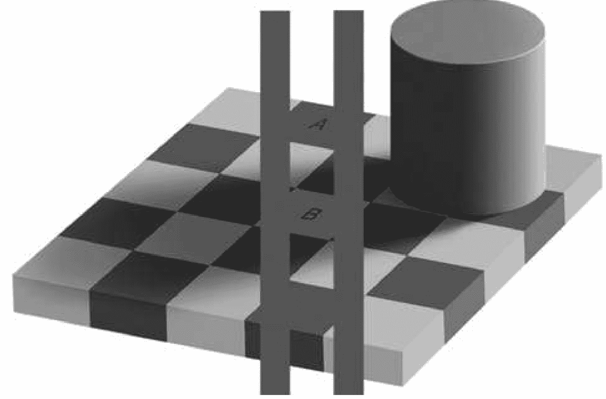

# 投资者的敌人

2013年诺贝尔经济学奖得主、耶鲁大学经济学教授罗伯特·席勒作序推荐

## The Investors' Enemy

# 投资者的敌人

# 朱宁◎著

王亚伟、王江、王巍、布拉德·巴伯、陈志武、张磊、张维迎、罗伯特·席勒、胡祖六、
哈里森·宏、特伦斯·奥丁、高西庆、威廉·戈茨曼、阎庆民、黄海洲、屠光绍、梁信军

联袂推荐!

中信出版社·CHINACITICPRESS

扫码加入 知识星球TOP 免费资源群

+   ✓ 每日免费获取有价值资源
✓ 可提供各类资源搜索服务

+   ◆ 热门付费文章
◆ 各行各业报告
◆ 精选图书资源
◆ 副业赚钱方法
◆ 职场实用资源
◆ AI政经自媒体

公号：知识星球TOP
微信号：jntsg8
微信号：jntsg2

分享资料仅供个人学习，请及时删除，切勿商用传播

# 嘉评

The Investors' Enemy

投资者的“敌人”往往不容易发现，甚至被忽视，使得许多投资者深受其困，饱遭其扰。投资者的“敌人”既需要投资者自己识别，也需要朋友们帮忙辨认，朱宁教授就是这样一位投资者的朋友。他的新著《投资者的敌人》通过深刻的分析和生动的描述告诉我们，投资者的敌人其实来自于投资者自身！因而，树立正确的投资理念，掌握科学的金融知识，运用合理的投资手段，真正做到了解自己、了解金融、了解风险，投资者就能打败敌人。

因此，作为投资者的朋友，我愿意向投资者推荐这本书。同时，作为上海交大高级金融学院的理事长，也为我们学院有朱宁教授这样一位投资者的睿智朋友感到欣慰！

上海交通大学上海高级金融学院理事长 屠光绍

朱宁教授的《投资者的敌人》一书通俗易读，通过大量发生在国内国外金融市场的典型实例、生动故事，及有说服力的数据，解释了许多令人困惑的金融现象，揭示了金融学的一般原理，并提出了许多专业投资者和散户投资者在实践中都应该予以认真考虑的建议。

春华资本集团创始人、董事长，

高盛银行前大中华区主席 胡祖六

朱宁教授是席勒教授的高足和行为金融学研究的先行者。本书功力深厚、理论前沿、内容丰富、案例多彩、笔调流畅，将成为行为金融学研究者、广大投资者以及对行为金融学有兴趣者的挚爱。

## 中国国际金融有限公司首席策略师 黄海洲

一本好看而且实用的书！作者从人性的角度道出投资者思维的偏差，用行为金融学的分析方法让我们感受到市场情绪对投资者的误导，用实际的数据显示了令人大跌眼镜的结果，最后将我们引入不得不服的结论：投资者最大的敌人就是他自己。

## 中国投资有限责任公司总经理 高西庆

朱宁教授是一位具有良好教育背景、研究视角极宽的学者，在本书中他尝试以行为金融学为视角研究投资风险和失败，融会贯通了公司财务、投资学、管理学、政府监管和社会心理学等诸多领域。我们知道，在信息不对称的前提下追涨杀跌，是投资最大的忌讳，但现实中却几乎永远是市场的常态。多少投资者为此损失惨重，但前赴后继者仍大有人在。本书提到：“投资者面临的最大敌人是自身和对风险的有限了解”，并诠释了风险与不确定性的区别，可谓一语道破真谛。本书结构新颖、语言通炼、案例生动，将枯燥的投资理论娓娓道来，令人掩卷深思，值得一读。

## 中国银行业监督管理委员会副主席 阎庆民

本书文字简洁幽默、逻辑严密、知识系统、视野开阔、中西通达、结论简明，既吸收了各个时期的历史研究成就，又反映了当今投资界的最新理念，无论对初入门的投资者，还是对已经熟稔各类模型、理论的投资者，都有非常大的帮助。对我，阅读的过程就是系统梳理知识的过程。

我认真地读了两遍朱宁教授的书，尽管第一印象以为是给普通投资者的普及书，结果看了第一遍，几乎就摘录了上万字的笔记，体察到是作者用心写就的充满真知灼见、又浅显易懂的专业投资教材，于是欣然看了第二遍。

我以为好的学问者，就得自己真懂，还要能用最浅显的语言清晰传达出来，我窃以为作者做到了这一点。

# 序一

The Investors' Enemy

投资是一门科学，也是一种博弈。投资之所以像投入博弈，是因为要想做好投资，须具备这样一种能力，即掌控自己的冲动，洞察他人的冲动。一个人若对与投资相关的心理学没有深刻理解的话，是做不好投资的。

大多数人依靠本能和直觉进行投资，很少获得什么指点。这也是大部分人一生中接触事物时的常态，因为大家所受的教育都是泛泛的，并未系统地受过关于如何生活的指导。我记得当我的第一个孩子出生时，我太太和我带着我们的宝宝返回医院，想要寻求一些育婴方面的指导。这么说吧，假如把宝宝出生这件事同购买商品做一下比较，譬如你买了一台电视机，把它带回家时，厂家总会附带一张说明书或操作手册什么的吧！但是关于我们该如何搞定这个接下来将占据我们一生所有重要时光的、柔弱娇嫩的、奇迹般的小生命，医生告诉我们的却少得可怜。

做好投资与养育好一个孩子简直一样复杂，心理学极其重要。这是一项持续一生的重要活动，而且投资还有游戏和竞争的成分。不可能有像买电视机那样自带的一本关于投资的说明书，因为投资的游戏是如此的微妙；也不可能对必要之事用三言两语进行总结，因为人们对于投资的基本知识必须有既深又广的了解。

我认识朱宁已有多年，他是耶鲁大学的优秀毕业生。当他十年前在耶鲁读书时，我和他一起经历了行为金融学大发展的时期，朱宁作为一个研究者积极参与其中。从那时起，到在加州大学戴维斯分校和在上海高级金融学院工作，他在这个领域都是佼佼者。我相信他完全有资格为金融领域的这次革命著书立说。

行为金融学综合了金融学者和心理学者的研究成果，致力于帮助人们如何更好地投资。实际上，它包含一些极其实用、人人都必须知道的知识。而且，正如朱宁在书中所展示的那样，这一领域本身也很有趣。行为金融学对于包括经济行为在内的人类行为提供了一种深入的观察视角，向我们展示了人类天生会去欺骗，然而从天性而言，人类也会努力为社会创造伟大事物。

与其他国家的投资者一样，对中国的投资者来说，行为金融学与他们也有着紧密的联系，因为人类的天性世界皆同。事实上我认为，行为金融学对于新兴国家，例如中国来说，更为重要。正在中国发生的经济变革，无论是从其根源还是它对未来的期望而言，都是源自心理。这场至关重要的革命，始于1978年十一届三中全会确立改革开放政策之后，如果没有点燃心理的力量并驱动行为，它是无法实现的。这种精神最终反映在了金融市场上，而且创生的金融结构也支持着这种精神。最好的企业家精神能够驱动经济行为，需要被培育；但企业家精神也是柔弱的，如果没有正确理解它的心理基础，是很容易脱轨的。

朱宁的书涉及行为金融学中的广泛议题，是一部视野广阔的金融理论入门读物。读者能够以理解它们真正价值的视角获得各种金融指导；亦可了解人类历史上几次大规模的泡沫事件和股市崩盘，及人类心理在其中扮演了何种角色；还能了解商业生态及金融激励如何塑造了我们的行为；以及政府决策者该如何看待自己的行动，如何制定更合理的法律法规。但最重要的是，从这本书中，我们可以学习如何将经济世界的视野整合在一起，帮助我们更好地投资，让我们每个人都有更美好的未来。

诺贝尔经济学奖得主、耶鲁大学经济学教授 罗伯特·J·席勒

2013年7月

# 序二

The Investors' Enemy

现代金融市场是一个异常特殊的技术体系，它为全世界人民提供了一种储蓄未来财富的方式，一种对生活中不确定性进行对冲的手段，使人们能够投资于提供商品和服务的大小企业。尽管金融如此重要，然而对大多数人来说，它却依然难以理解。金融分析似乎是个很抽象的概念，而且好像与传统的思维方式相脱节。或许，金融思维是人类智慧的新维度。

金融要求我们把自己理解为既活在当下又活在未来的物种。然而金融计算和规划是一种定量的技能，它不是自然产生的。未来的不确定性很难通过简单的手段理解、量化和分析。在人类历史上，人类在做经济决策时都是依赖家族、群体的指引和影响，或是遵从某位领袖的意见。理性的经济决策本不应依赖于以上任何一种。然而，我们从文化上，从脑神经上，都是天生地用传统方式去做决策。

金融分析和传统思维之间的冲突和矛盾会导致我们犯错。这种失误不仅发生在个人投资者身上，企业高管甚至监管部门和政策制定者都不可避免。毕竟，你我皆凡人。朱宁教授此书便是对经济决策中这一基本矛盾的一次探索。我过去曾与朱教授在多次项目研究中愉快合作，他的研究（行为金融学，也即本书主旨）深度结合了金融学和人类心理学，成就不断，我非常钦佩。

在过去30年间，行为金融学像是一片沃野，向我们揭示了大量关于人类思维在做决策时，理性和天性上的矛盾，并切实给了人们有益的指导，本书主要讲述了个人和组织如何能够理解和克服天性（即那些欠佳的行为）的限制。

# 序三

The Investors' Enemy

中国改革开放以来，金融市场发展很快，金融体系规模迅速扩大，金融在经济和社会中的作用和影响显著上升。中国的企业、金融机构与政府通过参与金融市场获得信贷、股票或债券融资，改善资产负债平衡表，或进行风险管理。随着人均收入的上升和私人财富的积累，中国的普通百姓不再是仅通过银行存款、信用卡、按揭贷款等传统方式参与金融体系，也越来越多地把自己的储蓄投资于可交易的股票、债券、保险、基金、外汇、黄金、商品期货和流动性较低的房地产与私募股权等另类资产。鉴于此，利率、汇率、黄金价格的变化，尤其是股票市场的波动，自然牵动着成千上万普通投资者的心。财经媒体尤其是互联网24小时的高频报道，让大众对金融市场高度关注，掌握了大量的信息，增加了对于金融的理解。但同时因为金融市场的复杂性与多变性，普通投资者觉得金融神秘莫测，产生了不少认知与投资行为上的错误，甚至相信盛行一时的“阴谋论”。

朱宁教授《投资者的敌人》一书通俗易读，通过大量发生在国内国外金融市场的典型实例、生动故事及有说服力的数据，解释了许多令人困惑的金融现象，揭示了金融学的一般原理，并提出了许多专业投资者和散户投资者在实践中都应该予以认真考虑的建议。朱宁是我非常欣赏、钦佩的金融学者，他治学严谨，聪颖但踏实，且人品极佳。我有幸经常与他讨论金融问题，受益良多。他的新书面世，令我感到极大的欣喜。我热情地把此书推荐给对于金融有兴趣的朋友们。

朱宁在耶鲁念研究生时期就师从于罗伯特·席勒（2013年诺贝尔经济学奖获得者），此后一直把行为金融作为自己的一个主要研究领域。行为金融学是近年来经济学与金融学最为活跃的研究领域之一。传统金融理论的基本假定是效率市场、理性投资者和预期效用最大化。虽

## 第一章

不尽如人意的业绩

为了损失而投资？

2008年1月24日，法国第二大上市银行——法兴银行（Société Générale）发布公告称，该公司一名交易员的欺诈交易导致公司蒙受了49亿欧元（合71.6亿美元）的交易损失。消息一经发布，公众为之哗然，公司股价随之大跌，法兴银行所发行的债券也立即遭到了信用评级机构的降级。究竟是什么交易让这家历史悠久的著名金融机构在一夜之间遭受如此重大的损失？随着事态的发展，人们逐渐了解到事件的更多详情。“魔鬼交易员”杰罗米·科维尔（Jérôme Kerviel），一位在期货交易部门资历尚浅的交易员，在交易欧洲股票期货合约时，利用自己过去在后台的工作经验，伪造了天量交易以绕开公司内部风险管理部门的监控。直到其累积的交易总金额达到733亿美元（甚至远超过法兴银行当时526亿美元的总市值）并由于市场大幅下滑而造成了巨额的交易损失后，公司才对他的交易行为有所了解。

数十亿美元的交易损失，听起来触目惊心，但在国际投资界的历史里，这绝非个案。根据国际组织统计，过去20年内全球金融机构共发生过数十起损失超过1亿美元的交易。其中，摩根士丹利（Morgan Stanley）在2008年全球金融危机中最大的一笔信用违约掉期交易直接造成公司亏损86亿美元。2006年，美国知名对冲基金不凋花（Amaranth Advisor）在天然气衍生品市场上折戟，为交易失败承担了65亿美元的巨额损失。时间再往前倒推10年，1998年爆发的美国长期资本管理公司（Long Term Capital Management）危机，不但造成投资者高达58亿美元的损失，而且还差点摧毁全球金融系统。1996年，日本住友商社（Sumitomo Corporation）在交易铜期货时损失34亿美元。

中国企业在过程中也无法独善其身。2008年，中信泰富公司因为交易和澳元有关的复杂累积期权合约（Accumulator）而损失18亿美元，一度濒临破产，不得不寻求母公司中信集团的救助。2004年，中国航油新加坡公司也因为交易石油合约而损失5.5亿美元。

以上金融机构的巨额交易损失让散户投资者觉得触目惊心。但广大散户投资者往往没有意识到，其实自己也在平日的投资和交易中，不知不觉地参与到了这些天量的交易损失之中。作者在与美国加州大学、北京大学和台湾政治大学的同事的合作研究中发现，台湾股票市场里散户投资者的投资表现，其实要比市场以及机构投资者的表现差得多。

根据对台湾股票市场5年完整交易记录的研究，看起来默默无闻的散户投资者在这5年中损失的金额一点不亚于以上提到的机构投资者。具体来说，台湾的散户投资者每年从投资交易里的损失约为3.8%。根据台湾股票市场规模、散户投资者所占的资金比例和散户投资者的投资业绩来计算，台湾散户投资者在5年里损失的具体金额约为9400亿新台币，约合340亿美元。这意味着，台湾散户投资者每年的交易损失在68亿美元左右。也就是说，台湾散户投资者平均每年在股票投资里面损失的金额，几乎与机构投资者在投资历史中规模最大的几场损失所丢掉的金额不相上下。而和机构投资者投资收益的大幅波动有所不同的是，散户投资者的巨额交易损失是在长达5年的时间里持续出现的亏损的平均水平，仅在1997~1998年亚洲金融危机时表现得格外强烈。

对于金融机构来讲，损失数十亿美元是一次性的大规模损失。但是对于整个散户投资者群体而言，他们是在持续地承受同样金额的损失。如果把台湾散户投资者的损失放到台湾整体经济规模中，我们可以直观地感受到散户每年承受的损失规模之大：该损失约为台湾地区每年GDP的2.2%，约为台湾地区每年在交通运输和媒体方面私人消费额的33%，约为台湾居民用于购买服装的消费额的85%，或是用于购买能源和燃料方面消费的170%。

从另一个角度来看，台湾散户投资者每年高达3.8%的损失是由什么导致的呢？研究者发现，散户投资损失中的27%可以被归因于选择错误的股票和进行错误的交易，32%来自券商对投资者收取的佣金，34%则是政府征收的各种与交易相关的税收和费用，余下7%是因为散户投资者不能够正确地选择投资时机。

除去交给政府的税费和券商经纪业务的佣金以外，散户投资者交易损失里的34%是由于交易的财富转移，即财富从投资损失方向投资获利方的转移所造成的。具体来讲，散户投资者的损失给机构投资者，即散户投资者的对手方，每年带来约1.5%的投资收益。也就是说，股票交易把财富从散户投资者的口袋里面转移到了那些和散户交易者扮演对手方的企业、机构和国际投资者的手里。从这个角度来说，散户投资者的交易和投资事实上就是在做慈善事业。散户投资者把自己兢兢业业通过本职工作赚的钱，慷慨地送到了收入和投资能力都比自己高出不少的专业机构投资者手中。

做一个简单但未必完全科学的类推，根据中国A股市场的规模和波动率，中国大陆A股市场的散户投资者损失的金额可能10倍于台湾的散户投资者。

## 散户的业绩

说到散户的投资业绩，其实很多散户对于自己的投资并没有很充分的了解。也许散户可以清楚地记得他最近买的一只股票是赚钱还是亏钱，但当被问到他整个投资组合的表现如何时，很多投资者就不是很清楚了。很多散户投资者甚至无法想起自己所持有的投资组合中还有哪些股票，那些股票又是以何种价格购入的。

正是因为散户投资者对于自己的业绩不甚了解，他们在进行投资的时候也会表现得比较激进、爱冒险，结果往往就是遭受很大的损失。这个结论不仅适用于台湾地区，包括作者在内，各国学者在全球各个市场、各种不同的资产类别里都有类似的研究发现。这些研究均表明，广大散户就平均投资收益而言是亏损的，或者至少说是跑输大市的。散户的损失中很大一部分是通过税收和佣金的方式交给了政府和金融机构，而另一部分则是轻易地转移给了对手方——高投资水平的金融机构。由于大多数散户投资者没有明确的投资策略，因此在投资过程中，非但没能给自己创造财富，反而不知不觉地给自己的财富带来了巨大的损失。

我们将从以下两个方面为上述论断提供佐证。第一种做法是，将所有散户投资者的投资组合整体看成更大的投资组合，想象成所有散户在一起进行的投资，就如同一家大基金公司。如果我们开办这样一家大基金公司，基金完全跟踪散户的投资策略：市场中的任何一个散户买入任何一只股票的同时，我们所开办的基金公司也同时买入同等数量的该股票；市场中的任何一个散户卖出任何一只股票的同时，我们所开办的基金公司也同时卖出同等数量的该股票。那么，统计数据表明，这种模拟散户投资决策而建立的假想基金，无论在美国1991~2000年的10年投资历史里，还是在国内最近8年的投资历史里，或是在北欧市场里，都是一副明显跑输大市的令人失望的表现。

第二种衡量散户投资者投资收益的方法是，比较散户投资者买入和卖出的股票的业绩。可以想象，如果投资者在卖出一只股票的同时买入另外一只股票，那么该投资者必定认为他卖出的这只股票今后的业绩会相对差一些，而他买入的这只股票今后业绩会更好一些。投资者之所以选择换仓，是由于投资者认为换仓可以给他带来更高的投资收益。但是，根据我们对中美两国资本市场的数据的长期研究发现，真实的投资结果和散户投资者的预期恰恰相反。在换仓之后的半年、一年以及两年的时间内，散户投资者买入的股票表现比卖出的股票表现更差。也就是说，投资者本以为买进股票或换仓之后可以获利，但事与愿违，他们非但没有获利，反而遭受了损失，或者至少比不换仓的情况收益更小。

行为金融学相关的研究表明，在很多国家的资本市场里，大概仅有5%~10%的散户投资者可以在相对较长的时间里有持续跑赢市场的优异表现，而绝大多数散户投资者的长期投资业绩并未能跑赢大市。其中，大概一半左右的散户业绩跟市场表现没有明显区分，另外有三分之一左右的散户其投资业绩则是长期跑输大市的。

以上所讨论的都是散户投资者在扣除交易成本（包括交易税费、佣金和交易冲击成本）前的投资总收益，散户投资者在扣除了交易成本之后的净投资收益则会更低。

很多投资者都认为只要自己投资越积极，对自己的投资过程掌控越充分，就越有可能获利。也就是说，很多散户投资者认为交易的频率越高，他们所获得的收益也会越高；交易的频率越低，他们所获得的收益也越低。但令研究者惊讶的是，如果将散户投资者的交易频率与他们的业绩联系起来时，就会发现交易频率和投资者收益其实存在较弱的负相关的关系。也就是说交易越频繁的散户投资者，他们的投资收益率其实越低。这种低收益一方面反映出投资者进行交易的时候，并没有掌握准确的信息，因此导致错误的交易和投资损失。另一方面，也反映出交易成本对于投资者收益的侵蚀。

本书的部分内容，就是想利用国内和国际的一些研究成果来证明，其实散户投资者在投资股票的过程中，业绩并不尽如人意。总体上讲，散户的投资水平低于市场平均水平，反映在他们的投资业绩上，就是散户的投资业绩明显低于市场平均水平。

说到这里，大家可能并不十分信服。因为很多时候，投资者会觉得自己前段时间投资的股票似乎是赚钱的。同时，也有一些股票投资者认为，如果只是被动地去购买基金的话，在市场下跌的情况下就没有任何可以操作的空间。与其坐视自己遭受损失，还不如去买股票，至少还能自己决定什么时候进行仓位的调整和选股的调整。这种想法虽然不错，但都是基于一个重要的假设，即散户自己做出的投资决定比专业人士更好。可是如果这个基本假设并不成立，那么很可能散户在交易的时候给自己带来的唯有损失。

此外，本书后面的章节还会讨论投资者的主观感受和真实的统计结果之间的差异。或者说，每个投资者的主观感觉和学者通过长时间大样本的数据统计分析得出的结果之间，所存在的巨大差异。为什么会有这种差异？作者认为这里面既有投资者心理方面的原因，也有散户对于投资不够了解的原因。

投资者在进行投资的时候，会有非常强烈的选择性记忆。首先，投资者往往会对自己的交易印象深刻。例如，投资者经常会在跟朋友交流的时候炫耀自己的投资业绩，谈论最近买了哪些优质的股票，或是展示这些股票为自己获利多少。与此同时，投资者往往会选择性地忘却那些不太成功的交易。如果自己的投资没有赚钱，投资者很可能不会卖掉这只股票，即很难主动地做出所谓“割肉”的举动，反而会长期持有亏损的股票，希望有一天能“咸鱼翻身”。结果，很多投资者都会把这种浮亏的投资一直保留在自己的投资组合里面。因为没有出现实际亏损，投资者就会觉得自己并没有亏钱。这种思考方式和投资方式很大程度上掩盖了投资者在投资过程中的损失，也往往让投资者对自己的投资业绩和投资能力有过高的估计。

其次，投资者在相互沟通的时候，都会存在选择性的偏差。散户投资者在听到朋友介绍他们的投资业绩和投资表现时，往往都是听说他们买了较好的股票，在这些股票上获利颇丰。但如果我们认真考量这些自夸的投资者的整个投资组合的业绩的话，就会发现他们的投资业绩可能并不怎么样，甚至有些人还有不小的亏损。但当他们和别人交流的时候，往往会选择性地描述一两次特别成功的投资业绩。如果市场上的众多散户都存在类似的选择性记忆和倾向，可以想象，投资者在市场上听到的就都是类似“投资很容易，赚钱很容易，只要买股票就可以赚钱”的说法，而事实是大部分的散户基本上都不可能通过股票交易获得超过大市的投资表现。

但是，正是由于这种选择性的信息提供，很多散户投资者会莫名地产生出对自己投资能力的自信。而这些投资者越是自信，就越倾向于进行频繁的交易。而相关的研究数据表明，越是交易频繁的投资者，他们的业绩也越差。

除此之外，散户还要意识到另外几点导致业绩变差的原因。第一点，散户投资者在考虑自己收益的时候，必须要认识到，自己在市场里面往往在充当提供流动性的角色。就是说在机构投资者准备卖股票的时候，是散户积极地接盘；而在机构投资者买股票的时候，也是散户积极地把股票卖给机构投资者。从一定程度上来说，散户在投资的时候，同时为机构投资者或者其他专业投资者提供了一种额外的流动性服务。因为散户投资者为机构投资者提供了这种流动性服务，所以本来就应当得到市场的补偿和鼓励。在此前提下，散户投资者的表现应该不仅仅能得到市场的平均收益，而且应该比其他投资者的收益更高。但是，这却和作者及其他研究者在全球资本市场发现的结果大相径庭，即散户投资者的业绩事实上明显跑输大市。

第二点，交易成本和机会成本高。由于散户的交易金额比较小，交易成本比较高，所以散户投资者真正获得的最终净收益可能会和纸面上看到的股票表现有很大差距。根据我们在美国的研究数据表明，在20世纪90年代，交易成本占到投资者总收益的0.7%~0.8%。中国A股市场的交易成本相对低一些，散户的总交易成本往往在0.2%~0.3%之间（包括佣金，税收和冲击成本）。但正是由于相对低廉的佣金，中国投资者的换手率要远远高于国际投资者。中国散户的换手率基本上为500%~900%不等，而美国散户的换手率仅为80%~100%。在不能提升投资业绩的前提下，较高的换手率也无形增加了散户投资者的投资成本，降低了投资者的费后或税后的净投资收益。

第三点，不少散户投资者在投资的时候只考虑收益，而不考虑风险；只考虑自己是否赚钱，却没有考虑自己为赚钱付出了多少成本或者承担了多少风险。同时，投资者往往会对投资的基本理念缺乏必要的了解。正是因为他们对于投资收益来源未能充分了解，因此不能区分自己在股市中的获利是因为自己的投资能力，还是市场的大趋势，抑或是碰巧运气不错。有时候投资者虽然赚钱了，但这只是因为一次偶然的机会。譬如，有些投资者把资金投在了一只风险较高和波动性较强的股票上，随着股票大市的上涨，他所购买的股票因此也赚了钱。但正是因为对投资业绩的来源不是非常清楚，散户投资者会错误地以为自己挑到了好股票，所以不愿意卖掉这只赚钱的股票。不幸的是，随着之后市场的调整，他所买的股票往往会出现大幅度的下跌，把之前的收益又都送还给了市场。

投资者在考虑自己投资业绩的时候，往往用是否赚钱来作为衡量的标准，而忽略了单只股票的涨跌很大程度上也受到大市表现的影响这一事实。虽然有时候他们在赚钱，但同时可能也冒了很大的风险。他们赚钱的时候可能是因为股票大市处于上涨阶段，有时候他们所赚的钱还不如直接投资股票大市。投资者往往认为只要是赚钱了，就代表自己有很强的投资能力。但是他们没有想到的是，如果他们选择简单地买入指数型基金或者股指期货，可能会获得更高的收益。

这即是散户对于投资收益的来源没有准确理解的表现，事实上，散户偶尔的盈利往往只是因为大市的波动。而投资者真正需要做到的是在考评自己投资业绩的时候，更多地想到自己的收益是不是足以超过大市表现，是不是足以值得让自己花时间进行这个选择，是不是足以涵盖自己的交易成本和时间成本。如果答案是否定的，散户应该更多地投资在股票指数或者基金上，从而获得更平稳也更持续的投资收益。但是，如果投资者对投资、风险、业绩和自身的能力都不能够有清晰的认识的话，合理投资、提升业绩又从何谈起呢？

## 基金投资的损失

除了本书之前谈到的机构投资者的巨额亏损和散户不知不觉造成的巨额亏损之外，即使是很有名的机构投资者或者投资大师，也在投资过程中犯过很大的错误。在1998年长期资本管理公司的危机中，虽然公司的管理团队里包括了两名诺贝尔经济学奖得主和多名名校教授，但仍然在1998年东南亚金融危机到来后短短一个月的时间里，亏损了58亿美元，几乎把全球金融体系拖垮。

此外，投资界大鳄索罗斯也在1987年的全球股灾时，因为投资全球股指期货而“一举”损失了15亿美元，进而导致这位全球“金融狙击手”的财富和声誉在很长一段时间里都受到严重的打击。最近的例子，是在2008年全球金融危机时，因大量做空和房地产相关的CDO（担保债务凭证）和CDS（信用违约掉期）产品，而获益颇丰的美国对冲基金管理者保尔森。他在2008年一举为自己所管理的基金赚取了超过200亿美元的收益，同时也为自己获得了70亿美元左右的收入，成为对冲基金历史上年收入最高的基金经理。但是，随着2013年黄金价格大跌，他所管理的基金在2013年4月的短短一个月里，就迅速亏损了10亿美元。

除了积极管理的对冲基金和私募股权基金之外，我们也看到，以美国加州公务员退休养老基金（CalPERS）为代表的美国很多公务员养老金体系，为了能够获得更高的收益，在2008年金融危机之前将部分投资组合投入到风险较高的权益类产品，以及私募股权和对冲基金等另类投资产品中。在金融危机时，此类风险极高的投资导致那些本该追求平稳安全投资的养老基金承受了巨额的损失，同时给这些养老金的长期保金支付能力造成了极大的负面冲击。

## 企业收购的损失

除了投资机构的投资损失之外，全球的各种企业其实也在通过不断地收购、兼并、重组而进行大量的投资活动。在这一系列投资活动中，很多企业也曾犯过非常多的错误并造成过巨大的损失。

十多年前的互联网泡沫时期就曾经发生过多起重大的收购兼并失败案例。2000年发生在美国在线（AOL）和美国时代华纳公司（Time Warner）之间的合并案例，曾经造成了美国历史上规模最大的公司合并损失。新兴的、提供有线上网服务的美国在线和时代华纳合并之后，不但没有帮助时代华纳公司更好地进入到互联网时代，反而因为大量的资金浪费、人员流失和整个合并过程中存在的困难，阻碍了两家公司的顺利发展。以至于华纳公司不得不在十年之后，被迫剥离了合并时收购的美国在线的业务。

另外一起发生在互联网泡沫时期的失败收购案例，即美国雅虎公司收购美国互联网公司“Broadcast.com”的案例。Broadcast公司的创始人是马克·库班（Mark Cuban），现在也是达拉斯小牛队的拥有者。互联网泡沫时期，雅虎公司运用自己的股票进行换股，收购了Broadcast公司。当时整个交易估值大概在50亿美元左右，但该交易的价值事后被外界估计只值一两亿美元。在收购完成之后，成功地把Broadcast卖出好价钱的马克·库班因为认识到雅虎公司的股票被高估，所以便马上抛售自己获得的所有雅虎公司的股票以锁定收益。但很多其他跟随库班创业的Broadcast公司员工因为受互联网泡沫的影响太大，迟迟不肯抛售雅虎的股票，最后白白放走了大笔原本可能获得的收益。

还有一起非常有名的互联网泡沫时期的经典收购失败案例，就是美国泰瑞（Terra）网络公司收购美国莱克斯（Lycos）公司一案。莱克斯公司是一家在互联网泡沫时期创建的搜索引擎公司。泰瑞网络公司在2000年以125亿美元的价格收购了莱克斯公司。但4年之后，泰瑞公司将莱克斯公司卖掉时，却只卖了9500万美元。从125亿美元跌到不到当时收购价值的1%，这是公司收购历史上又一则巨额损失事件。

最近一则比较有名的案例是美国的惠普公司支付了88亿美元收购了英国的一家数据分析公司Autonomy。惠普在收购时认为这家公司进行了很多很有价值的数据分析业务，可以帮助惠普的工作进一步多元化，并进一步提升惠普服务业的发展。但遗憾的是，在收购之后，惠普发现Autonomy公司的很多盈利都是虚构的，存在很多财务上的造假，甚至很多业务根本不存在。在整个交易完成之后的一年里，惠普公司不得不注销88亿美元的资金，这里面有50亿美元的损失都是因为Autonomy公司会计上的一些违规行为所导致的。此外，还有一项很重要的损失来源，即惠普在收购过程中对Autonomy支付了过高的商誉。由于没有具体业务的支持，Autonomy的商誉其实也没有惠普最初想的那么有价值。从这个角度来讲，惠普公司进行了一次极其失败的收购活动。由此看出，在兼并的过程中，无论是公司的高管还是参与收购兼并的投资银行和会计师事务所，都没能尽到应有的调查责任。结果自然是在收购兼并的失败史中增加了又一个让人难以置信的案例。

无独有偶，历史上还有不少巨型IT公司的“愚蠢”收购案例。1991年，美国当时最大的电信公司——全国电话电报公司（AT&T），为能够进入计算机领域，花费70亿美元收购了美国NCR公司，后来这个收购以失败告终。在几年之后，AT&T以40亿美元的价格卖出了它当初收购的这部分资产。几年的时间里，AT&T的股东就损失了30亿美元。此外，鼎鼎大名的美国微软公司，在互联网泡沫时也犯过类似的错误。该公司在互联网泡沫时期，花了60亿美元买了aQuantive公司。结果，该公司的技术很快就被证明无法有效地帮助微软工作。收购之后两年，微软公司就决定把整个aQuantive业务放弃，白白损失了60亿美元。

从以上案例中可以看出，政府、投资机构和企业的这些专业投资部门在进行投资的时候，也会因为各种各样的原因，犯各种各样的错误。这些错误导致了他们在投资过程中出现巨额的损失。作者希望利用本书，通过这些案例，来提醒投资者：虽然散户投资者在投资过程中蒙受了重大的损失，但投资损失其实并不只是散户所独有的，即使是高水平的机构投资者或者是企业，也会在投资过程中面临巨大的投资损失。所以，风险和投资是相生相伴的，投资者在考虑投资的时候必须要认识到风险。

## 阴谋论和战争论

以上提到的众多投资者的投资表现都如此不尽如人意，究竟是什么原因造成的呢？对于这个问题，社会舆论和学术界有着非常不同的看法。在国内，最近一段时间比较流行一种说法，即战争论和阴谋论。二者的论点基本上是一样的，即认为无论是国际投资者也好，海外政府也好，对于中国的政府、企业以及中国的投资者，都采取极端敌视的态度。这些国外的阴谋家从投资最开始，就试图和中国的投资者作对。他们以中国政府、企业和投资者为假想敌，希望通过设计各种各样的创新产品，通过操纵全球金融体系，利用销售某些金融工具的方式，来获取巨额利润。

式，来达到遏制中国经济发展、阻碍中国企业国际化、摧毁中国人民财富的损人利己的、见不得人的目的。

但只要稍微仔细想想，就会发现这种阴谋论和战争论的说法未必站得住脚。如果从更长的历史发展趋势来看，就会发现，各个国家、各国的不同企业，以及各种不同性质的投资者都曾经在历史上的投资过程中，遭受过巨大的投资损失。无论是散户、企业，还是政府都犯过错误，蒙受过损失，这不是中国所独有的现象，也不是针对中国一个国家的资本市场出现的挑战。中国过去10年是一个经济高速发展、财富高度积累的时期。在这一时期中，中国投资者的投资需求越来越旺盛，投资活动也越来越频繁，这也导致我们对于国内的投资者、企业和政府在投资过程中所承受的损失特别关注。这无疑会引发一些人采取民族主义的看法来对待这个问题。

但是，如果综观更长的一段人类金融史和更广阔的国际金融体系和资本市场，就会发现，其实在中国之外有很多国家的政府、企业、国际金融机构和散户，也都曾经反复出现过在短期和长期之内承受巨大损失的现象。只在短短的数年之前，美国众多的投资银行、商业银行、保险公司等金融机构在2007~2008年的全球金融危机里，几乎遭遇灭顶之灾。有些公司的高管被赶下台，有些公司被其他公司收购，有些公司被政府国有化，更有些公司不得不申请破产保护。由此看来，在货币战争和金融阴谋里一败涂地的竟然好像正是战争和阴谋的发起者。这似乎和战争论、阴谋论的论据大相径庭。所以，至少可以说，如果真的有阴谋和战争企图的话，并不一定是少数国家的少数投资者才有，而阴谋和战争的矛头，也并不只是指向中国的政府、企业和投资者。

2012年，随着美国苹果公司的股价从每股400美元上涨到每股700美元，之后又跌回每股400美元，这个过程中有很多美国的机构投资者、养老金、对冲基金和散户都承受了巨大的损失。让我们再来关注一下黄金的价格，金价从每盎司300美元一路高歌猛涨到每盎司1900美元，但是随后又跌回到每盎司1300美元。在这个过程中，作为全球最大的黄金储备国，美国的黄金储备价值也经历了大幅度的波动、贬值和缩水。

从这个角度来讲，我们必须要看到中国企业在海外并购和在海外购买金融工具过程中所承担的损失，中国的外汇管理机构、主权财富基金和金融机构在进行海外投资过程中所承担的损失，并未超出投资这种经济活动的正常损失界限，也不能笼统地将中国企业、机构和个人的投资损失，简单地归咎于敌对势力和阴谋家的不良居心。

在进行国际比较之后，我们并不认为中国投资者所面临的投资损失和投资错误，是一种特别的阴谋或者战争的后果。那么，我们应该怎么正确地理解全球金融体系里的风险和全球金融体系变化对我们中国投资者所提出的挑战？掌握关于经济、金融、投资的基本事实和知识，其实是投资者最需要做的事情。事实到底是什么样的？投资的收益可能会有多大？投资的风险又有哪些方面？这些都是一个投资者必须要想到，也必须能回答的最基本的问题。投资者，特别是中国投资者，该如何面对损失，自己对于投资损失应当承担什么样的责任，如何进行必需的学习和锻炼，都是投资者必须经历的一个漫长甚至痛苦的成长历程。我们看到中国企业和投资者在投资过程中承受了巨大损失，都很痛心。但是，我们同时也希望，投资者在经历过损失的痛苦之后，会对投资过程中与生俱来的风险有更清晰的认识，也能更准确地把握和管理，以保证今后投资过程中不会再犯类似的错误。如何看待风险，如何规避风险，如何提升自己驾驭和掌控风险的能力，这是我们每个投资者必须学习的课程。

战争论或者说阴谋论带来一个很大的问题，就是造成了投资者的敌对心态。对投资敌对，对金融敌对，对其他投资者敌对，对国际资本市场和国际金融体系敌对。由于形成了事先敌对的心态，中国企业在和海外企业沟通过程中，中国投资者在和海外投资者沟通过程中，中国政府在和海外政府沟通过程中，都可能会采取某些先入为主、不开放的孤立态度。这一点会影响中国投资者、中国企业与国际投资者、国际投资界、国际政府之间的交流。

## 行为金融与投资者的敌人

投资者为什么会蒙受损失，归根结底是因为市场的波动。但正如凯恩斯所说，关于股票市场，我们唯一有绝对把握的就是它会波动。股市不但波动，而且波动的幅度远远大于基本面的波动所能解释的幅度。根据2013年诺贝尔经济学奖得主、耶鲁大学席勒（Shiller）教授的研究，美国股市价格相对于基本面而言，波动率巨大。在1970年美国经济出现滞胀、股市大幅下跌之前，整个股市的估值和它基本面的估值相比，几乎高出100%。而在1929年股市崩盘和20世纪30年代美国大萧条的时候，美国股市的估值比基本面的估值要低30%左右。资产价格的大幅度波动，本身就在一定程度上解释了为什么美国股市在1970年会出现大熊市，也解释了为什么在2009年9~10月美国股市会在短短几个月里下跌了50%。

但是再看看我们的日常生活，大家都觉得整个社会还是吃这么多食物，住这么多房子，买这么多汽车，所以很难理解为什么股市会出现这么大的波动。究其原因，很大程度上跟全球经济的泡沫扩张和经济危机有紧密联系。经济泡沫或者资本市场泡沫是自资本市场出现之后一个与生俱来的、普遍存在的现象。那么经济泡沫为什么会形成？经济学家到现在也没有一个完全准确的解释。正是因为经济学家对于经济的周期和泡沫没有完全准确的解释，才导致经济泡沫和危机的频率在过去二三十年里不是越来越低，而是越来越高。从20世纪80年代开始，1987年出现了全球范围内的股灾，1990年出现了美国存贷协会（Savings and Loans）的危机，也就是小型的房地产危机，1997~1998年出现了拉美和亚洲金融危机，之后出现了1998~2000年的互联网泡沫危机，然后是2008年的美国房地产引发的全球经济危机和2009年开始到现在还未终结的欧洲主权债务危机。全球经济现在是每过四五五年就有一次危机。为什么我们会有这么多的泡沫？恰恰是因为投资者的贪婪和恐惧，换句话说，投资者的动物精神（Animal Spirit）制造了一个又一个泡沫。

正是由于传统经济学对于个人、厂商和投资者的完全理性的假设，和建立在这种假设之上的新古典经济理论对于这些经济和金融市场中的重大问题难以提供很好的解释，催生了行为经济学和行为金融学在过去二三十年的爆炸式发展。

自20世纪70年代以来，丹尼尔·卡尼曼（Daniel Kahneman）、阿莫斯·特沃斯基（Amos Tversky）、弗农·史密斯（Vernon Smith）、理查德·塞勒（Richard Thaler）、罗伯特·席勒（Robert Shiller）等几位学者开始在各自的领域里对决策者的理性行为假设提出了质疑。这种质疑，直接反映了其他社会科学领域对于经济学和金融学进一步发展的巨大贡献，及经济学和金融学进一步借鉴其他学科的研究进展的强烈要求。行为经济学和行为金融学的成功，很大程度上得益于经济金融理论和心理学的紧密结合。

心理学研究给行为经济学和行为金融学的一个重要启发就是经济人在决策制定过程中会表现出一些系统性的偏差。这些偏差会影响经济系统中的所有参与者，也会影响资本市场里的所有投资者。从宏观层面上讲，市场参与者的非理性有可能带来经济的周期和危机；从微观层面上讲，投资者和金融机构的非理性，有可能带来投资领域的泡沫和崩盘。人类行为，这一亚当·斯密非常看重的经济学核心问题，通过行为经济学和行为金融学的发展，重新又回到了经济和金融研究的主要视域。

在行为经济学发展了一段时间之后，现代金融学也开始对资本市场中决策者在决策过程中的非完全理性行为给予关注，从而促成了行为金融学领域在过去20年爆炸式的发展。通过资本市场提供的丰富数据和案例，行为金融学在过去一段时间对于经济学、社会学、心理学和法理学，也做出了重大的贡献。

行为金融研究表明，散户投资者、机构投资者、上市公司、私营企业、政府机关和监管机构，都受到不同行为偏差的影响，也在金融和投资决策中暴露出不同的局限性和错误。因此，如何对待个人和机构的行为偏差，以便纠正自己的错误，改善自己的金融决策，提升自己的决策质量和投资收益，就成为行为金融研究可以给广大投资者、企业管理者、市场监管者和政府机构做出的一个重要的贡献。

作为一名行为金融专家，作者希望能够通过本书帮助各类投资者更好地认识和了解自己，更好地了解金融和投资。只有投资者更好地了解了自己，了解了自己行为和决策中的误区和局限性，了解了自己的投资业绩和自己投资过程中所面临的不同风险和挑战，才可能有效地改善自己的投资决策和提升自己的投资业绩。投资界有句老话说，投资者最大的敌人是贪婪和恐惧。作者觉得，这可能恰恰反映了投资者的心理，和投资者对自己、对投资了解的缺失。因此，作者希望利用《投资者的敌人》一书，和读者分享行为金融学在全球取得的研究成果，并把这些全球成果和中国的情况相结合，提出一些建议，以帮助中国投资者更好地认识自己的投资理念，调整自己的投资策略，从而获得更好的投资收益。

## 第二章 不安分的散户 交易侵蚀业绩

散户投资者的表现为什么不尽如人意呢？后面几章，我们会逐步讨论散户投资不利的原因。但让很多散户意想不到的是，正是自己造成了投资损失。

然而，投资者，尤其是散户投资者，要想获得完整、准确的信息是非常难的。下面给大家讲一些在国内外资本市场的实证性研究，来了解投资者是如何做出错误决定的。我和加州大学的两个同事做过一系列有代表性的研究，与国内的合作者也重复了同样的实验，获得了相同的结果。我们的游戏非常简单，但是直到这些结果出来之前，大家对于投资者，特别是散户投资者有什么样的投资能力和投资者交易频率是否合理两个问题仍存在很大的争论。现在看来，我们的研究成果已经让这两个问题的答案非常清晰了。

作者的一位合作者特伦斯·奥迪恩（Terrance Odean）教授是个传奇人物。他42岁大学毕业，46岁博士毕业。他说当时他去哈佛大学面试，讲自己的研究时（在美国，博士生毕业时都要面对很多教授来宣讲自己的研究成果），哈佛的教授们本以为是一个毛头小伙子，而进来的却是一个满脸都是褶子的小老头。这个人很有意思，他从事过很多行业，在纽约开过两年出租车，在德国学了多年德语，在旧金山交易所穿红马甲工作了多年，然后突然想继续学习，于是又开始攻读博士。他在读博士之前，因为穿了很多年红马甲，就想了解散户到底赚不赚钱这样一个非常简单的问题。很多在美国读博的人都是带着一个很明确的研究问题去攻读博士学位的。为了回答这个问题，他选择了加州大学伯克利分校，因为加州大学伯克利分校里有一批行为经济学方面的顶级专家。

他1996年博士毕业，那时他46岁。从1996年到2007年的这11年里面，他取得了一个教授在其职业生涯里面能够获得的所有成就，从助理教授荣升终身教授，之后升为讲座教授，最终他成为全美金融协会副主席，及一本著名金融杂志的主编。从他身上我们可以看到中美教育在理念及对人的影响，包括对人最终的追求和人的满足感等诸多方面，确实存在非常多的差异。

那么他是怎么研究投资者行为的呢？首先他要获得投资者行为的数据，那直接去交易所获取不就行了。从中国人的角度，我们都觉得这个问题很简单，简直不足挂齿。但是，在美国这样一个对个人隐私高度保护的国家里，想获得个人投资者的数据是非常困难的。作者这位同事的成功之处就在于，他经过多年的努力，从两个不同的券商那里拿到了跨度十年，大约十几万投资者的交易数据。这是整个金融研究历史上从来没有人拿到过的资料。而他是怎么拿到这个数据的呢？当然，他有一些个人魅力和自己的朋友圈子，但是他跟作者讲，关键在于持之以恒。曾经有一部很感人的电影叫作《肖申克的救赎》，一个年轻人因为冤狱被关在牢里，他总是写信给图书馆要书，每年要，等快要出狱的时候，他终于收到了好多书。作者这个同事也是这样，他每一两个月就会给美国最大的几家券商写一封信，说我想做关于个人投资者行为的研究，我希望贵公司能够提供这样的数据。突然有一天，他的愿望实现了。他拿到了这个数据。这也是经济领域第一次取得的大样本的投资者行为数据，为他日后的行为金融研究奠定了基础。

在对真实的投资者交易数据进行分析之后，研究者发现，无论在国际资本市场或是国内A股市场都有一个普遍的现象，就是散户的交易非常频繁。这里作者想特别强调的一点是，与国际平均水平相比，中国散户投资者的交易显得尤其频繁。根据研究，美国的散户在20年前，每年投资的换手率是80%~100%；目前国内散户投资者在基金投资时的换手率也高达70%~80%。也就是说，当下国内投资者交易基金的频率赶上了美国投资者在20年前投资股票的交易频率。事实上，美国散户投资者的交易频率在过去20年里持续大幅度下降。同时，国内散户的股票投资换手率达到每年500%~600%。在2007年大牛市的时候，甚至达到了每年800%~900%。国内的机构投资者，主要是我们通常所说的公募基金，其平均换手率也达到每年400%~500%左右，也就是说，基本上每个季度该基金所持有的所有股票都进行了一次完整的换仓。

散户的换手率如此之高，背后的原因是其不太多元化的投资组合。在20世纪90年代初，每个美国散户投资组合里平均持有4只不同的股票。在2010年左右，中国的散户投资者平均持有3只不同的股票。如果将所有散户投资者按照持股个数进行分类，那么占比最高的散户群是持有两只股票的。而接近30%的散户投资者平均在任一时间点只持有一只股票。这一两只股票的反复交易，一定程度上造成了散户的高换手率。

包括作者在内的很多研究者发现，散户交易频率和投资业绩之间有一个负向相关的关系。也就是说，交易越频繁的投资者，投资业绩越差。主要表现有以下两方面：

第一，这些交易频繁的投资者，在扣除交易成本之前，其业绩和其他投资者相比，并无任何优势。

我们利用美国券商的数据，把所有投资者按照交易换手率的高低分成五类：从低到高排序。我们发现高换手率的投资者平均收益要低于低换手率投资者的收益。但是这个差异相对比较小，统计上也不是特别显著。这一发现表明，交易越频繁的投资者，未必越有信息优势，进而获得更好的收益。

美国曾做过一项很有趣的研究。在美国曾经有一个规模很大的通信公司，叫作MCI，公司的股票代码是MCIC。与此同时，美国资本市场里有一只债券型基金（Massmutual Corporate Investors Fund，MCIF），它的股票代码是MCI。研究者发现，每当MCI通信公司有好消息的时候，基金MCIF就涨价，每当MCI公司有坏消息的时候，MCIF就下跌。而MCIF这只基金的投资者主要都是散户，而且债券型基金的涨跌本不应该和MCI公司的消息有任何联系，因此研究者的结论是，有很多散户在购买MCIF（股票代码MCI）的时候，错误地以为自己购买的是MCI公司的股票。如此爱屋及乌、错摆乌龙，原因是散户对交易缺乏相应的知识和了解。这也是散户在交易时完全忽略重要的基本面信息的一个有力例证。

在国内，这个现象更加明显，结果也特别鲜明。交易越频繁的投资者，他们在扣除交易费用之前的收益水平就相对越低，投资业绩也越差。因此，无论用投资的换手率作为标准，还是用平均的持股时间作为标准，我们都能发现一个非常明显的趋势：换手率非常高或者持有时间非常短的投资者，他们的业绩是比较差的。平均持股时间在三个月以下的投资者，他们的业绩是明显差于市场平均水平的。但是，在持股的平均时间在1~2年的投资者中间，我们确实也发现了一些例外，其中一些投资者有不错的业绩。这一定程度上是因为在2007年，有很多投资者开户，那些在2007年入市而又能及时获利出局的投资者，他们的业绩则相对不错。另一种解释是，持股时间相对较短的投资者，因为比较自信，觉得自己是了解了某些信息之后才去投资的，但结果买了股票之后，表现不尽如人意，于是他们就很快斩仓出局。

但整体从投资者的换手率和交易频率来讲，我们都看到交易越频繁，对于投资者的业绩越有负面影响，这就是我们说的如果投资者相对安分一点、淡定一点，就可能会取得更好的业绩。

有趣的是，持有时间也并非越长越好。那些平均持有时间超过两年的投资者，其收益也非常低。这个结论对于行为金融学家来说也不算意外。因为行为金融学的研究表明，只有10%的投资者能够通过长期持有获得比较好的收益，其他的无论是持有时间非常长或是非常短的投资者，业绩都比较差。持有时间相对较长的投资者，往往是受到我们后面要提到的“处置效应”或称“鸵鸟效应”的影响，即很多投资者不愿关注和面对自己的亏损，不愿卖出亏损的股票，于是这些股票在他们的投资组合里逐渐沉淀下来，最终他们往往会持有很多长期都不赚钱的股票。这就是我们观测到持股时间较长的投资者其业绩也相对较差的原因。

第二，交易较频繁的投资者的净收益（扣除交易费用之后）更是显著低于交易频率较低的投资者。

## 换仓的代价

投资者为什么会冲动呢？我们后面会讲到人有过度自信的倾向，这是全球各个领域普遍存在的一个现象，而且与比较谦虚、谨慎的东方人相比，西方人中过度自信的现象表现得更强烈。大家都对自己的能力有非常强的信心，而这个信心究竟是从何而来的呢？每个投资者都对自己的投资经历或者成长阅历有一定的把握，所以这些投资者会相对比较自信。这里作者想强调一点，投资者只要获得了在他们看来足够的信息，无论是来自经纪公司、顾问公司、委托公司，还是代客理财的公司，无论这些信息是否真的对投资有所帮助，他们都会变得对自己越来越有信心，也会越来越倾向于进行交易。

无论是散户投资者、机构投资者，还是券商，都应该了解驱使投资者进行交易的原因。当大家对这些原因有所了解之后，在进行股票交易之前，最好先想想，自己交易的理由是不是与上述原因吻合。

交易最重要的驱动力应该是信息，或者是信息上的优势。市场上股价的波动大体上是由信息推动的，公司有利好消息时，股价上涨；有利空消息时，股价下跌。作为投资者的我们每天会获得很多信息，这些信息是否对投资有帮助，或者我们是否比其他投资者更早更准确地掌握这些信息，直接影响到是否进行交易这一决定。

作者及同事在美国加州大学的研究团队所进行的另外一项关于投资者投资业绩的研究，在行为金融学领域有非常大的影响，也确立了投资者行为实证研究的学术地位。这个研究非常简单，但好的研究，往往都是非常简单的。这篇论文十分清晰地传递了非常有价值和有说服力的信息。当然，现在我们看起来非常简单的任务，在当时还是颇有难度的。大家很难想象在1995年，用486处理器的计算机处理一个300多兆的数据是一件多么痛苦的事。现在觉得再容易不过的问题，在当时可是需要把计算机的功能发挥到极致才能完成。

上文提到过，作者的同事问了一个非常简单的问题，投资者特别是散户到底赚不赚钱？或者说投资者在交易之前是否掌握了准确的有助于投资的信息？回答这个问题需要回到经济学的一个基本假设和一个基本原理。这个基本假设就是，经济学假设人是逐利的，是追求利润最大化的，所以投资者进行股票交易时的初衷就是为了要赚钱。在这个假设的基础上，我们引入一个经济学原理：非满足性原理。其含义是，对于好的东西（好比金钱），人类的欲望是无穷的。所以当投资者持有一只股票的时候，总想找到表现更好的股票，以便赚取更多的钱。

一个投资者原本持有一只股票，由于各种各样的原因突然要换仓，将这只股票换成另外一只股票。那么他应该在什么时候选择换仓，换一只什么样的股票呢？试想，如果一个投资者决定把A股票换成B股票，前提是这个投资者确实有一定投资能力，那么我们会观察到什么现象？在换仓之后一段时间内，哪只股票表现会更好一些？我们预测答案应该是B股票。因为他选择的新股票应该比原来持有的股票更有吸引力。

这正是整篇论文的核心，我们想比较一下投资者在换仓后，新买入的股票和原来持有的股票在业绩上的差异。在投资者换仓之后的3个月、6个月，或是1年里，他们新买入的股票是不是能够跑赢他们原来持有的股票？如果投资者的信息准确，对市场投资时机把握准确，那么结果应该是肯定的。

然而，令人遗憾的是，无论是在3个月、6个月、1年，还是2年的时间区间中，我们都发现，新买入股票的表现明显地差于原来持有的股票。1年以后，前者的收益要比后者低3.5%。我们进而推测，很多散户在投资交易前，并没有特别明显的信息优势。

一位斯坦福大学的学者做过一项非常有趣的研究，试图更好地解释信息究竟在多大程度上影响投资者的交易行为。他另辟蹊径地研究了，18世纪时，在荷兰上市的英国公司的股票的交易行为。在18世纪，由于在英国和荷兰之间没有铁路、公路、电报、电话等通信手段，两地间的信息传递必须要通过定期班轮。因此，如果荷兰投资者想知道在荷兰上市的英国公司在其本土的业务信息，只能等待班轮把新的信件传递过来才行。这位学者就希望了解投资者的交易行为多大程度是受到了新信息的影响，有多少交易和股价波动是发生在这些班轮刚刚到岸的时候。与此相对，又有多少交易和股价波动是发生在新信息到来之前，并将这两者进行比较。

正如大家所想，这些股票的价格会在班轮到岸之后，因为新信息的获得而大幅度波动。因为这些在荷兰上市的英国公司的主营业务都是在英国，它的基本面信息都是从英国船老大那里获得。只有在班轮刚靠岸之后，才有关于这些公司的新消息，所以股价的波动在很多时候是集中在班轮刚刚到岸的时间里。

但是，研究同时发现，新信息的到达只能解释一部分市场交易和股价波动的原因。只有大概三分之一到一半的股价波动是集中在班轮到岸的一两天之内，剩下的大多是发生在没有实际信息到达的时候。研究还发现，有些交易行为完全是由投资者的预期和情绪波动导致的。比如，有的时候，由于天气、机械故障等原因，班轮会出现延误或者取消的情况。虽然没有新信息到达，但市场仍然会按照平时班轮的日程，在班轮预计到达的时候出现较大波动。由此看来，投资者不只是在当今高度信息化的时代才会受到大量无关信息的干扰，做出草率的决定，即使是在信息相对闭塞的过去，资本市场和投资者交易行为所反映的，也不完全是投资有用的信息。

## 交易的原因

交易的一个原因是流动性。比如子女要去美国留学，家长手里没有现金，就需要卖掉一些股票，这就是由于流动性的原因进行交易的例子，目的是为了取得金融资产和实际生活开支之间的平衡。人们持有金融资产是为了获得收益，同时需要一定的现金流保证日常生活和重大的消费活动，这是一个合理的原因。如果考虑到此原因，投资者买卖股票就不仅仅是一个投资行为，而是一个投资加消费的行为。因此即使少赚了钱或者亏了钱，都得心平气和，因为他有急着使用现金的需求。这也是建议投资者将自己的财产多元化的原因。一旦进行财产多元化，投资者就不会因为临时的流动性需求而不得不心痛地低价变卖自己的宝贵资产了。

第二个原因是税收。这在中国还不是一个很重要的考虑因素，但在很多其他国家，资本利得和投资红利都要交税，而投资资本损失则免税。假设一个家庭一年的应税收入是10万美元，但是由于在今年的投资中损失了1万美元，他们就可以把这1万美元的损失从10万美元的应税收入中扣除，只需缴纳9万美元应税收入所对应的税额。但前提是投资损失必须是在当年发生的。也就是说这个家庭必须在当年12月31日前，把亏损的股票卖掉。所以，有些投资者和家庭为了能在当年利用投资亏损来避税，往往在年底之前把浮亏的股票卖掉。这样就可以节约一部分应税收入所对应的税金。这就是合理避税对交易的影响。

第三个原因就是投资组合的再平衡。什么是再平衡呢？假如作者持有两只股票，成本价都是每股10元，一只涨到了每股100元，一只跌到了每股5元。最初作者认为两个公司一样好，后来发现A公司涨得太快，B公司跌得太快，如果作者对这两个公司前景的看法没有改变的话，现在就应该首先卖掉一些已经赚钱的股票，用其中一部分资金购买不怎么赚钱或者亏钱的股票。目的是为了平衡整个投资组合，回到跟自己信念相一致的方式。虽然市场变动了，股价变动了，但是因为投资者的信念没有变化，所以要调整他的投资组合。

第四个原因，改变风险敞口，这对很多发达国家有深远的意义。投资者在人生的不同阶段对于风险的偏好有很大差别。年轻人刚刚大学毕业的时候倾向买股票，因为和债券相比，股票的收益高，波动也大。在年轻的时候，投资在股票这种风险相对较高的资产上，你可以持有一种资产很久。无论股票是涨还是跌，从长期来讲，在今后二三十年的时间里，股票的回报率一定比债券要高。根据过去70~80年的历史，美国股市的平均年回报率是11%~12%，债券的平均年回报率是5.5%~6%。也就是说，在很长的一段时间里，股票市场是能够跑赢固定收益市场的。同样的规律，在全球其他国家，包括中国的A股市场也适用。所以年轻的时候要多投一些权益类的资产。

随着年龄的增加，你有了更多的压力和约束，会更关注自己和家庭的健康与安全，就会买保险，保险里面有很多是比较保守的固定收益产品。等到退休之后，我们就不在挣钱了，而是靠社保、养老金等收入为继。这个时候投资者应该把自己高风险资产的配置比例逐渐降低，并开始更多地投资于固定收益的产品，因为这些产品有非常好的安全性。同时，投资者退休后的花费也比之前降低，更希望投资收益能够维持整个生命周期。所以随着年龄的变化，投资者对于风险的偏好也是不断改变的。而这种改变则体现在交易投资方向的调整。

## 性别与投资业绩

还是利用美国散户和中国散户的数据，我们比较了男性和女性投资者的投资业绩。大家凭直觉推断，也会觉得男性比女性更自信，有更强的控制欲。心理学家通过实验也得到了同样的结论。那么这种差别会对男性和女性的投资业绩产生影响吗？利用投资者的个人信息，我们发现女性投资者交易的积极性确实低于男性，体现为女性投资者交易的换手率明显地低于男性。如果是比较单身女性和单身男性的话，两者之间的差异就更大（因为结婚以后太太或者先生都会受另一半的影响，会稍微中和一下）。

同针对整体投资者的研究结果相同，我们发现交易更频繁的男性投资者的表现明显不如女性投资者。接着，我们重复上面的分析，将每个人原来持有的股票和新买入的股票在一年之后的业绩进行比较，也得到了同样的结果。女性投资者换仓的频率低一些，因此在换仓后的损失也会相对小一些；男性投资者换仓的频率会高一些，因此在换仓后的损失也会相对大一些。由此可见，如果你只想碰碰运气，听到消息就去投资，那么你很可能会频繁地操作股票。但这种轻率的投资很可能导致失败。

## 网上交易与投资业绩

交易频率和业绩的差异，不仅反映在性别之间，也反映在不同的交易方式之间。20世纪90年代初，美国互联网革命改变了整个社会的通信方式，也改变了投资者的交易方式。互联网发明之前，大家都通过电话交易股票。随着互联网的推广，证券公司一想，为什么不鼓励投资者在互联网上进行交易呢？于是美国最大的经纪公司之一富达公司（Fidelity）就在《纽约时报》上刊登了下面这则有趣的广告：“交易就像西部片里的决斗一样，拔枪慢的人先死。”意思是劝说投资者：不要在电话上交易了，应该转到网上交易。那么这种投资方式的转变对投资者的绩效有什么影响呢？

我们在散户资料中找到了1000多位原来靠电话进行交易，后来转到互联网进行线上交易的投资者，这些人就是我们金融研究中的“小白鼠”。同时，我们又在数据库里给每一只“小白鼠”找到一个与其在组合、历史业绩和个人特征方面相似的投资者作为比较对象，区别在于该比较对象没有转换到网上交易。后一组投资者好比医学实验中服用安慰剂的对照组，我们以此来比较这两种投资者在交易频率和投资业绩上会有什么区别。

什么样的投资者会转到网上交易呢？我们发现业绩比较好的人倾向于去转换。因为他们是比较自信的人，他们会盲目地认为，我现在打电话都做成这种业绩了，有了互联网还不如虎添翼？这些投资者在转换成网上交易后，交易频率大幅增加，交易风格会比原来更加投机。但是投资业绩却大幅下滑。

我们从投资者决定转换交易方式这一天或者这个月算起，对比他们的投资换手率和收益率。结果发现，在转换发生之前的24个月，投资者的年换手率是60%左右，而对照组中投资者是50%左右。这些较为网上交易的投资者，肯定会觉得自己交易很频繁，所以电话交易方式下单会影响自己的业绩，因此一定要转换成为网上交易。在转换之后，他们的交易换手率几乎上涨了100%。这是因为投资者感觉到，原来打电话这么麻烦，没个三五分钟搞不定。现在能上网了，交易变得多么容易，所以换手率大幅上升。

但是换手率在经历了一个短暂的上升后，很快就下降了。为什么呢？看看下页图中他们的业绩就知道了。在转换交易方式之前的三年内，他们的业绩是远远好于大盘的，但在之后，他们的新投资策略使得投资组合的收益大大降低，几乎与市场平均收益没有区别了。原来投资能力不错的投资者，也会因为越发频繁的交易把原来审慎考虑的决定变成现在草率的决定，结果投资业绩就下来了。与此同时，投资者因为在转换后的交易频率更高了，他们所支付的交易费用也大幅上升，因此也带来了净收益的进一步下降——从明显跑赢大市，到明显跑输大市。

我们在国内对利用电话、互联网、热键进行下单的中国散户也进行过类似的研究，结果也是相似的：交易方式越便捷，投资者的投资效率反而越低。所以作者想跟大家讲，券商和基金公司提供很多服务方便交易，可能是出于提升自己业务的考虑。对于广大散户，便利的交易方式其实未必是一个福音。很多时候，便捷的选择往往也是危险的选择，甚至是错误的选择。

## 控制幻觉

下面的话题涉及心理学中的一个常用概念，叫作“控制幻觉”。讲到控制幻觉，心理学里有一个著名的实验。假设我们玩轮盘赌，扔一个球进去，落在红色还是黑色，单号还是双号，可以选择下注。如果可以选择的话，大家想一下，你是愿意让庄家帮你扔那个球呢，还是自己扔（该实验对抛硬币、掷骰子、抽纸牌也同样适用）？绝大多数人都愿意自己扔，对不对？其实大家都知道，在不出老千的情况下，无论是你扔还是庄家扔，对结果都没有影响，赚钱还是赔钱的可能性是不变的。但是几乎所有参加实验的人都希望自己扔那个球，这就是我们所说的控制幻觉。人们天真地以为，控制了赌博过程，就可以控制赌博的结果。

于是就有心理学家在赌场里做了以下这个实验。你可以选择自己扔球，但是你要付钱，你愿意出多少钱去购买这个自己扔球的权利？请大家自己思考一下。再假如你预期能赚100元，又愿意花多少钱来购买这个权利？

实验表明，大家的选择大概是15~20元，也就是预期盈利的15%~20%。这反映了人对于自己能够控制过程的权利的看重程度。在股票交易中其实也有类似的情况。国内许多投资者，当然其中可能有很多是离退休的职工，愿意整天坐在营业部里看着大盘，或是整天盯着互联网上的实时交易信息，俗称“盯盘”。有些投资者甚至因此得了腰椎病、颈椎病，牺牲了自己的健康。很多投资者自己也不知道在这个控制的过程中，到底获得了什么新信息。大家愿意去看、去了解，自认为控制了这个过程，投资表现就应该会好一些。在这点上，不只是散户，有些专业的交易员也是一样，因为有这种控制幻觉，交易员和投资者们就会特别喜欢“参与”到投资决策里面。但不幸的是，往往大家看得越多，越容易产生盲目的自信，适得其反。

专业围棋运动员中流传一种说法，叫作“长考之后出昏招”。电影《功夫熊猫》里也有一句台词，叫作“人往往是在想躲开自己宿命的路上撞上自己的宿命的”。这两句话传递了相同的意思。

有些时候，最方便的选择未必是最好的选择。我们能掌握决策的过程，却不能控制决策的结果。然而，对过程掌握得越多，反而越有可能让我们产生错误的成功幻觉。

跟大家分享一个有趣的现象：在美国，很多家庭是没有信用卡的。考虑到整个社会的金融发达程度，这成了一个经常被大家调侃甚至批评的现象。反观中国，现在很多年轻人只要一工作，就先去银行申请信用卡，每个月先把工资花光，再把信用卡刷爆，推迟一个月还款，这已经成了“月光族”的标准生活方式。

为什么美国的很多家庭都没有信用卡？因为信用卡消费太便捷。很多家庭都发现，使用信用卡消费，会让你买很多并不需要的东西。美国家庭为了控制消费，索性卡住消费的源头，不用信用卡。研究表明，与刷信用卡相比，写支票虽然也比较便捷，但却会让消费者在买东西时更慎重一些。

在美国拉斯维加斯的赌场里，过去，当赌客在老虎机上赢了钱时，硬币哗哗掉出的声音非常悦耳，使很多人都因此愿意去赌博。为了降低赌客的赌博心理，现在拉斯维加斯的赌场都用一张电子卡，赢的钱和输的钱都在这张卡里面了。这样一来，赌客从赢钱时硬币掉落的声音里获得的快感就减少了，赌博活动也明显减少了。由此看来，背景和环境对于人对消费和风险的厌恶程度有很大的影响。我们都知道，投资需要承担风险。投资者为什么会犯各种各样的错误，一定程度上就是因为受到做决定的环境影响，导致投资者草率地做出决定。

还有另外一个很有趣的现象，美国的公路和小机场很发达，所以如果你想要去的地方在200~400英里的距离内，那么你既可以乘飞机，也可以开汽车。大多数人都喜欢自己开汽车，其中一个原因是觉得坐飞机不如自己驾车安全。但是，美国交通部的数据表明，高速公路上的交通死亡率是乘坐飞机死亡率的8~9倍。大家可以想想上一次发生在美国的大型商用飞机坠毁事件是什么时候？（答案是2013年7月6日，韩国韩亚航空公司班机在旧金山机场降落中发生事故。）可是高速公路上的交通事故是天天都在发生的。但是很多人觉得自己开车时命运掌握在自己手里，所以更安全。其实，命运还会掌握在撞你的人手中，万一别的司机驾车撞了你怎么办？

投资也是一样，你首先要了解风险在哪里，如何控制风险。而对于散户而言，投资流程没什么好控制的。当今资本市场出现了越来越多基于高频算法和计算机模型的投资策略。很多基金在投资过程中甚至不需要人的参与。由此可见，“盯盘”和频繁操作不但不是投资获利的必要条件，甚至可能是降低收益、摧毁财富的便捷之路。

巴菲特就是这方面一个正面典型。他有明确的投资目标和投资理念，不受环境的影响，在大家都追逐互联网股票和复杂的CDO、CDS产品的时候，他没有随波逐流，而是投身公益慈善活动。等到泡沫破裂，大多数投资者被市场打败的时候，巴菲特才以救世主的身份参加到派对里，赚个钵满盆满。2009~2010年他低价收购高盛公司的股份只不过是他一贯“游手好闲”式的投资风格的反映。

刚才的这些例子都是给大家提醒，越是成功的投资者，越是自信，但你一旦变得自信的时候，投资决策就可能会变得草率。不负责任的交易会把你的业绩拉低。我们前面讲到的过度自信是投资行为偏差里最常见的一种。

## 处置效应

当然，散户也不总是过度交易的，他们也会主动规避交易。很明显的一个现象是，投资者会非常不愿意卖出浮亏的股票，导致把浮亏变成了真实的亏损。

举一个很简单的例子，国内股民把卖掉亏损股票的行为称作“割肉”。如果投资组合里的某只股票已经浮亏30%，投资者会非常不愿意卖出，好像只要没有卖它就没有损失，股价总有一天会涨回来的；而一旦卖掉之后，损失就永远收不回来了。由此可见，对投资者来讲赚钱固然很重要，而如何处理损失也是区分成熟投资者和菜鸟的非常重要的标准。

这在行为金融学中，被称为处置效应，它反映了投资者对于浮盈和浮亏股票不同的处置态度。这一点，只要大家看看自己的投资组合就会深有体会。散户的投资组合中，有超过三分之二的股票是亏钱的。这很大程度上是由于散户总是以原先的买入价当作参照系来评价一只股票赚钱与否。散户往往会等待股票解套时再卖掉股票。但在这个过程中他们给自己的思维无形地筑起了牢笼，把自己的投资决定和一只股票的表现绑定在了一起，而这是没有必要的。投资者往往因此忽略了时间成本和机会成本。对于浮亏的股票，你可能要等一两年，甚至三五年才有可能解套（对于那些在6000点买入股票的投资者来说，他们可能在非常长的一段时间里都不会解套）。在这个过程中，与其等着浮亏的股票解套后再卖掉，还不如强制自己“割肉”后再重新审视情况，做出新的更正确的投资决定，买更能赚钱的股票。

利用实证研究方法我们发现，假设投资者随机地卖出浮盈和浮亏的股票，在其卖掉的股票中，赚钱公司与赔钱公司股票的比例，大体应该是一样的。这就说明过去股票的表现、赚钱与否，并不影响投资者的决定。

举例而言，假设一个投资者的投资组合里面有市值100元的股票，你决定要卖掉其中25元的股票，保留剩余的75元股票。如果这市值100元的投资组合里有80元的股票是赚钱的，有20元的股票是赔钱的（赚钱股票的比例为80%），并且投资者在卖出股票时忽略股票过去的表现的话，我们会发现，投资者会选择卖掉5元赔钱的股票和20元赚钱的股票，也就是不论股票是赚钱还是赔钱，投资者都会卖掉1/4的头寸。但是在现实投资中，投资者有1/7的可能性卖掉赚钱公司的股票，只有1/10的可能性卖掉赔钱公司的股票，也就是卖出前者比后者的可能性要高出50%。

其实，股票市场是高度流动的，为什么投资者会如此不情愿将浮亏转变为真实的亏损呢？一定程度上，这是因为投资者在感情上对损失有强烈的规避。什么叫对损失的规避呢？人不是像我们传统经济学所假设的，只关心自己赚多少钱。其实，投资者对于收益和损失的反应是非常不同的：对于前者有非常正面的反应，对于后者则是非常负面的反应。同样金额在损失和收益这两方面给人带来的情绪上的影响也是完全不同的。心理学家通过核磁共振扫描人的大脑来研究投资者对损失的规避现象。他们发现，在遭受损失之后，投资者大脑皮层的兴奋区域和遭受损失之前的兴奋区域完全不同了。这就可以解释为什么很多投资者在遭受损失之后，思路和策略就和原来完全不一样。

作者在和很多交易员聊天中发现，他们也会受到类似行为倾向的困扰。实际上交易员最成功的一点不在于制订出多好的策略，而在于控制损失和风险。大家猜一猜，一些很成功的对冲基金的策略的成功率有多少？所谓策略的成功，就是在预测信号指示下买了股票之后马上就会上涨，卖了后马上就会下跌。大家可能会问，信号是不是百分之百的准确？每次都能赚钱？不太可能。那么幸运的话就是自动取款机了。当然，准确的比例肯定不能低于50%，否则买得越多，赔得越多。大多数人都认为信号必须得准确到百分之八九十才能赚钱，其实不然。很多基金公司采用的投资策略，预测信号的准确率其实也就在60%左右。对于某些高频交易而言，准确率甚至只有55%~60%。有些散户可能会问，基金怎么能够通过一个准确率只有55%~60%的策略赚大钱呢？其实这靠的就是控制风险和控制损失。赚钱的交易每笔能赚2%、3%或5%，但基金可能把止损点严格地设在1%，一旦亏损1%，就马上斩仓出局，再开始一个新的交易。

作者在跟很多投资银行交易部门主管探讨的时候，往往会听到相似的建议。大家知道交易部主管基本上自己不做交易，他们的主要工作是管理交易员。管理什么？风险。看每个交易员的每个不同产品的风险有多少，同时要考虑这些敞口之间会不会有相互的影响。这些交易部主管会给每个交易员一个额度，到了止损点，就必须止损。但还是有很多年轻的交易员会在亏损之后跑过来，央求他们不要强制平掉达到止损点的仓位。交易员会想出各种办法向主管解释：为什么这个交易这么有吸引力，为什么这个交易一定会赚大钱，为什么这个交易再多持有一天就可以扭亏为盈，诸如此类。

此时主管们往往会采取以下措施：强制交易员今天必须把仓位平掉，同时允许他们明天再把这个仓位补回来。大多数情况下，交易员在第二天就不会选择把仓位给补回来了。这说明了当人们在感情上遭受打击后，进行的很可能不是一个理性的、最优的决策过程。所以大家在遭受损失的时候一定要有纪律性。这也是为什么要有投资决策委员会，要有算法交易，而不是由个人主观做出决定的原因。无论达到了3%的止损点或是达到了5%的止损点斩仓出局时多么痛苦，都一定要止损。我们不能保证每次止损决定都正确。但是从整体来讲，我们的主观情绪是不可能让自己理性地对待这个亏损的交易的。

不卖出浮亏的股票有什么不对的呢？很明显的一个原因就是我们前面谈到的税收因素。如果早一点卖出浮亏的股票的话，投资者也许可以用资本亏损来抵税，少缴一点收入所得税。从更重要的角度讲，继续持有浮亏股票的行为和机构投资者所广泛使用的一种惯性策略相抵触。所谓惯性策略，就是指过去三个月赚钱的股票很可能在今后三个月还会赚钱；过去一年赚钱的股票很可能在今后一年继续赚钱；过去一年赔钱的股票，很可能在今后一年会继续地赔钱。虽然投资者从感情上很不情愿“割肉”，但是如果不这么做的话，他不但可能会在下一年蒙受更大的损失，而且丧失了很多买入更多好股票的机会。

## 不分散的组合

投资学的一个基本原理是“不要把所有的鸡蛋放在一个篮子里”。也就是说，投资者要多元化投资，分散风险。但是散户的投资决策往往和教科书的理论相去甚远。

一项针对美国某家大型券商的散户投资者的研究表明，他们的投资组合是相当不分散的，其中30%左右的人只持有一只股票，20%左右的人只持有两只股票，10%左右的人持有三只股票。也就是说一半以上的散户投资者的投资组合里面只有不超过三只股票。美联储（美国中央银行）三年一次的消费金融调查也从侧面证实了此研究发现。

与此类似，作者在台湾的研究也发现，30%左右的台湾投资者只持有一只股票，更遗憾的是，如果投资者在某上市公司工作的话，该公司股票在其投资组合中所占比例大概是一半左右。

研究者通过对瑞典等北欧国家以及其他一些发达国家投资者的问卷调查，来了解他们是如何分散风险以及进行投资的。调查显示，散户投资者一半以上的资金投资在单只股票上，只有一小半的资金投资在公募基金产品上。因为公募基金通常是散户进行多元化投资的重要的渠道，所以从这个角度而言，他们的投资是比较缺乏多元化的。另外，研究者也发现，在所有投资者中，一半左右的人只持有一只股票，另外20%的人持有两只股票。所以即使忽略各种股票收益率之间的相关性，单纯考虑持有股票的个数，我们也可以发现散户投资者的投资组合是非常集中的。

为什么散户的投资组合如此集中？下面我们就来给读者详细解读一下。

### 意识缺乏导致的集中化

投资者首先是因为没有意识到多元化投资的重要性，或者说不想进行多元化。这在一定程度上跟我们之前提到的“过度自信”有关。投资者每次决定买入某只股票的时候，都自认为已经对其进行了深入的调查（比如从亲朋好友那里听说了很多关于这家公司的小道消息；或是刚刚和这家公司的高管或员工吃过饭，得到了一些利好消息等等），对这家公司已经非常了解。他们坚信自己买入股票后一定会赚钱。总之，投资者对于自己所获得信息的正确性和自身的投资能力都深信不疑。而恰恰因为投资者在每次投资前，都坚信自己会盈利，反而忽视了通过多元化投资来防范股价下跌的风险。

令人遗憾的是，在交易过程中，投资者之前的信念和信心，往往被现实压得粉碎。比较好的情况是，股票在买入后价格上涨了。这时，散户就会开始纠结：股价是不是见顶了呢？应该什么时候抛出呢？我们对于散户投资者投资业绩的研究结果表明，大多数人过早地抛出了浮盈的股票，以至于他们不能充分获得这只股票上涨过程中的回报。

更难办的情况是，股票在买入后价格下跌了。这时，散户投资者往往会表现出我们提到过的“处置效应”：即虽然赔了钱，但是不情愿把这只股票卖出，而是选择忽略它。投资者会盲目地相信投资组合中的浮亏有朝一日必定会扭亏为盈。正是在这种心态的影响下，他们的投资组合中被选择性遗忘的浮亏股票就沉淀了下来。在之后的投资中，散户不再把这只股票和其他新买的股票作为一个投资组合考虑，进而弱化了投资组合分散风险的作用。

### 熟悉导致的集中化

投资者集中投资的另一个原因是，对某只股票或者某个行业比较熟悉。人喜欢规避损失，也喜欢规避不熟悉的环境和不明确的信息。因此投资者就会尽可能寻找自己比较熟悉的投资标的和投资机会。虽然这既限制了自己的投资空间（有悖于多元化投资的原则）又不能保证更优异的业绩（这一点得到了世界广泛数据支持），但是大多投资者仍深信投资于熟悉的市场、板块和企业是比较可靠的投资方法。

大家都知道投资界有一句名言叫“投资那些你熟悉的东西”。股神巴菲特将这句话升华为“只投资那些我看得懂的东西”。所以在互联网泡沫的时候，巴菲特没有投资任何互联网的股票，这在几年后被证实是非常明智的。

投资者倾向于投资自己熟悉的东西。美国有个机构叫投资公司研究院（ICI），类似于国内的证券投资协会或者基金业协会，是基金行业自发组成的一个自律性的协会，主要负责做资产管理行业调研和分析行业发展情况，希望更好地了解投资者，同时帮助整个行业更好地发展。

ICI每年会对全美投资者进行一项问卷调查。研究者在其中发现一个很有趣的现象：让投资者根据熟悉程度对各类不同的资产进行排名。结果显示，他们最熟悉的是本公司的股票；紧接着是基本上没有任何风险，但收益率也较低的货币市场基金，之后依次是政府债券、其他债券、稳定价值的股票、国际或者全球股票，最后是平衡型的基金。投资者根据对投资产品的熟悉程度按从1到5进行打分，最熟悉的类别（例如本公司的股票）大概能够得到3.5分，相对陌生的类别（例如平衡型基金）大概得到2分，反映出投资者对不同类别的金融产品其熟悉度是有很大差别的。

此外，ICI还做了另一个分析，他们让投资者对不同类别资产的风险水平进行排序。结果显示，投资者认为风险最大的是国际或者全球股市，其次是美国股市，再次是本公司的股票、平衡型的基金、货币市场、债券、稳定价值型的基金，风险水平最低的是美国国债。

然而，稍加思考我们就会发现，投资者的这种判断有悖于最基本的金融学原理。投资最重要的原则是分散风险，俗话叫“不要把所有的鸡蛋放在同一个篮子里”。所以从这个角度讲，任何单一国家的股票市场，都比全球股票市场的风险大。任何一只股票都比一个由很多股票构成的股票池的风险大。根据包含关系，美国股票市场包含在全球股票市场内，投资人所在公司的股票包含在美国股票市场内。因此从理论上来说，应该是全球的股市最安全，美国股市其次，本公司的股票风险最高。但是投资者恰恰给出了一个完全相反的回答，表明他们的主观判断和客观的风险是完全相反的。

为什么投资者会有这样错误的判断？这主要与我们上面谈到的熟悉程度有关。投资者在评判一个产品、股票、证券的风险程度时，不仅仅根据其收益率、波动率和它们之间的相关系数，还会考虑自己是否听说过这个（股票的）名字。如果是，就会觉得相对安全。作者一直强调要关注风险，但又想提醒大家，熟悉程度会影响你对于风险的判断。

理论上讲，本公司股票比美国股市的风险更大，美国股市要比全球股市的风险更大。但对广大投资者而言，他们觉得自己对本公司和美国股市比较了解，而这种直观感觉会改变其对风险考评的客观程度。由于我们对熟悉的东西自然地产生了一个正面的判断，这种由熟悉产生的亲和力，会导致我们不能客观地对产品风险进行考量。根据作者在中国和美国两个市场的研究表明，投资熟悉的企业确实可以给投资者带来更高的收益。但研究同时表明，他们的业绩并不能跑赢大盘。

学者通过对全球多个资本市场的研究发现，投资者忠诚于自己所供职的上市公司股票的现象是普遍存在的。然而在金融学家眼中，这是匪夷所思的。作者曾经利用台湾上市公司的数据研究员工投资本公司股票的收益情况。作者可以通过台湾地区财税当局了解到每一个投资者的工作单位及家庭投资情况，因此可以准确地测量每个家庭的投资组合中有多少是本公司的股票，有多少是本公司相关行业的股票，有多少是其他行业的股票。

作者发现，台湾股市投资者的资产组合严重缺乏多元化。在上市公司工作的投资者中，有一半以上只持有屈指可数的三只股票，其中所占比例最大的就是他所供职的上市公司的股票；有30%只持有本公司的股票。平均而言，本公司的股票在员工的投资组合中几乎占到50%的比例。

究其原因，有一种解释是因为员工对本公司的信息更了解，所以更愿意持有本公司的股票。但如果这种说法成立的话，那应该是层级越高的员工，就越有可能持有更多本公司的股票，因为他们对公司的情况更了解。但这和我们在台湾市场得到的结论恰恰相反。我们发现层级较高员工的个人投资组合中本公司股票的比例相对较低；反而是层级较低、对公司高层情况和公司业务并不真正了解的员工持有本公司股票的比例相对较高。因此，我们的发现很难支持“投资者因为对本公司更了解，而选择投资本公司股票”这一论断。

为了探究上市公司员工能否通过投资本公司股票而获得更好的业绩，我们比较了两类员工的投资组合收益情况：一类大量投资于本公司股票，另一类没有大量投资于本公司股票而是选择多元化投资。结果显示，前者的总收益和净收益不仅没有比后者更高，而且由于投资较集中，其投资组合的风险比后者大得多。如果我们把两种投资组合调整到同样的风险敞口，就会发现，前者的业绩比后者大概要差20%~30%。也就是说，这些忠于本公司股票的员工，不但没能通过投资熟悉的股票获得超额收益，反倒承担了超额的风险。其中的得失，实在发人深省。

这个现象在美国也非常普遍，但方式略有不同。在美国，公司往往为了管理本公司员工的退休金而设立退休金投资管理基金。根据美国学者的研究，其中许多基金的大部分资产都集中投资该上市公司的股票。通用电气、埃克森、西南贝尔、宝洁、辉瑞公司等美国大型蓝筹股公司的养老金有一半以上都投资于本公司的股票。其中鼎鼎大名的宝洁公司的养老金管理基金更是将93%的资产投资在宝洁公司本身的股票上。

养老金在本公司股票上的过度配置，也反映了公司雇员对于自己所工作公司的股票的高度忠诚。这种忠诚从何而来呢？原因有以下几个方面。

首先是员工对企业的忠诚。很多员工在多年的工作中和经理、同事结下了深厚的情谊，这就是忠诚的来源，而这种忠诚又会带来过度自信。员工正是由于自认为自己对公司有充分的了解，所以对公司提供的信息深信不疑，有时甚至还在帮助公司高管传播错误的消息和虚假的报表。20世纪末，以美国安然公司为代表的一系列广受关注的财务欺诈案例背后，都有“忠诚”员工的宣传为之推波助澜。

除此之外，上市公司通常会为持有本公司股票的员工提供投资上的激励。例如，为员工退休后的养老投资提供资金匹配上的支持。

上市公司为何希望员工使用养老金买入本公司股票呢？原因很简单，为了支持公司股价和稳定管理层。在20世纪80年代美国收购兼并非常盛行的时候，出现过很多外界投资者试图通过恶意收购的方式强行获得公司控制权的案例。很多公司的高管在抵御外界收购方的时候都发现，本公司的养老金其实就是一个非常好的基石投资者。凭借稳定的员工结构及其对公司的忠诚，公司养老金可以成为公司抵御恶意收购的一条有效防线。基于过去的成功经验，很多公司都鼓励员工多持有本公司的股票，并把员工养老金打造成为抵御外界恶意收购者的防御利器。

从负面来讲，这种缺乏多元化的投资策略和把所有的鸡蛋放在同一个篮子里没有什么区别。这方面最经典的案例，就是曾经在美国鼎鼎大名，并且名列全美“最有创新能力的公司”之首的美国安然公司。安然公司曾一度是美国市值第三大的公司，其养老金的62%都投资在本公司的股票上。当公司破产的时候，安然的股价从一百美元跌到两三美元。安然公司的总部在休斯敦，并且曾经是休斯敦最大的雇主。安然公司的破产导致很多人失去工作，所以休斯敦当地经济在当时经历了非常严重的下滑。由于很多人迁离休斯敦到别的地方找工作，房价出现了高达10%~20%的下跌。正是因为安然在之前两年的发展态势太好了，许多员工都陶醉于公司在过去几年中的高速发展，员工基于对公司的“充分”了解而信心满满地将所有的资产都投资于自己公司的股票。但是像安然、美国世通公司、环球电讯、凯马特这样的公司，一旦被曝出财务上的造假行为，导致股价出现大跌甚至破产的话，公司员工在其个人工作、股票投资组合、养老金和社区的房价方面都会受到一连串的打击。这种高度相关的负面消息，会在短时间内对没能有效进行多元化投资的家庭造成极大损失。这也是为什么金融学原理强调投资者在追求收益的同时一定要考虑多元化。

#### 熟悉的股票和邻近的股票

作者在后续研究中又发现了其他类似的有趣现象。其中一个来自于北欧的芬兰。众所周知，北欧国家对全社会提供了全面而完善的社会福利保障，因此个人信息比较完备。通过这些信息我们可以观测到每一位投资者的投资组合、居住的地区，以及工作所属行业。

研究表明，在高科技行业工作的芬兰投资者更有可能购买高科技领域公司的股票；在能源类行业工作的投资者倾向于购买能源类企业的股票。如果该投资者在上市公司工作，其投资组合中本公司股票和公司所在行业的资产所占比例会大大上升。同时，芬兰的投资者倾向于投资在离居住地比较近的上市公司。例如，居住在芬兰南部的投资者倾向于投资总部也在芬兰南部的公司，居住在芬兰北部的投资者倾向于投资总部也在芬兰北部的公司。由此可见，熟悉程度又一次成为影响投资选择的一个重要原因。

但是，这些芬兰学者也发现，这种基于职业或地域的投资策略，其实并不能够给投资者带来更高的收益。所以，与我们在台湾地区的发现一样，这种投资于貌似比较熟悉的公司的策略，并不能给投资者带来更高的收益，也并不值得其他投资者效仿。

在美国也有类似的情况。美国原来有一家统一的电话服务公司，叫作AT&T，在20世纪90年代因为反托拉斯和反垄断的原因，AT&T公司被拆分成多家区域性的电话公司，在东北地区大西洋沿岸的叫大西洋贝尔公司，在西南部的叫南方贝尔公司，在西部太平洋沿岸的叫太平洋贝尔公司。从这些公司的持股股东信息中，研究者发现，各区域公司的投资者，大部分来自公司所运营的地区。换句话说，投资者特别喜欢投资在自己居住地区运营的公司。

我们对美国投资者的研究表明，美国的散户投资者在选股时有非常强烈的地域倾向。他们更倾向于投资总部或是主要业务离自己住所较近的公司。值得一提的是，这个现象不只存在于散户中，公募基金经理的投资选择也有类似倾向。

## 时间成本导致的（欠）多元化

为什么有些投资者会选择亲自进行股票投资，而有些会选择投资基金？这一方面是源自投资者风险意识和投资能力的差异，另一方面是由于投资者的时间成本有所不同。有的投资者生活节奏较快，事情较多，没有足够时间打理自己的资产，那么对他来说比较合理的做法就是委托理财，把自己的资金交给专业投资者打理。而有的人可能闲暇时间比较多，因此可以选择亲自进行投资。

通过对美国消费金融调查数据的分析，作者发现那些时间成本比较高，譬如已结婚生子、收入比较高或从事比较专业化职业的投资者和家庭更倾向于通过公募基金来进行投资。而其他人则倾向于亲自在资本市场投资。从这个角度上来讲，投资方式的选择不仅受到投资者能力的影响，也受到其个人时间成本的制约。比如，有的投资者可能投资能力很强，但他的时间机会成本可能比较高。对这些投资者来讲，将资金交给专业投资机构进行多元化投资是更适当的方式。

## 投资习惯

散户投资者在进行投资时，由于持有的股票数量有限，他们更多关注单只股票的表现，而忽视了所持有的几只股票之间的相关程度。

针对美国和中国股市的研究结果都表明，如果投资者在比较短的时间内——比如一周或一个月——买了几只股票，那么这些股票收益的相关性往往会比较低。说明投资者会把这几只股票看作一个投资组合来整体考虑：在买入高风险成长股的同时，可能会买入低风险的价值股来平衡风险。这说明散户投资者并不是完全没有多元化投资的意识，如果他们在短时间内集中投资，会自觉考虑到分散风险的需求。

但如果投资者的交易在时间上相隔较远，比如每隔一个月买入一只股票，那么这些交易之间就没有很紧密的联系。基于对散户交易行为的观测，我们发现除了刚刚开户的一段时间之外，大多数散户都不会集中在同一段时间进行交易。这就导致投资者在做每一次投资的时候，更多考虑的是单只股票的表现，而忽略了其作为投资组合的一部分对整个组合风险的影响。

根据我们的观察，如果投资者的交易间隔时间比较长，比如一月份买入一只股票，三月份买入第二只，六月份买入第三只，这三只股票很可能集中在某一个行业或是高度相似。我们推断，在这种情况下投资者往往不是从投资组合的整体角度出发挑选股票。由此可见，投资者的交易习惯在一定程度上影响了资产配置和风险分散的效果。这就是我们所说的，缺乏规划的投资行为往往会导致欠多元化的结果。

## 如何进行多元化

散户往往不知道如何进行多元化投资。他们错误地认为只有资金雄厚的投资者才有多元化的可能，自己持有的一两只股票尚且管理不过来，更不要说打理一个多元化的投资组合了。

其实，散户投资者对多元化概念的理解存在误区。首先，投资者在考虑分散投资组合风险时，更多关注于投资组合中股票的个数，而不是各只股票收益之间的相关性。但前面的证据表明，投资组合是否充分多元化更大程度上与股票之间的相关性有关，而不是股票的个数。

我们知道，金融市场中的风险比股票个数的概念复杂得多。简而言之，就是要考虑各种不同资产收益率之间的相关性。一个只包含两只收益走势相反（一只股票上涨的时候，另外一只股票下跌，反之亦然）的股票的投资组合，很可能比另一个包含五六只走势大体相同的股票的投资组合的风险更低。

比如你持有十只股票，如果都是券商股或地产股，那么一旦出台影响整个券商行业的政策，或是出现了房地产调控，这十只股票都会受到冲击。所以，一个投资组合的多元化程度更取决于各个股票之间的相关性，而不是简单的股票个数。

我们对中美散户投资者投资行为的分析表明：即便是那些拥有超过15只以上股票的投资者，虽然其投资组合中股票数量较多，但风险分散的程度是远远不够的。他们往往以为持有更多的股票个数，就可以保证他们持有更分散的投资组合，而忽略了各只股票收益率间的相关性。

我们的研究进一步证实，这些包含较多股票的投资组合，并不比只包含两三只股票的组合更加安全。随着投资组合中股票个数从三只上升到六只（上升了一倍）和九只(上升了两倍)，整个组合的风险却只下降了10%~15%。究其原因，这些投资者虽然购买了六只或者九只股票，但是由于股票表现之间的相似性过高，结果更像是购买了三种股票，其中每种包含的两三只股票表现都比较类似。所以作者提醒大家，不要被股票数目所迷惑，因为很大程度上，真正影响投资组合风险的是各种资产和股票收益率间的相关性。当然，如果投资者是在不同板块和不同风格的股票中随机抽取股票加入自己的投资组合，则能够在一定程度上克服上述问题。

曾经有研究表明，如果投资者能够随机抽取足够多的股票，那么他们的投资组合可以抵御整个股票市场的风险。比如在美国股市曾经流行一种12法则组合，意思是如果投资者能够随机抽取12只股票构成投资组合，则该组合的风险就比较接近整个美国股票市场。

但这个方法在实际应用中仍然会面临很多现实挑战。

首先，大部分散户的投资组合里根本不可能拥有12只股票。实际上，投资组合里包含十只以上股票的投资者比例不超过10%。第一，对于散户而言，拥有十只以上的股票，无论从交易成本还是管理能力的角度，都超过他们所能接受的范围。第二，投资者挑选出来的股票难以保证随机性。基于我们对投资者行为和投资组合构成的研究，可以发现两种趋势：一，大多数投资者的组合里只有少数几只股票。二，即便有些投资者同时持有多只股票，但往往集中在某几个板块。这一投资方式完全可以理解。因为投资者相信自己对于某个板块（比如高科技、房地产、快速消费品）有特别的了解，或是之前因某种板块获利，故对它青睐有加。但结果是投资组合的风险并未得到有效的分散。

其次，一些出自美国资本市场的研究表明，在当今全球金融体系和金融市场中，仅凭12只随机选取的股票已经不能够达到充分多元化的目的了。随着经济全球化和全球金融体系一体化日益加深，全球各个资本市场之间和同一市场的各个股票之间的关联性越来越强，因此要想抵御股票市场的风险水平、实现多元化投资，投资者需要持有更多的股票。那么到底需要持有多少只股票才能组成一个接近于市场指数的投资组合呢？答案是25~30。

最后，相对于持有单只股票，市场中的公募基金为投资者更加廉价、方便和有效地实现资产的多元化配置提供了帮助。我们会在后面的章节更多地讨论投资者如何利用公募基金来实现多元化的目标。

### 1/N的简单多元化

我们上面讨论比较多的是，散户投资者的资产组合中缺乏多元化。但值得一提的是，这种弊病并不只存在于他们的股票账户里。通过对很多海外投资者的研究，研究者们发现投资者在一些免税或是延期付税的账户中——主要是退休养老金账户——也存在类似问题。

通过对美国数据的研究，研究者们发现，投资者没能充分地利用多元化分散风险。其中很多人甚至在了解了多元化的好处并已经进行多元化的情况下，仍出现了我们刚才讨论的问题。这是因为美国投资者在进行风险分散时只关注资产的个数，而忽略了之间的相关性。有一个非常经典的例子，就是在不同公司的退休养老金账户中，投资者会展现出截然不同的资产配置倾向。这意味着他们的投资决策很大程度上受到公司养老金计划的影响。

例如，美国加州大学的养老金投资计划给员工提供了5种不同的基金备选，其中4种是固定收益（债券型）基金，只有1种是股票型基金。研究者发现，加州大学的员工平均把34%的资产投资在股票型基金中，其余66%投在比较安全的债券型基金里面。同时，研究者还发现，其他公司的养老金计划给其员工提供了不同的基金种类备选。例如，在美国环球航空公司的养老金计划的6只备选基金里，有5只高风险、高收益的股票型基金，只有1只是债券型基金。在这种情况下投资者会如何选择呢？结果显示，环球航空公司员工的选择几乎与加州大学的员工完全相反：前者选择把75%的资产投在股票基金中，而债券型基金的投资只占25%。当然，即便背景相同的投资者在选择资产配置时也会有所不同，但是这两个公司投资者的选择如此迥异，恐怕很难用随机因素来解释。

学者们一致认同，不同公司的投资者在资产配置选择上的差异是由各自养老金投资计划提供的备选方案不同导致的。首先，投资者显然不是根据基金产品过往的业绩、业绩波动率、未来的预期或者是各个资产波动率之间的相关性来进行投资的。之所以做出这样的判断是因为，如果投资者关注到这些更重要的因素，备选基金的种类和数量不应该影响他们的资产配置决定。

第二，投资者在进行多元化投资时，确实是“天真”地从资产数量，而非资产收益相关性的角度来考虑问题。养老金投资计划中某种资产类别越多，投资者就会在资产组合中配置越多该类资产。这就回到我们刚才提到的1/N法则。当投资者不知道如何选择资产比例时，就会尝试每种资产都买一点。正是由于投资者简单地将数量——而非资产收益率的相关性——作为多元化投资的标准，他们的资产配置决定才会严重地受到养老金计划中备选方案的影响，进而背离最优化的资产配置。

以上的研究表明，当投资者在陌生的环境中进行决策的时候，影响决策的往往不是对经济基本面的分析，不是对证券收益的分析，也不是对股票和债券（或是其他资产）的风险及风险相关性的分析。而是他们对于直观的框架和容易理解的备选方案的依赖。

大家也可以反思一下：在自己的投资经历中，是否也有过类似通过增加资产数目，而不是控制资产之间风险的相关性，来进行风险分散的。就像我们在本书其他章节所讨论的，决策者所处的环境和语境对其决策过程和结果有非常大的影响。其实在很多时候，我们所做的决定已经不知不觉地被环境引到了一个有偏差的起点。正所谓“差之毫厘谬以千里”，投资者必须时刻清醒地意识到，自己在做投资决策的过程中，最重要的原则和最需要了解的事实是什么。

### 国际市场多元化

目前为止我们讨论的“风险分散”都局限在一个国家内，但如果从全球投资的角度来看，更重要的是如何在各种不同的国际市场之间进行多元化投资。

在这一点上国内的投资者可能感受不深，但是欧洲许多小国的投资者却有切肤之痛。他们所在国家的面积狭小，产业也集中（比如在芬兰的赫尔辛基交易所，诺基亚一只股票的市值曾占到了交易所总市值的一半左右），所以为了分散地域、行业、宏观经济形势的风险，当地投资者一直都试图寻求在国际资本市场上进行多元化投资的机会。

即便对于中国这样的大国，全球化投资和分散风险也是非常必要的。很多国内的投资者想必还清晰地记得2007年A股市场凭借井喷式的行情和表现名列全球20大股市之首的光荣历史。然而在2008年之后，虽然中国的经济增长速度远远高于世界其他主要经济体，但股市的表现却排在全球倒数第一，近两年的表现甚至远逊于逼近财政悬崖的美国股市、屡受主权债务危机困扰的欧洲股市，和面临人口严重老龄化和财政困难的日本股市。这引起不少中国投资者对国际多元化投资越来越多的关注。

那么，作为一个全球投资者，应该如何选择投资组合进行风险分散呢？是买美国公司股票还是中国公司股票？是买欧洲的债券还是拉丁美洲的债券？

在全球投资领域，各个国家有不同的指数代表全球资本市场的走势，其中最有名的两个分别是美国摩根士丹利公司创办的MSCI全球综合指数，还有由英国富时集团创办的富时全球指数（FTSE）。这两个指数由全球资本市场中有代表性的股票组成，而这些股票占到了全球可流通的市值的85%~90%，因此基本能够反映全球资本市场的趋势。世界上很多基金公司都推出了和这些指数挂钩的指数基金或者交易型开放式指数基金（ETF），方便投资者在世界范围内进行多元化投资。随着金融技术的发展，某些基金公司现在已经把这些指数型或是ETF型基金的管理费用降低到千分之一，大大方便了散户投资者以低成本进行多元化资产配置。

这个问题短期在国内还没有解决办法，但是国内已经有几家基金公司推出了一些以海外市场为标的的指数型和ETF型基金（如国泰纳斯达克100、南方基金标准普尔500指数的上市型开放式基金）。如果投资者非常关注国际资产配置，也愿意承担稍高一些的交易成本，则可以通过持有主要国际资本市场指数型基金（美国的标准普尔500、日本的日经225、欧洲的富时100指数），达到国际范围内的资产多元化配置。但不推荐使用香港的恒生指数，因为其成份股中有很多是来自中国大陆的企业，或是大陆经济高度相关的企业，不能起到分散风险的作用。

全球化投资意味着各个国家持有的投资组合应该是类似的。具体而言，组合中本国股票所占的比例应该与该国股票市场总市值占全球市场总市值的比例一致。例如，阿根廷股票市场总市值占全球市场总市值的比例为0.1%，那么阿根廷的投资者所持有的投资组合中阿根廷的股票所占的比例应该也是0.1%。但我们发现，实际上在阿根廷居民的投资组合中，本国公司的股票占到了投资总额的82%。

这个比例在大多数国家基本上都保持在80%~90%左右，而印尼是99.9%，印度则高达100%。在发达国家中比例也很高，如美国是82%。如此高的比例意味着投资者把本应分散投资在全球各地的资产集中投资在本国的资本市场中。比例相对较低的往往是欧洲国家，尤其是欧洲发达国家。比如英国是65%。奥地利、比利时、丹麦、德国、意大利等国的比例都在50%~60%之间，说明这些国家的投资者把一半左右的资产都投资在本国以外的市场。

日本的比例也比较低，为59%。这个比例在过去15~20年间发生了重大的变化。虽然日本长期以来都是一个开放的经济体，但是在20世纪80年代，日本投资者把超过90%的资产都投资在了本国市场。这一方面反映了日本投资者对本国资本市场的忠诚和对海外市场的陌生，另一方面也反映了他们对于本国市场不切实际的乐观和自信。随着日本股市和房地产泡沫的破灭，日本股市的表现大大低于同期国际资本市场的平均水平。于是，日本投资者也在过去15~20年里转变了其投资理念，将超过1/3的资产投资到全球资本市场里。但由于海外投资的“赚钱”示范效应吸引了更多的日本投资者投资在海外市场，一定程度上造成本国资金分流，进而导致日本从1990年起进入经济和股市的萧条阶段，称为“失落的二十年”。

投资者为什么会选择大量投资在本国或本地的资本市场？我们相信，除了“熟悉”这一因素，还有资本管制的因素，即本国的资本被禁止进入国际市场，印度尼西亚就是其中的典型。然而在中国台湾，虽然没有资本管制，但投资者投资于本地股市的比例也是很高的；在香港，同样也没有资本管制，投资者投资于本地股市的资金比例也高达80%。其中一个原因是全球化投资交易成本过高。在台湾和香港市场中，由于缺乏发达而廉价的ETF型或者指数型基金，当地的投资者进行国际化投资的热情就没有那么高。最近有很多关于新兴市场的说法，比如金砖四国的“含金量”会不会在今后逐渐下降？一方面，大家开始把资金回撤到美国这种比较安全的地方；另一方面，投资者开始追逐那些比金砖四国更前沿的国家，例如印度尼西亚、马来西亚、巴基斯坦、越南、土耳其。除非我们是专业人士，否则大多数投资者很难准确地判断下一阶段的趋势。因为受到资本管制、熟悉程度和交易成本的限制，很多国家投资者的投资组合都是欠多元化的。所以从全球化的角度来讲，国际市场投资是帮助投资者享受经济全球化、全球金融体系一体化成果的最好方式。

该报告还显示，如果进行20年的中长期投资，投资者的平均年收益为7.81%。然而，如果他错过了股市表现最好的10天，其长期收益率就会下降到平均每年4.14%；如果错过了20天，其长期收益率更是会下降到平均每年1.70%。由此可见，选择最好的投资时机是非常重要的。

据美国统计数据显示，从投资角度而言，每年的9月和10月是最危险的。例如1989年的股灾，1998年9~10月间的东南亚金融危机，2001年9月的“9·11”恐怖袭击，2008年10月的全球金融危机等等。另外，在美国，股票市场在12月表现最差，1月表现最好，其中小盘股最明显。究其原因，一是由于税收，二是由于散户投资者拿到年终奖后有更多的钱可用于投资股市。此外，美国股市还有“万圣节”效应：历史数据表明，投资者会在10月30日或者11月1日清空仓位，直到第二年5月再开始建仓。因此，美国股市往往在夏季表现较好。与此类似，中国A股市场在每年2月春节期间往往走势很好，无论楼市还是股市，都有额外的资金进入市场。

上述结论不是空穴来风，都是通过准确科学的统计方法得出的，而且很多金融机构开发的量化策略正是利用这些信息进行交易。然而，究竟如何理解这些现象，现在整个金融领域还没有一个很好的说法。在这里，作者想提醒大家，人的行为和情绪的确会影响到投资业绩。但是很多散户都没有意识到这个问题，所以就难免会在错误的时间进行交易了。

从这个角度讲，投资者应该有充足的资金准备以便进行时间上的多元化投资。然而为什么众多散户没能把握住合适的时机进行交易？原因之一就是人们倾向于借助过去发生的事情来预测未来。一家公司如果在去年表现好，我们往往会认为它在今年的表现也会不错；相反，如果一只股票在去年表现差，我们就会认为它在今年也不会好转，因此不愿意进行投资。正是受到上述思维模式的影响，投资者经常犯“追涨杀跌”的错误。回顾2002~2012年间的黄金价格走势，当金价从300美元/盎司涨到1900美元/盎司时，大家预期还会涨到3000美元/盎司，但在短短几个月中，黄金价格就下跌了30%。美国苹果公司的股价如过山车般从2012年初的每股400美元涨到每股700美元左右，又很快跌回每股400美元。国内房价也出现过类似的情形，大家总觉得房价只要没有遇上什么大的下调措施，它就会一直涨下去。这种想法是没有科学依据的。研究表明资产价格会由于民众抢购而被迅速推高，就像股票或者房产市场，而价格过高后一般会出现大规模的回调。没有基本面支持的投资，一定会面临始料未及的风险，区别只在于时间早晚和跌幅大小。

此外，投资者往往会对刚刚发生的事情给予更多关注，容易忽略长期的历史规律。而事实上，股票市场和投资是有自身规律的。

在1920年之后的七八十年里，美国股市的年化回报率为11%~12%，年化波动率为17%~18%，这意味着回报率在有些年高于12%，有些年又低于12%。如果出现连续几年高于12%的情况，大家预测在今后几年中，美国股市表现可能不会继续好下去。20世纪90年代是美国股市的黄金十年，道琼斯指数从3000点涨到10000点。当时，有经验的投资者预期之后10年股市的表现很可能不尽如人意。但很多投资者起初对此不以为然，认为既然股市在过去10年表现优异，加上互联网技术的发展、全球一体化和金融创新，其未来的表现肯定会更好。所以很多基金都把更多的资金投入私募股权基金等高风险的投资产品中。

事实上，到了10年后的2010年，道琼斯指数还是停留在10000点，而且在2008年的金融海啸期间，甚至跌破了8000点。这说明，即便在过去几年股市表现良好，在今后几年不一定能延续下去，甚至有可能变得很差。2000~2010年10年间美股令人失望的表现，一定程度上是对1990~2000年美股黄金十年的矫正。

和投资者择时有关的，是进出市场的集中度，以及申购和赎回公募基金的集中度。我们通过分析申购和赎回集中度的数据发现，散户投资者的择时能力非常差：他们往往是在股市见顶时集中进场申购基金，在股市见底的时候集中撤出；往往在股市即将走弱的时候申购基金，在即将走强的时候赎回基金。

美国学者研究发现，在世界股票市场中，流入和流出的资金量在时间上并不是平均分配的。比如说，美国投资者在互联网泡沫期间大量买入股票，又在2001~2012年互联网泡沫破灭后大量离场；中国投资者在2008年上半年大量买入股票，而在2008~2009年股市上证综指从6000点跌到1600点时，大量选择离场。

如果能够确定投资者集中买入和卖出股票的时间，并用交易量加权平均，就可以大致估算出他们的收益。研究结果表明，投资者往往在股市的高点、上市公司估值最高时把大量资金投入股票，而在低点、公司估值最低时将大量资金撤出。所以投资者并没有充分享受到股指上涨中带来的收益。如果用资金流量进行加权平均，就会发现投资者从股票市场获得的真实收益远远低于股票指数的收益。如此说来，股票市场给上市公司而不是投资者创造了价值。这是散户在选择投资时机时需要特别关注和回避的。

散户投资者会通过一些渠道获得信息，但其时效性往往大打折扣，可能滞后一周甚至一个月。我们知道，信息在刚刚披露时最有价值，但在一两周后，这些消息对投资者可能不但没有帮助，反而会有一些坏处。因为此时股票可能已经完成了一轮上涨过程处于高位，如果根据过期的信息买入股票，投资者很可能因股票下跌被牢牢套住。因此，没能挑选合适的时间进入或者退出市场，是散户不能获得很高收益的一个重要原因。回想在2007年股市上证综指上涨到6000点的时候，也是中国股市历史上开户频率最高、开户强度最大的时候；2012年持续的熊市中，则是A股市场上开户或者销户最密集的阶段。在中国，散户投资者的开户或者销户行为是对未来股票走势的有效预测，但方向正好相反。因此，只要与他们反向操作就很有可能在中长期中获利。

作者曾做过很多基于散户投资者投资行为的投资策略研究，并且开创了行为金融学研究的一个新方向。核心就是利用散户投资者的交易信息帮自己获得更高的投资收益。机构投资者往往不会轻易透露持仓情况，但散户投资者的行为比较容易预测。他们会在得到利好消息后追买一只股票，股价也会因此上升，但中长期来看，由于股价过高，其业绩就会相对比较差；而当大家因为利空消息追卖一只股票时，股价被人为压低了，很多散户因此斩仓出局。但正是因为当时股价过低，投资于股票中长期的业绩反而会相对较好。所以，散户投资者的择时决定有时能给其他投资者带来很多有价值的投资信息。

## 时滞效应和羊群效应

我们刚才讲到，投资者的行为是对市场上信息的反应，但究竟什么是信息呢？散户投资者可能会把今天的消息、昨天的信息甚至一两个月前的信息当成一则好消息，并借此进行投资。但事实上，只有新的信息才会对市场产生影响，且影响程度会随着时间推移逐渐降低。

举一个简单例子，假设某公司在三月份公布的年报中披露去年由于经营不善而出现亏损。在消息公布后，股价往往出现下跌。但到了六月份，如果还有分析师据此判断这家公司不具有投资价值，就会被大家诟病。因此过时的消息可能不会引起股价的波动。从这个角度讲，大家需要了解能非常有效地反映在市场上的、新近出现的信息。

然而，我们发现很多散户投资者获得信息的渠道比较有限。由于他们不是全职进行专业的投资工作，他们获得信息往往是通过读报，看电视，和朋友交流等等。虽然他们有可能获得准确的信息，但在时效性上会大打折扣。比如某公司在一周前发布的利好消息，散户投资者可能在一两周之后才得到，并据此制订投资策略。作者通过研究美国散户投资者的交易记录，发现了一个非常显著的结果。若某公司公布了利好消息，投资者会在之后一周内大量买入该公司股票，说明市场对于这只股票今后的表现有着正面展望和良好预期。然而我们发现，机构投资者与散户投资者的行为在一周之后有显著区别。前者会在利好消息公布后一周之内大量买入该公司的股票。而在一周之后，买入和卖出的比例基本上回到平衡状态。说明机构投资者对信息的反应程度随时效性降低而减弱。而后者则恰恰相反，他们会在利好消息公布后的一周、两周、一个月甚至五个月中持续买入该公司股票。也就是说，散户投资者的投资决策很大程度上受到旧信息的影响。

机构投资者可以通过公司路演以及同公司高管的沟通获得第一手的信息，而散户投资者通过报纸、电视和与朋友交流获得的信息往往是滞后的，而且信息的准确性和时效性在传播过程中都会有损失。在这个前提下，我们发现了两个重要的趋势：一是散户投资者的信息来源比较集中，二是他们对同样的信息反应趋于同质化。因此，通过观察一些散户的投资策略和行为，可以在很大程度上了解另外一些散户的做法。而这两个趋势也导致了我们下面谈到的“羊群效应”。

因此，虽然每一个散户投资者都在为获得更高的收益进行研究、制订决策，但若将散户投资者视为一个整体，他们的行为倾向是十分一致的。比如我们发现，当有些散户在买入或卖出某只股票时，其他很多散户也在进行同样的操作。因此，如果我们把所有散户看作整体，就会发现，更多时候他们并不是在群体内部进行零和博弈，而是像大的机构投资者一样同其他机构投资者进行交易。这里就会出现所谓的“羊群效应”。

生物学中的羊群效应是指，羊群会在头羊的带领下不假思索地做出相似行为。这种同质化的行为有两点优势，第一，他们可以更快地发现潜在的敌人，第二，他们可以把一些比较弱小的同伴保护在羊群中间。科学家还针对鲦鱼做过一项实验，发现也存在羊群效应。例如，鱼群会跟随几条领头鱼一起游动。实验者还发现，即便某些领头鱼因失去鱼头而任意游动，鱼群仍会不假思索地跟随领头鱼一起游动。散户投资者在做出投资决策时也有类似的倾向：他们通常选择跟随其他散户的步伐。因此，散户的决策过程相对比较简单，不用实地调研，不用挖掘公司基本面信息，只需遵从亲戚朋友及媒体的推荐即可。这就是投资领域中的羊群效应，俗称“跟风”。

这种策略能否赚钱取决于进场和退场时机的把握。散户投资者如果能够在得到消息后较早进入市场购买股票，之后涌入的买盘会将股价继续推高，形成浮盈；而若能在恰当的时候退出，就可以获得不错的业绩。

但是实际数据显示，散户投资者往往缺乏这种准确把握时机的能力。首先，他们获得的消息时效性较低，其他人尤其是机构投资者可能早已买入股票并将股价推高。比如，当公司股价在每股10元以下时，一些较早获取信息的机构投资者和散户通过分析认定公司的真正价值在每股12元，于是选择进场。随后进场的资金会将股价继续推高，比如说到每股15元。此时，较早入场的投资者判断这家公司的基本面业绩不足以支撑每股15元的股价，所以选择抛出股票，股价下跌。而根据滞后信息而选择在每股15元进场的散户投资者就被套住。

但如果投资者力量足够强大，有可能在短期内将股价炒到每股17元、18元。虽然公司基本面只能支撑每股12元，但很多选择在15、16、17元入场的散户仍抱有幻想，认为股价会涨到每股20元甚至25元。就是在这种不现实的幻想驱动下，很多散户会在高位买入估值很高的股票。在2009年创业板刚刚启动的时候，有很多公司股票的市盈率都在80倍以上。但上市之后，很多公司的业绩反而大幅度下滑，甚至出现亏损。于是，那些对未来股价上升抱有幻想、受到从众心理和羊群效应影响而入场的散户投资者，由于已经错过了最好的投资机会，被更有水平的投资者、券商、恶意上市的公司所利用，为其撤回资金做了掩护，这也让股票失去了进一步上涨的可能。

## 不明智的选股

### 基于股价和交易量的选股

研究表明，散户投资者喜欢买入以下几种股票：第一类是股价达到历史新高或者新低的股票。究其原因，首先，股价是大家日常生活中最常接触到的一类信息，无论是通过报纸、电视还是网络。这些媒体会报道股价的高点和低点，指出哪些股票涨势最好或者跌幅最大，还会报道哪些股票的股价达到了年内的新高或者新低。其次，一只股票出现新高或新低的确能反映出市场投资者对其今后走势的预期，同时会吸引大量散户投资者的关注。

第二类是近期交易量特别大的股票。每只股票由于发行数量和每天交易量的不同，受到机构和散户投资者的关注也有差异。研究数据表明，平时交易量大的股票容易受到散户投资者的关注。这主要体现在散户投资者买入股票的积极性上。但这也引发了鸡和蛋的悖论：是因为投资者过多关注，才使得股票交易量非常大，推动股价创出新高或新低？还是因为股价创出新高或者新低，或是交易量非常大，才吸引了投资者的关注？学者采用了一些统计学方法研究这个现象。研究表明，当股票交易量放大和当股价创出新高或新低后，散户才会开始关注并去大量地交易这些股票。

这里面我们还要谈到一点，投资者在交易股票时有买入和卖出两种选择，而影响他们做出两种决定的因素是不一样的。投资者做出卖出股票的决策比较简单，因为平均来看投资组合中只有两只股票，多的也仅有六只，所以可选择的范围较小。在国内没有融券业务、不能卖空的时候，投资者大都会考虑卖掉赚钱最多的一只股票。

影响投资者买入的因素就复杂得多，国内有超过2000只股票在中国A股主板、中小板和创业板上市，美国的主板市场有7000只股票，如果算上海外公司在美国上市的ADR，在美国市场上市交易的股票超过14000只。对散户投资者来说，在成千上万只股票中选择合适的投资对象是非常困难的。他们需要事先了解自己承受风险的能力、投资风格以及思维模式，但实际上很多散户并没有做到这点。他们考虑的往往只是那几只曾经听说过的、“熟悉的”股票。

据我们了解，有些基金经理每天可能会花16个小时进行投资研究。而散户投资者因为忙于工作，每天用于考虑投资策略的时间不超过2个小时。由于时间有限，他们通过报纸、电视、互联网获取的信息量远远不够。而对于投资者，尤其是散户投资者来讲，信息是影响其投资决定的最重要因素，包括买入股票的种类和时机的选择。

### 基于媒体报道的交易

媒体报道是投资者获取投资信息的重要渠道。在中国，除了央视财经频道和第一财经频道，各个地方台卫视节目都开始争相推出类似的财经类节目，在每天的交易时间集中报道不同的股票：或是挖掘其发展潜力，或是对其进行特别关注。我们发现，这些受到媒体特别关注的股票或者公司，也会非常明显地得到散户投资者的关注和投资。这反映出散户的投资决策很大程度上受到媒体的影响。他们通过电视、报纸听说了某家公司后，就会想当然地认为它值得投资。然而机构投资者就不那么容易受到新闻报道的影响。机构投资者在日常工作中可以通过电话会议、实地调研、参加公司路演等多种渠道获得信息。而散户投资者由于获取信息的渠道过于单一，媒体上报道什么，投资者就会相信什么。

由此可见，散户投资者的投资决策很大程度会受到机构投资者、上市公司以及媒体的影响。因此有些基本面非常好的公司，仅仅由于宣传力度不够而被投资者忽略；相反，有些公司即便在财务方面出了问题，但只要与媒体关系好，这些负面消息就会在一定程度上被隐瞒，进而影响投资者的投资决策。

散户投资者会特别关注有关股价和交易量的信息，而这些信息大多来自报纸杂志和新闻报道。下面我们会介绍投资类杂志和媒体对散户的影响。

美国有很多专门推荐股票的杂志，会为读者详细分析推荐的理由。我们记录了一本知名刊物每一期推荐的股票，并与投资者的交易行为联系在一起进行研究。结果表明，散户投资者的投资决策会在很大程度受到该杂志的影响，而机构投资者几乎不会受到影响。这意味着杂志推荐某些股票与否和机构的投资选择没有太大的关系。

此外，研究还表明，散户投资者的投资行为也会因媒体报道时间有所差异而受到不同程度的影响。美国很多地方的报纸都选择转载《华尔街日报》的文章。这样一来，即便某则消息在《华尔街日报》上刊登，但由于当地的报纸没有转载，当地投资者就不会受到这条消息的直接影响。例如，位于纽约的A公司在周一公布利好消息，如果投资者居住在纽约以外的地区，他们不会马上做出反应。而等到周二或周三，在地方报纸开始报道这则消息之后，投资者才会有所反应，做出相应的投资决策。综上所述，投资者的投资选择不仅受《华尔街日报》的影响，更会受到当地媒体的影响，而且后者的影响往往更大。

下面要讲到美国一个上市生化制药公司的案例。这个案例反映了投资者在进行决策时并没有经过深思熟虑，而是在媒体的影响下，具有随意性，比如今天碰巧看到推荐哪只股票，就去买入这只股票。这也说明投资者的决策过程不是完全理性的，因为他们没有获得与投资有关的完整信息，很难对整个市场今后的走势有一个准确的判断。

### 新消息，旧消息

英创远达（EntreMed）是美国一家医药公司。美国很多医药公司平均只有一至两项药品专利。专利药需要通过动物和临床实验的双重药性检验，这是一个漫长的过程，而实验结果对公司的股价有很大影响。某天该公司股票突然上涨了50%，交易量是之前几个月平均交易量的8倍。后来大家发现这是由于《纽约时报》的周末版对这家公司的一个新药品进行了重点关注。奇怪的是同样的消息早在之前两个月已刊登在美国各大科学杂志中，而且《华尔街日报》也对这个发现进行了报道，但是市场并没有反应。为什么唯独等到《纽约时报》周末版对其进行报道时市场才有所反应呢？我们推测是因为大家平时太忙了，以致忽略了这个消息，到了周末的闲暇时间，才开始对这则“旧消息”进行反应。

上述案例告诉我们，人类对于信息的处理非常缺乏系统性。消息的公布时间、传播渠道都会对市场产生影响。这在一定程度上也佐证了投资者信息处理能力的有限性。这么多的信息传递到市场上，通过不同的渠道被投资者所关注，反映到股价里，会出现不同的波动倾向。

再给大家出一个选择题，假设你是一家公司的CEO，你的公司在上个季度业绩很差，若你知道星期二有6家公司公布季报，星期三有2家公司公布季报，你会选择在哪一天公布公司业绩？大家往往选择星期二。因为可以鱼目混珠。反之，如果公司的季度业绩非常好，你应该选择单独公布公司季报。因为这可以最大限度地吸引投资者关注。研究表明，投资者有时的确像高管希望的那样天真，那些和其他很多公司一起发布较差季报的公司股票下跌的幅度确实会比较小。

### 基于熟悉的选股

投资者的行为还表现出一种规律，称为“对模糊的规避”。投资者本身没有时间、精力和能力处理大量的信息，而中国市场上有2000多只股票，美国市场上的3个主要交易所一共有14000多只股票，面对如此多的选择，散户该如何决定购买哪些股票呢？通常散户非常喜欢买入股价最近达到了新高、在新闻报道中被特别关注和近期交易量特别大的股票。这个其实无可厚非，如果只是根据关注度来投资，没有太大的问题。这里我想跟大家分享的是，投资者关注的消息往往对投资没有真正价值。

虽然投资本身是一个非常缓慢且模糊的过程，但投资者往往希望得到一个明确的答案：应该买还是卖？应该今天买还是明天买？为了做出决定，投资者便想从生活中尽可能多地获取信息。这些信息中虽然有些是投资者所熟知的，但其实对于投资者更好地了解公司和投资目标，并没有真正的帮助。我们从以下三个方面讨论。

第一种熟悉，来自于地域方面。我们生活的城市中，有同事、亲戚、朋友和各种各样的社交圈，我们自然可以通过这些方式对本地的公司有更多了解。我们或是看到过公司的办公室，或是去过公司厂房，或是看过这些公司的路边广告，或是通过在该公司工作的朋友了解过公司的情况。总而言之，基于这种了解，投资者会更有可能投资该公司的股票。

第二种熟悉，则是投资者本人就在某家上市公司工作，他可以在日常工作中对公司的背景、业务以及某个高管有所了解。这种情况下，投资者自然会觉得自己对这家公司比较了解。所以雇佣关系也会吸引一些散户投资者去进行投资。

第三种熟悉涉及行业。如果投资者本身在高科技行业工作，就会对高科技行业有所了解。如果投资者从事化学行业，就会对化学行业有了了解。因此，如果投资者是因为自己的教育经历，或是自己的职业发展而对某些行业很有了解，就更有可能投资于该行业的股票。

但是很遗憾，这种直观的感觉和对投资目标感性的认识，并不能真正给散户带来好的投资业绩。可惜的是，很多投资者在错觉指引下，对

## 公司名称

此外，我们发现公司名称、股票代码和名字复杂程度，都会影响投资者购买股票的积极性。我们曾针对美国市场做过一项研究，发现一些公司只要把名称改成时下投资者比较追捧的名称，即便自身基本面和主营业务状况没有任何改变，也会引发投资者极高的投资热情。比如在互联网泡沫的时候，很多公司在名字中加入“.com”；在20世纪50年代电子管风靡时，很多公司把名字改成以“tronics”(电子)结尾。无独有偶，美国的很多基金公司也选择通过名称来吸引投资者关注和投资。例如，在互联网泡沫时代，很多公司将名字改为成长型；在价值投资流行的时候，又将名称改成价值型。通过更改名称，这些基金可以做到：第一，吸引投资者关注；第二，获得投资者认可，因为它们把名称改成了投资者比较认可的概念；第三，激发散户投资者的热情，事实证明，他们买入这些股票或基金的兴趣确实要比以前强烈很多。

## 换股的表现

和投资者择时和选股能力紧密相关的是我们前面提到过的换股投资的表现。大家猜測一下，投资者在换仓后的平均投资业绩是會提高、降低，还是保持不变？研究结果显 示美国投资者在换仓后一年收益率会下降3%左右。如果扣除根据理性原因进行交易的成分，业绩下跌幅度将为4%~4.5%。

为何会出现上述现象？拋开交易成本，投资者本身的投資能力在换仓前後没有任何变化，大家要从换仓的原因入手进行分析。散户投资者换仓往往出于两个极端，一是股票买入之后涨了很多，二是正好相反。这里涉及两个投资策略，第一，如果股票在过去一年很赚钱，那么它在今后一年的表现还会比较好，所以如果投资者卖掉这类股票，业绩就会下降；第二，如果股票在前段时间的表现不太好，往往因为长期受到投资者冷落，而有可能在今后一两 年有一个爆发式的增长，正所谓“否极泰来”。而投资者通常只会根据股票在过去一段时间的表现决定是否卖出，忽略了对其未来走势的判断。

最后，作者想跟大家分享以下两点，希望散户投资者尽量少犯这样的错误。第一，对于机构投资者而言，散户的投资行为可以反映市场里面的情绪，也可以给其他投资者提供关于市场的有價值的信息。这些信息有助于判断整个市场能够向什麼樣的方向發展。第二，希望广大散户投资者能够记住这组非常惊人的数据：投资者在换仓后的业绩通常會下跌3%，而在中國，這個數字是3.5%。所以，散户投资者不要輕易買股票，也不要輕易賣股票，更不要輕易換倉，因為大家在择时和选股方面的教训远远多于经验。

## 不给力的基金

很多投资者由于长期亏损，因而意识到自己确实不具备在股市里长期投资的能力，因此转为通过购买基金公司产品，委托专业投资人士替自己进行投资。

但是在投资基金的过程中，散户同样要进行基金种类和入市时间的选择。在这些选择面前，散户仍有局限性和劣势，很大程度上因为中国投资者将基金当作股票来炒作，这与国外投资者通过基金进行多元化长期投资完全不同。

## 基金的过度交易

高换手率是国内基金投资者表现出来的普遍现象。通过对国内基金投资者行为的长期大样本分析，我们发现国内基金的换手率远远高于国外。

基金管理公司会对投资者收取管理费及其他相关费用，所以短期内投资基金产品产生的交易成本远远大于投资股票的交易成本。另外，由于基金公司鼓励投资者长期持有基金（因为散户频繁的申购和赎回行为会干扰基金的资金规模，打乱基金的投资计划），会对短期内的赎回行为收取特别高的惩罚性费用。那么从投资者的角度讲，必须关注的是扣除了基金管理公司的管理、申购、赎回、托管等其他各种相关市场营销费用之后的基金净值收益率。

如果散户忽视交易费用对投资净回报的影响，即便能够选择正确的基金，最终的投资收益也有可能因为支付高昂的管理费用而付之东流。

那么投资基金的费用大概有哪些，各类费用大概又有多少呢？

## 选择基金的误区

除了频繁交易外，全球的基金投资者在选择基金时，也会犯很多与股票投资类似的错误。

与投资股票时所表现出来的追涨杀跌的行为相似，基金投资者特别看重基金产品过往的业绩：他们愿意申购在去年表现好的基金，回避表现差的基金。

行为背后的道理非常简单，在散户对基金了解不多的情况下，基金的过往业绩自然成了投资者最为倚重的信息。当然，散户在做这种决定的同时还表现出一种强烈的信念，那就是基金过去的好业绩在今后一定还会持续。

美国的博彩业曾经进行过大量的研究，心理学家也在研究的基础上归纳出了一种“赌徒谬误”的行为方式。

在美国的赌场里，往往有一些人喜欢在赌场里面溜达——他们在观察哪台机器赢钱的概率大。这里面又分为两种人，一种人一旦发现某台老虎机刚刚赢了钱，便会马上坐到这台机器上去赌博。因为他觉得这台机器赢钱的可能性会比较大。

另一种水平稍微“高”一些的赌客则正相反，他们会选择刚刚使赌客亏钱的机器，认为亏钱的趋势不会一直延续。

和这种心理类似的是体育界中的“顺手效应”：在美国NBA的分区决赛或者总决赛中，很多球都要传给三分投手投，如果一个球员在比赛中发挥很好、手风很顺，关键球就会让他来投，这跟刚才说的老虎机的例子非常类似。

以下这个例子更为极端：我们用圆圈和叉子代表投硬币的结果，得到以下记录：

O×O××O×××O××××O×××××××××××××××××××××××××××××××××××××××××××××××××××××××××××××××××××××××××××××××××××××××××××××××××××××××××××××××××××××××××××××××××××××××××××××××××××××××××××××××××××××××××××××××××××××××××××××××××××××××××××××××××××××××××××××××××××××××××××××××××××××××××××××××××××××××××××××××××××××××××××××××××××××××××××××××××××××××××××××××××××××××××××××××××××××××××××××××××××××××××××××××××××××××××××××××××××××××××××××××××××××××××××××××××××××××××××××××××××××××××××××××××××××××××××××××××××××××××××××××××××××××××××××××××××××××××××××××××××××××××××××××××××××××××××××××××××××××××××××××××××××××××××××××××××××××××××××××××××××××××××××××××××××××××××××××××××××××××××××××××××××××××××××××××××××××××××××××××××××××××××××××××××××××××××××××××××××××××××××××××××××××××××××××××××××××××××××××××××××××××××××××××××××××××××××××××××××××××××××××××××××××××××××××××××××××××××××××××××××××××××××××××××××××××××××××××××××××××××××××××××××××××××××××××××××××××××××××××××××××××××××××××××××××××××××××××××××××××××××××××××××××××××××××××××××××××××××××××××××××××××××××××××××××××××××××××××××××××××××××××××××××××××××××××××××××××××××××××××××××××××××××××××××××××××××××××××××××××××××××××××××××××××××××××××××××××××××××××××××××××××××××××××××××××××××××××××××××××××××××××××××××××××××××××××××××××××××××××××××××××××××××××××××××××××××××××××××××××××××××××××××××××××××××××××××××××××××××××××××××××××××××××××××××××××××××××××××××××××××××××××××××××××××××××××××××××××××××××××××××××××××××××××××××××××××××××××××××××××××××××××××××××××××××××××××××××××××××××××××××××××××××××××××××××××××××××××××××××××××××××××××××××××××××××××××××××××××××××××××××××××××××××××××××××××××××××××××××××××××××××××××××××××××××××××××××××××××××××××××××××××××××××××××××××××××××××××××××××××××××××××××××××××××××××××××××××××××××××××××××××××××××××××××××××××××××××××××××××××××××××××××××××××××××××××××××××××××××××××××××××××××××××××××××××××××××××××××××××××××××××××××××××××××××××××××××××××××××××××××××××××××××××××××××××××××××××××××××××××××××××××××××××××××××××××××××××××××××××××××××××××××××××××××××××××××××××××××××××××××××××××××××××××××××××××××××××××××××××××××××××××××××××××××××××××××××××××××××××××××××××××××××××××××××××××××××××××××××××××××××××××××××××××××××××××××××××××××××××××××××××××××××××××××××××××××××××××××××××××××××××××××××××××××××××××××××××××××××××××××××××××××××××××××××××××××××××××××××××××××××××××××××××××××××××××××××××××××××××××××××××××××××××××××××××××××××××××××××××××××××××××××××××××××××××××××××××××××××××××××××××××××××××××××××××××××××××××××××××××××××××××××××××××××××××××××××××××××××××××××××××××××××××××××××××××××××××××××××××××××××××××××××××××××××××××××××××××××××××××××××××××××××××××××××××××××××××××××××××××××××××××××××××××××××××××××××××××××××××××××××××××××××××××××××××××××××××××××××××××××××××××××××××××××××××××××××××××××××××××××××××××××××××××××××××××××××××××××××××××××××××××××××××××××××××××××××××××××××××××××××××××××××××××××××××××××××××××××××××××××××××××××××××××××××××××××××××××××××××××××××××××××××××××××××××××××××××××××××××××××××××××××××××××××××××××××××××××××××××××××××××××××××××××××××××××××××××××××××××××××××××××××××××××××××××××××××××××××××××××××××××××××××××××××××××××××××××××××××××××××××××××××××××××××××××××××××××××××××××××××××××××××××××××××××××××××××××××××××××××××××××××××××××××××××××××××××××××××××××××××××××××××××××××××××××××××××××××××××××××××××××××××××××××××××××××××××××××××××××××××××××××××××××××××××××××××××××××××××××××××××××××××××××××××××××××××××××××××××××××××××××××××××××××××××××××××××××××××××××××××××××××××××××××××××××××××××××××××××××××××××××××××××××××××××××××××××××××××××××××××××××××××××××××××××××××××××××××××××××××××××××××××××××××××××××××××××××××××××××××××××××××××××××××××××××××××××××××××××××××××××××××××××××××××××××××××××××××××××××××××××××××××××××××××××××××××××××××××××××××××××××××××××××××××××××××××××××××××××××××××××××××××××××××××××××××××××××××××××××××××××××××××××××××××××××××××××××××××××××××××××××××××××××××××××××××××××××××××××××××××××××××××××××××××××××××××××××××××××××××××××××××××××××××××××××××××××××××××××××××××××××××××××××××××××××××××××××××××××××××××××××××××××××××××××××××××××××××××××××××××××××××××××××××××××××××××××××××××××××××××××××××××××××××××××××××××××××××××××××××××××××××××××××××××××××××××××××××××××××××××××××××××××××××××××××××××××××××××××××××××××××××××××××××××××××××××××××××××××××××××××××××××××××××××××××××××××××××××××××××××××××××××××××××××××××××××××××××××××××××××××××××××××××××××××××××××××××××××××××××××××××××××××××××××××××××××××××××××××××××××××××××××××××××××××××××××××××××××××××××××××××××××××××××××××××××××××××××××××××××××××××××××××××××××××××××××××××××××××××××××××××××××××××××××××××××××××××××××××××××××××××××××××××××××××××××××××××××××××××××××××××××××××××××××××××××××××××××××××××××××××××××××××××××××××××××××××××××××××××××××××××××××××××××××××××××××××××××××××××××××××××××××××××××××××××××××××××××××××××××××××××××××××××××××××××××××××××××××××××××××××××××××××××××××××××××××××××××××××××××××××××××××××××××××××××××××××××××××××××××××××××××××××××××××××××××××××××××××××××××××××××××××××××××××××××××××××××××××××××××××××××××××××××××××××××××××××××××××××××××××××××××××××××××××××××××××××××××××××××××××××××××××××××××××××××××××××××××××××××××××××××××××××××××××××××××××××××××××××××××××××××××××××××××××××××××××××××××××××××××××××××××××××××××××××××××××××××××××××××××××××××××××××××××××××××××××××××××××××××××××××××××××××××××××××××××××××××××××××××××××××××××××××××××××××××××××××××××××××××××××××××××××××××××××××××××××××××××××××××××××××××××××××××××××××××××××××××××××××××××××××××××××××××××××××××××××××××××××××××××××××××××××××××××××××××××××××××××××××××××××××××××××××××××××××××××××××××××××××××××××××××××××××××××××××××××××××××××××××××××××××××××××××××××××××××××××××××××××××××××××××××××××××××××××××××××××××××××××××××××××××××××××××××××××××××××××××××××××××××××××××××××××××××××××××××××××××××××××××××××××××××××××××××××××××××××××××××××××××××××××××××××××××××××××××××××××××××××××××××××××××××××××××××××××××××××××××××××××××××××××××××××××××××××××××××××××××××××××××××××××××××××××××××××××××××××××××××××××××××××××××××××××××××××××××××××××××××××××××××××××××××××××××××××××××××××××××××××××××××××××××××××××××××××××××××××××××××××××××××××××××××××××××××××××××××××××××××××××××××××××××××××××××××××××××××××××××××××××××××××××××××××××××××××××××××××××××××××××××××××××××××××××××××××××××××××××××××××××××××××××××××××××××××××××××××××××××××××××××××××××××××××××××××××××××××××××××××××××××××××××××××××××××××××××××××××××××××××××××××××××××××××××××××××××××××××××××××××××××××××××××××××××××××××××××××××××××××××××××××××××××××××××××××××××××××××××××××××××××××××××××××××××××××××××××××××××××××××××××××××××××××××××××××××××××××××××××××××××××××××××××××××××××××××××××××××××××××××××××××××××××××××××××××××××××××××××××××××××××××××××××××××××××××××××××××××××××××××××××××××××××××××××××××××××××××××××××××××××××××××××××××××××××××××××××××××××××××××××××××××××××××××××××××××××××××××××××××××××××××××××××××××××××××××××××××××××××××××××××××××××××××××××××××××××××××××××××××××××××××××××××××××××××××××××××××××××××××××××××××××××××××××××××××××××××××××××××××××××××××××××××××××××××××××××××××××××××××××××××××××××××××××××××××××××××××××××××××××××××××××××××××××××××××××××××

## 技巧

如果在控制了投资风险和投资风格两个变量后仍然发现某基金有可持续的良好业绩，就说明这个基金管理人真正具有出色的投资能力和技巧。什么意思呢？

我们先做一个很简单的分析。假设某只基金的年内回报是20%，我们先来关注基金的风格，如果它是一只小盘成长基金，我们可以把整个市场中的小盘股和成长股形成一个组合，观察组合的收益率是否能够达到20%。如果组合收益率达到21%，说明在给定的风险和风格之下，这只基金其实并没有跑赢自己相对的基准。这也是为什么海内外关于基金的众多研究都表明，在充分地考虑了基金投资的风险和风格之后，整个基金行业和处于平均水平的基金经理的业绩并不能跑赢大市。

等到小盘股和成长股整体表现比较差的时候，这只基金的表现也会明显地弱于大市。那时投资者可能才会意识到，之前的高收益并非源自基金经理的技巧，只不过是他所投资的风格正好与市场走势相同而已。除了有些基金能准确积极地进行投资风格的调整之外，其他大多数坚持自己投资风格的基金都会不可避免地受到他们所追随的风格表现的影响。

现在有很多第三方机构提供数据，帮助投资者捕捉投资对象的风险和风格，这对于投资者来讲很重要。投资者在比较收益率分别为20%和12%的两只基金的基金经理的能力时，要充分地考虑到他们承担的风险和所具有的风格，而不能只关注基金的总收益。其实只有在控制了基金的风险和风格之后，投资者才能准确地衡量不同基金经理不同的投资能力。

## 运气

下面我们就来说说基金收益来源的第四点，运气。很可能某个基金去年业绩好就是由于运气好，但这种运气不会一直持续下去。我们刚才也讲过国内的案例，没有一只基金可以持续跑赢大市。而美国美盛公司的例子也说明，即使有的基金可以持续跑赢大市15年，也不代表今后15年仍然会有同样出色的表现。

和以上三点因素不同，运气最大的特点在于它不可预测也不可重复。有可能今年福星高照，明年晦气十足；有可能今年表现优异，明年差强人意。不正确了解基金投资收益的来源，只通过关注过往业绩，投资者是很难获得优异收益的。

作者的研究团队把国内每年排名前十的股票型和混合型基金挑选出来，观察他们在第二年是否依旧有优异表现。过去5年的结果表明，在50只排名前十的基金中，只有3只可以连续两年跻身前十。从概率来讲，优异业绩可持续的概率大约是不到1/10。尽管这个比例是比0高出很多，但大多数投资者在知道这个事实后可能就不会用历史业绩作为选择基金的主要标准了。

与此同时，自20世纪70年代就有美国学者和金融从业人员做过类似的研究。美国的研究采用了1年、3年、5年，甚至10年的数据评判基金过往的表现。例如，有研究用基金在60年代的业绩预测其10年后的业绩，用70年代的业绩数据预测80年代的表现，以此类推。但遗憾的是，几乎没有证据能表明基金在前一段时间的业绩能够准确预测下一段时间的业绩。

## 散户如何进行基金投资

目前散户往往选择购买主动型或者积极型的基金，希望自己所选择的基金产品不仅能够跑赢市场，而且能够带来超额收益。通过以上的讨论，作者希望投资者知道，基金公司其实只是给投资者提供的一种相对便利和廉价的多元化投资手段。因此，作为服务的提供商，他们也会收取管理费用。

很多国内的基金投资者在做选择时忽视了两个重要的事实：

第一，基金公司作为一个整体，它的业绩是不能跑赢整个股票大市的。国外很多的研究，也包括作者本人对国内数据的研究，都证实了这一点。即便在扣除了管理和其他相应费用之前，基金公司的平均业绩也不能显著地跑赢大盘。这意味着普通投资者挑选的基金的表现很可能与大盘表现几乎相同。这是很多投资者都没有关注到的一个事实。

原因其实很简单。假如市场上没有散户，也就是所有散户投资者都把钱交给基金公司管理，那么所有基金所持有的就是市场组合，行业的表现也就应和整个市场相同。

这里面可能有两点值得讨论的地方。

首先，从投资能力来讲，基金公司的投资能力肯定会比散户强，这就意味着基金的收益在同市场保持一致的同时，还能赚一些额外收入，那就是散户在交易中赔掉的钱。正是这部分额外收入可以提升基金管理公司的投资收益。

其次，大家必须意识到，公募基金公司在投资的时候会受到比散户更多的限制。比如，散户投资者可以根据市场状况选择空仓，也可以利用股指期货和期权进行对冲交易。但对于公募基金，无论是债券型、股票型还是混合型基金，都面临严格的资产配置要求。例如股票型基金中持有的股票在整个资产规模中的比例不能低于80%，混合型基金规定股票在整个投资组合中的比例不能低于65%，等等。在这诸多限制下，我们可以想象，如果整个股票市场大面积下跌，对于一个持有80%股票仓位的股票型基金，或者一个持有65%股票仓位的混合型基金来说，即使基金经理能力再强，技巧再高，他所掌管的基金产品的业绩也会随着股市的下跌而大幅下滑。因此公募基金产品很大程度上会受到整个股市走势的影响。

关于管理费用，从投资者的角度讲，自然希望越低越好，而从基金公司讲，则恰恰相反。这也引发了前段时间关于基金费率的讨论。很多投资者认为，基金公司每年从他们手中收取的管理费用超过数百亿元，但最终自己不但没有赚钱，反而随着市场下跌蒙受了很多损失。

大家忽略的第二个重要的因素，就是投资者希望通过投资于基金产品最终达到什么目的。作者认为，基金管理公司、基金产品给投资者提供的其实是一个廉价、便捷，且相对多元化的投资渠道。有了基金之后，投资者就可以不再花很多时间和精力进行投资，而可以委托给专业人士。

作者认为，如果投资者意识到自己为了进行多元化投资就必须要付出一定的服务费用的话，他们就会有两个清醒的认识：第一，通过基金公司来战胜市场，是一个不太现实的想法。这一点我们在前文已经反复强调过。第二，为了获得更高的收益，投资者不仅要关注某一个基金公司是否有能力战胜市场，还应该重视如何降低交易成本，从而提高自己的净收益率。

而投资者能否正确选择基金则牵扯到投资者能否选择正确的基金管理公司、正确的基金经理，以及在正确的时间进入和退出市场这些问题。

根据针对国际和国内市场的大量研究，其中也包括作者本人的研究，我们发现投资者在选择基金的时候也会重复在选择股票时犯的各式各样的错误，这也导致了他们在投资基金的时候没能获得期望的高收益。

前面已经讲了投资者应该减少或放弃投资于积极的基金产品，而应将资金更多地用于投资相对消极的基金产品。在选择基金产品的时候，作者也鼓励投资者选择相对消极、被动管理的指数型基金或者ETF型基金。这一方面可以帮助投资者在市场中的不同板块多元化地投资，另一方面，由于ETF型基金和指数型基金的管理费用相对低廉，也可以帮助投资者节省部分交易成本，保证投资者在长期可以获得一个比较高的净收益。很多基金投资者会对自己选择基金的能力及投资收益盲目乐观，这种过度自信是散户投资者很容易犯的错误，具体可以参照前文讨论投资者行为的章节。

前文中提到，投资者往往倾向于采用曾经比较成功的案例和一些个案来试图预测和证明未来市场大体的趋势。但作者在国内外大量研究中发现，在长期来看，投资者不具备挑选优质基金的能力，甚至连基金经理亦不具备长期战胜市场的能力。历史数据显示，只有非常少的基金经理能够持续战胜市场。因此，散户投资者只有通过充分、廉价的多元化投资，才能保证自己的投资净收益至少可以与市场大盘的表现持平。

## 第六章

## 不理性的大脑

请大家看一下这幅图上的两张板凳，哪张板凳更长一些?

请大家看一下下页图中的两条白色粗线，哪一条更长一些?

以上两个问题的正确答案都是：一样长。

对于第一个问题，之前没有见过这幅图的，大概很少有人觉得这两张板凳是一样长的。几乎所有人都觉得左边的板凳更长一些。直到读者真的拿起尺子测量，才不得不承认，这两张板凳确实是一样长。大家知道，金融学是一个相对年轻的学科，而心理学却是一门相对古老的社会科学，已经有150年左右的历史。心理学的一个主要研究方法，就是通过大量在实验室或者真实生活中的实验，来了解人类思维和决策的过程。

第一幅图，就是1990年心理学家谢泼德（Shepherd）的一个实验发现。中文里有句老话，叫作“耳听为虚，眼见为实”。但是直到做了这个小实验，很多人才意识到，眼见其实也未必为实。在人类认知世界的过程中，我们看到的东西和真实的世界之间也可能是有差距的。

在看第二幅图的时候，大家学乖了。虽然大多数读者感到眼里看到的两条线并不一样长，但是大家大多意识到，自己是受到了平时学到的“近大远小”的原理影响。之所以觉得两条线不一样长，主要是由于它们在平面上的透视关系决定的。也就是说，视觉给你的第一感和理性给你的第二感，两者得出的结论显然很不一样。根据对行为经济学做出重大贡献而获得诺贝尔经济学奖的心理学家丹尼尔·卡尼曼的说法，人类的思考有“快”与“慢”之分。快思考，是感官直接给我们的思考，而慢思考则反映了理性和逻辑的思考。这两种思考方式在很多时候会给人们带来不同的影响。通常，我们第一眼得到的印象来自快思考，是动物的本能告诉我们看到的是什么东西。第二种思考，即慢思考，是当你的视觉神经把你看到的东西传给大脑，大脑进行了飞快地思考后，意识到出现了“近大远小”的误区，这时，大脑会引导你调整对于看到的东西的结论。

再举一个例子。上页是17世纪荷兰一位非常有名的版画家埃舍尔（Esher）的作品，他画了一系列有这种视觉效果的版画作品。这幅画大家往往在看了5~10秒后，会突然意识到好像有什么不对劲。理论上，人往高处走，水往低处流，但蹊跷之处在于，这幅画里的流水周而复始地在高处和低处之间循环。作者又一次利用了水的高度变化和透视在高度和远近之间对于人类视觉的影响，和观众开了一个不大不小的玩笑。这幅画的立意有点像欧洲历史上非常有名的一个想法，一个使得无数欧洲人倾尽一生的时间、精力和财力想发明的东西——永动机，一部一旦开动以后就永远不会停下来的万能机器。大家设想，如果我们在这幅画里设一个水电站，那就完全可以既不污染环境，也不破坏生态，一劳永逸地获取能源了。

下面这幅图把第三幅画中关于高度和远近的透视关系刻画得更清晰了一些，可能会让大家有点吃惊。大家看到有一个方块写的是A，有一块写的是B，这次不比谁长，而是请大家看一下这幅图中写有A字样的方块和写有B字样的方块，哪一个方块的颜色更深一些？

大部分读者都会觉得这个问题非常的无厘头，显而易见，写有A字样的方块几乎是黑色的，而写有B字样的方块几乎是白色的，根本无需比较。

但正确答案是，两个方块的颜色是一样的。为了能说服自己，最可靠的方法是把这两个方块从书页上剪下来，进行比较。为了不破坏本书纸张的完整性，作者给大家提供了下面这幅图，以供参证。虽然形式不同，但以上的几个例子都传递了同一个信息，那就是我们的视觉和基于直觉的判断有时候是不可靠的。除了视觉之外，“耳听为虚”的听觉还不如视觉可靠。至于触觉，中国历史上曾经有过有名的盲人摸象的典故，反映了触觉的片面性。嗅觉和味觉虽然可能比刚才三者更准确或者可靠些，但好像跟投资没有太大的关系。

假如我们最基本的感觉都不可靠的话，那我们是否应该对自己的决策能力，尤其在复杂投资环境中的决策能力，画一个问号呢？如果我们对摆在眼前的两张板凳的长短、两条直线的高低远近的判断都没有十足的信心，那我们对自己从来没有去访问过，没有第一手调查资料的上市公司的运营状况，是不是至少应该画上一个更大的问号呢？做投资决定的时候，是不是也应该变得更加审慎呢？

请盯着这幅图看5~10秒，请大家告诉我看到了什么？

大家都注意到了三个不完整的圆形，三个不完整的三角形。但是除此之外，大多数读者还看到了一个很大的白色倒三角形。虽然在图画中没有任何边界来界定这个倒三角形，但是很多人看过这幅图后，印象最深的就是这个倒三角形。为什么？因为我们的大脑会进行联想，会看到很多视觉根本看不到的东西，甚至能看到一些根本不存在的东西。

这是一个视觉上的幻觉，引申一下，大家可以据此回顾自己的投资过程。我们每天接触到大量的信息：读书、看报、上网和朋友聊天，都会获得大量的信息。但是这些信息是不是真正可以帮助我们更好地了解经济，了解资本市场，了解自己要买的或是已经买了的股票呢？有的信息可以，有的信息不可以。譬如我们能够了解公司高管的管理风格，就有可能影响对一个公司的投资价值判断。但如果我们通过小道消息了解到了公司高管宠物的名称，那么对我们做这个公司的投资价值判断就可能毫无意义。

投资的难题在于投资者事先很难判断哪些信息才对投资真正有帮助。通过刚才的例子，作者希望大家能够意识到，我们会在视觉上产生幻觉，看到或者相信很多根本不存在的东西。因此在做决策包括做投资决策的过程中，也会犯类似的错误，相信一些根本就不存在的事物和信息。

最后，我们来看下面这幅图。请大家盯着这幅图看5~10秒，然后告诉我看到了什么？

有的人看到了一只兔子，有的人看到了一只鸭子，更多的人一会儿看到了一只兔子，一会儿看到了一只鸭子。当然，这幅图出自心理学家和艺术家的精心制作。大家可能也猜到了作者给大家看这幅图的目的。

面对同一个事物，我们因为角度不同、情绪不同、身体状况不同（眼部肌肉疲劳等），完全有可能看到两个不同的东西，或是产生完全不同的解读。更有意思的是，面对同一个事物，我们有可能在不同的时间持有完全不同的看法。

买股票的时候，今天觉得是一只非常差的股票，到明天可能就会觉得是一个非常好的投资机会，因为采取的评价办法不同，在不同的时间我们对同一个事物会得出截然不同或者完全相反的结论。

在看过了上述几幅图后，想必大家已经开始相信在决策过程中我们会做出很多自己都无法想象的决定了吧。这正是心理学有趣的地方，也是为什么心理学在过去的30年里颠覆性地改变了经济学家和金融学家的思考方式。行为金融学，正是以心理学为基础，通过对不同投资者行为的研究，以更好地理解资本市场和公司金融的运作。

行为金融，是金融学领域里一个年轻的发展领域，到目前为止，也只有短短30多年历史。但正是因为过去30年间，随着信息技术的发展和全球金融体系的变化，越来越多的现实问题不能够被传统新古典经济学和基于市场有效假说的传统经济金融理论所解释，行为金融学才取得了巨大的发展。在过去30年间，行为金融学逐渐从金融领域的异端发展成为现代金融理论的一个主要流派。美国经济学家弗农·史密斯教授和丹尼尔·卡尼曼教授因为他们对行为经济学的贡献在2002年分享了当年的诺贝尔经济学奖。最近有一位著名的行为金融领域的学者说，他觉得行为金融学发展到今天已经非常成功。在现代金融学领域里已经不再有明显的行为金融和非行为金融的划分。心理学的影响和行为金融理论的发展已经不是只被局限在行为金融这一个领域。相反，金融的各个领域都已经开始潜移默化地接受并且使用行为金融的理念进行思考。

在看过了上面的几幅图画后，让我们继续对人类行为进行有趣的讨论。这一次，我们会更多地用一些和日常生活有关的案例。

不完全了解的情况下进行判断。为了简化决定过程，作者给大家提供了五种可供选择的选项：

1. 我的驾驶技能是最好的20%（80%~100%）
2. 我的驾驶技能是较好的20%（60%~80%）
3. 我的驾驶技能是中等的20%（40%~60%）
4. 我的驾驶技能是较差的20%（20%~40%）
5. 我的驾驶技能是最差的20%（0%~20%）

在一次课堂实验中，作者一共收回了51份问卷，里面有16位认为他们是最好的20%，有16位认为他们是比较好的20%，再往下有11位认为他们是中间的20%，有5位认为是较差的20%，有3位认为是最差的20%，这3位里面有2位说他们不开车。这51位里有32位同学认为自己高于平均水平，一共有8位（包括2位不会开车的）认为自己的技能低于平均水平。

作者在美国加州大学多年任教的经历中曾多次重复这一实验，曾经只有一个学生认为自己驾驶技能是所有学生之中最差的。下课的时候作者问这个学生为什么觉得自己的驾驶技能最差？他回答得很坦白，因为他在过去6个月里面曾经拿过2次罚单、出过2次交通事故。也就是说，需要这么多负面信息才能说服一个人承认自己的驾驶技能是比较差的。这一点可能在各种文化、各个国家之间的表现稍许不同。确实，在中国接受调查的人表现出过度自信的倾向不如美国调查出来的这么强烈。但是无论美国还是中国，接受调查的人群都会表现出过度自信的趋势。

这类实验是心理学和行为金融学在过去几十年做得最多的一个研究之一，只要是问一个人关于自己的定位，无论是他的智力水平、考试成绩、相貌、个人价值，还是他骑自行车的水平，我们基本上会得到同样的结果，就是远远超过一半的人认为自己的水平超过平均水平。

根据美国社会学家的调查，美国有大概15% 的人觉得自己的收入是全美收入最高的百分之一。由此可见，过度自信现象在生活中普遍存在。

很多读者可能会说，实验参与者在回答问题时面临严重的信息不充分。首先，每个人对自己的驾驶水平未必有一个准确的估计。其次，在几乎不了解其他参与者的情况下，他们必须估计出和其他人相比，自己的驾驶水平是高还是低。

不错，这正是实验的难点所在，也是实验的目的所在，让人们在不准确了解自己和他人情况的前提下，对自己和别人的相对能力进行评价。这一点和投资者在股市中进行投资时必须考虑的问题其实有类似之处。投资者必须考虑自己和其他投资人相比，在信息的准确性和投资能力方面的高下。大家会说有时过度自信有什么不好。比如创业时公司高管必须有非常强的自信心把自己想到的一切想法执行下去。但是不要忘记，“过犹不及”，投资者如果对自己太过自信，就该成为心理学和行为金融学的研究对象了。为什么讨论这个？其实归根到底还是要反映投资市场的行为和架构。至于过度自信如何影响投资者和公司高管的投资决定，我们将留到下一章“行为偏差与投资决策”再进行讨论。

第二个问题：你的基金经理过去3年的业绩是−1.3%、−0.6%、−1.5%，今年你会选择：增加基金投资、减少基金投资，还是不做调整？

大部分的参与者（往往有50%到2/3的参与者）会选择减少在这个基金上的投资。剩下的参与者中绝大部分（剩下参与者中的80%~90%）会选择不改变在这个基金上的现有投资。只有大概不到10%的参与者会选择增加在这只基金上的投资。

在不同的实验环境中，心理学家曾经尝试改变不同的基金收益分布。但只要业绩是低于0%的，也就是说这只基金在过去3年是亏损的，那么实验参与者的回答都大同小异。与此相反，如果把过去3年基金业绩改为正的收益，也就是说基金在过去3年是盈利的，例如，我们告诉实验参与者：“你的基金经理过去3年的业绩是1.3%、0.6%、1.5%。”那么参与者的反应会完全反转过来。大家往往会选择增加对这只基金的投资，而很少人会选择减少在这只基金上的投资。

类似的实验在全球各个不同的资本市场和市场环境（大熊市或是大牛市）中，面对不同年龄层次的投资者人群，都重复过很多次，研究者得到的结果也都大同小异。

看来一只基金的历史业绩对于投资者的投资决定起到了举足轻重的影响。在考虑历史业绩的时候，投资者好像完全忘记了拿这只基金和其他基金相比，或是和整个市场的大市表现相比，也忘记了考虑基金经理是否有足够的经验和投资理念，基金在获得历史收益的同时是否承担了太多的风险等这些对于预测基金收益可能更有帮助的信息。

这也是为什么我们会在前面有关基金投资的章节里特别讨论该考虑什么样的因素、什么样的信息来决定是否应该买某只基金。什么样的因素会帮助我们进行基金投资？投资者是该增加、减少还是维持现有的投资？我们在上一章讨论基金投资挑战的时候，也曾经更深入地分析历史业绩对投资者选择基金时所产生的巨大影响，虽然这种影响并不能有效地帮助投资者提升他们的收益。

第三个实验：请先写下自己身份证号码的最后两位数字，然后，再请大家猜一猜非洲一共有多少个国家和地区。我们把实验参与者分成两组：把身份证号码后两位大于等于50的分成一组，50以下的分成另一组。我们发现50以下的这一组平均猜测的是有42个国家，而50以上的平均猜测非洲有52个国家。与作者预先猜想的一样，统计结果果然有显著不同。那么为什么要做这个实验？

早年也曾有过一个类似的心理学实验，测试者曾向两组被试问过同样的问题。一组人先去看MLB棒球比赛，一组人先去看NBA篮球比赛，看完两种比赛之后回答同样的问题，即：非洲有多少个国家。结果看了棒球比赛的人猜测的非洲国家的平均数目要远远小于看了篮球比赛的人群猜测的非洲国家数目。

心理学家选择的是大体类似的两组参与实验的人，如果只是简单随机的抽样和回答问题，那么这两组人的猜测和答案应该是差不多的，那么为什么这两组实验参与者的答案会有这么大的不同？关键在于他们在回答问题之前看的两种不同运动的比赛。喜爱运动的朋友们知道，NBA比赛一场打多少分？少则60分，多则100多分。棒球赛一场比赛得分一般都是个位数，能达到十几分都是凤毛麟角了。参加实验的人在看各种体育比赛的时候，不知不觉地受到了比赛环境的影响。之前在一个数字比较大的环境里的实验参与者更有可能猜测一个比较大的数；而之前在一个数字比较小的环境里的实验参与者更有可能猜测一个比较小的数。由此可见，回答问题或者做决策的时候，个人所处的环境和思路可能会导致决策者的判断和决策非常不同。这个实验这么有戏剧性，以至于很多参加实验的人在了解实验结果后都不敢相信，自己的判断原来这么容易受到环境的影响。心理学家经过长期反复地在各个国家、各种不同环境中做实验，终于使越来越多的人认同，环境对于决策起了潜移默化但威力强大的作用。

我们再做一道题。选取三组不同的实验参与者来各回答一个问题。这三组实验参与者拿到的问题不完全一致。

A组拿到的问题是：你的朋友送了你一张价值200元的演出票，一个价值200元的花瓶，你的口袋里还有200元现金。到达剧场后，你发现你在路上丢了你的演出票。幸好剧场门口就有黄牛卖二手票，二手票的位置和你原来票的位置非常接近。黄牛卖的价格是200元，你也付得起。请设想你是否会从黄牛那儿购买一张200元的票继续看演出？

B组拿到的问题是几乎一样的：你的朋友送了你一张价值200元的演出票，一个价值200元的花瓶，你的口袋里还有200元现金。到达剧场后，你发现你在路上丢了你的200元现金。请设想你是否会继续看演出？

C组拿到的问题是：你的朋友送了你一张价值200元的演出票，一个价值200元的花瓶，你的口袋里还有200元现金。到达剧场的时候，你突然不小心打碎了花瓶。请设想你是否会继续看演出？

基于三个不同的假设环境，A组的20个同学里面有13个说他们还会继续去看演出，有7个说他们会选择不买黄牛票也不看演出了。B组的15个当中有14个人说会继续看演出，有一个人不去。C组的14个人没有受任何影响，都说会继续看演出。作者希望用这个问题传达一个什么样的信息呢？我们对于货币的价值是一个理解，对于货币采取一种什么样的形式表现出来是另外一个理解。虽然这张演出票价值200元，且你可以到黄牛那儿再买一张票，但是丢了票和丢了现金对你的影响是非常不同的。接下来的分析，我们会讨论投资者在进行决策的过程中，不仅要关注风险和收益，而且要知道风险和收益是在什么样的思维和逻辑框架里面出现的。

作者想用以上几个实验，给大家一些直观的体验，帮助大家了解心理学的研究过程和有趣之处。通过以上实验，大家可能对于自己决策的科学性和决策过程中所面临的偏差和挑战逐渐有了比较清晰的想法。

心理学或者行为金融学用实验室或者实地调查的方式来研究人们决策的过程。由于问卷和实验室实验的研究方式看起来不如在化学实验室或是等离子加速器实验室里的实验有科学性，心理学尤其是社会心理学的研究和结论在很长一段时间都不被认为是一门严肃的学科，而只是一些有趣的晚宴上讨论的话题，对自然科学和其他社会科学的影响也有限。

随着科学技术的进步，心理学家也在逐步克服这一研究方法论上的缺陷。在比较发达的心理学实验室里出现了一些很有趣的研究方法。而今越来越多的心理学实验已不只是让你回答问题了，而是在你回答问题的时候，对你大脑信息处理的部位进行跟踪和观察。在现代医学里逐渐被广泛应用的核磁共振技术（MRI）也越来越多地被应用在心理学研究领域。比如说让你去吃冰激凌，同时对你大脑进行扫描，来研究你大脑的哪个部分会兴奋。同时研究人在投资赚钱和赔钱的时候，大脑的哪部分会兴奋？通过这样一种客观的研究方法，心理学也在对我们大脑的生理活动进行科学的分析。

科学技术的进步确实帮助心理学家发现了很多有趣的现象。斯坦福大学的两位心理学家就采用核磁共振技术，通过对投资者在投资过程中大脑的扫描，得出了一个非常有趣的结论。他们发现交易员在进行交易的时候大脑里最兴奋的部分和精神分裂患者在发病的时候兴奋的部分非常接近。他们论文的核心就是精神分裂患者也许可以成为最好的投资交易员。撇开这两种人群的技能和训练上的差异不说，不少读者包括专业投资人士都对这项发现很感兴趣，甚至有不少专业交易员对于研究的发现非常信服。

但如何解释这个现象呢？许多社会科学，包括心理学、经济学和金融学，都是解释学科，也就是说科学家必须在发现的基础上，对现象提出合理的解释。我们往往发现了一个现象，但是很难百分之百说出解释这个现象的原因。正是因为大家可以对同一个发现提出不同的解释，心理学和行为经济学在早些年一直没能对某些重大的发现达成一致的结论，这也是为什么心理学和行为金融学没能对其他领域产生更大影响力的一个原因。

这两位心理学家对他们的发现提出了一种很有说服力的解释。他们认为，交易员在交易时大脑里最兴奋的那部分其实掌管着大脑对风险的判断。他们说投资牵涉到风险的判断和承受能力。一个好的交易员最重要的品质就是镇定：亏了或者是赚了100万美元好像跟他没有关系一样。只有这种对于风险举重若轻的态度，才有可能帮助交易员在不同的市场环境里，对于风险和收益的匹配做出准确的了解和判断。不少成功的交易员都承认，你只有克服了对金钱和名誉的追逐，才有可能成为一个好的交易员，才有可能赚到更多的钱。

通过以上有趣的实验，我们认识到了人类行为中的这些倾向和偏差。下一步我们就要把这些倾向和偏差与投资者的投资决策结合起来，让大家更清楚地意识到投资者在投资过程中容易犯下的错误。

不仅散户投资者在投资过程中会犯这样或者那样的错误，甚至专业的投资者、公司高管和首席执行官、政府官员也都会在和经济金融有关的决策过程中表现出不理性的一面。在下面一章中作者会和大家分享更多关于人类行为的一些分析和成果，以及人类的这些基本行为会对投资者，尤其是散户投资者的理念和操作产生什么样的影响。

通过这些研究，作者想让大家理解，我们不只要了解人类的行为有偏差，或者有系统性的错误，更多的是这些错误怎么影响我们每个人的
投资决定、投资业绩，影响整个金融市场，甚至全球金融体系的有效性和稳定性。

正是因为行为偏差和动物精神的普遍性，我们才应该特别关注和行为经济、行为金融有关的话题。因为我们亲身经历的股市波动、投资收益、房价高企、通货膨胀、民间借贷以及中国下一阶段的经济发展模式等转型中的许多问题都和不同决策者制定的经济金融决策息息相关。

值是“炒作”出来的，是短期的波动造成的。如果股票从1 000点涨到了6 000点，创造了无数的价值，所有参与股票市场的人都参与了这个过程，因此也都多多少少地从中获利。但等到股票从6 000点跌到2 000点，又会摧毁无数的价值，所有参与股票市场的人都参与了这个过程，因此也都多多少少地跟着承受损失。

这就是风险。有人投资选择存银行，有人投资选择炒股票，这就反映了每个投资者对风险的不同偏好。就收益而言，股票的收益平均高于银行存款，一部分原因是股票市场的风险大于资金存银行的风险。为了吸引投资者进入股市，股市必须带来更高的收益。所以投资者赚钱与否也不应该只是简单地与零和收益（赚钱与否）相比，而是应该考虑在承担了这么大的股市风险的前提下，投资者自己的收益和市场平均收益相比，和银行利率相比，究竟是高还是低？

利用美联储的数据，我们曾经做过一些研究，发现很大一部分美国散户投资者认为自己的表现超过整个市场的平均水平。国内的学者通过中国的证券业协会对投资者的行为进行的调查也发现了类似的结果。实际上，很多散户投资者对于自己的业绩，尤其是自己的投资业绩相对于大盘表现如何不是很清楚。很多投资者都对自己去年从股市赚了或是赔了多少钱并没有一个特别准确的答案，对于去年大市的表现也知之甚少，有些甚至不知道自己在去年是跑赢了大市还是跑输了大市，更不了解在资本市场上有多少人能够跑赢大市或者跑输大市。

根据我们在美国进行的研究和对中国A股市场投资者表现的研究，我们发现在各个国家的资本市场里，在5~10年的时间段里面，只有5%~10%的投资者可以持续地跑赢大市，30%~40%的投资者的表现显著低于市场平均水平，剩余的一半左右的投资者的收益和大市大体相当。

所以，对于绝大多数散户来讲，战胜市场是很难的一项任务。有很多散户在清醒地认识到自己的投资能力和市场平均投资能力之后，往往会果断地选择不进入股票市场。对大多数散户来说，最简单也最廉价的交易方式就是投资在指数基金，以及可能比指数基金更有吸引力的ETF型基金上。投资也有廉价之说？当然。在获取同样收益的前提

下，当然是交易成本越低的投资留给投资者的净收益越高，因此对投资者而言也越廉价。全球的学术研究都表明，即使是在扣除费用之前，公募基金整个行业都是不能跑赢大市的，这一点在中国也不例外。既然公募基金不能跑赢大市，那投资者为什么要支付高昂的管理费给基金公司呢？为什么不投资在管理费用更低，却能带来同样收益的指数型基金和ETF型基金呢？

因为后者的管理费用比基金公司的交易成本和费用低一半甚至更多，所以留给散户投资者的净收益每年会高0.5%~1%。在海外市场衡量一个指数型基金的标准不是以它的业绩，而是它能否紧密地跟踪它应该去跟踪的那种指数。从这个角度讲，指数型基金之间的收益差距会非常的小，不同指数型基金产品之间更多的是靠品牌、服务和费用来竞争。

如果有一只指数型基金某一年的业绩表现大大优于它所跟踪的市场表现，在美国，这只基金的经理非但不可能被提拔，反而可能因此丢掉工作。为什么呢？因为跑赢市场不是它应该达到的投资目标。大家可能会问，可以赚更多钱的时候为什么偏不去赚呢？这是因为，首先，这不是指数型基金的风险偏好（大家只想承担市场平均风险，同时获得市场平均收益）；其次，你第一年跑成这样，谁能保证你明年还能跑成这样？如果明年赔了钱怎么办？

国内有很多指数型基金都想获得超额收益率（阿尔法），也想战胜市场，这在国外是不行的。尽管国内目前的情况还不理性，但逐渐也会向相同的方向发展。国内的散户投资者如果觉得自己没有能力跟其他投资者进行竞争，但对中国经济和中国企业的赢利能力很有信心，也愿意承担股市的风险，那么散户投资者就应该通过投资基金的方式参与股票市场。没有投资优势的投资者，最好选用低成本、耗时少、较省事的方式，即通过购买指数型基金和ETF型基金来进行投资。

和过度自信有关的另外一个在规划中经常出现的行为偏差，是诺贝尔经济学奖得主卡尼曼教授称为“计划中的谬误”的一种行为方式。卡尼曼教授和他的合作人一起发现，即使对非常有经验的人来说，他们在规划需要多长时间完成一个任务的时候，也往往会低估完成任务所需

的时间。之后卡尼曼教授试了各种不同的任务，也试了各种不同的人群，发现这个现象是非常普遍的。作为后续的研究，卡尼曼教授在2003年进一步提出人的一种普遍的行为倾向：过高估计今后发生的事情所带来的好处和收益，同时会过低估计一件事情在今后发生的时候将会带来的成本和困难。

从心理学角度讲，这确实是一种普遍的人类心理感受，它可以帮助我们解释现实生活中的很多现象。比如，有些人原来非常想要达到的某个目标真的实现之后，他会觉得达到这个目标其实也不过如此。这种倾向其实就是因为人类往往过高估计了未来的好处。与此同时，很多高管进行收购的时候，都对两个公司合并之后的协同效应考虑比较多，而对整个收购过程中可能出现的整合方面的挑战考虑得比较少。这也解释了我们在后面章节将讨论的为什么很多收购和兼并对投资者来讲回报并不是很好。

导致这种行为倾向的有这样几个原因，第一，对很多不切实际的目标，大家会有倾向地幻想。第二，投资者可能对自己是否可以控制和把握某些工作缺乏准确的判断。正如前文提到的控制幻觉，人们总觉得对自己对某些事有比较多的控制是有利的，虽然他们并不能对那些环节做到真正的控制。第三，人类会忽略一些他们不喜欢的可能的结果。比如公司高管知道这个收购交易可能会失败，或者整合过程可能会非常痛苦，但是在总体决策的时候，人往往会下意识、不自觉地忽略这种不太好的可能性，这其实是现实生活中一个非常普遍的现象。这些原因解释了为什么人类会过高估计今后发生事情的好处，过低估计今后发生事情的成本和难题。

在这里作者想补充一下生理学对于过度自信这一现象的解释。从社会心理学和解剖心理学的角度来讲，他们都认为人类之所以要保持一个比较正面的或者偏正面的判断，很大程度上是为了保证一个人生理和心理的健康。通过实验，学者们发现，那些对自己信心比较足的人往往幸福感也比较高，同时他们整个人的精神状态也比较好、比较健康。而相对比较悲观的人或者对自己的判断不太乐观的人，他们容易有忧郁和沮丧的倾向。所以在一定程度上，过度自信就是人脑为了能够让自己感到更高兴，能够让自己有一个更健康和愉快的心情所产生的的一种幻觉。这其实是一种下意识的或者生理上的原因，让人类对自己的形象有一种更乐观的了解。正因为过度自信的根源是如此的根深蒂固，人类想要杜绝过度自信的影响是非常困难的。

除了心理健康之外，也有研究表明这种比较自信的或者对自己看法比较正面的态度对于生理健康也非常有帮助。在美国，研究者曾对感染艾滋病阳性病毒的不同病人进行实验，发现那些对自己康复的信心比较强烈、态度也比较正面的患者，在治疗之后整个健康状况确实比较好，战胜艾滋病的可能性也比较高。这就是过度自信有利的方面。

当然，正如我们前面已经讨论过的，过度自信对金融投资方面确实有不好的影响。第一，因为投资者过度自信，会觉得很多事情自己可以做到但其实做不到。散户觉得自己可以很容易地进行投资和获利，但其实等他们真的开始投资就会发现这个任务比自己事先想象的要难得多。

第二，投资者可能会因为过度自信给自己设置一些比较高的目标，比如他觉得每年的投资回报可以是20%，虽然整个市场也不能收益20%，很多基金经理也不能做到20%。有了这个目标之后，如果没有达到，他就会觉得自己的投资失败了，就不愿意进行投资，这也是一个比较可惜的现象。有些散户本来可能是一个比较好的投资者，正是因为给自己设定了一个不切实的目标，才会觉得自己是一个很失败的投资者，因此停止投资。

第三，一个人如果过度自信，在社会生活中，他周围的人就不愿意跟他打交道。从这个角度讲，如果你过度自信，可能你说的一些话、做的一些事会导致周边的人不是很喜欢你的做事方式。

第四，过度自信可能会对自我有一些伤害。因为你原来觉得自己很了不起，但是真正从事投资的时候才发现自己根本做不好这件事，这就有可能导致自我怀疑。

## 思维框架

在讨论了过度自信之后，我们要探讨的是思维框架对我们思维过程和思维结果的影响。

首先问大家一个问题：什么样的老鼠有两只脚？

答案是：米老鼠。

另一个问题是：什么样的鸭子有两只脚？

答案是：所有的鸭子。

但是经常会有人回答“唐老鸭”，这就是之前讲的快思考和慢思考。如果第一个问什么样的鸭子有两只脚，几乎所有人都会说所有的鸭子都有两只脚，但是因为作者在之前给大家打了一个小埋伏，把大家大脑的环境带到了迪士尼这个魔幻世界里，所以很多人即使没有说出，脑子里也肯定闪现了一下唐老鸭。这说明你在什么样的语言环境、决策环境，就会做出一个什么样的决定，这不是一个孤立的决策过程。

所以你决定是否去买一个公司的股票时会受到今天这个公司是不是被某个股评人强烈推荐，今天这个公司是不是公布了一则消息，今天这个公司的股票是不是创出了新高或者新低，是不是在某些场合有人告诉你这个公司的产品营销特别好等诸多信息的影响。在做决定的时候虽然有很多信息并不能真正帮助投资，但我们都非常仔细地考虑。所以思维框架很重要，人们往往在考虑具体问题的时候，就已经落在一个错误的或者不合适的思维框架里了。

思维框架一旦形成，调整起来是很困难的，我们往往很难自己跳出这个框架。因此在做决定时会出现锚定效应。也就是说，因为我们受到自己思维框架的限制，往往没能做出更积极、更正确的决定。就像我们之前讨论的那个例子，假设你从朋友那里得到了一份价值200元的礼物，这礼物无论是以现金的形式存在，以演出票的形式存在，还是以花瓶的形式存在，价值都是200元。但根据我们之前的实验，不同形式的200元对我们行为影响是不同的。获得200元的礼物，和损失

200元的沮丧，反映在人们心里的感受是大不一样的。无数心理学研究都证明，一定金额的收益带来的满足感要远远小于损失同等金额所带来的沮丧感。所以，人类天生就有一种规避损失和负面结果的倾向。

人们有的时候倾向于把收益和损失区别开来对待，有的时候又会把它们整合起来对待。营销专家发现，顾客决定去一家昂贵的餐厅用餐的时候，最不在意在500美元的账单上多加上几杯鸡尾酒或是几份甜点的钱。同样的，消费者在买一辆50 000美元的新车的时候，往往不会犹豫再多花5 000美元加上一些像天窗、真皮座椅、导航装置之类的附加功能。人们在考虑花费时会把很多小的花费整合成为一大笔的花费。也就是说，人们有把很多小的损失整合在一起当作一个大的损失的倾向。

在投资业绩方面，投资者有时却会把盈利和亏损分得非常清楚。特别是在投资者承受了不少损失之后，很多人都会去寻找那些乌云背后的幸福线 (Silver Lining)。投资者往往会想到自己虽然整体上亏损不少，但是在某几只股票上还是有所斩获的，因此对自己的投资能力并不完全丧失信心。

还有研究表明，人们不只是对盈利和损失有非常强烈的反应，对于盈利和损失的幅度和比例也同样有强烈的反应。比如这样一组在全球进行的实验，问参加实验的两组人以下的问题。第一组人被告知去商店购买一件100美元的家具，此时店员通知他明天这件家具有25美元的降价促销，建议他明天再来购买。第二组人被告知去商店购买一台1 000美元的计算机，此时店员通知他明天这台计算机会有25美元的降价促销，建议他明天再来购买。当心理学家问参加实验的人是否会决定第二天再回来购买时，第一组的大部分组员都计划第二天降价时再购买家具，而第二组的大部分组员都决定在当时马上购买计算机。同样是节省25美元，但是实验参与者的反应却截然不同。这也反映了思维框架和相对比例（节省25% 还是节省2.5%）对人类行为和决策的影响。

为了更好地说明思维框架和损失、收益对人类决定过程的影响，我们再做下面一个小测试。假设美国可能会突然爆发一场非同寻常的疾病，我们事先要对这场疾病进行一个处理预案。我们预计这场疾病可能会导致600人死亡，科学家提出了两种不同的治疗方案。如果A方案被采纳的话，可能有200人得以生还；如果采取B方案，有1/3的可能600人可以全部生还，但有2/3的可能没有任何人可以生还。现在想让大家选择一下，如果你是美国总统，必须要在两者里面选择一个的话，你会选哪一个？大多数读者会选择A。

我们现在又有两种新的救治方案，方案C和方案D。C方案的结果是600人中间400人会死亡，D方案是有1/3的可能是没有人会死亡，有2/3的可能是600人会全部死亡。这两个方案你会选择哪个？很少有人会选择C。

其实，如果我们来算一下预计的死亡人数就会发现，A和C、B和D的结果都是一样的。我们发现，基于同样的信息，因为人们思考的框架不同，对不同选项的处理态度也会大不一样。人对于确定的损失会有特别强烈的规避它的趋势，这是一种非常重要的人类行为倾向。C选项（400个人会死亡）的表达方式正是集合了负面而确定的结果，这也是我们在决策过程中最不愿意看到的，这也是为什么基本上没人会选择它的原因。

所以大家无论在今后的管理过程中还是谈判磋商过程中，都要关注一下自己是在一个确定的还是一个可变的环境下探讨。如果你在确定的前提下再给你的谈判对手一个负面的信息，那么可以想象这将是一个非常困难的谈判过程。你一定要给谈判对手留有余地，传递一个有希望的信息，而并不是一个确定的结果。通过对对自己情绪的了解和对谈判对手的了解，我们可以帮自己达到一个让双方更容易达成一致的讨价还价的方式。

## 代表性偏差

还有一个有关的行为偏差，就是诺贝尔奖得主卡尼曼教授所称的“代表性偏差”（Representativeness Bias）。我们人类往往会对那些明显的、直观的、好理解的、抓人眼球的数据或者信息特别关注，但是对一些具体的、实在的、有科学性的信息往往置若罔闻。

还是先通过一个小问题，来让大家对“代表性偏差”有一个更清晰的认识。

我们虚构了一个人物：汤姆·W。他是美国普林斯顿大学的学生。他虽然缺乏创造力，但是智商很高。他需要有序整齐的生活环境，他的字迹潦草马虎。他有很强的控制欲，看起来缺少同情心，也不喜欢和别人打交道。尽管他比较以自我为中心，但还是有比较高的道德标准。这是我对汤姆同学的描述，下面请大家回答：你们觉得汤姆同学的专业是：

- A. 艺术类
- B. 管理类
- C. 法律类
- D. 医学类

大部分参与实验的人和读者都会猜测汤姆同学是学法律（有较高的道德标准）或者医学（需要有序整齐的生活环境）专业的。少数人猜测他是学管理的，几乎没有人猜测他是学艺术的。但是正像夏洛克·福尔摩斯所说的，在排除了所有其他可能之后，剩下的选择无论看起来多么不可能，也一定是正确的答案。

大家在想，这么一个人怎么可能是学习艺术的呢？他缺乏创造力，又那么有序整齐，又有很强的控制欲，又不喜欢跟别人互动，怎么可能是搞艺术的？这是因为大家往往用艺术家的标准在衡量艺术系的学生。要知道，有很多学生在刚进入大学学习自己的专业时，对本专业都知之甚少，还完全没有受到专业的影响。

更重要的是，大多数实验参加者和读者都没有想过这么一个基本的问题：普林斯顿大学有没有经管系？有没有法律系？有没有医学系？有没有艺术系？这些系各自有多少学生？如果我们在普林斯顿大学的校园里随机地碰到一个学生，他有多大的可能性是从这几个系来的？事实上，普林斯顿大学一直重视基础教育，而不鼓励职业教育。因此，普林斯顿大学既没有商学院、也没有法学院和医学院。所以汤姆同学就只有可能是从艺术系来的了。

以上的例子反映人们对信息的处理很大程度上会受一些很直观的特性和具体现象的影响，但往往会忽略一些最基本、最朴实、毫不引人关注的概率问题。散户会受到股评人士、亲戚朋友、网络媒体的影响，认为投资是一个一本万利甚至无本万利的活动，因而忽略在资本市场生存所需要的最基本的常识。

## 选择性偏见

我们刚刚讲了代表性偏差可能会导致决策者过多地看重某些信息并且同时忽略其他一些更重要的信息。下面我们讲选择性偏见。人类对信息的解读、处理和记忆很多时候是不完全对称的。昨天发生了什么事情今天很难百分之百都记住。时间过得越久，人类的记忆就越模糊。大家想一想五年之前或者十年之前的今天发生了什么事情？大家想到的往往是比较愉快的东西，想到自己当年出外旅游或者获得奖励，但是人们往往不会想起自己丢了钱包或者生了场病这类负面的事情。因为我们的记忆是有选择性的，往往会记住正面愉快的经历而忘记那些伤心失落的场面。

不仅我们的记忆是有选择的，我们对自身能力的估计也是有选择的，就像心理学里有一种说法叫“自我归因”。今天如果买了一只股票明天涨了10%，大家马上觉得自己的这个决定做得太明智了，如果很不幸第二天来了一个跌停板跌了20%，投资者马上就会说“这个‘国五条’早不出晚不出怎么现在出了”、“经济明明需要刺激，怎么还需要谨慎的货币政策”，从格林斯潘到周小川到门口看门的大爷都会有问题，就是不去想自己才是当时投资决定的制定者。大家跟朋友一起吃饭，听朋友说他们买股票赚钱的时候多还是说亏的时候多？周围的朋友好像个

## 情绪化对人类投资决策的影响

每个人每天都有不同的情绪，情绪对于投资、对于股票市场、对于资本市场有什么样的影响呢？我们之前讲过如果你看了一场篮球比赛或看了一场棒球比赛，会对同一个问题给出完全不同的答案。投资者也是一样，投资者所处的环境会对投资者的思路和决定有很重要的影响，所以怎么样把自己调整到一个合适的心境、环境和语境对投资者的决策非常重要。

包括作者本人在内的许多国际学者都发现，投资者的情绪会影响到投资者对风险的认知和偏好，并相应地影响投资者的投资决定。这里面的逻辑非常简单，证据也非常充分。有研究表明，当一个国家的国家队打进了欧洲杯、美洲杯或者世界杯的决赛之后的第二个交易日，获胜的那个国家的股市会出现明显的上涨，而失败的那个国家的股市会出现明显的下跌。输球之后的第一天，市场的跌幅和市场同期相比要低0.5%左右。很多学者通过对各个国家不同数据的多年研究，和对诸如板球、橄榄球之类的其他运动进行的研究，得到了完全一样的结果。所以这应该不是一种随机的现象。同时，金融专家似乎很难从企业估值的角度来解释这个问题。不可能因为输了球，一个国家企业的盈利水平就会突然下降0.5%，这个肯定说不通。那么到底是什么影响股市下跌了0.5%呢？是投资者的情绪。国家队在重大比赛中失利，投资者尤其是男同胞们的情绪低落，连股票也没人看没人买了。情绪低落导致投资者风险偏好的变化一定程度上可以解释体育赛事结果对股票表现的影响。

除了体育比赛之外，作者本人曾经做过研究，发现天气对股票市场表现也有很大的影响。我们用纽约股票交易所的数据，研究了纽约市天气对纽约股票交易所指数表现的影响。根据过去70年的数据，我们发现，天气晴朗的时候纽约股票交易所的股票指数比天气糟糕的时候收益率要高0.2~0.3个百分点。美国的天气数据很有意思，它对每日天空云量多少从0到9有一个分类，今天完全是阴天的话就是9，万里无云的话就是0，有一点点云的话就是1，在其他都不变的情况下，天空中的云量从0变到9，当天的投资收益率就能降0.2~0.3个百分点。这个发现有点奇怪。纽约市本地的天气既不影响宏观经济，也不影响企业盈利，而且大多数的投资者也不住在纽约，为什么纽约天气会影响投资者的投资收益？在随后对世界上40多个地处中低纬度的交易所的研究表明，全世界80%的主要交易所，包括中国上海的股票交易所，都有这么一个类似的趋势：天气晴朗时候的平均收益率比阴天下雨的时候要高很多，这就是说，天气可以影响投资者情绪，而情绪对于投资者的决策有很大的影响。

无论是天气还是气候变化，都会对人类情绪造成影响。1986~1991年，美国从1918年开始实行夏时制，每年春季把表调快一个小时，秋季再调回来。（夏时制每年可以为美国节约0.5%~1%的能源消耗量。）夏时制开始和结束的周末因为调表，人们的作息制度会被打乱，研究者利用这种自然规律的打乱，来观察那些夏时制开始和结束的周末，看股市表现是否有特别的地方。如果投资者因为作息制度被打乱了而情绪不太好，会不会影响到股票市场的收益呢？研究发现确实有这个现象。平时周末（从周五收盘到周一开盘）的平均收益是负的7个基点，也就是-7。在夏令时开始实行的那个周末会出现负的18个基点的下跌，在秋季的夏令时结束的那个周末会出现负的62个基点的下跌。所以从股市表现的数据上来讲结果是非常显著的。看来夏时制开始和结束的周末，时间调整确实会对投资者的情绪有所影响，而情绪又对股票市场有影响，不仅是对每个人的买入和卖出，也对整个股票市场的表现有显著的影响。

我们刚才讲到了天气、季节等对股市的影响，其实自然界对股市的影响还有很多。早在18世纪，奥地利著名的经济学家杰文斯就发现太阳黑子活动对欧洲的股市有影响。美联储的研究者发现大气中的电磁波扰动对股票收益有影响。还有月亮的影响——在美国满月那一个星期的股票收益率会比新月那一个星期低。

还有研究发现，天体的位置也就是我们常说的星象学和占星术，对于股票也有影响。总之，自然界好像确实对投资者的情绪和资本市场的表现起到了潜移默化的影响。

# 第八章 难读的历史

美国有一位非常有名的基金管理投资人叫雷·戴利奥（Ray Dalio），是目前全球规模最大的对冲基金布里奇沃特投资公司（Bridgewater）的创始人。布里奇沃特现在的对冲基金业务管理的规模超过400亿美元，比索罗斯基金、罗伯逊的老虎基金都大。他原来在南加州大学读书的时候，曾经向投资大师巴菲特的老搭档查理·芒格请教如何提升自己的投资理念和投资能力。芒格的回答是“多读历史，多读历史，多读历史”。我们中国有句老话“读史使人明智”，说的是同一个道理。读史，对人生很重要，对投资也同样重要。

本章主要讨论人类历史上曾经发生的几次著名的泡沫事件。泡沫事件不但给金融市场带来大幅波动，给经济运行带来巨大的扰动，有的时候甚至可以大规模地影响社会舆论和价值，甚至动摇政府和政权（最近，欧洲主权债务危机影响下的欧洲各国政府内阁的更迭和欧盟之间各国的博弈就反映了欧洲房地产泡沫和泡沫破灭对经济和社会的影响）。

还有一点值得反思的是，很多泡沫在事后看起来是那么神奇，那么让人难以相信。比如现在如果我们一粒郁金香种子可以买二十栋联排别墅，或是日本东京皇宫下面的土地比美国最富有的加利福尼亚州全州的土地还值钱，我们都会怀疑地摇摇头。但是，在郁金香泡沫和日本房地产泡沫的高峰期，投资者不但对此深信不疑，而且还想出了各种各样的解释说服自己市场还会进一步上涨。这固然和投资者的贪婪心理有关，但很多时候和当时的社会舆论、媒体宣传和政府政策导向也有密不可分的联系。每一次泡沫的破灭，带来的都是无数投资者的痛苦损失和记忆。因此，讨论泡沫的历史，可以帮助投资者更好地从历史中体会从众的盲目、投资的风险，和市场的疯狂。

## 郁金香泡沫

荷兰历史上发生过一次大的泡沫事件叫郁金香泡沫。郁金香大家可能都听说过，是荷兰的国花。其实郁金香也是17世纪的时候才被引进到荷兰的一种原本生长在地中海沿岸的花朵。荷兰这个国家大家不能小瞧，在17世纪的时候荷兰是全球的霸主，亚洲的印度尼西亚、马来西亚，甚至美国的纽约市原来都曾是荷兰的殖民地。

大家看一下荷兰这个国家有多大，4万平方公里，只相当于两个半北京市。而人口只有1600万，还不敌一个北京市，而且荷兰四分之一的陆地低于海平面以下。这么一个小国家怎么变成了全球的霸主呢？答案就是资本市场。全球第一个股票交易所在荷兰创立，第一部有关于公司的法案也是在荷兰创立。荷兰人因为有了资本市场进行融资得以建立大型远洋舰队，这些舰队支持了荷兰在1600年左右成为世界上最强大的国家，荷兰的首都阿姆斯特丹也一度成为全球的金融中心。

1636~1637年，在荷兰出现了一个有趣的现象，在人类金融历史上都很有名。那一两年里，荷兰全国甚至周边国家的居民都疯狂炒卖郁金香，疯狂到了何种地步呢？一粒郁金香种子卖500~1000荷兰盾是非常普遍的现象。也就是说一粒郁金香种子，可以值两套联排别墅。

另外根据历史记录，当时荷兰的社会经济背景是，家庭的平均年薪为200~400荷兰盾，当时在阿姆斯特丹的一个小型联排住宅卖300荷兰盾（也就是说平均的房价只需要1.5年的家庭收入），而一粒大家最追捧的Iceroy郁金香种子，则要6000荷兰盾，也就是20套联排别墅的价格或者15年的家庭收入。还有历史记录表明，在荷兰郁金香泡沫最鼎盛的时候，一颗郁金香的种子可以换2马车小麦、4马车黑麦、4头肥牛、8头猪、12头羊、4吨黄油、1张床、一些衣服和一个银制大酒杯。而且大家炒卖的还不是郁金香的花，而是它的球茎。大家知道，郁金香这种花，拿到球茎以后，今年是开不出花来的，你要先把球茎埋土里，第二年春暖花开的时候才能长出来。那么投资者为什么还会这么狂热？17世纪30年代是荷兰经济发展最快的时代，也是荷兰的货币供应量增长最快的时期，很多钱流到市场里面，而大家不知道把钱投到什么地方去，听说郁金香赚钱，就拼命把资金投向郁金香。

同时，郁金香的球茎埋在土里，就导致了供给的不确定性。因为卖方不需要现在给我，只要承诺6个月之后给我一粒郁金香种子就可以了，这也就是期货市场(futures)的前身——远期合约(forward contract)市场。很多交易是在大家没有看到球茎的情况下就签订合约的，合约签订之后，大家也不用交付真金白银，而是用信用票据，只要有银行提供担保，提供信用支持，大家就去买、去投机。反正根本不需要拿出全部的真金白银，何乐而不为呢？

另外，历史学家还发现，荷兰政府对郁金香投资也听之任之，甚至是非常支持。例如，荷兰政策推出了一个非常有意思的政策：只要任何人支付给政府整个郁金香交易合约款项的3.5%，政府就可以宣布你原来跟别人签的郁金香合约是无效的。什么意思呢？即只要你付3.5%的成本，你就可以给自己买一个保险，如果投资亏了钱的话，你可以找政府，说这个钱我不想出了，你就不用担心损失了。从这个角度来讲，荷兰政府的这些政策和金融机构与次贷危机期间国际投行贩卖的信用违约掉期（CDS）在原理上非常相似。可见历史是何等惊人的相似。大家不要觉得CDS是什么新东西，从理念上来讲，400年前就有了。一方面，你买了一项高风险的投资，而不愿意自己承担风险，想找一个人帮你担保。另一方面，有人觉得只要这种高风险的投资不违约就可以赚这个小钱，就拼命给你写担保合约。

除此之外，荷兰政府还做了什么？政府当时很可能已经意识到了郁金香市场当中有泡沫存在，但是为了不挫伤投资者的信心，为了不打压市场的发展，政府禁止对郁金香进行卖空。事实上，有了期货市场，有人买空就自然应该允许有人卖空。禁止卖空，就禁止了持有负面信息或理念的投资者进入市场。在缺乏看空者的情况下，市场在短期当然上涨。事后看来，荷兰政府在危机之中对于投机的纵容和推波助澜对于荷兰郁金香泡沫的形成和破裂都负有不可推卸的责任。

殊不知没有基本面支撑的上涨迟早要面临下跌的那一天。所以当郁金香的价格在短短半年的时间里从100荷兰盾一直涨到了1800荷兰盾之后两三个月，就出现了大规模的下跌。随着春天的到来，郁金香的种子要开花了，也到了谜底揭晓的时候。冬天我们买卖的东西都在土里埋着，不知道有多少需求和供给，不知道有多少东西是可以交易的，也不知道实际价值是什么。到了春天水落石出后，大家发现郁金香其实一点也不稀缺，而且也没有什么用处。而且郁金香有一个特点，它的种子（球茎）只能用一次，不是一个可持续的产品。结果自然是郁金香的价格从1800荷兰盾又跌回了100荷兰盾的初始价格。个中的过程真是几家欢乐几家愁。这就是金融史上记载的第一次泡沫。

这次泡沫的幅度之大，波及面之广都是人们没有准确估计过的。但是据历史记载，当时荷兰周边国家的经济发展都不同程度地受到了郁金香泡沫破灭的负面冲击。另外，在郁金香泡沫期间，不只是郁金香，其他类似的新型花朵如风信子的价格也大幅飙升。正像20世纪90年代末期互联网泡沫的时候，有些盈利公司比如亚马逊、电子港湾网（eBay）等的股价在上涨，还有很多没有盈利能力的互联网公司的股价也跟着上涨。所以无论是历史上发生的哪一次泡沫，它背后反映的是类似的精神和原理。我们的金融技术发生了很大的进步，但是金融的理念和风险的本质没有太大的变化，最大的风险本质在每个投资者的心中，是投资者自己的贪婪和恐惧。所以我们才说，投资最大的敌人是投资者自己。小小一粒郁金香种子，却被投资者赋予了那么多的希望和梦想，让我们不禁想起国内很多年前曾经热炒过的君子兰、普洱茶、黄龙玉、黄花梨木。一时之间，价格上涨几倍甚至几十倍，形成了一个个泡沫。产品虽然不同，但泡沫背后的原因却是何等相似！

## 技术进步带来的泡沫

## 英国铁路的狂热

19世纪英国变成了日不落帝国，科学技术的进步也引发了人类历史上又一次泡沫危机——英国铁路建设的狂热和泡沫。

1825年，英国人铺设了世界上第一条铁路。蒸汽机车这一伟大的发明让很多英国人认为英国找到了一条全新的产业发展道路。从1830年末开始，英国经济发展开始放缓。为了刺激英国投资和经济发展，几乎所有投资人都把眼光放在铁路行业上。大家相信投资在这样的实业上一定能赚大钱。

另外，随着英国报纸业的兴起，现代股市概念刚被植入市场舞台。人们通过报纸这样的现代媒体可以获得更多、更集中，也更一致的信息：那就是铁路股票和债券投资既安全，回报又高，是所有人都应该参与的活动。这种新思维和新媒体，加上英国当时泛滥的流动性和低存款利率，让每个投资者都按捺不住心里发财的欲望，不计风险地投入英国铁路建设和发展的狂潮。

恰恰因为英国当时正经历工业革命，铁路和物流的发展大大刺激了煤矿、铁矿等原材料和钢铁、纺织品这样的工业产品的运输和销售，所以在英国有很多人都深信，“铁路是英国给世界的礼物”，所以也会是最安全、回报最高的投资。

当然，和郁金香危机一样，铁路的发展也同样离不开英国政府的支持。随着新技术的发展，英国议会也认为铁路不仅有利于商业发展，也有利于公众利益。因此英国议会仅在1845年一年就通过了约2700英里（1英里约合1.6公里）的铁路议案，相当于此前所有年份的总和。到1850年，英国建成和在建的铁路总长已分别达到6000和1000英里，大致形成了今天的英国铁路轮廓。这里值得一提的是，和郁金香危机中的官员一样，英国有些议员本身就是铁路建设项目和铁路公司的投资者，他们身体力行地推动铁路泡沫的发酵。所以在被认为是“铁路狂热”年代的峰顶的1845年里，英国国会一共讨论了272个关于成立铁路公司的议案，没有一个不是顺利获得批准的。

和1836年之前负责建造铁路的财团需要有雄厚的财力独撑大局不同，从1840年到1845年，英国民间一共有超过1000个铁路兴建项目被提供给英国全国乃至全球大大小小的投资者。在这些年里，几乎每户英国家庭都把自己的积蓄用来购买铁路公司的收益率高达10%的债券。在这一过程中，英国家庭逐渐取代大财团成为铁路建设的主要投资人。铁路项目最初是靠发行年化收益率10%的债券来吸引投资者。随着越来越多的投资者看好铁路，并且不满足于10%的年化收益率，越来越多的铁路公司通过发行股票来吸引更多的投资者。随着大量铁路公司集中在一段时间发行大量的股票，市场中的投机气氛越来越浓重。所有新的铁路项目，不管可行不可行，都吸引了无数追捧铁路的投资者和资金。这一切很快便形成投机狂潮，随着铁路股的价格上涨，越来越多的投机资金流入这个行业。从1843年算起至1850年，英国花在建铁路上的钱达到1.09亿英镑，是1847年一年全民总收入的7%，国内总投资的20%都流向了铁路业的新建项目。

1845年年末，这股“铁路热”终于露出颓势。这一年英国央行宣布进一步加息，流动性一下子收紧。闻风而动的投资者们纷纷脱手手中股份。很多投资者本来在进入市场的时候就对铁路了解有限，只是受了铁路一定赚钱的想法来投资的，一旦铁路的赚钱效应不能表现出来，大大小小的铁路公司的股票涨幅就开始放缓，甚至出现下跌。有些公司的股票在1846年一年里，先是上涨了400%，然后又下跌了85%。下跌后，很多股票价格甚至大大低于年初的价格[100×（1+400%）×（1-85%）=75，也就是下跌了25%]。

随着资金面收紧和原本就缺乏需求的铁路线财务状况的最终曝光，越来越多的投资者开始撤出铁路公司。由于资金紧张，不少铁路公司纷纷倒闭，它们的股票也随着公司的倒闭变得一文不值。众多普通的英国百姓把一生的积蓄投资在了铁路上，盼望着新线路开通后获利，而铁路公司的倒闭让民间无数小股民们感到绝望，“人们的生命因为一张张铁路债券而受到威胁”，《爱丽丝梦游仙境》的作者刘易斯·卡洛尔在他的诗作《猎鲨记》中这样写道。

19世纪40年代，英国计划和建设了15000公里的铁路，而英国的国土面积有多大呢？和我国的广西或辽宁的面积差不多。时至今日，英国铁路的密度在全球都是最大的，说明他们在200年前修的铁路实在是太多了。直到1855年英国的铁路建设风潮才彻底散去。虽然它为英国留下了现代化铁路的基本轮廓，但也让无数民众倾家荡产，成为产业发展热的牺牲品。

## 互联网泡沫

技术进步在很多情况下都会给投资者带来对未来的无限憧憬。这种憧憬如果不能够很好地和经济、金融原理结合起来，就会造成投资者对股票估值的过分乐观。无论是铁路技术、微电子技术、生物科技技术，还是最晚近的互联网技术，都让投资者相信新时代到来了，原来的投资理念今后不再适用了。

20世纪90年代后期以美国纳斯达克股票市场为代表的全球互联网股票泡沫，就是最近的一次教训，让投资者又一次意识到无论技术如何进步，一些基本的投资理念还是适用的。投资者经常用来给股票估值的标准叫作市盈率，也就是公司股票价格和股票每股盈利的比例。这个比例越高，就意味着公司的股票相对于其盈利水平而言越贵，比例越低，就说明越便宜。美国股市平均市盈率在10~12倍左右，国内主板市场的平均市盈率大概是在18~20倍左右，创业板的市盈率更是达到四五十倍。1998~2000年互联网泡沫顶峰时期很多公司的市盈率达到数百倍甚至上千倍，比历史平均水平高出几十倍。更有甚者，很多互联网公司上市的时候都没有盈利，投资者对这些公司的希望都寄托在公司上市发展后可能产生的更多的收入并期待最终可以盈利。对于很多习惯了用市盈率给股票估值的投资者来说，感觉好像爱丽丝到了仙境一样无所适从。故此，聪明的证券分析师们发明了一个新概念——市梦率。什么叫市梦率？即你不赚钱没关系，我不算你的盈利，我算你的销售量。回过头看，这种假设真的是很傻很天真。分析师假设你今天把产品和服务销售出去之后，明天肯定是会赚钱的，公司的销售量以每年500%的速度上涨就代表着盈利也会以500%的速度上涨。

### 金融创新导致的泡沫

## 英国南海泡沫危机

值得一提的是，导致泡沫的往往不只是技术进步，金融产品的发达也经常会带来意想不到的泡沫。继17世纪荷兰郁金香泡沫危机之后不久，世界经济的中心逐步转移到了英国。17世纪是荷兰人的世纪，而18世纪是英国人的世纪。英国经济在18世纪出现了一段长时间的繁荣。长期的经济繁荣使得英国的私人储蓄不断膨胀，而投资机会却相应不足，大量的闲散资金迫切寻找出路。与此同时，股票和股票市场在18世纪的英国仍然是相当新的概念，上市公司数量较少，而投资者对于股票的性质和风险的了解也还处在初级和浅显的阶段。

在这个过程中，诞生了以英国南海公司为代表的一批投机公司。南海公司宣称自己拥有垄断南美洲西班牙殖民地奴隶买卖的权利并可通过奴隶贸易获利。但事实是西班牙不允许此类交易，所以南海公司所谓的国王授予它的特权几乎毫无价值。

南海公司股票之所以受公众追捧是因为它与政府的密切合作关系令大众对之放心。另外，公司在推销南海方案时又向大众谎称公司将会在南美贸易上赚取极丰厚的利润，将来股票持有人将会获得可观股息。这一说法也得以蒙蔽很多投资者，使得大众深信不疑。

公司真正的收益来源其实是帮助英国王室重组债务。在一系列的公关工作和贿赂活动之后，公司又利用新股发行和之后增资发行过程中限制发行额度和人为拉高公司股价来吸引那些希望能够赚快钱的投资者。由于公司本来没有什么基本业务支撑业绩，所以干脆采用事后被命名为“庞氏骗局”的手法，用许诺支付高额利息的方法，人为地推高股价并在股价高涨时继续发行更多新股。

在南海公司的精心策划之下，公司的股价开始节节上扬。原来每股为128英镑的南海公司股票到了1720年3月已经上涨到了330英镑。到了5月，南海公司又以500英镑每股的价格发售新股。新股的发行受到市场的肯定，股价在6月飙升到了890英镑。7月的时候，股价更是上涨到了每股1000英镑，这是在6个月前根本没有人敢想象的价位。

看到南海公司的成功，很多其他的冒险家似乎也嗅到了巨大的投机机会。一时间无数股份公司如雨后春笋般地从社会各个角落冒了出来。这些公司很多就像我们现在所说的“皮包公司”，并没有具体的业务。反倒是有些企业在宣传自己公司股票的时候欲盖弥彰，给后人留下了些可供参考的史料。比如有一家公司宣称，“本公司从事的是卓越优秀的事业，但大家对此知之甚少，我们也不会对此进行介绍!”

在南海公司股票赚钱效应的带动下，社会各界人士，包括军人和家庭妇女，甚至物理学家牛顿都卷入了投机股票升值的狂潮之中。投资者完全丧失了理智，根本不在乎这些公司的主营业务、经营状况和发展前景，觉得只要有股票发行就能获取巨大利润。在1720年的上半年，很多股票也确实争气，平均涨幅超过500%，更让投资者觉得一旦错过这次机会，就丧失了这辈子最大的捞钱机会一样。

1720年6月，英国国会为了制止各类“泡沫公司”的膨胀，通过了《泡沫法案》，限制投机企业的成立和活动。法令颁布之后许多投机公司被解散。一些投资者逐渐清醒过来，对很多新成立的公司产生了严重的怀疑。这种怀疑情绪逐渐扩展到南海公司身上。从7月份开始，首先是外国投资者开始抛售南海公司股票，然后国内投资者也逐渐加入了抛售的大军。南海的股价很快一落千丈，在两个月之内股价从最高点每股1000英镑跌到了9月份的每股175英镑和12月份的124英镑。股价在一年之内经历了10倍的上涨和90%的下跌之后，“南海泡沫”彻底宣告破灭。

1720年年底，政府对南海公司的资产进行清理，发现其实际资本已所剩无几，那些高价买进南海股票的投资者遭受巨大损失。许多财主、富商损失惨重，有的竟一贫如洗。此后较长一段时间，民众对于新兴的股份公司仍然谈虎色变。南海泡沫投机波及面之广，连人类最伟大的物理学家牛顿也不能免俗。牛顿参与到南海泡沫的投机之中，最开始赚了很多钱，但随着市场的下跌，又赔了更多的钱。在经历了股市的起起伏伏后，他说了一句非常有名的话：“我可以计算出天体的运动和距离，却无法计算出人类内心的疯狂。”

这次南海泡沫危机的出现主要有以下原因：

第一，在那个时代英格兰银行已被创建，也就是英国的中央银行。为了刺激经济增长，英格兰银行释放了前所未有的货币。我们在后面总结的时候会讲到，没有一次泡沫背后不是伴随着货币的狂印和流动性泛滥。正是因为社会资金太过充裕，投资者不愿意接受获利低得不值一提的安全投资机会，才会特别愿意追逐那些高投机性、不可持续的投资机会。

第二，南海公司非常聪明，在融资过程中许以投资者固定的收益。比如，公司承诺每年支付股东30%的红利。大家知道如果有一家公司或者任何一个产品能够许诺你每年安全地获得30%红利的话，那么每2.5年投资者的财富就可以翻一倍。这听起来确实是一种好得难以拒绝的投资机会。南海公司不只是支付30%的红利，而且保证今后的12年里每年支付投资者50%的红利。如果这种业绩真的可以持续的话，那简直比现在世界上最棒的对冲基金的业绩还要好，好到让人难以置信。从这个角度讲，现在很多房地产开发商提出的“包租”概念也是一样，有些开发商卖房子采取一种包租的方式，即你来买我的房子，我保你前五年有8%~10%的出租收入回报，这样的话，投资者在前五年里就能把他的投资完全收回来了。这一营销手段受到了很多投资者的追捧。但是，投资者必须要意识到，这种安排和理财产品一样，卖方提供的收益率是预期收益率，一旦开发商出现资金短缺甚至破产，没有法律能真正保护投资者的投资收益。

还有什么原因导致南海危机呢？人类的侥幸心理和过度自信。大多数人在泡沫之中都意识到泡沫的破灭终将到来，但没有人为此做好充分准备。这其实是泡沫的一个根本特征。大家都知道有泡沫，但是没有人知道这个泡沫什么时候破灭。大家都觉得我可以在泡沫破灭之前把这个烫手山芋传给下一个不明就里的投资者。大家都知道泡沫是一种基本面不支持的投资机会，但都心存侥幸地认为自己在这个投机过程中不会受到损失。非但如此，很多人在泡沫过程中会想出各种各样稀奇古怪的说法，希望以此来维持泡沫的继续发酵。在南海危机之中就有人提出，既然政府、公司、年金领取者和现有股东都从不断上涨的股价中获益匪浅，股价上涨就是天经地义的好事，就一定会继续上涨。另外，也有些投资者提出“根本没有所谓基本面价值一说，股价涨得越高，基本面价值也越高，所以根本不必担心股价涨得太多了。”

南海泡沫危机结束之后，英国大诗人蒲柏把对整个英国卷入“南海泡沫”的嘲讽和讥笑写成了以下诗句：

终于，腐败像汹涌的洪水，  
淹没一切；贪婪徐徐卷来，  
像阴霾的雾霭弥漫，遮蔽日光。  
政客和民族斗士纷纷沉溺于股市，  
贵族夫人和仆役领班一样分得红利，  
法官当上了掮客，主教啃食起庶民，  
君主为了几个便士玩弄手中的纸牌。  

不列颠帝国陷入钱币的污秽之中。

## 中国权证市场

中国资本市场在2005~2007年间在权证交易中出现的泡沫是另外一个金融创新造成资产泡沫的经典案例。2005年中国证监会为了辅助股权分置改革，同时也为了增加市场流动性和促进市场上扬，推出了一种在发达国家和中国香港市场都非常成熟的产品：权证。权证，就是一种期权（Option），也是一种投资的权利，它可以看涨也可以看跌，给予投资者以某个价格买入或者卖出股票的权利。但投资者只是购买了一种权利，获得了这种权利之后，投资者可以判断是否去行使这种权利。

从这个角度讲，权证创设之初，市场是为了让买方和卖方能够更好地锁定价格，规避今后的一些风险，确定自己投资的收益或者自己的成本。但国内的权证交易和股票交易还有一个很大的不同。我们的权证是T+0交易方式，当天买进当天就可以卖出。而股票交易是T+1，今天买了股票，最早明天开盘的时候才可以卖出。T+0有什么好处呢？

增加市场的流动性，活跃交易，炒作的机会也相应地提升。在权证交易历史之中，出现过很多换手率超过100%的交易日，也就是说，某一种权证早上开盘时的所有投资者到下午收盘的时候，已经全都把自己的股票卖给其他的投资者了。

那么投资者为什么如此频繁地交易呢？当然是为了赚钱。可是我们研究发现，很多权证，特别是当权证接近到期日的时候（也就是权证的持有者不再享有他所购买的权利的时候），是没有任何价值的。因为权证到期时本身是没有任何价值的，所以快到期时当然就不再给购买者带来任何权利，因此也没有任何价值了。但是投资者往往会忽略这个简单的事实，在权证接近到期日的时候，仍然疯狂地交易。我们发现在权证最不值钱的时候，却往往是投资者交易最频繁的时候，有些权证在到期之前的一两天，仍然在以每天100%，甚至1000%的换手率进行交易。

那投资者靠什么在一文不值的东西身上赚钱呢？靠的完全是一种信念，一种不怕最傻、就怕更傻的信念。很多投资者并不是不知道他们所购买的权证不值钱，他们只是认为还有比他更傻的人，所以他们不是博弈，而是博傻。他们不在乎权证到底有没有价值，他们相信只要有人比我更傻，就可以把我手里一文不值的权证以一个更高的价格卖给别人，我就可以很开心地赚钱。所谓泡沫，就是这样一种心态：我根本不了解这个产品的基本面，或者我虽然知道这个基本面不足以支撑这个产品的价格，但是我可以期待别人以更高的价格把这个产品买过去。很多权证在交易的到期日，也就是当这个权证的价值是零的时候，仍然在以几毛钱，甚至1块钱的价格在交易。也就是说，权证的交易价格是它真实价值的数百倍甚至上千倍。

当然，还有些投资者进行交易是因为他完全把权证市场当成了赌场，根本不知道自己交易的权证到底是什么东西。为什么这么说呢？因为我们有研究表明，投资权证的很多人连权证是个什么东西都不知道，有0.6%的权证在到期的时候被投资者错误地行权了。什么是错误的行权呢？假如股票价格现在是20元，你持有的权证给了你以每股50元的价格去买这只股票的权利，此时你当然不应该去行权（因为在股票市场上能够以更便宜的价格，比如每股20元去买股票，而不必使用贵的行权价格，即每股50元去购买）。然而我们的研究发现，有1%的交易却是这样错误地行权的。也就是说有那么一些投资者，在行权就会导致亏损的情况下，仍去选择行权，因此蒙受了损失。

还有另外0.5%的投资者，是没有将那些可以给他们带来正收益的权证行权。比如说现在一只股票的价格是每股50元，而你持有的权证给予投资者以每股20元买入这只股票的权利。理智的投资者当然会选择行权，因为行权会给投资者白白带来每股30元的价差。但是中国投资者非常有趣，很多散户投资者在应该行权的时候反而不去行权，白白把钱留在了桌子上。因此，研究说明有很多参与权证泡沫投机的投资者，连权证合约到底代表什么，如何进行交易都没有搞清楚就去投资了。和南海公司危机一样，投资者的能力和经验，对于泡沫的形成和发展也有很大影响。

"如果乞丐、擦鞋匠、美发师和美容师都能告诉你该如何发财时，你就该提醒自己，最危险的幻觉在于相信人可以不劳而获。"美国金融家巴鲁克（Baruch）在美国20世纪20年代股市崩盘之后，颇有深意地回顾崩盘之前的市场泡沫阶段时，说了上面这番话。巴菲特也有个著名说法：当别人贪婪的时候我就变得恐惧，当别人恐惧的时候我就变得贪婪。这种不受整个社会影响的逆向思维方式对于投资反而是非常有帮助的，这也是为什么巴菲特选择住在偏远的奥马哈。不仅因为那是他成长的地方，那里的人很友善，更重要的原因就是他不想住在一个金融中心，因为那里的人想法都一致得可怕。

## 房地产泡沫

### 1920年美国佛罗里达房地产泡沫

房地产行业一直是泡沫经济比较眷顾的行业。一方面，房地产行业看起来受到土地这种自然资源的限制好像具有很强的稀缺性。另一方面，由于房地产交易的杠杆性和缺乏相应的卖空（融券）机制，关于房地产的负面信息和想法往往很难被反映到市场和价格中去。这也是为什么房地产市场特别容易经历大起大落，造成危机。

20世纪20年代，世界的经济中心逐渐转移到美国。美国的经济在非常宽松的货币财政政策刺激下高速发展。美国南部的佛罗里达州，因为其独特的热带气候、优惠的税收环境和未被开发的土地，吸引了无数土地和房地产投资者的注意。很多人认为佛罗里达土地稀缺，今天不买今后就再也买不到了，于是市场上出现了疯抢的局面。一块棕榈滩的土地在短短两三年的时间里价格翻两番并不是什么太稀奇的事情。迈阿密城市里一时之间有1/3的居民从事房地产或者和房地产有关的行业。

然而好景不长，随着1926年美国经济增长放缓，投机热情逐步转淡，佛罗里达州的房地产价格大幅下降，一年之内就下降了1/3。由于很多房地产炒家利用贷款融资杠杆来炒房，所以佛罗里达州一时出现了许多“负翁”。就连很多原本家底殷实的家庭也在随后的大萧条中未能保住他们购买的房产，而大量地申请破产保护。从某种意义上讲，中国在20世纪90年代海南岛的房地产危机一定程度上重现了佛罗里达房地产泡沫的许多特征。热带的风情和稀缺的概念，让包括佛罗里达和海南岛在内的许多热带度假地区（夏威夷、澳大利亚、泰国的普吉岛、西班牙、希腊等）都更容易得到投机者的追捧而经历房地产泡沫和崩盘。在经历了一百多年的发展之后，佛罗里达在2000年年初的美国房地产泡沫中又经历了一次大涨大跌的周期。在这次房地产泡沫破灭之后，佛罗里达州的房地产价格再一次出现大跌，甚至几万美元就可以买一套别墅，给过去一百年里佛罗里达的房地产投机者们着实上了一课。

土地资源的稀缺在人类历史上一直存在。但是随着技术进步和经济发展，建筑成本和建筑区域都会发生改变。原来限制人类居住的因素可能未必在今后仍然适用。过去人类生活的大城市必须靠近大的河流和淡水湖泊，但是随着人类对地下水的开采，这种限制逐渐变得不那么重要了。另外，随着交通设施和互联网技术的发展，发达国家越来越多的人开始进行“虚拟通勤”。很多员工一周只需要去办公室一两天，其他时间在家里工作。这大大地降低了人们对于地理环境和居住场所的依赖性。

与此有关的一个经典案例就是荷兰阿姆斯特丹中心区的房地产价格。我们前面提到过，荷兰是17世纪的世界霸主，荷兰首都阿姆斯特丹市中心运河两边的联排别墅一直是荷兰最为人所倾心的居住场所。但是根据国际研究表明，在过去300年人类历史变幻纷呈的过程中，世界上最早的CBD Herengracht城区的房价涨幅只不过是区区的每年2.3%，刚刚超过荷兰在过去300年里每年1.85%的通货膨胀率。换句话说，房地产是对抗通货膨胀的不错的保值工具，但是除此之外并不能带来更好的投资收益。

无独有偶，美国耶鲁大学著名经济学家罗伯特·席勒教授利用他和合作者一起收集的美国房地产指数的研究也在美国发现了同样的结果，那就是美国的房地产投资收益平均只能赶上美国的通货膨胀率。这好像和很多人的直接感受大相径庭，但是又确实和两则重要的经济学原理大体一致。首先，人们往往对于通货膨胀没有准确的估计，而且会（大大）低估通货膨胀的速度，这往往会导致宏观经济学里经常谈到的“财富效应”。其次，社会变化和科技进步会导致资源分配随着时间而改变。某种要素价格高企后（比如原油）会引发技术进步来平衡这种要素价格对生产或生活的冲击（比如油页岩气的开发）。

### 日本房地产泡沫

抛开房地产泡沫形成的机理不说，研究确实发现区域性的房地产泡沫在人类社会发展中频繁发生。但像20世纪八九十年代日本如此大规模的房地产泡沫，仍属历史罕见。日本的房地产泡沫，可能是大家最耳熟能详的，因此很多人都认为它可能对中国的经济形势有一定的借鉴和参考。

在经历了从1985年开始的全国房价大规模上涨之后，日本房价在1990年初比1985年上涨了一倍以上，某些主要城市房价的上涨甚至超过了3倍。随着日元在国际汇率市场的持续走强，到了1991年，日本的土地价值将近20万亿美元。这是一个什么概念呢？这意味着日本国内的土地价值超过全球财富总值的20%，并且是全球股票市场总值的两倍。

如果用更直观的方式来描述的话，当时国土面积仅相当于美国加利福尼亚州的日本，其地价市值总额竟相当于整个美国地价总额的4倍。到1990年，仅东京都的地价就相当于美国全国的总地价。日本皇宫的占地面积仅为0.75平方英里，其估价就相当于整个加利福尼亚州或加拿大的全国土地价值。在1989年下半年，位于银座的高档商用房产的价格达到了令人咋舌的地步：每平方米100万美元。

在80年代至90年代初那个时代，你去任何一个日本人家里，他都会很骄傲地跟你讲，我们日本是怎样一个独一无二的国家，我们日本的经济一定会超过美国，我们日本的房价比美国高1倍2倍是再正常不过的事。与此同时，日本在当时也经历了天量的流动性创造。大量的货币伴随极低的房地产税率和日本国民对本国经济和文化盲目而狂热的自信，导致了这一场人类历史上轰动一时的房地产泡沫。泡沫达到顶峰的时候，日本的土地开发强度相当于美国的20~30倍。

一般工薪阶层即使花费毕生储蓄也无力在大城市买下一套住宅，能买得起住宅的只有亿万富翁和极少数大公司的高管。1991年后，随着国际资本获利撤离后，由外资推动的日本房地产泡沫迅速破灭，房地产价格随即暴跌。到1993年，日本房地产业全面崩溃，个人纷纷破产，企业纷纷倒闭，遗留下来的坏账高达6000亿美元。很多地方的房地产价格从峰值到现在基本上下跌了90%。所以作者想再跟大家阐述一点，我们讲泡沫就要讲日本这个案例，我们所说的日本房地产泡沫，从峰值到现在下跌了90%，这是一个非常极端的例子，但又是一个相当普遍的例子。在东京都的某些热门地区，房价从1990年到2004年，从顶峰到谷底，商用房地产的价格下跌了99%，回落到峰值时的1%。所以我们说，每一次泡沫在形成过程中，投资者都会激动地说“这一次不同了”。但是经历了太多的泡沫和危机之后，有经验的投资者会睿智地告诉大家“泡沫的形式可能每一次都不相同，但泡沫的实质其实是如出一辙的”。我们在本章最后会帮助大家总结一下泡沫形成的一些重要条件。

从后果上看，20世纪90年代破灭的日本房地产泡沫是历史上影响时间最长的一次。这次泡沫不但沉重打击了房地产业，还直接引发了严重的财政危机。受此影响，日本迎来历史上最为漫长的经济衰退，陷入了长达15年的萧条和低迷。即使到现在日本经济也未能彻底走出阴影。正如日本野村证券经济学家辜朝明所说的“资产负债表衰退”，危机过后，商业企业和居民家庭都把削减债务作为首要考虑因素，不敢投资，埋头储蓄，而资本形成的放缓又进一步加重了经济衰退带来的负面影响。人们常称这次房地产泡沫是“二战后日本的又一次战败”，一般把20世纪90年代到21世纪的头十年视为日本“失落的二十年”。

在日本经济逐渐步入衰退的过程中，日本中央银行也曾推出了一系列的刺激政策。其中最有名的就是现在被美国联邦储备委员会所采纳的资产购置，也就是大家所说的“量化宽松”政策。抛开政策实施中的一些缺陷，很多国际观察者都很吃惊为什么日本央行的刺激政策没能推动日本经济走出衰退。毕竟很多人相信，是罗斯福总统在凯恩斯政府干预理论指引下推出的“新政”，终结了美国历史上最严重的20世纪30年代的经济大萧条。

自从凯恩斯主义的刺激理论越来越多地为全球各国的政策制定者所采纳以后，人们惊奇地发现，经济危机发生的频率不是越来越低了，而是越来越高了。这看上去好像和凯恩斯主义的初衷相违背，但其实背后的道理也很简单。凯恩斯主义过分地相信了政府和政策的能力，而对经济自身的运行规律和韧性估计不足。在政策试图熨平一个个小的经济周期的同时，很可能在不经意间为一个大得多的危机埋下了伏笔（这一点，我们会在“政策与监管”一章做更详细的讨论）。想想也是，如果印钱能解决危机的话，这世界上就不会有危机了，经济和金融学科也就没有存在的必要了。

最后值得一提的是，目前日本东京的房价跟上海市的房价是非常类似的。基于最近人民币升值和日元贬值的现状，上海的房价很可能已经超过了东京的房价。可能会有读者说这不可能，我也去过东京，去过银座，去过六本木，那里价钱很贵啊，随便一套公寓也要200~300万美元。但是如果你跟日本的朋友谈一谈，就会发现其实有很多日本人都住在东京市区附近的县里，每天通勤约一个小时。虽然日本的人均GDP是我国人均GDP的数倍，但是那些县的房价却比东京的房价便宜得多，甚至比上海周边的嘉定、闵行、奉贤的房价还要便宜。这种历史的经验和国际的比较，其实正是我们投资者所需要的重要维度和坐标。

## 摩天大楼现象

摩天大楼，在全球的定义不尽相同。在中国，100米以上高度的建筑物就称为摩天大楼；在美国，则普遍认为超过500英尺（152米）的建筑才算作摩天大楼。无论采用哪种定义，中国在全球摩天大楼领域都占据绝对的领先地位。在2011年之前封顶的全球十大高楼中，中国已经占据6席。而“中国樽”的建造让北京成为继台北、上海、香港、南京和广州之后，又一个拥有世界前10高楼的城市。

根据有关部门统计，在今后3年里，平均每5天就将有一座摩天大楼在中国封顶。5年后，中国将拥有超过800座摩天大楼。中国的摩天大楼数量将是目前美国摩天大楼总数的4倍（美国摩天大楼总数在过去二十年来增长缓慢）。据某些统计估算，到2012年，在世界100座最高建筑中，北美所占比例将从1990年的80%下降到18%。与此同时，世界前100座最高建筑中将有45座出现于亚洲，仅中国就占有34座。

在如此狂热的“造城”和“建楼”过程背后，人们不禁对这些大楼的未来，特别是中国经济的未来产生一缕忧虑。券商德雷斯德纳尔（Dresdner）的经济分析师安德鲁·劳伦斯在1999年发布的“摩天大楼指数”把世界上最高的摩天大楼的建成和始于1873年的多次全球经济危机联系在一起进行了研究。他发现“虽然建成世界最高建筑可能象征着经济发展的程度，但这同时也表明某国自视甚高。摩天大楼建设在地理上的集中往往是经济过热的表现，也预测了随后的经济危机。”

在被问及对中国能否打破这一魔咒的看法时，劳伦斯说他并不乐观。他表示虽然中国并不追求摩天大楼全球第一的头衔，但是摩天大楼密集扎堆仍然会让投资者不安。他说，“过于乐观的开发商、建设‘地标性建筑’的政治愿望，以及非常乐于把钱借出去的银行”等因素，都会促成摩天大楼魔咒。他还说，种种数据表明，“中国不会打破这一趋势”。

## 历史的教训

我们为什么在这样一个信息爆炸、市场瞬息万变的时代还要花这么多时间阅读历史、研究历史呢？当然是希望能够从人类历史中摸索出更多关于投资、市场和经济的规律。无论技术、制度、金融如何进步，这些进步还是掌握在万物之灵——人类的手中。如果我们能够通过历史更透彻地了解人类的行为规律，了解人类在历史上曾经历过的挑战和挫折，那么我们可能会对人类目前所面临的新挑战做好更充分的准备。这也是为什么中外都有“读史使人明智”的古训。

谙晓历史可以帮助我们了解什么是人类行为的规律，和在人类行为规律影响下的经济运行规律。比如在了解了人类经济增长的平均速度和推动力之后，经济政策的制定者就会认识到自己是处在人类经济发展过程中的一个高点、低点还是平均点。如果经济已经长期处于大大高于历史规律的高点运行，决策者就必须要谨慎地意识到，无论政策再怎么有效，历史的均值很可能会取代我们现在极力想保持的高速增长。一味地刺激和维持短期的高速增长，有可能会导致始料不及的严重后果。

与此相类似，如果投资者在经历了一段时期的牛市之后，必须要扪心自问，这样的好年景能够一直持续下去吗？股市在今后的平均表现，有可能会远远高于股市的历史平均水平吗？答案应该是否定的。资本市场的历史远比投资者的寿命长，记忆也更清晰。一厢情愿地希望历史在自己手中调头，是很多投资者的通病。

美国的经济在过去一百多年里，经历了一次大萧条，两次世界大战，三次恶性通货膨胀，数次股票市场崩盘和数十次衰退和复苏。美国也从一个世界第二的经济体发展成为全球最大的经济体、国际储备货币的发行国、国际经济和金融秩序的制定者。美国市场经历的变化不可谓不大，但如果投资者希望用一个简单的数字来概括的话，那就是，美国股票市场在过去一个多世纪的平均年回报率为12%左右。如果市场表现有一段时间超过这个平均水平了（比如20世纪90年代），就必须要另有一段时间低于这个平均水平（比如21世纪的头10年）。这就是统计学里所谓的“向均值回归”，这是谁也无法改变的自然规律。

更好地理解历史上发生的情况才会让我们更好地了解中国的经济在整个人类经济史里处于一个什么样的阶段，在全球经济发展历程中又有什么样的优势和局限性。只有如此我们才能正确地看待中国的经济和中国的资本市场，才能帮助投资者更好地理解自己所面临的机会和风险。美国哈佛大学一位教授出了一本反思次贷危机的书，叫“这一次不同了”。这本书的书名起得很好，也很能抓住泡沫和危机的本质，因为每一次出现危机，恰恰都是因为社会大众和投资者觉得这一次和以前不同了，传统的经济理论不再适用了，传统的投资理念过时了。越是激进的投资者，在泡沫中受到的伤害往往越大。只不过因为经济和历史的复杂性，很多决策的长期影响和投资的长期回报很难在短时间内里得到反映。这也正是为什么巴菲特会在全球次贷危机之后意味深长地说：“只有在潮水退去的时候，我们才能知道谁在裸泳。”

本章我们用了历史上的很多案例来说明整个市场在不断地经历一次又一次的系统性泡沫波动。那么到底为什么会出现这么多的泡沫呢？往往由于以下几方面原因。

### 技术和金融的双重创新

泡沫的产生，首先需要有新事物的出现。无论是郁金香、铁路、电子管，还是互联网，泡沫的诞生往往和一种新事物、新产品或者新技术相连。出现了新的技术，人们就很难用传统的方法或者维度来评价，就有可能出现泡沫。正是因为人们难以用传统的理念来解释，泡沫才会在一段时间内保持其神秘性，而这无疑会激发更高的投机热情。投资者希望获得高收益，又不愿意了解或承受高收益背后的高风险，这样一种天真而美好的愿望，往往就为泡沫形成铺了路。

除去技术创新之外，经济模式的创新和金融的创新是又一种难以用传统经济理论或者市场规律来解释的事物。无论是南海公司提出的西印度洋奴隶贸易、日本经济腾飞过程中企业和银行之间形成的不透明的金融控股集团的经营模式，还是美国房地产危机中的“金融创新可以帮助每个家庭实现居者有其屋的梦想”的口号，新的金融产品、金融理念和新的经济发展模式都有可能引发泡沫。值得一提的是，由于金融创新和制度创新的效果往往很难在短时间内得以验证，金融创新和制度创新带来的泡沫往往比仅仅由新技术带来的泡沫的持续时间还要长，造成的危害还要大。

《庄子》有云：“窃钩者诛，窃国者侯”，其实很多金融创新又何尝不是如此呢？

### 天量的流动性

任何一个危机的背后无一例外都伴随着史无前例的流动性。因为流动性如此之大，钱多到了让任何安全资产的回报都低得让投资者不愿意接受（比如美国国债利率和中国的银行储蓄利率）。投资者为了追逐让他们更满意的高收益，就不得不寻求其他的投资机会。在对收益的追逐过程中，人的贪婪就压倒了人的恐惧，驱使着投资者卷入一次又一次的市场波动之中。荷兰的郁金香危机、英国南海危机、铁路危机、史上历次房地产危机背后，无一例外都伴随着大量的货币流动。根据经济学家的实验表明，如果股票总价值是一个定数，那么参与实验的钱越多，整个实验市场里面的钱流动性就越充分，实验市场里泡沫形成的规模就越大。

### 信息的传播

很多泡沫都伴随着新鲜事物的出现而诞生，而媒体传播往往起到了推波助澜的作用。报纸的发行在19世纪40年代推动了英国铁路泡沫，互联网信息传播推动了20世纪90年代全球的互联网泡沫。这些泡沫的产生都是因为消息得以通过新的媒体方式在人群之中迅速地传播。邮船、报纸、电话、互联网、微博与微信，无数倍地放大了资本市场的魔力和赚钱效应，把很多很傻很天真的投资者卷入了一场又一场的疯狂游戏之中。

### 投资者的贪婪和缺乏经验的投资者

经济学家在实验室的实验表明，泡沫的规模还和投资者的投资经验有关。如果我们招一些从来没有交易过的人去进行交易，资产价格可能会严重偏离资产的真正价值。另外，如果我们找一些之前有过类似交易实验的人来参加这个实验的话，则泡沫出现的时间要早，而泡沫的规模要小。如果我们找一些参加过很多次这个实验的人再次参加这个实验，那么实验市场里就不会出现泡沫。因为投资者之前的经验会帮助他识别市场出现泡沫的苗头，相应地调整自己的交易决策从而避免了泡沫的积聚。

那么为什么有经验的投资者会导致泡沫出现的时间更早呢？这是一个非常有趣的现象，它的精神就是博弈论。如果我告诉你2015年中国的房地产会崩盘，你会怎么样？你肯定不会等到2015年再去卖房子，而在2014年的时候就开始卖。别人一看我卖房子，他们也去卖，这样一直来巨大的卖盘可能会直接导致泡沫的破裂。所以泡沫形成和破裂一定不可能给出时间表。一旦给出了时间表，泡沫破灭的速度一定会比时间表上的破灭速度要快，要猛烈。另外，如果投资者多次参加过这个实验，由于大家都有了之前的泡沫经历，投资决策就变得更加理性和谨慎，市场上就几乎没有泡沫出现了。

另外，根据美国学者对美国投资者的研究发现，在过去几十年里，那些经历过金融危机和投资失败的投资者在投资时总会更慎重一些，他们不太愿意参与今后市场中再次发生的泡沫和危机。他们在今后的投资中对于高风险的资产和高风险的股票也会相对比较回避。研究还发现投资者过去经历的泡沫规模越大，他们在今后的投资过程中就越审慎。另外，泡沫和危机的影响力随着时间的推移会逐渐减弱。这一点和我们在投资者行为一章中谈到的人类记忆的短期性和不对称性也是一脉相承的。

所以投资者的构成和经验对市场的稳定性会有非常重要的影响，为什么泡沫会比较容易在更为年轻的经济体里出现？大的泡沫经常在一个国家的经济取得了比较好的发展，成为全球数一数二的经济体之后形成。这些市场里往往有很多比较年轻的、对资本市场没什么经验的投资者。亚洲金融市场之所以经常会经历大的波动，一定程度上也与其发展历史较短、投资者较年轻、缺乏经验有关系。

### 政府的鼓励

我们还通过本章里的诸多案例看到，每一次泡沫背后都离不开政府的推手：无论是泡沫背后泛滥的流动性，还是政府直接参与或者促成和鼓励泡沫的形成，或者是政府为市场中的投机行为提供隐性的担保，都是政府对于泡沫形成该负的责任。郁金香危机中政府为投资者提供的宣布郁金香合同无效的保险；南海危机中政府收受贿赂和南海公司沆瀣一气推高南海公司的股价；政府和议会在英国铁路发展中的推波助澜和某些政府官员自私地利用泡沫敛取巨额财富；日本房地产危机中政府和大财团之间的权钱交易；美联储出台直接导致美国房地产危机和全球金融危机的政策；欧洲国家在挽救本国金融机构和金融市场的过程中无意间把自己从救助者变成了被救助者。有些时候正是因为政府积极的政策，把经济一次又一次地推上了波峰，然后又很无奈地落入了一个个波谷。就像诺贝尔经济学奖得主哈耶克所说，“通向奴役之路往往是由美好的愿望铺成的。”可惜的是，经历了这么多的挫折，各国政府似乎仍然过度自信，仍然煞有介事地积极干预经济和市场的走向。

### 金融行业的责任

金融行业究竟应该为这一次次的危机负什么样的责任呢？毫无疑问，金融行业每一次都在金融危机中起到了推波助澜的作用。但是正像中国老话里讲的，一个巴掌拍不响，很多危机最终还是由投资者的贪婪和对风险的忽视，甚至藐视造成的。正所谓“一个愿打，一个愿挨”，金融行业往往会在金融危机之后受到社会公众的谴责，但很多投资者和社会大众在谴责金融界的同时似乎忘记了金融界归根结底只是起到中介作用，没有投资者和社会大众自己的参与和推动，经济和市场也许不会像我们现在看到的如此波动和狂野。

美国著名演员理查·基尔在出演了电影《套利交易》中的投资家角色之后坦言：“也许该负责任的是我们投资者自己，因为正是我们赋予了金融家这么大的权力。他们玩的是关系到每个人、每个家庭财产安全的微妙游戏。他们确实在故弄玄虚，吹嘘自己无所不能，忽悠我们。但是回过头看看投资者自己，我们又何尝不希望可以有一个值得信赖的人帮助我们投资呢。所以归根结底，这是一种很紧密的共生关系……”

### 投资学习过程的特性

其次，我们必须要注意到投资时的学习过程是个比较缓慢的过程。一个投资者通过一两次的投资交易很难真正了解自己的投资能力和投资水平。如果一次不能够证明，必须还要尝试第二次。这种学习的过程比较漫长。很多人在学习游泳的过程中会有类似的经历，即在刚开始学游泳的时候进步很大。先是在水里扑腾两下，后来可以借助一些工具游一定距离，再往后可以自己独立地游。然而之后就会觉得进步越来越小，随着时间的延长，就很难说清楚自己学习游泳到底是比较有效、比较快的过程，还是比较无效、比较漫长的过程。

投资也是一样，刚开始大家还比较了解自己的能力。随着时间越来越长，大家对自己投资的能力就会产生迷惑，因此需要更多的外界帮助。所以从这个角度讲，投资是比较缓慢的学习过程。

最后，投资结果的反馈一点都不明确，反而是比较模糊的。为什么这么说？因为散户的投资业绩是非常不容易评价的。我们有的时候会听到投资者说“我的表现很好”！但我们不知道这个“表现好”是指投资的总收益比较好，投资组合里面某一只股票的表现非常好，投资扣除交易成本之后的表现特别好，还是说在对投资业绩进行了正确的风险和风格方面的调整之后自己的表现仍然非常好。很多投资者对于如何衡量投资的业绩不是非常清楚，更不要说对自己的投资业绩给予正确的评价了。结果投资者往往会在过度自信的情况下对自己给出非常正面的评价。有些时候，非但听众不知道如何去解读“我的表现很好”这种话，甚至说话者本人也不确定自己的投资业绩到底如何。

通过问卷调查我们发现一个有趣的现象。到了牛市的时候，几乎每个投资者都感觉非常好；到了熊市的时候，每个投资者都觉得自己的表现非常差。原因很简单，散户只会用投资的总收益，也就是赚钱与否和赚了多少钱来衡量自己的投资业绩。牛市的时候，每个人都赚钱了，因此感觉很好；熊市的时候每个人都亏损，因此个个都灰头土脸。

#### 投资者对机会成本的误解

但是我们的投资者往往会忽略投资过程中的一个重要概念，那就是机会成本。所谓机会成本，就是说如果投资者不把资金投资到自己所买的股票上，而是投资在其他领域或者其他金融工具上，投资有可能产生什么样的收益。

有趣的是在海外和国内的实证分析表明，恰恰在牛市里面，很多投资者特别是散户投资者的表现明显地落后于大盘走势。相反，在熊市里面，虽然大家都亏钱，但是散户亏钱的比例和幅度并不一定比机构投资者更大。从这个角度讲，很多投资者没有正确地了解投资机会成本的概念，往往只是关注自己投资的收益，而忽略了如果自己不直接投资在自己选择的这些股票上，自己是不是有可能获得更高的收益。综上所述，大多数投资者都不能够正确估计自己的投资能力或者投资业绩。如果没有明确的反馈，就更谈不上投资者通过学习提高自己的投资能力了。

#### 投资者对投资能力的误判

刚才说到投资者往往用自己的总收益作为自己投资能力的评价标准。但是我们知道，很多时候投资的收益虽然不错，但是可能落后于大盘走势，从这个角度讲，一个投资者购买指数型基金，无论是从成本更低还是业绩更好来说都是一个更好的选择。但正是因为投资者往往把自己投资组合里的每一只股票都分别对待，而不是把投资组合中的所有股票一揽子地看待，投资者因此忽略了自己投资组合的总收益跟整个大盘表现的关系，而不能对自己的投资能力有更客观准确的估计。

按照我们前面讨论基金投资时说到的，投资者很难把自己的投资组合的收益和投资组合的风险联系在一起。比如投资者买了一只创业板的股票，可能这两个星期赚了20%，下两个星期亏了20%。但是散户在赚钱的时候就沾沾自喜，觉得自己的业绩非常骄人，在亏钱的时候，跟我们刚才说到的一样，就采用鸵鸟心理，对此不闻不问，盲目地相信股价有朝一日一定会回到原来的高位。投资者对风险的忽视和对赚钱、亏钱的截然不同的情绪和态度，妨碍了他们准确地评价自己的投资能力。

投资者在考虑自己投资收益的时候，没有考虑到整个大盘的表现，没有考虑到自己的投资组合或者自己选择的股票的风险是高还是低，没

#### 投资者对信息的依赖与过度自信

有考虑自己赚钱是因为一时运气，还是超人的投资技能。投资者只是看到一个简单的结果，我是赚钱了还是赔钱了，我是赚了10%还是20%。

从这个角度讲，投资者越是赚钱的时候越不能够正确判断自己的投资能力。有可能越是赚钱的时候，越是投资者的业绩跑输大盘、承受很高的机会成本、投资能力比较低的时候。但是如果散户只关注投资的总收益，是很难意识到这一点的，相反，会因为赚了钱，而对自己的投资能力有一种不切实际的幻觉。正是这种误判可能会导致投资者在投资能力表现最差的时候，增加自己的投资金额和风险敞口，也更有可能在市场出现回调的时候承受沉重的打击。

同样，在投资者亏钱的时候，他可能只是怨天尤人，却没有考虑到自己虽然亏了钱，但可能亏的幅度比大盘下跌的幅度还要小，所以其实投资能力还是相对不错的。但投资者往往会在这种时候对自己丧失信心，不考虑自己的损失是因为大市波动造成的，而在最不应该放弃的时候自暴自弃。很多散户在股市长期大跌，终于要出现反弹之前斩仓出局，倒在了黎明前最黑暗的时候。其中一个主要原因便是投资者对自己的投资能力没有清醒的认识。

#### 投资学习的局限性

散户投资者学习的过程是一个非常缓慢、模糊的信号反馈的积累。由于积累了很多模糊的信号，投资者很难判断自己的投资能力究竟是比较强、一般，还是比较弱。如果投资者连自己投资能力的高低都不能有一个准确的估算，那么他怎么能够有一个正确的态度来提升自己的投资能力，或者提高自己的投资业绩呢？

正因为投资是一个很复杂的过程，所以投资者不能清楚而迅速地在其中学习，进而提升自己的投资能力，投资者也因此越容易在这种复杂的过程中产生盲目的自信。心理学研究中有证据表明，虽然人类对于几乎所有的任务和挑战都存在过度自信倾向，但是这种过度自信的倾向在越复杂和越不熟悉的环境里表现得越明显。美国的一个心理实验是让参加实验的人回答一系列问题，有些问题相对比较容易（比如美国最长的河流密西西比河的长度），有些则比较难（比如全世界最长的河流尼罗河的长度）。参加实验的人需要给出一个他们估计的准确区间，以保证正确答案有90%的可能会落在该区间里（统计上的术语是“90%的置信区间”）。当然，大家知道，参加实验者给出的区间越大，正确的答案落在他们给出区间的可能性也就越大。所以如果参加实验的人对自己的答案不是过分自信的话，他们应该会给出一个比较宽泛的区间，以保证答案能够落入他们给出的区间。

然而，研究者观察到，大部分参与者给出的区间都不够宽泛，以至于平均而言，正确答案落入实验参加者给出区间的频率远远低于90%。这也再一次印证了人们有过度自信的倾向。而且研究者发现，参与实验的人对于比较容易的、与美国有关的问题（比如美国最长的河流密西西比河的长度）给予的置信区间比较准确。而对于那些远离美国生活现状的较难的问题，也就是说参加实验的人不太熟悉的领域（比如全世界最长的河流尼罗河的长度），给出的答案就不准确。由此可见，人们对于越不熟悉的事件，越会表现出更强的过度自信。

投资恰恰是这样一种非常复杂的任务，而且广大的投资者对投资其实并没有深入和清楚的了解。很多投资者觉得，我看了很多媒体报道，看了很多股评电视，甚至每天比去单位上班还忠诚地去券商营业部看盘，我已经非常了解投资了，没有道理我不赚钱啊？但很多时候这些繁冗的信息非但没能给投资者带来更有见地的投资理念，反而助长了投资者过度自信的倾向。

#### 投资者学习方式的不对称性

心理学家在很多喜好赌马的国家和地区都进行过下面这个有趣的实验，研究者试图通过给赌马的人提供更多的信息，来研究额外信息对于人们的预测能力和决策的准确性有什么样的影响。我们传统的想法是学习很重要，学的越多，知道的越多，就越能做出好的决定。

心理学家对参加实验的两组不同的人群提供了不同种类和数量的信息。大家知道，除了运气之外，赌马的确也是一项有高度技术性的活动。要想取得成功，必须对马匹、骑手和对手都有了解。

譬如，你需要了解这匹马或者它的对手们的一些重要的信息，包括马的年龄、血统、过往业绩等。同时，你也需要了解有关于马匹训练师的信息，包括赛马师最近的身体状况和比赛结果，以及有没有受伤记录和比赛风格等。从某些角度来说，赌马要求的专业水平可能不亚于炒股所要求的专业水平。而赛马活动中被暴露出来的某些违禁药品和操控比赛结果的手法，似乎也让人想起股市中的盈余管理和内幕交易。

总之，赌马的人可能会需要多种专业信息，乐于此道的心理学家也会给不同参与赌马实验的人群不同种类和数量的信息。对有的游戏参与者，研究者会给他们提供5种信息，有的提供10种，也有些参与者会从实验组织者那里获得20种，甚至40种不同的信息。心理学家感兴趣的是，给不同参与者不同数量的信息，会不会影响参与者对赌马结果预测的准确程度。

结果发现，那些获得较多信息的参与者（20种或40种信息）确实比那些获得较少信息的参与者（5种或10种）对自己预测的准确性更有信心。然而，这些更有信心的参与者对赛马结果做出的判断却并不比那些获得较少信息的参与者更加准确。股票投资其实也是一个类似的过程。信息可以助长投资者的信心，但并不能帮助投资者提升自己的业绩。像我们在之前讨论的，投资者有可能在过度自信的影响下，过度交易或者仓促交易，反而影响了投资者的收益。

#### 记忆对投资学习的挑战

作者举一个非常经典的例子，如果大家居住在上海，想一想自己的投资组合里面有多少股票是上海本地的公司；如果你是来自浙江，自己投资组合里面又有多少是来自浙江本地的公司；如果大家是从事影视、技术和金融行业的话，看看大家自己投资组合里面有多少是自己相关行业里面的股票？毫无疑问，我们都会投资于自己熟悉、了解、知道的东西，这在一定程度上跟信心是有关系的，因为我们对这些情况更了解，投资的时候更有把握，更有信心。但是投资本地公司的股票或者本行业的股票是不是真的明智？大家可以思考一下这个问题。有些信息确实可以帮助我们做决定、做预测，但是与此同时，你获得的信心越多，你越会过度自信，可能会导致你更草率地做出一些决定。有的时候，能意识到自己缺乏应有的信息或是对某些公司缺乏了解并不一定是一件坏事。正是通过意识到自己的不足，投资者才有可能意识到投资的难度和市场的风险，才可能回避因为过度自信而导致的草率的投资决定。

#### 投资过程中的复杂反馈

总体而言，证券投资是一个比较复杂的学习过程，正是因其复杂性，导致投资者很难正确地对自己的投资进行比较准确和有效的判断。但是这并不意味着投资者完全没有学习的可能。根据作者本人及其他学者的研究，投资者确实在投资过程中会获得一定的学习能力，能够在动态的环境里逐渐地学习、逐渐地进步。

不过，散户的这种学习和巴甫洛夫实验中的小狗的学习方式非常不同，和许多投资者自己想象的学习方式可能也不同。我们把这种学习分成两类，被动式的学习和主动式的学习。

被动式的学习很好理解。一个散户拿了一万元炒股，第一年亏损30%，第二年又亏损30%，第三年再亏损30%，基本上这一万元就赔得差不多了。这时，他意识到自己不是一个非常好的投资者，决定不再追加投资。这就是我们所称的被动式的学习。就像我们经常在媒体上听说的段子：开宝马进去，骑自行车出来；穿西服进去，三点式出来；老板进去，打工仔出来；黄世仁进去，杨白劳出来；地球进去，乒乓球出来。其实反映的就是大量的散户投资者用自己的财富和资本去证明自己不是一个好的投资者。投资者把自己的财富亏损光了，他就意识到自己不应该在股市里面进行投资。这是一种比较可惜的、被动式的学习方式。

另外一种就是比较积极的、主动式的学习方式。也就是投资者会根据自己的投资业绩学着主动地去调整自己的交易行为。投资者在发现自己有不错的投资回报之后，会增加自己的投资头寸或者增加自己投资的风险，购买更多高风险的股票。与此同时，如果投资者发现自己的投资业绩不尽如人意的时候，他也会逐渐降低自己的投资或者减少自己投资过程中所承受的风险敞口。

遗憾的是，投资者必须意识到这种自发的学习过程并不像我们想象得那么迅速或有效。这里面有几个局限性：首先，我们在前面也讲过，投资者在赚钱之后的学习能力和赔钱之后的学习能力是不对称的：赚钱之后会把大部分的功劳归功于自己，归功于自己有股票投资和股票分析的能力；而在亏损之后，往往会把这些责任推给他人，觉得这是宏观经济、监管机构、券商们的责任，和自己的投资能力无关。虽然

#### 市场变化与投资者学习的困境

投资者确实可以在投资过程中逐步了解自己的学习能力，但投资者采取的是一种不太客观也不太对称的学习方式。这一点阻碍了投资者了解自己真正的投资能力，也阻碍了他们进一步提升自己学习能力的进程。一般来说，短期之内无论赚钱与否，投资者都很难对自己的投资能力有一个准确的评价。

其次，投资者虽然有主动学习的能力，但是他们调整自己投资行为的力度，或者说他们学习的力度，在盈利和亏损之后很不一样。我们在实证研究里面发现，投资者盈利之后，他的学习能力和反馈效果会强得多。投资者在赚钱之后，就会马上加仓，而且会大量加仓。相反，投资者在亏损之后，降低自己仓位的调整要比赚钱之后的调整慢很多。即使是亏损后，投资者也只会小规模地降低自己的仓。这里面有一个强烈的不对称性。很多投资者虽然亏了钱，但是他没有认识到自己没有投资能力，而是把自己的投资失利更多地归咎于外部环境。这也是为什么投资者不愿在亏损后显著地调整自己行为的原因。

最后，我们必须看到随着整个人口结构的变化，随着社会财富越来越多，每年进入股市的人群规模要大过退出股市的人群规模。新近创造出的财富进入股市的规模要比成熟投资者和有经验的投资者从股市中抽走的财富要多。

从这个角度讲，股市在中国和其他一些亚太地区的经济市场里面，一直是一个旋转门。任何一个时点都会有新的投资者进入市场，任何一个时点也有一些比较有经验的投资者认识到自己的投资经验或者投资能力不足而退出市场。但是由于亚洲人口结构相对年轻，财富积累和国际化的进程加速，我们看到市场上的总体的趋势是有越来越多的投资者进入到市场。也就是说有越来越多的没有经验的投资者进入到市场里面，把市场的流动性和市场的规模逐渐推大。而如此高速变化的市场也让投资者更难以准确评估自身的投资能力。

#### 投资学习的困难与投资者的误区

从以上几方面看，我们也就理解了为什么有那么多投资者在经历这么复杂或者这么长时间的投资之后还是不能够很清晰地认识到自己的投资能力。正是因为证券投资过程中的学习是如此之难，作者才决定要

#### 投资决策的复杂性与反馈机制

写下本书，帮助广大投资者，尤其是散户投资者，意识到投资过程中最大的敌人就是我们自己。

投资学习过程还有一个挑战是人类自身的记忆。人类的记忆有很多非常惊人的特征。很多人的记忆都是不对称的。许多人都可以在很多年之后清晰地记住自己一次成功的足球射门，一次优异的小提琴表演，一次出色的公众演说。但对于在那些出色表演背后自己所投入的成百上千个小时的勤奋工作和多少次失败的尝试几乎没有任何印象。

很多人都会对自己在大庭广众之下的一次尴尬情形印象极深，久久不能忘记，比如参加表演时忘记台词，上台或下台途中不慎摔倒，或是在足球比赛中错摆乌龙，把球踢进自家球门。但是如果我们对当时在场的观众进行问卷调查，会发现观众在短短几个星期后，就把当时“轰动一时”的重大新闻忘得一干二净了。

在很多靠裁判主观评分的体育运动中（例如体操，跳水，蹦床等），运动员往往希望自己靠后出场。如果不能靠后出场，则最好靠前出场。反正很多运动员觉得排在中间是一个非常不利的安排。这里面既有评判参照系的建立（先出场的选手为后面的选手设定了一个评分标准），也有记忆的原因。根据心理学研究，在一系列数据或者事物中，最先出场的和最后出场的是最有可能被人记住的。

在法律科学领域，也曾经有很多研究表明，目击证人对即使是刚刚发生不久的案件的犯罪现场也很难做出一个准确的重构。目击证人总是能记住一些特别反常的现象，但往往会忽视一些非常重要但又非常平常的现象。目击证人往往先在心目中有一个是非对错的主观判断，他们所给出的证词也会反映出他们主观判断的偏见。目击证人对本族裔的犯罪嫌疑人的特征和容貌描述往往比较准确，而对于其他族裔的犯罪嫌疑人的特征和容貌描述则非常不具体、不正确。诸如此类，不一而足。以至于有经验的法官和律师都知道怎么对不同的证人进行询问和质疑。

大脑的这种不准确或者不公平的记忆，恰恰解释了研究者在实验室和实地试验中都反复发现的一种趋势：那就是绝大多数实验的参与者，

#### 投资学习的现实挑战

在即使是做相对简单的决策过程中，都缺乏最起码的科学态度，难以考虑像概率论或者统计学中的大数定理这样相对简单的科学原理。

由于受到记忆的局限，生理学家发现人类对于历史的尊重也值得怀疑。很多实验的参与者对于一年以前发生的事情，记忆已经相当模糊了，更不要说是三五年前，甚至上个世纪的了。换言之，历史上曾经反复出现的教训，对广大投资者来讲起不到太多教育作用。动物精神里的贪婪和恐惧，一次又一次地把资本市场和置身其中的投资者推上了一个个波峰，又赶入了一个个谷底。

远的不说，资本市场经历的一次又一次的泡沫和危机就印证了这一点。在过去短短三十年里，全球资本市场经历了一次又一次的大幅波动，从20世纪50年代初的美国电子（tronics）技术革命，到1970~1990年日本经济的黄金二十年，从1990~2010年日本经济“失落的二十年”，到1987年的全球股灾，从20世纪90年代初的美国存贷银行危机，到1997~1998年俄罗斯、东南亚和拉丁美洲的金融危机，从1997~2000年的全球互联网泡沫，到2003年因为SARS引发的全球经济衰退，从2007~2008年由发达国家房地产危机引发的全球金融危机，到欧洲主权债务危机。虽然每一次泡沫的细节不同、方式各异，但是危机的本质却是一次又一次地上演。每一次泡沫和危机都必定伴随着一个崭新的概念、极度宽松的货币政策、短期的诱人收益和难以得到基本面支撑的投资机会，几乎无一例外。然而让人搞不明白的是为什么全球那么多从事金融行业的聪明人，会眼睁睁让全球市场一次次地陷入明显的陷阱。投资者学习之难，也就显而易见了。

接下来作者要讲的是，散户投资者想参与股市不是不可以，但请你意识到，单独进行选股和选时往往是在摧毁你的财富而不是创造你的财富。但为什么很多投资者意识不到这一点？这正是作者想强调的。很多听众在听完作者有关行为金融的演讲之后都觉得很有道理，但是回去之后还继续积极地炒股，为什么？

因为投资是一个非常复杂的过程，我们说预测是很难的一件事情，如果你的预测不能够得到准确的反馈的话，这个预测就会变得更难。有人曾经在美国比较一个气象分析师对于天气的预测和一个医生对病人

#### 投资决策的反馈与学习机制

病情预测的准确程度。结果发现了什么呢？气象分析师的学习能力非常强。开始这位分析师的预测能力很差，但过了三五个月，他就变成一个非常准确的预测师。而医生呢，往往是开始看病看不准，过了三五年之后还是不准。很大一个原因就在于气象预测第二天就可以看到结果，可以马上反思什么地方估测得对，什么地方不对，马上学习并且改善自己的做法。而对于医生来说，每个病人来了之后都有其他不同的情况，很难说是因为哪个情况导致他最后死亡。同时，由于不是每一个病人都会到同一家医院找同一个医生复诊，医生往往很难了解自己之前的预测究竟是不是准确。随着市场和投资表现的不停变换，很多投资者的投资其实也像医生诊断一样，是一个复杂、缓慢和模糊的反馈过程。

大家想一想，我们在投资的时候，要分析全球的宏观经济、产业政策，各个行业或者地区的刺激政策或者补贴，各企业是不是有竞争力、公司治理怎么样，公司高管是不是有一天变成了人大代表或者突然被中纪委调查，有很多你根本不能控制的信息，所以它会带来一个缓慢的、有噪音的反馈。你今天买一个公司的股票，每股10元买的，第二天涨到每股12元，你非常高兴，于是期望它一直涨到每股50元。事实上，你买的时候觉得它是一只好股票，但是你不知道这只好股票能够持续多久。

所以对于很多散户来说，无论赚了钱还是亏了钱，都很难找到其中的原因。很多成功的投资者都强调流程化和制度化的管理，这在投资管理里面是非常重要的。只有通过流程化和制度化，才有可能规避投资者主观判断的失误，才有可能重复投资者过去的成功。如果你连自己为什么成功或者失败都不知道的话，又怎么能够把我们的投资决策过程流程化和制度化，怎么能够确保今后投资的成功呢？所以最近流行的量化投资策略，其优势只不过是可以规避主观判断时可能会犯的错误。

## 第十章

## 过度自信的高管

本章我们主要讨论公司CEO（Chief Executive Officer，首席执行官）和公司高管。和散户投资者不同，公司高管大多是过五关斩六将逐级从公司的基层做起来的。他们不但对公司的情况非常了解，而且在荣升公司高管之前已经经历了无数次的历练。因此，他们对于决策过程非常熟悉，也非常明确自己要达到的目标。那么公司高管的决策是否也有偏差呢？假如公司高管也像散户一样有过度自信的倾向，会对公司的重大决策产生影响吗？这是我们在本章要讨论的重要问题。

我们之前所讨论的散户投资者的偏差，很多都和他们的过度自信有关。散户投资者对于信息的准确性、自己的投资能力、自己真实投资收益的判断，都有过度自信的倾向。这使得散户投资者交易过于频繁，收益却不尽如人意。那么CEO们又怎么样呢？古语有云：“人非圣贤，孰能无过。”CEO也不例外。相反，由于CEO的特殊地位，他们过度自信的程度或倾向，可能比散户投资者有过之而无不及。

根据多项猎头公司针对上市公司董事会和高层的调研，自信心是各大公司在遴选CEO的过程中非常看重的一项品质。作为一个CEO，自信心确实很重要。他们要对自己的理念有信心，对自己的战略规划有信心，对自己的执行力有信心：别人不敢想的事情我敢想，别人搞不定的事情我能够搞得定。这就是为什么有些CEO能够获得绝大多数人无法获得的成就。因此，自信对于高管来说是一个很重要的品质。那么什么叫作过度自信？怎么来界定“过度”这两个字呢？这可不容易。

作者在加州大学的同事曾做过多项关于明星CEO的研究。所谓的明星CEO，就是不仅在本领域，并在社会上也有广泛影响的公司高管。在中国，王石、任志强、潘石屹、柳传志、郭广昌、马云都可以被称作明星CEO。那么在美国采取什么样的标准来评价明星CEO呢？通常有三类潜在的标准。

第一类，一些CEO曾在全球媒体评奖中获得荣誉，如CNBC频道年度CEO，或是对顶尖媒体产生过巨大影响的CEO。如脸谱公司（Facebook）的马克·扎克伯格（Mark Zuckerberg）就因为在短短不到十年的时间里成功带领脸谱网从哈佛大学宿舍中的小小办公间成为全世界最大、最有影响力的公司之一，从而被多家媒体评选为年度最优秀的CEO。

第二类，一些CEO本身就是媒体人。比如美国的脱口秀女王奥普拉·温弗瑞（Oprah Winfrey）就是利用自己的魅力和号召力打造起一个亿万 美元的媒体帝国。再比如美国的家政女皇玛莎·斯图尔特（Martha Stewart），她本身就是媒体主持，通过主持居家秀来指导 观众如何做美味的三明治，如何选用合适的布料，如何进行得体的服 饰搭配，从而成为全美太太们心中的明星，进而开创了一个以家居为 主题的媒体帝国。

第三类，还有一些CEO，他们对其所在行业的影响之大，使得人们往往将他们和他们所在的行业直接联系起来。比如乔布斯、比尔·盖茨、杰克·韦尔奇等，他们都被研究者界定为明星CEO。

加州大学的研究者认为，无论CEO作为人群整体而言是否过度自信，这些明星CEO由于在行业、社会和媒体上比普通CEO更有地位和影响力，所以相比普通CEO，他们往往更加自信（正像我们之前讨论的那些投资成功的散户会在今后对自己的投资能力更有信心，也会进行风险更大的交易一样）。基于这种假设，研究者希望能够了解过度自信会让这些逐渐上升到神坛的明星CEO做出何种决定，同时也跟踪研究这些明星CEO的决定是否能够帮助其所在公司的股东获得更好的回报。

研究者发现，和普通CEO相比，明星CEO更倾向于做以下几件事。第一，他们喜欢著书立说从而将自己的成功经验和管理理念和全社会分享。在美国，写回忆录曾经是留给退休人群做的事，但最近越来越多在职的CEO也开始写自传或是回忆录。当然，在他们繁忙的日程安排中，想找出专门的时间写自传可不容易。不过幸好，现在产生了一个新兴职业——传记作家，专门给这些明星们充当背后的自传写手。

第二，更多明星CEO开始在其他公司担任董事或者独立董事。这背后可能有几重原因。首先，随着这些明星CEO影响力的提高，越来越多的公司开始希望获得明星CEO的帮助。其次，随着明星CEO的公司规模以及社会影响力的扩大，明星CEO和其所管理的公司也越来越有可能和其他企业或者社会组织形成业务往来。最后，随着事业的不断发展，明星CEO们对自己的管理能力和管理理念的信心也不断增强，从而觉得自己的专长并不应该被局限在本公司的业务领域，而是应该分享到社会其他领域。

第三，明星CEO更喜欢进行盈余管理。所谓盈余管理，就是企业尤其是上市公司，在合法和符合会计准则的前提下，让自己财政季度或者年度的盈余水平都达到或者超过资本市场的预期。现代企业的会计制度（无论是美国通行的GAAP，还是欧洲和中国使用的IFRS）都是基于计提的会计准则。也就是说，只要企业成功将货物卖出，即使货款还没有收到，该项收入便已经“可以”计入盈利水平了。对于卖出的货物，在某些条件下，公司既可以把盈利簿记到本季度，也可以簿记到下一个季度，企业因此可以在会计记账时有很大的操作空间。同时，这个季度发生的成本，也有很大的操作空间，可以簿记到这个季度、下个季度，甚至上个季度的成本里。尤其是对于业务比较复杂、行业链条比较长、资金周转周期比较长的行业，当季的会计盈利水平可能并不能准确地反映当季的财务盈利水平。

以上是相对简单的情况，当企业因发生重大结构调整、业务变化或是收购兼并的时候而产生一次性的收益和损失时，盈余管理就更容易操作了。此外，合并财务报表也是企业进行盈余管理经常采取的一种方式。会计准则基于母公司对子公司的不同持股比例，其合并报表有不同的处理方式。因此，当企业不想进行合并报表处理时，便会降低其对子公司的持股比例；反之，则会提高其持股比例。再有，在收购和兼并的过程中，商誉估值的波动很大，10万元到100万元均有可能，这也为高管进行盈余管理提供了便利。由此可见，在会计准则允许的范围里，高管是有不少管理盈余的方式以及空间的。

随着华尔街影响力的扩大，以及华尔街对于短期盈利水平的愈加关注，越来越多的公司高管都在挖空心思地保证自己企业的季度和年度盈利水平达到华尔街的期望。很多明星CEO，比如通用电气的杰克·韦尔奇，就是因为可以连续带领公司达到甚至超过华尔街的盈利预期而获得赞誉，有些华尔街的分析师也亲切地称他为“邮差”。这是因为在美国，邮差往往非常负责，该送抵的信一定要送到，因此是一个非常受人尊敬的职业。杰克·韦尔奇非常善于盈余管理：他将公司的几个主要分支机构每个季度的财务指标都事先规划好，每个季度逐层分配指标，要求各个分公司要给母公司贡献多少盈利。俗话说，治大国如烹小鲜，管理大企业其实也是类似的思路。杰克·韦尔奇的成功，也从侧面验证了明星CEO的盈余管理能力。

最后一点，根据研究者对于美国高尔夫协会的数据统计，明星CEO，特别是在他们取得“明星”地位之后，高尔夫球的球技都会有大幅的提高。值得一提的是，以上趋势在那些公司治理相对比较弱、公司董事会成员中内部人士相对较多的企业里，表现得特别明显。这也反映出，不受董事会制衡的CEO是一定会做出对自己有利但让股东担心的事的。

无论上述高管的所作所为究竟对公司、社区和社会有什么样的影响，有一点是肯定的，公司的高管在成名之后，能花在公司身上的时间和精力会越来越少。随着业务发展，对高管时间和精力的要求本应该是越来越高。那么越来越忙，时间越来越少的明星CEO怎么来克服这种内部管理和发展过程中的瓶颈呢？

## 答案就是收购兼并！

很多CEO都以擅长收购兼并著称。因为除了公司的有机成长之外，收购兼并是速度最快、整合能力最强的公司扩张手段。

明星CEO、大量持有本公司股票的CEO，以及在过去一段时间里大规模增持本公司股票的CEO，这三类CEO都对自己公司和自己的管理能力有着高度的信心，也最有可能有过度自信的倾向。

根据对过去20年美国资本市场的研究，这三种高度自信甚至过度自信的CEO，与不是过度自信的CEO相比，有超过65%的可能性对其他企业进行收购和兼并。

通过对过去二三十年全美上市公司收购和兼并活动的研究，美国加州大学的学者发现，那些过度自信的CEO进行收购的频率显著高于一般CEO，他们所完成的收购的交易额也比一般CEO要高不少。

同时，自信的CEO更有可能利用公司的盈利水平和自由现金流，通过内部融资的方式，为收购兼并提供资金。融资上的便利，一定程度上也使得这些自信的CEO会更加肆无忌惮地进行收购。如果所在公司创造出了很多自由现金流，获得了很高利润，又不退还给投资者，高管们很有可能用这些资金去进行收购和兼并。（我们会在下一章着重讨论企业赚了钱以后，应该采取什么样的方式把盈利返还给股东。）

既然自信的CEO有更强的信心也更愿意进行收购兼并，他们的收购业绩怎么样呢？

一系列的研究表明，和其他CEO相比，过度自信的CEO所管理的企业在收购交易完成后的三年里，公司股票表现比另外那些由其他CEO管理的公司要差15%~26%（取决于研究人员控制两种公司在风险和风格上差异的方式）。研究人员发现，明星CEO管理的企业在完成收购交易后，不仅是在股票表现方面，而且在企业运营效率方面也大大低于普通CEO所管理企业的水平。

对于明星CEO所管理的企业，其总资产回报率、净资产回报率、投入资本回报率和盈利增长速度，都明显地落后于普通CEO所管理的企业10%~15%。与此同时，明星CEO的薪酬比普通CEO要高很多，但是这种高薪酬通常不是更高的工资水平，而更多表现为股票、期权等形式以及与公司股价紧密相连的激励方式。也就是说他们对于自己能够提升公司价格很有信心，所以愿意去接受那些以股票来进行激励的薪酬方式。

如此出色的CEO，如此优秀的企业，为什么在进行了收购交易之后反而业绩下滑了呢？这其实并不是一个孤立的现象。根据国际学者对国际收购案例的大量研究，在收购兼并交易的过程中，收购方的股票价格平均而言会有所下降。当然，要想准确地测算一个公司的业绩，必须考虑很多因素，比如公司的风险、公司所在的板块和公司所受到的宏观经济变化的影响等等。很多学者在经过大量研究后，几乎一致地认为，在准确地考虑了其他扰动因素的影响后，收购企业股票的表现，总体而言是落后于大市的。

这和很多投资者的印象截然不同。很多人原来一直以为收购就是一个赚钱的过程。这样说也有一定的道理。在收购兼并过程中，收购方为了能获得被收购方股东和董事会的支持，通常会以高于目前交易水平的溢价对被收购方的股票进行收购。因此被收购方的股价，往往在收购方公布收购计划的时候会出现大幅上涨。在此之前进入被收购方的股东，则可以通过收购交易大赚一笔。

然而，在经过长时间、大规模的系统性研究之后，学者和业界都表示目前没有证据支持收购方的股价会因为收购活动而上涨，也没有证据能够表明收购方的业绩会通过收购活动而明显地提高。从一定意义上讲，收购一家公司和收购一项资产其实有很多类似之处：无论被收购的公司和资产价值如何，只要收购方以低于市场价的价格进行收购，就可以为股东创造价值，股价也会相应上涨。反之，如果收购方以高于市场价的价格进行收购，就可能会降低股东价值，股价也会相应下跌。

根据美国资本市场的经验，从公布要约收购的前一天到公布要约收购之后一天（T-1天到T+1天）的这三天的时间里，收购方的股票要比大盘平均表现明显低0.3%。这也说明，收购方的股票表现和这些公司股票的长期走势相一致，在收购过程中相对较差。

更有趣的发现在于，资本市场对于由什么样的CEO来执行这些收购交易颇为关注。研究者发现，如果由高度自信或过度自信的CEO从事收购业务，该笔收购就会遭到市场的抵触。数据表明，在过度自信的CEO宣布其企业将会收购其他企业的三天时间里，该CEO所管理的企业股票会有一个明显的下跌过程（低于市场表现0.9%）。相反，那些并不过度自信的CEO管理的公司的股票，则不会在公司公布收购计划后下跌。资本市场会考虑到过度自信的CEO在进行收购兼并业务时可能会因为他们过度自信，或是由于他们时间和精力有限，而导致收购可能会带来不那么好的结果。由此可见，资本市场其实还是很聪明的。

此外，资本市场也非常关心公司使用什么手段来进行收购：是用现金，还是使用公司自己的股票以换股的方式完成收购。

研究结果非常显著。如果收购方采用现金来进行收购的话，市场的整体反应是高度正面的：在收购方公布并购计划的这三天里，收购方股票的表现比大盘高出0.5%左右。与此相反，如果一个公司用本公司股票收购另外一个公司的话，问题则变得比较复杂。市场必须要进行一个深层次的思考：收购方去收购别的公司，是因为被收购方的股票太便宜了，还是因为收购方本身股价被高估从而通过收购业务进行套现？如果是收购方的股价被高估的话，市场就会做出库班当年对雅虎股票做出的同样决定，卖出收购方的股票（十多年内，雅虎公司的股票从原来的100多元跌到现在10多元，市场证明库班当时的选择是非常明智的）。

估值过高的公司高管希望通过收购来套现的案例，不仅在充满惊人之举的互联网泡沫时期屡屡发生，在资本运作的历史上更是几乎天天都在上演。越是自信的CEO，在考虑并购活动时就会对自己的决定越有信心，因此也越愿意支付高昂的价格给被收购方。一方面，这表现出收购方的股票可能已被高估；另一方面，也反映出自信的CEO可能在浪费股东的财富收购一些物非所值的公司。无怪乎，资本市场看见过度自信的CEO用本公司股票进行收购会避之不及呢。

### 企业为什么收购？

为什么企业要在自己的发展过程中进行收购兼并呢？有以下几种比较好的解释。

#### 缺乏内生发展机会

一方面，企业在内部发展过程中已经没有很好的发展机会。虽然企业从资本市场融资获得大量资金，但企业的投资回报率比整个市场上其他投资的回报率要低。这个时候公司高管有两种方式改变现有情形，一种方式就是把公司的收益以分红的形式或者股票回购的形式返还给自己的股东，让股东自己决定是不是进行多元化的投资。另一种方式就是将股东的财富集中投资在公司内部，由公司进行收购和兼并，强制现有股东按照公司的计划来进行多元化。后一种方式中，公司没有给股东进行选择的机会，而是由公司代表股东来选择是否要把股东的钱投资在其他地方。

这种做法一定程度上剥夺了股东选择的权利。因为如果公司以分红的形式来回报股东，股东可以自己选择进行多元化的投资，或是降低自己的风险敞口。公司不分红而利用企业盈利进行收购，在一定程度上剥夺了股东尤其是散户的权利，同时也说明公司已经缺乏自己内部的发展方向。我们之前曾提到过美国私募股权基金和收购兼并历史上一个著名的案例——KKR收购雷诺士-纳贝斯克的案例，便是类似的情形。在《门口的野蛮人》一书里曾写道，“其实很多类似的收购兼并，往往发生在企业可以产生大量的现金流却又没有内部增长空间的时候。”公司高管不愿意把现金流或者盈利返还给投资者，宁肯把这些钱自己留着，给自己购买私人飞机，提供在职消费，以及提供更好的福利。有些公司进行收购，一定程度上也是由于公司高管和公司股东之间的利益不匹配造成的。

另一方面，公司高管自身追求和股东目标之间并不一定相同。公司高管追求将公司做大，做成行业第一，做成全国最有名的企业。这样公司高管自身可以获得物质上和精神上的双重满足：比如成为最优秀的企业家，或是在自己的乡村俱乐部里获得更高的影响力，或是在行业里成为龙头老大。但这些对于股东来说并没有财务上的收益，而更多的是公司高管对于构建商业帝国的期望，或者是一种傲慢和炫耀的表现。

还有一方面，就是公司高管对自己的管理能力往往过度自信。随着公司的规模逐步扩大，公司不断获得成功，公司的高管会觉得他们可以把自己管理企业的能力运用到其他的行业，有能力进行上下游的产业整合，有能力进行跨行业的产业整合，并认为企业在同其他行业进行合并后会产生很大的协同效应。但很多时候，情况并没有那么简单。

## 赢家的诅咒

过度自信的反面是“赢家的诅咒”。这是从拍卖理论来的一个概念，如果所有市场上参与拍卖的人都知道这件拍品的价格，最后能够赢得拍卖的人一定支付了更高的价格。比如某件艺术品值100万美元，那么所有人都会出价100万美元，若想从竞拍中胜出，则必须比别人的价格出得高，比如110万美元。这点说明，当你成功购买同一项资产或者同一家公司，你往往付出了更高的价格。那么长期来说，你使用公司的资源购买了比较贵的资产，你公司的收益在今后也会比较低。也就是说，公司高管总是觉得自己买到了便宜的资产，但是其实不然。从事后来看，他们往往买了较贵的资产。即使是在支付了高昂的代价收购了较贵的企业之后，很多公司仍然不能够成功地把这些公司和企业整合在自己的现有业务之中。这也是为什么资本市场往往不看好收购。

#### 羊群效应

还有另外两点紧密相关的原因，一是羊群效应。比如行业老大和行业排名第三的企业进行了合并，进而成为规模更大的新企业，在这种竞争态势下，行业排名第二的企业可能也会在行业内或板块内积极地寻求其他企业进行收购和兼并。二是战略性竞争压力。从竞争的角度讲，在以上的示例中，行业排名第二的企业原先还能够应对行业老大的竞争，但在行业老大和排名第三的企业合并之后，对于行业排名第二的企业来说，竞争压力大大增加，因此也必须追求一些规模上的扩张，来达到竞争的平衡，例如可能会和排名第四和第五的企业进行兼并，这是另外一个企业收购兼并的原因。当然，有时候，羊群效应和战略性的竞争压力这两点原因很难严格区分开来。

#### 壳资源

当然在国内还有一个比较特别的原因，就是对于上市和资源的追求，国内某些公司在香港进行收购和兼并也是同样的原因。众所周知，在国内上市是一个非常艰难的过程。一旦成功上市之后，企业无论从融资的能力、融资的容易程度，还是从估值水平来讲，都会比没上市的时候有一个大的提升。因此，很多企业确实是为了获得上市公司的壳资源来进行收购的。

美国的情况也与之相似，即上市公司比非上市公司存在估值上的溢价。但美国上市公司的溢价，要比国内市场的溢价小很多。随着国内资本市场的逐渐成熟，国内企业上市也不再会是那么神秘，那么炙手可热，也不会频频出现瞬时造富的奇闻。作者认为，从长期发展的角度来讲，新股发行改革后，整个上市的过程会越来越容易，整个壳资源的价值也会越来越低。

此外，在一个比较成熟发达的资本市场，即使通过收购来获得壳资源，企业也必须考虑清楚这么做到底是否值得。在美国，很多非常成功的企业都选择不上市，保持私有企业身份，如著名糖果生产公司玛氏（Mars）。这很大程度上是因为上市会造成高额的监管成本和信息披露成本。同时，上市公司必须要受到华尔街和投资者严格的控制和约束，公司很难按照创始人的理念和长期目标来运行。所以海外有很多企业不愿意进行IPO，或是成为公众公司。由此可见，企业也应该从金融的角度考虑一下收购壳资源的成本与收益。如果公司要支付1%~2%的交易金额作为中介顾问费、律师费和审计费，同时还要面对上市后的诸多监管要求，上市和收购壳资源都未必是企业首选的长期发展方向。

#### 战略性资源

目前很多国内企业在国内外进行积极的收购和兼并，我国的主权财富基金中国投资公司、进出口银行、平安保险、联想、三一重工、中联重工、中石油和中石化，都曾在海外进行大量的收购和兼并活动或为兼并收购提供融资。为什么这些企业这么喜欢收购和兼并？如果不采取收购兼并的话，公司会采取什么样的方式来实现增长？为什么公司不选择内生性的有机增长方式而选择收购和兼并的方式？以下我们会逐一回答这些问题。

企业进行收购有哪些理由呢？首先想到的便是，资源的获得。如中石油、中海油常年在苏丹、马里、埃及买矿，原因就是这些资源在别的地方无法获得，而这些企业必须去补充自己的上游资源。但从资源获得的角度来看，随着金融工具的不断创新，各种资源都存在对应的期货。因此，例如中海油、中石油这样的企业完全可以通过在期货市场或者期权市场进行交易，从而锁定资源价格，而并不一定需要通过买矿来保证上游资源的供应或者上游价格的稳定。传统意义上收购兼并的动机其实已经不像过去那么强烈了。

当然，产业整合也是收购兼并的重要原因。产业链的整合可以更好地降低成本，因此会产生兼并收购的需要。生产汽车的想收购生产轮胎的，生产轮胎的想收购生产橡胶的，各个环节都需要相应风险的分担。中国经济，包括很多中国民营企业在经历了高速发展的时期后，进入了一个复杂的转折期。在经济增速放缓、竞争压力加大、产业结构调整的今天，很多企业家和投资者都觉得收购兼并是一剂包治百病的万能药。的确，如今有很多公司，无论是在国内进行并购，在产业链的上下游进行并购，还是跨地区、跨行业进行并购，都取得了炫目的成就。同时在美国，又有像思科、通用电气、美洲银行这种强大的公司，一路都是通过收购兼并发展起来的。很多投资者和企业家就因此认为收购兼并是万能的：只要收购，就可以创造财富，创造伟大的公司。甚至有很多公司的CEO和高管都觉得，并购不就是找两个投行，做两张表格就搞定了？这样的想法看似幼稚，但却普遍存在。但仔细想来，如果这样都能够赚钱的话，岂不应该所有的收购项目都赚钱了？希望本书能够让有这些不切实际幻想的CEO和投资者们对并购活动有更清晰更准确的认识。

总结一下我们之前讨论过的：首先，某些CEO有过度自信的倾向；其次，自信的CEO更倾向于进行收购和兼并；最后，这些CEO进行收购和兼并带来的股价损失幅度是最大的。这三点，是全球学者基于长时间、大样本的研究总结出的高管行为和资本市场反应规律，并且这些现象时至今日还在不停地重演。

## 国有企业从“五百强”到“大而强”

这里面更深层次的问题是，当一家公司赚了钱或者获得更高的价值后，它应该怎么对获得的价值进行处理，这也是公司治理的一个核心问题。

国内有太多的公司获得盈利后，本应该通过简单的现金分红的方式把盈利反馈给自己的投资者。但这些公司为什么不愿意这么做？对自由现金流的控制是公司高管最希望得到的，如果高管和大股东不是相同的利益主体的话，公司高管希望所有赚的钱都能留在公司里。这样公司高管可以做他们想做的事情，可以去搭建属于他们的企业帝国，受到的管理与约束也相对较少。从财务上来说，真正能讲得通的兼并收购的理由就是可以为股东带来更好的投资回报。

2012年7月，美国《财富》杂志发布了2012年世界500强排行榜。79家中国企业上榜，排名全球第二，仅次于排名第一的美国的132家。

这已经是中国连续第二年超过日本，坐稳了全球最大企业排行榜第二名的位置。

中国企业排名的提高，一方面是因为中国企业规模越来越大。随着中国经济腾飞奇迹的继续，越来越多的中国企业不断满足逐渐富足的中国消费者新的需求过程中，也在不断地提升公司的实力和规模。

另一方面，有观察家指出，西方国家的企业规模在过去十多年中并没有出现特别大规模的增长。反而是有些原来规模庞大的企业，在经历了收购、兼并、拆分等资本运作后，当前的规模相比十年前更小。

面对这种反差，管理学专家也开始反思先前关于企业规模的思考。20世纪六七十年代，在经历了战后的高速发展后，西方经济进入经济结构调整期。因此，很多管理学专家和公司高管都把扩大公司规模，推动企业纵向或是横向一体化作为提升企业竞争力的一个主要路径。

与此相对应的是在20世纪七八十年代，出现了众多一体化兼并的案例。通过一系列的收购兼并活动，一些历史上规模最庞大的企业或者企业集团诞生了。当今财富五百强排名靠前的许多企业，都是通过一系列连续的兼并和收购活动，在相对较短的时间达到目前庞大的规模。

然而，目前中国企业规模增长之快，甚至超过了許多五百强中排名靠前的国际企业当年的步伐。

## 究其原因，可能有以下几点：

首先，宏观经济的决定性因素。在中国经济过去三十年高速发展的大环境下，中国消费者对高科技、高附加值产品的需求推动中国企业持续地升级其产能。中国企业的规模也随着消费者的购买力相应地迅速扩张。但值得指出的是，随着中国逐渐进入中等收入国家之列，经济和企业增长的来源，应该更多地依赖企业质量和盈利能力的提高，而非早先相对简单的资产规模和投资规模的扩大。

其次，国家政策的导向。过去一段时间，国资委对中央直属国有企业的指导方向是减少国企数量，扩大国企规模。在提出国有企业做大做强的发展方针后，国有企业的数量按照既定的方针逐渐减少。与此同时，国有企业是通过国企之间的合并和改组，迅速地扩展了其资产规模和员工数量，保留下来的国有企业业务条线也变得越来越多。

最后，国有企业的管理和考核体制决定了国企的高管有很强的扩大企业规模的动力。国有企业在追求商业盈利的同时，仍然保持了许多原来作为部委和行业管理协会的行政色彩，并担负着多重社会责任。在这种多元化的目标追求和考核体系下，虽然扩大资产规模和员工队伍并不一定能带来优越的财务回报，但很可能可以帮助企业在政治和社会维度更好地达到社会的预期。

那么，公司做大可能会带来哪些问题呢？为什么海外很多公司却走上了缩小和瘦身的道路呢？

在经历了一段高速发展之后，西方的许多学者开始发现一个有趣的现象：对于全球最大规模的企业来说，当这些企业的资产和销售达到一定水平后，业务增长的速度便开始明显地放缓，公司股价也随之踯躅不前。

管理学专家因此认为公司规模扩张到一定程度后，由于业务条线越来越复杂，内部沟通越来越困难，绩效考核越来越繁冗，给管理公司带来非常大的挑战。非但如此，金融学者发现，海外市场的投资者也对多元化的企业不太认可。很多研究表明，那些业务条线繁多的企业，估值往往较低，得不到资本市场的认可。很多多元化企业的价值要明显低于其各个板块单独上市的价值。

非但在国际市场，一直被投资者认为非有效、欠理性的中国A股市场也表现出对专业化企业的青睐和对多元化企业的不屑。根据作者的研究，如果把沪深300成份股企业按照业务板块的数量分类，相比主营业务超过五项的企业，那些主营业务单一的企业，无论是在总资产收益率、净资产收益率，还是在资本回报率和股东回报率方面，都有很大的优势。

## 投资者和资本市场为什么不喜欢大而全的多元化企业呢？

首先，是因为投资者相信，在大多数情况下，资本市场能比普通企业更好地发现信息并决定最优的资本配置。但大公司内部则有可能受到公司战略和主管人员短期目标和主观判断的影响，反而未必能够发现价值。

其次，基于公司治理的考虑，投资者担心管理层将公司创造出的自由现金流浪费到无法最大化股东权益价值的“帝国建设”之中。公司的规模越大，可供管理层浪费的资源就越多，公司的投资和营运效率就越让人担忧。

最后，一体化集团强制投资者必须按照集团公司的架构在各个不同板块之间进行多元化的风险分散。如果每个板块单独上市，那么投资者在配置资产时将会有更大的灵活性。

作为应对措施，许多专业人士推荐公司应该适当地减小资产规模并缩减业务条线。遵照这种建议，美国、欧洲和日本的许多大型企业集团通过公司资产和业务重组，逐渐缩减旗下的业务条线，进而从多元化企业向业务集中度高的专业化企业转化。撇开技术进步和产业结构变化的背景，很多企业的管理层和股东，都受到相关研究结果的影响，逐渐相信专业化更有利于释放公司核心价值并提升公司股价。

远的不说，2012年新闻集团拆分成为影视媒体和出版业两大主要板块的消息一经公布，就获得资本市场的广泛认可。在短短一周内，新闻集团的股价受拆分消息的刺激，上涨了超过30%。

新闻集团的成功拆分，一方面是为了应对短期内严重困扰新闻集团的“窃听门”事件。但更重要的一点，是以默多克为首的新闻集团管理层终于意识到，随着新闻集团在影视和视频领域一系列收购兼并活动的开展，新闻集团的主要业务已经从增长乏力的传统平面媒体领域成功地转型进入了发展仍然迅猛的影视和视频领域。但由于历史原因，资本市场仍然将新闻集团当作一个平面媒体企业来对待和估值，因此未能充分反映新闻集团高质量影视资产的价值。通过拆分，新闻集团的影视和报纸业务都获得了资本市场的充分理解和认可，公司的价值自然就充分地释放出来了。

除去财务绩效之外，国有企业对于社会资源的巨大影响，也吸引了社会公众对于国企规模不断膨胀的关注。

排名财富500强的中国企业，许多都居于能源、资源行业和其他具有较强进入壁垒的垄断性和半垄断性行业。也就是说，许多企业能够发展到如今规模，一定程度上依靠了他们所独享的制度优势和资源禀赋，而不能完全反映其管理层的能力和胆识。

譬如，有学者质疑，如果财富杂志是以总利润而非总收入排名的话，中国企业的排名和上榜数目可能都会大打折扣。另外，有研究表明，中国很多能源资源行业的国企，在运营效率、财务效率和内部控制方面，与其他类似行业的国际企业相比，也还存在着一定的差距。

因此，应该开放、鼓励、扶持民间资本逐渐以合资参股等方式，介入到以上垄断性和半垄断性行业。此举不但可以帮助社会和资本市场更好地理解和认可国有企业经营的成绩，而且可以借助“鲶鱼效应”，引入竞争机制，进一步提升国有企业的竞争力。这一方向不但能对国有企业改革产生正面的推动，更能帮助国内民间资本找到良好的投资方向和下一步发展机会，从而帮助中国经济实现增长模式的转型。

有趣的是，世界银行在2012年对中国经济可持续发展做出的报告中特别指出，国有企业改革对中国下一步经济和社会改革，起着举足轻重的影响。世界银行和国务院发展研究中心的研究表明，目前中国国有企业规模过于庞大，导致其效率低下、资源浪费。因此，如何进一步改革国有企业经营模式，提升国有企业盈利能力，削减国有企业规模，会直接影响到今后中国经济的走势。

除去其对自然资源的垄断之外，国有大型企业也对中国当前仍相对匮乏的资本，具有强大的掌控力。在经历了2008~2009年超大规模的经济刺激政策后，中国作为一个相对封闭的经济体，整体而言处于流动性泛滥的局面。但是由于中国金融体系相对欠发达，金融行业的“媒介”作用发挥不充分，目前中小企业面临明显的资金紧张的局面。

与此同时，国有企业利用其国资背景和庞大的资产规模，可以相对容易地获得廉价的银行信贷资金。除投入资金以期进一步扩大自身规模外，还有一些企业把资金投入到非主营业务的房地产项目和高息放贷的业务中，进一步加剧了中小企业融资的困难和资产泡沫，也进一步扭曲了中国的金融体系。

因此，针对国有企业普遍存在的“大而不强”的现状进行改革，已经到了刻不容缓的地步。根据国际经验，企业重组、分拆和剥离，可能是国有企业改革难以逾越的一个环节。

针对这种建议，国内有一种看法，认为吸收社会资本进行国有企业的重组改革和国有企业非核心资产的剥离，会导致国有企业控制权丧失和国有资产流失。

其实不然。国有企业完全可以在保持控制权的前提下进行各板块财务绩效的分别考评。在公开透明的板块运营和财务信息的前提下，企业内部才能更好地评价各个板块对公司总体利润的贡献度。投资者才能充分了解企业各板块的优势和价值，并给予公司公正的估值。

只要在资产的剥离、拆分和重组过程中，交易能够建立在市场决定的公允价格上，那么这类交易非但不会导致国有资产的流失和缩水，反而会因企业在重组过程中提升了公司核心价值并吸收了社会公众资本，从而帮助国有企业在保障效率的前提下扩展规模，真正实现国有企业的做大做强、做强做优。

中国经济下一阶段的成功，取决于中国国有企业的成功。而中国国有企业的成功，取决于他们每个业务条线的成功。因此，如何调整国有企业的组织机构，以充分发挥其各个业务条线的盈利潜力，对中国经济的下一步发展，会有特别重要的影响！

## 野村收购雷曼

收购兼并在中国资本市场，甚至整个亚洲资本市场的发生频率，大大低于欧美市场。这里既有资本市场本身发展阶段的原因，也有东亚文化的影响。

文化，或者企业文化，在很多读者心中是虚无缥缈之物，好像玄而又玄。但是，只有在亲身经历了企业文化的碰撞之后，我们才有可能真正深刻地理解企业文化对一家企业的重要性和企业文化对于收购和兼并的挑战。

作者曾经亲身经历日本野村证券在2008年金融危机时收购破产的美国雷曼兄弟亚洲业务的过程，这让作者亲身体会到文化整合的困难和完成收购兼并交易过程中企业所面临的挑战。从某种意义上说，野村收购雷曼的过程，也反映出文化对跨国并购的深远影响。

购雷曼是一宗非常复杂的交易，但从其他一些角度来说，这宗交易和其他许多收购兼并交易相比，其实已经简单了很多。无论读者如何解读，作者想通过自己的亲身经历，和大家分享一下为什么说收购是一个非常复杂的、持久的，在各方面都有非常有挑战性的活动。在收购过程中，作者想特别强调的是过度自信对于收购方高管的影响。因为公司高管对于某些战略目标的强烈渴望，收购决策过程中很多明显的不匹配被故意忽略了。与此同时，这个案例也明显地展示了华尔街高管在个人财富和股东责任、短期收益和企业长期发展之间的选择。从某些角度来说，公司高管的自私和贪婪，对于股东的每一次重大损失和金融市场的危机，都负有不可推卸的、直接或者间接的责任。在宏伟的愿景和逐利的银行家的撮合下，就有了以下金融行业收购兼并的一个经典失败案例。

自从经历了2008金融危机，美国券商雷曼兄弟一下子变得非常有名。雷曼兄弟是美国最老的券商之一，历史上一直是以固定收益债券的承销和交易作为其主要业务。2008年申请破产前，雷曼兄弟是美国排名前五的一线投资银行，在2008年9月申请破产后，一夜之间整个公司的股价就变得一文不值了。

雷曼的文化是一个竞争的文化。公司的CEO叫富尔德（Dick Fuld），他在公司工作了30年，性格强势，在公司里的绰号叫“大猩猩”。他醉心于摔跤，是一个非常激进的摔跤运动员。他对于婚姻、社交礼仪、着装和健身有着很严格的讲究。所以在公司里面，每次员工知道要跟富尔德见面，一定会穿上最漂亮的西装，打上最贵的领带，表现得仪表堂堂。

富尔德强势和自负的性格，很大程度上影响了雷曼的企业文化和风格。在2008年金融危机全面爆发之前，美国券商贝尔斯登的倒闭，其实已经给当时显露颓势的美国证券市场敲响了警钟。但在贝尔斯登倒闭后，雷曼兄弟在富尔德的带领下非但不加强风险管理，反而还以估值便宜为理由，加仓了不少贝尔斯登变卖出来的一些资产，也就是金融危机爆发后所谓的“有毒资产”。结果，随着全球金融危机的爆发和全球信用市场的流动性枯竭，雷曼持有的资产大幅度缩水，融资渠道又被堵死，结果只好申请破产保护。

作者清楚地记得雷曼破产是个星期一，星期天的时候我们全家还在新搬进的公寓里开了一个盛大的乔迁派对，当时在场的众多雷曼兄弟的员工里，没有一个人会想到第二天公司就破产了。因此，说到企业员工对于公司真实情况的缺乏了解和对企业的过度自信和盲目忠诚，作者本人也算是深有体会。

再讲讲野村，野村是日本历史最悠久也是影响力最大的证券公司。无论从市场份额还是从市场的领先地位，野村都是日本最成功的证券公司。由于日本房地产、股市泡沫的破裂和日本人口严重老龄化的趋势，日本的经济在过去20年经历了“失落的20年”。野村在此过程中也受到日本股市一蹶不振和日本企业在全球进展乏力的影响，因此在过去20年间一直寻求转型，希望进一步地市场化和国际化，将野村证券转型为在全球领先的金融机构。

其实野村的这种决心在过去20多年里一直存在，也进行了多次尝试。它在80年代就在海外扩张了一次，90年代又通过收购海外券商在美国扩张了一次，2005年左右在海外再次扩张。不幸的是，过去三次扩张都是以失败告终。不少曾经在美国为野村证券工作过员工都表示，很难在日本企业里工作。无独有偶，国内很多在日资企业里工作的员工，也感到日本的企业文化很难融入。由此看来，日本文化和美国文化的冲突至少是不亚于日本文化和中国文化的冲突。

到了雷曼兄弟破产的时候，野村证券觉得自己碰上了几十年一遇的机会，决定和英国老牌银行巴克莱银行竞购雷曼的亚洲资产。巴克莱银行是英国最大的银行之一，是一个多元化的全球领先的银行，但是在金融危机里受到了比较大的冲击。巴克莱银行在和野村证券竞购雷曼的时候，有一个得天独厚的优势，那就是它在雷曼兄弟破产的时候，已经成功地收购了雷曼兄弟的美国资产，也是雷曼兄弟最核心和最有价值的部分。因此，对巴克莱银行而言，收购雷曼兄弟的全球业务是一个非常自然和有效率的业务拓展。另外，作为一家英国银行，巴克莱和雷曼同属英美文化，之间的文化差异可能不会像野村和雷曼之间的文化冲突那样不可调和。

那么，雷曼兄弟的高管为什么把雷曼卖给野村而没有卖给看起来更合适的收购方——英国的巴克莱银行呢？收购的三方在一个周末内进行了72个小时的紧张谈判，巴克莱银行决定出价1亿美元，野村证券则出价2亿美元，最后雷曼兄弟亚洲的高管决定把公司卖给野村证券。虽然野村出价比巴克莱银行高出1亿美元，但是1亿美元对于投资银行来讲不算什么，在年景好的时候，公司几位高管的薪酬加在一起也有1亿美元了。那为什么雷曼兄弟的高管最终选择野村证券呢？

外界觉得很重要的一个原因，就是野村“利诱”了雷曼的高管。野村证券对雷曼兄弟的高管提供了以2007年历史上投资银行最高业绩的奖金薪酬为基准的两年到三年的奖金保证，也就是说，野村证券愿意为不确定的收购后果事先支付数亿美元的成本，而巴克莱银行不愿意做这个承诺。摆在桌上的现金实在太诱人太有说服力了，雷曼兄弟的高管很难在如此诱人的条件下更多地考虑公司的存亡或者企业的长期价值。自然地，在收购之后，野村证券的人员成本大幅上涨：在收购完成后的第一个财政季度，野村证券的人员成本骤升了5亿美元。

有人会说，雷曼兄弟的高管可能对收购后的文化传统没有准备吧。作者觉得这样的看法太低估投资银行家了。目前各家全球性的投行，都有许多具有丰富国际经验的银行家，他们不会想不到企业文化之间的差异。而且野村证券这边的收购操刀手是渡部贤一。他毕业于哈佛商学院，是野村证券的终身雇员，热爱歌剧，信仰禅宗，对国际文化秉持一种非常开放的心态。此外，雷曼兄弟在日本的很多同事，早先就是从野村证券跳槽到雷曼的，不可能不了解野村证券。例如，作者在雷曼的日本搭档早先就是从野村证券加入的雷曼，在雷曼被野村收购一个星期之后，他就辞职了。他知道在野村证券这个文化里面，这种离弃过野村证券的员工在合并后的企业里，是没有发展前途的。

中国投资者往往抱怨公司高管只考虑自己利益，而忽视股东的利益。其实在上市公司的一系列复杂的委托代理关系（股东和董事会、董事会和高管、高管和投资银行家）之间，受托的那一方（董事会、高管、投资银行家）一定会利用自己的信息优势和管理上的便利来最大化自己的利益。公司治理越是涣散的地方，这种趋势就越是明显。中国A股市场是这样，美国股市也不例外。公司的高管做出很多重大决定的时候，首先想到的不是股东，不是员工，也不是公司的价值，而是自身的利益。这种贪婪的企业文化早在20年前的《门口的野蛮人》和《说谎者的扑克牌》书里，就被描绘得清清楚楚了。监管者要做的是制定清晰的法律，并尽可能地限制公司高管损人利己的行为。而广大的散户投资者，所能做好的最重要的事，是看好自己的钱包。

## 整合之殇

下一个问题是，收购是简单的，整合是痛苦的。像惠普前一阵子收购英国的软件公司Autonomy的案例，收购之后才发现整个公司就是一个烂摊子。Autonomy公司其实完全没有盈利，伪造了自己的盈利不说，还有很多负债是没有汇报出来的，这才是更可怕的。所以并购交易完成，只是万里长征的第一步，后面还有许多复杂的事情。

在野村收购雷曼之后，短期看来业绩不错，一方面确实在团队大了，原来60~70人的团队，现在合并之后有160~170人，肯定应该做更多的业务。但是另外一方面，企业运营的成本也上升了。很快，两方面团队都发现文化冲突是非常根深蒂固的。因为雷曼在整个美国的投资银行界里面也算比较激进的，公司文化是比较残酷的一种竞争文化，也就是中国某些企业的所谓“狼群文化”。野村证券实行的是日本传统的论资排辈、终身雇用的文化，是一种集体主义的销售文化。这两者之间，东方与西方、封闭与开放、终身雇用和高流动性、集体英雄主义与个人英雄主义的文化，产生非常强烈的反差。虽然大家在并购之初，都意识到会有文化冲突，但却没有充分考虑文化的冲突会对士气、工作效率和团队合作产生什么样的复杂影响。

文化反差的一个极端方面，反映在两个企业对女性雇员的态度上面。在日本企业里，男性与女性的分化是非常显著的。在野村证券的日本总部，那里几乎所有的女性雇员不是做秘书就是做助理，没有其他任何的职位。所以这样的文化很难和像雷曼这样三分之一雇员是女性的开放性文化相融合。

收购完成之后，野村证券发布公告说他们已经找到了清晰的整合战略的思路。但是，外界的感觉恰恰相反。大家因为没有听到野村拿出什么具体的整合方案，所以短期出现了“鲶鱼效应”。当时，每一个工作岗位基本都有重复——一个前雷曼的人和一个野村的人同时做一样的工作。因此所有员工都很紧张：等到保证的奖金发完之后，到底是野村的员工留下来还是雷曼的员工留下来？野村的员工觉得自己应该留下来，因为日本实行的是终身雇用制，加入野村的时候就是冲着铁饭碗来的。但是雷曼的员工也觉得自己应该留下来，为什么？因为雷曼的员工水平高，在客户群中名气比较大。不管怎么说，所有员工都明白这些天要好好干，未来怎么样谁也不知道，所以短期内效果还不错。

但是团队的规模越来越大，时间一长，磨合的问题就愈加严重了。通过收购和兼并之后，短期之内总有单一职务无法解决的情况，就暂时放两个职务过渡一下，因此很多职务上出现了联席主席。结果却不是那么令人满意：不是说人多力量就一定大，人多了之后未必是好事。公司业务开始重复，两边人做得不通气，同一家公司两位分析员同时发表研究报告，而且两份报告的内容相互之间还可能打架。有的时候，员工会花更多的时间去考虑如何协调人事关系，而不能专注于日常的业务。一方面，为了在短期之内留住雷曼的员工，野村证券给了雷曼员工很多的优厚的条件。但雷曼员工并不领情，仍然觉得在一家日资投行的文化氛围里不适应，计划过两年等到市场转暖再换一家公司。另一方面，野村的员工也非常不高兴：本来是这个公司的主人，雷曼是败军之将，但雷曼的员工来了之后薪酬比自己高，公司的位置也被他们挤占了。结果是，虽然合并之初野村确实是希望能够让雷曼的员工更多地主导，帮助他们把雷曼的优势资源带到野村业务之中，但具体实施起来却很难做到。

除了员工这个非常难以管理的资产之外，一家券商对另外一家券商的收购可能是所有收购交易里面最简单的。试想，如果是一家银行收购另一家银行会有什么问题？营业部、后台IT系统、客户关系的整合等等，需要考虑的问题更多。那如果是一家航空公司收购了另一家航空公司又会有什么难题？难题就更多了：航线和油品如何选择，选用哪座城市作为母港，不同航空公司的飞机机型、维修队伍如何整合，还有会员客户里程项目的冲突怎样解决等等。例如，美国联合航空公司和美国大陆航空公司于2012年合并一年多以后，还会出现联合航空的客户没办法用联合航空常客计划积分购买大陆航空的机票的问题。

那么，如果是一家制造型企业进行收购的话，会有什么问题？比如康柏电脑和惠普电脑合并后，联想收购IBM（International Business Machines Corporation，国际商业机器公司，全球500强企业）的个人电脑业务后，都会存在生产线不匹配的问题。原本是联想和IBM两种品牌生产的两种机型，现在生产出的电脑都叫联想，但两种机型却不完全一样。除了生产线匹配的问题，品牌管理也同样存在难点。康柏和惠普这两家企业加在一起占美国60%的市场份额，如此傲人的品牌价值对于品牌管理也是非常大的挑战。

例如，原来进一家商店，顾客可能会需要决定是要买康柏还是惠普，但在两家合并之后，顾客可能想到的是买惠普还是买联想，这里有一个品牌内部蚕食的问题。另外还有分销渠道的问题。原来零售商可以通过让惠普和康柏两家来竞争货柜店面，并以此压低报价。现在两家一合并，对零售商的竞价能力的确是提升了，但是会有零售商为了分散风险，而减少向合并后的康柏和惠普产品提供货柜店面，而更愿意把货柜给予惠普的竞争对手联想或是宏基。总而言之，兼并后会发生很多收购方始料不及的后果。

投行完全没有这些问题，收购方只要能把被收购方的人留住了，基本任务就完成了。这个问题对于野村收购雷曼来讲，看起来极其容易：两家公司在香港的办公室在同一幢楼里（国金中心二期），两家公司的办公室只隔了几层楼，两家公司的员工乘坐同一部电梯上下班。但是，事实上却有很多你根本想不到的问题发生：作者自己在三个月里面办公室就搬了四次！为什么呢？因为雷曼兄弟的欧洲业务和亚洲业务被野村买了，美国业务被巴克莱买了，因为作者当时负责量化策略，原先的研究数据由美国办公室提供。由于美国公司被巴克莱买了，美国数据无法传送过来，只有跟欧洲办公室的数据还可以对接。结果过两天发现欧洲办公室的数据质量不够，野村同事说他们有自己的数据，所以作者决定使用野村在东京的数据。但现实是，虽然两个公司的办公室只差了三层楼，但是通信系统完全没有打通，因此在楼下不能用楼上野村的数据。于是，野村同事提议干脆让作者上楼，坐到野村的办公室里来办公。于是，作者作为雷曼的代表首先坐到了野村的办公室里。过了几个月，基本的过渡工作做得差不多了，作者才回到原来的办公室。后来，公司又把两个团队完全整合在一起了，要求两个团队都坐在一起，于是作者就又换了一次办公室。就这样，作者在短短三个月之内换了四次办公室。作者相信，这在收购过程里面是一件简单得不能再简单，小得不能再小的事了。但是从这一件小事里，可以看出收购过程中的整合之难。

作者刚才讲到为什么雷曼当初愿意把自己的公司卖给野村，是因为高管看中了野村给雷曼高管提供的两年或者三年的多达数百万甚至上千万美元的保证奖金。但这种用金钱建立起来的忠诚感，一旦失去了金钱，忠诚感也就没有了。这是作者在整个收购兼并过程中感受到的强烈的投行文化。所以到了两年后的2011年春天，基本上给雷曼员工保证的奖金要到期的时候，很多员工也都已经找到了下家。有些部门在2011年春天员工领到了保证奖金之后，人员流动率高达30%。作者在2011年春天回香港的时候，目睹了员工的这次“跳槽潮”。作者的一个好朋友、一位优秀的分析师还留在野村，作者问他为何不换份工作呢？他说，还用换工作吗，他在野村，看到的陌生人比熟悉的人还要多，这和换工作有什么区别？员工是投资银行最核心的价值，人走了，其他东西就都走了。

野村在进行全球化的过程中，希望通过积极地招募全球背景的员工，达到在美国和欧洲形成一个全球化的投资银行平台的目的。但是，野村在解决全球化这个问题的过程中，又暴露出其他的问题。最开始，野村想利用原来雷曼的管理团队来解决这个问题，但是不行。后来野村又要求雷曼的高管按照野村的思路来做这个工作，这个更是难上加难。这和让唱青衣的人去唱花旦是一样的。所以在很多西方观察家的眼里，他们又看到了一个非常有代表性的日本企业海外收购的完败案例：第一年，庆祝未来的辉煌成功；第二年，业绩平平；第三年，轰然崩溃。三年过后，野村各个部门基本上都不再盈利，而采取了防守性的措施，调整战略定位，调整团队。与此同时，原来来自雷曼的高管发现自己员工的成本确实是太高了，在野村希望的目标框架里面不可能保证前雷曼员工的薪酬。于是，他们就开始着手削减前雷曼员工的薪酬，引起了前雷曼员工新一轮的不满。到了2012年年初，野村收购雷曼兄弟过程中硕果仅存的两位前雷曼的高管，一位是整个野村国际的CEO，一位是野村国际债券部的总经理，双双离职。整个野村收购雷曼兄弟的历程，基本上是付出了所有代价，流失了所有的团队，最终却是一个完败的结果。

## 损人利己的高管

## 高管薪酬

上一章所提到的公司高管，和很多其他投资者一样，会表现出一些行为上的偏差，或者是过度自信。

与此同时，公司的高管和普通的投资者相比，还是有很多优势的。一方面，公司高管确实是在专业知识方面比普通投资者有优势。例如，管理高科技企业的高管往往对于高科技企业的技术、盈利能力、今后行业的发展有一个比较清晰的分析和看法。与此同时，公司高管和投资者相比还有一个很大的优势，就是这些公司的高管确实是直接在控制公司，对于公司整体运行等很多方面，有更多的掌控能力和影响力。

以下我们将具体讨论高管对公司掌控能力的其中一个重要方面，即公司高管的薪酬问题。公司高管薪酬最近成为了全世界和全社会高度关注的问题，这在一定程度上也是2012年在美国出现的“占领华尔街”运动的原因。游行者们除了反对华尔街拿高薪的高管之外，他们其实反对的也是整个美国商业社会的贪婪。从1970年到现在的短短三四十年时间，在扣除通货膨胀因素以后，企业高管薪酬上涨了四倍左右。而与此同时，美国的普通员工，也就是普通的蓝领或者白领职工，他们的薪酬扣除了通货膨胀因素后基本上没有什么实质性的上涨。公司高管这种400%的收入上涨背后，其中一半左右的薪酬上涨是来自于股权激励，另外一半是工资和其他福利的增长。同时，高管的高薪酬逐渐发展成为一个全球现象，不仅在美国，在包括中国在内的其他世界各国，企业高管都拿到了越来越多的公司股权和越来越高的薪酬。

高管薪酬在过去20年里成为全球性的社会问题，最开始这只是一个少数人收入比较高的问题。随着高管整体薪酬越来越高，享受高管待遇的群体也越来越多。

### 那么高管的薪酬到底有多高？我们可以从两个维度来看待这个问题。

一方面，从绝对水平的维度来看。美国有一项调查发现，即使在2007~2008年金融危机的时候，高管的平均薪酬仍高达1100万美元左右。这是在当年美国股市下跌30%的背景下，在广大股东承受高额损失的时候出现的。股价大跌，但高管的薪酬却没有出现明显的下跌。根据美国《福布斯》杂志的统计，2012年美国收入最高的高管是麦肯森公司（McKesson）的CEO，这位公司高管在一年里获得的所有薪酬加在一起是1.3亿美元。他在过去五年里面，薪酬总额高达2.85亿美元。在过去五年中，还有一些企业高管，虽然在2012年的收入没有麦肯森公司高管层这么多，但是因为这些高管持有大量公司股票和股权激励，其实在过去五年里面的总薪酬比麦肯森公司CEO的薪酬还要更高。

另一方面，从历史上的维度来讲，高管的薪酬和普通员工薪酬的比例也达到了一个非常惊人的水平。有研究把美国高管的平均薪酬和普通工人的平均薪酬做了一个比较。这个比例在1966年的时候，大概是25~30倍，也就是高管的薪酬平均是工人的25~30倍。在1980年的时候，这个比例已经上升到了40倍左右。到了1990年基本到了100倍，也就是说高管薪酬平均是员工薪酬的100倍。此后，这项比例变得完全失控，在2000年互联网泡沫最高峰的时候，这个数字达到了525倍。也就是说，高管的薪酬是工人平均薪酬的525倍！这个比例随着互联网泡沫的破裂，得到了一定程度的修正。这里面的一个主要原因是因为很多高管的薪酬不是从工资来的，更多是来自于公司授予高管的一些股份或者可以以低廉的价格购买公司股份的股权。这种股权在牛市的时候是非常有价值的。在2007~2008年金融危机的时候，虽然上述比例比互联网泡沫的时候稍微有所改观，但是仍然处在一个历史高值。高管和普通员工的收入比例在2006年的时候是364倍，在2007年是344倍。

其实很多人并不是特别了解当前高管薪酬的构成，往往只是关注高管每年拿到的薪水。事实上，高管薪酬的大部分并不是来自于薪水，薪水只占公司高管收入的一部分，甚至一小部分。公司高管的收入通常由薪水和短期激励或者奖金两部分构成。如果公司的高管达到某些目标，比如成功完成一次收购业务，或者帮助公司进行了国际性的扩张，或者帮助公司提升运营效率，高管都可以获得额外的奖金。

而高管的收入构成里面增长最快的一部分，则是公司的股权激励机制。公司会发给高管一些可以自由交易的股票，或者是受限制短期不能卖出的股票，或者是可以低价购买公司股票的股权。在这几者之间，增长最快的还是在公司发放的股权。公司高管在完成某些任务之后，或是公司运营达到某些标准之后，就可以获得大量的公司股份。从一定意义上讲，很多学者或监管者当初建议利用股权激励高管，就是希望能够把公司高管的利益和股东的长期利益结合在一起。股票价格上涨之后，股东可以从其中获利，公司高管也相应受到鼓励或者从中获利。

但是在真正实行过程中，存在两个很大的问题。第一个问题是公司的高管进行某些操作的时候，处于一个信息优势的地位。美国在20世纪90年代出现了一个比较普遍的现象：公司给高管提供期权的时候，往往会挑一个比较“好”的时候。例如，公司往往会选择公司股价大跌之后，或者在好消息宣布之前，给公司的高管提供一个集中购入期权的机会。另外，公司董事给高管发放期权，很多时候也是在公司高管的授意或者要求之下。有些时候是因为公司高管了解公司情况，而利用这些情况给自己的期权合约提供一些有利的信息。

这种有利于公司高管薪酬的追溯期权（Option Back-dating）的问题在过去十几年间，在美国非常普遍。学者、监管层和国会都对这个问题给予了高度的关注。其中比较有名的就是，博科公司（Brocade）在1999~2004年互联网泡沫的过程中，使用了不正确的计价给公司高管提供了大量的股权激励。最后通过正确的计价之后，发现公司给高管提供的优惠期权，给广大股东带来了7亿美元的损失。其他比较有名的案例还包括苹果公司的CEO乔布斯、电脑大王戴尔公司的CEO戴尔。他们两位也都是在公司给高管发放期权的时候，因为计价不准确和信息披露不完备，而受到了美国证交会的调查。这在美国曾是一个比较普遍的现象，通过不完全统计，在美国可能一共有3000家左右的上市公司均采取过不同方式的重新计价来给高管发放期权。这种重新计价的追溯期权发放其实对于股东来讲没有任何意义，但却给公司高管带来巨大的收益。因为这种廉价期权几乎相当于给公司高管提供无偿的奖金奖励，所以高管往往可以轻易地套现公司股票。这其实是公司高管利用公司治理的漏洞，来提高自己的薪酬。但由于这种激励几乎没有任何约束和限制，所以公司高管获得的高收入，是完全以股东权益的损失为代价的。

公司给高管发放更廉价的重新计价的期权合约，这是期权激励产生的其中一个问题。期权激励产生的另外一个问题，是公司高管和股东对于长期股票表现的追求不同。因为公司高管拿到手的期权合约的价值会受到公司股价波动的影响，这就使得高管比较关注公司短期的表现和投资收益，而未必关注企业长期的发展和目标。期权理论表明，一家公司的股价波动越大，公司高管持有期权的价值也就越高。这个是衍生产品或者期权领域里面的一个基本理论。从这个角度讲，很多公司的高管会因此有很强的动机去冒更大的风险，使得公司的股价更具有波动性，以达到增加自己的期权价值的目的。有些公司高管为了达到给自己的期权增值的目的，会故意参与或者投资一些高风险的项目，来增加整个公司的风险。这些风险如果带来正向的结果，那么收益是由公司高管以奖金和股权的方式获得的。但是，如果这些风险导致了企业的损失，那么很可惜，这些成本都将由股东来承担。

股权激励最初是希望能够有效地把高管的利益和股东的利益绑定在一起，公司高管在很大程度上确实也起到了提升企业价值的作用。本书之所以对公司高管的薪酬进行解读是出于以下原因。第一，很多投资者并不了解公司高管的薪酬竟会如此之高，而且这些公司高管的薪酬是以股东的收益作为代价的。第二，很多投资者并不理解公司高管的薪酬构成，其中股权、薪水、在职消费的部分又各自占多少比例。第三，很多散户即使知道了公司高管薪酬的这些问题，也很难对公司政策和高管的薪酬进行有效的监督和约束。第四，很多大型机构投资者为了保持和公司高管的良好关系和通畅的沟通渠道，也不会特别严厉地去约束公司高管的薪酬水平。所以在这个大的环境和背景下，投资者应该了解公司高管的收入为什么一直不停地提升。

那么，到底有没有必要给公司高管提供这样丰厚的奖励呢？目前从学术和政策研究的角度来说并没有一个明确的答案。支持者认为，拿到高薪的高管与那些薪酬相对比较低的高管相比，确实能给公司股票带来短期更好的表现。但是也有另外的研究发现，比较好的股票表现只是一个短期的现象。如果考虑股票的长期表现，实际上拿高薪的高管和薪酬相对比较低的高管，他们所管理公司的股票长期表现相差不大。之所以拿高薪的高管所管理的公司股票短期表现比较好，就是因为这些高管在短期之内有非常强的动力去做高公司的股价，以使自己获得更高的收益。从这个角度来说，高薪只达到了激励高管的目的，而没有真正把高管的目标和投资者的长期目标很好地结合在一起。

同时，可以想象公司的高管拿了高薪之后可能会出现两个问题。第一个就是公司的高管会觉得自己不可一世，影响他们在公司内外部的行为和态度。而高管的行为和态度，有时又会造成社会对于公司管理层的不满。第二个问题，就是由于公司的高管薪酬如此之高，容易导致中产阶级和普通员工的强烈不满。这在一定程度上也会挫伤或者打击员工的积极性。从管理的角度来说，公司高管的薪酬问题确定值得思考。

## 在职消费

现在美国很多公司的高管也意识到了公司董事会包括美国国会都对他们越来越关注，而通过现金或者股票对自己激励或者补偿的方式，不但在税收方面没有优势，而且容易招致社会上的关注。所以，公司高管逐渐学会了采取在职消费的方式来满足自己的需要。

根据对美国高管在职消费的调查，67%高管的在职消费包括社交派对和聚会，55%包括公司配车，33%包括离职的黄金降落伞安排，17%包括个人财务管理咨询，10%包括配偶的差旅费用。由于美国人力成本高昂，所以其实这些服务很大程度比需要缴税的税前收入来说，对高管更加实惠。公司为高管提供用车是相对普遍的，很多公司还提供私人商务飞机或者直升机的服务。除此之外，很多公司都会为自己的高管长期租用非常昂贵的公寓，这一点在很多国际投行的中高层管理人员中屡见不鲜。费用呢，说到底都是由股东埋单。

根据非营利机构的调查，在2010年的时候，盖帝信托公司（Getty）的一位高管曾要求公司给他购买一辆保时捷卡宴作为他的公务用车。还有，美国大型连锁店梅西百货公司（Macy's）的CEO要求股东出8.7万美元将他的悍马吉普车改装成完全防弹的，有人说他这辆车其实比坦克还要坚固。美国通用电气公司在CEO韦尔奇退休之后，为其提供终身房租，他在纽约的公寓租金高达每月8万美元。还有在美国的维亚康姆公司（Viacom）在合并之后，由于两位高管都要搬家，所以在搬家之前，虽然他们仍住在自己纽约的家里，但是公司为他们提供了“临时住房补贴”，使他们分别从公司获得10万美元和4万美元的房租。有人戏称，这是最轻松的“搬家”了。

这就是我们讲的“损人利己的高管”的在职消费。

再讲一些比较极端的案例，美国有一个泰克电子公司（Tyco），这个公司后来因为财务欺诈受到美国证交会的起诉，我们讲的这个事件的主角也因为这场证券欺诈和财务造假受到起诉，现在正在监狱里服刑。他在担任泰克电子CEO的任期中，经常利用公司支付的方式给自己提供消费。有一年，他以特殊股东大会的名义，邀请了75位好友在意大利的撒丁岛给他太太庆祝生日，并且还花费25万美元邀请了一位著名歌星专程飞到撒丁岛为大家表演。活动的花费总额是200万美元，而所有的费用都由股东承担。此外，媒体还爆料，他在装修自家公寓的时候，用公司的资金购买了一根价值6000美元的由黄金漆成的挂浴帘的杆子。可以试想，连这种物品都可以让公司支付，那基本上没有什么是不可以通过公司的在职消费满足了。

如果你觉得以上所描述的在职消费太离谱，那下面还有更离谱的：美国家政女皇玛莎·斯图尔特（Martha Stewart）所在的上市公司为其支付了260万美元以保留她的私人别墅，公司每年还会给她支付5万美元用于提供周末服务的司机和车辆；A&F公司给CEO迈克尔·杰弗里（Michael Jeffreys）支付了400万美元的特别奖金，以劝说他放弃之前公司承诺的无限量的商务机旅行计划；美国西方石油公司每年向其CEO雷·伊兰尼（Ray Irani）支付39万美元以提供个人理财顾问服务；拉斯维加斯金沙赌场公司向其总经理谢尔登·阿德尔森（Sheldon Adelson）提供价值245万美元的保安服务，并且以600万美元的价格租赁两架波音747客机供阿德尔森使用等等。

在职消费除了肥了高管、苦了股东之外，还有什么害处呢？研究者用私人商务飞机服务作为公司为高管提供过度的在职消费的证据。于是，有研究表明，在美国1993~2002年这10年里面，美国的财富五百强公司中，有不少为高管提供了私人商务飞机服务。公司能够提供这么慷慨的在职消费，一方面说明这些公司赚了很多钱，有很多的自由现金流，却没有把这些钱返还给股东。另一方面，这也说明这些公司高管在公司运营里面有非常大的话语权，他们可以说服或者要求公司给他们提供比较过分的个人福利。但是这项研究发现，无论是何种私人服务，服务提供越多，公司给股东的回报就越差。

这就说明，不受约束的在职消费既不能给公司高管提供很好的激励，同时也浪费了投资者的大量财富。直接导致的结果是：公司高管个人获得了很高的收益，但是公司股票的表现却较差，公司股东的投资收益也相对较差。从这个角度来说，在职消费给公司高管带来的是好的享受，给公司股东带来的却是比较差的回报。

还有公司高管以企业的名义向社会进行募捐的现象也时常可以见到。高管们将资金捐给他们所支持的慈善机构，或者给体育场冠名。比如原来姚明所在的休斯敦火箭队的主场丰田体育场，就是以日本丰田汽车公司来命名的。要给体育场冠名，公司必须向这些体育场购买冠名权。根据研究表明，这些给体育场冠名的公司，其股票表现和同类公司相比，在冠名后均出现了比较明显的下滑。

和刚才使用私人飞机的情况一样，这一研究首先说明该公司的治理比较薄弱，会把较多的资金运用在不能够明显给股东带来收益的方向。其次，这也说明这些公司的现金流比较充分，却没有进行有效的投资。因此，公司不是给投资者带来更多财富的积累，而是浪费了投资者的财富和资金。从这个角度讲，以在职消费激励公司高管是有非常大的局限性的。

## 高管壕沟效应和关联董事

什么叫作壕沟效应？公司治理里面的壕沟效应就是说这个公司的高管可以筑起一条壕沟，用董事和董事会作为防御机制，防范其他公司对自己的公司进行收购。在资本运作里面，收购对于股东来说是一个非常好的活动，因为被收购方的股票往往因为收购方提出要约而出现大涨，会给被收购方股东带来较高的收益。为什么有的时候公司会被其他公司收购？有的时候是因为这个公司本来运行得很好，但是公司高管没有很好地尽到提升股东价值的义务；有的时候是因为公司高管把很多财富用于自己的在职消费，用于一些不利于公司增长的方面，浪费了公司的资源。在这种情况下，外界的股东或者外界的投资人，通过收购这家公司之后，改善公司治理，更换新的管理层，可以达到提升公司运营效率和股东回报的目的。

公司的高管有时候通过利益输送或者通过和其他企业搞好关系，来说服董事站在自己这一边。在20世纪八九十年代，美国的企业为了防止恶意收购，推出了一项很重要的防御措施，即分层或者分类的董事会，这种做法把董事会不同的人员分成不同的层类。在此前提下，不同层类的董事不能被同时更换掉，必须分层或者分类更换。这样就增大了收购方控制董事会的难度，也增大了收购方整合被收购方公司的难度。这样一来，一方面公司高管可以利用这种方式加强自己对董事会的影响，同时加强自己对公司的掌控。另一方面，为了获得董事的支持或者董事的认可，公司高管也会采用比较有吸引力的商业活动，来增强董事对自己的好感，并保证董事会成员对自己工作的支持。这就是损人利己的高管的壕沟效应。

作为保护自己和提升自身影响力的手段，很多公司高管还有一种通过公司董事会的结构保护和帮助自己的方式。众所周知，公司董事会应该代表公司股东来遴选、考评和约束公司的高管，尤其是公司的总经理。但是随着美国资本市场里董事会和总经理之间的争斗愈演愈烈，现在基本情况是董事会变得越来越倾向于支持公司高管的想法。在此前提下，公司高管在整个董事会成员的选择过程中，也会有越来越多的影响力。与此同时，公司高管在对待董事的时候，也会给予特殊的关照。

学者们在研究中发现了支持上述观点的证据。在美国上市公司的董事会里非常有可能出现两种人。一种是和公司高管曾经在同一个社区，比如上过同一所学校，或者同样的商学院，或者是同一个俱乐部里面的成员。另一种，就是那些和公司高管之前进行过一些收购兼并交易，有过大规模交易往来的人员，这种人也更有可能进入公司的董事会。这些人成为公司董事后往往会造成的两个方面的影响：一方面，董事会可能变得越来越支持公司高管的一些想法，这也就是公司董事会的壕沟效应；另一方面，公司高管和公司董事都会对恶意收购加倍提防，这也起到了保护现任高管的作用。

整个董事会稳定性的提高，保证了董事会可以相对稳定地支持公司高管。与此同时，那些和公司高管业务关系比较紧密的外部董事，无论来自于其他公司、商业银行还是投资银行，一旦由他们担任上市公司的董事，对公司的业务发展确实有一些影响。而这些董事带来的影响，对于他们所效力的上市公司的的发展未必有很好的帮助，却有可能对于董事自己及其全职工作的公司，产生一些帮助。

比如有研究发现，如果董事是从其他企业聘请的外部董事，在担任董事期间，更有可能促成自己公司和自己担任董事的公司进行一些关联性的交易，比如收购和兼并，或者是共同经营合资企业等等。如果某公司董事来自于商业银行，这个公司今后很有可能从这一商业银行获得更多的商业贷款。如果这个董事来自于投资银行，这家投资银行在今后很有可能会为这家公司做增发业务，债务发行业务，或者收购兼并业务提供财务顾问服务。也就是说，董事们在支持高管工作的同时，公司高管也是投桃报李。在公司治理的理论和实践中，原来的董事会严格监督高管、高管接受董事会监管的关系，变成了现在的董事会成员和公司高管之间相互帮助、相互利用的过程。如此，原来董事会应承担的帮助公司股东对高管进行监督的职责在一定程度上被弱化，变为一种更紧密的商业上的合作关系。

## 离职安排：黄金降落伞

公司高管除了在上市公司任职的时候享受丰厚的待遇，在离职的时候也能够享受“皇室”般的优厚待遇。所谓的黄金降落伞，是指公司在高管离职时，为其提供高额的补偿，以确保其在离职后仍能获得稳定的收入。这种补偿通常包括一次性支付的巨额奖金、股票期权、退休金计划等。黄金降落伞的设立，一方面是为了减少高管在离职时的不安，另一方面也是为了防止高管在离职后对公司进行不利的言论或行为。然而，这种安排也常常被公司高管利用，以获取更多的个人利益。例如，有些公司高管在离职前，会通过各种方式增加自己的补偿金额，甚至在离职后仍然享受高额的福利待遇。这种现象在一些大型企业中尤为普遍，因为这些公司通常拥有更多的资源和资金，可以为高管提供更丰厚的离职补偿。然而，这种做法却可能导致公司资源的浪费，损害股东的利益。因此，黄金降落伞的设立需要谨慎考虑，以确保其合理性和公平性。

管退休的时候给高管提供的非常优厚的待遇和安排。这种黄金降落伞的安排，往往是出于两种不同的原因。一种是公司找到了新的或者更好的管理层，为了让现在的管理层能够顺利交接，而给现在的高管提供一个待遇优厚的退休安排。还有一种原因，是公司在收购和兼并过程中，收购方为劝说被收购方把公司卖给自己，并带入收购方的新团队，而给被收购方的公司高管提供很好的安排以劝说他们离任。这里所谓优厚的安排既可以是奖金，也可以是股票以及其他的一些好处。这种做法从1960年左右开始，一直有扩大的趋势。

法国可能是欧洲使用黄金降落伞比较多、规模比较大的国家。在法国，高管在离职的时候通常领取相当于他们平均年份的薪酬两倍的离职奖金。而在美国，这个趋势也愈演愈烈。2008年全球金融危机的时候，就连当年美国总统竞选候选人都曾针对是否应该允许黄金降落伞以及如何执行黄金降落伞而展开了非常激烈的争论。黄金降落伞的安排已经越来越引起社会的广泛关注，不少高管的退休福利甚至超过1亿美元，这让很多即使已经对高管高薪酬见惯不怪的国家都感到非常震惊。

在这里我们可以举几个极端的例子，来说明黄金降落伞含“金”量可以高到什么地步。这里面最有名的是通用电气公司的高管杰克·韦尔奇。韦尔奇在成功地带领通用电气成为全美最大的综合性控股公司之后，获得了全球企业界的广泛认可。他在2001年退休的时候，一共获得了4.17亿美元的退休福利，这里面还不包括一间公司为他租赁的、在纽约中央公园附近的、每月8万美元租金的公寓，以及所有纽约一线体育赛事和表演的最佳门票的福利。包括韦尔奇在内，全美一共还有超过20名左右的高管在自己的职业生涯结束的时候，都获得了超过1亿美元的黄金降落伞。很多公司在给予高管退休福利的时候，其金额不是按照他为公司创造的利润来计算，而是按照他在退休或者离职时候，当时公司总销售收入的约0.1%~0.2%来计算的。对于很多市值超千亿、销售过百亿的企业来说，这是一个非常大的数目。所以从这个角度来说，公司高管不但在职的时候通过薪酬、在职消费满足了自己的消费目的，他们离职时候也获得了优厚的待遇。

高管的这种待遇，饱受各方批评。支持的人说黄金降落伞能帮助公司更容易地找到更好的、新的管理层，同时让现在的管理层愿意平稳地离职。黄金降落伞同时也能够帮助公司管理层更专心于管理公司的业务，而不是考虑公司是否会被收购、怎么防止收购等与股票价值没有太多关系的事。

但是，反对者认为，公司高管获得的高额薪酬中就已经包含了他们被解雇的风险。世界上任何一种职业、任何一个岗位，都有可能面临被解雇的风险，这是职业发展中不可避免的风险，不应该为此支付额外的报酬。同时，本来公司的高管应该是为了公司的利益来服务。能够找到更好的取代自己的人从而最大化公司的利益，本来就是公司高管应尽的职责，所以他们应该配合，不应该再接受任何其他的收益。

反对者还提出了其他解释。他们认为，公司在提供黄金降落伞的时候，扭曲了公司高管的激励机制。比如两家公司都想收购自己的公司，其中一家公司想在自己公司现有股价上加20%的议价。另外一家公司只想出15%的溢价，但许诺给高管一个非常有吸引力的黄金降落伞的安排。被收购方的高管可能出于自身利益的考虑，而更偏向于接受后者的收购报价。

由于以上这些有争议的情况，美国在2008年金融危机之后，推出了《多德弗兰克法案》（Dodd-Frank Act），要求今后再进行黄金降落伞的安排时，公司必须及时披露信息，并且须经股东大会的批准。

## 激励机制对高管行为的影响

近些年来，公司高管的薪酬大幅上涨（比1970年水平高出4倍），其中50%左右是来自于以股权形式发放的薪酬激励。由于有股权激励之后，企业高管有很强的意愿要把公司股价在短期之内推高，通过股权升值获得更高的收入。随着越来越多的公司采用以期权或者股票的方式来激励公司的高管，公司高管有的时候会有一些不太正确的动机，或者制定一些不利于企业和股东长期利益的决定。

通过股权来激励高管的想法是好的。但是在操作过程中会发现，正是因为采取了股权激励，公司高管的目标跟股东的长期目标不是更一致了，而是更不一致。可以想象，公司高管的股权激励，很大一部分来自股票的波动。所以从公司高管角度讲，他们希望公司的股价产生更强的波动。股价波动越大，那么高管们所持有的股权价值也越大，也就意味着公司高管本人能够获得更高的收益。海外研究发现，持有公司股权越多的高管，所在公司的股价波动幅度也越大。这也印证了以下事实：有的时候公司高管本身考虑的并不一定是股东的长期投资回报，而是如何最大化自己持有的金融资产的价值，如何让个人财富进一步增长。

除此之外，在美国还有其他的研究发现（国内也曾经出现过类似的情况），上半年或者前三个季度排名比较落后的基金经理，到了最后一个季度，会大大提高他们投资组合的风险。因为基金经理每年都有排名，排名比较靠前的基金经理会获得很高的奖金，甚至获得明星基金经理的头衔。但是排名比较靠后的基金经理可能会面临减薪甚至下岗的后果（在国内基金经理行业有末位淘汰的做法）。如果一个基金经理的业绩不好，他就很可能会被淘汰。因此我们注意到，下半年的后几个月里面，那些上半年投资业绩比较差的基金经理往往会大规模增加他们整个投资组合的风险敞口。随着风险敞口的扩大，基金的净值就有可能产生更强的波动，收益的波动性也越来越大。对于上半年表现不是很好的基金经理来讲，如果他们运气足够好的话，高波动率是可以给他们带来比较好的收益的，帮助他们把上半年落后的业绩追回来，也帮助他们保住自己的饭碗。如果他们的运气比较差，后几个月的业绩也比较差的话，他们也并不在乎。因为上半年他们本身业绩已经比较差，再差一点对他们来说也没有太大的区别，反正到年底的时候他们都会丢掉饭碗。

另外，根据作者在台湾的研究发现，对于在台湾股票交易所交易股指期货的交易员来说，他们在同一个交易日里，如果上午赚钱了的话，他们在下午很可能会降低自己的风险。相反，如果他们在上午亏钱的话，他们很可能在下午增加自己承担的风险。之所以这样做，也是因为他们想通过提高波动率、增加风险，把上午的损失弥补回来。

这里面一定程度上可能是因为交易员有一个心理上的平衡，他希望每天收市的时候，自己都能处于一种不承受损失的状态。另一方面，这可能也跟期货公司的考评标准有关。有些公司会考评一个交易员在一个月有多少天在收盘时是盈利的，或者在每周内是亏损还是盈利。如果公司用这些标准来考评交易员业绩好坏的话，将会导致交易员策略性地调整自己的仓位和风险敞口，以调整个投资组合的收益和风险，从而顺利达到公司的要求。

以上的证据表明，无论是企业的高管、公司的董事还是公募基金的基金经理，他们在进行管理的时候、在执行的时候或是在交易的时候，会更多地考虑到切身的利益，而不一定把股东或者企业的利益放在自己的前面。

## 决定高管薪酬的因素

接下来我们继续探究是什么因素决定公司的高管获得如此高的薪酬。研究表明，公司高管的薪酬一定程度上反映了他的能力，但也同时反映了高管对整个企业管控的能力和其权力的大小。国际研究表明，董事会的权力越弱，公司高管的水平越高。如果存在持有较高股权的外部股东，存在大型机构投资者或是较多的独立董事，那公司高管的薪酬就会相对低一些。与此同时，如果有机构投资者作为公司的潜在投资者的话（外部收购的威胁较大），公司高管的薪酬水平也相对低一些。

从这些角度讲，公司高管的薪酬一定程度上反映出高管的能力和权力大小，即它对公司董事会和其他高管的影响力。有的时候公司高管还会利用薪酬咨询公司来给自己的高薪提供理论支持。虽然高管本人不直接介入到高管薪酬的设定里面，但是董事会和薪酬委员会选定的咨询公司往往由公司内部员工推荐，如果这些薪酬咨询公司不支持公司高管的业务，他们很可能下一次就再也无法获得这家公司的业务了。而公司人事部门很可能是公司高管的直接下属，所以他们也会为公司高管制定更好的薪酬政策。

## 如何解决

我们之前提到了很多公司高管高薪的问题，那么怎么来解决这些问题呢？可以从几个主要方面进行。

- 从信息披露入手。必须要求公司更加公开透明地披露公司高管薪酬，不仅是薪水，还包括股票、股权以及在职消费等诸多方面，让广大投资者和公众知道公司究竟给高管支付了多少薪酬。
- 从立法的角度，必须保证公司高管的权利和义务相一致，他们获得收益的同时必须要给予对等的付出。要严格禁止获得了高薪，但是没有给投资者带来很高的投资收益的结果。在美国通过的《多德弗兰克法案》要求公司准确地披露股票期权的提供日期和发放日期，两者之间不能有明显的区别。这也杜绝了先前提到的期权回溯问题，即公司以比较低的价格向公司高管发放股权，给其带来更高的收入，而不是真正激励他们给公司带来更好的业绩的错误做法。此外，除了显性的薪酬之外，高管还会有很多在职消费福利，和退休之后的福利，这些都属于隐性的薪酬。现在美国和其他很多国家的法律，都未要求上市公司把公司高管的整个薪酬体系在财务报表里公布。所以很多公司利用这种法律的漏洞，而不完整地披露公司高管所有的薪酬，只是披露必须要披露的，比如薪水和奖金，而把高管的其他大量的在职消费、退休后的养老金等福利隐瞒起来。这部分收益其实比大家想象的更高。若想改革公司高管的薪酬制度，法律应该要求公司披露高管薪酬的更加完整的信息。
- 必须使公司高管与投资者的长期利益相一致。我们刚才提到，用股权进行激励会对公司高管有很强的短期激励，导致高管在短期做出比较好的业绩，例如推高股价或者通过股票回购或其他方式提升公司股价。从这个角度来讲，公司股东并没有真正从中获得长期的收益。所以，必须要求公司的高管持有公司股票，从而使得高管的目标和股东的长期目标是一致的。我们国内创业板上市过程中出现过类似的情况：有些公司高管在上市之后，通过辞职的方式来摆脱自己的高管身份，以实现尽快套现自己所持有的股票的目的。这里面反映了整个上市过程中价值分配的不平衡，也反映了整个薪酬机制和立法上的不完备。我们必须要求公司高管能和长期投资者有同样的利益追求，这样才能够保证高管真正为股东的利益认真地工作。
- 必须要考虑公司高管与利益相关方的联系。股东对于上市公司来说固然很重要，但事实上公司还有很多其他的利益相关方，比如债权人、提供贷款的银行和公司的员工等。从这个角度来说，不仅需要让公司高管的利益同股东的短期利益绑定在一起，还要同公司的所有利益相关人都能联系在一起。因此，在高管的薪酬里面除了提供现金、股票之外，还可以考虑提供一些债券形式的激励方式作为高管薪酬的重要组成部分。债券在公司表现比较好的时候才可以有正的收益，在公司表现不好的时候则会出现负的收益，因此以债券方式支付高管薪酬可以约束公司高管在追求自己高薪或者推高股票的同时，必须顾及整个公司的资本结构和公司长期增长的可持续性。
- 对称式的薪酬机制和延迟薪酬发放的制度。在股神巴菲特所管理的公司里面，有很多就采取这种制度。举例来说，如果该公司高管今年赚了500万美元，其实拿到口袋里的只有100万美元，剩下的400万会在今后的4年，分期发放。在此过程中，如果发现公司高管因为运营不当而给股东带来损失，公司将会保留获得剩余薪酬的权利，并将原先已经发放和尚未发放的奖金或者薪酬没收。

在2008年全球金融危机之后，很多投资银行也已经开始实行类似的政策。如果交易员在短期之内因为获利而领取高额的奖金，那么奖金里只有一部分能在当年发放，其他的必须要交给公司来保管。如果在此后发现该交易确实在长期为公司获利，同时并不存在问题，那么交易员就可以把这些薪酬逐步转移到自己的银行账户里。但如果此后发现这些交易员其实造成了公司的利益损失或者造成今后的一些问题，公司可以扣住未发放的那一部分薪酬，甚至把员工原来曾经领到的工资和薪酬也没收回去，以此来抵消公司的一部分损失。原来通行的高管薪酬的做法，是一种不对称的薪酬：高管只有好处没有坏处，只赚钱没有损失。但随着公司高管薪水的不断上涨和社会对公司高管关注度的提高，这项机制现在变得愈加对称：高管在赚取收益和赚取高薪的同时，必须要承担相应的风险。如果高管给公司造成损失，高管必须把自己的奖金拿出一部分来弥补自己对公司造成的损失，以此承担相应的责任。

公司高管往往并不是在给公司带来最大收益的时候获得薪酬，而是在已经给公司创造价值之后，并且已经得到公司的奖励之后，仍然获得更多奖金。这同样不能令高管为公司或者股东带来更高的回报。有的时候，高管获得了高收入，并不是因为公司股价表现得很好，而只是因为大盘或者公司所在板块的走势强劲。正如我们之前提到的，有的时候公司表现好，并不是因为公司管理得好，而只是因为整个大市表现好而已。很多时候公司高管获得了高薪或者通过股票获得大量财富，并不是因为其对公司出色的管理，只不过正好赶上一个好年景。所以用股票期权的方式激励公司高管的做法，从定价上也有一些不科学的地方：如果股票涨上去，公司高管则可以赚很多钱；如果股票跌下来，公司高管并不承担任何风险。对于股东来讲，这种薪酬方式是一种不对称或者不平等的给高管提供待遇的方式。

利用股票期权来给公司高管提供激励，是为了促使他们努力提升公司股票的价值。但在美国的很多研究表明，绝大多数的公司高管得到股权后，都不是以长期提升公司价值为目标的。很多公司高管在获得股权激励之后，马上就在市场上变现或者进行交易。这种没有持有锁定期要求的股权激励，并不能直接激励公司高管提升公司股票价值，也不能帮助股东提升收益。反而有很多细节条款都允许高管在获得大量的股票权利之后，可以以不同的方式将这些股票再卖回给公司，或者公开卖到市场上。可能有的人会说，因为公司股价升值过高，公司高管需要进行多元化的投资；也有人说，因为公司高管个人财务上的需求，需要变现一些股票。无论什么原因，公司高管获得大量的公司股票本来是为了激励或者捆绑公司高管和股东的利益，但在真正执行的时候，股东往往会发现捆绑的只是股东自己的利益，而公司高管可以利用各种各样的漏洞让他们不再受到股东权益的约束。国内相关研究也表明，即使在持股锁定期的限制下，公司高管仍可以通过辞职的方式把自己的股票变现。高管薪酬的改革，也必须致力于逐步堵上这些政策和监管上的漏洞。

总之，在高管薪酬和在职消费方面，监管层和高管相比，总是摆脱不了“道高一尺，魔高一丈”的局面。要想真正解决公司高管损人利己的行为，还需要全社会各方面的长期共同努力才有可能扭转目前的趋势。

## 第十二章

## 投其所好的高管

## 融资决定：IPO

公司高管除了通过高薪和在职消费给自己提供满足感之外，还具有一项巨大的优势：更加熟悉资本市场的运作。相比之下，散户投资者对于资本市场和资本运作并不了解，因此高管可以利用这些信息优势对公司进行相关的运作，从而提升公司市值。同时，这种运作很可能是短期策略性的行为，能达到在短期内吸引投资者眼球，或是满足投资者心理诉求的目的。但是与此同时，高管进行资本运作的最终目的是帮助自己提升公司股价或是提升公司在投资人中间的地位或者受欢迎程度。

由此牵扯到在国内一直受到投资者和监管层广泛关注的问题，即IPO（Initial Public Offering，首次公开募股）上市问题。

在IPO上市发行的过程中，公司的管理层或者创始人其实一直在和资本市场广大投资者、散户之间进行动态的博弈，其中最基本也最核心的问题就是公司选择什么时候向社会进行融资。正如我们去超市采购，若商品正在促销，商品价格更加便宜，我们便会多买一些；若商品价格上涨，我们就会少买一些。对于便于储存不易损坏的物品，如洗涤灵卫生纸，这种现象会更加明显；对于蔬菜水果等保存期限较短的商品或是生活必需品，这种现象便没有那么明显。这就是很简单的消费经济学问题，也就是价格弹性。同样，对于供应商来说，他们会在产品价格高的时候增加供给，在价格低的时候降低供给。供求双方依据价格所定出的消费供给曲线，贯穿了人类市场生活中的大部分领域。

IPO上市过程也不例外。公司高管在考虑上市的时候，会考虑什么是比较好的上市时机和状况，以期将公司的股票卖出比较好的价钱。很容易想到，如果投资者多赚钱（买到了便宜的股票），上市公司就会少赚钱（低发行价格）。反之，如果公司多赚钱（高发行价格），投资者就会少赚钱（买到了估值过高的股票，今后升值空间不大，下跌空间大）。因此我们必须意识到，散户投资者和公司高管在投资的时候，特别是在做融资决定或者IPO定价的时候，其实是站在天平两端。

很多散户投资者觉得上市是简单机械的过程。尤其对于中国A股市场的投资者来说，存在“新股不败”的心理预期，认为IPO过程就是一个创富过程，不但能够为上市公司和公司创始人创富，也能为广大股东创富。其实不然，我们经常会听到有某些上市公司由于市场环境不好，或者投资者没有表示出对该公司的IPO产生足够的兴趣，或者进行路演的时候公司没有获得足够资金支持而决定推迟或者取消IPO的情况。比如，由于市场环境不佳，一级方程式公司和奢侈品品牌普拉达（Prada）曾推迟上市。再比如，中国很多房地产开发企业在2008年金融危机的时候也不得不推迟在香港上市。

这里面其实反映的就是公司高管在公司融资决定的时候具有一项巨大的优势：可以选择进行融资或者不进行融资。除非有些公司的资金链极其紧张，否则很多公司通常在多种不同的融资方式和不同的融资时间之间，是有比较多的选择的。公司可以采取股权融资的方式，也可以采取债权融资的方式。公司可以通过在非公开市场向少数投资者进行非公开的定向募集，也可以采用面对公众市场的IPO或SEO（Seasoned Equity Offerings，增发配股）的方式募集。

企业往往会在各种不同融资方式之间进行一个平衡和选择。例如，在成本和收益之间，在短期利益和长期利益之间，在财务效率和财务安全（防止资金链压力太大，出现债券违约和公司破产的结果）之间取得最优的平衡。

对于企业而言，这个选择里面最重要的决定因素就是融资成本和收益。很多未上市企业都有IPO规划，这个规划往往要持续三到五年。这一方面固然反映了国内IPO审批制度的严格，同时也反映出公司对上市过程有很高的期待。如果市场环境不够好、发行价格不够高或者投资者认购的兴趣不够强，那么公司很多时候宁肯推迟或者放弃IPO。

然而，对于投资者，尤其是对于只在股票市场进行投资的投资者而言，他们就没有像上市公司那样大的选择空间。散户可以做的只是相对被动地在“投资”与“不投资”新股之间进行选择。

其实，投资IPO公司的股票，包括两个紧密联系在一起的过程。一个是所谓的“打新股”的过程，一个是股票上市发行之后的投资价值。

打新股的过程，大体来说，是一个非常明智的投资策略，但并不是每个投资者都能幸运地中签打到新股。在上市过程中通过抽签来打新股，投资者如果能够顺利地在众多申购者之中“幸运”地获得一些未上市公司的股份的话（同时假设公司股价会在上市后有一个大的上涨），那么申购和认购新股这个过程对于投资者而言确实是有利可图的。投资者在这个过程中获得的，是公司从未上市到上市过程中的巨大溢价。可惜的是，IPO的申购和认购过程并无太多技术含量可言，而是主要依靠投资者的运气和资金实力。

当然，申购新股也不是完全都靠运气，里面其实也有不少学问。试想一下，如果散户和机构投资者同时竞争申购一只抢手的、准备上市的新股，有什么样的优势能保证散户申购成功呢？发行制度？调研能力？渠道关系？还是资金实力？这几方面机构投资者样样都拥有无与伦比的优势。

相反，国内外的研究均表明，如果散户投资者真的能够在IPO发行过程中成功地赢得了大奖，获得了较多的即将上市公司的股票，这也未必是什么值得庆祝的消息。这是因为，如果有较多的散户在临上市前，通过中签的方式获得了大量股票的话，原因只可能有一个：那就是机构投资者不看好这个公司在上市后的表现，因而在上市过程中把“烫手山芋”拱手让给散户投资者去接盘。所以，即使是在上市前的申购阶段，散户投资者也不是简单随机地参加抽签的过程。散户投资者能否中签和中签的可能性，其实已经反映了市场的情绪和机构投资者对企业股票上市后表现的预判。因此，即使是看似公平的中签过程，也反映了上市公司、机构投资者和散户投资者之间信息的不对称和实力的巨大差异。

等到公司的股票顺利经过IPO过程，公开上市交易后，股票的表现就是另一番风景了。如果投资者在公司刚刚上市，比如上市约一周左右，就进入市场去投资这家公司的股票，那么根据全球资本市场的研究表明，这些投资者的投资表现将会相对较差。新股的表现往往是差于整个市场的大盘表现，也差于同类已经上市的次新股和成熟股（即公司经营业务类似，但是已经上市一段时间而表现相对成熟的股票）的表现。这也就是中国投资者有时所说的“次新股表现要更好”的理念。这一发现，和很多散户投资者一直秉持的“新股必涨”或“新股不败”的理念大相径庭。

造成以上现象的一个很重要的原因就是，企业在上市过程中有一个选择上市时间的过程。公司在选择上市的时候，往往是在当时的市场环境比较好，市场对公司的估值较高，市场情绪较热烈的时候。但对公司股票的较高估值，挤压了其今后的升值空间，也会影响投资者长期买入和持有这只股票的获利空间。

所以这也是为什么很多投资者逐渐发现，虽然打新股有可能赚钱，但是等到新股上市之后再去买公司的股票，那时的表现还不如整个大盘的表现。这样令人失望的投资表现，其实也从侧面反映了公司高管在信息和选择上的优势。因为首先，公司高管知道投资者偏好于购买新股。其次，在上市公司决定上市发行的时候，高管对投资者购买IPO的意愿强弱已经进行了事先了解。因此，上市公司选择发行的时候，恰恰是投资者对于上市公司估价比较高的时候。公司在IPO上市过程中一定会有这样的考虑：只有发行价格对公司是有利可图的前提下，他们才会决定发行，否则他们会选择推迟或者取消发行。反之，投资者其实也有买或者不买的选择权利，只不过散户往往没有上市公司精明，往往会在市场热情高涨的时候不知不觉地买入了过高估值的IPO股票。

而且，股民在公司上市以后选择购买新股的时候，除了要考虑到上市公司可能有这种投其所好的倾向外，还要考虑企业业务和财务两个方面的风险。即使是在国外资本市场，IPO也是一个重要的创富过程。IPO将公司创始人、战略投资者、私募股权基金和公司高管等所有重大利益相关方的利益都绑定在一起，要把公司以一个他们认为合算的价格卖给公众投资者。

恰恰是由于有这么多利益相关方的绑定，公司便会通过盈余管理（利用会计准则中的空间来人为地调高盈利水平）对投资者过分乐观地描绘未来公司的盈利水平，并通过对负面信息的压制和收买来保证和促成上市。其中，投资者的过分乐观有时是来自于公司高管的过度自信，也有一些事后被证明完全是蓄意财务造假，比如国内A股市场里的绿大地事件。

企业有可能为了上市进行财务造假和盈利包装，从而提供一些不完全正确的信息，或是没有完全披露某些负面信息，或者是披露过分乐观的预测和估计。这些都有可能导致股价短期被人为地推高。

由于上市公司、公司高管和私募股权基金对公司的内部情况比较了解，他们可能会对新股的发行价格有一个更清醒的认识。一旦这些IPO交易的直接受益人认为公司的股价被操作得足够高的时候，他们就会在新股发行持股锁定期到期后，通过大量抛售上市公司的股票来套现。在海外资本市场有大量的证据表明，在IPO完成后的内部人士解禁期到期的时候，市场上往往会涌现出大量内部控制人的抛盘。这些抛盘一方面通过其卖出行为压低了股价，另一方面也向市场传递了内部人士对公司前景的负面预判。这也会对其他投资者的信心造成打击，从而导致股价下跌。

由于中国目前的IPO审批制度仍然有待完善，上述情况在中国A股市场表现得尤其明显。而恰恰是因为上市获得审批如此之困难，上市之后可以从资本市场圈得的资源又如此之多，IPO的创富效应如此之明显，以至于上市公司本身、私募股权基金，有时甚至是地方政府，都参与到IPO准备工作中。又恰恰是因为上市后的前景是如此之诱人，也由于中国资本市场对于证券欺诈和财务造假的惩罚是如此之轻，才会导致无数内部人士完全不计后果地伪造财务数据，修改核心信息，以达到上市的目的。

另外，投资者必须清楚地认识到，即使企业在上市过程中没有任何违规违法行为，但企业一旦决定上市，便一定会通过盈余管理等手段，把业绩包装得特别光鲜亮丽，以期能够将公司卖一个好价钱。如果卖家觉得自己可以把东西卖出好价钱，那么买家就很有可能为这个产品或者公司支付了过高的成本，这也会影响投资者后续的投资表现。

还有些时候，公司会利用市场对新股的热情，故意人为地压低IPO交易中的流通股股数，以达到减少供给，推高IPO定价的目的。根据相关国际研究，IPO流通股上市发行量与总流通股之间的比例和IPO上市首日收益率之间存在一定的负相关关系。也就是说，上市流通股的比例越低，IPO首日表现越好。所以，有一些“不差钱”的企业，会故意压低上市流通股的数量，以达到人为推高股价的目的。但是，这种趋势往往不能持久。根据统计研究表明，很多首日表现较好的IPO公司，在今后的中长期表现往往更令人失望。

### 国内IPO制度改革

由于这些国内企业在IPO定价过程中，人为推高了盈利水平，因此投资者对企业的增长给予了过分乐观的估计。而在这些企业上市之后，股票则表现得很差。在创业板上，不少在上市之前三年业绩连续增长100%的企业，在上市之后出现了盈利水平突然大幅度下降，甚至立刻出现亏损的变脸情况。

企业的本质并没有发生变化，企业还是这家企业。只是这些企业在上市前做了很多手脚，在业绩虚高包装完美后隆重上市。公司上市之后，没有激励进一步推高股价，股价上涨就显得格外乏力。此外，因为内部持有人在上市后通过各种方式进行套现，不再像以往一样有管理盈利水平的动力，股价才会出现这么明显的下跌。

监管的漏洞也是造成这一现象的重要原因。很多高管在公司上市之后，可以通过辞职方式离开公司，同时将手中持有的大量公司股票进行套现。内部人士通过套现将自己的利益锁定，从而将所有的包袱丢给散户。此外，对于财务造假和其他资本市场的欺诈行为，国内监管机构对其查处以后的惩罚是非常轻的。一方面是由于司法层面的属地审判规则，很多上市公司都是在当地政府的大力支持下成功上市的，如果公司出现违法行为，会把这些案件交回原地审判，难免受到当地政府一些包庇和纵容。另一方面，国内的IPO过程中，由于发审委人为地提高IPO上市要求并控制IPO上市数量，使得投资者对于“新股不败”的神话深信不疑，导致投资者对于新股趋之若鹜，以高价购入大量的IPO新股。

国内的首次上市发行过程，一直广受社会诟病。监管机构也长期关注此问题，并一直在思考改革的方式。我们都知道，这里面有很大一个原因是，国内有太多的公司希望能够成功上市，然而国内资本市场发展到现在依旧不是很成熟，公司上市实行的是审批制度，严格的监管手段使得能够最终获批上市的公司少之又少，就好似千军万马过独木桥一样。监管机构人为地造成市场上供不应求的趋势，其结果只有一个，即价格上涨，这也是最基本的经济学原理。对于IPO发行过程而言，IPO的价格就是IPO的发行市盈率倍数。这种人为造成的供不应求的IPO市场，自然就会生成虚高的IPO价格。

国内的股票估值水平比发达国家整体要高很多，IPO上市过程中的估值矛盾更加突出。IPO发行本身具有很高的发行溢价，而在二级市场高估值的基础上制定的IPO发行价格也会随之变高，甚至比二级市场的估值还要高。所以就出现了一级市场、二级市场在估值上的割裂化的反差。而正是这种反差和隔断，给上市公司一个激励，希望自己公司在上市时卖出比二级市场更高的价格。

那么这里面涉及的一个主要的问题，就是改革发行体制。在美国，为什么很多可以上市的公司会选择不上市（如前面提到的美国著名糖果生产公司玛氏），甚至有些已上市的企业会选择退市呢？这是因为在美上市价格很难虚高，上市也就变得没那么有吸引力了。包括美国在内的其他很多发达国家的资本市场采取备案制的上市方式：无论公司财务数据好坏，只要符合证交会和交易所的标准和要求，就可以上市发行。上市能否发行成功由市场投资者决定，监管层对此不负责任。

国内则是一种比较尴尬的情况，即散户觉得证监会已经对预上市企业进行过调查，调查显示这些企业不存在问题，就说明监管层对公司资质和估值水平已经认可，于是投资者就放心地买入了那些事实上估值虚高的新股。但是这种责任，其实是监管层所不能担当的。事实上，监管层既没有责任也没有能力从实质上对公司的性质、盈利能力进行充分的了解，因此对于公司的价值也难以准确地估计。因此很多公司以大幅虚高的估值通过证监会审批从而发行上市，而散户投资者在此过程中购入大量公司股票，并在公司业绩变脸后承受巨大的亏损。投资者因此归咎于证监会，认为正是由于证监会进行了担保，所以他们才会放心地买入这些股票。但其实证监会是不会负，也负不起这样的责任的。这就是中国目前上市审批过程中严重的信息不对称和责任不对称。

因此，国内的上市制度必须进行改革。首先，必须从审批制度改为备案制度。要让广大投资者知道，证监会只是对最基本的原则和过程进行调查，而对于公司的质量、公司财务的持续性和公司未来股价的走向，均不承担任何责任。在这样的预期下，散户投资者在进行新股申购的时候，才会比较谨慎，从而从根本上降低投资者“打新股”的积极性。这是新股发行机制改革不可或缺的一步。

其次，必须改变投资者的预期。发行制度改革的目的是对投资者预期有一个正确指引。中国散户投资者对“新股不败”的神话已深信不疑，且认为已经经过发行审批的上市新股必然是好的投资标的。这种预期显然是不正确的，而市场中又存在赚钱效应的传播：投资者赚了钱，便大肆宣传；投资者赔了钱，却默不作声。结果只有“新股不败”的消息一传十、十传百，公众自然觉得新股赚钱，从而形成这种羊群效应。

可以预见，在这种羊群效应的影响下，投资结果不会很好。很多散户投资者以高价买入IPO股票却最终饱尝亏损之痛。和购买其他股票一样，散户其实必须对自己的投资和财务负责，不应该随便买入自己不了解的股票。无论是已经上市还是即将上市的企业，只要投资者对这家公司不够了解，那么就必须非常审慎，不要想当然地积极买入。因为不管是谁来卖这家公司的股票，投资者的资金就是自己的财富，若是不希望由于买入不了解的股票而使自己的财富遭到损失，最好的决定就是不要介入这只股票，这也是财富保值增值的一个前提条件。不论是谁，哪怕是证监会或者交易所提供了不明确或者隐性的担保，投资者都要非常清醒，在自己不了解公司情况的前提下，不要轻易购买这家公司的股票。

从投资角度讲，IPO不是一个非常明智的投资选择，它使很多投资者遭受了重大的损失。前几年在新股发行之后，就有很多在高位买入大量IPO股票的投资者，最后都不得不吞下巨额亏损的苦果。华锐风电曾以每股100多元的高股价上市发行，现如今股价跌至不足每股10元，这样的例子在国内创业板里不胜枚举。从这个角度来说，我们有必要提醒散户朋友们：即使你对于这家公司没有充分的了解，也希望你能够对整个上市过程有所了解。上市，并不是让所有人都能够一夜暴富的过程。

## 债权融资

以上关于企业在IPO过程中进行各种策略性操作的问题，并不只局限于股权融资的范畴。有研究发现，在债权融资中，也出现了类似的公司“投其所好”的行为。什么意思呢？就是说公司发行债券的时候，会选择是发行短期债务还是长期债务。至于公司究竟如何决定，很大程度上取决于投资者和市场对于长期债务和短期债务的态度。公司觉得发行短期债务的成本相对较高时（此时，投资者也更青睐长期债券，利率收益曲线相对比较平缓），就会发行长期债务（和历史水平相比，长期融资成本相对比较低）。公司的理由是，从长期来说，发行长期债券的成本会逐渐升高。现在发行长期债券，可以锁定目前相对低廉的长期融资成本。

那么如果是短期债权发行的融资成本相对比较低时（此时，投资者更青睐短期债券，利率收益曲线相对比较陡峭），公司就会发行更多的短期债务（和历史水平相比，长期融资成本相对比较高）。公司的理由是，从长期来说，发行长期债券的成本会逐渐降低，现在发行短期债券，可以保留在今后以更低廉的成本进行长期融资的可能性。

这也是为什么上市公司发行短期和长期债务的意愿存在明显的周期性。这种周期性，恰恰反映了上市公司和高管对市场投资者情绪和偏好的把握，和在这种把握之上对投资者态度的迎合。

总而言之，对于公司融资方式的选择，无论是股权和债权间的选择，还是不同债权种类和不同债权期限间的选择，都反映了企业高管在融资时所具有的机会主义倾向。他们往往在了解到投资者和市场的喜好之后，就会更多地发行受到投资者追捧的资产，以此充分利用投资者高涨的热情和获得相对廉价的融资成本。

与此相反，在投资过程中，投资者必须清楚地意识到公司高管在密切地关注着自己的想法。切勿“丢了西瓜，捡了芝麻”，还沾沾自喜地幻想着不切实际的高收益。

## 分红政策的调整

以上讨论的是在公司的融资决定中，公司高管所进行的投其所好的机会主义行为。以下我们继续讨论公司对股东回报方面的一些选择。

上市公司赚钱之后，一项重要的工作就是把盈利返还给投资者。但并非所有的公司在赚钱之后都会选择分红的方式。根据金融理论，在没有交易成本和税收、公司治理比较健全的前提下，公司是否分红并不能直接影响公司的价值（这是两位获得诺贝尔经济学奖的金融经济学家的一个主要学术贡献）。无论盈利是以现金、资本增值，或是以股票的形式回馈给股东，似乎并没有太大的差异，所有的盈利都归股东所有。但是，在实际投资的过程中，企业处理盈余的方式对企业今后的业绩和今后股票的表现存在重要的影响。

从公司财务的角度来看，公司创造出来的盈利是归属股东的。无论公司采取什么形式，如果能把盈利返还给股东，不但可以给股东提供稳定的投资回报率和现金流，也可以帮助股东利用投资收益进行进一步的多元化投资。

当然，也有很多上市公司选择不把盈利返还给投资者。许多高科技企业，比如鼎鼎大名的微软公司和苹果公司，都在很长一段时间里不进行分红而累积盈利，这样就逐步推高了股价。这种做法一方面可以强制投资者在持有和卖出公司股票之间进行选择，因而增加投资者的交易成本；另一方面，因为不同市场对资本利得和分红的税率不同，也有可能给投资者带来不必要的税收上的损失。

但更重要的还是本书之前曾提到的公司治理问题。如果一家上市公司获有大量的盈利，公司高管又选择不把盈利马上返还给股东，那么公司就会产生大量由公司管理层掌控的自由现金流。正如我们在前面所讨论的一样，公司高管在面对如此巨额的现金流时，往往考虑的不是股东的利益，而是管理层自身的在职消费和满足感。因此，可能会做出一些不利于股东利益也不利于股价的行为。

另外，正如债券付息一样，股票分红也是一种监督和约束企业的方式。如果一家企业可以稳定地支付股息或是定期回购本公司的股票，就反映出这家公司有稳定的业务和稳定的现金流，同时也反映出高管对投资者给予充分的关注。所以，资本市场往往更喜欢那些有规律地将盈利返还给股东的上市公司。

可以说，上市公司和公司高管在是否分红、分红的不同手段，以及分红和回购之间也在进行积极的策略性选择。公司的分红或者回购不是一个简单的被动的选择，而是充分地考虑到了投资者的心态和市场的反应之后做出的投其所好的决定。

当一家公司决定把部分收益返还给股东的时候，往往可以采取几种不同方式：一种是给股东派发现金红利或者股票红利，还有一种就是公司利用自己的资金对公司股票进行回购。通过回购，上市公司在一定程度上可以机械地提升自己股票的价格。同时也可以缩减公司股票的数量，提高每股盈利水平。

公司关于是否进行回购也会进行谨慎睿智的思考：第一，公司会考虑投资者对于分红是否有比较强烈的偏好；第二，上市公司和公司高管也会利用投资者对于分红态度的转变，选择不同的回馈投资者的方式。

相关学术研究表明，投资者对分红股票和不分红的股票的态度可以有很大的不同。如果把市场上所有的股票分成两类，一类股票是通过分红的方式给投资者回报，另一类采取不分红的方式，就会发现，在美国和其他国际股市里，过去30年里分红类的股票平均而言比不分红的股票的表现要明显好一些。

当然，市场上的投资者并不总是喜欢分红的股票。某些年份分红类的股票表现得相对较好，但在其他年份不分红的股票表现反而会更好。为什么投资者有时会喜欢不分红的股票呢？这些投资者往往是看中了股票的长期成长性。比如，在1996~2000年互联网泡沫的时候，投资者就都追捧那些不分红，甚至尚未盈利的互联网技术股票。可以想象，在互联网泡沫的时候，那些年轻的高成长的科技股都是不分红的，而这种不分红的股票的表现确实非常好。而另外一些时候，比如说90年代初期，以及互联网泡沫之后的21世纪的最初几年，市场回归理性，投资者更倾向于选择那些能够稳定分红的股票。

## 股价的调整

上市公司“投其所好”的趋势不仅局限在公司的分红和回报股东的政策上，公司对公司股价的调整也是上市公司对投资者偏好做出反应的典型例子。

众所周知，上市公司的股价从理论上来说，只是公司价值和投资价值的反映。在公司的总股数保持不变的前提下，股价波动则可以反映公司价值的变化。

与此同时，公司股票价格也受到上市公司总股本和上市流通股本数量的影响。只要上市公司增加公司股份数量，那么同样价值的公司资产就会摊薄到更多的股份上，自然就可以降低每股股价。与此相反，只要减少公司的股份数量，就可以人为地推高股价。

这说起来是个非常简单的算术题，只要是会做简单加减法的小学生都能想出这不过是一个朝三暮四的游戏。蛋糕还是那么一块蛋糕，投资者所要进行的选择，不过是决定到底是把蛋糕切成4块自己吃1块还是把蛋糕切成8块自己吃2块。投资者对于那些进行拆股（在国内就是高股票红利和高配股）的公司在拆股前和拆股后的态度，也应该如同对待切成不同块数的蛋糕一样，并无实质性的区别。

但是事实上，散户对于公司拆股而引发的股价下跌存在异常强烈的反应。美国学界对此进行了大量的研究，包括作者本人在内的一些相关研究均表明，散户投资者对于进行拆股的公司有非常强烈的兴趣。公司宣布拆股之后，尤其是公司的股价因为拆股而出现大规模机械性的下调之后（例如公司进行买一股送一股的股票红利或是拆股后，公司的除权股价自然会“下跌”50%，当然同时投资者在拆股后持有两倍原来的股数，所以投资价值不变），公司股价会有一个显著的短期上升。

公司宣布拆股之后，投资者尤其是散户投资者，购买这些股票的倾向比原来更强烈。也许正是因为公司意识到散户有购买拆股公司的股票的倾向，公司会有意识地通过调整自己公司的股票价格，来达到吸引投资者或者扩大投资者人群的目的。

那么投资者为什么会这么关注公司股票的分拆？拆股这种看似肤浅的行为，为什么会吸引如此多投资者的关注？以下是几种不同的解释方式。

一种解释是说，公司在业绩比较好的时候更愿意拆股。因为在拆股使得公司股价下跌以后，良好的业绩又会带动股价很快回到原来拆股前的水平。但是这种解释是建立在投资者对公司的基本面具有准确了解的基础上的。然而，根据本书之前的相关介绍，投资者并不一定具有这种能力。

第二种解释是说，公司希望通过拆股来获得投资者的关注。本书之前曾提到过，散户对于近期股价创出新高或者新低的公司会给予特别的关注，也会集中购买这些公司的股票。可能正是因为这个原因，公司通过拆股人为地让股票“创出”新低，不失为一种吸引投资者眼球的简单易行的手段。至于投资者是否有能力区别高质量的公司和低质量的公司，就不是公司所关心的事了。

通过对美国散户和机构投资者投资行为的分析，研究者发现散户在拆股后购买拆股股票的意愿比拆股前提升了200%。而在同期，机构投资者购买拆股股票的意愿只有小幅的上涨。散户对拆股股票的追捧，直接反映出他们对于股价变化有一种近乎宗教般的狂热，但却没能透过股价看到公司价值的真正变化。

当作者通过问卷调查投资者为什么对拆股的股票产生强烈兴趣的时候，散户投资者最主要的回答是“因为股票变得便宜了，所以以后肯定还会上涨的”。当被问到“知不知道股票变得便宜是因为股数变得更多了，其实公司的价值并没有改变”的问题时，有超过一半的投资者回答“不知道”或是“不清楚”。

投资者的这种“不知道”或者“不清楚”恰好给公司高管提供了一个利用投资者心理的好机会。美国资本市场的研究表明，公司是否决定拆股，很大程度上取决于市场上对于高价股和低价股的态度的转变。研究者把过去二三十年划分成为两类：一类是高价股表现较好的年份，另一类则是低价股表现较好的年份。研究发现，在高价股表现越好的年份，上市公司进行拆股的可能性就越小，而进行反向拆股（把公司股数降低，人为地推高股价）的可能性也就越大。相反，在低价股表现越好的年份，上市公司进行反向拆股的可能性就越小，而拆股的可能性也就越大。由此可见，上市公司的高管确确实实是在利用市场对于高价股和低价股的不同态度，以达到迎合投资者、提升本公司股价和知名度的目的。

在国内A股市场，上市公司假拆股、真套现的现象屡屡发生。有不少企业，利用拆股和高配送来吸引散户投资者购买本公司股票。同时，当散户投资者买入拆股股票从而推高股价的时候，一些内部持股人或是机构投资者就利用此机会，来掩护其减持自己手中股票的行为。和国外的散户投资者类似，国内的散户投资者显然也不具备足够的投资能力来区分因为业绩好而进行的高配送和管理层为了套现而进行的高配送。

究其原因，正如本书之前提到的，投资者确实喜欢购买“便宜”的股票。什么是“便宜”的呢？投资者一般会用公司的股价作为公司内在价值或者营运能力、盈利能力的预测标准。但很多投资者在利用股价预测公司价值的过程中，存在认知误区：他们认为低价股就是便宜股票。因此，很多投资者的投资行为，就与去菜场买菜颇为类似：看见标价低的，就会觉得是买到便宜货了，因此沾沾自喜觉得物有所值。但是，当投资者购买低价股的时候，他们并没有考虑到为什么这些公司的股价如此之低。

无论出于什么原因，上市公司是能够聪明地利用投资者的这种“贪便宜”的心理的。在上市公司认为有利可图的时候，他们就把自己公司的股价人为地压低，通过拆股来吸引更多的投资者进行购买，从而推高公司的股价。这一点不仅表现在公司对于是否拆股的决定上，在公司的IPO定价方面，也有类似的行为。

通过对历史股价变化的研究，研究者发现低价股表现较好的年份，公司上市后的发行价格通常（这里指绝对上市价格，而不是上市估值的市盈率）也比较低。根据美国的历史数据，在80年代初低价股比较流行的时候，美国上市公司的平均发行价格大概为每股10美元。但在互联网泡沫时期，大家都喜欢追捧高价股，因此在1999~2000年互联网泡沫期间，上市公司平均的发行价为每股25美元，大大超过了历史平均水平。

首先，这反映了部分上市公司希望用它们的股价来显示自己的实力。其次，在互联网泡沫时期，只有高股价和高发行价才能达到吸引投资者眼球和关注的目的。当然，上市时的高股价并不能保证上市后的优良业绩。在互联网泡沫期间，众多互联网公司曾以高股价上市，并在上市后继续保持比发行价更高的价格，但这些公司在互联网泡沫破灭后大多不复存在。对于其中硕果仅存的公司，在进行复权调整之后，这些公司现在的股价还不如在泡沫鼎盛时期公司上市时的发行价。由此可见，公司股价对今后股票走势的影响是高度不确定的，这实在值得投资者深思。

我们也观察到，在互联网泡沫期间，公司除了调整自己的发行定价外，还利用流通股的规模来调整公司的上市价格。由于投资者在互联网泡沫期间对高科技股趋之若鹜，很多公司在上市时特意压低本公司上市发行的流通股股数，利用投资者高涨的热情，人为地推高公司上市时的价格。这就是基础经济学里所讲的给定需求（股票）不变，供给越少，价格越高的道理。

但是可能也有一些读者会说，为什么像苹果、伯克希尔·哈撒韦（Berkshire Hathaway）这样优秀的公司，这么多年过去，它们非但不拆股，有的时候甚至不分红，却把公司股价推到每股几百美元，甚至像巴菲特所拥有的伯克希尔·哈撒韦公司股价已经达到十四五万美元每股？为什么在有些上市公司压低自己股价的同时，另外一些却人为地提升自己公司的股价？

其实，对此也可以用之前提到的“投其所好”来解释。巴菲特就曾经在接受媒体采访的时候，表达得非常明确，他说，“我不希望那些对于短期投资收益过度关注的投资者进入到我的股东群里面，影响我的投资决策。”这里面所说的短期投资者，应当就是散户投资者。巴菲特希望利用较高的股价来阻止散户成为自己的股东，借以保证自己的股东和董事会都支持自己长期投资和价值投资的理念。由此可以看出，无论最终目的是什么，上市公司和公司高管都是在有意识地利用自己的分红政策和拆股政策（正向或是反向）或是上市定价策略来积极地选择自己的潜在投资者。同时，公司也通过对潜在投资人群的诉求的回应，达到吸引投资者关注、提升投资者好感、贯彻自己经营思路，并最终推升本公司股价的目的。

## 企业名称的更改

除了在企业融资和上市的过程中，公司高管会考虑到投资者的偏好外，在很多其他的企业活动中，也同样反映出了公司高管的极其精明的利用投资者的偏好来为自己谋利的手段。

其中一个例子就是公司名称的改变。在国内，如果公司出现了重大的业务板块调整，或者重大的股权变更，那么公司会进行名称调整。但是在国外，对上市公司的名称更改没有这么高的要求。美国的上市公司更名其实是非常普遍的，公司只要通过董事会和股东大会同意，就可以更改公司名称。

在一些特定的历史时期，公司的名称是非常重要的。虽然从投资原理来看，一家公司的名称对投资者并没有那么大的影响，但是从认知的角度来看，很多投资者对于公司名称却给予着高度的关注。有很多大型的上市公司，会挑选或者利用公关关系获得比较好的股票代码，由此吸引投资者的关注和好感。

美国互联网泡沫的时期，有很多企业把自己的名称从原来的业务主线名称，改名为“某某.com”公司。理论上，公司名称的改变对公司的业务、盈利能力和分红都不应该产生任何实质性的影。但是投资者偏偏对这些更名的企业产生非常浓厚的兴趣（这也正反映出公司高管操纵投资者心理的水平之高超）。

很多投资者在公司改名为“某某.com”之后，对公司产生了浓厚的兴趣，这本身就反映出很多投资者的投资决定十分轻率。同样一家公司，名称叫得性感一点就能够吸引投资者这么多的关注，确实匪夷所思。对于这些在泡沫顶端追赶潮流，追赶概念，大胆推高股价的投资者，他们买入的却往往是那些最善于利用投资者心理但业绩一般的公司的股票。这些公司高管正是因为难以提升公司的真实实力和盈利水平，黔驴技穷，才想出了这种为了讨好投资者而更改公司名称的举措。结果，往往是那些“入市不深”的散户投资者最容易受到这种伎俩的影响。随着2001年互联网泡沫的破灭，许多“.com”公司的股票跌到峰值时期的5%甚至1%，更有甚者，直接倒闭破产。那些在高价买入名不副实的“.com”公司股票的散户投资者，收获的只有数不尽的悔恨。

其中一个著名的案例，就是美国一家叫作“rose.com”的公司。这家公司原来是一家通过电话为特定对象提供鲜花销售的企业，但它在把自己的名字改为“rose.com”之后，短短的一周之内，该公司的股价就上涨了百分之七八十。

可是公司基本面还是一点儿都没有变，公司本来就在进行鲜花的网上销售，公司更名对于整个公司的业务没有任何实际性的影响。但是随着名字的更改，公司股票价格出现了大幅上涨。因此，之前买入该公司股票的股东得到了好处，但是新进投资者却为这家公司的更名付出了高昂的代价。随着2001年美国互联网泡沫的破灭，这家公司的股价跌到其峰值的1/10以下。很多在该公司更名后冲入公司股东的投资者，都在这个过程中输得丢盔弃甲。

互联网泡沫中的这些现象，看似有其特殊性，但在历史上却并不乏类似的事件。远的不说，在20世纪50年代美国电子化泡沫中也出现过类似的更名情况。当时很多公司为了吸引投资者的关注，纷纷将自己的名称改名为带“电子”（tronics）词汇或后缀的颇似技术公司的名称。而和互联网泡沫中的现象颇为类似，投资者对这些更名的公司也表现出强烈的兴趣。

在国内，作者的学生曾经做过相关的研究，研究表明，投资者不只是对于名称本身颇为关注，对于这个名称是不是容易识别和记忆也非常关注。在国内A股市场里，如果这家公司的名称越复杂，那么这家公司股票的表现也相对会差一些；如果这家公司的名称越简单，越容易记住，那么这家公司股票的表现会相对好一些。除此以外，如果一家公司名称更改，从比较复杂的名称改到比较简单的名称，这家公司股票的表现会相对好一些；但如果是从简单的名称改到复杂的名称，这家公司股票的表现则会相对差一些。由此我们发现，投资者不仅对于公司的基本面非常关注，对于公司的一些非常表面的信息，比如公司的名称、公司高管是谁、有没有明星股东等，也会非常关心。投资者对于这些信息的关注，其实既证明了做好投资者关系的维护和投资者关系公关对于企业的重要性，也反映出投资者容易受到表面信息影响的倾向。

## 基金名称的更改

事实上，不止是上市公司名称容易改动，基金公司及其所管理的基金的名称也可以出现较大的调整。

在美国，即使基金公司被称为成长型、价值型或是国际型，但监管机构对于公司的资产投资类别并不存在强制性要求，不像国内的基金如果被称为股票型则必须有80%投资股票市场。美国基金的名称不受监管，基金分类是由专门机构来进行分类的，比如晨星、理柏（Lipper）等专业的基金评价公司。因此，在美国对基金名称的更改相对较容易。美国学界的研究发现，在过去的20年内，美国有很多基金曾进行更名。它们更改名称的原因，并非股东结构变动这样的实质性原因，相反，往往是把自己基金的名称从一种风格改成另一种。

其中，最频繁的变动就是某些基金从原来小盘股基金改名为大盘股基金，同时也有基金从大盘股基金改名为小盘股基金。从风格上讲，很多基金由原先的价值型改名为成长型，也有基金从成长型改名为价值型。基金名称的更改在美国相对容易，所以这种现象也相对普遍。

那么基金管理公司为什么要更改旗下基金的名称呢？研究表明，往往是在某种风格的基金的表现较好的时候，基金会把自己的名称从原有的风格改为这种表现较好、较受市场认可的风格。比如在1997~2000年的互联网泡沫时期，投资者都对于高成长性的企业非常关注，因此有很多原先叫价值型的基金改名为成长型。与此同时，在互联网泡沫期间，小盘股增长更快也更具有吸引力。因此，也有很多基金把自己的名称从大盘股基金改名为小盘股基金。可以看出，基金能够通过更改基金名称的方式吸引投资者的眼球。

类似地，在经济运行不佳的时期，投资者可能会更认同大盘股以及价值型的股票。因此，相关研究发现，会有不少基金把自己的名字从原来的小盘股更名为大盘股，或是从原来的成长股更名为价值股。

基金在改名过程中也有许多营销策略上的操作，使得改名对公司本身的业绩并不产生直接的影响。因此，从提高投资者的关注度和认可度的角度来看，基金名称的更改是十分有效的。可以发现，投资者更愿意将资金交给属于他们所认可的风格的基金来管理，因而基金公司通过更名来迎合投资者的策略可以明显地吸引资金流入。一些基金在更名后的半年时间内，其管理规模甚至扩大了50%。

但是与此同时，对于这些更名的基金而言，它们的投资风格并没有明显改变：原先叫价值型的基金改名为成长型后，投资组合里仍持有大量价值型股票。原先叫大盘型的基金改名为小盘型后，投资组合里也仍然持有大量大盘型股票。这种现象其实也可以理解，如果一家基金的基金经理以及该基金经理的投资风格没有发生改变，无论基金名称如何改动，基金本身体现的还是该基金经理一贯的投资风格。

从这个意义上来说，由于基金的整体投资风格、投资理念以及收益都没有发生明显的改观，因此名称的更改并没有真正改变基金的策略和实质。但从另一个角度来看，这种做法显然是深深打动了投资者的心，可以帮助基金吸引到更多资金，所以是一种市场宣传的有效方式。可惜的是，投资者自身并不能通过基金更名而获利。因为有些投资者并不知道，即使基金的名称发生改动，它仍停留在原有的投资风格上。

## 基金的开放与封闭

除了名称的改变之外，基金有时候还会利用基金的开放和封闭来迎合投资者的需求。有很多业绩表现不错的基金，在净值大规模增长之后，会选择基金封闭。究其原因，是由于基金规模扩大之后，管理难度增加，基金业绩也会相对下滑。因此，有很多基金公司会选择把少数的几只基金封闭，不再对散户投资者开放，新来的散户只能仰慕这几只基金的大名，而不能投资到这些已经封闭的基金里。

基金管理公司选择封闭基金，存在几重不同的考虑。首先，封闭之后基金规模会相对较小，也因此更容易管理，基金经理也能够将这些基金做出较好的业绩。在取得较好的业绩之后，基金管理公司往往会利用这些基金进行一些宣传活动。如果这个基金管理公司的品牌能在投资者心目中确立较高的地位，今后公司旗下的其他基金就会变得比较容易销售了。

在中国基金行业比较典型的案例就是华夏大盘精选。众所周知，王亚伟管理的华夏大盘精选是一只表现非常好的基金，但这只基金是长期对投资者封闭的。投资者，尤其是广大中小散户，是无法购买华夏大盘精选的。

但是通过华夏大盘精选出色的业绩，华夏基金管理公司可以有效地宣传自己的品牌形象以及投资能力。在投资者日后做基金购买选择的时候，可能会更多地考虑华夏基金管理公司的产品。有很多基金管理公司，包括海外的基金管理公司，都会利用封闭某些基金的方式来达到宣传的目的。

优异的投资业绩对宣传有很大的推动作用。但是由于这些基金被封闭，基金管理公司不得不放弃可观的管理费用。因此，基金管理公司在考虑将基金封闭的同时，往往也会考虑在合适的时机将这些封闭的基金重新打开，以吸引投资者更多的资金，从而扩大基金管理公司的管理规模。

基金公司是非常聪明的。它们只有在封闭的基金持续保持一段出色的业绩后，才会打开这只基金，这其实与苹果公司进行的饥渴营销颇为相似。由于此时投资者对该基金的投资意愿已经非常强烈，一旦基金开放，它们往往能够吸引大量资金涌入。随着基金的开放，基金的管理规模会有大幅度的上涨，有些基金甚至在重新开放后的一个月内规模的扩张便超过100%。

同时，正是因为这些基金在过去拥有出色的表现，在投资者里均有极高的人气，同时又经历了这么长时间的饥饿营销，投资者往往在基金重新开放时对基金的管理费用就不那么敏感了。因此，这些封闭了很长时间的基金在开放之后往往会向投资者征收更多费用，一般会高出市场平均水平30%~40%，以补偿过去一段时间由于基金封闭所损失的一些管理费用。从这个角度讲，基金管理公司在管理费用方面，并没有遭受很直接的损失。虽然之前几年因为规模没有扩大而没有收到

## 第十三章

## 华尔街

## 金融中介服务

什么是华尔街？在国人心中，华尔街一直是一个神秘的地方。直白地说，它是一个地名，是纽约城市里面的一条街，直接翻译过来就是“围墙街”。人们在国内谈起华尔街的时候，通常不是指地理位置，而是指它所代表的经济意义，即整个金融行业。全球各方对于金融行业有很多不同的理解。作为中央电视台大型纪录片《华尔街》剧组的顾问，笔者在帮助该剧进行策划和录制的过程中，也深切感受到中国观众对于华尔街的强烈兴趣。

华尔街既可以影响全球金融体系、国家间的政治经济关系和国家经济安全，又可以影响普通人的个人收益和家庭理财。华尔街既代表了一个可以使聪明人变成有钱人的行业，也代表了资本主义贪婪和冷酷的文化。因此，华尔街象征着广泛的概念，它既是一个地理概念，又是一个行业概念，也是一个人的职业和生活方式概念。

从金融行业来讲，华尔街或者金融行业本身，在人们看来是一个比较特殊的行业。我们经常听到一些关于金融行业如何更好地为实体经济服务的讨论。那么既然把金融行业单独提出来和实体经济区分或者对立起来，它一定有什么特别的地方。这也是为什么金融行业如此备受关注，或者为什么这么多人完全不能理解华尔街的原因。

造成这种现象的原因是多样的。首先，金融行业是服务业的一部分，只不过是相对比较特殊的服务行业，它直接或者间接地影响了每一个家庭的生活。有的人消费文化艺术品（如看电影、听音乐会、唱卡拉OK），有的消费电子产品（苹果手机、大屏幕电视、高保真功放），但几乎没有家庭或者个人不消费金融服务产品。金融行业已经发展到深入家家户户的地步。当我们在使用货币、信用卡，或进行网上支付的时候，就已经和金融行业紧密相连。从这个角度讲，金融行业对人们生活影响的广度、深度和对于社会各个方面的重大影响程度，是其他行业无法比拟的。

其次，金融可以影响全球经济运行。一个国家的汇率和存款贷款利率水平、进口和出口、经济发展速度、就业和消费水平等无一不受金融影响。正因为强大的国际化背景和全球化的影响力，当代金融行业显得非常独特。我们谈及华尔街，更多的是谈论全球金融体系和重大国际金融机构。

最后，金融之所以重要，还因为它不仅为整个消费群体提供各种各样的服务，也为和这些群体发生关系的雇主、公司提供融资和投资的机会。所以，金融服务行业对世界经济的服务是双方面的。既从供给方面给企业提供服务，也从需求方面给消费者提供服务。通过为这两个方面服务，促进了实体经济的发展，也更好地帮助消费者获得收益，提升生活水平。因此，华尔街对于整个经济体系的重要性不言而喻。

正因为金融体系和金融行业如此复杂，华尔街才备受社会各界人士关注。无论是去年发生在美国的“占领华尔街”运动，还是金融危机之中，金融机构、金融行业对整个美国经济和全球经济造成的毁灭性打击，都导致人们对于华尔街有越来越多的看法，全社会对于整个华尔街的印象也变得糟糕。

一方面，华尔街一直以高薪著称。另一方面，华尔街隐蔽的行为方式和贪婪的公司文化，也备受社会各界诟病。华尔街究竟靠什么赚钱？为什么金融能创造这么多财富？为什么全世界的财富都流到了华尔街？

如果分析一下华尔街的商业模式，投资者就能在和金融机构打交道的时候，拥有比较完备的信息和正确的态度。华尔街既不是像某些战争论、阴谋论里所刻画的恶魔，也不是其中的从业人员所描绘的天使。华尔街只不过是金融行业的缩影，由提供专业化金融服务的机构和为这些金融机构服务的人士所组成。那么对华尔街的态度，很大程度上取决于投资者自己是否了解华尔街的语言和行为方式。只有在投资者提升了判别能力之后，才有可能做到不受华尔街的误导或者引诱，充分利用华尔街所提供的服务，帮助自己更好地理财投资，并确保整个国家的金融安全和社会稳定。

## 华尔街高薪

在许多人心目中，华尔街除了它的金融服务业之外，最受人关注的就是从业者的高薪酬。高薪究竟高到什么概念？最近纽约大学的学者对此进行了研究。华尔街或者金融行业的薪酬一直高于其他行业，但这不是一成不变的现象。在1930年美国大萧条之前，曾经出现过美国金融行业收入远远高于其他行业收入的现象。当时金融行业的薪酬大概是非金融行业的1.5倍。但是在大萧条之后，局势发生了大逆转。从1930年至1980年，整个金融行业的薪酬和其他行业的薪酬差距并不明显。直到1980年之后，差距重新拉开，金融行业的收入大规模超出其他实体行业。到了2005年，金融行业的平均收入再一次达到其他行业收入的1.5倍。其中，投资银行的薪酬水平更是大大高于社会平均水平，是非金融行业平均收入的数倍。

历史的演化反映了金融行业对于其他实体经济的影响力。整个金融行业收入占全国居民收入的比例，经历过巨大的波动，从最高时候的8%~9%，到最低时候的2%~3%。所以金融行业的收入高低，很大程度上取决于我们观测的历史阶段。

那么如何解释这么高的收入？研究者认为，首先，金融行业的工作比原来复杂了，因此社会对于参与金融行业的人的技能、要求和期望越来越高，必须支付更高的薪酬来吸引有能力的从业人员。其次，随着公司的发展，运用金融技巧的需求也越来越大，例如IPO上市、发行债券、通过信用市场来控制风险等，整个市场对于金融的需求也明显增大。随着全社会对金融服务需求的增加，金融从业者的工资和薪酬也相应增加。从这个角度讲，研究者认为金融行业的薪酬水平高有一定的道理。他们也考虑到金融行业从业人员，无论是教育背景，还是从业经验，和其他行业的人员相比，确实相对丰富一些。所以研究者认为，在对金融行业和非金融行业收入进行比较的时候，必须要有一个客观看法。为什么华尔街的薪酬比较高，其实背后有合理之处。

但是，即便考虑到这些比较合理的原因，我们仍然发现华尔街确实是获得了高得离谱的收入。在很多世界500强公司中，高管年收入往往在数百万至上千万美元之间，但他们必须是公司的最高层管理人员，仅限CEO、CFO（Chief Finance Officer，首席财务官）层级的一小部分公司雇员。而在金融行业，如在投资银行或者基金公司，很多中高层管理人员都会有上百万美元的年薪。这在从事制造业或一般服务业的人的眼里，无疑是天价。那么，为什么金融行业能够获得这么高的收入呢？除了刚才列举的合理原因之外，还有几方面的重要因素。

## 华尔街的高收入与流动性

金融机构获得收益的主要方式是提供流动性。当投资者即投资银行的客户买卖某种资产的时候，必须找到一个对手方。买股票的时候，必须从另一个投资人手里购得；卖股票的时候，必须找到另外一个有兴趣买入该股票的投资人。在买方和卖方之间往往存在一个价差，这个价差反映了买卖双方对于交易的不同信息的掌握程度或者不同的判断。如果一直存在买卖之间的价差，这个交易基本就无法完成，比如一个人想要一块钱卖出股票，但是买的人只愿意出9毛8分钱来买，那么买方和卖方就不可能达成一致，交易就无法完成。

怎么能保证交易的顺利完成呢？金融服务行业里最早的经纪业务，即帮助买方和卖方顺利达成交易的服务，就应运而生了。这种业务给买方和卖方提供交易机制，帮助买卖双方完成交易，从而获得收益。这有点像交易所的雏形，是一种做市商的机制。大家可以想象，如果没有做市商，买方卖方可能永远不能达成交易，而没有达成交易对于双方都不是好结果。在做市商出现之后，一方面它本身承担了风险，另外一方面，从对社会贡献的角度来讲，由于存在中间商和做市商这种机制，使得原来也许不能完成的一些交易，可以通过中介机构的帮助完成。金融交易完成之后，对社会和对买卖双方创造价值都有贡献。所以金融机构分享的不只是提供中介服务本身的价值，还有帮助整个社会资源更好配置和安排之后，整个社会创造的额外财富的价值。金融行业正是通过分享额外创造的价值，逐渐成为非常重要、收入非常高的行业。

例如，资本市场里有很多交易员，他们的主要工作就是为市场提供流动性，他们的工作其实不用承担很多风险，主要是把买方和卖方的需求联系在一起。那么，这些交易员因为接触市场的时间比较久，而且社会人脉资源比较丰富，逐步确立了他们在市场上的声望和信誉，可以通过自己的资源来帮助买卖双方完成很多他们不能完成的交易，并分享交易完成所创造出的财富。

所以从这个角度讲，金融并没有什么特别神秘的地方。它提供的就是中介服务，与婚姻中介和房屋买卖中介类似，提供宝贵的信息和资源，把买方卖方结合在一起。如果从交易金额看，交易员的收益未必比房地产中介的更高。由此看来，华尔街的高额收入中，有一部分是相对合理的，有一部分可能不是那么合理。

## 信息不对称

## 风险和不对称的回报

华尔街从事金融服务的人员里，有几种人收入最高，一种是公司高管，因为他们已经在事业发展过程中证明了自己对于整个公司业务的掌控能力，这和其他行业一样，即公司高管必然能获得非常高的薪酬。另一种人专门做承销商。他们有非常好的社会资源，可以把上市公司和投资人联系在一起，帮助促成某些重要的新股发行、债券发行、收购兼并方面的业务。还有一种人员的队伍不断壮大，尤其在2007~2008年金融危机爆发之前发展非常迅速，这就是交易员。

这些交易员是怎么获得收益的？众所周知，在金融市场里进行交易，本来是可能赚钱，也可能亏钱的。交易员之所以可以获得收益，关键在于提供流动性。因为给社会提供服务，自然而然地获得交易。在整个市场里面，尤其像债券市场、衍生品市场，信息不是很公开，流动性不是非常好，通过给客户及其他金融机构提供流动性，金融机构就可以获得丰厚的收益。

所以，流动性是交易获利的一个来源。还有一种收益来源，就在于冒风险。因为投资收益基本上都是从风险里面来的，如果承担越多风险，就可以获得更高收益。华尔街金融机构能够获得这么高的利润或者员工能够获得这么高的收入，很大程度上是因为他们承担了很多风险。华尔街金融机构之所以能够承担如此高风险，一方面是因为它们在日常工作中控制风险的能力相对比较好。金融机构可以把风险在相互不同的投资之间、不同市场之间、不同客户之间，进行多元化分散。另一方面，它们有时会通过各种方式，把一些风险转移给自己的客户。包括抢在客户之前交易（Front Running），也包括把一些不应该发生的交易转嫁给自己的客户，这在华尔街的历史上都曾经不止一次地发生过。赚钱的时候把收益留给自己，亏损的时候把风险留给客户。这很大程度上是金融行业的复杂性和社会对金融行业缺乏了解造成的。

除了侵犯客户的利益获利外，还有一种不合理的获利方式，即金融机构的工作人员利用股东提供的资金进行高风险的交易。这个现象，随着很多华尔街金融机构，尤其是投资银行由原来的合伙制企业变成上市公司之后，表现得愈发明显。现在越来越多的商业银行和资产管理公司，都设法从自己的投资者、股东和发行的股票中吸收资金。在公司的运行过程中，很多时候投资的资金并不是公司自己的本金，而是股东的资金，或者通过在金融市场上短期融资获得的商业票据。公司在投资或进行交易时，使用自己的资金比例非常少，而更多使用的是股东或者客户的资金。

我们知道根据在国际上对银行进行监管的《巴塞尔协议》的要求，很多大的银行要提供8%的资本准备金，以保证银行出现挤兑或交易风险时其他银行和整个金融系统的安全。而对很多投资银行来讲，它们在金融危机或者互联网泡沫顶点时的杠杆率是非常高的。它们的自有资本金只占2%~3%的比例。也就是说，每笔交易的每30元或50元里面，投资银行自己只投入1元钱，远远低于《巴塞尔协议》对于商业银行的准备金要求。这里面风险非常大。在这些风险不爆发的时候，这些公司正因为利用了一个非常高的杠杆率，撬动了大量别人的钱，才获得了如此高的收益。这也是为什么华尔街会收入这么高。

但是到了亏钱的时候，尤其金融危机的时候，首先亏的是股东的钱。这就是为什么即使在金融机构亏钱甚至破产的时候，很多高管，如我们前面讲到的雷曼的案例，仍然获得非常高的收入。这是非常不公平的。同时，我们会发现公司高管、公司员工会因为股价上涨而获得高额的奖金；但是，在股价大幅下跌的时候，却没有任何员工因此受到指责和惩罚，大家该拿多少工资还是拿多少工资。虽然奖金可能会比平时少一点，但总收入仍然是很高的。所以，即使在亏损和金融危机的时候，股东遭受高额损失，公司赔很多钱，但这些损失却跟公司员工薪酬没有直接挂钩，这也是一个非常不对称的现象。赚钱的时候，华尔街的交易员在赚钱，亏钱的时候华尔街自己并不赔钱。

这一点在金融危机的时候表现得特别明显，因为金融危机发生时，整个金融市场的枯竭或者休克，给企业带来很大的冲击。很多实体经济本来并没有直接介入到金融市场，但是它们需要在资本市场上融资，因为很多投资项目是通过金融市场来进行融资的。所以一旦出现金融危机之后，整个实体经济受到的影响也非常大。同时我们看到，美国房地产市场对于美国每个家庭的财政状况都有非常大影响，甚至对整个美国经济下滑，对全球金融体系紊乱，都负有非常大的责任。在这个前提下，政府不得不出手干预。所以政府无论通过什么方式来挽救金融机构，是对金融机构注资将其国有化，还是通过量化宽松政策的方式，给整个缺乏流动性的信贷市场，注入新的流动性，都是政府为了挽救金融危机，对华尔街交易失败的后果做出的迫不得已的补救措施。

这些措施会带来很多问题。第一，这些措施有非常大的负面的社会外生性，也就是说，会对社会其他成员产生负面影响。美国的量化宽松政策，非但没有在短期使自己的经济出现转机，对全球市场，尤其是新兴市场，也造成了很大的冲击。包括中国在内的很多新兴市场国家的经济面临严重的通胀压力，很大程度上是美国的量化宽松政策造成的。如此多的流动性在全球金融体系里面游荡，伺机进行投机，兴风作浪，造成全球金融体系不稳定和系统性风险的增加。第二，进行救助的时候，政府的资金通常来自于金融行业以外的其他行业。因为政府自己其实没有钱，政府的钱无非是通过发国债，或者通过纳税人的税收收入来获得的财政收入。那么社会上很多其他行业的人士意识到，华尔街赚钱的时候，赚的比我们多；亏钱的时候，不但不把自己赚的钱拿出来，反而需要我们这些收入比他们低得多的人，用自己的纳税收入，来救助平时很赚钱的华尔街。这种行为和背后的逻辑，是社会上对于华尔街有不满情绪，尤其是对金融危机之后的华尔街有不满情绪的一个主要原因。正是华尔街或者金融机构的这种收益和风险的不对称性，导致了全社会对于金融行业的不满。

而由于金融体系对于实体经济的影响如此之大，对于自己国家或者其他国家的社会意义如此之大，金融机构越发觉得自己的运营方式有一种“大而不倒”的内在保险在里面，如果出现任何问题，政府会来救助，政府会来买单。

正是因为有了这种心态之后，金融机构就越来越胆大，进而导致全球金融体系的风险也越来越大。这一点我们在后面讲到风险管理和政府监管的时候还会进行更多讨论。问题的核心是如何让金融机构承担的风险和获得的收益长期相一致。只有让华尔街的收入和它们所承担的风险相对称，才有可能让华尔街的钱赚得心安理得，在它赚钱的同时不会引起社会其他行业的不满。

## 寡头垄断

华尔街之所以获利巨大，还有一个很重要的原因。作为一个高度集中的行业，金融行业不像运输业，或者其他服务业这些地域性很强、有非常强市场细分和区域划分的市场。由于资金高速流动，而且资金相对是比较无形的资产，所以就整个金融行业而言，全球化和国内的集中化趋势都非常强。无论是银行还是基金公司，都有这种趋势。在国内，四大国有商业银行的市场份额超过50%。至于投资银行，排名前10的基本可囊括整个市场80%的份额。从这个角度讲，金融行业不是一个充分竞争的市场。

这也有其合理之处。无论是经验还是天分，从来就不是平等的。在社会上普遍存在一种“赢者通吃”（winner takes all）的趋势。越是成功的企业，越能够吸引有能力的员工，这些员工也能给企业创造更多利润，让企业获得更多收益。同时，金融行业没有资源方面（矿产资源、铁轨搭建、无线频段等）的进入壁垒，成了人员和资金都高速流动的行业，且具有高度的全球化。所以其一体化趋势极强，行业密集度相当高。众所周知，某个行业的竞争性越强，议价能力就相对越弱，那么该行业就不易出现高薪酬，否则行业里的其他竞争者就有可能利用价格优势来获取更大的市场份额。反之，集中性比较高、垄断性比较强的行业，资产专用性很强，一个人在一个位置上可以做更多事情，所以可以获得更多收入。而且，因为竞争相对较弱，也不会出现某些竞争者通过价格的方式激进地进行扩张。

除此之外，金融行业出现垄断，还有其他几个方面的原因。首先，和政府监管有关。一旦市场出现比较成熟的机构之后，从控制风险角度讲，政府倾向于用更成熟、更成功的企业来做服务。政府扶持的态度，逐步导致了一种自然垄断趋势。随着规模越来越大，该企业也可以把越来越多的资源放在管控风险能力上面，把自己的资产进行多元化投资、分散配置，以便获得更高收益，同时承担相对较小的风险。这种垄断趋势就自然而然形成了。

其次，从前一段时间传出的国内国债市场丑闻以及伦敦银行间利率拆借市场（LIBOR）里大银行操纵市场的一些案例来看，金融机构为了更好掌控定价能力，获得更高收入，有意识地希望这个行业更加高度集中，而不是强烈竞争。又因为金融是相对比较抽象、对于知识和职业技能要求比较高的行业，这也给从业人员一定的机会，使得他们能够凭借自己的知识和技能凌驾于社会其他行业之上。在交易过程中，金融行业可以赚取更高收入，创造更多财富。而一些企业或者投资者的利益就会不可避免地遭受损害。

2000年，美国互联网泡沫破灭之时，华尔街的分析师给客户推荐了许多不切实际的股票，而他们所效力的投资银行也因提供IPO承销服务而赚得高额佣金。此外，在2007~2008年金融危机爆发的时候，很多全球性的金融评级机构（标普、穆迪、惠誉），为了获得评级业务，给很多有毒资产和高风险资产定出了非常不切实际的优质评级。众多投资者在这种评级的误导之下，投资了有毒资产，结果损失巨大，甚至面临破产倒闭。

纵观过去二三十年的金融行业发展历史，幕后操纵的案例确实不胜枚举。又如华尔街在报价过程中，无论是在美国早期纳斯达克市场里，美国的高收益债券（垃圾债券）市场里，还是在伦敦银行间拆借利率市场里，都曾出现市场的参与者通过与交易商之间的合谋和操纵价格，制定不透明的交易规则，以客户损失为代价给自己创造高额利润的情况。在全球金融市场中，永远不乏金融从业人员利用自身信息优势，抢先在客户之前进行交易，或者进行误导性交易的案例。

## 信息不对称和投资者水平

因此，笔者认为金融行业的信息不对称，对于金融行业影响甚大。不对称体现在两个方面：一方面，由于金融行业专业性非常强，很多从事实体行业的人对于金融定价机制、交易机制都不太了解。很多时候，客户必须把自己的财富或资产交给专业人士也就是华尔街来管理，得充分信任华尔街。华尔街在操作过程中，如果道德标准比较高的话，会把客户的利益放到第一位。然而，也有些华尔街的公司和员工，在巨大的商业利益面前忍不住诱惑，把自身利益放在第一位，做出了损人利己、损公肥私的决定。就金融系统总体而言，专业技能要求的差异和信息天然不对称，导致了华尔街具有很多信息优势，并往往将其转化为对自己有利的交易和投资。

另一方面，投资者对于这样的结果，也负有不可推卸的责任。首先，许多投资者对于金融知识不够了解，没能力也不愿意去了解。其次，盲目相信自己对金融市场的判断，并轻信华尔街提出的建议。最后，当出现风险和损失的时候，由于自己行为上的偏差，比如受到过分自信和简单预测的影响，投资者往往会做出一些草率的决定和简单天真的判断。如此表现被华尔街看在眼里，自然为其提供极多赚取客户收益的机会，这也是华尔街获得如此高收入的原因。他们收入的很大一部分，是由于客户对于金融的不了解而产生的。华尔街的高收入，一定程度上是因为普通投资者轻易把辛辛苦苦赚到的钱拱手送给了华尔街的高管。这也是为什么本书用了整整一个章节的篇幅阐明其中原委的原因，就是希望能帮助投资者深入了解华尔街，了解自己和华尔街的关系，从而更加了解投资与金融，了解自己和金融市场的关系。

## 卖方机构

总体来讲，通常所说的华尔街是由两种不同金融机构组成的。一种是买方机构，如之前讨论的私募基金、私募股权基金，都叫作买方基金，这些买方机构用自己的资本或别人委托它们管理的资金进行投资，它们对自己的投资结果负有责任，盈利还是亏损都在投资业绩表上面表现出来。

另一种机构叫作卖方机构，就是做经纪业务，提供中介服务的金融机构，比如证券公司、期货公司。它们的主要业务不是自己操作投资（即便如此，它们也往往拥有规模较小的买方机构），而是通过提供中介业务，包括投资银行业务，来获取收益。投资银行业务的基本职能，是帮助企业进行上市前的准备，包括和潜在投资人之间进行沟通，了解投资者需求等。卖方机构的另一项主要业务是销售和交易的业务，主要是为客户（尤其是大型金融机构和高资产净值的个人）提供投资建议。卖方机构并不直接用自己的资金进行交易，而主要是提供投资建议和中介服务。最后，卖方机构还有一部分财富管理的业务。财富管理的跨度相对比较大，投资银行里做财富管理，往往也是帮客户介绍产品，或者做产品管理和销售工作，而不是直接帮助客户进行投资。所以，从这个角度讲，卖方机构其实更多的是提供一种偏向金融服务型的业务，给需要这种专业知识、技能及投资管理的机构和个人提供信息和服务。

由于卖方机构和客户在金融水平和对金融市场认知上的差异，更由于巨大的利益诱惑和华尔街的贪婪文化，华尔街发展的历史上一再出现欺诈行为。这在之前关于收购的章节中也曾提及。这些欺诈行为的得逞，有些确实因为法律上和监管上存在漏洞，但不可否认，华尔街在和监管层玩猫捉老鼠游戏时确实略胜一筹。

在互联网泡沫出现的时候，美国卖方机构（投资银行）很多都看空唱多，它们给投资者提供的研究报告或者推荐意见，和自己公司的交易部门提供的交易方向和策略截然相反。它们提供一些自己不相信、也明知是错误的正面信息给公众投资者和客户，与此同时，在客户买入的时候，投行的交易部门却找到合适价格抛售。从法律上讲，这有违财务尽职责任的嫌疑。从道德层面讲，这么做严格违反了中介机构为客户服务的道德水准。在美国互联网泡沫破裂之后，美国多家投资银行的分析师受到起诉，因为他们给投资者或机构投资者提供了非常正面、有吸引力的科技公司推荐报告；但与此同时，他们给内部员工写的报告反映出这些互联网公司其实没有任何盈利，表示看空。他们就利用这种方式说一套做一套，在转移投资者视线的同时，让自己的交易部门和与自己有紧密利益联系的机构借机出货。

此外，投资银行研究部门的绩效和它们预测的准确性和客观性并没有太大关系。无论是国内的新财富排名，还是国际机构投资者的杂志排名，所选出来最好的分析师，往往不是预测最准的。他们之所以成为明星分析师，更多是在于给客户带来更好的服务。据美国及国际上对卖方分析师的研究表明，优秀分析师预测的准确性并不比一般分析师更好。

如果他们的推荐并不准确，那为什么还可以获得客户好评？这是因为分析师和社会其他投资者相比，有更大的优势。他们可以更准确地获得有关公司的内部消息，这完全合法。在这个前提下，分析师可以选择把什么样的信息披露给市场，把什么信息给披露什么样的投资者。在具体操作的时候，很多分析师会把比较有力、重要的信息，提前透露给对自己更有帮助的投资者。

所以很多时候，分析师本身没有什么违法行为，只是在利用整个信息传导机制的时候有一些不对称或不严密的地方，通过对一部分机构投资者和大客户提供服务，达到提升自己客户满意度和行业排名的目的。在帮助核心客户的过程中，分析师其实侵害了中小投资者和其他一般机构投资者的利益。但这并不是分析师的重点考虑范围。通过偏袒大客户，很多分析师获得了大机构的支持、认可和投票，进而逐步变成明星分析师，获得更高薪酬。直到20世纪90年代，这种做法才在美国得以纠正。美国颁布了《公平披露规则》，要求上市公司和分析师必须在同一时间向所有的投资者提供同样的信息。不过，在全球其他主要资本市场，类似的改革还有待推行。

资本市场的信息传导机制导致了不对称现象，促成卖方分析师做出厚此薄彼、区别对待的不当做法。这种趋势在互联网泡沫破裂的时候表现得特别明显。在互联网泡沫顶峰时期，投资银行基本上可以向客户保证，如果今天拿到IPO股票，明天一上市赚100%~200%没有问题。事后，美国证交会、纽约州首席律师办公室纷纷发现，很多投资银行在承销的公司上市之前，就把炙手可热的预上市公司股票分配给最有价值的客户。这里面既包括本公司的高管和合伙人，也包括其他和公司密切往来的重要客户及其高管。这样一来，IPO股票的分配机制，从较公平的抽签方式变成了一种区别对待的分配机制。卖方分析师把对自己有帮助的投资者的利益放到第一位，而把社会利益和其他投资者的利益置于其次。

有知情者清楚地了解到证券的价格远远高于证券的真实价值，这些现象在市场高度泡沫的时候特别明显。进行IPO承销的券商公司分析师，对IPO上市公司的评价远远高于没有承销业务的证券公司的分析师。很多卖方分析师对公司的经营状况进行调查，最后给客户们提供短则四五十页，长则上百页的研究报告，以及一个最有效的信息，即股票的评级——买入、持有、卖出。这些IPO公司上市后的发展趋势，也证明了这些承销公司分析师在进行企业研究报告的时候，不是客观反映公司实际水平，而是为了帮助自己的公司获得这一单IPO交易，而把IPO定价定高，故意给出过分乐观的预测，为公司投行部门做宣传。从这个角度讲，证券公司或者券商的行研，很大程度上并不是研究部门，而是有助销售的业务辅助性部门。

广大的散户投资者在投资时也积极地寻求信息。投资者往往会听听周围人的反馈和推荐，并且关注和参考卖方分析师的推荐。然而，如果了解到分析师的工作并不是给大众投资者提供免费准确的服务，而是促进券商自身业务，那么在对待券商分析师给出的推荐和研究报告时，散户可能会有更加客观和慎重的态度。

在国内，曾有一些证券分析师被取消执业资格，最近又出现了一些保荐人被取消保荐人资格。为什么会有分析师被称为“黑嘴”，有保荐人被称为“黑保”？如果想一想这些从业人员的工作目标和利益所在，散户们就会客观考虑“专业人士”的推荐和保荐了，一定要三思而行。

这种情况其实并不局限于中国的资本市场。如果看一看证券分析师的推荐，感觉股市似乎应该天天向上。但事与愿违，市场恰恰时常波动。分析师都受过专业的训练，应该对公司的基本面和整个行业非常了解，进行了仔细调研，才推荐某个公司。但为什么预测如此不正确？根据美国资本市场的研究，发现过去20年通货膨胀的不只是物价，分析师的推荐也出现明显膨胀，变得越来越乐观。1986年，所有研究报告里面的平均推荐是“持有”，15%的推荐是“卖出”或者“强烈卖出”。也就是说，分析师的推荐在买卖双方还是大体平衡的。到了2000年，情况发生了很大的改变。互联网泡沫期间，所有的研究报告里面的平均推荐是“买入”，只有不到2%的卖方分析师的推荐是“卖出”或者“强烈卖出”。也就是说，分析师的推荐是一边倒地偏向于推荐投资者买入股票。但结果如何呢？纳斯达克指数从2000年的5 000点很快跌破了2 000点的大关，给广大投资者造成重大的损失。

所以，投资者必须清楚地了解卖方机构研究和推荐背后的强烈利益驱动，正确地对待自己接触到的信息。这和之前谈到的投资者素质和心态有关，很多投资者听到朋友投资赚钱就跃跃欲试。其实这种时候，首先应该祝贺他。然后，必须要考虑到两个因素。第一，这位朋友在讲他做得如何好的时候，可能有一些东西没有说。他可能买了5只股票，1只在赚钱，另外4只在亏损。他只讲了那只赚钱的股票，没有讲其他4只亏损的股票。而从整体投资组合来讲，他其实是亏钱的（事实上，这才是各国学者一致发现的散户投资者的真实业绩）。想想我们的行为趋势，估计谁都不会整天向朋友宣传自己亏钱的经历吧。

第二，你必须要考虑到，你只是听到的时候他这只股票赚钱了，你有没有想到过，可能过了一个星期这只股票就亏钱了？你听到的只是一则股票买入的消息，但是面临一个更大的问题，就是什么时候卖出这个股票。很多散户买入股票后确实赚了钱，但没想到何时卖出的决定比买入什么股票的决定还要难。这是个很大的挑战。2012年，苹果公司的股价从每股370元涨到每股700元，后来又跌回每股420元。有多少人都觉得苹果是个好公司，或者苹果的产品是好产品，但这并不影响公司的股票，公司的基本面不变，账上还是有几十亿的现金，大家仍然很喜欢这个产品。为什么股价会大涨又大跌？

重要的是你什么时候听到了这个消息，是不是听到了公允的信息。选择性的偏见和自我归功的偏见都使投资者觉得，第一我可以做得更好，第二我已经做得很好了。所以很多投资者虽然今年赚了钱，但其实远远落后于股票大盘的业绩。如果比较散户业绩和大市业绩之间的差异，相对而言，散户在牛市表现更差，可能大市上涨30%，散户只涨了15%。所以对于自己业绩和整个市场业绩没有科学的判断，投资者也很难意识到自己投资表现欠佳。

当然，在了解了卖方机构（投行、券商）的很多研究是为了支持投资银行销售业务，而不是客观帮助投资者更好地了解这个公司真实投资价值和长期发展前景之后，投资者就必须对卖方机构研究的质量、研究的公正性、客观性，和该研究对于自己投资选择的影响，有一个正确的态度。

华尔街近年贪婪的商业文化，让好莱坞的导演们都惊呼不已。在过去十几年，《华尔街》（Wall Street）、《华尔街II：金钱无眠》（Wall Street II: Money Never Sleeps）、《套利交易》（Arbitrage）、《商海通牒》（Margin call）等多部影片都反映了华尔街逐利的资本主义商业文化。华尔街每年都会爆发大丑闻，或是严重违规行为。无论是CDO的承销行为，互联网泡沫时候的市场研究部门，互联网公司上市股票的分配过程，还是伦敦银行间同业拆借利率操纵案，还是20世纪80年代美国的大规模内部交易丑闻，都反映出欺诈遍布华尔街和整个金融行业。

金融行业确实存在这种弊端。首先，因为资本市场里信息高度不对称，只有少数专业人士才理解整个市场机制怎么运作。第二，金融机构和资金连接比较紧密，牵扯到财富，诱惑太强烈。第三，这个行业有很多进入壁垒和不透明的地方，所以内部人士才有操作的空间。最后，高杠杆、风险和收益的不对称性，使卖方机构追求高风险和高收入的心态愈演愈烈，把问题留给股东和监管层。在我国国债市场、美国的垃圾债券市场和英国伦敦银行间同业拆借市场里，都曾经出现过少数金融机构利用自己的信息优势和庞大的交易网络实施市场操纵，牟取巨额资金的案例，它们牺牲的是整个社会和投资者的财富和利益。

对卖方机构的行为方式更加了解后，投资者阅读金融机构报告，或是和金融机构打交道的时候，就能充分地意识到：这些专业人士在传递信息、提供服务的同时，也在追逐自己的收入最大化，有不为人知的想法。这与之前提到的公司高管和董事都是一样的。他们都是委托代理关系的代理人，可能会和委托人、代理公司之间存在利益上的冲突。在这个大环境下，笔者认为，投资者在处理投资银行或机构提供的信息时，一定要全面深入地了解卖方机构，同时更谨慎客观地判断专业金融机构的建议。

## 买方机构

和卖方不同，买方金融机构（包括公募基金、私募基金、养老保险基金、保险公司、资产管理公司等）主要是利用自己或者客户的资金直接进行投资，从自己的投资收益或是代客理财的服务中获得收入。

相对而言，买方机构的业绩和运营都比卖方机构透明得多。毕竟投资赚钱与否，收益如何，是比较简单的任务。但2008年美国历史上最大的资产管理行业欺诈案——麦道夫丑闻，再一次提醒世人，即使是在相对简单、相对透明的资产管理行业的买方机构中，因为信息的不对称和投资者技巧和风险意识的缺乏，仍然会让金融机构大获其利，让投资人黯然神伤。

麦道夫做了什么坏事呢？他在2008年的圣诞节告诉两个儿子，自己的生活其实是一个巨大的谎言，他其实一无所有。他在过去20年中一共吸收了600多亿美元的资金，但是在过去30年中只进行了不超过20次的交易。他的这种行径让人吃惊，他拿了投资人的钱根本没有进行投资。这和中国前一段时间处理的吴英案还有所不同。吴英把资金吸进来后，至少还进行了投资，甚至是不错的投资，投资的很多资产还都获得了升值。而老麦先生吸收了600亿美元，相当于3 000多亿人民币，比我们中国最大的公募基金的金额还多，拿了30年却什么事都没干。一个人怎么可能在20多年间吸进了3 000多亿人民币，却一直没有被揭露呢？

丑闻暴露后，美国证交会和司法部对麦道夫提起诉讼。结果，老麦被判了150年有期徒刑。在他公司工作的员工，大多是他的亲戚（兄弟、侄子等），他们也都被判了不同刑期的监禁。美国麻省、康州、纽约州都对麦道夫提起了集体民事诉讼，追究商业赔偿，一共向他索赔几十亿美元。但他的钱都以投资分红的方式还给了原来的投资者，已经身无分文了。大多数受牵连的投资者从那600多亿美元的基金里面，只能拿回10%左右。

此外，多家欧洲大型银行、美国著名大学的校友捐赠基金和社会知名人士，都承受了沉重的财务打击。还有一些人不仅损失了财富，还搭上了自己的性命。有两个母基金管理者投了很多钱在麦道夫的基金里，而丑闻让他们损失了绝大部分的资金，他们没法面对自己的投资者，因而选择自杀，结束了自己的生命。

从投资者、基金管理者、监管者的角度，怎么会让这么大规模的欺诈事件在最发达的西方资本主义国家持续了二三十年（我们会在“风险管理”一章中，更多地分析为什么会出现该丑闻）？无论是美国证交会系统还是国会，都觉得出现这种情况不可理解，也不可容忍。

在众多非法集资案中，人们或多或少听过“庞氏骗局”的说法，这是一种最古老、最常见的融资诈骗手法，它在很大程度上与泡沫联系紧密。由于没有遵守最基本的投资理念或者原则，泡沫就产生了。

“庞氏骗局”源自意大利一个叫庞兹（Ponzi）的商人，此人虽然看起来其貌不扬，但在意大利却吸引了4万人上当，诈骗金额高达1 500万美元，这个骗局的核心手段就是借新债还旧债。

同理，为什么人们愿意把钱投给麦道夫？因为他承诺较高的回报率。对麦道夫而言，只要资金流不断链，就可以把后面投资者的钱还给前面的投资者，只要后面的投资者足够多，麦道夫就可以在不做任何投资，也不获得任何投资收益的情况下，源源不断地吸引新的资金，同时给现有的投资者提供丰厚的投资回报。在英国南海危机的时候，南海公司做得其实是同样的事情。第一次卖股票200元，第二次卖300元，再卖一次500元，再卖一次1 000元，同时许诺给这些投资者30%的回报率，所以英国最有钱的人和像牛顿这样聪明的人都忍不住投身其中。历史是如此惊人的相似。

无论在中国还是海外，无论是发达国家还是发展中国家，为什么投资者一次又一次地落入“庞氏骗局”？贪婪是一个主要原因。看到30%的年收益率，很多人难以拒绝这种诱惑。美国之前也爆发过很多次“庞氏骗局”，为什么老麦先生还能成功地骗了二三十年？他最大的创新之处在于，和之前的各种“庞氏骗局”大肆宣扬自己的高收益不同，他非常聪明地号称自己业绩一般，但有非常丰富的投资经验，和好的投资策略能够保证业绩稳定，即每年获得10%~15%的收益。

回顾过去二三十年，为什么另类投资，无论是PE（Private Equity，私募股权投资）、VC（Venture Capital，风险投资），还是对冲基金、信托理财的发展速度，比传统意义上的资产管理和公募基金快很多？很大程度上就是因为另类投资对于风险的掌控能力能够帮助投资者获得更稳定的投資收益。人类规避损失的行为方式决定了有钱人有钱之后必然先想守富再想继续创富。由于人类的思维框架限定，很多高净值的人在投资的时候，首先考虑的是保护自己，不丧失自己的财富和美好的生活。因此，他们会把投资收益的稳定性和规避损失放在首要位置。

作为传统的投资，每年我国A股市场年化收益率在18%左右，但是年化波动率为每年45%。也就是说，投资者承受损失的可能性很大。与此同时，社会上有很多理财产品和信托计划，每年虽然只有8%的收益，但较为安全，对于某些投资者而言无疑是极有吸引力的。人生不同阶段的风险偏好也有所不同，年轻的时候愿意多冒点险多赚点钱，等到事业有成，有了一定的财富之后，投资收益稍微多一点或少一点，都远不如保住现有财富和生活方式重要。

正因为洞悉了投资者的偏好，麦道夫在过去二三十年里成功地宣传了自己的基金。首先，他给人的印象是不差钱，不像有些投资者着急找投资。他从不急于向别人介绍自己的策略，夸耀业绩。直到别人问起他是做什么工作的，他才回答是做投资的，然后才交代业绩情况。其次，老麦非常愿意做慈善工作。在犹太人的圈子里，他把自己打造成一个受人尊重的慈善家形象，让很多人好奇他的主业。可以说，他是利用了自己的慈善家形象来宣传自己是做投资的。最后，他也成功地掌握了苹果电脑的“饥饿营销”策略。在麦道夫东窗事发之前的十年左右，他很少向自己的投资者要钱。同时，如果有投资者想把钱交给他投资，他一般会说，因为业绩太好，管理规模已经很大了，现有产品已经关闭。这种“饥饿营销”策略在投资界看来很有效果。很多投资者都是在争取了多次之后，才“成功”地把资金投入到麦道夫的基金或母基金中。由此可见，很多投资者在考虑投资时，对基本的投资策略和收益不那么关心，倒是更加关注基金管理者的形象和社会地位。

无独有偶，艾伦·斯坦福的欺诈交易也是类似。那为什么这种欺诈行为会集中在一段时间内暴露？是由于2008~2009年的全球金融危机导致资产价格大幅下跌，流动性枯竭，这些骗局才被拆穿。巴菲特曾在互联网泡沫破裂后说过一句经典的话：“只有在潮退的时候，我们才知道谁在裸泳。”在如今中国货币供应量以每年30%的速度增长的时候，大家都是非常有水平的投资者，都能获得不错的收益。等到有一天，国内的货币供应量增长速度低于10%的时候，可能才看得出哪些投资者对于风险和经济有更加深刻、准确的理解和判断。

## 华尔街买方的传奇

除了像麦道夫这样的丑闻，大部分买方机构的业绩和商业模式还是相对透明的。就买方而言，如果是公募基金，每年会收取1%管理费用及其他相关的费用；如果是私募股权基金，往往收取每年2%的管理费用，同时再获得20%业绩提升的收益。比如如果你投资了100万，今年赚20万，这20万里面有4万是归基金管理人所有，另外16万归投资者所有。很多基金经理因为这样的业绩激励和业绩提成获得大量财富，变成了高净值人群。

我们必须意识到，真正的传奇性投资者是非常少的。美国的保尔森基金在2007~2008年金融危机的时候，所有的投资者2008年一年的总收益才280亿美元，而基金创始人保尔森先生自己就赚了70亿美元，他也因而一举成为资产管理行业的新贵。但他在2011年纳斯达克中国概念股大跌时，因为持有嘉汉林业的股票，损失超过1亿美元。不仅如此，2013年春天，黄金大跌，保尔森重仓黄金的基金更是在一个星期之内损失10亿美元。

还有之前提到的米勒先生，虽然曾连续跑赢大市15年，创造了投资界的传奇。但在2005年之后的6年里，又连续5年跑输大市。正因传奇投资者创立了只赚不赔的纪录，才让不少投资者趋之若鹜。但事后看来，那只是短期表现而已。

因此，基金经理必须以正确的态度来对待收益。当谈及是怎么看出美国房地产的泡沫，并卖空与房地产有关的房地产股、金融股和CDO时，保尔森说道：“我并没有做什么，我只不过是那个喊出来国王没有穿衣服的小男孩。”米勒先生在谈到自己连年跑赢大市的纪录时也曾谦虚地说：“其实，那大部分是因为运气，如果每年不是在十二月结束，而是在十一月结束的话，我连年跑赢大市的纪录早就不能继续了。”可见诚实很重要，了解投资收益来源也很重要。正所谓“知之为知之，不知为不知。”

在这个前提下，投资者需要注意，第一，买方投资规模越大，其投资价值可能越小。有国际研究表明，在基金规模扩大的过程中，投资业绩却逐步下滑。第二，投资者选择买方机构的时候必须考虑到，虽然投资买方可以带来好的收益，但是在扣除管理费用和其他一些费用之后，自己到底是通过多元化投资更能获益，还是把钱都押在同一个明星基金上面更好。这并没有一个明确答案，但投资者在考虑收益时，很大程度上要从扣除管理费用之后的净收益角度看。无论基金经理多么神奇，大家都必须想到，在扣除管理费用之后，相比进行消极被动、多元化的投资，这些明星基金应该能给我们带来更好的收益。

综上，我们能从这些买方的传奇上总结出什么经验呢？首先，要对投资标的有所了解，对待风险有清醒的态度。无论大家说什么金融创新、新策略，越是在热火朝天的气氛下，投资者越要保持清醒和冷静的头脑。美国高盛资产管理公司的全球阿尔法基金在2007年出现巨额亏损之后，高盛的一个资深合伙人说，大树不能长到天上去，对冲基金的收益也不可能冲到天上去，我们不能对投资有不切实际的幻想。其次，如果对自己的投资能力不太有把握，就应该分散风险，进行多元化投资。最后，如果听到了很多好得难以置信的投资策略、投资业绩、投资产品、基金管理者的传奇事迹的话，通常这些策略和产品可能没有那么成功。全球买方最成功的传奇已经用自己的经历证明了战胜市场是多么困难，投资者最好避免用自己的财富再去做这种无谓的危险试验。

## 风险管理

### 风险的起源和风险管理的来源

美国有一家历史很悠久的金融机构，叫作坎特·菲兹杰拉德（Cantor Fitzgerald，简称CF）。成立于1945年的这家老牌投资银行专注于债券市场业务。在21世纪初，CF公司平均每年处理整个美国国债市场交易的20%~25%的交易量，是美国非常重要并受人尊敬的金融机构。CF公司总部的办公室位于世界贸易中心101~105层，2001年美国爆发"9·11"事件，很多CF员工丧生，当天，CF公司损失了2/3的员工。当然，公司的其他分部如位于英国伦敦的欧洲办公室，有数据和信息的存储和备份，因而没有对整个美国金融体系造成很大冲击。此后几年内，CF公司逐步把业务重新扶上正轨，终于用10年的时间恢复了元气，现在依然是业内颇有影响力的金融机构。

在国际商学院的风险管理课程中，当时CF公司处理"9·11"恐怖袭击事件的经验，成了企业管理风险的一个经典案例，被广泛地引用。在很多层面上，CF公司的做法涉及风险管理的领域。作为一个学科，风险管理并不是金融行业所独创，而是管理科学领域里的重要分支，主要是工程实施方希望通过对于风险的管理，帮助企业更好地达到目标。无论是为了保证企业运营更顺畅，还是为了保证企业利润更稳定，或是为了保障企业员工的人身安全，都属于广义的风险管理领域。

企业会选择与公司长期经营目标最合适、相对成本最低，也最行之有效的一些方式来管控风险，以保证公司长期目标的贯彻和实施。随着企业的全球化进程，科学技术越来越发达，以及整个社会局势的动荡，很多国际企业都曾经面临过不同方面的风险管理和挑战。比如在1984年，美国联合碳化物公司在印度的一家农药厂发生事故，造成当地很多居民伤亡。1986年，苏联乌克兰境内发生一系列核爆炸，导致当地大量人员伤亡，环境也遭到严重破坏。2010年，日本因为海啸导致了大规模核泄漏事故，对民众生活和企业运行都提出了严峻的挑战。

对于企业来讲，如何能够更好地在财务、安全生产、设备管理和流程技术等方面控制风险？这是一个系统工程领域的问题。直到20世纪70年代，金融学才开始逐渐把工程领域里关于风险控制的理念和先进技术，引入投资、金融领域里。除了刚才提到的金融机构运行中的人员安全管理、数据安全备份之外，金融领域关注最多的风险，主要是投资风险。

简单说，投资收益风险就是投资收益的波动，有了波动，自然有了风险。如果投资者把钱存到银行里面，每年保证3%的利率，那么收益基本没有风险（真实收益也是有风险的，因为存在通货膨胀，所以扣除通货膨胀率的实际收益率也是不确定的。但是至少名义收益率没有风险）。而如果把资金投在股票市场，有可能会回报10%，但是有的时候可能会出现5%~8%的亏损，所以每一年到底会出现什么情况，投资者事先也不是很清楚。这种收益率的波动就是投资者的风险。根据各个投资者对风险的不同偏好，有的投资者喜欢承担高风险，追求更高收益。有些投资者不喜欢高风险，也愿意接受相对低的收益。根据金融学原理，如果想获得更高收益，就必须愿意承担高风险，也必须面对高收益所带来的高波动率。设想如果两种投资选择在其他方面一模一样，那么所有投资人都会选择投资收益更高、投资风险或者波动率更低的投资选择。因此，为了能够吸引投资者投资风险较高的资产，必须给投资者提供更高的收益。

从这个角度讲，收益和风险永远是一对手牵着手的伴侣，要得到一个，不可能不要另外一个。而投资者往往更关注预期投资收益，对预期风险的估计则不太准确。如果问一个投资者他的某只股票去年收益是多少，或者对今后的预期收益是多少，投资者大概会讲出一些所以然来。但是如果问他在过去一段时间波动率的风险有多大？投资者往往不能够给出准确的判断。

很多投资者对于收益的关注远远高于对风险的关注，原因可能有两个方面：第一，投资者思考问题的时候，往往会对正面的结果考虑得多一些，而下意识回避或者忽视一些负面的结果。风险和收益这两个维度中，收益是相对正面的目标，而风险则是比较负面的目标。以投资者的思维方式和行为规律来讲，投资者往往会下意识地去回避负面情况，即投资风险。

第二，从数据上讲，风险是收益的2次项，所以对于波动率的描述比对于收益率1次项的描述要更难，更加抽象。所以从投资者的角度来讲，收益率比较容易理解，而解释波动率就比较困难。如果再讲到整个收益率的预期是如何分布，很多投资者可能会觉得太过复杂而直接放弃了。就整体投资者，尤其是散户投资者的背景来讲，投资者处理风险和波动率的能力相对弱一些。

### 风险的代价：收益率与夏普比率（Sharpe ratio）

这里有个重要的概念——夏普比率，它是投资者考虑投资风险时的一个重要标准。投资者考虑收益或者比较不同投资组合的时候，往往会忽略为获得这收益所要承担的风险。

30多年前，著名的金融学家、诺贝尔经济学奖得主威廉·夏普提出了一个概念，建议投资者把资产的超额收益率除以波动率来计算一个比率，从而了解在每一个单位波动率的前提下，每一种资产带来的不同水平的收益。这一比率被后人称为“夏普比率”。如果把波动率定义为风险的话，夏普比率想要表达的是在控制风险的前提下，哪一个资产或者哪一种投资策略能带来更高收益。或许这才能真正反映出投资策略或者资产是不是真的有吸引力。

从这个角度上讲，夏普比率提出了一种可用于比较不同资产、不同投资策略收益的框架和思维方式。从投资者的角度讲，做这么仔细的分析可能要求太高，但是在考虑自己收益的时候，一定也要考虑到这是以承担风险为代价的。投资者必须考虑，如果同样承担这么多风险，是应该持有比较安全的债券呢，还是选择高风险高收益的股票。这需要取舍和权衡。所以，只有在控制风险的前提下，投资者才可能对多种资产进行有意义的分析和比较。

在海外，夏普比率是一个普遍用来衡量私募基金（对冲基金和一些私募股权基金）业绩的方法。由于各种私募基金使用的策略不同，又投资于不同的领域和资产类别，所以必须使用夏普比率才能把不同私募基金的收益和风险结合，进行有意义的比较。有些对冲基金能在比较长的时间内获得200%左右的夏普比率，也就是投资者每承担1%的波动率，就有可能获得2%的收益率。这种收益与风险的平衡非常有吸引力。当然，投资者千万不要忘记，由于私募基金所收取的高昂的管理费用，最终净收益的夏普比率会大大低于这个水平。

对于进行国际化资产多元配置的投资者来说，很多国际资本市场的消极指数型基金收益的夏普比率大概是0.3~0.5 [12%的年化收益率减去4%的无风险资产（美国国债）的收益率，除以18%左右的年化波动率]。我国A股市场过去20年的平均收益率是18% 左右，平均年化波动率是40%左右，因此可算出我国A股市场的夏普比率大概是0.35（18%减去4%的国债收益率，除以40%的年化波动率），和其他很多国家的主要资本市场及全球资本市场指数相比，还存在一定差距。中国A股市场收益率水平超过了很多国际资本市场的同期水平。然而，国内A股市场的高波动率或是高风险使其资产在全球资本市场的框架下显得不那么有吸引力。从这个角度讲，夏普比率不仅帮助投资者清醒地意识到风险，还揭示了不同资本市场、资产类别和基金管理者各自的优势。

夏普比率帮助投资者更清楚地认识到风险的价值和风险管理的重要性。从长期来讲，有效地控制风险是提升投资者长期投资收益的一个重要手段，甚至可能比提升收益更重要。如果投资者每年可以取得12%的年化收益率，那么在没有任何收益波动的情况下，投资者的本金大体可以在6年内翻番。但是，同样是获得12%的年化收益率，如果年化的收益波动率是45%的话，那么有可能10年后资产也不能翻番。在此不妨设想一个极端的例子。如果投资者在一年里损失了他本金的50%（就像很多投资者在2008年之后几年间的表现），那么对他们来说，要想让本金翻番，就是一件很难的事情。所以，波动就是风险。如果散户投资者不能有效地提升投资收益，但能够有效地降低投资收益中的风险或者波动性，也非常有价值。

### 风险和不确定性

准确地说，风险和不确定性并不完全是一个概念。也许读者会问，风险不就是不确定性和波动么？没错。但是不确定性所涵盖的意义其实比风险更广泛。

不确定性的概念是由已故芝加哥著名经济学教授奈特提出的。奈特教授对芝加哥学派的发展做出过重大贡献，并且培养出多位诺贝尔经济学奖得主。他提出的不确定性比风险涵盖的内容更广。不确定性和风险的差异在于：不确定性承认并且假设决策者不能够准确描述预期收益的分布。也就是说，决策者只能够准确了解过去的情况，但是不能准确地预测未来。理论上这种不确定性的概念可能比风险的概念更加合理，否则经济金融体系怎么会一次次经历“百年一遇”的金融海啸和经济危机呢？显然，监管层、实务界和学界都没有万能的水晶球，没有人能够真正预测到新的风险会在何时、何地、以何种方式降临到我们的投资上。

在这个前提下，无论是投资界从工程领域借鉴来的风险管理模型，还是其他风险管理手段，都并不完全有效地适用于金融领域，因为金融领域会出现很多所谓的“长尾（long tail）效应”，如“百年不遇”的意外情况和金融风暴。（其实在工程界也会出现类似的问题，飓风卡特里娜摧毁美国新奥尔良市，日本海啸引发的核泄漏，还有很多重大工程背后引发的当地地质和气候的变迁，都反映了即使在工程领域，人类也不能够完全把握风险和不确定性之间的差异。）无论是什么样的风险管理模型，都是按照现有的思维方式来构建的。所以很难用现有的风险管理模型去准确地描述和掌控我们从来没有考虑过的问题和从来没有经历过的情景。如果模型只是基于历史数据分析，那么注定不可能准确描述未来的情况，就更不必说通过模型工具管控好金融和投资领域的风险了。这就是不确定性和风险的区别，也是风险管理过程中最大的风险所在。

一位美国风险管理专家塔勒布（Nissim Taleb）写过一本叫作“黑天鹅”的书，通过黑天鹅的典故来讨论金融投资领域里人们对于风险和不确定性了解的局限性。

欧洲移民初到澳大利亚的时候，看到一种鸟，长得像天鹅，飞得像天鹅，游得也像天鹅，但是这种鸟是黑色的。由于欧洲的天鹅都是白色的，他们一直觉得天鹅就应该是白色的，所以欧洲早期移民者觉得这种鸟不是天鹅。直到他们真的看到黑天鹅的时候，才发现世界和他们原来眼里的世界并不一样，而自己在固定框架里面看到的世界也不是一个完整的世界。

黑天鹅事件的出现和重复一次次描述出风险管理不是简单地做几个模型，做几个回归，或运用复杂和完美的数学转换就可以解决的问题。风险管理更多的是一种理念、一种谦虚的精神，即我们必须意识到，无论做多少模型，自认多么有把握，未来总会有不能预判的不确定性。因此，金融机构包括投资者在进行投资和商业运作的时候，就必须考虑到不确定性，不能急功近利地把风险做得太大，杠杆做得太高。毕竟我们永远不知道明天会发生什么样的情况，到底对投资组合、投资安全、公司安全以及人身安全，会产生什么样的负面冲击和影响。

塔勒布认为，一定程度上，现代风险管理是可以用各种手段控制风险的管理。但是，最大的风险恰恰不是这些可以度量、观察、控制的风险，而是那些我们根本不知道的可能存在的风险。此外，塔勒布传递了一个重要信息，即金融工具、管理手段越发展，人们就会对自己的风险管理能力越有信心。随着信心的增强，人们就愿意承担更多的风险。从这个角度讲，如果不能正确估量个人的能力和组织的文化，即使有很多非常好的工具，有时对企业来说也未必是件好事，因为这可能诱使个人或者企业承担不必要的风险。关于行为和成功引发的风险，接下来我们会进行更深入的讨论。

#### 由个人引起的风险：

### 行为偏差对风险管理的挑战

风险管理有几点原则，与人类行为的通常趋势大相径庭。正是因为行为偏差，才使得从工程领域借鉴而来的风险管理手段和方法不完全适用于金融领域。工程领域涉及的是厂房、管线和自然环境，是相当稳定和可靠的。反之，金融领域里最终起决定作用的是人，人的心理、情绪和思维，是能超越任何风险管理模型管控范围的，是决定风险管理成功与否的关键性因素。

风险管理需要准确地了解各种事物发生的可能性和产生的后果，需要决策人对历史和未来做出客观和准确的判断。然而，人类在行为决策过程中，表现出过度的自信和自我归功的趋势。事情做成了，都是自己的功劳；事情如果做不成，都是因为外界情况没有配合或支持。在风险管理领域，研究者花了很多努力，尽可能把风险和运气严格区分开来。但是时至今日，风险管理理论仍然很难区分出今年投资赚钱有多少是因为今年运气好，多少是因为投资者做的正确判断。人类的行为模式都有描述偏乐观的趋势，即成功都是因为能力强，而不是因为运气好。在这个前提下，决策者往往不能够区别风险、运气和能力，导致对事态有一种不切实际的乐观判断，缺乏应有的风险意识。由于决策者对自身能力有不切实际的肯定或者认知，必然不能足够关注和尊重外界环境的改变和风险。

说到底，风险管理不只是对于风险的管理，更多的还是对于人性的管理，因为投资最大、最主要的敌人就是贪婪和恐惧。我们在业绩好的时候，就会急功近利地去承担更大的风险。相反，一旦看到风险增加或者蒙受损失，往往会因为恐惧和心理上强烈的规避心态，忽略一些简单而合理的解决问题的方法。所以从这个角度讲，风险管理所面临的最大的挑战，是来自人性的挑战。正是因为复杂的人性，才导致了金融领域的风险管理，即使在经历了技术的飞速发展之后，仍然在一次次“史无前例”的金融危机面前显得束手无策。

首先，投资者的代表性偏差行为往往令他们利用短期趋势来进行预测，更关注近期发生的事情，而忽略长期可能出现的趋势和怎么样来应对这种趋势。

其次，人类希望回避那些模糊或者不是很熟悉的情况，而获得简单明了的答复。如果现实生活中的问题出现含糊的情况，人们往往会用自己熟悉的思维框架、参照系和直观的熟悉程度来进行判断，做出让自己都大吃一惊的、前后不一致的选择和决定。这也是之前讨论过的思维框架和规避模糊的行为偏差。

最后，思维过程中的条条框框，使得人们还没有真正认清和了解风险，就下意识回避。恰恰由于这种认知过程中的局限性，我们对于风险和不确定性的理解才受到限制，进而忽视了现实生活中可能发生的情况，这也是为什么高水平的投资者仍然会在风险管理上栽跟头。

### 成功带来的风险

在投资的过程中，波动就意味着风险。投资者对于正面的波动往往是欣然接受，对于负面的波动，也就是损失，则是避之唯恐不及的。所以，对于很多投资者来说，风险管理就是防止出现损失的结果。但是，风险形成的过程中，除了随机的部分，还有很多原因是人为产生的，无论是投资者、企业，甚至一个国家，所承担的风险和对风险的承受能力，都会受到历史和过往经历的影响。有时候，风险本身是从成功的经历中来的。如果没有之前的成功，就不可能会有之后这么大的风险和损失。

比如说有一个赌客去赌场，只带了100美元去，到中午的时候他手上就有了1 000美元。但如果一开始就让他拿1 000美元去赌博，他是绝对不会去的，因为他知道自己没有什么赌博的经验和能力。但是，正因为他觉得这900美元是白白赢来的，就愿意赌大一点，承受更多风险。更可怕的是，在这个赌客把1 000美元都输光的时候，还念念不忘自己上午赌博的光辉历史，想回家再拿更多的钱来赌场继续赌博。一个在早上还不愿意押上100美元的人，有时候会因为一个上午的成功，而愿意押上1 000美元，这就是成功可能带来的风险。人就是这样，如果觉得成功近在咫尺，脑子里就会出现简单直线的预测，就会自然而然地加大投入，增加风险。

除了行为上的例证，成功带来风险的案例在金融领域中也有很多。投资者获得收益后，可能会做一些不应该做的事情。比如金融危机时出现的CDO和CDS产品。起初，推出这些创新性产品是为了规避风险，即帮助持有有风险债券的公司或者基金规避因为违约而可能出现的风险。但是正因为有了这些创新性产品，很多企业觉得已经买了保险，在投资的过程中就可以承担更多风险。这就是保险行业里一个常见的逆向选择过程：一旦买保险之后，人们会从事高风险活动的可能性会变大，因为觉得无论出任何事，都有保险担保。因为这种心理，人们会承担更多原来根本不愿意承担的风险。

与此同时，有研究发现，正是在美国推出资产证券化金融创新产品之后，原来应该对资产安全性、资产价值进行更准确估算的金融机构，不再一如既往地勤勉工作。因为在没有金融创新产品之前，所有的风险都必须由某一个金融机构完全承担，所以机构勤勉尽责。而随着金融创新的推动，金融机构可以更加自如地把风险分散给社会上的其他投资者。自己承担的风险小了，压力和工作动力也自然就减弱了。

对2008年金融危机前后美国商业银行的研究中发现，一些银行在把贷款资产值打包，进行资产证券化，拍卖给其他投资者之后，整体资产质量和员工工作质量都比之前下降了很多。因为原来银行把这些资产或者债券放在资产负债表上，所以非常重视资产质量，在放贷的时候也非常谨慎。随着金融创新产品的推出，很多银行觉得，既然可以把资产进行打包卖给投资者，就不必过于关注资产池的质量，也不在乎是哪些投资者持有了这些资产。有了金融创新的好处是有更多人可以分担风险，但坏处在于其中的道德风险。由于自己不承担风险，就不用做这么多工作，反正最后可以把更多风险转嫁给社会上的其他投资者。从这个角度讲，成功和创新也在一定程度上导致一些金融机构的不敬业，在应该进行充分尽职调查时，省掉了这一环节，而给整个社会和全球经济增加了风险。

该事件之所以轰动，有一部分原因是因为事件发生在摩根大通银行。在2007~2008年全球金融海啸中，这家银行几乎毫发无伤，并且一跃成为全美资产规模最大的商业银行。在过去几年里，该行的首席执行官杰米·戴蒙（Jamie Dimon）不仅多次被各种媒体评为全美最成功的首席执行官，还因为在全球金融监管体系改革中少有的强势和反对《沃克格尔法规》（Volcker Rule），从而成为全美乃至全球银行业高管心目中的英雄。

过去数年中，戴蒙一直在向全世界的监管层和投资者表明，像摩根大通这样管理成功的银行已经可以运用先进的风险管理技术，在不伤及股东权益的同时，进行复杂的自营交易。如果用金融危机前人们常说的一句话就是，“这一次真的不同了（It is different this time）。”然而，笔者认为，除了金融机构的贪婪和道德风险之外，摩根大通的这次巨额损失还暴露出一个重大的风险管理问题，那就是管理者因为成功而盲目自信。1998年的美国长期资本管理公司案、2007年的高盛资产管理公司全球阿尔法基金案、2007年的次贷危机和全球房地产泡沫，以及最近的金融危机，哪一次不是由“天才”们创造的“天才想法”导致的呢？风险管理的最大敌人，有些时候恰恰是那些把全身心都投入到风险管理中的专家们。就在戴蒙“风险尽在掌握之中”的话音未落，大洋彼岸就传来了60亿美元巨亏的噩耗。日益精进的风险管理技术，有时会诱使聪明人承担他们原本不敢想象的巨大风险，甚至可能直接导致风险的积累和危机的爆发。

由此想到，两千多年前的《论语·为政》教诲道：“知之为知之，不知为不知，是知也。”这也道出了当代金融风险管理最大的挑战。企业越是成功，管理层就越是自信。越是自信的高管，就越是想冒更大的风险以博取更高的收益。掷硬币的次数多了，必然很难一直幸运。公司的重大决策其实也类似，一时的成功未必可以服人。正确地区分投资中的技能和运气，也就成为几乎不可能的任务。投资如此，人生何尝不是呢？如果公司高管或是首席风险官都不能清醒地意识到自己对风险的认知还存在哪些盲区或误区，他们的“风险尽在掌握之中”这样的豪言壮语又有何意义呢？

而国内很多企业则面临着风险管理中的另一种难题。在运营中，国内很多企业逐渐意识到自身受某种风险的影响巨大，因此开始进行不同方式的套期保值（hedging），以期达到掌控风险的目的。不幸的是，因对金融知识和实践缺乏了解，这其中不乏套保失败，导致巨额损失的案例。监管层则以此为例，终止企业的各种套期保值行为。殊不知风险管理可以叫停，风险却不会因此偃旗息鼓。在风险管理方面被束缚手脚的国内企业，便难以在国际市场上和无拘无束的国际同行竞争。因为从事套期保值而蒙受损失的企业确实不在少数，但更多的是那些没有从事套期保值和风险管理的企业，难道它们就能因此成为他人学习的楷模吗？

摩根大通以自己的损失又一次向世人表明，再成功的风险管理手段也不能抹平交易中的突发损失。与此同时，再初级和谨慎的风险管理实践，也不能完全规避风险。这是由风险的本质所决定的，并不为几次成功或失败的经验所改变。所以，风险管理专家们每每自问一个古老的问题：知道风险而不能控制和根本不知道风险在何处，哪一个更有风险呢？

### 制度带来的风险——中航油和中信泰富

还有一种成功带来的风险完全是因为公司的高管、交易员，或者是企业文化的问题。由于成功，企业不知不觉地进行风险越来越大的交易，最终危及生存。中国企业在这方面也有过惨痛的教训。

2003年下半年，中航油新加坡公司开始交易石油期权，最初涉及200万桶石油，中航油在交易中获利。2004年一季度，油价攀升导致公司潜亏580万美元。此时公司不但不进行止损，还采取降低平均购入成本的方式进一步加大公司的交易仓位和风险敞口。之后的几个月里，随着油价的持续攀升，中航油的亏损不断增大。到2004年10月，油价再创新高，公司此时的交易盘口达5.2亿桶石油，账面亏损再度大增。2004年10月10日，公司面对严重资金周转问题，首次向母公司呈报交易和账面亏损。届时，为了补交追加的保证金，公司已耗尽近2600万美元的营运资本、1.2亿美元的贷款和6800万元应收账款资金，账面亏损高达1.8亿美元。截至2004年11月底，公司亏损总计超过5.5亿美元。中航油无奈宣布向法庭申请破产保护令。

中航油最初交易航油期货，很大程度是为了风险管控。以陈久霖为首的团队，在交易的一段时期内，发现自己对于航油价格走势有好的预测能力，认为自己不应该进行简单的套期保值，于是开始进行投机性交易。交易之初，市场走势确实如同他的团队所预期的那样，给公司带来了高额收益。陈久霖及其管理团队也获得了高薪。在这个机制下，公司便承担越来越多风险，进行规模更大的期货交易，最终导致整个交易失败，公司破产。有时，成功的经验不只是扭转该投资者对待风险的态度，同时扭转了其投资的意图。

2008年全球金融危机的时候，香港发生的中信泰富的案例和中航油的情况类似，但规模和影响更大。作为中信集团的子公司，中信泰富是在香港上市的历史悠久的红筹公司，其主营业务是在中国大陆从事的和钢铁业有关的多元化经营。在2008年10月金融危机愈演愈烈的时候，中信泰富公司发出重大预警，披露出因为和多家银行签订澳元对赌合约，而澳元的大幅贬值导致公司所投资的合约价值大跌。在短短一个月里，中信泰富在这些投资合约中的亏损就达到155亿港币，超过了之前一整个财务年的盈利水平。消息传出，公司股价大跌，两个月之内，从每股30港元一路跌到每股5港元。

那么中信泰富公司当时为什么要进行这么大规模的澳元交易呢？起初，因为在国内有很大的钢铁业务，中信泰富便在澳大利亚西部收购了澳大利亚铁矿项目。为了能够控制在澳大利亚开发和运营铁矿的成本，中信泰富最早希望通过和一些金融机构签订澳元远期合约的方式，达到控制澳元长期走势和在澳大利亚运营成本的目标。在套期保值的过程中，中信泰富发现自己对于澳元升值的预期是正确的，同时也发现与其进行套期保值，从银行获得一些低澳元的保证，还不如自己建立大量澳元的多头仓位，通过澳元升值来获利。由于中信泰富对自己的预测太有信心，同时也希望能够在交易过程中，尽可能扩大风险敞口和减少成本，于是选择了使用累计期权这种高杠杆、高风险的金融创新产品来进行投机。

这种合约虽然看起来既灵活又便宜，但金融市场里没有免费的午餐，多家投行在设计累计期权合约的同时，自然考虑到了其中的风险并且已经在合约中把风险牢牢锁定。一旦澳元没有按照中信泰富预计的方式上涨而是出现急跌，中信泰富不得不为这种波动承担巨大的浮亏。但由于复杂的累计期权合约强制要求中信泰富在澳元大幅下跌过程中进一步加持澳元的多头仓位，使得中信泰富在2008年7月之后澳元暴跌的形势下，依然不断扩大仓位，蒙受的损失也不断扩大，最终导致了数百亿港币的交易损失，使得母公司中信集团不得不出手挽救。

从战略上讲，中信泰富把衍生品交易中的套期保值和投机的目的完全混淆了。公司本该从风险管理的角度来进行交易，并应为了规避风险支付一定的成本。但是，因为公司在短期交易中取得利益，就认为自己对于市场走势有把握。于是，把控制风险的初衷置之度外，而改为承担更多风险的投机性交易。随着交易目标的改变，整个公司的风险敞口也随之改变。在不知不觉中，中信泰富从一个以钢铁业务为主的多元化公司，演变成一个对澳元大规模下注的交易公司和对冲基金。这时再加上百年一遇的金融危机，整个公司几乎破产，不得不由母公司出面拯救。一定程度上，中信泰富的教训反映了国内很多企业对于交易目的或者说整个金融投资目的的盲点。进行风险控制的交易最后成为风险源头，这从公司文化、风险管理机制上来说，都明显存在巨大的漏洞。

更重要的是，对于风险管理，公司应当有明确目标，是为了进行投机，还是进行长期投资，或是通过套期保值来管控风险，这才是核心内容。同时，应当根据投资业绩，调整投资策略和公司的整体风险敞口，并始终确保公司的风险敞口不超过风险框架规范。只有这样，才能达到企业追求的长期目标。除了风险管理的手段和工具之外，在公司治理中，还必须加强信息披露和权力制衡。只有在风险决策过程中公司内部意见一致，才会保证相对稳妥的投资方式。如果出现独断专行，就可能产生较大的风险。

中信泰富的教训还反映了部分中国企业对于金融创新产品和衍生产品的一知半解，没有准确把握自己的权利、义务和风险敞口。对于整个公司的风险和怎么通过交易增加或减少自己的风险，都不太熟悉。所以从这个角度讲，笔者觉得风险管理的理念固然很重要，手法和工具也非常重要。中信泰富对于澳元升值的长期判断仍然是正确的，在2008年金融危机平息一年后，澳元又升值到了危机前的水平。所以，如果中信泰富没有采用高杠杆的、收益和风险不对称的累积期货选择权（Accumulator），而是选择传统的简单期权合约，那么中信泰富不但可能顺利地度过百年一遇的金融危机，而且之后有可能从澳元的上涨中获得收益。

最后，该案例还反映了很多实业公司对于产品风险、本公司和整个市场的联系，以及对公司基本面把握不准确。无论是中航油交易，还是中信泰富交易，还有在2008年金融危机中因为原油交易的巨亏遭受重大损失的中国东方航空公司、上海航空公司，都反映出公司对于整个市场走势的了解并没有自己认为的那么清晰。传统的金融交易，只要求投资者对进入点（买入价）和退出点（卖出价）判断准确。举例来说，一个散户在买股票的时候，只要有足够的资金，不需要运用融资融券的杠杆，只要准确地预测买入的价格和卖出的价格，就可以赚钱。但是，现代金融交易，尤其是在金融创新日新月异的今天，对于预测的准确度要求越来越高。在投资很多衍生产品的时候，投资者所面临的不但有因为杠杆交易而带来的资金面的限制，还有金融创新带来的越来越复杂的盈利和亏损的条件。中国投资者和企业必须认识到，在日益复杂的国际金融市场中，只是预测长期的趋势已经跟不上时代的脚步。如果企业仍然用传统的金融工具来思考和交易，那么很可能不但帮不了企业管控风险，反而有可能带来更大的风险。正是由于普遍的过度自信的行为偏差，在公司决策过程中，没有受到应有的质询和限制，才会给公司带来灾难性的打击。

## 监管的缺失

麦道夫事件首先折射出监管的漏洞。在美国，证券投资欺诈并不是一件新鲜事，1929年大萧条的时候，就曾经出现了许多不同形式的证券欺诈。为了遏制这种大规模的证券欺诈行为，美国在1933年推出了几部法律，在全球都具有划时代意义，包括《证券法》、《投资公司法》，另外还成立了美国证交会，以期达到保护投资者利益的目的。

在社会变化的前提下，监管层更关注可以影响大众生活的产品，比如公共发售产品（公募基金）。如果向社会大众发售，就必须受到监管。为了保证广大不太具备金融知识的投资者的利益，在投资的时候，公募基金必须面对各种各样的限制（投资股票的价格、投资债券的信用评级、不能进行大量的融资融券和衍生产品交易等）。同时，公募基金必须及时准确地向监管层披露整个投资策略和投资风险。

但即便在这样的监管体系里，也有个故意且明显的缺口，留给提供另类投资（对冲基金、私募股权基金、高净值人士的私人投资办公室）的管理公司。在美国，面对少数高净值人群和机构投资者的私募投资产品和公司，并没有清晰的信息披露或是风险管理的要求。由于私募基金往往采取一些隐秘的交易策略，其运作往往在监管层的雷达监控领域之外。这也是为什么私募基金（例如1998年的长期资本管理公司）时常会引发金融市场的动荡。在麦道夫丑闻爆出之后，美国国会和证交会要求新成立的私募基金必须在证监会备案，披露重要的信息。但那些已经存在的，而且不再向社会吸收新的资金的私募基金公司，仍然不受新立法的限制和要求。正因为监管环境相对宽泛和保护私密，对冲基金领域里才时常出现欺诈投资者的丑闻。监管层对于关键信息没有提出强制性的披露要求，给麦道夫之流留了钻空子的机会。

我国目前《基金法》的修改，是否该把私募和PE纳入到《基金法》监管的范围里，麦道夫事件有非常重要的经济和法律的借鉴意义。把对冲基金和私募股权基金纳入严格意义上的监管体系之内有很大的好处。比如法律要求每三个月要把持仓信息向监管部门披露，包括对冲基金的策略、仓位、头寸和风险，这样便利于保证投资者的收益、金融市场的稳定，也保证投资者的利益不会受到侵犯。

但是，这种披露要求也会给社会带来成本和风险。如果要求对冲基金公布交易策略和操作信息，就有可能导致基金的核心竞争力流失，可能有越来越多的基金参考其策略，导致这家基金逐渐不能获得优异的业绩。而等到市场上所有的基金都掌握了这一策略之后，该基金的优势基本上就没有了。对冲基金这个行业也有可能逐渐衰败。

在笔者看来，监管和金融创新是一枚硬币的两面。如果监管层对私募基金提出和对公募基金同样的监管要求，直接的后果就是私募基金的业绩和风险也会越来越像公募基金。整个社会、投资者就会失去宝贵的分散风险和获取更高收益的机会。所以加强监管并非一劳永逸的灵丹妙药，而是必须巧妙把握创新和风险管理之间的平衡。

鉴于人们渐渐认为以对冲基金和私募股权基金为代表的另类投资是一种和股票、债券走势不同的另类资产类别，可以有效地帮助一些投资者分散系统性的风险，所以，必要的信息披露是毋庸置疑的。但是，具体什么信息必须披露，披露到什么程度，信息披露的频率和保密程度，都必须慎重决定。否则，有可能不仅无法帮助投资者规避风险，反而强迫投资者承担更多的系统性风险。

## 公司治理

当然，即使在这么一个监管框架下，麦道夫能把自己的投资历程持续30多年，也并非易事。历史上，美国纽约州的州立律师和麦道夫的一些投资者曾经不只一次向监管层提出了各种各样的质疑，认为麦道夫的投资收益有不可信的地方，希望监管层对麦道夫进行调查。那么麦道夫先生是怎么绕过这些调查，为什么没有被监管层抓住呢？无论是纽约州政府，还是美国证交会都曾经对麦道夫进行过很多次调查，美国证交会主要的解释是人力有限，在这家以律师为主（80%的人都是律师）的机构，如果用现有人力的调查上市公司，那么连10%的上市公司都调查不了。所以人力的缺乏就导致了一个最要命的问题——没有一个监管人员真正去麦道夫的公司看过一次。监管人员如果曾去实地调查过一次，就会发现麦道夫保险箱里没有任何交易记录，他的办公室里面相当干净，据说仅有几台电脑和一个保险柜，保险柜里只有几张纸，其他什么东西都没有。如果去实地调查一次，可能就会发现这个问题，但是没有人问这最简单的问题：你的钱在哪？

还有就是缺乏公司治理，麦道夫的两个儿子、一个兄弟，以及他的侄儿都在本公司工作，他的兄弟是首席法律顾问，所以整个公司基本就是一个家族企业，没有任何主营业务，所以无所谓谁来监督他，也没有谁来揭发他。关键在于，没有“吹哨子的人”。

十几年前，美国曾通过了《吹哨子法案》。“吹哨子的人”就是公司内部的告发者。比如说公司内部的工作人员如果告发了这家公司的违法行为，可能会受到公司各种各样的打压，会遭到解雇，受到公司的报复。所以法律规定，如果公司内部有人去吹哨子，引起群众对于这种违法行为的关注，政府将担保告发者因此受到的一切人身或财务上的风险和危害。如果有投资者因为告发行为发起集体诉讼，公司在此基础上进行赔付之后，吹哨子的人会拿到赔付总额的一定比例，奖励其勇敢的行为。但是对于麦道夫公司他们这种小规模的家族企业来说，不会出现这种情况。因为完完全全是一个家族企业，所以没有治理上的制衡和保护。既没有外部的职业经理人，也没有吹哨子的人，难怪欺诈丑闻会持续那么久。

## 审计的缺失

每年，审计部门至少应该向投资者提供一份经过审计的报告。麦道夫对法律非常熟悉，毕竟他曾任纳斯达克公司的董事会主席，肯定是知法的。于是，他找了一家极小的审计师事务所，该事务所只有3名员工，一个人78岁了，常年住在佛罗里达州，已退休；一个人是秘书；剩下只有一个人做审计。这家公司记录在案的数据显示，15年没有执行过审计的业务，但愿意给麦道夫敲这个章。

虽说审计师是投资者的“看门狗”，尤其对上市公司来说，审计至关重要。但是无论在海外还是国内的审计报告里，都有一个趋势，与之前讲到的分析师比较类似，即审计师给予公司的支持报告和华尔街分析师给予的推荐报告一样，越来越多，而与公司管理层意见不一致的情况越来越少。

这主要还是利益的驱使。越来越多的会计师事务所在权衡自己的会计报告的公允性和商务需求时，经常会面临痛苦的抉择。上市公司或者被审计公司只给事务所一条路，如果不按它们的说法去做，它们就换一家会计师事务做。所以审计不只是提供公正的第三方信息，同时也是一种商业服务。从这个角度来说，无论是审计的标准，还是信息披露的标准，全球都存在竞争，这样才能获得更多的业务，但却以牺牲广大投资者的利益和企业的长期声誉和商业价值为代价。在2007~2008年全球金融危机之前，全球三大信用评级机构给予大量有毒资产和持有有毒资产的金融机构AAA级的最优信用评价。这些信用评价不但最终摧毁了大量金融机构和股东的财富，也几乎摧毁了这些评级机构过去一个世纪以来建立的声誉和全球金融体系。可见，这不只是中国市场存在的问题，在全球范围内也普遍存在。

了解世界的金融市场和金融体系确实重要，因为它可以帮助我们了解哪些情况和趋势是中国独有的，哪些情况和趋势是全球共存的。至于它背后的原因和驱动力，有些可能是共性的，是整个全球经济和技术进步所带来的趋势。与此同时，了解哪些是和我国具体政策、法规和国情有关。正确地对待全球和中国自身的挑战和问题，有利于我们更准确地看待中国发展所经历的特殊阶段，解决我国当前所面临的问题。

## 母基金的推波助澜

基金公司通常不主动销售自己的产品，而是通过私人银行、财富管理或一些中介机构来提供基金销售服务。这些中介机构有时可以帮助投资者买到平时买不到的基金。笔者认为我国的行业也会很快发展到这步。在美国，像著名的索罗斯的基金、SAC基金（最近也因内幕交易被调查了）、文艺复兴基金，常年对普通投资者不开放，只有和这些基金长期合作的母基金，可以继续投资。所以民众可以通过一些母基金进行投资。当然，这项服务不免费，往往会向投资者收取1%的管理费和10%的业绩提成。

当时，对专门给麦道夫的基金提供资金的母基金有许多报道，甚至比对麦道夫本人的报道更多，其中最著名的就是母基金格林威治集团

## 投资者的风险意识

对于前十年投资在麦道夫基金的人来讲，每年10%~15%的收益率，每6年翻一番，每12年翻两番，一块钱变成四块钱，自然是不亦乐乎。但是作为投资者，一定要保证自己不是接最后一棒的人。因为接最后一棒的人，不但可能无法获得任何收益，而且连本金都有可能收不回来。在法院清算麦道夫的资产后发现，最后两年投资在麦道夫基金里的人大概只能拿回10%左右的本金。

这又绕回了前面谈到的投资风险和泡沫形成的问题。如果投资者不懂得收益是从何而来，不懂得泡沫什么时候会破灭，那么是否投资某个资产或者什么时候斩仓出局很大程度就取决于风险偏好。如果知道泡沫迟早会破灭，但没人知道今天还是明天，大家就应该采取反向性的思维，即如果我觉得它一年后会破产的话，我半年之后就要把钱拿出来，如果半年后要破产的话，我现在就要把钱拿出来。因为泡沫破灭的速度之快和时间之早，往往超出很多人的预期。这也是为什么风险防范意识对于投资者是特别重要的。

那么从风险的角度，麦道夫丑闻给投资者什么样的教训？我之前带领加州大学学生去访问巴菲特的时候，他一直在讲他的老话：“我有两句给投资者的建议：第一，不要赔钱。第二，永远记住第一句。”当然，巴菲特还有一句名言：“不要投资你不懂的东西。”但是笔者也在投资自己不懂的东西，这很难杜绝，因为我们都有过度自信的倾向，虽然有时我会觉得像笔者这样一位金融教授，投资这点小事还摆不平？但是很多时候，现实情况就是摆不平。

所以投资者一定要尽可能了解别人的生活方式、交易记录和一些最基本的文档，不要投资给你不充分信任的人。很大程度上，麦道夫并不是一个很优秀的投资者，但他是一个非常好的公共关系维护者。他是一个老人、优秀的高尔夫球选手、积极的民主党赞助人，还是叶史瓦大学（Yeshiva University）的重要校董和整个大学校友基金的管理者。他有个孩子骨髓生了病，他就为整个美国骨髓研究机构捐赠了大量资金。他做了很多好事，所以在社区里面培养起非常好的声誉，唯一不擅长的是投资。所以如果我们要投一个项目，或要投一个基金，就要问问它的管理团队是什么，过往有什么经历，采用过什么样  
的策略，审计师是谁，监管人是谁，其他的投资者是谁。千万不要因为面子不敢喊出来：国王其实什么衣服都没有穿。

当然，还有些时候投资者并非碍于面子，而是贪心不足。比如面对某些民间借贷许诺每年百分之三四十的收益率，或是老麦这样保证每年百分之十几的收益率时，投资者必须要更进一步地思考，什么样的资产能够支持这样的收益。综观历史，全球股票平均每年回报率大约在10%~15%，但是投资者必须面对比较大的波动率。债券类的投资相对比较稳定，但年化收益率大概只有5%~6%。其他的收益，或者是来自一些偶发的市场机会，注定难以持久；或者是通过承担某种风险获得的。这种风险可能当时还不为人所知，难以用量化模型估算，也可能已经通过复杂的金融创新分割，比原来小得多了。但是归根结底，风险还是风险。金融创新可以帮助金融机构和投资者更好地分散风险，但是并不能完全去除风险。毕竟，金融科学不是炼金术。所以，投资者必须要记住所谓“富贵险中求”的中国老话，这句话在投资领域里特别适用。切莫因为一些短期的诱惑，就放弃自己长期投资的原则。

投资者还要关注些什么呢？作为私募或者对冲基金来讲，本来的精神就是低调和不披露，尽可能少和社会公众发生关系。同时，因为行为上的偏差，人倾向于回避不熟悉的东西，不想去问我们的基金经理到底采取什么策略、做没做衍生品、怎么控制风险，而想的就是把钱付了，每年拿回10%~15%的收益来。

经验告诉我们，很多看起来非常有吸引力的投资机会，无论是互联网泡沫阶段的互联网股票，美国房地产泡沫期间的CDO和CDS合约，还是国内的民间融资，这些能带来高额收益的资产往往是我们原来没听说过的，或是不太熟悉的。因为传统的投资领域了解的人很多，风险也比较明确，所以收益也就不会太让人激动。但由于人们对陌生事物和对模糊的规避倾向，我们不愿意去学习、了解这些我们不熟悉的东西。作者有很好多朋友经常来问我一些关于投资的问题，作者听了就非常害怕，“这些基本知识你都不懂，你还敢投？”这是投资者自己必须承担的责任。

## 金融创新

有人说20世纪是技术创新的世纪，21世纪是金融创新的世纪。很多人觉得有了金融创新，或者有了由数学工程知识所支撑的新的风险管理工具之后，这个世界、这个时代就变得越来越安全，投资也越来越容易。其实我们回想看，过去10年、20年间发生的诸多事件与我们所期待的恰恰相反。首先，所谓的“黑天鹅”事件发生的频率越来越高。美国存贷银行危机、东南亚金融危机、互联网泡沫危机、美国房地产危机和欧洲主权债务危机，包括日本财政危机，这些在过去20多年里面发生的事件，都愈演愈烈，严重影响我们的生活。

全球债券大王比尔·格罗斯曾经在2007~2008年金融危机后说，这是投资者要做好准备的新常态（New Norm）。就是说今后整个投资的风险会逐渐增加，收益却有可能越来越低。金融创新的主要目的就是以更多的方式、更加巧妙的手段，把风险在更多的市场、投资人和更长的时间里进行分散。从每个投资者的角度来讲，他们承担的风险可能都比没有金融创新的时候更低了。因此，作为对承担风险的补偿收益，很可能也会降低了。但是，正像物理学中所说的物质不灭定律一样，金融中可能也会有类似的风险不灭的规律。无论金融创新怎么发展，金融技术怎么先进，都只是对风险的重新分配，而非消除。更不用说由于风险管理技术和金融创新的发展，反而有可能增加不可预测的“黑天鹅”事件发生的可能和相应的其他风险。

人们对于金融创新的理解还有待进一步加深。金融创新工具再怎么复杂，数学原理再怎么完善，它仍是一个工具。如同工业技术一样，比如原子能科技可以造原子能发电站造福人民，也可以造原子弹来作为世界大战的武器。金融创新也是一样，一方面，金融创新和金融工具提供了一个更好的框架和工具来解决家庭和企业所面临的经济问题。另一方面，由于它只是一个工具，很多重要参数最终仍须由人来决定和执行，因此，风险管理是否有效，最后还是落在了可能有行为偏差的决策人手里。

举例而言，信用卡的出现为消费者提供了更多融资的可能性，提升了居民家庭的消费能力，也间接促进了经济的增长。另一方面，有些家庭却因为对信用卡的利率条款不了解，在高额消费和大举借贷后不能够承担自己的债务，进而导致家庭财政状况崩溃，不得不申请破产保护。有些银行和商业机构，利用对家庭消费方式的了解，专门针对那些还款能力较差的居民进行房贷，并在其家庭不能还款的情况下收取高昂的融资费用和违约罚款费用。银行这种恶意的“掠夺性房贷”的做法，使得一些家庭对信用卡这一重要的金融创新产品敬而远之，不敢用其来消费。

另外，互联网促成了网上股票交易，但是投资者在更加便捷和迅速的网上交易环境下，反而更有可能做出不审慎和不理智的交易行为。这也验证了金融创新固然重要，但很大程度上，金融创新对社会的影响还是取决于人们怎么去运用和驾驭它。

金融创新和金融工具的出现，往往是为了帮助企业和金融机构来控制或者分散某些有碍企业管理的风险。对于金融机构、发达国家的房地产市场、持有大量房地产资产的保险公司来讲，CDS这种复杂衍生产品的出现，一方面帮助这些金融机构把资产持有的风险分散，即通过资产证券化的方式，分散给其他的投资者。另一方面，正因为有了这种工具，很多金融机构觉得自己掌控风险的能力更强了。这和散户投资者的控制幻觉其实是类似的。在不切实际的控制幻觉的影响下，更有自信心的投资者或是金融机构有可能会承担更大的，本不应承担的风险。这种更大的风险，有可能会导致整个投资甚至企业命运发生逆转。笔者觉得金融创新越是如雨后春笋般涌现，我们越应当正确看待它。回顾1998年美国爆出的长期资本管理公司的案例：该公司是由两位诺贝尔经济学奖得主联合数位顶级债券交易员和很多在工程学、金融学、数学方面颇有造诣的教授、博士创办的一家对冲基金。这家基金在最初5年里，业绩表现非常好，给投资者带来了丰厚的收益。根据他们的风险管理模型，基金管理者认为他们所管理的基金出现大规模亏损的可能性极小。

## 政策与监管

### 政府与监管者的行为偏差

#### 政府的过度自信

正如之前所讨论的，投资者、金融机构及企业高管对自身能力、信息准确性和对所处情况的判断，有过度自信的趋势。政府机关不是空洞的组织架构，而是由很多个人和党派组成。由于个人本身的行为偏差和社会组织结构对个人行为的影响，人们通常会发现，在个体身上能发现的非理性行为，政府也不可避免。

有一类典型的案例可以反映政府及其领导人表现出过度自信的趋势，那便是在军事领域里著名的防线和工事的建设。我国万里长城是非常著名的防线，可是无论秦长城多么坚固，都没有阻挡住匈奴人对中国北方连年不断的骚扰；无论明长城如何壮观雄伟，也抵挡不住满清军的入关。

第二次世界大战的时候，法国为了防御德国，修建了马其诺防线。由当时法国的陆军部长马其诺规划，从1929年起建造的马其诺防线，历经十多年，到了1940年才基本建成，耗资50亿法郎（1930~1940年的货币）。防线主体有数百公里，主要部分在法国东部的蒂永维尔（Thionville）。马其诺防线整体由钢筋混凝土建造而成，十分坚固。防线内部拥有各式大炮、壕沟、堡垒、厨房、发电站、医院、工厂等等，通道四通八达。较大的防御工事中甚至配有有轨电车通道以便于部队和物资的调动。防线以德国为假想敌，所以仅防御法德边境的“关键”地带，而没有考虑敌人从与英法两国关系紧密的荷兰进攻。同时，又由于法国和比利时边界的阿登高地地形崎岖，不易机动作战，所以法军也没有在此修筑防线，或多加防备。但是法军万万没有想到，第二次世界大战爆发的时候，德军诱使英法联军支援荷兰，再偷袭阿登高地，并从阿登高地一举绕过了马其诺防线，挥师南下，迅速占领了法国大部分国土和首都巴黎。威名一时的马其诺防线，一夜之间就变成了一堆毫无用处的混凝土森林。

又如1970年阿拉伯国家和以色列战争期间，以色列方面曾经建有大名鼎鼎的巴列夫防线。在参谋长巴列夫的设计下，为了长期守住苏伊士运河的战略要地，以色列从1969年开始，不惜动用大量的人力、物力和财力，先后耗资数亿美元，在苏伊士运河东岸构筑起正面宽约175公里、纵深长约10公里的防御体系。在这个防御体系中，最令以军骄傲的是在运河边上构筑起的一条沙堤阵地。这条号称“沙阵”的防御阵地是以色列人的一大发明。它与陡峭的运河连成一体，平均高度约25米，重点防御地段高60多米。除了部队和装备外，以色列方面还精心设计了“火障”防线，在每座碉堡下面，埋有一串石油桶，用管道相连接。只要一按电钮，喷油机会把石油喷到运河水面。河面就会燃起熊熊大火，把整条运河变成一条火障，抵御阿拉伯方面的进攻。可惜的是，在1973年10月6日巴以战争爆发的时候，埃及部队利用“以水克沙”的方法，使用高压水泵冲垮了以色列守军的沙堤防御。埃及军队只用了短短的几个小时，伤亡208人的微弱代价，就一举突破了以色列守军一直引以为豪的、“固若金汤”的巴列夫防线。至于以色列部队引以为豪的“火障”，甚至都没有得到发挥作用的机会。

当然，历史上类似的例子还有很多。各国统帅们的想法其实都一样，认为只要建立了一个稳固的防线，就可以高枕无忧地抵御敌人的进攻，保障国家的安全。但是回顾军事历史，敌军几乎每一次都能想出办法来绕过或是突破守军所布置的防线。从这个角度来看，各国的防线和设计防线的军事统帅们，对于自己的防线能力也表现得过于自信。

关于政府和监管层过度自信的例子，也广泛存在于经济生活和金融决策中。在1989年美国股灾和由此引发的美国存贷银行危机之后，美联储时任主席格林斯潘通过大幅度降低利率的方法，大规模地在经济体里释放流动性。由于这种宽松的货币政策在短期里并没有引发美国国内通胀，也没有造成资产泡沫，格林斯潘自信地认为，互联网的出现和全球经济一体化进程的加速，会使美国的劳动生产力大幅度提高。因此，他所推行的宽松的货币政策不会像历史上的其他刺激政策那样，推高美国物价或者资产价格，也不会造成大规模的金融危机。直到格林斯潘2006年（次贷危机爆发的前一年）卸任的时候，他的这种想法仍得到了全球政策层的认可。世界各国的领导认为格林斯潘用出色的货币政策帮助美国和全球经济躲过了一次次的危机，并且创造出新的经济增长。因此，全球的经济学家和银行家们都用“大师”和“伟大的金融家”的头衔来称赞他。

但是，短短一两年之后，全球金融危机爆发，全球的政府、民众和投资者开始意识到，格林斯潘任上推动的过度宽松的货币政策，刺激乃至扭曲了美国及全球家庭对于住房的投机需求，同时推动整个全球资产价格大幅度上扬，才有了金融危机前全球经济高速发展的“假象”。而正是这几年过度的刺激和发展，才导致了2007~2008年的美国房地产危机、全球金融风暴。从一定意义上讲，正是21世纪前几年史无前例的经济增长，导致了格林斯潘的过度自信，过高估了自己对于整个人类经济运行的了解，也过高估了美联储对于整个经济形势的把控。格林斯潘盲目地认为技术进步、全球化和互联网以及金融创新已经把经济周期这只老虎彻底地关进了笼子。从历史的角度回顾，格林斯潘也曾经盲目地相信“这一次真的不同了”。

然而，在短期之内没有出现通货膨胀或者资产价格大规模上升，并不代表长期以来存在于货币供应量和通货膨胀之间的关系不再适用。格林斯潘武断地认为过去相信的货币供应和物价水平之间的正向相关的关系，在新的经济环境下，已经不再适用。正是这种过度自信，导致美国联邦储备委员会对经济形势做出了一系列错误的判断，并在事后推出了错误的政策，最终导致了全球的金融危机和金融海啸，也几乎摧毁了欧盟和欧元机制，直接导致欧洲主权债务危机。可见，即使监管层是由像格林斯潘这样一言九鼎，具有极高声望和影响力的人来运转，也难以摆脱人类过度自信的基本心理，同样难以改变经济运行自身的规律和本质。

### 政府的代表性偏差

在美国，除了中央银行和证交会之外，多数证券市场的交易规则是由交易所制定，在金融危机前，历史悠久的纽约交易所关于做空机制的错误改革，一定程度上也使得2008~2009年肆虐全球的金融危机愈演愈烈。自从1933年大萧条之后，为了防止再度出现1929年那种股票市场崩盘，美国最大的交易所——纽约股票交易所一直实行一种对融券卖空活动的涨价要求。所谓涨价要求，是指纽约交易所虽然允许投资者融券和卖空股票，但是为了保证市场不出现这种恶意的卖空行为，

## 社会组织对人类行为和决策的影响

和企业决策过程相比，政府的决策过程因为往往是集体决策，所以相对比较复杂。这同时也反映了在一个跨领域、跨行业的政策协调上，需要各个不同部门和不同层面的协调。

社会学和社会心理学研究都表明，决策者在集体决策过程中会面临一些在个体决策过程中不会出现的难题。在集体决策过程中，每个个体都会面临特别的挑战或者阻碍。斯坦福大学和耶鲁大学曾做过著名的心理学实验：在个人测试时，很多学生回答不会对别人做出一些比较残忍的行为，但是一旦把这些比较善良的个人放在一个群体的环境里面，研究者发现，在集体讨论过程中，不少人会逐渐认同或者支持采取一些极端和残忍的行为。心理学家用这种实验和证据证明，在集体决策过程中更有可能出现极端行为，同时也解释了纳粹德国在二战时犯下战争罪行的原因。

很多行为并不是某一个人决定的，而是在特定的环境下，由整个社会环境和社会的价值共同推动而造成的。根据心理学的研究，集体决定过程中除了有可能造成很极端的决策之外，还可能出现其他问题。比如，集体讨论的成员都更关注已经讨论过的话题，关注大家已知的一些信息。于是，往往会在已经熟悉的方面花更多的时间讨论，忘记此外还有很多其他重要的信息。

此外，社会心理学研究还说明，由于参与讨论的个体为了回避在集体讨论过程中出现很极端的对立，或者出现强烈的不同意见，人们更多讨论一些取得共识的想法，而避免讨论不同意见。所以无论是从时间的分配还是内容的关注度来讲，集体讨论的结果并没有多样性。与此同时，集体化讨论使每个参与者都会放松在讨论中的责任感，觉得最后的决定不是个人做出的。由于他们已经听取了很多其他专家的意见，所以觉得一旦犯了错误，自己也不应该担负主要的责任。

人们为了避免在别人面前的难堪局面，不愿意提出和集体讨论不同的意见。很多时候，会议的主导者或者先发言的人的想法很大程度上会决定整个会议的方向。每个人都希望在团体里得到认同，和别人的意见相对一致。从这个角度来讲，集体决策的过程有时不是非常有效，也有可能导致决策还不如个体进行的决策。持有不同意见的少数会因为考虑到自己的形象，少提反对意见或者不同意见，进而导致整个讨论过程出现一边倒的情况。

因此，所谓的集思广益或者众人拾柴火焰高的想法固然正确，但在真正重大的决策过程中，集体决策未必比个体决策更有效，或者更多元化。在董事会决定或者重要政策制定的过程中，人们有可能因为心理学上的原因或者自身局限性，导致决策过程不完全理性或者有效。

## 政府的控制幻觉：准入限制

在决策过程中，政府除了过度自信之外，还会产生另外一种与之俱来的行为偏差，也就是控制幻觉。即投资者在自己信息相对有限的情况下，反而还对自身能力过于有信心，进而觉得自己可以去控制自己其实控制不了的局势。例如，全球有不少政府对本国经济发展进行长远规划，以推动经济增长和促进社会进步。规划的前提是，各国政府认为对于经济的管控和制定的经济政策有助于提升经济发展的速度和质量。

但事实上，在所有实施经济规划的国家中，既有像新加坡这样比较成功的案例，也有像苏联和东欧国家那种比较失败的案例，更有像日本这种在短期取得空前的成功，但之后陷入空前的困境的经历。所以，从历史规律和经济运行规律来看，规划对于经济发展的速度和质量的影响，并不明确。经济发展有其自身的运行规律，如果政府希望通过政策来熨平经济周期，或者拉长经济增长的时期，在短期或许可以达到目标。但是，从长期来讲，经济政策越是在短期扭曲某些要素的配置，越是想拉长或是调整经济周期，就越有可能对经济增长的长期可持续性造成影响。经济自身很可能采取更加极端和破坏性的方式，来恢复被短期经济政策所扭曲的要素价格和资源配置。

在1989年股灾和存贷银行危机（Savings and Loans Bank）之后，美联储就采取了非常宽松的货币政策，以助美国经济复苏，刺激经济增长。这就导致了1996~2000年美国及全球互联网的泡沫。直到2001年美国互联网泡沫破灭后，美联储又一次采取了宽松的货币政策，以鼓励居民购买房产的方式刺激美国经济。这一轮刺激政策催生了美国的房地产泡沫和房地产危机，并且最终导致全球次贷危机和2007~2008年全球金融危机和金融海啸。

即使是在2008年金融危机之后，以美国为首的西方国家政府并没有从过去20年的经济运行中吸取教训。为了挽救几乎崩溃的美国和欧洲金融体系，美国和欧洲主权政府又进一步采用大量的量化宽松政策，把纳税人缴纳的财政资金不断注入金融机构。与此同时，美联储和欧洲中央银行以购置长期资产，释放天量流动性的方式，把大量资金注入到全球金融体系里面，造成全球资产价格大规模上涨，也造成全球金融体系的不稳定。导致在全球金融体系中，有越来越多的资金（热钱）追逐有限的投资机会，这也导致了各市场不断出现大涨大跌的宽幅波动。原油、黄金，都表现出大幅度的波动，这其实和政府大规模地利用政策干预经济运行周期的做法有关。

## 政策和监管的局限性：管制与准入限制带来的扭曲

监管层和政策制定者都存在一定行为偏差和局限性，同时，很多政策本身也面临着局限性。由于企业和家庭行为被动反应监管政策，一项政策或者监管规定的出台，有可能会导致被监管者和企业行为的完全改变。所以，政策制定者必须把市场的反应纳入政策决策过程之中。

2012年出台的“新国五条”对房产税进行了规定，本意在于遏制房价上涨过快的趋势，但政策出台之后，却导致了两个政策制定者意想不到的结果。首先，与初衷截然相反的是，居民希望在房产税生效之前过户房产，因而导致了短期内房地产市场交易的异常火爆和房地产价格的爆发性上涨。其次，很多家庭因为持有多套房产，为了规避在今后交易中可能需要承担的税负，而采取离婚的方式来降低每个家庭所持有的房地产数量。于是，房地产过户交易中心人如潮涌，婚姻登记中心的火爆情况也毫不逊色。究其原因，主要是在制定和实施政策的过程中，忽略了市场可能作出的非理性反应。

## 上市公司“不务正业”为哪般？

2011~2012年间，随着不少上市公司披露财务报表，众多媒体纷纷报道了一个有趣的现象：越来越多的上市公司偏离自己的主营业务，开始染指、涉足，甚至是高歌猛进转入另外两个领域——房地产和“高利贷”，即把银行获得的低息贷款以高出许多的利率再放给那些更需要资金的公司。

很多市场观察者对这个趋势表示关注和担忧。成功公司往往都有自己特色的主营产品或业务，也注定要有自己的核心竞争力。正是基于这种思考，在中国资本市场上市融资的企业都被寄予了专业、专一发展的期望。暂且抛开中国目前经济发展的高速度和日新月异的经济形势不谈，即使是在美国这样高度成熟的市场中，我们也不难发现，许多企业在上市后，仍然进行重大的战略转移和多元化发展。苹果当年不正是通过从计算机企业到大众媒体和消费品企业的转移，才有了过去10年的辉煌吗？亚马逊不也正是通过完成从网上书城到网上一站式消费门户的转变，才得以从互联网泡沫破灭中涅槃吗？

上市公司追求股东回报的最大化是应尽的职责。扩大股东收益，无非是通过股市融资进行更有回报的投资。从这个角度讲，公司管理者的重要任务就是寻找那些有发展、高回报和低风险的投资机会。那么上市公司似乎做到了这一点，为股东获得了无风险的获利和套利机会，为什么反而受到关注、批评和指责呢？

关键在于两点：第一，这种投资或套利的机会并非所有公司都有机会参与。试问那些接受上市公司高利贷款的非上市公司，不正是由于缺乏从传统银行体系获得稀缺而珍贵的廉价信用资源，才被迫寻求其他融资渠道吗？

这一方面反映了民间企业对资金的强烈饥渴，另一方面反映了传统金融机构没有很好地提供企业所需的信用。如果是支付同样的利率，为什么银行没有自由或能力直接对需要资金的企业提供融资，自己获得丰厚的利差收益呢？在金融领域里像利率这样的重要价格信号的严重扭曲，直接导致了企业融资和投资决定的扭曲。这么看来，上市公司并非这种决定的始作俑者，而不过是理性对市场价格作出反应的经济人罢了。

第二，既然成为上市公司，就意味着不但可以从股票市场获得大量廉价的资本，还可以利用上市公司的身份，从银行获得更加低廉、大量的资本，那么上市这一目标就变得更加难以抗拒了。只要能上市，乌鸡也能变凤凰。只要能上市，公司就可以把廉价融资和不负责任的投资游戏长久地玩下去。只要能上市，公司就能够冲破银行系统的阻力和贷款过程中的不对称，轻而易举地给股东带来像样的回报。无怪乎上市公司对这种做法见惯不怪，而非上市公司对这种行为大呼不公了。

上市，对很多公司，尤其是高新技术公司，应该是新的创业的开始，可在当前的环境下，竟成了很多公司创新的终点，这为我们市场的监管者提出了新的课题和挑战。对上市的限制，显然是出于监管层对投资者的呵护和保护，希望通过上市过程中的筛选和甄别，防止重大纰漏或欺诈。

在过去一百年间，美国的资本市场经历了一次大萧条、两次世界大战、三次恶性通货膨胀以及众多的国际事件、经济周期和欺诈丑闻。投资者在历经艰辛后，仍然不免在互联网泡沫和次贷危机中轻信预测，蒙受重大损失，可见投资者的某些行为偏差，很难通过简单限制上市或保证收益来避免。成熟的市场需要成熟的投资者，而成熟的投资者必须最终有能力做出风险和收益之间的权衡和判断。一味限制上市过程，反而有可能助长了投资者对自己有限的投资能力的信心，长远来看，则是累积了市场风险，最终给投资者带来更大的损失。

上市公司“不务正业”的现象当然值得思考和担忧，但板子似乎不应落在上市公司身上。如果有一天，所有企业都有机会“不务正业”了，“不务正业”的机会也就自然消失了。

## 中国企业为什么不回购自己的股票？

除了企业的业务选择之外，中国上市公司回报投资者的方式也一直受到投资者和证监会的关注。在2012年，证监会曾大力号召上市公司，尤其是那些低市净率的企业（总资产值低于净资产值）回购本公司的股票。

从国际资本市场经验来看，这不失为是一剂良方。一方面，公司回购本公司的股票对企业股价有推动作用。根据美国资本市场过去40年左右的研究，回购企业的股票在今后一年可以跑赢其他类似但不进行回购的企业七到八个百分点。另一方面，如果上市公司相信公司的价值被低估，那么回购本公司股票不但可以向市场发送管理层对本公司充满信心的信号，推高本公司的股价，同时还可以帮助企业以较低成本增加对本公司股票的控制，进一步支持管理层的长期战略和思路。

然而，在证监会的号召发布之后，真正进行回购的上市公司屈指可数。其中原因颇多。首先，公司净资产是一个相对静态的概念。许多企业的净资产可能在上市前，都没有经过太大的调整。而在上市之后，企业可能已经通过主营业务调整、股权结构变更、关联交易和资本运作，大幅改变了其真实的净资产规模。因此，市场认定的净资产，可能未必是企业真正的净资产。那些跌破净资产的企业，在内部人士眼中，也可能并不一定显得那么便宜。

其次，即使市场真的没能反映某些公司股票的内在价值，市场也有可能长期无效地继续这种不准确的估值。一个经典案例是封闭式基金的定价。作为一个投资组合，封闭式基金理应能准确地反映组合中所投资的证券的价值。然而，基于全球资本市场的研究表明，几乎在各个资本市场，封闭式基金的价值经常会低于其投资组合的市场价值。按照投资理论，投资者只要在市场上买入该封闭式基金，并同时在股票市场上通过融券卖空该基金所持有的投资组合，就可以赚取该封闭式基金被市场低估的价值。

然而，这种貌似俯拾即是的赚钱机会，显然没有投资者想象得那么简单。首先，市场上没有任何保证，封闭式基金的折扣会在短期内消失。中外股市都曾出现过某些封闭式基金的折扣随着时间推移非但没有减少，反而逐步增大的经历。投资者如果按照上述投资策略操作，非但不会赚钱，还会蒙受损失。

再次，投资者往往关注短期投资业绩，可能没有耐心等到市场发现企业真正的价值。目前在中国市场，散户仍然占重要地位，机构投资者的很多决定，在对企业长期发展进行研究和判断的同时，也不得不考虑市场上的散户等其他参与者的情绪和偏好。如果一个市场上的投资者考虑的多是股市下个月会怎么表现，那么关注股市长期发展的政策很可能在短期被市场忽视。

最后，在其他很多发达的资本市场，融券和卖空活动也受限制，是有成本的，所以投资者必须在套利的成本和收益间进行权衡。只有在投资的预期收益高于融券成本的前提下，投资者才会考虑卖空活动。

当然，还有一种可能，就是投资者虽然清醒地认识到企业的总资产值低于净资产值，看似短期有利可图，但是由于企业在今后不能产生正的现金流（企业盈利不足以涵盖运行成本），那么企业的总资产值在今后不会上升，而是会下降。企业可以创造价值，同样也可以摧毁价值。如果真是这样，那么今天看似便宜的价值投资，可能在几年内就会变成错买的“白象”。归根结底，股票市场考虑更多的是未来，而不是眼下。

综上所述，尽管有海外成功经验和证监会的大力号召，无论是上市企业还是市场投资者，都还会有各自理性的考虑，而选择不进行回购或不追捧计划回购的公司股票。与此同时，市场短期的欠理性是资本市场的通病，而非特例。因此，不应该用某项政策短期对市场走势的影响，来评判政策的逻辑和影响。

## 新股新规，恐难治本

为了遏制中国A股市场新股上市过程中的“三高”问题（高发行价格、高市盈率、高超募资金），证监会在2012年曾针对限制炒作新股做出了尝试性的规定，要求新股上市当天涨幅不得超过一定幅度。从一定程度上，这和过去几年房地产调控中对新房供给和新房定价的规定有异曲同工之妙，都希望通过对于价格的管制，来打击投资者的预期和调整投资者行为。

政策颁布之初，两只新股在上市当日触及涨幅条件后，被暂时停盘。新政的短期效果，相当明显。然而，好景不长，在随后的几个交易日中，这两只新股特立独行地走出一轮持续上涨的行情，似乎要把上市首日受涨停限制没能充分发挥的行情报复性地走完。

显而易见，证监会希望利用新政来限制上市首日的炒作，进而打击炒新的游资，以达到弥合一二级市场之间估值鸿沟的目的。但是，此做法似乎缺乏战略性的全盘考虑。首先，游资正是看中了新股发行制度上的缺陷，才疯狂炒作新股。因此，只要新股发行制度中的缺陷得不到解决，炒新的资金就不会退场。其次，压抑首日价格飙升，势必造成随后几天的价格上涨，因此新政充其量可以缓解目前的问题，难以根除。最后，从普通投资者的角度来看，上市首日大涨和随后几日补涨相比，前者未必是件坏事。首日大涨，可能会让一部分投资者意识到价格太高，对风险有所担忧，而温水煮青蛙式的缓涨可能反而会让投资者丧失警惕性。

新股上市首日获得超出市场平均水平的收益，并非中国A股市场的个案，而是反映了上市发行过程中深层的信息不对称问题，全球皆然。散户投资者蒙受损失，或不能跑赢大市，也并非中国A股的特例。根据作者对美国和台湾证券市场的研究，即使在不实行发审制的海外市场，大半以上的散户亏损，大多数散户业绩跑输大盘，也是普遍现象。这种现象并不直接是发审制的后果，而很大程度上归因于散户在投资过程中诸多难以克服的行为偏差，例如追涨杀跌或是听信传言。

投资者必须在市场中成长，经受损失，这是成长必须经历的一步。真正的威胁在于投资者盲目地认为自己受到了保护，但是本应该给他们提供保护的监管者却没有相应的能力实现承诺。发审过程重要的问题在于提供给投资者一层并不真正存在的“安全垫”。为什么众多的中国企业远赴美国纳斯达克上市，一个重要原因在于纳斯达克对盈利记录和商业模式没有明文规定。市场认可的，美国监管层和交易所也认可。上市只是手段，估值还看市场。既然创业板是为了鼓励创业和创新，为什么还要对过往盈利和盈利增长速度提出硬性要求？如果说创业板发审制度是以保护投资者为目标，何以投资者在创业板上受的伤比主板更多更深重，一二级市场之间的割裂（反映在新股上市后的平均业绩和股价下滑）达到史无前例的程度？

中国的投资者，无论在股市还是楼市，往往面临类似的悖论。一方面，投资者尚未具备审慎明智的投资能力；另一方面，投资者对政府的托市和保护抱有无尽的信心和憧憬。这有点像互联网泡沫期间的格林斯潘看空期权（the Greenspan Put）：投资者相信央行永远会站在股市一方，利用货币政策调整来推动股市。这造就了美股90年代的大牛市，也同时为21世纪第一个10年的全球金融危机和股市萧条播下了种子。政府呵护市场的动机再善良，用心再良苦，在金融市场中都不过是众多信息中的一个，用多了自然就不灵了。

什么是好公司，什么是坏公司，市场会给出最公正也最准确的判断。任何行政审批和计划手段都不能，也不可能和市场一样有效。很久以前，在围绕奥斯卡-兰格关于整个国民经济计划的理论争论中，就已将这一规律讲得很透彻了。在各国的经济实践中，计划经济的局限性也明显地暴露出来。国民经济尚且如此，国民经济中市场性最强、行政色彩原本最淡的资本市场，难道不更该如此吗？

## 政府救助所导致的扭曲：

### 大而不倒

## 民间借贷与影子银行的难题

2011~2012年，中小企业融资难、民间融资混乱和影子银行盛行的鲜明反差成了中国金融体系的一个重大挑战。随着2011年房地产调控的从严执行，不少以温州为代表的民营企业资金链断裂，为了逃避债务，民企负责人远走他乡，甚至出国避难。

温州金融危机该不该救、怎么救的问题，瞬间在社会上引起广泛的讨论。所幸这一次面对以温州为代表的中小企业融资危机比较及时，所

以无论在防范风险扩散、减小危机影响，或是救助受困企业及员工方面，都处理稳妥。

温州金融危机，让很多人想起了2008年全球金融危机期间欧美政策制定者所面临的难题。2008年秋全球金融危机肆虐的时候，是否救助对美国房地产泡沫推波助澜、大获其利、事后濒临破产的银行和其他金融机构，美国政府和国会也同样进行了广泛和深入的讨论。

一方面，这些银行一手制造的美国房地产泡沫，给广大美国居民、消费者带来重大冲击，并严重扭曲了美国以及全球市场的价格信号，扰乱了全球金融体系。与此同时，许多金融机构高管在此期间变得富可敌国。政府似乎不需要，更不应该去救助这些“金融罪犯”们。

另一方面，政策制定者真正担心的是，银行之间的依赖关系和社会上其他企业对于银行信贷的依赖。如果一旦放任某家银行破产，那么和这家银行发生业务往来的其他银行将会不可避免地受到严重冲击，也可能面临破产风险。如果银行破产，可能引发的银行挤兑有可能压垮其他原本比较健康的银行。一旦银行停止贷款，众多企业不可避免地要受到冲击和影响。

经过痛苦的讨论后，美国政府决定高调出手救助银行。直接好处是在短期内遏制了股市和债券市场的急剧下滑，并可能挽救了全球的金融体系不至于瞬间崩溃。但一两年后，监管者发现，当初获得救助的银行在给自己的高管和员工发放了高额奖金后，其他行事方式和金融危机前并无两样，反而是在被救助后，越发有恃无恐，进行起更多的“魔鬼交易”了。全球金融市场也又随之坐上过山车，金融体系又一次被推到了危机的边缘。

所有这一切，好像在三年后的温州又以惊人相似的方式重新上演。只不过，这次的主角由华尔街的高管变成了温州的民营企业老板。和华尔街进行高杠杆金融衍生产品交易不同，温州商人进行的是更直观的投资——加工制造业。但随着海外出口需求逐渐减弱，出口越来越难，许多温州商人选择了向金融市场进发。房地产、私募股权投资、小额贷款公司领域都出没着精明、团结的温州商人的身影。

温州商人也很无奈：“投资实业回报这么低，银行存款利息这么低，我们也是被逼无奈才选择高收益的投资机会。”这和华尔街高管在接受美国国会调查时所给出的“我们也是为了获得更高的投资收益，提升股东价值”的辩解，何其相似。

不但如此，温州商人们更积极推动金融创新，在各个企业之间形成了“联保”体系。一旦企业形成信用联盟，一家企业需要获得贷款（其中不排除有高利贷），其他企业都会愿意为其提供信用担保。如果一家企业因为各种各样的原因不能及时还贷，“联保”体系的其他企业会向其提供帮助，甚至承担起为其偿还一部分债务的责任。

至此，温州商人已在其民营企业的基础上，构建起一个以民营企业为基础和依托，投资于各个金融市场的巨大金融王国。这一金融王国的主营业务，就是以实体企业为抵押或资产，通过激进地获取银行贷款和其他形式的融资（包括高利贷），进行风险更高、收益也更高的投资项目。国内一轮轮的楼市热、股市热、PE热、艺术品热、矿产热、林权热，据说背后都有由实业资本转型而来的金融资本的推手。这一循环，让人不免回想起美国房地产危机中资产支撑证券（ABS），通过提高信用评级，获得更廉价的融资，进行更激进和更高杠杆化投资的轮回。

天下熙熙，皆为利来。资本逐利，本无可厚非。但企业一旦陷入困境，雇员、债主、银行、地方政府，都突然发现自己处于风险的风口浪尖上。这一由实业企业转型而来的金融帝国，也在发展过程中构建了另一项极具价值的资产——网络的信用。

各国银行体系之所以在金融海啸即将灭顶的时候，还敢理直气壮地和监管者讨价还价，靠的就是它们网络信用的价值。金融机构这种敢让我倒闭，我就拉垮整个金融体系的大而不倒（too big to fail）的气概，其实才是它们信用网络的最大价值。

与此同时，在危机初现端倪的时候，温州商人的联保体系已经显现了它巨大的能量。一家企业的倒闭，已经不是这家企业单独的事，而是迅速波及几家企业，成为整个行业、农民工、银行和政府的事。这不正是遵循了好莱坞大片《华尔街2：金钱无眠》的剧情吗？

在全球金融危机平息后的两三年，很多观察家仍然对美国政府在危机中所作的三个决定不认可。首先，政府利用纳税人提供的资金，救助全美最不需要救助的银行家们。最终结果是美国用国家信用为金融机构的企业信用买单，导致美国国债评价遭到历史性的下调。其次，在救助过程中，厚此薄彼，缺乏原则。先是救助了贝尔斯登，然后又放弃救助规模更大，影响也更大的雷曼兄弟，不到一个月，又改变方向救助了规模更大的美国国际集团和大型商业银行。在整个过程中，政府行为的随意性暴露无遗。最后，美国政府为了一己私利，进行大规模量化宽松，不但给国际金融市场带来冲击，也严重扭曲了美国国内经济体系和价格信号，导致全球经济迟迟难以恢复。在西方政策制定者对其在金融危机过程中的决定进行反思的同时，我们或许可以从中吸取以下三点教训：

首先，经济运行有其周期及自然规律。最近一次的全球金融危机，固然是由全球经济金融体系长期不平衡的矛盾导致的，但更直接的原因是，在应对20世纪90年代一系列迷你危机过程中，以美联储为首的发达国家央行投放了过量流动性，将整个全球经济金融体系推至史无前例的高度投机阶段。而危机的爆发，无非是泡沫堆积到一定程度，众多无法实现的庞氏骗局的集中破败而已。在危机中，美国政府的一系列针对短期问题的应急政策，在事后，大多被认为是使美国经济过去几十年不断恶化的推手，也最终导致“占领华尔街”运动的上演。

以为利用短期政策就可以解决长期经济问题的任何想法，都应被戴上“过度自信”的帽子，并很可能被现实的“飞去来器”所击伤。美联储和我国的财政部都经历过这一过程。温州问题，其实代表了很多其他地区的问题，代表了我国以出口为主导的经济发展模式在经济迅速发展后所面临的问题，以及很多其他外向型新兴经济的社会和经济问题。因此在问题还没严重到危及整个经济的时候，应更多从转换经济发展模式入手，而非只是“头痛医头，脚痛医脚”。

其次，微观的救助可能导致宏观问题的持续和加重。在金融危机之后的第一轮刺激政策失效之后，欧洲很多金融机构陷入新一轮的困境。欧洲政府不得不又一次面对金融机构救或不救、怎么救、用什么救的难题。所不同的是，这一次欧洲政府可运用的弹药比金融危机时要有限得多，而面对的政治和经济压力比上次也要大得多。不但是金融机构，希腊、西班牙、意大利等国的政府发现，这一次它们已经不再是以前救助者的身份出现在谈判桌上，而是成为了银行的间接受害者（Collateral Damage）一起出现在了被救助的一方。

在危机的救助中，金融机构的债务和高杠杆化迅速转嫁给了主权政府，这是欧洲主权债务危机的根源。而近期国内出现的一系列事件（例如城投债事件、企业债信用降级事件，以及近期的温州事件），背后都牵涉到民间资本、地方政府、中央政府之间的信用更迭。在当今高度金融化的时代，信用就是资金、资助。以中国振奋人心的经济增速，中央政府的背书（endorsement）一直都是最有效的信用提升（Credit Enhancement）工具和最有力的资本之一。正因为如此，政府才更应该珍惜自己来之不易的信用，谨慎从事，避免在短期内注入大量资金和信用，以防有朝一日危及自己的声誉。

最后，对过程的监管和保护应重于对结果的监管和保护。美联储和证交会曾在2008年金融危机中丧失了在过去一个世纪里积累的公信力。一个很重要的原因就是它们非但在金融危机长期酝酿的过程中，没有对信息披露、金融机构风险管理等资本市场的重要方面进行必要的监管，反而在救助谁、怎么救的问题上表现出极大的随意性和不一致性，加重了危机爆发的后果，拖累了全球经济的恢复。

解决温州危机也面临类似的难题。救哪个地区、哪个行业、哪个企业，救企业主还是一般员工？魔鬼栖身于细节里。政府对某个具体地区和企业的直接援助，有可能会挤压其他地区和企业的资源，造成对整个经济更严重的扭曲和打击。

瑞士政府曾在危机过程中对受到巨大冲击的瑞士银行（UBS）提供了大量的救助，并迫使其进行深层次的检讨和改革。不料在这一系列改革措施尚未完全实施之际，瑞士银行又一次爆出了魔鬼交易员在原本低风险的业务里违规操作，交易爆仓导致数十亿美元的损失。由此可见，保护结果永远只能保护一时，有时甚至连一时都保护不了。

面对2008年金融危机，美国政府出手了，欧洲政府出手了，金融机构获救了。金融高管重获高薪，金融危机得到了缓解。但随之不久，危机又突然重现。民众的愤怒之情不可遏制，发起“占领华尔街”运动。温州危机要从中吸取教训，要不要救，怎么救，拿什么救，都是值得认真讨论的重要问题、迫切问题。但背后更重要的是，怎么制定政策防止下一个类似的危机在国家的另一个角落酝酿爆发。

## 破产是个好东西？

在解决2011~2012年温州民间融资难和民间借贷风波的时候，各地政府都面临一个同样的问题和挑战——如何对待受到借贷风波波及的企业。因为不能承担担保所带来的巨大压力，或是因为资金链断裂，很多实业企业不能继续维持生产，不得不面临破产倒闭的结果。从中央政府到地方政府对于这类企业，在给予高度关注的同时，迅速地推出了一系列扶持救助措施。究其目的，主要在于避免欠债企业的破产。这种保护本地企业，保护本地经济的初衷当然没错。但是，从整体经济和资源配置的角度保护和救助经营不善或者管理风险不善的企业，助其摆脱破产的困境，一定程度上和在2008年金融危机之中各国政府救助那些“大而不倒”的金融机构一样，犯了同样的扭曲资源价格和提高风险成本的错误。

破产，在中国一直是个禁忌话题。我国1986年颁布的《破产法》，在其20年的历史生涯中，处理过的案件数量可能还不及欧洲某中等国家破产法庭一年所处理的。破产是失败的，不光彩的，应该尽可能避免。国内的大部分官员、学者、商人都广泛接受这个观点。

诚然，对于遭遇破产的企业和企业家来说，破产必然是段痛苦的经历。但是，作为市场经济的一项重要创新，在西方经济过去两个多世纪的发展中，其实破产这一概念和操作起到了重要的作用。

归根结底，破产是一种保护，是一种对企业和创业的保护。早先没有破产的时候，欠债的人或是被投入监狱，直到偿清债务才能出狱；或是只能逃债到他乡，像今天的“某跑跑”们一样。设想一家企业因为还不上贷款，管理层就得锒铛入狱，企业怎么能稳定发展，谁又还有心思创业呢？正是因为有了《破产法》，尤其是有了对债务人越来越友好的破产文化，越来越多的人才会决定加入到创业大军中来。

破产是对资源的重新配置。虽然企业因为各种各样的原因经营不下去了，但本身还是集聚了很多对社会有价值的资源。厂房设备可以拍卖给同行其他企业，有技能的员工可以另谋他就，公司的商标和商誉仍能吸引其忠实客户。在清偿债务后，股东和债权人的资金可以投入其他更有潜力的项目，创业者或职业经理人也可以放下包袱，从头开始。企业破产固然不光彩，难道苟延残喘，终日亏损地维持下去就更好吗？破产企业的员工下岗分流的确痛苦，但在半死不活的企业身上牵系一生，也未必能体现他们的价值。

所以，维持经营不善的企业，是对社会资源的浪费。而破产，充其量是对资产和负债，在股权人、债权人、债务人及其他利益相关人之间的一次重新分配。当然，在理清这些大的财务利益相关人的关系的时候，应关注几个原则。首先，无论清盘还是重组，都要严格依照法律程序和原则。只有在其合法权益得到充分保护的前提下，各利益相关人才有可能在《破产法》规定的框架里进行合理地协商和讨价还价，才能保证企业最有价值的资产吸引出价最高的买主，为现有债权人和股东谋得最大权益。同时，在破产过程中，要保证各方面利益相关人受到法律同样的保护。要避免公司高管或大股东通过对公司的实际控制，利用信息不对称，来假破产、真逃债，让其他利益相关人为自己的贪婪或经营失误埋单。

其次，在破产过程中，要保护弱势群体利益和保障国家的利益。在西方的破产法律里，债务人在清偿其他债务之前，必须先保证支付员工合理金额的遣散和安置费用，同时保证其他有业务往来的企业，尤其是小企业的应收账款。并且，企业在清偿债权人和成功完成重组之前，也必须补交所欠的各种应缴税费。只有这样，才能防止企业为逃避债务和社会责任而申请破产。

最后，行政机关应尽力保障法律的严格实施，但应该避免直接干预破产谈判过程和结果。破产过程的关键就是让市场决定哪些企业可以存活，哪些资产还有再利用的价值。如果出于维护自身利益或保障当地就业等短期利益考虑，政府机关强制主导破产结果的话，有可能进一步恶化资源配置。结果可能使经历了一次破产的企业，很快又会陷入困境，需要经历又一次破产才能重组或解困。此前欧美各国对某些金融机构的救助，一定程度上就反映了政府职能在救助受困企业中的局限性。

破产是重要的价格信号。只有允许破产，资本市场才有可能区分风险高和风险低的企业，对高风险和低风险的企业给予不同的信用评价、贷款标准和利息水平；企业才会更关注自己经营决策中的风险；公司股东和债权人才有动力对公司进行有效的监督和治理。也只有破产，才能淘汰那些不再适应经济发展的企业和商业模式，才有可能为新一轮经济增长和商业模式的发展提供必需的资源。

所以，在中国经历了多年“不公正”的待遇之后，破产这一概念应该得到政界、商界和学界更多的关注和思考。破产之于企业，有点像死亡之于人生，不同之处在于，破产企业仍能不时上演凤凰涅槃。譬如苹果公司就在短短十多年的时间里，从濒临破产发展成了全球市值最高的企业。由此可见，破产并非洪水猛兽，有的时候也可能成为改变历史的催化剂。套用一句乔布斯的老话：“死亡是生命最伟大的发明！”

## 第十六章

## GDP的数字游戏

在谈到政府决策时，人们忽略了一个很重要的区别，就是政府和政府官员的目标函数的区别。如果我们把政府想象成为一个投资者、一家企业，政府便会有自己的投资目标。企业的目标是给股东带来最高的回报，相似的，政府的目标就是帮助国家和地区经济发展、促进社会进步和提供优质廉价的公共品。与此同时，我们必须清醒地意识到，具体负责政府运行的政府官员，其实和具体负责整个企业运转的公司高管一样，他们有自己的目标函数。如同股东委托公司高管管理企业一样，选民或者人民也是以委托官员管理的方式来实现自己的目标。这个过程存在一个从经济学上讲的委托和代理的关系。委托人，就是公司的股东或者人民群众。代理人，就是公司的高管或者政府官员。委托人委托公司高管或者政府官员帮助他们运转企业或政府。在这个过程中，由于最终的投资人（比如说股东）和最终管理人（公司高管）之间的目标不是完全一致，我们会观察到高管的许多行为是出于自身利益的考量。高管有的时候会把自己的利益放在他所代表的股东利益之前。我们之前在“损人利己的高管”一章就讲述了大量这样的案例。

政府运转和公司的经营也有类似之处。政府的目标确实是要促进整个经济长期发展，同时能够提升整个居民的生活水平。政府官员的目标和政府的目标大体一致，但是又有一些区别。从一个角度来讲，政府是一个机构，所以很难说它要付出更多的努力或者劳动。但是政府官员是有血有肉的人，会考虑投入和产出之间的平衡。例如一天上班是工作八个小时，还是十几个小时，这对官员本人其实也是一个选择。官员可以选择投入很多的精力和努力去工作，也可以采取相对比较轻松的方式去工作。公司高管也好，政府官员也好，怎么来确定用多大的努力去工作，反映出政府和政府官员在目标函数上的不一致。

还有一点值得注意，无论是一个政府还是一个国家，普遍意义来说它都会长期存在。与此同时，每一个政府官员在某一个具体的岗位上、某一个地区的任期是有限的。这种目标函数期限上的不匹配，也会导致我们前面讲到的公司高管和政府官员在决策过程中目标的变化或者扭曲。如果我只是考虑在自己任期内的事，我的目标函数就是要在这短短的几年内，无论是GDP增长还是税收增加，都要立竿见影。政府官员有一个比较短期的目标，跟公司高管在短期内推高公司股价的现象有类似之处。

过了一段时间，官员因为短期工作成绩好而得到了晋升，他就会掌握更多的资源，官场上更上一层楼。在这个过程中，官员的目标函数就会相应改变。官员相对短期的目标函数和政府或者企业长期的目标函数之间，出现一个不匹配，这会导致地方政府为了追逐短期GDP增长而过度借债，对环境保护不够，或者对民生关注不够。这在一定程度上也是因为政府的长期目标没有得到“短视”的政府官员的支持和很好的贯彻。

除此之外，任何一个政府机关在运行的时候，也必须要考虑到它有多少资源。这就如同公司高管进行投资决定的时候，必须考虑他们如何融资或者如何获得资金。在此前提下，因为政府官员必须要平衡自己在收入和支出方面的资源，他也要考虑怎么能够在短期获得更多资金和资源。从这个角度来讲，很多时候官员必须做大量的短期效应很强的活动。如果我们从官员的角度来看，这些产生短期效应的活动其实是非常理性、非常合理的。官员为了能够在短期把自己的政绩或者GDP推动上去，他必须获得更多的资源。为了获得这些资源，他必须扭曲一些价格，或者强行获得一些比较廉价的资本或者资源。从这个角度来讲，由于政府和政府官员的目标函数不完全一致，我们才会看到官员做出一些有利于短期GDP增长，但可能不利于经济长期稳定发展的决定。

造成这个现象的很大原因就在于我们对政府工作和官员业绩的考核体系。在这个信息爆炸的时代，大家越来越多地把自己的关注投入到类似GDP增长率和财政收入增长率这样比较容易衡量的标准上。就像有一些经济学家曾说过的，我们经济学家研究的不是那些重要的问题，而是那些可以测量、可以计算的问题。这确实是经济学和金融学发展过程中的一个重大局限，也逐渐成为影响到我们整个政策制定和社会运转的掣肘因素。

在国内，考核官员最重要的一个指标可能就是GDP的增长，即当地国民生产总值的增长，当然还有税收收入的增长。这两个指标关联度很大，随着经济的发展，税收收入也会增加。这几个重要的数字决定了很多官员的业绩考评和仕途晋升。在这个前提下，我们必须要对数据的理解和数据的真实性和可靠性，给予特别的关注和审慎的态度。

## 对GDP增长的追求和统计数据的影响

中国处在一个经济结构快速转型的时期，中国的官方统计数据有时难以准确地捕捉经济运行的真实情况。一方面，有些统计数字的估算显然偏低。例如近10年来，中国城镇失业率一直稳定在4%左右，好像完全不受经济周期的影响似的。但按照当前户籍统计，或者按照常住人口方法统计的中国城镇化率，都有可能由于样本和统计方法的原因，明显地低估了中国城镇化的进程。另外很多研究表明，居民的灰色收入，尤其是高收入阶层的灰色收入，一直没有被计入收入统计之中，直接导致居民收入被低估。同时被低估的，可能还包括跟踪收入分配的基尼系数和跟踪国内房地产价格的国内新房和二手房房价指数（本章后面会着重讨论）。这些数据的低估，意味着对于中国当前发展阶段、经济运行趋势、消费与投资的关系，以及房地产泡沫程度等问题都需要重新审视，也需要进一步的分析和研究。

另一方面，更严重的统计数据失真的问题可能出现在数据的过高估计上。在过去20年的中国经济发展过程中，时常出现地方GDP和GDP增长数据与中央GDP和GDP增长数据“打架”的情况。而几乎每一次中央和地方数据不一致的时候，都是地方数据大大超过中央政府的统计。这背后的一个主要原因，就是地方政府有强烈的调高GDP和GDP增长数据的动机。

与此同时，地方数据自身有时也出现明显的不一致。一个典型的例子是GDP增长与发电量数据“打架”。由于中国目前的经济增长结构对能源和电力的消耗仍然很高，所以经济增长（GDP增长）和发电量增长一直以来有一个非常高的正向相关的关系。但是在历史上，曾经不止一次地出现了地方GDP增长和地方发电量增长两个指标明显背离的情况。而这种情况往往是发生在经济出现下滑和政府力图“保增长”的时候。这种时间上的巧合，不能不让人担心地方GDP增长数据里的水分。

2013年前几个月的中国贸易数据受到国内外多方面人士的质疑。一直以来，中国大陆对香港出口与香港从中国大陆进口两个数据有相当高的相关度，但当期中国大陆对香港出口同比增速为35.5%，而香港从中国大陆进口却为-18.0%。更有趣的是虽然中国大陆对香港的出口增长率大幅度的提高，而同期中国大陆对其他主要亚洲贸易伙伴（韩国、中国台湾）的出口量却大幅下降。要不是中国大陆对香港出口的大幅增长，中国的外贸出口数据大概也会在当期出现一个明显的回调。这种“巧合”的贡献，不得不让人们又一次对中国官方统计数据的客观性和准确性产生了一丝忧虑。

虽然《统计法》赋予了统计数据的独立性，但是由于地方官员对政绩的诉求，使得统计数据，特别是基层统计数据的客观和准确性受到很大的干扰。除此之外，一些技术上的因素，例如时间序列数据的可比性、重要宏观数据的季节性调整、重要节假日和极端值的剔除和调整等，也都会影响到数据的客观性和准确性。投资者必须要以一种更系统、更科学的方法来对待统计数据。官方数据经常遭到质疑，究其原因，主要是官方数据的来源、收集方法、覆盖面、流程等重要细节不为公众所知。如果政府能在上述方面主动增加透明度，公开更多的统计细节，促进数据的透明化，并且鼓励民间组织与个人加入统计研究，那么官方数据的公信力就会大大地加强了。

使用错误的统计数据进行经济决策，有可能会失之毫厘，谬以千里。而如果数据是因为利益的驱使而出现明显的误差和偏向的话，那么错误的数据只会误导决策层做出错误的决定。自2008年以来一直困扰全球的欧洲主权债务危机爆发的最初原因，其实无外乎希腊财政部在国际投行的帮助下，创造性地改编了希腊主权债务和财政赤字的数据。而欧盟统计局因为没有经验，也一直没能发现其中的玄机，故而也对希腊危机的大规模爆发负有失察的责任。美国2005~2007年房地产危机的爆发，一定程度上也是因为美国房地产协会拒绝使用能够更好跟踪房地产市场走势的房地产指数，故而没能发现美国全国房价大幅度上涨的趋势。国际经验和教训一次又一次地告诉我们，数据的质量，无论对于学术界、实务界，还是决策层，都是制定政策过程中最为重要的基础。因此，保证统计数据的准确性，尤其是保证统计数据不受政府官员的系统性影响，对于中国经济下一步稳定、可持续的发展和经济政策的制定，都会起到重大的作用。

## 为了追求GDP而忽视数据的案例

## 基尼系数

2013年1月18日，国家统计局一下子公布了2003年以来近10年的官方基尼系数。数据显示：这10年间每年基尼系数都在0.4以上，2008年的基尼系数最高，达到0.491，此后逐年缓慢回落，2012年基尼系数降至0.474。社会对这一数据的公布给予了截然不同的反响。支持者认为国家统计局终于又开始公布一项重要经济数据的官方统计了。质疑者认为，该数据与西南财经大学中国家庭金融调查与研究中心在2012年年底发布的基尼系数形成鲜明的反差。根据该中心发布的数据显示，2010年中国家庭的基尼系数为0.61。

基尼系数是20世纪初意大利经济学家基尼根据洛伦茨曲线提出的衡量收入分配差异程度的一个指标，其数值在0和1之间。越接近0就表明收入分配越趋向平均，反之，收入分配越趋向不平均。国际上，0.4被称为警戒线。超过这一数值，说明居民收入差距较大。而超过0.6，就说明收入分配“悬殊”。在主要发达国家中，只有美国的基尼系数在0.4以上，福利国家的基尼系数则一般小于0.3。根据学术论文显示，1978年中国的基尼系数是0.317，到了1984年，全国居民基尼系数降低到0.24，是改革开放以来的最低水平。

对两组不同渠道的数据，社会上存在着广泛的争论。国家统计局官员表示，由于难以获得高收入阶层居民的真实收入信息，国家统计局的基尼系数数据确实偏低。但在2012年，即使是这样“偏低”的基尼系数（0.474），也已经超过了国际警戒线，值得政策制定部门对中国的收入分配问题进行更加深入的思考。与此同时，根据统计局公布的数据，基尼系数在2008年以后略有下降。这一点，与许多接受媒体调查的居民感受大相径庭。许多家庭感到，在2007~2008年全球金融危机后政府推出大规模刺激政策之后，中国社会的收入差距变得明显增大了。这也更进一步加深了人们对国家统计局发布的过于保守的基尼系数的质疑。

针对这一点，国家统计局局长马建堂也表示，国家统计局在获取高收入阶层收入情况时面临难题，因为很多高收入者都会低报收入，且会隐藏灰色收入。与此同时，正是为了调整这种调查之中的样本偏差，西南财经大学在调查中采取了补救措施，在抽样设计中就通过多抽取富裕地区和富裕家庭的方式来纠正高收入者低报收入的现象。所以，两组数据在方法论和样本上的偏差，导致了它们的差异。

无论孰是孰非，社会上一致呼吁国家统计局应该公布基尼系数的估算过程和原始调查数据。同时，我们也必须看到，无论采用哪种统计方法、调查方法，都不能改变一个基本的事实，即中国目前的收入分配不均现象相当严重，某些高收入群体拥有大量来自隐秘途径的灰色收入，这正是导致目前数据偏差和估计不准确的主要原因。但是，正如一位哈佛大学的著名经济学家在访问中国时问的那样：“中国已经变成如此强大的一个国际大国，怎么还能够容忍这么多不准确的重要经济数据呢？”

## PM2.5与高房价

除了基尼系数，国内许多社会、经济生活方面的数据也多令人质疑。2012年年底到2013年年初北京上演的“十面霾伏”，又一次把环境问题的严重性推到了风口浪尖上。一时间，国外媒体再一次对中国的环境问题进行了集中报道，并对中国经济的增长模式和可持续性提出了更多的讨论。再观国内，从国务院到地方政府，从媒体到民众，也都对环境问题发出了“忍无可忍”的声音。

过去几年，许多老百姓开始自发组织进行空气质量监测，其结果是空气净化器的热销、脱销。为了能喘上放心气，喝上放心水，吃上放心菜，越来越多的大城市居民选择迁居到城镇郊区生活。

反观环保部门的统计数据，却显示过去10年全国大中城市的空气质量持续改良，越来越多的城市环境质量达标，甚至达到良好水平。

老百姓的切身感受和官方统计数字为什么会有这么大的差异？一个主要原因是统计口径。2013年以前，我国在空气质量指标上发布的是PM10颗粒（可吸入颗粒物），而许多发达国家发布的是PM2.5颗粒（可吸入肺颗粒物）。目前，体积较大的PM10颗粒物虽然在减少，这个趋势固然可喜，但体积小的颗粒物对人体的危害也不容忽视。而此前我国不科学的统计口径并没有反映出居民对环境恶化的切身感受。

统计数据和居民感受的严重背离，引发作者想到另一个类似的话题：全国的房价。

国内广泛使用的房地产指数是中国指数研究院编制的中国百城房地产指数。根据中国指数研究院的网站，中国百城房地产指数的房价样本范围包括各城市所有在售的商品房项目（即新房）。

这一曾在成熟国家被广泛采用的编制方法，在过去一段时间受到了国外学界的广泛质疑。在国内高速变革的经济环境和城市化快速推动中，国内房地产指数编制中的样本选择偏差，尤其值得关注。

以北京市的房价为例。北京的城市规划采用从城中心到郊县的“环”式规划，从80年代的二环路，到现在已经修到了近郊区县的六环路。伴随着城市规模的不断扩大，新开工的房地产项目的选址也越来越远。在21世纪之初还算偏远的亚运村、望京、亦庄等地，现在已经成为炙手可热的核心地区了。10多年前，在三环内有很多新开工项目，如今这样的项目变得凤毛麟角。如果只是简单采用新竣工项目的均价来编制房地产指数，就会不可避免地忽略一个重要事实：目前新竣工项目的地理性质已经大大不同于10年前竣工项目的地理性质了。由于新竣工项目越来越远，而级差地租又导致了核心地区的房价永远会（远远）高于周边地区。上述统计样本上的偏差会直接导致目前的房地产价格指数被低估，甚至大大低估了房价在过去10多年间的涨幅。

用虚拟数据举个简单的例子。2000年北京三环内新房房价平均为5000元/m²，三环至五环之间平均为3000元/m²，五环之外房价平均为1000元/m²。到了2012年，三环内新房房价为20000~50000元/m²，三环到五环之间平均为30000元/m²，五环之外的房价平均为10000元/m²。

假设新房分布的地域不变，三环之内占50%，三环到五环之间占40%，五环之外占10%，那么2000年北京的平均房价是3800元/m²（5000×0.5+3000×0.4+1000×0.1），2012年北京的平均房价是38000元/m²（50000×0.5+30000×0.4+10000×0.1）。12年间，房价上涨了900%。

然而现实是，到了2012年，新房的地域分布发生了重大的变化。2012年五环外的新房占据了新房总量的50%，三环到五环之间占据了40%，三环之内只占10%。按照这种地域分布，根据国内房地产指数的计算方法，2012年北京的平均房价就是22000元/m²（50000×0.1+30000×0.4+10000×0.5），按照这种方法，12年间，房价仅上涨了340%，还不到前一种方法的一半左右。

由此可见，国内房地产指数因为忽略了样本在时间序列上的重大变化，统计出来的中国百城房地产指数，严重地低估了房地产市场价格的上涨幅度。

值得指出的是，即使是国内的二手房指数，也面临类似的问题。同样根据中国指数研究院的网站，二手房指数的样本选取，是基于“当地主要城区成交较为活跃的代表性楼盘”。随着新开工项目和城市人口居住地越来越向周边推进的趋势，二手房指数的样本选取偏差也越来越大，数据的准确性也越来越差，由此引发的政策误导性越来越强。

这种测量方法上的偏差，从方法论上讲是缺乏科学性的，从政策意义上讲会带来很大的误导性。这也可以解释为什么城镇居民对房价高企的怨声，远远超过了官方统计数据可以解释的范围。为什么中国的房地产统计指数的背离大大超过发达国家甚至主要发展中国家，并且还看不到调整的迹象和动力？

过去两年的房地产调控过程中，不乏地方政府限制某些高价楼盘销售的举措，以保证房地产价格指数不会上升的做法。且不论这种做法背后的政治经济考虑，单是这种做法本身，就暴露了以新房销售价格和规模编制房地产指数方法在中国目前特定的经济发展阶段和房地产调控政策下的局限性。

综观国际房地产经济的研究，越来越多的学者认同采用同等房屋重复销售的方法，也就是通过记录和统计二手房价格连续变化的方式，能更准确地反映房地产市场的变动。作者在耶鲁大学的导师罗伯特·席勒教授根据房地产市场二手房重复销售的方法跟踪美国房地产市场所编制的凯斯·席勒（Case Shiller）房地产指数，更是在2007~2008年美国房地产危机后，成为发达经济体里得到最广泛应用的房地产指数。

PM2.5和房地产指数，看似风马牛不相及，其实涉及的都是一个统计方法问题。从某种意义上说，政策的制定和实施也是一门测量科学。统计标的和方法的确定，直接决定了统计结果和经济政策的选择。错误的统计选择，往往会导致错误的数据解读和政策判断。

统计方法上的偏差，倘若只是科学方法上的偏颇，倒还容易纠正。更让人担心的是，统计方法在选择和数据获取过程中存在的系统性的利益驱动。

在2007~2008年全球金融危机前的信用评级机构，提供的就是这种带有蓄意偏差的数据。通过对大量和房地产有关的债券提供过分正面的信用评级，信用评级机构在短期内蒙蔽了大量投资者并获得了高额的收入。但它们在金融危机时刻不得不直面真相，结果不但摧毁了自己在过去几十年间累积的声誉，而且几乎摧毁了全球经济和金融体系。

## 信息错误导致金融危机

包括标准普尔、穆迪和惠誉在内的全球三大信用评价机构，一直是全球债券市场里的重要裁判。美国著名作家托马斯·弗里德曼曾把信用评级机构比作超级大国。“美国可以用炸弹摧毁一个国家，而信用评级机构可以通过调低一个国家的信用等级摧毁一个国家，我不知哪一个超级大国更让人恐惧。”弗里德曼指的是一旦一个公司或者一个国家的信用评价遭到下调，那么许多投资者就会对该公司或该国偿还债务的能力产生怀疑和担忧。这种怀疑和担忧又会使公司或国家今后的融资难度大大增加、融资成本大幅提升，导致公司运营效率的降低和国家经济发展的减缓。

2011年的全球金融市场迎来了美国信用评级机构标准普尔有史以来第一次调低美国国债的信用等级，引发全球股市大跌和全球金融体系的又一次大幅震荡。短短几周之后，另一个重要信用评级机构穆迪下调了日本国债的信用等级，又着实让全球的投资者都为美国和日本，以至于全球范围内的主权债务捏了一把汗。

然而这一貌似严密的推理逻辑却并没有在最近的国家债市上得到证实。日本股市在国家信用评级下调后只蒙受了百分之一左右的跌幅，而日本国债收益率更是神奇般的几乎毫发无伤。那么是理论失误了还是市场失灵了呢？这些信用评价的裁判员或者“超级大国”为什么突然失去他们往日的影响力了呢？

各国政府在2008年全球金融危机过后争相大规模增发货币刺激经济，直接后果就是全球流动性泛滥，资本横流。但凡有想象和炒作空间的资产，从全球股市到中南美洲的咖啡，从全国亢奋的房价到疯狂的云南黄龙玉，投机资本已经把可能吹大的泡泡都纷纷吹大了，到头来反而是相对安全的债券资产出现了低估，于是乎无论评级如何，国际资本仍然选择在相对安全的大国主权债里扎堆取暖。美国和日本两国，虽然国家财政和偿债能力的确堪忧，但政治、经济和外汇的基本架构仍然稳定。反观和日美两国一直并驾齐驱的欧元区，却不得不在处理内部经济增长乏力的同时，还必须处理欧元区内大国与小国、富国与穷国、财政稳健与财政进取国家之间的矛盾和平衡。这导致欧元区债务的吸引力下降，一定程度上抵消了美日两国国债的问题和风险。

但是，值得一提的可能是，信用评级机构在经历了2007~2008年的全球次贷危机后，在投资者心目中的公信力已经大大降低了。由于信用评级机构在金融危机中给大量的有毒资产（toxic assets）以最安全的信用评级，导致投资者购买了大量最终让他们血本无归甚至引致破产的资产。所以，当信用评级机构这次调整美国信用评级的时候，投资者对这次非常严苛的评级，也不是特别在意。因为“狼来了”喊得多了，等狼真的来了的时候，人们也已经麻木了。

但更加值得一提的是，在标准普尔公司试图通过下调美国的信用评价，重塑自己客观公正的形象时，越来越多的投资者、主权国家和上市公司开始质疑信用评级机构公正、公平的独立地位和对风险估算的专业能力。先是美国财政部指出标准普尔在估算美国财政状况时犯了简单的算术错误，以至于夸大了美国政府的“财政悬崖”的负面冲击。接着就是美国证交会调查了标准普尔公司是否在进行评级下调时泄漏了某些关键信息，进而引发了标普公司的总裁辞职事件。所有这一切都引发人们猜测标普公司是否在利用这次评级下调进行危机公关，试图挽救其在全球金融危机中给大量有毒资产提供优质信用评价所造成的名誉损失。

金融市场是信息的市场，也是信心的市场。就像投资银行家、证券分析师、基金经理一样，信用评级机构正是因为为市场提供这两种非常有价值的服务而获得丰裕的报酬。然而，正是在丰裕的报酬面前，一个又一个金融机构倒了下去。从80年代的垃圾债券之王米尔肯到90年代的安然，从互联网泡沫中的证券分析师到创业板上市中的保荐人，金融机构的公信力一次又一次地受到市场的质疑。随着金融创新的不断深入和全球一体化的进一步加深，摆在金融机构面前的是前所未有的机会和与之俱来的挑战。长久以往培养出来的信任，可以提供很多技术层面所不能提供的信心和信息。

美国的投资银行、商业银行、基金公司，在过去的20年里，做出了种种恶劣的行为：因为发布不切实际的研究报告而误导投资者；进行掠夺性房贷、向不具备开办信用卡或者发放房屋贷款的家庭恶意提供信贷并且强迫收取高额费用；利用基金定价中的不透明性牺牲散户利益，达到向基金和更重要的机构投资者输送利益的目的。这些行为逐步使它们丧失了在投资者心目中的地位。信用评价机构中的一些百年老店，声誉一旦受到质疑，可能会需要下一个百年来修复，标准普尔足以以此为鉴。然而，标普的经历又何尝不在给那些如雨后春笋般成立的信用评级机构上了及时的一课呢？归根结底，信用评级机构自身的信用才是最有价值的。

## 政府的公信力：政府隐性担保

说到政府的公信力，2011年的国内信用评级机构也遭遇了成立不久以来所面临的最严重的一系列质疑。某些国内信用评级机构在全国铁路系统的负债率高达60% 的背景下，仍然给出了铁路系统最安全的信用评价。舆论一时哗然。这么高的资产负债率，继续扩大的基础建设投资的无底洞，高铁不尽如人意的上座率和收入状况，照理应该会让投资者担心和忧虑才对，为什么反而让国内的信用评级机构给出截然相反的评估呢？一时间，很多投资者对国内信用评级机构自身可能面对的利益冲突提出了质疑，更有一些国际观察家把中国建立自己的信用评级机构的活动政治化，认为中国的信用评级机构更多地充当了中国政府和中国国有企业的宣传和认证工具。

其实，无论是中国的铁路系统，还是中国地方政府的融资平台，还是国有企业，背后的信用其实都是中国政府的信用。从这个意义上讲，这种评级既有合理性，又凸显了中国政府和企业信用主体不明确、信用关系不清晰的局限性。

再以国内的房价为例，过去10年中国的楼市经历了屡调屡涨、越调越涨的趋势。随着2011年国内房市限购令等一系列调控措施的出台，许多城市的房价出现了一定程度的滞涨，甚至小幅度的回调。在一部分居民和投资者对楼市终于可能出现转机而长舒一口气的同时，另一些在前期高位入市的买家，不可避免地开始蒙受一定损失。于是业主“维权”、“补差价”的呼声和开发商之间形成了拉锯战。早期买入房产的消费者或者投资者因为高价买入，蒙受了损失，而在开发商售楼处或是办公地点抗议和示威，一时成为新闻关注的焦点。

如果把楼市和股市做一个稍显牵强的类比的话，这背后的逻辑有一点像2007年的中国A股市场。当年股市上证综指从1000点左右，一路高歌猛进，直上六七千点。虽然也有有识之士不时指出市场存在泡沫和风险，但投资者并未集会请愿，要求监管层出手压制市场、缓解风险。而就在短短一年之后，股指一路狂泄至1600点，各种关于“护市”、“救市”、“刺激”的言论主张不绝于耳。其中呼声最高的，恐怕不少是在高位累计重仓的投资者。而救市与否，也就不再是简单的市场维稳，而是带上了一点保护投资者的色彩。

应该指出的是这一做法并非我国A股市场所独有。随着2009年全球刺激政策和美国一系列的量化宽松措施推出之后，全球股市出现一波大规模的牛市。而近期受美国国债评级下调、欧洲主权债务危机和日本地震影响，投资者信心受到严重挫伤，很多国家的股市出现大规模下跌。一时间有人重谈全球金融危机，欧洲、亚洲的几个市场又如2008年一样禁止卖空，以防止股市进一步下跌。

禁止卖空原则上就是禁止对市场持有负面观点的人入场，不允许那些先在高位卖出股票，再以低价买回股票的套利操作。关于卖空交易的合理性问题，我们会在稍后再做专门的讨论。但是基于作者的研究发现，各国政府和监管层在历经了1987年美国股灾、1992年存贷款机构危机、1997~1998年东南亚金融危机和2000年互联网泡沫之后，都有各自的禁止卖空的措施。但这些措施往往只在短期内遏制了股市大跌，中长期来看不但未能维稳，反倒有时在卖空禁令解除后，引发了股市的暴跌。

## 卖空大军伤害了谁？

2011~2012年另外一件受到全球投资者高度关注，也让众多中国海外上市公司格外紧张的事件是中国在美国上市的公司（中国概念股）集体上演“滑铁卢”，许多公司股票在一周之内下跌20%~30%。更有甚者，其中几只被研发机构和“空军”（卖空大军）主力特别关照的公司股票，更是遭到腰斩。一时间海外上市的公司股价哀鸿遍野，惨不忍睹。

这次中国公司股票集体风波的肇事者，既非国际知名投行，也非对冲基金大鳄，竟然是几家名不见经传的独立研究机构，在传播中国公司负面研究结果的同时，顺便做空一把中国概念股，来个名利双收。

在这次狙击“中概股”前后，也曾不止一次地出现国际投行大规模唱空中国市场的实例。“做空中国”好像成了中国经济转型，融入全球金融体系过程中常演不衰的一部“步步惊心”的连续剧。中国上市公司群体、投资者，甚至监管层都对此高度关注，并对这种投资行为背后的政治目的有所怀疑。由于外国机构散布不利于中国公司的消息并从中渔利，“阴谋”两字很快就又挂在了某些国内投资者的嘴边。但这一次稍有不同的是，受伤的虽有中国概念股公司，但也不乏超级基金经理保尔森。这一在金融危机中毫发无伤且富甲一方的大鳄，在嘉汉林业一股上就蒙受了超过3亿美元的浮亏。

“做空中国概念股”的火力之强大，让人不由地想起2008年秋席卷全球的股灾，那场灾难一定程度上就是因大肆做空者导致的市场恐慌和抛售。以至于美国证交会和纽约股票交易所不得不最终出手，喊停了许多股票的做空业务，才稳定了市场。

做空交易很早以前就同股市一起出现在荷兰，但做空者的形象在市场中一向不为人称赞。西方资本市场对于是否应该允许做空交易一直存在分歧。一方面，有人认为，有些投机者为肥一己之利，做空股票，造成股价下跌，市场波动，简直无异于犯罪。法国在拿破仑统治时期，就曾出现过把做空者判刑入狱的极端法律。但另一方面，对卖空交易的支持者则认为，做空和买入其实是证券交易自然的对立面。看多的投资者用买入表达正面的看法，买入交易同时推高股价。反之，看空的投资者用卖空表达自己负面的看法，卖空交易同时压低股价。

由于一般的卖出交易必须以先前的买入为先决条件，因此并不能允许任何投资者去表达其负面的看法。因此做空才是买入交易的对立面，所以不应视为洪水猛兽。

根据各国市场发展不同，各国监管层往往采取比较折中的做法。通常较为发达的市场大多允许做空，而相对年轻的市场一般都对卖空机制有所保留，其主要原因在于大规模做空有可能导致市场的突发性大规模下跌，造成系统性风险。1987年股灾以及2008年股灾都印证了这一观点。

假如做空者只是针对某一股票或某一证券，而非整体市场做空，会对不同投资者有怎样的影响呢？请大家设想以下两种情景：如果做空的股票确实涉及过高的估值（如互联网泡沫中的互联网股票）和财务欺诈（如安然公司），那么投资者（除了那些在高价买入的投资者）应该感谢做空者发现了这些问题，以防止骗局和泡沫持续下去。如果公司资质不良，做空者的交易至少可以防止更多不明就里的投资者蒙受损失。诚如有些做空中国概念股的投资者向投资圈宣告“我们确实先进行卖空，再公布负面研究以影响股价，但这并非操纵股价。因为我们非常有把握地判断这些公司有问题。”

那么假如像监管者和某些投资者所担忧的，做空者判断失误，误伤了那些资质优良、估值合理的公司呢？这时候问题就稍许复杂一些。对于那些已经持有该股票的长期投资者而言，这并不是个问题。短期的波动率不影响他们的投资决定，没准他们还可以利用这个机会增加仓位。那些一两元买入搜狐（目前股价七八十元），三五元买入腾讯（目前股价200元左右）的投资者，估计都会从心底感谢当年做空这些股票的“空军”吧。西方投资界有句俗话“大跌造就大富”。保尔森通过卖空金融股在金融危机中成为最赚钱的明星，大卫·泰珀（David Tepper）则在随后一年中因为增持同类股票而成为对冲基金的新科状元。毕竟只有有了波动，才会给全体投资者带来机会。

那么，那些不幸在高位买入而又不幸在低位抵不住恐惧而斩仓出局的短线投资者呢？这恐怕只有回到巴菲特的格言上来了，谁让你不了解你所买入的股票呢？当一个投资者被震仓出局的同时，正有另一投资者欣然入场呢。

当然，做空仍然是一笔危险的交易。首先，像2008年全球金融危机中做空者大幅压低金融股股票那种举动，确实可以造成全球信用市场冻结和投资者信心瓦解，全球市场系统性风险飙升。其次，由于做空方面临理论上无穷大的潜在损失，所以更可能采取比较极端的交易策略。最后，股票价格的极端波动有可能导致恐慌在全球范围内传播。对于这些风险，市场监管和交易所必须做足充分的准备和正确的选择。美国纽约交易所在2008年终止做空交易的禁令，被很多专家认为对当年因做空而导致的股灾负有直接责任。

美国有研究表明，那些高调反对做空其股票的公司，往往最终被证明确实存在财务问题。清者自清，如果没有可隐瞒的，市场大多会在长期给出正确的判断和公允的价格。谴责、羞辱，甚至威胁做空者，很可能反而会对市场传递一种缺乏信心的信号。做空者在历史上承担了很多责任，虽然很多人都不了解“空军”到底伤害了谁。人们都害怕市场大跌，为什么不怕造成大跌的泡沫呢？

我们发现在美国决定推出量化宽松政策的时候，又一次人为地对整个全球经济金融体系造成了大规模的影响。所以这种通过政府手段来干涉经济运行规律和经济运行趋势的想法，很大程度上是来源于政府的控制幻觉。政府往往会认为它们可以改变经济运行规律，但现实是这一点非常难做到。各国政府都会不同程度地采取一些行为，来支持或者托起市场。在美国，为住宅抵押贷款提供二级市场融资的房利美和房地美公司，一定程度上就是为了能够降低房地产贷款的融资成本，帮助美国居民能圆这个“居者有其屋”的美国梦。

国内在房地产开发和销售过程中也有一些房地产政策，帮助投资者、居民更顺利地购买房屋。为了鼓励投资者买房，很多地方政府利用公开或者含蓄的方式，来保证房价的上涨。在2011年房地产调控的时候，有一些早期购房的人对房价下跌表示了抗议。无论是开发商还是政府，在这种压力面前，往往采取的都是帮助前期投资者补差价，保证其不承受损失的方法。这其实就是给投资者提供了隐性的价格担保：即便房价下跌，政府、开发商也会补上这部分差价，保证投资者不受损失。这其实就是帮助投资者规避了房地产投资中的风险，间接鼓励了投资者进一步在房地产上进行投资的热情。

这种现象和17世纪荷兰出现的郁金香泡沫危机是何等惊人的相似。在荷兰郁金香危机盛行的时候，荷兰政府有这么一则法令，如果某人和别人签订了郁金香买卖合同，你只要向政府支付3.5%的手续费，政府就可以帮助你把这些合同宣告无效。这其实也是政府对投机郁金香所提供的一种隐性的价格担保。和这异曲同工的是次贷危机中给全球金融体系造成毁灭性打击的信用违约掉期（CDS合约）。正是这种复杂的金融工具的出现，才导致那么多不明就里的金融机构购买了那么多的有毒资产，最终导致了2008年全球金融危机的爆发。与之相类似的是，无论是卖房的一方还是买房的一方，一旦获得了这种政府提供的保险的话，买卖双方都会更愿意去进行投机性的交易（因为交易的最大损失已经由政府承担了）。所以政府提供隐性担保，推动市场上涨的同时，也会更进一步增加这个市场里面的投机气氛，会进一步加大产生泡沫的可能性和泡沫产生的危害。

作者曾经做过一个针对全球40多个国家融资融券交易和监管的研究。很多国家的监管层因为融券行为可能会导致市场下跌，所以禁止融资融券业务。但是，这些监管层所没有考虑到的是，如果在一段很长时间里面不允许市场卖空，市场上的负面消息就不能及时地反映到市场价格里面。如果市场不允许负面消息得到反映，日积月累，一旦有一天爆发，就变成一个无法挽救的结果。

在2007年中国A股市场出现大规模上涨的时候，中国的A股市场还没有引入融资融券机制。正是因为缺乏融资融券机制，我们的股票市场才可以一路高歌，从1000多点涨到6000多点。当然，有很多资深的投资者知道这种上涨是没有基本面支撑的，对于投资者未必是一件好事。但是很多散户投资者都不愿意接受这种缺乏“远见”的看法，大举涌入市场。我们看到，正是因为有负面看法的投资者没法表达这个负面消息，才导致那些没有经验的投资者、散户相信股市真的能涨到8000点、10000点。很多散户恰恰是在这个股价相对高涨的时候进入市场，在随后股市大跌的时候，面临了沉痛的损失。有很多散户直到现在还没有挽回市场从2007年的顶点下跌后所造成的损失。

从这个角度讲，股价大规模快速上升未必是一件好事。反而是允许负面消息能够及时、准确、公正地被市场所反映，才会避免整个市场出现大起大落。我们在前面讲到的投资平均收益固然重要，但是投资波动性也非常重要，波动性越小，投资者才有可能进行更有效的长期投资。在同样的预期收益率情况下，波动性越小，投资者资产增长的速度就越快。从这个角度讲，市场引入卖空机制，政府不过分推动和保障市场上涨，其实很多时候未必是一件坏事。

## 公平与效率

必须指出，除了刺激经济增长之外，政府还担负着发展社会和平衡社会各阶层利益的责任。政府在短期内对于经济增长的过度关注，或是对社会某些阶层的过分偏向，有可能会最终导致社会的不稳定，即便经济有所增长，也不能很好地为社会各个阶层所分享。

2012年在许多西方发达国家爆发的“占领华尔街”运动，从一句口号到一场波及全球的运动，速度之快和传播之广都大大超出了许多观察家的预计。短短一个月的时间，“占领华尔街”运动从纽约市曼哈顿区一个小小街区，迅速传播到世界几十个国家和地区。

从活动开始之初，组织者似乎一直没能很好回答一个重要问题，那就是这次活动的矛头到底指向谁，要达成什么样的目标。

虽然活动地点始于华尔街，但作者认为“占领华尔街”运动的组织者可能并非直接攻击、谴责在华尔街工作的员工。诚如美国一位参议院所说，美国是个自由的国家，美国有能力的人都应该通过自己的能力过上体面的生活。金融行业薪酬比其他行业高，自然吸引那些有能力进入金融行业的人更加努力地跻身这一行业。与金融行业类似的医生、律师等行业的收入也颇为可观，但并未受到公众如此的关注，究其原因可能有以下几方面。

首先，示威者是对美国政府对金融机构的救助不满。美国政府用纳税人的收入救助金融机构，而“肥猫”们接受救助后非但毫发无伤、风光依旧，更是积极参与到新一轮的投机交易和金融危机的创造之中。非但如此，美国大量金融机构以维护自身安全为主要出发点，将美联储救助金融危机时投放的大量流动性以现金形式持有，消极创造信用，不利美国经济复苏。因此，一部分示威者反对的美国政府对金融机构的救助。

其次，示威者反对的是美国政府不能正确有效地使用其财政资源。一方面，美联储和财政部在一系列刺激和量化宽松活动后，信用状况恶化。作为美国国债的最终持有人，美国公众当然不希望看到美国政府大规模举债，并可能有朝一日真的破产，导致自己血本无归。另一方面，纳税人辛勤工作缴纳的税金，却被政府用于帮助本已经富得流油的金融高管们，难怪示威者如此不满。

第三，对美国过去几十年金钱和政治日益紧密的关系不满。从政治献金的不断增加，到越来越多的富商自掏腰包直接参选，金钱在美国政治里扮演的角色越来越重要。与此同时，以金融行业为代表的产业资本，越来越多地利用利益集团和政治游说者对现有政府和政策施加越来越大的影响，进一步稳固了资本对政治的影响。普通民众感到政府、政策、经济发展的实惠，离自己越来越远，因此也希望透过这次运动来改变美国国家和历史的走向。

第四，是对监管层的不满。世界各国的监管层对上一轮金融危机都有一定的责任。监管者对信息披露的要求不够高，对高风险金融衍生产品的监管不够严，对金融机构救助的尺度把握不够一致，对广大投资者保护不够到位，对普通大众在房地产泡沫破灭和金融危机爆发后的生活质量下降缺乏基本的保护和扶持，都是这一次“占领华尔街”运动背后的驱使因素。

最后，虽然示威者号称要占领的是华尔街，但矛头真正指向的是美国以及全球日益增强的贪婪的商业文化。不止华尔街上的投资银行、商业银行、保险公司、基金公司等金融机构，美国其他各种大型公司的高管薪酬在过去30年间增长了4倍还多，而美国同期的实际平均收入只有小幅的上涨。这种“赢者通吃”的收入分配不均一定程度在过去20年的经济扩张中被掩盖起来。随着金融海啸的爆发，美国经济复苏乏力，公众长久以来的不满情绪终于在这次活动中找到了突破口。

综上所述，示威者人群中大概包含了所有有上述想法和动机的人，故很难为“占领华尔街”运动提出一个统一的目标。“占领华尔街”运动名为占领华尔街，真正要占领的，其实是舆论、民心和国会山。大家期待一个好的政治体制、好的政府，希望政府倾听民众意愿并相应修正其政策。

“占领华尔街”运动到底反对谁？全球的政府和政治家们可能都值得反思!

## 何去何从

## 投资者教育：让投资回归本来的难度，克服贪婪与恐惧

本书写到这里将近尾声，在此总结一下本书讨论的内容，也讨论一下行为金融学研究对于散户投资者、企业、政府和监管者的借鉴意义，以及对金融决策和政策制定的影响。如果把企业和政府看作一种追求利润最大化或者公共福利最大化的机构，那么企业和政府其实也是利用不同资源来投资各种项目的投资者。

首先，散户投资者的平均投资业绩显然跑不赢大市。无论是在股票市场投资，还是通过基金进行间接投资，总体而言，散户投资者的表现都弱于整个大市。其中一个主要原因是投资者的行为偏差，尤其是过度自信。对于自己的投资能力和对市场趋势的把握，投资者往往有过度自信的倾向。即虽然没有足够的投资能力，他们却有足够的自信去投资，结果导致整个散户投资者群体的市场表现输给了大市。比如在进行换仓的时候，散户新近买入的股票，比之前买入的股票表现更差。同时，散户的交易成本，有时会完全侵蚀掉投资收益。

其次，投资的时候，散户投资者表现出一种趋势，即简单地用历史来预测未来（代表性偏差），这导致散户的市场择时不太准确。因为简单地依靠过往业绩决策，就会在市场达到顶端的时候涌入市场；或者是市场见底，凸显投资价值的时候，又大举撤出市场。散户这种错误的择时，一定程度上损害了自身的投资收益，也是业绩不尽如人意的部分原因。

除了过度自信和代表性偏差之外，散户不尽如人意的投资业绩，很大程度上还是因为他们对于金融、风险和投资理念缺乏了解。比如他们往往没意识到，风险和波动对于长期投资的回报率是有损害的。由于缺乏对于长期投资的信心和对于复利增长的巨大价值的理解，散户投资者往往会低估投资中的风险，尤其是下行风险。因此，投资者应当多关注投资过程中的风险，尤其要规避股市下跌或者投资组合下跌的风险。只有控制好风险，才能保证资本长期进行复利增长的投资，从而带来更高的收益。

## 长期投资：复利的价值

在投资中，人们常考虑的是每年怎么获得10%、15%、20%，甚至30%的收益率。人们都在找收益率非常高的产品，却忘了最有利的投资武器和工具——复利投资。比如，8%的收益率看起来不怎么吸引人，但如果连续进行复利滚动，今年的100元本金，明年变成108元，8%的收益率如果连续投资30年，100元的本金可以变成1006元。

如果采取复利投资的话，投资者可以大致遵从72法则，也就是说，用72除以预期投资回报率，得到的结果就是本金翻倍所需要的时间。如果每年可以获得10%左右的年投资收益，那么只需要7年，本金就可以翻倍；如果年投资收益12%左右，那么只需要6年；如果年投资收益15%左右，就只需要5年。因此，从长期投资角度来讲，我们需要的并不是非常高的一次性的收益，而更需要一种可持续的、长期的、稳定的收益。收益率固然重要，但时间和坚持也同样重要。在这种大的环境下，投资者如果做好多样化投资，就能够享受长期增长的复利好处，这无疑意味着长期投资的成功。

当然，投资者必须注意到，以上的计算取决于一个非常重要的假设。如果你的预期年收益率为8%的话，每年的实际收益率越接近于8%，你取得翻倍回报的时间就会越接近于9年。虽然平均每年是8%的回报率，但是以下两种情况的长期收益率会迥然不同。第一种情况，是投资收益率每年都是8%。第二种情况，是投资收益率出现大幅的波动，第1年的收益率是10%，第2年是6%，第3年是2%，第4年是14%。一种是比较平稳的增长，一种是波动比较大的增长。哪一种可以在更短的时间里让资产翻倍？收益的波动率越大，本金翻倍所需要的时间就会越长，也就是复利增值的速度相对更慢。这恰恰是很多投资者没有注意到的信息。即使不能大幅度地提高收益率，投资者也可以通过降低投资风险的方式，来提高自己长期的投资回报。

## 交易成本和投资净收益

还有一个影响投资者长期投资收益的因素是投资过程中所产生的交易成本。投资者应特别关注自己所获得的投资净收益，也就是扣除了交易成本和各种中间费用之后的收益。因为这才是投资者最后拿到手里的收益。不论是交易股票、期货、权证，还是基金，投资者在评估收益的时候，都要计算交易费用和交易成本，考虑在扣除了交易费用和交易成本之后，自己能获得多少投资收益才是关键。

在预期收益给定的前提下，交易成本越高的投资机会，投资者越要慎重，因为即使是通过这种投资方式获得比较好的收益，收益中很大一部分有可能还是被投资管理者以费用和业绩提升方式收走了。真正留给投资者的净收益可能并不是非常高。投资者在选择不同的长期投资时，对于交易成本的考量会产生重大的影响。套用中国教育界一句常用的说法，“投资可千万不能输在起跑线上”。别在还没有开始投资的时候，就已经支付高额的交易成本了。

## 多元化投资

投资者必须关注市场上的多样化投资产品和多样化的投资理念。在日常生活中散户投资者都有很多其他工作和责任，往往没有很多的时间来用于研究投资，所以更需要了解多样化的投资机会，把握多样化的投资理念，将风险充分地分散，力求使自己的收益接近于市场的平均水平。如果投资者能做到这种收益水平，就会有不错的结果。如果用数据来反映的话，假设投资者每年可以比较稳定地获得12%的年化收益率，那么6年左右本金就可以翻番，这很有吸引力。

房地产投资和股票投资对于全球家庭来说都是大事。在国内，如果看一下居民家庭投资资产配置，就会发现，少数几处房产和少数几只股票，几乎占据了中国居民的绝大部分（金融）资产。这种投资手法，让人不禁想起鼎鼎大名的巴菲特。他老人家的投资理念就是把所有的鸡蛋都放在一个篮子里，然后枕戈待旦终年无休地看住自己的篮子。

然而，全世界只有一个巴菲特，他的这种策略也并不适用于广大的个人投资者。看一看那些整天为房地产调控政策和股市波动而操心的家庭，便知中国大部分投资者在投资过程中，都严重违背了投资学最基本的多元化投资原则，即不要把鸡蛋放在一个篮子里的原则。

投资者之所以对短期的收益高度关注，很大程度因为他们希望能够通过选择正确的时间进入或退出市场，或是及时调整自己的投资仓位，来获得更高的投资收益。

遗憾的是，所谓的择时能力，即选择最佳时机调整投资风险敞口的能力，比人们想象得要难得多。根据美国晨星公司的一份报告，在过去20年中一直长期投资的美国投资者平均每年的收益是7.81%。然而，如果只是错过股市表现最好的10天，投资者的长期收益就会下降到平均每年4.14%。如果投资者错过股市表现最好的20天，投资者的长期收益更是会下降到平均每年1.7%。由此可见，选择最好的投资时机确实很重要。

但如果不能把握最好的时机，投资者如何回避这样的潜在损失呢？答案正是多元化投资。在股票、债券、房地产之间多元化配置，在不同国际股票市场、币种、板块之间多元化配置，在不同风险、周期、现金流的债券中多元化配置。随着中国资本管制的日益开放，中国投资者有了越来越多投资海外市场和海外货币的机会；随着更多基金产品、理财产品、信托计划的推出，市场上有了更多适应不同投资者风险偏好的多元化选择；随着指数型基金和ETF的推出，方便、廉价的被动多元化投资也逐渐进入投资者视线。

多元化并不只是在不同板块、不同股票间的多元化，也包括在投资时机上的多元化。对于没有水晶球的投资者们，在经济周期的顶端和底端都应该持续把资产配置在投资过程中。就像投资者有时不能区分好股票和坏股票一样，投资者也很难挑选“最佳”投资时机。所以，投资者应有纪律性，在投资时间上也进行多元化。基金定投，每个月拿出固定的金额在不同的时点投资，就是一种投资时间多元化的有效方法。

## 避免“战争论”和“阴谋论”

现在很多投资者都受到了阴谋论和战争论的影响，不知不觉把金融妖魔化或者把投资神话化。很多人觉得，只有非常富有或者专业知识深厚的人才能做投资，进而有一种对投资的畏惧和回避的心态。这种回避心态，导致了投资者错过很多长期投资的机会。

同时，阴谋论和战争论导致散户们认为，无论是国家与国家之间，还是在散户和机构投资者之间，或是在散户和散户之间进行投资的时候，都存在金融的阴谋。这更让投资者觉得只有那些非常有城府，工于心计，会采取非法手段的人才从事金融投资，而自己应该对金融敬而远之。其实这些想法都是不正确的。

首先，所谓的阴谋论和战争论并没有坚实的理论和数据支持。如果投资者不了解金融，不能正确地对待风险或不重视长期投资，那么无论是哪个国家、机构，或是个人，都迟早会蒙受损失。这一点绝不只局限于中国，也不局限于这个时代。想一想开篇时讲到的海外国家和金融机构的投资损失，就可以印证这一点。

其次，我们在讨论阴谋论的时候，投资者会在心理上产生一种很强的抵触情绪。于是，投资者不能正确地看待投资过程中出现的风险和面临的挑战，导致可能错过一些客观地对待投资、风险和损失的机会。

最后，在阴谋论的影响下，有些投资者天真地以为，阴谋论是自己投资损失的罪魁祸首。因此在投资收益不好的时候，投资者会对自己的投资行为和决定不负责任。觉得投资的失利不是个人素质不够，也不是投资能力欠缺，而是因为有一些敌对的国家，或者敌对的投资者在实施阴谋，进行算计。一旦抱有这种简单的看法，投资者就会放松对自己的要求，降低对投资的责任心，不进一步提升投资能力，或学习更多关于金融和投资的技术、技巧和知识，最终导致投资者的收益更少。

# 企业

## 可持续地发展

通过讨论企业行为和企业高管的行为不难发现，在整个投资过程中，企业或者上市公司和它们的投资者很多时候扮演两方面的角色。一方面，散户投资者或者机构投资者需要甄别企业，判断不同的信息，同时通过自己买入和卖出股票推高或者压低上市公司的股价。在另一方面，上市公司也并不处于评价和选择过程中的被动地位，通过公司决策，或通过公司高管的一些行为，上市公司会吸引投资者更多的关注，或得到更多的认可。

所以，在资本市场的发展过程中，投资者和上市公司一直是互动的两个群体。企业究竟对于投资者或者对于资本市场发展有什么样的影响？我们必须意识到，企业是一种追求利润最大化的经济组织，企业高管作为追求利益最大化，同时也具有很强能力的个人，也会希望利用各种手段来最大化自己的利益。这种目标无可厚非，而且这种诉求与整个资本市场和投资者的长期目标较为一致。

但是如果想得到投资者的长期信任和认可，上市公司需要协调好短期和长期的关系。在全球资本市场的 发展过程中，有两种不同的模式。一种是以美国的华尔街为代表的短期资本市场模式，这种模式追求上市公司短期业绩的大幅度提升和股价的大幅度攀升。一种是以德国和日本为代表的资本市场，对股价的短期波动关注较少，而是把更多的精力放在企业核心竞争力和与投资者的长期沟通和信任上。

华尔街追求短期目标的好处，自然是可以 在短期内导致公司股价的高速上涨。劣势是可能会产生不必要的道德风险，吸引高管做一些强烈的短期行为。有些高管会通过财务造假等方法，牺牲广大股东和机构投资者的利益，从而达到自己获得更高收益的目的。所以，在这样的大环境下，无论是从上市公司社会责任的角度，还是从投资者面临风险的角度来看，笔者都认为，企业应当处理好上市公司和资本市场长期稳定发展的关系。因为一旦企业进行了一次财务造假之后，投资者就有可能完全丧失对这家公司的信心，那么这家公司今后的发展就会面临严重的质疑和巨大的阻力。

为了能实现企业业绩的可持续发展，企业的业务也必须走可持续发展的道路。现今，有很多企业都把重心放在放高利贷，或者进行房地产投资等短期投资项目上，而把主营业务晾在一边。短期来看，这种做法顺应了中国目前经济发展的趋势，付出较少的努力就可以获得较高的收益。但是与此同时，一个企业想要长期在资本市场中获得投资者的认可，或者在产品市场中获得消费者的认可，就必须有核心产品、核心服务、核心创造力和核心价值。

如果都靠放高利贷和开发房地产来获利，虽然短期之内企业的盈利水平会快速增长，但是这种利润的增长可能会导致股价的大幅度变动。随着宏观经济形势的变化，如果企业一直依赖房地产作为业绩的主要推动力，那么在中国经济发展模式成功地转型之后，很多企业就会丧失进一步提升盈利能力的机会。在日本房地产泡沫期间，很多日本上市公司就经历了类似的情况。正是因为通过房地产市场和借贷领域可以轻而易举地获利，日本很多原本非常成功的企业都放弃了自己的核心价值和核心竞争力。随着全球经济重心的调整和日本经济的回落，这些企业都受到了极大冲击。中国企业应当引以为戒。

另一方面，上市公司或者企业必须处理好自身和社会其他利益相关方的关系，实现全方位的发展。人们常说企业和上市公司应对自己的股东负责。不过，现在更常见的情况是，企业的高管和董事会不仅要对股东负责，还要考虑到企业内部和外部的其他利益相关方，比如企业的债权人、企业的职工、企业所在的社区和城市。企业只有处理好自己和各个利益相关方的关系，处理好股东和债权人、员工、社区、地方政府的关系，才可以保证企业在比较健康、友好的环境里可持续地发展。所以从这个角度来讲，无论是损人利己的高管，还是投其所好的高管，资本市场的那一套，只能在短期之内见效。而要保证企业的长期发展，更重要的是靠企业自身的核心竞争力和所有的利益相关方对企业的长期信任、关心和支持。

## 有社会责任感地发展

除了作为商业机构的商业属性之外，企业还肩负着重要的社会责任。中国的企业需要特别关注以下三个方面：第一是企业和自然环境之间的关系。俗话说“天人合一”，只有和自然环境建立和谐的关系，才能保证企业的成功发展。无论是从原材料、产品质量、食品安全，还是从员工身心健康的角度，企业都必须考虑到自身和环境的关系，人和自然之间的协调。在考虑商业利益的同时，企业也要考虑到对整个社会、人类可能产生的重大影响。

第二，除了和自然界关系和谐之外，企业也要考虑到自身和整个社区的关系。通过雇用社区的员工或是与本地金融机构或教育机构合作，企业给社区的公共事业或公共活动提供支持，从而形成友好的氛围，这是企业作为商业机构体现出的一种社会责任，同时也是企业保障自己可持续发展的一种方式。

第三，在追求商业利益的同时，企业也应该给社会宣扬正确积极、健康向上、诚实的社会价值。无论是通过慈善的捐助，还是通过与大学和研究机构的合作，或是通过内部和外部的刊物发表和宣传，在给股东带来商业回报的同时，企业也应该传递出这种正面的信息，将自身的核心竞争力展现在社会面前，不断地提升对于企业运行和价值的追求。在为社会进步和发展做贡献的同时，企业也会创造出更多更新的消费需求、商业想法和创新理念，进而推动企业的进一步发展。

# 政府

## 提供更多投资渠道：发展债券市场

反观过去一两年发生的重大经济事件，譬如以温州为代表的中小企业融资难问题，以地方政府融资平台和为其服务的信托计划为代表的影子银行问题，以楼市和股市为代表的资产泡沫倾向和资产价格过度波动（Excessive volatility）问题，以银行业为代表的金融行业盈利收入水平远远高于其他实体经济部门的问题等等，好像在每一次重大的经济事件之后，听到最多的就是进一步推动金融改革的呼声。这其中存在一对很大的矛盾，即在宏观层面的天量流动性泛滥和在微观层面的中小企业融资难、国内家庭投资渠道有限之间的矛盾。

要想解决这一对矛盾，债券市场的发展有可能成为一石多鸟的金融改革的重要方向。作为所有其他债券市场的定价基础和信用标杆（credit worthiness benchmark），国债市场的发展对债券市场整体发展的重要性不言而喻。目前，与发达国家相比，国内国债的发行和交易规模仍然显得稍小，市场流动性也相对较低。中国银行间市场交易商协会（NAFMII）只在一定程度上补充了国债二级市场的一些欠缺。

最近热议的国债期货，可以解决国债市场流动性较低的问题，保证国债市场价格稳定，扩展国债投资范围。国外很多固定收益市场也经历了类似的发展历程。随着利率期货和利率期货选择权的推出，更多市场参与者会加入影响和决定基准利率的过程中来，由此产生的基准利率会更接近市场化的利率水平。

在国债市场发展的同时，公司债券市场下一阶段发展的重点首先是进行统一监管和交易。目前，中国的公司债券市场由人民银行、发改委和证监会等多方分别监管，这样的现状不仅导致市场割裂，监管要求不同，造成监管套利和信息披露不对称，还导致二级市场流动性差，限制了一级市场的债券发行。

其次，目前只有少数信用资质很好的企业才能通过中国的债券市场发债。值得指出的是，债券市场的一项重要功能是信用资质的定价。因此，只有允许不同信用资质的企业参与，才有可能让市场和投资者表达自己对信用资质的意见和估值，继而在运营管理、现金管理、公司治理等方面对企业提出更高的要求。去年证监会推出的高收益债券正是在这方面很有价值的一次尝试。

除此之外，对于在短期内解决地方政府融资难的问题，国际上通行的地方政府债和市政债券市场的发展提供了直接的经验和借鉴意义。随着地方政府通过市政债券市场发行债务，地方政府就必须向社会和投资者披露更多有关地方财政情况的信息。而地方财政收入、支出，资产负债表等信息的披露，不仅能为广大投资者提供了投资决策的基础，还能对地方政府的融资、投资、财政税收政策制定形成无形的监督和约束。从某种意义上讲，地方政府债和市政债券市场的发展，有可能从根本上解决地方政府的土地财政问题，以及由此引发的房价高速上涨的社会问题。

过去两年里，一些东部沿海经济较发达的地区已经开始尝试进行地方政府债券和市政债券的发行，积累了一定经验并取得了一些成果。然而和公司债券市场一样，只有允许不同信用资质的地方政府进入地方政府债券市场，市场才能对政府信用给出公平和透明的定价。在定价激励下，地方政府也会更好地平衡地方政府财政，以期今后获得更廉价的融资。

由上可见，大力发展债券市场，或许有助于解决国内目前面临的众多经济挑战。不仅如此，在解决了利率市场化的问题后，人民币国际化和资本项目可兑换所面临的很多问题也有可能迎刃而解。在国内利率市场化的前提下，中央银行目前在考虑汇率和人民币流动的问题上所面临的诸多挑战和掣肘就可能更加容易解决。同时，国内市场的金融稳定也会进一步加快中国国际金融改革的步伐，并且走得更稳健。环顾当今的大环境，欧洲主权债务危机尚未完全解决，日本资产购买政策和由此导致的日元贬值，美国经济加速复苏，全球宏观经济高度不确定。对中国下一步金融改革和中国金融体系稳步融入全球金融体系的整体进程而言，国内利率市场化和债券市场的发展都会起到至关重要的作用。

债券市场发展，除了可以帮助解决利率市场化的问题之外，还对中国股票市场有诸多正面影响。首先，随着公司债券市场的发展，广大企业可以通过债券市场进行融资，而不必千军万马涌向IPO的独木桥。由于存在有竞争的融资渠道，IPO将不再会因为强烈的需求和人为压低的供给而扭曲。长期困扰中国股市的一二级市场定价割裂的问题，有可能在债券市场发展过程中也自然而然得以解决。

其次，随着公司债券发行和信息披露，上市公司需面对更高的公司治理要求。如果股票市场不能妥善地改善公司治理和保护投资者，尤其是中小投资者的利益，那么投资者有可能选择用脚投票的方式，离开股票市场，而通过债券市场进行投资。中国A股市场上屡禁不止的公司高管和大股东利用对公司的实际控制和股权结构进行利益输送和关联交易的现象，也可能得以缓解。

## 重融资也重投资：从融资为目的到投资为目的

除了新市场和新产品的推出，中国A股市场的监管思路也必须发生本质的转变。很大程度上，中国的A股市场在创立之初，是为了排忧解难，帮助国有企业融资。这也是为什么在整个A股市场中比较保护上市公司，而对中小散户保护不够的原因。随着A股市场规模的逐渐扩大，整体投资者的水平和权利保护意识的提升，A股市场必须改变传统的重融资而轻投资、保护上市公司而不保护投资者的理念。

2008年之后，中国的投资者对于A股市场投资的信心大不如前了。投资者对中国A股市场信心的缺失，伴随着流动性和货币供应量不再能够大规模地刺激经济或者创造GDP，导致在过去两三年中国A股市场一直表现欠佳。笔者以为，中国的股市在没有大的、深层次的改革之前，在今后一段时间可能不会有特别大的转机。

从这个角度来讲，只有转变市场理念，才能使投资者对市场有信心，愿意在我国A股市场投资。否则，随着整个资本市场的开放，中国投资者有了更多海外投资的选择，中国的上市公司将面临全球化的竞争。那么原来的资本管制和外汇兑换额度等制度，将不再能够保护中国的上市公司。中国上市公司得提交出更好的成绩单，创造更高的盈利增长，提供更让人放心的公司治理结构，才能够吸引中国投资者，把资金留在中国A股，而不流向估值更便宜、公司治理更透明、投资者保护更完备的海外市场。

与此同时，海外投资者也聪明地意识到，中国的上市公司估值比其他市场的高，同时担心中国上市公司有很多财务信息外界投资看不懂，担心中国上市公司的大股东会通过一些手段来窃取其他股东和投资者的利益。如果这种大的制度环境不改变，即使我们向国际投资者开放了中国的A股市场，很多国际投资者也未必敢进入中国市场进行投资。从这个角度讲，我们必须改变监管的思路和方式。

## 投资海外市场，引进海外投资者

很长时间以来，中国资本市场一直是一个封闭的市场，很大程度上对于投资者是不开放的。中国的投资者不能到海外市场投资，海外投资者也不能到中国的市场来进行投资。海外投资者希望进入中国市场必须通过QFII（Qualified Foreign Institutional Investors，合格境外投资者的简称）方式获得外管局的批准，才能获得投资在中国股市的额度。与此同时，国内投资者也不能把资金轻易投资到海外市场。虽然是为了保证我们资本市场的稳定，但与此同时，资本市场的限制也会影响投资者的投资决定和投资收益。

这一点体现在中国和海外资本市场收益和风险的平衡上。笔者在研究中发现，过去20年来中国股市的收益，虽然比全球股市高一些，但从波动率来讲，中国股市的A股市场几乎是全球股票市场指数波动率的3倍左右。也就是说，按照前文提到的夏普比率这个指标，中国投资者在承担相同风险的前提下，只获得国际投资者一半左右的收益。怎么提升中国投资者的收益，或者降低中国投资者承受的风险，无疑是资本市场下一步发展的重点。除了发展证券市场之外，国际化的思路很重要，要鼓励中国的投资者进行海外投资，多涉足全球资本市场。全球资本市场是一个更多元化的，更好地分散和控制风险的市场。只有进行全球化的投资，才可能做到最大化地分散投资风险。

在这些市场里面，海外主要资本市场指数和海外投资可以很好地帮助中国的投资者：第一，分散投资者的风险；第二，在控制单位风险的前提下，提升收益。据推算，如果能够鼓励中国的投资者把1/3左右的资产投资到海外市场，中国投资者所获得的夏普比率可以提升20%~30%左右，这是一个非常大的收益-风险比例的提升。开放资本投资管制，鼓励中国投资者投资海外市场，也可以帮助中国投资者更好地分享全球的经济发展，获得更高的投资收益。

## 投资者准入机制：从机构核准到投资者核准

至于监管，思路和工作方法的转变是今后的一项重点，必须从原来对结果的监管，逐步转变为对过程的监管。即从对于市场行为监管变为对资质的监管，从原来对于准入市场的监管，转变成对进入市场的最低资格的监管。

原来无论是股票的发行、审批，还是公司IPO上市，监管部门分析和评价每一单是否符合要求。这种做法有两个问题。首先，监管部门缺乏相应的资源和能力，难以掌握充分的信息。很多公司上市之后便出现业绩变脸或者亏损的结果，这就证明了监管部门和市场在资源、人员、信息上的不对称。无论监管层工作多么勤勉，都很难保证结果正确。其次，由于监管过程是对结果的监管，很多投资者认为某个公司或者某个产品既然通过了监管，其公司或者产品就没有风险。这种监管层提出的对风险的隐性担保，既引导很多投资者盲目进入不了解的市场，而且会导致投资者低估投资过程中的风险，仓促投资而蒙受损失。对于投资者而言，这些损失不仅带来了极大伤害，产生的不满情绪还会给监管层带来压力和监管的难度，有时甚至可能导致监管层进一步收紧监管，形成恶性循环。

事实上，解决办法是采取流程式的监管，或者叫作对过程的监管，例如要求上市公司在上市过程中须满足什么样的条件，要求基金公司披露例如资质、仓位、风险等信息。满足这些前提后，允许尽可能多的市场参与者进入市场发售股票、发售债券或者发行基金产品。由于证监会不再对于企业的经营结果或者投资的安全性进行认证，投资者就必须对自己的投资负全责，反而会三思而后行。他们会意识到，如果...

发生了损失，并不是因为证监会的某种政策，而是因为自己没有做出正确的决策。这种自然选择的优胜劣汰过程，对于投资者成熟和市场成长都极有价值。

放松管制和由此而带来的损失，不仅可以帮助投资者认识到自己的投资能力，还可以帮助投资者认识到整个市场的风险。其中的损失和风险，自然会阻碍很多投资者进入市场，从而避免蒙受很多的损失。如果从市场演进和发展的角度来看待这个问题，对过程的监管可能会比对结果的监管更有效。

同时，我们也会看到，无论是从发行股票的角度，还是从推出新产品的角度，都应该对机构提出最基本的要求，包括披露机构资质、过去业绩、声誉等信息。在对机构和产品提出要求的同时，监管层对投资者也应当有相应的要求，如投资者必须具备的资产规模、经验、风险承受能力。只有对投资者的财富、投资技能和风险承受能力制订了标准之后，监管层才能够保证投资者所投资的产品和其风险偏好程度、风险承受能力相匹配。这并不是对投资者的歧视，恰恰是出于对投资者的保护，是对整个市场稳定、长期发展的一种管理和规划。

作者希望这本书可以帮助投资者意识到，投资者所面临的最大敌人，很可能既不是外国的阴谋策划者，也不是本国的政府和监管层，也不是上市公司或者金融公司。投资者所面临的最大敌人其实是自身和对于金融和风险的有限了解。如果对风险把控能力的了解不透彻，就会给投资者、上市公司，以及整个资本市场和金融体系带来更多意想不到的风险。因此，了解自我、了解金融、了解投资，对于投资者保护自己，获得更好收益并规避风险都至关重要。最后，笔者希望这本书能够帮助更多的投资者，尤其是中国的广大散户投资者，理解和战胜自己投资过程中的敌人，在投资经历中获得理想的收益。

# 致谢

# The Investors'Enemy

本书汇集了行为经济学和行为金融学研究在过去三十年中的诸多重大发现和作者本人过去二十年间对相关问题的研究和思考。行为经济学和行为金融学作为经济学和金融学研究在过去三十年里最重要的突破领域之一，正在深刻地改变着经济学界、政策制定者、企业管理者和每一个家庭和个人的思考和决策。

我在耶鲁大学的同事威廉·戈茨曼（William Goetzmann）、罗伯特·席勒（Robert Shiller）、陈志武教授为我开创了良好的榜样。他们充分发挥了耶鲁大学将学术研究、教学与社会责任紧密结合的一贯宗旨，通过出版专著的方式将自己的学术成果、思想和全社会分享。本书的契机来自于诺贝尔经济学奖得主罗伯特·席勒教授2012年访问中国时对我的大力鼓励。

我想利用这个机会感谢我的众多研究合作者：

- 来自加州大学的布拉德·巴伯（Brad Barber）、保罗·格里芬（Paul Griffin）、特伦斯·奥丁（Terrance Odean）、伊沃·韦尔奇（Ivo Welch）、米歇尔·怀特（Michelle White）、蔡知令；
- 耶鲁大学的拉维·达尔（Ravi Dhar）、威廉·戈茨曼（William Goetzmann）、罗伯特·席勒（Robert Shiller）；
- 哈佛大学的洛伦·科恩（Lauren Cohen）、克里斯·马洛意（Chris Malloy）；
- 瑞士国际管理学院（IMD）的阿图卢·布里斯（Arturo Bris）；
- 康奈尔大学的安德雷·优可夫（Andrey Ukhov）；
- 南伊利诺伊大学的吉娜·尼克罗西（Gina Nicolosi）；
- 丹佛大学的彭亮；
- 德州大学的马克·西寿尔斯（Mark Seasholes）；
- 美联储（费城）的李文丽。

上海交通大学上海高级金融学院的张晏诚、张纯信、方辰君；北京大学的刘玉珍、李怡宗、张翼、罗炜、王汉生；清华大学的廖理、张伟强；上海财经大学的黄俊；中南财经政法大学的李志升；台湾大学的蔡家芬、洪茂蔚、吴琼璠、张志宏；台湾高雄科技大学的王铭骏；香港中文大学的范博宏。

澳大利亚金融监管局的卡特里娜·埃利斯（Katrina Ellis），中国国际金融公司的黄海洲，中信证券的林晓驰，联合研究（Research Affiliates）的西恩·谢泼德（Shane Shepherd），纽约市经济发展公司（New York City Economics and Development Corporation）的史蒂文·斯特劳斯（Steven Strauss）。

我在耶鲁大学、加州大学、北京大学、上海交通大学的同事和助理，我所指导的来自上海交通大学上海高级金融学院、北京大学、清华大学、台湾大学、台湾政治大学、美国耶鲁大学、美国加州大学的博士和硕士研究生，我在雷曼兄弟和野村证券工作期间的同事、团队和客户，也在我的研究和授课过程中对我的研究和本书的创作做出了重要的贡献。其中方辰君、李论、马晓崟、王皓非、徐祯帮助校对了本书的初稿。

国际货币基金组织、美国联储委员会、费城联储委员会、中国人民银行、中国证监会、上海证券交易所、台湾大学、台湾政治大学、香港中文大学、日本早稻田大学曾对我的短期访问和研究给以支持。

中信出版社的编辑陶鹏、许若茜，对于本书的出版给予了不遗余力的投入和帮助。

我的家人在我常年求学和研究过程中给予了我无尽的关爱和支持。我也希望能借此机会表示对他们最由衷的感谢！

朱宁

2013年7月于北京