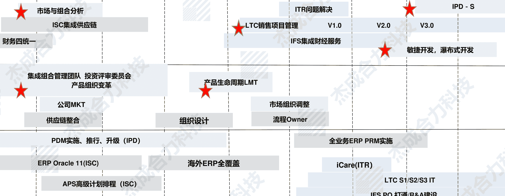

流程变革的目标：  
打造流程化组织  

主讲人：陈志强博士  
中国流程管理领域有影响力的专家  
华为首任流程总监  

杰成咨询 | 流程变革系列直播  

扫码加入 知识星球TOP 免费资源群  

✓ 每日免费获取高价值资源  
✓ 可提供各类资源搜索服务  

+   ◆ 热门付费文章  
◆ 各行各业报告  
◆ 精选图书资源  
◆ 副业赚钱方法  
◆ 职场实用资源  
◆ AI政经自媒体  

分享资料仅供个人学习，请及时删除，切勿商用传播  

公众号：知识星球TOP  
微信号：jntsg8  
微信号：jntsg2  

免费  
价值  
及时  
专注  

组织决定流程，还是流程决定组织？  

版权声明：本课件版权归杰成合力科技公司所有，未经杰成及本课件作者许可，任何对此资料的使用、编辑、传播等行为严格禁止  

© 2020JECN Consulting  4  

流程化组织的定义  

什么是流程化组织？  

> “基于以流程来分配权力、资源及责任的组织，就是流程化组织。跟流程运作无关的人员及组织必须裁掉，这就是流程化组织。”  
>  
> ——《华为公司的核心价值观》  

职能型组织  

+   • 以权力为中心  
• 管理粗放，依赖个人英雄  
• 制度繁杂，协同效率低  

流程化组织  

+   • 以客户为中心  
• 业务实践标准化、模板化  
• 流程精简，协同高效  

摘自于杰成合力科技公众号文章：《陈志强博士：什么是流程化组织》  

目录  

01 什么是流程化组织  
02 为什么要打造流程化组织  
03 打造流程化组织的变革路径  
04 标杆企业的变革路径  

危机已经来临  

> > “用规则的确定来应对结果的不确定”  
>  
> ——任正非  

打造流程化组织  

流程化组织与企业生命周期  

》流程化组织的特征  

+   • 去中间化  
• 去中心化  

》流程化组织优点  

+   • 高效  
• 灵活  
• 合规  

摘自于杰成合力科技公众号陈志强博士原创文章：《流程裂变：去中心化和去中间化》  

版权声明：本课件版权归杰成合力科技公司所有，未经杰成及本课件作者许可，任何对此资料的使用、编辑、传播等行为严格禁止  

© 2020 JECN Consulting  8  

目录  

01 什么是流程化组织  
02 为什么要打造流程化组织  
03 打造流程化组织的变革路径  
04 标杆企业的变革路径  

流程成熟度评估模型——APQC、Hammer、GPMМ等  

A APQC流程成熟度评估模型  

APQC的成熟度模型用于创建可靠，复杂，可重复的流程管理能力评估，帮助企业判断以什么节奏、用什么人或组织、以什么方式，开展变革，并规避风险、确保与原有体系融合，并最终达到经营目标。  

P PEMM流程和企业成熟度模型  

PEMM: Process and Enterprise Maturity Model, 流程和企业成熟度模型，是由“流程再造之父”迈克-哈默博士经过研究总结得出的理论框架，帮助企业规划流程变革、跟踪实施进展，并找出阻止变革发展的障碍。  

G GPMМ评估模型  

GPMМ模型由华为基于PEMM模型，再结合自身实践完善的评估模型，根据领域特色，从业务目标与结果、业务过程与能力、业务基础与支撑三个维度评价业务流程管理成熟度。  

APQC成熟度评价七大模块  

版权声明：本课件版权归杰成合力科技公司所有，未经杰成及本课件作者许可，任何对此资料的使用、编辑、传播等行为严格禁止  

© 2020JECN Consulting  11  

流程变革，文化先行  

文化是流程的灵魂！  

版权声明：本课件版权归杰成合力科技公司所有，未经杰成及本课件作者许可，任何对此资料的使用、编辑、传播等行为严格禁止  

© 2020JECN Consulting  14  

流程架构开发的流程  

定义高层级流程（L1-L3）  

以上样例来自杰成合力科技EPROS平台流程架构数据  

末端流程设计  

流程图  
流程文件  
表单、sop  

以上样例来自杰成合力科技EPROS平台流程数据  

组织适配  

版权声明：本课件版权归杰成合力科技公司所有，未经杰成及本课件作者许可，任何对此资料的使用、编辑、传播等行为严格禁止  

© 2020JECN Consulting  18  

阶段二：实现流程成熟度4.0  

第一阶段  
建立变革基础  

第二阶段  
深入变革  

第三阶段  
持续变革  

流程变革松土赋能培训  
快赢项目  
流程架构规划  
流程设计与优化  
流程管理体系建设辅导  
识别流程建设种子队伍  
宣传成果，强化信心  
识别明确业务架构  
流程建设  
流程优化  
流程管理例行化  
管理流程的流程、组织、IT  

EPROS流程管理平台导入  
流程成熟度提升至标准级  

战略规划  
战略解码  
战略驱动的变革规划  
变革项目实施  
流程成熟度提升至度量级  

培育组织变革领导力  
全球最佳实践对标  
实现变革常态化  
流程成熟度对标卓越级  

版权声明：本课件版权归杰成合力科技公司所有，未经杰成及本课件作者许可，任何对此资料的使用、编辑、传播等行为严格禁止  

© 2020 JECN Consulting  19  

建立适配战略的流程指标体系  

组织  
流程  
举例  

组织绩效指标体系KPI  

| 公司级 | 公司级 BSC |  
|---|---|  
| 结果KPI | 财务 |  
| | 客户 |  
| 过程KPI | 内部流程 |  
| | 学习成长 |  

| 公司级 | 公司级 行动计划表 |  
|---|---|  
| 财务 | |  
| 客户 | |  
| 内部流程 | |  
| 学习成长 | |  

| 部门级 | 部门级 BSC |  
|---|---|  
| 结果KPI | 财务 |  
| | 客户 |  
| 过程KPI | 内部流程 |  
| | 学习成长 |  

| 部门级 | 部门级 行动计划表 |  
|---|---|  
| 财务 | |  
| 客户 | |  
| 内部流程 | |  
| 学习成长 | |  

| 个人级 | 个人级 BSC |  
|---|---|  
| 结果KPI | 客户 |  
| 过程KPI | 内部流程 |  
| | 学习成长 |  

流程绩效指标体系KPI (APQC )  

| 运营流程大类 KPI | M1E |  
|---|---|  
| 管理支持流程大类KPI | M11/M2 |  
| 流程组KPI | |  

| 流程KPI | M11 |  
|---|---|  
| 子流程KPI | M2 |  

| 活动KPI | M3 |  

| 公司级 | 公司级结果KPI | MIE |  
|---|---|---|  
| | 销售收入 | |  
| | 利润总额 | |  
| | 现金流量 | |  
| | 专利数量 | M11/M2 |  
| | 入库合格率 | |  
| | 销售预测准确率 | |  

| 部门级 | 部门级结果KPI | M11 |  
|---|---|---|  
| | 专利数量 | |  
| | 入库合格率 | |  
| | 销售回款率 | |  
| | 研发项目节点完成率 | M2 |  
| | XX质量控制点合格率 | |  
| | 销售预测准确率 | |  

| 个人级 | 个人级结果KPI | M3 |  
|---|---|---|  
| | 个人项目节点完成率 | |  
| | 岗位工作返工率 | |  
| | 岗位预测准确率 | |  

版权声明：本课件版权归杰成合力科技公司所有，未经杰成及本课件作者许可，任何对此资料的使用、编辑、传播等行为严格禁止  

© 2020 JECN Consulting  20  

变革项目实施的四个维度  

版权声明：本课件版权归杰成合力科技公司所有，未经杰成及本课件作者许可，任何对此资料的使用、编辑、传播等行为严格禁止  

© 2020 JECN Consulting 21  

阶段三目标：实现流程成熟度5.0  

第一阶段  
建立变革基础  

流程变革松土赋能培训  
快赢项目  
流程架构规划  
流程设计与优化  
流程管理体系建设辅导  
达成共识  
PMO/PC  
识别流程建设种子队伍  
宣传成果，强化信心  
识别明确业务架构  
痛点流程打样  
流程管理例行化  
管理流程的流程、组织、IT  
EPROS流程管理平台导入  
流程成熟度提升至标准级  

第二阶段  
深入变革  

战略规划  
战略解码  
战略驱动的变革规划  
变革项目实施  
流程成熟度提升至度量级  

第三阶段  
持续变革  

培育组织变革领导力  
全球最佳实践对标  
实现变革常态化  
流程成熟度卓越级对标  

版权声明：本课件版权归杰成合力科技公司所有，未经杰成及本课件作者许可，任何对此资料的使用、编辑、传播等行为严格禁止  

© 2020 JECN Consulting 22  

实现流程成熟度5.0  

业务组件模型（CBM）  

CBM帮助企业提高业务灵活性、识别核心业务、明确变革范围与优先级，并指导企业业务架构的构建  

5.0级流程成熟度  

版权声明：本课件版权归杰成合力科技公司所有，未经杰成及本课件作者许可，任何对此资料的使用、编辑、传播等行为严格禁止  

© 2020 JECN Consulting 23  

目录  

01 什么是流程化组织  
02 为什么要打造流程化组织  
03 打造流程化组织的变革路径  
04 标杆企业的变革路径  

变革起步期（1995~1998）  

+   - 基本法  
- ISO导入  
- MRPII选型  

+   - 流程再造理论导入  
- 基于部门建立流程规范，做了零星跨部门流程优化  
- Oracle MRPII开始实施  

深度变革期  

|  | 98 | 00 | 02 | 04 | 06 | 08 | 10 | 11 | 12 | 13 | 14 |  
|---|---|---|---|---|---|---|---|---|---|---|---|  
| BP&IT |  |  | IPD集成产品开发V1.0 | V2.0 | V3.0 | V5.0 | V6.0 V6.1 | V6.2 V6.3 | V6.4 V6.5 | V6.6 | V7.0 |  
| S&P |  |  | 市场与组合分析 | ISC集成供应链 | 财务四统一 |  | LTC销售项目管理 | ITR问题解决 | IFS集成财经服务 | 敏捷开发，瀑布式开发 |  |  
| 战略与规划 |  |  | 集成组合管理团队 投资评审委员会 产品组织变革 |  | 产品生命周期LMT |  | 市场组织调整 | 流程Owner |  |  |  |  
|  |  |  | 公司MKT | 供应链整合 | 组织设计 |  |  |  |  |  |  |  
|  |  |  | PDM实施、推行、升级（IPD） | ERP Oracle 11(ISC) | 海外ERP全覆盖 |  | 全业务ERP PRM实施 | iCare(ITR) | LTC S1/S2/S3 IT | IFS PO 打通/R&A建设 |  |  
|  |  |  | APS高级计划排程（ISC） |  | WEB化和集成平台建设 SOA |  |  | 移动办公 | 虚拟化，云计算 |  |  |  
|  |  |  | 数据中心 |  | 全球网络覆盖及优化 |  |  |  |  |  |  |  

# 杰成，十年专注、终成一剑！

• 使命：帮助中国企业转型为流程化组织，实现合规、高效、灵活。企业变革引擎、流程管理专家！
• 合伙人主要来自华为、IBM等管理标杆企业，具备丰富的实战经验。
• 培训、咨询和EPROS流程管理工具是公司的核心产品，APQC专业会员的授权获取业界标杆，强化企业的流程意识和变革意识，建立流程管理的治理机制、进行全方位的变革赋能。
• 公司管理咨询总部位于深圳，软件研发中心位于北京和深圳。

## 杰成合力——三个“三”助力企业转型为流程化组织

3

# 杰成是APQC在中国的首家专业服务会员

流程分类框架——美国生产力和质量中心（APQC）特别授权杰成咨询原版翻译简体中文对照版

# 杰成参与编辑和翻译出版的书籍

版权声明：本课件版权归杰成合力科技公司所有，未经杰成及本课件作者许可，任何对此资料的使用、编辑、传播等行为严格禁止

© 2020 JECN Consulting 30

# EPROS流程管理平台六大核心价值

## 助力流程化组织建设

基于流程定义组织的职责和权限，实现组织与流程的适配
减少冗余的活动和角色

## 流程建设赋能

基于公司战略与商业模式，建立端到端的流程体系
实现流程可视化、标准化、集成化
统一流程语言，提供流程设计的方法和工具

## 提供精准的岗位赋能

将最佳业务实践固化到流程和模板，形成公司的战略资产
为员工提供流程导航，实现精准赋能，加速人才培养

## 流程变革例行化

分解流程管理责任，驱动全员变革
根据业务的变化及时优化公司流程，将流程变革例行化

## 多体系融合

将制度、风控、合规、各类标准的要求融入流程，避免“多张皮”

## 为数字化转型提供流程基础

为信息化建设提供高质量的流程输入

# EPROS为企业的流程管理持续赋能

EPROS已覆盖：

- 15个行业
  以科技类企业为主
- 30个城市
- 各行业的龙头企业：
  海康威视、福耀玻璃、烽火通信、
  万华化学、蒙牛集团、中车集团、
  顺丰集团、海信集团、东方航空
  科大讯飞、金科地产、招商证券

# EPROS流程管理平台获得的荣誉

EPROS流程管理平台  
2012、2013、2014、2015、2016、2017、2018、2019年度连续八年  
获得流程管理信息化最高奖项

| 年份   | 获得奖项                             |
|--------|--------------------------------------|
| 2012年 | 最佳产品奖                          |
| 2013年 | 技术创新奖                          |
| 2014年 | 最佳产品奖                          |
| 2015年 | 最具应用价值奖                      |
| 2016年 | 最佳产品奖                          |
| 2017年 | 最有影响力企业奖                    |
| 2018年 | 业务流程管理领军企业奖              |
| 2019年 | 业务流程管理行业信息化最具影响力企业奖 |

# 扫码加入 知识星球TOP 免费资源群

- ✓ 每日免费获取高价值资源
- ✓ 可提供各类资源搜索服务

+ ◆ 热门付费文章  
◆ 各行各业报告  
◆ 精选图书资源  
◆ 副业赚钱方法  
◆ 职场实用资源  
◆ AI政经自媒体  

分享资料仅供个人学习，请及时删除，切勿商用传播  

公众号：知识星球TOP  
微信号：jntsg8  
微信号：jntsg2  

免费  
价值  
及时  
专注