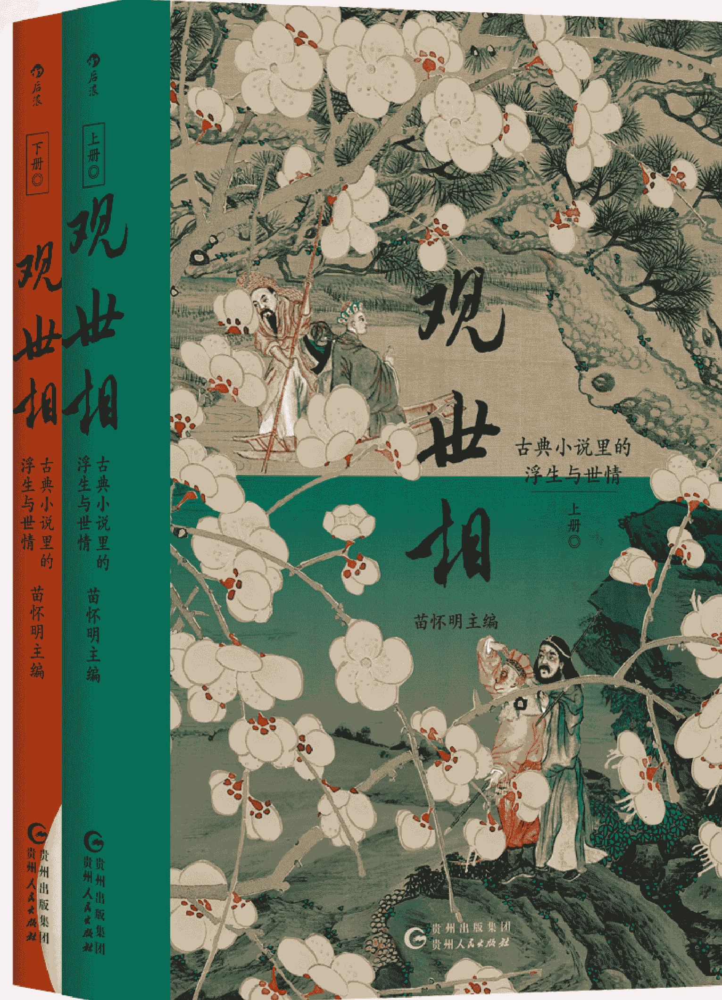
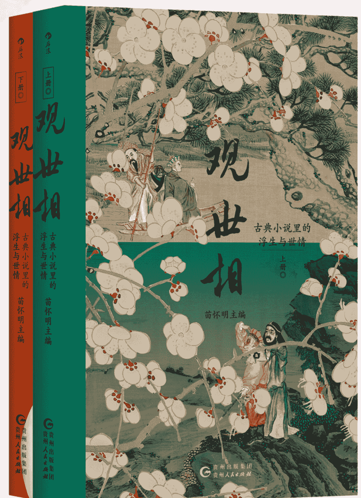
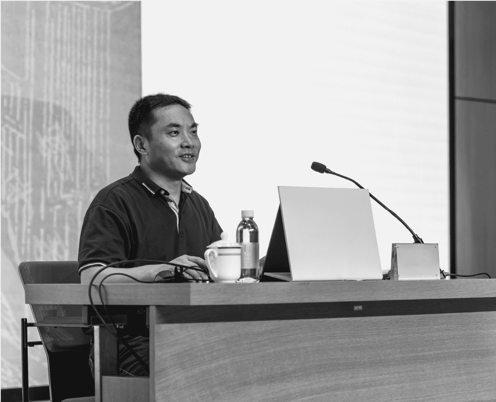
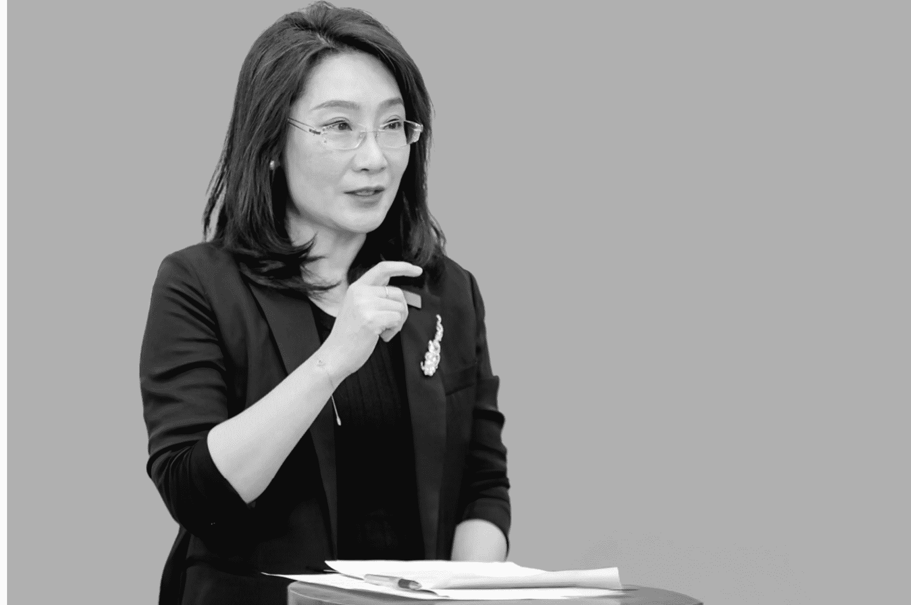
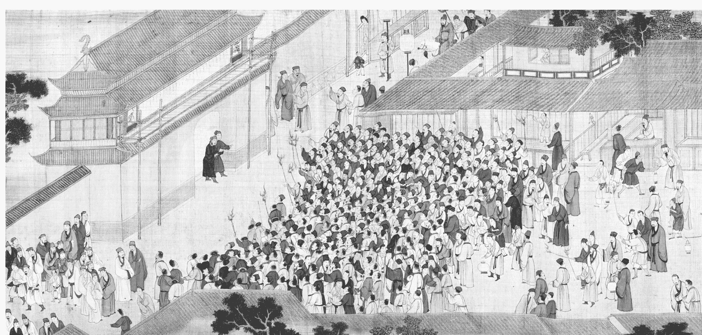
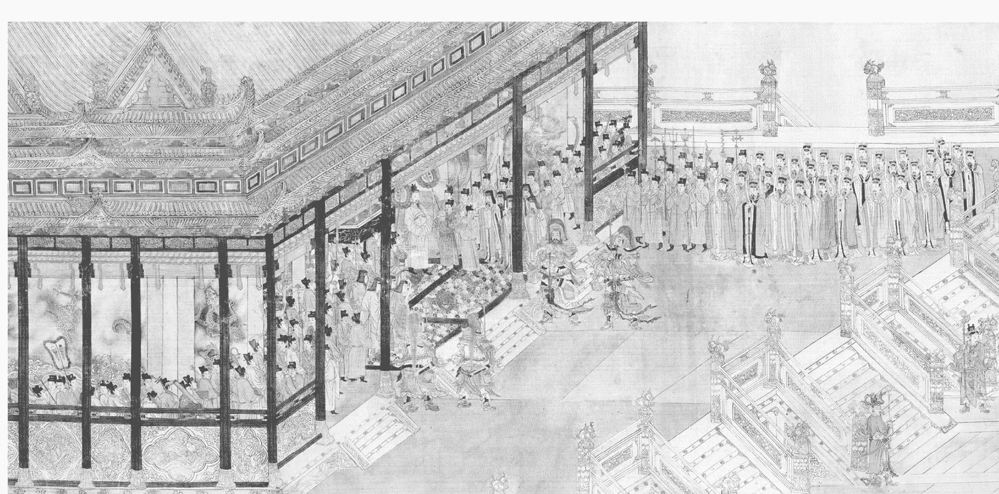

## 观世相
古典小说里的浮生与世情
(上下册)

## 扫码加入 知识星球TOP 免费资源群

- ✓ 每日免费获取有价值资源
- ✓ 可提供各类资源搜索服务

- ◆ 热门付费文章
- ◆ 各行各业报告
- ◆ 精选图书资源
- ◆ 副业赚钱方法
- ◆ 职场实用资源
- ◆ AI政经自媒体

公号：知识星球TOP
微信号：jntsg8
微信号：jntsg2

分享资料仅供个人学习，请及时删除，切勿商用传播

## 观世相
古典小说里的浮生与世情
(上下册)

## 版权信息

COPYRIGHT

书名：观世相：古典小说里的浮生与世情（上下册）

作者：苗怀明 主编

出版社：贵州人民出版社·后浪

出版时间：2024年12月

ISBN：9787221185556

字数：318千字

本书由后浪出版咨询（北京）有限责任公司授权得到APP电子版制作与发行

版权所有·侵权必究

## 序言

在中国人的文化生活中，小说是一种不可替代的特殊存在。它是文学作品，以栩栩如生的人物、跌宕起伏的情节、精密严整的结构、惟妙惟肖的语言形成独特的艺术魅力，为一代又一代读者提供审美享受，丰富着他们的生活，滋润着他们的心灵；同时，它又是文化典籍，在构建文化传统、铸造民族精神等方面发挥着重要作用，影响深远，特别是像《世说新语》《三国演义》《水浒传》《西游记》《金瓶梅》《聊斋志异》《儒林外史》《红楼梦》这样的经典之作，承载着中国人的价值观念、人生理想和审美趣味。因此，可以将中国古典小说作为透视中国古代社会文化的一个绝佳窗口。

中国古典小说与中国社会文化的关系是双向互动的。一方面，中国古典小说是中国古代社会文化的文学化反映，无论是改朝换代还是江湖恶斗，无论是降妖除魔还是家族兴衰，都通过鲜活生动的人/神形象、完整的故事情节，直观地呈现出来，有着极为丰富的认识价值。尽管作品中人/神形象、情节很多是虚构的，但它有着历史典籍无法取代的史料价值。中国古代的史书特别是正史往往采用宏大叙事，记载的大多是帝王将相主导的军国大事、政治外交，至于平民百姓的日常生活，则不屑记载。事实上，日常生活与军国大事同样重要，细节展示与宏大叙事同样精彩，要了解中国古代市井细民的柴米油盐、衣食住行、婚丧嫁娶乃至喜怒哀乐，必须从小说作品中去寻找材料。在以书写日常生活为特色的微观史学层面，小说比历史典籍更有史料价值，也更为重要。

另一方面，中国古典小说也深深影响着中国古代社会文化的各个方面。以《三国演义》《水浒传》为例，其影响早已超出文学欣赏的层面，明代中期之后逐渐成为军事教科书，从张献忠的造反到多尔衮的入关，再到太平天国的排兵布阵，这两部小说都不同程度地发挥着作用，可以说，它们参与并影响着中国历史的发展进程。直到今天，仍有不少人在商业经营、人才管理等方面从中得到启发和借鉴。中国古典小说特别是那些经典名著深刻影响并改变着中国人的宗教信仰、伦理道德、节庆民俗、语言表达，这种影响和改变是全方位的，也是非常深入的。对那些识字不多乃至目不识丁的古代中国人来说，小说发挥着历史教科书、道德教科书、情感教科书等功能，正如鲁迅所言：“我们国民的学问，大多数却实在靠着小说，甚至于还靠着从小说编出来的戏文。”毫不夸张地说，中国古典小说是中国古代社会文化的重要载体，它对中国古代广大民众所起的作用绝不亚于四书五经，不亚于各类经典。认识传统中国，深入理解中国古代社会文化，离不开中国古典小说。

从家喻户晓、妇孺皆知来描述中国古典小说特别是那些经典名著的影响一点都不为过，经过千百年的陶冶浸润，中国古典小说已经成为中华民族的文化基因，深深植根于中国人的精神世界，直到今天仍在潜移默化地发挥着作用。特别是那些传世经典比如四大名著，尽管所写为农业时代的生活场景，但它们在数字化的时代里并没有过时，给读者带来审美愉悦的同时，也给他们带来精神上的滋润和启迪。如今已没有科举考试，但学生面临的升学压力并没有减轻；如今已没有三妻四妾的争风吃醋，但夫妻之间的关系并没有变得更简单或更轻松；如今已不再歃血为盟、结拜兄弟，但一起为事业打拼的患难真情同样珍贵，焕发着人性的光彩。

对在无休止的内卷中焦头烂额、身心俱疲的现代人来说，阅读古典小说可以获得其他样式文学作品无法替代的愉悦和收获。这里有丰富的人性探索、有深刻的社会洞察、有睿智的人生分享，在这里不仅可以找寻曾经模糊的文化记忆，也可以为自己难以释怀的文化乡愁找到归宿。中国古典小说中那些永恒的话题，比如英雄、勇气、政治、规则、欲望、自由、生命、爱情、名利、暴力、伦理、女性、正义、青春，等等，这也是当下每个读者都要面对的人生关键词。这些古典小说作品反映了中国古代社会文化的不不同侧面，发出了直面灵魂的拷问，也提供了极具启示性的思考。在《三国演义》中，拯救苍生的英雄情怀中夹杂着无处不在的利己主义；在《水浒传》中，快意恩仇的江湖世界背后是凄凉落寞的末路悲歌；在《西游记》中，上天入地的自由沉重且代价巨大，保持童真得到的却是顺从规则的油滑；在《红楼梦》中，凄美的青春挽歌掩饰不住家族使命的庄严复调。那些出没

## 中国古典小说

+ 先秦
+ 东汉
+ 魏晋南北朝
+ 唐
+ 宋元
+ 明清

“小说”一词最早出现于《庄子·外物篇》

小说成为一种文体

志怪小说

志人小说、笑话、野史逸闻——刘义庆《世说新语》

唐传奇——白行简《李娃传》、元稹《莺莺传》等，参见《唐五代传奇》

话本——孕育了长篇章回小说

长篇小说（章回体）

+ 历史演义
+ 神魔小说
+ 世情小说
+ 讽刺小说
+ 武侠小说

历史演义——罗贯中《三国演义》、施耐庵《水浒传》

神魔小说——吴承恩《西游记》、许仲琳《封神演义》

世情小说——兰陵笑笑生《金瓶梅》，曹雪芹、无名氏《红楼梦》

讽刺小说——吴敬梓《儒林外史》

武侠小说——石玉昆《三侠五义》

短篇小说——志怪小说（文言笔记小说）——蒲松龄《聊斋志异》

## 《世说新语》：清谈与隐逸

看似史而超越史，不是诗而胜似诗，并非哲学而富含哲学气质。

刘强 同济大学人文学院

## 引言 《世说新语》的价值

六朝志人小说名著《世说新语》是一部值得反复阅读的文化经典，它虽然是由1130条“丛残小语”构成的一部“尺寸短书”，却有着不可替代的参考价值和无与伦比的艺术魅力；我们从中既可以了解汉末以迄魏晋这几百年来的社会、政治、思想、文化等的发展概况，又可以领略中国士文化史上举足轻重的名士文化以及特立独行的“魏晋风度”。

古今文人墨客大多酷嗜《世说新语》，对这部书评价很高，故而留下了种种脍炙人口的“美誉”。比如，南宋学者高似孙说：

[宋] 高似孙著，王群栗点校：《纬略》卷九《刘孝标世说》，杭州：浙江古籍出版社，2015年。

宋临川王义庆采撷汉晋以来佳事佳话，为《世说新语》，极为精绝，而犹未为奇也。梁刘孝标注此书，引援详确，有不言之妙。

[明] 胡应麟：《少室山房笔丛》卷二九《九流绪论下》，上海：上海书店出版社，2009年。

明代文学家胡应麟也说：“刘义庆《世说》一书，诚古今绝唱，所谓三叹有遗音者。”又说：“读其语言，晋人面目气韵恍忽生动，而简约玄澹，真致不穷，古今绝唱也。” 明代“后七子”的领袖王世贞甚至认为，在古代琐言类的小说中，《世说新语》可以排在“第一”：“有以一言一事为记者，如刘知几所称琐言，当以刘义庆《世说新语》第一。” 王世贞的弟弟王世懋更是把《世说新语》的研究称作“世说学”。

近代以来，《世说新语》更是大受欢迎。如鲁迅说它是一部“名士底教科书”；冯友兰说它是“中国人的风流宝鉴”；傅雷则不仅谓之“枕中秘宝”，还充满感情地说：“我常常缅怀两晋六朝的文采风流，认为是中国文化的一个高峰。”20世纪30年代世界书局出版《诸子集成》（共八册），收录了先秦至南朝的重要子书凡二十八种，《世说新语》也赫然在列。这套丛书的卷首是这样评价《世说新语》的：“此书为古今唯一小说名著，唐以前小说，以此为代表。”这里的“古今唯一小说名著”，与胡应麟的“古今绝唱”、王世贞的“琐言第一”遥相呼应，足见《世说新语》在中国小说史上地位之隆，名价之高。

我认为，《世说新语》可以说是一部“人之书”。这部经典所呈现出的“魏晋风度”和“名士风流”，实在具有人类学的价值和心灵史的意义，其所凝聚的，正是最具中国特色的“精神现象学”。从这个意义上说，《世说新语》不仅是一部中国人的“智慧之书、性情之书、趣味之书”，还是一部世界文化史上堪称伟大的“灵性之书、人性之书、诗性之书”。

## 一 《世说新语》与魏晋风度

就“魏晋风度”而言，其肇端固然在一千六七百年以前的魏晋之际，但其真正凝结成为一大概念，则历时尚不足百年。

此演讲后整理成文，收入杂文集《而已集》，1928年出版。参见《鲁迅全集》第三卷，北京：人民文学出版社，1981年。

1927年7月，在国民党政府广州市教育局举办的“广州暑期学术演讲会”上，时年四十六岁的鲁迅于23日、26日分两次做了现在看来十分重要的演讲，题为《魏晋风度及文章与药及酒之关系》。在这篇将近一万字的演讲稿中，鲁迅谈到了三个方面：一是魏晋文章及其特点，概括下来就是清峻、通脱、华丽、壮大；二是以“正始名士”何晏为祖师的服药之风；三是以“竹林名士”为代表的饮酒之风。除了题目，正文中并未对“魏晋风度”做具体阐释，但鲁迅的意思应当是：魏晋文章及名士们煽起的服药与饮酒两大风气，便是“魏晋风度”最重要的表现及展示。此

## 二 清议与清谈的话术转换

在中国古代，可能很少有一部小说会像《世说新语》一样，与哲学、宗教、思想和文化的联系如此紧密。今天的读者如果想了解汉魏六朝的思想文化史，又没有时间和精力去“啃”那些思想家的著作，不妨先读读《世说新语》。书中的人物和故事，有相当大的比例来自那个时代最优秀的士大夫、学者、诗人、艺术家和思想家，在看似“乱纷纷你方唱罢我登场”的话语狂欢中，我们与他们相识、相交、对话，于是乎，一个生动而又鲜活的思想世界就这样不可思议地打开了。

## 清议与清谈

要说从学术、思想和文化的角度给《世说新语》“定性”，我还是更认同陈寅恪的“清谈全集”说：

陈寅恪：《陶渊明之思想与清谈之关系》，《金明馆丛稿初编》，南京：译林出版社，2020年。（无特别注明外，后文陈寅恪语皆出自此文此版本，不再一一标明）

《世说新语》，记录魏晋清谈之书也。其书上及汉代者，不过追溯原起，以期完备之意。惟其下迄东晋之末刘宋之初迄于谢灵运，固由其书作者只能述至其所生时代之大名士而止，然在吾国中古思想史，则殊有重大意义。盖起自汉末之清谈适至此时代而消灭，是临川康王不自觉中却于此建立一划分时代之界石，及编完一部清谈之全集也。

余英时：《士与中国文化》，上海：上海人民出版社，2003年。

这段话不仅揭示了《世说新语》与魏晋清谈的关系，还特别指出，魏晋兴盛起来的清谈，在汉代就已“原起”（“起自汉末之清谈”）；而此书之所以要以汉末政治家陈仲举、李元礼诸人开篇，是为了“追溯原起，以期完备”。余英时则从士文化的角度立论，认为“《世说新语》为记载魏晋士大夫生活方式之专书，……故其书时代之上限在吾国中古社会史与思想史上之意义或尤大于其下限也”。两人不约而同，都提到《世说新语》“时代之上限”，虽然没有明说，其实已经暗示了作为魏晋清谈源头的汉末清议。

## 关于汉末清议的产生背景

《后汉书·党锢列传》的一段话最可参考：

逮桓、灵之间，主荒政缪，国命委于阉寺，士子羞与为伍，故匹夫抗愤，处士横议，遂乃激扬名声，互相题拂，品核公卿，裁量执政，婞直之风，于斯行矣。......学中语曰：天下模楷李元礼（膺），不畏强御陈仲举（蕃），天下俊秀王叔茂（畅）。......并危言深论，不隐豪强。自公卿以下，莫不畏其贬议，屣履到门。

汉末清议有一个特别之处，就是有着极强的现实针对性，具体来说，就是对当时宦官专权、朝政昏聩的一种激烈的批评。其内容主要有二：一是政治批评，所谓“裁量执政”；二是人物臧否，也即“品核公卿”。前者，有太学生与士大夫圈子的游谈和互相标榜可以为证；后者，最著名的例子莫过于汝南的“月旦评”。《后汉书·许劭传》载：
“初，劭与靖俱有高名，好共核论乡党人物，每月辄更其品题，故汝南俗有‘月旦评’焉。”这里的“核论”，也即“深刻切实的议论”，和前面的“处士横议”“危言深论”，都是汉末清议在言说方式上的重要表现。因为清议表达了对当时政治的批判，自然引起宦官集团和皇帝的不满，东汉桓帝延熹九年（166）和灵帝建宁元年（168），清议名士先后遭到两次“党锢之祸”的清洗和弹压，陈仲举、李元礼等人相继罹难，天下士子，噤若寒蝉。于是，清议不得不转为清谈。

## 从清议到清谈

唐翼明：《魏晋清谈》，成都：天地出版社，2018年。

"清谈"一词，汉末已见，最初与"清议"可以互称，其中也有人物批评的内涵；到了魏晋，才更多地指向"抽象玄理之讨论"。在《世说新语》中，清谈又有"谈玄""玄谈""清言""玄言""口谈""剧谈""微言""言咏"等多种异称，因为清谈主要盛行于魏晋，故而常称作"魏晋清谈"。所谓"魏晋清谈"，根据唐翼明在《魏晋清谈》一书中的定义，可知："指的是魏晋时代的贵族知识分子，以探讨人生、社会、宇宙的哲理为主要内容，以讲究修辞与技巧的谈说论辩为基本方式而进行的一种学术社交活动。"

## 三 名教与自然：剪不断，理还乱

从学术史的角度看，清议和清谈，正好对应着汉代经学与魏晋玄学这两个不同的学术思想发展阶段；而从清议到清谈的“话术”转换，似乎又与“名教”和“自然”的现实角力并行不悖。

大体而言，“名教”占据上风，则清议的风气兴盛；一旦“名教”被野心家绑架，变成阳奉阴违、倒行逆施的意识形态教条，则作为反向力量的“自然”追求便会异军突起，这时清谈的风气势必转强。“名教与自然之辨”之所以会成为魏晋玄学最重要的一大命题，且与士人在政治生活中出处、进退、仕隐的抉择切实攸关，其深层原因或许就在这里。

## 名教与自然的定义

那么，究竟何为“名教”、何为“自然”呢？

简单说，名教就是因名立教，以名为教，主要是指以孔子“正名”观念及“君臣父子”之义为核心的，儒家所提倡的一整套伦理规范、道德标准和价值体系，举凡名分、名声、名节、名位、名器、名实等概念，皆为名教的题中之义。在《世说新语》中，“名教”有时又为“圣教”“声教”“礼教”等词所代换。大抵自汉代以降，“名教”及其所涵摄的“三纲六纪”等主流价值作为国家意识形态，一直为历代统治阶层（包括皇族和士大夫群体）所共同尊奉。

顾炎武《日知录》卷一三《名教》中说：

后之为治者宜何术之操？曰：“唯名可以胜之。”……故昔人之言，曰名教，曰名节，曰功名，不能使天下之人以义为利，而犹使之以名为利，虽非纯王之风，亦可以救积污之俗矣。……汉人以名为治，故人材盛；今人以法为治，故人材衰。

因为有“名教”这样一个近乎宗教般的绝对价值的存在，政权合法性也即“政统”便可以得到来自“道统”的加持，使王朝的国运在相对稳定的状态中得以或长或短地维系。当然，“名教”具有观念化和理想化的特质，容易给人一种“人为”设定和“外在”强加的印象，所以在魏晋那样一个重视本体论和宇宙论等形而上问题研讨的时代，“名教”受到来自“自然”的冲击和挑战，无论在学术上还是政治上，都可以说是必然的。

“自然”一词当然来自道家。在《老子》一书中，“自然”出现过五次，皆作本然、天然解，指的是一种自在、自成、自为，不加人为影响的本初状态。与儒家重“名”相反，道家则以为：“名可名，非常名。”不妨说，这是一种“非名”论的思想。由此又带来一种“贵无”论：“无，名天地之始；有，名万物之母”（《老子》第一章）；“天下万物生于有，有生于无”（《老子》第四十章）；“至人无己，神人无功，圣人无名”（《庄子·逍遥游》）。诸如此类。

## 名教与自然的张力

在魏晋人看来，儒道两家的不同趋向正可通过名教与自然的张力显示出来，故当时有“圣人贵名教，老庄明自然”（《晋书·阮瞻传》）之说。毋宁说，名教与自然的此消彼长，正是儒道两家冲突和博弈的现实反映。与之相应，“有无”“本末”“体用”“天人”“情礼”“仕隐”之间的对峙关系也被凸显出来，成为清谈时代的重要议题。以今天的眼光看，“自然”的追求或许比较接近“自由”，因而显得激进；而“名教”的捍卫比较关乎“秩序”，因而趋于保守。

## 魏晋易代之际的清谈

大致说来，魏晋易代之际的清谈经历了三个发展阶段：第一阶段以“正始名士”何晏、王弼、夏侯玄为代表，他们服膺老庄而身在庙堂，故主张“名教出于自然”。第二阶段以“竹林名士”的阮籍、嵇康为代表，他们看透名教为司马氏操纵后日渐虚伪，转而追慕老庄，与道逍遥，故鼓吹“越名教而任自然”（嵇康《释私论》）。第三阶段以“竹林名士”中的山涛、王戎、向秀为代表，嵇康被杀后，他们不得不投靠司马氏，故主张“名教同于自然”。这里，仅就后者略举三例以说明。

## 再看前引《世说新语·文学》第十八条：

阮宣子（修）有令闻，太尉王夷甫（衍）见而问曰：“老庄与圣教同异？”对曰：“将无同。”太尉善其言，辟之为掾。世谓“三语掾”。卫玠嘲之曰：“一言可辟，何假于三！”宣子曰：“苟是天下人望，亦可无言而辟，复何假一！”遂相与为友。

这里的“老庄与圣教”，其实就是“自然与名教”，可见二者的异同问题几乎是整个时代的“大战问”。“将无同”三字为疑辞，言下之意，“大概相

## 四 精彩纷呈的清谈盛宴

魏晋清谈到底谈什么呢？简而言之，就是所谓“三玄”，即《庄子》《老子》《周易》这三部涉及抽象思辨的先秦经典。“三玄”之目，出自《颜氏家训·勉学篇》：“何晏、王弼，祖述玄宗。……《庄》《老》《周易》，总谓三玄。”可以说，“三玄”是魏晋六朝的清谈盛宴中不可替代的“玄学大餐”。

“三玄”之外，清谈比较热衷的话题还有：自然名教之辨、本末有无之辨、言意之辨、圣人有情无情之辨、才性四本论、养生论、声无哀乐论、形神之辨、鬼神有无论、佛经佛理等，甚至还包括《论语》《礼记》《孝经》等儒家经典。这些“言家口实”，基本上都可在《世说新语》中找到“出处”，有兴趣的读者可以查验一番。

作为一种贵族沙龙式的高雅学术活动，清谈的程式和规则颇有讲究，大概是从汉代经生讲经的模式中脱胎而来，又与汉末太学的“游谈”颇有渊源，同时也吸收了佛教讲经的模式。只不过讲经更像是独角戏、一言堂；而清谈则是辩论会、群言堂，而且角色分工明细，各司其职，有条不紊，场面上颇有“仪式感”。进行清谈的场所，要么是名士的庄园府邸，要么是佛教寺院，有时候干脆就在朝堂之上、山水之间。如著名的“洛水戏”“金谷游”“南楼咏”和“兰亭会”等，其实都是以清谈活动为主的文人雅集。

在对清谈论辩的记述中，有一些常用的“术语”，如“主客”“往反”“交番”“论难”“攻守”“胜屈”之类，不一而足。我们以乒乓球运动为喻，做一个通俗性的说明：比如，论辩双方就是参赛选手，发起者就是裁判，其他人则做观众或啦啦队员（“坐客”）；有发球权的一方是“主”（或谓“法师”，负责“唱经”），接发球反击的一方是“客”（或谓“都讲”，负责“送难”），攻守随时发生转换；发球是“通”“条”或者“道”，接发球是“问”或者“作难”（难，读去声），一个回合叫一“番”或一“交”，多个回合叫“往反”；发了一个好球或进攻得分叫“名通”“名论”或“胜理”，回了一个好球或防守得分叫“名对”，打得不好叫作“乱”或“受困”，打得好就叫“可通”，打输了就叫“屈”；打得好，“四坐莫不厌心”，“众人莫不抃舞”，气氛达到了高潮。

总之，清谈论辩很像是一场关乎荣誉的战斗，主客双方都要调动极大的智力和体能才能应战，对于旁观者而言，只要你进入情境，并带有一定的倾向性，那一定是心跳加快、手舞足蹈、狂热无比的。

说起来，魏晋历史的清谈名士真是层出不穷，群星璀璨。东晋名士袁宏（字彦伯）在其所撰的《名士传》中，开具了一份由十八人组成的“华丽榜单”：

正始名士：夏侯太初（玄）、何平叔（晏）、王辅嗣（弼）。

竹林名士：阮嗣宗（籍）、嵇叔夜（康）、山巨源（涛）、向子期（秀）、刘伯伦（伶）、阮仲容（咸）、王濬冲（戎）。

中朝名士：裴叔则（楷）、乐彦辅（广）、王夷甫（衍）、庾子嵩（敳）、王安期（承）、阮千里（瞻）、卫叔宝（玠）、谢幼舆（鲲）。（《世说新语·文学》第九十四条注引）

这个“大名单”之所以重要，是因为它正好对应了前面所说的魏晋清谈的几个发展阶段，每一个阶段都有这些名士演绎的精彩故事。下面，结合《世说新语》的记载，说说魏晋历史上几场著名的“清谈盛宴”。

## 正始之音

从学术思想史的角度看，《世说新语》的《文学》一门很值得注意，它在体例上颇有“破格”之处，既顾及“孔门四科”中“文学”一科的“学术”内涵（第一至六十五条记经学、玄学清谈及佛学等学术内容），又特别彰显了“文章”的独立地位（第六十六至一百零四条记诗、赋、文、笔等文人逸事，类同后世的“诗话”），如此“一目中复分两目”（王世懋评语），等于把“文章”（犹今之所谓“纯文学”）与“学术”做了一个“切割”。这样一种安排，应该与刘宋文帝初年，立儒学、玄学、史学、文学四大学馆的重要举措不无关系。所以，要了解魏晋清谈的真实情况，《文学》一门不可不读。

历史上最具典范意义的清谈盛宴，首推何晏、王弼开创的“正始之音”。何、王二人之所以被称为“清谈祖师”，正是因为他们 在清谈的内容、程式、方法及理想境界上，为后世建立了可以遵循的尺度，同时也确立了难以逾越的高度。从《世说新语·文学》如下两条可窥一斑：

何晏为吏部尚书，有位望，时谈客盈坐。王弼未弱冠，往见之。晏闻弼名，因条向者胜理语弼曰：“此理仆以为极，可得复难不？”弼便作难，一坐人便以为屈。于是弼自为客主数番，皆一坐所不及。（《文学》六）

何平叔注《老子》始成，诣王辅嗣，见王注精奇，乃神伏，曰：“若斯人，可与论天人之际矣！”因以所注为《道》《德》二论。（《文学》七）

从第一个故事可以看出，作为曹魏时期的清谈领袖，何晏的府邸经常召集清谈辩论会，而尚未弱冠的王弼首次亮相，便语惊四座，不仅驳倒了何晏的“向者胜理”（即刚刚在和他人的论辩中获胜的道理），而且还“自为客主数番”，就是同一个辩题，他既做“正方”又做“反方”，反复辩难多个回合，“皆一坐所不及”，真可谓辩才无碍，所向无敌。这次清谈论辩是什么话题，已不得而知，但在魏晋玄学史上，王弼因为“以老解孔”和“援道入儒”而占据重要地位，他所做的调和儒道的努力，使这两家思想内在的紧张关系得到了缓解，则是不争的事实。

第二个故事更有深意。身为吏部尚书、学界偶像的何晏，虽然在与晚辈王弼的论辩中落败，却不以为意，不仅主动拜访王弼探讨学问，而且见到王弼注《老子》比自己的“精奇”，不禁“神伏”，对其赞叹有加。“可与论天人之际”，既是“中转”自司马迁的“究天人之际”（《报任安书》），又是遥接子贡“夫子之言性与天道，不可得而闻也”（《论语·公冶长》）的感叹，同时还回应了“名教自然之辨”的时代命题。何、王二人在会通天人、有无、本末、儒道的玄学追求上可谓不约而同，不谋而合，后来何晏的改“注”为“论”，既有避其锋芒、知难而退的意思，也未尝不可以视作学术上的“分工合作”。从二人名下的著作（何晏有《论语集解》《道德论》等；王弼有《老子指略》《周易略例》等）来看，其中似乎真有某种“默契”。

据该条刘注引《魏氏春秋》：“弼论道约美不如晏，自然出拔过之。”可知二人在学术上各有千秋，互有长短。何晏对年少才高的王弼不仅没有嫉贤妒能，反而不吝赞美，提携呵护，不遗余力；而在彼此共同关切的学术讨论中，尊卑、长幼等人情世故的讲究完全被抛在脑后，取而代之的是对义理和思辨的执着追求——这才是“正始之音”最令人动容和神往的地方。

与“正始之音”几乎同时的还有著名的“竹林之游”，不过，正如唐翼明所说，“竹林七贤只是清谈中的变调，并非典型”（《魏晋清谈》）。他们在饮酒和任诞上的表现更为突出，形成了所谓的“林下风气”。当然，阮籍和嵇康都是写诗著论的高手，他们的玄学成就多以论文的形式呈现（如阮籍有《通易》《通老》《达庄》三论及《大人先生传》，嵇康有《养生》《声无哀乐》《难张辽叔自然好学》《释私》诸论），也算是魏晋清谈史上一道特别的风景。

## 中朝谈戏

这里的“中朝”，所指即为西晋。中朝清谈，以太康、元康年间最为兴盛，当时乐广、王衍、裴頠先后擅场，鼎足而三；之后郭象、阮瞻、卫玠等人枝附影从，共襄盛举。尤其乐广，几乎是西晋清谈之风的开创者。《晋书》本传载：“尚书令卫瓘，朝之耆旧，逮与魏正始中诸名士谈论，见广而奇之，曰：‘自昔诸贤既没，常恐微言将绝，而今乃复闻斯言于君矣。’”这分明是把乐广当作“正始之音”的继承人了。在《世说新语·文学》门中，乐广的清谈给人留下深刻印象：

卫玠总角时，问乐令（广）梦，乐云：“是想。”卫曰：“形神所不接而梦，岂是想邪？”乐云：“因也。未尝梦乘车入鼠穴、捣齑啖铁杵，皆无想无因故也。”卫思“因”经日不得，遂成病。乐闻，故命驾为剖析之，卫即小差。乐叹曰：“此儿胸中当必无膏肓之疾。”（《文学》十四）

客问乐令“旨不至”者，乐亦不复剖析文句，直以麈尾柄确几曰：“至不？”客曰：“至。”乐因又举麈尾曰：“若至者，那得去？”于是客乃悟服。乐辞约而旨达，皆此类。（《文学》十六）

麈尾：一种类似拂尘和羽扇的工具，当时名士清谈时必执麈尾，相沿成习，使其成为一种清谈盛会上的风流雅器。——编者注

这两则故事，可以视作魏晋清谈的“实录”，从中不难看出，乐广的清谈，不仅辞约旨达，而且善巧方便，尤其他用麈尾敲击几案，来解释《庄子》“指不至，至不绝”的深邃哲理，很像后来的禅宗公案，钱钟书谓其“禅宗未立，已有禅机”（《谈艺录》），真是一语中的。

## 再看《言语》门第二十三条：

诸名士共至洛水戏，还，乐令（广）问王夷甫（衍）曰：“今日戏，乐乎？”王曰：“裴仆射（頠）善谈名理，混混有雅致；张茂先（华）论《史》《汉》，靡靡可听；我与王安丰（戎）说延陵、子房，亦超超玄著。”（洛水戏）

这个故事应该是对中朝清谈的真实记录。我们看到，无论名理，还是《史》《汉》，抑或延陵、子房这样的历史人物，都可以作为清谈的内容，而乐广“今日戏，乐乎”的提问，无意中泄露了清谈的无拘无束、畅所欲言、心无旁骛的自由境界给人带来的审美享受与精神满足。

乐广之后，执清谈之牛耳的是太尉王衍，与之对垒且不落下风的则是有“言谈之林薮”（《赏誉》十八）之誉的裴頠。王衍因为服膺何晏、王弼的“贵无”论，终日谈空说无，故作清高。裴頠以“王衍之徒，声誉太盛，位高势重，不以物务自婴，遂相放效，风教陵迟，乃著崇有之论以释其蔽”（《晋书·裴頠传》）。于是，二人之间发生了颇富戏剧性的激烈论战。《世说新语·文学》第十二条载：

## 江左风流

"江左"，又叫"江东"，本是一地理名词，指长江下游南岸地区，这里特指东晋一朝。

和此前不同，东晋是典型的“门阀政治”，皇权与士权分庭抗礼，以至有“王与马共天下”之说。与之相应，“名教”与“自然”的紧张关系已不复存在，无论是政治上还是学术上，二者似乎都已进入“蜜月期”。这时的清谈与士大夫的政治态度、实际生活已无“密切关系”，成了陈寅恪所谓“口头虚语，纸上空文，仅为名士之装饰品而已”。我们分别举不同时段的几个例子以见其大概。先看《世说新语·文学》第二十二条：

殷中军（浩）为庾公（亮）长史，下都，王丞相（导）为之集，桓公（温）、王长史（濛）、王蓝田（述）、谢镇西（尚）并在。丞相自起解帐带麈尾，语殷曰：“身今日当与君共谈析理。”既共清言，遂达三更。丞相与殷共相往反，其余诸贤略无所关。既彼我相尽，丞相乃叹曰：“向来语乃竟未知理源所归。至于辞喻不相负，正始之音，正当尔耳。”明旦，桓宣武语人曰：“昨夜听殷、王清言，甚佳，仁祖亦不寂寞，我亦时复造心，顾看两王掾，辄鬓（shà）如生母狗馨！”

这次清谈颇具标志意义，时间应该在东晋咸和九年（334）之后，这时王敦、苏峻之乱已先后平息，政坛上庾亮开始崛起，王导虽为宰辅，但权力大不如前，已有引退之意，故其奉行“愦愦”之政，处理政事常画诺务虚，而对于清谈则尤为措意。要知道，作为东晋开国名相，王导不仅是富有韬略的政治家，也是开风气的清谈家。他早年曾“在洛水边，数与裴成公（頠）、阮千里（瞻）诸贤共谈道”（《企羡》二）；过江后，尤擅长谈论嵇康的《声无哀乐》《养生》和欧阳建的《言尽意》“三理”，“宛转关生，无所不入”（《文学》二十一），其玄学水平自不必说，允为江左清谈宗主。殷浩则是当时崭露头角的青年玄学家，尤其擅长“四本论”（才性离、合、同、异之论），只要“言及‘四本’，便若汤池铁城，无可攻之势”（《文学》三十四）。二人这一番清谈遭遇战十分酣畅淋漓，在桓温、王濛、王述、谢尚等名士的围观下，竟至“三更”才“彼我相尽”。年近耳顺的王导大概自过江以后，从未享受过如此的清谈妙境，不禁感叹：“刚才我们所谈，竟然分不清各自义理的源流归属，但言辞譬喻不相背负，各臻其妙，传说中的‘正始之音’，大概正该如此吧！”

## 五 清谈未必误国

### 清谈误国论

魏晋玄学大抵是围绕“名教自然之辨”这一议题展开，名教与自然的消长又与清议和清谈的起落若合符节。所以，对清谈的历史评价也和“名教”与“自然”在现实政治中的地位相关。大体而言，大一统王朝要比偏安政权——或者说，同一王朝的鼎盛期要比衰落期——对清谈的批判更为严厉些，这应该是不难理解的。这里我先举几个例子。

比如西晋立国之初，大臣傅玄就曾上疏晋武帝说：“近者魏武好法术，而天下贵刑名；魏文慕通达，而天下贱守节。其后纲维不摄，而虚无放诞之论盈于朝野，使天下无复清议，而亡秦之病复发于今。”（《晋书》本传《举清远疏》）这显然是对正始以来“虚无放诞之论”（“虚无”指何晏、王弼，“放诞”指嵇康、阮籍）的严厉批判，等于奏响了“清谈误国”论的先声。“天下无复清议”一句，更将清议与清谈截然对立起来。

傅玄死后，清谈之风死灰复燃，太尉王衍祖述“虚无”，其弟王澄引领“放诞”，二风交织，愈演愈烈，适逢贾后干政，八王乱起，终至西晋亡国。连王衍本人死前都痛定思痛，追悔莫及。《晋书·王衍传》写道：

衍将死，顾而言曰：“呜呼！吾曹虽不如古人，向若不祖尚浮虚，戮力以匡天下，犹可不至今日！”时年五十六。

王衍的“曲终奏雅”，正是来自“贵无”派内部的“清谈误国”论。这种论调在清谈蔚为时尚和“装饰品”的东晋一朝，依然此起彼伏，不曾消歇。东晋儒者范宁，承傅玄绪余，也将“清谈误国”的责任归咎于王弼、何晏，认为“二人之罪，深于桀纣”（《晋书·范宁传》）。此外，如干宝、应詹、葛洪、卞壸（kǔn）、江惇、熊远、陈𫖳等人，皆曾著论对清谈严加批评，流风所及，就连清谈圈内人如桓温、王羲之也不例外。《世说新语·轻诋》第十一条记载：

桓公入洛，过淮、泗，践北境，与诸僚属登平乘楼，眺瞩中原，慨然曰："遂使神州陆沉，百年丘墟，王夷甫（衍）诸人不得不任其责！"

桓温年轻时也是个不折不扣的清谈家，被当时的清谈大师刘惔许为“第一流”人物；一次他和刘惔听讲《礼记》，桓温说：“时有入心处，便觉咫尺玄门。”刘惔则说：“此未关至极，自是金华殿之语。”（《言语》六十四）两相比较，桓温之言会通儒道，兼综礼玄，似乎比刘惔所言更为入玄近道。不过，桓温之为桓温，关键不在清谈，而在其西征北伐、志在光复中原的英雄志业，尽管他也曾热衷清谈，但骨子里恐怕是视清谈为“余事”的，故其把王衍之流视为“神州陆沉，百年丘墟”的罪魁祸首，可谓“事有必至，理有固然”。

此条刘注引《八王故事》称：“夷甫虽居台司，不以事物自婴，当世化之，羞言名教。自台郎以下，皆雅崇拱默，以遗事为高。四海尚宁，而识者知其将乱。”《八王故事》的作者卢綝也是东晋人，足见在清理西晋亡国留下的“政治遗产”时，“清谈误国”论是当时大多数士人的“雷同”之见。

当然，也不是没有反对的声音。《世说新语·言语》第七十条载：

王右军与谢太傅共登冶城，谢悠然远想，有高世之志。王谓谢曰：“夏禹勤王，手足胼胝；文王旰食，日不暇给。今四郊多垒，宜人人自效；而虚谈废务，浮文妨要，恐非当今所宜。”谢答曰：“秦任商鞅，二世而亡，岂清言致患邪？"

王羲之与谢安一起登上冶城，谢悠然遐想，大有超脱世俗之志。王乃对谢说：“夏禹勤勉国事，手脚长满老茧；周文王政务繁忙，很难按时吃饭，时间总不够用。如今国家处于内忧外患之中，每个人都应为国效力；而不切实际的清谈会废弛政务，浮华不实的文章会妨害大事，这在当前恐怕是不合时宜的。”不料谢安应声答道：“秦国任用商鞅，仅两代就灭亡了，难道也是清谈导致的祸患吗？"

这是关于“清谈误国”的一次重要论辩。谢安的反诘，有力地批驳了“清谈误国”论的简单化倾向，把对亡国原因的探究进一步推向深入。换言之，清谈绝不是亡国的充分必要条件，不能把学术问题作为政治腐败、国土沦陷的替罪羊。谢安的思考堪称高瞻远瞩，发人深省。

不过谢安的辩护并未洗脱清谈的罪名。唐宋以降，对清谈亡国的指摘依旧不绝于耳。如唐修《晋书·儒林传序》说：“有晋始自中朝，迄于江左，莫不崇饰华竞，祖述虚玄，摈阙里之典经，习正始之余论，指礼法为流俗，目纵诞以清高，遂使宪章弛废，名教颓毁，五胡乘间而竞逐，二京继踵以沦胥，运极道消，可为长叹息者矣。”

[宋]叶梦得撰，[清]叶德辉校刊，涂谢权点校：《避暑录话》，济南：山东人民出版社，2018年。

北宋文学家叶梦得论及竹林七贤优劣时，褒嵇贬阮，竟这样说阮籍：“若论于嵇康前，自宜杖死。”①可见其对清谈时代“士无特操”的状况是深恶痛绝的。南宋大儒朱熹亦不以清谈为然，说：“晋宋间人物，虽曰尚清高，然个个要官职，这边一面清谈，那边一面招权纳货。渊明却真个是能不要，此其所以高于晋宋人也。”认为清谈虽为汉末节义之风式微所激，但在“东汉崇尚节义之时，便自有这个意思了。盖当时节义底人，便有傲睨一世、污浊朝廷之意。这意思便自有高视天下之心，少间便流入于清谈去”（《朱子语类》卷三十四）。此说虽未提“清谈误国”，其实也隐含这一层意思。

为《资治通鉴》作注的胡三省也说：“正始所谓能言者，何平叔数人也。魏转而为晋，何益于世哉！王祥所以可尚者，孝于后母与不拜晋王耳。君子犹谓其任人柱石而倾人栋梁也。理致清远，言乎，德乎？清谈之祸，迄乎永嘉，流及江左，犹未已也。”

不过总的来说，宋明学术亦尚虚，理学也好，心学也罢，都强调穷理尽性，明心见性，对佛、老及魏晋玄学的形上思辨多有折中，故其对清谈尚有“了解之同情”。

及至清代，民族矛盾加剧，士大夫不得不崇尚名教之义，严明夷夏之辨，学术上亦推崇实学，强调经世致用，“清谈误国”论遂再度抬头，甚至比以往更为激烈。清初大儒顾炎武《日知录》卷七“夫子之言性与天道”条云：

孰知今日之清谈，有甚于前代者。昔之清谈谈老庄，今之清谈谈孔孟。未得其精，而已遗其粗；未究其本，而先辞其末。

### 同书卷十三“正始”条又说：

有亡国，有亡天下。亡国与亡天下奚辨？曰：易姓改号，谓之亡国；仁义充塞，而至于率兽食人，人将相食，谓之亡天下。魏、晋人之清谈，何以亡天下？是孟子所谓杨、墨之言，至于使天下无父无君，而入于禽兽者也。......自正始以来，而大义之不明，遍于天下。

这已不是“误国”“亡国”论了，直接是将“亡天下”之罪一股脑儿归诸清谈！

顾炎武显然认识到清议与清谈、名教与自然之消长对于天下风俗的影响，故《日知录》中又设“清议”“名教”二条，前者说：“天下风俗最坏之地，清议尚存，犹足以维持一二，至于清议亡，而干戈至矣。”后者说：“‘晋、宋以来，风衰义缺’，故昔人之言，曰名教、曰名节、曰功名，不能使天下之人以义为利，而犹使之以名为利，虽非纯王之风，亦可以救积污之俗矣。”

[清]王夫之撰，舒士彦点校：《读通鉴论》卷十二，北京：中华书局，1975年。

与之同时的另一位大儒王夫之也说：“夫晋之人士，荡检逾闲，骄淫懦靡，而名教毁裂者，非一日之故也。......孔融死而士气灰，嵇康死而清议绝，名教为天下所讳言，同流合污而固不以为耻。”顾、王二人的观点，今人可能以为迂腐冬烘，然而在当时，又确有其创巨痛深、不得不然者在焉。

差不多百年之后，清儒钱大昕才在《何晏论》中提出不同观点：

[清]钱大昕著，陈文和主编：《潜研堂文集》卷二，南京：凤凰出版社，2016年。

乌呼，（范）宁之论过矣！史家称之，抑又过矣！方典午之世，士大夫以清谈为经济，以放达为盛德，竞事虚浮，不修方幅，在家则丧纪废，在朝则公务废。而宁为此论以箴砭当世，其意非不甚善，然以是咎嵇、阮可，以是罪王、何不可。……自古以经训专门者列于儒林，若辅嗣之《易》、平叔之《论语》，当时重之，更数千载不废；方之汉儒，即或有间，魏、晋说经之家，未能或之先也。（范）宁既志崇儒雅，固宜尸而祝之，顾诬以罪深桀、纣，吾见其蔑儒，未见其崇儒也。论者又以王、何好老、庄，非儒者之学。然二家之书具在，初未尝援儒以入庄、老，于儒乎何损？

[清]钱大昕著，陈文和主编：《十驾斋养新录》卷十八，南京：凤凰出版社，2016年。

这是站在正统儒家经学的立场上，为有功于经学的何晏、王弼翻案，理据甚明，持论甚严。而其于《清谈》一文，又称“魏、晋人言老、庄，清谈也；宋、明人言心性，亦清谈也。……王安石之新经义，亦清谈也。神京陆沈（沉），其祸与晋等”，似乎依旧是“清谈误国”论的拥护者。

## 六 隐逸：自由而诗意地栖居

在魏晋流行的诸多风气中，隐逸之风可算是最为强劲的一种，从汉末以迄东晋，几乎呈愈演愈烈之势。至刘宋初年，有两部文献对隐逸文化投以关注，并加总结，一是范晔的《后汉书》，一是刘义庆的《世说新语》。前者专设“逸民列传”，开启史传隐逸书写之先河；后者专设“栖逸”一门，为魏晋隐士之流树碑立传。

### 隐逸文化

所谓“栖逸”，也即隐居避世之意。在中国传统文化中，隐逸是最具传奇性、超越性和浪漫气质的一种文化现象，甚至从某种程度上说，还颇具所谓的“现代性”。因为“隐”与“仕”相对，一个人选择隐居山林不问世事的生活，等于对现实政治投了一张弃权票，这是以一种极端的方式表现了“不合作”的姿态，宣告自己所看重的乃是尘世中原本稀缺的那一份“消极自由”。

所以，无论儒家还是道家，对隐逸的价值和意义都是认可的。《论语》中孔子把辟（避）世、辟地、辟色、辟言之徒称为“贤者”（《宪问》），并反复说：“天下有道则见，无道则隐。”（《泰伯》）“邦有道，则仕；邦无道，则可卷而怀之。”（《卫灵公》）“用之则行，舍之则藏。”（《述而》）尤其是《论语·微子》一篇，专门记录并探讨士人出处、进退、去就之道，几乎可以说是最早的“隐逸传”，其中不仅有对接舆、长沮、桀溺、荷蓧丈人等隐士的描写，还有孔子对六位“逸民”（何晏《论语集解》：“逸民者，节行超逸也。”）的评价。“不降其志，不辱其身，伯夷、叔齐与？”谓柳下惠、少连：“降志辱身矣。言中伦，行中虑，其斯而已矣。”又谓虞仲、夷逸：“隐居放言，身中清，废

中权。"最后孔子说："我则异于是，无可无不可。"所谓"无可无不可"，用孟子的话来讲就是："可以仕则仕，可以止则止，可以久则久，可以速则速，孔子也。"（《孟子·公孙丑上》）而在《论语·季氏》中，孔子又说"隐居以求其志，行义以达其道"，这些都说明，孔子内心深处是怀有隐逸情结的。

当然，隐逸文化与老庄的无为逍遥之旨更相契合。老子、庄子都是隐居生活的践行者，故司马迁说："老子，隐君子也。"（《史记·老子韩非列传》）《庄子·缮性》中也有对"隐"的诠释："古之所谓隐士者，非伏其身而弗见也，非闭其言而不出也，非藏其知而不发也，时命大谬也。当时命而大行乎天下，则反一无迹；不当时命而大穷乎天下，则深根宁极而待。此存身之道也。"在老子、庄子看来，隐居避世，"曳尾于涂中"，正是乱世中非常实用的一种"存身之道"。

关于隐居的原因，范晔在《后汉书·逸民列传》中列举了六条："或隐居以求其志，或回避以全其道，或静己以镇其躁，或去危以图其安，或垢俗以动其概，或疵物以激其清。"并且说："彼虽硁硁有类沽名者，然而蝉蜕嚣埃之中，自致寰区之外，异夫饰智巧以逐浮利者乎。荀卿有言曰，'志意修则骄富贵，道义重则轻王公'也。"

不过，鲁迅在《隐士》一文中，对"隐士"取一种讽刺消解的态度，他先说："登仕，是啖饭之道，归隐，也是啖饭之道。假使无法啖饭，那就连'隐'也隐不成了。"接着又说："汉唐以来，实际上是入仕并不算鄙，隐居也不算高，而且也不算穷，必须欲'隐'而不得，这才看作士人的末路。唐末有一位诗人左偃，自述他悲惨的境遇道：'谋隐谋官两无成。'是用七个字道破了所谓'隐'的秘密的。"还有一段更厉害："真的'隐君子'是没法看到的。古今著作，足以汗牛而充栋，但我们可能找出樵夫渔父的著作来？他们的著作是砍柴和打鱼。"

鲁迅看出归隐也是"啖饭之道"，其实并不比《庄子》所说的"存身之道"更高明，我们总不能说，非要像伯夷、叔齐饿死在首阳山才叫真隐士吧？尤其是，鲁迅把樵夫渔父当作真的隐君子，等于混淆了"士"与"民"的关系（陶渊明即使种田，也还是“志于道”的“士”，而不是“谋于食”的“农”），也把隐士所以为“士”的真精神给取消了。打个不恰当的比方，我们总不好说，今天的“三农问题”竟全是“隐士问题”吧？

隐逸文化内涵的演进

大致说来，汉代的隐士，多以儒家“隐居以求其志”为尚，《后汉书·逸民列传》中的隐士如向子平、严子陵、台孝威等人，都是“不事王侯，高尚其事”的狷介之士。《世说新语》开篇出现的如徐孺子、黄叔度、管宁等人就属于这一类。汉代的隐士虽然生活贫寒，但一般情况下，不仅不会受到当局的打压，反而受到官方的征召甚至皇帝的礼遇，汉光武帝对严子陵的态度就是好例。

到了三国时期，情况就有所不同，因为“天下多故，名士少有全者”，罗网无处不在，这时的隐逸就更像是一种逃离和自救。由于汉末兴起的道教的影响，这时的隐士往往与道士合流，变得岩居穴处，不食人间烟火，《世说新语·栖逸》前两条所载的苏门先生和孙登就是个中典型。阮籍、嵇康先后入山访道，与之同游，所获回应云遮雾罩，神秘感十足。且看关于嵇康的两条：

嵇康游于汲郡山中，遇道士孙登，遂与之游。康临去，登曰：“君才则高矣，保身之道不足。”（《栖逸》二）

山公将去选曹，欲举嵇康，康与书告绝。（《栖逸》三）

嵇康后来被司马昭所杀，在这里已埋下引线。可知魏晋易代之际，政争残酷，隐居不但不能保身，反易招致杀身之祸。鲁迅所谓“欲‘隐’而不得，这才看作士人的末路”，良有以也。

嵇中散（康）既被诛，向子期（秀）举郡计入洛。文王引进，问曰：“闻君有箕山之志，何以在此？”对曰：“巢、许狷介之士，不足多慕！”（《言语》十八）

由这个见于《言语》门中的故事亦可看出，嵇康死后，肃杀之气遍布朝野，如向秀一样的隐士已失去隐居的自由。到了西晋建立、天下一统之后，隐逸之风稍歇，当时如左思之辈，虽也在仕途多舛时，写过《招隐诗》，但整个时代的急功近利使得隐居之志被遗忘了，当时园林的建造很盛，达官贵人可在庄园中过一过“朝隐”的瘾，故《世说新语》中关于西晋名士的“汰侈”故事甚多，而“隐逸”故事则付诸阙如。倒是左思的诗句“非必丝与竹，山水有清音”（《招隐诗》其一），为东晋一朝风靡朝野的隐逸之风奏响了序曲。

隐逸者受推崇

东晋，佛道人物也是隐逸生活的践行者。东晋僧人竺法济著有《高逸沙门传》，“沙门”即和尚，说明在“出家”的僧人中，亦有“出世”的高蹈之人。像支道林、竺法深、于法开、康僧渊等名僧都是和尚中的隐士。这些僧人常常游走于“朱门”和“蓬户”之间，如鱼得水：

竺法深在简文坐，刘尹（惔）问：“道人何以游朱门？”答曰：“君自见朱门，贫道如游蓬户。”（《言语》四十八）

竺法深和刘惔的对话除了表明语言上的机智，还附带提醒我们，当时的僧道和隐士，常常是最高权力拥有者的座上宾，生活远比汉魏时的隐士“滋润”。像支道林，不仅“常养数匹马”，而且还要“买山而隐”：

支道林（遁）因人就深公（竺法深）买印山，深公答曰：“未闻巢、由买山而隐。”（《排调》二十八）

竺法深对支道林的讽刺可谓入木三分，但反过来看，他自己也很可疑，竟想让人从他手里“买山”，也实在不是什么“贫道”。

僧人隐居都可以如此洒脱，名士更不用说。

许玄度（询）隐在永兴南幽穴中，每致四方诸侯之遗。或谓许曰：“尝闻箕山人，似不尔耳。”许曰：“筐篚苞苴，故当轻于天下之宝耳。”（《栖逸》十三）

许询隐居在永兴县南部的深山洞穴中时，常有各地的官员赠送物品给他。有人就讽刺他：“听说在箕山隐居的许由好像不这样。”许询却说：“接受点装在竹筐草包里的东西，实在比天子之位轻多了！”把许询这话和向秀的“巢、许狷介之士，不足多慕”一比较，便可知道，东晋名士似乎已达到“跳出三界外，不在五行中”的逍遥境界，以往士人们执着的“箕山之志”在他们看来，根本不值一哂。毕竟，他们已经获得了“免于恐惧的自由”。

陶渊明：魏晋风度的集大成者

《栖逸》门共十七条故事，十四条记东晋事，说明在东晋一朝，隐逸已经与安贫乐道和全身保命无关，而成了一种让人趋之若鹜的时尚了。这是东晋名士才能享受的盛宴，“仕隐双修”也好，“隐而优则仕”也罢，竟把隐士的志节与风骨抹杀于无形了。

陶渊明：《感士不遇赋》，参见北京大学北京师范大学中文系、北京大学中文系文学史教研室编：《陶渊明资料汇编》，北京：中华书局，1962年。

周振甫、冀勤：《钱钟书〈谈艺录〉读本》，北京：中央编译出版社，2013年。

好在，东晋还有一个陶渊明。这位“古今隐逸诗人之宗”，看出了当时“真风告逝，大伪斯兴，闾阎懈廉退之节，市朝驱易进之心”①的浮华之弊，其所谓“大伪”，大概是指晋宋之交，那些一面崇尚佛老隐遁之迹，一面驰驱奔走于仕途经济的所谓“风流名士”吧。而其所谓“真风”，亦非指佛老，而是以孔子和六经为旨归的“君子固穷”之节及延绵千年的风雅传统。又其《饮酒》诗云：“羲农去我久，举世少无真。汲汲鲁中叟，弥缝使其淳。......区区诸老翁，为事诚殷勤。如何绝世下，六籍无一亲。终日驰车走，不见所问津。”钱钟书在论及陶渊明对老庄的态度时说：“盖矫然自异于当时风会。《世说·政事》注引《晋阳秋》记陶侃斥老庄浮华，渊明殆承其家教耶。”

钟秀：《陶靖节记事诗品二十二则》，参见北京大学北京师范大学中文系、北京大学中文系文学史教研室编：《陶渊明资料汇编》，北京：中华书局，1962年。

正如元人张仲深诗云：“致身未断出处期，尚抱遗经作儒隐。”（《赠茜泾张伯起》）陶渊明的隐居，不是一味地远离尘嚣，“与鸟兽同群”，而是“结庐在人境”的人间守望，是“隐居以求其志，行义以达其道”的儒者志节。清人钟秀说：“后人云晋人一味狂放，陶公有忧勤处，有安分处，有自任处。秀谓陶公所以异于晋人者，全在有人我一体之量，其不流于楚狂处，全在有及时自勉之心。......三代而后，可称‘儒隐’者，舍陶公其谁与归？”

陶渊明：《杂诗》，参见北京大学北京师范大学中文系、北京大学中文系文学史教研室编：《陶渊明资料汇编》，北京：中华书局，1962年。

可以说，魏晋隐逸之风如果没有陶渊明出来“收拾”“蹈厉”一番，怕真要漫漶支离，“前途当几许？未知止泊处”了。唐宋以后，“儒隐”之风日益流行，绝不是偶然的。正如饮酒和任诞一样，这又是陶渊明超越时代、“高于晋宋人”的地方。

唐传奇：爱情与侠义

爱情与侠义两个重要的叙事主题，既是唐代历史时期的分界线，也是文化传承与社会观念变迁的风向标。

邵颖涛 西北大学文学院

主要从事佛教与唐代文学研究。出版专著《唐代叙事文学与冥界书写研究》《唐小说集辑校三种》《三宝感应要略录》等。

引言 唐传奇叙事主题流变：从爱情到侠义

爱情和侠义是古代社会文化中常见的两种写作题材，一种是男女沉迷于相爱的红尘，一种是人们追求仗剑走天涯的潇洒。如果联系到唐代传奇上，爱情与侠义是两个重要的叙事主题，前者以旖旎缠绵的情爱叙事，令读者心神摇曳，陶醉于文士群体有意设置的个体愉悦与情爱憧憬中；后者则以快意江湖、勇往直前的快节奏，吸引着社会民众的眼球，同时裹挟着时代风尚而愈受追捧。这两个主题既是唐代历史时期的分界线，也是文化传承与社会观念变迁的风向标。

爱情之作涌现于中唐文坛，而侠义小说兴盛于晚唐，两个主题的产生与变化反映了文学创作与时代背景存有密切的关联，还隐藏着中晚唐相异的社会文化观念与文学需求。唐传奇展现了不同时期世人生动鲜活的生存图景、社会百态，具有持久的文学魅力。

以爱情为叙事主线的唐传奇，把一个简单故事写得跌宕起伏、扣人心弦，不仅落笔饶富新奇感，还给男女追求自由爱情的故事涂抹了浓郁的传奇色彩，增加了作品的耐读性与趣味。这类作品单篇即成传世佳作，代表作有元稹《莺莺传》、白行简《李娃传》、蒋防《霍小玉传》、陈玄祐《离魂记》、沈既济《任氏传》、李朝威《柳毅传》等，既有人间社会的男女恋爱类型，也有人神、人怪相恋的篇什。在创作上，植根唐代现实生活与文化土壤，既有史家纪传手法的延续，亦不乏浪漫情思与奇幻笔法，关注人鬼情未了、人神情无极的传说，令读者虽感惊异却又很容易沉浸其中，最终不得不佩服小说家“有意为文”的高妙构思。

不过，这些作品属于言情小说的童年期之作，在细腻化的世情描写上自然不及《金瓶梅》《红楼梦》之类，但其价值又岂是以此可以判定的呢？

至于侠义传奇，只是一个较笼统的称呼，又称作豪侠传奇，是以侠客、义士事迹为叙事主题的小说。实际上我们所讲侠义传奇既有传奇佳作，也有部分属于笔记小说，我们试图尽可能利用大量小说文本来源描述现象，所以有时取材跳出了“传奇”概念的限定，请诸位不必穷究较真。准确地说，传奇大多是记、传命名的唐代小说，它们以史家笔法传述奇闻逸事。晚唐侠义传奇单篇存世者很有限，大多见于专辑中，其叙事简略、篇幅短小，又多奇幻笔法，与中唐传奇存在差异，但与六朝志怪小说相近，这是需要特意点明的地方。

晚唐也有《飞烟传》《无双传》等爱情小说，但最出色的首推裴铏《传奇》中的《昆仑奴》《聂隐娘》、袁郊《甘泽谣》中的《红线》、杜光庭《神仙感遇传》中的《虬须客传》（有的版本“虬须客”作“虬髯客”）、薛用弱《集异记》中的《贾人妻》等描写侠客故事的作品。这些作品中的“侠”来源多样，既有被美化的盗贼，也有任侠、游侠之流，还有行事神秘的异人。他们行事豪放不羁，手段高超，重视诚信，好打抱不平，既有逍遥江湖的飘逸气质，也有快意恩仇的豪情风骨。此时期的创作逐渐成为后世小说模仿的典范。

唐代爱情传奇中的男主角

阅读言情小说时，我们会格外留意小说中的主人公身份，因为主人公关系着小说情节的大体走势与创作艺术风格。不同于现代的言情小说——男主常是政商豪门，女主动不动就是脆弱小白花——唐代爱情传奇中的主角身份类型不少，但最为世人关注的应该算是书生与妓女的组合。假如生活在大唐帝国，什么事件最有可能登上“头条”“热搜”，肯定是白衣秀才的风流韵事与失意文士的艳遇奇谈。

白衣秀才的风流韵事

唐小说中的男主角常是白衣秀才，也就是还没有获得功名的、身穿白色衣服的书生，而爱情则是这一角色欲念的集中呈现。他们在爱情观上大胆炽热，常会陷入“一见钟情”的爱情模式，遇到心爱之人，敢向对方表达心意；更向往一种浪漫的情爱方式，幻想自己能享有左拥右抱、倚红偎翠的文士风流生活，弥补现实生活中的求而不得。

唐人崔颢有首小诗写道："停船暂借问，或恐是同乡。"两个青年男女在码头上偶遇，便有意搭讪，以传递出交往的心意，这正是男女爱情中常见的"一见钟情"模式。崔护有诗云："去年今日此门中，人面桃花相映红。人面不知何处去？桃花依旧笑春风。"诗人崔护去长安郊外踏青游玩，在柴门掩扉间见到了一个乡间女子，被这个女子的天然风韵打动，将她系念于心，久久难以忘怀。

唐人就是如此，他们遇到心中之人，敢于和对方订立盟誓，所以有一首敦煌曲子词"枕前发尽千般愿，要休且待青山烂，水面上秤锤浮，直待黄河彻底枯"，愿意和相爱对象订下山盟海誓，即使自然界发生种种变化，他们也不愿意堵塞爱情之路。

像张鷟的《游仙窟》、白行简的《李娃传》、蒋防的《霍小玉传》等传奇名篇都讲书生耽于享受情爱的故事，书生与妓女的爱情举动蕴藏着人性真实的魅力。这类小说奠定了"一见钟情"式的爱情模式，也就是男女双方在相遇时，男方或女方对对方产生爱慕之意。

本文唐传奇文本皆出自李剑国辑校：《唐五代传奇集》，北京：中华书局，2015年。

《虬须客传》中的红拂女初见书生李靖时，便被李靖的人格魅力所折服，马上向李靖表达了自己的倾慕之意，愿意和穷书生李靖为爱走天下。再如唐传奇《昆仑奴》中，穿着红绡的歌姬初见崔生的时候心中便产生了异样的情愫，大着胆子向崔生传递信号，希望崔生能够帮自己逃离豪门大户，此时的这位歌姬早已忘却了自己的身份，彻底成了被书生风采所征服的"花痴"。《莺莺传》中的张生在普救寺中见到容华绝代的崔莺莺，立刻便被爱情俘虏，"惊，为之礼"，向她行礼的动作中透露出张生的心乱了，如一池春水被吹皱。

书生身份赋予故事些许风流韵味，却也冲淡了爱情忠贞不渝的旨意。《莺莺传》里的张生后来抛弃了崔莺莺，崔莺莺给张生传递书信时提及“始乱之，终弃之”，始乱终弃恰是对背信弃义的张生的谴责。唐代的文士虽有从一而终、忠贞不渝者，可是不少人更向往一种浪漫的情爱方式，他们幻想自己左拥右抱、倚红偎翠。唐代文学家崔颢被后人记为“有才无行”，说他虽有才学，可是德行不足，不足在哪里呢？不足在于他喜好美色，几度更易妻子，且每次都找漂亮的女子。总之，是个人品差的“渣男”。

基于风流天性的文化基因，导致爱情小说常被设定为始乱终弃的悲剧，而唐传奇中最经典的作品就是这类爱情悲剧。像《霍小玉传》讲霍小玉被陇西才子李益无情抛弃后，极为悲痛，在临终之时说：“我为女子，薄命如斯；君是丈夫，负心若此。”身为霍王之女，没想到命运却如此坎坷，原本幻想着拥有一份真爱，到头来终是一场梦幻泡影。李益身为男子汉大丈夫，始乱终弃，薄情寡义，这正应了一句俗语“负心多是读书人”。女性类似霍小玉这样被书生始乱终弃的不幸遭遇，让

## 落魄书生的艳遇奇谈

行走在大唐帝国山水间的落魄书生有可能会在漫漫旅途中遭逢一场艳遇，他们是选择沉沦一夜风流的享受，还是在歌舞声乐中保持清醒的头脑？这种艳遇能不能通向婚姻的殿堂，它的背后究竟隐藏着什么信息呢？

斗志昂扬的青年才俊致力谈一场轰轰烈烈的爱情，可落魄江湖的书生更憧憬一场温柔而刺激的艳遇，借以慰藉潦倒的人生。《周秦行纪》记牛僧孺落第后心情郁郁，归乡途中夜宿于薄太后庙。这个借宿废庙的夜晚，让牛僧孺结识了王昭君、杨玉环、潘淑妃、绿珠等名姝的芳魂。在废庙里，他与佳人幽魂诗文唱和，不仅满足美味佳肴、琼浆玉液的口腹之欲，还得满头翠簪、玉钗的绝色佳人的养眼之乐，使他的失意得到了抚慰。荒郊野外的艳遇带有明显的诡异色彩，可主人公却甘心沉醉其中。作者甚至在文末写道："余为左右送入昭君院。会将旦，侍人告：'起得也。'"昭君垂泣持别。文笔隐曲，却透露着昭君侍寝的信息，原来虚构的是牛僧孺遭逢的一场艳遇。

对一个科榜失意的举子而言，灰溜溜地离开长安城原本是一件难以言说的糗事，在都城中目睹他人功名有成，反衬的却是自我的科场失败，这肯定让读书人郁闷不平。科场失意后，欢乐场的得意似乎能聊为补偿落榜者的心理，对美色的憧憬会冲淡来自功名失败的悲伤。

说起科场失败读书人的艳遇还可以读读《后土夫人传》。武则天时，有一个官宦子弟叫韦安道，家庭背景无助于他考取功名，屡试不第，科场失意。一日清晨，他行走在洛阳街道上，忽然看到有一群甲士、侍宦护卫着一位“美丽光艳，其容动人”的美女。出于仰慕那些享有权势者的心理，他不由自主地悄悄紧随在贵人身后，打算窥探其来历。机缘巧合下，韦安道与美女有了夫妇之欢，这场艳遇让他得偿所愿，昔日未曾实现的梦想就此都得到了补偿：平日里有十多个能力出色的护卫跟随着他，吃的也都是美味佳肴，生活档次一下子被提高了。又在这位佳人的帮助下，韦安道声名鹊起，被授予魏王府长史的官职，得到无数赏钱。他的“昔日龌龊”早已烟消云散，收获的全是大富大贵，这可能正是他骨子里的期许与遐想。

“黄粱一梦”的卢生、“南柯一梦”的淳于棼，与韦安道一样，都仿佛做着白日梦，在失意的人生中寻找得意的契机。富贵荣华的梦想里不知蕴藏着多少失意者的辛酸泪！

很多唐传奇都讲男子喜欢结露水姻缘，如：张鷟《游仙窟》讲张生与五嫂、十娘结露水姻缘；《郭翰》记载天上织女化为女子形象，降临凡间与郭翰结露水夫妻。这样一种大胆的示爱方式，无夫妻之名而发生夫妻之实的故事，是对唐代书生喜好艳遇的文学记载。

书生们无论是倾慕爱情的风流情事，还是只图肉体欢愉的数夜艳遇，都是唐人对爱情书写与欲念的呈现。这类题材中的主角多是站在男性立场来记事传情，是作者有意创作出来为读书人代言的典型人物，故而他们身上被杂糅了无数读书人的性格特点，他们不是一个单独的个体，而是一群人的真实缩影，呈现了这个群体的欲望与幻想。

## 女主角华丽转身变成仙女

唐人爱情传奇中的女主角身份多样，尤以姬妾、娼妓形象最具魅力，如《李娃传》中的李娃、《霍小玉传》中的霍小玉、《柳氏传》中的柳氏、《杨娼传》中的杨娼等。书生是否能和娼妓结为夫妻，唐人为何要倾情打造这类人物形象？她们又是如何完成华丽转身的呢？

## 女主角人设书写的二重性

何满子：《中国古代小说发轫的代表作家——张鷟》，《文学遗产》1988年第3期。

唐代士子好冶游，喜欢追求肉体欢愉与精神愉悦，《游仙窟》《郭翰》《霍小玉传》《任氏传》《莺莺传》等传奇倾情描写男女交往之欢乐。何满子在《中国古代小说发轫的代表作家——张鷟》中说：
“《游仙窟》翻译成现代汉语，就是《美人窝的经历》。”
这个故事写的就是读书人的狎妓艳遇。

在唐代社会中，似乎青楼女子、欢场丽人更能讨读书人的欢心。白居易登科及第后，做的第一件事就是去逛青楼，很快结识了长安名妓阿软，并写下诗句“绿水红莲一朵开，千花百草无颜色”来赞美阿软的美丽；他还养家妓，诗句“樱桃樊素口，杨柳小蛮腰”“两枝杨柳小楼中，袅娜多年伴醉翁。明日放归归去后，世间应不要春风”，满含对这些女子的绵绵情意。白居易弟弟白行简的《李娃传》讲述了豪门贵公子的恋爱经历，而爱情的另一位主角正是来自烟花贱籍的娼妓李娃。

虽然唐代并不禁止官员狎妓，但娼妓地位低下，并不被主流社会所接纳。有识之士更是对此深恶痛绝，有一位叫贾曾的官员曾力主整顿社会风气，上书讽谏时任太子的李隆基“至若监抚余闲，宴私多豫，后庭妓乐，古或有之，非以风人，为弊犹隐。至于所司教习，章示群僚，慢伎淫声，实亏睿化。伏愿下教令，发德音，屏倡优，敦《雅》《颂》，率更女乐，并令禁断，诸使采召，一切皆停”（《旧唐书》卷一百九十）。这段话代表了很多正统文人的观点，他们忧虑耽于风流的行为会腐蚀人的斗志，靡靡之音会导致凡夫消极堕落，所以恳请上层禁绝娼妓。终唐一代，文人群体不可能平等接纳妓女群体，两个群体间的嫌隙一直存在着。

娼妓隶籍教坊，其职业排斥爱情，不可能付出真情，也很难收获真情。妓女本是礼教的弃儿，像《霍小玉传》《杜十娘怒沉百宝箱》《海上花列传》等小说中的妓女都是爱情悲剧的经历者，虽也有妓女充作姬妾外室，甚至嫁作人妇，但其地位依然有限。白居易《琵琶行》写道“自言本是京城女，家在虾蟆陵下住。十三学得琵琶成，名属教坊第一部。……门前冷落鞍马稀，老大嫁作商人妇”。《李娃传》这篇唐代传奇中的爱情描写，并不等同于现实生活中会发生的爱情经历。故事中幻想的成分远远大于现实，实际上很难在现实生活中看到类似的例子，这种大团圆的结局极为难得，其只是一个文学虚构的喜剧，更多来自作者的意淫式想象，不过是理想化地塑造了一个美少年的复杂感情史。

尽管妓女角色的确能满足男主角情欲的需求，激发读者的艳羡之意，但不能因此简单地认为唐传奇就是在写书生的情欲史。欲望与礼法间的碰撞，理想与现实间的角力，或许才是作者更关注的写作方向。

## 仙妓合流现象的产生

唐传奇中出现了一种“仙妓合流”的文学现象，女主角常被塑造成具有仙人气质的形象，但她们的真实身份经不起推敲，染有烟花风月色彩。

像《游仙窟》中的女主人公实际上是妓女群体的隐指，这里的游仙并不是真正遇到仙人，其缘起与唐代妓女仙化的书写不无关联。风尘女子代表世俗欲望，仙女神灵象征绝世出尘，两种完全背离的形象却在唐传奇中被巧妙地融为一体。

像《游仙窟》的作者张鷟“少娱声色”，生性风流，他的作品“浮艳少理致”（《新唐书》卷一百六十一）。张鷟在小说中代入自我的风流轶事，一味渲染色情意味，描写男女调情的场景，文中诗篇旨意粗俗，更是堕入了色情的泥淖。小说中的五嫂、十娘恐是倚门卖笑的暗娼，殊无任何仙女气质可言，可作品的题目偏偏是“游仙窟”，分明是想把自己的冶游经历打造成会仙奇遇。作者的这种改动，纵然赋予了传统遇仙题材以新的美学价值，但自视高雅的矜持意识也更趋鲜明。

陈寅恪：《元白诗笺证稿》，上海：上海古籍出版社，1978年。

如果追溯文学渊源的话，人仙或人神遇合题材滥觞于《高唐赋》之流，经汉魏辞赋效仿而粗显规模，到志怪小说沿袭后方成惯见的叙事主题。《搜神后记》之《袁相根硕》、《幽明录》之《刘晨阮肇》《黄原》等，皆把男女相遇的空间定位于仙境中，叙写人仙相恋的情节。唐人小说对此踵事增华，像《感异记》《后土夫人传》《汝阴人》《郭翰》《封陟传》《华岳神女》等故事中的女主人公，虽然假借仙家神人的外衣，却向文人投怀送抱，倾诉一己之情，乃至斗胆自荐枕席。她们原是仙人身份，本有高逸之质，行事却如同风月场人，不得不令人惊掉下巴。这种现象非独出现于小说，唐人诗歌中也触目可见，已经成为唐代文学界的常态，正如陈寅恪先生所说：“六朝人已侈谈仙女杜兰香、萼绿华之世缘，流传至于唐代，仙（女性）之一名遂多用作妖艳妇人或风流放诞之女道士之代称。”

[唐]皇甫枚：《三水小牍》卷下，北京：中华书局，1958年。

仙妓合流的一个现实原因是唐代不少女冠披教徒外衣而行娼妓之事。女冠是指头戴黄色冠帽的女道士，有别于不戴冠的普通妇女。她们来源于社会各阶层，其中不乏年老色衰的妓女，亦有因容颜出色而沦为文士玩物者。晚唐时期的鱼玄机便是女冠中的社交明星，“风流之士，争修饰以求狎，或载酒诣之者，必鸣琴赋诗，间以谑浪，懵学辈自视缺然”。风流女冠将道观当作风流窟，文士在宗教空间中恍如体验人仙遇合。

另一个原因在于，能挂靠上女仙堪称唐人的梦想。唐代文士往往给自己定下宏伟的人生目标，一生都孜孜不倦地追求科榜题名、仕途通坦、婚姻美满。如果能收获一段刻骨铭心的爱情自然是锦上添花，能极大满足情感上的需求。他们干脆跳出了凡人艳遇的俗套，幻想人神、人仙遇合的桥段，在这类故事中补偿求而不得的失落，获得绝大的心理满足。

可惜的是，出于书写文士风流之怀而涌现的艳遇神女、仙姝之作，淡化了志怪小说中的仙家气息，将高逸缥缈的遇仙故事拉回了凡尘俗世，故事风流有余而格调不高，仙气淡化而粉味浓郁，在叙事题材上并不值得推崇。

## 三 唐人爱情的喜与忧

唐代爱情传奇既有《李娃传》《柳毅传》《离魂记》等结局圆满的佳作，也有《霍小玉传》《任氏传》《长恨歌传》《莺莺传》等凄婉断肠的悲剧。尤其是那些悲剧性故事，仿佛是作者有意设定女子被抛弃的结局，让读者触目感伤。男女主人公为什么在大胆追求恋爱后，却无法携手走完一生，就此出现了一段凄美哀伤的悲剧性情事呢，究竟是什么拖了唐人爱情的后腿呢？

## 礼法遏制恋爱之花的盛放

弃妇是古代文学惯常书写的形象，早在《诗经》中就有《氓》《谷风》《柏舟》等弃妇诗，说明男人因变心而抛弃女人的行为并非罕见案例。西周时期，尚保存男女自由恋爱的习俗，《关雎》《野有死麕》等皆描写既无媒妁之言，又无父母之命的男女结合，故《周礼·地官·媒氏》记载“仲春之月，令会男女。于是时也，奔者不禁”，这给自由婚恋提供了产生的契机。自由恋爱有成功的例子，自然也有失败的教训，因而爱情悲剧并不鲜见。

等到儒家思想成为社会主流思想后，礼教观念遂成为大众必须遵守的规则，自由恋爱势必遭到礼教规则的制约，而男女婚姻也要受礼法的约束。生活在古代社会中的青年男女恪守礼法，一言一行循规蹈矩，讲究“非礼勿言，非礼勿视”，礼法限制了男女的行为。男女的结合要讲究“父母之命，媒妁之言”，轻易不允许男女随意相见，更不要谈什么自由恋爱。

《莺莺传》一开始就讲张生是一个循规蹈矩之人，恪守礼法，“性温茂，美风容，内秉坚孤，非礼不可入”。“非礼不可入”就是说他遵循礼法，不会轻易唐突佳人。小说也讲到崔莺莺柔顺贞美，具有古典女子温柔、贤良的美德，重视贞洁，恪守礼仪，所以她在遇到张生时，并不敢行差踏错。张生和崔莺莺两人在普救寺中难以遏制青春的萌动，渐渐逾越了世俗礼法的约束，两人又通过鸿雁传书、诗歌唱和的方式增进了解，任由天性的释放，最终相结合而有了夫妻之实。唐代文学家白居易曾在《井底引银瓶》序言里教化世人不要犯私自结合的错误，讲自己写这首诗是为了“止淫奔”。张、崔的大胆行为就是唐人所斥责的“淫奔”，他们没有听从父母安排，背离礼法而私自结合，显然不受礼法的认可，这为爱情的惨淡收尾埋下了伏笔。

在普救寺的宗教特殊空间中，张生、崔莺莺全部遗忘了世俗的礼法，他们进入了爱情的甜蜜期。寺院好像成为小说中两人爱情走向高潮的重要推动力，一旦离开了寺院，两人的爱情走势必会发生变化。小说的结尾，当张生回到长安城这个重视礼法的政治空间，其行为难免受到长安礼法观念的影响，张生的心理发生了翻天覆地的变化，居然全盘否定了自由恋爱。接到崔莺莺的书信之后，张生道貌岸然地说了一番话：“大凡天之所命尤物也，不妖其身，必妖于人。”他将崔莺莺视作红颜祸水，认为美女会对他人或自身带来负面影响，坦言自己“德不足以胜妖孽，是用忍情”。

古人总把国家、个体的失败归结于女子的干扰，烽火戏诸侯的褒姒、被商纣王宠幸的妲己、安史之乱中的杨玉环，都被后人斥为红颜祸水。张生在这里貌似大义凛然，实际上是用红颜祸水论给自己的“渣男”行为寻找借口，这是一种无能、无耻的行为。

现实礼教限制了青年男女的恋爱行为，文学创作则以浪漫的方式虚构理想化的爱情类型，使读者在言情小说中体会到理想爱情的甜蜜。然而小说家无法真正忽视理想与现实间的矛盾，强大的社会观念迫使他们弃情从礼，一旦他们从感性回归理性、从想象重返现实，情感的虚幻泡影就被道德规则所击碎，于是甜美瞬间消失，悲痛悄然而生，悲剧就这么不期而至。

## 婚姻中的门第观念羁绊

唐代延续了魏晋以来重视高门望第的风尚，当时有太原王、范阳卢、荥阳郑、清河崔、博陵崔、陇西李、赵郡李等世家望族，这些望族深受士庶向往。唐高宗时，宰相薛元超的人生憾事是“始不以进士擢第，不娶五姓女，不得修国史”，即遗憾不能与名门大户结亲；豪族自视甚高，甚至连皇族也被他们委婉拒婚。在婚姻重视门第的世代风气下，爱情又怎么不受影响呢？

门第差异是唐小说中一个至关重要的影响要素，不仅会导致爱情就此搁浅，更可能影响主人公人生前途。唐太宗为加强皇权统治曾想扶植庶族，借以压制旧士族势力，重新编撰的《氏族志》以皇族为首、外戚次之，将原有的崔姓降至第三。唐太宗并未否定门阀观念，因为累世冠冕之家很难被彻底铲除，他也只是想调和门阀间的鸿沟，以期保持大体的平衡。

唐代的名门望族在很多方面享有话语权，如傅璇琮《唐代科举与文学》考证唐代每年应举举子有二三千人，其中寒士仅有少数，大多是豪族世家子弟，这些人世代把持着朝廷政治力量，其家族势力岂容小觑。这些大家族在婚姻上讲究门当户对，姿态极高，不愿轻易与庶族相混淆，几乎把婚姻当作维系社会特权、确保社会地位的必要手段。新兴士人分外青睐旧族大姓，当时士大夫的婚姻普遍重视门第，娶妻择偶都要考虑对方家族的境况，往往借助婚姻来谋求家族利益与个人权利。这种现实情况泯灭了士庶隐藏于内心深处的纯真诚挚，拖了爱情自由发展的后腿。

《李娃传》讲述一个豪门子弟与欢场女子的爱情故事。如果仔细阅读小说的话，读者自然会发现这场恋爱从一开始就是不对等的：男女主人公的门第身份、社会地位、资产状况、人物品性都存在明显差距，不啻天壤之别。

小说中男主人公身份神秘，被小说家隐去名姓，可是小说中又留下蛛丝马迹，“天宝中，有常州刺史荥阳公者，略其名氏，不书，时望甚崇，家徒甚殷。知命之年，有一子，始弱冠矣，隽朗有词藻，迥然不群，深为时辈推伏”。男主人公的父亲是常州刺史荥阳公，为从三品的“市长”，已经算是当时的高级官员。主人公不仅仅是一个高官子弟，最重要的是他门第显赫。我们注意到这里有一个关键词“荥阳”，这是郑氏的郡望，乃是高门望族的标志。男主人公有权势、有地位，还很有钱。他临出门时，他父亲“盛其服玩车马之饰”“备二载之用，且丰尔之给”，让其带够花销，不必担心囊中羞涩。为了向李娃献媚，男主人公豪气万丈地说“虽百万何惜”，于是“资财仆马荡然”，把钱花得干干净净。百万钱在当时是很大的一笔钱，唐太宗时“米斗三四钱”，唐代有篇小说《李校尉》记有人把猪“卖与屠家，得六百钱”，杜甫有诗句“速宜相就饮一斗，恰有三百青铜钱”，当然如果不考虑李白“金樽清酒斗十千”式奢华生活，男主人公就是一个常州来的“钻石王老五”。主人公还很有才，才学渊博，堪称“潜力股”。他的父亲将他比喻成吾家千里驹，“吾观尔之才，当一战而霸”。才学是古代读书人必备的技能，只有才华出众之士才会受人尊重，才能顺利地踏上仕途并开创辉煌。由上而看，这个男主人公占尽了优势。

小说中的女主人公李娃，优点就是颜值高，姿态妖娆，绝代未有，明眸皓腕，举步艳冶，身段窈窕，皮肤白皙，所以成了长安城的万人迷。长得像一枝花的李娃真实身份乃“狭邪女”，也就是娼门女子，即住在小街曲巷的风月女子。平日里迎来送往，倒是赚了一大笔钱，“李氏颇赡，前与之通者多贵戚豪族，所得甚广。非累百万，不能动其志也”。但我们不难想到，李娃之所以身陷娼门，肯定是因为过去遇到人生困境，不得已才沦落到卖身的境遇。也就是说，当初李娃是没有钱财的，或者是无奈才选择娼门的。就像《霍小玉传》中的霍小玉因为是宗室庶女不受重视，等到霍王去世后，便被兄弟们赶出了王府，最终无奈走上风尘之路。

如果考虑以上情况的话，“狭邪女”李氏堕落风尘，已经没有什么地位可言，钱财也受老鸨的管控，她无才、无家、无地位。那么问题来了，一个出身望族的高官子弟，和一个风月场所的娼门女子，能否谈恋爱。唐代皇族虽姓李，却不是出身五姓七望，唐文宗曾想把女儿嫁给山东五大姓，都被豪族委婉拒绝。一个风尘女子想嫁给郑姓子弟，可以说是前路渺渺，难以预知。唐人重视门第风气下的爱情障碍，由此可窥一斑。

## 战乱让爱情惨淡地沦为遗响

安史之乱及晚唐频繁的战争，成为不少小说难以避及的社会现实问题，而爱情故事难免要受到战乱背景的影响。当爱情遭遇战争，如何能在纷乱紧张的境况中维系男女双方的爱情，这似乎成为一个考验人心、考察人性的难题。

战乱有可能为谈情说爱提供方便之门，《虬须客传》中红拂女与李靖就是在隋末战乱的情景中邂逅，也是在群雄竞起的时候红拂女巧遇怀有壮志的虬须客并获得帮助，但这并非小说的主旋律。

残酷无情的战争又怎么可能让爱情继续保持甜美的状态，往往会将当下的幸福撕成碎片，打破主人公原本平静的生活，将爱情碾得支离破碎，甚至荡然无存。唐玄宗天宝年间，曾写下“春城无处不飞花”佳句的诗人韩翃因缘际会间结识了李生的姬妾柳氏。一个才华非凡，却落魄不遇；另一个容颜艳美，却委身妾室。这正是郎才女貌的绝佳组合。彼此惺惺相惜，韩翃喜欢柳氏姿色，柳氏倾慕韩翃才学，李生成人之美便把柳氏赠送给韩翃。可好景不长，安史之乱爆发，叛军一路攻城略地，逼近长安。京城百姓四散奔逃，“颜值爆表”的柳氏担心遭到祸害，便剪去头发、自毁容貌，寄居在寺院中。韩翃派人寻访柳氏，特意赠送词作：“章台柳，章台柳，昔日青青今在否？纵使长条似旧垂，亦应攀折他人手。”词作语义双关，以柳树暗指柳氏，表面写的是柳树，实则写的是人。

## 四 唐代爱情传奇中的都市繁华和百姓习俗

唐代爱情传奇发生的环境多建构在长安、洛阳。以繁华都市为士人风流韵事的空间背景，借文学经典而缓缓拉开京城富庶生活与士庶风情百态的长卷。唐传奇笔法细腻，善写细节，通过都城的富庶生活、里坊结构、宵禁制度、婚俗风情等，让读者于千年后重温唐人社会百态。

## 长安里坊的都市繁华

长安城中如棋盘纵横交错的里巷为爱情故事提供空间背景，于此演绎着帝都的兴衰与百姓的爱恨情仇。小说中的空间场所是一个非常重要的要素，小说有三个地方值得关注：空间架构，人物形象，文化观念。我们可以理解为，你得先搭建一个舞台，然后设置角色去舞台上表演，角色表演得有一定的文化内涵。在长安城的大舞台上，不同的人演绎着不同的爱情故事。

唐代都城长安城内的里坊是由外郭城中的东西向十四条大街、南北向十一条大街交叉分割而成的。棋盘式的街道将城市分为大小不同的方格形状的里坊，最大的应属皇城东西两侧的十二坊，南北长约808.5米，东西宽约955.5米，面积约0.77平方千米；最小的是朱雀街东西两侧的十八坊，南北长514.5米，东西宽514.5米，面积约0.26平方千米。里坊四周有墙环绕，墙高两三米，中间设十字街，每坊四面各开一门，晚上关闭坊门。东西两市的四面也有墙，井字形街道将其分为九部分，各市临街设店。这些形如棋盘、纵横交错的里巷，就是爱情小说中男女主人公活动的空间。里坊如棋盘，爱情如布棋，城市里坊甚至与爱情情节的进展交相呼应。

以《李娃传》为例，根据不同的里坊把故事情节串联起来，会发现每一场所都具有特殊含义，小说是依照空间场所的转换来推进故事情节发展的。男主人公郑生初居布政里，位于皇城的西南角，这里属于靠近政治中心的繁华区。布政坊及其北面的颁政坊的名称都具有明显的政治寓意，主人公初来长安居住于此，带有谋求政治仕进的心理，此时心态暗合“布政”的政治含义，这是他最初的本意。

富家公子郑生寓居长安城后，便去商业繁荣区东市游玩，东市“内货财二百二十行，四面立邸，四方珍奇，皆所积集”（《长安志》卷第八）。游罢最繁盛的东市，他在平康里鸣珂曲遇到了最漂亮的女子，他慕求仕进的初心被长安城的商业繁盛与风月发达的风气所干扰，先是被物质蕃昌所吸引，又逐步由物质的口腹视觉享受向肉体欲望转变。平康里位于东市西，孙棨《北里志》记载从平康里北门进入，东边三曲都是妓女居住的地方。外来士子对帝都充满好奇心，要去游览最好的地方，常会选择市场、“红灯区”。但平康坊实际上还是富人区，据现在所知，李靖、褚遂良、兰陵公主、李林甫、孔颖达等显贵都在这里居住过，适合李娃招徕贵客。在一个具有浓郁烟花气息的小街道上，男女主人公就这么偶遇了，郑生想尽方法留了下来，二人最终在这个区域同居了。

故事的空间转折点在通义坊竹林神祠，由风俗信仰与神灵空间引发情节变化。郑生和李娃同居一年多后，他们遭遇了一个很现实的问题，郑生没有钱了，他把带的钱花光了，接着卖光了服饰，又把车马都卖了，最后连仆人也卖了，以至身无分文。可李娃是什么人物，她是娼门女子，卖笑为生，求的是钱财。没有钱怎么办呢？老鸨就和李娃设计，以同样现实的子嗣问题将郑生调虎离山，骗到竹林神祠祈求子嗣。据刘禹锡《为京兆韦尹贺祈晴获应表》提及“臣当时于兴圣寺竹林神亲自祈祝”，可知竹林神祠在通义坊兴圣尼寺里。通义坊在皇城的西南方向，太平坊的南面，坊里的兴圣尼寺本是唐高祖的潜邸，“通义宫皇家旧宅，制度宏敞，以崇神祠，敬增灵祐”。这座神祠地处唐高祖旧宅，染上了强烈的皇家气息，唐人或许相信在这里能获得大唐昌盛国运的护佑；加上郑生的确渴望子嗣繁盛，于是他一步步落入了被精心设计的爱情陷阱。

等到故事发展到长安城南的曲江受责时，主人公陷入了背弃儒业的悔恨中。郑生遭骗，流落到长安街头当挽郎，被他父亲发现后拖到曲江鞭打惩罚。为什么要不远数公里，从凶肆跑到曲江受罚呢？这又涉及曲江的文化内涵。曲江位于长安城东南方向的园林处，东边有芙蓉园，宫殿连绵，楼亭起伏，吸引皇族、僧侣、平民来此游览观景。而曲江的杏园，更与科举文化相关。唐代新科进士正式放榜之日恰好就在上巳节前，贵族文士在曲江里欢度上巳节，而新科进士也会在曲江杏园大会举办庆祝宴会。所以，曲江兼有狂欢与庆祝场所的功能，是科举士子们庆祝金榜题名的好地方。美丽的曲江风景、志得意满的新科进士，可这些距离沉迷风月的郑生都很遥远了，郑生在别人的欢庆声中遭受父亲的痛责，这有一种反讽意味，此时没有科榜仕进的荣耀，只有一位父亲的极度愤怒与失望。

郑生被父亲在曲江鞭打责罚，险遭身死魂灭，后来辗转回到他熟悉的东市南的安邑里，沿街乞讨，再次遇到了李娃。此时李娃后悔以往的过错，她自请赎身，主动和郑生重续前缘。故事最早的发生地就在东市附近，现在又回到东市附近，他们经历迷恋、背叛，又重新走到一起，长安城的里坊就是他们感情发展走势的空间节点。

关于这个爱情故事还需要提到一个重要情节，即宵禁制度对故事发展的影响。唐代的各里坊相当于封闭的居住区，每到夜晚便实行宵禁，百姓不能犯禁。李娃、郑生的爱情波动还和两场宵禁有关，李娃的骗局始于宵禁，郑生的梦想断于宵禁，城市制度成了干扰人物情感的一个巧合因素。

## 世情绘就的百姓婚俗

步入婚姻殿堂是人生中的头等大事，这比虚无缥缈的爱情更受世俗百姓的关注，但小说家显然更倾情书写热恋而忽视婚姻生活，因此，小说中的婚姻记载相对有限。我们不妨利用小说文本来还原唐代的婚俗礼制，捕捉唐人婚姻生活的片段化记载。

唐代婚姻始于父母长辈订下的婚约，也就是要遵循世俗所言的“父母之命，媒妁之言”。《柳毅传》有一段媒婆说亲时的话语，正是媒婆对范阳卢氏女聪慧美貌的盛赞，使柳毅动心，于是他卜日说亲，与卢氏女结为夫妇。婚姻不仅仅是男女双方的事情，更关系到两个家族间的利益整合，因此，父母为儿女缔结婚姻时相当谨慎，多从世交故友中选择匹配对象，以便维系父辈的关系或情感。一旦订下婚约，他们不会轻易解除婚姻。《裴越客》记仆射裴冕与吏部尚书张镐结为儿女亲家，即使张镐卷入岐王李珍谋逆案，被贬为辰州司户，权势显赫的裴家也不愿就此毁亲，特意安排裴越客前往南方完成婚礼。

唐人婚姻有一套烦琐仪式，包括纳采、问名、纳吉、纳征、请期、迎亲六道程序，尽管有些礼仪可以简单处理，但要完成六礼依然需要很长的时间，不会一蹴而就。《莺莺传》中陷入爱情的张生急不可耐，便抱怨说要是请媒说亲，从纳采、问名开始，怕是得花去数月时间，自己到时可能已落入“枯鱼之肆”。唐人婚姻不会像色中饿鬼张生那样，他们重视仪式感，要求耐心地走完各种礼仪，不愿儿戏。

迎亲是婚礼中最关键的一个环节，场面极为热闹。《南柯太守传》详细记载了主人公淳于棼迎娶公主的场景，大槐安国准备小羊、大雁，象征婚姻坚贞和谐；还备有丝绸之物，代表着财力。屋舍内红烛高烧、丝竹入耳，有音乐烘托气氛。各种亲戚纷纷上门庆祝，一时间贵客盈门，高朋满座，婚宴极显奢华高调。亲戚们争相戏弄新郎，试图分享婚礼的喜气。到了晚上，有几十个侍从手举烛火带领淳于棼前往洞房，路上都围着遮蔽风尘的布障，色彩艳丽，档次高贵。当淳于棼走入新房，发现新娘坐在屏风后，又以扇遮脸。小说没有详细叙及却扇诗的细节，但依照唐时礼仪，淳于棼要向公主行礼，作却扇诗，以表诚意，之后公主缓缓拿开扇子，以真容相示新郎。成婚的场面一般都很豪华，充分展现出主人家的诚意，像《樱桃青衣》虽仅有“院中屏帷床席，皆极珍异”一句，却也能窥探其婚房布置的精心。

士人婚姻重视“礼仪”，平民百姓的婚姻更关注“利益”，随着平民文化的兴起，尚功利成为唐人婚姻中不容忽视的特点。在唐人的婚姻生活中，财物是一个很关键的要素，关系日后生活能否幸福顺遂。《华州参军》的主人公为了顺利娶妻，准备数十万的彩礼，只求能打动佳人的心。《枕中记》记载卢生在梦中娶妻清河崔氏，他原本只是一个清贫士子，因妻子陪嫁丰厚，卢家竟然随之富裕起来，过上了富贵人家的生活。《汝阴人》对女主人公带来的财物盛加描绘：屋里摆放着云母屏风、芙蓉翠帐；四壁有鹿瑞锦障，桌上盛放珍肴，有各类人间稀少的甘美水果；食器也都极为高档，有七子螺、九枝盘、红螺杯、藻叶碗，光彩四射，耀眼夺目；座上放着连心蜡烛，悉以紫玉为盘，光明如昼。财富带来的视觉冲击令人瞠目结舌。

婚姻后的生活或许过于琐碎化、平常化，与传奇文雅精致的创作旨意相去甚远，所以日常点滴在传奇佳篇中鲜见记载，虽有遗憾，却更显唐传奇之意深调远，韵致高雅。

## 五 唐代侠义传奇里的江湖写作

唐代中期的传奇首推爱情之作，此时的侠义描写尚属少见，至唐代晚期，侠义传奇日渐兴盛，遂发展成为一种引领文学风尚的叙事题材。侠义传奇中的角色以豪强任侠、扶危救困为主，其人格品性因符合普通百姓的义利观，具有强烈的吸引力，从而深获好评。但处于草创期的豪侠形象还存有诸多瑕疵：有的角色豪猛有余，侠义不足；有的人物匪性明显，风骨欠缺，尚待作者持续完善。我们先来看看：这些作品中的人物活动场所在哪里，小说里究竟有没有江湖呢？

## 侠义传奇中江湖概念的模糊化

江湖是武侠小说中经常出现的概念，是指不受朝廷管辖、不受法律约束而任情适性的社会环境，这是属于侠客生存的特殊场域。唐代小说里并未形成明确的“江湖”概念，豪杰侠客所闯荡的社会与普通人生存的社会相重合。在平民与侠客共存的社会中，不是一个武力超越律法的空间，也不是一个以实力说话的世界，而是百姓能释放被压抑的欲望，发生快意恩仇、以暴制暴的“成年人的童话”的领域。

首先，唐代侠客群体并不是一个混江湖的帮派群体，他们身上有城市游侠儿的痕迹。唐代游侠儿多精通斗鸡、击球等游戏，沈亚之《冯燕传》中对主人公冯燕的来历描述道：“冯燕者，魏豪人。父祖无闻名。燕少以意气任专，为击球斗鸡戏，魏市有争财斗者，燕闻之往，搏杀不平，遂沉匿田间。官捕急，遂亡滑，益与滑军中少年鸡球相得。”可见冯燕与唐代游侠儿较为相似，这表明小说家是参考时人的游侠印象，以此为据去塑造冯燕这个角色的。唐人诗文中也屡屡书写到游侠儿，他们类似香港电影中街头的“古惑仔”，不务正业，游手好闲，自诩勇武，却少有建树。王维的《少年行》其一云：“新丰美酒斗十千，咸阳游侠多少年。相逢意气为君饮，系马高楼垂柳边。”游侠少年意气风发，他们豪饮酣醉、纵情欢乐，大多出身闾里市井，并没有远离世俗社会。

少年人身上豪放不羁的天性、青春昂扬的姿态、跳动不息的脉动，裹挟着巨大的时代穿透力而引起读者的精神共鸣，文学书写的角色开始有走向豪放慷慨的趋向。尤其是玄宗执政时期，疆域开拓、经济富庶、国力昌盛的时代背景激起了一大批有志之士投身边疆，甘愿为国效力，像王昌龄、高适、岑参等诗人笔下的士卒都具有豪健壮伟的特质，但这与日后行走江湖、跳出俗世的侠客依然存在一定的距离。到了晚唐，这类集合游侠与豪士气质的风尚被扩大到极致，以至出现了豪侠角色。

其次，有别于武侠小说中的江湖是普通人一无所知的人际社会，唐小说中的江湖与人间社会并无明显差异。尤其是在具有侠义色彩的早期传奇中，符合侠义精神的人物并非故事的主角，他们仅是故事发展进程中的一个推动力量，其人物活动区域与普通人并无二致。像《霍小玉传》中的黄衫客、《柳氏传》中的许俊，和平头百姓一样居住在长安城内，要接受世俗社会中王权的管控。丰神隽美、衣装华丽的黄衫豪客，身穿戎服、腰悬箭袋的低级武官许俊，身上染有唐代尚武精神的风采，并不算是异类，他们受制于长安的律法秩序。即使到了唐代晚期，小说中的侠客依然活跃在平常百姓间，并未远离这个人际社会。

最后，唐小说中出现行走江湖的描写，但江湖更像侠客与凡人相交的地理空间，而不是侠客的专有场所。在晚唐侠义小说家看来，主角得有一股强大的气势，不能让世俗烟火气息遮掩了侠客的超脱气质。他们幻想这类角色具有不可等闲视之的神秘感，有意将他们与少不更事的游侠儿相区别，把他们的活动场域从城市移向塞漠边疆、江湖山林，可以“绿林”称之，于是出现个别喜好游走江湖的豪侠客。诗人李涉泛游九江时，曾夜逢一位豪客。这位不速之客打算谋财抢劫，吓得李涉惊慌失措，不知如何是好。还好这是一位有格调的豪客，居然喜好诗文，素来仰慕李涉的诗名，遂以“粉丝”的身份请求李涉赠诗一首。李涉便写下：“暮雨潇潇江上村，绿林豪客夜知闻。他时不用藏名姓，世上如今半是君。”诗中以啸聚山林的绿林好汉来称呼这个夜行人，不言而喻，暗示这类角色混迹于林泽山岩间。虽说如斯，侠客刀光剑影的生活并未被限定在山野林泽间，侠客的江湖就是凡人的江湖，两个群体有很多机会能不期而遇。

侠义传奇中没有固定的江湖思维，大多数人人物角色不能脱离社会、超越律法，多少要接受王权的束缚；侠客们尚未结伙搭帮，单行侠的出现频率居高不下，也不存在固定的学艺场所或门派修炼区域。无论是侠客还是小说家，对江湖概念与内涵的理解与体悟都尚处于摸索期，而这个过程可能极其漫长。

## 城市里坊与乡野僻壤的空间抉择

唐代的侠客既能身居红尘闹市，驰行在飞尘漫漫的通衢官道间，也能隐居于云海茫茫的密林叠嶂中。他们选择城市里坊或者乡野僻壤，基于什么样的心理？这些活动场所是否能匹配他们的生活方式呢？

《昆仑奴》中的磨勒在选择生存空间上别有己见，他早年藏身在长安城崔生家中，后来又跑到洛阳街头卖药，始终未曾离开城市。这种选择应该与其身份来历有关，他来自异域，经过一番艰难的江湖漂泊，才定居都城。他可能早已厌弃了四处漂泊的生活，欲洗去江湖豪侠的喧嚣，一心重归平民百姓式的平淡生活。磨勒的选择并非孤例，在江湖风气尚未定型的唐代，此种选择符合大多数人的观念，侠客不可能就那么突兀地远离都市里巷。

纵然如此，既定的认知也不妨碍小说家对漫游江湖的向往，他们甚至有意将故事设定在密林深云间，而黄尘通衢、江津水湾不过是发生偶遇的场地罢了。《僧侠》是段成式撰写的一篇豪侠小说，小说讲述韦生在前往汝州的路上遇到一位异僧，这位僧侣居住在距离官道尚有二十里的偏僻山林中，那里林烟遮掩，荒无人烟。韦生被邀请去这座荒寺做客，他还以为僧人有所企图，甚至主动出手以求逃离。《聂隐娘》里聂隐娘的师傅居住场所的设定也是在深山密林中，讲她与猿猴为侣、松萝相伴，那里的峭壁悬崖似乎斩断了侠与俗交通的可能。《卢生》讲路遇侠客的故事，卢生与唐氏结伴漫游南岳，在山林水泽间游戏玩乐。《红线》里的红线自述前生游学江湖间，喜好一种逍遥自在的生活，今生更是愿意“遁迹尘中，栖心物外，澄清一气，生死常存”。总之，与凡人居所相隔离的隐居之地，是大多数侠客青睐的处所。

都市固然可以居住，但游走江湖而栖遁林霞的生活显然更富诱惑力。首先，唐人本身就喜欢漫游天下，向往吟赏烟霞的浪漫生活，养成了探奇历险的胃口。其次，山林水泽的生存空间远离凡尘世俗，较少受到世俗法律条文的约束，适合侠客刀剑厮杀的染血生活范式，这是文学家调节杀人犯法与快意恩仇间矛盾的一个有效方式。最后，烟霞云岚织就的闲逸生活，山川水泽滋养的通向自由的精神旨趣，极符合文学家对自由精神的期望与憧憬，洋溢着“游”文化的精神光芒。

## 六 唐代社会重视的侠义精神

侠义精神在唐代社会流传甚广，基于受众差异而呈现出不同的风貌。唐代文士心怀侠客梦，充满对豪放、轻狂气质的神往，竭力寻求精神层面的升华。豪侠小说中“侠”的书写展示了文士的才情与志向：立足现实社会以虚构武林，而不是扎根山野沾染民间习气；关注自身境遇与理想范式，而不是偏重于社会众生。有鉴于此，系乎文士情怀的侠文化潜隐着文士知遇之恩与信义精神，虽染有道德色彩，但个体的自由精神依然鲜明，没有和为国、为民的理念完全结合在一起，也并未固定在舍己救人、殉身报国的纯道德层面。

民间百姓对“侠”的认识相较文人群体更趋简单，他们崇尚侠义，青睐有仇报仇、有恩报恩的直率行为。百姓敬佩的豪侠行为最初只被赋予崭新的英雄主义色彩，后还逐步演变成济困救难的情节，这似乎为一种新书写趋势的勃发埋下了伏笔。假如要谈起大众欣赏的侠义精神，必然涉及重然诺、济危困、重义气、快意恩仇等。

## 重然诺、济危困是侠之根本

植根于游侠文化的侠义精神，崇奉“言必信，行必果”“轻生死，重然诺”“已诺必诚，不爱其躯，赴士之厄困”等信念，引导侠客们将守信重诺、济人危难、视死如归奉作行事圭臬。

唐代初期描写游侠的诗篇就将这种理念渗透到骨血中，诗人们豪气干云地吐出“纵死犹闻侠骨香”的壮句，其中洋溢着对游侠儿的倾慕之情。

唐人重视诚信，《贞观政要》载：“上不信则无以使下，下不信则无以事上，信之为道大矣。”意图将诚信扩展到各行各业，使人们纵使对待陌路相逢者，也不轻易背信。《尚书故实》记载兵部员外郎李约邂逅胡商，觉得意气相投，遂结为好友。胡商不幸染病，临终前将两个绝色女儿托付给李约，并留下一笔数目庞大的遗产。李约信守承诺，未曾贪昧钱财，还将财物悉数转交给胡商亲眷，又妥善将胡商女儿嫁给富裕人家。士人在诚信中践履儒家的伦理观念，商人借诚信打造自家品牌效应，侠客则通过诚信张扬个体魅力。

诚信是侠客们的基本素养，似乎夹杂着儒家重信的痕迹，但更多熔铸了侠客共有的精神内核，有违诚信的行径往往为人所不齿。要么不允诺，允诺则不毁诺，是非界定极其明确，这种处事方式符合侠客刚烈坚韧的品性。

面对来自死亡的威胁，绝大多数人可能会放弃坚守信义，但真正的勇士，敢于正视淋漓的鲜血，敢于继续坚持自己的诺言。《独异志》记载长安万年县尉侯彝崇尚诚信，重诺守信，素为他人敬重。有一次，他窝藏了一个罪犯，面对御史的严厉拷讯，他依然不愿吐露任何消息。御史以刑具逼供，他慨然以地砖自击膝盖，从右到左，分别打碎双膝，面无痛色。即使肚子上被放置烈火燃烧的铁鏊，连旁人都吓得

## 崇尚义气是侠之精髓

[唐]李德裕撰：《李德裕文集校笺》，北京：中华书局，2018年。

侠义小说的亮点是人物以义气为先，他们处事有一个较简单却重要的标准——行事有所为而有所不为，其做派具有俘获人心的豪爽气概。唐人李德裕《豪侠论》对此有所概括：“夫侠者，盖非常之人也。虽以然诺许人，必以节义为本，义非侠不立，侠非义不成。”强调义的重要性。侠客重然诺、济危困的举动表现出的文化精神就是崇尚义气，他们扶弱助贫、伸张正义的行为富有感染力。

相对而言，唐代小说中义气的民间化色彩相对较弱，有别于后来武侠小说中的江湖义气，它根源于文士传统道德伦理意识，是小说家依照主流文化理念精心设计出的人文精神。

大唐王朝以儒家思想为根基，极力向社会各阶层传播儒家观念，倡导合乎道义的行为，批判违背道义的行径。像《吴保安》宣扬为朋友两肋插刀的“义”，完全符合唐代士人的价值观。吴保安与郭仲翔素未谋面，曾冒昧向郭仲翔毛遂自荐，而郭仲翔慨然应允帮他运筹安排，两人便结下一段特殊因缘。还没等到两人正式相见，郭仲翔便因兵败而被俘虏，沦为阶下之囚，无可奈何下只好向吴保安写信求助。而两人仅仅是书信相通而未见面，并无深厚的情谊，可出于道义与感激被赏识的恩情，吴保安千方百计地筹措赎金。他倾其家财也无济于事，于是抛妻弃子四处经商，历经十年才赚够钱财赎回郭仲翔。吴保安弃家赎友的品德符合唐人的价值观，烙刻着“士为知己者死”的儒家印迹，这份肝胆相照、赤诚待人的品行也被附加在侠客身上。

基于主流思想有意引导的因素，唐人侠义小说呈现出来的“义”遵从官方的道德认可，具有鲜明的道德教化效应。《冯燕传》刻画的冯燕出于儒家的“忠”“贞”理念而斩杀了张婴之妻。冯燕本是一个浪荡子弟，他与张婴的妻子偷情取乐，这种行为其实为人所不齿，说明冯燕并不是一个正派的人。可当张婴妻子让冯燕帮忙谋杀丈夫时，冯燕却忽然暴起，出手杀死了张婴妻子。究其原因，冯燕可以无视自己偷情行为有悖伦理，却无法容忍女子违背贞节的硬性规定，这种“双标”虽具嘲讽意味，却真实存在于当时的社会中。

当晚唐的国家机器运转失常、世俗法律无法惩治有违道德的罪行时，小说家有意让侠客担任衡量大众是否遵守道义的正义裁判，凭借武力维护道义。虬须客得知一个负心人的恶劣事迹，居然耗费了十年时间去将他捕捉斩杀，还快意地将负心人的心肝切成碎块后大口食用，这份“生猛”真是让读者看着解气。

还有一篇小说题名《义侠》，同样设置了一个维护“义”的人物形象。有一个掌管治安捕盗之事的县尉，私下放走了一个自称被冤枉的罪犯。数年后，罪犯逆袭，竟然当上了县令，而县尉辞职后周游天下，与县令不期而遇。县令想杀人灭口，借以掩盖自己的不良记录。谁料县令派的“义士”知悉真情后，义愤填膺，秉持道义，反倒杀了县令。这个故事可能源自史实，《唐国史补》所记李勉之事与此如出一辙，恰好反映出义侠的行为深受时人赞许。《宣慈寺门子》里的宣慈寺门子也是义侠一流的人物，面对宦门子弟骄纵无礼、口吐污言，很多人选择默默忍受，避害就利。只有他不畏权势，狠抽纨绔子弟的耳光，纵使有权贵率众阻拦，他也毫不退缩，靠一人之力打得救援者策马逃窜。这些追慕侠义的侠客，被小说家以英雄相视，他们气骨昂然、英气勃勃、肝胆相照、豪气干云，的确令世人推崇、倾慕。

## 快意恩仇是侠之理想

侠客的世界或许很简单，他们不喜好繁文缛节，青睐打打杀杀的江湖生活，满足于直率果敢的生存范式，行事不用过多计较，也不愿含蓄行事，直接坦率，适性洒脱，在力量与才智的组合中更偏重前者。他们有恩报恩，有仇报仇，图一个乐活，谋一个自在。

人生在世，自当把恩仇铭记在心，“以直报怨，以德报德”正是大丈夫当做之事。唐人普遍重视恩情，多有一饭之恩的故事，甚至连虚构的地狱空间也看重一饭之恩，像《报应记》中冥使感铭一饭之恩而给窦德玄指点生路，《冥报记》中的鬼卒感谢孙回璞邀请共食而放缓追捕期限，《广异记·杨玚》《广异记·李洽》亦写鬼怪因食相报，鬼魂尚能铭记恩情，更何况凡俗世人呢？

牢记恩情，同样不能忘却仇怨，报仇雪恨亦是唐传奇中屡见不鲜的主题。或报家人仇恨，或雪个人恩仇，像谢小娥、昆仑奴、古押衙、贾人妻、红线、聂隐娘等小说人物都具有强烈的复仇精神。《尼妙寂》《谢小娥传》都讲述女子复仇的事迹，父夫含冤被杀，主人公女扮男装，游走天下，四处打探消息以报血仇。小说角色体现出的智勇具备之复仇精神，与大众的恩仇认知相契合，于是这种行为反映的复仇精神遂与侠义文化相共生，形成了一种惯见的叙事套路。《崔慎思》《贾人妻》《荆十三娘》皆是女侠复仇故事，她们身怀武艺，却隐身闾巷谋划报仇，一旦功成志遂，便毫不留恋地脱身而去，逍遥江湖。

快意恩仇的行为显然有违律法规定，因为唐朝自诩“依法治国”，将“杀人者死”奉为基本的法则，即便像杜并、徐元庆等为父报仇的行为也不被律法容忍。大唐官员曾多次就血亲复仇案展开论辩，陈子昂、柳宗元、韩愈都曾撰文表达个人看法。柳宗元《驳复仇议》认为应考虑复仇本身是否合乎“礼”，如果亲人无辜被杀，为亲人报仇应该得到奖励；如果亲人罪该当诛，就应惩罚复仇的行为。然而侠义小说中的复仇却不用如斯纠结，侠客能随意逾越法律的制约，于红尘中任意报仇杀人，丝毫不顾忌律法甚或道德。尽管恣意快心的复仇行为的确令人心生快感，但这种举动恰好背离了法律，只是文学作品中的虚构情节，可以贴上理想化的标签。不过它挑起了读者深藏内心的感性想法，无数人幻想着能快意而生，不愿憋屈求活，这种任意的举动就被无限理想化了。

侠义精神的传播背后隐藏着礼法观念的衰微，此消彼长的局面反映了大唐王朝的社会秩序出现混乱，由儒家伦理与国家法制控制的社会根基已发生动摇，所以大众幻想有侠客挺身而出以担荷救助弱小的重任，这实际上是一种无奈中的期盼。然而从文学的角度看，侠义小说蕴藏着追求自由的反抗精神，塑造了仗义除暴的侠客形象，表达了对是非善恶的态度与对清明政治的渴望，这些启发了后世的创作思维，最终形成了思想成熟的武侠小说。

## 七 唐代侠义传奇中的武力值问题

侠客武力值的高低取决于武技、兵器、身法、身体素质、经验等因素。唐代豪侠小说中的武力值更偏向神术，即远远高于常人的武技水准。小说家不满足于描写凡人常规的武术场景，关注彰显豪客神异的超常行为，发挥想象去设想神乎其技的片段，塑造的人物具有飞檐走壁、腾跃于天宇高空的超能力。飞跃能力彻底突破凡人空间活动的瓶颈，将人的行走能力推向极限，实现了凡人所不能完成的行动，而这些书写倾向与当时密宗的传播暗有关联。

## 武技是侠客能力之基本

武功的高低决定着侠客的能力。如果想吃侠客这碗饭，难免得在武艺上下功夫。聂隐娘初学武艺时用了四年时间，她刻苦练习剑术与身法，第一年逐杀猿狖，第二年刺杀虎豹，第三年飞刺鹰隼，第四年学成下山。她的同门也能像迅捷的猴子一样在峭壁上行走，这都是靠累年勤学苦练才有的收获。只有搏杀打斗的技艺提高了，方能实现侠客的各种梦想，否则逞才施艺便成了空想。

侠客的身手要出类拔萃，得有武艺的传承，但唐小说中的相关记载并不明晰。聂隐娘拜师神尼后才学得本领，有师门传承。而虬须客似乎学的是行军打仗的兵法，小说在结尾叙写虬须客率领十万海盗潜入东海扶余国，杀死其国主后自立为王，这与小说多次暗示虬须客通晓兵法且怀有王霸雄图的描写相吻合。大概虬须客精通兵家法术，能带兵打仗，故有“卫公之兵法，乃半虬须所传耳”之语，他还把兵法传给了李靖。

在武技描写上，唐小说所写的大开大合的格斗技艺带有明显的军营痕迹，尤其是《太平广记》“骁勇”类不乏上阵杀敌的戎旅厮杀本领。昆仑奴曾和五十名甲士交手，但他逃而不战未显出武技高低；宣慈寺门子曾持鞭与数十人比斗，当有“数十人敌”的能力。

概之，小说武技上的描写偏于写实，缺少类似后世武功秘籍中招式的描写，他们认为练成武功更多是靠师门经验与勤奋苦练，这不是靠一本神奇的武功秘籍就能一蹴而就的事情。

## 身法、轻功如有神助

身法、轻功，这是唐小说中被津津乐道的侠客能力。武技涉及具体的格斗招数，靠一招一式的比拼打斗固然能战胜对方，但如果辅以轻盈灵活的身法必将产生事半功倍的效果。

《僧侠》描写了一场竞技，盗贼飞飞与韦生在武场较量。飞飞手执短鞭，韦生掌握弹丸，每当韦生投掷弹丸时，飞飞便纵身跳跃，循壁踏空，捷若猿猴。韦生意识到飞弹无济于事，于是手挥宝剑亲自下场以追逐飞飞，可是飞飞胜在身法迅捷，即使被砍断数节鞭子，也未显败迹。这场比斗包含了武技、武器、身法等方面，谁胜谁负是多种要素综合的结果，但飞飞具有反应敏锐与动作迅捷的优势，一旦合理利用个人优势，也能与强敌平分秋色。《昆仑奴》中的昆仑奴磨勒趁着夜色背负崔生，飞逾高墙，来到当朝一品大员宅邸，又背负崔生和红绡妓飞出十几重峻垣，其身法早已超过凡人本事，而他面对甲士层层包围时也能迅速逃离，快如鹰隼，此种行迹只能属于个别侠客的行为，凡人根本无法比拟。再如《车中女子》描写的侠客在轻功方面各有所长，有的驰行墙上，有的握椽疾走，开后代飞檐走壁描写之端绪。

暗夜遮掩人的视线，为超常的身法提供保护的外衣，极其适合义侠们施展手脚。侠客常常在四下漆黑的夜晚施展自己超常的身法，像《红线》《聂隐娘》《贾人妻》《昆仑奴》《义侠》中都有这样的例子。幽暗固然能在某种程度上遮掩人的行迹，减小其被发现的概率，但小说中人物的夜行显然别有趣味。

小说将侠客活动的时间设置在星夜，并非单纯想借黑暗为人物行动提供便利，还有渲染神秘、强化新奇的用意。即使是晚上，小说也没有一味地叙述漆黑昏暗，相反，常描写明月亮星，如《昆仑奴》中的私奔发生在月圆之夜，《崔慎思》提及“时月胧明”，《红线》中红线出行时“斜月在林”，而《僧侠》则写道“堂中四隅，明灯而已”，这些有别于白昼的物象描写带来新奇的文学观感。更重要的是，小说家将夜晚塑造成侠客施展超能的特定时间段，漫漫长夜与无尽夜幕适合展开未知的、神秘的文学幻想，一切可能都隐藏在这昏暗的黑夜中。

侠客们将身法练到极致，速度便会出神入化，非常人所能及。红线请命奔赴魏城，倏忽间便不见踪迹，数杯酒的时间便跨越了七百多里的路程。《剧谈录·田膨郎偷玉枕》叙写王敬弘小仆眨眼间就走了三十多里的路途，不费吹灰之力。为了形容他们的神速身法，小说频繁用飞鸟来做比喻，将侠客塑造得能像飞鸟、猿猴般飞腾跳跃，因此，疾若飞鸟、身如飞鸟、状如飞鸟、捷若猱攫的描写比比皆是。

从身法的角度而言，侠客们在一定高度上的跳跃、飞腾行为，摆脱了简单的前后挪移，被小说家赋予了逾越平面空间活动的超凡能力。他们瞬时性的身法尽管有被神异化的倾向，但并未形成稳定化的轻功路数，至于其身法来历尚不得而知。

## 武器装备是超级辅助

武器装备是辅助厮杀的有效工具，是杀敌制胜的关键。武器具有极大的杀伤力，手无寸铁拼不过一枪，赤手空拳抵不过一刀。《钟传》中的钟传遭遇猛虎拦路，他与老虎厮杀，老虎前足搭在他的肩膀，他的两手抱着老虎的脖颈。如此一来，老虎无法利用爪牙，钟传也不能施展武功，幸好他的仆人赶来用剑斩断虎腰，否则他真可能会命丧虎口。

有鉴于器械的辅佐功效，唐代小说很留意刻画武器，出现最多的是匕首、剑、弹之类的武器。武器的类别受制于律法的规定，被国家管制的器具相对较少出现在侠义小说中。唐代允许民间持有自卫用的武器，但《唐律疏议》规定："私有禁兵器，谓甲、弩、矛、稍、具装等，依令私家不合有。"再细说的话，弓、箭、刀、盾、短矛等属于管制器械，禁止流通，民间只允许使用短小轻型的武器。像刀，因为是管制器械，难免具有官方的烙印。像冯燕斩杀情妇所用的刀，这个刀是情妇丈夫的佩刀，其丈夫因是行伍出身，所以才有资格佩刀。

由弹弓发射的泥丸、石丸、铁丸是唐代小说中常见的武器，它轻巧方便，可以随身携带。《僧侠》中的韦生平素喜好在靴中藏弹弓铜丸，一旦遇事，便从靴中拿出弹丸攻击敌人。聂隐娘的丈夫磨镜少年也带着弹弓，曾以弹击打鹊鸟。但弹丸的攻击力有限，距离过远则力量不足，也不适合近身格斗，若非高手使用，很难奏奇效。

## 神异的特殊技能

除了武技、身法、武器之外，有些侠客拥有一些非常手段，精通某种特殊技能。《嘉兴绳技》里的囚徒擅长绳技，将一根绳子扔向天空，绳子就笔直如剑般耸入云天，而他通过攀缘绳子，逃离监狱，这带有杂技异术的色彩，并不属于武功的范畴。与此相似，《聂隐娘》也叙写了侠客神异的手段。聂隐娘与精精儿竞技时，有一红一白两面旗幡，飘飘然在床四周击打；小说描写空空儿的神术，“人莫能窥其用，鬼莫得蹑其踪。能从空虚入冥，善无形而灭影”，显然已非侠客的搏击之术。《北梦琐言》有一篇讲蜀人许寂遇到异人的故事，异人精通剑术，从两臂间抽出两把利剑，高喝一声，两剑便飞跃而起，在许寂头上盘旋交击。小说结尾还记叙诗僧齐己在沩山松下邂逅一位僧人，这位僧侣从头颅、指甲中抽出两口宝剑，跳跃到高空，高调离去。

上述将侠义与神异相结合的描写，属于剑仙斗法的手段。有学者考述其源流，认为当与佛教中的密宗有关。侠义小说兴盛的时期正是密宗流布的阶段，密宗中“持明仙”的形象与神秘手段启发小说家的创作思维，他们模仿密宗出神入化的剑法，于是出现了大量剑仙、剑术等神异化描写，开创了旧武侠小说中的“剑仙流”，像还珠楼主《蜀山剑侠传》便滥觞于此。

推塔：在游戏中，意指摧毁对方的防御塔，以获得比赛的胜利。

总而言之，爱情与侠义传奇都是唐代社会的文学产物，《霍小玉传》《柳氏传》《无双传》等爱情故事还留刻着侠义的痕迹，它们并不是此消彼长的绝对对立关系。爱情传奇是欢喜的结尾，还是悲伤的结尾，实在难以预料，因为未知的干扰因素有可能随时导致故事“崩盘”；侠义的故事就像一个《王者荣耀》游戏，可以把江湖预设成是一个峡谷，在这个峡谷里面，侠客的目标肯定不可能只是“推塔”，他们还会展现出闪闪发光的侠义精神，而武力值则是他们赖以“推塔”的关键。侠客在峡谷里遇到谈情说爱的人，或许会出手相助，这并不影响他们完成“推塔”的任务，于是爱情与侠义便这样偶然合作了一次。

## 《三国演义》：信史与演义

《三国演义》的“意义”不同于一般史书之处，在于它试图对历史、人事做出“形而上”的解释。

鲁小俊 武汉大学文学院

主要研究书院文学、科举文学、明清小说等。著有《〈三国演义〉的现代误读》《清代书院课艺总集叙录》《中国文学编年史·清前中期卷》等。

## 引言 《三国演义》的诞生

[明]高儒：《百川书志》卷六，朱一玄、刘毓忱编：《〈三国演义〉资料汇编》，天津：南开大学出版社，2012年。

《三国演义》这部历史小说，从东汉末年讲起，一直到西晋初年，时间跨度差不多一百年，人物有一千多个。明代有人评价它“陈叙百年，该括万事”¹，这是一部恢宏壮阔的大书。

现在有一个基本的问题：这部大书是怎么来的呢？

有人说，是罗贯中写的，就像《红楼梦》是曹雪芹写的一样。

没错！但这个答案，又不十分准确。

《红楼梦》是曹雪芹写的，书中的人物、故事，都是作家创造出来的。在《红楼梦》出现之前，我们不知道贾宝玉、林黛玉，也没有听说过荣国府、宁国府。

《三国演义》就不一样了。书中的人物、故事，不仅有很多记载在史书里，如《三国志》《后汉书》《资治通鉴》等。还有广泛流传于民间说书、戏曲中的，如《三国志平话》，就是说书人讲三国故事的底本。元末明初，罗贯中在史书记载、民间流传的基础上，整理、改编、加工，写成了《三国志通俗演义》，通称《三国演义》。这样一个成书的过程，有人把它比作“滚雪球”。所以严格来讲，罗贯中是《三国演义》的写定者，而不是原创作者。

明白了“滚雪球”的成书方式，《三国演义》中的很多问题，就好理解了。

比如：书中写曹操奸诈残暴，对他有很多调侃和批判，但也在很多地方，写了他的雄才伟略；总是称赞刘备是“仁义”之主，但也没忘记揭露他不仁不义的行径；诸葛亮有儒者风范、名士气质，可有时又拿腔作势、装神弄鬼。诸如此类的不统一、不协调，比比皆是。主要原因在于小说家基于民间传说与历史记载进行艺术加工，以符合当时社会对英雄人物的期待与想象。

## 一 两个主要版本：嘉靖壬午本和毛评本

读一部小说，首先面临的问题可能是：读什么本子？不同版本之间，有什么区别？

版本情况

《三国演义》的版本很多，比较有代表性的是两个。一个是明代嘉靖元年壬午本，也就是公元1522年刊行的本子，简称嘉靖壬午本。这是现存最早的本子。

还有一个是明末清初毛纶、毛宗岗父子评点的本子，最早刊行于康熙十八年己未年，也就是公元1679年。这是三百多年来最流行的本子，简称毛评本。提及评点者，为简便起见，通常只称毛宗岗，因为他是最后的定稿者。

那么，这两个主要版本之间有什么区别？毛宗岗的评改效果如何呢？

毛评本的倾向性

相比嘉靖壬午本来说，毛评本的倾向性更明显。

比如，《三国演义》中最主要的几个人物，刘、关、张、诸葛亮、曹操、孙权，他们当中，哪几个是在第一回出场的？

答案是刘、关、张和曹操。其中尤其值得注意的是刘备和曹操的亮相。

本篇毛评本《三国演义》文本皆出自［明］罗贯中著，［清］毛纶、毛宗岗点评：《三国演义》，北京：中华书局，2009年。

刘备长什么样子？“身长八尺，两耳垂肩，双手过膝，目能自顾其耳，面如冠玉，唇若涂脂。”（第一回）这形象是所谓的福寿之相、帝王之相，也就是后来乔国老所称赞的“龙凤之姿，天日之表”。而曹操呢，“闪出一将，身长七尺，细眼长髯”，与刘备一比，气场弱了不少。这里的倾向就比较明显了——推崇刘备，贬抑曹操，后人一般称之为“尊刘抑曹”。

不过，这个倾向主要是毛评本的。

本篇嘉靖壬午本出自［明］罗贯中：《三国演义》，嘉靖元年刻本。

嘉靖壬午本，是这样写曹操的：“闪出一个好英雄，身长七尺，细眼长髯。胆量过人，机谋出众。笑齐桓、晋文无匡扶之才，论赵高、王莽少纵横之策。用兵仿佛孙吴，胸内熟谙韬略。”（卷之一）毛评本将这一大段话全部删掉，只剩下“身长七尺，细眼长髯”八个字，“一个好英雄”也成了“一将”。而刘备，嘉靖壬午本中说他“喜犬马，爱音乐，美衣服”，这些似乎有损正面形象的话，到了毛评本中，也统统被删掉了。《三国演义》在流传的过程中，情感倾向的变化就是这样随文字的删改而显现了出来。

文字删改与小说内涵

毛评本的一些删改，对我们理解作品会有影响。

举两个例子。第一个例子，毛评本中关羽斩颜良一战，有些地方令人感到疑惑。

颜良可不是等闲之辈。此前先战宋宪，不到三个回合，斩了宋宪。再战魏续，一个回合，劈了魏续。又战徐晃，二十回合，徐晃败下阵来。颜良如此骁勇，却被关羽一刀刺于马下。问题出在哪里？

书里写道："颜良措手不及。"

怎么会措手不及呢？这就要说到小说版本的变化。

嘉靖壬午本讲到关羽将颜良首级献给曹操，有一段小字注释，说的是颜良辞别袁绍时，刘备曾悄悄嘱托："吾有一弟，乃关云长也，身长九尺五寸，须长一尺八寸，面如重枣，丹凤眼，卧蚕眉，喜穿绿锦战袍，骑黄骠马，使青龙大刀，必在曹操处。如见他，可教急来。"（卷之五）因此颜良看见关羽，以为他是来投奔的，也就没有准备迎战，结果被关羽斩于马下。

毛评本将这段注释删掉了，但保留了颜良的一个动作：关羽冲过来时，颜良准备问话，还没来得及，关羽赤兔马快，早已到跟前。"颜良措手不及，被云长手起一刀，刺于马下。"（第二十五回）

这里，颜良是有话要问的。由于毛评本没有那段注释，我们可能会纳闷：他要问啥？结合嘉靖壬午本的小字注释，我们可以猜到，他想问的是："来者可是关云长？"或者可能他还会迟疑：此人的所有特征，都与刘备所嘱相符，唯有所骑之马，不是黄骠，而是赤兔。

但千钧一发之际，来不及问，也来不及想——赤兔马太快了。

嘉靖壬午本在后文又写道，关羽死后，阴魂不散，飞至当阳玉泉山。普净禅师喝问："颜良安在？"关羽闻言，英魂顿悟。禅师又问："向日白马隘口，颜良并不待与公相斗，忽然刺之，此人于九泉之下，安得而不恨乎？"（卷之十六）意思就是：你如今被吕蒙偷袭，含恨而终；当年颜良毫无防范，被你一刀斩首，这冤结又向何处说去？

毛评本这里也有改动，没有单独提颜良，而是笼统言之。禅师发问的是："今将军为吕蒙所害，大呼：'还我头来！'，然则颜良、文丑、五关六将等众人之头又将向谁索耶？"（第七十七回）关羽由是恍然大悟，稽首皈依而去。

相对而言，嘉靖壬午本无论是情节的设置，还是因果观念的融入，都比较合理，能够说得通。毛评本为了突出关羽的神勇，做了删改和模糊处理，反而显得有些不够圆融。

## 第二个例子，嘉靖壬午本关于刘封被斩，写得比较细致。

刘封败回成都，被刘备责骂，刘封哭着辩解。刘备犹豫如何解决时，诸葛亮进来了。刘备请教该怎么办，诸葛亮附耳低言，说："此子极其刚强，今日不除，后必生祸于子孙耳。"

刘备于是令左右推出斩之。他又问跟随刘封的将士，众人奏称孟达招降，刘封扯书斩使之事。随后众人将扯毁的书信，呈与刘备。刘备看毕，急忙改变主意："吾儿虽然刚强，有此忠义之心也，凛然可爱。"（卷之十六）赶紧叫刀下留人，但为时已晚，刘封首级已经献于阶前。

刘备恸哭："孤一时造次，废股肱矣！"诸葛亮劝道："若欲嗣主久远之计，杀之何足惜也。作事业者，岂可生儿女之情耶！"刘备说："纵使他日杀孤之子，孤不忍今日废忠义之人也。"文武众官闻之，无不下泪。武士又奏道："刘封临死，但云‘悔不听孟子度之言，果有此危矣’！"刘备泣曰："吾儿至九泉之下，必痛恨于孤矣。"（卷之十六）因思想关羽，更惜刘封，致染成病，不能兴兵报仇雪恨。

上面这段描写，是有史书依据的。《三国志·刘封传》写道："诸葛亮虑封刚猛，易世之后终难制御，劝先主因此除之。于是赐封死，使自裁。封叹曰：‘恨不用孟子度之言！’先主为之流涕。"与小说所写的区别，在于刘封系被赐死，而非斩首。

对于嘉靖壬午本中的细节，毛评本做了大幅度精简。刘备的懊悔之言全被删去，只写“心中颇悔”四个字。更主要的是，诸葛亮的言语也被删去。在毛评本中，斩刘封之事，诸葛亮根本就没有出场，没有任何表态。

所以，依照嘉靖壬午本，诸葛亮可谓刘封之死的推手。而毛评本将这些细节删去，维护了诸葛亮的正面“人设”。

## 汉·寿亭侯？汉寿·亭侯？

毛评本的有些改动是有必要的。

前面谈到，关羽斩颜良一事，毛评本做了删改和模糊处理，反而显得不够圆融。而就在后一回，关于“汉寿亭侯”的改动则很成功。

嘉靖壬午本是这样写关羽受封的：

曹操表奏朝廷，封关羽为寿亭侯，并铸印一方，上面写“寿亭侯印”，派张辽送去。关羽看了，推辞不受。张辽说：“按照兄的功劳，封侯不算什么。”关羽说：“功劳微薄，不当领此名爵。”再三推辞，不肯接受。张辽只好将印带回来。曹操问：关羽看过印没有？张辽说：他见过了。曹操说：完了，是我考虑不周。赶紧叫人将印上的字销去，重新铸印六个字：“汉寿亭侯之印。”（卷之六）再派张辽送去。关羽见了，笑着说，还是丞相懂他。于是拜受此印。

这段是罗贯中精心营构之笔。在他看来，“寿亭侯”三个字前面，有没有那个表示大汉王朝的“汉”字，关系到关羽的道德底线，所以必须隆重写上一笔。

而毛评本将这段情节全部删去，仅仅写道，曹操“表奏朝廷，封云长为汉寿亭侯，铸印送关公”。

为什么要这样删改呢？因为“寿亭侯”实在是个误会。

按照毛宗岗的解释，“汉寿”是地名，“亭侯”是爵名，不可以把“汉寿”断开。“汉寿亭侯”的“汉”，跟大汉王朝的“汉”，完全是两码事。毛评本的这一处删改，提供了这一知识新的解读方向，很有必要。

## 二 小说家的匠心：虚构的价值和要义

清代康熙年间的诗坛盟主王士禛有一首诗，题目叫《落凤坡吊庞士元》。这个“落凤坡”，实际上只是《三国演义》里的地名，别无根据，王士禛这么写诗，就出了笑话。

类似的事例又如清代袁枚《随园诗话》记载，有个进士叫崔念陵，诗才极佳，可惜写了一篇五古诗，责怪关羽华容道上放曹操一事。这是小说中讲的事情，怎么能写进诗呢？还有个著名学者何屺瞻，写的书札中说什么“既生瑜，何生亮”，被另一个学者毛西河讥笑，称这是无稽之谈，何屺瞻为此终生惭愧。又有个孝廉，给关庙写对联，竟然写道“秉烛达旦”，简直俗不可耐。

鲁迅：《中国小说的历史的变迁》，鲁迅著，朱正编：《鲁迅选集》第四卷，长沙：岳麓书社，2020年。

都是文化人，怎么会误用呢？因为《三国演义》中有真实的历史，也有虚构的故事，更多的是半真半假、真假掺杂，即如鲁迅先生所总结的，有人认为《三国演义》的缺点之一是“容易招人误会”，“因为中间所叙的事情，有七分是实的，三分是虚的；惟其实多虚少，所以人们或不免并信虚者为真”。

[明] 罗贯中著，石麟考释：《三国演义（历史考证版）》，武汉：崇文书局，2022年。

对于那些跟历史记载不一致的故事和人物，我们一般统称其为“虚构”。《三国演义》的虚构手法，按照石麟教授的概括，主要有八种：张冠李戴、夸张渲染、捕风捉影、牵萝盖屋、移花接木、无中生有、烘云托月、颠倒黑白。以下简单举例，以呈现《三国演义》之虚构性质。

## 无中生有

既然是写历史，为什么要弄出这么多的虚构？按照历史记载的本来面目来写，不行吗？

如果以这般求真求实的精神读《三国演义》，估计这书是没法读下去的。

不妨以第四十四回为例，这是赤壁之战版块中的一回。书中写周瑜回到柴桑，张昭等主降派来见，陈述所谓江东之利害，主张投降免祸。周瑜表示，我也早就想投降了。之后，程普等主战派来见，强调投降可耻，我等宁死也不降曹。周瑜又表示：我正欲跟曹操决战，安肯投降？这两边敷衍的事，史书里是没有记载的。

晚上鲁肃带诸葛亮来见。当着两位的面，周瑜故意说假话，表示不想让江东百姓遭遇兵革之祸，所以已经决定投降。诸葛亮也说假话，表示公瑾准备投降，非常合理，可以保妻子，可以全富贵，至于东吴命运，付之天命可也，没什么可惜的。只有鲁肃一脸“懵圈”，继而失望、大怒。两个聪明人言不由衷，一个老实人独自着急，这出戏也是于史无据的。

## 捕风捉影与颠倒黑白

第四十四回最核心的情节“诸葛亮智激周瑜”，采用了“捕风捉影”与“颠倒黑白”的艺术虚构。

历史上曹操主持建铜雀台，是在建安十五年（210），这已经是赤壁之战两年之后了。这事《三国演义》也写过，在第三十四回。并且特意提到曹植的设计构想：要建三座，中间高者，名为铜雀；左边一座，名为玉龙；右边一座，名为金凤。三座之间，两条飞桥，横空而上，非常壮观。曹操对这个构想，非常认同。注意，这个设计里有“两条飞桥”，“木”字边的“桥”。

历史上曹植也确实写过一篇赋，题目叫《登台赋》，这里的“台”，就是铜雀台，所以也可名为《铜雀台赋》。原文和《三国演义》里诸葛亮背诵的，有部分文字相同，也有部分不一样。最关键的是诸葛亮背诵的文字里，有“揽二乔于东南兮，乐朝夕之与共”两句。注意，这里的“乔”是没有“木”字边的“乔”。这两句是诸葛亮提供的证据：用以证明曹操引百万之众，虎视江南，就是为了得到大乔、小乔两位女子。也正是这个说法，让小乔的丈夫周瑜勃然大怒，离座指北而骂曰：“老贼欺吾太甚！”从而决定，“吾与老贼誓不两立”。

“揽二乔于东南兮，乐朝夕之与共”两句，历史上曹植的《铜雀台赋》里是没有的。假设有类似句子的话，那也应该指向“两条飞桥”，而不可能是“江东二乔”。另外一个史实是，《铜雀台赋》写作于建安十七年（212）春。这时候，赤壁之战已经过去四年了。

所以，历史上不可能有“诸葛亮智激周瑜”这事。

其实《三国演义》里也明确写道，周瑜对于抗击曹操，有非常坚定的意志和足够的信心。他指出曹操犯了兵家四忌，又分析曹军人数水分很大，这些都是十分清晰且理性的认识，根本不需要诸葛亮来激他。

至于周瑜这个人物，这回书写他发现诸葛亮太聪明，总是胜出一筹，于是起了杀心，也是不符合历史事实的。史书上称周瑜“性度恢廓”，即性情豁达，心胸开阔。老将程普曾经评价说，跟周公瑾交往，就像是喝美酒，不知不觉就陶醉了。可见历史上的周瑜，很有人格魅力，他的言谈举止，总能让周围的人很舒服。尽管《三国演义》里面，把周瑜嫉恨诸葛亮，归结为诸葛亮没能为江东所用，说明周瑜的嫉恨，不完全是出于个人私心，但从小说后文的诸多情节来看，周瑜气量狭小这一点，还是给人太深刻的印象。

从以上可知，本回的很多事情，要么是“无中生有”的，要么是“捕风捉影”的，要么是“颠倒黑白”的。既然跑偏得如此厉害，那这一回还有意义吗？

答案是“有”，而且比规规矩矩、遵从史实去写，更能体现小说家的匠心。

## 虚构的价值

历史上的赤壁大战，曹操的主要对手是谁？我们看看唐诗、宋词就知道，大家比较公认的，是东吴，是周瑜。

李白《赤壁送别歌》诗里写道：“烈火张天照云海，周瑜于此破曹公。”杜牧《赤壁》诗中说：“东风不与周郎便，铜雀春深锁二乔。”苏轼《念奴娇·赤壁怀古》，大家都很熟悉了：“故垒西边，人道是，三国周郎赤壁。”“遥想公瑾当年，小乔初嫁了，雄姿英发。羽扇纶巾，谈笑间，樯橹灰飞烟灭。”

这些著名诗人、词人都认为，周瑜是赤壁之战的主角。罗贯中写《三国演义》，不太可能完全跳出原有的认知，否定周瑜是主要指挥官，但他又是推崇刘备集团的，那怎么办呢？

舌战群儒、智激周瑜、蒋干中计、草船借箭、孔明祭风、义释曹操等，这一系列的精彩情节，基本上都是虚构的。通过这样的虚构，巧妙地让刘备集团，让诸葛亮，成了赤壁之战的主角，而周瑜的作用，被大大地弱化了。

也许有人要说：为何要推崇刘备集团，推崇诸葛亮呢？客观一点写，不也挺好的吗？

李辰冬：《三国水浒与西游》，北京：中国三峡出版社，2011年。

## 虚构的要义

我们肯定虚构的价值，同时也要指出，写出好的虚构故事更需要在细节上下功夫。

可以以貂蝉为例。这个著名的美女，不是真实的历史人物；实施连环计，也是虚构的故事。故事确实很精彩，但里面还是有一些问题。

王蒙：《〈三国演义〉里的“前现代”》，《读书》1995年第2期。

最容易引起大家怀疑的就是：王允的计策和貂蝉的实施，不会穿帮吗？难道董卓和吕布都是弱智？很多年前，著名作家王蒙就写过一篇文章，他说：“被使计的一方，即董卓与吕布，居然一步一步全部彻底不打折扣地按照王允布下的圈套走，按照一个年方二八（周岁只不过十五）的小女子的指挥棒跳舞，说一不二，比校场操练还听话还准。”这能够令人相信么？如果说董吕两个人也曾经掌握权柄，赫赫一时，能是这样彻头彻尾的白痴么？

这样的怀疑，不是没有道理。比如貂蝉，我们知道她从小在王允府中，学习歌舞，是一个“艺术生”。不知道她后来纵横捭阖、见机行事的能力，是怎样培养起来的？也许，她在这个方面，真的有极高的天赋吧。

再比如，连环计的每一个环节，都不能出纰漏。如果出了纰漏，事态的走向就会大不相同。就拿王允请董卓赴宴这件事来说，当时在朝堂之上，王允发现吕布不在董卓的身边，认为是一个难得的好机会。于是他伏地拜请，请董太师屈尊到寒舍赴宴。董卓答应了。如果这个时候立马赴宴，那吕布没有跟着去，也很正常。

然而，董卓是什么时候赴宴的呢？第二天中午。而且不是一个人去的，他带了一百多个护卫，个个手持铁戟。那么这一次，吕布怎么没来？王允又是怎么算到第二天吕布不来的？要知道，吕布作为干儿子兼贴身保镖，几乎是和董卓形影不离的啊。如果吕布来了，王允今天还能安排貂蝉与董卓见面吗？在宴席上，前几天貂蝉已许配给吕布的事，会不会被说漏嘴？

1994年版的电视剧《三国演义》，也感觉到了这里有些问题，就让董卓接受宴请之前，已经安排吕布出差，到郿坞押送车仗。而郿坞离长安有二百五十里，来回怎么也得两三天，这样吕布就不可能跟着董卓去王府了。2010年的电视剧《三国》，干脆让董卓当天中午就去赴宴，没带吕布也就很自然了。

从这些地方可以看出，小说中的连环计，实施起来其实有很多险棋。当然也很神奇，最后都是按照王允的设计来走的，神奇得有些经不起常理的推敲。

不过，王允的连环计，就算存在漏洞，就算神乎其神，它也有真实性。什么真实？人性的真实。

## 三 桃园结义：理解《三国演义》的一把钥匙

"桃园结义"是《三国演义》中具有根本性、全局性意义的事件。理解了"桃园结义"，也就抓住了理解《三国演义》的一把钥匙。

## 从正史到小说

"桃园结义"这事在历史上是真实存在的吗？其实，正史中没有关于桃园结义的记载，它是元明以来民间艺术家的虚构。其依据大概是《三国志》中的一些说法，比如关羽的传记讲，刘备与关、张二人"寝则同床，恩若兄弟"。关羽在曹营时，曾对张辽说："受刘将军厚恩，誓以共死，不可背之。"张飞的传记也说，关羽年长数岁，张飞以兄事之。

史书中的这一点记载，经过民间文艺的铺张渲染，演变成"桃园结义"的故事。比如元杂剧有《刘关张桃园三结义》，讲史话本《三国志平话》的开篇就是"桃园结义"。《三国演义》在这些民间文艺的基础上推出了"宴桃园豪杰三结义"。

小说里的这件事，在当时不会受到太大的关注，但在后世却影响甚大，很多秘密会社、民间团体，都以桃园结义作为自己崇拜的对象。为什么会这样？最关键的一点，结拜人的出身都很低微。《三国演义》虽然赋予了刘备"中山靖王之后、孝景皇帝阁下玄孙，刘雄之孙，刘弘之子"的血统，但他本人并没有什么高贵的身份：早年丧父，家境贫寒，是个卖草鞋的。关羽呢，则是亡命江湖的逃犯。张飞虽然有些田产，也不过是一个卖酒杀猪的小商贩。如此低微的出身，却在未来干出了惊天动地的大事业，建立了蜀汉帝国。这样的经历，对底层民众来说，可以说是很励志。

再有一点，“不求同年同月同日生，只愿同年同月同日死”，结拜人的命运是紧紧相连的。这样的誓词，是不是让人有热血沸腾、“脱胎换骨”之感？桃园结义就是刘、关、张人生的转折点，或者说是新的起点。对于后世崇拜桃园结义的秘密团体来说，效仿桃园，也就开启了他们新的人生。

桃园结义的目的，用张飞的话说，是为了“图大事”；用誓词中的话说，就是“同心协力，救困扶危；上报国家，下安黎庶”。这说明他们有远大抱负，不是酒肉团伙、狐朋狗友。当然，也有人说，这些话太假，不真实。社会底层的游民群体，团结起来干大事，哪有那些崇高的政治使命。这个意见有没有道理呢？另外，民间传说或者戏曲中的桃园结义，多讲刘、关、张三人为日后富贵、互相帮衬而结拜，哪种情况更符合历史的本来面貌呢？

## 蜀汉事业与桃园结义

就《三国演义》的叙写来看，可以这么说，蜀汉的事业兴于桃园结义，也亡于桃园结义。

桃园结义后，刘、关、张三兄弟都以自己的行动践行着最初的盟誓。关羽“独行千里，报主之志坚”自不必说，就是莽撞的张飞也无时不以桃园大义为立身处世的原则。当关羽离开曹营，千里迢迢赶到古城与兄弟相聚时，张飞二话不说，挥矛便搠。理由很简单，他认为关羽“背了兄长，降了曹操，封侯赐爵”，是“无义”之人，“今又来赚我！我今与你并个你死我活”（第二十八回）。直到二嫂详细讲述关羽前后经历，张飞方才大哭，参拜了二哥。

小说写张飞的莽撞，旨在借助误会表彰他对桃园之义的忠贞。类似的写法，也用在三顾茅庐的情节上。三次赴隆中，刘备都把两位贤弟带着。只是关、张二人，尤其是性急的张飞，觉悟似乎不高。他总是满腹牢骚，“腐儒”“村夫”之类的鄙夷之词，时不时地就蹦出来。

小说反复写张飞的性急，很明显是为了衬托刘备求贤的诚心。张飞越是没耐心，就越能显出刘备的虔诚。但同时，张飞敲退堂鼓，还有一個意义，不一定是作者有意要表现的，客观上，它隐约地反映了刘备集团的一个问题。

张飞，当然偶尔也包括关羽，只知道诸葛亮躲着不见刘备，有意怠慢刘备，让他们大哥很没有面子；而刘备对诸葛亮这样的小年轻，一味恭敬，一再谦卑，更是有失大哥身份。关、张二人倒也不是嫉妒诸葛亮，他们所说的、所做的，都是替大哥着想的。但他们似乎还不能理解，大哥现在最需要的是什么。他们不知道，没有诸葛亮这样的王佐之才，大哥的事业前途就是一片渺茫，极有可能在群雄竞争中被淘汰出局。关于这个问题，两位贤弟的思维，跟大哥不在一个频道上。

第三十八回写到，诸葛亮跟刘备兄弟同归新野，刘备“待孔明如师，食则同桌，寝则同榻，终日共论天下之事”。这样的场景，整部《三国演义》只写了两处，另一处是第二回，刘备在安喜县尉任上，“与关、张食则同桌，寝则同床”。隔了三十多回，时间差不多二十年，与刘备“食则同桌，寝则同床”的人变了。对此情形，关、张会有怎样的想法？下回书又写道，刘备自从得了诸葛亮，以师礼待之，两位贤弟不高兴了。

这里无关乎个人的道德品质，而是与兄弟结拜的先天封闭性有关。

经由结拜而确立的兄弟义气，在结拜人事业的早期，可能会以一种患难与共的姿态，令人感动，鼓舞人心。但在事业发展的过程中，仅靠结拜兄弟显然是不够的，必须不断有新的朋友来支持。那么，新朋友和老兄弟之间，将是怎样的关系？高明的人当然不会厚此薄彼，但能否在内心深处将彼此认同为一体？

再有，事业发展壮大以后，新的目标与最初的约定之间，会不会有冲突？拿刘备来说，帝业发展到后来，关羽的死给他设置了难题。

## 不忘“初心”

蜀汉新立国，当前主要的矛盾是什么？对于这个问题，蜀汉内部产生了严重的分歧。

一种意见认为，我们的敌人是曹魏，不是东吴。持这种意见的，有赵云、诸葛亮、秦宓等人。具体理由，从道义上讲，“曹丕篡汉，神人共怒”，因此讨伐逆贼，这叫“伸大义于天下”。而且刘备称帝的主要由头就是，要做忠义之事，“为孝愍皇帝雪恨”。现在既然坐上了帝位，就应该兴师讨贼，兑现当初的说辞，否则就是不忠不义。

而且从形势来讲，目前也是个机会，“屯兵渭河上流，以讨凶逆，则关东义士必裹粮策马以迎王师”。至于东吴，不是我们的主要敌人。因为“迁汉鼎者，罪由曹操；移刘祚者，过非孙权”（第八十一回）。

另一种意见则认为，我们的敌人就是东吴。持有这种意见的，是刘备。理由是，关羽是被孙权害死的，加之傅士仁、糜芳、潘璋、马忠这些人，于我们皆有切齿之仇，恨不得啖其肉而灭其族。

刘备为什么一定要讨伐东吴？在《三国演义》中，这份执着是和桃园结义紧密相连的。当年刘、关、张三人结为异姓兄弟，“不求同年同月同日生，只愿同年同月同日死”。现在关羽已死，刘备他怎么可以苟且偷生？不久，张飞又死了，刘备更是没法独自苟活。“二弟俱亡，朕安忍独生！”（第八十一回）

当初闻知关羽死讯，刘备大叫一声，昏厥于地。一日哭三五次，三日水浆不进，只是痛哭，泪湿衣襟，斑斑成血。后来得到张飞死讯，刘备又是放声大哭，昏厥于地。刘备一生，以哭闻名，其中有真有假。因关、张二弟亡故而痛哭，没有人怀疑他的真性情。为关、张二弟报仇雪恨，这是对桃园盟誓的坚守，这就叫“不忘初心”。

但问题是，桃园盟誓还有几句：“同心协力，救困扶危；上报国家，下安黎庶。”所谓“上报国家”，当下的迫切任务是什么？不就是“为孝愍皇帝雪恨”，讨伐曹丕吗？用赵云的话说：“汉贼之仇公也，兄弟之仇私也。”只是在刘备心中，“私”的一面，其分量比“公”的一面，要重很多很多。

关羽死后，刘备曾说：“孤与关、张二弟桃园结义时，誓同生死。今云长已亡，孤岂能独享富贵乎？”（第七十八回）张飞也说：“昔我三人桃园结义，誓同生死，今不幸二兄半途而逝，吾安得独享富贵耶？”张飞死后，刘备又说：“朕想布衣时，与关、张结义，誓同生死。今朕为天子，正欲与二弟共享富贵，不幸俱死于非命。”（第八十一回）这些话，都是发自肺腑的。

不过，其中的“享富贵”三个字意味深长，桃园盟誓不是说要“同心协力，救困扶危；上报国家，下安黎庶”吗？是当初的誓词，本身就是大词、套话，共享富贵才是真实目的，只不过没法说出口，还是刘备他们在长期的戎马生涯、政治斗争当中，慢慢忘掉了少年的初心？这是个问题。

## 四 青梅煮酒：天下“唯二”的英雄

青梅煮酒论英雄，是刘备和曹操之间最负盛名的一次会面。他们讨论的是英雄的话题，表现出来的是不同的英雄气质。

## 低调的刘备

刘备在会面之前有一件大事，即董承拉他入伙。对于刘备来说，这事意义非比寻常。

前不久，刘备拜为左将军、宜城亭侯，人称“刘皇叔”，这是他人生的一个小高潮。不过，什么将军、亭侯、皇叔，这都是公开的。公开的身份再高贵，也只能是表面的，并不能决定是否是核心，有的可能离核心人物很近，有的也可能很远。

秘密的身份就不一样了。董承展示出衣带诏，刘备在义状上签下第七个名字，这就意味着，刘备进入了“七人小组”。满朝文武，管你什么职务，什么级别，只有这七个人，才是皇帝最信任、最值得倚靠的忠臣。

加入“七人小组”这件事，对刘备的影响至少有两点：第一，提升了刘备的自我价值感——他进入了汉献帝的核心圈；第二，刘备在曹操面前更谨慎了。韬光养晦，甚至一度到装傻的地步。

刘备一般自己种菜，亲自浇灌。关羽、张飞说，这叫“小人之事”。这里的小人，不是指道德小人，而是身份小人，就是体力劳动者、普通打工人。像孔子的学生樊迟，曾向老师请教种菜、种庄稼，老师就说他“小人哉”。传统观念认为，种菜这样的事情，樊迟、刘备这种身份的人，不应该做。

然而刘备就这么做了。关、张二弟不理解，刘备当时也没有解释。直到后来，才告诉他们：那是为了让曹操知道我胸无大志。刘备的保密工作做得不错，沉得住气。

可是，这种反常的举动，难道曹操就不会怀疑？两人见面，曹操先是笑着说，在家做得好大事；接着又拉着刘备的手说，玄德种菜不容易。这一惊一乍，葫芦里一定是有药的。

刘备虽然吃惊不小，但依然沉着。后两人至小亭开怀畅饮，就算酒至半酣，刘备也无比清醒，丝毫不露马脚。总之，遇到问题，他就装傻，不停地装傻。内心强大，对外示弱，刘备的确深不可测。

曹操让他谈论当今英雄，他先是说自己肉眼无识，又说自己确实不知。实在没法推脱，只好开列名单。第一个被“提名”的就是袁术。而我们在后面看到，刘备请求出兵，说什么“半路截击，术可擒矣”，他哪里会把袁术看作英雄！这份“提名”，有些言不由衷。

在否定一众人等之后，曹操直接抛出答案：“今天下英雄，惟使君与操耳。”（第二十一回）刘备吃了一惊，手中餐具掉落地下。我们可能觉得奇怪：刘备怎会有如此强烈的反应？考虑到前不久，刚刚参与了“七人小组”，正准备密谋大事，现在曹操这话，仿佛戳穿了他的心思，刘备怎能不惊慌！幸好天上打雷，刘备有急智，以惧怕雷声为由，掩饰过去了。

刘备解释为何怕雷，还有理论依据：“圣人迅雷风烈必变。”这是孔子说过的，意思是遇到迅雷和大风，一定要改变神色，以示对上天的敬畏。这个引经据典蛮有力的，曹操于是不再有怀疑。

尽管一再低调，还差点露馅。煮酒论英雄这事，对刘备的影响至少也有两点：

第一，自我价值感进一步提升。曹操论天下英雄，只推曹、刘二人。刘备虽然当时吃惊，但事后琢磨，一定感到振奋。能被曹操这样的重量级人物，推举为当世“唯二”的英雄，是谁都会振奋的！随后截击袁术，刘备自信满满，其中当有曹操英雄之论的激励。

第二，促使刘备下定决心离开。既然已被曹操推为英雄，韬光养晦、一味装傻，不是长久之计。出都之时，刘备对关、张二弟说，我是笼中鸟、网中鱼，此行如鱼入大海、鸟上青霄，从此不受笼网之羁绊。刘备目光所向，是一片前所未有的广阔天地。

## 曹操的气场

刘备种菜，这事有些蹊跷。曹操请刘备到府，先是一惊一乍，意在试探。但刘备稳住了。

随后青梅煮酒，纵论英雄，继续试探。刘备还是稳住了。

生性多疑的曹操，不再怀疑。刘备请求出征徐州，他同意了。这可是刘备的脱身之计，他竟然没有想到。放龙入海，纵虎归山，曹操大意了。

后来郭嘉和程昱提醒，曹操方派许褚去追。许褚被刘备劝返，郭嘉、程昱再谏。曹操说：我有朱灵和路昭二人跟着去了，估计玄德未必敢变卦。再说，我已经同意他出征，怎么好反悔呢？于是不再追刘备。正是从这里开始，曹、刘二人彻底分道扬镳。

不过，曹操输了算计，却赢了帅气。他的洒脱、睿智、豪迈、风趣、坦荡，在这一回展现得很充分。

煮酒畅饮，谈笑风生，是洒脱；纵论今人，精准到位，是睿智；天下英雄，只推曹、刘，是豪迈；笑对关、张，戏称樊哙，是风趣；“我既遣之，何可复悔”，是坦荡。

反之，刘备遮遮掩掩，躲躲闪闪，这么一衬托，曹操真如日月入怀，光彩照人。

话又说回来，韬晦还是洒脱，背后的关键，都是实力在说话。翅膀不够硬，也只能韬晦，想洒脱，得有本钱。

作为天下“唯二”的英雄之一，曹操在书中更多的场合，被认为是奸雄。奸雄可谓英雄的特殊类型，它包括两方面的特质：一是能成大事的雄霸之气，对应的是“雄”；一是冷酷诡谲的奸诈之气，对应的是“奸”。只“雄”不“奸”，或者只“奸”不“雄”，都做不了奸雄。能把这两个方面做到极致的，曹操是个典型。

不妨以第四回为例，看看奸雄是怎样的气质。

董卓这种人，一旦得势，豺狼之性，暴露无遗。然而满朝文武，一个个毫无主张，奈何他不得。堂堂司徒王允，虽然有心杀贼，却也只会掩面大哭。一众官员，也都跟着傻哭。

在一片哭声之中，却有一人拊掌大笑，他说：你们这些公卿大臣，夜里哭到白天，白天哭到夜里，能哭死董卓吗？众人回头看，原来是骁骑校尉曹操。他提出行刺董卓的计划，并且要亲自实施。在当时，众人皆哭，曹操独笑；众人一筹莫展，曹操胸有成竹。“操虽不才，愿即断董卓头，悬之都门，以谢天下！”曹操这话，够威武，够霸气！

“孟德献刀”这事，历史上是没有的。《三国演义》虚构这一出，却把历史上曹操的真实品性展现出来了。什么品性呢，就是《三国志》里说的“少机警，有权数，而任侠放荡”，他是一个有胆量、有谋略、有激情的侠客！

具体行动的时候，吕布出门牵马，只剩曹操和董卓两人在室内，这是个机会，但考虑到董卓力气大，只好先稳一稳。稍后董卓倒身而卧，转面向内，又是一个机会。正要下手，没想到董卓透过镜子，看见曹操在背后拔刀，急忙回身，问：孟德你在干什么？而此时，吕布也已经牵马到门口。形势可以说是万分危急！

但曹操毕竟是曹操，他随机应变，转而说“宝刀一口，献上恩相”，行刺就变成了献刀，危机立刻化解。接下来，董卓带他出来看马，曹操将计就计，借马试骑。然后牵马出相府，加鞭向东南方向而去。等董卓他们回过神来，怀疑进而确认曹操是刺客时，曹操已经远去了。遇事不慌，处变不惊，足以可见曹操的应变能力！

不妨设想一下，假如曹操当场暴露，董卓一定会杀了他。或者，在接下来的流亡途中，中牟县令陈宫将他捉拿归案，他也是死路一条。

## 那么，如果曹操死了，后人对他会有怎样的评价呢？

在曹操之前，有个越骑校尉伍孚行刺董卓，事败被杀，这是个真事。《三国演义》讲完了伍孚的事迹之后，引诗赞叹：“汉末忠臣说伍孚，冲天豪气世间无。朝堂杀贼名犹在，万古堪称大丈夫！”由此我们可以设想，如果曹操事败被杀，世人一样也会称颂他为大丈夫、大忠臣。董卓发布通缉令说，捉拿曹操归案者，“赏千金，封万户侯”。按照这个“段位”，曹操可以算是汉末最大的忠臣了。

当然曹操没死，但不可否认，他仍然是大忠臣。虽然行动失败，但他没有放弃，回到家乡，召集天下诸侯，共讨董卓。一心除奸，匡扶社稷，正如县令陈宫所赞，“真天下忠义之士也”。

同样在这一回，曹操的另一面也表现得淋漓尽致。

关于杀吕伯奢，各种史料的记载出入很大。有的人说曹操是正当防卫，也有人说曹操是主动杀人。后来的史学家们，有的学者觉得这事根本不可能发生，也有的认为杀过吕伯奢家人这事是洗不掉的。这可以说是个疑案了。但不管史实如何，《三国演义》的讲述，无疑是最精彩的。曹操的多疑、冷酷、自私，在这里显露无遗。很多朋友可能不记得曹操的其他事情，但这事让人印象特别深刻。

不仅整个过程富有戏剧性，而且曹操杀人后抛出的一句话，最终成了他标志性的名言，那就是：“宁教我负天下人，休教天下人负我！”

这句话，在其他史料里，还写作“宁我负人，毋人负我”，意思其实是一样的。不同的是，其他史料里面，曹操说这句话时有一个表情，叫“凄怆”。

“凄怆”传达出了曹操杀人时的复杂心理。曹操不是董卓那样的蠢材，滥杀无辜，会失掉民心，这个道理他自然明白。但从长计议，他又觉得非杀不可。他的每一次杀人，要么为杜绝后患，要么为整肃威仪，总之，自有他的考量。当他觉得杀比不杀更有利时，他会选择杀，但那种“凄怆”之感，应该也是真实的。而《三国演义》推崇仁义，于是把“凄怆”这一修饰语去掉了，旨在批评滥杀无辜的暴行。

有意思的是，《三国演义》的几个评点者，在读到“宁教我负天下人，休教天下人负我”这句话时，都没有表示出义愤填膺，相反，他们非常一致地指出，这是曹孟德的过人之处。理由是，天下人谁没有这种想法，但又有谁敢这么大胆地把心里话说出来！道学先生们总是说：“宁教天下人负我，休教我负天下人。”说得很好听，但他们所做的事情，实际上正是曹操的那句话。因此，曹操是个小人，但他是心口如一的小人。而那些道学先生，口是心非，反而不如曹操直接、痛快。

那么，真小人真的就比伪君子好吗？未必。那些评点者，只不过有感于假道学、伪君子盛行，认为曹操虽然残忍，但相比之下，还是要坦诚一些。他们并非提倡做心口如一的真小人。

## 五 智慧谋略：多谢同行衬托

《三国演义》是一部谋略大全、智慧宝库，后人总能从书中获得各种启迪。清末黄人《小说小话》就提到，张献忠、李自成、洪秀全这些人，都曾“以《三国演义》中战案，为玉帐唯一之秘本”。时至今日，领导艺术、军事科学、商战技巧、外交策略、人才竞争等方面的知识，几乎都可以从这部书里获得灵感。

## 诸葛亮三擒三纵孟获

书里展示的各种智慧故事当中，诸葛亮是集大成的人物。且不说隆中对的高瞻远瞩，也不说祭东风的神乎其神，单说他日常的用兵之道，就已远远超乎寻常。

比如征讨南蛮，也许是双方实力差距较大，诸葛亮对付孟获，就像玩儿一样。时值五月，酷暑之天，南方之地，分外炎热。诸葛亮命将士依山傍树，挑选林木茂盛之处，乘凉避暑。

这样的安排，是不是犯了兵家之忌？当初刘备在猇亭，就是这么屯兵的，后来招致大败。蒋琬提醒诸葛亮：“倘蛮兵偷渡泸水，前来劫寨，若用火攻，如何解救？”诸葛亮笑道：“公勿多疑，吾自有妙算。”（第八十八回）

到底是什么妙算？诸葛亮不说，蒋琬等人也不好问，全都蒙在鼓里。

诸葛亮安排捉拿孟获之计，也是运筹帷幄。他唤赵云进来，在其耳畔吩咐如此如此；又唤魏延进来，亦低言吩咐；又唤王平、马忠、关索进来，亦秘密地吩咐。具体吩咐了什么内容，我们不知道；赵云、魏延、王平等人之间，也只知道自己的任务，不知道其他人有什么任务。至于情况有变，似乎是不可能的；随机应变，也是不需要的：因为一切尽在诸葛丞相的掌控之中。

三擒三纵孟获之后，诸葛亮召集众将于帐中，将他是怎样考虑的和盘托出。众将拜服曰：“丞相智、仁、勇三者足备，虽子牙、张良不能及也。”

诸葛亮谦虚道：“吾今安敢望古人耶？皆赖汝等之力，共成功业耳。”（第八十八回）

帐中诸将听得丞相之言，尽皆喜悦。军营之中，又一次洋溢着欢乐祥和的气氛。

蜀军将士，费那么大劲，冒着各种风险，辛苦捉来蛮主，又被丞相放掉。打仗就像陪玩，而且还陪得这么心甘情愿，蜀军的脾气也是真好。

几乎所有人都是螺丝钉，只有一个全知全能的智者，这样的场景在《三国演义》中不知道出现过多少次。还是原来的配方，还是熟悉的味道，玩的就是一个乐此不疲。

## 司马懿三败于诸葛亮

是优秀还是平庸，往往还要靠同行的衬托。诸葛亮的智慧，正是因为有同行如周瑜、司马懿的衬托，才愈加显得光彩照人。

拿司马懿来说，诸葛亮三出祁山，蜀和魏三次交战。司马懿很会算计，可是，无论他怎么算，诸葛亮总是胜他一筹。

第一次，司马懿算到蜀军将袭取武都、阴平，于是一边派兵在祁山与诸葛亮对阵，一边派郭淮、孙礼奔赴武都、阴平，从后方袭击蜀军。

这一计怎么样呢？郭淮、孙礼在路上，讨论过诸葛亮和司马懿的高下。孙礼认为，孔明胜仲达多矣。郭淮也不否认这一点，但他觉得，虽然孔明厉害一些，不过就这一计来说，足以见得仲达有过人之智。道理很简单：蜀兵如果正在进攻武都、阴平，我等从后面袭击，他们不就乱了手脚？

而最后的结果怎样呢？郭淮话音刚落，哨马来报：阴平、武都已分别被王平、姜维打破了。随后诸葛亮现身，他大笑道：“司马懿之计，安能瞒得过吾？”对付司马懿，他的办法是“伏于要路，前后攻杀”，从而大败魏军。（第九十九回）

郭、孙二人败回后，司马懿表示：“这不能怪他们，只因孔明智在吾先。”勇于在下级面前承认自己智不如人，司马懿此人也不简单。

第二次，司马懿派张郃、戴凌夜袭蜀军营寨后方，他的算计是：孔明得了武都、阴平，必然抚慰百姓以安民心，不会在营寨之中。因而张、戴二人从后方包抄，司马懿同时从前方布阵，只待蜀兵势乱，魏军攻杀进去，两军并力，可夺蜀寨。

然而这一计又被诸葛亮算到。司马懿引兵布成阵势，只等蜀兵混乱，准备一起攻之。忽见张郃、戴凌狼狈而来，汇报说孔明早有提防，魏军因此大败而归。司马懿再次惊服：孔明真神人也！

第三次，诸葛亮见司马懿坚守不出，主动拔寨撤军。这是什么操作呢？张郃认为，蜀军粮尽，故而撤退，魏军可乘机追击。但司马懿判断，这是诱敌之计。理由是：蜀汉去年粮食丰收，现今又是麦熟之时，他们粮草丰足，虽然转运艰难，尚可支撑半年，不会贸然撤军。他们一定是见我们连日不出，故作此计，引诱我们出击。

这个判断是准确的。所以无论蜀军撤退几回，撤退多少里，司马懿就是不上当。这个应对策略也是正确的。

只是，不是所有人都这般有耐性。张郃请求追击，司马懿拗不过，只得勉强答应。派张郃、戴凌先行，他本人则亲自率兵接应，以防伏兵。

如此安排，还远不够。司马懿不仅再三叮嘱张郃该如何行事，还留下许多兵马守寨，又派报马密集传报消息，以防蜀军劫寨。真是谨慎之至，细密之至。

然而，诸葛亮还是棋高一着，他派遣了四拨战将，分头展开行动。令人称奇的是，这四拨人马互相之间，不知道其他小组都是怎么安排的；而且其中有个小组，对本组的行动计划也知之不全，就靠丞相给的一个锦囊，说是危急之时方可拆开，里面自有解危之策。如此神秘的军事行动，司马懿当然预料不到，最终惊慌败退。

败回寨中，司马懿责怪诸将：“汝等不知兵法，只凭血气之勇，强欲出战，致有此败。”（第九十九回）

说诸将只凭血气之勇，有些道理；怪他们不知兵法，多少有些冤枉。对付诸葛亮的神秘运筹、锦囊妙计，就算精通兵法，又能怎样？

倒是司马懿后来的长叹，“孔明真有神出鬼没之计”，以及蜀将张翼的赞叹，“丞相真神人也”，这才是一语中的。所谓“神出鬼没”，所谓“神”

## 诸葛亮堪称“天气预报员”

诸葛亮不仅能算人，还能算天。

曹真、司马懿起兵四十万，进军汉中。诸葛亮派张嶷、王平去守陈仓古道，以当魏兵，却只给他们拨了一千兵去守隘口。这波操作甚为反常，令张嶷、王平深感困惑。诸葛亮一番装模作样之后，方才道出实情：吾昨夜仰观天文，见毕星躔于太阴之分，此月内必有大雨淋漓。魏兵虽然人多，必不敢深入山险之地。因此不用多军，也绝不受害。大部队只用在汉中安居一个月，待魏兵撤退，再来反击，届时以逸待劳，十万蜀军即可胜魏兵四十万。

原来，诸葛亮会预报天气。而且，他的预报水平相当高。根据后文，下雨是在“未及半月”之后，也就是十几天后的事情。而且这大雨一下就是三十天，诸葛亮预测可在汉中安居一个月，这个判断也是非常准确的，远远超出现代天气预报的水平。

其实预报天气，司马懿也有这本事。他夜观天文，看到毕星躔于太阴之分，也判断此月内必有大雨。所以曹真要从陈仓道进发，被司马懿劝止了。魏军就在陈仓城中，搭起窝铺驻扎，以防雨水。为什么不住房子而要搭棚子呢？因为城内一间房屋都没有，诸葛亮此前离开陈仓时，全都放火烧了。

司马懿算到了大雨，但他可能没算到，大雨会连降三十日。马无草料，死者无数，军士怨声不绝。魏国皇帝在洛阳设坛求晴，也毫无效果。无奈之下，只得下诏，令曹真、司马懿撤退还朝。

当然，也不总是诸葛亮智胜司马懿，偶尔，司马懿也能扳回一局。当初诸葛亮用马谡之计，派人往洛阳、邺郡等处散布流言，说司马懿意欲造反；又以司马懿的名义，发布造反榜文，到处张贴，导致司马懿失去兵权，削职还乡。后来司马懿也派苟安回成都，散布流言，说诸葛亮有怨上之意，早晚要称皇帝，致使诸葛亮失去北伐的良机，不得

## 六 历史的舞台：谁是“影帝”

## 耿直的袁术

《三国演义》中有些人物，相当耿直。比如袁术，早早地就自立为皇帝。

他凭借的是什么呢？第一，传国玉玺在他手中，这是不是占了“天时”？第二，淮南地方，地广粮多，这是不是占了“地利”？第三，袁术家族，是所谓的“四世三公”，门第显赫，这是不是占了“人和”？天时、地利、人和，三者尽有，正位九五，有何不可？

但可惜，这些必要性和可行性，只是他自我感觉良好而已。实际上，他哪一条都不够格。

第一，在靠实力说话的时代，传国玉玺其实没什么用。孙策是个明白人，所以他敢拿这个东西做抵押。要想做皇帝，真正的天时是什么？就是别着急，别主动，也就是毛宗岗说的，“不在先而在后”。皇帝不是不可以做，但不能抢风头。虽然曹操专权，但献帝还在，刘备、孙策、袁绍、公孙瓒、吕布、张绣、张鲁、刘表、刘璋、马腾、韩遂这些人，一个个虎视眈眈，都紧盯着呢，袁术第一个跳出来，这不是送死吗？

再说了，就算当皇帝，也没有自己主动提议的。后来那些做皇帝的，哪个不是周围的人左请右请，再三恳求，最后实在没有办法，“极不情愿”地登上宝座，临了还要抱怨：“都是你们害的我呀！”这才是做皇帝的正确打开方式，袁术完全不懂不顾。旁边的人好心劝阻，他还生气要杀人。“天时”这一项，他得零分。

第二，所谓“地利”，什么“地广粮多”，也是假象。袁术的手下杨大将早就说了，“寿春水旱连年，人皆缺食”（第十七回），这样的状况下，就算地再广，没有丰收的粮食也无用。

第三，所谓“人和”，那个“四世三公”的名头，就是花架子。此外，袁术七路军马，杀奔徐州，一路“劫掠”而来；军中缺粮，又是“劫掠”陈留。如此强盗行径，民心尽失，哪来什么“人和”？

不过呢，他想当皇帝就直说，从来不装，没有其他人那些弯弯绕绕的心思，也算天真烂漫吧。

## 青涩的曹丕

会表演的还有曹丕。只是，他的演技还是青涩一些。

汉献帝禅位这事，是华歆、李伏、许芝、王朗等一众大臣推动的。献帝当然不愿意，只是他势单力薄，若不答应，恐怕会有性命之忧。两害相权取其轻，献帝只好乖乖地去“享清福”，用他自己的话说，叫作“幸留残喘，以终天年”。

在曹丕看来，皇帝之位是别人主动给的，也就没有必要谦虚客气，拿来就是。

但司马懿告诉他：不可以这么耿直！应该上表，谦恭推辞。否则会有人说闲话。

曹丕接受了这条意见，令王朗作表，自称德薄，请另求大贤，以嗣天位。

这番行为，直接使献帝无措了。你们逼我逼得那么狠，现在又要换人，到底是要做什么？他是又惊又疑。

献帝要是当真，直接同意这份上表，那就错了。王朗提醒他，当初魏武王受王爵之时，三辞而诏不许，然后受之。这是政治规矩，也是潜规则。

献帝没办法，只好再次下诏，派人送到魏王宫。

曹丕当然很高兴，但同时，他也变得成熟了，不再欣然接纳，而是跟贾诩商议之后，令使者把玺绶带回去，又作表一道，表示谦让辞退。

献帝大概也明白了一些其中的规则，不再惊疑，只是问华歆该怎么办。

按照华歆的指引，献帝筑高台，选择良辰吉日，在四百多官员、三十多万御林军的见证下，禅位给曹丕。改朝换代，至此完成。这一次，曹丕很有底气。眼见为实，那么多人都看着：这皇帝位置，不是抢的，是汉献帝主动给的。

对于曹丕来说，收获的不只是天下，还有演技。他本来就有表演基础，父王出征，他流涕而拜。不仅他的父王，周围的人都被感动了，此次演出很成功。而且这一次的表演，万众瞩目，是一次质的飞跃。

## 老练的刘备

相较袁术、曹丕而言，刘备就老练多了。

## 三辞徐州

刘备三辞徐州，这个情节很有名，刘备的忠厚仁爱、深得民心，在此事件中彰显无遗。不过，书里越是极力渲染，就越是让人觉得可疑。毛宗岗就追问：刘备辞徐州，是真的辞，还是假的辞？要是真的辞，那刘璋的益州，他为何主动去抢夺？毛宗岗的判断是：不是不想拿，而是辞得越用力，拿得就越牢固。大英雄之人，往往有如此算计，只是一般人不知道而已。

还有一个评点者李贽说得更尖锐，他认为：刘备不接受徐州，是大奸雄手段，后来拿下蜀地，靠的就是这个手段。大的贪婪，必然伴随着小的廉洁；小廉洁的美名传播开去，大贪婪的实惠也就跟着来了。这话说得丝毫不留情面，把刘备说成是“大贪婪”，是“奸雄”，似乎有点过分，但的确切中了问题的要害。

刘备的隐忍谦让，只是因为时机尚未成。他不是不想想要徐州，想要还再三推辞，自然有他的考虑。一方面，需要试探陶谦是否真心；另一方面，需要有合适的名分。等徐州百姓簇拥过来，哭拜请愿时，刘备知道，时机到了。

类似的再三辞让的举动，在后来“进位汉中王”和“正位续大统”的时候，多次重复出现。三辞徐州只能算是牛刀小试。老戏骨，影帝，是一步步养成的。

## 进位汉中王

拿下了汉中，刘备已经完全拥有益州。按照隆中对的构想，他现在是“跨有荆益”，实现了战略目标的关键一步。因此称王称帝，顺理成章，水到渠成。

但称王称帝这事，又不可以自己主动提议，否则，会有造反的嫌疑。连曹操称魏王，都要假意上书三辞，非常在意道德人设的刘备，必须得走一套程序，而且要走得更加认真，更加有模有样。

于是我们看到，先是众将皆有推尊刘备为帝之心，接着诸葛亮引法正等人入见刘备，劝其“应天顺人，即皇帝位”，而且“事不宜迟”。

刘备的反应，必须是高度惊恐，表示不可能接受：“刘备虽然汉之宗室，乃臣子也；若为此事，是反汉矣。”（第七十三回）

刘备还挺实诚，说出了一个重大的原则问题。但经过诸葛亮等人的开导，刘备同意了一个折中方案：不称皇帝，暂为汉中王。

但称王也得有天子明诏，否则就是僭越。这个政治规矩，刘备是懂的。他还是想做个守点规矩的人。当初曹操称王，先是群臣表奏，再是献帝下诏，然后曹操辞让，最后献帝不许。经过这套完整的流程，曹操才成为魏王。“国贼”尚且如此，“忠臣”岂可胡来？

但诸葛亮自有说辞：“今宜从权，不可拘执常理。”也就是说，原则上应该先表奏天子，但那只是“原则上”。

## 正位续大统

此前刘备三辞徐州，进位汉中王时曾再三推辞，到“正位续大统”的时候，是老调重弹，还是旧瓶装新酒？

这一次，形势大有不同。不仅曹丕已经做了皇帝，而且传闻献帝已经遇害。作为汉室宗亲、大汉皇叔，主动站出来挑担子，似乎也说得过去。

诸葛亮、许靖等人正是从这个角度奏请刘备的。第一，汉中王根正苗红，理合继统，以延汉祀。第二，汉献帝已被曹丕所弑，汉中王不即帝位，兴师讨逆，就是不忠不义。

但刘备先是览表大惊，继而勃然变色。他说：“卿等欲陷孤于不义耶？“孤岂效逆贼所为！“今一旦自立为帝，与篡窃何异！”（第八十回）

诸葛亮苦劝数次，汉中王坚持不从。

这就有点意思了。一个说，你不做皇帝，就是不忠不义。一个说，我若做皇帝，就是不忠不义。

谁说得对呢？刘备说得对。他明白，不讨伐逆贼曹丕，是不忠不义；但讨伐曹丕，不代表非要先做皇帝。单以臣子的名义，完全可以征讨逆贼。这当中的逻辑关系，刘备还是非常清楚的。

还是诸葛亮有办法，他接下来劝导刘备，不再谈宏大的道理，而谈实际的利益。谈大道理，可能有些理不顺；谈实际利益，反而有可能打

## 七 乱世小民：命如蝼蚁，飘若微尘

《三国演义》是男人的世界，是大佬的世界。男人世界的打打杀杀，大佬世界的你死我活，自然容易引起我们的关注。而在男人、大佬世界之外，那些女人、小人物，他们的命运如何呢，有没有人关注过他们呢？

## 貂蝉

貂蝉是第八回和第九回的主角之一，是连环计的执行者。连环计完成后，出现的次数屈指可数。第十六回说道，吕布先娶严氏为正妻，后娶貂蝉为妾，严氏生有一女，貂蝉没有孩子，但这仅仅是简单提及而已，没有写其正面活动。

到第十九回，貂蝉再次现身。吕布被围在下邳城内，到底是打出去，还是守在家，拿不定主意，就跟貂蝉商量。貂蝉说：“将军与妾作主，勿轻骑自出。”吕布于是终日不出，只同严氏、貂蝉饮酒解闷。

这里戏份虽少，但很重要。因为从此以后，我们再也没有见过貂蝉，不知道她去了哪里。从仅有的几回出场来看，她的人生实在可怜。她是政治斗争的工具人，是“红颜祸水”的责任人，唯独缺少了她本身的特性。一个女人的喜怒哀乐、命运归宿，《三国演义》是不在意的。

倒是后世人，比较关心个体的悲欢和命运。下一回，曹操将吕布妻女载回许都，毛宗岗就忍不住感叹道：不知道貂蝉是不是也在里面？

1994年版的电视剧《三国演义》，貂蝉完成了政治任务之后，驱车远走，“事了拂衣去，深藏功与名”。电视剧还配了一首歌，“远离了富贵繁嚣地，告别了龙争虎斗门”，“貂蝉已随着那清风去，化作了一片白云”。这首歌，也暂时取代《历史的天空》，成为那一集的片尾曲。

## 刘安之妻

比貂蝉更悲惨的，是猎户刘安的妻子。

她没有名字，我们也不知道她姓什么、芳龄几许。只能从丈夫还是个“少年”的描述中推测她的年纪应该也很小。这个丈夫，想给刘备找点野味，一时找不到，就把妻子杀了，割掉妻子臂膀上的肉，让刘备饱餐一顿。

这件事，史书里没有记载。三个当事人：刘备似乎很了不起——百姓如此爱戴的“主公”，当然是好“主公”；刘安也很不错，如此忠心耿耿，毛宗岗就说，刘安为的是一个“义”字；而刘安的妻子呢？唯一的正面描写，是借刘备之眼看到的：“忽见一妇人杀于厨下，臂上肉已都割去。”（第十九回）她是否哭泣过、哀求过、恐惧过，没人知道，也没人关心。在这个所谓的风云时代，她还不如一只蝼蚁、一粒微尘。蝼蚁尚能自生自灭，微尘还可自在飘零，而她呢？

毛宗岗虽然感叹，“妇人不幸生乱世，遂使命如草菅，哀哉”，可他又说：对付家里的悍妻，也应该以刘安之法处之；吃人肉的刘备，也不失为好人。（第十九回）这些话，在现代人看来，是很毁三观的。

无论如何，这是《三国演义》的一处污点，甚至可以说是最大的污点。不过，这个污点自有其价值，什么价值呢？认识价值。

鲁迅先生《狂人日记》中有这样一段话：“我翻开历史一查，这历史没有年代，歪歪斜斜的每页上都写着‘仁义道德’几个字。我横竖睡不着，仔细看了半夜，才从字缝里看出字来，满本都写着两个字是‘吃人’！”这里的“吃人”，显然具有象征意味，譬如说“礼教吃人”；同时“吃人”也是实际所指，《狂人日记》里提到的易牙烹子、徐锡林（徐锡麟）被吃等，都是史有其事。《三国演义》写的这起“吃人”事件，和历史上的诸多此类事件一起，可以让我们对传统中国的某些幽暗面，有进一步的认识。

## 无名百姓

比刘安的妻子更隐蔽的，是众多的无名百姓。

## 刘备携民渡江

刘备逃往樊城时，带上新野百姓，这是为什么呢？

曹军逼近，刘备方面不准备投降，新野又守不住，只好往南躲避。出发前，遍告新野居民：“无问老幼男女，愿从者即于今日皆跟我往樊城暂避，不可自误。”（第四十回）这份告示，没有强制要求百姓迁移，但事实上后来曹军入城，不见一人，只有一座空城。可知百姓都自愿追随刘备往樊城去了。看来刘备在新野，确实深得民心。

而且刘备方面也做了具体安排：孙乾往河边调拨船只，救济百姓；麋竺护送各官家眷到樊城。毛宗岗评价道：“先言百姓，后及各官家眷，足见爱民之至。”（第四十回）

问题是，刘备爱百姓，百姓也爱刘备，那刘备走的时候，就得把百姓带着？似乎没这个道理。

原来，诸葛亮的计谋是：待曹军入空城，便放火烧新野。为了不伤害百姓，就要把百姓带走。

看起来确实是为百姓考虑的。

但接下来的问题是，如果真的为百姓着想，为什么用火攻？上次火烧博望坡，烧的只是城外林木；而这次火烧新野，烧的可是实实在在的民居。赵云受命，在城内人家屋上藏了很多硫黄焰硝等引火之物。火一起来，又有大风，房子肯定全部烧毁。书中写道：“满县火起，上下通红。是夜之火更胜前日博望烧屯之火。”（第四十回）

## 百姓因何追随

告居民书中说，“往樊城暂避”，这“暂避”二字，看来只是虚文，家园已化为焦土，何来返乡的希望？返不了乡，在樊城或者其他地方，又如何安置这么多新野百姓？

设想一下，如果刘备只是带军队逃往樊城，新野百姓留在原地，他们会遭遇什么？难道曹操会烧了他们的房子？或者，曹操会杀了他们？

嘉靖壬午本的告居民书是这样写的：“无问老小男女，限今日皆跟吾往樊城暂避，不可自误。曹军若到，必行不仁，伤害百姓。”紧接着还写了一句：“一连差十数次，催趱百姓便行。”（卷之八）这里透露出来的信息是，刘备方强制、催促百姓撤离新野。而且“曹军若到，必行不仁，伤害百姓”云云，也有恐吓的意味。

毛评本将这些有强制、催促、恐吓意味的话全部删去，还加了“愿从者”三个字，表明：离开新野、追随刘备，是百姓的自由选择；刘备对新野之民，不离不弃，是大仁大义。

只是，小说呈现出来的实际效果，似乎不完全如此。这个矛盾，接下来将更为突出。

## 无名百姓的结局

但问题是，如果只是几个人誓死追随主公，用今追星者语言来说，可能会说这几个人是“死忠粉”，没什么好说的。但那么多百姓，死心塌地跟着一个主公，如果不是被迫的选择，那一定是奔着幸福生活去的。然而，结果怎样呢？

历史上，刘备连自己的妻儿也保不住，更何况那些追随他的无名百姓？

罗贯中不愧是了不起的小说家，他不仅没有回避刘备未能保护百姓的事实，而且三处写到百姓的悲惨遭遇：

## 写作者的巧妙布局

新野、樊城和襄阳百姓，付出了如此惨痛的代价，我们不禁要问：百姓追随刘备的选择，值得吗？刘备携民出逃的决定，正确吗？

为了让这两个问题得到比较好的解释，《三国演义》做了两个努力：

第一，突出曹操的凶残。

刘备撤退，为什么要带着百姓？百姓为什么要跟着？主要考虑就是，曹操来了，不会优待百姓，甚至可能会大肆杀人。进攻樊城前，曹操派徐庶去招降刘备，他要徐庶带话：“如肯来降，免罪赐爵；若更执迷，军民共戮，玉石俱焚。”（第四十一回）

这可能只是恐吓，未必真的会付诸行动。但写到刘琮的事时，给我们留一个印象：曹操这家伙，没有什么事情是他干不出的。

上一回写到刘琮投降曹操，应该是一个不算太坏的决定，百姓不受侵扰，主公也无身家性命之忧。历史上确实如此，刘琮降曹之后，做了青州刺史。曹操后来又表奏他为谏议大夫，参与军事谋划。而《三国演义》这回，偏要无中生有，虚构刘琮往青州途中，曹操派于禁追杀了刘琮母子。

## 庞统和徐庶的对话

无名百姓往往以“群体”的名称出现，且书中记载也缺乏正面、细节的描写，不妨看看庞统和徐庶的一段对话。庞统在江边，“巧遇”故人徐庶。庞统说：“你如果给曹操说破我的连环计，那就可惜了江南八十一州百姓，都是你葬送的。”徐庶笑道：“此间八十三万人马，性命如何？”（第四十八回）

作为一部历史小说，《三国演义》的关注重心是英雄豪杰、风云人物。芸芸众生，很少得到正面的表述。庞统、徐庶的对话，谈论的是平民百姓、普通将士的命运。整部《三国演义》中，这样的关注比较少，正因为如此，庞、徐对话也就显得特别可贵。

根据历史学家的研究，汉末三国时期，中国人口数量经历了直线式的下降。虽然学者的统计数据多有出入，但人口锐减，是毫无疑问的事实。究其原因，有自然灾害，有瘟疫流行，还有连年征战。唐人诗云：“泽国江山入战图，生民何计乐樵苏。凭君莫话封侯事，一将功成万骨枯。”罗贯中写的是“一将功成”“封侯之事”，而背后的“生民之计”“万骨之枯”，其实也在他的视野范围之内。毛宗岗评价庞、徐对话，“真是两位菩萨说法”，这也可以视作罗贯中的“菩萨说法”。

## “事实”之外有“意义”

在一些读者看来，《三国演义》正是秉承了《春秋》以来的史家传统，于“事实”之外，还有“意义”在。嘉靖壬午本卷首庸愚子（蒋大器）序中说，史书不只是“纪历代之事”，而且“有义存焉”。既然如此，据史书敷衍而来的《三国演义》，“文不甚深，言不甚俗，事纪其实，亦庶几乎史”，它必然亦具有两个层面：其一，“三国之盛衰治乱，人物之出处臧否，一开卷，千百载之事，豁然于心胸矣”，这是“事实”面；其二，“遗芳遗臭，在人贤与不贤，君子小人，义与利之间而已。观演义之君子，宜致思焉”，这是“意义”面。《三国演义》的其他序文，也表达出同样的意思。如修髯子（张尚德）《三国志通俗演义引》说，这部书有益于风俗教化，“可谓羽翼信史而不违者矣”。

细品庸愚子、修髯子等人的序文即可知道，“庶几乎史”或“羽翼信史”的论断，是建立在史书既有“事实”面也有“意义”面的前提之下的，也就是说，《三国演义》之能够比附史书，不仅在于它写了历史事实，还在于它有主体性、倾向性。如果不局限于“裨益风教”之类的教化意识，我们甚至可以说，《三国演义》“虚”的、“艺术真实”的、“浪漫主义”的部分，正是史书固有的主体性、倾向性的扩展。《三国演义》的“事实”之外有“意义”，这便是演义的趣味，它与史家的立场一脉相承。

## “形而上”的解释

更重要的是，演义的“意义”较之于史书的“意义”，其意蕴往往更为深远。庸愚子和修髯子的序文主要就伦常教化着眼，“尊刘抑曹”之类也只是具体态度——这些，史书里并不缺少，譬如朱熹《资治通鉴纲目》里就有类似的“意义”。《三国演义》的“意义”不同于一般史书之处，在于它试图对历史、人事做出“形而上”的解释。

具体说来，有两个方面。

其一，循环论和天命观。毛评本开篇讲道：“话说天下大势，分久必合，合久必分。”嘉靖壬午本和毛评本结尾都说：“纷纷世事无穷尽，天数茫茫不可逃。”你可以说这种论调是“唯心主义”的，但我们不能否认罗贯中、毛宗岗试图解释历史的努力。司马迁写《史记》，意在“究天人之际，通古今之变”；如果我们把《三国演义》也看作对历史的一种讲述，可以说，“天下大势，分久必合，合久必分”和“天数茫茫不可逃”的历史判断，都有“究天人之际，通古今之变”的意味，这恰恰是一部历史小说难能可贵的地方。

其二，超越了对具体人事的历史感怀。“滚滚长江东逝水，浪花淘尽英雄。是非成败转头空。青山依旧在，几度夕阳红。白发渔樵江渚上，惯看秋月春风。一壶浊酒喜相逢。古今多少事，都付笑谈中。”这首《临江仙》词，不是明代《三国演义》原有的，而是清代的毛评本加进去的。也不是毛宗岗原创的，而是明代状元杨慎写的一首咏史词。《三国演义》的主体，本来讲的是人世间的种种纷争。作者也好，读者也好，难免陷入具体的人事评判当中，各有偏好，以致争论不休。而有了这首开篇词，小说就具有了超越性的意味，境界一下子提升了很多。一个人、一个团体、一个国家的是非成败，都消逝在历史的滚滚长河中，具有永恒价值的，只有那青山夕阳、秋月春风。这是超越性的思考，也是终极性的思考，把历史讲述上升到了哲学的高度。

## 故事情节的超越意味

除了诗词、警语，《三国演义》也会在故事情节中表达超越性的意味。例如，左慈是东汉末年有名的方士。《搜神记》《神仙传》《后汉书》等书中，记载了他不少神通事迹。诸如从铜盘里钓上两条松江鲈鱼，突然进入墙壁消失不见，出现很多一模一样的分身，等等。像这类故事，虽然对曹操也有调侃，但主旨不是调侃曹操，而是反映左慈的神通。《三国演义》采纳了不少这类故事，核心意旨是“戏曹操”。面对左慈的神通，刚做了魏王的一代奸雄，手足无措，恼羞成怒，吓出病来，这是怎样地大快人心！

除此之外，《三国演义》还有更深的用意，即借左慈点化曹操，表达历史的幻灭感。

书中写到几件事：孙权尊让魏王，派人选了大柑子四十余担，星夜送往邺郡。途中脚夫休息时，左慈来帮忙，各挑了五里路。到了邺郡，曹操手剥柑子，发现只有空壳，里面没肉。左慈来剥，内皆有肉，其味甚甜。而凡是曹操剥开的，尽是空壳。再有，冬天里曹操想要牡丹花，左慈取来花盆，喷了些水，顷刻便生出一株牡丹，开放双花。

这两件事连同上文提到的“钓鲈鱼”等法术，表达了这样一层意思：艳丽如牡丹，美味如鲈鱼，都是凭空而来，本质上就是空；柑肉虽实有，才入曹操之手，也已成空。联系到曹操称魏王、图汉鼎，又何尝不是空？联系到群雄纷争，争到最后，不也还是一个空？所以第六十九回引诗证曰："等闲施设神仙术，点悟曹瞒不转头。"神仙几番点拨，只可惜曹操悟不出来。

毛宗岗在第六十八回的总评中叹道："汉家箫鼓，魏国山河，不转盼而夕阳流水；吴宫花草，晋代衣冠，曾几时而幽径荒丘。汉也，魏也，吴也，晋也，殆无一非空者也。知过去之为空，即知现前之亦是空。不待脱手而后空，即入手之时而未尝不空。"这层意思，正与开场词所云"是非成败转头空"遥相呼应。

我们都知道《红楼梦》写儿女情长、家庭琐事，脱不开一个"空"字，"因空见色，由色生情，传情入色，自色悟空"。殊不知，《三国演义》写铁马金戈、纷争离合，到了最后，也何尝不是一个"空"。

在左慈之后，又来了一个神仙，叫管辂。

《三国演义》插叙人物的日常琐事，一般篇幅不长，讲一两个、两三个故事，就开始接入正文。但写太史丞许芝向曹操介绍管辂的神通，比较罕见地用了近半回的篇幅，讲了六七个故事。这些故事的核心意思，就是管辂有非同寻常的本事。

左慈的本事，主要是擅长变化。他能把有变成无，比如柑子里的肉。也能无中生有，比如变出牡丹，变出鲈鱼。还能像孙悟空那样，变出几百个本尊。不过这些本事，在管辂看来，不足为奇。他对曹操讲：左慈捣鼓的那些，都是幻术，何必为忧？曹操听了，方才心安，病也慢慢好了。

管辂擅长的，不是幻术，而是占卜算卦。有人阳寿将尽，他能看出来，还能指点祈禳之法。夏侯渊被斩首、曹丕登基、东吴亡一大将、西蜀有兵犯界、明年春天许都有火灾，这些他都算到了，也很快应验了。

《三国演义》篇尾的古风云："纷纷世事无穷尽，天数茫茫不可逃。"什么叫"天数茫茫不可逃"？就是很多事情，都是上天注定，人力无法改变。管辂的预言以及其后的应验，就是"天数"的证明。《三国演义》写历史变迁、人世纷争，也由此具有了宿命的意味。

左慈的幻术，与小说开场词“是非成败转头空”遥相呼应。管辂的神算，又为结尾古风“天数茫茫不可逃”提供了印证。这种超越了具体人事是非的暗示或者感怀，正是《三国演义》有别于史书，更具有哲学意义的演义趣味。

## 《水浒传》：江湖与秩序

人在江湖，免不了身处各种关系罗网之中。

李远达 北京大学医学人文学院

主要研究方向为古典小说与医学人文。主持国家社科基金项目1项，省部级项目若干。在《红楼梦学刊》《明清小说研究》等期刊发表论文30余篇，即将出版专著《大观园的病根》等。

## 引言 《水浒传》：一部关于江湖好汉们的文学经典

《水浒传》适不适合特定人群阅读，似乎从它写定到广泛流传就一直是个问题：无论是传统社会关于《水浒传》“诲盗”的酷评，还是当今社会批评它暴力、血腥。似乎在当下中国，关于《水浒传》是否应该进入中小学课本这一问题还曾引发一场全民讨论。一部讲述近千年前三湖好汉们故事的书，似乎每过一段时间，都会重新回到人们的视野里。

那《水浒传》究竟是怎样的一本书呢？很多读者可能并不了解，《水浒传》故事，最早来自《大宋宣和遗事》等宋元文献中的诸多记载，一直到我们今天还能读到的《水浒传》早期刻本残页，这中间已经历经了两三百年的漫长光阴。而从水浒传故事定型那时起到今天，又是五百年的悠悠岁月。

可以说，水浒故事的流传已经有了七八百年的历史。其作为中国文化中最具传播性的故事系统之一，七八百年的时光，成就了《水浒传》的经典地位，它不仅是古典小说中的一部文学经典，更是深刻折射并反过来影响民族文化心理的一部文化经典。

宋江、李逵、晁盖、吴用、鲁智深、林冲、武松等英雄好汉，乃至高俅、郑屠、牛二、潘金莲等市井人物，都有着深入人心的艺术形象。明末清初的评点家金圣叹称赞“《水浒传》写一百八个人性格，真是一百八样”。可以说，今天读《水浒传》，我们不仅能从中获得审美愉悦，也能从中获取智识快感。

这么经典的一部名著，我们应该如何来读呢？作为文学经典，更是文化经典，《水浒传》为代代读者揭示出的一个重要命题，是庙堂秩序的崩塌与江湖秩序的重建。

这里面有几个关键词，江湖、庙堂和秩序。请允许我来解释一下。

江湖好理解，传统社会严密体系之外的边缘人，也就是游民组成的灰色社会空间。他们的格局天然与庙堂相对，却又在许多时候致力于模仿庙堂社会，甚至试图反过来重建社会结构与世道人心。那么，何谓秩序呢？政治的、文化的、伦理的、性别的规则，在小说中皆面临挑战，又皆有待重构。

在一个秩序混乱，或者说失序的时代，江湖是如何为秩序的重建而选择和行动的呢？不管结果如何，至少水浒英雄们努力过，尝试过。所以，我们选取江湖与秩序这对关键词，来看看《水浒传》这部中国文学的经典作品，是如何回应中国文化的某些核心议题的。

更要进一步思考的是：《水浒传》对于我们当今社会仍然具有哪些价值？或者换个话题，它里面哪些问题仍然能够引起我们的热烈争议和讨论。我们就从这样的几个方面来展开，即从暴力、女性和“起义”这三个今人茶余饭后仍可以争得面红耳赤的话题进入。就像古人服药须用引子一般，把它们作为《水浒传》江湖与秩序专题的药引子。

需要说明的是，在这开篇的三个视角中，“起义”的讨论略显学术化，也关涉到小说主题的问题，因此我们把它放在最后谈论，暴力、女性、“起义”。由微观而宏观，从直观感受推演到抽象讨论，“起义”放在暴力和女性争议之后，做一个总结。

## 一 《水浒传》的血腥暴力描写

## 强人看的强盗书？

关于《水浒传》，不少质疑者都提到，书中存在那么多血腥暴力的描写，例如宋江杀惜、武松杀嫂、血溅鸳鸯楼、李逵的活剜黄文炳和斧劈小衙内等。有的描写令人不忍卒读，有的则产生反审美的阅读体验。那么，我们今天究竟应该如何看待《水浒传》中如此多的暴力描写呢？

本篇《水浒传》文本皆出自[明] 施耐庵、罗贯中：《水浒传》，北京：华文出版社，2019年。

刺配：是古代的一种刑法，指在犯人脸部刺字并发配边远地区。——编者注

我想还是先让我们从两则广受诟病的个案出发吧。一个是《水浒传》第三十一回“张都监血溅鸳鸯楼”①，武松醉打蒋门神之后，帮助孟州牢城营小管营金眼彪施恩夺回了快活林酒家，不想得罪了蒋门神背后的张团练，买嘱了张都监，要害死武松。张都监先是假意招揽武松做亲随，然后诬陷他偷盗，要置武松于死地，最后在施恩的打点和叶孔目的斡旋下，武松才刺配遥远州县②。结果张都监一伙又安排人在飞云浦截杀武松。这才有了武松大闹飞云浦、血溅鸳鸯楼的“名场面”。虽然说事出有因，但武松先后杀死后槽、厨下丫鬟，尤其是在杀死蒋门神、张团练和张都监一家后，下楼又杀死了唱曲儿的养娘玉兰及四五个小丫鬟。而只有这样，武松才表示“我方才心满意足”。如果说前面是害怕打草惊蛇，杀不成张都监等人，后续的灭门之举，以我们今天的伦理规则进行衡量，则是十分过当的。按照小说描写，这个场景中，“共计杀死男女一十五名，掳掠去金银酒器六件”。这是局外人的官方客观描述。不少读者都认为这段描写又是割头、又是撕心窝的，实在是暴力血腥到了极点。

与这则血腥灭门案相比，另一个故事是更令我本人非常不能释怀的残忍场景之一。《水浒传》第五十一回李逵受宋江和吴用差遣，去断朱仝退路，让他一起上梁山。李逵选择了斧劈尚在襁褓中的小衙内。小说描写道：“朱仝乘着月色明朗，径抢入林子里寻时，只见小衙内倒在地上。朱仝便把手去扶时，只见头劈做两半个，已死在那里。”这段描写连小说里的“有诗为证”都看不下去了：“只为坚心悭入伙，更将婴孺劈天灵。”明代的评点家余象斗更是评论说：“为一雄士苦一幼儿，李逵铁心，鹤泪猿悲。”就连最推崇李逵的金圣叹，到此处也只能强辩道：“此自耐庵奇文耳，岂真有此事哉！”那么，元代水浒戏里的李逵还是个非常可爱的诙谐猛将形象，为什么到了《水浒传》小说中，李逵的形象则变得这般鲁莽与残忍了呢？解开了这个谜题，也就对《水浒传》中的暴力描写有了大致恰切的理解。

## 艺术化呈现传统社会的暴戾面

上文提及有研究者认为《水浒传》是所谓的强盗书。这种说法虽然没有过硬的证据，只是一种猜测，但是能够启发我们去思考：分析《水浒传》中颇多残暴场景的成因至少应该从三方面着手。

首先是从传统社会普通大众对血腥描写的接受程度角度讲。传统社会的普通大众对小说血腥描写的接受能力与我们今天有何不同？众所周知，传统社会，惩治犯人的刑罚五花八门，千刀万剐、腰斩、斩首、绞刑，甚至各种《水浒传》中出现的肉刑——黥面刺字。以损伤犯人身体、侮辱罪犯精神为目标的刑罚成了威慑传统社会其他人、令其不再作奸犯科的必然之法。那么，小说中模仿庙堂权力结构建立起来的江湖权力系统，也一样需要用恐怖刑罚来威慑可能的敌人，用实际操作层面的、在一定范围内可控的滥杀无辜来为自己壮胆，同时也恐吓军官与百姓。梁山首领宋江放纵本性粗蛮的李逵发挥他天杀星的作用，许多时候用意正在于此。哪怕在某种程度上与“替天行道”的主旨有相违背之处也在所不惜。这些用我们今天文明社会的标准看，自然显得那么残暴，不忍卒读。有学者认为《水浒传》不适宜进入中小学教材，正是源于这种古今暴力认知的不同。

其次，暴力描写中的人物个性塑造与材料来源也是一个很重要的角度。换句话说，暴力描写在小说中必须服务于人物塑造才有价值。譬如说武松，他的个性中有凶猛斗狠的一面。例如他在杀死张都监、蒋门神等主要仇人后，正待脱身，恰遇两个亲随上楼查看，后者被武松杀死后，楼下还有张都监夫人等人。这时武松仅仅为了脱身，完全可以不杀死其余女眷，但他的选择是“一不做，二不休，杀了一百个，也只是这一死！”。此处描写完全服务于武松这方面的性格特征。同时，他的好勇斗狠又是复杂的，有时，小说描写武松的暴力还有比较明确的“暴力理性”倾向，例如他在杀死西门庆、潘金莲，为兄报仇后，表现得便十分突出：

话说当下武松对四家邻舍道：“小人因与哥哥报仇雪恨，犯罪正当其理，虽死而不怨。却才甚是惊吓了高邻。小人此一去，存亡未保，死活不知。我哥哥灵床子就今烧化了。家中但有些一应物件，望烦四位高邻与小人变卖些钱来，作随衙用度之资，听候使用。今去县里首告，休要管小人罪重，只替小人从实证一证。”随即取灵牌和纸钱烧化了。楼上有两个箱笼取下来，打开看了，付与四邻收贮变卖。却押那婆子，提了两颗人头，径投县里来。（第二十七回）

可以说武松使用暴力残忍地杀死嫂子潘金莲之后，对待各位邻居表现出了安排的周密与详尽。小说也有意用这些场景塑造武松为“有义的烈汉”，绝非滥杀无辜之辈。耐人寻味的是，在武松杀死张都监家一十五口后，小说安排他夜走蜈蚣岭，杀死飞天蜈蚣王道人，却释放了萍水相逢的岭下张太公家女儿。似乎也在刻意塑造武松有“义”的一面，挽回刚刚过去的滥杀对武松形象造成的损毁。所以说，小说中暴力描写服务于人物形象，也受制于素材来源。

我们再以李逵为例，众所周知，李逵这个人物形象在元杂剧中塑造得已十分出色，诙谐猛将的特质得到了充分呈现，著名的《梁山泊李逵负荆》就塑造出李逵拈花这个经典形象。然而到了小说《水浒传》里，李逵暴戾的一面被大大发扬了。这一方面与小说家掌握的李逵故事素材有关，另一方面也与小说家要用鲁莽的李逵不断制造矛盾，推动故事向前发展有关。例如第五十一回朱仝与李逵的血海深仇，第五十二回李逵打死殷天锡使得柴进误陷高唐州，等等，甚至第七十二回如果不是李逵元夜闹东京，也许宋江初次造访李师师，就能够获得道君皇帝的赦书，后面十回的故事也就无从谈起了。李逵非理性的残暴性格作为叙事动力而存在，许多时候是小说的一种设定与安排，哪怕有时会略显突兀。

最后，从小说所反映社会生活的深刻性角度来说，武松、石秀、李逵等人物的残暴很可能是小说的写定者通过自己冷峻的观察，将造反带来的惊人破坏力用艺术化的方式传递出来。这种传统社会破坏力的幽微折射有很多种表现方式，恐怖的十字坡酒店是一种，山大王燕顺要吃人心做的醒酒汤是一种，滥杀无辜的李逵也是一种。并不是说读了《水浒传》，传统社会的英雄好汉就是视人命如草芥，动辄滥杀无辜，用人心人肉下酒，这显然是片面认识。但也不能否认，传统社会在展示其暴戾一面时，有着其惊人的不人道的丑陋与残忍。这一点，古典小说场景化的艺术呈现有着比正经正史更为撼动人心的表现。无论如何，作为影响巨大的章回小说开山之作，《水浒传》通过李逵、武松等残忍的英雄所展现出的惊人的传统社会破坏性力量，是一种可贵的艺术真实。我们不应该寻章摘句，以今天的标准来苛责古代小说家，批评他不够仁慈，将如此多的“限制级”的暴虐场景呈现出来，更不能认为读了这些就会坏人心术，这样就又回到了“诲淫诲盗”的五四以前的小说批评立场上去了。应该承认是现代社会文明程度提高才使得我们今天的读者觉得《水浒传》中的李逵等梁山好汉显得那么暴戾，那么不可亲。与小说人物拉开一定距离来审视，对小说人物做历史化的“理解之同情”才是我们面对以李逵残暴个性为代表的《水浒传》沉重侧影的审慎立场与通达态度。

齐裕焜：《对〈水浒传〉中血腥、暴力问题的思考》，《明清小说研究》2011年第2期。

其实，学术界关于这个问题，也有过一些较为全面的解释，例如齐裕焜先生就曾指出：评价《水浒传》暴力问题“不能离开当时的历史语境；不能用现代人的道德观念代替审美评价；不能忽视它把血腥、暴力喜剧化、戏谑化、公式化的特点”。

## 二 《水浒传》的“厌女”倾向

## 题材限定了艺术笔触

章培恒、骆玉明：《中国文学史新著（增订本）》第2版，上海：复旦大学出版社，2011年。

[美]浦安迪：《中国叙事学》，北京：北京大学出版社，2018年。

我们今天阅读《水浒传》，面临的第二个重要质疑是小说对待女性的态度问题，这个问题与之前的血腥暴力描写问题在小说中往往还联袂出现。这方面不仅是普通读者，学术界也有不少批评。章培恒、骆玉明两位先生认为：《水浒传》“贬低了女性”，甚至“没有真正意义上的对女性的描写”。美国汉学家浦安迪先生更直接指出“厌女症是《水浒传》的一个关键成分”。回顾百年来的《水浒传》阅读史，不少评论家、研究者都对《水浒传》对待女性的态度提出过批评看法，似乎比“起义”、暴力问题的争议更小，几乎有成为定论的趋势。

杜贵晨：《永恒之女性，引领水浒上升——〈水浒传〉对女性与婚姻的真实态度》，《河北学刊》2020年第1期。

然而，如果总体把握《水浒传》全书的写作态度，它并不存在明显的“厌女”倾向，充其量对于特定情境下的女性形象采取了简单化、片面化和模式化的描写，使得小说在观感上存在诸如武松杀嫂、宋江杀惜、杨雄杀潘巧云等具有视觉冲击力的典型场景，但这并不能掩盖《水浒传》描写女性形象的全面性与丰富性。事实上，《水浒传》描写了比《三国演义》更多的形象丰满的女性人物，诸如闺阁女子、女将军、青楼女子，三姑六婆以及女仙。闺阁女子有林娘子、潘金莲、潘巧云等，女将军有位列一百单八将的一丈青扈三娘、母夜叉孙二娘、母大虫顾大嫂，以及征田虎时期收降的琼英（《水浒全传》）等，青楼女子有白秀英、李师师，三姑六婆有王婆、阎婆等，女仙有九天玄女。其中九天玄女和李师师两位是对梁山事业至关重要的人物。小说所描写的女性形象是丰富深刻而又活灵活现的，不能简单地一概而论。杜贵晨先生曾从《水浒传》“重写女性之美”，“对婚姻家庭持正面维护态度”，“塑造了诸多正面女性形象”等层面论及小说的女性描写，甚至提出了“永恒之女性，引领水浒上升”这样的看法，颇具启发意义。

此观点可参考刘勇强《中国古代小说史叙论》中的相关表述。

我们说《水浒传》描写女性形象是在特定情境中进行了简单化、片面化和模式化的艺术处理，造成这种现象重要的一点原因是小说的题材限定了叙事视角和场域。具体说来，《水浒传》英雄传奇的题材规定了它不可能再采取《三国演义》式的宏观视角对女性人物做功能化的描写。例如《三国演义》中的貂蝉非常美艳，但她的人物设置就是充当王允离间董卓与吕布工具之用，所以人物性格不可能也不应该被充实与完善，那不是小说叙事的主要任务。然而，《水浒传》与之相比，视角要微观得多，它聚焦的英雄传奇介乎历史演义与世情生活之间。可以说《水浒传》的叙事重心不再聚焦于对历史进程的描摹书写，其触角进入了厅堂、酒肆、闺阁与山寨，融入了浓浓的生活气息。形形色色的女性出场了。

## 女性全面，但面目不清

前文谈到的《水浒传》里的那些闺阁女性形象，潘巧云可能是比较特殊的一位。即便站在传统社会立场上说，她的死也是很委屈的。小说中的潘巧云只是偷情裴如海，没有谋害亲夫之心，却因为石秀一来为证自己清白，二来在旁撺掇，最后落得个剖腹剜心的悲惨下场。耐人寻味的是，小说客观呈现出了杨雄在做出杀妻决定时的那种牵强的自我说服：“一者坏了我兄弟情分，二乃久后必然被你害了性命。”（第四十六回）翠屏山杨雄杀妻，可以说即便放在传统社会的伦理秩序中去理解，也显得格格不入，十分不合情理。

《水浒传》以四位所谓“淫邪”女性的被杀而为读者展开了一幅广阔的传统社会公案画卷。律法森森，本不应违，情有可原，仍是英雄。小说叙事者巧妙地借助传统社会民间道德中对通奸的深恶痛绝，塑造出四位“淫邪”女子，其叙事目的则意在描摹武松、宋江、杨雄、卢俊义这四位英雄被迫放弃世俗生活，最终归于梁山的世情缘由。无论是“只爱学使枪棒，于女色上不十分要紧”的宋江、卢俊义，还是为报仇杀嫂的武松和为兄弟杀妻的杨雄，仅在传统社会的伦理框架内，他们似乎都找到了“理由”，至于闺阁女性的“不中意”，那是英雄传奇叙事主线所不能兼顾的情感线头儿。那些描写要等到世情小说的勃兴才能变成传神写照，顾盼生情。因此，我们也可以认为《水浒传》中的闺阁女性往往是简单化、片面化和模式化的。不少女性人物语言的鲜活并不能掩盖人物情感和内心的干瘪。

当然，这个现象在闺阁女子之外的女将军、青楼女子、三姑六婆以及女仙身上可能会更为突出。即便学者们赞扬对于梁山事业非常重要的九天玄女和李师师，她们的举动也往往是功能性的。九天玄女的出场就是为了传授宋江三卷天书，并使之明确“汝可替天行道，为主全忠仗义，为臣辅国安民”这一番“去邪归正”的宗旨（第四十二回），并且在征辽途中指点宋江破了“混天象阵”，取得关键性胜利（第八十八回）。至于李师师，作为东京汴梁城中数一数二的花魁，她的叙事功能是最终充当梁山集团与道君皇帝之间的特殊纽带。以《水浒传》对她们的赞扬来否定“厌女”倾向是没有问题的。《水浒传》中的女性确实比较全面，但也不应否认《水浒传》中的女性描写存在时代伦理和题材类型的双重局限性，不少人物面目显得不十分清晰具体。这确实是不容否认的事实。

## 三 《水浒传》的“起义”主题

## 梁山起义的根源

《水浒传》所面临的最后一个可能也是最大的一个争议是造反或者说“起义”问题，这是涉及如何认识小说主题的关键问题。这其实牵涉到一个绵延数百年的关于《水浒传》主题的讨论。《水浒传》这部大书究竟讲的是什么呢？字面意思的答案应该是给水浒的人们做的传记。那么为什么要给水浒的人们，直白地翻译一下也就是水浒的忠义们作传呢？这就涉及如何理解“水浒”这个词了。据学者考证，“水浒”典出《诗经·大雅·绵》，原文是：“古公亶父，来朝走马。率西水浒，至于岐下。”《尔雅·释丘》的释文说：“岸上平地，去水稍远者名浒。”因此，《大雅·绵》中这几句诗讲的是周文王祖父古公亶父率领周人沿着水滨迁居于岐的故事。这是“水浒”两个字第一次连用，也注定了《水浒传》这部书的主题是围绕英雄豪杰们重新定居、开创基业来展开的。

可参考刘勇强《中国古代小说史叙论》中的相关表述。

然而，百年来一直存在争议的不是“开创基业”的寓意，恰恰是如何界定水浒英雄“起义者”的身份。要知道在传统社会，颂扬造反者的风险可想而知。一种较为可行的叙述策略是大力褒奖造反者的对上“忠诚”与对下“仁义”。“忠诚”是造反者回归主流社会并获得认可的根本原因；“仁义”则是他们的公然对抗行为能够被部分理解与接受的先决条件。由此，“忠义”成了水浒故事叙述策略的最优解。这便是早期刻本上《京本忠义传》《忠义水浒传》称呼的可靠解释之一。

我们可以看到，散见于宋代史料中的“宋江三十六人”形象还不具有明确的政治主张。不过，到了水浒故事流传的早期，宋元之际的龚开就称赞宋江为“盗贼之圣”了。《大宋宣和遗事》中的宋江诸人有了较为明确的政治主张，所谓“广行忠义，殄灭奸邪”。再到明代中后期，思想家李贽的《忠义水浒传序》明确地为这部书戴上了“忠义”的帽子。他是这样论述《水浒传》与“忠义”的关系的：首先，他明确《水浒传》是一部“发愤之所作也”。大胆假设出施耐庵、罗贯中创作《水浒传》的思想背景：

盖自宋室不兢，冠履倒施，大贤处下，不肖处上。驯致夷狄处上，中原处下。一时君相犹然处堂燕雀，纳币称臣，甘心屈膝于犬羊已矣。施、罗二公身在元，心在宋；虽生元日，实愤宋事。是故愤二帝之北狩，则称大破辽以泄其愤；愤南渡之苟安，则称灭方腊以泄其愤。敢问泄愤者谁乎？则前日啸聚水浒之强人也，欲不谓之忠义不可也。是故施、罗二公传《水浒》，而复以忠义名其传焉。

李贽面对传统社会造反-忠义这对伦理两极，非常机智地为“忠义所以归于水浒”提出了一套解释逻辑：作者“虽生元日，实愤宋事”的“泄愤”说，在造反事业与“忠义”价值观之间建立起初步联系。李贽进一步认为水浒众人都是“大力大贤有忠有义之人”，他们的集中代表就是宋江，宋江在小说中能够“身居水浒之中，心在朝廷之上，一意招安，专图报国，卒至于犯大难，成大功，服毒自缢，同死而不辞，则忠义之烈也！”。有这样一位领头表率，梁山好汉从体制外努力匡正朝纲的奋斗史理应得到同情与歌颂。

李贽在序文最后甚至不无夸张地表示：国君、宰相、兵部、督府不可不读《水浒传》。因为如果他们不读，那么大力大贤有忠有义之人便会“不在朝廷，不在君侧，不在干城腹心”，而“在水浒”了。李贽认为，这才是“此传之所为发愤矣”。应该说，李贽柔和了发愤著书说和“义固生于心”（《序笃义》）的阳明学思想，创造性地阐释了梁山“忠义”的根源。随后，明末清初的金圣叹虽然删节《水浒传》，否定“忠义”说，但仍将梁山起义的根源视作“乱自上作”，实质上部分地接受了李贽的论述。后世无论有清一代，还是新文化运动时期，直到当代学者，谈论《水浒传》命意，虽然立场南辕北辙，表述千差万别，但思考的逻辑出发点往往还是“礼失而求诸野”（《汉书·艺文志》）。

## 主题解读与历史、时代的互动

如果我们把《水浒传》的文本看作一个有生命的躯体，那么明末清初金圣叹评改《水浒传》就是它生命历程中的高光时刻。金圣叹以他的聪明才智解开了不少直到今天仍为人们耳熟能详的《水浒传》的文学密码。但他对于《水浒传》主题的理解，却并没有李贽那样雄辩。他对小说的评点的主要价值还在于揭示文本细读之下的文本鉴赏之趣和文章作法之得。金圣叹对小说主旨的把握要从对小说主要人物的评价说起。众所周知，金圣叹称赞鲁智深、武松、李逵等英雄人物，但单单讨厌梁山泊的领导者宋江。甚至可以说，金圣叹以鲜明的厌恶宋江的立场而驰名。他在《读第五才子书法》中说：“盖作者只是痛恨宋江奸诈，故处处紧接出一段李逵朴诚来，做个形击。其意思自在显宋江之恶，却不料反成李逵之妙也。”金圣叹厌恶宋江的伪善，很重要的一个原因可能是他所处的明清之际的纷乱时代背景使他产生出对梁山好汉造反者身份的焦虑。他对于这样一部精彩得令人难以割舍的小说的加工策略是“腰斩”：删除了忠义堂排座次以后的情节，以原书第七十一回卢俊义一梦作结，再将小说第一回变为楔子，这样就有了有清一代最为流行的七十回本《水浒传》。金批本保留了水浒故事的精华部分，但也使得故事失去了原本结局浓烈的悲剧意味。

有清一代的士人阶层对《水浒传》主旨的认识，基本上受金圣叹影响较深。最典型的代表是晚清俞万春的《荡寇志》，它秉承“既是忠义，必不做强盗；既是强盗，必不算忠义”的理念。安排同样被高俅陷害的东京告休提辖陈希真、陈丽卿父女，与云天彪等英雄一起，协助朝廷将一百单八将一网打尽，一个不留，因此也叫《结水浒传》。

鲁迅：《中国小说史略》，北京：北京理工大学出版社，2020年。
胡适：《〈水浒传〉考证》，《水浒传》，上海：亚东图书馆，1920年。

到了近代中国，启蒙与救亡运动迭起，各种社会思潮风起云涌，学界自然也不会落下《水浒传》这部经典。新文化运动以来，鲁迅、胡适等学者用现代学术方法考证、研究《水浒传》。他们从创作心理角度为小说主旨提供了一些新的解读。例如鲁迅认为《水浒传》的创作背景是“宋代外敌凭陵，国政废弛，转思草泽，盖亦人情，故或造野语以自慰”。胡适也提出：“南宋偏安，中原失陷在异族手里，故当时人有想望英雄的心理；南宋政治腐败，奸臣暴政使百姓怨恨，北方在异族统治之下受的痛苦更深，故南北民间都养成一种痛恨恶政治恶官吏的心理，由这种心理上生出崇拜草泽英雄的心理。”抗战时期，《水浒传》的主题又与救亡图存联系在一起，国统区和解放区都产生过一批对《水浒传》小说和戏剧的模仿与翻新之作，主旨大多结合当时救亡时事，有讽刺奸邪、鼓舞士气的作用。

20世纪50年代以来，研究者或着眼于水浒史料生成与故事传播，提出诸如“市民”说、“游民文化”说、“强盗写给强盗看的书”假说（孙述宇）、“乱世忠义的悲歌”说（张锦池）、“逼上梁山”“反贪官不反皇帝”（石昌渝）、“上忠下义”情节结构说（刘勇强）、“以江湖道义融合王权秩序”（李庆西）等，基本上代表了现代学术的一些基本看法。

当然，关于《水浒传》造反主题的讨论，显然早已越出学术之外，在特定历史条件下，成为全社会广泛讨论的话题，举凡“农民起义”说、“投降主义”说等，甚至还反过来对社会生活尤其是民间社会的伦理、秩序产生了广泛而深刻的影响。这也是我们今天仍讨论这样一部经典小说主题的重要意义。关于《水浒传》主题问题的讨论，这里是挂一漏万式的介绍，如果想要进行更进一步的了解，可以参看张同胜的《〈水浒传〉诠释史论》，有更为清晰明确的梳理。

前面的论述，较为详细地回应了关于《水浒传》小说较有争议的三个点：暴力描写、女性问题和造反主题。未必能廓清读者的全部疑惑，不过是提供一种解读的可能。所谓“诗无达诂”，经典文学作品的解读，本就是有边界的自由阐释和有方法的抽丝剥茧。我更倾向于您如果喝着药引子还不错，不如也尝尝后面的这些补药吧。

## 四 以“祈禳瘟疫”开篇

## 有关瘟疫的集体记忆

通行本《水浒传》第一回的回目是“张天师祈禳瘟疫，洪太尉误走妖魔”。这是一个常识。可是这段历史发生在宋仁宗嘉祐三年（1058），距离小说故事主线发生还有近五十年。“瘟疫”与《水浒传》小说主旨有什么关联？换句话说，这部大书以“祈禳瘟疫”开篇有何寓意？“龙虎山”这个小说开篇处的“楔子”和百回本结尾处的“蓼儿洼”是否有所照应？这些问题都加重了我们对小说开篇“祈禳瘟疫”的兴趣，让我们不禁探究其中蕴含的知识背景和它的隐喻意义。

我们知道，有些关于《水浒传》祈禳瘟疫开篇的讨论，纯粹走向了探轶学的路子，例如有人认为“嘉祐三年三月三日五更三点”的时间节点有什么特殊寓意，或者提到迎请张天师主意的提出者范仲淹，他的姓名中暗藏玄机。实际上，如果古代小说阅读经验丰富就会发现，这些探索很难自圆其说。要想知道《水浒传》瘟疫寓意，还得从古代瘟疫知识谈起。

古代社会，瘟疫频仍。热病、时疫、疟疾等疫病，不时夺走人们的性命，改写历史的进程。即使是在远离瘟疫的时候，民众心理上的那份恐惧记忆依然挥之不去。这些记忆像文化基因一样很自然地进入了通俗小说，尤其是《水浒传》这样的名著里。在水浒故事世代累积的过程中，诸多关于瘟疫的知识、思想与信仰成了小说文本的构成要素。有的涉及小说的整体结构，例如第一回的“张天师祈禳瘟疫，洪太尉误走妖魔”；也有的在情节里被捎带脚地提到，比如武松在柴进的庄上患疟疾，因一场误会结识宋江等；当然，还有一些疫病知识存在于话语层面，在人物对话乃至绰号之中，这些《水浒传》中的瘟疫有的是生活常识的自然流露，有的则词简意丰，背后蕴含着源远流长的古代防疫文化。

了解了古人的瘟疫知识，还要知道古人如何规避瘟疫。《水浒传》给出的方案是祈禳。所谓祈禳，即祈祷和禳解的省称，是有道教特色的一种法术，在小说叙述中指的是以国家名义，邀请道教真人设坛作法，祈祷神灵，消除瘟疫。以我们今天的防疫知识看，祈禳瘟疫的实际效果只能是心理慰藉式的。不过，在造成惨重死伤的大疫面前，祈求神灵降福，驱逐疫病，在提高政府威信、凝聚民心方面还是有积极作用的。小说中讲得明白，除了祈禳之外，宋仁宗还在宰相赵哲、参政文彦博的建议下，做了如下几件事：“一面降赦天下罪囚，应有民间税赋，悉皆赦免；一面命在京宫观寺院，修设好事禳灾。”这些措施细

说起来是三件事，一是赦免罪囚，二是减免税赋，三是烧香祈祷，再加上官方出资办药，医治百姓。小说中提到的防疫方法大致如此。虽然小说是虚构的，据史书记载，北宋嘉祐三年并不存在这样一场京师大疫，但是面对瘟疫，古代社会在集体层面的疫情防控手段其实很有限，基本就停留在这个水平上了。换言之，小说的叙述虽然是简略而虚构的，但在一般民众的社会记忆里，面对频繁出现的疠疫之灾，人们只能等待疾病传染性的自然减弱，直至消失。更可怕的是，由于城市人口的聚集和流动，以及卫生防疫知识的欠缺，瘟疫每隔一段时间就会卷土重来。

## 对现实秩序的质疑和挑战

以下接着梳理《水浒传》为什么会以“祈禳瘟疫”开篇的话题。关键是瘟疫在《水浒传》所描绘时代的普通民众心中，究竟意味着什么？是生命安全受到威胁的恐惧与焦虑吗？这是古今无别的。今天的我们也一样恐惧。此外，瘟疫对于古人还有独特的隐喻义，它象征着皇帝失政所导致的上天惩罚。在儒家天人感应的叙述逻辑之中，瘟疫与水旱灾害一起，都是对现实政治的一种终极批判。这当然是没有科学依据的。在那个蒙昧的时代，人们对瘟疫的致病机理所知甚少，故而会产生一系列不科学的揣测，因而谣言四起。疫病流行，民不聊生，潜在地动摇着江山的根基，预示着天下将变。这也是为什么祈禳会被《水浒传》标举出来成为击退瘟疫的终极手段。禳退瘟疫，对于大宋江山的重要意义，使得贵为太尉的洪信必须亲往江西龙虎山礼请张天师，而且必须布衣麻鞋，涉险登山。洪信在龙虎山伏魔殿任性而为、误走天罡地煞的情节安排，也因前日登山过程中他所受的“委屈”而显得更具有合理性。小说在“祈禳瘟疫”和“误走妖魔”之间设置了足够的波折，蓄足了势能，让故事自然由瘟疫爆发过渡到英雄传奇。

更重要的是，小说在瘟疫和“妖魔”之间建立起因果联系，读者很容易联想到“哄动宋国乾坤，闹遍赵家社稷”的天罡地煞们，与骤然发生的瘟疫一样，是对封建统治合法性的一种质疑和挑战，而它们的发生机理也是一样的，即乱自上作。这可能是古典小说习惯性地采用灾异叙事开篇的思维基础。

## 梁山好汉的社会理想

## 理想演变的三阶段

《水浒传》中的梁山好汉聚义江湖与一般的强盗有什么不同？他们竖起“替天行道”的大旗的根源是什么？凭什么他们能够被颂扬为“忠义”？归根结底，梁山好汉的社会理想是什么？细读小说，水泊梁山是如何从“大碗吃酒，大块吃肉”逐步过渡到“愿天王降诏，早招安”的，它们之间又存在着哪些必然逻辑关系？有研究者将“乱自上作”与“官逼民反”、“啸聚山林”与“廊庙之思”、“顺天护国”与“颂圣”之愿这三个范畴称作构成江湖豪杰聚义的三重范畴（张锦池）。实际上，小说中梁山好汉的理想是对千年传统社会江湖政治理想的一种概括与浓缩。读懂《水浒传》，也就了解了传统社会灰暗地带反抗群体的基本逻辑。我们这一讲就要聚焦梁山好汉的社会理想，由此观察水泊梁山的三重目标、三个阶段、三种理想，以至于三种命运。

梁山泊理想在第一阶段的代表性主张是“大秤分金银，大碗吃酒肉，同做好汉”（第十二回），对应的是以王伦为首领的水泊山寨阶段。这一时期的梁山众人其实称不上什么真正意义上的好汉。虽然在柴进眼中，“多有做下迷天大罪的人，都投奔那里躲灾避难，他都收留在彼”，还是有些义气在的；但以阮小二的视角看，不过是“打家劫舍，抢掳来往客人”的“强人”罢了，实在谈不上什么社会理想。再参考朱贵在李家道口开酒店，专一探听消息，“有财帛的来到这里，轻则蒙汗药麻翻，重则登时结果，将精肉片为靶子，肥肉煎油点灯”（第十一回）。多么恐怖的江湖强盗，与燕顺、王英等山大王无异。这一阶段随着晁盖等人的上山而改变。经过第十九回“林冲水寨大并火，晁盖梁山小夺泊”的血腥一幕，完成了梁山泊的易主，好汉们的社会主义理想也实现了从无到有的跨越。

梁山泊理想在第二阶段的代表性主张是“竭力同心，共聚大义”，“交情浑似股肱，义气如同骨肉”（第二十回）。对应的是以晁盖为领袖的聚义厅阶段。这一时期对应小说的第二十回到六十回晁天王归天。这一时期晁盖确立了以“大义”为号召的社会理想，不仅招揽豪杰，而且有组织地劫富济贫，扩张势力范围，是梁山好汉扩张最快的时期。到晁天王去世，梁山已经聚齐了88位好汉，从社会身份上看，三教九流，无所不包。与第三阶段主要招揽归降军官迥然不同。可以说，这一阶段的梁山主张对于落拓江湖郁郁不得志的好汉们最具号召力，甚至隐含着李逵口中嚷道的“杀去东京，夺了鸟位，在那里快活，却不好！不强似这个鸟水泊里”（第四十一回）这类战略目标的可能性。只是小说没有明写新上山的李逵这样表态后，晁盖等人的反应。我想大概是认同偏多的。然而，这种可能性终究还是被该阶段后期的实控者宋江从根本上否决了。他有能力也有手腕将梁山好汉带向另一个迥然不同的方向。

晁盖死后，梁山泊的社会理想正式进入第三阶段。代表性的主张是宋江说的：“为被官司所逼，不得已哨聚山林，权借梁山水泊避难，专等朝廷招安，与国家出力。”（第五十九回）以及第七十一回忠义堂菊花会上乐和演唱的宋江作词的那首《满江红》：“中心愿，平虏保民安国。日月常悬忠烈胆，风尘障却奸邪目。望天王降诏，早招安，心方足。”由于梁山泊社会理想的最终版本基本上是梁山后期统领宋江的理想，因此我们有必要梳理这一社会理想的生成史。应该说，这一理想迥异于当时以及历史上的大多数造反者的主张，然而它的诞生却经历了漫长的酝酿阶段。早在宋江流配江州期间的诗作中，他就已说得很直白：“他时若遂凌云志，敢笑黄巢不丈夫。”告发他的黄文炳说读后认为：“他却要赛过黄巢，不谋反待怎地！”（第三十九回）其实，黄文炳错了。从小说后来的发展看，宋江的“敢笑黄巢不丈夫”，指的是不认可黄巢造反自立为王、最终败亡的人生路径。他的确表达了“报冤仇”和“血染浔阳江口”的清晰意愿，但这只是一时牢骚，或者说，眼下初步的小目标。他真正的长远理想目标那时候尚处于朦胧中。至少小说尚未交代给读者。到了小说第四十二回九天玄女授天书时，为宋江确立的人生理想就非常明确了：“汝可替天行道，为主全忠仗义，为臣辅国安民。”这一理想就框定了梁山后续的发展路径：宋江为主，秉持忠义，回归朝廷，辅国安民。应该说，九天玄女的梦中叮嘱可以理解为宋江理想成熟的标志。从此以后，“敢笑黄巢不丈夫”的朦胧宋江，逐渐变成了“专等朝廷招安，与国家出力”的造反理想的坚定执行者。小说第六十回晁盖死后有一处细节描写，宋江命“聚义厅今改为忠义堂”。容与堂本《水浒传》在此处评点道：“改聚义厅为忠义堂，是梁山泊第一关节，不可草草看过。”所谓关节，也就是标志着梁山社会理想和造反目标的根本性转折。这既成就了梁山壮大的根基，又注定了宋江等人不得善终的悲惨下场。

## 梁山风光暗喻理想演变

梁山好汉的社会理想的演变史已然清晰，然而梁山好汉的社会理想是怎么生成的？写小说、讲故事的人又是怎么看待这些理想的？

我们知道，在传统社会，“专等朝廷招安，与国家出力”这类看似拧巴的造反理想可能是梁山故事能够被主流读者所接受的重要原因。当然，民间秘密会社也从忠义这些表达间寻找到了组织号召的力量。上“忠”下“义”的理想结构在撕裂的读者群之间达成了一种微妙的平衡。因此，梁山泊理想的最终版本成了《水浒传》阅读史上最具争议的话题。

不过，如果跳出单纯的社会理想话题，我们会发现小说在描写好汉们理想诞生的空间——梁山风光时，也做了相应的奇妙暗示。《水浒传》第十一回写林冲风雪山神庙后投奔梁山，看到“那八百里梁山水泊，果然是个陷人去处”：

山排巨浪，水接摇天。乱芦攒万万队刀枪，怪树列千千层剑戟。濠边鹿角，俱将骸骨攒成；寨内碗瓢，尽使骷髅做就。剥下人皮蒙战鼓，截来头发做缰绳。阻当官军，有无限断头港陌；遮拦盗贼，是许多绝径林峦。鹅卵石叠叠如山，苦竹枪森森如雨。战船来往，一周回埋伏有芦花；深港停藏，四壁下窝盘多草木。断金亭上愁云起，聚义厅前杀气生。

骸骨、骷髅、人皮、头发，这些恐怖骇人的意象显然是夸张的笔法。断金亭上的“愁云”和聚义厅前的“杀气”，更是用互文的手法写出了彼时梁山居住的就是一群躲避官军追捕的“盗贼”，亡命天涯，朝不虑夕。与“义”不沾边，更不用说到“忠”了。

到了第十九回，晁盖等人上山，受到王伦排挤，在吴用已经与林冲达成默契后，小说颇有深意地描写了火并王伦前的梁山景致：

四面水帘高卷，周回花压朱阑。满目香风，万朵芙蓉铺绿水；迎眸翠色，千枝荷叶绕芳塘。画檐外阴阴柳影，琐窗前细细松声。一行野鹭立滩头，数点沙鸥浮水面。盆中水浸，无非是沉李浮瓜；壶内馨香，盛贮着琼浆玉液。江山秀气聚亭台，明月清风自无价。

表面上看，这是一首纯粹描写盛夏景致的诗作，然而林冲上山之际还是“愁云起”和“杀气生”的梁山亭台，转眼间就变成了“江山秀气”汇聚之地。如果我们认为小说家不是故意卖弄自家诗词水平，每一首诗词的描写都有其确定的情节铺排渲染意义。这首梁山即将易主前的夏景诗词，正是预兆了梁山事业由严冬走向盛夏、由弱小走向鼎盛的前景。

顺着这个思路，我们再看小说第七十一回“忠义堂石碣受天文，梁山泊英雄排座次”之后，“有篇言语单道梁山泊的好处”：

山分八寨，旗列五方。交情浑似股肱，义气真同骨肉。断金亭上，高悬石绿之碑；忠义堂前，特扁金书之额。总兵主将，山东豪杰宋公明；协赞军权，河北英雄卢俊义。施谋运计，吴加亮号智多星；唤雨呼风，入云龙是公孙胜。五虎将英雄猛烈，八骠骑悍勇当先。马步将军，弓箭枪刀遮路；水军将校，艨艟战舰相连。八寨军兵，守护山头港泊；四方酒肆，招邀远路来宾。掌管钱粮，廉干李应柴进；总驰飞报，太保神行戴宗。飞符走檄，萧让是圣手书生；定赏行刑，裴宣为铁面孔目。神算须还蒋敬，造船原有孟康。金大坚置印信兵符，通臂猿造衣袍铠甲。皇甫端专攻医兽，安道全惟务救人。打军器须是汤隆，造炮石全凭凌振。修缉房舍，李云善布碧瓦朱甍；屠宰猪羊，曹正惯习挑筋剔骨。宋清安排筵宴，朱富酝造香醪。陶宗旺筑补城垣，郁保四护持旌节。人人戮力，个个同心。休言啸聚山林，真可图王伯业。列两副仗义疏财金字障，竖一面替天行道杏黄旗。

这篇“言语”可以看作梁山事业顶点的一篇宣言书。所谓“交情浑似股肱，义气真同骨肉”，“人人戮力，个个同心。休言啸聚山林，真可图王伯业”......耐人寻味的是，这篇诗词再次提到了断金亭和已经完成改名的忠义堂。此时此刻，代表梁山泊清晰社会理想的“仗义疏财金字障”和“替天行道杏黄旗”不仅已经悬挂在水泊山寨里，也早已深入好汉们的心中。

## 六 好汉的市井人际关系

## 浮浪子弟高俅的发家史

梁山好汉聚义除去“官逼民反”的压迫、“交情浑似股肱，义气真同骨肉”的英雄理想，还有一个重要先决条件：市井与市民文化土壤。高俅、镇关西（郑屠）、高衙内、潘金莲、西门庆、阎婆惜、白秀英、潘巧云、贾氏、李固等市井人物对于林冲、鲁智深、武松、宋江、雷横、杨雄、石秀、卢俊义等英雄好汉的最终聚义梁山起到了决定性因素。同时，一些善良市井小人物的人性光辉也照亮了小说的篇章；市井也是复杂的场域，酒店、客栈、楚馆、书场等都为英雄好汉施展抱负、发挥个性提供了不可或缺的空间。可以说，市井为《水浒传》提供了情节铺展的必要人物、时空与逻辑，是起义的必然背景。

限于篇幅，我们选取市井人物中混得最风生水起的高俅和遭遇市井人物陷害最倒霉的好汉杨志来作为例证，分析市井生活中好汉的人际关系究竟怎样。先来看看高俅吧。根据史料记载，高俅属于奸臣是没的说的。但他早年履历确实并不大清晰，这方面小说做了非常好的发挥。正所谓历史学家停笔之处，小说家方才起笔。王明清的《挥麈后录》卷七记载了“高俅者，本东坡先生小史，笔札颇工”，因蹴鞠事“遂惬王之意”。他虽“恩幸无比，极其富贵。然不忘苏氏。每其子弟入都，则给养问恤甚勤”。还算是个厚道的奸臣。他的最终结局与当时擅权宵小之辈相比，也是非常好的，算得上善终了：“俅从驾至临淮，以疾为解，辞归京师。当时侍行如童贯、梁师成辈，皆坐诛，而俅独死于牖下。”据《宋史·李若水传》记载，高俅死于靖康元年（1126），死后，被要求以“败坏军政”的罪名褫夺荣誉，也算是另一种罪有应得了。

这样一位史书上的奸臣在《水浒传》中却是大放异彩。金圣叹在评《水浒传》时说：“盖不写高俅，便写一百八人，则是乱自下生也；不写一百八人，先写高俅，则是乱自上作也。”此后，“乱自上作”成为读者理解《水浒传》造反逻辑的一把钥匙。然而，如果我们仔细揣摩，成为上位者之前的高俅是如何实现自我的，也许会对“乱自上作”的主题产生别样的理解。

按照《水浒传》的描写，高俅是开封人，“浮浪破落户子弟”。这里的破落户不是指他曾经阔过，后来落魄了，而是指浪荡无赖、游手好闲之徒。《水浒传》乃至古代小说对于此类“破落户”都怀有深深的恶意，例如泼皮牛二，以及《红楼梦》中贾母调侃王熙凤是“泼皮破落户”。高俅应该就是游民中的代表性人物。他多才多艺，“吹弹歌舞，刺枪使棒，相扑顽耍”，甚至“颇能”作为当时上流社会交际工具的“诗书辞赋”；然而却是毫无“仁义礼智，信行忠良”。用我们今天的话说，就是有才有艺，无品无德。这样的人混迹底层社会，熟稔人际规则，一旦机缘巧合，往往破坏力惊人。

然而，《水浒传》描写深刻之处在于，属于高俅的“机缘”，并不是那么一蹴而就的，甚至可以说几经波折，他才等来了真正赏识他的那个贵人。这里我们有必要回顾高俅的前半生之路。小说第二回写到他先是给生铁王员外之子充当帮闲篾片，被王员外告发，吃了官司，“府尹把高俅断了四十脊杖，迭配出界发放”。无奈之下，他只得投奔淮西临淮州的柳世权（柳大郎），这人“平生专好惜客养闲人，招纳四方干隔涝汉子”。三年之后，遇赦还乡。被推荐到东京城里金梁桥下开生药铺的董将仕家。董将仕担心教坏了自家“孩儿们”，于是推荐给小苏学士，小苏学士也因为同样原因，荐他去了驸马王晋卿府里“做个亲随”。小苏学士的理由非常有深意：“人都唤他做‘小王都太尉’，便喜欢这样的人。”

可见物以类聚，人以群分。最终，属于高俅的机缘出现在一次偶然的球技展示上，这样一个小苏学士和董将仕都看不上的“帮闲浮浪的人”，最终在“小王都太尉”小舅端王手里得到了重用。后来端王登基为帝，欲要抬举高俅，“但有边功，方可升迁。先教枢密院与你入名，只是做随驾迁转的人”，“没半年之间，直抬举高俅做到殿帅府太尉职事”。回顾高俅的发家史，令人唏嘘。这样一个浮浪子弟，却能得到道君皇帝的信任赏识，一方面是高俅很善于逢迎巴结，另一方面，也可见“乱”已萌发，不可收拾。当然，这层窗户纸，直到现代读者面前才会点破。

## 旧家子弟杨志被打入另册

聊完高俅的人际关系，再聊聊梁山好汉中的一位著名的倒运汉。所谓倒运也是相对而言的，能被逼上梁山，倒霉的杨志真的倒霉吗？杨志是个“旧家子弟”，按照他的自述是“三代将门之后，五侯杨令公之孙”。那么他“旧家子弟”的身份如何塑造了他的处事态度与性格特征？他的人际关系处理得如何呢？

我们先说结论，杨志旧家子弟的身份很大程度上塑造了他的自信与骄傲，也为他处理人际关系埋下了祸根。他自小练就十八般武艺，立志“边庭上一枪一刀，博个封妻荫子，也与祖宗争口气”。正所谓“学成文武艺，货与帝王家”，杨志非常自信，他自信于一切遭遇和不公正都来自时运不济，来自倒霉，他对水浒社会官场的潜规则十分熟悉。无论是初次亮相就宣称要将“收的一担儿钱物，待回东京去枢密院使用”，还是杀死泼皮牛二后，他没有逃走，反而向诸位邻人表白说：“洒家杀死这个泼皮，怎肯连累你们！”这些细节都说明杨志可以生存于主流社会，不同于小说中参与智劫生辰纲的刘唐、三阮和白胜等底层游民。

自信的杨志，不仅在梁山泊前能够坚决婉拒首领王伦的劝阻，而且能够在被发配到北京大名府之后，适时发挥出自己的潜能，在东郭比武中轻取周谨、力敌索超，获得梁中书的赏识与青睐，颇有一种是金子总要发光的感觉。《水浒传》第十三回用一整回的篇幅详细描摹了杨志先后与周谨、索超比武的精彩场景。在与周谨比武的过程中，他体现出了游刃有余的自信和事事深思熟虑的推己及人，可以说情商很高。例如，在和周谨比赛射箭的过程中，他就事先考虑到“射中他后心窝，必至伤了他性命。他和我又没冤仇。洒家只射他不致命处便了”。武艺高强又善于做人的杨志，在北京大名府留守司顺风顺水，似乎眼见得就要走上人生巅峰了。然而事情的发展出乎所有人的预料。杨志被器重他的梁中书，更准确地说是被梁中书的夫人、蔡太师的女儿赋予了新的重要任务——押运生辰纲上东京汴梁。

押运生辰纲可以说是杨志生命历程中最重要的转折点，因为生辰纲的失窃，他百口莫辩，彻底为主流社会所不容，被打入另册。然而，究其原因，除了智取一方晁盖、吴用等人的谋划，也有押运一方团队内部不合的因素。更进一步说，正是押运过程中杨志的不得人心，间接导致了生辰纲的被劫。但这里可能会有一个疑问：明明刚说过杨志的性格特征中有自信和高情商的一面，为什么这会儿又说杨志不得人心呢？在我看来，杨志性格中的自信与骄傲是一体两面的关系。作为立志报效国家的“旧家子弟”，杨志有他心思缜密的场合，面对身份地位比自己高又十分重要的露脸机会，他当然会不遗余力地展现才能，同时顾及同僚性命乃至脸面。但另一方面，面对押运生辰纲这样的重任，尤其是争取到独当一面的权力之时，无论是面对身份地位较低的军汉，还是出身蔡太师府的老都管和两个虞候，他个性中骄傲的一面也就显露出来，也必然会不得人心，导致任务的最终失败。

其实，杨志丢失生辰纲的结局从杨志与梁中书几番对话中就已露出端倪。用金圣叹的话说，“杨志忽然肯去，忽然不肯去，忽然又肯去，忽然又不肯去”的描写是“笔势夭矫，不可捉搦”。在我看来，杨志反复向梁中书提要求，不仅是小说写法上求奇的追求，更重要的是塑造了杨志既思虑周全，又渴望掌握权力的性格特质。与梁中书的反复争取，目的无非要梁中书按照自己的方案办，并赋予绝对事权。要知道，杨志选择的是一种激进冒险，甚至孤注一掷的方案。梁中书给岳父送生辰纲，天下好汉皆知，无论是十万贯的数额，还是搜刮民脂的不义之名，绿林豪杰都不可能不惦记这笔钱财。无论选择哪一种方式押运，被劫的风险都很高，上一年梁中书送的生辰纲也被劫走就是明证。所以押运生辰纲并非美差，是实打实的苦差事。如果按照梁中书的安排办，就算生辰纲再被劫走，杨志也不过是失职，大概率被骂几句，几乎不会有遭到质疑的风险。然而他一定要提出一套“打扮做客人，悄悄”

## 七 不同身份，聚义梁山

## 身份不同，诉求各异

在《水浒传》第七十一回“梁山泊英雄排座次”的场景中，众好汉“人人戮力，个个同心”，统摄于“替天行道”的大旗之下，“休言啸聚山林，真可图王伯业”。然而，梁山好汉的身份却绝非也不可能是铁板一块。最初智劫生辰纲的晁盖阵营、江州聚义班底的宋江阵营，还有逼上梁山的林冲等人、二龙山一伙、桃花山落草的鲁智深和杨志等人，先后赚上梁山的关胜、秦明等前军官。由于出身不同，上梁山的理由不同，他们的诉求自然不可能完全一致。单从身份上说，下层吏员、江湖游士、落魄王孙、失意军官、庄田大户、山野猎手……这份名单还可以拉得很长。“反抗”与“招安”这一对理念与实践的复合矛盾体伴随梁山事业始终，角色身份也可以成为观察梁山好汉关系与梁山起义走向的一个重要视角。以下我们主要分析不同身份的好汉为何能够聚义梁山泊，又最终为何必然走向风流云散。

英雄好汉们按照上梁山的方式大致可以分为四种类型，即：林冲、杨志、鲁智深、武松等英雄，他们属于典型的“逼上梁山”型；晁盖、吴用、公孙胜、刘唐、阮氏兄弟等，还有后来三山聚义、主动入伙的好汉，他们是自己造反，为取一套“富贵”，属于“逃上梁山”型；宋江、花荣、李逵、戴宗、柴进、史进等，他们多少与梁山有些瓜葛，获罪陷于官府，被好汉们搭救，属于“救上梁山”型；卢俊义、呼延灼、关胜、秦明、朱仝、徐宁、索超、水火二将等，他们大多是参与征剿的军官或地主，以及萧让、金大坚、安道全等各类技术人才，或形势所迫，或被计谋所骗，或被裹挟，万般无奈，降顺梁山，可以称之为“赚上梁山”型。当然，第三类中的宋江比较特殊，他是初时不肯，屡次拒绝入伙邀请，最终反客为主，利用威望占据梁山，带领兄弟们走上招安之路。

如果细心观察，就会发现，这四种类型的好汉，利益诉求天然存在很大不同。“逼上梁山”与“逃上梁山”型好汉，与朝廷或具体某个贪官污吏结下了血海深仇，不得不落草为寇，他们的反抗意志最为坚决。也更趋近于晁盖所提倡的梁山泊社会理想的第二阶段——“竭力同心，共聚大义”，“交情浑似股肱，义气如同骨肉”（第二十回）。相对而言，第三类“救上梁山”的群体就比较复杂了。其中既有宋江这样主导梁山下一阶段社会理想的领袖人物，也有李逵这样直接主张“杀去东京，夺了鸟位”的激进反抗者。更有张力的是，宋江与李逵，可以说是主张与诉求最为南辕北辙的两极，然而他们却是梁山好汉中关系最紧密的，共同构成梁山泊宋江集团的两员骨干。这种小说设定显然是有意为之。金圣叹从人物描写角度指出“写李逵，岂不段段都是妙绝文字。却不知正为段段都在宋江事后，故便妙不可言”。如果从梁山泊主张角度考虑，这种人物关系是否也暗含着招安与造反是一体两面，招安是造反的高级阶段的设计呢？第四类“赚上梁山”者占梁山好汉的比例并不大，但分量确实足。梁山军之所以能够在后期朝廷一波又一波的大规模围剿中不断取胜，主要原因是卢俊义、呼延灼、关胜、徐宁等人组成的梁山军有了与正规军对抗的武器装备、战术训练与列阵方法。他们之中虽然也有利益诉求的不同，但整体上是拥护招安、回归主流社会的。这样就与第一、第二类英雄的诉求产生了不可避免的尖锐矛盾。而且，随着梁山集团征战规模的扩大，第四类降将群体的作用在不断扩大。与之不相匹配的是，他们的话语权和存在感，仍然十分有限。每次聚义厅或忠义堂上开会，叫嚷最凶的总是李逵、武松、鲁智深等人，我们在小说中何曾听到过呼延灼、关胜的发声？

## 凝聚内部的基本策略

《水浒传》中好汉的不同身份是天然存在的客观事实，怎样将他们聚义于水泊梁山并带着他们向既定目标前进是一个大问题。应该说，任何团体内部都存在利益冲突与博弈。问题是梁山集团时时刻刻处于生死存亡的激烈斗争中。在这种危急情境下，将好汉们凝聚在一起、带好队伍是梁山集团面临的比对外征战更为重要的头等大事。梁山领导层采取的基本策略是晁盖、宋江作为领袖的号召力、再加上吴用军师的日常调和力。前者主要依靠塑造“忠义”人设来增强凝聚力与向心力，后者则在日常管理中，主要发挥协调平衡各方诉求的调和作用。日常时刻，后者的作用似乎更大，但到了关键性的方向选择阶段，还是需要梁山之主晁盖、宋江的决断力了。显然，晁盖对招安方案十分不感冒，但对于梁山向何处去，似乎又没有清晰的未来规划。矛盾只可能在迁延日久中不断积累，团体仅仅依靠领导者威望得以存续。最终，宋江替天行道、招安报国的主张被付诸实施，很大程度上也是梁山集团内部矛盾驱使下的必然选择。

我们先来看一下梁山集团发展壮大过程中，军师吴用作为黏合剂发挥了怎样的作用。他非常注重团队建设，在梁山军不断攻伐的过程中，确立了梁山聚义的总目标，使得梁山军内部晁盖阵营、宋江阵营、卢俊义阵营、降将阵营、二龙山阵营以及桃花山阵营等群体之间的利益分歧逐步统摄于宋江“忠义”的大旗之下，这就显然超越了王伦在位时期提出的“大秤分金银，大碗吃酒肉，同做好汉”的小目标；同时，吴用也能够在梁山征伐过程中，不断参赞军机，屡出妙计，不仅扩大了梁山的威名，充实了梁山的经济和军事实力，也不断壮大了梁山集团的人才队伍。

接着，我们还应该了解一下梁山好汉的第一位大哥晁盖的心胸眼光。结论是晁盖的眼界远不如宋江，也不如吴用。如前所述，他主要是依靠威望团结队伍，对于梁山内部矛盾并不敏感，也缺乏解决办法。最明显的一例是《水浒传》第四十七回，火烧祝家庄、时迁被擒后，杨雄与石秀来梁山投奔，晁盖就因“这厮两个，把梁山泊好汉的名目去偷鸡吃，因此连累我等受辱”，要“今日先斩了这两个，……不要输了锐气！”。平心而论，晁盖前面的说辞还是有一定的说服力的，他回顾了梁山好汉的光辉过去：“俺梁山泊好汉，自从火并王伦之后，便以忠义为主，全施恩德于民。一个个兄弟下山去，不曾折了锐气。新旧上山的弟兄们，各各都有豪杰的光彩。”但是却因为太看重锐气，而完全不爱惜人才，要杀掉前来投奔的杨雄、石秀两位好汉。这就属于目光短浅，也缺乏长远规划了。面对晁盖的昏着儿，宋江、吴用，甚至戴宗都有一番劝阻，正可见四人识人之能与容人之量。

宋江对晁盖的劝阻主要围绕祝家庄是主动与梁山为敌的这个核心展开，并就此出谋划策道：“正好乘势去拿那厮。若打得此庄，倒有三五年粮食。非是我们生事害他，其实那厮无礼。哥哥权且息怒，小可不才，亲领一支军马，启请几位贤弟们下山去打祝家庄。若不洗荡得那个村坊，誓不还山。一是与山寨报仇，不折了锐气；二乃免此小辈，被他耻辱；三则得许多粮食，以供山寨之用；四者就请李应上山入伙。”考虑得不可谓不周密翔实。吴用作为军师，只从“岂可山寨自斩手足之人”这一点入手，承认了杨雄、石秀是手足的身份。戴宗也现身说法劝谏道：“宁可斩了小弟，不可绝了贤路。”在晁盖免去二人之罪后，宋江又抚谕道：“贤弟休生异心！此是山寨号令，不得不如此。便是宋江，倘有过失，也须斩首，不敢容情。如今新近又立了铁面孔目裴宣做军政司，赏功罚罪，已有定例。贤弟只得恕罪，恕罪。”于情于理，都不由得杨雄、石秀不心悦诚服。应该说，慧眼识英雄是有容人之量的根本前提。这方面宋江的本领绝对胜过晁盖。当然，这也是他后期几乎架空了晁盖的重要法宝。晁盖死后，招安已经不可避免，也成了统摄众多好汉、使山寨不致分崩离析的一种妥协之选。

## 八 梁山的征战手法

## “斗”主“征”辅的战争笔墨

《水浒传》中梁山实现社会理想不是靠说出来的，而是靠打出来的。军事攻伐是小说重要的组成部分。但对于梁山征战的描写，历来评价偏低。明代无名氏的《水浒传一百回文字优劣》认为《水浒传》的征战描写不足一观，他的原话是：“其中照应谨密，曲尽苦心，亦觉琐碎，反为可厌。至于披挂战斗，阵法兵机，都剩技耳，传神处不在此也。”所谓“剩技”，是与“世上先有是事”相对的。

对于《水浒传》战事描写的评价，似乎从来有不及《三国演义》之说。当代研究者中也有不少人认为《水浒传》征战描写存在类型化、程式化的缺点。然而，不可否认的是，梁山集团从萌芽走向鼎盛，再由鼎盛转向招安、覆灭，战争始终是其核心手段。宋元俗语中也有“欲得官，杀人放火受招安”一说。这句话揭示出的是《水浒传》时代江湖势力获得庙堂认可的一种主要途径。杀人放火是扩大影响，是招安的先决条件。由此，我们来分析梁山集团通过“杀人放火”来扩大影响力的基本操作——征战。

我们先说结论：首先，《水浒传》描摹英雄传奇，因而形成了以“斗”为主，兼顾及“征”的艺术特色；其次，《水浒传》中脍炙人口的三打祝家庄、两打曾头市、夜袭大名府、两赢童贯、三败高太尉等战争场景具有多重叙事功能，并非像研究者所说的千篇一律，了无新意，尤其是夜战叙事是非常有特色的场景描写手法之一。最后，我们将更进一步归纳，《水浒传》征战描写与《三国演义》为人称道的战争描写相比，最大的特色是什么，以及为何会产生这种差异。

出自《〈水浒传〉战争场面的类别和内涵》，收于马幼垣：《水浒论衡》，北京：生活·读书·新知三联书店，2007年。

在前人关于《水浒传》征战的论说中，马幼垣先生将《水浒传》中大型战事按性质分为五类：第一，支流汇海式插曲；第二，梁山阵容扩充过程中采取的行动；第三，后发制人的反应性行动；第四，借以解决内部问题的对外寻衅；第五，反守为攻的大会战。并以战事对梁山泊事业的影响为标志，将《水浒传》中的战事划分为三部曲：首先，一打祝家庄之前是扎根时期；其次，祝家庄诸役到攻破高唐州，是以战争为扩张手段时期；最后，呼延灼奉旨征讨到全伙受招安，山寨由成熟转归沉寂。他认为梁山的征战“和宋江个人的意图以及他对梁山集团的操制力是分不开的”。

这种分类方式虽然对梁山集团征战特点进行了有效概括，但问题是将一打祝家庄之前的四十六回内容中的小规模征战都归纳为“支流汇海式插曲”，窃以为恰恰忽略了《水浒传》征战描写的突出特色，即以“斗”为主，兼顾及“征”。实际上，阅读《水浒传》，最激动人心的情节多是各位英雄上梁山过程中发生的战斗，例如林冲与杨志、杨志与索超等好汉的战斗，武松醉打蒋门神、血溅飞云浦、夜走蜈蚣岭，花荣大闹清风寨、霹雳火夜走瓦砾场、众英雄江州劫法场等著名战斗场面。谈论《水浒传》征战描写如果不涉及这些场景，会大失公允。学者们质疑三打祝家庄等场景程式化，不够精彩，也是与前面这些战斗场面相对比而得出的。

## 梁山战阵的“夜”化叙事

林庚：《中国文学简史》，北京：清华大学出版社，2007年。

李桂奎：《〈水浒传〉的“夜化”叙事形态及其文化意蕴》，《南开学报（哲学社会科学版）》2009年第1期。

除了以“斗”为主，兼顾及“征”的特色外，小说《水浒传》描写梁山征战时还有怎样的特色呢？还是先亮明观点，我认为小说的战争描写有不少精妙可取之处。即便谈论一打祝家庄以后梁山集团的正规战，也并非乏善可陈。最突出的艺术特色应该是对夜战模式的充分书写与呈现。所谓“夜战”，指的是夜间战斗场景。林庚先生就曾对《三国演义》中著名的“赤壁之战”的夜战场景做过一番精辟分析：“写曹营，八十三万大军都放在明处，一目了然。写江东人马则一鳞半爪，不见全貌，都放在暗处。这在章法上也是一种巧妙的安排，在军事上正说明了隐蔽自己的主动性。由于联军的部署都在暗中进行，因此夜间的活动也显得格外频繁，几处夜景如阚泽渡江、庞统夜读等都点染得很有气氛，交织成矛盾在暗中转化的丰富多变的旋律。”《水浒传》与《三国演义》相比，更加丰富和发展了夜战叙事。李桂奎先生曾讨论过《水浒传》中“夜行”“夜走”“夜闹”“夜战”这四种“夜化”叙事的基本特点。他认为“《水浒传》的各种形态的‘夜化’叙事包含着挑战伦理秩序的寓意，特别有利于英雄好汉的‘壮心’打造。”

我们回忆一下《水浒传》征战的成功战例，往往与“夜袭”“夜闹”有关。小说作者尤其擅长写小股部队扮作百姓潜入敌城，然后里应外合“夜闹”。小说第六十六回和第七十二回分别写了两场元宵夜闹。细分起来，这两场夜闹的目的与参与者又有不同：前者攻打大名府是为了营救卢俊义、石秀，后者则是宋江本意在求招安，但被李逵从中作乱，殴打了杨太尉，夜闹了汴梁城。然而两者的共同之处在于都将极繁华的城市变作血腥厮杀的战场。我们以攻打大名府为例，叙述者先是极写大名府的繁华：

这北京大名府是河北头一个大郡，冲要去处。却有诸路买卖，云屯雾集，只听放灯，都来赶趁。在城坊隅巷陌，该管厢官每日点视，只得装扮社火。豪富之家，各自去赛花灯。远者三二百里买，近者也过百十里之外，便有客商年年将灯到城货卖。家家门前扎起灯栅，都要赛挂好灯，巧样烟火。户内缚起山棚，摆放五色屏风炮灯，四边都挂名人画片并奇异古董玩器之物。在城大街小巷，家家都要点灯。大名府留守司州桥边搭起一座鳌山，上面盘红黄纸龙两条，每片鳞甲上点灯一盏，口喷净水。去州桥河内周围上下，点灯不计其数。铜佛寺前扎起一座鳌山，上面盘青龙一条，周回也有千百盏花灯。翠云楼前也扎起一座鳌山，上面盘着一条白龙，四面灯火不计其数。原来这座酒楼，名贯河北，号为第一，上有三檐滴水，雕梁绣柱，极是造得好。楼上楼下，有百十处阁子，终朝鼓乐喧天，每日笙歌聒耳。城中各处宫观寺院、佛殿法堂中，各设灯火，庆赏丰年。三瓦两舍，更不必说。

然后反复描摹、渲染大名府元宵节扎鳌山放灯的盛况，官民人等、三教九流都沉浸在一片欢乐气氛之中，宛然一幅元宵夜赏灯的风俗画。然而正如袁无涯本的眉批道：“将胜地胜事大提掇、大铺排一番，不独有光焰，正为扮诸色人入路张本。”叙述者不厌其烦地铺陈大名府胜地与元宵夜放灯盛事，意在突出梁山好汉马上便要扮作各色人等趁乱混入城中，里应外合夺取大名府。然而这条评点未能说出的是：此处的极尽铺排之能事，凸显元宵不禁夜的风俗，也恰是为了与城中火起之后的纷乱与屠杀相对比，正如小说第六十六回一段韵文描写城中百姓被“伤损一半”时说道：“可惜千年歌舞地，翻成一片战争场。”“翻成”与“翻作”一样，也是对夜战时空特性的一种标识。

参见葛兆光：《严昏晓之节——古代中国关于白天与夜晚观念的思想史分析》，《台大历史学报》2003年第32期。

最后，与《三国演义》相比，《水浒传》的征战表现手法除了前面提到的以写“斗”为主、写“征”为辅，偏爱夜战叙事之外，还有一个核心变化是征战的叙事目的不再是表现王朝或政权的兴衰，而是转而以塑造英雄形象为主。因而谋士与用间在征战描写中的地位有所下降，更多的是呈现小股部队“奇袭”的战果。同时，需要说明的是，《水浒传》偏爱夜战叙事，与传统社会对“夜聚晓散，非奸即盗”的刻板认知有关。“月黑风高夜，杀人放火天”，梁山好汉正好趁此夜色偷袭以取得成功。

## 九 招安——好汉的归宿

## 造反者如何被接纳

“招安”是宋江代表梁山好汉做出的最终选择。作为读者，我们知道梁山好汉的结局是十分悲惨的。自《水浒传》成书以来，一直有读者反感甚至反对“招安”式的憋屈结局。然而，除去“招安”一途，梁山好汉是否还存在其他的归宿呢？从文本层面说，这涉及一部描写造反的小说叙事如何收束、怎样结尾的问题；从社会思想层面说，这是一个古典小说叙事伦理问题，也就是一个怎样的造反故事能够被民间社会的大多数所接受。它关涉到从宋至清传统社会中的灰暗群体是否能够为主流所接纳，以及如何被接纳的复杂思想博弈；从文化影响而言，《水浒传》所塑造的“招安”结局既掩盖了一部分江湖归正的可能路径，同时也揭示了不同身份的造反者必然命运殊途的残酷现实。这可能体现的是《水浒传》“招安”描写所带来的深刻认识价值。

小说中的“招安”描写，最为突出的一个场景是小说第七十一回忠义堂前的“菊花之会”。那天“但有下山的兄弟们，不拘远近，都要招回寨来赴筵。至日，肉山酒海，先行给散马、步、水三军，一应小头目人等，各令自去打团儿吃酒”。这说明人来得非常齐整。话说这日“忠义堂上遍插菊花，各依次坐，分头把盏。堂前两边筛锣击鼓，大吹大擂，笑语喧哗，觥筹交错，众头领开怀痛饮”。如此良辰美景，怎可无管弦伴奏呢？于是“马麟品箫唱曲，燕青弹筝，不觉日暮”。宋江哥哥喝得酩酊大醉，“叫取纸笔来，一时乘着酒兴”，作了一首《满江红》词。写完以后，他令乐和演唱这首词作，道是：

喜遇重阳，更佳酿今朝新熟。见碧水丹山，黄芦苦竹。头上尽教添白发，鬓边不可无黄菊。愿樽前长叙弟兄情，如金玉。

统豺虎，御边幅。号令明，军威肃。中心愿，平虏保民安国。日月常悬忠烈胆，风尘障却奸邪目。望天王降诏，早招安，心方足。

我们通过小说描写，从“上帝视角”看，完全能够体会宋江从刺配江州开始构思并实现自己的“凌云志”，到九天玄女授天书时的嘱托，再到晁天王归天后的悄然将聚义厅改名忠义堂，以及每一次见到宿太尉等官员、招降呼延灼和关胜等军官时的说辞，可以清晰地看到宋江招安思想的发展脉络，如何一步步由隐到显的过程。然而这些内容在梁山众好汉的限制视角中是不能完全了解的。除了军师吴用是宋江招安计划的坚定支持者和同谋以外，也只有在梁山扩大地盘、对抗官军征剿过程中不断壮大的降将们支持招安。问题是，有不少早期上山的原始好汉并不真的了解、理解并领会宋头领的“无奈”选择。

## 悲剧性的归宿

果不其然，乐和还没唱完这支曲子，刚唱到“望天王降诏，早招安”，只见武松叫道：“今日也要招安，明日也要招安去，冷了弟兄们的心！”黑旋风也跟着睁圆怪眼，大叫道：“招安，招安！招甚鸟安！”只一脚，把桌子踢起，摔得粉碎。两位最亲近兄弟的反对意见对于宋头领而言，是极为刺耳的。他因此而狂怒：“这黑厮怎敢如此无礼！左右与我推去，斩讫报来！”在众人讨饶中将李逵暂时下监。而此刻李逵的反应体现出了梁山集团内部矛盾的烈度：“你怕我敢挣扎？哥哥剐我也不怨，杀我也不恨。除了他，天也不怕！”宋江听到李逵言语后，也悲从中来，说道：“我在江州醉后误吟了反诗，得他气力来。今日又作《满江红》词，险些儿坏了他性命。早是得众弟兄谏救了！他与我身上情分最重，如骨肉一般，因此潸然泪下。”

这时，宋江也想到了要安抚武松一番。平心而论，他的劝慰并没有多少底气的：“兄弟，你也是个晓事的人。我主张招安，要改邪归正，为国家臣子，如何便冷了众人的心？”这时候，另一位梁山泊重量级头领，代表二龙山阵营的鲁智深发言说：“只今满朝文武，俱是奸邪，蒙蔽圣聪，就比俺的直裰染做皂了，洗杀怎得干净？招安不济事！便拜辞了，明日一个个各去寻趁罢。”宋江听完，只得用大哥的权威压服反对意见，他的一句“众弟兄听说”，标志着以下的话不再是平等的讨论与意见交流，而是他作为梁山泊主的命令：“今皇上至圣至明，只被奸臣闭塞，暂时昏昧。有日云开见日，知我等替天行道，不扰良民，赦罪招安，同心报国，竭力施功，有何不美？因此只愿早早招安，别无他意。”众人虽然仍不能被说服，但碍于情面和法度，也只能“称谢不已”。小说在此处很传神地写道“当日饮酒，终不畅怀”。为什么众好汉能够勠力同心，抵抗围剿，却不能一起“畅怀”地接收招安呢？正如鲁智深所说：“满朝文武，俱是奸邪。”“招安不济事！”

## 十 《水浒传》与民间文化

## 游民意识：秘密会社的思想资源

《水浒传》作为一部文化经典，究竟对我们的民间文化产生了怎样的影响呢？这是一个极为丰富的话题。至少从政治、伦理、语言、社会组织文化等层面都可以找到证据。

请允许我举一个有趣的例子吧！记得电视剧《大明王朝1566》中嘉靖帝有句台词：“让英雄去查英雄，好汉去查好汉。”演员演得非常传神，也一时成了流行“网梗”。其中的“英雄”与“好汉”，显然指的不是水浒英雄和梁山好汉，但在特定情境中，看剧的观众能懂，从一个侧面显示出作为文化经典的《水浒传》，其实早已渗透到我们中国人的思维习惯与日常行为中。

五六百年前的小说家在创作之时可能不会想到，一部通俗小说竟能对民间文化产生如此大的影响，真正做到了小说来源于生活，又反哺、塑造了生活。因此，将《水浒传》对民间文化的影响作为最后叙述是合适的。

由于这个问题涉及面非常宽广，我简要将其归纳为三个层面，希望给读者鸟瞰式地呈现一下：从思想文化层面，《水浒传》用艺术化的方式全景式呈现了“起义”的宗旨、困境与归宿，将中国古代政治与社会思想通俗化，成为影响至今的一种文化符号；从实际影响层面，在明清秘密会社的组织原则、职务配置、绰号习惯、结社宗旨等方面，《水浒传》都作为很重要的思想资源出现；从日常话语层面，通过“英雄”“好汉”“义气”“聚义”“及时雨”“逼上梁山”“仗义疏财”乃至于语义发生演化的“山寨”等表达，《水浒传》俨然选择性地镌刻进了社会生活深细处。三个层面凑在一起，构成了所谈的《水浒传》对民间文化的深细作用与影响。

王学泰：《游民文化与中国社会》增修版，太原：山西人民出版社，2014年。

先来看看思想文化层面。这方面《水浒传》最鲜明的关键词是“游民文化”。这个概念是王学泰先生在20世纪八九十年代发现并提出的。他对于游民的思考很大一部分来自《水浒传》，但早已超越艺术形象层面，进入到对中国古代社会描摹的深细阶段。他认为凡是脱离当时社会秩序约束与庇护的，游荡于城镇之间，缺乏固定谋生手段，被迫出卖脑力或体力者都是游民。他归纳出游民意识的四个特征：一是强烈的反社会性；二是在社会斗争中最有主动进击精神；三是注重拉帮结派和团体利益，不重是非；四是表现出中国传统思想意识中最黑暗、最野蛮的一面。用游民意识来观察《水浒传》中的英雄，分析其诸如暴力、血腥等问题，都能得到跟表象不大一致的观感。

接着，我们来看《水浒传》在明清社会造反活动中的实际影响。这也是小说《水浒传》被认为“诲盗”的主要罪证。王利器先生在《元明清三代禁毁小说戏曲史料》中辑录了大量明清秘密“社”与“会”利用水浒人物为号召组织反抗队伍的材料。明末的刑科右给事中左懋第曾上书要求“焚贼书、易贼地名、正其必不肯作贼之心”。所谓“贼书”，指的就是《水浒传》。当然，左懋第也并非空穴来风，他针对的是《水浒传》的忠实模仿者，明清之际啸聚梁山的李青山。

关于李青山，历史记载比较零散，主要见于《明史》列传和各种明清之际的笔记小说中。他出生在明末乱世，山东东平府人，啸聚数万人，占领梁山，“屡寇兖州，山左骚动”（《明季北略》）。按照正常造反的步骤，他的理想应当是推翻腐朽的明朝统治，至少也是割据一方吧。然而，这位李青山并不愿如此。他在队伍逐渐壮大、劫持漕运之后，选择了与宋江一样的道路：招安。只不过他的宿太尉恰好是由宜兴家乡北返的大学士周延儒。由明入清的宋起凤对于李青山见周延儒有一段精彩的记述，李青山表示自己并非劫漕，而是愿“为天子捍山左臂”。然而非常遗憾，周延儒虽然满口应承，拿一套“上悬赏破寇亟，若曹果革心归命，脱得成功，封侯之爵可坐致”一类鬼话忽悠李青山等人。等回到京城，周延儒立刻转变立场，向皇帝表示不能“养痈待溃”，必须诱降而剿灭之。（《稗说》）当然，关于李青山起义结局，也有说法是战败被俘（《东平州志》《寄园寄所寄》）和兵败投降（《明史》）。最令人唏嘘的是，崇祯十五年（1642）正月，当李青山被押赴京师之后，明廷安排了一场御门受降仪式。匪首李青山被判磔刑，其余斩首，众人大呼：“许我做官，乃缚我耶？”（《三垣笔记》）可以说，李青山等造反者至死都没有从梁山好汉的迷梦中清醒过来，只留下了“一腔血徒泼法场耳”的忧愤与哀伤。（《稗说》）其实，李青山只不过是历史上万千痴迷水浒故事的“英雄”“好汉”之一，他的特别之处在于他用自己的“一腔血”证明了“招安”故事只是文学表达中一个美好的梦幻罢了。

## 文化符号和流传后世的话语

上文提到明末清初，山东有一位《水浒传》迷李青山，进行了一场令人啼笑皆非的水浒模仿秀。有趣的是，在他之后，清代的秘密会社仍然延续着使用水浒人物与忠义精神来号召的民俗。例如民国时期，朱琳编撰的《洪门志》就清晰地记载了“大哥”传唤“新官人”（又称“新贵人”，进香堂者），“新官人”须回答“有”或“到”。“新官人”上香时，走到“月宫门”前，“把守人”与他要有一番对话：

问：你来做什么？

答：投奔梁山。

问：投奔梁山做什么？

答：结仁结义。

只有回答出这个标准答案的“新官人”，才算获得了洪门的认可。一部以造反为主题的人物鲜活、寓意深厚的古典小说被民间文化凝定出了“结仁结义”四个字的抽象主题，既符合一般文化记忆规律，又向读者传递了什么样的文化符号会从一部经典的符号丛中脱颖而出，进入、影响，进而有可能左右我们的社会生活。

出自《〈水浒传〉流传后世的话语》，收于王学泰：《“水浒”识小录》，桂林：广西师范大学出版社，2019年。王学泰：《〈水浒传〉思想本质新论——评“农民起义说”等》，《文史哲》2004年第4期。

最后，从日常话语层面，我们再谈谈《水浒传》如何深刻地影响了我们日常语汇的表意系统。这又是一个庞杂而深奥的话题，我们仅以“好汉”为例加以说明。王学泰先生认为：“话语不仅形成物质力量，影响着此后社会运动，实际上它也是一种思想，《水浒传》的独特话语表达的是敢于通过武装力量争取自己利益的游民的思想。这种思想也应该在思想史上有它的一席之地。”我们应当了解，传统以至而今的主流社会，对于《水浒传》这一整套话语的接受程度是不同的。“好汉”“义气”“江湖”等被各个阶层的人们所使用，甚至忘记了其原本意义；而“不义之财，取之何碍”“论称分金银，异样穿绸缎”则大体在绿林人士中流传；其他如“聚义”“梁山”“逼上梁山”“替天行道”“招安”等，社会接受程度则介于两者之间。如果我们细致地对“好汉”进行概念史梳理与知识考掘的话，会发现我们今天习以为常的《水浒传》中的“好汉”，他们作为“敢于与主流社会对抗的秘密组织的成员、打家劫舍的绿林豪强、闯荡江湖的各类人士，乃至称霸一方、为人所惧的痞棍”，今天是广为全社会接受的。

然而，在唐宋时代的正史与笔记中，“好汉”一词还完全看不出在《水浒传》中的意思。例如《旧唐书》中有一则关于好汉的材料：“则天尝问仁杰曰：‘朕要一好汉任使，有乎？’仁杰曰：‘陛下作何任使？’则天曰：‘朕欲待以将相。’”后续狄仁杰举例的李峤、苏味道、张柬之等，都是具备治国理政才能的文人，与梁山好汉的孔武粗豪形象相去甚远。更为极致化的一个例证出自南宋王铚的《默记》。韩琦帅定州时，要惩处总管狄青手下将领焦用：“（狄青）恳魏公曰：‘焦用有军功，好儿。’魏公曰：‘东华门外以状元唱出者乃好儿，此岂得为好儿耶？’立青而面诛之，青甚战灼。”此处“好儿”也即“好汉”，指的是那些通过科举考试选拔出来的文官，与《水浒传》好汉南辕北辙，亦相映成趣。体现出同一词语在大传统与小传统之间的参差离合与流变迁转。

## 《封神演义》：历史与虚构

透过《封神演义》诸多神名，可见民间对神仙信仰的需求、依赖和想象

刘彦彦 西安交通大学人文社会科学学院

主要研究方向为美学、文学与文化研究、明清小说理论研究等。主持多项国家社科基金重点项目和青年项目。代表作《〈封神演义〉道教文化与文学阐释》等。

## 引言 《武王伐纣平话》到《封神演义》：从讲史到神魔

《武王伐纣平话》（以下简称《平话》）与《封神演义》之间有明确的脐带关系，但是《平话》属于“讲史”，叙姜太公灭纣兴周，不逞想象，不涉夸张，叙事极简，虽然仅具故事轮廓但较接近史实。《封神演义》则是汪洋恣肆，侈谈神异，将武王伐纣的历史演绎成了神魔斗法的奇幻故事，这段历史在作者的想象力下成了“任人化妆的小姑娘”，俨然面目全非了。

## 善恶二元的封神论

《平话》就是简单的二元逻辑，即商、周之间就是善与恶的关系。其中代表正义的是周文王与周武王，他们在吊民伐罪、征讨商纣问题上始终态度鲜明，积极主动，与商纣王不共戴天，是坚定的正义领袖形象。因此，扬善除恶是《平话》独一无二的主旋律。纣王无道，故而应该讨伐；武王有父兄之仇，故而应该报复：一切取决于道义。而《封神演义》中的是非、善恶态度似乎并非泾渭分明，比如周文王、周武王对伐纣之举的态度不仅是回避的，甚至是否定的。殷商阵营中也是如此，比如悲剧英雄人物闻仲：一方面恪守君臣大义，在伐周的斗争中，骁勇善战，视死如归，义薄云天；另一方面他又不辨是非，誓死保卫荼毒生民、罪恶贯盈的商纣王；作者的态度也是模棱两可的，尤其是最后封闻仲为“九天应元雷声普化天尊”的正神。

本篇《封神演义》文本皆出自[明]许仲琳：《封神演义》，北京：中华书局，2009年。

由此可见，《平话》的价值标准统一，因此叙述的形式也就自然而然地高度统一，人物形象也与他们的立场完全契合，比如姜子牙一出场就是孝子、智者的形象，然后垂钓磻溪、邀王三顾，更是一副诸葛卧龙的气派。伐纣过程中，他奇计迭出，名副其实地担负起统率六军的责任，可以说是伐纣胜利的第一功臣。然而在《封神演义》中这个人物就不是如此单一，作者专门把他描写成一个带几分滑稽的人物。在昆仑山上学道四十载，只学得“挑水，浇松，种桃，烧火，扇炉，炼丹”等仆佣之役；到了凡间，百无一用，卖笊篱“一个也卖不得，到把肩头压肿了”，卖面“泼了一地”“浑身俱是面裹了”（第十五回）——纯然是一个滑稽的丑角形象。在时来运转，做了统帅之后，形象仍没有多大改善，先是被申公豹轻易欺骗，再是接二连三地吃败仗，被敌方赶得上天无路入地无门，多次命丧黄泉，然而就是这样的无能者却担当着仙凡两界的重任。

还有殷郊，在《平话》中，母亲被害死，本人又被迫害，他当即逃走。一旦获得复仇的本领，就毫不犹豫地加入伐纣大军，而且勇猛善战，功勋卓著，直至亲手斩杀自己的父亲——无道暴君。显然，《平话》讲述的立场只有一个，就是反暴政。但凡站在这一立场的，都无条件予以歌颂；反之也是无条件予以诅咒——即使对于古人称颂的伯夷、叔齐也决不留情。

实际上，《平话》带有浓厚的民间色彩，表现的是民间立场，而民间立场向来秉持简单的标准，即以对待民众的态度为向背，而这也与孟子以民为本的政治主张相合。孟子关于武王伐纣的评论，是古代政治思想中最具民本意识的观点，而且产生很大的影响。孟子反复强调桀、纣失去民心，所以汤放桀、武王伐纣，就是“救民于水火之中”的正义之举。他还多次从不同角度批评暴虐的君主，指出对暴虐的君主，臣民不必再服从，所谓“君之视臣如土芥，则臣视君如寇仇”。孟子的这一主张令明太祖朱元璋震怒，后者于洪武二十七年（1394）下令对《孟子》大加删节。全文一下腰斩了一半，“自今八十五条之内，课试不以命题，科举不以取士”，由此可见统治者对孟子吊民伐罪的政治思想之仇恨。

## “狂欢式”的神谱

明代文字狱令文人在文学创作上有所顾忌，因此《封神演义》的作者也不可能在书中触碰红线，因此，作者通过两个“契约”的相互作用，使其在与“伐纣”义举的价值冲突中产生出浓厚的“复调”色彩。这两个“契约”，一则是“三教共佥封神榜”，另一则是“成汤无道，气数当终；周室仁明，应运当兴”，都带有浓厚的“宿命”和“天命”色彩，在“履约”的过程中，每个人物的顺逆皆天定，这就有了正义与非正义之别，于是分出了邪正。但是，这两个契约在性质上还有明显的差别，即上榜之人的"根行"有深浅之分，若从"根行"的角度看，阐截二教本身又是无差别的，因此，这就为最终阐截二教无差皆封神登榜埋下了伏笔。如此一来，抨击暴政、吊民伐罪的内容，只是作者为故事借来的一个"壳"，他的书写兴奋点并不在于此，由是淡化了原作鲜明的反抗暴君倾向。如此一来，不管是伐纣的还是保纣的，最终都被封神，且"封神榜"中的排序也并非以正邪划分，比如助周的黄飞虎与保纣的闻太师都被置于神榜最前列，而且他们的"终极待遇"也完全均等。再如瘟部主神是穷凶极恶的"瘟神"吕岳，而其部下则有支持"正义"、反对吕岳的李平。太岁主星是维护殷商的殷郊，部下却是反抗殷商的韩毒龙、薛恶虎、方弼、方相等，可见，神榜之上价值追求和道德评判的意义被彻底消解。

《封神演义》中的封神榜犹如一个"狂欢式"的神谱，众神是商周之战积极的"参加者"，派别、阵营、等级、善恶等不可逾越的屏障和对峙在神谱上得以消除和解构，相互间的任何距离、隔膜、差异都不复存在。"狂欢式"的封神使神圣与粗俗、崇高与卑下、伟大与渺小、明智与愚蠢、忠义与叛逆等相互矛盾的色调融合在一起，交织成一个不问善恶、冰炭同炉的众神世界，这样的描写与《平话》单旋律的写作比起来是一种创作手法的进步，产生了特异的阅读效果，这也就是《封神演义》吸引人的地方。

## 一 历史上的武王伐纣

三千年前，在广阔无垠的牧野之上，发生了一场地动山摇、气势磅礴的战争，这就是周武王的联合部队与商朝军队在牧野进行的决战，历史上称牧野之战，牧野在哪呢？就是我们今天河南新乡市。当时的周只是殷商的一个封国，力量远远不敌已经有近六百年文明的强大的商王朝，但是这个小邦国宁愿背负"以臣弑君"的罪名也要推翻商王朝，其原因呢？在武王召开的誓师大会上确立了这场战争的性质，就是"替天行道"。历史上这场战争的性质也被认为是"革旧鼎新"的一场变革，仿佛商周易代之后就是一个全新的时代，其实当今已经有很多学者对这场所谓的"变革"提出质疑，认为西周的政治和文化在本质上相较殷商并没有太大的变化，比如天命信仰、祭祀仪式，还有礼仪制度，等等，仍然延续和继承了殷商。由此而论，武王伐纣也不过是一场取而代之的征服战争，那么正义、道德的色彩是如何穿透历史的年轮被一层一层晕染在这场战争之上的呢？

## 商周之间的恩怨

三千多年以前的遥远时代，是一个“重祭祀”“事鬼神”，充满神秘色彩的年代。当时殷商文明靠着祭祀通神的文化已经延绵了五百多年，随着人类对客观世界越来越多的认识和了解，那种靠天命和上帝建立起来的权威和秩序逐渐受到了挑战，并在人们心中动摇起来。

而此时，在关中平原的西部有个族群正在逐渐发展壮大——这就是古公亶父创立的周族。当时古公亶父带领周族在岐山脚下发展农业，毕竟周族始祖后稷是农神，所以周族非常擅长种庄稼。周族百姓安居乐业，生活富庶，而且族群内部笃行仁义，渐渐就吸引了周边的一些部落前来依附和归顺，所以周族在当时是比较有实力的族群。古公亶父死后，他最贤能仁德的三子季历继位，也就是后来周文王的父亲。当时，商王朝为了征讨和管控东南和西部的部落，就授予周部族征伐的权利，让其去平定那些不断侵扰的西北游牧部落，而季历因屡立战功而成为西方诸侯之长，他的威望越来越大，国力也越来越强，当时的商王文丁，也就是商纣王的祖父深感不安，就将季历扣押做人质，直到死。为了躲避舆论谴责，商王就给季历冠以谋杀先王武乙的罪名。武乙是文丁的父亲，季历谋杀武乙显然是莫须有的罪名，由此商周之间就结下了冤仇。其实对于周族来说，殷商的罪恶还不止于此。

季历死后，其子姬昌继位，继续辅佐商王朝去攻打周边来侵扰的部族，因战功被封为“西伯侯”，也就是后来的周文王。当时姬昌效法祖先仁政，在西岐一带德高望重，已经非常有影响力，虽然其势力并不能与商抗衡，但是，商纣王已经深感西伯侯带给自己的政治威胁，所以效法祖先，也把西伯侯囚禁在羑里，羑里就在今天的河南安阳汤阴县。于是西伯侯手下的闳夭、散宜生等人筹集奇珍异宝、美女骏马投纣王所好，以求放西伯侯还岐山，最后商纣王不仅赦免了西伯侯，还赐给他弓箭、斧钺，使西伯侯有权征讨邻近诸侯。

但是根据对甲骨文内容的考证，有学者认为，周文王并非像后世所说的那样是病死的，而是被纣王以祭祀为由而杀害，甚至通过文字训诂推导出是被以剖膛破肚的方式杀害了。史书上确实对周文王的死语焉不详，只有一句“文王崩”，令人疑惑。

姬昌死后，继承其位的是姬发，也就是后来的周武王，姬发在周文王的十个儿子中排行第二，长子是伯邑考，为什么周文王未立嫡长子而立次子为太子呢？根据《史记·管蔡世家》记载，次子姬发最有才华，所以周文王舍弃长子伯邑考而立姬发为太子。这种说法同样受到很多专家学者的质疑，有学者提出其实伯邑考这时已经离世，所以不得不立次子为太子，那么，伯邑考的死因是什么呢？宋代文献中就已经有了伯邑考被质于殷而无故被烹杀、文王啜其羹的记载，到了小说《封神演义》中更是增添了较为详尽的情节，描述伯邑考怎么被纣王煮成肉酱制成肉饼，让被关押在羑里的周文王吞食，以此来验证周文王贤愚。这种说法最早从宋代流出，那么这究竟是民间传说还是历史真实呢？如果是历史真相的话，那么西周确实与殷商有着不共戴天的血海深仇。

后世很多学者对武王伐纣进行评价，都强调这是一场革旧鼎新的变革，但从以上分析来看，更确切地说，这是一场酝酿已久的复仇，牧野之战就是一场复仇之战。但是殷商时代笃信“天命”主宰一切，所有人都相信殷商的权威是上天授予的，因而就算商王昏乱暴虐、罪恶彰明昭著，臣民们宁可逆来顺受也不敢逆天犯上而反抗，那么武王伐纣时是采用何种方法赢得了天下人的支持？如何与其他方国和族群建立统一战线？在与强大的商王朝的战争中又如何取得了绝对的胜利？看起来，周的复仇并非一件轻而易举的事情，它需要周密的计划、长远的规划，更离不开谋略智慧。

## 盟津观兵

历史中周文王效法古公亶父、季历传承下来的成规和道德，推行仁义，实施德政，以德服人，不仅岐山百姓在其影响下具有向善的精神面貌，其他诸侯也纷纷投靠岐山归附于他，一些贤达之人诸如太颠、

## 牧野之战

两年之后，商纣王罪恶滔天，杀死叔父比干，囚禁弟弟箕子，灭绝人伦与道德，完全丧失了民心，这时武王认为征伐殷商的时机成熟了。武王的军队到了牧野，但是又发生了一件“异事”，当军队正在排队列，突然之间，狂风骤雨，电闪雷鸣，天象大变，一时间天昏地暗，前后之间都彼此看不见，战车上的架子被大风刮断，旗杆被雷电劈成三段。骑在马上的武王也被如此大的风雨雷电吓了一跳，整个队伍都紧张慌乱起来，想打退堂鼓，此时姜子牙坚定地告诉大家：“这是好兆头！大雨是在给我们清洗武器，雷电是上天对我们军队的感应，说明我们是应天命而战，此战势必成功！”坚定的立场，果断的口气，沉稳冷静的大将风范，仿佛给大家注射了一剂强心针，吃了一颗定心丸。

在《诗经·大雅·大明》中有一段描写牧野之战的著名诗句：

牧野洋洋，檀车煌煌，驷騵彭彭。维师尚父，时维鹰扬。凉彼武王，肆伐大商，会朝清明。

这段写的是牧野之战的情景，大家可以想象电影镜头，从空中拍摄地面，广阔无垠的牧野之上，战车、战马如排山倒海般奔涌着，千军万马铺天盖地、所向披靡，摄像摇臂由高向低，镜头逐渐拉近，两个人物交错出现在画面里，这就是姜子牙和周武王。另据《史记·周本纪》载，牧野之上，“武王使师尚父与百夫致师”，历史上很多名人对这个细节进行解释，认为是姜子牙率领一个小分队做先头部队冲锋陷阵。

## 战争的血腥

根据《史记·周本纪》中的记载，周武王兵临朝歌城下，“纣师皆倒兵以战，以开武王。武王驰之，纣兵皆崩畔纣”。还有《逸周书》《竹书纪年》《国语》《史记》很多的历史记载，似乎“武王伐纣”是“代天以彰天讨”“行天之罚”“恭行天之罚”，因此是以德制暴、不费一兵一卒、“兵不血刃”的一场革命。

实际上在史书零星碎片的记载中，可以发现在那场决定胜负的牧野之战中，充满了“黑云压城城欲摧，甲光向日金鳞开”“野战格斗死，败马号鸣向天悲”的惊心动魄和悲壮惨烈。《尚书·武成》，就用了一个词对这场战争一语带过，“血流漂杵”，很多学者去考证这个“杵”，有的说是木盾，有的说是一种兵器，还有的说是捣东西的木棒。对“漂”的解释，有的说是“漂浮”，有的说是“飘溅”，无论哪一种解释，都足以令人感到惊心，能在我们眼前展现出血腥恐怖的战场。

根据《逸周书·世俘解》中的记述：武王杀进朝歌，“咸刘商王纣，执矢恶臣百人”并断手断脚，之后又继续命令征讨“戏”“方”“靡”“陈”“卫”“宣方”“蜀”等地方和部落，每讨伐一处都要汇报杀敌数以及俘虏的人数，然后斩首俘虏。根据记载，武王攻占殷都后，又派重兵追杀依附于纣王的各国诸侯，“武王遂征四方，凡憨国九十有九国，馘曎亿有十万七千七百七十有九，俘人三亿万有二百三十。凡服国六百五十有二”。这组数字记录了武王攻下朝歌之后所杀敌、俘虏以及所灭之国的数量。这当然是夸大之词，《逸周书》如此记载为的是夸耀周军的辉煌战果，显扬武王威烈。殊不知却暴露了牧野之战杀人如麻、血腥残酷的真相。

甚至伐纣结束后，武王携胜利果实祭祖的时候，也无例外地暴露了战争的野蛮和残忍。《逸周书》告诉我们：“武王在祀，太师负商王纣，悬首白旅，妻二首赤旅，乃以先馘入，燎于周庙。”就是说武王伐纣取得胜利后要祭祖，姜太公背着纣王尸首，砍下首级挂在白旗杆上，然后先于那些用来祭祀的敌人的首级放入周庙，再把祭品放在火里烧。就是说用纣王和战死的敌人的尸首祭祖。《史记》也有类似记载：“武王自射之，三发而后下车，以轻剑击之，以黄钺斩纣头，县大白之旗。”武王对着纣王的尸体射了三箭，再用宝剑刺纣尸，然后用大斧砍下纣的头，悬挂在大白旗上。这跟我们在小说中看到的那个“悲悯仁德”的武王形象是多么不同啊！

由此可见，这场“以至仁伐不仁”的正义之战也不过是一场舆论的渲染，后世的儒家为了美武王之德，增其声誉，极尽能事地去掩盖战争的血腥和残忍。像孟子、王充等很多儒家大师就《尚书·武成》中所谓牧野之战“血流漂杵”的惨烈真相进行极力的辩护，认为是不实之虚言，孟子甚至提出“尽信书，则不如无书”，意思是看了书，你就百分之百地不加分析全信了，那还不如不看了。书应该看，但是应该思考和分析着来看。如果史料中的记载未必客观和全面，史书中描写的历史不能全看成是真实的历史，那么根据历史记载、神话传说，以及平话和民间的说唱艺术等素材世代累积而成的小说，就更不能当成历史真相去看待。不过后者却能反映出人们对仁君贤主的拥护和赞颂，对无道昏君的不满和批判。

## 二 千古第一帝王师——姜子牙

《封神演义》里的姜子牙，并非真实历史中的姜子牙，完全是作者依靠想象力创造出来的。小说中姜子牙不仅能统领大名鼎鼎的十二上仙作战，还手握打神鞭，掌有生杀大权。但小说中的姜子牙是天命的傀儡，他离开昆仑山后，其命运都在元始天尊的预设安排之中。代天尊封神、助商周易代、享人间富贵，在这些看似神圣而隆重的命运安排背后，实际上淡化和消解了姜子牙足智多谋且勇武豪迈的真实人生。那么历史中的姜子牙究竟是怎样的呢？

## 历史中的姜子牙

我们一般说“师父”，这里中间加了一个“尚”，是姜子牙的名字——姜尚。“父”也有不同的理解，有师父的意思，即所谓一日为师，终身为父。也有说，在古代“父”读作“甫”，是对有才德的男子的美称。周文王死后，周武王推尊德才兼备的姜尚为自己的老师，所以称他“师尚父”。——作者注

史书上记载的姜子牙有很多不同的称谓，如姜太公、姜尚、“师尚父”注，《史记》里还称“齐太公世家”，也就是说姜子牙也被称为齐太公，有时还载为吕尚。这么多称谓，令人眼花缭乱。这究竟是怎么回事呢？

这源于古代的姓氏文化。古代的姓氏和今天是有区别的：一般一个人的姓是指整个家族系统的称号；氏，则是一个大家族中各个小家族的称号，代表的是一个大家族中的某个支派。姜子牙是炎帝的后裔，炎帝神农氏因住在姜水边，所以姓姜。姜太公是这个族群的后裔，故沿用了此姓。姓一般是比较固定的，而氏则会随着历史的变化而变化。姜太公因祖先辅佐大禹治水有功，被分封到“吕”这个地方，也就是今天的河南南阳以西，所以以“吕”为氏，称为“吕尚”。武王灭纣之后，姜太公被封于“齐”，成为齐国始祖，所以被称为齐太公。后世姓氏的概念不再那么明确，但是从姜子牙不同的姓氏称谓中，我们大致了解了早期姓氏文化的渊源。

《史记·齐太公世家》里用很简洁的一句话叙述姜子牙的早期经历，“吕尚盖尝穷困，年老矣，以渔钓奸（音为“干”）周西伯”，这就为后世留下了很大的想象空间。根据零星的文献记载，有的人说他在辅佐周王之前，是朝歌杀牛卖肉的屠夫；也有人说他是在孟津卖浆水的贩夫走卒；还有人说他是以种地、捕鱼为生。但是“田不足以偿种，渔不足以偿网”，可见姜子牙生活相对穷困，不善于治业。

关于年老的姜子牙，有人说姜子牙在殷商任职，如《孙子兵法》中载“周之兴也，吕牙在殷”，也就是说周之所以能够灭商，是因为姜子牙在殷商做间谍，收集情报给周。也有人说姜子牙垂钓是为了躲避商纣乱世，这就渲染上了淡泊名利、追求自由生活的道家色彩。尽管说法各有差异，我们还是能够从中感受到姜子牙在成功之前生活困顿窘迫，但事实证明，他的坚持和隐忍最终会苦尽甘来。

姜子牙七十二岁出山，先辅佐周文王对内整治国政，对外剪除构成威胁的诸侯国，使周增强了国力，并在方国之间不断提升威望。八十岁辅佐周武王，亲自统率军队作战灭纣，建立了大周王朝。姜子牙这位伐纣的最大功臣被分封在齐地，成为齐国的创始者，后来齐国追称其为“太公”。在姜太公的治理下，齐国国富民强，到齐桓公时，齐国成为整个春秋时期最强大的国家。齐国的强大与这位开国始祖勤政务实奠定的基业有必然的关系。

## 姜子牙垂钓遇文王

历史中周文王被放还岐山之后，就开始一步步积极地准备自己的复仇计划，其中最重要的就是寻找能够帮助自己完成复仇大计的人才，姜子牙垂钓遇文王，就是我们非常熟悉的故事，从此，姜子牙不仅是西周的太师，也是周文王、周武王的首席智囊、精神导师。

姜子牙是个非常厉害的谋略家，因此也就有人将姜子牙垂钓的行为归为他吸引周文王注意的一种谋略，其实也可以这么说，这总比怀才不遇只会发牢骚要有智慧吧。不管是因为不为商纣王所用，还是说为躲避商纣乱世，他的隐居既不是消沉的回避，也并非消极等待，而是韬光养晦，靠着谋略为自己创造机会。那么都靠了哪些谋略呢？

当然，小说里的描写更加精彩一些：首先，寻找合伙人，即一个打柴的樵夫，因为救了樵夫一命，樵夫拜他为师；其次，传播名声，树立形象，虽然救的是一个樵夫，但他实际上获得了樵夫这个行业的认可；再次，就是利用法术入梦给周文王暗示一些预兆，使周文王产生寻求高人的强烈想法；最后，就是等待着周文王被这些樵夫的歌谣一步一步引到身边，亲眼看到自己，并且知道这位垂钓者就是梦中预言的“飞熊”。

其实，姜太公所做的一切准备并不仅仅是为了让周文王发现自己的存在，更主要的目的是让周文王确信自己不仅是高手，还是神人，要想灭商兴周，非他不可，这样他才能够真正在伐纣的事业中游刃有余，如鱼得水。

## 君臣关系——帝王师

我们知道上下级的关系是非常复杂的，更不要说君王和臣子之间的关系，常言道：伴君如伴虎。如果不能真正得到君王的信任和尊重，不仅很难实现理想抱负，甚至还会危及性命。

从很多资料，尤其是小说中的描写，我们可以感受到姜子牙与周文王的遇合并非偶然，而是谋划出来的结果。姜子牙所做的一切准备不仅仅是为了“学成文武艺，货与帝王家”，更重要的是要收获周文王的尊重和信赖。因此，在渭水河边的遇合与交谈之后，周文王用车载着姜子牙返回周，并立为“太师”；周文王死后，其子周武王又拜姜子牙为“帝王师”，“帝王师”就是帝王的老师，这是中国古代知识分子的最高理想和奋斗目标。但是这个目标基本上很难实现，因为中国古代社会等级制度要求十分严格，尊卑贵贱分明，君臣关系是尊卑关系、主奴关系，根本没有平等性可言。臣子对高高在上的君王只能无条件地服从，岂敢妄想做君王的师长。

但是最早提出“做君王的老师”这个观念的是孟子。孟子对待君臣的关系与孔子不太一样，孔子的最大理想就是恢复周礼，而周礼的本质就是稳固君臣父子等级关系，从而保证整个社会秩序的稳定。所以，孔子特别重视和强调君臣之间的等级关系，做臣的必须谦卑谨慎，对待统治者要“事君如父”、讲忠孝，不仅要尽礼甚至还要献身。孔子更加注重的是臣子的素养，对于君主的素养似乎并没有那么强调。哪怕是个昏君，孔子强调的也是做臣子的应该尽忠职守，君主做坏事那是做臣子的没尽到补缺拾遗的义务，所以只有乱臣贼子，没有不是的君王，这也是中国古代社会“只反贪官不反皇帝”传统思想的根源所在。

而孟子跟孔子的观点不太一样，首先他认为君王应该“为民父母”，“忧民之忧，乐民之乐”，只有“得其民有道，得其心”，才能得天下，君王只有关心民生、赢得民心，才能做得长久，才值得人们拥护，所以他提出“民贵君轻”，实际上这就打破了等级制度中的贵贱关系。在民本思想的基础上，孟子才提出“君有大过则谏，反覆之而不听则易位”，就是说如果君王犯了大错又不听劝，且屡劝不改，那么就连臣子也可以推翻君王而改朝换代，这话说得很大胆！这又打破了君臣之间的屈从关系。孟子讲君臣之间的相处之道在于“义”，也就是“君臣有义”，那么，什么是“君臣有义”呢？就是“君之视臣如手足，则臣视君如腹心；君之视臣如犬马，则臣视君如国人；君之视臣如土芥，则臣视君如寇仇”。君臣关系在孟子看来不应该是尊卑、屈顺的关系，而应是平等的，臣子也是有尊严的，甚至君王还应该虚心求教，礼待贤臣，他讲了一句“有王者起，必来取法，是为王者师也”，就是说：王者为了兴业肯定会来求取方法，这样臣子就是君王的老师。只有君王向老师虚心求教，真诚相待，做臣的自然就会鞠躬尽瘁，为君王肝脑涂地，否则，“臣视君如寇仇”。所以他评价残害忠良的商纣王之死，是：“贼仁者，谓之贼；贼义者，谓之残。残贼之人，谓之一夫。”这种暴君非君的观点跟孔子的温和态度比起来要激烈得多。在《孟子》的篇章中还有很多这样的言论，其在心胸不够宽广、专制跋扈的封建帝王眼中，是很难容忍的，明代的皇帝朱元璋就是看了《孟子》中的言论勃然大怒，立刻命令删除掉《孟子》中所有的不当言论，还在孔庙中罢免了孟子的配享资格，这就是历史上有名的“删孟”事件。这种简单粗暴的行为就好像是捣毁了天下知识分子的精神家园，所以不久之后朱元璋冷静下来，又恢复了孟子配享孔庙的资格。

孟子“王者师”的观念，实际上就是中国所有知识分子的集体白日梦，哪个知识分子不愿意梦想成真呢？但是在封建社会君主专制的政治环境下是很难实现的。历史上周王都用最高的礼遇对待姜子牙，尤其是武王、成王对待姜子牙恭而有礼，尊其位“师尚父”，成就了千古第一“帝王师”的美誉，所以“帝王师”姜子牙，就成为天下文人以及臣子的政治追求和人生理想范式。

历史上还有一位堪称“帝王师”的人，这就是诸葛亮，刘备曾说过：“孤之有孔明，犹鱼之有水也。”刘备将自己和诸葛亮的感情比作鱼水之情，可见感情的深厚。尤其是小说《三国演义》中诸葛亮“帝王师”的形象给人留下很深刻的印象，其实，这部小说中“三顾茅庐”——诸葛亮与刘备的遇合，在很大程度上有效仿姜子牙故事的嫌疑。

姜子牙被周文王尊为“太师”，姜子牙以谋略辅佐周文王，比如：对内制订治国兴邦的良策，增强国内实力；对外给他出谋划策，暗中争取同盟国，扩大自己的政治影响。他还随同文王一起对东部和西部不归顺的部落和方国展开征伐，扩张西周的势力范围，增强军事力量。姜子牙施展文韬武略，尽全力辅佐文王实施灭商的准备工作。

尽管如此，当时已是耄耋之年的老国师，还要亲自披挂上阵指挥队伍，这个年纪的老人本应安享晚年，但是他仍然敢于承担国家重任，不负文王嘱托，为伐纣的事业身先士卒，鞠躬尽瘁。在“盟津观兵”的一路上，无论面对何种艰难处境，他都能够凭借勇敢和智慧化危为机，他见缝插针为武王伐纣做舆论铺垫，树立“天将降大任于周”的社会舆论导向。他不仅是整个军队的主心骨，也是周武王的精神导师。

此时已经八十岁的老人，却身先士卒，无所畏惧。这时的姜子牙，是战场上的雄鹰，呼啸长空，气势威武，是周国的英雄，为周室的利益和荣誉而战，这既是他对文王知遇之恩的报答，更是他对扶助明主实现自身价值的追求。

## “谋圣”姜子牙

姜太公对于西周的建立，功不可没，他辅佐了文王、武王和成王，周室三代。作为西周第一功臣，他不仅是因为勇武善战，更主要的功绩在于他的谋略和智慧。司马迁在《史记·齐太公世家》中写道，文王“与吕尚阴谋修德以倾商政，其事多兵权与奇计，故后世之言兵及周之阴权，皆宗太公为本谋”。姜子牙帮文王出谋划策，有很多的奇计良策流传到后世，因此后来的兵法智谋实际上都源于姜子牙的谋略，也就是说姜子牙是天下第一谋圣。

这句话中还提到“阴谋”和“阴权”。汉语中的词语是带有感情色彩的，形容人的词语中但凡带“阴”字，一定都是贬义词，比如“阴险”“阴冷”“阴沉”“阴森”“阴毒”等，所以“阴谋”“阴招”“阴权”一般也用来指害人的诡计或权术，带有贬义的色彩。但是，其在这里并非贬义，而是指姜子牙的谋略和智慧。

文献中记载，姜太公的谋计使得“天下三分，其二归周”，在《诗经·大雅·皇矣》中，就讲述了太公阴谋伐密须的这段历史。密须在今天的甘肃灵台，在当时是西部的一个氏族部落，侵扰了周的属国，周认为密须狂妄自大，对周国不敬就要受到惩罚，因此准备对密须发起战争。当然主动开战需要合理的理由，要站在道义的制高点上，姜子牙特别擅长做舆论宣传工作，以天命的口吻再三地宣称是奉天命讨伐密须，强调战争的正义性。但是，周文王就觉得打这个小部落有欺负弱小的嫌疑，而且有战争就有死亡，就会有无辜者家破人亡，哪有什么战争是正义的呢？！所以犹豫不决，拿不定主意。武王的弟弟管叔也反对开战，觉得这是不义之战，不是明君之所为。而姜太公果断地认为：密须已经对我们有疑心了，一旦有了芥蒂，关系就很难修复，如果不灭了密须，迟早有后顾之忧；既然如此，我们就来个先声夺人，趁早动手。为了说服周室，他用周的祖先打仗的策略来加以说明：周的祖先打仗的时候，是“伐逆不伐顺，伐险不伐易”。其实，这何尝不是姜子牙的谋略思想，从中我们可以看到其谋略的逆向思维，就是出其不意、攻其不备。

## 太公谋略的流传

据说，姜子牙有《太公阴符》《太公金匮》《太公兵法》三部谋略之书，合称为《太公》，但是目前仅存世的只有其中六卷，即《六韬》。这是一部兵家权谋之书，其内容表现了姜子牙的用兵之道以及军事谋略思想。“后世之言兵及周之阴权，皆宗太公为本谋”，本谋，就是“以谋为本”，所以姜太公最大的成就就是他的智谋。

姜子牙的谋略智慧，几乎成了取得政治与军事成功的秘籍、法宝，常被人们用来揣摩和研究。比如春秋时的孙武，被称为兵圣，我们都知道他有《孙子兵法》，其实就是受太公谋略的启发，在他的兵法中多处提到姜太公用兵之谋略；春秋末期，辅助越王勾践灭吴的范蠡，自称以太公为师，学的也是太公之谋；战国时期的鬼谷子是精通兵法权谋的神奇人物，他也曾提到过姜子牙的权谋之术；战国的纵横家苏秦，他靠合纵之策，达到佩六国相印衣锦还乡的人生最高光时刻，其实他成功的关键就是因为掌握了姜子牙的另一部权谋之书——《太公阴符》。

还有汉初三杰之一的张良，实际上他年轻的时候是个非常莽撞无谋的人，在博浪沙（今河南原阳县东郊）贸然刺杀秦始皇，那当然不可能成功啊！后来他就像变了个人似的，一方面以非常出色的智谋协助刘邦在楚汉之争中取得胜利并辅佐其一统天下，另一方面又能够在事业巅峰时期全身而退，保住身家性命，论文韬武略堪称历史上数一数二的人物。据说是因为在刺杀失败的逃亡路上遇到了黄石公，黄石公送了他一本秘籍，就是《太公兵法》。

姜子牙的谋略思想几乎是古代谋臣武将必修的内容，《太公阴符》并非不可告人的阴谋诡计，而是王霸之略，是建功立业之谋略。

## 小说中的姜子牙

小说中的姜子牙擅长的是法术，并没有在谋略上有特别突出的表现，他之所以能够辅佐武王伐纣成功，主要依靠的是元始天尊门下的十二个弟子——也就是十二上仙，以及上仙的徒弟们。而神仙打架，各显神通，比的是谁法术高强，所以，小说着重写的是斗法而非斗智，这样，尽管小说依托历史，但是历史被神魔所取代，虚幻掩盖了真实。虽然小说中塑造的姜太公形象与历史真实形象有很大差别，但是这一文学形象也蕴含着深刻的人生哲理。

《封神演义》中，作者比较详细地描述了姜子牙出山为相之前的经历，在这些经历中他吃了一般人吃不了的苦头。比如在昆仑山上苦修四十年，这四十年，师父元始天尊从未教他修仙养道的技能，而是让他干一些仆人干的苦力活，要是一般人早就放弃了，上山是来学本领的，谁愿意花那么多时间和精力去干看起来完全没用的事情呢？但是姜子牙毫无怨言，兢兢业业干了四十年的杂役。尤其当师父让他下山去成就功名富贵时，他竟然还苦苦哀求师父，想要继续留在山上服侍他，如此淡泊名利，不慕功禄富贵，很符合清修者的心境。

又写他下山之后，在俗世吃各种苦头：做生意总是赔本；婚姻失败，最终被妻子抛弃，成了孤家寡人。不论山上的苦还是山下的难，姜子牙都不骄不躁，不疾不徐，仿佛事不关己。但事事都离不开人间烟火，姜子牙就像不食人间烟火之人，哪个女人能忍受嫁给这样的丈夫呢？但是，不同世俗之人必有可观之处，无欲者看似寡淡无所求，实际上不知不觉中修的是内功，内核稳定的人必能成大器。

看似不合历史真实的杜撰情节里蕴藏着亘古不变的人生智慧，这就是古人对欲望和修性的思考。从这些情节中可以看出，在古人看来，要想成功，关键是心态上的训练，那就是清心寡欲、心平气和地面对任何事情，无论好事还是不好之事，内心都不生波澜，摒除杂心不起贪念，这样才能有随遇而安，从容淡然。姜子牙吃得了别人吃不了的苦，不在于他憨厚老实或无能为力，实则是他有强大的内心托底，因此，强大有时并非指那种积极奋进、一定要出人头地的决心和进取心，有时恰恰是指吃得了苦的从容不迫的平淡心。

## 三 高德者与叛逆者

《封神演义》将历史中的商周之战神魔化，站在舞台中央的是一群被虚构出来的法力高强的神仙，而真实的历史人物则退到了舞台的两侧，成了神魔之战中的陪衬。不仅如此，所有的人物都成了“天数”下的提线木偶，正所谓“天数已定，自难逃躲”。《封神演义》之前有一部讲史的《武王伐纣平话》，其中涉及少许神异，总体与史实较为接近，但是这部《封神演义》则用了三分之二的篇幅渲染神魔，给历史披上神魔怪幻的外衣，强调武王伐纣是“天数”“天命”而致，“一则成汤气数已尽；二则西岐真主降临；三则吾阐教犯了杀戒；四则姜子牙该享西地福禄，身膺将相之权；五则与玉虚宫代理封神”（第三十八回）。“天数”决定了纣亡是“顺天应人”，而伐纣并非大逆不道的“人臣弑君”而是“替天行道”。

小说用神魔斗法既规避了伐纣的政治伦理难题，同时也赋予了德政天佑的神秘感，为武王伐纣这场“以暴制暴”的弑君之战编织了正义的理由。为了表现周王仁君德政，作者不仅渲染周文王与周武王以道治国、以德治民、爱民如子的仁政，而且写他们就算面对家族的血海深仇，也谨守为臣之道，绝不犯上，完全将其塑造成将愚忠愚孝进行到底的腐臣形象。

比如小说写周文王明知儿子伯邑考被纣王剁成肉馅、做成肉饼，但他仍然忍痛吃了肉饼，之后脱身回到西岐，闻言众人要为他惨死的儿子报仇，文王说：

天子乃万国之元首，纵有过，臣且不敢言，尚敢正君之过？纵有失，子亦不敢语，况敢正父之失？所以“君叫臣死，不敢不死；父叫子亡，不敢不亡”。为人臣子，先以忠孝为首，而敢直忤于君父哉！（第二十二回）

这种唯“忠孝”是从的冷静和理智，简直令人怀疑他是否有人性！他不仅毫无犯上的念头，临死之际，还担心次子姬发复仇伐纣，再三叮咛不许以臣伐君，托孤时又再次叮嘱姜子牙：看好姬发安守本分，绝不可造次妄为，以臣弑君。小说作者就是要以此来刻画周文王的“忠”，那么这个形象里蕴含的是作者的揶揄、讽刺还是赞美和歌颂呢？

再看小说里塑造的周武王形象，更是充满了悲悯仁厚，小说中写他是在姜子牙等一班文武的哄骗欺瞒下走上了伐纣的道路，直到出兵征伐之际，他还抬出“忠孝”的大帽子来阻止，说道：

昔日先王曾有遗言：“切不可以臣伐君。”今日之事，天下后世以孤为口实。况孤有辜先王之言，谓之不孝。总纣王无道，君也。孤若伐之，谓之不忠。孤与相父共守臣节，以俟纣王改过迁善，不亦善乎？（第六十七回）

直到八百路诸侯会师朝歌，这支大军的领袖——周武王却仍在逍遥马上叹道：“不分君臣，互相争战，冠履倒置，成何体统！真是天翻地覆之时！”并命姜子牙退兵，又搬出一套君臣之礼：

如何与天子抗礼？甚无君臣体面！

......吾等莫非臣子，岂有君臣相对敌之理！元帅可解此危。（第九十五回）

当八百诸侯要拥立周武王为天子的时候，周武王再三推脱道：

孤位轻德薄，名誉未著，惟日兢兢，求为寡过以嗣先王之业而未遑，安敢妄觊天位哉！况天位惟艰，惟仁德者居之，乞众位贤侯共择一有德者以嗣大位，毋令有忝厥职，遗天下羞。孤与相父早归故土，以守臣节而已。（第九十八回）

周武王这种谦逊、辞让、恭敬、有礼都是圣贤之德，我们看是不是跟小说中的刘备、宋江如出一辙，《三国演义》中的刘备、《水浒传》中的宋江也都被刻画成亲民、明德、仁厚、忠孝的道德领袖，但是他们才智平庸，根本谈不上有智谋权术。还有《西游记》取经队伍中的

领袖唐玄奘，只有满脑子慈悲仁厚的宗教道德，也完全看不出来有任何才能和智识。这些历史人物身上的“英雄”气、“霸王”气、卓越的才能和胆识在小说中都完全消失了，取而代之的就是“内圣外王”的道德领袖改造。周文王和周武王也是被塑造成了类似的高德领袖，完全与历史上雄才大略、天下争雄、舍我其谁的形象不同。这样的“高德低能”的形象塑造，似乎也为了印证“天命无常，敬德保民”的天道，因此即使他们低能，甚至无能，但是“高德”就是他们战胜强敌、成就伟业最强大的法宝。

还有姜子牙也是类似的形象。在他加入周营之前，作者为他塑造出不争、处下、纯朴、忍让、宽容、真诚等品性。尤其为了突出他的仁义，主要体现在两个方面：

一方面，是对待一心嫉妒自己、想置自己于死地的师弟申公豹的态度。小说中写申公豹一心想要害姜子牙，姜子牙并没有以牙还牙。当南极仙翁要惩罚申公豹的时候，姜子牙反而替申公豹求情，说：可怜这师弟多年的道行，好不容易练成这个境界，咱们还是饶了他吧。南极仙翁曰：“你饶了他，他不饶你。那时三十六路兵来伐你，莫要懊悔！”子牙就说：“就是后面有兵来伐我，我怎肯忘了慈悲，先行不仁不义？”（第三十七回）这对于一般人来说很不容易，人家要害他，他不仅不恨，还为对方着想，显示出高贵的品质。另一方面，对待殷商伐周的部下也是“仁义先行”，对于那些尽忠职守的殷商将领，他都是在阵前耐心地宣讲一通“仁政”之道，历数纣王罪恶贯盈的暴君行径，给对方灌输“天命无常，惟有德者居之”的观念，尤其是强调“天下者，非一人之天下，乃天下人之天下也”，为武王伐纣披上了民本而正义的外衣。为了以德服人，面对宁死不屈的殷商将领，姜子牙一样恭敬有礼，比如殷商大将殷破败尽忠职守，坚决不降，结果被西周的大将一怒之下砍死，而姜子牙不仅责怪手下鲁莽，还以隆重的葬礼安葬殷破败的尸首，可谓仁至义尽，俨然成了道德的化身。

正所谓德盛者，守之以谦；威强者，守之以恭，这种不以强制人的方式看似柔弱，但恰能以弱胜强。因此作者极力描写姜子牙的“弱”，反映的就是道家守弱的思想，道家推崇弱德，即根行。著名的学者叶嘉莹创造了一个名词叫作“弱德之美”，她说：“弱德就是你承受，你坚持，你还要有你自己的-种操守，你要完成你自己，这种品格才是弱德。”姜子牙就具有这种品格，因此元始天尊将封神的重任交付给他，并非因其有“智勇双全”的能力，恰恰因为其“弱”之美德。实际上，姜子牙自身之所以未入神榜，除了因为被封神的都是死后封神之外，还有一个主要的原因，即他没有贪嗔痴怒，仍然保持全真之性，因道德全备而成为封神之主。

另外，在商周大战中，小说作者也没有凸显姜子牙的勇武与谋略，有时还要给他渲染几笔无能的色彩，比如，他见了截教闻太师的助阵团队都骑着古怪的异兽，竟然吓得从战马上跌了下来，帽子歪了，衣袍也扯坏了，完全一副狼狈相。在他指挥的三次顶级神魔大战中，面对截教的十绝阵、诛仙阵、万仙阵，他主要依靠周营的一批猛将和阐教十二上仙的战斗力才破阵获胜，而他自己则在神魔大战中难逃七死三灾，最终也都是依靠元始天尊、老子这些仙界大神才一次次脱离险境。他既无智谋，法术也不怎么高明，再看他的师父元始天尊赐予他的法宝，便是封神用的“打神鞭”和“杏黄旗”，送他的坐骑“四不相”，主要就是在危急时做逃跑保命的交通工具。

## 商阵营的高德者

不仅周阵营有高德形象，商的阵营中也不乏高德之辈。比如很典型的一位就是黄飞虎的父亲黄滚，黄飞虎因家仇弃商归周，遇到守关的老父亲黄滚坚守关口。尽管明知纣王是昏君、暴君，知道纣王害死他的儿媳和女儿，但黄滚仍然阻拦儿子叛商，对黄飞虎的痛苦无动于衷，反而以大义凛然的姿态说出一番毫无人性的“正确”的言论：

黄滚大喝一声：“我家受天子七世恩荣，为商汤之股肱，忠孝贤良者有，叛逆奸佞者无。况我黄门无犯法之男，无再嫁之女。你今为一妇人，而背君亲之大恩，弃七代之簪缨，绝腰间之宝玉，失人伦之大体，忘国家之遗荫，背主求荣，无端造反，杀朝廷命官，闯天子关隘，乘机抢掳，百姓遭殃，辱祖宗于九泉，愧父颜于人世，忠不能于天子，孝不尽于父前。畜生！你空为王位，累父餐刀。你生有愧于天下，死有辱于先人。你再有何颜见我？”（第三十三回）

黄滚斥责儿子为一女人“而背君亲之大恩，弃七代之簪缨，绝腰间之宝玉，失人伦之大体，忘国家之遗荫”，在他眼中功名利禄都比女人的一条命重要，功名利禄是君王的恩赐，所以对君主要绝对顺从和忠诚，为了一个女人而舍弃功名利禄就是不忠不孝，这就是黄滚们的政治理逻辑。不仅将女人视作牺牲品，而且就算这个女人是为了贞操和气节而视死如归，也无法得到老黄滚的丝毫赞赏和尊重，恐怕在他看来惹怒君王就是女人不可饶恕的罪过，同理，儿子造反复仇就是不忠不孝。无视昏君暴政而振振有词地大谈忠孝之德，这种虚伪无情的“高德”显得既荒诞又无耻。而且殷商的朝臣几乎都一致认为：就算天子失政，君欺臣妻，天子负臣，不顾恩爱，摔死黄娘娘，黄飞虎也不应声言天子之罪，叛逆纣王，否则就是臣节全无，就是罪不可赦。

实际上，在黄滚身上体现出的“忠”，与周文王并无二致，小说中所塑造的这类满口忠孝节义的“高德”形象，与当时盛行的理学思想有很大的关系。明代程朱理学发展到了巅峰时期，已经凸显出陈腐僵化的弊端，对天理的追求已经到了泯灭人欲的极端地步，从而引发出道德沦丧和腐败的问题。因此，小说中对“高德”形象的塑造包含一定的批判态度，尤其在“高德低能”的领袖形象塑造中，可以看出自宋至明对“王霸义利之辨”的思考。

## 高德低能与理学

儒道文化都强调修心与修性，把清心寡欲作为理想人格中的一个方面，所以儒家强调的是“内圣外王”，道家追求的是“大智若愚”，在古人看来，谋略离不开心术和手段，故而与道德相对立。只有以德取天下、治天下，才是“王道”，而以军事智谋取天下、治天下那是“霸道”，关于王道和霸道之间，孰优孰劣的问题，自古就有辩论，南宋时朱熹和当时一个很有思想的主战派陈亮（陈亮是主战派，辛弃疾的好友）进行了一场很有影响力的“王霸义利之辨”。在这场辩论中，朱熹强调的是“内圣”，认为不积累内圣工夫只想着立大功名、取大富贵的人是为利欲而争，且不合天理，就算成功也不会长久，只有尽去人欲，复全天理，才能成圣为王，因此要“穷理修身，学取圣贤事业”。而陈亮据理力争，以汉唐为例，说明汉唐之所以能够一统天下，就在于有贤相

善谋善断，以智力把持天下，实行霸道，所以汉唐的帝王就是因为有“洪大开廓”的本领，才能建国兴业。

由此可见，两个人争论的焦点在于朱熹强调内圣，而陈亮强调的是本领，本领当然就包括谋略、权术、手段、机智等。两个人的辩论虽然最终也没什么结果，但是影响很大，直到明代，仍然是心学讨论的主要焦点之一。但是平心而论，朱熹的观点虽然听起来很高尚，可若用此标准衡量历史人物，恐怕两千年间没有一个人能符合“内圣外王”的标准。成王败寇的历史发展，实际上已经证明了只讲“内圣”而没有谋略、战争，仅靠道德折服对手，几乎就是不能实现的理想。历史上的姜子牙，还有周文王、周武王，都是些有本领、有能力、有智谋、有手段的人物，但如果按照朱熹的标准，像这类能够争霸群雄的人物，自然不符合“内圣”之学。

基于理学观念，小说的作者便刻意塑造出“高德低能”的姜子牙、周文王、周武王的形象，这充分地说明了理学观念在文学中的反映。实际上，明代出现的几部经典小说都存在这种现象，比如《三国演义》中的刘备、《水浒传》中的宋江、《西游记》中的唐僧，几乎都是能力低却因高德被团队拥护推崇的领袖。

## 叛逆者与进步思潮

《封神演义》中也存在一批叛逆者的形象，最经典的除了黄飞虎，还有哪吒，尤其是哪吒的形象，在《西游记》中也有描述，但在《封神演义》中变得更细腻和生动，不仅被赋予了一种石破天惊的反骨，而且充满了“赤手缚龙蛇”的真性情，从中不难看出明中期泰州学派狂禅的思想痕迹。这说明明中期思想界的进步思潮也在这部小说中有所体现，而这种相互矛盾的思想冲突同样也能够在小说人物形象中找到镜像。

《封神演义》中太岁神殷郊是殷商东宫太子，因祸起宫闱，不仅母亲被其父王和妲己迫害致死，而且自身难保，危难时刻，殷郊被九仙山桃园洞广成子救下并收为徒弟，后者不仅传授道术，而且将其变成三头六臂、三只眼、面蓝发朱、上下獠牙的神将模样，传给他方天画戟以及番天印、落魂钟、雌雄剑等法器，令其援助姜子牙，征伐无道的纣王，但是殷郊在弑父叛君的道路上并未做出坚定的抉择。他在下山归西岐的半道上被申公豹拦住，受到一番愚忠愚孝的蛊惑后，殷郊陷入了左右为难、非常矛盾的境地，且看申公豹劝说道：

世间那有子助外人而伐父之理！此乃乱伦忤逆之说。你父不久龙归沧海，你原是东宫，自当接成汤之胤，位九五之尊，承帝王之统，岂有反助他人，灭自己社稷，毁自己宗庙？此亘古所未闻者也。且你异日百年之后，将何面目见成汤诸君于在天之灵哉！（第六十三回）

申公豹的一番“孝理”最终还是令心乱如麻的殷郊放弃了悖逆父王的想法而倒戈。尽管殷郊最初心存正义，要与恶贯满盈的父王为仇，助周伐纣，然而他身为纣王之子还是难以割舍与生俱来的血缘亲情，也割舍不了与同胞兄弟殷洪的手足之情，所以当他听信申公豹的谎言以为胞弟殷洪下山助周反被化成飞灰，不禁怒从胆边生，倒戈伐周。殷郊最终在亲情和恩情、生父和师父、忠孝和信义之间做出了与血亲相关的抉择。

实际上在一切社会关系中，血亲关系往往被认定为是人生命中最重要的、牢不可破而坚不可摧的关系，若绝情地斩断血亲关系，就会被人们斥为无情、没有人性，对于殷郊来说，他既为人子又为人臣，而这

## 四 黄龙真人的尴尬及背后的玄机

尽管《封神演义》是一部神魔小说，但不能否认的是，这部小说带有浓厚的宗教色彩，这与创作于同时期的《西游记》中蕴含的宗教色彩相类似，只不过《封神演义》中蕴藏着浓厚的道教文化内涵。明代宗教的主要特点是提倡“三教合一”，无论《西游记》还是《封神演义》，也都明显打着“三教合一”的旗帜，然而当时社会中宗教生存的真实状态并非如此，三教之间的争衡由显到隐，由明到暗，在《封神演义》看似热闹、荒诞的神魔斗法中实则星星点点地散布着崇道抑佛的细节，释道争衡的宗教生态就隐藏在小说的字缝之间。

小说中将很多佛教之神，都追述成具有道教的根底，把道教写成是佛教的“源”。比如原本出自佛教中的燃灯、文殊、普贤、观音、惧留孙、韦护等在小说归于阐教，而阐教的大掌门却是玄都大法师“老子”。尤其是燃灯，原型是佛教中的燃灯古佛，即过去佛，在小说中却比元始天尊稍逊，小说写三霄娘娘设下“九曲黄河阵”，燃灯无力应对只能向元始天尊求助，当元始天尊现身的时候，燃灯“秉香职道伏地曰：‘弟子不知大驾来临，有失远迎，望乞恕罪。’”（第五十回）。这里的“职道伏地”将燃灯见元始天尊时的恭敬谦卑写得非常形象，其中道尊于佛的意味非常明显。

还有截教通天教主的弟子们很多都与佛教有渊源，其中“龟灵圣母”竟然是一只乌龟精，随侍七仙中的毗芦仙最终归西方教主，后成为毗芦佛，“此是千年后才见佛光”。乌云仙、灵牙仙、虬首仙、长耳定光仙都是在与阐教交战中，被西方教主接引到了西方，但是乌云仙乃金须鳌鱼，虬首仙乃青毛狮子，灵牙仙乃白象，金光仙则是金毛犼，作者在诸神名中不仅暗含佛门“披毛带角之人，湿生卵化之辈”，而且对佛门所谓的杀人放火者皆能成佛，不分品类、一概滥收的荒谬也带有明显的贬损态度。

尤其是通天教主四大弟子居于首位的多宝道人，被写成是“截教门中根行差”，被西方教主收走是“从今弃邪归正道”，又说他是“多宝西方拜释迦”，尤其写他与广成子交战时，称“广成不老神仙体”，叙述口气，云泥自现。将佛教中的诸佛来处描写得如此尴尬不堪，竟然都是“弃邪归正”，如此出言不逊，把佛教的清净庄严解构得支离破碎。

小说不仅直接引佛教中为人熟悉的原型为创作所用，甚至随意点染丑化佛教诸神。比如佛教中的护法神——四大天王，被描写成纣营中驻守佳梦关的魔家四将。此魔家四将实际上乃佛教中大名鼎鼎的四大天王，俗称“四大金刚”，又称“护世四天王”，但在《封神演义》中，四大天王助纣为虐，成了抗拒武王大军的顽凶。四弟兄战死后，被姜子牙“敕封尔为四大天王之职，辅弼西方教典，立地水火风之相，护国安民，掌风调雨顺之权”（第九十九回）。勇猛威武的佛教护法被描写得如此凶恶不堪，不知悔改，死后被姜子牙封四大天王之职，这种游戏笔法的背后明显蕴藏贬低佛教的意味。

## 狼狈的黄龙真人

最有意思的是黄龙真人这个形象，在阐教玉虚门下的十二大弟子中是个很有意味的形象。阐教玉虚门下十二大弟子是助周伐纣的核心力量，不仅在仙班中地位尊崇，而且个个法力无边、法宝神奇，他们是阐截之战中的先锋和主将，但是其中的二仙山麻姑洞黄龙真人则不太一样，在十二上仙中数他最狼狈、最尴尬，实际上，这个形象的背后隐藏着佛道之间长期存在的矛盾冲突，可以说他在这部小说中就是佛道争衡的符号，而这个符号所传达的宗教情绪以及宗教内涵也能被当时的读者读懂且感知。

《封神演义》的作者对黄龙真人极尽讽刺羞辱之笔，这主要体现在其与截教作战中。黄龙真人第一次出阵是在十绝阵上，他出师不利被赵公明用缚龙索凭空拿去，而且被高高地吊在幡旗杆子上，泥丸宫上还被符印压住元神。“泥丸宫”是道教对头顶穴位的叫法，有的说在头顶正中央处，又叫“百会穴”，就是百脉交会处，被贴上符印就犹如被道教施法镇住的妖一样动弹不得，在十二上仙中除了“黄龙真人”没人受过如此欺辱。阐教师徒们想法解救，未果，最终竟被师侄杨戬救出脱身，上仙竟被小辈解救，暗示了黄龙真人不仅低能而且还很窝囊。

接着在万仙阵上，黄龙真人打先锋，与截教中一个叫马遂的对阵，马遂是通天教主随侍七仙之一，有意思的是，另外六仙最后都被西方教主所收，也就是归于佛教，唯独这个马遂是封神榜上无名，仅与黄龙真人短暂对阵便再无踪迹，而他出场时自称“人笑马遂是痴仙，痴仙腹内有真玄”，似乎与道教有某种联系。而马遂仅用了一个金箍，就把黄龙真人的头箍住了，真人头痛难忍，众仙七手八脚帮他，却怎么也卸不下来，箍得真人眼中冒出三昧真火，把他折磨得丢尽颜面，最终元始天尊轻易替他除去金箍。其实这个情节可有可无，类似闲笔插科打诨，但作者似乎专门添一笔让黄龙真人受马遂欺辱，旨在令黄龙真人狼狈不堪。

还有第五十九回中，写瘟部吕岳与黄龙真人的一场战斗，也颇具意味。吕岳一见黄龙真人便嘲笑道：“你有何能，敢出此大言？”而且吕岳战黄龙真人，真人不能敌，不仅被打败，还被追赶得狼狈不堪，多亏哪吒和杨戬助战。另外吕岳在败逃九龙岛的路上与韦护交战，两人对决不分胜负，其中多处描写与《醒世恒言》中《吕洞宾飞剑斩黄龙》的情节非常相似。《封神演义》中还有一处非常明显地证明作者熟悉“黄龙故事”的来龙去脉。

## 吕洞宾飞剑斩禅师

“黄龙故事”中有一位非常著名的道教人物，即八仙之一吕洞宾。早在北宋时期，宗镜禅师，即永明延寿（904—975），在《销释金刚科仪》中留下"吕公既作神仙，尚勤参请"一语，引发了之后激烈的佛道论衡。这句话给佛教门徒提供了吕洞宾勤向佛门参请佛法的话头，南宋的佛教史书、灯录中出现了不同版本的故事，强化了吕洞宾与佛门之间的联系。

宋代释昙秀撰写的佛教史书《人天宝鉴》，其中记述吕洞宾过黄龙山遇诲机禅师升堂说法，于是二人有一段机锋参法，诲机禅师讥讽吕洞宾为“守尸鬼”，嘲笑道教肉体长生，以佛教的无常空论辩驳道教金丹之术。吕洞宾斗机锋失败，于是“至夜飞剑胁之”，禅师以法衣蒙头躲过，破了吕洞宾的剑术，于是吕洞宾前往悔罪，禅师以一句“半升铛内即不问，如何是一粒粟中藏世界”诘问，便令吕洞宾幡然醒悟。尤其结尾点出引文出自《仙苑遗事》，从题目来看，应该是道教内容，显然，作者暗示吕洞宾在佛门所出的糗事不是佛教瞎编乱造，而是出自道教的记载。随后佛教各种史书、灯录几乎都是从此段记述中转载或发挥这个故事，其中的诲机禅师也衍变成了黄龙禅师。

“吕洞宾飞剑斩禅师”的故事在宗教领域已经成了佛道争衡的共同话题，影响之大已经波及文学创作，尤其是明代的小说和戏曲，最早见于元明之际无名氏所撰的戏曲《吕纯阳点化度黄龙》，这部戏抑佛扬道的戏，内容几乎与《吕真人神碑记》如出一辙，作者不仅了解佛道之间借此故事发挥的恩怨与纠缠，甚至在这出戏中变本加厉地贬低黄龙禅师的形象。

但是在小说中，“黄龙故事”往往带有明显的扬佛抑道的倾向，比如罗懋登的《三宝太监下西洋记》第十一回中就穿插了一段吕洞宾飞剑斩黄龙故事，带有明显的抑道倾向。还有冯梦龙《醒世恒言》的《吕纯阳飞剑斩黄龙》，同样也贬道扬佛。邓志谟《飞剑记》全称《锲唐代吕纯阳得道飞剑记》，其内容与佛教徒的编撰大体一致。这些小说的作者都是站在佛教立场贬斥道教，这与嘉靖、万历时期道教的恶劣社会影响有密切关系，因此小说作者也顺势借“黄龙故事”揶揄道教。

## 作者与释道的关系

然而，《封神演义》是一部典型的道教小说，对于作者的身份，目前很多学者认为应该是一位全真道士，因此小说中看似不起眼的黄龙真人形象也就有了较为曲折的隐喻。南开大学陈洪教授就曾提出这部小说“把宋元以来佛道两家争执不休的黄龙禅师与吕祖洞宾的恩怨带到小说中”，塑造出一个屡屡出乖丢丑的黄龙真人形象”，认为小说作者极有可能借黄龙真人暗示黄龙禅师。

《封神演义》的作者非常了解佛道之间关乎“黄龙故事”的恩怨与纠缠。既然在佛教徒编撰的吕洞宾飞剑斩黄龙的故事系统中，吕洞宾参禅和斗法均败于黄龙禅师，最终黄龙禅师将道教真人吕洞宾改造成了佛教禅宗的法嗣，那么作为道士的作者当然不能容忍佛教徒对全真道教祖师吕洞宾的羞辱，因此作者在作品中塑造颇堪玩味的黄龙真人，旨在为全真道教出口恶气，这也不是不可能的。

玉虚门下十二大弟子中佛道人物参半，而作者偏偏让这个黄龙真人狼狈不堪。这一方面说明黄龙故事中所蕴含的佛道争衡的内涵已广为宗教界心领神会，尽管明代思想界强调“三教合一”，但释道之间仍在暗中较量，宗教冲突并未偃旗息鼓；另一方面也为旁证作者的全真道士身份提供了线索，其出于道士的宗教情感自然是借羞辱黄龙真人这一形象来宣泄对佛教的损抑以自尊道教。实际上通过戏曲、小说的传播，具有释道争衡内涵的“黄龙故事”在社会上颇具影响，因此，释道任意借助“黄龙故事”传达宗教态度，这似乎成了当时的一种风气，甚至民间宗教也接受了“黄龙故事”，无为教即罗教的《五部六册》就持吕洞宾“自从一见黄龙后，始觉从前错用心”的原话，由此可见无为教带有鲜明的佛教色彩。

## 五 封神榜：从神名看封神

虽然《封神演义》的文学地位不及《西游记》，但这部小说整合并编织的庞大神谱，在民间产生了深远的影响。作者巧妙地将商周之战与“三教佥押封神榜”相结合，道教、佛教偶像以及民间诸神被置于应运劫数之中，将这场征伐之战渲染出了“成汤合灭，周室当兴”的“天命”色彩。小说中姜子牙奉元始天尊之命，将商周阵亡之士无论善恶一并封神，所封八部之神旨在对世间“分掌各司，按布周天，纠察人间善恶，检举三界功行”，诸神不仅要履行满足世俗需求及祈愿的职能，同时也承担对人间社会监督惩赏的职责，诸神的职能和职责都直接体现在神名之上。从“封神榜”所列的三百六十五位令人眼花缭乱的正神的神名神职，不仅可以解读出宗教、习俗以及世人普遍具有的祈禳驱邪的文化心理，而且能了解神谱构建的开放性和变异性特点。

## 封神的规范

《封神演义》中“八部正神”指所封之神的八个主管部门，这八个部门除了三山五岳部、雷部、火部、瘟部、太岁部、斗部这些道教神祇中主要的神仙体系之外，还有赵公明部下四位主财正神，痘部碧霞元君部下的五方主痘正神。此“八部”之说以道教神仙信仰为基础，同时吸纳了民间神祇扩充部众，可谓集神谱之大成。另外，姜子牙封神，除了以上八部正神，还敕封了感应随世仙姑正神、四大天王、灵霄宝殿四圣大元帅等，既包含民间信仰之神又吸纳佛教神祇，甚至还有自创之神，无论其中神还是神职，很多在不同时期都有不同程度的变更，但是很明显，《封神演义》中的神榜对于神谱的确立以及民间社会对神谱的接纳肯定产生很大的影响。

神榜上都是商周之战的亡魂，既有阐教也有截教，无论善恶都一死封神，既有心存仁义、明辨是非善恶的“道德之士”，也有助纣为虐、“全无道德”之辈。用小说中话，即“根行深者，成其仙道；根行稍次，成其神道；根行浅薄，成其人道，仍随轮回之劫”，根行是决定神仙等级高下的唯一标准。根行，这个词实际上源自佛教，佛教有“六根”，即眼耳鼻舌身意。所谓六根清净，心无杂念，保持初心者根行就深厚；而根行稍次，自然心存杂念，难从贪痴嗔怒中解脱，从而卷入世俗的是非、伤生害命。故根行特别深厚的就是仙，能够超脱三界，永生不死，比如以元始天尊为首的十二大弟子，还有十二上仙的徒弟们，诸如李靖父子四人、杨戬、韦护、雷震子都成仙道，根行稍次就会渡劫历练。神榜中的善恶几乎均以有无“道德”来区分，由于截教中人绝大多数道德浅薄者行邪道，故死后为邪神，且多登上榜单，而助周的战亡者几乎均为正神。

## 神名多源于道教

从小说众多神名来看，道教神祇占据重要地位而且数量居多，但是作者并未完全照搬道教神谱，而是做了很多改变。如碧霞元君、三清尊神、鸿钧道人等，下文将进行具体阐释。

## 三清尊神

道教并驾齐驱的三清尊神分别是玉清元始天尊、上清灵宝天尊和太清道德天尊，在小说中元始天尊仍然保持道教尊神的地位，是封神计划的首席执行官之一，而灵宝天尊和道德天尊似乎就成了阐教十二上仙中的灵宝大法师和道德真君，这就直接从道教尊神的地位降格为元始天尊的弟子。但是此“道德真君”显然又并非道教三清中的“道德天尊”老子，因为小说中的老子也是“佥押封神榜”的首席执行官，与元始天尊不仅同门且不相伯仲，可见作者有意保留老子道教教祖的地位。而且这位老子一气化三清，此三清恰恰是玉清、上清和太清三清尊神，由此可见，小说中元始天尊的两位弟子灵宝大法师和道德真君又并非指三清中的两位尊神，但是作者却含混其词，肆意发挥，简直就是以“裂变”的方式造神。

## 至尊神鸿钧道人

《封神演义》中的造神方式也充满朴素的“道法自然”的道家思想，尤其是“三教共议封神”真正的幕后主持者“鸿钧道人”，就是作者自创的一位比道教尊神更高级别的至尊神，他直接取代了元始天尊和老子的道教尊神地位，似乎有以一神崇拜取代多神崇拜的造神倾向。

鸿钧道人仅见于《封神演义》编织的神谱中，除此而外既不见其神祠也不见诸记载。实际上，“鸿钧”又可称为“洪钧”“大钧”，往往指“道”和“气”这些抽象的含义，比如“鸿钧造物，其道大夷”“鸿钧大气力，日夜转范模。赋予有定形，不与万变俱”“有生成赖于洪钧”“大钧播物，物类纷错”等都表达了“鸿钧”孕育化生万物之意，与道家所谓天地万物生、道生万物同理。因为在古人的观念中，气乃宇宙生命之本源，天地之始乃一气之化，所以“鸿钧”就成了产生天地万象之本源，故而有“鸿钧一气转混茫”“鸿钧运转，气象更新”之说。鸿钧的运转衍生出具象的万物，就犹如陶泥随着快速旋转的圆轮在巧匠手中递变成“器”，鸿钧就如同这“造化之器”的造物主，小说作者由“鸿钧造化”而产生丰富的想象，创造出了御群灵、秉万神图的创世之神——鸿钧道人。

最初，道教奉老子为道的化身，后来又创造出了元始天尊取代了老子至尊神的地位，而小说作者偏偏摆脱人们熟悉之神，在其之上又另造新神，虽然神名更新，但鸿钧道人与“道”合一的性质并未变化。与元始天尊类似，鸿钧也从无形到有形，从抽象的“道”或“气”转变为形象的神，如果说元始天尊是正统道教的至尊神，那么，这个鸿钧道人可谓民间对道教至尊神的自创，在民间信仰中获得了世俗大众的青睐，被称为鸿钧老祖。

## 神名与民间信仰

《封神演义》的受众主要为世俗人群，因此封神榜不仅要在民间信仰中有很大影响，而且要非常契合民间信仰心理，小说作者为了达到这一目的，强化了世俗化的神职以迎合世俗趋利的心态。

## 财神赵公明

财神赵公明，封神榜上他是“金龙如意正一龙虎玄坛真君之神”，部下四位正神分别是“招宝”“纳珍”“招财”“利市”神，俨然赵公明乃统领财神们的财神爷，迄今在陕西周至县集贤镇赵代村还建有赵公明财神庙，每天吸引全国游客前去求福求财，香火鼎盛。

其实最初作为道教神祇的赵公明并非财神，从唐宋至元代，道书中他常常是被神将、神兵们收摄收斩的凶神恶煞，不是领万鬼行瘟下痢的瘟毒疫鬼，就是作为鬼帅领鬼兵周行人间追魂作祟的“五方袄魅”。但是由于赵宋王朝，宋真宗赵恒编造了神仙赵玄朗为赵家始祖的故事，符箓派正一道自此备受帝王宠幸，许是受此影响，赵公明在道教中的地位也随之发生微妙变化。在宋代道书中，赵公明有时也会以猛吏、神将的身份听命于上帝或正一祖师法旨捉鬼役怪，被称为“玄冥内司将吏”的冥神。尤其宋徽宗推崇正一神霄派，自号“教主道君皇帝”，因此正一道为了洗白赵公明，精心编造教义，声称五瘟使者张元伯、赵公明等被正一祖师收摄归心正道，不复为妖，且赵公明迁官玄坛大将，终于迁升为正一道教的正神。直至元末明初，赵公明基本上从邪神鬼王演变成了驱鬼斩巫的元帅神将，但其神名众多，诸如“龙虎玄坛将”“扶天广圣赵真君”“天医火云擒龙都统”“神霄都督金轮执法赵元帅”等。很显然其神性由邪转正，其神职由作祟而驱祟，其外在形貌也逐渐定型为赤面、美髯、金甲、仗剑、执鞭、黑虎从之的威武刚正之相。赵公明除了跻身帝王所尊崇的正一道神祇，他威武刚正的执法形象也促进了民众选择他作为祈祷和寻求庇佑的神灵，随着民众祈祷内容的扩增，赵公明也被赋予了越来越多的神职。

[明]佚名：《三教源流搜神大全》，北京：中华书局，2019年。

根据明代流传的《三教源流搜神大全》，赵公明的神职包括“驱雷、役电，唤雨、呼风，除瘟、剪疟，保病、禳灾，元帅之功莫大焉。至如讼冤伸抑，公能使之解释公平；买卖求财，公能使之宜利和合”，诸多神职显示出赵公明崇拜在民间信仰中充满了世俗性的功利目的，可是其中“求财招财”的神职并不突出，因为明代民间普遍有五路财神之祀。随着明代资本主义萌芽的迅速发展，人们对积累财富的欲望越来越强烈，财神信仰也越来越受到人们的普遍关注，而赵公明招财进宝的神职随之凸显且逐渐取代了五路财神。《封神演义》的神榜中，虽然赵公明所封“金龙如意正一龙虎玄坛真君之神”基本按照道教神谱冠名，并未彰显“财神”身份，但其部下四位正神，说明了明代“致祭财神”的习俗已经跟赵公明信仰联系起来。道书中的“五瘟使者”变身成以赵公明为首的“五财神”，《封神演义》的助推愈加强化了赵公明财神信仰，直到清代，财神赵公明已深入人心，在商贾居民心中确立了华夏第一正财神地位，由此可见，赵公明由道教瘟神衍变为民间家喻户晓的财神，《封神演义》功不可没。

## 炳灵公

《封神演义》几乎将民间最受欢迎的神都纳入了小说中，展示出他们由人而神的历程。炳灵公是民间信仰中影响很大的神祇，在民间最初被称作“泰山三郎”，传说是泰山神之子，生性好色，专以掳掠人妇为祟，唐五代时，泰山三郎由邪神逐渐转化为正神，宋真宗封禅泰山时，泰山三郎因其父之威名被加封为“威雄将军炳灵公”。因皇帝加封神，其神职逐渐被赋予了更多世俗性的内容。

## 痘神碧霞元君

小说作者对“痘神碧霞元君”的改造很刻意，因为道教神谱体系中她是“大圣大慈至仁至孝天仙玉女广灵慈惠恭顺普济保生真人护国庇民宏德碧霞元君”，其神职无所不能、无愿不全，且是护国庇民的尊神，带有很强的政治功利性色彩。但是小说中，作者将其神职缩小为驱瘟摄毒的主痘之神，而且还改变了性别，由女神变为男神，安在商朝潼关守将余化龙身上，这就与正统道教中的神圣职司迥隔霄壤。

碧霞元君的原型实为泰山之女，泰山神不仅有儿子，还有女儿，关于泰山之女的传说，大概西晋时就有了，根据张华《博物志》的记载：周文王梦见自称东海泰山女的妇人，嫁为西海妇欲回娘家，但灌坛令姜太公挡其东归之道而不敢以暴风骤雨擅过。这个志怪故事中提及的泰山女在干宝《搜神记》中也有涉及，其中有后汉胡母班为泰山府君致书于女婿河伯的情节，可见泰山神有女在民间乃流行之说。泰山女神信仰跟泰山三郎信仰一样，最初都属于私祀，即非官方认可的正祀，但因依附于东岳大帝泰山神，故而也在宋真宗封禅泰山时受到推崇。不过宋元时泰山神女并不叫“碧霞”，直到嘉靖时才被皇家赐神号“碧霞元君”。由此也可旁证《封神演义》这部小说创作时间不会早于嘉靖时期。随之正统道教为其迅速造作道书《碧霞元君护国庇民普济保生妙经》，大为宣扬碧霞元君御灾捍患、护国佑民之神威，因此其深受统治阶层的青睐和崇信，在明代上层统治阶层产生很大的影响，受到狂热崇拜。至明末，碧霞元君信仰甚至赶超了泰山神信仰，而民间妄祀者不明就里干脆将泰山神之女升格为泰山夫人，称其为“泰山娘娘”，与泰山神平起平坐，因而社会自上而下对碧霞元君祷祀极虔，香火极盛，四方谒款祈祷者慕名而至，乃至摩肩接踵，尤其妇人、闺阁女子祭祀岱祠必祷于碧霞元君，其地位与观音菩萨不相上下。但是《封神演义》中的碧霞元君显然没有如此惠慈和神威，她不仅与东岳大帝和炳灵公没有任何关系，甚至也非女性，姜子牙敕封殷商潼关主将余化龙为碧霞元君之神，率领的是五方痘神，而一般情况下痘神属于淫祀，也就是没有被纳入官方祀典的民间社会私自祀之的神祇，这就与正统道教信仰中碧霞元君的神圣职司迥隔霄壤。《封神演义》中的碧霞元君被如此改写，也许正体现出了民间碧霞元君信仰的主要功能。

## 太岁神殷郊

从《封神演义》中还可以看到当时民间广为流行的信仰，比如太岁信仰。太岁在中国民间信仰中是有名的凶神，在天为星宿，在地为“肉芝”，民间的太岁禁忌，即不能在“太岁头上动土”，古人认为凡有动土之事，一旦遇上大小灾厄，即谓之“犯土”，也就是冒犯了太岁。《封神演义》将纣王的儿子殷郊与太岁神结合在一起，这种联系应该是受道教的影响，最早在宋代的道教典籍《无上黄箓大斋立成仪》中就有“都天太岁至德殷元帅”，在元末明初的《法海遗珠》中则有“地司太岁殷郊将军”一说，明初的道教典籍《道法会元》中多次出现“地司猛吏太岁殷元帅法”“地司起煞太岁殷元帅郊”等说法。关于殷商太子殷郊的记载在元以前未有，最早在宋元讲史话本《武王伐纣平话》中出现殷郊，但并未提及封神之名，反而有“戊庚，此人封为太岁神”。随后在明代编定的《三教源流搜神大全》之《太岁殷元帅》中，较为详细地描述了殷郊的身世与事迹。不过据清代叶德辉考证，此刊本即元版《画像搜神广记》之翻刻，那么殷郊太岁神信仰应该是从元代开始出现并在民间流传开来的。但从《太岁殷元帅》中的描述来看，其出身杂糅了古代诸多传说，人为的粗糙拼凑显而易见，折射出当时民俗中造神的随意性。

民间赋予的殷郊身世明显受周始祖后稷出世传说的影响，也是其母看见地上有巨人的脚印，出于好奇用脚践踏之而受孕。因踩在脚印上而受孕是原始思维对人类领袖受孕方式的一种质朴想象，古人认为特别杰出的人与普通人的受孕方式不同，往往是女性与异物的灵感接触而受孕，神秘的受孕暗示了领袖与众不同的身份。因此原始的神话传说中，帝喾的妃子简狄因吞食了燕子的卵而怀孕生下了商始祖契，帝喾的元妃姜嫄则是在野外踩上巨人的脚印而怀上了周始祖后稷，而他们的父亲帝喾同样是踩到了一只巨大的脚印而产生感应后受孕而生。由此可见，在原始思维中，“感生”是附会帝王降世的一种常见模式，只有感天而生子才称之为“天子”。

这种带有明显原始色彩的身世被嫁接在殷郊身上，显然是为了凸显其殷商太子的尊贵身份。更有趣的是，连他的名字也附会了后稷的事迹，文中记述殷郊因奇异出世遭到家人的嫌弃，于是被弃置于“狭巷”和“郊”，同样牛马见之不敢践踏其体，“乌鸦蔽日，白鹿供乳”，与后稷遭弃被自然界灵物佑护如出一辙，甚至连名字也与后稷遭弃故名“弃”相仿，“缘其弃郊之故，而乳名‘殷郊’”。

除此之外，有意思的还有文中记述殷郊出世时是“肉球”包裹的形态，被抛弃时也是此形态，直到申真人经过，但见“祥云霭霭，紫气腾腾，毫光四起”，由此显示其“仙胎”的神异性。真人用剑剖球而出婴儿，这一细节与《封神演义》中“灵珠子”哪吒的出世如出一辙，应该是《封神演义》的作者受此启发，将殷郊出世移植到哪吒身上，才有了哪吒“肉球”化身的情节。

《三教源流搜神大全》中的殷郊被真人收留，为报杀母之仇执意征商，表现出“孝思”，并且在摘星楼擒拿妲己，最终将其劈斧诛之，其助周伐纣的坚定的复仇者形象与《武王伐纣平话》中的殷郊形象相同，可见《搜神大全》直接受平话的影响。《搜神大全》中殷郊最终被玉帝敕封为“地司九天游奕使至德太岁杀伐威权殷元帅”，显然，这又与道教典籍中殷郊的神职基本一致，可见《搜神大全》中的太岁神殷郊就是依据传说、平话、道教典籍而创造出来的神祇。

《封神演义》的作者在此基础上又进行再创造，一改殷郊骁勇坚定的复仇者形象，因为他的复仇需要处理两重关系，一边是他的亲生父亲，一边是危难时搭救并培养他的救命恩师，他无论作何选择都要负载对伦理、道德、情感、诚信的背叛，因此他的复仇行为在武力和征伐中更加充斥着矛盾、纠结、怨愤、悲疚和遗憾，如此复杂的情感将他扭曲成不折不扣的凶神恶煞。最终，殷郊因出尔反尔，反戈伐周而惨遭犁锄之厄，死后封为“执年岁君太岁之神”，统领当年星宿。经过小说的改造，殷郊这个形象不仅性格复杂，人物丰满，而且还与天上、地下的太岁属性联系在一起，是塑造得比较成功的形象之一。

## 扫帚星马氏

实际上，很多神祇都是小说作者自创或加以改造而成的。除了之前提到的神祇之外，还有扫帚星，小说中姜子牙妻子马氏因嫌弃姜子牙事业无成而强迫姜子牙休了自己，离开马氏之后的姜子牙反而功成名就、富贵显荣，马氏悔恨交加，自缢身亡，死后被封神“扫帚星”，自此民间将时运不济的晦气女性称为“扫帚星”或“扫把星”。

在此之前并没有“扫帚星”之说，扫帚更没有贬损诅咒女性的含义，那么，为什么作者能将扫帚跟女性联系起来呢？在古代如果生女满月，就会“斋扫帚、粪箕各一枚”，因为扫帚和簸箕一般是妇女操持料理家务时常用的器物，所以斋这两件劳动工具，旨在祈愿女孩子将来嫁为人妇操持家务“宜室宜家”，因此扫帚和女性之间就产生了必然的联系，但是这种联系并无贬义。“彗星”因其光芒长若奔流之状，俗称“流星”，道教占星认为彗星乃灾星、妖星，主凶事，唐代占星引进印度佛教占星，彗星则又称为“计都星”“阎罗星”等，民间因见其光芒似扫帚，故俗称“扫帚星”。《封神演义》出现“扫帚星”且封与马氏，将彗星的招灾晦气与扫帚指代女性两相结合，“扫帚星”指代不祥女性的含义就流传至今，成了专门针对女性的贬义词。

## 五穷星

“封神榜”斗部群星中有“五穷星”，也是根据趋利避害的造神心理，民间自创星神。所谓“五穷”之说，最早见于唐代韩愈所作《送穷文》，韩愈仿汉代扬雄《逐贫赋》将穷鬼衍变为致人困厄不达的“五穷”之鬼，文中所称智穷、学穷、文穷、命穷、交穷并非贬义，恰恰是韩愈自诉在才智、学问、文章、命运、交际五个方面追求高格，却官运不达，命运多蹇，故而正月三十日这天，诗人准备车船，装上干粮资送五穷之鬼。根据传说，“送穷”的岁时风俗源自颛顼、高辛时，唐代诗人姚合写有诗《晦日送穷三首》，其中有“年年到此日，沥酒拜街中。万户千门看，无人不送穷”，可见“送穷”民俗早已有之。但是世俗民众所送的穷鬼肯定非韩愈所说的“五穷”，韩愈是针对自身坎坷，借此民俗形式发泄，感慨杜撰“五穷”之说。此说与历代文人发生共鸣，所以后世文人圈常以“五穷”比喻厄运，而民间借此发挥衍生出“贫、病、不遇、短命、无子”之“五穷”，此“五穷”与世俗民众日常生活息息相关，在人们看来滞碍窘迫的境况全因“五穷”作祟，因此送穷风俗在民间相当普遍。《封神演义》中的“五穷星”说明明代仍然保留送穷风俗祀——“五穷星”信仰。实际上，时至今日，有些地方除夕辞旧、初一迎新，纳福庆余之后，到正月初五仍保留有“破五”送穷习俗。

## 神名与佛教神

除了这些道教、民俗的神祇信仰，《封神演义》中也涉及佛教诸偶像。不过作者将他们都归属于洞天福地的神祇，诸如燃灯、准提、接引、慈航、文殊、普贤、惧留孙、哪吒等，小说刻意提及他们功成身退后才入释成佛祖、菩萨，而哪吒肉身成圣更是暗合道教成仙的最高境界。除此之外，还将战死的殷商之臣郑伦和陈奇封为佛教护法哼哈二将，战死的魔家四将敕封为佛教四大天王之职，听命道教指令去辅弼西方教典，这种描写显然带有唯道独尊的道佛争衡的色彩。

透过《封神演义》诸多神名，可见民间对神仙信仰的需求、依赖和想象，造神是为了祀神，但凡生活中无能为力之事都可通过祀神获取精神和心理慰藉，因此所封之神都是“能御大灾则祀之，能捍大患则祀之”，这种功利性的信仰心理不仅令神名以及神职不断地递迁变化，甚至还构建了庞大有序的神谱体系以满足世俗各种各样的需求。固然神仙信仰在当今科学技术高度发达的社会已然沦为落后愚昧的文化现象，但是这种文化心理从侧面折射出普罗大众对理想生活的向往和追求。

其实从《封神演义》造神文化的视角思考，不仅可以使我们清楚地了解宗教神谱开放性、融摄性、任意性、功利性的特征，也能让我们对世人将趋利避害的愿望寄托于神祇的行为和心理有更深层的认知和理解。《封神演义》对民间信仰的影响非常深远，书中很多神祇不绝其祀，时至今日仍然香火绵延，这香火中何尝不寄托着普罗大众对生活最质朴的祈愿？

## 《西游记》：现实与幻想

《西游记》的人物塑造是“热”与“冷”适配调和的产物，达到了人类体温的标准温度——36.5°C。

## 赵毓龙 辽宁大学文学院

主要研究方向为明清小说与戏曲。致力于“西游”故事的跨媒介、跨文本、跨地域、多民族演化、传播研究。著作有《西游故事跨文本研究》《明清小说伦理叙事研究》等。

## 引言 熟悉的陌生人

在所谓明清章回小说“六大部”（即《三国演义》《水浒传》《西游记》《金瓶梅》《红楼梦》《儒林外史》）中，《西游记》的“国民度”似乎是最高的，在国际文化市场上的影响力也是最大的。

## 《西游记》的阅读“门槛”

在人们的刻板印象里，其余几部书总有不同程度的“门槛”，要求读者具备足够的学养与阅历，在特定的文化语境里，个别作品甚至被设置了“门禁”，比如在旧时，《水浒传》经常被视作“诲盗”文学的代表作，而《金瓶梅》则是“诲淫”文学的典型——即便在今天，许多人也是谈“金”色变的，更怯于将这部现实主义力作推荐给青年读者。

蔡铁鹰：《西游记资料汇编》，北京：中华书局，2010年。

至于《西游记》，对读者大众表现得却很“友好”——看上去几乎是“零门槛”的。含晶子《西游记评注序》言：“《西游记》一书……孩童喜其平易，多为谈助，予少时亦以为谈天炙輠之流耳。” 含晶子说的这番话，是带着批评与反省意味的，他认为大众只将《西游记》视作一部“游戏之书”，不注意挖掘其中奥义，而自己也曾是其中一员。含晶子的《西游记评注》是清代“证道”类批评系统的代表作，他以这种口气说话，是自然而然的。但这话也反向说明一个事实：对青少年读者而言，《西游记》是最“易观易入”的作品。

即便在今天，“三打白骨精”“真假美猴王”“三调芭蕉扇”等精彩故事，也经常是在孩提时代就进入国人知识结构的。对外国读者而言，《西游记》也是他们最为喜爱与熟悉的中国古典文学名著之一。尤其孙悟空的形象，国际知名度颇高，国外以之为原型改编、戏仿、衍生出的戏剧、影视、动画、游戏产品，不胜枚举，从国际文化交流的“能量”来看，其他几部作品的主人公是难以望其项背的。

## 《西游记》与“西游记”

吊诡的是：尽管许多人声称自己熟悉《西游记》，对书中的形象、名物、情节，简直“如数家珍”，但他们大多没有阅读原著的经验。其关于《西游记》的知识，经常是通过戏曲、说唱、图像、影视等媒介的“二次传播”获得的。他们是《西游记》的传播者，而非其读者。换句话说，他们所熟悉的其实不是《西游记》，而是“西游记”。前者特指百回本小说（以“世德堂本”为主），后者则指通过各种媒介塑就的关于《西游记》的公共形象。

本篇《西游记》文本皆出自[明]吴承恩：《西游记》，北京：中华书局，2014年。

这个公共形象经常是与百回本小说有出入的。比如，一提到猪八戒的喜剧桥段，人们很容易想到“猪八戒背媳妇”，但原著压根儿没有该情节。多数人对“背媳妇”印象深刻，其实是受到了当代影视剧的影响，而影视剧又是受地方戏舞台经验的启发。再比如，说到猴王出世，人们脑海中冒出的短语，几乎都是“从石头里蹦出来的”（十有八九，还要伴随着1986版电视剧片头曲《云宫迅音》的前奏），但原著第一回交代得很清楚，说花果山山顶那块汲取天地精华的仙石“一日迸裂，产一石卵，似圆球样大。因见风，化作一个石猴”⁽¹⁾。可以看到，这是“两步走”的流程：石头迸裂，现出一枚石卵；再由石卵风化成石猴。在大众的一般印象里，这个流程被压缩、简化了。

[清] 西周生辑著，夏海晏注：《醒世姻缘传：注释本》，武汉：崇文书局，2017年。

[清] 蘧园：《负曝闲谈》，上海：中华书局上海编辑所，1959年。

同时，还要考虑主观因素：尽管清代的道教徒们鼓吹《西游记》中的“金丹妙诀”，但在大众心目中，这部小说就是一部“游戏之书”。如杨春和《西游原旨序》言：“其事怪诞而不经，其言游戏而无纪，读者孰不视为传奇小说乎？”又如云野主人《增评证道奇书序》中，设置了一个“长老”形象，人家问长老《西游记》有何奥义，他回答：“此游戏耳，孺子不足深究也。”与上文提到的含晶子一样，这些“证道”系统的声音，说到底是要表达一个中心思想：大众把《西游记》想简单了！书中有“金丹大道”，讨论的是“性命圭旨”层面的东西！可饶是你破喉咙，大众是不太买账的。《西游记》之所以受欢迎，主要在于其热闹好看，在于其奇幻性与谐谑性。而只要是热闹好看的，只要具有足够奇幻性与戏谑性的内容，即便与原著有些出入，大众也是容易接受的。

不过，今天的教育普及度已相当高，连高等教育的覆盖面也颇为可观，通俗文学作品的消费成本又大大降低，再拿旧时的两道“铁门槛”说事，已经说不通了。而仅仅将《西游记》视作“游戏之书”，也确实将该书的形象简单化、刻板化了。毕竟，还从来没有哪一部作品是单凭“热闹好看”，就可以被奉入文学史的“神龛”，成为经典序列之一员的——它必然在思想性方面，有可供后人深入发掘的地方；在艺术性方面，又有无穷的阐释空间。而无论是思想性，还是艺术性，都是对文本深度聚焦后才能发现的“风景”，如果不阅读原著，就会错失这些“风景”。

其他媒介所提供的故事固然也是热闹好看的、富于想象的、诙谐幽默的，毕竟还只是“下八洞”仙境，流连于此，以致“踟蹰而雁行”，大概是没见识过“上八洞”仙境的缘故。

## 一 故事演变：历史成分的沉积

## “世代累积”的《西游记》

明清“六大部”中，前三部都是典型的“世代累积”作品。

所谓“世代累积”，指在集大成文本写定之前，故事已经历漫长的演化、传播过程，在不同时代、地域、媒介等因素的作用下，在不同讲述者、传播者的口中或笔下，形成了阶段性的形态，又不断聚合累积，在集大成文本问世以前，故事群落已经相对定型了。许多反映在文本中的结构与内容，不是写定者的个人创造，而是集体智慧的产物。《三国演义》与《水浒传》的成书，都经历了这样一个过程，《西游记》也不例外。

在世代累积的过程中，不断有时代性、地域性、集团化、风格化的成分羼入故事，其中富于艺术创造力，或具有较强文化干预力，又能为大众普遍接受与理解的成分，会沉淀下来，成为故事系统中相对稳定的有机组织。这既包括结构层面的组织，也包括内容层面的组织。也就是说，百回本《西游记》写定者所面对的，不是零星断片的故事，而是一个相对稳定的故事组织。这个故事组织已有一定的结构形态，也形成了一定的文化品格。在这种既定的形态与品格的基础之上，写定者进一步发挥文学想象，实现具有更高审美品位的艺术创造，并将时代背景与个体精神滴定于其中。

## 《西游记》的沉积过程

胡适：《胡适古典文学研究论集》，上海：上海古籍出版社，2013年。

《西游记》沉积的过程大致可以分为两个阶段，以明嘉靖朝为界。按胡适所说：嘉靖以前，“取经故事还在自由变化的状态”，“到嘉靖以后，取经故事有了统一的结构”。这一界分，是被学界普遍接受的。

当故事还处在“自由变化的状态”时，它们是很活跃的，形态还不稳定（一个故事可能裂变成多个，又可能与其他故事聚合合成一个），顺序也比较灵活。

蔡铁鹰：《西游记资料汇编》，北京：中华书局，2010年。

蔡铁鹰：《西游记资料汇编》，北京：中华书局，2010年。

蔡铁鹰：《西游记资料汇编》，北京：中华书局，2010年。

将元明时期的小说、戏曲与图像中的取经故事比较一下会发现：不同文本中，西天路上各处魔障的顺序是有较大差异的。如朝鲜汉语教材《朴通事谚解》引述《西游记平话》说：“今按法师往西天时，初到师陀国界，遇猛虎毒蛇之害。”之后是黑熊精、黄风怪，这与队戏《迎神赛社礼节传簿四十曲宫调》（这是20世纪80年代于山西发现的一部明抄本赛社“节目单”）中《唐僧西天取经》的顺序是一致的。不过，平话接下来是地涌夫人、蜘蛛精等，队戏则是先到宝象国，再遇蜘蛛精，然后才是遇地涌夫人。至于《销释真空宝卷》（郑振铎认为这是一部元代宝卷，胡适则断定其时代应在晚明，今天学界多认为这是明中期的宝卷）中，取经“小分队”成立后，先来到火焰山，所谓“正遇着，火焰山，黑松林过”。这些都与百回本《西游记》的情节序列有很大差别（百回本中蜘蛛精、地涌夫人都是后半程的“节目”），彼此间又有不同程度的差异。但这些故事业已在组织中沉淀下来，并在民间产生广泛影响，百回本写定者必须尊重这种“既成事实”，他不能把这些故事“摘”出去，反而要充分利用它们，进一步想象，进行艺术提炼与升华。

在文本逐渐的解构与重构中，故事也逐步形成了特殊的文化品格。

一方面是“游戏”意味。如《朴通事谚解》中的一段对话：

“我两个部前买文书去来。”“买什么文书去？”“买《赵太祖飞龙记》《唐三藏西游记》去。”“买时买四书、六经也好。既读孔圣之书，必达周公之理。要怎么那一等平话？”“《西游记》热闹，闷时节好看......”

按《朴通事谚解》是一部汉语教科书，而所有的语言“教材”都是以会话为主体的。通过会话，人们不仅可以学习词汇、语法，也可以了解相关国家与地区的文化。会话中的问答正可反映当时市民大众对于《西游记平话》的消费与接受情况。在其看来，《西游记平话》是通俗文学，是典型的“小道”，就文化品格而言，与“四书”“六经”等官方教科书有云泥之别，而这恰恰是市民喜爱它的原因。书中的故事荒诞不经，却精彩热闹；谈不上什么“微言大义”，对“修齐治平”的道德养成与素质训练更没有任何帮助，却是消闲解闷的好材料，又可以在日常交际中成为一种有趣的“知识”，作为谈资。

直到今天，这种“闷时节好看”的消费心理仍旧存在。相信不少人有类似经历（甚至说是一种习惯）：手握遥控器，漫无目的地搜索电视节目，但凡遇到1986版电视剧《西游记》，总会“逗留”一会儿——我们是要从电视剧里学什么“大道理”或“新知识”吗？无非打发时间而已。

另一方面是宗教“话术”的羼入。百回本《西游记》中充斥丹道术语，而这不是写定者“填”进去的，它同样也是“既成事实”。

陈洪：《〈西游记〉与全真教之缘新证》，《文学遗产》2015年第5期。

今天，学界普遍承认一个事实——《西游记》的成书经历了一个“全真化”环节；也倾向于认为，百回本之前，可能存在一个“全真本”。以之为前提，陈洪指出写定者做的三个方面的工作：一是删除全真道的说教文字；二是顺应当时的社会宗教形态，改变原书的宗教态度；三是增加滑稽意味，提升文学品位。这在逻辑上是说得通的，也可以找到文献资料来佐证。

不过，《西游记》中的丹道思想未必直接来自全真道经典，可能经过了明代中晚期大行其道的民间宗教的“二道贩”过滤。

马西沙、韩秉方：《中国民间宗教史》，上海：上海人民出版社，1992年。

蔡铁鹰：《西游记资料汇编》，北京：中华书局，2010年。

全真道的“辉煌期”其实很短。尽管创教于金朝，但直到元初丘处机受成吉思汗召见后，全真道才成为官方承认的教派，而元中叶以后，这支道派就失势了，开始向民间下沉。全真道主张三教合一，鼓吹炼养，这为后起的民间宗教提供了参考，一些教条、概念甚至帮助后者形成“话术”。比如“心猿意马”的譬喻就在民间宗教宝卷中俯拾即是。“世德堂本”卷首陈元之的序言提到一篇“旧序”，言：“孙，狲也，以为心之神。马，马也，以为意之驰。”说明这对核心譬喻，很早就被评点者、阐释者捕捉到了。但它是不是从全真道经典中来的？还要打一个问号。

而书中的宗教譬喻，其实还是比较简单的，没有太高深的思想，也没有多少理论化、系统化的东西（这就很符合民间宗教的品格），所谓“有深意存焉”，其实是清代道教徒“强制阐释”的结果。写定者只是尊重了世代累积过程中的“既成事实”，进一步突出《西游记》的文化品格：一方面将丹道内容组织起来，进一步提炼，使之与主题、人物、情节等叙述内容，以及回目等副文本结构更密切地结合起来，成为该书区别于此前“讲史”类（历史演义与英雄传奇从广义上说皆可归为“讲史”类）作品的一个显性标识；另一方面则继承并发扬了故事的游戏意味，使之更加滑稽、戏谑，尤其加入对于晚明社会现实的揭露、嘲讽，在“热闹”的内容中熔铸了文人精神。

## 二 文本写定：时代因子的滴定

百回本《西游记》中的现实与幻象，既是历史性的，也是时代性的。任何一部文学作品的写定者，尽管可以抱着“历史的观念”，但必然首先是从其所处的当下环境出发，来进行思考与表达的。

这里所说的“环境”，是从创作论的角度来谈的。它既包括大环境，也包括小环境。前者指写定者所处的社会时代（经济、政治、文化背景），后者指写定者的具体生活经历与写作情境。两种环境综合作用，赋予作品以具体品格。古典文学批评强调“知人论世”，其核心任务就是讨论这个“环境”。而“世”是要作用于“人”的。也就是说，作品的品格是“环境”对于真实作者的影响（知识结构、文化教养、精神气质等），继而进入文本——时代因子的“滴定”是以写定者为“滴管”的。

## 《西游记》的写定者

百回本《西游记》的写定者是谁呢？

## 丘著说

蔡铁鹰：《西游记资料汇编》，北京：中华书局，2010年。
[清] 蒲松龄撰，张友鹤辑校：《聊斋志异会校会注会评本》，上海：上海古籍出版社，2011年。
[清] 佚名：《官场维新记》，上海：古典文学出版社，1956年。

作为一个文学常识，清人多认为是丘处机。这其实是一个“大乌龙”，始作俑者是清初的残梦道人——汪象旭。汪氏在炮制《西游证道书》（全名《新镌出像古本西游证道书》，属清代删本系统）时，假托“大略堂古本”，加上一篇托名虞集的序言，称：“此国初丘长春所纂《西游记》也。”
后来“道书”系统的本子都受此影响，相沿成习，蔓延至大众层面，几成定论。如蒲松龄《聊斋志异·齐天大圣》中，作者借人物之口说：“孙悟空乃丘翁之寓言。”
可见这种说法很早就被大众接受了，而晚清谴责小说《新党升官发财记》第一回，叙述者说：“从前有个编《西游记》的邱真人。”
又可见这种说法流传之久远。

这种情形，究其原因，主要在两方面：一是如前所说，《西游记》在其成书过程中，确实经历了一个“全真化”环节，而丘处机是全真道的代表人物（也是大众最熟悉的全真道人物），评点者要“拉大旗作虎皮”，要强化小说的“道书”形象，抬高其“身价”，长春真人确实是“上上之选”。二是历史上确实有一部《西游记》与丘处机有关，即其弟子李志常的《长春真人西游记》。这部书记述了丘处机率弟子西行觐见成吉思汗的事迹，涉及沿途的山川地理、土物风情，属于游记，肯定不是今天看到的百回本小说。不过，此书原本收在《道藏》中，见到的人很少。

蔡铁鹰：《西游记资料汇编》，北京：中华书局，2010年。

蔡铁鹰：《西游记资料汇编》，北京：中华书局，2010年。

其实，清代已有人对此提出质疑。钱大昕为《长春真人西游记》写跋语时就说：“村俗小说有《唐三藏西游演义》，乃明人所作。”纪昀指出书中锦衣卫、司礼监、东城兵马司等皆同明制，进而断定其“为明人依托”。但他们仅仅否定了“丘著说”，同时指出小说的成书时代，并未给出新的著作权选项。

## 吴著说

乾隆年间，吴玉搢编撰《山阳志遗》，在天启《淮安府志·淮贤文目》中发现：吴承恩名下著录了一部《西游记》。由此，吴承恩这位“千里之外，芥豆之微”的地方小文人进入学界视野。后来的阮葵生、焦循、丁晏、陆以湉等人都支持“吴著说”，但这在当时还只是学术圈的“新发现”，在大众层面的影响极小。直到鲁迅、胡适等人详加考证，才坐实吴氏著作权，又经教育、出版、传媒等文化机构助势，“吴著说”才成为现代以来的一个文学常识。

不过，“吴著说”也是有漏洞的——署名吴承恩的《西游记》，我们今天还没有看到。而黄虞稷《千顷堂书目》是将吴氏《西游记》著录在史部地理类的（当时以“西游”为名的游记，其实是不乏其见的；毕竟，但凡“向西的旅行”皆可称作“西游”）。可以看到，无论“丘著说”，还是“吴著说”，逻辑是一致的，即在没有看到原书的情况下，发现一部名为《西游记》的文本，找到与该书相关的人物，建立起关系——而这就等同于解决了百回本《西游记》的著作权问题。只不过，《长春真人西游记》我们今天可以看到，知其非丘处机所著，也不是一部小说，“丘著说”便可证伪；至于吴承恩所著《西游记》，是不是一部小说？即便是小说，是否即百回本《西游记》？还不能证伪——但不能证伪，不意味着它就一定是真相。

然而，话又说回来，吴承恩确实是目前看来最贴合百回本《西游记》写定者形象的一个人选。前文已述，“西游故事”在明嘉靖以后“有了统一的结构”，形成了百回本小说所依据的基本规模，而吴承恩的生命周期正与该区间相合。

## 封建末世的小文人

一般认为，吴承恩一生经历了弘治、嘉靖、隆庆、万历四朝。

这正是明王朝加速衰落的时代，国事日非。清人修《明史·熹宗纪》时已经指出：“世宗而后，纲纪日以陵夷。”到了穆宗朝，“柄臣相轧，门户渐开”（《明史·穆宗纪》），至于神宗朝晚期，简直到了“废坏极矣”（《明史·熹宗纪》）的地步。正因为“废坏极矣”，清人多认为明朝的灭亡是自万历朝开始的，所谓“论者谓明之亡，实亡于神宗”。赵翼在《廿二史札记》中也有同样的表述：“论者谓明之亡，不亡于崇祯，而亡于万历云。”两种史料皆是转述“论者”的话，可知这种看法是比较普遍的。

[明] 海瑞：《海瑞集》，北京：中华书局，1962年。

[明] 海瑞：《海瑞集》，北京：中华书局，1962年。

[清] 曹雪芹著，[清] 无名氏续：《红楼梦》，北京：人民文学出版社，2008年。

[清] 吴敬梓：《儒林外史》，北京：中华书局，2013年。

此时的明王朝，正拖着沉重的身躯，面对内忧外患，步履维艰。一方面是朝堂暗昧污浊，嘉靖、隆庆、万历三位皇帝荒政昏聩，权臣钩心斗角，官僚集团风气不正，流行阿谀奉承，如海瑞《告养病疏》所说：“今举朝之士皆妇人也。”这话说得不免有些偏激，但也道破了当时朝堂上缺乏刚直之气的事实。更有贪婪酷虐的“虎官狼吏”，在统治者纵容下，他们与地方上的土豪、恶霸、劣绅、奸商相勾结，大肆搜刮、盘剥百姓，如海瑞《治安疏》所说：“嘉靖者，言家家皆净而无财用也。”这无疑会进一步加剧社会矛盾。另一方面是边关频频告急，既有北方铁骑的骚扰，又有东南沿海的倭乱。经历这样的内外撕扯，此时的明王朝倒是真应了《红楼梦》第二回那句话：“如今外面的架子虽未甚倒，内囊却也尽上来了。”即便后来者有心振作，也无法挽回颓势，万历以后，更是应了《儒林外史》第五十五回那句话，眼见“那一轮红日，沉沉的傍着山头下去了”。

生活于这样的时代，对于平民（尤其底层民众）而言，无疑是不幸的，但对于文学家而言，未尝不是另一种“幸运”。

王运熙、顾易生：《中国文学批评通史·隋唐五代卷》，上海：上海古籍出版社，1996年。

[唐]韩愈撰，[宋]魏仲举集注：《五百家注韩昌黎集》，北京：中华书局，2019年。

在创作论方面，韩愈曾明确指出文学生产的一个重要机制——不平则鸣。此语出自《送孟东野序》。今天看来，“不平则鸣”的意涵是丰富的，但结合韩序的评价对象——孟郊的穷愁经历及其啼饥号寒的诗作——这里的“不平则鸣”，主要还是一种哀痛之鸣。延展开来说，所谓“不平”，其实是现实的压力，而文学家是格外敏感的，平均值的压力作用于这些“含羞草”一般的心灵，往往产生较常人更剧的“体感压力”，文学家便经常表现得更“不平”。也就是说，相同的压力，相同的单位面积，文学家感受到的“压强”往往更大——这是一种“文学物理学”。尤其在封建末世，统治者荒淫无道，士大夫集团精神颓废，更有贪官污吏、土豪劣绅等结成的庞大权力网络，对民众进行持续性的掠夺与迫害……凡此种种，会进一步加剧个体感受到的压力。这压力若加诸常人，大抵不过粗鄙露骨的嘲骂、诅咒，而文学家在“情动于中而形于言”方面更具禀赋与创造力，压力加诸其身，容易形成更富于艺术性与感染力的“感激怨怼奇怪之辞”。

吴文治：《韩愈资料汇编》，北京：中华书局，1983年。

当然，情感抒泄出来的形态是不同的，其中不乏嘲谑戏弄之辞，韩愈自己的文章就有不少“戏豫、放浪而无实者”，它们说到底也是一种“不平则鸣”。百回本《西游记》的写定者也是这类“不平则鸣”的选手，书中借金光寺僧人之口说：“文也不贤，武也不良，国君也不是有道。”

[PAGE 228]

蔡铁鹰：《西游记资料汇编》，北京：中华书局，2010年。

蔡铁鹰：《西游记资料汇编》，北京：中华书局，2010年。

如果吴承恩天资愚钝，于举业无望，如《儒林外史》中所说的，“侥幸进了一个学”，从此甘心做个穷秀才，倒也算不上不幸。可他少负才名，被师友们寄予厚望。吴国荣《射阳先生存稿跋》称其“髫龄，即以文鸣于淮，投刺造庐，乞言问字者恒相属”。这里可能有夸张成分，但吴氏少年时代头角峥嵘的形象，是可以得到足够材料支持的。而“造化小儿”似乎总喜欢拿这类人物开玩笑——少负才名的吴承恩偏偏久踬科场，屡试不第，直到四十四岁才挨次入贡，六十一岁才捞着一个佐官职务——湖州长兴县丞，仅一年时间，就因“不谐于长官”而离职，后来似乎还做过“荆府纪善”，也是芝麻绿豆大的官品，晚年则一直穷居于淮安老家。如果百回本《西游记》是由其写定的，应成书于这段时间。

可以看到，吴承恩是出自“下沉世界”的，虽然跻身衣冠，但一生偃蹇，未能真正实现跃层。这决定了其观察与理解社会现实的角度与形式：他很难理解明代中晚期的衰落是历史的必然，也很难认识到造成社会矛盾的结构性原因，而更直接地体验到一种“自上而下”的垂直压力，并在“压强”与上层统治者的具体作为之间，构建起刻板的、稳定的意联关系——上层越是积极作为，下层感受到的压强越小；反之，压强越大。这正是庶民视角的常规逻辑。

## 玩世不恭与释放压力

鲁迅：《中国小说史略》，北京：商务印书馆，2017年。

胡适著，李小龙编：《中国旧小说考证》，北京：商务印书馆，2014年。

文学家所感受到的压力，当然可以转化为讽刺力、批判力，但不同的隐含作者有各自的“画风”。《西游记》的隐含作者，采取了一种玩世不恭的态度。如鲁迅所说：“然作者虽儒生，此书则实出于游戏。”胡适则说得更明确：“《西游记》至多不过是一部很有趣味的滑稽小说，神話小说；他并没有什么微妙的意思，他至多不过有一点爱骂人的玩世主义。这点玩世主义也是很明白的；他并不隐藏，我们也不用深求。”

这与庶民视角是相贴合的。作为垂直压力的承受者，除非获得“以武犯禁”的暴力资本，庶民更习惯通过其构造的主观性、扁平化的“世界”释放压力（通俗文艺是最好的释放路径，所以其中的“虚构世界”，绝大多数是主观性、扁平化的），不止于想象出一种代表自己的“力量”，去挑战、对抗代表压力来源的“力量”，而是可以本着真正的“游戏”精神，消解各种“力量”的权威。

大可不必将其上升至“狂欢”（carnival）的高度，这主要还是一种带有原始色彩（或者说维持童稚本真）的游戏意识——当我们把“霹雳人”安在小汽车模型上，把它们一股脑推向代表着“黑暗力量”的积木城堡，城堡“忽喇喇似大厦倾”的刹那，小汽车可能会翻，“霹雳人”英雄也会摔得很惨，但这不代表崇高的牺牲，只能给我们带来简单的快乐。毕竟，游戏本身就是对压力的释放。

## 四 虚构：本事与故事

## 西行本事的“卖点”

历史本事要蜕变成文学（尤其通俗文学）故事，有一个前提：主人公本身得足够“有料”。“街谈巷语，道听途说”的小说家言是想象，是虚构，但想象总要有所附丽，虚构也要利用现实的素材。而玄奘西行求法的本事，是既有料，又没料的。

说有料，在于这一事件本身。一位被誉为“释门千里之驹”的青年高僧，偷渡出境，消失于大众视野，十七年后突然回到京城，同时带回大量佛经造像，又受到皇帝高规格礼遇；他是如何克服西天路上的“铁门巉崄”“热海波涛”的？在西域诸国有什么奇妙经历？这都不免引起士庶遐想。

玄奘奉唐太宗敕命撰写的《大唐西域记》（玄奘口述，辩机整理）算是对这些遐想的第一次回应。此书问世后蜚声士林，但它是一部“地理书”，以空间为序，记述西域诸国的山川地理、关防交通、土物风俗，虽然为知识阶层“征异话奇”的活动提供了丰富材料，甚至启发了唐传奇创作（如牛僧孺的《杜子春》明显受到《西域记》中“烈士池”传说的影响），但本身不是以玄奘为主人公的一个连贯故事。

玄奘弟子慧立、彦悰编撰的《大慈恩寺三藏法师传》倒是一篇以时间为线索的叙事文本，里面也羼入了不少佛教徒的幻想，但它在士庶层面影响不大。更重要的是，作者的幻想主要用来构造事件的神奇，而非人物的神奇——玄奘没有被塑造成一个具有降魔除怪能力的异僧，更非神僧。

解决这个问题，有三个路径：

高永旺译注：《大慈恩寺三藏法师传》，北京：中华书局，2018年。  
[宋] 李昉等编：《太平广记》，北京：中华书局，1961年。

一是突出“法宝”功能。主人公不具备能力，可以获得某种“法宝”。早期故事中的《心经》就承担了该功能。《大慈恩寺三藏法师传》记述玄奘过莫贺延碛（即“流沙河”原型）时，“逢诸恶鬼，奇状异类，绕人前后”，就靠诵《心经》而脱难。后来故事以之为“抓手”，进一步想象。如《独异志》中，《心经》就成为百试百灵的“超级咒语”，可以使“山川平易，道路开辟，虎豹藏形，魔鬼潜迹”。不过，单纯突出“法宝”功能，会使故事变得机械、呆板——无论遇到什么困难，都是凭一个咒语解决问题，谁要看这样的故事呢？

二是吸纳其他人物事迹。玄奘是圣僧，而非神僧，但当时堪称大众明星的神僧，不乏其人；玄奘号称“三藏”，但唐代的“三藏”法师不止玄奘一人，如密宗大师不空、善无畏等皆称“三藏”。而密宗讲究伏魔斗法，所谓“唐三藏”，其实糅进了这些形象。又不止于这些“明星”人物，历史上通过陆路、海路往来交流的“留学僧”，大有人在。其事迹进入传说系统，经过附会、想象，形成诸多神僧降妖伏魔的故事，再向“明星”人物聚合，形成“箭垛式的人物”，取经故事里的“唐三藏”，就是这样这样一个集体取材、集体加工的结果。

三是组成联合主人公。作为历史形象的玄奘是无趣味的、无神力的，可以与有趣味、有神力的文学形象结合，形成联合主人公。这样一来，故事就有了更多变化的可能。从某种意义上说，与“唐三藏”联合的人物，首先覆盖、置换了原来的“法宝”功能——逢山开路、遇水架桥可由其来完成。但他也是人物，可以补充叙述动力：原来，故事以“唐三藏”的愿望——达成取经使命——为叙述动力，现在则加入了另一人物的愿望——帮助达成取经使命——作为辅助动力。后者由可以出现愿望的转化：由帮助达成前者的使命，转向实现自我价值，或完成自我救赎，等等。联合主人公的重心，也就可以向后者偏移。

杜治伟：《试论〈大唐三藏取经诗话〉本事为不空取经》，《中国古代小说戏剧研究》2019年第14辑。 李时人、蔡镜浩校注：《大唐三藏取经诗话校注》，北京：中华书局，1997年。 鲁迅：《国学杂谈》，北京：北京理工大学出版社，2020年。 吴刚：《中华多民族文学的交融范畴》，《贵州民族大学学报（哲学社会科学版）》2015年第1期。 石硕：《藏彝走廊：文明起源与民族源流》，成都：四川人民出版社，2009年。 [宋]洪迈：《夷坚志》，北京：中华书局，2006年。 刘勇强：《古代小说的时空设置及关联性叙事》，《北京大学学报（哲学社会科学版）》2014年第3期。 胡亚敏：《叙事学》，武汉：华中师范大学出版社，2004年。 傅修延：《讲故事的奥秘：文学叙述论》，南昌：二十一世纪出版社，2020年。 杨廷福：《玄奘年谱》，上海：上海古籍出版社，2011年。 聂珍钊：《文学伦理学批评导论》，北京：北京大学出版社，2014年。 胡适著，李小龙编：《中国旧小说考证》，北京：商务印书馆，2014年。 蔡铁鹰：《西游记资料汇编》，北京：中华书局，2010年。 格非：《雪隐鹭鸶：〈金瓶梅〉的声色与虚无》，南京：译林出版社，2014年。 鲁迅：《中国小说史略》，北京：商务印书馆，2017年。 丁锡根：《中国历代小说序跋集》，北京：人民文学出版社，1996年。

当然，这三个路径是可以结合起来发挥作用的。在晚唐五代俗讲底本《大唐三藏取经诗话》中，我们已可以看到综合作用的结果。首先，虽然依托求法取经的本事，但故事里的“唐三藏”应当不是玄奘，更可能是不空。其次，关键人物——猴行者——出现，他的愿望是帮助“唐三藏”达成使命，所谓“我今来助和尚取经”，是孙悟空的主要原型。最后，法宝依旧占据重要位置——猴行者的法力有限，途中遇诸魔怪险障，主要靠大梵天王赐予的金镮锡杖。原来的《心经》则蜕变为取经目的——所谓取经，主要是取《心经》。

## 玄奘西行故事的定型

到了元明时期，故事进一步演化：“唐三藏”逐渐明确为玄奘，不再有任何神力；猴行者蜕变为以“通天大圣”或“齐天大圣”为名号的猴王；猴王的神力得到进一步强化，金镮锡杖则变为棍棒（如《二郎神锁齐天大圣》与《西游记平话》中的“铁棒”、《西游记》杂剧中的“生金棍”，《新编目连救母劝善戏文》中的“乌龙钢椽”，这些都更接近百回本小说里的“金箍棒”），更蜕化为猴王形象系统中的一个符号（其暴力资本）。《心经》的地位则进一步下移，甚至被解构了神圣性，如《西游记》杂剧第二十二出“参佛取经”，孙行者核对经文，在《金刚经》《心经》《莲花经》《楞伽经》后，突然冒出一个“馒头粉汤经”，授经仪式的严肃性、神圣性也就顿然消解了。

到了百回本小说里，孙悟空成为第一主人公。其形象符号系统中，金箍棒固然是最突出的一个，但人物形象塑造主要还是气质方面的：抗争精神、乐观精神与大无畏精神。为了突出其英雄气质，唐三藏变成可怜的“脓包形”，不仅是移动中的“活靶子”，还有各种缺陷（不止能力的，更有性格的），给主人公达成愿望制造障碍。至于《心经》，则既不是取经之目的，也不承担“法宝”功能——尽管第十九回乌巢禅师授《心经》时，声称“若遇魔障之处，但念此经，自无伤害”，但转到第二十回就被“打脸”。虎先锋设计掳走唐僧时，作者特地写到一个细节：“路口上那师父正念《多心经》，被他一把拿住，驾长风摄将去了”。连一个三流的“野怪”尚且无法抵御，念诵《心经》也只是图个心理安慰罢了。

当然，从本事到故事的变化是复杂的、系统性的，涉及诸多人物、名物、事件，这里只是以玄奘形象嬗变为核心，串联相关人物、名物，以便更加集中而清晰地说明问题。

## 五 形象：神魔多是混血儿

《西游记》里的神魔多是混血儿，这里的“混血儿”，包含两个大的块面：一是指书中人物形象多以“三教混融”为底色，并不是纯粹的佛、道（或其他宗教）形象，二是指书中不少人物的原型来源复杂，涉及中外文化、多民族文化的交流会通。

## 三教混融

先来看“三教混融”。

从题材类型看，百回本《西游记》属于神魔小说。

何谓神魔小说，按鲁迅的定义：“历来三教之争，都无解决，大抵是互相调和，互相容受，终于名为‘同源’而后已……当时的思想，是极模糊的，在小说中所写的邪正，并非儒和佛，或道和佛，或儒道释和白莲教，单不过是含糊的彼此之争，我就总括起来给他们一个名目，叫做神魔小说。”这指明了该类小说的两个特征：一是以“神/魔”对立为意态结构，二是神魔形象杂糅儒、释、道思想，以及民间宗教与原始信仰的成分，并非释典、《道藏》中俨然的神道形象。

最典型的人物是须菩提祖师。

按照佛教的经典，须菩提（又译作须浮帝、苏部底、须扶提等）是释迦牟尼十大弟子之一。既用此名，则他应是佛教人物，但小说称其为“祖师”，又带有道教意味；他在灵台方寸山斜月三星洞设道场，“灵台”与“方寸”都指“心”，这明显是贴合佛教禅宗“明心见性”的说法，但他又填了一首《满庭芳》，教樵夫吟唱，其中有“静坐讲《黄庭》”一句，这又提到道家的教材；书中描写其形象，说他“大觉金仙没垢姿，西方妙相祖菩提”，就是亦道亦佛的；而其教授的内容更杂——不仅有佛教的禅法，还有道教的炼养，更有诸子之学，如其“流”字门中，就是“儒家、释家、道家、阴阳家、墨家、医家，或看经，或念佛，并朝真降圣之类”，这就是将诸子略与术数略、方技略的内容“杂烩”在一起了。无怪乎孙悟空什么犄角旮旯的知识都懂一点，因为他导师的肚里就是个“杂货铺儿”。

之所以出现这类文学构造，固然与《西游记》成书过程中的“全真化”环节有关，但主要还是一种集体性的“含糊理解”。当时人们对于佛、道以及民间宗教的态度是很功利的：无论哪一家，关键是“好用”；只要能够趋吉避凶，无论佛家的神，还是道家的神，抑或民间杂神，都可以虔诚供奉。落实为传说故事里的形象，就更“含糊”了，成道，显圣，度人，伏魔……不管哪一家，叙述的语法结构其实是一致的；大众的知识结构是有限的，接受与传播故事的兴趣却很强烈，种种含糊杂糅的形象，便充斥于公共传播渠道。

## 文化的交流会通

再来看中外文化、多民族文化的交流会通。

以往，我们更关注中外文化的交流——毕竟，玄奘西行求法事迹本身就是中外文化交流史上的大事件，但多民族文化会通也是不可忽视的，且两者是密切关联的。

吴刚曾指出中华多民族文学局部交融的三个层次：一是以中原汉文学为中心的内层交融点；二是以边疆少数民族为中心的中层交融点；三是边疆少数民族文学与跨境民族文学为中心的外层交融点。而“西游故事”的演化、传播就很好地印证了这三个层次。

最典型的是孙悟空形象的生成。

孙悟空的“国籍”问题一度是学界争论的焦点。围绕其原型来源，形成两种主流见解——外来说与本土说。前者主张孙悟空的原型是印度神猴哈奴曼，后者则认为中国神话传说中固有猿猴形象（如无支祁、白猿精等），不必从国外“舶来”神猴。比较而言，前者的影响力与接受度都胜过后者。

客观来说，孙悟空形象中确实有哈奴曼的影子，这是无可回避的。求法故事本来就与印度有密切关系，而自唐五代以迄宋元，《罗摩衍那》通过古代丝绸之路传入中国，也是历史实际。不过，说孙悟空是“舶来品”又是片面的。故事的生产与传播者毕竟是中国人，本土知识是构造故事的基本材料，而孙悟空形象中也确实有本土神话传说人物的影子（不止神猴，还有铜头铁额的蚩尤、与帝争权的刑天等）。比如，元明时期的孙悟空还不是“超我”式的英雄，带有很强的“妖”性，尤其《西游记》杂剧中的孙行者，满口秽语，贪淫谑浪，简直像个市井流氓。这部分基因当然不是来自哈奴曼的，而是来自白猿精等妖猴。

所以，对于孙悟空“国籍”问题，我们今天一般采取折中态度，这不是“和稀泥”，而是尊重历史实际。

然而，光解决“国籍”问题是不够的，我们还要进一步讨论外来猴与本土猴是如何结合的，这就要注意边疆地区（尤其多民族地区）的作用。

按印度神猴的故事传入中国，主要通过三条路径：一是北方丝绸之路，二是南方丝绸之路（即川滇缅印通道），三是海上丝绸之路。陆路来的大圣，无论走西北，还是由西南，都要经过当地“猴祖记忆”的过滤。

藏缅语民族的祖源记忆中普遍存在着以猴为始祖或图腾的神话传说与历史遗迹，它“几乎覆盖了藏缅语所包括的各个语支的民族”。王小盾将相关神话传说分为四类：猴祖创造人类，婚配育人，物种进化，灵猴。总体来看，这些神猴带有“英雄”色彩，是“善相”的。从陆路传来的哈奴曼，要进入中原地区，必须经过这重“猴祖记忆”的过滤；外国的“英雄猴”要与中国本土多民族的“英雄猴”相结合，最终形成自觉帮助取经人达成愿望的“猴行者”形象。

海上来来的哈奴曼需要与这些“大圣”相结合，形成带有“叛逆”色彩的猴王形象。这是很重要的：“善相”的猴王是虔诚的、恭顺的，如果没有“恶相”的猴王作为补充，也就没有“大闹天宫”的精彩单元，后来小说中的孙悟空也就不能具备弥足珍贵的反抗精神。

更重要的是，“善/恶”两面便于更好地塑造人物，尤其是表现人物气质、性格的蜕变。读者们会发现，以“真假美猴王”为分界，孙悟空的气质、性格发生了很大变化，六耳猕猴被佛祖打回原形后，悟空表现得更虔诚、笃定、恭顺。对此，网上一度流传一种“阴谋论”解读，认为被诛灭的是真猴王，留下的是假猴王。其实，六耳猕猴就是悟空，是其“恶”的一面；六耳猕猴之死，代表悟空的妖性被涤净，凶顽、叛逆的劣根被剪除，更近一步说，是实现了“求放心”的宗旨。

这当然是与小说主题相关的，但也是一种高级的人物塑造。我们常说，中国古典小说中的人物大都是“静止”的，即气质、性格不随情节发展而变化。这固然是事实，但许多经典文学形象的气质、性格是变化的，孙悟空就是一例。这倒多亏了他的“混血”来历。

## 六 时空：环境与秩序

刘勇强曾指出："在任何小说中，情节设置、人物描写，都是在一定的时空环境中展开的。对小说家来说，时空的设置是比其他环境要素更基本、也更重要的问题。"的确，所有的故事都必须在特定的时空环境与秩序中展开，只不过不同的故事里，时间与空间的形象与地位不同：有的故事里，时间形象更清晰，调度叙述的能力更强，有的故事则更突出空间。

百回本《西游记》属于后者。

## 时间相对模糊

需要明确的是，不是说《西游记》不强调时间。正相反，所有的叙述都必须强调时间，如胡亚敏所说："叙事文属于时间艺术，它须臾离不开时间。取消了时间就意味着取消了叙事文。"

《西游记》中的事件也必然要在时间轴上依次排列开来。从大的结构上说，要先有“大闹天宫”序列，再有“魏徵斩龙—唐王游冥—刘全进瓜”序列，才能引出“西天取经”序列；从小的结构上说，西天路上的各处魔障，大都遵循“冲突发生—冲突维持—冲突解决”的模式，这也是一个时间秩序。

但书中的时间形象并不突出，也不准确。

基于玄奘求法的本事，“西天取经”发生于唐初贞观年间，但为了配合民间传说，“起点”被后移了。如傅修延所说：“故事的动力始发于一个几乎是微不足道的东西——泾河龙王向算命先生挑战的愿望及行动。”该序列有一个明确的时间标识——贞观十三年（639）。这是为给“私改生死簿”的情节提供方便，却导致了故事与本事的“错时”。玄奘是贞观二年离京的，贞观十九年返回。按杨廷福《玄奘年谱》：贞观五年，玄奘已抵达目的地——摩揭陀国那烂陀寺，贞观十三年又完成了在钵伐多国的研习，返回那烂陀寺，再过两年就要启程回国了。小说里的时间明显滞后——等到小说里的“唐三藏”正式启程前往天竺，历史中的玄奘差不多要抵达故乡了。

至于“大闹天宫”序列，则由此倒推五百年即可。或有好事者，将其时间与历史时间相贴合，指出孙悟空出生于东汉末年，说他是乱世英雄，却忽略“勾销生死簿”之前孙悟空还有三百四十二年的寿算，这还没有算上他在天庭“混日子”的光阴，以及石卵风化以前漫长的岁月。

其实，这段时间本质上属于神话时间。就像《红楼梦》里的“木石前盟”部分，它是幻想的、架空的。只不过，《红楼梦》的作者明确强调故事“无朝代年纪可考”，既然“携入红尘”的时间环境都无法坐实，之前的时间环境就更没有必要较真儿，而《西游记》有个本事，好事者便要做简单的算术题，却忘记这是小说，前提就是不可靠的。况且，这种算术题对理解文本也没有多大帮助。

在事件的串联、调度上，《西游记》中时间发挥的作用也不是很大。

我们习惯形容该书的情节结构是“穿糖葫芦”式的。穿糖葫芦，当然得在时间顺序上一个接一个地穿，但时间意义不大（无论做什么事，都得一件接一件地做），它主要是依据空间顺序，而且是比较灵活的——哪颗山楂放在前，哪颗放在后，不是板上钉钉的。

书中只有少数单元故事强调时间次序，比如得先有“火云洞故事”，再有“火焰山故事”，又如得先有“盘丝洞故事”，再有“黄花观故事”，否则后者的矛盾都无法落实，其余大多数故事其实是无所谓时间先后的。像黑水河、稀柿衕、隐雾山、凤仙郡等单元，放在哪里都可以。

作者也不大强调时间标记，比如季节、时令、昼夜等，大都根据实际需要出现。比如第五十九回开篇道：“说不尽光阴似箭，日月如梭。历过了夏月炎天，却又值三秋霜景。”点明火焰山单元发生在秋天，由此倒推：真假美猴王在夏天，过女儿国在春天，降青牛精在冬天，降鲤鱼精在秋天。这些单元的季节也是明确交代的。看上去，作者呈现了四时流转的顺序，但该顺序在调度叙事上的作用是有限的。

不能说一点作用没有：通天河在秋季下雪结冰，这是怪异的，而唐僧赶路心切，不加细察，以致陷入圈套；在河水“方涣涣兮”的春季进入女儿国，也正合春情荡漾的情形；而冬季天寒，青牛精点化的锦绣棉衣，引得八戒、沙僧动了贪心，才惊动了魔王......但也就是这点作用，为了配合情节而标识季节，而不是由特定季节衍生特定情节。

## 空间形象突出

比较之下，空间环境的形象要更突出一些。

当然，《西游记》里的空间也是幻想的，很难与现实贴合。

在整体空间架构上，作者借用了佛教“四大部洲”的概念。四大部洲（又称四部洲、四天下）是古印度教的宇宙观，后来被佛教吸收。它认为世界的中心是须弥山，周围是咸海，海中有四块大陆，分居四方，即南赡部洲、西牛贺洲、北俱芦洲、东胜神洲。书中孙悟空访道求仙，就是以顺时针为序，通过海陆，由东胜神洲到南赡部洲，再到西牛贺洲。

四大部洲不止是一种空间秩序，也被作者赋予了伦理意义。按第八回如来佛祖所说：“东胜神洲者，敬天礼地，心爽气平；北俱芦洲者，虽好杀生，只因糊口，性拙情疏，无多作践；我西牛贺洲者，不贪不杀，养气潜灵，虽无上真，人人固寿；但那南赡部洲者，贪淫乐祸，多杀多争，正所谓口舌凶场，是非恶海。”由此才引出取经的大“项目”。

不过，作者的态度是玩世不恭的，这个伦理秩序又被他解构了。书中大部分降妖伏魔故事，都是在西牛贺洲发生的，佛祖口中“不贪不杀”的净土，其实也是“多杀多争”的所在，这是具有讽刺意味的。

在调度叙事方面，空间形象发挥了更大作用：取经行动就是向目的地——灵山——不断趋近。

首先，作者明确标识了起点，即流沙河。按流沙河的原型是莫贺延碛（即今噶顺戈壁），古时又称“八百里流沙”。这里被视作中原与西域的分界（传说老子化胡，就是与伊尹“俱之流沙之西”）。过了“八百流沙界”，就正式进入西域境地了。从历史本事看，玄奘过莫贺延碛后，抵达

## 七 物色：匮乏与丰富

叙事文学既是“人”的行动，也是“物”的景观。“物”在叙事文本中发挥着重要作用，空间呈现（尤其环境描写）需要对“物”的聚焦，人物塑造也需要关键的“物”来配合，特定的“物”更可以起到调度情节的作用。

## 物系统

## “物”与空间环境

我们是如何感知、把握、理解空间的？主要靠“发现”边界与参照物，这都依赖对“物”的聚焦。聚焦物被组织成一定的秩序，呈现聚焦者的视点轨迹，一个空间环境就可以被“看”到。比如《红楼梦》第六回刘姥姥初见王熙凤，以刘姥姥为观察点，从门钩、门帘到南窗下的炕，再到炕上的毡垫、靠背、引枕、坐褥，以至炕边的雕漆痰盒，最后落在环境中心的人——王熙凤，看到其服饰与装束，继而聚焦到关键物象——手炉。视点轨迹很清晰，凤姐小院的西屋就第一次在读者面前被“发现”了。

百回本《西游记》里也有这样清晰的视点轨迹，如第二十三回，悟空先进入黎山老母等人点化的庄院，看到向南三间大厅的环境布置，从屏门横批，到两边金漆柱上的对联，再到正厅里的香几，几上的古铜兽炉，两边的交椅，以至东西山墙上的四条屏。“四圣试禅心”第一场戏的“舞台”就被我们“发现”了。

乍一看，这段描写比较简单，但它起到了塑造人物的作用，尤其与后文八戒对黎山老母幻化的“半老不老”妇人的观察对比，可以看出：八戒着眼财富与美色，而悟空只是单纯地观察陌生环境，不为财色所动，正贴合其表白——“我从小儿不晓得干那般事”。这就是聚焦者与聚焦物的对应关系。

## “物”与人物塑造

对“物”的聚焦可以帮助塑造人物，但更多情况下，我们是通过稳定的、关键的“物”去理解人物。

小说中的“人”，其实是一个符号系统，尤其对其进行静态“曝光”时，就是呈现一个相对稳定的物象集合。在这个集合中，关键物象会得到强调，并反复曝光，帮助将人物形象“拓印”在我们的脑海中。

比如孙悟空的形象，我们会记住其古怪的生理特征：身不满四尺，皮包骨头，毛脸儿雷公嘴，但也要配合关键物象——金箍儿、如意棒、虎皮裙——这才是我们心目中稳定的孙悟空形象。

当这些关键的“物”被摘去，人物的稳定形象就会解体，令读者发现另一种可能。如第四十九回，作者描写了观音的另一种法相——鱼篮观音，特别说道“未曾戴缨珞”，“不挂素蓝袍”，也就是护法诸天所说的“未曾妆束”，这与大众习见的华妙庄严的观音法相不同，又服务于人物塑造与情节构造——毕竟，鲤鱼精是从观音的莲花池逃出的，悟空又放出“寻着他的祖居，拿了他的家属，捉了他的四邻”的狠话。观音自知理亏，也担心悟空放刁，清晨不及妆束，就入紫竹林编花篮，襄助悟空，也算是摆出必要的姿态。而这种“变相”之所以能够形成很好的艺术效果，正在于由特定物象组成的常规形象的稳定性。

当然，这种稳定性是有不同层次的。比如第五十一回，悟空的如意棒被兕大王用金刚琢套去，关键的“物”被摘掉，悟空上天庭搬救兵时，其表现就与平时大相径庭。葛仙翁打趣道：“猴子是何前倨后恭？”悟空也老实，坦白道：“老孙于今是没棒弄了。”可见，悟空“横行”天地，很倚赖金箍棒这一暴力资本。但这段故事里的悟空依旧表现出百折不回的战斗气质，以及乐观主义的斗争精神，使我们进一步发现：该形象的稳定性在于“英雄”品格，而非其凭借的暴力资本。

## “物”与情节组织

在一些故事里，情节是围绕特定“物”的状态变化（比如隐显、存佚、转移等）展开的，它们经常明确出现在篇目、回目中，如《蒋兴哥重会珍珠衫》《杜十娘怒沉百宝箱》，又如“俏平儿情掩虾须镯，勇晴雯病补雀金裘”等，我们习惯上称其为“主题物”。

百回本《西游记》中也有这类主题物。如第十六回“观音院僧谋宝贝，黑风山怪窃袈裟”，引发、串联两个情节序列的主题物就是锦襕袈裟。围绕着袈裟的隐与显、失与得，作者进一步暴露悟空性格的一个侧面——逞强好胜，也揭示出人性中普遍存在的贪念，更令读者看到降魔伏怪的曲折性，进而发现其相对稳定的语法——冲突发生、冲突维持、冲突解决——而解决者多是第三方力量。没有袈裟，这些复杂的叙述结构便很难落实。

这些不同形态、成色、功能的物象，构成了《西游记》的“物系统”。

## 现实“物系统”的匮乏

与《金瓶梅》《红楼梦》等作品相比，《西游记》之“物系统”的密度不高，对现实还原度也很有限。更重要的是，它暴露出作者物质经验的匮乏。

按“物系统”的密度与还原度，取决于写定者的物质经验。《金瓶梅》的写定者尚不可确知，或以为“嘉靖间大名士”，或以为某千户家的“绍兴老儒”，又或“金吾戚里”之门客，但无论是何人，必然对“土豪”的物质生活有直接或间接经验，否则很难还原出以西门大宅为中心的家庭生活的物质环境——服饰、饮食、器用。至于《红楼梦》中的“物系统”，不仅庞大密集，而且刻画得逼真细致，连一个鼻烟盒盖上的珐琅画像也会被“捕捉”到，实在因为曹雪芹本人就有过“钟鸣鼎食之家”的物质经验。

相比之下，《西游记》的作者真是“小门小户”出身（这倒贴合吴承恩的出身），物质经验匮乏得可以。如第六十九回，朱紫国王设宴款待唐僧师徒，摆下“吃一看十”的席面。作者先引古语，所谓“珍羞百味，美禄千钟。琼膏酥酪，锦缕肥红”，这是文学修辞的套路，最终要看落实的聚焦物，而作者呈现出的是：

斗糖龙缠列狮仙，饼锭拖炉摆凤侣。荤有猪羊鸡鹅鱼鸭般般肉，素有蔬肴笋芽木耳并蘑菰。几样香汤饼，数次透糖酥。滑软黄梁饭，清新菰米糊。色色粉汤香又辣，般般添换美还甜。

这就是作者经验中的“大席面”了，菜肴精致与丰富的“天花板”，放在市井人家，也确实有些“不当家花花的”，但这是“国宴”，看上去就很可笑。

## 奇幻“物系统”之丰富

现实的“物系统”暴露出作者物质经验之匮乏，奇幻的“物系统”则体现出其艺术想象力之丰富，以及文学构造力之强。

尤其书中的兵器、法宝，可谓层出不穷，琳琅满目。

就兵器而言，书中所呈现者，多以现实的冷兵器为原型，刀枪剑戟，斧钺钩叉，皆涵盖其中。同时与神魔形象相结合，以突出奇幻性；而这种奇幻性，又经常与形象的“物”性相贴合。如鲤鱼精所用铜锤是用菡萏炼就的，蝎子精所用三股叉是其鳌钳，玉兔精所用短棍儿是其捣药的玉杵，黄眉怪所用狼牙棒是其做司磬童子时的磬槌儿。这些兵器成为相关形象之符号系统中最稳定的“物”，它们暗示人物的来历，揭示想象世界里的“转化”规律，既奇幻又合理，同时又富有谐趣。

就法宝而言，百回本《西游记》更是为后世同类、近类作品的想象提供了积极示范，是民间知识与文人意趣有机结合的典范。

书中许多人物的法宝，如观音的净瓶，李天王的宝塔，哪吒的混天绫、乾坤圈等，大都来自民间知识，是对应形象在公共传播渠道里最稳定的符号，甚至说是其刻板形象的一部分。同时又经过文人意趣的过滤，进行了艺术上的提炼与升华，与形象、情节，以及小说所构建的整个奇幻“物系统”紧密联系。

一方面，万物皆可炼成法宝，释徒、羽流所用法器自然可作为法宝，日常物件也可以炼制成宝，如太上老君的袍带、镇元大仙的袍袖、紫阳真人的蓑衣、毗蓝婆的绣花针等。另一方面，法宝可以互相克制，又有很强的针对性。如佛祖赐给灵吉菩萨的飞龙杖与定风丹就是“专款专用”，一个用来制伏黄风怪，一个用来抵御铁扇公主的芭蕉扇。再如咒大王从太上老君处盗来的金刚琢，堪称书中最厉害的法宝，各路神祇的兵器、法宝皆被其套去，连佛祖的金丹砂，在其面前也黯然失色。但面对老君的芭蕉扇，金刚琢就失效了。而这芭蕉扇，其实没有多大威力，不过是老君用来扇炉火的扇子，真可谓“一物降一物”了。

更重要的是，书中的兵器、法宝是“物系统”的一部分，与环境、人物和情节有密切关联。《封神演义》中的法宝其实也不少，但相关文学构造很简单，大抵是交战过程中“祭”出某件法宝，对家法宝便应声而落，类似“比大小”的游戏，“奇”而不“幻”，“异”而无“趣”，就很难给人留下深刻印象。

## 八 伦理：规则与挑战

从文学伦理学的角度看，几乎所有的文学文本都是对人类社会中道德经验的记述。文学的根本目的是教诲，审美只是其教诲功能实现的方法与途径。而文学的教诲就是为人类提供从伦理角度认识社会与生活的范例，为人类的自我完善提供道德经验。

## 文本的伦理阐释

对文学文本的阐释，最终总是要导向伦理批评的，因为阐释者必须发现或赋予文本意义。叙事文本的经典化也是通过伦理批评实现的，“发现人”固然要分析文本的形式与技巧，但归根到底是要发现或赋予其意义。这个意义总是关乎伦理的（对人与人/人与社会/人与自然的秩序与规则的理解或反思），只有被发现或赋予了意义的文本，才能进入文学史中的“经典”序列。

百回本《西游记》就是由此成为经典的。它固然有深厚的“群众基础”，大众喜爱其“游戏”品格，热衷于转述书中的故事（当然，不一定来自原著），但在传统的文学批评框架里，“经典”的生成过程不是“自下而上”的，而是“自上而下”的。需要“发现人”对作品进行导读，再由教育、出版、传媒等文化机构将其“意见”推向大众，使后者重新认识作品的品格。

胡适曾以批评的口吻说：“《西游记》被这三四百年来的无数道士、和尚、秀才弄坏了。道士说，这部书是一部金丹妙诀。和尚说，这部书是禅门心法。秀才说，这部书是一部正心诚意的理学书。这些解说都是《西游记》的大仇敌。”然而，恰恰是这些偏离文学轨道的“大仇敌”抬高了《西游记》的身价，为后人将此书奉入文学史“神龛”提供了前提。他们是最早的“发现人”，尽管信仰、立场、知识不同，其解释路径却是一致的——伦理批评。

今天看来，这些批评带有“强制阐释”色彩，尤其偏离文学轨道，是在用小说“图解”自家的一套理论。尽管从特定时代、语境、立场来看，颇有能够“自圆其说”者，但说到底不是文学“行里的事”。

## 反规则，反秩序

现在回归文学，回归叙述，《西游记》当然也是具有伦理意义的，但它不是在宣扬某一家（儒、释、道）的道德经验，而是在自觉或不自觉地讨论更为本质或更具普遍意义的问题：对规则的挑战。

伦理本质上是一种关系秩序，是一个被理解和认可的规则系统，我们固然习惯将狭义的“道德”内容灌注其中，但抽掉狭义“道德”，伦理本身的意义仍旧是成立的。

作为一部有本事的神魔小说，百回本《西游记》以主人公的愿望为叙述的直接动力，以神魔势力的对立冲突为叙述的根本动力。故事得以“汩汩流出”，就在于两个动力的综合作用。而神魔势力的对立冲突，本质上说是对规则的维护与挑战。神佛集团尽力维护一种造化使然的、稳定（甚至僵化）的规则，一种宇宙万物的等级秩序，魔怪集团则对其发起挑战。

其实，即便摘掉“神/魔”标签，规则的维护与挑战依旧是成立的。规则是集体性的、折中性的、约束性的，必然造成对个体的压力，限制（甚至妨害）其意志实现（个体价值，时空自由，等级跃层，对资源的占有与利用，等等），尤其规则经常服务于既得利益集团，成为维护或强化“权威”的工具，个体（特别是居于等级下位者）会感受到更大压力，挑战的冲动也更强。

## 大闹天宫的实质

可以说，“大闹天宫”就是作为下位个体的主人公向规则发起的挑战。

由于习惯将该故事看作封建时代此起彼伏的农民起义的文学映像，阐释者经常将悟空描述为“反抗者”，这当然是一种合理的阐释路径。但本质上看，《西游记》不是《水浒传》，讨论的不是“压迫/反抗”的矛盾，而是“规则/挑战”的矛盾，与刑天一样，孙悟空也是“挑战者”，而非“反抗者”，他们在挑战由具象化“权威”所维护的抽象“规则”。

在具体行动上，与“乱自上作”而引发的“以武犯禁”不同，挑战者对规则的压力更敏感，其行动带有更强的自觉性。

小说第一回，叙述者基于“三教混融”的思想和知识，构造出一个“神话宇宙”，这不仅为故事的展开，设置了一个外围时空框架，也揭示了该“宇宙”的运作规则——造化的周期与秩序。

悟空本身就是造化的产物，尽管是“灵根育孕”而成，但在天地万物的秩序中，尤其是自上而下的垂直等级秩序中，实在是不起眼儿的，即便“目运金光，射冲斗府”，在“权威”看来，也不过是“下方之物”，是“不足为异”的。

所以，悟空最初的挑战，并非来自“权威”的压迫，而是来自“规则”的限制——尽管“不伏麒麟辖，不伏凤凰管，又不伏人间王位所拘束”，却躲不过轮回，跳不出生命的周期。悟空的“道心开发”，正在于对规则的敏感，其苦寻的“长生”之术，本质上就是在挑战造化规则，所以才要学习“七十二般变化”，这一“进阶课程”便是为躲避“三灾”（雷灾、火灾、风灾），而“三灾”就是造化规则对挑战者的阶段性惩罚。

在获得挑战规则的能力，尤其是金箍棒这一暴力资本后，悟空开始了通天彻地的“大闹”，而“大闹”只是挑战行动的进阶，伴随着状态变化，主人公不仅没有感受到“超出三界外，不在五行中”的挑战福利，反而受到更具体、更清晰、更直接的规则挤压——天地的造化规则转化为天庭的制度规则——挑战也就有了更强的应激性和针对性，不再是挑战抽象的规则，而是针对具体的权威。

过去，我们习惯拿悟空引述的俗语——皇帝轮流做，明年到我家——来说事儿，分析悟空的反抗精神。这当然是合理的，但忽略了故事情境。这句话说到底与《水浒传》中李逵常挂在嘴边的“杀去东京，夺了鸟位”不同，不是“以武犯禁”的习惯思维，而是针对如来所“道破”的制度规则——玉帝得享尊位，在于其“苦历过一千七百五十劫。每劫该十二万九千六百年”（第七回）。说白了，是凭资历晋级的。比较起来，悟空实在是“小儿科”——其寿算也就如五庄观清风、明月两位道童的水平，是“绝小的”——所以强调“轮流”，即改变规则。

从这个意义上讲，“大闹天宫”是后来西天路上众妖魔行动的一场预演。我们常说，《红楼梦》中甄士隐家的遭际是后来以贾府为中心的封建家族遭际的一场预演，是“大荣枯”之前的“小荣枯”。同样地，悟空的行动也是各路妖魔的一个生动范本。只不过，它呈倒置结构，是“小挑战”之前的“大挑战”。

然而，它们的叙述模式是一致的：个体感受到来自规则的压力，尝试挑战规则。挑战失败者受到惩罚；挑战成功者享受短暂的自由，继而受到惩罚。个别受罚者，通过适应规则以获得新的自由。

## 妖魔的挑战

与悟空一样，各路妖魔其实都可被视作阶段性挑战的胜利者，他们得以回归原始“自由”，享受“饮食男女”的狂欢，以简单粗暴的方式满足“本我”的欲望；所谓“魔”，其实就是对“神”的规则的挑战，以及挑战成功后所释放的强大欲望。这些欲望本质上是“人”的——说到底是“食色性也”——只不过借“超人”式的能力而得到放大，显得夸张、扭曲；“魔”本质上不在于对魔界妖域的描写，不是尸山血海的视觉效果，也非腥臊恶臭的嗅觉效果，抑或虎啸狼嚎的听觉效果——这些只是“魔”性的修辞。而他们的挑战皆以失败告终，他们不得不重新接受集体性规约，回归造化秩序。

这也正是百回本《西游记》伦理叙述的目的。“热闹好看”的挑战内容令大众兴奋，诙谐幽默的语言更令读者感到快活，但隐藏在文本背后的稳定的叙述语法，一再将读者导向对集体性规约的理解与接受。这可能是作者的自觉，也可能是一种无奈。毕竟，“自在不成人，成人不自在”。这句由孟子“生于忧患”的经典表述衍化出来的通俗阐述，在大众层面又经常有一种“望文生义”的理解，即自由与规则之间的冲突。悟空要“成人”，就需要接受不“自在”。或者说，“成人”的一个重要标志，就是对“自在”的重新阐述，接受集体规约，享受框架内的个体自由。由此再看早期各家阐释，倒是可以在此层面上统摄起来，无论“禅门心法”，还是“金丹妙诀”，抑或“明心见性”，都是在描述“成人”路径，只不过是 以不同信仰、立场、知识来说明重新认识并获得“自在”的方法。

## 九 世风：信仰的在场与缺席

小说本质上是虚构的，但“虚构的世界”经常是现实的映像，它可以是“高保真还原”的镜像，也可以是时静时动的水面倒影，更可以是经过多棱镜折射之后亦幻亦真的光影。

## “亦幻亦真”的世界

百回本《西游记》所构造的“虚构的世界”就属于这种光影，它是亦幻亦真的，更是极幻极真的，而“幻”与“真”本身是对立统一的，如袁于令《西游记题词》所说：“天下极幻之事，乃极真之事；极幻之理，乃极真之理。”对这句话的理解，当然应该是多维度的，但其中的一个重要块面就是：光怪陆离的神魔世界是现实社会的折射。

这种折射又是批判性的，反映着作者对中晚明社会现实的反思：传统的精英道德失能，统治集团不仅不能提供积极的行为示范，反而屡屡做出坏榜样，社会集体价值观下沉，追名逐利，执着于财富积累与声色享受。凡此种种，在《金瓶梅》等“世情书”中有更为全面、生动、逼真的反映——毕竟，它们提供的是现实的镜像——但在《西游记》的文学幻想中也有体现。

《西游记》作者的批判是整体性的、无差别的。乍看来，南赡部洲是当时社会的映像，如来称此间人“贪淫乐祸，多杀多争”，这里是一片“口舌凶场，是非恶海”。这不是单纯的佛教立场的批判，“道心开发”后的悟空曾在南赡部洲蹉跎十年，在其眼中，此中人都是“为名为利之徒”，所谓“争名夺利几时休？早起迟眠不自由！骑着驴骡思骏马，官居宰相望王侯”。但问题关键，不在于是从佛教的眼光，还是从道教的眼光来看，这说到底展现了社会集体价值观下沉，“拔高儿”说是集体信仰缺失——这里所谓“信仰”，不是宗教信仰，而是传统社会自上而下贯彻的，由社会集体维护并实践的公共理念与价值，它应当是来自“儒教”的。

## 佛道观念的“在场”与精英道德的“缺席”

由于该书题材，尤其是文本中俯拾即是的佛、道内容，接受者经常陷入对于以上两家的权衡与选择，却忽略问题实质：无论佛，还是道，它们都是书中被批判的“在场”者，而基于真实作者的文化教养、知识结构、生平经历，这里还要考虑到一个被批判的“不在场”者，就是失能的由儒家意识形态背书的精英道德。

我们固然可以说，书中的人间国主大都崇道（如乌鸡国王、车迟国王、比丘国王），这是对当时以嘉靖帝为代表的佞道之君的讽刺与批判，这是事实，毋庸置疑。但“恶道士”被佛教人物降伏，极端“灭佛”的国主最终笃信佛法，不代表就是佛教思想的胜利。这些本来应当“作则垂宪”的人间国主，之所以只能在佛、道两家间选择，最终由一方倒向另一方，归根到底是以其为代表的统治集团丧失了精英道德；被掏空了“精神瓢子”的躯壳，只能由被传统的文人士大夫集团视作“异端”的内容（尤其庸俗化内容）来填补。书中人物对宗教信仰的极度“狂热”，折射的正是精英道德在当时所遭受的“冷遇”。

## 市民社会与契约精神

从生产关系的角度看，传统的精英道德失能，是历史必然，其背后动因是小农经济受到商品经济的冲击。

近古时期，都市发展，市民阶层进一步壮大，商业社会逐渐形成。贸易是市民的主要经济来源，这不仅指大贾豪民从事的大宗贸易，也指市民广泛参与的小额交易。格非曾指出《金瓶梅》中的临清地区，几乎是“人人皆商”的，这是西门庆“经济型人格”养成的环境。其实，不止《金瓶梅》，遍览明晚期的世情小说，“经济型人格”是不乏其见的，更不用说对贸易情节的书写，无论什么人家，不管什么身份，书中的人物总会与贸易有直接或间接的关系。

商业社会有自己的信仰与道德。当然，当时的商业社会还处于孕育阶段，新的价值观正在形成，也未从根本上改变农耕社会的道德观与价值体系，但它对精英道德形成巨大冲击，更导致其在市民社会失能，较之空泛的封建纲常，沉浸于贸易生活的市民，更倾向于相信“契约”。

可以看到，百回本《西游记》中的基本关系，不是靠道德来约束的，而是靠契约来约束的。第八回“观音奉旨上长安”，菩萨一路上踏看路线，同时也与悟空等人达成口头约定，后者以保护唐僧西行赎罪，功行圆满后重获自由，更可以实现身份晋级。所以说，取经“五圣”本质上是靠与“神”缔结契约而形成的。

第二十七回“圣僧恨逐美猴王”，悟空求饶，一面用师徒情来打动唐僧，一面则用与菩萨缔结的契约来说服唐僧，比较之下，后者倒更有效一些。第五十六回“道昧放心猿”，悟空干脆跑去南海找观音，就是要与之解除契约。

而当时“契约”社会尚不成熟，“契约”关系本身很脆弱。说到底，“契约精神”的形成，总是需要道德与法律两重框架保护的。而明晚期的社会事实是：一方面道德沦丧，价值观混乱，另一方面司法体系败坏，执法者贪腐、草率，反映在小说的“虚构的世界”里，就是从天庭到灵山，以至人间，人人“逐利”，又没有统一的、严格的司法秩序，处置无据、判罚失当的情形，不乏其见。在这样的世界里，又哪里会有真正的“契约精神”呢？

所以，需要强大的外力来约束。真正约束悟空的不是与菩萨的口头契约，而是紧箍咒；菩萨画的“大饼”更是对小农意识根深蒂固的八戒缺乏足够诱惑力，以致其常将“散伙”“分行李”“回高老庄”挂在嘴边，但这些“絮絮念”从来没有落实，因为“哥哥棒重”就是约束力。如来当初赐给观音三个箍儿，原意是给悟空、八戒、沙僧各用一个，说明佛祖很清楚：这个神魔世界里是缺乏真正的契约精神的。而观音在具体执行时，只给悟空用了一个箍儿，另外两个都用在她自己的门人——黑熊精、红孩儿——身上，说明菩萨也知道：约束取经小队的成员，有悟空这一个“打手”就够了，“资源”终归要向自己倾斜——所谓“逐利”，说到底所逐不是“公利”，而是“私利”。这就是《西游记》构造的“虚构的世界”里的逻辑，也是其折射的中晚明社会的现实逻辑。

## 十 人情：关系社会的热与冷

传统社会，说到底是关系社会。《红楼梦》中那句“世事洞明皆学问，人情练达即文章”，是关系社会逻辑的最好“注脚”。

世情小说摹写世态，寄意时俗，无非要揭示“人情冷暖”的事实，暴露关系社会的本质。说散本《金瓶梅》第一回回目——“西门庆热结十兄弟，武二郎冷遇亲哥嫂”——就生动地揭示出其实质，暴露出其本质。

百回本《西游记》是神魔小说，以神魔斗法较量为焦点，却也很注意在人情方面生发点染，其构造的“虚构的世界”，正如鲁迅所说：“神魔皆有人情，精魅亦通世故。”

## 关系社会中的“热”

这个“虚构的世界”里有人情“热”的一面。无论神佛还是魔怪，都喜欢拉帮结伙，讲交情，攀关系。

## 孙悟空的“朋友圈”

书中“热结”的关系很多。悟空将花果山场“做大做强”后，就“热结”了七兄弟——都是各路山场的“大哥大”。这就在下界、在地方上打开了局面，而在“大闹天宫”的过程中，悟空也建立了与天上的神佛集团的交情。“鸽派”的太白金星是悟空的引荐人，不仅力主将悟空“提拔”至天庭，更为他落实了太乙金仙的“行政级别”，挣下一个“齐天大圣”的称号。在往西天路上，太白金星也积极襄助唐僧、悟空。所以，悟空是很领受李长庚人情的，而李长庚也特别喜欢卖弄人情。如第八十三回，李天王盛怒之下，用缚妖索捆了悟空，悟空得理不饶人，闹个没完。李天王就托太白金星讲情，言道：“你把那奏招安授官衔的事说说，他也罢了。”如此一来，悟空有了台阶，天王解了尴尬，金星又卖了一次人情，挣了脸面，皆大欢喜。

而负责剿灭悟空的神祇，最后也多与悟空结下交情，如李天王、二郎神，都算是“不打不相识”的朋友，最后也都成为悟空的“帮助者”。

## 更不用说悟空在天庭“有官无禄”的阶段：

闲时节会友游宫，交朋结义。见三清，称个“老”字；逢四帝，道个“陛下”。与那九曜星、五方将、二十八宿、四大天王、十二元辰、五方五老、普天星相、河汉群神，俱只以弟兄相待，彼此称呼。（第五回）

这算是将各级衙门口子的“人脉”打通了。

皈依佛门后，悟空又成为佛、道两界通吃的“人脉王”，无论佛教神祇还是道教神祇，总要卖给他几分面子。“结识新朋友，不忘老朋友”，可以说悟空一路降妖伏魔的过程，就是不停地选择“打开朋友圈”方式的过程。

## 牛魔王家族的“人脉网”

何止悟空，西天路上的各处妖魔也总是要扩容“朋友圈”的。

结亲、结拜、结盟，各种“打开”方式。

以牛魔王家族为例。牛魔王与铁扇公主是“合法夫妻”，育有红孩儿。两代人霸占两处山场——翠云山、六百里钻头号山——又遥控火焰山，不仅有火焰山区百姓定期以“四猪四羊，花红表里，异香时果，鸡鹅美酒”来供奉，红孩儿更是役使神鬼，将号山的山神、土地摧磨得“一个个衣不充身，食不充口”。其家业不可谓不大，势力不可谓不强。红孩儿的叔叔如意真仙则盘踞解阳山破儿洞，强占落胎泉，可见通过对稀有资源的垄断以牟利，是该家族的惯用伎俩。而牛魔王又纳玉面公主为妾，歆享万岁狐王遗下的“百万家私”（在玉面公主一方看，则是“招赘为夫”，倒更像明人常说的“两头大”），实现原始资本的再积累。他又喜欢“热结”兄弟，早年与悟空等人歃血为盟，近来又与乱石山碧波潭的万圣龙王、九头驸马十分亲厚，时时往来宴饮。可以说，牛魔王就是《西游记》里的西门大官人。

由此看来，《西游记》中的关系社会，无论天上地下，不管中土西域，都表现出传统宗法社会的“脉脉温情”。然而，细察会发现，在“热”的表象之下是关系的疏离、情感的淡漠，这个关系社会的实质是“冷”。

## 关系社会中的“冷”

结亲、结拜、结盟的本质是笼络、巩固关系，其目的是实现利益最大化，所以关系的联结点是“利”，而非“情”。一旦关系联结点消失，无“利”可谈，也就不必再讲什么“情”，父子、夫妻、兄弟“作鸟兽散”也成为常有之事。在精英道德尚未失能的时代，纲常伦理还能发挥约束力，宗法社会“脉脉温情”的外衣没有揭去，人们总要尽力维持“热”的一面，并对暴露出的“冷”进行谴责（甚至批判），但在精英道德业已失能的时代，“作鸟兽散”是现实的、务实的、功利的选择，并不会遭到舆论谴责。

这里又有一种“情”的假象，就是“挟私报复”，即因亲戚朋友受害而与悟空结仇。从叙述的要求看，这是冲突升级的“套路”，是情节推进的需要。而从关系社会的角度看，这种“情”其实主要还是一种“意气用事”。

江湖人士好鼓吹“义气”，但从其行动看，主要还是“意气”，是荷尔蒙飙升时的原始冲动，导致冲突升级的往往不是某一方对“义”的执着维护，而只是其近乎歇斯底里的发泄。况且，既然“西游世界”里的神魔多以“利”结交，又哪里来的“义”呢？

## “烟火气”的神魔

当然，我们这里谈的“热”与“冷”，又有另一个维度的理解。

可以将其视作一组符号——与“阴/阳”“正/负”“明/暗”等相同——代表人物塑造的两极，而《西游记》的人物塑造是“热”与“冷”适配调和的产物，达到了人类体温的标准温度——36.5℃。书中的人物，无论神佛，还是妖怪，都表现出极强的“人”的一面；不管“神”性，还是“魔”性，终究统摄于“人”性。

这是本书最大的艺术成就之一。《封神演义》等小说就叙述模式而言，也是标准的神魔小说，但其中形象很难给人留下深刻印象，因为他们多是呆板的、机械的，仿佛一个又一个被操纵着动作的“傀儡”，缺乏“人”的温度，而《西游记》中的形象，其行动多是基于“人”的动机，言语、情态多表现出“人”的属性。他们不是庙宇里的泥塑木偶，不是骇人传说里的面具皮囊，而是走下神坛或散去魔光的现实中人，也就很容易给读者留下深刻印象。

比如书中的观音形象，与释典或大众信仰中的形象有很大不同，不是俨然的神，而是带着“烟火气”的人。作为“人”的观音，爱揽差事，顾面子，好打小算盘，又易生嗔心。佛祖派人赴东土寻取经人，观音自告奋勇；佛祖赐下三只箍儿，观音起初一个未用，只凭着“舌灿莲花”，说动悟空等人入彀，直到悟空“叛逃”，才勉强用了一只，另外两只都用在自己门人身上；悟空推倒人参果树，三岛求方无果，才到南海拜观音，菩萨却撇出一句“你怎么不早来见我，却往岛上去寻找”，嗔怪悟空不以其为“第一优先项”（第二十六回）；红孩儿假变观音模样，菩萨得知后，“恨了一声”，一把将宝珠净瓶掼到南海里，这是动了真气。及至赑屃将净瓶托出，菩萨要悟空去取，悟空拿不起，菩萨道：“你那里有架海的斤量？”又借机卖一卖本事，杀一杀悟空的威风。收伏红孩儿时，又搞出好大排场，一面向李天王借斩妖刀，一面要山神、土地“清场”，“把这团围打扫干净，要三百里远近地方，不许一个生灵在地”，再把“一海水”灌下去，尽显“大牌”气势，最后又要红孩儿一步一拜去南海，才算解了气。（第四十二回、四十三回）

除此一段外，观音还有两处襄助悟空时尤其卖力，一是收黑熊精，一是收鲤鱼精。而这两处，都与菩萨本人脱不开关系。按黑熊精盗宝，祸起于金池长老住持的观音禅院，这里是菩萨的“留云下院”（即驻人间办事处），为免落人口实，菩萨只得答应悟空提出的“孩子气”的要求；而鲤鱼精是从南海莲花池逃出的，是更大的把柄，菩萨也就表现得更积极、主动，甚至不及妆束，以此留下个“鱼篮观音”的法相。

的确，观音是书中“曝光度”最高的一位神祇。金圣叹说：“《西游记》每到弄不来时，便是南海观音救了。”这是借“踩西游”来“捧水浒”，批评前者叙述的模式化。其实，《西游记》中观音形象是灵动的、活泼的，其人物塑造是摇曳多姿的，反映着“人”的不同侧面。

这些描写固然是带有讽刺意味的。毕竟，真实作者的庶民视角和隐含作者的玩世态度在起作用，但这些带着“烟火气”的神魔形象，说到底是可亲的、可爱的，因为我们在其身上“发现”了冷热交替的关于社会的现实，也“发现”了冷热调配的关于自己的现实。

## 《金瓶梅》：世情与市井

在这个世界里，一切都变得复杂，一言难尽。其中的复杂与模糊，在于回归了生活，接纳了世情与人心。

## 一 《金瓶梅》里都是生意人喧闹的商业空间

《金瓶梅》的故事舞台，是清河县和临清市，《水浒传》里的武松故事，却发生在阳谷县。

问题来了，既然兰陵笑笑生几乎全盘移植了这个故事，为何单单要改换地点？答案也许很简单：在阳谷，西门庆创建不了他的商业帝国。只有毗邻著名的运河码头临清，才有商业、有城市、有故事，才会有《金瓶梅》。

临清的发达，是因为明代的漕运。河流是商业城市的标配，欧洲早期的城市，罗马有台伯河，佛罗伦萨有阿诺河，伦敦有泰晤士河，巴黎有塞纳河。宋代的大运河是不经过山东的，自元代开始，大运河才经过山东，临清成为钞关即收税的码头，一时繁华无匹，那是明朝宣德年间的事。

这能十分有力地证明《金瓶梅》创作的时代背景是明代，而且是明代中后期。彼时，京杭大运河的漕运状况得到极大改善，商业经济空前繁荣——北到北京通州，南至江南，有数十个漕运码头。北方的棉花运到南方，南方的稻米、丝绸等也源源不断来到北方，临清正是其中的重要枢纽。不要小看这个地方，在明代中后期，临清可是八大钞关之首，地位和繁华程度不逊于苏杭，堪称“北方的深圳”。书中有大量的南方货物和江南方言，有人据此推测兰陵笑笑生是江南人士。不过，书中的山东土话更多。根据方言来判断作者的籍贯，其实靠不住，作者也可能是北方人，经常去南方。

在《金瓶梅》的世界里，传统的乡土生活消失了，取而代之的是一个喧闹的商业空间、城市生活。一时间，“兴贩贸通之利，以侈大其耳目而荡其心”，人心散乱，欲望升腾，连空气里都飘荡着金钱的味道。

## 活色生香的人间

《金瓶梅》堪称明代中叶的浮世绘。南方商品经济发达，代表着富裕和时尚，贸易顺着运河流向北方的临清——孟玉楼的拔步床是南京的；黄四为答谢西门庆，送来四样鲜物：一盒鲜乌菱，一盒鲜荸荠，四尾冰湃的大鲥鱼，一盒枇杷果，也来自南方；一次，郑爱月从西门庆袖子里掏出了紫绉纱汗巾儿，上拴着一副拣金挑牙儿，正是西门庆扬州船上带来的。

传统的乡土社会，“力田树艺，鲜为商贾”，人人安分守己，不远游，被土地牢牢拴住，几乎没有发财的机会。然而，在《金瓶梅》的世界里，商业发达，城市繁荣，没有一个庄稼汉，生意人穿梭往来——有做小买卖的、说媒拉纤的、开店的、理发的，上层也在买官卖官……可谓全民皆商。

城市里常见摇着惊闺叶的货郎，他们的箱子里装着脂粉、花翠、汗巾，还有新鲜菊花。被发配充军的来旺回到原籍徐州，投在一个银铺里，学会了做银饰，于是挑着担子，摇着惊闺叶，靠卖脂粉、花翠生活。第二十三回，跟西门庆好上的来旺媳妇宋蕙莲就买了两对鬓花大翠和两方紫绫闪色销金汗巾儿，一共花了七钱五分，相当于现在的五六百人民币了。

王婆在《金瓶梅》里也有不少同行，比如薛嫂、文嫂、陶妈妈，还有李瓶儿的奶妈——冯妈妈，她们提着花翠箱子，兼卖最时尚的首饰，个个能说会道，最能看透世道人心。

还有理发的。书中有个理发小周，会背着工具箱上门服务。西门庆在翡翠轩的小卷棚里，坐在凉椅上，除了头巾，小周就开始给他篦头发，边篦边“观其泥垢，辨其风雪，跪下讨赏钱，说：‘老爹今岁必有大迁转，发上气色甚旺。’”。还拿出工具给西门庆按摩放松，服务十分贴心周到。（卷之十一第五十二回）

还有算命先生。西门庆死后，孟玉楼和吴月娘清明节去上坟，被李衙内看上。官媒陶妈妈来提亲，拿了玉楼的婚帖，发现孟玉楼比李衙内大六岁，两个人生怕李衙内嫌弃，赶紧找了一个摆摊的算命先生“改命”。算命先生大笔一挥，给孟玉楼改小了三岁，“女大三抱金砖”，这下就好了。

喜欢历史演义和英雄传奇的可能读不下《金瓶梅》。可是，这才是真正的小说——有世相，有众生相，有恣意生长的生命。在这个世界里，

只要肯动脑筋想办法，每个人都能活下去，甚至还活得有滋有味。

做生意的还有妓女、小优和女先生。西门庆拿五十两银子梳拢了李桂姐，每月包养二十两；李铭们卖力供唱；申二姐是盲女，会唱许多曲子，都是明代的流行歌曲，从中可以一窥明代中后期的民间娱乐特点。

青楼里还有穿蓝缕衣的“架儿”，拿瓜子零食献给西门庆，西门庆便赏一两银子。这些“架儿”本就是闲散人员，靠这个能有些微薄收入。还有穿青衣的“圆社”，三个人陪西门庆和李桂姐踢气球，一下午赚一两五钱银子。宋代的高俅靠踢球投宋徽宗所好，当上了大官，猫有猫道，狗有狗道，这些“圆社”也能赚点小钱花花。

还有走街串巷的磨镜老叟。孟玉楼和潘金莲让来安提了大小八面镜子，又抱了四方穿衣镜过来，磨好了，赚了五十文钱。

寡妇孟玉楼带着钱嫁给了西门庆，那个时代女性在婚姻上还是有一定自主性的，这在传统乡土社会是不可能的。别说带着钱再嫁，就连净身出户再嫁都会困难重重。西门庆死后，孟玉楼又带着钱再嫁了李衙内，过上了相对美满的生活。这说明在明代中后期的商业社会也就是城市里，寡妇再嫁可能也不是什么大问题。

让所有人都能活下去，才是活色生香的人间，这是生命的权利，也是最大的慈悲。这样的世情，当然有生机勃勃的一面。

第五十八回，西门庆、乔大户合伙开绸缎铺，雇了韩道国、甘出身和崔本做伙计。三方批了合同，应伯爵是保人，利润分配：西门庆五分，乔大户三分，其余由伙计均分。这已经是股份制的雏形了。

## 新世界、新世情

很多研究者都说，在《金瓶梅》里，传统的道德和价值全面崩解，出现了价值的真空，因而世风日下、道德沦丧，十分暗黑。其实，换个角度看，《金瓶梅》展示了一个全新的世界，它是城市的，是商业的，这其实预示着某种新型的人际关系和价值准则。

商业社会是陌生人的社会。熟人社会可以靠口碑，靠情谊，这是天然的信任纽带。而陌生人之间，既要合作——这需要信任，也要有界限——大家都不是熟人关系。如何建立信任，又能保持一定的界限呢？对此，奠基于农业社会的传统道德显然无能为力。如果依然以传统农业社会的道德看这个世界，所见皆为放纵与堕落。其实，这里的世情与人心，固然有扭曲暗黑的一面，但同时也意味着一个新世界的诞生——旧道德逐渐式微，新道德尚未成型，在新旧的夹缝里，一切方生方死，方死方生。

值得注意的是作者对这个新世界的态度。要知道，传统社会对商业和商人的态度都不太友好。

[加]卜正民著，方俊等译：《纵乐的困惑：明代的商业与文化》，桂林：广西师范大学出版社，2016年。

加拿大汉学家卜正民写过一本书《纵乐的困惑：明代的商业和文化》，书里提到，他发现一本1610年歙县知县张涛主修的县志《歙志》。请注意，彼时正是《金瓶梅》可能成书的年代，即万历朝后期。张涛怀念过去，认为明代初年“诈伪未萌，讦争未起”，但是，商业世界降临了，“贪婪罔极，骨肉相残”。为此他长叹不已，充满绝望。这是典型的传统文人对商人和商业的态度：商人天生贪婪、狡诈，而商业活动追求利润，也破坏了秩序。在他们眼里，乡土社会是“采菊东篱下，悠然见南山”，如此田园梦，真是朴素又美好。

儒家重义轻利，看不起金钱。孔子的学生子贡，聪明、灵活、口才好，会做生意，还制止了一起“国际”纷争。但孔子评价他是“瑚琏之器”，华而不实。儒家主张的是“君子不器”，真正的君子不能被某项专业职能限制，不能活成一种器具，被工具化，要当通才，吞吐宇宙，掌握天理，气象万千。孟子在《公孙丑》篇里就称商人为“贱丈夫”。

有没有看到商业重要性的文人呢？也有，比如司马迁。他在《史记·货殖列传》里，并不赞成高谈仁义，鄙视金钱。他认为商人能养活自己，又为社会增加财富，何乐而不为？不过，他的观点只是昙花一现，商人从来成不了文学关注和尊重的对象。

在诗人笔下，“商人重利轻别离”。在《聊斋志异》里，狐狸精们爱上的也大都是读书人。与《金瓶梅》几乎同时期的《三言二拍》也写了商人，但不是一夜暴富就是突然破产，突出的是八卦和传奇。

因此，在中国传统文学史上，《金瓶梅》非常另类。作者不带任何偏见，写清河县的生意人，写西门庆如何赚钱，如何发家，也让我们看见那个时代的面貌和更广袤的世情、人心。

## 二 西门庆：从中产到清河首富

很多人对《金瓶梅》这本书有误解，其实，作者对性并没多大兴趣，他把重心放在了商业社会的世情和人心上面。在书中，清河县的生意场、人际场，各色人等悉数登场，这个市井社会，泥沙俱下，鱼龙混杂。

## 世故与黑暗并存的生财之路

《水浒传》第二十三回给西门庆贴了一张坏人的标签，为富不仁，欺男霸女：“只是阳谷县一个破落户财主，就县前开着个生药铺。从小也是一个奸诈的人，使得些好拳棒。近来暴发迹，专在县里管些公事，与人放刁把滥，说事过钱，排陷官吏。”

但在《金瓶梅》第一回里，作者是这样写西门庆的：“状貌槐梧，性情潇洒，饶有几贯家资……虽算不得十分富贵，却也是清河县中一个殷实的人家。”“生来秉性刚强，做事机深诡谲。”两者描述差距甚大，后者描述显然用词中性，未直接表达好恶。《金瓶梅》的作者没有急着对西门庆进行道德审判，而是从世情和人性的角度，把西门庆呈现得更丰富立体。因此，我们才有机会看到，在16世纪中后期的中国北方清河，一个小商人如何做生意批合同，在饭局上笼络官员，一步步成为清河首富，险些成了“资本主义萌芽”的代言人。

西门庆刚出场时，只有父亲留给自己的生药铺，算是一个中产。他的第一桶金来自婚姻，先是娶了有钱的寡妇孟玉楼，孟玉楼是一个布商的遗孀，嫁到西门庆家时带了一堆箱笼，上千两现银，还有两张南京拔步床。后来西门庆又娶了李瓶儿，带来的东西更多，几千两银子，各种珍奇珠宝（其中包含一百颗西洋珠子）。

于是，西门庆接连开了当铺、缎子铺、绒线铺，生意越做越大。临死时，他给女婿陈敬济交代家底，按保守的1:600折算，相当于今天的6000万至1亿元。

当铺是一本万利，也是利润大头。第四十五回，白皇亲家一座大螺钿描金大理石屏风、两架铜锣铜鼓连铛儿，要当三十两银子。应伯爵赞不绝口：“哥，该当下他的！休说两架铜鼓，只一架屏风，五十两银子还没处寻去！”像白皇亲、王招宣这样曾经显赫而今破落，靠变卖宝贝度日的，清河县有好几家。

虽然第一桶金来自女人，但西门庆是个天才商人，精明强悍，对金钱的嗅觉非常灵敏。第十六回，西门庆正跟李瓶儿厮混，玳安骑马来接，说有三个川广客人有货要卖，西门庆却好整以暇。一方面说明他非常有判断力，不急于出面，掌握了主动权，另一方面他家的铺子最大，在清河县做的是垄断型生意。

西门庆做生意，也是讲规矩、有诚信的。比如，他雇了很多伙计，打理生药铺、当铺、缎子铺、绒线铺，每人每月二两银子，还有三个高级伙计参与缎子铺的分红；出差费用充足，逢年过节有福利；家里常年有饭局，总把傅伙计、韩道国、甘出身他们几个伙计叫来喝酒娱乐。大运河上，西门庆家的货船往来不绝，韩道国们常年跑南京、扬州、杭州进货。除了工钱，他们自己也趁机拐带着做点小买卖，乐此不疲。

西门庆的官场关系，最初来自京城官员陈洪。西门庆的女儿嫁给了陈洪的儿子，陈洪又有一个亲家是八十万禁军杨提督。这个陈洪、杨提督从未露面，西门庆却能靠着这条关系，通过贿赂直接巴结上蔡太师，当了副提刑。傍上这个大贪官，西门庆赚钱的门路大开，金融业、医药业、纺织业、交通运输业、政府专卖行业等，都是他涉足的生意，典型的多元化经营。

## 盐引：取盐和销盐的凭证。——编者注

西门庆是地方富豪，又出手大方，蔡府的管家翟谦看好他，往来稠密，托他好好接待过路的蔡状元。西门庆知道结交蔡状元等人对自己事业的重要性。所以，当蔡状元和安进士一来，他殷勤伺候，好酒好菜加娱乐一应俱全。临行前，出手豪阔，送给蔡状元一百两白金，安进士三十两白金。一方出手豪阔，另一方心领神会，可谓是潜规则老手。果然，蔡状元后来当了巡盐御史，立马让西门庆的三万盐引提前一个月支取。

别小看这提前一个月。盐历来是国家专卖，盐引制度最早源自宋代，到了明代又被发扬光大。本意是为节省向北方军队运送粮食的开支，鼓励商人运粮，以盐引结算。不过，盐引制度很不稳定，不仅兑换有期限，还限量，政府发放的盐引又多，兑付起来困难重重。据说有人家拿着盐引，几十年都兑付不了，只好留给下一代。可想而知，西门庆提前一个月支取盐引会有多么丰厚的利润。

西门庆接待蔡状元，其实就是放官吏债，提前投资候补官员，等其拿到权力，再图回报。他不仅接待了蔡状元，还通过蔡状元结识了宋巡按御史。宋巡按借他的花园，宴请黄太尉。宋巡按和他谈笑风生，闲聊中臧否地方官员，西门庆趁机举荐亲朋，巡按欣然接受。西门庆又令左右给吏典三两银子，事妥。

当然他还偷税漏税。货船到了临清钞关，西门庆让下人拿着写给钞关钱老爹的文书和五十两银子，结果一万两银子的货物只缴了几十两银子的税，按照万历年间的税法计算，西门庆这一次就偷税漏税高达几百两。临清作为明代中后期的八大钞关之一，货船南来北往，十分繁忙，关税里的猫腻可见一斑。此外，西门庆还放高利贷。他借给李智、黄四一千五百两银子，年利息是二百五十两。当然，他的生财之路里也少不了贪赃枉法。苗青谋害主人事发，送给西门庆和夏提刑各五百两银子的贿赂，给自己脱罪。西门庆随便找了附近寺庙的僧人当了替死鬼。可见当时司法混乱，冤狱处处有。

## 热腾腾的市井

《金瓶梅》是第一部以商人为绝对主角的小说，也是第一部在社会、政治、经济、私生活方面，全方位呈现明代商业活动的长篇小说。这也给我们勘察那个时代的商业环境提供了便利。

大体言之，商业和城市体现的是文明的进程。贸易流通了，手工业出现了，余粮能卖钱了，谋生的手段更多了......对个体而言，相比被困在土地上，这意味着更多的可能性。城市更多元，更开阔，更富有流动性，提供了更多机会，来吸纳失地的农民或富余的劳力，他们的劳动可以在市场上交换，凭手艺吃饭。

很多人对城市有误会，认为城市代表奢侈，属于富人，其实城市对穷人更友好。理发的、算命的、卖唱的、卖花翠的......都能养活自己。传统的农业社会不能提供如此多样的生存可能性。而在城市里，分工明确，陌生人可以相互协作，提供各种贴心的商品和服务，不全是坑蒙拐骗。

像西门庆这样的富人能解决很多人的就业，还带动了消费。西门庆给妻妾们做衣服，要三十多件，赵裁缝便带着十来个裁缝上门，铺上毡条，拿出剪刀尺子，忙了好几天，工钱是五两银子。李瓶儿死后，画师来画遗像，先画出草稿，拿给吴月娘等人看，然后根据意见修改。一共画了两幅，半身的和全身的，都用“大青大绿，冠袍齐整，绫裱牙轴”。画师一共得了十两银子。这技术活比较高端、精细，所以报酬很高。就连落魄文人也能在西门庆家里混口饭吃。西门庆当了副提刑之后，需要起草文书，用到公关修辞，便请来温秀才，包吃包住，每月三两银子，还常请来一起喝酒。

## 赤裸裸的欲望

综观整部《金瓶梅》，小说的视线更加下移，呈现了生机勃勃的市井图景，第一次以市井人物的日常生活和经济活动为中心，绘制了一幅明代的市井浮世绘。如果悬置道德判断，《金瓶梅》的世界可谓活色生香、欲望蓬勃。但是，作者也毫不避讳浮世绘的另一面，商业释放了欲望，满足了欲望，也制造了欲望，《金瓶梅》的世界也是一个欲望横流的世界。

《金瓶梅》里的人，个个都沉浸在欲望的海里，欲火中烧，对金钱的欲望，对性的欲望，对权力的欲望。对于这些欲望，我没有见过哪本书比《金瓶梅》写得更深刻。

中国传统文化其实是忌讳谈欲望的。儒家孔子对人性比较包容，只对贵族有道德要求。到了孟子，就不想谈利益，只愿意谈理想了。到了宋明理学家，他们对欲望非常反感，把超出基本温饱之外的欲望称为人欲，要“存天理，灭人欲”。至于道家，把身体和欲望当成累赘，佛教更认为欲望没有价值，会让人受苦。

《金瓶梅》补上了这一课。对待欲望，兰陵笑笑生的态度要开放得多，他一方面写这些人释放欲望，又被欲望裹挟、控制。另一方面又对这些人有理解和悲悯。在他的笔下，这些人都算不上什么坏人，只是“不够好”。

正是作者宽容的态度，提醒我们放下偏见，客观看待西门庆和那个时代。《金瓶梅》里既有热腾腾的市井生活，充满生机和繁盛，体现了商业对社会的积极作用；当然，也有欲望化生存时伴生的轻浮、粗鄙和无耻，欲望被过度激发，过度的欲望让人性败坏。

比如西门庆，他有很多女人，却不懂爱情，不懂得尊重女性；他有很多钱，却没有文化追求，盖房子、做官、赚钱、享乐、找女人、修缮一下祖坟，是他所有的理想。《二刻拍案惊奇》里说徽州人：“乌纱帽、红绣鞋，一生只这两件不争银子，其余诸事悭吝了。”这话对西门庆也很合适。就连他引以为傲的商业活动也没多少含金量：一是靠娶有钱的寡妇；一是低买高卖，长途贩运；一是官商勾结，靠贿赂权贵发财。

在时代背景和个人欲望的“加持”下，西门庆一路“高歌猛进”，权力、金钱和女人，一样也不少。但这样没有节制而缺乏反思的人生注定没有未来，他的一生成于欲望，毁于欲望，最终在三十三岁那年，生命戛然而止。绣像本《金瓶梅》，开头写“酒色财气”最害人，其中“财色”尤为厉害。作者说，一般人看不破财色的陷阱，但“看得破时忍不过”，即使看破了欲望的虚妄，也按捺不住去实现欲望的冲动。

如何能让人生在欲望中获得平衡，确实是千古难题。

## 三 潘金莲：步步黑化之路

在《水浒传》里，潘金莲一出场就被贴上了“淫妇”的标签。至今，潘金莲依然被绑在道德的耻辱柱上，不得翻身。

## 水浒里的工具人

《水浒传》是男人的传奇，书中但凡漂亮点的，潘金莲、潘巧云、阎婆惜，都爱找汉子，最后的下场都不好。至于上了梁山的孙二娘和顾大嫂，不是母夜叉就是顾大虫。好不容易有个好看的扈三娘，却像提线木偶，还被嫁给了矮脚虎王英。在施耐庵笔下，女人就像工具人，功能是用来衬托男人的伟岸、刚直和高洁的情操。

你看，武松是这样骂潘金莲的：“嫂嫂，不要恁的不识羞耻！”同时把手一推，差点儿把金莲推倒，又道：“武二是个顶天立地噙齿戴发的男子汉，不是那等败坏风俗伤人伦的猪狗！……我武二便眼里认的是嫂嫂，拳头却不认的是嫂嫂！”（卷之一第二回）《水浒传》的作者认为，只有不近女色的才是真英雄。宋江劝矮脚虎王英：但凡好汉犯了“溜骨髓”三个字的，好生惹人耻笑。他自认好汉，只爱学使枪棒，于女色上不十分要紧。男性的精气好似骨髓，近了女色会伤及骨髓，人生彻底沉沦。

至于潘金莲这个形象，在《水浒传》里实在经不起推敲。施耐庵安排金莲在张大户家当使女，大户骚扰她，她不愿意，还告诉了大婆，大户一怒之下才把她嫁给武大。平日里大户偷偷来看金莲，被武大撞见，武大就躲了出去，心想这“原是他的行货”。

行货就是商品、物品，可以随意处置。潘金莲自始至终都被卖来卖去，身不由己。西门庆死后，吴月娘又让王婆重新卖金莲，最终落在

## 爱落空的痛苦和愤怒

在西门庆的女人里，潘金莲是唯一一个会写情书的人，这说明她对爱有期待。但她的两封情书都没有好下场，一封如泥牛入海，一封被西门庆撕碎，只为了讨好新勾搭上的妓女。这预示着潘金莲的爱会落空，她将备受煎熬。

作者还让我们看到了她的痛苦。有段时间，西门庆外有王六儿，内有李瓶儿和官哥，潘金莲被冷落了很久。她独守空房，雪夜里弹琵琶，外面屋檐铁马响，忙喊春梅去看是不是西门庆来了，却是起风落雪了。这就是第三十八回“潘金莲雪夜弄琵琶”，这本来是爱情小说里常见的桥段，表达爱与相思，非常美好，但在这里主角成了潘金莲。在中国古典小说里，同情一个公认的坏女人是罕见的。

## 对女性的关注和同情

文学是人性的领域，而不是道德的地盘。《金瓶梅》的作者能够冲破男权意识的藩篱，呈现一个“坏女人”的全部人生，看见她的败坏，也能照见她的创伤，这非常了不起，这就是文学的价值。

《金瓶梅》对女性的关注和同情，文学的视野和格局也为之一变，影响是深远的。后来，曹雪芹让《红楼梦》里的贾宝玉，说出“女儿是水作的骨肉，男人是泥作的骨肉，我见了女儿，我便清爽，见了男子，便觉浊臭逼人”，进一步发现了女儿的清洁与高度，这是站在《金瓶梅》的肩膀上对文化和人性的深刻洞察。我们也能从贾宝玉身上发现西门庆的影子，从林黛玉、王熙凤身上看见潘金莲的部分性格，当然，从《金瓶梅》到《红楼梦》，是从暧昧到清澈，从沉沦到自我救赎，是真正的“脱胎换骨”。

## 四 应伯爵：市井中的帮闲

霍松林：《中国古典小说六大名著鉴赏辞典》，西安：华岳文艺出版社，1988年。

在《金瓶梅》里，应伯爵这个角色非常重要，有研究者这样说：“没有应伯爵，那还叫什么《金瓶梅》？”在清河县这个商业社会里，应伯爵这个帮闲也是不可或缺的角色。

## 传统道德观下的应伯爵

应伯爵和西门庆的起点差不多，他也出身小商人家庭，父亲开过绸缎铺，后来败落了，他本人沦落到专在本司三院帮嫖贴食，诨名“应花子”。

朱星：《金瓶梅考证》，天津：百花文艺出版社，1980年。

不过，帮闲一向被视为“寄生虫”，属于备受鄙视的“小人”。很多评论者谈起应伯爵，多少有些不屑，有甚者说他是“帮闲帮凶人物的代表，是一个极丑恶的人物”。清代著名评点者张竹坡也常在书里这样点评他：真小人！势利！小人口角如画！可杀！

这样的评价是可以理解的。因为在传统儒家的词典里，诚朴、勤劳、少言、厚道才是好品性，也符合传统农业社会的特点和要求。传统的理想社会秩序是人人“安于田里，不事远游”，“无旷土，无游民”，至于游手好闲、夸夸其谈的“二流子”，自然不受欢迎，他们代表的是堕落，是破坏性的力量，与传统道德格格不入。

不过，清河县全然不是传统儒家称许的理想社会，而是一个崭新的世界，一个人人皆商的商业社会，一个陌生人云集的城市空间，这里的生活是市井的生活。要知道，儒家道德源于传统宗法社会、乡土社会，道德标准是黑白分明，这种善恶二分法过于僵硬，面对更复杂的人心和更广阔的新世界，用传统儒家的道德来评判这些人，未免捉襟见肘。

## 提供情绪价值的应伯爵

事实上，如果换一个角度看应伯爵，你会发现新世界里的新职业和新道德。

应伯爵和西门庆来往稠密。西门庆家饭局多，南来北往，三教九流各色人等都汇聚到清河，来到西门庆的饭局上。除了官场上的严肃饭局，每次都有应伯爵。他是一个非常有趣的酒伴，专门为西门庆和众人制造欢乐。在饭局上，他察言观色、插科打诨，最会带动气氛；就连去青楼，西门庆也要跟他一起进出。当然，那时的青楼，不只是风月场所，还提供很多娱乐节目，也是市井人物重要的交际场所。比如一个叫黄四的商人，为了感谢西门庆摆平了岳父的官司，专门在妓女家设了答谢宴，几个人觥筹交错，肴堆异品，花插金瓶，有弹唱的，有递酒的。应伯爵是饭局上最会讲段子的人，荤素不忌，众人被逗得前仰后合。饭局上没有应伯爵这样的人物，就像没有了灵魂。所以，西门庆最喜欢应伯爵。

发迹之后的西门庆，吃喝都上档次了，有应季鲜物，还有鲥鱼，作为西门庆身边的红人——应伯爵，自然也跟着沾了光。这次，应伯爵又来到西门庆家里，西门庆吩咐仆人去取砖厂刘公公送的木樨荷花酒，再蒸一盘糟鲥鱼来。伯爵赶紧说："昨日蒙哥送了那两尾好鲥鱼与我。送了一尾与家兄去，剩下一尾，对房下说，拿刀儿劈开，送了一段与小女，余者打成窄窄的块儿，拿他原旧红糟儿培着，再搅些香油，安放在一个磁罐内，留着我一早一晚吃饭儿，或遇有个人客儿来，蒸恁一碟儿上去，也不枉辜负了哥的盛情。"（卷之七第三十四回）你看，西门庆这糟鲥鱼可是送对人了。还有一例，可从中看出应伯爵的品位来。西门庆做了副提刑，买了一条犀牛带，应伯爵偏偏是最识货的，告诉他这是水犀牛带，非常珍贵，满京城都未必找出一条来。西门庆听了，自然更加得意。

西门庆离不开应伯爵，应伯爵能提供不可替代的情绪价值。他知情识趣且有见地，说话熨帖又真诚，对方开心，自己也不至于低三下四。这样的应伯爵，西门庆能不喜欢吗？作为清河县首富，没应伯爵这样的人抬轿子，岂非锦衣夜行？这就是帮闲的价值。

## 中介与心理治疗师

应伯爵靠着西门庆吃饭，离不开西门庆。商业和城市意味着什么？意味着新事物、新观念，也意味着一个与传统农业社会非常不同的市井空间，还意味着社会分工细化，职业更加多元化。在《金瓶梅》里，应伯爵还承担了新的社会分工。

吴典恩求应伯爵向西门庆借一百两，事后给了应伯爵十两好处费；湖州客人何二官卖丝线，西门庆出了四百五十两，何二官得四百二十两，应伯爵拿了三十两回扣；李智、黄四找西门庆借贷，应伯爵牵线，得五两介绍费......除此之外，应伯爵还介绍韩道国、贲四、甘出身给西门庆当伙计；西门庆开缎子铺，获利分成三份，自己五分、乔大户三分，剩余伙计们均分，应伯爵当保人。

应伯爵拿回扣，西门庆自然知道，但他是做大生意的，不可能事事都出头。应伯爵做的，正是我们熟悉的中介服务。他其实是一个职业经纪人，外加人力资源、猎头服务。他路子广，认识的人多，掌握的信息也多，在商业社会，口才、头脑、人脉和信息，这些都是资本。中介也叫“掮客”，是最古老的商人类型之一。在重农抑商的传统中国，掮客一向代表了投机、不劳而获。传统农业社会当然不需要中介，互相知根知底。《水浒传》里强盗落草都要人介绍，更何况商业社会、城市生活，彼此之间是陌生人和半陌生人，交易活动更需要中介，因此允许中间商赚取差价。中间商的成熟，就是商业社会的成熟。

除了当中介和经纪人，应伯爵还担任了另一项职能。

第六十二回，李瓶儿死了。西门庆悲恸万分，哭得喉咙都哑了，还不吃不喝，谁劝他，他就骂谁。潘金莲也没辙：我好心劝他，他红着眼骂我淫妇，怎么这么不讲理！应伯爵来了，不慌不忙说出一番话：
“哥，你这话就不是了。我这嫂子与你是那等夫妻，热突突死了，怎的不心疼？争耐你偌大家事，又居着前程，这一家大小，泰山也似靠着你。你若有好歹，怎么了得！就是这些嫂子，都没主儿。常言：一在三在，一亡三亡。哥，你聪明伶俐人，何消兄弟每说。就是嫂子他青春年少，你疼不过，越不过他的情，成了服，令僧道念几卷经，大发送，葬埋在坟里，哥的心也尽了，也是嫂子一场的事，再还要怎样的？哥，你且把心放开。”

这段话太精彩了，我也忍不住要给他鼓个掌。应伯爵这一番话，人情练达，世事洞明，饱含了世俗生活的智慧，想必每个中国人都能对此心领神会吧！西门庆听了，果然茅塞顿开，不哭了，开始喝茶、吃饭。应伯爵不就是现在的心理治疗师吗？专业、细致又贴心，句句说到西门庆的心坎里，帮他顺利渡过了心理难关。

## 市井社会中的人性

你可能会反驳说，就算是可以赋予角色新的价值，但应伯爵是西门庆的结义兄弟，可他对西门庆没半点儿兄弟情谊，放在今天的商业社会里，这样的人也是会被瞧不起的啊。确实，西门庆死后，应伯爵迅速投靠了另一个土豪，还从西门庆家里带走了一个小厮。他的确太没义气，还有点忘恩负义。不过，我认为可以借此重温一下兄弟情谊的“传说”。

“桃园结义”的故事，最早出自宋元话本：三人在酒肆喝醉酒后，关、张二人见睡在地上的刘备，其七窍中游出赤练蛇，大为惊异，认为刘备今后必定大贵。于是酒醒后，三人在城外桃花岭结义，并尊刘备为兄长。到了《三国演义》，罗贯中提升了立意，多了家国情怀，成了为“共举大事”，“同甘苦、共休戚、患难相携”的深厚情谊。这一提升，便有了“结义”的美谈。

其实，历史上从没有过情深义重的“桃园结义”。为什么从话本到小说都热衷于讲这样的故事呢？因为故事回应现实，填补人心。为什么会有这样的故事，而不是那样的故事？是源于现实和人心的需要。宋代话本的出现，伴随着商业和城市的兴起，而商业和城市意味着新型的人际关系，大家相互之间都成了陌生人或半陌生人关系，人人都渴望安全感，希望信任和被信任。怎么办？于是，在家靠兄弟，出门靠朋友，把友谊打造成兄弟情，岂不更牢靠？这是古老的智慧，也是新时代的桥梁。所以“结义”是模拟传统的血缘亲情，相互构建责任和义务关系。事实上，结义双方也都明白，建立的是利益共同体，目的是相互帮衬。这就是生存世界的真相，自然也就不会苛求结义兄弟要忠诚不二、生死与共。这不是道德问题，而是生存问题。

这就是市井社会对人性和道德的理解，不那么高高在上，既不同于四书五经里的儒家道德，也没有英雄传奇里义薄云天的兄弟情深。《金瓶梅》第一次打破文人对市井生活的想象和塑造，呈现了最赤裸的世情和最暧昧的人心。

直面这样的真相，当然是需要勇气的。

## 五 西门庆的书房、宋蕙莲的髹髻和潘金莲的床

文史专家扬之水女士在她名为《物色》的书里，结合出土文物，按图索骥，发现《金瓶梅》里从盛东西的漆盒到酒杯，从拔步床到头上的簪子，几乎没有虚构的，都是按明代中后期的日常样式一一照实写来的。潘金莲用的欢门描金大床，李瓶儿重九两的金髹髻，吴月娘穿的大红通袖遍地锦袍，都能找到对应的物件。

作为第一部以家庭生活为主体的长篇小说，《金瓶梅》是高度写实的。“实”不仅是人性的“真实”，而且书中的日常生活也是结结实实的，有琳琅满目的器物、服饰和美食，人物和故事不再漂浮无物，而是拥有了毛茸茸的质感。这样的物质实在性，我称之为文学的“及物性”。及物动词的后面一定有宾语，就像射出去的箭总能到达一个地方，比如宋蕙莲想要的银丝髹髻，潘金莲睡的是什么床，西门庆的书房......人与物有绝妙的对应。

这确实是《金瓶梅》的原创。在《三国演义》和《水浒传》这样的小说里，刀光剑影，人人忙着建功立业，发泄愤怒，根本无暇拥有真正有质感的生活。

《金瓶梅》写的是商业社会和市民生活，大运河南来北往，三教九流汇集到清河。西门庆是第一批富起来的人，他和他那个时代充满喧哗与骚动。我们先来看西门庆及其妻妾的华丽装饰。

## 西门庆的书房与妻妾的华丽装饰

西门庆不甚读书，却有三个书房。最大的叫翡翠轩，厅里放着“六把云南玛瑙漆减金钉、藤丝甸、矮矮东坡椅儿”，两边挂着“四轴天青、衢花绫裱、白绫边名人的山水”，还有“一张螳螂蜻蜓脚、大理石心壁画的帮桌儿，桌儿上安放古铜炉、流金仙鹤”。装潢得像模像样，其实还是土豪式审美，谁家墙壁上会一溜烟挂四幅画呢？东西也堆得太满。要知道，明代文人的审美很高级，崇尚极简风。

第一次元宵节去看灯，吴月娘穿着大红妆花通袖袄儿、娇绿段（缎）裙，貂鼠皮袄，小妾们都是白绫袄儿、蓝段裙，潘金莲是大红遍地金比甲……都是高饱和度的色彩，每一个褶皱里都是“金钱”的味道，还被路人误以为是“公侯府里的家眷”。

在传统社会，服饰是伦理化和制度化的，有严格的等级标准，不能乱穿衣，这是儒家的“礼”。按照礼制，彼时西门庆还没当上提刑官，民间人士不能穿大红色，正房吴月娘不能穿，小妾潘金莲更不能穿。《金瓶梅》的世界，表面上还保持着传统的婚姻制度，但在商业经济的冲击下，传统伦理已悄然瓦解。明初规定，妓女“不许与民妻同”，但李桂姐和郑爱月打扮得像仙女一样。郑爱月一来，潘金莲忙着看她的脚，吴月娘一眼看到了她头上的金鱼撇杖头饰，还问在哪里打的。妓女的衣饰成了时尚的风向标。沈德符在《万历野获编》里曾感慨：如今贵贱不分，穿衣打扮乱了套，真是“天地间大灾孽”。

不过，乱，代表了社会的开放度，也是商业社会和市井生活的特点。

《金瓶梅》的第四十回里，元宵节要到了，西门庆先拿出南边织造的罗缎尺头，让裁缝来家里给妻妾们做衣服，老大吴月娘的衣服是“一件大红遍地锦五彩妆花通袖袄，兽朝麒麟补子段袍儿；一件玄色五彩金遍边葫芦样鸾凤穿花罗袍；一套大红段子遍地金通麒麟补子袄儿，翠蓝宽拖遍地金裙；一套沉香色妆花补子遍地锦罗袄儿，大红金枝绿叶百花拖泥裙”。李娇儿、孟玉楼、潘金莲、李瓶儿四人都裁了一件“大红五彩通袖妆花锦鸡段子袍儿，两套妆花罗段衣服”。

连汗巾子的颜色，也有娇滴滴紫葡萄色、玉色、老金色、闪色。花样更繁复，金莲让陈敬济帮她买，要的是“上销金，间点翠，十样锦，同心结，方胜地儿，一个方胜里面一对喜相逢，两边栏子儿都是璎珞珍珠碎八宝”。

作者津津有味地写这些细节，我们也不觉得沉闷冗长，因为器物里藏着每个人的欲望和人生。商业满足欲望，也制造欲望，琳琅满目的器物是欲望的物质化。器物不只是器物，器物的背后是人，是事，是情，有丰富的象征性。作为明代的浮世绘，《金瓶梅》里的器物服饰，无一不是真实的，构成了浮华的物质世界。

《金瓶梅》第一次把日常生活和具体器物带入虚构的小说世界里，深刻地影响了后来的《红楼梦》。在虚与实之间，生命有了附丽，小说的领域也更为繁盛。

我们看，曹雪芹是这样写王熙凤出场的：“头上戴着金丝八宝攒珠髻，绾着朝阳五凤挂珠钗；项上带着赤金盘螭璎珞圈；裙边系着豆绿官绦，双衡比目玫瑰佩；身上穿着缕金百蝶穿花大红洋缎窄裉袄，外罩五彩刻丝石青银鼠褂；下着翡翠撒花洋绉裙。”大红洋缎袄和五彩刻丝的褂子，都是南京云锦，是江南织造府的绝技。大红配翡翠，“彩绣辉煌，恍若神妃仙子”，华贵艳丽；外罩的五彩刻丝银鼠褂，是石青色的，石青色是微微泛红的黑色。石青色再搭配大红和翡翠，是“暖艳风”——好一朵人间富贵花，热闹却不艳俗，特别符合王熙凤的身份和性格。

脂砚斋在《石头记》第十三回曾评价《红楼梦》：“深得《金瓶梅》壶奥。”虽然贾家是贵族，西门府是市井暴发户，但这两部伟大的文学巨著都懂得用器物捕捉生活，堪称写实主义的天花板。而好的读者能穿过密密匝匝的物质表层，看见背后蕴藉的人心与世情，通过“色”窥见“空”，再由“空”抵达生命的深邃之境。

## 宋蕙莲的髹髻

《金瓶梅》对色之世界的铺排，可谓精细到极致。

明代女性用来笼头发的网状发罩，叫“髪髻”，它有出土的实物图，上尖下圆，像迷你金字塔，无法想象金莲们头顶一个网状“金字塔”会有多美。髪髻是已婚女性的头饰，第四十回潘金莲摘下髪髻，打了个“盘头楂髻”，是在扮少女的样子。

“髪髻”对于女性的意义，就像今天的包包。跟包包一样，髪髻也有不同档次，布做的“头发壳子”档次最低，再高级点的是银丝髪髻，属于二线品牌，最高级的是金丝髪髻，属于顶级奢侈品，相当于包包里的奢侈品牌。

最高级的金丝髪髻只有李瓶儿有，她的金髪髻有九两重，富贵逼人。但因老大吴月娘只有银丝髪髻，她不好戴出来，便让西门庆找银匠毁了，再打成“金九凤垫根儿”和“金镶玉观音满池娇分心”。李瓶儿的箱子里有很多奢侈品，一百颗西洋珠子，还有各种宫廷制品，随便拿出来就让人咋舌。然而，她却在二十七岁时就死掉了，所有的财富都被搬到吴月娘的屋里。

还有一个下人宋蕙莲，她一直渴望拥有一顶银丝髪髻。宋蕙莲是西门庆的一个情人，本来是下人来旺的老婆，刚来到西门府，看到主人家奢华的生活、女主人时髦的打扮，羡慕得不得了，就偷偷模仿玉楼和金莲的打扮——髪髻垫得高高的，头发梳得虚笼笼的，水鬓描得长长的……张爱玲的《第一炉香》里，少女葛薇龙就是宋蕙莲的现代版，她为继续学业，来找富有的姑妈借钱。本来怀抱一腔正气，却在一壁橱金翠辉煌的华服前，缴械投降，开启了别样人生。

西门庆一步一步诱惑宋蕙莲，先是许诺：“你若依了我，头面衣服随你拣着用。”随后又让丫鬟玉箫拿了一匹“翠蓝兼四季团花喜相逢段子”送给她，在物质面前，宋蕙莲根本无法抗拒。在《金瓶梅》里，物质就是欲望的载体，在物质面前，人人都俯首称臣。

跟西门庆好上以后，她会跟他要香茶、碎银子，手里有了钱就炫耀式消费，买化妆品，买零食。她非常想要一顶银丝髪髻，她说自己整天戴着廉价的头发壳子，寒酸死了。她的头发壳子是黑线编的，穷人才戴。不过，宋蕙莲后来自杀了，死前都没戴上一顶银丝髪髻。

## 潘金莲的床

《金瓶梅》写器物、服饰，一方面展现了商业社会复杂的人心和欲望，以及社会等级和权力；另一方面也通过器物的变迁，表现人心的流转和生命的无常。《金瓶梅》里还有一个特殊的物件：床。

李瓶儿用的是大螺钿床，孟玉楼是南京拔步床，样式繁复，功能齐全，就像一个迷你卧室。潘金莲原本用的是黑漆欢门描金床，眼馋李瓶儿的床，遂又求西门庆给她买了一张大螺钿床。

后来，李瓶儿死了，西门庆死了，潘金莲也被武松杀死了，孟玉楼也再嫁了。第九十六回，“春梅姐游旧家池馆”，写当了守备娘子的春梅故地重游，来到西门庆的后花园里，只见李瓶儿的屋子空了，楼上是破桌子烂凳子，地面荒草蔓延；潘金莲的屋子里也只有两个橱柜，那张大螺钿床也不见了。

吴月娘说，潘金莲的大螺钿床给了孟玉楼当陪嫁，李瓶儿的床被卖了，原本值六十两银子，却只卖了三十五两。其实她哪有穷到这个地步！西门庆死后，吴月娘关了几个铺面，还剩下当铺和生药铺，也算殷实人家。她只是想赶紧处理掉旧人、旧物，眼不见为净，才会贱卖至此。《金瓶梅》写人心，含蓄、简净却深远。

春梅说：“可惜，早知道，我就买下来了。”吴月娘叹息道：“姐姐，人哪有早知道的？”是啊，人哪有早知道的。物品的背后隐藏着深刻的悲剧感：生命如此无常，没有什么是永恒不朽的。可惜，人总是被浮华的欲望蒙住双眼，为一顶鬏髻一张床争风吃醋，只能看见眼前的方寸之地，看不见别的。

正如作者在第一回所说的：“堆金积玉，是棺材内带不去的瓦砾泥沙；贯朽粟红，是皮囊内装不尽的臭汗粪土；高堂广厦，玉宇琼楼，是坟山上起不得的享堂；锦衣绣袄，狐服貂裘，是骷髅上裹不了的败絮。”

这让我们想起了《红楼梦》里，曹雪芹让一僧一道唱《好了歌》：“金满箱，银满箱，展眼乞丐人皆谤。正叹他人命不长，那知自己归来丧！训有方，保不定日后作强梁。择膏梁，谁承望流落在烟花巷！因嫌纱帽小，致使锁枷扛；昨怜破袄寒，今嫌紫蟒长：乱烘烘你方唱罢我登场，反认他乡是故乡。甚荒唐，到头来都是为他人作嫁衣裳。”

《金瓶梅》里的人，生得盲目，死得糊涂，都停留在了浮华世界的表层，“从来只没有看得破的”，而“看得破时又忍不过”。而《红楼梦》则能窥见欲望的“空”，去追求真正永恒的价值——爱与美。

## 六“红烧猪头肉”与《金瓶梅》的作者身份

《水浒传》里，英雄好汉大块吃肉，大碗喝酒，画风是这样的：“小二，烫酒上来，切几斤熟牛肉！”吴用请阮家兄弟：“沽了一瓮酒，借个大瓮盛了，买了二十斤生熟牛肉，一对大鸡。”（第十四回）终于有一次讲究的，宋江喝起了鲜鱼汤。这可苦坏了李逵，把别人碗里的鱼肉和鱼骨头都用手捞着吃了，还没吃饱，宋江只好又给他买了二斤熟牛肉。好笑的是，喝了鲜鱼汤之后，宋江夜里却闹了一晚上肚子，都疼晕过去了。

再看鲁智深的一顿大餐：“那庄家连忙取半只熟狗肉，捣些蒜泥，将来放在鲁智深面前。智深大喜，用手扯那狗肉，蘸着蒜泥吃。一连又吃了十来碗酒。吃得口滑，只顾讨吃，那里肯住。”（第三回）梁山好汉的人生就是打打杀杀，也只能这样吃。反之，吃得如此粗陋，才会“生活在别处”，去打打杀杀。

所以，英雄演义的尽头才有凡人的生活。我们来看西门府最寻常的一天。

## 《金瓶梅》里的烟火气——也说饭食和“饭局”

第二十三回，潘金莲、李瓶儿和孟玉楼一起下棋，李瓶儿输了，出钱做东。金莲让人买了坛金华酒、一个猪首和四只蹄子，教来旺媳妇宋蕙莲去烧：走到大厨灶里，舀了一锅水，把那猪首、蹄子剃刷干净，只用的一根长柴火，安在灶内，用一大碗油酱，并茴香大料，拌的停当，上下锡古子扣定。那消一个时辰，把个猪头烧的皮脱肉化，香喷喷五味俱全。将大冰盘盛了，连姜蒜碟儿，用方盒拿到前边李瓶儿房里。旋打开金华酒筛来。

对了，“上下锡古子扣定”是密封，原理类似现代的高压锅，因此才能在两个小时内用一根柴火烧烂。果然是宋蕙莲的绝活。潘金莲们居然吃起了红烧猪头肉！真正的市井美食，真够接地气的。

和《水浒传》相比，《金瓶梅》里的美食终于色香味有了，人间烟火有了。

我们看潘金莲亲手包裹肉水角、李瓶儿洗手剔甲做葱花羊肉馅的扁食，给西门庆吃；西门庆安抚生气的春梅和金莲，也很实际：“教秋菊后边取菜儿，筛酒，烤果焰（馅）饼儿，炊鲜汤咱每吃。”

西门庆常吃的是血皮、猪肚和腰子这类食物，纯粹的市井吃法。西门庆去王六儿那偷情，吃的是韭菜猪头饼。在花园里，潘金莲剥鲜莲蓬子给他，他嫌涩，不吃。西门庆不懂，莲蓬吃的是情调。《红楼梦》里宝玉的“荷叶莲蓬汤”，西门庆肯定不感兴趣。

同样是吃螃蟹，《金瓶梅》里第六十一回酿螃蟹，里面塞上肉馅，用椒料、姜蒜米儿团粉裹起来，用香油、酱油醋腌好，再炸，口感酥脆。

善于向《金瓶梅》致敬的曹雪芹，也特别擅长写美食。《红楼梦》第三十八回的螃蟹宴，在藕香榭水边的亭子里，旁边有桂花树，大家慢慢剔着吃。黛玉只吃了一点蟹肉，心口便微疼，宝玉连忙让人把合欢花浸的酒烫一壶来。吃完螃蟹，还要用菊花叶儿桂花蕊熏的绿豆面子去腥，最后是诗会，写菊花诗、螃蟹诗。

除螃蟹宴外，曹雪芹还写了很多美食：藕粉桂糖糕、松穰鹅油卷、一寸来长螃蟹馅的饺子。芳官吃的饭是：“一碗虾丸鸡皮汤，又是一碗酒酿清蒸鸭子，一碟腌的胭脂鹅脯，还有一碟四个奶油松瓤卷酥，并一大碗热腾腾碧莹莹绿畦香稻粳米饭。”还有著名的“茄鲞”，几只茄子，要十来只鸡来配！有宝玉想喝的“荷叶莲蓬汤”、贾政送给贾母的“椒盐莼齑酱”、探春和宝钗让厨房里做的“油盐炒枸杞芽”……诗意而高蹈的大观园，有这样的美食来打底，就不会虚浮空幻。

如果说《红楼梦》的美食是贵族的，有审美性，那么《金瓶梅》的就是市井风味，饮食男女，欲望饱满。《红楼梦》写贵族，像诗；《金瓶梅》写小市民，是散文。《红楼梦》的美食基本是家宴，即使宝玉参加薛蟠们的饭局，参与者都是世家子弟，顶多有一两个妓女陪酒。《金瓶梅》比《红楼梦》早二百多年，却走出了家庭，走向商业、城市，充满市井气。

商业和城市让资源和人口流动起来，三教九流，人来人往，催生了五花八门的“饭局”。饭局，本质上是一种社会学。吃饭是其次，关键是“局”，而局的重点就是排座次。排座次那可就讲究了，按传统的规矩，“在朝序爵，在野序齿”，就是说官场按官位大小排，民间按年龄大小排。

不过，《金瓶梅》开篇的第一个饭局就打破了传统规矩。西门庆和应伯爵们在玉皇庙结义，西门庆说应二哥年龄最大，是大哥。应伯爵摆着手说：“如今年时，只好叙些财势，那里好叙齿？”西门大官人最有钱，自然是老大。于是把猪羊卸开，鸡、鱼、果品整理停当，大碗大盘摆下两桌，西门庆坐了首席。应伯爵说的是实话，《金瓶梅》这个时代，有钱才是老大。书中的饭局，可谓三天一小场，五天一大场，似乎永远都会这样吃下去。不过呢，西门庆死后，热闹都跑到春梅家、张二官家去了，风光都是别人家的了。

金宏达，于青：《张爱玲文集》（全本），合肥：安徽文艺出版社，1996年。

张爱玲说：“就因为对一切都怀疑，中国文学里弥漫着大的悲哀。只有在物质的细节上，它得到欢悦——因此《金瓶梅》《红楼梦》仔仔细细开出整桌的菜单，毫无倦意，不为什么，就因为喜欢——细节往往是和美畅快，引人入胜的，而主题永远悲观。”一面是色，一面是空，在色与空的对峙中，照见生命的本质，这是两书共有的文学观和哲学观。

## 也说兰陵笑笑生的阶层

最后，我们试着去猜猜兰陵笑笑生的出身。小说虽然是虚构的产物，但写衣食住行需要真实生活打底，因此文字里能大致透出作者的阶层。

比如《红楼梦》后四十回，林黛玉居然吃起了江米粥和五香大头菜，食材一般也就罢了，菜名也过于市井气，说明续作者应该不是贵族阶层。《金瓶梅》的作者应该也不是大富大贵之人。他写西门庆去京城，蔡太师、老太监请西门庆吃饭，都是“珍馐美味”一般的套话。但一写到西门庆家的饭局，就妙笔生花，令人食指大动。

显然，作者对市井生活更熟悉，没当过大官，不可能是呼声最高的王世贞。王世贞生于嘉靖年间，死于万历时期，时间倒能对得上。他为什么要写《金瓶梅》？据说是为复了仇。因其父被严嵩和严世蕃父子陷害，他得知严世蕃爱看小黄书，就写了一部《金瓶梅》，并在内页涂上秘制毒药。严世蕃越看越爱，沾着口水翻页，最后毒发身亡。这种说法相当不可信。一心复仇的人，能如此从容地写一部旷世巨著？炮制此说法的人并不懂文学。再说，王世贞可是官至南京刑部尚书，死后被赠太子少保。可是，翻开《金瓶梅》，不难发现，兰陵笑笑生其实对豪门贵族的生活相当陌生。

第七十回西门庆去东京述职，蔡太师的翟管家请西门庆吃饭，词话本写：“都是光禄烹炮美味，极品无加。”何太监请西门庆吃饭，是“预备头脑小席，大盘大碗，齐齐整整”。按说，词话本是不会放过铺陈美食的机会的，可是，这里却对这高规格的大餐惜墨如金。大概率因为作者不了解这种场合的饮食，只好写几行套话，敷衍过去。

第十八回，西门庆的亲家陈洪被参，西门派家人来保到东京找蔡太师“走后门”。守门的官吏拿了来保的一两银子，然后就请出了小管家高安，高安接了十两银子，接着就带来保见了学士大爷蔡攸。蔡攸坐在堂上，看见揭帖上有“白米五百石”，又让高安领来保拜会管办此事的礼部尚书李邦彦，还亲自告诉他李家在哪里。恰好，李邦彦散朝回家，门吏就带着高安和来保进去，事儿就成了。

这未免也太容易了吧？再说，彼时的西门庆，只是清河县的一个富户，亦无官职，最显赫的关系不过是女儿嫁给了东京八十万禁军教头杨提督的门下陈洪的儿子陈敬济……这曲里拐弯的关系，居然能直接见到大学士和礼部尚书，不免惹人生疑。

《红楼梦》里的刘姥姥若是知道了，一定会说：“可别骗我！”当初她来到荣国府门前，看见的是大石狮子，是挺胸叠肚指手画脚的门人，还有簇簇轿马......她掸掸衣服，蹭到角门前搭话，还没人搭理。最后是一个好心的门人给她指了周瑞住的胡同的方向，才找到周瑞家的。你能想象守门的请出林之孝或周瑞？即便请出来了，就能直接带着去见贾政或贾母？

所以，我们据此猜测兰陵笑笑生没当过大官，不熟悉贵族生活，自然不会是王世贞，应该是不会错的。兰陵笑笑生之所以写出这样的场景，最可能的原因，是他没有经历过富贵生活。

文学需要想象力，但有些场景却要尊重经验和常识。

## 《聊斋志异》：乡野与精怪

可以说，蒲松龄所写的鬼的世界太像人的世界了！

## 孙大海 中国艺术研究院红楼梦研究所、中国红楼梦学会办公室主任

主要从事《红楼梦》《聊斋志异》等中国古代小说研究，在《红楼梦学刊》《北京社会科学》《蒲松龄研究》等刊物发表论文多篇，主持国家社科基金后期资助项目“《聊斋志异》清代评论研究”。

## 引言 《聊斋志异》：古代文言小说的集大成者

本篇《聊斋志异》的文本皆出自于天池注，孙通海等译：《聊斋志异》，北京：中华书局，2015年。

《聊斋志异》是清代小说家蒲松龄在康熙年间创作的一部文言短篇小说集。明清两代，白话小说最为盛行，《聊斋志异》的横空出世，则将文言小说创作推到了与白话小说经典比肩的高度。在小说史上，《聊斋志异》往往被视为中国古代文言小说的巅峰之作。一方面，《聊斋志异》具有集大成的特点，它继承、融合了魏晋志怪、唐传奇等前代文言小说的题材、笔法、风格；另一方面，《聊斋志异》又体现出很强的创新性，在叙事、语言、审美、主旨等层面都有突破，提升了文言小说的水准与品格。

《聊斋志异》在乾隆三十一年（1766）刊行后，很快便流行开来。它与《红楼梦》一短一长，一文一白，成为清代小说中接受度最高的两部经典。许多清代志怪小说，如《夜谭随录》《淞隐漫录》等，都是在《聊斋志异》的直接影响下产生的。而现当代以来的小说创作，比如孙犁、汪曾祺、莫言等人的作品中，我们同样能够看到对《聊斋志异》的借鉴。

如果将《聊斋志异》的影响扩大到艺术改编领域，我们的感受可能会更为直观。一些比较经典的影视剧，如《侠女》《画皮》《倩女幽魂》，甚至《捉妖记》（又名《聊斋之宅妖》），等等，都是基于《聊斋》篇目的再创作。20世纪80年代末的《聊斋》电视系列片，更是成为几代人的“聊斋”记忆。

然而，影视观赏与文本阅读毕竟不同，这种差异甚至可能造成对《聊斋志异》的评价失当。比如，《聊斋志异》里面存在大量狐鬼花妖的描写，而有的影视改编倾向于渲染其中的“惊悚”氛围，这就容易使一些浅层的接受者为《聊斋志异》打上“恐怖”“鬼故事”的标签。但是，如果大家细读《聊斋志异》就会发现，全书近五百篇作品，能够吓到人的其实超不过两三篇。蒲松龄实际上是“贴着人”去讲述狐鬼故事的，拨开荒诞不经的情节，令读者感受更为深切的是蒲松龄所处的时代与社会。

《聊斋志异》这一篇选取的“核心词语”是“乡野与精怪”。精怪是《聊斋志异》的一类主要表现对象，乡野社会又是精怪故事产生的温床，这两个概念的组合看起来颇为相宜。同时，我们还需认识到，乡野社会与蒲松龄的作者身份也存在着内在统一性。

蒲松龄生长在山东淄博的农村，仅在三十一二岁的时候有过一次短暂的南游入幕经历，其余人生大部分时间都是在家乡附近的村镇度过的。可以说，蒲松龄是一位典型的乡村知识分子。乡村的生活经验与思想观念，也使蒲松龄写出了与众不同的精怪故事。前面我们提到了两部《聊斋》仿作——《夜谭随录》与《淞隐漫录》。这两部书的作者一位是京城旗人和邦额，一位是沪上文人王韬，二人的生活阅历、社会环境与蒲松龄截然不同，很难写出《聊斋志异》中的乡野气。这一篇着重揭示蒲松龄如何利用他的乡村生活经验与思想观念去创作《聊斋志异》，随着我们探讨的深入，蒲松龄所经历与表现的时代与社会，也会逐渐被勾勒清晰。

本篇第一节从乡野空间入手，去观察人与精怪遇合故事的发生过程，最终探讨具有“自然”象征意味的精怪在人类社会面临的“规训”问题。第二节进一步探讨精怪与人类社会的融合过程，辅以分析狐鬼花妖“多具人情”的现象。第三节开始关注蒲松龄的思想观念，首先拈出“诚笃”这一带有乡土气息的淳朴品质，它是蒲松龄塑造人物、构建情节的关键。第四节进一步扩展到蒲松龄朴素的善恶观与正义感，重点分析小说中“刺贪刺虐”的内容，更具现实意义。第五节聚焦到与蒲松龄本人息息相关功名观念，这一部分不仅与小说中的科场题材互为映照，也能够折射出现实生活中的世态炎凉。第六节以子嗣问题为切入点，探讨蒲松龄的宗族伦理观及其对小说创作的影响。

可以说，我们是将蒲松龄的生活经验与思想观念作为连接“乡野”与“精怪”的纽带，进而观察《聊斋志异》中的中国社会。以此为线索，我们也会在讨论过程中，尽量关联《聊斋志异》研究中的重要论题，以加深大家对《聊斋志异》的理解与认识。

## 一 从“野合”到“规训”

《聊斋志异》与其他几部重要的古典小说相比，作者信息更为清晰、全面。我们探讨《聊斋志异》里的中国古代社会，从蒲松龄本身的社会身份入手是十分恰当的。蒲松龄是一个典型的乡村知识分子，他生长在山东农村，一生除了一次短暂的南游经历之外，便再也没有出过山东了。蒲松龄少年即有文名，但科场不顺，大半生都在坐馆与应考中度过，所以他的生活圈层也基本处于社会中下层。蒲松龄与乡村、农民有着难以割舍的天然情感，乡土文化也滋养着蒲松龄的创作，因而《聊斋志异》中的“乡野气”要明显重于其他志怪小说。

与此同时，蒲松龄也有一种儒家知识分子的身份自觉和使命担当，尽己所能地去服务身处的乡村社会。蒲松龄所作的《农桑经》《药崇书》《日用俗字》等，都是对乡民生活产生直接帮助的实用读物。蒲松龄还把自己的《聊斋》故事改编成更适合乡民接受的《聊斋俚曲》，宣传一些朴素的价值观。认识到这种联系，我们便可以将《聊斋志异》作为了解清代乡村社会生活、思想观念的窗口，蒲松龄的“乡村”背景与“儒家知识分子”属性，则是我们思考一系列问题的两个重要维度。

## 乡野空间与野外遇合

蒲松龄熟悉乡村的生活环境，从而使作品在不知不觉中融入一种乡村体验。比如，《口技》开篇就写：“村中来一女子，年二十有四五。携一药囊，售其医。”这个开场，我们乍一读，可能觉得无甚新奇，可如细细体会，就能发现是有味道的。乡村的生活空间相对封闭，平时人员流动不是很大，这一天忽然来了一个年轻的售医女子，一下子就增加了神秘感。我们还可以引一个同题材的作品做比较，林嗣环的《口技》开篇称：“京中有善口技者。”这里的空间是“京中”。京城的人员流动大，能人异士多，说“有善口技者”，我们并不会觉得有多意外，更不会觉得神秘。此外，蒲松龄开篇并没有直接给出“口技”的信息，他是通过一步步铺垫引出口技的。两相比较，就能发现蒲松龄很会写故事，而且乡村空间体验的运用在这里也恰到好处。《聊斋志异》中还有许多涉及乡村民俗、技艺的描写，都能带给我们类似的体验。

乡村的外围往往是体现农耕生活形态的农田、打麦场等，《聊斋志异》中的不少故事也是以此为叙事空间的。《荞中怪》篇就写有一年秋天，长山县安老汉种的荞麦熟了，因当时临近村子有贼偷庄稼，安老翁就命令佃户趁着月光把收割的荞麦运到场上。等佃户装车推走后，他自己留下守护还没运走的庄稼，头下枕着长矛，露天躺在地上，稍稍闭着眼休息。《狼三则》的第二则，则写一个屠户，利用田野打麦场中的柴草垛躲避狼的攻击。类似这样的细节，没有乡村生活经历是很难写出来的。

在一些书生与异类女性的情感故事中，也会运用到乡野空间的场景。在乡野空间里，蒲松龄写出了动人的相遇与离别。比如，《胡四姐》篇写尚生与胡四姐的重逢：有一天尚生在田野里看着佣人割麦子，远远看见四姐坐在树下。这个场景十分有画面感，田野风光中的麦地与树木能自然映入读者的脑海。其实，在中国古代的诗歌中，有很多关于男女野外相会的动人描写。比如，《诗经·郑风·野有蔓草》写道：“野有蔓草，零露漙兮。有美一人，清扬婉兮。邂逅相遇，适我愿兮。”意境十分具有感染力，两千多年来总能唤起共鸣。《聊斋志异》也体现了这种文学基因，比如《阿英》篇写甘珏一天偶尔到野外游玩，遇见一个十五六岁的少女，姿致娟娟，看着甘珏微笑，像有话要说。这个场景也是很美好的。

乡野空间再外一层，又可扩展到人迹稀少的山野，这里发生的鬼狐故事就更多了。比如，《鲁公女》篇中的张于旦就是在寺庙中读书的时候，遇到了出外打猎的鲁公女。鲁公女去世后，她的鬼魂与张于旦在寺庙中相处。这篇小说有一处也很动人，就是鲁公女要去投胎转世了，张于旦去送鲁公女，一直抱着她走了六七里的荆棘野路。这一去，隔山隔水隔生死，可能再也无法相见了。他们那一路的心境，很值得揣摩回味。《双灯》篇写魏运旺与狐女的分别，则在叙事空间上实现了从村庄到山野的迁移。那一天，狐女忽然出现在魏运旺家的墙头上，说是要从此永别了，请魏运旺送送她。魏运旺把狐女送到村外，见到狐女的两个丫鬟挑着双灯在等候。几个人又一起爬上了南山，狐女便与魏运旺作别了。魏运旺有点不舍，彷徨地站在山头，遥遥望着双灯的光亮一闪一闪的，直到渐渐远去看不见为止。小说最后还补充了一种村里人的视角：“是夜山头灯火，村人悉望见之。”这种十分怅惘的分别场景，正是通过乡野空间、夜路、灯光共同实现的。

这里，我们还要重点谈一下人与精怪野外遇合的叙事模式，它在我国古代小说中很早便存在了。蒲松龄在描写时避免了滥情化的趋向，而有意识地提升其格调。《荷花三娘子》篇写一个叫宗湘若的读书人，在一个秋日去巡视田垄，只见庄稼茂密处不住地摇晃。他不免心中起疑，待走过田间小路去那里察看，发现有对男女正在地里野合。男子被宗湘若惊跑了，剩下的女子其实是个狐女，她开始挑逗宗湘若。这时宗湘若说：“野田草露中，乃山村牧猪奴所为，我不习惯。以卿丽质，即私约亦当自重，何至屑屑如此？”宗湘若其实并不排斥与女子交往，但这段话却体现了他作为读书人的身份自觉。他有意与“山村牧猪奴”不分场合的滥淫行径划清界限。类似的还有《毛狐》篇，农人马天荣一日在田间干活，看见一个少妇浓妆艳抹，踩着庄稼从田埂上走过来。这其实是一个狐女。马天荣怀疑她迷路了，他环顾四野无人，于是便调戏她，想与她野合。狐女以“青天白日，宁宜为此”为由拒绝了，而是和他相约晚上家中相会。马天荣的所为，其实正是宗湘若所谓的“山村牧猪奴”行径。这里，我们看到的是蒲松龄的价值取向。蒲松龄虽生长于农村，但他的道德感与见识是高过农夫的。这是他知识分子身份属性的一面。蒲松龄理想中的人与精怪遇合场景多发生在书斋，且异类女子往往具有诗词曲艺等方面的才艺。比如《绿衣女》篇中，绿蜂精绿衣女即与书生于璟书斋相会，且绿衣女又妙解音律。这里体现的便是一种文人性的格调与趣味。

## 精怪之自然率真

我们探讨《聊斋志异》中精怪女子与人类的遇合，观察其“野性”，不能仅仅停留在其异于人类的“动物性”上，还要更进一步领略其性情之美。

精怪女子的成长，因为不被世人的规则、礼法束缚，往往具有更接近自然本真的一面。这一点对于人类而言，当然也是一种理想却很难达到的生命状态。可以说，精怪的自然率真是具有高度审美意义的一个重要特点。接下来，我们结合两个例子来说明。

《红玉》篇写书生冯相如与狐女红玉相遇的场景：

一夜，相如坐月下，忽见东邻女自墙上来窥。视之，美。近之，微笑。招以手，不来亦不去。固请之，乃梯而过，遂共寝处。问其姓名，曰：“妾邻女红玉也。”生大爱悦，与订永好，女诺之。夜夜往来，约半年许。

这一段常因语言表述简洁传神而受人称道，而狐女红玉自然、任情的特点也颇具代表性。她从墙头上看冯相如，也许是被冯相如吸引，也许是单纯的好奇。她对着冯相如微笑，却面对冯相如的招手，不来亦不去，这是一种坦荡自然、落落大方的姿态。冯相如坚持邀请她，她才同意与冯相如在一起。这里又没有多少扭捏，她看待感情，也完全顺从自己的内心。如果红玉的行为真实发生在某位邻家女身上，那她在当时的社会观念下一定是大胆或违礼的。但如果我们把这种行为放在一个更接近赤子、本真的精怪身上，这种表现便是十分自然的。所以，我不太认为这段描写是红玉主动追求爱情，更不是引诱男性，她就是基于一种本真的相遇与情感流露。

另一个例子是婴宁。婴宁是一个爱笑的狐女，这种笑是她不谙人事、纯真自然的表现。王子服心念婴宁，一直收藏着婴宁当日拈过的花，可婴宁看到后，却不理解王子服的相思之情，直接说你若喜欢花，我折一大捆送给你。王子服说，他喜欢的不是花，而是拈花的人，婴宁却说咱们都是亲戚，这种亲戚感情是不用说的。王子服又说，亲戚之爱与夫妻之爱不同，夫妻之爱要同床共枕，但婴宁还是不理解，只说："我不惯与生人睡。"婴宁的这种纯真，已经有点近乎憨痴了，但作为性情之美，它又达到了十分纯粹的状态，甚至带有一种自然的哲学象征意味。婴宁也因此成为《聊斋志异》中性格最为鲜明的人物形象之一。如果提到中国古代小说史上最爱哭的人，人们会想到林黛玉；那提到最爱笑的人，人们一定会想到婴宁。

而无论红玉还是婴宁，随着她们对人世生活的介入，其本真性情不可避免地要与世俗观念发生冲突，此即为《聊斋志异》中的精怪形象普遍要面临的“规训”问题。

## 被规训的精怪

探讨精怪被规训的现象，我们仍然可以借红玉与婴宁这两个形象继续考察。红玉与冯相如交往没多久，就被冯相如的父亲发现了。冯父是一个道德观念很强的人，他严厉训斥了冯相如与红玉。他对冯相如说："你这畜生干了些什么事！咱家如此穷苦，你不刻苦攻读，反而学做淫荡之事。被人知道，丧你的品德；别人不知道，也损你的阳寿！"他又对红玉说："女孩子不守闺房戒律，既玷污了自己，又玷污了别人！倘若这事被人发觉，丢丑的该不只是我们一家！"冯父是按照世俗女子的标准去指责红玉的，红玉听了这一番道理，觉得很羞愧，主动要求离开冯生，并愿意成人之美，为冯生介绍一门亲事。红玉的底色本是纯真善良的，接受这一番教育后，她更着意以一种“妇德”的标准去做事。后来，冯家吃了官司，家破人亡，红玉收留并抚养了冯相如的儿子，并且帮助冯相如重振家业。评点家们常常将红玉与存赵孤的程婴、公孙杵臼相提并论，红玉最后实际上成长为一个知礼明义的贤妇形象。

婴宁的被规训，则是通过她不再发笑体现出来的。婴宁后来嫁给了王子服，但她不分场合、不懂节制地笑，在日常生活中显然是不合时宜的。后来，王家因为婴宁吃了官司，王子服的母亲也训斥婴宁："憨狂尔尔，早知过喜而伏忧也。"自此之后，婴宁就不再笑了，即使逗她也不笑了。

比较而言，红玉的被规训更多是世俗礼法观念的影响，这与蒲松龄本人的道德追求密不可分，而婴宁的被规训还体现着自然本真与世俗利害关系的冲突，体现着成长必须要经历的觉悟与改变。其实不只精怪，这对于我们每一个普通人可能同样适用。因而，婴宁的被规训，也存在着更普遍的象征意义。

其实，精怪野性的自然纯真，与乡村人淳善的品质亦有相同之处，有的研究者也认为《聊斋志异》中的一些精怪女子，就是蒲松龄基于对乡村女子的认识而刻画的。在这个意义上，山野之怪与村野之人在“野”的共同属性上更能升华出一种自然本真的审美理想。

## 二 “忘为异类”的精怪

鲁迅在《中国小说史略》第二十二篇中写道：“明末志怪群书，大抵简略，又多荒怪，诞而不情；《聊斋志异》独于详尽之外，示以平常，使花妖狐魅，多具人情，和易可亲，忘为异类，而又偶见鹘突，知复非人。”这就指出了《聊斋志异》在精怪描写上有别于其他志怪小说的重要特点。那么，蒲松龄为什么会把精怪写得“多具人情，和易可亲，忘为异类”呢？本节我们将从三个方面进行说明。

## 异类描写的现实基础

《聊斋志异》作为一部志怪小说集，要描写许多狐鬼花妖的故事，这必然离不开情节上的想象与虚构。虽是想象与虚构，却也离不开现实基础。

就仙界、冥界的设定而言，它们本就在长期的观念认识与创作积累中与现实社会建立了某种同构性。比如，它们都具有同人间一样森严的等级秩序，都融入了现实社会普遍认知的道德伦理。毕竟，在古人的观念中，人死而为鬼，也有一小部分可以成仙。鬼与仙在根本上都与人存在联系。

比如，《席方平》篇中写席方平要为父亲申冤，在冥间层层告状。从城隍，到郡司，再到冥王，一级一级告上去，主事者皆是营私舞弊。席方平一直告到二郎神那里，才使问题得到根本解决。阴间官僚机构的不作为，其实恰恰对应着现实政治生态的恶劣。百姓诉苦无门，有冤难伸，而现实批判的力度又是需要有节制的。在这样的背景下，将现实投射到冥间，将诉讼之难写到极致，不失为一种有效的艺术处理方式。

《聊斋志异》中常常见到人物入冥或与鬼怪相处的描写，作者通过饮食差异、形体差异、感官差异等突出人鬼之别，可在一些生活方式与观念上，鬼还是无法摆脱人的痕迹。比如，《章阿端》篇使用了“人死为鬼，鬼死为鳖”的说法。章阿端与丈夫都已去世变成了鬼，而章阿端丈夫的鬼魂后来又死去变成了鳖。于是，小说里面出现了章阿端的鬼魂给丈夫的鳖做道场烧纸的现象。这其实就是一种现实生活经验在冥间想象世界中的直接运用。可以说，蒲松龄所写的鬼的世界太像人的世界了！如果需要在鬼的世界处理生者与逝者的情节，就只能让鬼再死一次了。

仙人的描写同样如此。《聊斋志异》中有一篇《仙人岛》，仙人岛其实是一个仙人生活的海岛空间，其中居住着桓文若父女，绿云、芳云两个小仙女读圣贤书，做八股文，又懂得声律，能作诗词。她们其实更像人间的才女。作者对于她们的想象正是基于人间现实。“仙女”身份的处理，更像是艺术化的提纯与加工。也正因如此，王勉这个心高气傲、自命不凡的人间才子，才能在仙人岛上相形见绌、心服气折。

至于精怪描写的现实基础，在《聊斋志异》中更是俯拾皆是。《狐谐》篇就写了一位狐女，在文人酒宴上应对酒令，谈吐诙谐，才华远远超过了座中善俳谑的士人孙得言。其实，古代社会中，妓女与男子在酒桌上互相嘲谑的现象也是十分普遍的。《金瓶梅》中的妓女李桂姐和帮闲应伯爵即每每如此。蒲松龄写《狐谐》时应该也是受到这类现象的启发。《狐谐》篇孙得言嘲讽狐女的一句酒令称：“妓者出门访情人，来时‘万福’，去时‘万福’。”或许就隐隐带有一定的身份指向。

当然，精怪的身份又与仙、鬼存在很大的不同。如果说仙、鬼本质上与人关联，精怪的出身则具有不可忽略的动物属性。基于这一点，我们接下来就重点分析《聊斋志异》中精怪的动物性与社会性问题。

## 精怪的动物性与社会性

在传说故事与志怪小说中，动物修炼成精的一个重要标志，就是可以幻化成人形。这种想象当然离不开人以高等生物自居的自我中心意识。动物虽然可以幻化成人形，但又不能完全等同于人，因为他们本质上的一些动物属性是无法割弃的。从形体的具象表征来看，“狐狸尾巴”即是一个典型标志。精怪幻化成人的同时，也存在着露馅的风险，这既是一种观念认识，也能为小说情节的发展提供动力。从早期志怪到《西游记》《封神演义》等成熟的精怪小说，我们总能看到“露出狐狸尾巴”式的桥段。《聊斋志异》同样也不例外，而且还进行了一些有趣的发挥。比如《董生》篇，董生与狐女欢好的时候，竟然摸到了长长的狐狸尾巴，十分恐惧。面对狐女的诘问，董生说出了“我不畏首而畏尾”的趣语。

《聊斋志异》中的精怪描写，不仅仅满足于形体上的变化，更充分表现了精怪融入人类生活的社会属性。我们会在《聊斋志异》中看到很多像人一样去活着的精怪。比如《周三》篇，写了一个叫胡二爷的狐叟。他平日就在一户村民家中居住，村民们有什么婚丧嫁娶之事他还会去随礼。胡二爷身上没有发生什么奇异的故事，小说只是写有的人家被狐狸骚扰，他以一个类似“顾问”的身份帮着解决问题。在这里，胡二爷的狐狸属性是被高度弱化的，他已充分融入了村民的生活。

《聊斋志异》还有许多篇目写狐狸主动向人示好，借人类的房子居住。这也体现了精怪对人类社会属性的追求。倒是人类，往往认为狐狸非我族类，对其充满了警惕与戒备之心。比如《胡氏》篇，写一胡秀才（实为狐秀才）主动到一个富户人家应聘塾师，主人对胡秀才的才华很认可，但对他的身份有点怀疑。胡秀才中意于主人的女儿，便请自己的父亲（其实是一只老狐狸）向主人来提亲。主人不同意，直接点明了对胡氏父子身份的怀疑，胡父果然也现出了狐狸的真实面目。于是，人狐两家兵戎相向，大打出手。后来，胡秀才与主人讲和，放弃了娶主人女儿的想法，而主人也没有完全拒狐狸于千里之外。他认为自己的儿子可以娶胡秀才的妹妹。这样，两家最后还是结了婚姻，建立了融洽的社交关系。这个故事反映的观念很有意思，人与狐族类有别，人无法接受自己的女儿“下嫁”给狐狸，但可以接受娶狐女为妻妾，这明显体现了人类中心与男性中心的旨趣，也可以解释为什么《聊斋志异》中美好的情感故事只发生在男人与狐女之间，那些纠缠女性的雄狐，都被当作祟人的妖怪除掉了。

通过《胡氏》这个例子，我们还可以发现，《聊斋志异》中的精怪常是以一个大家族的面目出现的，这也能体现出精怪社会性的一面。精怪家族的成员多了，他们与人类社会的联系也会更充分。比如，《凤仙》篇不仅写狐女凤仙与书生刘赤水交往，凤仙的二姐水仙还嫁给了丁生。《狐梦》篇写毕怡庵与一个狐女交往，后来又借狐女之口称：狐女的一个姐姐嫁给了毕怡庵的一个堂兄弟，还生了两个女儿。这更体现出狐狸社交圈与人类社交圈的充分交融。

在精怪与人类建立联系，确立社会属性的同时，我们还能更进一步看到人伦关系对于精怪生活的渗透。比如翁婿关系，《青凤》篇狐女青凤的叔父像父亲一样照顾着青凤，对她的管教也很严格，他不能接受青凤与狂生耿去病在一起。这里，胡叟阻止青凤与耿去病交往，并非由于人狐族类之别，他只是看不上耿去病狂妄轻薄的举止。后来，是青凤周旋其间，使耿去病在胡叟落难时救了胡叟的命，两个人的积怨才得以化解。《长亭》篇中，石太璞帮狐女长亭一家驱鬼，狐翁也承诺将女儿长亭嫁给石太璞。可后来狐翁反悔了，不仅不想嫁女儿，还要恩将仇报杀死石太璞，但长亭对石太璞是有情的，在长亭母亲的帮助下促成了二人姻缘。后来，虽然在长亭和她母亲的请求下，石太璞又救过胡翁一命，但这对翁婿关系的矛盾直到最后也没能化解，二者仍是老死不相往来。蒲松龄的“异史氏曰”就在这一篇的末尾感叹道：“天下之有冰玉之不相能者，类如此。”可见，精怪的社会属性背后，写的还是人类社会的一些普遍问题。

## 三 仙人贵“朴讷诚笃”

谈完狐鬼花妖多具人情的一面，也看到了他们一些可贵的人格品质，那么，对于人本身而言，《聊斋志异》最着重刻画的是怎样的品质呢？本节我们就来探讨这个问题。

## “朴讷诚笃”的提出

《聊斋志异》里有很多讽刺人性、戏谑人类道德缺点的小短篇，比如《种梨》《骂鸭》《劳山道士》等，就是针对自私、贪婪、懒惰等现象而发。这些小短篇，也是《聊斋志异》较早被译介到国外的篇目。除了篇幅上的原因，也在于这些篇目讽刺的对象在世界范围内具有普遍性。这些篇目写的是反面例子，那么，《聊斋志异》肯定了怎样的正面品质呢？我认为，应该是“朴讷诚笃”四字，通俗来说，就是为人质朴、不善言辞、诚实厚道。这几个字在书中其实也并非总是一起出现，它们还会各自组成其他的词语，但提炼出的“朴讷诚笃”四字，仍具有足够的概括性。

“朴讷诚笃”的品质，在《聊斋志异》中通常被赋予男性形象。这四个字的提出，是在《蕙芳》篇。在青州东门内，有一个叫马二混的人，以卖面为生。马二混因为家里穷，未能娶妻，只同老母亲一起生活。可是有一天，忽然来了一个十六七岁的美丽少女，坚持要做马二混的妻子。这个女孩子名叫蕙芳，真实身份是一个下界的仙女，她的到来，大大改善了马家的经济状况。可是，蕙芳为什么会选择马二混呢？她的理由是“以贤郎诚笃”，也就是说看中了马二混的老实本分。

看到这里，我们很容易想到董永与七仙女、牛郎织女一类的传说故事。在唐前志怪小说中，也有《白水素女》等作品与之相似。这样的故事里，男性形象都是家贫无妻，却有孝顺、善良、踏实、勤奋等民间普遍认可的品质，因而得到仙女们的眷顾。蒲松龄创作《聊斋志异》时从民间听了不少故事，也读过前代小说，不能否认，《蕙芳》篇中的描写自有我们传统文化中的性格基因，但同时我们也应注意 到，这种性格与蒲松龄本人之间的联系。

蒲松龄在《蕙芳》篇中特别强调了马二混“其人但朴讷，并无他长”，这个人除了老实本分，也实在没有什么其他的长处了。就这一点，蒲松龄在“异史氏曰”中专门发了一段感慨：马二混这个人，名字里有个“混”字，字面上的直观感受不是很文雅，而且他从事的是卖面的生意，属于比较低端的阶层。蕙芳这个仙女到底看上他哪一点了？蒲松龄给出的结论是“于此见仙人之贵朴讷诚笃也”。蒲松龄后来还开了一个玩笑，说像我这样的人，鬼狐都是不待见的，大概我能令仙人满意的可能也只有一个“混”字了吧。蒲松龄这是在自嘲，他感觉自己半生潦倒，也就是在瞎混了。

但实际上，蒲松龄在别人眼中，恰恰就是一个“朴讷诚笃”之人。蒲松龄同县的后辈张元在《柳泉蒲先生墓表》中，就提到蒲松龄“性朴厚”，“接乎其人，则恂恂然长者；听其言，则讷讷如不出诸口”。蒲松龄给人的感觉就是一个朴实、厚道的人，虽然他文章可能写得雄肆激昂，但现实中的他，其实并不善于言谈。

如此看来，蒲松龄肯定是“朴讷诚笃”之人，一方面固然源自文化传统，另一方面似乎也有意无意刻画了一些和他自己性情相近的人物。而且，除了受民间观念和蒲松龄出身的影响，“朴讷诚笃”的性格似乎也离不开乡土人情的浸染。

## “朴讷诚笃”与小说叙事

蒲松龄是怎样把“朴讷诚笃”的性格融入小说叙事中去的呢？这里我们主要谈两点。

第一，“朴讷诚笃”在小说叙事中往往起着决定情节走势的关键作用。

正如《蕙芳》篇所言，“仙人贵朴讷诚笃”。仙人看重“朴讷诚笃”，也会将“朴讷诚笃”作为行为依据。比如《庙鬼》篇写到一个叫王启后的书生遭到鬼物的骚扰纠缠。一天，一个神明武士出现，降服了鬼物，并怒斥道：“朴诚者汝何敢扰！”朴诚，成为王启后获得神明护佑的直接原因。

《锦瑟》篇中的王生任劳任怨地去做“淘河、粪除、饲犬、负尸”一类工作。仙女锦瑟见其朴诚，便提拔他去做西堂主簿。后来，锦瑟遇虎，王生不惜用自己的手臂去喂老虎，从而救下锦瑟。王生的所作所为，倒并非因为爱慕锦瑟，而完全是一种朴诚的善举，但恰恰是王生这种不计利害、心系他人的品格感动了锦瑟，主动要与他结婚。王生的命运也因而发生了很大的改变。

“朴讷诚笃”的品行还会体现在亲情之中。《张诚》篇，写了张讷、张诚这对同父异母的兄弟。从二人“讷”“诚”的命名，我们已能看出蒲松龄的用心了。兄弟二人十分关爱彼此，却意外经受了生死离别。最后，在观音菩萨的救助指点下，二人才得以重聚。

第二，蒲松龄十分善于在小说中围绕“朴讷诚笃”制造对比效应，并以此充实情节，刻画人物。

蒲松龄在《聊斋志异》中很反感自命不凡、夸夸其谈的人物，这恰恰是“朴讷诚笃”的反面。比如，《司文郎》中的余杭生自以为文章高妙，在其他书生面前毫无读书人应有的谦逊与尊重。他甚至在王平子拒绝的情况下，强自查看王平子的文章，极尽嘲讽。王平子是朴讷之人，无言以对，只能羞愧地听之任之。文鬼宋生欣赏王平子的为人，与之结为好友，并且狠狠地教训了余杭生一番。蒲松龄后来在“异史氏曰”中谈道：“余杭生公然自诩，意其为文，未必尽无可观；而骄诈之意态颜色，遂使人顷刻不可复忍。”可以看出，蒲松龄对于余杭生的不满，并非在其才华，而是性情。小说在结尾又安排了一场王平子与余杭生在旅店的偶遇，这时的余杭生“深自降抑，然鬓毛斑矣”，大概岁月也能磨平一个人的性格棱角吧。

《聊斋志异》里还写了一些假诚笃之人，可为真诚笃之对比。比如《云翠仙》篇，梁有才上泰山进香的时候遇到了云翠仙母女。梁有才看中了云翠仙，一路跟随，殷勤照顾这对母女，并且巧言令色地推销自己，“朴诚自表，切矢暾日”。云母被梁有才的表象迷惑，同意将女儿嫁给他。成亲之后，云翠仙发现梁有才游手好闲，嗜赌成性，贫困得无法度日。后来，梁有才甚至萌生了把云翠仙卖掉换钱的想法。云翠仙的身份其实是一只狐精，她最后也让梁有才得到了应有的报应。

虽然云翠仙不幸遇到了一个假的朴诚之辈，但这个故事也折射出朴诚品质在爱情婚姻中的关键作用。这一品质在《聊斋志异》中确实是可以作为择偶标准的。比如《凤仙》篇，狐女水仙谈与丁生结合的想法时，即称：“妾以君诚笃，故愿托之。”丁生也确实是诚笃之辈，他虽然家境殷实，但并没有再娶妻妾，只与水仙相伴始终。

## “朴讷诚笃”与情痴形象

当“朴讷诚笃”与婚姻爱情联系起来的时候，我们还可以进一步探讨《聊斋志异》中的情痴形象。

《阿宝》篇中的孙子楚是《聊斋志异》中最为经典的情痴形象。小说写其性格，即为朴诚迂讷。这里的“迂讷”，比一般的“朴讷”程度更深，人家随便说的话，他会信以为真。所以，孙子楚也常被别人戏弄。我们说孙子楚“痴”，正是有这种呆、憨的成分在。

小说写孙子楚与阿宝的情感关系，也利用了他迂讷的性格。阿宝是有名的大家闺秀，容貌绝美。去提亲的人家络绎不绝，却都被阿宝的父亲拒绝了。有好事者便怂恿孙子楚也去向阿宝提亲。孙子楚很实诚，果然就找了媒人。阿宝听说此事后，认为这件事根本没有可能，她听

## 四 凛凛公心，照察善恶

前面一节的讨论，我们是结合蒲松龄的性情生发的；而在小说创作中，篇目立意、价值判断、人物评价等内容，又往往与作者的善恶观念存在着紧密联系，本节我们就先从蒲松龄的善恶观谈起。

## 蒲松龄的善恶观

清代《聊斋志异》的各个版本，都是以《考城隍》开篇的。这篇小说讲的是宋焘重病之际魂灵被引入冥间，考中了城隍，但是宋焘很孝顺母亲，恳求在母亲百年之后再赴任。他的孝心感动了一众神灵，准许他还魂尽孝。清代的评点家们都很看重《考城隍》开宗明义的作用，肯定了它推本仁孝的意义。实际上，这篇也直接表明了蒲松龄的善恶观，对于理解整部小说具有重要的参考意义。小说写宋焘考城隍时所作的文章有这样一句：“有心为善，虽善不赏；无心为恶，虽恶不罚。”这句话得到诸位神灵的普遍称赞。

我们今天理解这句话，可以从三个方面着眼。

首先，它奠定了一种赏善罚恶的基本立场。《聊斋志异》也包含了大量的果报元素，甚至有的篇目直接以“果报”命名。关于中国古代的善恶观，早在《周易·坤·文言》中便有“积善之家，必有余庆；积不善之家，必有余殃”的说法，后来佛教传入中国，也有“善恶有报”的提法。

其次，这句话讲究善恶赏罚的对等原则，即针对善恶的具体情况给予恰当的赏罚。这使得善恶赏罚具有了一定的标准，甚或量化的可能。在中国古代小说的果报故事中，冥司常常要结合一个人一生的作为评判他的善恶，确定赏罚措施。因为大部分人都是既有善举，又有恶行，所以善恶会抵消一部分。《夷坚甲志》卷十六之《卫达可再生》中有一个特别形象的场景：鬼吏搬来记录着卫仲达行善与作恶的两部簿册，分别放在天平的两端，通过天平的重量高低来为卫仲达的善恶下一个最终的结论。《聊斋志异》其实也体现了类似的情形。《刘姓》篇写一个姓刘的人侵占了村里人的土地，发生了纠纷。后来他入冥，被指出了这项罪恶。可待鬼吏查阅他的生平，发现刘某还曾救助过一对逃荒的夫妇，使他们既免于分离，又保全了性命。综合看来，刘某并不该死，于是就还魂复生了。

再次，这句话还突出了心念在善恶评判中的作用，即重视行为动机。有心为善，是为伪善，所以不能奖赏；无心为恶，是无意之过，也不应该严厉惩罚。这样的观念在《聊斋志异》中也很普遍，比如《黎氏》写黎氏对丈夫前妻留下的孩子们很好，这其实是有心为善，因为黎氏本是一只狼精，她真正的目的是想找机会吃掉这些孩子；《小翠》篇，小翠失手打碎了王家的珍贵花瓶，她认为这是无心之举，不应该受到王太常夫妇的谴责。

在中国古代小说中，有时心念本身就能构成善恶。还举前文《卫达可再生》的例子。卫仲达发现载其罪恶的簿书多至盈庭，十分不解地说：“仲达年未四十，平生不敢为过恶，何有簿书充塞如此？”鬼吏称：“心善者恶轻，心恶者恶重，举念不正，此即书之，何必真犯？”这就对心念有了更严格的要求。《聊斋志异》判断善恶，同样注意对心念的监督。比如《李伯言》篇，写李伯言入冥判案，正好碰到了亲家的案子，他稍微萌生了一点偏袒的意思，还未执行就发现殿中起了火，这是冥间对他的警示。

## 刺贪刺虐

蒲松龄的善恶观也使他进一步养成了疾恶如仇的个性。虽然蒲松龄平时待人接物有朴讷之态，但若遇到不平之事，也会表现出性格中强硬的一面。我们可以看两个例子。

蒲松龄年轻时曾在同乡孙蕙的任上做过幕僚，二人关系十分融洽。后来孙蕙官授户部给事中，他的家人却仗势横行乡里，鱼肉百姓。蒲松龄实在看不过去，就给孙蕙写信，直陈孙家人的恶行。这让孙蕙很没面子，他与蒲松龄的关系也开始恶化。二人最终老死不相往来。

康熙四十八年（1709），淄川利津知县俞文瀚与新任漕粮经承康利贞巧立名目征收各项杂费，令百姓苦不堪言。蒲松龄为了百姓奔走请命，直接与俞文瀚、康利贞对抗，致使俞文瀚被撤换，康利贞被革职。此后，蒲松龄又给王士禛等人写信，坚决阻止康利贞复任漕粮经承，维护了淄川百姓的利益。

这两件事让我们看到了蒲松龄作为一个乡村知识分子的责任担当，以及刚正耿直的个性。蒲松龄也把这种担当与个性融入《聊斋志异》的创作中。郭沫若曾为蒲松龄写过一副著名的对联：“写鬼写妖高人一等，刺贪刺虐入骨三分。”所谓“刺贪刺虐”，指的即是这一部分作品。

蒲松龄在小说中面对黎民疾苦、社会丑恶是敢于发声的。他批判的笔触既针对基层，也能指向最高统治者。

比如《放蝶》篇写王崕生做县令的时候，每次审理案件总是按照违法的轻重程度，罚犯人交纳蝴蝶来为自己赎罪，大堂上常常同时放出千百只蝴蝶。每逢此时，王崕生就拍案大笑。这完全是县令根据自己的喜好，随意破坏基层司法规则，将治下搞得乌烟瘴气。类似的现象也发生在名篇《促织》中，只因天子喜好促织，官僚系统便层层施压，横征暴敛，导致基层百姓疲于奔命，甚至有家破人亡的风险。所以，

蒲松龄在“异史氏曰”中说："天子一跬步，皆关民命，不可忽也。"《促织》虽然写的是明代宣德年间的故事，但蒲松龄的批判反思对于清代统治者同样具有借鉴意义。

《聊斋志异》作为志怪小说，一个优势是可以把人间的丑恶用虚构手法，进行更为极致的表达与讽刺。比如，《梦狼》篇便利用梦境的巧妙叙事，直接把某甲的衙门写成了鱼肉百姓的虎狼之所。

前面我们提到，《席方平》篇中的冥间官僚系统正是现实的投射。席方平为了替父申冤，生而死，死而生，生而复死，死而复生，历尽各种酷刑与波折，以一己之力对抗整个贪腐系统。这种极致的反抗精神，恰恰与小说的志怪笔法相得益彰。而在席方平那种百折不挠的强大意志力的背后，我们也能隐隐感到蒲松龄刚正耿直的作者气质。

## 关于“正义叙事”的反思

了解完蒲松龄的善恶观与《聊斋志异》中刺贪刺虐的笔触，我们还可以进一步反思《聊斋志异》中的正义叙事问题。

毫无疑问，蒲松龄主张赏善罚恶，疾恶如仇，他是绝对追求公平正义的。但就现实而言，被欺凌的弱势群体往往没有发声空间，以及伸张正义的有效渠道；作恶之人也常常不会得到应有的惩罚。刘勇强先生在《中国古代小说史叙论》中曾经指出清代小说果报叙事中的柔化现象，也即所谓的“恶有恶报”法则不再被小说家严格执行了，这涉及小说家观念的变化，以及具体叙事情境的考量。《聊斋志异》显然不属于这类作品，但我们却能从中找到一些反思的角度：诸如《聊斋志异》这种善恶分明、追求绝对公平正义的叙事，并非贴近现实的客观反映，而是充满了作者叙事的强力干预。

## 《聊斋志异》中能够伸张正义的叙事的强力包括以下几类：

- 一是清官断案。现实中当然存在着冤假错案的可能，《聊斋志异》也会在《胭脂》这样的公案故事中加入错判案的元素，但小说的结尾一定是有清官可以解决问题的。
- 二是侠客复仇。这是绕过正常司法系统的处理方式，自有其社会、历史、文化根源。由于侠客形象“神龙见首不见尾”的特点，小说叙事也往往可以省去很多冗余的交代。
- 三是因果冥罚。通过对冥间刑罚场面的描写，使善恶果报观念得以具象呈现。这种叙事常常注意制造冥罚与现实体验的同步效果，以增强可信性及警醒意义。
- 四是神力法术。这同样是借助超能力实现叙事意图。其中不乏一些巧妙的构思设计，比如《向杲》中写向杲变成老虎去复仇，可以摆脱现实的杀人指控与诉讼纠纷。
- 五是偶然巧合。这在很大程度上体现了作者叙事的自由性，甚至是随意性。有时也表现为制造一种神秘规律。比如，《仇大娘》写魏家越是陷害仇家，越能阴差阳错帮助仇家。

综合看来，《聊斋志异》中的这种叙事的强力寄托了很多世俗观念上的理想与期待，一些超自然力的运用也与《聊斋志异》的志怪特性相匹配。公平正义的实现更使整部小说读来颇为快意。但这种快意并不能遮去现实层面的不公、无奈与悲哀。蒲松龄大概也常常会有这样的感受吧，可他还是愿意用笔给自己、给后来人一些希望。

## 五 功名幻灭，世态炎凉

我们一直强调要从“乡村知识分子”的角度去把握蒲松龄的思想个性，去认识《聊斋志异》的创作特点。蒲松龄的科场观念、经历和体验，是从这种解读方式切入小说文本的又一个重要角度。

## 蒲松龄的功名观

蒲松龄的家族虽世居农村，却有耕读之风。蒲家其实可以看作是一个乡村的书香门第。从当时的文化背景看，读书自然要以参加科举考试为主要目的。明末清初，虽然南方地区的一些读书人受周边商业环境影响，以科举进身的观念有所松动；但在山东这些相对封闭的农村里，登科致仕仍是读书人最理想的人生路径。在蒲松龄的长辈中，只有他的叔祖蒲生汶考中过进士，做了玉田知县。蒲松龄的祖父、父亲这一支虽然也读书，但在科举上并没有什么成就。蒲松龄的父亲蒲槃为了家中生计后来不得不弃儒经商，但他还是坚持让儿子们读书，来延续家族科举的希望。

蒲松龄少年成名，似乎也并没有让家人失望。顺治十五年（1658），十八岁的蒲松龄初应童子试，即以县、府、道三试第一补博士弟子员，获得了秀才的身份。可以说，蒲松龄科举之路的起步是十分顺利的，接下来要通过乡试考举人，会试考进士。其实，中了举人之后，便有机会做官了，社会地位也会得到很大提升，《儒林外史》就为我们生动刻画了范进中举前后各方面的变化，可蒲松龄偏偏就卡在了乡试这一环。他一生参加过十几次乡试，都没有考中。乡试每三年一次，正如蒲松龄自己的诗所言：“三年复三年，所望尽虚悬。”他从二十出头到六十余岁的大把年华，也就在这一次次的铩羽而归中不觉度尽了。

有的朋友可能会问，蒲松龄为什么这么执着，要坚持考一辈子呢？这就和蒲松龄的功名观念密不可分了。

前面已经谈到，蒲家本就有耕读的家风，自然会对子弟们灌输科举入仕的愿望。从更深的层面看，也是儒家文化及科举制度的深层影响。儒家本就讲究“修齐治平”，在强调读书人道德涵养的同时，也使他们具备了积极用世的使命感。而“立功”与“扬名”又常是结合在一起的。《左传·襄公二十四年》记鲁国大夫叔孙豹立德、立功、立言三不朽之论。科举制度为读书人提供了入世进身之阶，也即实现“立功”与“扬名”的一条可行途径。“功名”一词，便渐渐有了科举层面的属性。尽管我们今天看来，儒家文化中的事功与科举的成功存在着很大的不同，但对许多身在局中的读书人而言，参加科举考试，求取功名，是与入世立功的使命感融汇在一起的。蒲松龄参加科举考试，从理想的层面看，正离不开儒家知识分子的这种身份自觉。

蒲松龄参加科举考试，当然也会有一些现实或者世俗层面的考虑。尽管蒲槃的经商在很大程度上改善了家里的经济状况，但蒲松龄与兄弟们分家、儿女陆续出生后，很快便要面临治生问题了。科举入仕，其实也是改善这种家庭处境的一种理想途径，甚至不排除有扬眉吐气的意图。蒲松龄后半生主要以坐馆教书为生，这种治生方式倒也使他一直没有远离读书应举的氛围。但需要说明的是，蒲松龄本人并不反对经商，他在《黄英》篇曾经借人物之口谈道：“自食其力不为贪，贩花为业不为俗。人固不可苟求富，然亦不必务求贫也。”他肯定在贫困处境中通过行商去改善生计的做法。《聊斋志异》中出现过众多儒商形象，蒲松龄一方面对其区别于奸商的道德性与文人性都做了充分肯定，另一方面也强调了其不忘治学、应举这一最终目的。《刘夫人》篇中，刘夫人以“读书之计，先于谋生”劝廉生经商。廉生得到资产后又辍商复学，得中举人。这里，我们看到的是蒲松龄思想上的灵活变通和更深层面上对儒家知识分子身份的坚守。

## 《聊斋志异》中的科举描写

蒲松龄准备科举考试的过程中，也一直在进行着《聊斋志异》的创作。他的科场经历、体验也自然融入小说之中。

比如，《司文郎》篇，文鬼宋生即拭泪自述：“少负才名，不得志于场屋。”这很像蒲松龄的自我概括。徐康眉批即云：“此皆蒲先生现身说法，故痛哭流涕言之。奇才屈抑，何世无之？”同样是《司文郎》篇，王平子在一次全力准备的乡试中，竟以犯规被黜。此处也应融入了蒲松龄的自身经历。康熙二十六年（1687）秋试，本是蒲松龄准备最充分的一次，可他却因“越幅”犯规被黜。宋生称：“此战不捷，始真是命矣。”这何尝不是蒲松龄自己的喟叹！

《叶生》篇也被评点家冯镇峦称为蒲松龄“自作小传”。这篇同样反映了“时数限人，文章憎命”的观念。叶生科场蹭蹬，死后犹有功名之念。他并非文章做得不好，因为他的学生按照他的做法去写文章就顺利中举了。小说借叶生之口说：“是殆有命。借福泽为文章吐气，使天下人知半生沦落，非战之罪也。”

其实，在蒲松龄五十岁的时候，他的妻子刘氏也劝过他放弃应考：“君勿需复尔。倘命应通显，今已台阁矣。”（《述刘氏行实》）蒲松龄觉得妻子说得有道理。可是，当他看到子孙们入闱的时候，心里还是会有隐隐的希望与侥幸想法。也就是《王子安》篇曾提到的：“无何，日渐远，气渐平，技又渐痒。”

蒲松龄猜不透命运的事，只能靠克己修身来要求自己。他在《司文郎》篇还写道：“凡吾辈读书人，不当尤人，但当克己。不尤人则德益弘，能克己则学益进。”但当从现实层面反思科场问题时，蒲松龄也并不能完全做到“不尤人”。《聊斋志异》对科场的批判主要表现在两个方面。

一方面为贿赂舞弊之风。比如《神女》篇中，神女因“今日学使之门如市”，赠米生白金二百，以“为进取之资”。《司训》篇亦呈现了“教官各扪籍靴中”，向学使“呈进关说”的科场恶习。蒲松龄对贪婪的教谕、训导等极为痛恨。《饿鬼》《考弊司》两篇，更是将学官盘剥、勒索秀才的丑状从阳间写到冥世。小说中，科场弊端的解决往往需要依靠超现实的强力。《于去恶》篇即以张飞巡察阴曹、阳世之举消解两间不公。这在某种程度上也突出了士人对于现实境况的无力感。王士禛在《于去恶》篇末评语中即指出：“数科来关节公行，非啖名即垄断，脱有桓侯，亦无如何矣。悲哉！”

另一方面，《聊斋志异》也极力批判了考官有眼无珠的现象。《司文郎》篇中，能以鼻嗅辨文优劣的瞽僧即言曰：“仆虽盲于目，而不盲于鼻，帘中人并鼻盲矣。”《贾奉雉》篇中的考官亦缺乏鉴别力，颠倒贤愚。郎生认为，若使此辈考官欣赏贾奉雉佳作，需要“另换一副眼睛肺肠。”《三生》篇中，某考官因“黜佳士而进凡庸”，与名士兴于唐的恩怨经历三世才得以化解。有意思的是，他们最终的和解是以科场提携、扶助的方式实现的，这正体现了科场失意者的潜在愿望。《于去恶》篇中，冥间的阅卷官被设定为乐正师旷与司库和峤，他们一个目盲，一个贪财，其实正是对考官有眼无珠和贿赂舞弊两方面的形象批判。

不过，需要注意的是，蒲松龄在《王子安》篇曾以“初失志，心灰意败，大骂司衡无目”归纳落第士人的一般性心态。我们并不能排除蒲松龄将他一些情绪化的体验带入到了《聊斋志异》的创作之中。

更进一步来说，蒲松龄的批判其实并没有触及科举制度的本质。《儒林外史》中，吴敬梓曾借王冕之口说：“这个法却定的不好。”闲斋老人亦认为《儒林外史》“终乃以辞却功名富贵，品地最上一层为中流砥柱”。这都是从根本上质疑科举制度的看法，但蒲松龄恰恰是认可这种

## 科场与世态

《聊斋志异》中，《王子安》是一篇颇能反映士人科场心态的作品。小说写王子安困于场屋，入闱后期望甚切。临近放榜时，王子安痛饮大醉，这时候的痛饮正反映出王子安内心的焦虑与愁苦，汲汲于功名，精神高度紧张。王子安醉酒中接连收到三条喜报，分别是他中举、中进士、殿试翰林的好消息。这令王子安矜矜得意，“自念不可不出耀乡里”。其中自有虚荣心作祟，但同时也意味着一种长期压抑心态的释放。直到后来与长班争执，王子安才发现自己原来被狐狸戏弄了。这种借士人等待放榜的紧张心理制造恶作剧的情节，在后来的小说描写中我们也能看到。《官场现形记》第二回“赵孝廉下第受奴欺”一段，即写赵温的奴仆贺根为发泄对主子的不满，找到一个卖烧饼的小贩假充报子，谎传赵温中了会魁，最终讹了赵温十两银子。而王子安在幻相迷狂中，“自念不可不出耀乡里”的心理，又能引导我们将考察的目光从士人本身移向他们周围的人与社会。

《镜听》篇中的郑氏兄弟都是读书人，大郑出名早，父母偏爱他，对大儿媳也好；二郑科场失意，父母不太喜欢他，也就讨厌二儿媳。二郑媳妇就劝二郑发奋努力，为老婆争口气。这一年乡试后，天气还很热，两个媳妇都在做饭。忽然有骑马的人登门报喜，说大郑考中了举人。郑母赶紧跑进厨房喊大儿媳说：“老大考中了，你可以凉快凉快去了。”二郑媳妇又气又难过，一边掉泪一边做饭。不一会儿，又有人来报喜说二郑也考中了举人。二郑媳妇听说，用力一扔擀面杖，起来说道：“我也凉快凉快去！”这句话是她心中积聚已久的气愤之情的彻底释放。蒲松龄在“异史氏曰”中说“贫穷则父母不子”，直接道出了科场成败对家庭伦理的现实影响。

《凤仙》篇中的凤仙虽身为狐女，却也是一个好胜之人。凤仙二姐夫丁生家境富裕，家庭聚会时凤仙的父亲十分亲近丁生，亲手给他送水。而与凤仙相好的刘赤水则受到冷落。凤仙气愤不过，劝刘赤水一定要努力备考，博个功名，为闺中人吐气。她还用一面镜子专门监督刘赤水读书。后来刘赤水果然中举，圆了凤仙的心愿。

《胡四娘》篇则写出了一种隐忍的等待。胡四娘的丈夫程孝思是入赘到胡家的，这种身份令胡家其他人对程孝思极为鄙夷，甚至连仆婢也对他加以揶揄。胡四娘的二姐曾说：“程郎如作贵官，当抉我眸子去！”丫头春香也开玩笑奉上自己的眼睛。但程孝思与胡四娘面对家人的嘲讽都隐忍不发，程孝思更是暗自努力。后来，程孝思连战连捷中了进士。这时候，家人开始极尽谄媚奉承，胡四娘却“凝重如故”。倒是胡四娘的丫头桂儿追着要挖掉春香的眼睛。虽然胡四娘始终稳重，但丫头之间这种残忍的报复行为，已可令读者想见程孝思、胡四娘一方承受的巨大的精神压力。

蒲松龄了解世态炎凉，他也很厚道，在小说中成全了那些承受着科场精神压力的妻子。《醉醒石》第十四回《等不得重新羞墓 穷不了连掇巍科》则展示了另一种结果：妻子莫氏含辛茹苦相伴丈夫苏秀才十年，却仍看不到他中举的希望。终于，她决定改嫁离开。功名幻灭，世态炎凉，真正的现实可能就是这样残酷而无奈的。

## 六 子嗣寄托与伦理叙事

伦理类题材在《聊斋志异》中亦占有不小的比重，蒲松龄的乡土宗法观念亦可从中体现，本节就以子嗣问题为中心展开讨论。

## 《聊斋》同题改编中的子嗣问题

《聊斋志异》的很多作品都是基于前代小说既有的题材类型进行的加工与再创作，如果我们比较《聊斋志异》与前代小说的同题材创作就会发现，除了笔法风格层面的纯熟，《聊斋志异》在思想内容上也有很多变化，其中子嗣问题便是一个比较突出的方面。而这一问题，我认为也体现着蒲松龄作为一个乡村知识分子的身份印记。

我们可以先来看两个例子。

在唐代小说中，出现了不少侠女复仇型故事，如《原化记》之《崔慎思》、《集异记》之《贾人妻》等。其中一种重要的情节类型是：侠女为了复仇隐姓埋名时，为了表现得更像一个普通人，她们会找一位男性成亲过正常的生活。侠女的真实身份，丈夫当然是不知情的，夫妻二人不久有了孩子。有一天，侠女复仇成功，提着仇人的人头来见丈夫，并说明了实情。为了躲避后续的麻烦，侠女要从此离去，但临走前她想再去看看孩子。待侠女离去，丈夫找孩子的时候，发现孩子已经被侠女杀死了。唐代小说中很多侠女形象都是冷静，甚至无情的，她们杀死孩子，远走高飞，应是要永远断绝念想。这个故事在唐代之后，也不时被小说家改写，而侠女杀子的结局基本上都被保留了下来。

然而，到了《聊斋志异》，故事里关于孩子的描写就发生了变化。《聊斋志异》里有一篇就叫《侠女》，故事主线仍是侠女复仇。在侠女与老母亲隐姓埋名伺机复仇的过程中，得到了邻居顾生母子的接济。顾生的母亲对侠女有好感，很希望侠女能嫁给顾生，为顾家延续子嗣。侠女因有复仇任务在身，拒绝与顾生成亲，但为了报答顾生母子，她还是私下与顾生发生了关系，为顾家产下一子。侠女为了产子，甚至还推迟了自己的复仇计划。后来，侠女大仇得报，同样对顾生说了实情并远走高飞。侠女临行前不仅没有杀子，还预言孩子将来能光耀门庭。后来此子果然十八岁就中了进士。

还有一个例子，在明代的《耳谈类增》《万历野获编》等笔记中，皆记载了刘庭蕙失子复得的奇异故事。其大概情节是：刘庭蕙的儿子丢失，有异类变作刘家儿子的模样在刘家生活，且比刘家儿子更加聪颖。后来，真正的刘家儿子被偶然发现，回到家中。家中的假儿子被识破，逃走。《聊斋志异》中的《周克昌》篇即是根据这个故事改写的。历史上刘庭蕙实有其人，且其家有七子。《周克昌》则虚构为淮上贡生周天仪，只有周克昌这一个儿子，这便凸显了周天仪失子所带来的子嗣危机。周克昌丢失后，一个精怪变作周克昌的模样在周家生活。周克昌本是顽钝之人，连秀才都没考上，但这个假周克昌却聪颖异常，中了举人，还娶了赵进士家的女儿做妻子。后来假周克昌离去，真周克昌回来，他直接继承了前者的功名与娇妻。周妻也生有一子，延续了家里的香火。

《侠女》与《周克昌》的改写，都有意识地突出了子嗣问题，并且还将科场功名与子嗣统一在了一起。这种现象也引发我们思考蒲松龄写作背后的文化心态与思想动机。

## 子嗣功名的补恨意味

如果我们考察视野扩展到整部《聊斋志异》，就会发现，书中士人大多怀有子嗣焦虑。比如，宗子美“常患无子”（《嫦娥》），乐仲“无嗣之戚，颇萦怀抱”（《乐仲》）等。在《小翠》《阿英》等篇目中，异类女性能否产子，成为她们同士人交往中的重要问题。与此相适应，《聊斋志异》中也出现了仙女生子、狐鬼生子、失子一遇子、存孤、老来得子等诸多与子嗣相关的叙事模式。《聊斋志异》中那些比较圆满的故事结局，通常会叙及子嗣的延续。

联系中国古代传统观念来看，子嗣问题实与孝道紧密相连。一方面，子嗣传承可视为个人生命与家族血脉的延续。另一方面，子嗣传承也留下了光耀门楣的希望，子孙获得功名可使父祖生辉。

前已提及，追求科场功名是明清时期一种普遍的世俗愿望。某些父母本身并非读书人，却希望子辈科场扬名。《聊斋志异》中甚至出现了一些极端的例子。比如《某乙》篇，小偷某乙获得财富后，做了三件要事：建楼阁，买良田，以及为儿子纳监。《金和尚》篇，金和尚聚敛财物，声势煊赫，却不满足。他买一养子，悉心培养，后此子中举，“由是金之名以‘太公’噪”，“向之‘爷’之者‘太’之，膝席者皆垂手执儿孙礼”。这种子辈功名带给父辈的殊荣，是金钱、权势难以替代的。对于祖辈、父辈本为读书人的家庭而言，其“继书香”的愿望便更为强烈。蒲松龄之妻刘氏便曾对自家“三子一孙，能继书香”（《述刘氏行实》）的状况感到欣慰。《张鸿渐》篇，名士张鸿渐流亡在外，后归家得知儿子参加乡试，不禁对妻子潸然泪下：“流离数年，儿已成立，不谓能继书香，卿心血殆尽矣！”《邵女》篇，寒士邵生本希望女儿嫁个读书人，却因家贫，无奈将女儿嫁给富户柴廷宾为妾。此举遭到儒林耻笑。后来，邵女之子“八岁有神童之目，十五岁以进士授翰林”。邵生不仅使继书香的愿望得以实现，更因外孙荣身显贵。士林之人本羞与为伍，至此，“始有通往来者”。

那些获得科场功名的子孙辈，对于父祖共享声名荣耀之事，也颇为用心。《曾友于》篇，曾友于父子同中举人，他们“不赴鹿鸣，先归展墓”。这种获取功名后及时拜祭父母的行为，正体现了《孝经》令子孙扬名，以显父母的孝之内涵。《太医》篇中，孙评事的愿望是：“我必博诰命以光泉壤，始不负萱堂苦节。”后来，孙评事病重，不禁感叹：“生不能扬名显亲，何以见老母地下乎！”

《聊斋志异》很多故事结局都回归生活常态，子辈、孙辈多读书、入泮，显示出一种充满希望的生活前景。《霍女》篇末，霍女现身，送给小仙银两，并言：“将去买书读。”这个细节体现着长辈的关爱，又流露出对后辈“继书香”的朴素期待。如果将《聊斋志异》士人中子辈与父辈的功名状况进行对比，便会发现，多数情况下两辈士人命运竟呈截然不同之态。《聊斋志异》中的父辈士人形象多为偃蹇困顿者，主要表现为生活贫寒、鲁钝福薄、科举失意和英年早逝。子辈士人形象则为春风得意者，主要表现为：天资聪颖、少年登第、仕途顺利和前景光明。父辈的失意、遗憾之处皆被子辈弥补，父辈的扬名心愿也凭借子辈功名实现。这样的情节模式，从行文结构看，可视为一种完美结局，而从更深层次看，则体现了落魄士人欲借子辈功名吐气、补恨（即补偿遗憾）的意识。

关于子辈功名与父辈功名的关系，明清小说中也多有涉及。《儒林外史》第十七回，浦墨卿等人即由赵雪斋与黄公同辰不同命，进而谈论到子辈进士能否替代父辈进士的问题。这样的争辩，其实反映了父辈看待子辈功名的复杂心理。他们固然希望子孙获取功名，但又往往会为自身的不济而抱恨不已。他们关于子辈功名的补恨意识，也是在个人年齿徒增、功名无望的条件下，才逐渐变得强烈。蒲松龄对自己的子孙们也报以很高期望。蒲笏、蒲筠入泮时，他曾喜道：“眼中但见一芹青，抱卷亦犹生颜色。”（《四月十八日，喜笏、筠入泮》）后来，孙子蒲立德亦入学，蒲松龄对他提出了更高的功名期待：“微名何足道？梯云乃有自。天命虽难违，人事贵自励。”（《喜立德采芹》）而当蒲簾放弃读书，决定另谋生路时，蒲松龄则失望言道："今忽吐微情，弃卷拟执鞭。废读从此始，使我心刺酸。"（《簾欲废卷》）遗憾的是，蒲松龄和他的三子一孙，最终都没考中举人。蒲松龄也只能借助《聊斋志异》中的完美结局，满足他对子辈功名以及个人补恨愿望的想象了。

## 伦理叙事中的子嗣

除了补恨寄托，子嗣也构成了伦理叙事中的重要一环。乡村社会的宗法伦理是维系地方生活秩序的重要道德基础。蒲松龄作为一个颇具使命感的乡村知识分子，也会有意识地在小说中宣扬伦理道德。他根据“父慈子孝，兄友弟恭，夫义妇顺”等人伦标准，树立了许多人物典型。比如《曾友于》篇中的曾友于，即是一个致力于维系家族和睦、团结的道德完人。在《聊斋志异》的清代传播中，道德伦理型故事曾经很受欢迎，因为接受者所处的思想、社会环境与《聊斋志异》反映的面貌相差不大，人们很容易从中产生共鸣。《聊斋志异》也确实发挥了一定的教化作用。但近现代以来，《聊斋志异》中的道德伦理型作品在评价中逐渐被边缘化，因为其中很多思想观念现在看来已显得不合时宜，甚至颇为陈腐。因而，我们今天再来解读这些作品，也更侧重于其叙事层面的价值。这里，我们重点探讨《聊斋志异》伦理叙事的一个重要主题——存嗣争产。

以《段氏》篇为例，段瑞环四十余岁而无子，其妻连氏却为人好妒忌，不许丈夫纳妾。后来，随着夫妻二人的衰老，段瑞环的侄子们开始欺占抢夺段瑞环的财产，到了寸土不留的地步。连氏此时后悔已晚。正在她绝望之时，忽然出现的一个年轻人段怀给其生活带来了转机。原来段怀的母亲曾经是段家的婢女，因与段瑞环有私情被连氏赶走了，而那时婢女已经怀有段瑞环的骨肉了，也即段怀。段怀帮着连氏争回了自家的家产，连氏经历了极致的悲喜体验，也总结出了一个道理：“如三十不育，便当典质钗珥，为婿纳妾。无子之情状，实难堪也！”这篇小说虽意在教化，但情节的转折与对比，仍能为读者带来一些阅读乐趣。

《小梅》同样涉及存嗣争产的现象，且更着重于刻画人物。小梅作为小妾不仅具有理家能力，能为丈夫王慕贞分忧，还在子嗣争产问题上具有先见之明。她在与王慕贞成亲、生子的重要节点，皆主动邀请当地有名望的乡绅黄公来见证。小梅母子离家几年后，王家发生变故，王慕贞病逝，族中无赖欺凌孤寡，王家家产日损，奴婢四散，王慕贞前妻长子又夭折，在这个紧要关头，是小梅带着儿子出现，力挽狂澜。当族人质疑小梅儿子身份的时候，小梅再请黄公作证。至此，可见其心思之缜密。而黄公这种功能性人物在存嗣争产型情节中也常能见到。比如，《醒世姻缘传》亦涉及复杂的族人争产问题，小说安排徐大尹这一人物始终串联着晁梁的重要经历，见证其身世，也是为争产情节埋伏笔。

最后，需要说明的是，《聊斋志异》中的一些子嗣故事在后世解读中，还会分化出不同的方向。比如，《土偶》篇写的是丈夫马某早逝，妻子王氏不改嫁。后来王氏祭拜的丈夫土偶竟然通灵，令妻子怀孕生子。面对邻人的质疑，官府帮着证明此子确为马某之子。这个故事如果只考虑其中的现实情节，则会有另一种解读方向，即官府所为可能只是为保全王氏名节的息事宁人之举，此时神异情节成为一种掩饰。这样看来，《聊斋志异》也是常读常新，说不尽的。

## 《儒林外史》：科举与士林

不仅是士人的梦想会无可挽回地走向崩颓，“士人”这一群体也在走向毁灭，而唯有放弃士人的身份，他们才能以新的面目开始自己的重生。

## 引言 科举制度与科举身份：士人的类别归属和角色定位

本篇《儒林外史》的文本皆出自[清]吴敬梓：《儒林外史》，北京：中华书局，2013年。

我们都知道《儒林外史》是中国古代小说中的一部杰作，无论是胡适还是鲁迅，都将《儒林外史》视为中国小说中第一流的伟大作品。但我们可能不太了解《儒林外史》的“伟大”之处。表面看来，写于清代的《儒林外史》假托明代的历史，呈现的是明清士人在科举制度下的生存境况。就题材而言，它不如历史演义、神魔小说那样热闹；从现实意义的角度说，科举制度也早已消泯于历史的尘埃中，似乎与我们的现代生活没有任何关联。事实上，《儒林外史》自有一番在中国小说中独具一格的精彩，而其重点呈现的被围困于科举制度中的士人的窘境，也是我们这些现代人仍然要面对的现实难题。

为了便于大家了解《儒林外史》，我们先简单地介绍一下明清的科举制度。明清的科举考试分为三级，乡试、会试以及殿试。通过乡试的士人叫举人，通过会试的士人叫贡士，而通过殿试后便成为进士。但科举考试的流程绝不止这三级，它的复杂之处在于，在乡试以下它还有程序繁复的资格考试阶段，而绝大多数士人之所以无法参加乡试，原因就在于他们难以通过乡试以下的这些资格考试。资格考试主要有两级。第一级是童子试或童试，参加考试的士人叫童生，只有通过童子试，他们才能成为秀才。我们看到童子试、童生，就会觉得参加考试的都是小朋友，但其实不是。“童”不标识年龄，而只标识士人在科举考试中的初阶地位，一个十岁左右的小朋友去考童子试固然是童生，倘或一个士人考到五六十岁还没有考上秀才，他依然还是童生——我们后面将要讨论的周进和范进就是这样的老童生。童子试主要分为三个层次：县试、府试和院试，分别在县里、府里以及省里考，童生只有在某次童子试中连续通过这三个层次的考试才能进学成为秀才，倘或在其中的某一层次落榜，下次参考时只能从头由县试开始考起。

通过童子试后，士人就从童生晋级成为秀才了。如果对科举制度稍有了解，可能会有一个错觉，觉得秀才就可以参加乡试了，但其实不是，秀才还必须通过第二级的资格考试即科考，才能参加乡试。与童子试一样，科考也主要分为三个层次：县试、府试和院试，并且同样，在某次科考中只有连续通过这三个层次的考试，才能获得乡试的资格。

所以简单说来，明清的科举制度既包括乡试、会试、殿试这三级考试，也包括乡试之下以童子试、科考为主的资格考试，而一个士人，从最初阶的童生，必须通过这层层的考试，才能最终考到殿试，成为进士。对于士人而言，考试层级的繁复其实也不是最大的问题，最大的问题是每一级考试的录取率都低得吓人。以明代为例，童子试的录取率是5%，也就是说一百个童生中只有五个能考取秀才；决定秀才能否参加乡试的科考的录取率是在8%~16%左右，这也就意味着非但不是所有的秀才都能参加乡试，而且能通过科考参加乡试的秀才只有10%左右；录取率最低的是乡试，只有3%~4%，之所以录取率如此之低，是因为通过乡试对于士人而言有着非同一般的意义——关于这一点，我们到后面的部分再说；相对于乡试，会试的录取率要好一些，能到10%，但需要注意的是，相对于在省里举行的乡试，会试荟萃了全国最顶尖的士人，而且还不只是应届的考生，往届的举人只要没有考上进士的，都可以参加会试，所以一个参加会试的考生要和历年以来全国所有最顶尖的士人竞争，争取从10%的录取率中脱颖而出成为贡士，其难度可想而知。对于某位士人而言，通过会试之后，就可以对他说一声恭喜了，因为殿试的录取率几乎是100%，也就是说，只要不出意外，基本上所有通过会试的贡士都能在殿试中取得进士的名号。这当然是可喜可贺的，但我们千万不能被这百分之百的比率蒙蔽，因为回过头去看一看，童子试、科考、乡试、会试，每一级考试录取率都低得吓人，能最终进入殿试的士人实在是凤毛麟角。因此，到了殿试，100%的录取率只是一个幻象，而每一级考试90%乃至更多的淘汰率才是科举考试的实质。

了解到明清科举考试层级的繁复以及每一级的低录取率，我们才会知道科举考试对于士人来说意味着什么：不是他们平步青云、光耀门庭的现实依靠，而是日复一日、年复一年泯灭希望的无尽折磨。尽管他们以中举人、中进士为人生的最大目标，但绝大多数士人终其一生都只能停留在秀才甚至是童生这样的初阶位置上，永远不可能往前再迈进一步。而除了科举制度，他们又别无其他实现理想和人生抱负的晋升渠道，因此，尽管科举制度给予的机会极为有限，但他们也只能将所有的希冀都投到这极为有限的机会上，在一次又一次努力、失败的无限循环中消耗自己的人生和意志。需要注意的是，对于普通人而言，人是一年一年地老去，但对于科举中人来说，他们的生命周期是和科举考试的时间密切结合在一起的，乡试、会试，以及乡试之前的科考都是三年一次，因此，从这一意义上说，他们不是一年一年，而是三年三年地衰老，倘若这一次没有把握住科举的机遇，到下一次考试的时候，他们已经老了三岁。

从以上介绍中，我们可以想见明清科举社会中士人普遍的生存境况，而这些生存境况都淋漓尽致地呈现在《儒林外史》中。从士人身份的角度看，由于科举制度的存在，士人到达科举考试的层级，决定着他们会具有怎样的科举身份：童生、秀才、举人、进士等身份都由此而来，这些科举身份也都被带入了《儒林外史》中，既成为那些形色各异的士人最显著的外在身份标识和类别属性，同时也塑造着他们的性格，成为影响他们行为方式以及处世之道的关键要素，可以说，在科举身份与小说人物的角色定位之间，存在着千丝万缕的联系，而这也是后面我们要分析和讲述的重点。

事实上，之所以《儒林外史》能如此深切而全面地呈现科举社会中士人的生存境况，与作者吴敬梓的家世、生平也有着密切的关联。吴敬梓出身于全椒吴氏，在其曾祖一辈，兄弟五人中有四人考中进士，吴敬梓的曾祖吴国对是顺治十五年（1658）的探花。吴氏家族因为科举而发家，并由此成为全椒当地的望族。但吴敬梓这一房，自祖父开始便没有在科举上取得更为显赫的功名。吴敬梓的祖父吴旦、父亲吴霖起都没有通过乡试，而吴敬梓自己也只是一个秀才。科举对家族盛衰变化以及个体士人命运的深刻影响，出身科举世家同时又是科举中人的吴敬梓可以说对此有着极为深刻的感受和认知，而这些也都成为他写作《儒林外史》的重要资源。

## 一 童生：初阶士人的沉沦与传奇

《儒林外史》塑造了形色各异的诸多士人，在这些士人中，周进、范进应该是知名度最高的。即使是没有读过《儒林外史》的人，也至少应该听说过“周进撞号板”和“范进中举”。而周进、范进不仅是全书正文部分最先出场的两个主要人物，而且他们在出场时还有一个共同的身份：童生。

## 童生的穷困潦倒

我们在导言中曾提到，童生是最初阶的科举身份，而这身份也就意味着周进、范进到了五六十岁的年纪都没有通过决定一个士人能否进学成为秀才的“童子试”，这一童生的身份也直观地显现在他们所戴的帽子上。在明代，士人成为秀才后就可以戴方巾，方巾是一种方形软帽，同时也是成为秀才后士人身份的标志。由于没有考上秀才，在周进、范进刚出场时，一个戴的是“旧毡帽”，另一个戴的则是“破毡帽”，毡帽与他们童生的身份相符，而“破”“旧”二字，则正显示出他们的困窘，这种困境和他们初阶的童生身份密切相关。

在古代社会，士人虽然是四民之首，但与农、工、商相比，在读书、应考之外，士人既缺乏谋生的手段，也少有固定的收入，对于童生来说尤其如此。与当了秀才之后便可以处个好馆或是当八股选家的士人不同，由于处在科举阶层的低阶，童生找到类似的工作要难得多，而读书、应考又是需要耗费钱财的事，对于大多数童生而言，常年沉沦于贫困的境遇是他们生活的常态。由此我们可以理解周进、范进出场时小说对他们穿着的描写。周进出场时是在新年的正月，按照常理，应该穿新衣服，可除了一顶旧毡帽，周进身上穿的直裰，右边袖子同后边坐处都破了，而脚上的大红绸鞋也是旧的。另一个老童生范进也是如此。范进初次出场时是在十二月上旬，但范进穿的却是件麻布直裰，因此冻得乞乞缩缩。可以说，几行文字间，这些破旧、单薄的衣冠既给我们栩栩如生地刻画出贫寒的周进、范进，也典型地呈现了童生阶层的普遍面貌。

## 童生人格遭遇侮辱

经济状况的贫寒还不是这些童生遇到的最大的难题，由于处于科举的初阶，他们要时常面对来自其他阶层的士人的歧视和欺侮，这构成了对于这些童生更为严重的伤害。周进的故事其实就是围绕这些伤害而展开的。

在山东省兖州府汶上县的薛家集，周进遭遇了当时刚刚进学的新秀才梅玖。在酒席之中，梅玖处处针对周进，不断用言语挤对和侮辱周进，他宣称“老友是从来不同小友序齿的”，即身为童生的周进没有和自己平等交往的资格。他说了一个“一字至七字诗”：“呆，秀才，吃长斋，胡须满腮，经书不揭开，纸笔自己安排，明年不请我自来。”表面上说的是秀才，但实际上其中的每一句肆意嘲笑的都是周进。最后又以“但这个话不是为周长兄，他说明了是个秀才”，再次刻毒地点明让周进困窘难堪的这一童生身份。（第二回）可以说，在这场宴席中周进受尽梅玖的欺凌。而奇怪的是，在此之前，周进与梅玖素不相识，两人之间也并无宿怨。梅玖为何要如此凌虐周进呢？

其原因便在于两人科举身份的差异，周进是一个老童生，梅玖是一个新秀才，在这场宴席中，其他参与者都是普通的乡民，而唯有周进和梅玖是士人，因此也唯有周进头上的那顶“破毡帽”可以衬显出梅玖头上戴的“新方巾”的荣耀。就此而言，梅玖之所以要如此肆无忌惮地欺侮周进，就是为了向众人炫耀自己刚取得的秀才身份，因此他不放过任何一个可以挤对周进——同时也是凸显自己的机会，而身为童生的周进只能成为这一炫耀的牺牲品。

不仅是在面对更高阶层的士人时，这些童生会受尽欺侮，在面对普通大众甚至自己的亲戚时，这些童生也是被嘲笑和损害的对象。在薛家集的宴席上，当梅玖在用言语欺凌周进时，薛家集的那些普通乡民也随之一起笑起来，这种集体性的鄙视和嘲弄同样严重地伤害着周进。而在范进的故事中，则集中展现的是来自亲戚的伤害。由于缺少应考的盘费，范进去向自己的岳丈胡屠户借钱，却被胡屠户骂了一个狗血喷头，说他是“癞虾蟆想吃起天鹅肉”，又骂他：“像你这尖嘴猴腮，也该撒抛尿自己照照！不三不四，就想天鹅屁吃！”（第二回）从这些辱骂中，我们同样可以想见平日里范进所遭受的损害和侮辱。

因此，当我们深切地读懂并理解了老童生周进与范进的生存窘境之后，再回过头来读“周进撞号板”以及“范进中举”这两个经典情节，就不会觉得这些情节只是对于周进、范进这些士人的讽刺。周进撞号板之后，“只管伏着号板哭个不住。一号哭过，又哭到二号、三号，满地打滚，哭了又哭”，范进因中举而发疯，“拍着手大笑道：‘噫！好！我中了！’”，并且“头发都跌散了，两手黄泥，淋淋漓漓一身的水”。（第三回）固然从这些夸张的描写中，我们可以看到充满了喜感的辛辣讽刺，但我们更应该将周进、范进在数十年科举之途的辛苦跋涉中所遭受到的一切都填充到这些夸张可笑的言行中，如果我们明了这些老童生所受到的数十年如一日的嘲讽、欺凌、侮辱、伤害，我们就不只觉得这些言行夸张可笑，而是能够体会到他们大哭大笑背后深沉的苦痛，并充满怜悯地看待他们的言行，而这也正是鲁迅所指出来的《儒林外史》“戚而能谐，婉而多讽”的精华所在。

## 二 秀才：地方文化精英的理想及其困境

相对于童生，秀才的生存境遇看似要好得多。成为秀才之后，便可以去一个好馆，通过教授学生读书获得一些钱财的收入；或者像《儒林外史》的马二先生一样，做一个选家，通过编选八股文选也能保证基本的衣食所需。并且由于童子试的低录取率，成为秀才颇为不易，因此在地方上，相对于其他的普通民众，秀才具有文化精英的声望和地位，并受到较多的尊重。由此我们可以理解新秀才梅玖在一众薛家集的乡民中为何会如此突出，他的趾高气扬并非只是由于个体性格的原因，也确实是秀才这一身份赋予了他如此倨傲的底气。

但倘或不与其他民众相比，而是将秀才放在整个由科举考试划定的身份体系中，那么秀才仍然也只是初阶的科举身份。并且与童生一样，秀才也没有直接参与选官的资格，他们都属于“民”的阶层，而不是“官”，如果从这个角度着眼，我们会发现，就生存境遇的困窘而言，看似地位更高的秀才与童生之间也并没有区别。

## 赤贫秀才倪霜峰

在《儒林外史》第二十五回出现了一个士人，他的样子是“头戴破毡帽，身穿一件破黑绸直裰，脚下一双烂红鞋，花白胡须，约有六十多岁光景”，看到这副样子，我们会产生一个错觉，小说开始部分出场的周进仿佛又来到了我们的面前：同样戴着旧毡帽，衣服、鞋子同样都是破旧的，同样也都是六十多岁的年纪。这个士人并不是周进，他叫倪霜峰，而他的身份也并不是周进刚出场时的童生，而是一个秀才。

说到这里，大家可能会有一个疑问，之前我们说过，考上秀才后士人便可以戴方巾，这也成为他们身份的标志。倪霜峰如果是秀才，为何戴的是毡帽呢？在《儒林外史》中，士人戴的每一顶帽子都有特殊的讲究，也都不曾戴“错”。在这里，倪霜峰看似戴了一顶与身份不符的帽子，但从其实际生活状况来看，我们就知道他为何要这么戴了。在小说中，倪霜峰出场时“手里拿着一张破琴，琴上贴着一条白纸，纸上写着四个字道：‘修补乐器’”。也就是说，倪霜峰虽然是一个秀才，但由于太穷，因此只能从事修补乐器的行当，而倘若他戴着方巾去修补乐器，非但招揽不到生意，还会成为别人的笑料，因此他只能换戴毡帽，这一帽子的微妙变化正显现出倪霜峰的极端窘迫。

而对于倪霜峰为什么会这么穷困，我们也能从他的自述中找到原因：“我从二十岁上进学，到而今做了三十七年的秀才。就坏在读了这几句死书，拿不得轻，负不得重，一日穷似一日，儿女又多，只得借这手艺糊口，原是没奈何的事。”可以说，倪霜峰的“穷”就是因为做秀才做出来的：秀才的读书生涯只会耗费钱财，却难以带来更多的经济收入，在日复一日、年复一年的入不敷出中，倪霜峰堕入了赤贫的境地，只能借修补乐器勉强糊口，就连自己的亲生儿女也都一个个地卖了出去。

从倪霜峰的故事中可以看到最为悲惨的“秀才”是怎样的，但进一步说，这也并非是秀才的极端状态，而是深刻地反映了秀才本质的生存境况：对于缺乏谋生手段以及经济来源的秀才而言，堕入这种穷困潦倒的境地其实是自然而然又普遍的事情。《儒林外史》正是借倪霜峰这一人物呈现了这种秀才本真而又普遍的困窘。

## 无赖秀才和异化的马二先生

困窘的不仅是秀才的经济状况，还有他们的道德品行。在第二十二回牛浦郎的故事中出现了两个秀才，一个“穿一件茧绸直裰，胸前油了一块”，另一个“穿一件玄色直裰，两个袖子破的晃晃荡荡的”，从“胸前油了一块”以及“两个袖子破的晃晃荡荡的”这一细微却又极其生动的描写中，我们同样可以料见这两个秀才的经济状况也是困窘不堪的，但与老实本分的倪霜峰不同，这两个秀才一出场就以辱骂和殴打的手段对付王义安，最后从王义安那儿勒索了三两七钱碎银子才放过他。从这一幕中，我们可以看到这两个秀才的言行、举止与读书人完全没有任何的关联，却与地痞无赖颇为一致，而这种秀才的“无赖化”既是这些秀才品行堕落的一大表征，同时也代表了秀才品行变迁的某种必然趋势：由于经济状况的日趋恶劣，他们只能尽量凭借自己的身份和智识谋生，而这种对于身份、智识的无底线利用也就必然导致无赖化倾向的产生。

当然，《儒林外史》对于秀才品行的变化也没有都局限在堕落这一单一的维度上，秀才品行的异化同样是作者吴敬梓关切并重点表现的对象。在《儒林外史》第十四回中，马二先生是一个令人印象深刻的人物，他古道热肠，虽然自己没有多少钱，却还是尽力去资助蘧公孙、匡超人。即便是对曾要欺骗自己的洪憨仙，马二先生也以德报怨，在其死后帮忙料理了他的后事。可以说，在小说上半部所写到的诸多形象趋于负面的士人中，马二先生的侠肝义胆与温厚的性情可谓是一个异数。但《儒林外史》同样深切地反映了老秀才这一身份对于马二先生品行的深刻影响。

在马二先生游西湖这一经典情节中，马二先生对于西湖的景致并不在意，也无多少会心，他始终在看的其实是女性，先是一船一船的乡下妇女，然后是家世更好的那些在船上换衣裳的女客，此后在净慈寺中，马二先生更是近距离地领略到“那些富贵人家的女客，成群逐队，里里外外，来往不绝，都穿的是锦绣衣服，风吹起来，身上的香一阵阵的扑人鼻子”的风情。将这些描写单列出来，仿佛会觉得马二先生也有那种“无赖化”的倾向，但由于这些叙述是夹杂于马二先生游西湖的诸多细致描写中，同样前后又铺叙了马二先生对蘧公孙、洪憨仙、匡超人等人的襄助，我们又恍惚有马二先生不曾看女性的错觉，觉得对于马二先生的这一猜疑是对于这位温厚长者的厚诬。但事实上，这也正是作者用笔微妙的地方：他既写出了马二先生对于其他人的热情无私的帮助，但也同时借游西湖、看女性，深切地呈现了马二先生隐秘的内心世界。从根本上说，马二先生内心的情感抑或欲望是正常与正当的，但由于马二先生是一个选家，需要常年在外从事选八股制艺的事情，因此他也就常年远离自己的家庭和正常的婚姻生活。从这一意义说，小说正是借游西湖这一经典场景来揭示马二先生被压抑以至于有些扭曲的情感和欲望，而这也和马二先生的侠肝义胆、古道热肠糅合在一起，形成了更为复杂的性格面相。

如果说，通过王义安故事里的两个秀才，我们可以看到品行低劣的秀才那种愈发无赖化的倾向，那么马二先生的故事却向我们展现了端方温良的品性在长时间的秀才生涯中同样会被异化。由于出路狭窄，被视为地方文化精英的秀才只能长时间地困守在这一身份中，并陷入经济状况、品行以及情感不断受到侵蚀和扭曲的窘境。

## 三 贲生与监生：功名捷径抑或异路功名贲生杨执中的人生选择

对于秀才而言，如果他们不能进入乡试考场并通过乡试获得举人的名号，那么他们就无法获得选官的资格，也就永远要停留在“民”这个阶层上。每次的乡试中，能进入乡试考场的秀才是极少数，而举人的名额更为有限，因此终其一生，绝大多数的秀才都只能困守在秀才这一身份中，难以再逾越半步。但考不上举人的秀才也不是完全没有出路，在科举制度中官方也给他们设立了科举考试之外的其他出口，这就是出贡。所谓出贡，也就是秀才在满足一定的条件后——如成绩或是资历等——可以通过出贡的方式进入国子监，并能够获得参与选官的资格。这样的士人被称为“贡生”，根据出贡的方式不同，又可分为岁贡、恩贡、拔贡、优贡、副贡等。出贡使得原本只是“民”的秀才也可以参与选官，成为仕宦，《儒林外史》第四十八回讲述老秀才余大先生通过出贡的方式被任命为徽州府学训导。对于始终无法考上举人的秀才来说，倘或要做官，出贡也算是一条不错的出路。

尽管出贡可以做官，但相对于科举正途，通过出贡的方式成为官员被当时的人视为“异路功名”，非但所获得的都是类似于府学训导这种低微的官职，也大多没有更好的仕宦前景。在《儒林外史》第十回中，杨执中自称“乡试过十六七次，并不能挂名榜末”，按照三年一开科计算，乡试过十六七次至少要经历五十年，而在参与了五十多年的科举考试都不能考中举人的状况下，杨执中最后也是通过出贡的方式成了贡生。在成为贡生之后，和余大先生一样，杨执中也被任命为教官，即“应天淮安府沭阳县儒学正堂”，但杨执中最终没有接受这一官职，度其缘由，应是这一低微的官职很难符合杨执中对于自我的期许，因此，杨执中辞却了这一官职。

除了可以选官，贡生还有一重便利，即出贡后便可以到京城参加乡试。在明清两代，由于科举水准相对较高，南方各省的乡试竞争都极为激烈，即使是最优秀的士人也没有把握能够从竞争如此激烈的乡试中脱颖而出。但在出贡后，士人便可以去京城参加乡试，由于京城竞争相对没有那么激烈，举人名额也稍多，士人也便可以拥有更多的考中举人的概率。在马二先生出贡去京城赴考后，万中书称这“倒是个功名的捷径”，其原因也便在于此。

可问题在于，出贡的秀才都是此前无法通过本省乡试考中举人的士人，到了京城之后，理论上比本省更大的考中举人的可能性，但考虑到乡试整体的低录取率，这些贡生考中举人的机会依然渺茫。在《儒林外史》中没有写到一个由于出贡而最终考上举人的士人，其背后的依托或许也在于此。因此，“功名捷径”未必确实，通过出贡，直接选官、屈就于异路功名，是这些士人更为现实同时也是更为普遍的选择。但问题在于，在选官之后这些秀才也就丧失了继续参加科举考试的资格，因此，究竟是选官成为位置低微的教官，还是在年老志颓的状况下继续考下去，去博取越来越微薄的机会，也便成为摆在这些贡生面前的一个艰难选择，而无论他们怎样选，二者都与他们热望的科举荣耀有着悬殊的距离。

由此我们可以反观杨执中成为贡生后的人生选择，小说中没有提及他继续应考，这就意味着两个选项他都舍弃了，其背后的缘由是两个选项都难以匹配杨执中虽已年老可依然高炽的功名之心。因此，杨执中选择走另一条求名之路，有关这一点，我们后面再展开。通过杨执中的选择，我们可以看到理论上是功名捷径的出贡其实只是食之无味，弃之也并没有那么可惜的“鸡肋”而已。

## 严监生和严贡生

与贡生身份有些类似的是监生，士人出贡后会进入设立于京城的国子监成为监生，但贡生只是监生诸多生源中的一种，在小说中更多的监生并非由出贡而来，而是通过援例，即捐纳一定钱财的方式“买”来的。不是秀才的普通平民也可以交纳钱财援例入监，这就产生了两方面的影响，一方面援例入监使得那些无法通过童子试成为秀才的士人可以绕过繁难的资格考试而触及乡试。在《儒林外史》中，周进撞号板后，金有余等商人每人捐了一些钱，帮周进捐了一个监生，原本只是童生的周进凭借着监生身份进入了乡试考场，并最终连捷中了进士。因此，与贡生相似，监生也成为周进这类士人的功名捷径。但从另一方面来看，由于可以用钱买监生的身份，诸多才疏学浅之人也得以进入国子监，这既导致了作为国学的国子监品质与声誉的下降，同时也使得“监生”往往成为不学无术的代名词，明清小说中塑造了诸多这种不学无术的监生，正是这一社会现实的生动写照。《儒林外史》里的蘧公孙便是如此，他在八股制艺方面一窍不通，但由于早先家境优渥，因此家里帮他援例捐了一个监生。

《儒林外史》里最有名的监生莫过于严监生，两茎灯草这一情节，既让严监生为普通读者所熟知，同时也在这一人物身上打下了吝啬鬼的烙印。事实上，倘或细读文本并仔细统计，你会发现《儒林外史》中，严监生是花费钱财最多的士人之一，仅仅用吝啬来看待严监生未免有些简单了。相对于严监生对待钱财的态度，更值得关注的是他的“监生”身份。小说中没有明确叙及严监生是如何成为监生的，但从他有钱，而且所做的事情和科举考试完全没有关系等可以推测出，严监生应该也是通过交纳钱财的方式进入国子监的。因此，在科举身份上，严监生与他的哥哥严贡生就形成了一个意味深长的对照：两种身份看似相类，但严贡生是秀才出贡，算是这一类异路功名中的“正途”；而严监生的监生身份则是买来的，更是异路中的异路。这种异路中的异路的监生身份，进一步养成并深化了严监生的谨小慎微、胆小怕事的性格，同时，两者之间身份的差距，也是严监生颇受其兄长严贡生欺凌的重要原因，而防止严贡生觊觎、抢夺其家产，也是严监生各种行为背后的关键因素。

从“贡生”与“监生”中，可以看到科举身份对于士人命运的深刻影响，这两种相类的科举身份都属于异路功名，却由于其中存在的差别依然会形成彼此之间的倾轧。而从科举阶层整体性的角度来看，在由秀才、举人、进士等组成的科举序列中，贡生与监生都只是旁逸斜出的枝杈，尽管他们的存在给深陷科举泥淖的士人别开一条出路，但这条出路或许也就意味着他们要与自己的科举理想永别，同时即使是这条出路，也并非人人都能企及，做贡生靠的是秀才的年资，买监生则更是要有钱，这笔资金同样也并非家境贫寒的普通士人所能筹措。从这个意义上说，周进的科举之路是一个真正的传奇：这不仅在于暮年的周进绕过了童子试，之后能以风驰电掣的速度到达科举顶峰，还在于他能够获得一众商人的无私资助，对普通士人来说这种事情只会发生于梦幻中。

## 近在咫尺的科名悬望：举人王惠的漫长等待

虽然举人可以为官，并且进士的荣耀看似也近在眼前、唾手可得，但会试的录取率只有10%，并且在三年一次的会试中，举人要和所有来自全国的应届、往届考生一起竞争，能从举人考上进士，绝非易事。从比例上说，能最终考上进士的举人只是极小的一部分，而绝大多数举人只能永远停留在这个阶层中，在看似近在咫尺的科名悬望里体会那种遥不可及的绝望。

在《儒林外史》中出场的第一个举人是王惠，并且他刚出场时是以一个新举人的面貌出现在读者眼前的。与第二回出场的新秀才梅玖一样，新举人这一身份也使得王惠趾高气扬、倨傲无礼，但与梅玖不同的是，由于科举身份更高，王惠施展傲慢的方式也与之有异。在薛家集的宴席上，梅玖几乎每句话都会针对周进，并用言语肆无忌惮地对周进进行嘲讽和侮辱，实际上梅玖是用践踏周进的方式凸显自己头上的那顶新头巾。不同于梅玖的眼中满是周进，王惠的眼中则是完全没有周进的存在。在周进与王惠攀谈时，王惠仿佛目空一切，既没有看到眼前这个人，也不会在意他到底是谁。而在用餐时，王惠更是完全无视周进，自己带来的鸡、鱼、鸭、肉堆满春台，却让也不让就坐在面前的周进，只顾自己大吃大嚼，任由周进在旁边看着。通过这一幕，我们看到了王惠较之于梅玖更为盛气凌人的傲慢，并且这种傲慢是通过完全目中无人的状态凸显出来的，而在其背后，举人，尤其是春风得意、志得意满的新举人的身份，提供了王惠如此倨傲的充足底气。

但王惠的倨傲并没有永远地保持下去，在他再次出场时，距离和周进的相遇已经过去了十几年，此时的王惠已是五十岁年纪。在与同乡荀玫的交往中，我们完全看不到那个倨傲无礼的王举人，反倒在对荀玫几乎无微不至的照顾中充分体现出其温厚、友善的性情。

对于王惠的这一性格“转变”，可以从两个方面去理解。其一，周进与荀玫的地位不同。王惠在与周进的相遇中，是凭借高高在上的举人去无视身份微贱的童生，而他与荀玫的交往，则是同年之间身份平等的往来。彼此之间科举身份的差异，是王惠选择采用倨傲抑或亲善态度的根本原因。其二，王惠在成为举人之后，经历了十数年的等待，成为进士时已经五十多岁，从王惠“须发皓白”的形貌中，也完全可以想见这十数年的停滞和等待对于王惠意志的摧折，因此，新举人时的倨傲之所以消失，根本原因不在于性格的转变，而是长时间科举考试不断失意的消磨。

从安排情节的角度看，对于王惠所施加的无视和侮辱，当时只是老童生的周进没有任何进行反击的能力，因此，科举对于王惠的摧折有替周进复仇的意味，王惠这一前倨后恭的转变也会令读者觉得快意。

从表现主题的角度看，科举考试对于士人性格的影响也从中充分彰显出来：对于那些年老志颓、灰心丧意的科举中人而言，在人生的某一阶段他们或许也像王惠一样春风得意、志得意满，但科举考试的不断失利足以摧毁这一切。科举既拥有让士人“朝为田舍郎，暮登天子堂”的神奇魔力，也同样具有将士人的意志、抱负乃至性格都打磨殆尽的可怖力量。

尤其值得注意的是，不同于周进、范进等人在童生生涯中的长时间等待，王惠是十数年都停留在举人这一身份中，看似近在咫尺的进士，实则有千里之遥，这种无限接近的错觉与遥不可及的现实之间的强烈反差，产生了更大的改变士人的能量。

## 举人的集体性堕落：唐二棒椎

相对于最后还是中了进士的王惠，《儒林外史》下半部出现的唐二棒椎由于没有考中进士，身份仍是个举人，但奇妙的是，倘若不是小说中明确交代了唐二棒椎是一个举人，我们完全感觉不到他的这一身份。

唐二棒椎的言行举止与举人完全没有任何的关联，我们看不到举人王惠的那种盛气凌人的倨傲，也看不到范进中举后别人对他的奉承和巴结，甚至小说都没有交代这个举人老爷的名字，“二棒椎”显然只是一个贬义明显的绰号，从中完全无法体会到一个举人应该具有的社会地位和名望。

事实上，正是从这个完全不像举人的举人身上，我们反而可以看到科举制度中举人的某些真实面貌。在小说中，涉及唐二棒椎最为重要的情节是他向余大先生请教的那个问题：他和一个侄子同年考中的举人，那个侄子来拜他的时候，送的是“门年愚侄”的帖子，如果他要回拜，是否应该用“门年愚叔”的帖子。这个问题引发了余大先生的勃然大怒：因为血缘关系被这些科举中人置于科举关系之后的次要位置上，这不啻是对于名教礼法的变乱。通过这一问题，唐二棒椎的不学无术以及被科举蒙蔽的昏聩都展现无遗，而“举人”也便由此成为意味深长的一个反讽：真正有才学、有操守的余大先生始终无法通过乡试，而类似于唐二棒椎这样腹中空无一物且完全不懂得礼法为何物的士人反而能侥幸考中举人，在低到可怜的录取率背后，科举考试缺乏公平、公允的标准更令人觉得荒谬和绝望。

除此之外，身为举人的唐二棒椎非但没有被人尊重和追捧，反而成为五河县极力追捧方家、彭家的诸多士人中的普通一员，和唐三痰、成老爹等人并无区别。这也意味着，即便是在地方上，举人也不再是那个高高在上的科举存在，而只是同样屈服于财势的普通大众，在对于财势无品行底线的趋附中，举人既自动放弃了自己作为高阶士人的优越感，同时也消泯甚至悖反着士人所理应担负的社会责任，这种泯然众人矣的社会现实，同样也是看似与进士近在咫尺的举人集体性堕落的一个重要表征。

## 速成的功名、速朽的品行：荀玫的堕落

《儒林外史》里也写到了攀登到科举金字塔顶峰的进士这一群体。前面几讲所说的周进、范进以及王惠都属于这一群体。可需要注意的是，这些士人都在科举考试的某一个阶段经历了令人绝望的漫长停滞和等待，虽然他们最终登顶，但放眼他们的整个科举生涯，很难说他们是科举的成功者还是失意者。周进、范进的学生荀玫则完全没有经历这种长时间的等待，他二十多岁就进学成为秀才，然后便连捷中了进士，可以说，荀玫是最为纯粹的科举成功者，也是科举之途上早达的典范，可即使荀玫已经以成功者的姿态登上金字塔的顶端，科举对他的影响依然挥之不去。

科举制度是一种选官制度，也就是通过考试的方式决定哪些士人有资格出任官员。相对于贡生、监生、举人所获得的官职，进士出身的士人不仅所获的官职品秩更高，还拥有更好的仕宦前途，这是诸多士人将进士视为他们人生奋斗目标的根本原因。然而，在成为进士之后，虽然科举考试已经结束，但科举式思维却远未结束——下一步是获取更好的官职和更远大的仕宦前景，可以说，科举考试既开启了士人对于功名富贵的追求，同时也将这种追求内化为他们持之以恒、奋斗不休的人生信条。

在这方面，荀玫就是一个显例。在薛家集的一众乡民中，荀玫的父亲荀老爹可谓一个异数，他体现出的恳挚本分和尊师重道与其他乡民都不太相同，而这也代表了荀玫的家教与他本初的性格。但在成为进士后，荀玫便迅速背弃了他的父亲荀老爹所赋予他的这些本性，他更关心功名和升迁，而在荀玫的母亲去世之后，他竟然听从了王惠的建议，试图匿丧，以避免仕途受阻，好尽早考取科、道官员。就如同他的迅速登顶一样，荀玫从一个本性淳朴的少年蜕变为满腹功名热念、背弃孝道的小人，其堕落的速度同样迅疾。最后荀玫因为贪赃被拿问也正是这一堕落的必然结果。

从荀玫的故事中，我们更为深切地看到了科举考试对于士人那种无休无止的影响力，而所谓的科举成功与失意也便有了更复杂的意味：从科举停滞与等待的角度看，周进、范进无疑是失意的，可他们某些朴质的品性却也因此保存数十年之久，荀玫则相反，速成的功名带来的却是品行的速朽，这或许也是周进、范进等人虽是晚遇却可能在仕途保持令名，而年少得意的荀玫却终不免因贪赃被拿问的缘由所在。

## 把荣耀生生世世延续下去：鲁编修的困惑

从科举阶层的角度看，已经到达金字塔顶峰的荀玫等一众进士还不是最高的，因为还有一个顶峰上的顶峰，这就是翰林。在科举考试中，通过殿试的一甲三人都直接进入翰林院为官，状元任翰林修撰，榜眼、探花任翰林编修。此外，还会在二三甲进士中进行考试，即“馆选”，选出“庶吉士”进入翰林院学习。三年后，这些庶吉士再进行考试，优秀者留在翰林院任编修、检讨等职，其余则另授给事中、御史等职，被称为“散馆”。严格说来，馆选并非科举考试，但馆选却承接殿试而来，可以视为科举考试的一个延伸，而能够进入翰林院也就意味着他们是进士中最拔尖的人——或者是殿试的前三名，或者是馆选中的优胜者。更为重要的是，在明清两代，翰林官是包括阁臣在内的高级官员的主要来源，因此，如果谈到古代士人的最高理想，尚且不是进士，而是位于顶峰上之顶峰的翰林。

在《儒林外史》中写到了两个令人印象深刻的翰林，一个是鲁编修，一个是高翰林。《儒林外史》中往往将某位士人的姓名、字号等都交代得较为周全，但对于这两位士人却不是如此，我们只知道他们姓鲁、姓高，至于他们的名字，小说中完全没有提及，只是以“编修”“翰林”去称谓他们。这一笔法显然有微妙的用意：对于这些登上了顶峰上的顶峰，看似最完美地实现了士人理想的翰林而言，似乎名字已经无关紧要，身份本身的荣耀足以掩盖一切，而这也是他们赢得世人景仰的全部原因。虽然从科举身份的角度看鲁编修、高翰林已经别无遗憾，但当他们到达科举顶峰时，他们人生的惶惑才刚刚开始。

鲁编修初出场时便抱怨自己是一个“穷翰林”。翰林院确实是一个清水衙门，但在翰林院任职的官员可以在乡试中担任主考，也可以担任省里的提学道，这都是有各种公私馈赠甚至是科场舞弊收入的差事，同时也是鲁编修期盼的差事，这从鲁编修的话中也可以知道，这些“肥美的差都被别人钻谋去了”，他只能“白白坐在京里，赔钱度日”。从鲁编修的谈吐中，我们看不到士人雅致的趣味与高洁的品行，只看到俗到不能再俗的对于钱财的希冀和愁绪。对于鲁编修而言，编修的意义似乎只是一个能够牟取到更多利益的职位，而当牟取的利益与这一期许并不相符时，鲁编修也便陷入了满腹愁怨的境地中。令鲁编修困惑愁怨的还不只是钻谋不到肥美的差事，其自身的科举荣耀无法延续下去，则是令他更为愤懑的事情。

鲁编修并无子嗣，只有一个女儿鲁小姐，因此，无人可以延续科甲成为鲁编修最为深切的忧虑。为了缓解自己的忧虑，鲁编修按照培养儿子的方式，将自己的女儿鲁小姐培养成了一个精通八股的绝世高手，但由于女性不能参加科举考试，也就意味着鲁小姐这样的绝世高手并无用武之地，而鲁编修的忧虑也就没有办法得到根除。为此，鲁编修又尝试通过为女儿结亲的方式解决这一问题。他看中了同样出身世家，并且看上去甚有才学的蘧公孙，让蘧公孙与鲁小姐成就婚姻，入赘到自己家中。可结亲之后鲁编修才发现，蘧公孙对于八股制艺一窍不通，并且根本没有通过科举考试获取科名的念头。而这不仅导致了鲁编修和蘧公孙翁婿之间的矛盾，也成为鲁编修最后病亡的诱因。而在鲁编修死后，鲁小姐又成为鲁编修人生理想的继承者：她督促自己和蘧公孙的孩子苦学，同时也将自己在八股方面的毕生技艺倾囊相授，试图用这样的方式弥补鲁编修和她自己的人生遗憾。

由此可以看到，对科举中人而言，对于科名、仕宦的追寻与渴望显然不是一朝一夕，而是一生一世。更进一步看，甚至也不是一生一世，而是生生世世。鲁编修无疑是科举成功者，可科举的成功也使得他永远无法摆脱对于利益的不懈追求和对科举成功的极度期许。因此，编修既是这一人物身份与性格的标志，也成为人物的终身禁锢，鲁编修永远也无法从这样的身份中走出。更进一步看，鲁编修又不仅仅只是一个特殊的个体，对于所有的科举中人来说，科名、仕宦都是生生世世的事情：科举失败者会寄希望于子嗣去实现成功，科举成功者更试图通过子嗣的科名来延续成功。只要成为士人，踏上科名之路，就子子孙孙再也没有停歇下来的时候。这种命运无休止的往复循环，无疑比及身而止的科举折磨更要令人绝望。因此，攀上进士以及翰林这样的科举顶峰，并不意味着科举考试的功德圆满，而只是重新开启了新一轮的循环。

## 雅集与祭祀：曲径通幽的求名之途

## 名士的空虚、惶惑和俗态

除了各种身份的科举中人，在《儒林外史》中还写到了诸多名士，这些名士有的曾参加科举考试，但对于科举考试最终采取了隔绝或疏远的态度，有些则根本与科举考试无关，无论是哪种情形，他们在小说中都有一个共同的身份“名士”。

表面看来，名士与科举考试保持距离，也便不会受到科举式思维的影响，从而避免了在科名与利益交织的人生漩涡中无法脱身。但究其实质，这些士人之所以选择做名士，而不是一直沉迷于科举，并非因为他们勘破了科举对于士人生存境况和品行造成的负面影响，而是因为他们无法用科举的方式得到期许中的科名，因此只能退而求其次，转而用其他的方式去获取“名”，做名士就是他们共同选择的一条道路。

与科举之士稍有不同，《儒林外史》中写到的名士多以群体性的状貌出现在小说中，围绕几次重要的文人雅集：莺脰湖之会、西湖之会、莫愁湖之会等，这些名士蜂拥而来，也由此展现出名士群体更为普遍而丰富的景观。这几次雅集各有特色，代表了名士群体的不同性格面相。在莺脰湖之会中，主办者是世家公子二娄兄弟，由于他们饶有资财且出手豪阔，因此莺脰湖之会也成为让旁人“望若神仙，谁人不羡”的一次盛会，但与表面的这种光鲜相比，与会的名士却是形貌各异：有的古貌古心，有的怪模怪样，有的打哄说笑，有的吟诗击剑。参与者本身的奇形怪貌与雅集呈现出的雅洁雅致形成了鲜明的反差，而这也成为对于莺脰湖名士群体的一个集中隐喻：这只是一群徒有名士之表的士人，除了形色各异的求名之心外，他们的内里都是空空如也。

与莺脰湖之会的豪阔相比，西湖之会的特色则是寒酸。和财力雄厚的二娄公子不同，西湖之会的参与者多是一些寒士。西湖之会名义上是一次以诗歌唱和为主题的文人雅集，实际上无论是写诗的过程还是诗作的内容都完全被消泯，作为文人雅集的西湖之会也就同样处于空空如也的虚无状态。但从另一方面看，从“每位各出杖头资二星”的凑份子开始，直到对于馒头价格的锱铢必较，随着“诗”被遮蔽、“雅”被消解，被填充了经济内核的西湖之会又变得充实起来。这一“充实”却也使得西湖之会完全偏离了原本文人雅集应有的面貌和风韵，而成为市侩气十足的杂合。经由揭示这一杂合本质，所有笼罩在与会士人身上的“诗人”“名士”名号都烟消云散，名号之下的原初身份暴露无遗，这些所谓的士人只是头巾店老板、巡商、时医而已，这既是西湖之会浓郁市侩气的由来，也是“诗”与“雅”完全没有存身之地的根本原因。

到了莫愁湖之会，聚会的主角又发生了变化，这虽然还是由名士组织并参与的雅集，但主角变成了六七十个唱旦的戏子，而以杜慎卿为代表的一众莫愁湖名士则成了他们技艺的观赏者。在莫愁湖之会中，杜慎卿们赢得了名震江南的风流之名，同时这些名士的隐秘需求也在这样的观赏中得到了极大的满足。由此我们也看到了这种风流、雅致背后的污浊与俚俗。

可以说，小说写及的文人雅集是这些所谓的名士借以成名的良机，同时也是我们可以更为清晰地审视他们内在的契机。这些名士看似远离科举，所做的都是一些风雅之事，但他们从未摆脱科举功利思维的影响，同样沉溺于名利之中，无论是对于写诗的趋之若鹜，还是刻意摆出的清高姿态，既是他们“求名”的方式，也是他们遮掩自己求名之心的幌子，就其内在的空虚、惶惑和俗态的展现而言，他们与科举中人完全没有任何区别，而从品行的堕落程度与趋势来说，二者也完全一致。

## 泰伯祠大祭：挽救儒林危机

可以说，《儒林外史》全面而深刻地向我们展现出科举制度下儒林士人所处的生存困境，这些士人或是晚遇或是早达，或是显宦或是名士，或是科举得意，或是功名蹭蹬……无论他们现实的境遇如何，都深陷在名缰利锁的泥淖里无法自拔，而整个儒林也处于士风日下的衰颓中。

在这样的颓势中，也有一些士人试图用建构礼乐的方式去挽救整个儒林的危机，这些士人就是下半部书写到的虞育德、庄绍光、杜少卿、迟衡山等。他们努力的高潮是泰伯祠大祭，小说细致地叙述了整个祭祀的过程以及所有参与其中的士人在其间担任的职司，而泰伯祠大祭也承载了这些士人重建礼乐以挽回儒林颓势的希望。需要注意的是，参加泰伯祠大祭的士人良莠不齐，其中既有虞育德这样品行高尚的士人，也有像马二先生这样热衷科名的科举之士，还有诸多参加过莺脰湖之会、西湖之会以及莫愁湖之会的名士。对于杜少卿、迟衡山等人来说，泰伯祠大祭是凝聚了他们心血和理想的盛典，但对那些名士而言，参与泰伯祠大祭不过是另一种与那些雅集相同的求取声名的机会，并可以用这次的祭祀来作为自己名士身份的名帖和日后自我吹嘘的谈资。因此，泰伯祠大祭在将整个情节推向高潮的时候，其自身其实也存在着这样的裂隙，而此后泰伯祠一步步地倾颓乃至崩塌，既代表着虞育德等士人礼乐理想的崩塌，其实也是这一裂痕不断发展的必然结果。

从这个角度来看，主导整个儒林变迁的，并非小说中着力去书写并褒扬的虞育德、庄绍光、杜少卿等主要人物，而是前面通过历次雅集所汇聚起来的诸多“名士”，他们虽然多是小说中的次要人物，但在他们身上，却更为深切地体现出科举对于士人乃至士林命运的巨大统摄，这些名士不仅是更为普通却又更为典型的儒林代表，也以自己的理想与追求向我们展现着科举制度对于士人无所不在且无比强大的影响力。

就此而言，我们也能对于《儒林外史》卧闲草堂本第三回的一处评语有更深的认识：“慎毋读《儒林外史》，读竟乃觉日用酬酢之间无往而非《儒林外史》。”虽然《儒林外史》反映的是科举社会中明清士人的各种状貌以及他们的生存境况，但小说所呈现的又不仅仅只是这一特定社会文化下的那些特殊人物，而是有着更为深刻和久远的意义。

尽管我们已远离了那个科举盛行的时代，可那种以“功名富贵”为代表的功利性思维仍然会影响甚至左右我们的行为方式：书中所写到的那些言行举止还是会时常出现在我们的周围，甚至也牢牢地存在于我们自己的身上。这也就意味着《儒林外史》所呈现与反思的一切从未离我们远去，甚至通过这部小说我们亦能更为清晰透彻地反观自己，而这部小说也注定有着更为长久的生命力。

## “幽榜”：《儒林外史》的成书之谜

## “幽榜”之惑

《儒林外史》全面而深刻地呈现了科举社会中士人的生存境遇，但以这样的眼光再看《儒林外史》的结尾，我们多少会觉得有些奇怪。现在我们看到的《儒林外史》多是五十六回，最末一回也就是第五十六回被称为“幽榜”。在这一回中，全书诸多的人物被置于一张类似于进士“金榜题名”的榜文中，但由于此时这些人都属于“已故儒修”，因此这张榜文也就被称为“幽榜”。

“幽榜”的设置完全仿照科举考试而来，进入“幽榜”的五十五名士人被分为三个等级：第一甲、第二甲、第三甲，这也就是科举考试殿试的三甲进士。在第一甲中有三个士人，第一名是虞育德，第二名是庄绍光，第三名是杜少卿——这也是下半部书里的三个重要人物。表面看来，在与科举制度关系如此密切的《儒林外史》中，以一张类似于科举榜单的“幽榜”作为结尾似乎并无不可，但倘若我们了解《儒林外史》一路走来对于科举制度不断的批判、反思，我们就会知道，以赋予科名的方式给予书中人物以最终的荣耀，这样一种方式与整部书的意旨实际上是格格不入的。在全书中，吴敬梓所做的就是不断在探索士人如何才能摆脱科举制度的影响，并找寻到一条能够保持自身品行与自我尊严的出路，而以被纳入“幽榜”的方式回归科举的体系，显然与吴敬梓的这一创作本意相背离。

实际上，有不少学者都怀疑“幽榜”一回并非吴敬梓所写，而是出自其他人的手笔。这一怀疑也有切实的依据。在清人金和为《儒林外史》所写的跋语中便有“何时何人妄增‘幽榜’一卷”，以及“幽榜”这一回“陋劣可哂，今宜芟之以还其旧”之语。和吴敬梓一样，金和也是全椒人，吴氏、金氏都是全椒的世家大族，并且两个家族世代通婚。金和的母亲就是吴敬梓的族兄吴檠的孙女，吴檠同时也是小说中杜慎卿这一人物的原型。金和与吴氏家族的关系如此密切，因此他的这一说法也受到了很多学者的重视。

除了意旨的不符之外，在“幽榜”一回中还出现了很多令人难以理解的错讹，考虑到全书末尾的重要性，很难想象吴敬梓会以如此不严谨的态度去应对这一回的写作。当然，对于这些错讹，也有些学者认为吴敬梓是在用这样的手法进行讽刺：利用朝廷开列的采访儒修榜单以及将这些人物纳入榜文时的疏漏，去讽刺明代统治者在这件事上的漫不经心。结合《儒林外史》往往被视为“讽刺小说”来看，这一说法当然有其合理性。但“讽刺”只是一种手法，而不是目的，很难想象到了小说的末尾，吴敬梓又在重拾从手法到文学意蕴都不甚高明的这种简单的讽刺，而综合全书来看，吴敬梓其实也没有始终停留在“讽刺”的阶段，而是不断以更为深刻的方式去进行批判和反思。

除了被一些学者集中怀疑的“幽榜”一回，在《儒林外史》下半部中还出现了一些“奇怪”的故事，包括郭孝子、萧云仙、沈琼枝、汤由、汤实、汤镇台、凤四老爹的故事等，这些故事涉及英雄传奇、历史演义、侠义公案、精怪妖魔等题材，并且充斥着所谓惊奇炫异，令人觉得可惊可怪的特色，这也使得原本题材冷淡的《儒林外史》看上去热闹了很多。如果将其与《儒林外史》本身的士人题材对读，我们便能觉察出他们在精神、意趣以及深刻程度上大相径庭，在叙述风格以及思想意旨等方面，两者之间也存在着颇多抵牾之处。因此同样有学者怀疑这些故事可能也不是吴敬梓所写。

因此，在《儒林外史》的成书问题上笼罩了诸多的迷雾：吴敬梓的原著究竟是多少回？这些可疑的部分倘或不是吴敬梓所写，又是因为何种原因进入《儒林外史》的？这些可疑故事的作者又究竟是谁？……而对于普通读者的阅读而言，这些问题的存在也似乎是一个颇具意义的提醒：提醒大家关注故事之间的参差和裂隙，并由此进一步去思考吴敬梓小说写作的本意。

## “四大奇人”之尾章

如果“幽榜”一回并非吴敬梓所写，那么全书的结尾就是第五十五回所叙述的“四大奇人”的故事。这四大奇人身处市井之中，都是普通的市民，他们非但不是士人，与士人群体也基本全无关联，但这四大奇人却比沉溺于科举迷途中的士人都更像“士人”：他们各拥有一项琴棋书画方面的绝技，而他们也从不试图用这样的绝技作为筹码为自己带来更多的名利。不仅是这些绝技的持有和运用，四大奇人对于淳朴天性的保持以及对于名利诱惑的警惕和抵制，更是让书中的那些深陷名缰利锁难以自拔的士人都为之汗颜。从四大奇人身上，我们不仅可以更为清晰地看到小说的叙述脉络以及意旨的流动，也能探察到吴敬梓对于士人命运与出路的终极思考。

从叙述脉络和意旨表达的层面说，《儒林外史》的正文部分，从第二回开始到第二十五回，都属于上半部。整个上半部，写的是科举社会中儒林世风日下，各类士人品行堕落——到了上半部的末尾，匡超人的故事完美演绎了士人是如何堕落的，而牛浦郎则以其卑劣不堪的状貌显示出士人的道德底线已经跌落到何种程度。下半部从第二十六回开始，从儒林已经极度衰颓这一低处起笔，渐写渐高，直至写到品行最受推崇的士人虞育德、庄绍光、杜少卿等人，他们退出科举秩序并且重建礼乐理想的努力，让我们看到了儒林重振的迹象，这一努力的高潮是泰伯祠大祭。但在泰伯祠大祭之后，他们的礼乐理想也逐渐衰落，小说中的士人又走向了新一轮的沉落和堕落，而其终点便是陈木南、陈和尚、丁言志等末流士人。在第五十五回，已经崩塌的泰伯祠代表了虞育德等士人重建礼乐这一理想的最终崩塌，但这并不意味着作者对于士人的命运彻底绝望，在这一回出现的市井四大奇人则蕴藉了作者对于士人出路新的探寻和希望。

通过前面几讲可以清楚看到，无论士人处于科举金字塔的哪个阶层，乃至他们采取与科举疏离、决绝的姿态，科举的影响都无处不在，或许只有完全摆脱“士人”的身份，他们才能从这样的影响中摆脱出来。

可以说，吴敬梓不仅以小说的方式呈现了科举社会中士人群体性的生存困境，更是在以一部小说的形式试图探寻士人如何才能保持个体的独立和自由，而其结论则可能相当无奈，这也是结尾部分的四大奇人所昭示的：只有当士人彻底斩断与科举制度之间的所有关系以及彼此连接的可能性，并摆脱士人的身份之时，他们才有可能获得新的出路。因此，这既是一个终极的解答，也是一个最无奈的答案：不仅是士人的梦想会无可挽回地走向崩颓，“士人”这一群体也在走向毁灭，而唯有放弃士人的身份，他们才能以新的面貌开始自己的重生。

▲ [清] 梁豊：《观榜图卷》（局部），现藏于台北故宫博物院。描绘了殿试结束后，在清晨时分，众人举火查榜的景况。

▲ [明] 仇英：《观榜图卷》（局部），现藏于台北故宫博物院。仇英描绘殿试后人们争相观榜以及皇宫内举行的的相关庆典礼仪等情景。

## 《红楼梦》：家族与个体

可悲的是，这种代际冲突一代一代上演，没有休止，成为人生的可怕轮回。

## 引言 《红楼梦》的家族情结与文学书写

聚族而居，这是古代中国人的基本生活方式。他们从出生之日起就在家族中成长、生活，即便是外出做官、经商，最后也大多会叶落归根，重返家族。每个人都是自己所属家族的一分子，带有家族的鲜明印记。生活在家族中，好处是可以看得见的，那就是可以得到家族的庇护，这既是生活及安全方面的保障，同时也是思想和情感上的依托。当然，这种集体生活也是有代价的，那就是必须遵守家族的规矩和约束，必要时需要为家族牺牲个人的利益乃至生命。

家族和个体，既有温情的一面，也有残酷的一面，这不仅是中国古代社会文化的重要问题，也是中国古代文学的重要题材，特别是中国古代小说，对此进行了较为全面深入的展示，其中以《红楼梦》取得的成就最高，也最具典型性。

《红楼梦》所写的就 是典型的古代中国人的生活方式，如果按照现代的家庭观念，贾府至少要分成七个小家庭，包括贾赦、邢夫人一家，贾政、王夫人一家，贾琏、王熙凤一家，李纨、贾兰一家，贾敬一家，贾珍、尤氏一家，贾蓉一家，这还没算上贾母、赵姨娘等人。但是贾府并没有分家，而是聚族而居，即便荣国府和宁国府分成了两家，但彼此的关系极为密切，形成一种松散的家庭状态。大家生活在同一个家族中，享受着共同的祖先带来的荣耀和好处，同时也接受着家族的约束。家族成员去世，不管是秦可卿还是贾敬，都不能埋葬，而是停灵于家庙，日后回到原籍安葬。

《红楼梦》以宏大的篇幅描写了整个家族从盛到衰的全过程，通过生动逼真的描绘展现了整个家族的各个方面，可以说，这是一部家族小说。要全面深入理解和欣赏这部作品，家族是一个非常好的切入角度。以下从家族与个体入手，通过几个专题，揭示《红楼梦》家族书写的各个方面。

家族与个人，这个话题并不仅仅属于《红楼梦》，这是中国文学史上一个带有普遍性的话题。结合中国古代文学的实际创作情况来看，考察作者的家世有其必要性。前文已经说过，古代中国人聚族而居，家族出身问题一直受到特别的重视，它往往关系到一个人的前途命运及社会评价，并由此形成一套十分完整严密的宗法制度。魏晋南北朝时期盛行的门阀制度更是达到极致。这种制度及观念早已渗透到社会文化生活的各个方面，并对文学创作产生相当的影响。名门望族是人们羡慕的对象，从《水浒传》中杨志的家族荣誉感和精神压力不难看出家族意识在人们社会文化生活中的作用和影响。

就文学的发展演进而言，作家的文学创作通常会受到其父祖等先辈的影响，形成某种独具特色的家族文学传统。古人所说的家学除学术研究外，实际上也包括这种文学传统和影响在内。这种影响可以是思想意蕴层面的，也可以是艺术表现层面的。中国文学史上的文学世家就是最典型的例子，如三曹、三苏等，这样的世家有时甚至可以延续很长时间，如明清时期吴江的沈氏文学世家，其文学传统共延续十三世，四百多年，产生文学家一百四十人。这无疑是中国文学史上的一个奇迹，与欧美等国家的文学传统明显不同，有着浓郁的民族特色。其形成机制及其背后的社会文化心态，都是值得深入探讨的。

在红学研究中，人们常爱提及父祖及家庭文化氛围对曹雪芹创作的重要影响，确实如此。一方面，家族对作家本人的成长和创作具有重要影响，另一方面，家族也会成为文学作品的重要表现对象。

在家族社会中生活成长，受家族文化的影响，作家也会在其作品中流露出浓厚的家族意识，乃至直接将家族或隐或显地写到作品中去，尽管具体表现形式有所不同，或承袭其先辈的创作传统，或关注家族题材，或表达家族观念。在中国古代小说中，英雄传奇小说、世情小说这两类小说大多是以为家族为题材，对家族问题给予特别关注，前者风格浪漫，多从外部冲突描写家族的荣誉；后者则较为写实，多从内部展示家族的真实生存状态。

显然，《红楼梦》的阅读和欣赏也应该从这些方面着手。这是因为作者在成长过程中，受到家族变迁的重要影响，其人生道路因之而改变，由此产生强烈的创作冲动，同时他又以写实手法把自己的家族历史、记忆及情结融入作品中，使作品带有一定程度的自传色彩。这是中国通俗小说创作的一次创新。

事实上，家世问题在这部小说中表现得较为突出，曹氏家族的兴衰巨变不仅改变了曹雪芹这位伟大作家的命运，而且也在其心灵上留下了永不磨灭的烙印，深深地影响着其人生观与文学创作，成为他创作《红楼梦》的重要素材和动力。在这部作品中，作者将家族的兴衰巨变作为一条十分重要的线索，给予充分展示，尤其需要指出的是，曹雪芹还把自己家族有关的一些真实的人物和事件也巧妙地写进了作品。

毫无疑问，作品对各类家族问题所表达的见解出自作者刻骨铭心的亲身经历和情感体验，故写得特别真切，也特别深刻。由此可见，为研读《红楼梦》的需要而考察曹家的家世是有其必要性的，考察作品中家族和个体的关系同样重要，这是红学研究中必不可少的一个基本步骤和环节，是深入理解作品的一个重要切入角度。

## 一 从家世变迁到传世名著

众所周知，《红楼梦》是一部带有自传色彩的小说，其作者曹雪芹的家世和生平对深入了解《红楼梦》有着特别重要的意义：一方面家族的巨变改变了曹雪芹的人生轨迹，对其思想和创作产生重要影响，另一方面家族从盛到衰的历程又作为素材原型，被曹雪芹写入了作品，家族意识和情结成为作品中的一个核心话题。

## 曹氏家族的盛衰

说到曹雪芹的家世，首先会遇到一个问题，那就是祖籍。这个问题看似简单，但解决起来并不容易，因为祖籍应该从哪一代祖先算起，研究者们的看法并不一致。前提不同，得出的结论自然也就大相径庭。

冯其庸：《曹雪芹家世新考》增订本，北京：文化艺术出版社，1997年。

周汝昌：《红楼梦新证》增订本，北京：中华书局，2016年。

总的来看，有关曹雪芹祖籍问题目前主要有两种观点：一为辽阳说，一为丰润说。主前说的代表人物为冯其庸，其观点主要见于《曹雪芹家世新考》一书。主后说的代表人物为周汝昌，其观点主要见于《红楼梦新证》一书。结合各种说法所依据的材料及其相关论述来看，以辽阳说最为可取，也最具说服力，因为这一说法有当时大量的文献记载可证，同时也与曹氏家族成员本人的认知和说法一致。

追根溯源，明末清初是曹氏家族命运际遇发生重大转折的一个关键时期，这种转折对后来曹雪芹的生平、思想乃至《红楼梦》创作都有着较为深远的影响，因此，本书以这个时期为起点来探讨曹雪芹的家世。

## 曹家的兴起

从相关文献可知，曹家原为汉族，其先祖是北宋大将曹彬，曹氏的一支于明初在曹俊的带领下从内地迁居辽阳，辽阳在今辽宁沈阳南。曹俊也因此成为曹氏入辽之始祖。之后，曹氏家族在东北繁衍生息，不断发展，度过了一二百年尊崇、安逸的快乐时光。

曹家命运发生重大变化是在明王朝与满族后金政权发生争战时期。后金天命六年，即明天启元年（1621），清太祖努尔哈赤率兵攻下沈阳。曹雪芹的高祖曹振彦与其父曹世选兵败被俘，归籍满族，成为包衣，隶属内务府正白旗。包衣为满语，即家奴的意思。从将门巨族到皇家奴才，曹氏家族的身份和地位发生了一系列重要的变化。这种变化深深地影响着其后代子孙的人生轨迹。

曹振彦归降后则随清兵入关，因战功得以升迁，并由武职改任文职，历任山西平阳府吉州知州、山西阳和府知府、两浙都转运盐使司盐运使等职，这是曹家成为“诗书旧族”及发达的开始。

曹振彦有两个儿子，即曹玺和曹尔正。其长子曹玺是曹雪芹的曾祖父。曹玺，字完璧，因战功而成为顺治的亲信侍臣，曾任内廷二等侍卫、内务府郎中。他同时兼有多方面的才艺。曹玺之所以能得到皇帝的重用，除个人有才干、有政绩外，还有一个重要因素，那就是他的妻子孙氏曾担任过康熙皇帝的保姆。有了这层特殊关系，康熙对曹家自然会另眼相看，果然在他登基后不久，康熙二年（1663），就让曹玺出任江宁织造。曹玺全家由此迁居江南。个人的才干和良好的机缘使曹玺脱颖而出，为曹家的兴盛奠定了坚实的基础。

江宁织造始设于明代，到清朝仍延续旧制，与苏州织造、杭州织造为江南三个重要织造府。从表面上看，这是一个采买物品、督造织染之类的差事，年俸也不过一百零五两银子，月支白米五斗。但这实际上是一个肥缺，为皇帝采买物品，其中巨大的油水是可以想见的，而且还是钦命官员，可以专折奏闻，承担着了解时政、体察民情、笼络遗民等重任，颇受皇帝重视。

曹玺没有辜负康熙皇帝的厚望，他上任后清理积弊，捐俸赈灾，受到当地民众的好评。两次进京述职，康熙都深为满意，给予嘉奖。正是由于这些缘故，曹玺受到康熙皇帝特殊的信任和器重。织造一职本为三年轮替，康熙则打破这种惯例，让曹家专差久任，并且世袭，可谓莫大的荣誉，这为曹家的繁盛发达打下了良好的基础。

江宁织造府的府址就在今天南京的大行宫附近，曹玺和他的子孙们先后在这里生活了六十多年，足迹遍及南京及周边的地区如苏州、扬州等。虽然二百多年过去了，今天仍可在南京及周边地区看到他们留下的一些遗迹。对曹氏家族来说，这座饱经沧桑、有着丰厚文化底蕴的六朝古都有着特别的意义，家族兴盛的历史在这里开始，衰败也在这里。对曹玺和他的儿孙们来说，南京并不是一个地理上的暂住地，而是他们的故乡。

## 曹家的鼎盛

曹家达到鼎盛，成为江南望族是在曹雪芹祖父曹寅担任江宁织造时。曹寅是曹玺的长子，他自幼聪慧，能诗擅曲，终生笔耕不辍，具有很高的文化修养，又素喜广交天下才士，在江南文坛上有着很高的声望。曹寅还是当时有名的藏书家和刻书家，家藏许多珍本秘籍，他曾主持《全唐诗》《佩文韵府》等重要文化典籍的校刊。

到了曹寅这代，曹家经过多年的积累和发展，已经成为《红楼梦》中所说的“诗书旧族”（第十三回秦可卿语），家族内部这种浓厚的文化及艺术氛围对曹雪芹的思想和创作无疑会产生重要影响，这可以从其良好的文化素养、文学创作水平中看出来。

曹寅少年时曾担任过康熙皇帝的御前侍卫、佐领，可能还做过康熙皇帝的“侍读”，有和皇帝接近的机会。两人在君臣关系之外，还有着非同一般的私人交情。康熙二十三年（1684），曹玺积劳成疾，不治而逝。康熙二十九年，康熙派曹寅担任苏州织造。康熙三十一年，康熙打破惯例，让曹寅承其父职，担任江宁织造，可谓照顾有加。受到重用的曹寅自然是忠心耿耿，尽职尽责，其才干和表现都让康熙皇帝感到非常满意，君臣关系十分融洽。

这样，经过几代人的苦心经营，曹氏家族终于在康熙年间达到鼎盛，成为在江南显赫一时的百年望族。康熙皇帝六次南巡，其中有四次是以江宁织造府为行宫，分别为康熙三十八年、四十二年、四十四年、四十六年。仅此一端，不难想象康熙对曹家的宠信程度，也不难想象曹家当时的财富和权势。这些史实还可以在《红楼梦》一书中找到一些线索和影子，比如作品第五回中写道“吾家自国朝定鼎以来，功名奕世，富贵传流，虽历百年”。虽然说的是贾家，但也可以在某种程度上看作是当时曹家的生动写照。

特殊的恩宠与显赫的地位固然为曹家带来了一般人无法企及的权势和声名，但同时也蕴藏着许多难以承受的风险和灾难。皇帝消费、大臣买单式的接驾带来的巨额开支必须由曹寅自己想办法填补，皇子、太监及其他官员的索要也只能是有求必应，家里上上下下、大大小小的开销，对一些文人才士的资助，此外还有买书、刻书，哪一项都需要大量银子。支出的银子远远超过家族所得，正所谓入不敷出，寅吃卯粮，由此形成的巨额亏空也就不足为奇。至于亏空的具体数量，江南总督在参奏曹寅时说是三百万两，康熙皇帝确认的数字为一百八十余万两。这些亏空如同一把利剑，时时悬在曹寅等人头上。就连处处要回护曹寅的康熙皇帝也一再叮嘱他要早日填补，以免日后麻烦，殃及子孙。

康熙五十一年七月（1712），曹寅因病去世，将三十二万两银子的巨大亏空留给了他年轻的儿子曹颙。幸运的是，曹家依然得到康熙皇帝的宠信和照顾，当年十月，曹颙承袭父职，担任江宁织造一职。在母舅苏州织造李煦的帮助下，曹颙很快填补亏空。可惜他仅任职三年，在康熙五十四年染病身亡。

曹颙早亡后，曹寅的次子曹頫继续得到康熙皇帝的关照，于康熙五十四年担任江宁织造一职。曹頫的亲父是曹寅的弟弟曹宣（后改名曹荃），他是家中的第四子，后过继给曹寅。曹頫上任后的前八年间，日子总的来说过得还算不错。不过，隐忧依然存在，旧的亏空虽然补上了，但新的亏空又开始出现。

## 曹家的衰落

等到康熙去世，雍正登基后，一切都变了，这是曹家命运的一个重要转折点。雍正皇帝的为人行事与其父亲康熙皇帝明显不同，他不再像父亲那样宠信、关照曹家，相反，他对曹家还颇有恶感，登基不久就开始找曹頫的麻烦。短短几年时间里，曹頫不断受到训斥、处罚，可谓言行失措，动辄得咎。这样一来，曹家的日子自然是一天比一天难过，在担惊受怕中惶惶度日。

雍正五年十一月（1727），灾难降临了。二十四日，山东巡抚塞楞额以骚扰驿站为名上奏，指责曹頫“多索夫马、程仪、骡价等项银两”，雍正皇帝立即批阅并处理，曹頫因此而被革职。十二月二十四日，曹頫又因“行为不端”“织造款项亏空甚多”“转移家产”等罪名被抄家，曹家受到致命打击，从此走上衰落之路。

不过，抄家的结果大大出乎人们的意料，并没有抄出什么金银财宝，只不过是一些田地房产和家里常用器具，此外还有一百多张当票。谁能想到，管理江宁织造、两淮盐政多年，曾先后接驾四次的曹家竟然已经破败到如此地步。可见曹家即使不被抄家，也已经开始走向破败。

到北京之后，隋赫德见曹寅遗孀无法度日，生活极端困难，在得到雍正皇帝的批准后，便将查抄家产中的北京崇文门外蒜市口一带十七间半房及三对家仆还给他们。至于曹家回到北京之后的具体情况，因文献记载太少，目前还不太清楚。

## 曹雪芹的生平经历

说完曹氏家族的兴衰史，再看看曹雪芹的生平经历。尽管研究者追根溯源，在曹雪芹家世问题上取得了很大进展，将曹雪芹祖上数代人的生平经历勾勒得十分清晰，但他们还是不得不面对一个十分尴尬的事实，那就是曹雪芹究竟系何人之子。作为亲生父亲，这位神秘人物显然与曹雪芹有着更为密切的接触，对后者的人生、思想及创作当有着更为直接、重大的影响。

大多数研究者将曹雪芹父亲的候选人集中在曹颙、曹頫二人身上，其前提是曹寅为曹雪芹的祖父，而两人分别为其亲子和嗣子。从目前所掌握的材料来看，这一前提还是可以成立的，这有曹雪芹好友敦诚在《寄怀曹雪芹（霑）》一诗的诗注中所说“雪芹曾随其先祖寅织造之任”之语为证，还有其他材料为佐证。作为结交多年的好朋友，敦诚不至于连曹雪芹的祖父是谁都弄不清楚，因此他的话还是可信的。

但曹颙、曹頫两人的子嗣情况究竟如何，由于文献的严重缺乏，这一问题一直到现在还没有弄清楚。《五庆堂曹氏宗谱》中曹雪芹的缺失以及各类记载的空白，使这位作家在后人的心目中始终带有一种神秘色彩。

曹雪芹系谁之子是一个没有答案的死结，曹雪芹的生卒年、早年生活经历、小说创作过程等问题又何尝不是死结，好在这些问题还可以通过一些材料的排比、阅读看出一些眉目来。

曹雪芹的生年因无文献资料的确凿记载，现已难以确知，因此只能根据其卒年来进行推算。学术界对其卒年的看法不尽相同，存在着乾隆二十七年壬午除夕（1763年2月12日）和二十八年癸未除夕（1764年2月1日）两种主要说法。好在这两种说法只有一年的差距，对研究曹雪芹的生平经历及《红楼梦》不会有太大的影响。

据相关记载可知，曹雪芹名霑，字梦阮，号雪芹，又号芹圃、芹溪居士。他出生在南京，并在那里度过了一段富贵繁华、快乐安逸的早年时光，接受了良好的教育和文化熏陶。这段无忧无虑的幸福生活尽管十分短暂，但给他留下了刻骨铭心的记忆，也成为其终身难以忘怀、挥之不去的一个情结。正如其好友所描述的：“秦淮风月忆繁华”（敦敏《赠芹圃》），“废馆颓楼梦旧家”（敦诚《赠曹雪芹》），“扬州旧梦久已觉”（敦诚《寄怀曹雪芹（霑）》）。

对南京这座古老的文化名城，曹雪芹怀着深厚的感情，并将这种感情写进了作品。在《红楼梦》中，金陵是一个内涵丰富的意象，是一个可以安放灵魂的地方：作品的核心人物是金陵十二钗；贾母不满意贾政毒打贾宝玉，喊着要“立刻回南京”；贾敬死后，天子下旨令其子孙“扶柩回籍”；王熙凤最后的结局也是“哭向金陵”……作为贾氏家乡的金陵在某种程度上代表着人生的一种归宿，颇具象征意味。

曹家被抄的时候，曹雪芹才十岁左右，被迫随家人一起迁回北京，开始了贫困潦倒的失意人生。他没有享受到多少家族的荣耀和富贵，却注定成为家族苦难的承受者。此后，曹雪芹曾在右翼宗学供职，在这里，他和清宗室敦敏、敦诚兄弟二人结下了深厚的友谊，“当时虎门数晨夕，西窗剪烛风雨昏”（敦诚《寄怀曹雪芹（霑）》）。在北京城中，他见过旧族大家的破败，见过各色人等，对社会人生有着更深的认识和了解。后来，因生计所迫，曹雪芹迁至北京西郊一个人烟稀少的小山村，生活十分困顿，以至于沦落到“举家食粥酒常赊”（敦诚《赠曹雪芹》）的地步。但就是在如此困苦不堪的恶劣环境中，他仍一直坚持《红楼梦》的创作。大约在乾隆二十七年或二十八年（1763年或1764年），因幼子不幸夭折，曹雪芹感伤成疾，加之家境贫寒，无钱就医，在除夕之日“泪尽而逝”。一位伟大的天才作家就这样过早地走完了自己坎坷多难的人生历程。

从好友敦诚、敦敏、张宜泉等人的诗文及一些零星的记载中可知，曹雪芹“素性放达”（张宜泉《伤芹溪居士》），傲骨嶙峋，愤世嫉俗，“步兵白眼向人斜”（敦诚《赠曹雪芹》），与中国历史上的狂士如阮籍、嵇康等人的思想、性格及言行颇为相似，这既是出于个人的禀性，也与家世变迁的影响有关。在与朋友相聚时，他表现得较为诙谐、健谈。此外，他还十分喜欢饮酒，达到“酒渴如狂”（敦诚《佩刀质酒歌》）的程度。

曹雪芹才华独具，擅长各种才艺，除小说创作之外，他还“工诗善画”，其喜奇石、山水之画，常借丹青寄托怀才不遇之愤，抒发胸中不平之气，“醉余奋扫如椽笔，写出胸中磈礧时”（敦敏《题芹圃画石》），这种风格与《红楼梦》有着内在的一致。可惜其作品大都已佚失，今已无从看到。

曹雪芹的诗作有奇气，“知君诗胆昔如铁，堪与刀颖交寒光”（敦诚《佩刀质酒歌》），才思敏捷如曹植，“诗才忆曹植”（敦敏《小诗代简寄曹雪芹》），风格如唐代诗人李贺，“爱君诗笔有奇气，直追昌谷破篱樊”（敦诚《寄怀曹雪芹（霑）》）。可惜大多已失传，现仅存两句题敦诚《琵琶行》传奇的残诗：“白傅诗灵应喜甚，定教蛮素鬼排场。”

坎坷多艰的短暂人生看似平淡无奇，没有多少值得关注之处，但是自从有了一部优秀的小说《红楼梦》后，一切都改变了。资料缺乏带来的诸多人生空白点固然意味着遗憾，但曹雪芹成功地让人们看到了其生命中最为精彩的一页。谁能想到这位“卖画钱来付酒家”的失意文人日后会成为人人景仰的伟大作家，围绕其个人与作品的研究竟然成为一门显学，吸引了成千上万的专家学者和业余爱好者。几百年后，显赫一时、养尊处优的帝王将相早已湮没于历史的陈迹中，人们念念不忘的偏偏是那些史籍无载的民间文化英雄，这正如《红楼梦》第一回中所说的：“古今将相在何方？荒冢一堆草没了。”显然，人世间的得与失、荣与辱、显与隐是不能一概而论的，正所谓牢骚太甚防肠断，风物长宜放眼量。造化是公平的，它既然要劳其筋骨，苦其心智，必然会降下传承民族文化薪火的大任。对曹雪芹这样优秀的作家，亦当作如是观。

## 二 追忆逝水流年

## 苦难造就不凡

江宁织造曹氏家族，一个显赫百年、无比尊崇的江南望族，转眼之间大厦倾塌，分崩离析，家族成员沦落为潦倒失意、低人一等的阶下囚，身为家族主要成员的曹雪芹在其少年时期亲身经历了这一极富戏剧性的巨大变迁。这一变迁彻底改变了他的人生道路，安享富贵、快乐无忧的日子如风而逝，只能成为深埋心底的一份温馨记忆，底层生活的痛苦挣扎使他倍感人生的艰辛，人生前后两个阶段色彩极为鲜明的反差使他对人间冷暖、世态炎凉有着更为丰富、深刻的体验和理解，其心理由此所受到的冲击和影响是可以预见的。“秦淮风月忆繁华”，这是终生萦绕在其心头的一种挥之不去的情结。

家族的破败固然是一场灾难，没有人会心甘情愿地接受它，但从文学创作的角度来看，苦难与不幸又何尝不是一笔难得的人生财富和创作资源。没有这一阅历，曹雪芹就不会对家族内部的诸种内幕了解得如此透彻；没有这一巨变，其反思就不会如此全面、深刻，因而也就不

## 家族问题是小说“骨骼”

作为一部小说作品，所写人物、事件的真假也许并不是最重要的，最为重要的是曹雪芹通过作品表达的对家族问题的认知、情感以及具体表现形式，毕竟他写的不是史书，也不是自传。既然不愿意沉默，要对世人表达些什么，既然要借助小说这种最为普及的文学形式，说明曹雪芹不仅仅着眼于曹氏家族，而是要借助一个家族的精细描写来探讨一些带有普遍性、规律性的问题。因为站得高，所以看得远、见解深。该书的成功并非偶然。

在《红楼梦》中，曹雪芹将其家族的兴衰历程作为小说的重要素材进行了艺术化的表现，对家族问题表现出特别的关注。尽管女儿问题、婚恋问题、青春问题、人生问题等也都是作品着重描写的对象，但它们都是在家族兴衰这个大框架中，作为家族叙事的基本组成部分来加以表现的。家族的变迁不仅是全书的重要内容和主要线索，同时也是其他故事展开的基本背景。

## 慨叹家族

从整体来看，曹雪芹在作品中对家族问题表达了一些思想和情绪：

一是对家族基业的开创者们如宁、荣二公充满敬意和景仰之情，透露出一种自豪感。这在作品中也时有表现，比如第五十三回“宁国府除夕祭宗祠”的祭祖场面的虔诚描写。尽管他在作品中描写的不是叛逆者，就是堕落者，这些人都是家族的破坏力量，但他仍希望有人将家族的基业传承下去，并发扬光大。

二是对家族破败的惋惜。比如第五回荣、宁二祖对警幻仙姑的嘱咐：“使彼跳出迷人圈子，入于正路。”第十三回秦可卿给王熙凤的托梦：“于荣时筹画下将来衰时的世业，亦可谓常保永全了。”从这两处描写可以看到，贾宝玉、王熙凤都有挽救家族的机会，然而他们都没有把握住。无论是人物的对话，还是场面的描写，作者都是郑重其事的，丝毫看不出有反讽、嘲弄的色彩。

三是对家族内部的种种弊端进行批评和指责。歌颂是一种表达感情的方式，批评同样也能传达这种感情，正如人们所说的第二种忠诚，只不过方式不同而已，正所谓爱之愈深，恨之愈切。不能因为这些尖锐、辛辣的批评就否定作者对家族的深厚感情。

作者的目光主要集中在贾府家族内部，特别是那些男性骨干成员如贾赦、贾琏、贾珍、贾蓉等人身上。作者批判的锋芒是尖锐的，可以说是笔无藏锋，他毫不留情地写出了这些家族败类的丑态，如贾赦的强娶鸳鸯、为几把扇子逼死人命；贾琏的四处寻欢作乐、偷娶尤二姐；贾珍、贾蓉的聚众赌博、玩弄尤氏姐妹等。他们本该为家族的振兴而努力，但都以荒淫无耻、坐吃山空的堕落方式成为家族的破坏力量。对家族的破败，这些人应该负主要责任，从作者的叙述中，不难体会到其深深的厌恶和愤恨之情。

## 家族也是社会的

家族的衰落、破败并不是一个孤立的社会文化现象，而是有着一定的代表性，贾府存在的问题在其他家族内部也都不同程度地存在，通过一个家族盛衰情况的全面、深入的描写可以看出其他家族共有的特性，尽管每一个家族都有其独立性、自足性。研究者经常提及《红楼梦》一书中所写的四大家族，指出“这四家皆连络有亲，一损皆损，一荣皆荣，扶持遮饰，俱有照应的”密切关系（第四回）。显然，注意到这些家族相互间的依赖共生关系对深入、准确理解作品是有一定帮助的。

需要引起注意的是，“四大家族”这一提法是有其特殊的时代背景的，有其局限性，特别是在与现代历史、政治联系起来之后，过于强调作品的政治色彩，就变成了一种有意的附会，这是要引起注意和警惕的。而实际上，《红楼梦》里写了五大家族，因为在贾、史、王、薛之外，还有一个若隐若现的甄家，这个甄家的权势和影响并不比上述四个家族小，按照作品的描写，这个甄家是“钦差金陵省体仁院总裁”，官名为作者所杜撰，具体职权不详，但还是颇为显贵的。

作品实写贾府，虚写他家。除薛家着墨较多之外，史、王、甄等家基本上是虚写，主要人物基本不出场，只是在与贾府发生关系时才会写到，它们可以说是作为背景而存在的。写一家实际上是写了五家，贾府不过是其中的代表。作品对家族生活的描写具有一定的普遍性，贾府存在的问题在其他家族也都不同程度地存在着。在贾家破落之前，甄家已经被抄家了。

每个家族尽管都具有自足性，但它不是完全封闭的，其盛衰兴亡与外界诸多社会文化因素的影响息息相关，这些因素可能是有利的，也可能是致命的。揭露家族的弊端必然会涉及围墙之外的大千世界，这是家族故事展开的社会文化背景。作品对此也有较为充分的展示，比如第四回贾雨村的徇私枉法，第十三回太监戴权的以权谋私，第十六回秦钟临死前判官与众鬼的对话，第七十二回夏太监、周太监的索要钱财，等等。这些事件都与家族有关，也都是属于社会的。总的来看，作者是以批评的眼光来审视这个社会的，对其中存在的种种弊端和恶俗给予了一定程度的揭露。

## 三 自由发展还是家族优先

家族的盛衰是通过一个个具体的个人和事件来呈现的，尽管大家生活在同一个庭院中，构成一个家族命运共同体，但每个人因在家族中的身份、地位不同，对待家族的立场和情感也就有着很大的差别。

对贾宝玉来说，他在家族中有着特别的地位。他是家族的嫡子，一出生就拥有同父异母弟弟贾环永远无法得到的尊贵地位，尽管赵姨娘为贾环的未来做各种努力，但都是徒劳的。衔玉而生的神奇出生又额外给他带来了一份加持，使他获得祖母的特别厚爱。这样贾宝玉集万千宠爱于一身，享受了家族最多最好的资源。

生活在家族中，享受到家族的权利，对家族也就有一份责任，当家族需要个体做出奉献时，这是一个无可逃避的义务。作为家族利益的既得者，贾宝玉理应对家族有更多的认同和更深的感情，但恰恰相反，在他身上表现更多的却是叛逆和反抗，那么，应该如何理解贾宝玉和家族之间的这种不和谐乃至冲突呢？

## 贾宝玉的传统与反传统

以往人们往往从意识形态的角度解读这个问题，将贾宝玉拔高为封建社会的掘墓人、反封建反礼教的代表。时间久了，不少人习以为常，也就接受了。但这种解读不符合作品的实际，从作品的实际描写来看，贾宝玉固然有一些不合时宜的想法，但还远没有达到要埋葬封建社会、反对封建礼教的高度。一个处在青春期的年轻人思考人生，难免产生一些与时流不合的想法，古代如此，现代也是如此。

从作者的角度来看，他对贾宝玉抱有同情态度，在一定程度上认同他的反抗，希望他选择自己的人生道路，这从作品中是可以看出来的。

但要注意的是，他对贾宝玉的言行并不是无条件支持的，其态度是复杂的，也是矛盾的。

以曹雪芹独特的思想资源和人生经历，其思想观念、观点见解与俗世不同，带有较为明显的反传统和叛逆色彩，这是比较容易理解的。但是以当时的社会文化条件，他还不可能达到从根本上反对和否定封建制度乃至整个经济基础和上层建筑这样的思想高度，这样的高度即便现代人也难以完全达到。曹雪芹在作品中所表达的反传统、叛逆思想更多的是一种萌芽状态的抗争，或者说是一种不满情绪的宣泄，而并非自觉、理性的反抗。

每个人都生活在自己所属的那个时代里，他的思想可以有一定程度的超前，但不可能超前到与现代人完全一致的地步。对这一问题必须实事求是地来看，必须将作者放在其生活的那个时代背景中来看，不能因为喜欢《红楼梦》就将其思想无限拔高。

《红楼梦》的相关描写也印证了这一点。从贾宝玉这一核心人物来看，他的言行确实可以称得上是特立独行、与众不同。不过他的叛逆和反抗多是凭着个人的直觉和情绪，以其率真的个性来对抗世俗的虚伪，并没有现代人所拥有的那些系统、成熟的民主或人性的思想观念。他所厌恶的并不是封建制度或封建礼教的全部，而只是其中压抑个性、人性的那些方面，比如他对金钏、晴雯两人的祭祀与俗世间通常采用的祭礼明显有别，形式虽然简单，但其感情是真诚的，发自肺腑。可见贾宝玉并不反对祭祀这种行为本身，他反对的只是那种烦琐、虚伪的形式。他反对科举、仕进，不喜欢出嫁的女性，是因为他看到人一旦陷进名利场中，往往会被异化，失去了人的自然本性，变得庸俗、可恶。

事实上，贾宝玉的思想是存在矛盾的。比如他对性别歧视、等级制度持反感态度，追求自由恋爱，却仍然纳袭人为妾，身边丫鬟、小厮成群，他乐于享受这种等级制度带来的尊荣，并没有感到尴尬或不自在。他说女人是水做的骨肉，但这里的女人只限于没有出嫁的青春少女，对那些出嫁的婆子，他是相当厌恶的，甚至都有些歧视。他虽然不喜欢科举，但并没有否定这种制度，也不反对读圣贤书，他只是认

为“除‘明明德’外无书，都是前人自己不能解圣人之书，便另出己意，混编纂出来的”（第十九回）。这说明他并不真正反对圣人之言，排斥儒家理论，而只是反对后人对圣人的曲解，这正如作品第一回所说的：“及至君仁臣良、父慈子孝，凡伦常所关之处，皆是称功颂德，眷眷无穷。”

因此，作品的反传统和叛逆只是体现在某些点上，而并非是要全面否定正统的儒家思想。况且正统儒家思想也并非是完全负面的，即使是在21世纪的当今，也需要继承其合理成分，并不能一概否定，何况当时。在讨论《红楼梦》的思想时，一些人潜意识里将儒家思想作为负面的靶子，以对儒家思想的态度作为评价的标准，这是不合理的。对正统儒家思想的总体认同与对其不合理部分的否认，都体现在作品中，对此问题必须全面地看，不可偏执一端。

## 多元、矛盾的思想

《红楼梦》一书所流露的思想是多元的，乃至矛盾的，并不能构成一个单一的完整体系，与其说作者在发表一种见识和认识，不如说在倾诉一种困惑乃至一种痛苦。通过作品中一些主要人物的言行可以看出这一点。以贾宝玉的贵族出身来说，他虽然对家族内部的种种丑恶现象十分不满，不愿意承担维护和振兴家族的重任，但他也不是像一些研究者所描绘的，对封建制度和封建礼教进行彻底的否定，与所属社会阶级进行彻底的决裂。相反，他对自己的家族还是很有感情的，为家族的荣誉感到自豪，对之有着深深的依恋感。

从作品的相关描写来看，对贾宝玉的拒绝科举、仕进，作者也是持一定保留态度的，并非完全肯定，否则便很难理解警幻仙姑的劝告和秦钟临死前的忠告。在太虚幻境中，警幻仙姑受宁、荣二公之灵的嘱托，想以“情欲声色等事”警示贾宝玉，用“谆谆警戒之语”，让其“跳出迷人圈子，然后入于正路”，“留意于孔、孟之间，委身于经济之道”（第五回）。作品第十六回秦钟临死前也劝告宝玉：“以前你我见识自为高过世人，我今日才知自误了。以后还该立志功名，以荣耀显达为是。”

在作品中，希望贾宝玉走正道的，既有他的父亲贾政，有他的好友秦钟，更有他素来所敬重的薛宝钗、史湘云、袭人等人。这些人的规劝方式不同，贾政靠强迫和训诫，秦钟靠死前的感化，袭人靠女人的温柔，但他们都是真诚的，并非全部出于个人利益的自私考虑，而是真心为贾宝玉好。作者在描写时也并没有讽刺或调侃的意思，似乎不能因贾宝玉的拒绝态度而强调他们之间思想的冲突。林黛玉倒是从来没有这样规劝过宝玉，但似乎也不能由此将其与宝钗、湘云等人分出思想境界的高下优劣。

张扬个人性情与承担家族义务，这都是作者希望贾宝玉去做的，但两者往往很难兼顾，结果就形成了一种难以调和的冲突，使作品中的人物陷入困境。贾宝玉固然困惑和迷茫，作者的立场实际上也是游移不定的，他的倾向看似偏向前者，实际上对后者也并非完全排斥，因此他也无法为贾宝玉找到一条妥善可行的人生道路。他知道该如何去破坏，但未必知道该如何去建设，其内心是比较矛盾的，也是痛苦的。作品思想的深度也正体现在这里，需要说明的是，这种矛盾并非仅仅为作品所有，它反映的实际上是人类的一种永久的困惑，每个人在自己的一生中都会遇到类似的问题，也未必都能得到很妥善的解决，这也正是人生苦痛的一个重要原因。

## 四 贾府里的“阶级斗争”

在过去很长一段时间里，人们习惯于从阶级斗争的角度来解读《红楼梦》，将作品中的人物分成剥削阶级和被剥削阶级，强调两个阶级之间的对立和冲突。从作品的实际描写来看，这种对立和冲突确实存在，但并非作者重点表现的内容，而且具体情况要复杂得多，阶级斗争论将复杂的问题简单化，是一种人为的误读。

## 年轻人的成长史

贾府人口众多，成分复杂，依据不同的标准可以将其分成不同的群体，比如阶级斗争论者将其分成剥削阶级和被剥削阶级、地主阶级和农民阶级。如果真要探讨这一问题的话，将贾府人物分成主子阶级和奴仆阶级更为合适。不过从作品的实际描写来看，作者真正关注和重点描写的是代际斗争，如果硬要说成阶级的话，那就是成年人阶级与未成年人阶级之间的斗争，这在贾宝玉与贾政、丫鬟与婆子等人身上表现得最为明显。这个问题很少有人注意到，这里进行介绍和评述。

## 代际冲突

需要注意的是，曹雪芹还用了不少笔墨描写了青春世界与成年世界的冲突。除了贾宝玉外，作品还特别写到了年轻丫鬟与婆子之间的冲突。

将第二十三回《西厢记妙词通戏语 牡丹亭艳曲警芳心》与第七十七回《俏丫鬟抱屈天风流 美优伶斩情归水月》对照来读，对这一问题当会有更深切的体会。

第二十三回写的是元春命贾宝玉等住进大观园，大家都选择了自己中意的地方，贾宝玉选的是怡红院，林黛玉选的是潇湘馆，薛宝钗选的是蘅芜苑，这些少男少女带领他们的丫鬟欢天喜地地住进去。特别是贾宝玉，更是心满意得，一口气写了四首诗抒发自己的欢喜之情。

此后那些令人印象深刻的青春故事便大多发生在这些建落里，这些院落也打上了鲜明的个人印记，无论是里面的各色人物，还是一草一木，都有着鲜明的个性特征，人和环境合而为一，绝无雷同。

但是大家都没有意识到，这里绝不是人生的归宿，而不过是生命之旅中短暂的停留之地，他们有一天都会离开这里，走上不同的人生轨迹。

大家更没有想到的是，还没到分手的这一天，就已经有人被逐出了大观园，其中最为典型的是第七十七回。

## 让我们看看，都是哪些人在庆祝。

先看司棋的离开。执行驱逐任务的是周瑞家的，这应该是她最喜欢的差事，因为她平日里深恨司棋这些大丫鬟，从她不断驱赶威逼司棋的言行中不难体会到她的得意之情，以至于贾宝玉觉得她比男人更可杀。

再看看晴雯的离开。几个老婆子听说之后喜笑颜开，有种称心如愿的解脱感。

蕙香被赶走，是李嬷嬷主动指认揭发的。

芳官、蕊官、藕官的离开让两位老尼姑即水月庵的智通和地藏庵的圆信开心不已，因为她们拐走了三位年轻貌美的小姑娘去做苦力，说不定这三位小姑娘还有其他见不得人的用途。

这些年老女性都是有儿有女的人了，她们的女儿、孙女或外甥女甚至就在贾府当差，按说她们应该同情才对，何以晴雯、司棋这些姑娘们被驱逐出去，会让她们如此开心？

其实只要往前看看，看看袭人和李嬷嬷的冲突、芳官与其干妈的冲突、春燕与其姨妈的冲突、王善保家对晴雯的毁谤，就可以找到答案。

这不是某一个年老婆子和某一个年轻丫鬟的冲突，而是整个年老婆子与年轻丫鬟之间的代际冲突。

## 阶级斗争解读方式的荒诞

过去人们解读《红楼梦》，很喜欢用阶级斗争的观念。如果按照这种思路，会发现一个尴尬的问题，那就是年老婆子是被剥削阶级，年轻丫鬟也是被剥削阶级，按说被剥削阶级应该仇恨统治者、地主阶级，一旦离开这些剥削、压迫他们的人，他们应该欢欣鼓舞才是，但作品中的描写实在是打脸。

生在农村、长在农村的刘姥姥一家算是根正苗红的农民了吧，可偏偏跑到统治者、地主阶级的贾府去求助，结果不但没有受到白眼，而且还受到热情接待，收获颇丰。刘姥姥这种行为如何评价？她是农民阶级的败类？

再看金钏，她是王夫人身边的丫鬟，是个不折不扣的奴隶。按说她被逐出贾府，应该高兴才是，竟然因此而投井自杀，一点奴隶反抗的精神都没有。

还有司棋、晴雯、芳官等人，何以让她们离开大观园，免受统治阶级的剥削，恢复自由身，她们却哭哭啼啼，死活不干。这到底是怎么回事？

如果说一个人是奴才意识，为何这些受剥削、受奴役的丫鬟们都不愿意离开大观园，离开贾府？阶级斗争论解读《红楼梦》的荒诞和可笑就不必多解释了，看看作品中的描写就可以知道。

如果非要说《红楼梦》是写阶级斗争的话，那确实有，就是年轻丫鬟阶级与年老婆子阶级之间的斗争，这是前文所说的未成年人阶级和成年人阶级斗争的具体表现，而且贯穿整个作品，比如李嬷嬷与袭人的冲突、芳官与其干妈的冲突、春燕与其姨妈的冲突、王善保家对晴雯的毁谤。

## 代际冲突，人类永恒的话题

未成年人与成年人之间为何会发生如此激烈的对抗，以至于年轻丫鬟到了生离死别的分上，那些婆子竟然还如此开心？年龄难道真的可以构成阶级之间的仇恨吗？

从《红楼梦》的描写来看，答案是肯定的。

贾宝玉一直不喜欢女孩子出嫁，认为出嫁的女孩子就像死鱼眼。对他的这一看法一些读者视为奇谈怪论，或者认为这是贾宝玉自私，他希望所有的女孩子都留在自己身边。

其实，这是一种误解，没有读懂贾宝玉的意思。

贾宝玉并不是不喜欢女孩子出嫁这件事，他不喜欢的是女孩子出嫁之后发生的改变。这些女孩子在出嫁之前，青春、美丽、天真、善良，展现了生命的美好。而一旦出嫁之后，女孩子都变得利欲熏心，斤斤计较，如春燕的姨妈、芳官的干妈之类，俗不可耐，面目可憎。相貌的衰老倒还是其次的。

## 五 宝黛结合又如何

婚姻是指向未来的，从家族的角度来看，婚姻不是一个人的事情，它意味着家族内部组成的改变，意味着家族未来的改变，对贾宝玉的婚姻也应当如是观。

贾宝玉在家族中的特殊地位决定了其婚姻注定是贾府举家上下关注的核心话题，宝黛爱情在前八十回中得到了充分的展现，遗憾的是，他们的爱情走向婚姻的描写因八十回后作品的迷失成为一个千古之谜。

不过，可以肯定的是，爱情最后的走向必定是婚姻，而影响这一走向的是家族。家族背景下的婚姻带有公共性，个体必须服从家族的利益。对贾宝玉和林黛玉来说，即便没有人反对，顺利走进婚姻殿堂，宝黛的走向也注定是家族规定好的，按照家族的运行机制走下去，谁都无法逃脱。如果没有爱情，宝玉、黛玉的婚姻与宝玉、宝钗的婚姻没有区别，都是庞大家族机器中的一个零件而已。

## 宝黛结局的架构

《红楼梦》读到第九十八回《苦绛珠魂归离恨天 病神瑛泪洒相思地》是一件很痛苦的事。尽管知道这不是出自曹雪芹之手，是一位目前无法知道具体身份的无名氏所写，但内心还是感到相当压抑。无论是林黛玉临去世前的绝情焚诗稿，还是贾宝玉失玉之后的失魂落魄入洞房，都写得无比悲伤，一边是困苦无助的透骨凄凉，一边是刻意营造的锣鼓喧天，冷与热、生与死、庄重与滑稽，就这样奇怪的交织在一起，让人不忍心再继续读下去。

其实这个结局并不算意外，早在第一回就已经决定了，即便是曹雪芹本人来写，可能细节和现在的后四十回有出入，但结果不会有大的变化。因为这是一段发生在三生石畔的还泪故事，绛珠仙草下凡，就是为了报答神瑛侍者的浇灌之恩，她报答的方式就是自己的眼泪。当眼中再也流不出泪水，也就到了告别的时候，注定不会有洞房花烛，更不会有白头偕老。如果说有宿命的话，这就是宿命。

但问题是，林黛玉能这样说走就走吗？那段刻骨铭心的感情，那个天天问自己夜里醒来几次、吃药了没有的宝玉，不是可以随便放下的。先走的人固然痛苦，面对无限的悲伤和绝望，生者只能更痛苦。

这就是作品让人很纠结的地方，走是命中注定、无可改变的结局，但又走得肝肠寸断，相比之下，离开反而是一种解脱。

黛玉之死是整部《红楼梦》中最难落笔的地方，这个结局虽然在第一回里已经注定，在第五回的判词里已经写好，但这场悲剧如何到来，如何展开，则需要大手笔。

看看秦可卿之死，看看金钏之死，再看看晴雯之死，贾宝玉都有十分激烈的反应，对他们祭奠的方式也各不相同。他们都是贾宝玉生命中永远不能忘怀的女人，但毕竟有程度之别，她们在贾宝玉心目中的地位是无法与林黛玉相比的。

那么，当眼泪流尽，最后的时刻到来时，贾宝玉该如何面对呢？如果让他满地打滚似的号啕大哭，这是太烂俗的笔法，一般人都想得到。让贾宝玉不哭吗？面对林黛玉的死亡，他又怎么可能那么淡定，仅仅是紫鹃一个要回苏州的小玩笑就已经把他折磨得痛不欲生，将贾府闹得天翻地覆。

如何描写黛玉之死，相信这是曹雪芹面临的一大挑战。遗憾的是，八十回之后的稿子已经佚失，这个问题也就没有终极的答案了。

现在，这位无名氏从曹雪芹手上接过了接力棒，他既然要把《红楼梦》写完，就必须解决这个问题，无可回避。显然他有自知之明，知

## 未必。

让我们顺着这个思路思考一下：假如林黛玉如愿嫁给贾宝玉，皆大欢喜。新婚宴尔之后，接下来的事情是可以想象到的，那就是两人情投意合，一起生活，然后生儿育女。即便按照贾宝玉父亲贾政的生育水平，他们也得生上三个儿子、两个女儿。

五个孩子的陆续出生意味着时光的流逝，时光的流逝意味着贾宝玉、林黛玉告别青春时光，步入成年时代；步入成年时代意味着责任，对孩子、对长辈、对家族乃至对自己的责任。他们必须面临现实的挑战，不管这种考验来自家族之外，还是家族内部。

随着孩子的长大，贾宝玉必须变成贾政，他不能不考虑孩子的前途。当自己的孩子去吃女孩嘴上的胭脂时，当自己的孩子混在女儿堆里，整天不读书时，可以想象他的立场和态度。不管他有多么不情愿，人生的列车必定会将他送到父亲贾政的位置上。

同样，面对五个孩子的饮食起居，林黛玉没有时间也没有心思去多愁善感，一个合格的母亲不可能在孩子成长的时候缺席，柴米油盐必定会成为她生活的主要内容。

于是，在岁月的安排下，贾宝玉、林黛玉顺理成章地成为贾政、王夫人。再过若干年，他们也会成为贾代善、贾母，他们和他们的孩子们会将家族年轻一代成长的经历再次重演一遍，这是命中注定。

问题是，这是读者想要的结局吗？

## 理想与现实

我们说的是贾宝玉、林黛玉，其实说的也正是我们自己。年少的时候，我们厌烦家长千篇一律的说教，厌烦家长请客送礼的俗气，厌烦家长的世故和圆滑，等一旦自己成家立业、生儿育女之后，一觉醒来，自己已经成为喋喋不休的家长。这就是人类的宿命，你我都不能避免。

新的贾政、王夫人的诞生就意味着贾宝玉、林黛玉的一去不复返，再也不能肩扛花锄葬花了，再也不能躺在贾母怀里打滚了，再也不能吃女孩嘴上的胭脂了。一切年少轻狂成为往事，面对的只能是柴米油盐，打着世俗的各种算盘，没有诗和远方，只有眼前必须处理的日常琐事。

这未必就是我们想要的生活，自然更不是曹雪芹想要的人生。虽然笔在他手里，他可以让林黛玉与贾宝玉结合，也可以让两人在结合前分开。但他选择了后者，尽管前者是最符合生活逻辑的选择。

显然，曹雪芹是位理想主义者，尽管家族败落，生活困顿，但他仍然保有一份理想，在困苦的人生中给自己，也给读者一点亮色，让大家不要活得太世俗。

因此，林黛玉必须提前死，她不能嫁给贾宝玉。随着贾宝玉、林黛玉年龄的增大，婚姻的选择也逐渐变得无可逃避。于是在大团圆到来之前，曹雪芹拉上了大幕，尽管这种方式过于残酷了些。

大幕的关闭并不意味着故事的结束，作为读者，很尴尬地处在两难的境地：林黛玉的提前离世让人倍感痛苦，但她与贾宝玉的结合同样让人不能接受。

这是一个没有人能解决的难题，曹雪芹也解决不了，他能做的，就是借助一个悲欢离合、生离死别的故事引发读者的思考，与其说他给出了答案，不如说他抛出了一大堆让人痛苦的问号。

这个问号背后的难题不是属于一个人，也不是属于一群人，它是属于一个国家、一个民族乃至全人类。这样的问题永远无法解决，心灵的拷问会一直持续下去，因此《红楼梦》是永恒的，它注定伴随着人类文明的脚步，走向一个现在我们还无法预知的方向。

## 六 家族底层的沉沦与挣扎

考察《红楼梦》的家族书写，不仅要看贾母、贾政、王熙凤、贾宝玉这些主子，还要看那些维系着家族运转的奴仆们，他们才真正是这个家族的大多数，维持着整个家族的运行。贾府奴仆是一个庞大的群体，数量远远超过那些主子们，其中丫鬟是一个特殊的群体，也是作品重点描写的对象。

## 丫鬟群体的特殊性

只要读过《红楼梦》，无不对那些青春靓丽、活泼善良的丫鬟留下深刻印象，无论是浓笔重墨、精心描绘的袭人、晴雯、鸳鸯，还是出场不多的小红、龄官、傻大姐，无不写得栩栩如生，过目难忘。与那些被列入十二钗的主要人物如林黛玉、薛宝钗、史湘云、王熙凤等相比，她们可谓次要人物，具有陪衬作用。但次要并不等于不重要，陪衬并不等于没光彩。如果没有这些丫鬟，《红楼梦》的艺术光辉会暗淡许多。在《红楼梦》中，丫鬟是一个特殊的群体。之所以特殊，主要体现在如下两个方面：

一是她们的性别。她们都是女性，这似乎是一句老生常谈的废话，但只要看看《红楼梦》里“女儿是水作的骨肉，男人是泥作的骨肉。我见了女儿，我便清爽；见了男子，便觉浊臭逼人”这句话就会知道，性别在作品中绝对是一个不容忽视的重要内容，这是作者刻意着笔的一个地方。在作品中，丫鬟多指年纪较轻的女性，年纪大的则一般称作婆子。

二是她们的身份。她们都是贾府的婢女，处在家族的最底层，不管怎么努力、怎样反抗，都无法改变这一地位，哪怕是已经成为姨娘的平儿、成为准姨娘的袭人，也是如此。她们没有人身自由，无法选择自己的人生道路，包括婚姻，他们人生的幸与不幸取决于自己的主子，而非本人。

中国古代社会等级森严，这种等级差别既体现在社会地位上，也体现在性别差异上。这些丫鬟从社会地位上说，是供主人差使的婢女；从性别身份上来说，是受男人支配的女人。因而既是社会地位低下的婢女，又是受到男人歧视的女性，受到等级制度的双重压迫。从这个角度来看，如何描写和看待丫鬟这一特殊群体，是衡量一部小说作品思想、艺术价值的一个重要标准。而《红楼梦》在思想上的亮点也正体现在这两个层面，在这些方面取得了突破，成为塑造丫鬟这一群体成就最高的一部经典之作。

## 丫鬟形象的丰满

要探讨《红楼梦》在丫鬟形象塑造方面的成就与特色，需要将其放在中国古代小说发展演进的大背景下去关照。小说作品尽管多有虚构，但它源自生活，反映生活。

奴婢制度在中国有着久远的历史，因此可以说，从小说产生之日起，丫鬟便成为作品描写的对象。但在《红楼梦》之前的小说作品中，丫鬟大多属龙套式人物，更多起着功能性的陪衬作用，性格丰满、鲜明者并不多见，当然也有一些作品比如《莺莺传》中的红娘、《金瓶梅》中的庞春梅等写得较为成功，但只是凤毛麟角。戏曲作品中的丫鬟更是脸谱化，连名字都比较固定，比如春梅、春香之类。

但是到了《红楼梦》，情况发生了根本的改变。据统计，《红楼梦》所写奴婢共三百六十六人，其中丫鬟七十三人。像《红楼梦》这样如此集中来塑造丫鬟群像，写得如此丰富多彩，写得如此生动形象，写得如此成功的，是第一部，可谓前无古人，后无来者。这实际上也拓展了小说艺术的表现空间，其价值不仅仅体现在为中国文学人物画廊贡献了一批新型人物形象，而且也意味着打开了一个新的观察视角和艺术领域。如果要关注性别和身份问题，丫鬟群体无疑是一个绝佳的角度和切入点，而这正是曹雪芹着力之处。

《红楼梦》对丫鬟群体的关注既与其展现家族日常生活的题材内容相关，也与其独特的观察、思考角度有关。《金瓶梅》同样是写家族日常生活，虽然也写到了丫鬟，有些人物比如庞春梅、秋菊等还塑造得比较成功，但作者并没有着力描写这个群体，更没有突出性别和身份这两个问题。可见《红楼梦》中丫鬟群体的书写并非无心插柳，而是作者有意为之，是出于表达思想和艺术创作的需要。

## 丫鬟形象塑造的特点

与同类作品相比，《红楼梦》的丫鬟形象塑造有如下两个特点：

首先，《红楼梦》塑造了一批栩栩如生、面目各异的丫鬟形象。这些丫鬟并非仅作为个体单独出现，而是作为一个特殊群体进行整体呈现。为了突出这一群体的特殊性，作者还特意写到另一个群体，那就是婆子。这两个群体虽然都属奴婢，但因年龄不同而呈现出明显的代际差异，而且彼此之间关系紧张，形成激烈的冲突，比如晴雯等人的被逐就是丫鬟和婆子斗争造成的悲剧。

从人数来看，这些丫鬟的数量远远超过她们伺候的主子。这也比较容易理解，在《红楼梦》中每个女主人或男主人都有数量不等的丫鬟，比如贾宝玉的身边有七个大丫头、八个小孩，她们的数量自然会远远大于主人。在作者笔下，仅仅是那些出场较多、给人印象深刻的丫鬟就有好几十位，如袭人、晴雯、麝月、芳官、鸳鸯、柳五儿、平儿、紫鹃、莺儿、雪雁、小红、司琪、金钏、玉钏、龄官、傻大姐等。这些丫鬟虽然同为女性奴仆，但是出身不同，秉性不同，想法及行事自然也就各不相同，所伺候的主子不同，其命运归宿也大不一样，呈现出丰富多彩的形态。描写如此多的丫鬟形象，同中见异，写出各自的个性，这在中国古代小说中没有第二部。

其次，《红楼梦》中的丫鬟虽然身份地位卑微，但她们受到了和主子同样的重视，其中如袭人、晴雯等人，她们在作品中所占的篇幅甚至超过作为主子的元春、迎春、惜春、巧姐等，得到了浓笔重墨的描绘。有些丫鬟虽然出场次数不多，但作者妙笔生花，寥寥几笔，就刻画出其鲜明的个性特征，给人印象深刻，如小红、龄官、傻大姐等。即以金陵十二钗来说，正册十二位都是地位较高的女主人，副册和又副册虽然名单不全，但从又副册中包含袭人、晴雯来看，显然里面有不少属于丫鬟，由此也可看出作者对丫鬟这一群体的重视态度。

可以说，在《红楼梦》中丫鬟是一个不可缺少也不可替代的群体，甚至可以说也是主角，这与其他小说里丫鬟只是可有可无的龙套式人物相比，在中国小说史上无疑是一个大的突破。其意义是多方面的，对丫鬟群体的关注体现着《红楼梦》的思想高度和深度，体现着《红楼梦》的艺术创新与成就，这是一个新开拓的艺术领域，具有典范意义。

## 书中的丫鬟形象

总的来看，《红楼梦》中的丫鬟形象有如下几个值得注意的方面：

一是作者多从正面来描写这些丫鬟，着意突出她们的美丽纯真、活泼善良。

在作者的笔下，这些年轻丫鬟大多有着出众的美貌，特别是其中的晴雯，给读者留下深刻印象。作者或正面描写这些年轻丫鬟的美貌，或通过衬托来铺垫。比如小红刚出场时，作品正面描写其容貌，这是一个形象相当清新的女孩子：“穿着几件半新不旧的衣裳，到是一头黑鬓鬓的头发，挽着个鬟，容长脸面，细巧身材，却十分俏丽干净。”从贾宝玉的反应可以看出来，他很喜欢这个女孩子。如此美貌竟然还是一个只能在外面干粗活的小丫鬟，而且被秋纹、碧痕训斥：“……难道我们到跟不上你了？你也拿镜子照照，配递茶递水不配！……”既然敢如此贬损别人的相貌，可见秋纹、碧痕的相貌一定比小红要更好，但這两位丫鬟的相貌在怡红院的众丫鬟中并不算出众，由此可以想见怡红院的丫鬟该是何等美貌，其中相貌最为出众的晴雯又该是何等漂亮，她本人也知道自己“生的比别人略好些”。（第二十四回）

作者不仅写出这些年轻丫鬟美丽可爱的外貌，更写出她们善良、纯洁的内心。比如紫鹃，她虽然是伺候林黛玉生活起居的丫鬟，但两人朝夕相处，感情深厚，情同姐妹，她比任何人都关心林黛玉，处处为她着想，其忠诚与厚道发自内心，令人感动。

此外作品还通过晴雯补裘、平儿理家等情节写出了她们各自的才能。

更为重要的是，作者写出了她们可贵的人格。她们虽然身份卑微、地位低下，但并不甘心接受命运的摆布，而是敢于与命运抗争，拒绝主子的凌辱，出淤泥而不染，保持自己的品格。比如鸳鸯，在她的家人及周围的同伴看来，贾赦能看上她，娶她做姨娘，对一个丫鬟来说，绝对是个改变人生的好机会，许多丫鬟还得不到这样的机会，甚至是羡慕。但这不是鸳鸯想要的生活，更不是她的人生目标，正如她本人所说的：“别说大老爷要我做小老婆，就是太太这会子死了，他三媒六聘的娶我去作大老婆，我也不能去。”（第四十六回）尽管贾赦等人不断威逼利诱，但她坚决反抗，不为所动，显示出高贵的品格。

晴雯也是如此，她率真耿直的性格有意无意间得罪了很多人，特别是在抄检大观园时义不受辱的刚烈表现，遭到王善保家的等婆子的嫉恨，最后因王夫人听信谗言被赶出贾府，但她并不求饶，绝不屈服，直至悲惨死去。其人格远比那些荒淫无耻的主子高尚，令须眉汗颜。

作者通过这些丫鬟表达了对女性的赞美之情，反映了其可贵的女性观，为读者展示了人生美好的一面。他对这些身居下层的女孩子是正面肯定的，同情她们的不幸遭遇，反对对她们的玩弄、歧视和摧残。他具有平等意识，这种平等既指向性别，也指向等级，这在男尊女卑、等级制度森严的当时无疑是一种另类的思想，也是一种较为超前的思想，《红楼梦》思想的新颖和独特也正体现在这些方面。

## 二是作者写出了丫鬟这一特殊群体的丰富性与复杂性。

《红楼梦》中的丫鬟形象虽然人数众多，彼此之间的相似点也多，但同中见异，各具个性，彼此之间并不会混同，即便是一起出场，读者也不会将她们误认。能做到这一点，与作者高超的艺术手法有关。这些丫鬟的生活经历、成长环境、禀赋性格不同，她们的想法乃至为人处世的方式各异，作者突出了这一点，让每个人物都有很高的辨识度，这种辨识度既体现在容貌仪态上，也体现在思想观念上。

在这个特殊的群体中，大丫鬟有大丫鬟的不幸，小丫鬟有小丫鬟的苦恼，每个人都遇到了自己的人生困境，她们在努力地挣扎着，同时也在不自觉地沉沦着，很难用是非好坏来评价她们的言行和思想。她们的命运实际上也代表了整个贾家的命运，尽管她们不是贾府命运的决定者，但注定是表现贾府兴衰的一支不可忽视的力量，《红楼梦》在第五十回到第六十回特别写到了这一点，这从大观园的改革、后厨的风波等处可以看出。

在这些丫鬟中，平儿和袭人应该是境遇最好的两个，她们已经获得了姨娘或准姨娘的身份，算是半个主子了，这也是丫鬟们比较理想的归宿，否则的话她们只能由主人去给他们配小厮，就像王熙凤将彩霞硬配给来旺那个不成器的儿子一样，尽管来旺的儿子“在外头吃酒赌钱，无所不至”，而且“容颜丑陋，一技不知”，谁都知道这是一个火坑，但在王熙凤的威逼之下，也只能跳进去。（第七十二回）

但平儿和袭人并不感到幸福，相反她们各有各的烦恼。平儿虽然是妾，而且是王熙凤的助手，参与荣国府的管理，但作为一个女人来说，她不能享受到一个女人应该享受的权利。王熙凤的妒忌和提防让她无法过上正常的家庭生活，贾琏与其说是她的丈夫，不如说是一个主子和调戏者。平时看起来还有一点主子的派头，一旦和真正的主子王熙凤发生冲突，其丫鬟的卑微地位一下就显露出来了。作品第四十四回，王熙凤捉奸时的一顿毒打证明了这个残酷的事实。

相比之下，袭人的日子也不比平儿好过到哪里去，她虽然被王夫人看中，成为准妾，但这个地位并未获得正式认可，仍存在着变数，正如鸳鸯在第四十六回里所说的：“你们自为都有了结果了，将来都是做姨娘的。据我看，天下的事未必都遂心如意。”这让她心里感到不踏实，缺少安全感。对她来说，烦心的事情一件接着一件，贾宝玉出格的言行，特别是不爱读书、整天和女孩子混在一起、毁僧谤道等让她难以理解，也为此忧心忡忡。且不说贾宝玉与林黛玉时不时发生的争吵让她无所适从，还有晴雯、芳官等人直爽的言行同样让她感到不自在。表面上看起来她温顺贤惠，其实内心里充满焦躁和忧虑，只是别人无法体会到而已。

地位较大的大丫鬟尚且如此不顺心，那些地位更低的小丫鬟更是各有各的烦恼。以小红来说，她虽然相貌俊俏、聪明灵巧，但只能做个干粗活笨活的丫鬟，连和主子贾宝玉接触的机会都没有，偶尔有一次表现的机会，也被秋纹、碧痕一顿训斥，弄得灰心丧气。好在后来遇到王熙凤，算是得到了一个攀高枝的机会。而别的丫鬟，连小红这样的机会都没有，只能日复一日，年复一年地熬下去，然后配个小厮，最终在时光的流逝中成为她们曾经嘲笑的婆子。

俏丽姣好的美貌背后隐藏着一颗颗焦躁不安的心灵，《红楼梦》对这些丫鬟从外貌到内心进行了全方位的描写，这种描写真实可信，也是有深度的，它触及人物内心深处的灵魂。这些仪态不同、个性各异的人物形象构成了丫鬟这个特殊群体，展现了其复杂性和丰富性。

## 三是作品写出了这些丫鬟的不幸命运，对她们的悲惨遭遇给予同情。

对这些身份卑微、没有人身自由的丫鬟来说，受人摆布的人生结局大多是以不幸结束的。当贾府走向破败乃至衰亡时，作为贾府命运共同体的一员，她们同样也是苦难的承受者。在作品前八十回，虽然还没有写到贾府被抄家，还没有写到白茫茫大地真干净，但是一些丫鬟已经过早地离开了这个世界，比如瑞珠，比如金钏，比如晴雯，正值妙龄的她们都是不幸身亡的，虽然死亡的具体原因各有不同，但都与她们的奴才身份有关，与她们的主子有关。还有一些丫鬟被赶出贾府，比如茜雪，比如司琪，比如芳官，她们命运的悲惨也是可以预见的。这些丫鬟的不幸并非红颜薄命一词所能概括，在其背后有着深刻的社会内涵。这不是一个人的悲剧，而是一个群体的悲剧，乃至一个时代的悲剧。

自唐迄今，侠义小说已成为小说的一个重要类型。在唐传奇中，侠客的塑造是当时的一大主题，《太平广记》卷四就专列有“豪侠”一目。而唐传奇塑造的许多著名侠客也对后世产生了非常重要的影响，甚至仍活跃在当今的一些影视剧 中，像聂隐娘、红线、虬须客，等等。而明清作为中国古代小说的黄金时期，更是出现了许多著名的侠义类小说，像《水浒传》《三侠五义》《儿女英雄传》，等等。即使在其他小说中，“侠”也经常出现，如《西游记》虽为正宗的神魔小说，但谁说孙悟空的斩妖除魔不是行侠仗义？即使沿世情小说一路而来的才子佳人小说，也不无“侠行”的描写，《好逑传》的另一书名，就叫《侠义风月传》。甚至《儒林外史》和《红楼梦》亦无例外。至于公案小说，从它的诞生之日起，就和侠纠结在一起。至于“三言”“二拍”、《聊斋志异》等白话或文言短篇小说集中，不但有典型的侠义小说，而且在其他题材的篇什中，侠的面影也不时浮现。

余英时：《侠与中国文化》，上海：上海人民出版社，2003年。

其实“豪侠”之名，早在西汉中晚期就出现了。“豪侠”之“豪”，从行为上讲，有“豪强”之义；从性格上讲，有豪气、豪爽、豪迈等义。正因为看准的是侠的“豪气”，所以余英时先生指出，最晚至宋代，侠的观念已逐渐与“武”分家了，专指一种精神气概。不论何人，只要身具此种精神气概，无论他的社会身份是什么，都可以叫作“侠”，以至三教九流，无所不包。

[明]汤显祖著，徐朔方笺校：《汤显祖全集》，北京：北京古籍出版社，1999年。

进而发展出“儒”与“侠”的合流，乃至形成汤显祖的如此认识：“人之大致，惟侠与儒。”而且“其学学孔，其行类侠”，已成为晚明时期设立的人生取向和价值目标。即使文弱书生，在文学作品中也往往是“书剑飘零”的形象出场的。“书”“剑”既是他们身份的象征，又是文武兼具的标配。《礼记·杂记下》说，“一张一弛，文武之道”。我们也可以 说，“一书一剑，文武之道”。如果把“书”视为儒家的符号，那么“剑”则是侠客的代码。剑气可以振儒，儒风复可济侠。时至20世纪40年代，王度庐《宝剑金钗》在塑造李慕白时，讲究的仍是身兼文武、既儒且侠。

于天池注，孙通海等译：《聊斋志异·侠女》，北京：中华书局，2015年。

还有，令我们惊喜不已的是从唐代开始，就出现了“女侠”形象，乃至于明代徐广在收集侠义故事时，特别将其书命名为《二侠传》，二侠者，男侠与女侠之合称也，其中分明有男女平等之义。降至明清时期，人们也喜欢把“侠”字加在女性头上，尤其是妓女，赋予这些社会底层之人以高尚的人格。大家熟悉的杜十娘被冯梦龙称为“千古女侠”；柳如是被赞为“帐内如花真侠客”。于是在文学作品中，“名姝”与“侠女”合二为一了，“艳如桃李，而冷如霜雪”，似乎是她们典型的形象，这在金庸的新武侠小说中尤为如此。

## 侠文化的嬗变

[唐]李德裕：《豪侠论》，收于《李德裕文集校笺》，北京：中华书局，2018年。

如果说，唐传奇中“豪侠”类的出现，才有了真正意义上的侠义小说，那么在侠文化的发展史上，又是唐代李德裕在《豪侠论》中第一次将“义”和“侠”做了连接：“义非侠不立，侠非义不成。”于是“侠”一跃成为“社会正义”的集中体现。简单地说，侠之谓侠，一在“平不平之事”，此即“替天行道”者是也；二在“杀该杀之人”，此即“代天申诛”者是也。不论“替天”抑或“代天”，其目的都在将侠的行为合理化、合法化、正当化。

降至明清的小说中，侠不仅在民间行侠仗义，甚至开始过问国事，为国平叛。直至近现代的新武侠小说，梁羽生在1977年新加坡写作人协会上，将侠的社会意义视为“对大多数人有利的正义的行为”。金庸直接提出“为国为民，侠之大者”的观点。换用《水浒传》中的话说，即“忠义双全”，从而建构出一种独特的“侠伦理”与“侠精神”。于是，“侠”一变而为“英雄”。从中，我们可大致窥见侠客走的是一条由“不轨于正义”向“轨于正义”、由“以武犯禁”向“以武护法”转变的道路，经历的是一条“化血气为德性，转鄙俚为菁华”的侠格整合之路。

至此，我们可以大胆地推测，在中国的传统文化中，除儒、释、道三教之外，应当还有一个侠的传统。前三者主要流行于大传统文化中，而后者则主要流行于小传统文化中。正因为侠属于小传统文化，且有“以武犯禁”之嫌，所以历来不被大传统文化所重视，从而构成一个在主流社会之外的“第二社会”，一个在大传统文化之外的“亚文化”。但大小传统不是隔绝的，而是互相渗透、互相影响的，故大传统文化中不无小传统的因子，而小传统文化中亦不无大传统的身影。因此在侠的性格结构中交织着多种文化元素，并构成其多元化的文化面相。可以说，侠文化的发展是大传统文化与小传统文化不断碰撞、交流、影响和融合的过程。

## 一 侠客的“人设”

## “义”：侠客尊奉的江湖伦理

说起侠客，我们首先想到的一个词，恐怕就是“行侠仗义”。这四个字最能代表侠的行为特征，同时也是侠义小说主要的书写内容。对侠客来讲，能否称得上“侠”，关键不在其武艺的高强与否，而在其行为是否符合“义”的标准而已。

最早明确将“义”加诸“侠”身上的是唐代人李德裕，他在《豪侠论》中说：“义非侠不立，侠非义不成。”明确将“侠行”与“义行”合二为一。这显然是对司马迁定义的扩充和再阐释。从此之后侠就被赋予了“正义”的品格，“义”成为侠客所尊奉的“江湖伦理”，更是后世评判侠之为侠的基本准则。简而言之，侠之为侠，全在于“义”之一字而已。其实这从“侠义小说”这一小说类型的命名组合上也可窥见一斑。

“义”是一个非常复杂且不断发展演变的伦理概念和文化范畴。具体而言，侠义小说中的“义”既代表“侠”的品格，又是“侠”的行动伦理，具体表现为侠客闯荡江湖时见义勇为、锄强扶弱的行为准则和不计回报、重诺守信的道德标准。《水浒传》第四回金圣叹评鲁智深的一段话最能概括他们的这一特点：“遇酒便吃，遇事便做，遇弱便扶，遇硬便打，如是而已矣。”

“吃酒”看似与“义”无直接关系，殊不知对侠客而言，“酒”是他们豪爽性格的外化，是他们交往结义的媒介，是行侠的助力，是“义”的表现，也是“勇”的表征。孔子曰：“见义不为，无勇也。”那么“勇”靠什么激发呢？无疑是“酒”。

因此，侠客往往好酒。王维《少年行》云：“新丰美酒斗十千，咸阳游侠多少年。”李白《侠客行》亦云：“三杯吐然诺，五岳倒为轻。”唐传奇《胡证》中的胡证，“一举三钟，不啻数升，杯盘无余沥”，甚至以赌酒的方式征服众恶。《水浒传》中众豪侠在梁山的生活就是“成瓮吃酒，大块吃肉”。不惟男子，竟连女侠也多为豪饮之辈，如唐传奇中的红线，事后，主人薛嵩“以歌送红线酒”，后红线以“伪醉离席，遂亡所在”。其中，“伪醉”一词，间接说明她酒量之大恐不输于男子，又能始终保持清醒，借酒行事。于是，举凡是侠义小说，几乎都要写到酒，以至无侠不酒，无酒不侠。就连感谢也只要请酒一顿，余则分文不取。酒与侠的关系在当代新武侠小说中也得到了继承，例如《天龙八部》中，乔峰与段誉就是因为斗酒而惺惺相惜结为兄弟，只不过比起乔峰的豪饮，段誉只是借助六脉神剑将酒逼出体外而已。

这里不妨多说两句。在古代小说中，“酒”和“茶”又是勾连男女的媒介，有两句谚语道得好：“茶为花博士，酒是色媒人。”此用《金瓶梅》中的话说：“风流茶说合，酒是色媒人。”可见“酒”在不同的场域中，总能派上不同的用场。它既可以激发豪情，增长气力；又可以消愁破闷，化解寂寥；复可以催生情苗，点燃欲火。“酒”之用场，可谓夥矣！

本篇《三侠五义》的文本皆出自[清]石玉昆：《三侠五义（注释本）》，武汉：崇文书局，2018年。

回到“义”字上来。在侠义小说中，侠客们济危扶困、主持公道之“义举”，已上升为一种“不容己”（出自王阳明，即不容许自己停止）的惯常行为，就如《三侠五义》注中所说：

真是行侠作义之人，到处随遇而安。非是他务必要拔树搜根，只因见了不平之事，他便放不下，仿佛与自己的事一般，因此才不愧那个“侠”字。（第十三回）

我们不妨举几个例子来做说明。《三侠五义》系列小说中南侠展昭的首次出场就是除暴安良，他因此而结识了包公。在接受皇帝钦封之前，展昭的主要活动空间是江湖，主要的行为是扶持正义。在这期间，他救济陈州灾民；搭救被安乐侯所劫的良家妇女金玉仙；对被恶霸财主苗秀欺压的老者慷慨解囊，后来又将苗秀所得不义之财劫走；之后他又帮助捉拿行刺包公的刺客项福；勇擒安乐侯；刺杀妖道刑吉，搭救命在旦夕的包公；如此等等，不一而足。当丁兆蕙打听他的侠行时，展昭说道：“其实也无要紧……此事皆是你我行侠之人当作之事，不足挂齿。”（第三十回）这一系列的侠义行径以及“不矜其能，羞伐其德”的内敛性格，为其“南侠”的称号做了绝好的注脚。用电视连续剧《水浒传》主题歌的歌词来说，那就是“该出手时就出手，风风火火闯九州”。“出手”者，义不容辞、匡扶正义之行也；“闯”者，过府闯州、敢于犯险之谓也。一言以蔽之，任侠蹈义，济困扶危——这就是“侠”。

当代的新武侠小说是侠客之“义”的继承、发扬和光大。例如《飞狐外传》中的胡斐，纯粹是出于一腔“义气”之故，为了替素不相识的贫苦农民钟阿四一家报仇，穷追恶霸凤天南不舍，即使走遍天涯海角、身犯险境，也在所不辞。这种义气和精神，正是侠义小说在民间广受推崇的重要原因。俗语云：“天有不测风云，人有旦夕祸福。”谁能保障一辈子安然无恙、万事顺遂呢？当人遇到危急之时，谁不希望有人仗义执言、出手相助呢？当人面临存亡之际，谁不希望有人半路杀出，主持公道呢？这也正是司马迁为游侠立传的出发点：“缓急，人之所时有也。……况以中材而涉乱世之末流乎？其遇害何可胜道哉！”

不得不说，古人很聪明，总能在现实的缝隙中找到一种法外的保身之道，在严酷的环境中找到一个方外的安身之地。

## 人在江湖

小说叙事都要设置一个典型的“场景”，安排一个汇集人物的处所。比如公案小说中清官断案的衙门，风月传奇中男女幽会的后花园，历史演义里忠奸对峙的宫廷，等等。侠义小说也不例外，侠客们行游的空间一般被设定为“江湖”。而“江湖”也如“侠”一样，经历了一个由现实世界向文学世界的演变。

“江湖”，是一个特殊的文化范畴。它源自《庄子》，只不过在庄子的心目中，“江湖”还是一个较初级的、带有草泽意味的概念，但它却不可避免地沾染上了道家文化的意味。随着时间的推移与历史的发展，“江湖”的内涵不断扩展，主要具备以下三个要素：从地理空间上讲，它是泛义的，而非狭义的、具体的；就社会空间而言，它与庙堂相对应。最重要的是，它是一种由地理与社会空间高度组合，经时间洗礼而形成的文化概念。

“江湖”的文化内涵虽十分宽泛，但有一个最为明显的特点——与庙堂相对。庙堂强调礼法秩序，江湖则以义气行事。庙堂文化代表了一种正统精神和主流意识形态，而江湖文化代表着一种位处边缘的草根精神和民间意识。“江湖”的魅力，或许正在于它可以弥补那些正统文化所缺失的东西。试想，如果没有江湖文化的勃勃生气与倔强峥嵘，有的只是温文尔雅、和平中庸，那么，这样的文化体系肯定是苍白的、片面的，只有二者相合互补，方能构成一个完整的文化体系。从这一角度看，侠义小说的贡献也许正在于此。

侠义小说中的“江湖”，当然不是现实世界的简单摹写，而是经过文人的虚构与渲染，演变为一个具有象征色彩的文学世界。唐传奇中就已经出现“江湖”这个词，并将之作为“侠客”活动的背景。如《红线》中女侠红线自称：“某前世本男子，游学江湖间，读神农药书，救世人灾患。”至明清，侠义小说中已经到处可见“江湖”二字了。

“江湖文化”尽管带有桀骜不驯的狂放之气和任意而发的率性之为，但我们往往忽略了“江湖”也有自己的“江湖伦理”。“义气”就是这一江湖世界里的最高准则。从某种程度上说，它相当于庙堂文化中的“王法”，说到底，是一种伦理道德化了的“准法律”而已，有时甚至达到了绝对化的境地，处处规范着侠客的行为。因此混迹于江湖的侠客们，多将江湖义气置于朝廷王法之上。换言之，他们只讲义气，不顾王法，是一伙天不怕地不怕的血性汉子。

在《三侠五义》中，锦毛鼠白玉堂奉旨捉拿北侠欧阳春。翻江鼠蒋平提醒白玉堂，应遵从江湖准则。怎么遵循？他建议锦毛鼠第一步请杭州太守出一张告示，其中务必注明捉拿欧阳春“虽则是奉旨，然因道义相通，不肯拿解，特来访请”。“访请”一词用得十分巧妙，既保留了北侠的颜面，使其不致难堪，又兼顾到了江湖上的规矩。然而白玉堂因奉了圣旨、得了相谕，自认为成了朝廷的代言人，没有遵从蒋平的建议，依然我行我素，最终被欧阳春以“点穴”奇功制伏。此处，欧阳春对白玉堂武功技艺的挫败，实际上体现了江湖侠客对朝廷圣命的不屑。而被制伏后的白玉堂恍然而悟，心悦诚服。相互畅谈后，与欧阳春结为至交——“彼此以义气相关，真是披肝沥胆，各明心志。”（第七十八回）这里再一次凸显了江湖道义对朝廷秩序的超越。

由此可见，侠义小说建构的“江湖”已经成为一个不受王法约束的法外世界。这一远离朝廷的“江湖”，寄托了人们在“天下无道”“社会不公”的情况下，对于公道和正义的期盼；侠客们闯荡江湖、打抱不平、匡扶正义的行为，也饱含着下层民众对惩恶扬善的殷切希望；而侠客们行走江湖、独立不羁的生活方式，则暗合了人们挣脱束缚、向往自由的追求；同时侠客本身具有的激进性和破坏性，从某种程度上也满足了人们潜在的反抗心理。对这一法外力量的认同，是民众在想象层面上释放自身被压抑情感的一种形式。

## 武功是否必备项？

说到当代的新武侠小说，最吸引读者的恐怕要数令人眼花缭乱的武功招数和神秘莫测的武功技艺。武功成了侠客闯荡江湖的必备技能，武侠小说的“武”，就是指的武功。那么在古代的侠义小说中，武功是否为行侠的必备项呢？

答案似乎是肯定的。韩非子云：“侠以武犯禁”，点出了“侠”与“武”之间的内在联系。但仔细考量，“武”更多的只是“侠”的辅助手段，换言之，“武”是为了更好地行侠而已。从司马迁开始，对“侠”的界定更注重的是其行为精神和内在的人格价值，诸如重信守诺、不计回报、讲究义气、舍己助人之类的行径和品德。尤其是宋代以后，“忠”“孝”“贞”“节”“义”“信”等道德规范，日益成为侠客必须遵奉的准则。尽管有些人不会武功，但凭其个人的道德操守和人格魅力仍可被视为“侠”。例如《水浒传》中的宋江，虽也“爱习枪棒，学得武艺多般”，但毕竟不以武功见长，而是以仗义疏财、慷慨好义出名，“每每排难解纷”，常常“济人贫苦，赒人之急，扶人之困”，而且遍交天下义士，“有养济万人之度量”，深得郭解、朱家之遗风，是江湖上鼎鼎大名的“及时雨”，与鲁达、武松等“武侠”相比，可称得上“文侠”。

到了晚明，侠的范围一再扩大，已拓展到各种人物、各类行为之中。李贽《焚书·杂述》云：

侠之一字，岂易言哉！自古忠臣孝子、义夫节妇，同一侠耳。

可见，在当时人们的观念上，凡气节或性格上与侠接近者，皆可称作“侠”。如《喻世明言》里的《羊角哀舍命全交》《吴保安弃家赎友》《范巨卿鸡黍死生交》等篇，叙写结交之谊，其中的主人公都是生死相许、患难与共、信义深重之人。所谓：“岂为友朋轻骨肉，只因信义迫中肠。”（《古今小说》卷十六）这种一言相得便生死相托的交友之道，这种“信、义”两兼的特点，明显富有“侠”的特色。不惟男子，女侠亦然。徐广的《二侠传》将唐传奇《李娃传》《谢小娥传》《霍小玉传》中的李娃、谢小娥、霍小玉等女子收入该书，视这些不懂武功却气性刚烈、忠贞坚毅的女子为“侠”。还有“侠女散财殉节”（《西湖二集》卷十九）一篇，在刻画“义仆”朵那女（蒙古人）时，为展示她对主母的忠孝之心，特别设计了“割股煎汤”的情节，并最终安排她为主母殉节自杀。正因为她有如此忠孝贞烈的气节，所以才将她称为“侠女”。还有被冯梦龙称为“千古女侠”的杜十娘（《杜十娘怒沉百宝箱》）、被蒲松龄赞为“与古剑仙无殊”的农妇（《农妇》），等等。这些人物，无论男女，之所以称他们为“侠”，皆因其刚烈之性与非常之举，而非武功。职是之故，“武功”又并非古代侠义小说中侠客的必备项。

但是，从小说的传奇性和观赏性来说，武功的加入无疑大大丰富了“侠”的勇武形象与不凡气概，满足了读者对江湖世界的遐想。

大致来说，中国侠义小说中出现奇妙武功是从唐代开始的。唐传奇渲染侠客的武功，神秘莫测，奇异非常，如《聂隐娘》中的聂隐娘、神秘女尼、精精儿等皆是。这些侠客多为剑侠异人，虽远离现实，却发展出了侠义小说中的重要一支——剑侠小说。

从宋代始，白话小说大盛，对侠客武功的描写开始出现写实倾向，侠客大多为常人，展示的武功也主要以武力搏斗为主，甚至逐渐出现了详细的武功招数。这从“说话”中“小说”一科的“朴刀”“杆棒”之分类中可以看出，它们都是打斗的武器，不善武功的人不会使用。《水浒传》写到“林冲棒打洪教头”所用之棍法，“武松醉打蒋门神”所用之拳法，“燕青智扑擎天柱”所用之相扑术，等等，都有较为精彩和细致的打斗场面，一招一式，描写逼真。还有武松的醉拳玉环步鸳鸯脚、鲁智深“倒拔垂杨柳”的硬功、戴宗的神行法，时迁的轻功、花荣的射技，等等，无不为后世武侠小说的武功套路和武打场面提供了范例。

降至清代，侠义小说更加重视武功的展现，武功门派和招数较之宋明更加繁复，更加专业化。另外，随着商业的繁荣，保镖行业遍布各地，镖师习武自是行规，而镖局也成了侠义小说，甚至是当代新武侠小说非常关注的书写对象，像金庸的《笑傲江湖》就是以福威镖局被灭门为开端的。而到了晚清的侠义小说中，武功成为小说叙事最为重要的部分。如《三侠五义》中白玉堂在开封府夜袭展昭一节，武功打斗极为精彩，二人刀剑搏杀，加之暗器袭击，轻功相较，兔起鹘落，精彩无比。还有《儿女英雄传》中，侠女十三妹一登场就出手不凡，在客栈将一块二百五十多斤重的石头单手提起，搬放自如。能仁寺救厄解危一节，是《儿女英雄传》中最能体现十三妹胆识武功、最具武侠特点的情节。书中描写她一人在须臾间便手刃十几名武功不弱的恶僧，其间展现了飞弹、刀、棍、拳等诸般技艺。这段描写也是古代侠义小说中少有的精彩打斗场面，并写到具体的武功名称，对后世“武侠小说”的影响巨大。可以说，从民国开始，武侠小说正是沿着清代侠义小说之路，将“武打”发展为侠义小说的一个必备的特征。

“武”就如“舞”一样，我们或许可以用音训的方式，释“武”为“舞”。其套路招数，极具表演性与观赏性。打到热闹处，令读者心悬半空，不能着地；说到关键处，令读者心潮澎湃，不能自已，乃至于手之舞之，足之蹈之——这就是武功的魅力。到了金庸等新武侠小说大师手中，武功更成了儒、释、道三教的教义演示，其招式家数愈出愈精，武功名称愈来愈奇。一言以蔽之，它已是各家思想的交会、各种艺术的集成，风雅与哲理兼具，武功与文化合一。

## 世外高人

说起世外高人，我们头脑中一定会出现当代新武侠小说中那些貌不惊人却神功盖世的人物，他们总是来无影去无踪，犹如神龙一般，常常见首不见尾。比如《倚天屠龙记》中的黄衫女子，武功出神入化；《天龙八部》中的无崖子及其同门传人有许多惊世骇俗的武功：天山童姥那套能够返老还童的八荒六合唯我独尊功，段誉的北冥神功，李秋水的小无相功，虚竹的天山六阳掌、生死符、天山折梅手，如此等等，不一而足。至于无崖子，由于出场时已衰老残疾，他的武功只能由读者想象。

## 那么在古代的侠义小说中，是否也有世外高人呢？他们和新武侠小说中的“世外高人”又有何异同呢？

在古代的侠义小说中，“世外高人”的确存在。他们来自“剑侠”这一传统，这一传统从唐代开始，延绵不绝，一直波及20世纪的武侠小说。直至当今流行的仙侠、玄幻小说无不受其影响。这类“剑侠小说”中的“侠”较为独特，与我们常见的扶危济困、行走江湖的侠不同，剑侠往往是道家中人，他们练内功、服丹药，懂得神仙方术，乃至于能吞吐剑丸，练就绝世神功。这些人大多隐居在山林深处或岩穴之间，与尘世隔绝，是名副其实的“世外高人”。

汪聚应辑校：《唐人豪侠小说集·聂隐娘》，北京：中华书局，2011年。

剑侠第一次集中出现是在唐传奇之中。最为精彩的当属《聂隐娘》。小说写聂隐娘幼时被一神秘女尼盗走，带到一深山石穴中学艺。这是一个远离尘世的神秘世界，一个充满奇异武功的剑侠世界。聂隐娘因此而成为身负绝艺、杀人不见血的剑侠。她奉命刺杀的是“害人若干”的大僚，而非无辜之人。回家后，又在魏州节度使手下效力。一次去刺杀节度使刘昌裔，发现他并非该杀之人，便弃暗投明成为刘昌裔手下，并多次以剑术与方术助刘父子逃过劫难。其中有化首级为水的秘药、日行千里可藏于布袋的纸驴、脱祸保命的仙丹，就连她所使用的兵器——羊角匕首，也只有三寸长短，藏于脑后。她还可以化为蟧蠓钻入腹中，开了孙悟空化为飞虫钻入妖怪肚中的先河。这些描写，令人惊骇不已，不得不佩服唐人的想象力，它们直接影响着后世的武侠小说。聂隐娘还自己选择配偶，选中的居然是一个只会磨镜，“余无他能”的磨镜手艺人。这恐怕放到今天，也会让人费解。要说这一情节的现实意义，无过于这种“我的事情我做主”的特立独行，这种不攀富贵、不羡骄奢的择偶观念。

除了聂隐娘与其师女尼之外，传中还刻画了精精儿、妙手空空儿两个剑客，描写聂隐娘与他们斗法的过程可谓惊心动魄，尤其是和空空儿的较量，使人瞠目结舌：

隐娘曰："后夜当使妙手空空儿继至。空空儿之神术，人莫能窥其用，鬼莫能蹑其踪，能从空虚之入冥，善无形而灭影。隐娘之艺，故不能造其境。此即系仆射之福耳。但以于阗玉周其颈，拥以衾，隐娘当化为蠛蠓，潜入仆射肠中听伺，其余无逃避处。"刘如言。至三更，瞑目未熟，果闻项上铿然，声甚厉。隐娘自刘口中跃出，贺曰："仆射无患矣！此人如俊鹘，一搏不中，却翩然远逝，耻其不中，才未逾一更，已千里矣。"后视其玉，果有匕首划处，痕逾数分。

这段文字中，对空空儿的描写虽只有寥寥数笔，但一位神秘卓绝的“妙手”剑客却跃然纸上。他不仅道术高强，而且性格孤傲，一击不中即翩然远逝，这恐怕正是当代武侠小说中许多世外高人的原型。而“妙手空空”更是成为后世侠义小说中一个专有名词，足见其影响力之大。

[宋]洪迈：《夷坚志》补卷第十四《郭伦观灯》，北京：中华书局，2006年。

宋明的剑侠小说多以文言形式出现，在崇尚写实的白话小说中相对较少。在唐人“作意好奇”的基础上，进一步突出剑侠的“异人异行”。除了散见在各类笔记中的单篇小说之外，文人甚至还将他们的故事编纂成册，如《江淮异人录》《剑侠传》等，题目中就直接突出了剑侠的特征。他们不仅拥有高超的道术或剑法，行事还往往诡异乖张，来去形如鬼魅，飘忽不定，如角巾道人自称的那样："吾乃剑侠，非世人也。"剑侠的存在，恐怕是由于在茫茫人海之中时有强梁横行，芸芸众生的生命无从保障，所以才寄希望于这些“非世人”式的“剑侠”来惩奸除恶，于是便赋予他们奇异的本领和高超的神技。

从明迄清，出现了描写剑侠的白话小说，将文言小说的表现内容与白话小说的表现形式合二为一。例如清代的《济公全传》以济颠和尚游戏风尘、济世救人为主干，穿插剑仙、侠客锄强扶弱的侠义事迹以及正邪斗法、捉妖降魔等情节。主人公济颠和尚从表面上看似疯疯癫癫、不修边幅，是个游戏江湖的怪人，但实际上是一位富有侠义心肠的正直法师，而且法力无边、神通广大，类似神仙式的人物。这也为后世武侠小说演述风尘异人提供了创作典范，《射雕英雄传》中北丐洪七公身上或许就有济颠的影子。晚清又出现了以剑侠行侠报国为主旨的小说《七剑十三侠》和《仙侠五花剑》。它们成书于晚清，因此影射现实的成分居多，或许在那样一个动荡黑暗的时代，平凡的侠客已经难以满足平民大众对正义的期盼，只有依赖这类无所不能的剑仙，才能纾困平怨，伸张正气。这时的剑侠已经不再只是一个传说，而是足践江湖，“行侠仗义”，既有神秘的道术，又有义士的热肠。

民国以来，武侠小说极多，其中就有继承古代剑侠小说传统的一支。代表作有平江不肖生的《江湖奇侠传》、还珠楼主的《蜀山剑侠传》等。到了20世纪50年代以来的新武侠小说虽更偏重写实，但不可否认的是，仍继承了剑侠小说的许多夸张的描写，如《天龙八部》中天山童姥的八荒六合唯我独尊功，练功时竟能返老还童；《云海玉弓缘》中的金世遗，会“天遁传音”的神功；《楚留香》中的楚留香，练就了可用皮肤毛孔呼吸的奇功，等等。这些奇功虽说和口吐白光的飞剑法术还有区别，但谁又能说不是受此启发而来的呢？

另从人物塑造的角度看，剑侠小说中的这些“世外高人”多与道教相关，这从他们多为道家中人，所练仙术也多为道术即可窥见。而剑侠们的精神气质更多源于道家思想的影响，例如他们不守规则、豪放不羁、任意所为的风格，与道家率性而为、任情而作、摆脱一切约束的精神主张相合，而他们负剑远游、特立独行的气质与行状，则接近于庄子的“逍遥游”。

道家思想对当代的新武侠小说产生的影响更大，例如金庸武侠小说中的武功很多是以道家思想为核心的，如武当派、全真教系武功内家正宗；“空明拳”“太极拳”等讲究“以柔克刚”；“九阴真经”开篇即云“天之道，损有余而补不足，是故虚胜实，不足胜有余”，这更是直接采用了老子《道德经》中的原话。除此之外，金庸小说中的一些著名的侠客也有明显的道家特质，如令狐冲之放浪形骸、周伯通之天真烂漫、石破天之无智无识等特点，均是深受道家思想的影响而成型的。至于他笔下的“世外高人”与道家关系更为密切。例如前已提及《天龙八部》中的无崖子，其门派“逍遥派”之名，武功“小无相功”“北冥神功”等更是直接来自《庄子》。

这些“世外高人”不同于“常人”，也异于“常行”，要用一字概括，那就是“异”。这或许也是武侠小说吸引读者的地方，看惯了正襟危坐的大侠，来几个性情乖戾、古怪神秘的高人，不也是一种别样的感受吗？例如金庸《天龙八部》中的“四大恶人”，虽然有的行事偏激，有的行为乖张，但其性格之“异”，均有其原因所在，为其环境所迫。这些描写，不能不说是受古代剑侠影响而来的，是在此基础上的创新，只是善恶有别而已。

## 大众心目中的“超人”

古代的侠义小说一直都是民间广受欢迎的小说类型，当代的新武侠小说更是被视为“成人的童话”（华罗庚语），风行海内外。那么，这一类型的小说为什么能够如此吸引读者呢？除了它曲折离奇的故事情节、紧张精彩的打斗场面、丰富神奇的想象力之外，最重要的原因恐怕还在于“侠”的存在，他们“可以济王法之穷，可以去人心之憾”。从某种程度上说，“侠”是大众心目中的“超人”，一个永远的“梦”。

[明] 汤显祖：《复甘义麓》； [明] 汤显祖著，石衣编注：《玉茗堂尺牍》，上海：上海远东出版社，1996年。

自从“庄周梦蝶”以来，“梦”是最具中国文化特点的一种构设。戏曲创作用汤显祖的话说，是“因情成梦，因梦成戏”；小说虽来自史传，强调写实，但《红楼梦》中“古今一梦”之语却道出了它的本质。仿此，我们也可以把侠义小说视作专为“正义”做的一个美好的“梦”。陈平原所说的“千古文人侠客梦”，揭示了其中深藏的情结。径直说，“梦”是中国故事中的“元叙事”。

江子厚：《陈公义师徒》，载冷风编：《武侠丛谈》，上海：上海书店出版社，1989年。

我们知道，古代侠义小说，尤其是白话小说，像《水浒传》《三侠五义》等，它们最初都来源于当时流行的说唱，而说唱所面对的都是下层民众，因此它们必须迎合民众的审美趣味与心理需求。而作为社会底层的民众，他们也最有可能遭遇社会的不公或豪强的欺凌，因此在他们心中总会希望身边存在着可以替之解困救急的侠客，这也就是为什么在侠义小说的情节设置中，每当弱势民众有自身无法解决的困厄时，恰好就会有一位侠客及时出现。从这一角度来说，侠义小说对侠客形象的塑造，最大地满足了民众伸张正义的心理需求与对善恶有报的殷切期盼。因此我们不妨把这类侠义小说看作是为了抚慰下层弱势民众而创造出的一个正义必然战胜邪恶的“童话”，一个带有理想色彩的“幻梦”，它凝聚着广大民众的现实需求与理想期待。正如近人江子厚所说：“世何以重游侠？世无公道。民抑无所告诉，乃归之侠也。侠者以其抑强扶弱之风，倾动天下。”也许正是因为这个原因，问竹主人石玉昆在《〈忠烈侠义传〉序》中分析侠义小说受欢迎的原因时说道，读此类书，“使读者有拍案称快之乐，无废书长叹之时”。

有人也许会认为，古代侠客多产生于乱世，这些侠义小说的存在会不利于大一统的统治。但我们或许可以换个角度考虑，这类小说中侠客的“济民”义举满足了广大民众“被拯救”的愿景，而这种心灵的抚慰又恰好可以在一定程度上缓解社会的矛盾，反而是有利于维护统治、安定民心的。我们知道，侠义小说中的侠客大多出现在下层民众受权势欺压、哀告无门的绝望之际，侠客的出手，既可以止损，又可以使正义受到扶持，邪恶遭到惩罚。这种程式化的故事情节，从社会学的角度来说，实乃一种社会的润滑剂。尽管小说中侠客有时会越王法而行事，但读者在阅读此类小说时，在一定范围内却可以纾解他们因遭遇不公而积压的怨愤，并由此而获致一种审美的快感，这在一定程度上反而有利于化解社会积怨，保持社会稳定。所以我们可以说，侠义小说是对社会的一种幻想式改造，富有“民间性格”。民众在现实生活中的困境感受与悲剧体验，会随着非政治化的阅读快感而得到缓解。所以，从某种意义上说，侠义小说中的侠客作为“王法”的一种补充，是调停社会矛盾的中介，这也是侠义小说塑造不拘王法、自掌正义之侠客的社会学价值所在。

时至今日，传统的侠客或许已经失去了存在的土壤，但是“侠”业已成为一种文化符号存在于人们的心中。他们不仅仅只是武侠小说中一个个生龙活虎的存在，更成为一种精神的象征、人格的理想。那种急人之难、不计回报、重诺守信的品质，不也是我们当代仍在弘扬的人格价值吗？儿童在阅读童话故事时，能获取真善美的价值，那么成人在阅读武侠小说时，也能唤醒内心的豪情，激起冷却的热血。尤其是快意恩仇的江湖，让我们能暂时忘却自身处境的迷茫与困惑，在“酒”与“剑”中，尽消心中不平事。这是何等畅快、何等爽意之事啊！

或许喜欢武侠小说的当代人，内心都有一个侠客梦。正如周星驰电影《功夫》中，主人公小时候就有一个拯救世界的梦想，我们小时候不也如此吗？梦想拥有超人的武力，成为一个超人。当我们把西方电影中拯救世界的超级英雄都翻译成“侠”时（如Batman译为“蝙蝠侠”，Spiderman译为“蜘蛛侠”，Iron Man译为“钢铁侠”等），正道出了我们每个人内心对侠的追慕。而当我们沉醉于那些令人眼花缭乱的武功招式、精彩绝妙的武打场面时，或许也包含着当代人对冷兵器时代的追忆与怀旧。而那些在古代看似神异的奇功，在今天不也以科技的手段实现了吗？像金钟罩铁布衫，不就是现在的防弹衣？“千里传音”的神功不也和现在的电话功能相同吗？那日行千里的“神行功”，和高铁、飞机一般，而那神妙无比的易容术，大概就是现在整容的先驱吧......

这样说来，请允许我们把侠义小说也看作是一种另类的科幻小说吧。

## 二 “侠之大者，为国为民”

## 侠以武犯禁

最早提及“侠”之名称并对其做出判断的是《韩非子·五蠹》篇：“儒以文乱法，侠以武犯禁。”他又将“游侠”与“私剑”并称，可见“侠”最初是“养士”之风盛行的产物。主人对“游侠”以礼相待，以义相结；侠客则感于知己，以死相报。“侠客”重气节、轻死生的行为，往往有违君臣伦理，尤其他们“权行州里，力折公侯”、好逞私勇、“立强于世”的行径，直接构成对君权的威胁。因此，韩非子对“侠”进行了严厉的抨击，用“犯禁”来表达其破坏性。

继韩非子之后，对游侠做出更明确定义的是司马迁的《史记·游侠列传》，已见前述。不同的是，司马迁的着眼点在于“侠”的个人品行及其社会的正能量，但他仍没有否定“游侠”“以武犯禁”的特征，在表述中称其行为“不轨于正义”。

[德]韦伯著，冯克利译，《学术与政治》，北京：生活·读书·新知三联书店，2016年。

套用马克斯·韦伯的概念，宋江或许就是一个“克里斯玛型”的人物。所谓“克里斯玛型”即“超凡魅力型”：“人们服从他，不是因为传统或条律，而是因为对他怀有信仰。”换句话说，“我服从他，不仅是因为害怕他胳膊比我粗，还因为我有意识地，或下意识地从内心里感到有必要服从他”。

当然，尽管宋江领导的这支梁山义军以悲剧告终，只落得个“魂聚蓼儿洼”的下场，但既然是“魂聚”，就说明他们忠义报国的英灵不散，精神长存。至于宋江在小说中左顾右瞻、畏首畏尾等行为表现，说到底，或许是由于“忠/义”之间内在的紧张造成的。也许正因如此，后来《三侠五义》等侠义小说才改由清官统领，并给清官本身赋予“任侠”的特点。而清官之所以能聚拢众侠，并使之心服口服，受其指挥，正在于其“清官”加“任侠”的身份使然。

## “清官+侠客”：侠义小说新模式

鲁迅：《国学杂谈》，北京：北京理工大学出版社，2020年。

由宋至明的侠义小说，在经历了“侠义精神”的重新整合后，发展至清代，一个最大特点便是出现侠义与公案的合流、侠士与官府的结合。用鲁迅先生的话说：“这等小说，大概是叙侠义之士，除盗平叛的事情，而中间每以名臣大官，总领一切。”这些小说大多有一个叙事模式。

## 三 快意恩仇："报"的交往原则

"士为知己者死"是"报"在中国文化中的一种重要表现形式。这种行为既具有"刚性"的特征，又被赋予了"情感性"的特征，正如《金云翘传》中所云："遇相知，赠以头颅，乃吾徒本色事。"这种不计后果，置生死于度外的"侠客行"，正是感人之所在。

唐传奇中的大多数侠客效忠于私人家族，即所谓"私剑"。他们所做之事尽管有行侠仗义的特点，但指导他们行为的动因之一仍是游侠传统中的"还报"观念，如《昆仑奴》《聂隐娘》《红线》等均如此。他们都介入了藩镇之争，实际上也是藩镇的"私剑"。尽管其间难免有背离"公心"的出格之处，但作为交往理性的"还报"观念，仍然是他们为人处世、待事接物的伦理原则。

《红线》中，红线为报潞州节度使薛嵩的优养，独自一人入险境，却毫无犯难之意，将此视作分内之事和应尽的责任。而且一旦事完，这些侠客便功成身退，不留踪迹，隐姓埋名，不知所终。他们遵循的仍然是"不矜其能，羞伐其德"的古训。

由宋至明，"侠义精神"出现了新变，"义"与"忠"的结合，使这一传统的"还报"观念也随之发生了伦理内涵的转变，"私报"逐渐走向"公报"：尽忠报国，为民除害。

至清代，侠义小说进一步将忠君报国对象化、实体化了。其步骤之一，便是将之落实到某个清官身上。这一聚集侠士的"清官"至为重要，他们既是皇权与政府的代表，同时又是侠士的好友与知己。这样一来，侠客"为王前驱"的行径，就建立在深具人情法则的"还报"观念上了。换言之，用学术的语言表达，他们奉行的仍是"报"的交往理性。

《三侠五义》中的主要人物如南侠展昭、陷空岛五鼠、张龙、赵虎、王朝、马汉等人，并不是因为包公代表官府而投靠他，而是包大人能够赏识众侠士，是他们千古难逢的"知己"，所以为报答"知遇之恩"，才自愿效力于他的麾下。由此可见，"还报"的人情法则是他们投靠的主要动因。书中在写展昭被钦封为四品带刀护卫之后，路遇丁兆蕙言及封职一事，展昭表明自己更喜欢寻山觅水，不喜羁绊，封官一事"若非碍着包相爷一番情谊，弟早已的挂冠远隐了"（第二十九回）。可见包公的"情谊"是展昭接受官职的根本原因，而"情谊"是构成"知己关系"的重要基础。原来展昭是在包公上京赶考途中与之相识的，两人"一文一武，言语投机"（第三回），在之后的接触中，包公欣赏展昭锄强扶弱的侠义行径和身手不凡的武艺，展昭更尊敬包公不畏权奸、刚正不阿的气节，所以展昭一路暗中帮助包公，并接连数次搭救包公性命。就是在展昭受职之后，二人还是保持着这种惺惺相惜的知己之情。

陷空岛上五鼠对朝廷的归顺，也是基于包公的恩遇。卢方在花神庙行侠仗义时，混乱中出了人命，当他披枷带锁地被王朝带到开封府之后，上堂前包公对王朝大声断喝道："本阁着你去请卢义士，如何用刑具拿到？是何道理？还不快快卸去！"当卢方要求判罪时，包公反而说："卢义士休如此迂直，花神庙之事本阁尽知。你乃行侠尚义，济弱扶倾。"最后将其无罪释放。小说还通过卢方与其伴当的议论道出了对包公的尊敬与感激："包公相待甚好，义士长、义士短的称呼，赐座说话。我便偷眼观瞧，相爷真好品貌，真好气度，实在是国家的栋梁，万民之福。"（第四十五回）从包公和卢方二人的对话中，已经充分流露出两人的互相倾慕之情，这也是其后卢方带领其他三鼠归附包公的原因所在。

这又使我们自然而然想起《水浒传》中那些带兵征剿梁山泊的官兵头领如大刀关胜、双枪将董平等人，他们之所以归附梁山，就在于受到宋江义气的感召，为"还报"这一义气，他们自愿投靠，甘心入伙。就《三侠五义》给人印象最深的白玉堂来说，一向心高气傲、目中无人的他之所以对包公心悦诚服，投其麾下，究其原因，也是为了"报答"包公的"知遇之恩"。这从他和蒋平的下列对话中表露无遗：

白玉堂道："好一位为国为民的恩相！"蒋爷笑道："你也知是恩相了。可见大哥（卢方）堪称是我的兄长，眼力不差，说个'知遇之恩'，诚不愧也。"（第五十八回）

既有"知遇之恩"，焉有不"报"之理？

于是乎，我们可以这样来表述：与其说包公与众侠客是上下级关系，不如说他们是知己朋友更为贴切。正是由于侠客对官府的"依附"行为从根本上来源于传统的"还报"心理与通常的人情法则，而这一人情法则又完全符合道德要求和礼仪原则，于他们人格不仅毫无贬损，反而有所提升。

这里还须强调的是，侠客对清官"依附"的同时，仍保持了独立人格，并未沦为朝廷的鹰犬，并且实现了他们"报国"的初心和大义。

言至于此，我们可以下结论说，"清官+侠客"这一叙事密码，就在于"报"的交往理性和人情法则。作为类型，它打通了看似毫不相干的两类人物的障碍，把他们做了"侠义道"上的勾连。遗憾的是，至今我们对这类小说的价值和意义尚缺乏探底之论，对其估价也略嫌偏低。

## 四 "儿女情长"是否"英雄气短"

"儿女情长，英雄气短"——是中国传统的认识论之一，并形成一种根深蒂固的文化观念。似乎侠客的豪迈硬朗容不得儿女私情的优柔寡断，仿佛二者是天然对立似的。"男子汉大丈夫"的称谓中就包含着这一观念。于是不近女色，也成了侠客之所以为侠的标志，成了男子"汉"的标配。所以不但在古代文学中，即使现当代作品中，也经常能见到侠客、英雄或大人物心怀大义而舍弃儿女私情的情节。

单就侠义小说而言，"侠"与"情"（爱情）的结合，是一条隐藏在侠文化发展史中的重要线索，经历了数代的漫长发展。那么，侠与情到底是经历了怎样的发展过程而最终走向合流的呢？

让我们慢慢道来。

先要说明的是，侠本身就带有"情"的诸多特点：互相交往，有满腔热情；遇弱便扶，有恻隐之情；遇硬便打，有豪爽之情；遇事便做，有正义之情，如斯等等，其行为大多出自情感的冲动，故而意气风发，激情四射，使气用情，略无顾忌。于是，"气"成了判断侠之所以为侠的惯用词。这种源自内心的情感冲动，显然要比理性的冷漠和反复的考量，更有可爱可赞之处。司马迁说："缓急，人之所时有也。"急时，哪容你前思后想、静心琢磨呢？

但这只是就"情"和"气"相连的广义角度而言的。换言之，侠客之情更多地来自内心的一团"活气"和"生气"。然而"吊诡"的是，"侠"对男女之"情"或爱欲，从一开始就持拒斥的态度，似乎不容商量，但从侠文化的嬗变史上看，似乎又不尽然，其中经历了一个从排斥到认同的过程。

爱情也需侠客助

在中国古代侠义小说发展史上，"侠"与"情"（爱情）的关联，最初出现在唐传奇中。需要说明的是，那时的侠客只不过是促成爱情的助力者，而非爱情的当事人。著名的如《昆仑奴》《无双传》《霍小玉传》《柳氏传》等作品中的侠客昆仑奴、古押衙、黄衫客、许俊等，皆是爱情的守护者与促成者。

## 两年后，大员侦得红绡行踪：

遂命甲士五十人，严持兵杖，围崔生院，使擒磨勒。磨勒遂持匕首，飞出高垣，瞥若翅翎，疾同鹰隼。攒矢如雨，莫能中之，顷刻之间，不知所向。 ①

所谓“瞥若翅翎，疾同鹰隼”二句，正乃对侠客轻功的绝佳描写。

自此以后，这位一品大员一直神魂未定，每晚睡觉，都要警卫人员持械守护，一年后方止。而这位大侠磨勒，竟在十几年后又出现在洛阳，有人看见他在卖药，“容颜如旧”，一无变化。

## 禁欲系硬汉

如果要对晚明之前侠义小说中侠客的情感世界做一描述，那么“侠本无情”四字尽管不能涵盖所有，但也代表了大部分。在“侠”的内心深处，似乎有一套对情欲的防御机制，这尤其表现在男侠身上，他们活脱脱一个个禁欲系硬汉！

在唐传奇中，放荡不羁的侠客也偶有不检点之行，如周皓“常结客为花柳之游”，被称为大侠的张和“幽房闺稚，无不知之”。但是这些行径主要是为了展现侠客的不羁与任诞，也与唐代开放的社会风气有关。但自宋代以降，大部分的侠客都是严守色戒的真君子、毫不动情的硬汉子，与“圣人忘情”相仿佛。即使美人有许身之意，侠客却无动心之念。这与当时理学的昌盛不无关系，因而侠客的形象也日趋道德化、无情化、理想化。从此之后，侠客的“戒色”品质和“君子”人格，便成为侠之为侠最基本的道德操守和行为特征，反之，则被一律视为“淫贼”，遭到抨击。所以，至少在明中叶之前的小说中，我们所看到的侠客大都是不近女色之人，甚至也没有正常的儿女私情。

这种对待女子的冷淡与克制，或许更符合侠客不拘小节粗线条的硬汉作风，当然也意外地给侠客涂抹了一层道德色彩，增添了一重英雄气概。

在《水浒传》中，这一“拒色”倾向非常突出。不仅侠客与女色绝缘，而且“厌色”的特点异常突出。因为在他们看来，“女色”几乎是侠之大忌。小说中的众好汉，除了小霸王周通、矮脚虎王英、双枪将董平等个别 人物以外，大都是“从未将儿女私情略萦心上”之人。尤其李逵，一见到美貌女人就极不耐烦起来，似乎天生就与女色有仇。第三十二回独火星孔亮出场时，小说还特地赞曰：“相貌堂堂强壮士，未侵女色少年郎。”豪侠们在面对“淫贼”时也是手起刀落，绝不姑息。武松在蜈蚣岭松树林中，一见到身为出家人的王道人搂着一个妇人看月嬉笑，便立刻怒从心头起、恶向胆边生。李逵一听说宋江是抢走刘太公女儿的凶手，便立刻怒火万丈，冲上大寨，砍倒杏黄旗，抡起板斧，直奔宋江而去，仿佛砍杀去的不仅是淫贼，也是人心中的色欲。

《警世通言·赵太祖千里送京娘》的主人公赵匡胤是个急人之难、光明磊落、不图回报的好汉，一路历经磨难护送被解救的女子京娘回家。如果说千里之行的跋涉和黑店强盗的拦阻，是为了表现赵匡胤外在的勇武，那么一路朝夕相伴的美人则是对他内在意志与道德操守的最好试探。为了表现赵匡胤正直的豪侠本性，小说将他面对美色的表现行为做了极端化的处理。当京娘在途中表示出以身相许的意愿后，他不仅断然拒绝，甚至勃然大怒。当赵匡胤护送京娘回到蒲州后，京娘的父兄意欲招他为婿，以杜绝外人的闲言碎语，赵匡胤更是掀翻桌子，骑马如飞而去。面对此形势，京娘最终只得自缢回报恩德，表示清白。这个故事如若放在今天，赵匡胤一开始的“英雄救美”或许会产生一段浪漫的爱情故事，但小说中的他却不解风情，甚至可以说有些冷酷与矫情，尤其是最后京娘的自缢着实让人唏嘘惋叹。但是小说家如此创作的目的却非常明确，除了刻画赵匡胤作为一代君主顶天立地的王者风范之外，更是要刻意显露其豪侠本性，因为坐怀不乱是侠客的必备品质，若心存私念，岂不惹天下豪杰耻笑。小说结尾诗也赞其曰：“不恋私情不畏强，独行千里送京娘。”同样的例子，还可举出《万秀娘仇报山亭儿》（《警世通言》），尹宗对万秀娘始终以礼相待，对她以身相许的报恩之意同样严词拒绝。

这些“拒色”与“惧色”叙事，似在告诉我们，要做侠客，必先禁绝男女私情。那么男女之情为什么会成为侠客“大忌”呢？

究其原因，盖在于“红颜祸水”的观念深入人心之故。尤其在民间，这一看法更是根深蒂固。因此，作为顶天立地的硬汉、豪迈不羁的男儿，怎么能被“色”迷惑、为“爱”而停留呢？于是，在塑造侠客形象时，自会突出他们的“戒色”“厌色”倾向。相应地，在塑造女性上，也着意突出“女色害人”“美色戕身”的危害性。

如果说《赵太祖千里送京娘》中的京娘还是个深明大义的贞烈女子，那么《水浒传》中与侠客们沾染的女人，除了三位女头领——一丈青扈三娘、母大虫顾大嫂、母夜叉孙二娘——之外，几乎都是给侠客带来祸害的“淫妇”。从潘金莲、潘巧云、阎婆惜，到私通管家并陷害卢俊义的贾氏、卖唱的白秀英、陷害史进的妓女李瑞兰等，皆复如此。这些女人大都有着妖艳的姿色，富有引诱男人的本钱，同时又全都是没有节操的“淫荡”女子。在《水浒传》中，她们被抽象成了一个个“色”的符号，成为豪侠必须警惕的对象。诚如宋江所言：“但凡好汉犯了‘溜骨髓’三个字的，好生惹人耻笑。”（第三十一回）由此可见，女性，尤其是貌美的女性，对于豪侠而言，不论怎样，总是祸水。若是趟了祸水或被祸水沾染，侠客的英雄人格必将受到损害。

当然，侠客的情感世界并非一片空白，只不过在他们看来，儿女私情远不如朋友之间的义气来得重要。此正所谓“丈夫意概矜然诺，不惜如花换干莫。自是荆卿侠气深，非关石尉欢情薄”。

因此，在众多的侠义小说中，侠与女色似乎总是处于对立紧张的状态，侠性中容不得“儿女情长”，否则便会导致“英雄气短”，况且侠客“赤条条来去无牵挂”的处身之道和狂放不羁的粗豪性格，似乎也并不适宜于花前月下谈情说爱，还是做个“禁欲系硬汉”更符合侠客的风范。

这种“英雄气”和“儿女情”的二元对立，是指导作家处理侠、情关系的思维模式。这一思维定式，到明末清初才被打破。

## 侠肝义胆也有侠骨柔肠

首开“情/侠”相合之途的，当推《情史类略》。

冯梦龙在情之类型的设置中，单列出“情侠”一门，收有作品三十六篇。这些作品虽然渊源有自，但冯梦龙已从新的眼光重新定义了这些小说，正如他在“情侠”类的总评中说：

己若无情，何以能体人之情？其不拂人情者，政其入情至深者耳。虞侯、押衙，为情犯难；虬须、昆仑，为情露巧；冯燕、荆娘，为情发愤。情不至，义不激，事不奇。

在此，他从侠行与情感的内在结构上揭示了“侠”与“情”的关系。于是，“情”与“侠”便从二元对立，走向了二元互补。

不情不侠，不侠不情——“情侠”终于连为一词。

这种认识，在钟惺与谭元春合编的《诗归》中就有体现，强调圣贤豪杰更具深情。在理论上也出现对“儿女情长，英雄气短”的反驳。周铨言道：“古未有不深于情，能大其英雄之气者。……惟儿女情深，乃不为英雄气短。” 在他看来，无论事之大小，只要“竭情以往”，就是真英雄。英雄豪杰与常人一样，并非绝情寡欲之辈，而是有着儿女深情之人。正因为他们具有深情至性，才能超越常人，成就大事。另外，明代中后期，文学界掀起一股“以情反理”的思潮，许多文人和思想家，如徐渭、李贽、达观和尚、汤显祖、陈继儒、钟惺等人，都主张人之情感、欲望的合理性与正当性，“情痴”“情至”“情种”成为当时社会最流行的时髦语汇。晚明的这些观念都直接影响到对“侠”的重新建构和定义，也打通了英雄豪侠和儿女私情之间的障碍，使之发生了内在的联系，并日趋走向融合。

[清]明教中人：《好逑传》，南昌：二十一世纪出版社，2016年。

明末清初的《好逑传》是较早将“侠”与“情”结合起来的白话侠义小说，一直以来，我们多将之视为一部才子佳人小说，但此书又名《侠义风月传》或《义侠好逑传》。这一命名似乎更切合作者的指向：有意调和“侠义”与“风月”的对立。另从分类上看，它既有侠义小说的特点，也有爱情小说的特点，借用冯梦龙的观点，称之为“情侠小说”也许更适合。

小说的男主人公铁中玉任侠好义、胆识过人，女主人公水冰心沉着机智、不畏强暴。二人不仅是一对才子佳人，更是一对侠男烈女。这种人物设置，已突破了才子佳人小说男性文弱、女性娇柔的陈旧格套，赋予男女主人公“侠”的性格特征。

在铁中玉形象的塑造中，作者注重突出的是他“既美且才，美而又侠”的特点，一洗以往侠义人物特有的粗豪秉性和虬髯形象。另外，作者还给铁中玉与水冰心的爱情添加了一重惺惺相惜的“知己之情”，将这一爱慕导向了“高山流水、知音难觅”的方向。这一同赏共鸣、互为知己的人际交往，不正是侠客奉行的“交往之道”吗？因此在情节设置上，作者将二人的相识、相知安排在“行侠”与“图报”的事件之中。小说写到二人相处五夜，始终恭敬如宾，以礼相待，竟连隔帘置酒、倾心交谈，也是彬彬有礼，不及私情。对此，作者借鲍知县之口赞道：“义莫义于救人于危，侠莫侠于临事不畏，贞莫贞于暗室不欺，烈莫烈于无媒不受。”（第十八回）用“侠”“义”“贞”“烈”定性二人的行为，用侠客之间的惺惺相惜来扩展二人之情，此诚如小说结尾所云：

以铁中玉之君子，而配水冰心之淑女，诚可谓义侠好逑矣。（第十八回）

好一个“义侠好逑”！于是，“君子好逑”出现了蜕变，温文尔雅的“君子”，一变而为性格刚烈的“义侠”。“铁”则代表义侠。“铁中玉”，不正是君子和义侠的合一吗？这种气质的改造，深含着对儒家学说的继承与发展。

就二人奉旨成婚的大团圆结局而言，从隐喻的层面上看，也恰是对“侠义”与“风月”合二为一形式的褒奖，对“情/侠”两兼之人物的夸赞。

进一步将“情”与“侠”结合起来，并明确成为创作意识的，不得不推晚清文康的《儿女英雄传》。它的命名——儿女+英雄，不正是情+侠吗？于是，“侠肝义胆”与“侠骨柔肠”合二为一了。

《儿女英雄传》叙述清康熙末年的一桩公案。出自名门、智勇过人的侠女何玉凤，因父亲被权贵所害，只得奉母避居山林，更名十三妹，广交豪杰，伺机报仇。途中偶遇为救父而奔走的孝子安骥蒙难于能仁寺，她毅然拔刀相助，勇战恶僧，并同时救出被困的女子张金凤一家三口。十三妹赠予二人银两并月下做媒，说合安公子与张金凤成婚。安骥之父安学海出狱后，弃官寻访十三妹，其时十三妹之仇人纪献唐已经伏诛。待母亲去世后，十三妹自念孤身，决意出家，后经安学海、邓九公、张金凤等人的反复劝说，改变初衷，嫁于安骥。何、张二女亲如姐妹，共同协助安骥求取功名。最后，安公子探花及第，位极人臣。何、张二女各生一子，安家人丁兴旺、和睦美满。

作者文康在小说《缘起首回》中，开宗明义，道出“八句提纲”：

侠烈英雄本色，温柔儿女家风。

两般若说不相同，除是痴人说梦。

儿女无非天性，英雄不外人情。

最怜儿女最英雄，才是人中龙凤！

这明显是对“儿女情长，英雄志短”的反驳，是对“儿女情薄、英雄气壮”的矫正。

之后他又借天尊之口演述道：

殊不知有了英雄至性，才成就得儿女心肠；有了儿女真情，才作出英雄事业。

这种“儿女”与“英雄”的认识论中，深含着通妥的辩证法。即使放在今天，也不过时。更有甚者，作者把“儿女英雄”与“人情天理”融合为一，此即所谓：“一场儿女英雄公案，成一篇人情天理文章。”为“儿女”与“英雄”的结合寻找出一种形而下（人情）的基础和形而上（天理）的根据。此实属难能可贵，这也对后世的武侠小说产生了深远的影响。

特别是书中的侠女十三妹，行侠仗义、武艺高强，初为报仇之故，冷落了儿女情长，以至英雄气壮，儿女情薄，拒不接受安家的婚姻之求。后经众人一番恳切的劝说，再加上自己内心激烈的交锋之后，嫁入安家，成就了一段“英雄至性”和“儿女真情”的姻缘。“侠”与“情”的这一结合，沟通了“儿女”与“英雄”的隔阂，颠覆了“儿女情长，英雄气短”的传统观念。

而这一创作思路，直接影响了民国以来武侠小说的结构形式。

## 五 当女人成为侠客

在英雄好汉的世界里，是否有女人的位置呢？

在中国女性的书写历史中，“列女”与“贤媛”，是最受瞩目的两大类型。殊不知，还有一个常被忽略了的“侠女”书写传统。

“侠”与“女性”如何兼容？“女侠”以何面目出场？古代作家如何书写“女侠”？当这一个个问号逐步打开时，你就会发现，女人一旦变身侠客，她们的一切注定成为传奇......

## 高冷范儿——唐传奇中的女侠

唐传奇，是女侠第一次集中亮相的地方。唐人开放包容的胸襟、天马行空的想象力，给予了这些女侠大放异彩的表演空间。著名的女侠如聂隐娘（裴铏《聂隐娘》）、红线（袁郊《红线》）、车中女子（皇甫氏《车中女子》）、三鬟女子（康骈《潘将军》）、谢小娥（李公佐《谢小娥传》）、崔慎思妾（皇甫氏《崔慎思》）、贾人妻（薛用弱《贾人妻》），等等，她们或道术高明、神秘莫测，或刚毅果决、其心如铁，这大大改变了传统观念赋予女性的“性别特征”，表现出一种独特的“高冷范儿”。

其中最为精彩的篇章当属裴铏的《聂隐娘》。聂隐娘从小跟随神秘女尼在深山石穴中学艺，学成归来后，经历一系列惊心动魄的故事，处处表现出不同于常人的奇谲诡异，更与女性常态相差十万八千里。其女性的身份在整篇故事中其实已被弱化为一个性别符号而已，其行为表现实际与男性侠客无异。作者的关注点也并非在其女性身份，而是神秘的剑侠世界。因此，聂隐娘虽为女性，但在作者的书写中，却并无突出的女性性别特征。

与此篇类似的还有《红线》中具有神行术的红线，《潘将军》《车中女子》中具有超常轻功、疾如飞鸟的三鬟女子与车中女子等。作者书写的重心在于她们非凡的武艺与神秘的经历，女性特征反而被忽略了。说到底，她们终究只是一个个远离凡尘的“异人”。

台湾的林保淳先生指出，古无女侠之名，在唐宋文献中往往以“异人”视之。“女侠”的称呼，大致起于明代万历中晚期。徐广《二侠传》的《凡例》也说：“古有男侠而未闻以女侠。”但这并不意味着这些“异人”不是女侠，我们现在称她们为“女侠”，不唯无错，反倒十分恰切。

另外，前已述及，唐传奇小说中的女侠往往都是冷酷无情之人，不仅无情，甚至“情”对她们而言，还成了累赘，因为这是阻碍其成为“侠”的最大障碍。因此“断爱”——不仅要断人所爱，而且要断己所爱。要断其先天具有的母性——是女侠修为的第一步。职是之故，我们不得不说，称“女侠”为“异人”，倒昭示出女侠实非一般“女性”的特征。

其实，在这些女侠形象的塑造上，作者几乎就是以男性的标准和形象来刻画的，红线不就自称“某前世本男子”吗？谢小娥为父、为夫报仇，乔装改扮，也是以男子面貌出行的，尽管女扮男装方便行动，但谁又能说其间并无性别意识呢。从中足可见出作者根深蒂固的男性中心主义的立场。他要告诉读者的是，作为女性，要想跨入侠之世界，则必须进入男性的行列，做到冷酷无情。因此，在唐传奇女侠的情感世界中，“侠”和“情”是互相游离的，甚至是相互冲突的。就如她们只能存在于“传奇”中一样，传奇所传的正乃她们异于一般女性的生存方式。

这一独特的“高冷范儿”，似乎表明女性的柔弱、多情及其独有的母性，似乎与侠难以兼容。女性若要跻身英雄豪侠的行列，则必须要摒弃女性的性征（性别特征），向男性靠拢。看来女侠要拥有属己的女性面目，还需要时代与思想的变迁。

## 水泊梁山的“女汉子”

## 是侠客也是佳人

从唐传奇中的“剑侠异人”到《水浒传》中的“女汉子”，明中叶之前的女侠几乎没有女性的性别特征。要么远离尘世，要么与男侠无异，更甚者，还与“情”绝缘。发展至晚明，女侠开始得到越来越多的关注，许多著作也专为女侠立传，如周诗雅《增订剑侠传》、徐广《二侠传》、邹之麟《女侠传》、冯梦龙《情史》“情侠”类以及秦淮寓客《绿窗女史》“节侠”部，等等。这一现象说明，女侠已不再是侠客世界中星星点点般的存在，她们的形象越来越丰富，女性本身的性别也越来越受到重视。

另外，晚明时期，“侠”与“情”也已不再是不相兼容、互相对立的二元存在，“英雄气”和“儿女情”在整个社会尚情的思潮中开始融合。在这一背景下，女侠的形象也逐渐由来去无踪的“异人”向“常人”蜕变，由“江湖”走入了“寻常百姓家”，由“无情”转变为“有情”，由“剑侠”走向了“节侠”或“义侠”。同时，她们的刚风义概，也让她们跨入了“烈女”的行列，这在前述之“侠妓”身上已得到充分的体现。

水冰心，是《好逑传》中的女主人公，她兼具“佳人”和“侠女”双重特性的角色。给她赐姓为“水”，正是对其柔软之性的描述，女性性别的界定；又以“冰心”为名，则是对其冰洁之心的代称，映现的是她的晶莹侠骨。可见，仅从姓名来看，她较之前代的侠女，已不再是冷冰冰、硬邦邦的另类异人。

再看她的行为，当她得知铁中玉被过其祖算计，生命危殆时，不顾名教之防，将其接到家中。孤男寡女，同处一室，亲手煎药，昼夜看护。当叔父以“男女授受不亲”责问她时，水冰心凛然答道：

侄女又闻太史公说的好：“缓急人所时有”。又闻：“为人恩仇，不可不明。”故古今侠烈之士，往往断首刳心而不顾者，盖欲报恩复仇也。侄女虽一孤弱女子，然私心窃慕之。……今铁公子为救侄女，触怒奸人，反堕身陷阱，被毒垂危，侄女若避小嫌，不去救他，使他一个天地钟灵的血性男儿，陷死异乡，则是侄女存心与豺狼何异？故乘间接他来家养病，养好了，送他还乡，庶几恩义两全。这叫做知恩报恩，虽告之天地鬼神，亦于心无愧。（第六回）

这是对“侠道”原则的全面概括。她所引据的两点——“缓急人所时有”出自《史记·游侠列传》，说明她的行动根据和历史上的游侠同出一辙；又云“报恩复仇”乃“古今侠烈之士”共同遵奉的伦理原则。水冰心对之的“私心窃慕”，正说明作者是按照这一侠道标准来塑造这一形象的。所以“冰心”者，不仅是她道德人格的象征，也是她侠义人格的写真。她虽是不会武功的闺阁女子，但却有几根侠骨禁得住揉搓。

如果说，《好逑传》中的水冰心与正牌的女侠相比，尚缺少行走江湖的经历，那么到了清代道光年间刊行的《绿牡丹》中，为适应读者的审美期待，让女侠进入江湖活动，并有了自己的面目与爱情追求。小说以唐朝武则天废子自立，“扰乱大唐纲纪”为历史背景，以将门虎子骆宏勋与江湖侠女花碧莲的婚姻为线索，描写了鲍自安、花振芳等江湖豪杰行侠仗义、为民除害、除奸诛佞、迎王保驾的曲折经历。

花碧莲出身草莽，精通武艺，同时又貌美如花、通晓诗文，是文武兼备的江湖儿女。在性格方面，她既有江湖儿女的豪爽直率，又有小家碧玉的似水柔情。在爱情追求上，她不遵从“父母之命、媒妁之言”，而是有着自己的期望和理想——“立志不嫁庸俗，必要个英雄豪杰方遂其愿。”（第三回）在桃花坞相中骆宏勋之后，她大胆示爱，求父做媒，并在婚事出现一波三折之际，为相思所苦，几次病倒。可见她既是“江湖侠女”，又不失“佳人”的身份。相较于《好逑传》中的闺阁女儿水冰心，花碧莲更加接近侠义世界中的江湖儿女；相较于前代小说中女侠的高冷与粗莽，则又显示出女性特有的柔美。可以说，在这一人物身上，真正体现了“情”与“侠”的融合。此书又名《宏碧缘》，在书名显然仿效的是《金瓶梅》，加一“缘”字，就有了创新：缘分不独在才子佳人之间，江湖豪侠也当分享这种幸运。

由此可见，侠义小说已越来越注重对女侠形象的重塑，她们不仅是侠，同时也是红粉佳人。这种“以儿女之情，写侠客之行”的创作模式，也为后世的武侠小说女侠的形象塑造提供了借鉴。

当然，在读者心目中，影响最大的女侠还属《儿女英雄传》中的何玉凤。因其浪迹江湖，遂化名十三妹。“十三妹”的名头使她更像一个侠女，而非闺阁佳人。她和安骥萍水相逢，本欲盗取他的银子，但发现他是个“正人”，又是个“孝子”，“心中暗暗钦佩”，于是动了侠义之心，一路跟随，暗中保护，在能仁寺手刃十余名凶僧，解救了安公子。这一“救人须救彻”“施恩不望报”的初衷和义举，正是自古以来一切侠士的惯常行为和侠道准则。作者对她的塑造，完全是按照古代侠客的标准而来的。

小说发展至后半部分，当大仇已报，再无牵挂之后，她便决意出家。如果真的走上这条断爱之路，那么她就和前代的女侠无异。为了规训她的性格，成全她的婚姻，作者便安排安学海、邓九公、张金凤等人对之反复劝说。作者为何要设置这一情节呢？根据全书推测，作者想要塑造的是一个全新的“女侠”：新就新在“侠”之外再加一重“儒”的成分，把她从“豪侠”拉回“女儿”，复归到她的性别身份上来，所以她最终与安骥成婚。

这段美满的姻缘，既是“英雄至性”和“儿女真情”的结合，也是何玉凤人格的蜕变与完成——走完了由“英雄”到“儿女”再到“儿女英雄”合一的历程。这一由“侠女”向“妻子”的角色转换，这一由“游走”向“闺阁”的性别回归，使何玉凤前后判若两人，一改江湖之态，成为一个地地道道的贤惠之妻。

何玉凤的这一转变，因过于生硬而引来不少评论家的争议，甚至认为这是文康的败笔。因为读者更为欣赏的是那个在“冷森森的月光下”勇斗恶僧的侠女十三妹，而无法将之与后面那个贤惠温婉的何玉凤画上等号。所以时至今日，我们还是更多地称呼其江湖化名“十三妹”，反而遗忘了其真名何玉凤。但是，在作者的心目中，“十三妹”与“何玉凤”或许都是他想要的。作者借“儿女心”生发“英雄义”，又以“英雄义”激发“儿女情”，最终实现“最怜儿女最英雄，才是人中龙凤”的创作宗旨。

至于当代的新武侠小说，女侠可以直接和男侠分庭抗礼。仅金庸笔下风华绝代、令人过目不忘的女侠就能举出许多，诸如黄蓉、小龙女、郭襄、赵敏、周芷若、任盈盈、王语嫣、阿朱、阿紫、霍青桐、袁紫衣、程灵素、温青青……她们哪一个不是身负绝技的佳人？有的豪爽，有的痴情，有的刁蛮，有的聪慧。更奇者，如王语嫣虽不会武功却深谙武功之套路，令人难以想象。试想，江湖世界若没有她们，会多么单调与乏味。正如武侠小说中男女双剑合璧会产生超乎寻常的力量一样，女侠的存在也使得侠义的世界兼具阳刚与阴柔之美，保持了“中和”的状态。

## 女侠颜值的演变

外貌，是女性书写的重点。尤其是当代武侠小说中的女侠，她们或清秀，或俏丽，或娇美，或英气，或冷艳……面孔多样，姿态各异。但总的来说基本都是风姿绰约的佳人。她们的颜值，给刀光剑影的武侠世界增添了美感，也给刚毅的侠骨辅以了柔情。

那么，古代侠义小说中的女侠颜值又如何呢？

古代小说中最早的女侠是出自《吴越春秋》的越女，她生长在南方的山林中，剑术高明，最后成为越王手下教授剑术的教头，据说当时没有人能在剑术上胜过她。小说中她和一袁姓老者斗剑，老者不敌化为一头白猿，长啸而去。这一情节特富想象力，一再被后世文学转述和改写。尤其是近现代新武侠小说，受此启发，还专门创造出越女剑法与袁公剑法。例如金庸《射雕英雄传》中的韩小莹使的就是“越女剑”，而梁羽生《大唐游侠传》中那一脸猴相的精精儿，使的就是袁公剑法。而金庸先生更是青睐这篇故事，据此编写成短篇小说《越女》，小说中的主人公阿青的原型就是越女。金庸笔下的她——“一张瓜子脸，睫长眼大，皮肤白皙，容貌甚是秀丽，身材苗条，弱质纤纤。”但是在《吴越春秋》中，却基本没有对越女外貌的描写，她的身形、长相，令人费猜。

《搜神记》中的李寄，为民除害，斩杀大蛇，是一个少女英雄，她有堪比男儿的豪气与英勇，也有侠客无私无畏的精神，又富有聪颖的智慧和冷静的性格。但遗憾的是同越女一样，作品通篇没有对她外貌的描写。可见，早期文学作品中的女侠在作者笔下只有“生理性别”。

这一对女侠的性别认知，一直到明中叶之前，基本上左右着作家的创作。《水浒传》虽写到女侠的颜值，但其貌丑陋，面目狰狞，很难令人产生亲近感。不信你看：孙二娘“头上黄烘烘的插着一头钗环，鬓边插着些野花……下面系一条鲜红生绢裙，搽一脸胭脂铅粉”，但“眉横杀气，眼露凶光。辘轴般蠢坌腰肢，棒槌似桑皮手脚。”这一肖像，使人想起的是周星驰电影中的经典角色“如花”。而顾大嫂同样“眉粗眼大，胖面肥腰”。这般面目，令人望而生畏，岂敢亲近？

但是到了明清之际，随着情/侠的合流，以及“侠”观念的扩充，女侠不再是神秘莫测的世外高人，其面目也不再狰狞可怕了，她们开始走入了现实，回归了本性，也拥有了与女性相称的容貌与才情。《好逑传》中第三回，水冰心甫一登场，作者就开始关注她的外貌了：“生得双眉春柳，一貌秋花，柔弱轻盈，闲处闺中，就像连罗绮也无力能胜。”另通过铁中玉的口再次形容她：“真是秋水为神玉为骨。”

还有《聊斋志异·侠女》中的侠女，蒲松龄称她“年约十八九，秀曼都雅，世罕其匹”。如果说，这还只是一种感觉性的描写，略嫌空泛，那么“艳如桃李，而冷如霜雪”两句，则是对其从外到内的精准刻画。这两句道尽了女侠的特点，可以说是女侠形象的共同范式，不妨简称为“共范”。范即范儿。金庸笔下性格独特的女侠，大多是这般模样。

《儿女英雄传》在十三妹的肖像描写上是用了心的：“含翠的柳叶眉，一双秋水无尘的杏子眼；鼻如悬胆，唇似丹朱；莲脸生波，桃腮带靥；耳边厢带着两个硬红坠子，越显得红白分明。正是不笑不说话，一笑两酒窝儿。说甚么出水洛神，还疑作散花天女。”这哪里是侠女，活脱脱一个绝色佳人。这种肖像描写，为后世的新武侠小说提供了借镜。金庸等人笔下的女侠，大多是武功高强、容颜靓丽之人，套用子夏的话说：“望之俨然，即之也温；听其言也厉。”（《论语·子张》）。

古代侠义小说中的女侠，其颜值经历了一场从无到有，从粗莽到婉丽的变迁之路。随着颜值的提升，女侠的面目也越来越清晰，越来越动人，直至当代的新武侠小说，塑造出了一大批与男侠分庭抗礼的女侠。

形象。她们往往武艺与颜值俱佳，侠骨与柔情兼备，在刀光剑影和爱恨情仇中给我们展现出古典女性的别样风采和东方之美。