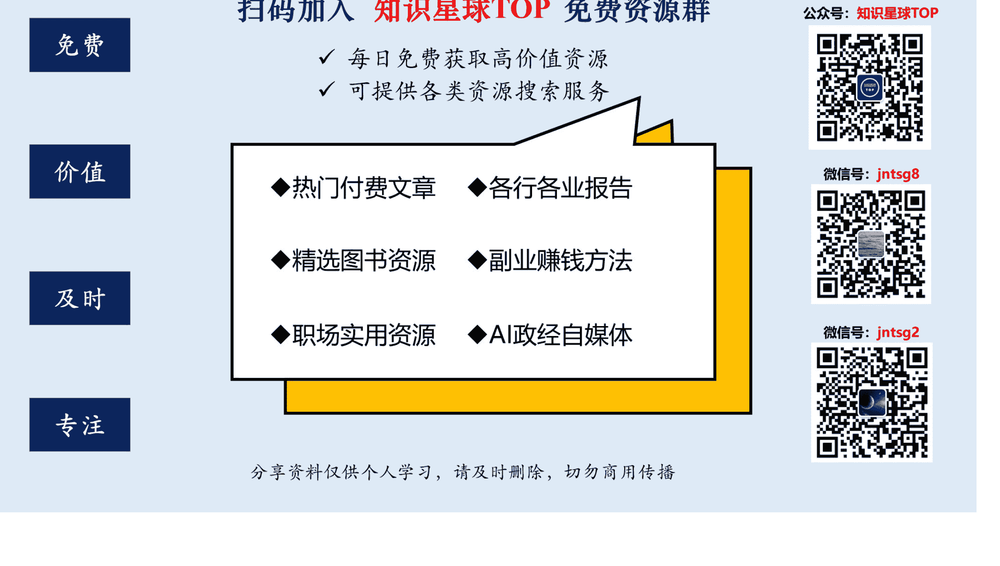
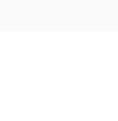
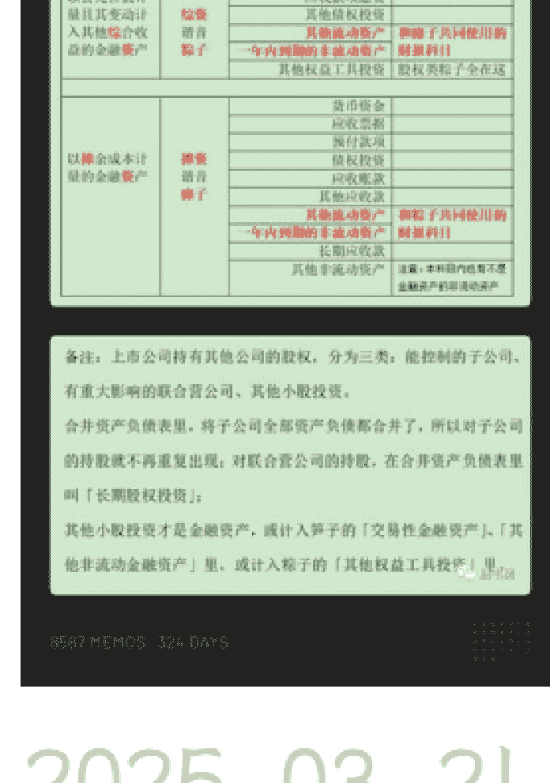

# 半隐书院星球 250321

财神爷爷  
2025-03-21 12:29

万能的半隐圈！求指点！ 原文如下：我们自己的实际收益分析，与公认会计原则有所不同，尤其当这些原则必须在一个高度不确定的通货膨胀世界中应用时。（但是，批评这些会计原则比改进这些原则容易得多，内在问题已经是根深蒂固了。）我们拥有很多公司 100%的股权，从会计原则上说，我们完全控制了这些公司的处置权，但是它们的财报盈利并不能完全地反映在我们这里。

（所谓“控制”是理论上的，除非我们将所有盈利都进行再投资，否则原有的资产价值会发生巨大的损耗恶化。但这些再投资不可能取得接近市场资本回报率的回报率。）相比之下，我们也有一些仅持有少数股份的公司，它们的盈余再投资非常杰出，其所保留的资金还能为我们赚取更多的盈余。 这段关于控制的言论不明白！ 就是： 所谓“控制”是理论上的，除非我们将所有盈利都进行再投资，否则原有的资产价值会发生巨大的损耗恶化。但这些再投资不可能取得接近市场资本回报率的回报率。

加微信jntsg2，免费进资料分享群

## 市场资本回报率的回报率。 这段内容完全不知道说的啥？什么是控制？

所谓“控制”是理论上的，除非我们将所有盈利都进行再投资，否则原有的资产价值会发生巨大的损耗恶化。但这些再投资不可能取得接近市场资本回报率的回报率。

/C 透视盈余

财神爷爷·摘录于 2025/3/21

微信读书

## 唐朝

2025-03-21 12:58

巴菲特是说，虽然我们持有的公司，有些是“控制类”，也就是并表的控股子公司和全资子公司，控股子公司通常指持股超过50%但不是100%（大部分是80%多一点点），全资子公司就是100%股份均有伯克希尔持有。 这段股东信的原文，表达的含义是指，虽然我们的控股子公司和全资子公司，从会计角度来说，是我们（我和查理）掌控的，但其实主要经营和决策，还是该子公司的管理团队决策的。 如果这家子公司因为市场规模限制或者管理层能力圈的问题，无法找到扩大再生产的机会，也没有合适的地方将源源不断的资金再投入，最终不管这钱是投错地方了，还是说存银行了，它们都在贬值，伯克希尔股东都在受损，这并不因为从会计上说属于伯克希尔，就是更有价值的资产。

而，那些我们不能控制的公司，也就是因为持股比例问题，归为联合营企业，或者金融资产的（笋子和粽子）——举例说就是苹果，可口可乐，运通等，虽然法律和会计意义上，

这些公司赚的钱，留在账上没有分给伯克希尔，伯克希尔无法掌控这些钱。但只要这些公司的 CEO 能够明智的投资，他们所产生的高额回报，依然是归属于我们的。一点儿也不比那些我们从法律和会计上能“控制”的子公司账上的钱差。这个会计规定，我们没有能力改，但大家应该知道这一点，在会计分类上不同的公司，为我们产生和金钱，都是一样的。

## 以下是评论：

佐渡：会计只是一门语言，看懂它，看懂背后的真相。

2025-03-21 13:02

唐葫芦 回复 佐渡：伯克希尔控股的子公司，产生的多余现金流，不是都交给总公司统一安排吗？

2025-03-21 18:40

脩一：我答对一半

2025-03-21 13:02

黑牛：都是利润来源

2025-03-21 13:02

武侃：透视盈余

2025-03-21 13:02

##### 阿根 回复 武侃：前两天还担心你没进来呢

2025-03-21 15:03

哈尼：无论控股还是简单持有，对于自由现金流来说，主要看投资回报～

2025-03-21 13:02

##### 地球绕圈使者：所以我们用透视盈余的方式来计算更合理，而不是用他们市值计算

2025-03-21 13:03

##### 若然：善于利用扩大资本的企业，我们没有控制权也乐意让他们自己去花钱；无法更好利用新增资本的企业，即使是我们完全控制的企业，我们也不乐意一堆钱在他们账上放着不动或者乱花。

2025-03-21 13:03

##### 小牛 回复 若然：师兄好

2025-03-21 17:15

王见子：all cash is equal 的理解更深了

2025-03-21 13:04

##### 连休一周：抽丝剥茧，感谢唐师解读

2025-03-21 13:16

小磊 Thinking: 核心还是新增资本的回报能力能否高过股东的机会成本。高过了即使不分红也能以公司整体增值的方式取得回报。反之亦然，也是对资本的毁灭。

2025-03-21 13:06

## 蒋小锐: 能产生真正的钱，拥有的形式就不重要了～

2025-03-21 13:04

michael: 老师来了 其实钱投在哪里，最后都要看回报率和再投资的机会。苹果投资十分成功, 好过 BRK 旗下很多的竞争力或者商业模式不够好的企业，因为 Cook 和团队很有能力，资本配置也做得十分好。

2025-03-21 13:05

## 西子 回复 michael: 男孩肌肉优秀

2025-03-21 13:06

michael 回复 西子: 最缺的就是肌肉啦，姐我明天就去举铁

2025-03-21 13:54

## Marco: 钱没生钱，就是浪费

2025-03-21 13:05

## 秀珍：无论是控制或是不控制，只要赚到真金白银，都有我的一部分

2025-03-21 13:05

Barry：真好，很通透

2025-03-21 13:05

继续前进!：一元钱产生不出超过一元钱应该产生的价值就是损耗和贬值

2025-03-21 13:05

西子：哈哈，您是财神爷爷，名副其实😂

2025-03-21 13:05

那一年（一卒而已）：咋让我想起了，国有资产是全体人民的，但决策权却没你的份儿

2025-03-21 13:05

马振东 回复 那一年（一卒而已）：如果还不分配给你，这个公司从根本上说也有价值

2025-03-21 13:16

小磊 Thinking：会计有局限性，有弊端，我们要做的不是直接摒弃它，丢掉它。 而是应该明白其局限性，带着镣铐也能跳舞😂

2025-03-21 13:06

## 忽然之间：‘中翻中’还得看老唐。讲得清清楚楚，明明白白。

2025-03-21 13:06

## 德制钢盔：解释得真清楚

2025-03-21 13:06

## 江南路人甲：熟悉的中翻中

2025-03-21 13:06

吟啸徐行：还是得老唐的中翻中。原文的翻译好烂，每个字都懂，串起来就不知道说什么了

2025-03-21 13:07

## 尔朵：公司留存的1美元，不论是否是控股公司，产生的价值都是一样的。

2025-03-21 13:07

云竹禅语：老唐这一中翻中解释，有点明白那段话的意思了

2025-03-21 13:07

阿圈：顶级中翻中，这么一补充，就非常好懂了

2025-03-21 13:08

## 童: 这也是为什么说要以收购者的角度去买股票的原因

2025-03-21 13:09

大均: 这样手把手教的胖胖老师去哪里找?

2025-03-21 13:12

李雷: 唐师这么中翻中的解释, 完全明白啦, 只要记住一点, 不管控制不控制, 都会按持有的股份比例给我们产生现金流

2025-03-21 13:12

又见蓝天: 公司帐上的钱虽然没有分红给股东, 但仍然属于股东。公司把这些利润再投入产生高额的回报, 就算永远不会分给股东, 但最终会反映在二级市场的价格上, 最后股东还是会获益。唐大, 不知道这样理解对吗?

2025-03-21 13:12

易生: 涨知识了

2025-03-21 13:12

dy: 信手拈来, 难题迎刃而解, 谢谢师傅解惑。

2025-03-21 13:14

## 定价未来：控制类的巴芒可以诱使管理层提高分红，把多余现金交给总部，来提高多余现金的使用效率。

2025-03-21 13:14

行者无疆：记得有这么一句话：创业的尽头是投资。 当我们没有能力亲自创立和经营好一家公司时，可以投资一家自己喜欢的公司，拥有它的部分股权，它带给我们的回报是一样的。

2025-03-21 13:15

Christie 推*：透视盈余

2025-03-21 13:17

虫虫的 W：清楚明白！

2025-03-21 13:18

聚友信钢铁：老唐功力深厚

2025-03-21 13:18

男版安迪：没有老唐的中翻中真的不好理解，这也是 all cash is equal 的另外一种表达吧

2025-03-21 13:18

关关：看懂了，我为什么喜欢看唐师写得文字？就是因为可以把专业的复杂的用平实质朴的语言表述出来，真得很容易懂。这种能力是怎么来的呢？

2025-03-21 13:19

## 澄清之境：钱放在账上仅能挣取微薄的利息，无法产生超额收益，是对资金的一个极大浪费，价值体现在资产收益率上！

2025-03-21 13:21

Y：回答的真透！

2025-03-21 13:21

D 调的华丽：看到从报表看企业背后数字的故事第四版，p99 页的东方时代，管理层犯错所有人买单。所以要看控股的管理人品，以及巴菲特的能否一美元的留存收益挣回一美元。

2025-03-21 13:23

LLG：还得老唐的“中翻中大法”，第一次读的确也没有看明白，一看老唐翻译后再去看，就秒懂了。就像我们这些小股东，虽然对所持有公司没有“控制”权，但是只要公司赚取的是真金白银就可以了！

2025-03-21 13:23

格致：我的理解，不同公司多余的钱，在不同的会计分类上，产生的金钱是不一样的。

2025-03-21 13:25

小马：选择企业，一看生意模式有没有护城河，模式够不够好，另外看管理层对待自由现金流的态度和能力。

## 泊武：不管你是联合营或并表（权益法），还是金融资产（公允价值），如果你的资产不增值就是价值毁灭，如果你的资产增值了，不管你是揣前兜儿还是揣后屁股兜儿，都是你的

2025-03-21 13:26

一粒尘：我理解这段话阐述的意思是：公司是否将全部利润分红给股东，不能作为判断公司好与不好的简单标准，而应该比较再投资的回报率。

2025-03-21 13:26

##### 财神爷爷：[星主解答！]

2025-03-21 13:28

##### 付立群：[让大家顺便复习一下笋子和粽子，瘫子]

2025-03-21 13:31

##### 葫芦娃 回复 付立群：哈哈，谢谢，手财看到这里一直很懵，图片收藏起来

2025-03-21 15:53

周明芃：这感觉就是巴菲特对于买股票就是买公司的理解 如果说这家公司是他们控股的公司甚至是全资拥有的公司，因为他们对于这家公司没有直接管理的能力，还是把它交给了子公司管理者， 如果子公司的管理人没有办法对这家企业来进行恰当的管理和运用，或者说配置资产出现的失误， 巴菲特和芒格没有办法对这家子公司进行任何改善，不会起死回生， 如果说是他们买的股票，即使是他们只是持有这家上市公司的一部分，那么他们依然享有他们所对应份额的利润。 就像巴菲特所说，他宁愿持有“希望之星”——全世界最大的钻石的一小部分份额

##### 友谊：小马投资肯定比我做得好

2025-03-21 13:37

## 知足君：非控制类的小股不就像我们现在对于阿茅小企鹅一样吗，虽然我们不能影响啥，但他们赚的钱即使在账上也有我们的一份，这是老巴说的透视赢余

2025-03-21 13:38

## 红树林: 控制与不控制, 产生的钱是一样的。

2025-03-21 13:39

素菊: 无论是以何种方式投资的企业, 只要企业赚了钱, 我们股东就赚钱了。胖胖中翻中, 一看就明白了, 省了好多头发

2025-03-21 13:41

老米2019: 来盘硬菜 有那么点点 all cash is equal 的意思

2025-03-21 13:44

morning: 就问你值不值? 太幸福了好不好

2025-03-21 13:49

拳道(王): 老唐讲的通透

2025-03-21 13:52

王不拉: 一切以企业经营为出发点, 会计只是一个记账手法

2025-03-21 13:53

carefree: 顶级中翻中

2025-03-21 13:59

Echo: 有老唐的中翻中, 实在是太幸福了。那老唐说的这条我们在看公司财报的时候, 也可以作为评估公司的优劣的标准之一: 一

## 公司因为市场规模限制或管理层能力圈的问题，无法找到扩大再生产的机会，也没有合适的地方将源源不断的资金再投入，最终不管这钱是投错了地方，还是存银行了，它们都是在贬值。 但只要这个公司的 CEO 能够明智投资，他们所产生的高额回报，依然是属于我们的。

2025-03-21 14:06

shadow: 根据老唐的回复，我的理解是这段话在阐述会计准则意义上的控制与否与股东盈余处理效率此二者之间的关系。也就是说，无论是否控制，能有效处理盈余（再投资产生良好回报率）的企业，无论是否控股，其产生的利润都对属于都是更有价值的，对应股权部分的财富都是属于我们的。否则，哪怕即使控股，但资金的低效使用，对我们都是有损害的。

2025-03-21 14:12

土龙木: 伯克希尔旗下所有的子公司理论上是巴菲特在资产配置，但管理层有一定的权限，所以当有一些资产再投资回报率很低时，是损害伯克希尔的收益的。 买入的非控股公司，不管是联合营企业，还是金融资产，只要资产配置高，对伯克希尔的收益也是有利的。

2025-03-21 14:12

漫步云端: 是不是透视盈余？

2025-03-21 14:12

## guicy：老唐考虑真周到，设身处地为大家着想

2025-03-21 14:13

虫虫的 W：记住了

2025-03-21 14:23

Four - 唐书房的小喽啰：只要是确定有价值的，它分在哪里是无所谓的

2025-03-21 14:23

钟小亮：可以用巴菲特最喜欢用的透视盈余来思考这个问题，联合营公司虽然不并表，但是只要公司正常经营，利润增长，这些增长的利润就会体现在伯克希尔的透视盈余中。

2025-03-21 14:26

BLue：控不控制不重要，管理团队能否明智的使用才是王道

2025-03-21 14:30

小郑（重庆）：现实中，如果自己创业成立公司，自己可以控制。但如果赚钱能力没有腾讯，茅台，分众，还不如投资这些不能控制的上市公司。

2025-03-21 14:36

## 家有美羊：终于明白了什么是粽子什么是笋子，不管什么资产，只要持续能赚钱，就是好资产。

2025-03-21 14:46

启帆：能否这样理解，在会计上虽然是子公司，但由于经营及投资决策不在二老，那实质上和非控制类公司是类似的，关键还是看公司自身对这笔钱的运用是否合理

2025-03-21 15:06

倾心：所以当控股子公司没有更好的投资机会时，账上的钱是不是发分红给股东，让股东自由去支配是更好的选择

2025-03-21 15:08

jimmy：如果参股是上市公司，流动性更好，遇到便宜货机会更大

2025-03-21 15:29

owen：中翻中还得看老唐

2025-03-21 15:42

林石：所以对于投资公司的时候，对于管理层过往配置闲置资金的能力需要有一个了解。

2025-03-21 15:48

## 天然气发动机配件~于*: 感谢唐师的中翻中

2025-03-21 15:48

清莲: 我们所得只与企业本身的未来现金流的折现有关, 也就是只与企业本身的价值有关。与是否对其控制, 或其它方面无关。

2025-03-21 15:54

## A 疯人院的歌颂者: 老唐请教您一个问题: 您在《投资研习录》p425, 留的思考问题: 关于职业规划你和二老自始至终从未提过对薪酬高低的考虑, 为什么? 理解: 后面《伯涵》大神留言: 是因为我们一生中全部的收入, 最开始几年收入所占的比重是极其微小的。我的疑问: 不管是您还是二老, 前几年占一生的收入比重都是微小的原因, 那是因为复利的长期作用, 如果在开始复利的时候手握的资金更多不是更有力吗? 第二个是现实中很多人无法在人生职业规划上按照兴趣来, 是不是也可以理解没有长期思维, 更多的是看中眼前的三瓜两枣。

2025-03-21 16:24

戳锅漏 BearG: 不管控不控制, 主要还是要确保资本的高效利用。 不能控制的, 我们找那些值得信任的。 能控制的, 我们和管理层约定资金利用水平与绩效的关系, 鼓励资本在内部流动。

2025-03-21 16:40

## 南山：不管是全资子公司，联营，还是股权投资，投资形式不重要，重要的是公司对利润的再利用效率如何

2025-03-21 16:47

##### 随遇而安：中翻中届的天花板

2025-03-21 16:49

价值探秘者：源源不断产生自由现金流的公司，不管是子公司，还是联合营公司，赚的钱都一样的，令人愉快

2025-03-21 17:28

史岭：谢谢老唐解惑

2025-03-21 17:45

Leo：老唐这么一翻译，确实就容易理解多了

2025-03-21 18:06

吴飞：我持股的公司就是“我的公司”，把公司所有资产按照持股比例折算成一个100%持股的全资子公司。

2025-03-21 18:35

衡：还是老唐的中翻中看着对味

加微信jntsg2，免费进资料分享群

##### 扫码加入 知识星球TOP 免费资源群

+   - 每日免费获取有价值资源  
- 可提供各类资源搜索服务  

+   ◆ 热门付费文章  
◆ 各行各业报告  
◆ 精选图书资源  
◆ 副业赚钱方法  
◆ 职场实用资源  
◆ AI政经自媒体  

公号：知识星球TOP  
微信号：jntsg8  
微信号：jntsg2

  
  
  

分享资料仅供个人学习，请及时删除，切勿商用传播