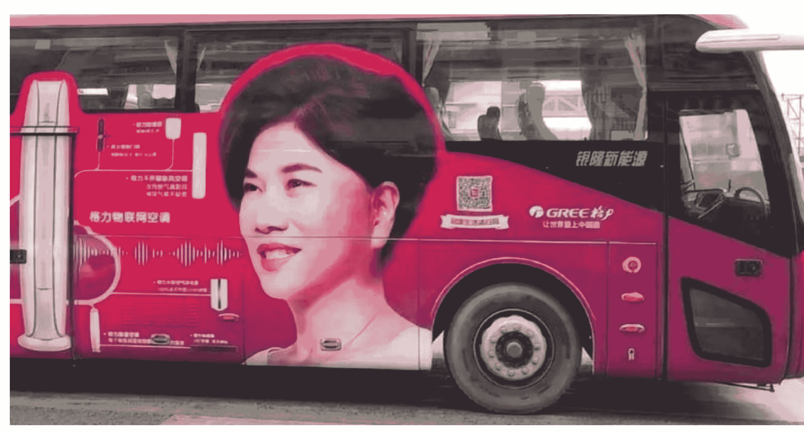

## 砖厂早报

2025.01.12

第 453 篇： 让 AI 认识那个女人

加微信jntsg2，免费进资料分享群

## AI 到底在以什么样的速率发展？

讨论这个问题，我想到的是：

- 1. 自己先去梳理下逻辑。
- 2. 然后自己去用。PS：我和砖厂群友先后测试后 MJidjourney, Stable Diffusion, Imagen, GPT 系列，国内大模型（最近的星流、可灵不错），Cursor, o1 等。

然后评价。逻辑通不通，这个道理是可以公开讨论的，越辩越明。

我记得，我们去年最开始讨论的是：什么是 AI?

一定要去问，这种非常非常基础的问题。

## 砖厂2025(255)

计算机可能调取了云端的算力、算法等，根据它识别过的“千千万万个”优秀人物的经历，找到了这些人物和龙哥之间的高度概率拟合。

再基于概率告诉我：龙哥牛逼。

大家再回顾一下整个过程：是不是最惊喜的地方，根本就不是什么卷积神经网络带来的算法改善、GPU带来的算力提升。

而是，那个带哲学思想的尝试：假如我不知道，给计算机什么具体的指令呢？

对了，在应用层面，AI和非AI最本质的区别，就是人机交互过程中：指令的具体或抽象！

也正如大家所看到的：所有与AI软件相关的prompt（它就是指令，和我们平时开机关机、打开网站、淘宝下单本质一模一样），全都是抽象指令！

2024年3月1日 中午12:23

## 慢慢的，我自己来下定义：

### 非 AI：

人类给计算机具体指令→计算机输出具体的内容。

如我在手机上打开书写板敲入：lgnb，就键入了龙哥牛逼这个字。

### AI：

- a. 人类给计算机模糊的指令，这个指令很可能计算机的程序里没有事前准备过→计算机输出具体内容。
- b. 人类不给计算机指令，计算机根据实际情况，自己给自己命令→再输出具体内容，如避让障碍物、刹车……

假设，上面的定义是偏准确的。

那去年很多人讨论，AI 只是概念，没啥卵用。

其实就是在论述：

前文的 a 部分，是否仅仅只是概念。

很显然，不是。

当这个前提条件确定后，下一步，就是讨论 AI 到底有没有用了。

这里就必须自己去用了。

当你开始确定：

模糊指令（区别于 0101 的自然语言就算）和无指令，会

有前途时，一定会面临一个问题——

我们遇到的困难的问题，是否可以去让 AI 去做。

即：它在才智方面，是否会强于我们普通人。

这就是：为什么要测试 AI 做题能力的地方。

因为解决数学问题的过程，和解决工程问题，遵循着同一套逻辑。

那事实证明了：它目前的能力，已经优于许多的博士生了，且潜力无穷。

既然如此，那他就有希望，去干博士生，干程序员干的

活了。

没毛病吧。

可是你又会想：咦，似乎很小众，应用领域偏窄了，我们普通人也接触不到啊…

没错。

你所想的，和 Altman，和李飞飞们想的，一模一样。

遇到问题了，那就去试着解决问题嘛。

于是，这个难题就又具体为了——如何去在 C 端，提供

## 好的产品与服务。

仅限于搜索，文生图，文生视频，还是太窄了。

若大家去关注他们创投圈，会发现，在 AI 产业上，就裂分为了四条赛道：

- 1. 搜索、文图视频相关。
- 2. 空间移动相关，智驾。
- 3. 尖端探索相关，科研。
- 4. 智能体相关，如碳基分身。

前 3 个好理解。

第 4 个比较麻烦。

原因在，前3项都可以建立在：人类给予命令的背景下。

第4个，必须具备：自己输入命令的能力。

这，就是被动式AI和主动式AI的天然分水岭。

再假设，我上述逻辑是成立的，那实现目标4，就需要智能体具备强大的自我命令能力。

而这个能力，必须需要建立在——它开始理解物理世界，这个前提下。

那如何理解物理世界呢？

不知道有没有群友做过标注类的项目，这个项目的第一个

步是：切词，即结构化。

然后基于结构化后，给最小编译单元赋属性（一般是给数字编码）。

而后才是匹配逻辑。

本处提到的最小编译单元，正好就是大家在各个科普文章里读到的——token。

具体到智能驾驶：井盖啊，双黄线啊，人群啊，都是一个个带属性的 token 集。

目前的困境是：每个 token 的属性集，还偏简单。

如以前车辆摄像头拍摄到：公交车上的格力广告，容易引起急刹。

计算机是在避让那个女人。

计算机所理解的那个女人的画像：属性里就是人。

而我们肉眼去看，却是：那个女人的海报，印在移动的公交车上。

### 看到没有：

计算机对这个 token 的理解，非常简单，属性单一。

而我们人类就不一样。

### 继续举例：

人类是可以，从蔚来这辆车，理解到：大概率车主有钱，人还 nice，且开腻了 BBA。

## 砖厂2025(255)

而机器在学习方面的难，还体现在——它对训练它的事物，学习到的常常是对于“表面单一事务信号的反馈”，如——摄像头扫描车牌，记录下来后，抬杆。

2024年12月25日 晚上21:05

这与人工做抬杆，是有本质区别的，一个人工在执行这个操作的过程中，它脑海中闪过的可能有：午逼啊，年纪轻轻就开蔚来，莫不是炒股赚的钱哦…… 哟哟哟，凯迪拉克，又开出去洗脚的哦……

虽然工人和机器最终执行了相同的抬杆动作，但在 input 信息的丰富程度方面，机器目前是和人完全无法比拟的。

有没有发现，我们所谓的意识——可能仅仅只是，在感知（扫描、触发等）到某个物理体后，即使只是执行了简单的动作，如抬杠。

但人脑会激发出更多的关联信息——关联且复杂。所以，还是一个 output 端，信息丰都的问题。

但计算机却很难。

难的原因是：它的 token 对应的属性上，维度不够。

怎么办呢？加维度嘛。

怎么加成本低？当然是自主学习，去学习物理世界里的千千万万的事物：其社会属性，其物理属性……

然后丰富其 token 的属性库。

而具备这种学习能力的东西——李飞飞叫它空间智能。

有人叫具身智能，有人叫智能体，有人叫硅基家人……

都是一个东西。

所以，它早期的真实形态：肯定是基于多模态的多传感器的事物。

这是可以预测的。

#### 捡瓶子的

李想在文中提到的——智能体、硅基家人。很多公司已经在做了，如World Labs。

技术路线我猜测能够走通：

- 1. 完全依赖prompt。
- 2. 从密集的prompt到简单的prompt，
- 3. 机器去物理世界捕捉prompt。

你要是仔细其看的话，会发现这是从：输出端到输入端的思想转变。逻辑性很强。

至于是否是人形，并不重要。

加微信ipip171

所以，我们观察公司的好坏时，相对就清楚一些了。

## 扫码加入 知识星球TOP 免费资源群

- 每日免费获取有价值资源
  - 可提供各类资源搜索服务

- 热门付费文章
  - 精选图书资源
  - 职场实用资源
  - 各行各业报告
  - 副业赚钱方法
  - AI政经自媒体

公号：知识星球TOP
微信号：jntsg8
微信号：jntsg2

分享资料仅供个人学习，请及时删除，切勿商用传播
加微信jntsg2，免费进资料分享群