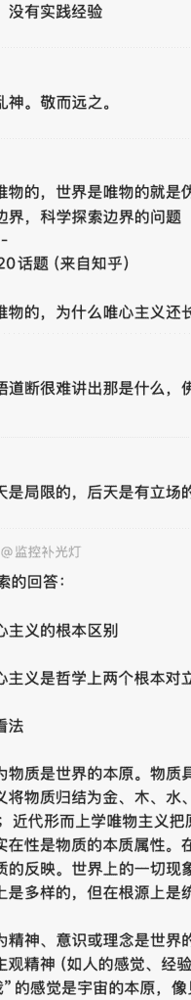
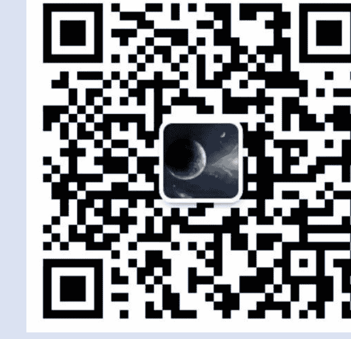

# 都知世界是唯物的，为什么唯心主义还长盛不衰？

因为唯心不需要实证，精神到，自圆其说就行了。

# 各位同学可以参考毛主席的辩证唯物论学提纲一书。

李的书读法比较详细，书名我没记了，这二本中国写的哲学著作很奇怪懂。请张长和诸位同学电子版到各学习班，看看书读得很有意义的生活。谢大家。

不是李学的这本书，好像也是叫什么大病的……社会学大学什么的名字。

## 一、唯物与唯心主义的根本区别

对世界本质：认为物质是世界的基础，物质具有客观性，不依赖于人的意识存在。例如古代朴素唯物主义将水、火、土等视为基础；近代形而上学唯物主义则强调原子等不可分割的物质；辩证唯物主义认为世界的本原是物质，意识是物质的反映。

唯心主义：认为精神、意识或理念是世界的本质。包括主观唯心主义（如贝克莱的“存在就是被感知”）和客观唯心主义（如黑格尔的“绝对精神”）。

### 对物质与意识的见解

唯物主义：坚信物质是客观存在的，不以人的意识为转移。即使人们没有感觉到它，它也依然存在；如果不存在，就不会有感觉。

唯心主义：有的观点认为物质并非客观存在，而是由精神创造出来的；或者认为物质依赖于精神的存在。

### 对于神的观点

唯物主义：认为世界上没有神，所有的事物都是自然演化的结果。

唯心主义：部分观点认为神存在并创造了万物，神是万能的，比如宗教观念中的上帝。

## 二、唯心主义长盛不衰的原因

人类认知的主观性与局限性

我们观察和谈论的世界建立在感官和大脑基础之上，而感官和大脑本身具有主观性。例如，有人看到彩虹的颜色不同，这是因为每个人的视觉感受不同。

### 满足心理需求的优势

宗教文化方面：唯心主义在宗教中占据重要地位，为很多人解答了重大问题，提供了解决方案，带来精神慰藉。

对幸福的另一种追求角度：唯心主义关注内心幸福，提供精神寄托，帮助人们在困境中获得安慰。

### 哲学认知的二元对立与思维传统

唯心主义和唯物主义是哲学上的两个基本派别，它们在历史发展中形成了对立关系，这种对立推动了哲学的发展。

## 三、世界的唯物性质与唯心主义存在的关系

### 矛盾对立关系

唯物主义认为世界本质是物质，意识是派生的；唯心主义认为意识先于物质，物质依赖于意识。

### 相互依存关系

唯物哲学发展历程中，唯物主义与唯心主义互相影响，共同推动哲学进步。

## 四、不同文化中唯心主义的表现及影响

### 宗教文化方面

在基督教文化中，存在强烈的客观唯心主义色彩，认为人们的道德观念和社会秩序。

### 现代文化中的表现与关联

在现代西方文学艺术中，意识流成为重要流派，体现唯客观结合的特点。

### 宗教与智慧

佛教文化中唯心主义思想，强调“方法心道”，以自身精神修养提升境界。

### 传统文化的影响

中国古代思想（这里可能没写完，需要继续处理）

# 免费
# 价值
# 及时
# 专注
# 扫码加入 知识星球TOP 免费资源群

+   ✓ 每日免费获取有价值资源

+   ✓ 可提供各类资源搜索服务

+   ◆热门付费文章

+   ◆各行各业报告

+   ◆精选图书资源

+   ◆副业赚钱方法

+   ◆职场实用资源

+   ◆AI政经自媒体

分享资料仅供个人学习，请及时删除，切勿商用传播