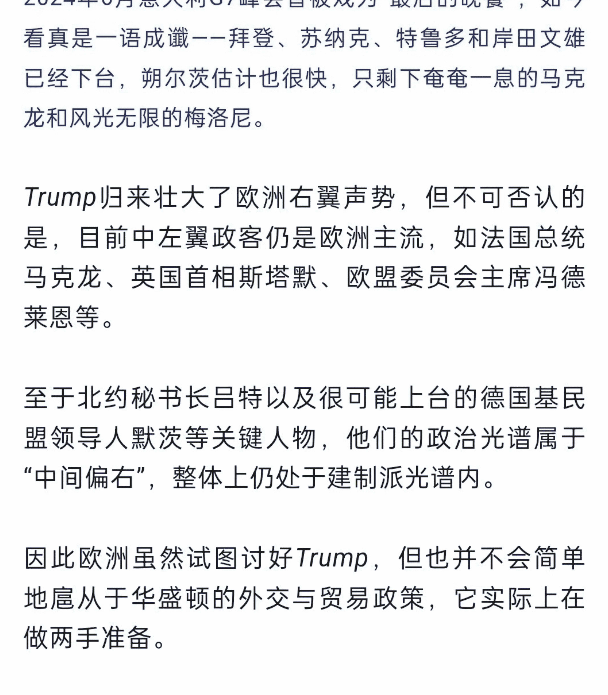
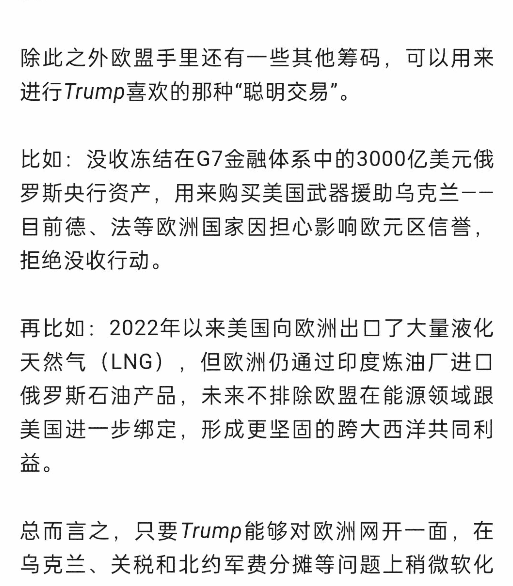

以欧盟为例，布鲁塞尔应对Trump归来和中美战略竞争大局的“上、中、下”三签其实已基本拟定。

# 二签：给白宫交“投名状”，联美制华

Trump对欧洲盟友显然不如拜登友善，所以有一种观点认为，美国新政府对欧盟贸易的强硬立场可能会推动欧盟与中国走得更近。

这种说法固然没错，但需要注意的是，欧盟首先将穷尽所有办法“讨好”Trump，走投无路才会寻求其他路径。

Trump当选后，除即将要举行大选的德国外，其他欧洲国家几乎全部表达了示好意愿，政客们以“谁能进海湖庄园”“谁被邀请参加就职典礼”作为最大外交成绩。

截至目前，Trump见过的欧洲领导人包括匈牙利总理欧尔班、波兰总统杜达、法国总统马克龙、乌克兰总统泽连斯基、意大利总理梅洛尼以及北约秘书长吕特。

其中欧尔班和梅洛尼受邀参加了就职典礼，极大拉抬了二人在国内及欧盟内部的政治地位。

除为了斡旋俄乌和谈亲赴法国见马克龙（组局者）和泽连斯基（当事人）外，其他跟Trump走得比较近的欧洲领导人均为典型右翼领袖。这种安排侧面印证了Trump非常重视价值观一致，即使对盟国也不例外。

2024年6月意大利G7峰会曾被戏为“最后的晚餐”，如今看真是一语成谶——拜登、苏纳克、特鲁多和岸田文雄已经下台，朔尔茨估计也很快，只剩下奄奄一息的马克龙和风光无限的梅洛尼。

Trump归来壮大了欧洲右翼声势，但不可否认的是，目前中左翼政客仍是欧洲主流，如法国总统马克龙、英国首相斯塔默、欧盟委员会主席冯德莱恩等。

至于北约秘书长吕特以及很可能上台的德国基民盟领导人默茨等关键人物，他们的政治光谱属于“中间偏右”，整体上仍处于建制派光谱内。

因此欧洲虽然试图讨好Trump，但也并不会简单地屈从于华盛顿的外交与贸易政策，它实际上在做两手准备。

近日有媒体披露，欧盟私下承诺将与白宫新团队在中国问题上紧密合作，但这种合作只有在美国不对欧盟实施关税的情况下才有可能。

简单点说，冯德莱恩主导的欧委会认为，给Trump最有效的投名状是接下来四年与美国共同对付中国，无论是南海、台湾还是高科技、经贸。

除此之外欧盟手里还有一些其他筹码，可以用来进行Trump喜欢的那种“聪明交易”。

比如：没收冻结在G7金融体系中的3000亿美元俄罗斯央行资产，用来购买美国武器援助乌克兰——目前德、法等欧洲国家因担心影响欧元区信誉，拒绝没收行动。

再比如：2022年以来美国向欧洲出口了大量液化天然气（LNG），但欧洲仍通过印度炼油厂进口俄罗斯石油产品，未来不排除欧盟在能源领域跟美国进一步绑定，形成更坚固的跨大西洋共同利益。

总而言之，只要Trump能够对欧洲网开一面，在乌克兰、关税和北约军费分摊等问题上稍微软化一下态度，冯德莱恩等欧盟内部的亲美派就有信心说服大家协调一致，继续“联美制中俄”。

假如Trump冥顽不灵，一定要对俄罗斯让步、对欧盟施加关税，并揪着北约军费问题不放，那欧盟才会考虑用中欧关系去撬动美欧关系。

对此我们要有清醒认识。

# 特朗普称北约国家应将GDP的5%用于国防

近日有媒体披露，欧盟私下承诺将与白宫新团队在中国问题上紧密合作，但这种合作只有在美国不对欧盟实施关税的情况下才有可能。

简单点说，冯德莱恩主导的欧委会认为，给Trump最有效的投名状是接下来四年与美国共同对付中国，无论是南海、台湾还是高科技、经贸。

除此之外欧盟手里还有一些其他筹码，可以用来进行Trump喜欢的那种“聪明交易”。

比如：没收冻结在G7金融体系中的3000亿美元俄罗斯央行资产，用来购买美国武器援助乌克兰——目前德、法等欧洲国家因担心影响欧元区信誉，拒绝没收行动。

再比如：2022年以来美国向欧洲出口了大量液化天然气（LNG），但欧洲仍通过印度炼油厂进口俄罗斯石油产品，未来不排除欧盟在能源领域跟美国进一步绑定，形成更坚固的跨大西洋共同利益。

总而言之，只要Trump能够对欧洲网开一面，在乌克兰、关税和北约军费分摊等问题上稍微软化一下态度，冯德莱恩等欧盟内部的亲美派就有信心说服大家协调一致，继续“联美制中俄”。

假如Trump冥顽不灵，一定要对俄罗斯让步、对欧盟施加关税，并揪着北约军费问题不放，那欧盟才会考虑用中欧关系去撬动美欧关系。

对此我们要有清醒认识。

# 特朗普称北约国家应将GDP的5%用于国防

Trump目前处于狮子大开口的阶段。欧洲国家普遍财政困难，马克龙甚至不惜得罪选民也要搞延迟退休，把国内开支提升至GDP的5%对绝大多数欧洲国家来说根本不现实。

# 中签：继续沿着‘拜登路线’前进

有没有可能欧盟在对美示好受挫的情况下仍拒绝改善对华关系呢？

当然存在这种可能，未来四年欧盟保留了‘坚守待变’的选项，即两边均不做妥协，继续沿着‘拜登路线’前进，等民主党归来。

历史表明，欧洲与Trump合作的任何努力都将是场艰苦战斗。

2018年4月，法国总统马克龙曾向Trump提议称，‘让我们一起努力，我们都面临中国问题’。

怎料Trump丝毫不领情，回怼说欧盟‘比中国差’，并继续对德国和欧洲汽车大发雷霆。

这一点其实就是经济鹰派与战略鹰派的根本不同，前者不允许盟友在与美国保持战略一致的过程中额外争取经济利益。

| 保守主义 | 古典自由主义 | 进步主义 |
| --- | --- | --- |
| 经济鹰派 | 可持续发展 | 战略自主 |
| 不允许盟友额外经济利益 | 强调国际规则 | 推动全球治理 |
| ... | ... | ... |

# 免费

# 价值

# 及时

# 专注

# 扫码加入 知识星球TOP 免费资源群

+   ✓ 每日免费获取有价值资源

+   ✓ 可提供各类资源搜索服务

+   ◆ 热门付费文章

+   ◆ 各行业报告

+   ◆ 精选图书资源

+   ◆ 副业赚钱方法

+   ◆ 职场实用资源

+   ◆ AI政经自媒体

分享资料仅供个人学习，请及时删除，切勿商用传播