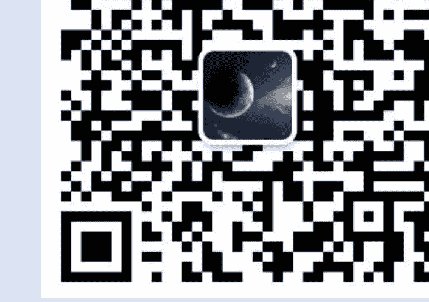

## 1.22 话题 (来自同学)

一
你有哪些思想（受到几十年的学校教育的影响，根深蒂固），经历社会检验后，发现:
跟现实实际社会生活脱节，甚至完全背离。
比如，每次学校考试都有确定性标准答案，但社会没有确定性答案，而你总是从心里想要有确定性，由此你感到难受，不舒服，甚至无所适从！
再比如，学校教育告诉你：有了条件A，按部就班后才能出现结果B，但其实社会是：没有条件A，一样可以出现结果B！

二
这些已经刻在你骨子里的固化了的思想习惯，发现不适应社会后，你是如何去转变的？

星星
有个非常典型的好学生路径依赖就是：听领导的努力就会有回报。
这是新手村和开放世界的区别。
学校是按部就班的新手村。会有各种NPC给你发布任务。
开放世界则不然，开放世界是没有固定的NPC给你发布任务的，也不是一个任务完成就有奖励的正反馈。
除了你妈关心你结婚没有，人们并不关心，只是想八卦一下。
有个学生心态到职场心态的转变。
越早完成，心智越成熟，越容易在社会上成功。

星星
book smart和street smart的区别。都要会，都要有。

也无风雨也无晴
刚才回想了下，总体上我做了很多正确的选择，所以跟当年的同学同事拉开了差距。
但也有很多观念上的问题，导致没有大成！
1) 掌握了很多过去的、无用的、有害的知识。
2) 一些不利于发展的道德规范约束了行为。

举几个例子
1) 如：把阅读时间花在了孙子兵法、中国哲学史、国学概论、中国历代政治得失、中国近代史、中国思想史等这些书籍上，几十年过去了，发现真正有用的是现代的营销、设计、组织、技术、项目管理等知识，历史的看似牛逼的知识，其实只能用来吹牛逼，而且有害。
2) 如：不能抄袭，这个像道德规范一样约束了我，也影响了我。回头看，抄袭其实是对的（只是某些场景不能抄袭），所有东西都是在继承的基础上发展的，就是要大胆的抄袭他人！莫奈与毕加索的画、乔布斯的MAC/ipod、比尔盖茨的office、雷军的SU7都是这么干的。

「遨游之舟：1.22 话题 (来自同学)」

一
你有哪些思想（受到几十年的学校教育的影响，根深蒂固），经历社会检验后，发现：
跟现实实际社会生活脱节，甚至完全背离。
比如，每次学校考试都有确定性标准答案，但社会没有确定性答案，而你总是从心里想要有确定性，由此你感到难受，不舒服，甚至无所适从！
再比如，学校教育告诉你：有了条件A，按部就班后才能出现结果B，但其实社会是：没有条件A，一样可以出现结果B！

二
这些已经刻在你骨子里的固化了的思想习惯，发现不适应社会后，你是如何去转变的？

斗战胜佛
前者是务虚，后者是务实。

务虚自己说出去就完成了，
务实要在现实社会做出来，并成功太难了！

--------------------------

「也无风雨也无晴：刚才回想了下，总体上我做了很多正确的选择，所以跟当年的同学同事拉开了差距。
但也有很多观念上的问题，导致没有大成！
1) 掌握了很多过去的、无用的、有害的知识。
2) 一些不利于发展的道德规范约束了行为。」

举几个例子
1) 如：把阅读时间花在了孙子兵法、中国哲学史、国学概论、中国历代政治得失、中国近代史、中国思想史等这些书籍上，几十年过去了，发现真正有用的是现代的营销、设计、组织、技术、项目管理等知识，历史的看似牛逼的知识，其实只能用来吹牛逼，而且有害。
2) 如：不能抄袭，这个像道德规范一样约束了我，也影响了我。回头看，抄袭其实是对的（只是某些场景不能抄袭），所有东西都是在继承的基础上发展的，就是要大胆的抄袭他人！莫奈与毕加索的画、乔布斯的MAC/ipod、比尔盖茨的office、雷军的SU7都是这么干的。

赤子本心
“你说得道理，我知道”； 
“他做这样的生意，不就是说：低买高卖赚差价嘛，有什么了不起的”； 
“毛选我都看过好几遍了，这不就是毛选上说的某某某嘛”
➔
1. 大道至简，这话没错，知道这个道理，并不等于你能做出来。
生意归根到底是一买一卖，我想每个人都知道，但有多少人赚很多钱的！
彩票，几乎人人都知道：每次会开出几注百万的一等奖。
但知道归知道，具体到个人，有几个人中一等奖的。
所以，理论，道理都正确，即便你都懂，也并不代表什么！
2. 造成自己虚假的牛逼感。
觉得懂得了“大道至简”真理，天下事我都懂了，其实不过是“百无一用”书生。

Z_DK
😂毛选还说 纸上的东西并不等于现实的东西，事实证明，要把他变成现实的东西，还要经过很大的努力

赤子本心
问题就在这里：
“纸上的东西并不等于现实的东西。”
单拿出来，我想，我们大多数人是知道这个道理正确的！
但是，一旦走进现实生活中的事件，我们便丢了现实，而拥抱了书上！
比如，公司里你和同事差不多入职的，你甚至比你同事还优秀，而领导却提拔了你同事，你就会觉得不公平（在你的潜意识里，学校教育告诉你，世界是公平的），你就会抱怨的，凭什么不提拔我而提拔他，这不公平！
你看，你既受到学校教育的影响，又把“纸上的东西并不等于现实的东西”忘了。

# 免费
# 价值
# 及时
# 专注
# 扫码加入 知识星球TOP 免费资源群

+   √ 每日免费获取有价值资源
+   √ 可提供各类资源搜索服务
+   ◆热门付费文章
+   ◆各行各业报告
+   ◆精选图书资源
+   ◆副业赚钱方法
+   ◆职场实用资源
+   ◆AI政经自媒体

公号: 知识星球TOP 微信号: jntsg8 微信号: jntsg2

分享资料仅供个人学习，请及时删除，切勿商用传播