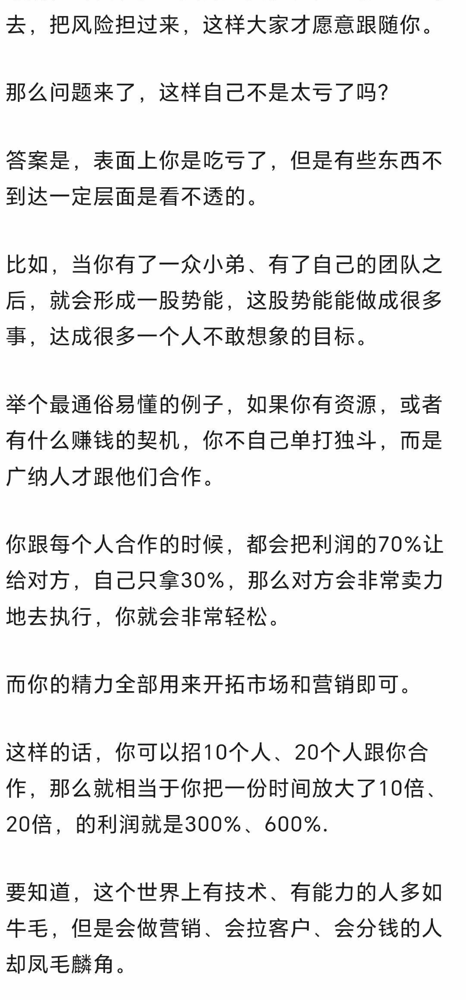

# 以太坊地址如何生成（示例文档）

本文介绍了从私钥、公钥到地址的生成流程，并结合常见工具说明在实际操作中的注意事项。

通常地址生成会涉及椭圆曲线算法、哈希函数和编码格式，不同区块链在细节上有所差异。

## 1. 地址生成基础

私钥是随机生成的 256 位数字，公钥可由私钥通过椭圆曲线乘法推导得到。

- 生成随机私钥
- 计算未压缩公钥
- 对公钥进行 Keccak-256
- 取后 20 字节作为地址

## 2. 校验与表示

以太坊地址一般以 `0x` 开头，EIP-55 通过大小写混合提供额外校验能力。

```
private_key -> public_key -> keccak256(public_key[1:]) -> address = last20bytes
```

> 请务必离线保存私钥与助记词，切勿在不可信环境中输入。

## 3. 常见问题

- 地址与公钥并非一一可逆
- 同一私钥可导出多个链上表示（取决于规则）
- 转账前应核对链网络与地址格式

| 项目 | 说明 |
|---|---|
| 私钥长度 | 32 字节 |
| 地址长度 | 20 字节（40 个十六进制字符） |
| 前缀 | `0x` |

在开发中可使用 Web3 库自动完成地址派生与校验，但生产环境仍建议增加多重验证。



以上内容适用于入门理解，涉及资产安全时请结合硬件钱包与冷存储方案。