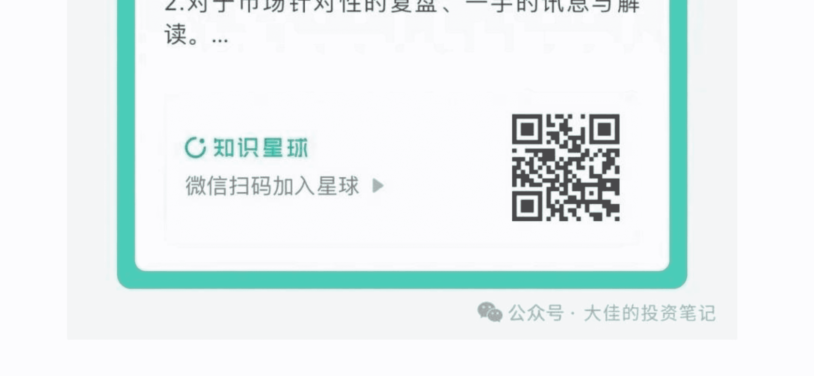
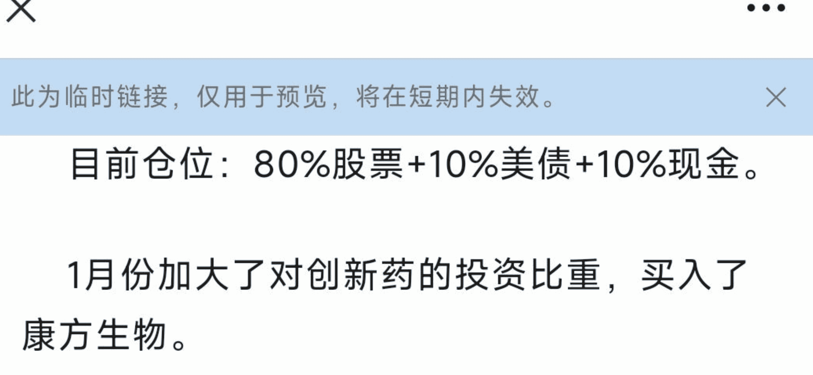

# 24年总结：当我用“弱者思维体系”重塑交易与投资。

皓大佳 大佳的投资笔记 2025年01月25日12:55

本文4500字 | 阅读时长约为9分钟

免责声明：本文是个人日记，不构成投资建议。

文中所有观点，仅代表个人立场，不具有任何指导作用

# 前言:

1. 本文4000字，分为八个部分:

+   1) 弱者思维体系的搭建.
+   2) 买在无人问津时.
+   3) A股组合1月的建仓与持仓.
+   4) 卖在人声鼎沸处.
+   5) 港股组合1月的建仓与持仓.
+   6) 长期资金入市对波动率的影响.
+   7) 衍生品持仓：从单卖走向双卖.
+   8) 2025年的计划与愿景.

2. 我们平时极少进行打广告，且我脸皮比较薄，不愿意主动征稿费。每月的付费文章，全当作大家平时对我每天的更新的打赏。感谢大家对我的支持~

3. 本文核心观点，已在我们交流群（知识星球：大佳和他的朋友们）分享。星球用户可以直接移步到星球阅读。

# 1，弱者思维体系的搭建

本篇是农历年最后一篇付费文。

一方面是对今年的交易进行回顾与总结，一方面是春节前同步以下我们现在的持仓。

在23年结尾，我写了一篇非常深刻的自我批判的文章。

参见：年终：对于自我的“官本位”思维模式，进行深刻的检讨。

在此之后，我们全面搭建了以“弱者思维体系”为中心的交易与投资体系。这个体系的核心思想是:

A股是一个充满了大量的内幕交易，以及不对称博弈的市场。因此，我们天然处于一种弱势的地位。我们要以弱者的身份和角度，来构建我们的交易与投资。

在弱者思维之下，我们总结了很多法则：

+   1) 永远不要参与，不占优势的博弈。
+   2) 成本优势，是所有优势中最重要的。因此，永远不要买贵。
+   3) 波动率是A股最珍贵的资产，交易体系之中必须包含着高抛低吸的思想。
+   4) 不要过度相信公开信息与自以为的内幕，位置比消息更重要。
+   5) 风格切换是A股永恒的主题，股票涨跌往往和基本面无关。
+   6) 不要追着涨停本身跑，更不要根据涨跌来思考底层逻辑。底层逻辑需要从短期波动之外构建。
+   7) A股定价，尤其是短期定价的有效性很弱。需要多个市场的数据交叉验证。

以上七条只是举例。以后再专门写弱者思维体系的时候，可以做更深入的探讨。而我们24年，就是严格按照弱者思维体系，重新新建了我们长期交易组合的逻辑与交易细节。

我们将组合名称定为：买在无人问津时。

最终，这个组合在2024年的表现如下:

之后，我们继续按照“弱者”逻辑，深度学习了量化和etf的成熟模式，发布了四个指数：红利20指数，出海20指数，回购20指数，降息20指数。

这四个指数不只是股票池，也可以被用来对市场风格的监控。从而及时的捕捉市场的风格切换。

再之后，我们按照这个逻辑，构建了港股的交易组合。定名为：卖在人声鼎沸时。

除了A股和港股之外，我们在10月波动率暴发之后，捕捉到了波动率交易的机会，开始启动了衍生品的交易。

今天，将会对我们A股，港股，和衍生品三个方向的交易进行总结，并公布节前的和持仓，说明我们的思路。

# 2，买在无人问津时

买在无人问津时，组合成绩如下:

| 日期       | 成立至今涨幅 | 最近1年涨幅 | 2024年至今 | 一月涨跌幅 | 今日涨跌幅 |
|------------|--------------|-------------|-------------|------------|------------|
| 买入无人问津时 | 359.60%     | 36.34%      | 36.34%      | -0.20%     | 0.13%      |
| 沪深300    | 15.83%      | 11.71%      | 41.71%      | -2.59%     | -0.77%     |

超额曲线如下:

我们24年至今的超额收益，主要来自于三个部分:

+   1) 在3000点以下，坚持重仓且优化持仓来抵御风险。

因此，在9月底暴涨之前，就有12%的超额。

+   2) 在10月8日及时清仓，并且重仓了国债etf。

因此，可以避免10月8日之后市场的回调，并且在12月底达到了22%。

+   3) 在今年1月，开始入场建仓。

今年1月份的走势如下。

即使周五沪深300有所上涨，1月份依然取得了2%以上的超额。

而取得超额的思路很简单，严格遵守弱者思维，在市场便宜的时候重仓，在市场昂贵的时候卖出。

不追求单日，甚至单月的收益，而是以长期的视角来拿到超额收益。只要你相对沪深300一直有超额收益，久而久之，一定会有很好的绝对收益。

# 3，A股组合1月的建仓与持仓

目前，我们A股组合的持仓如下:

| 股票代码   | 股票名称   | 持仓(亿) | 涨幅(%) | 持仓金额占比(%) |
|------------|------------|----------|----------|---------------|
| 000001.SZ  | 平安银行   | 100      | 5.45     | 10 (此处省略表格详细内容，因图片中表格较长，简化表示)<|end_of_box|>

其中建仓严格遵守以下逻辑:

+   1) 不参与任何热点博弈。
+   2) 买点均在成交额和波动率的底部。
+   3) 个股的建仓都在3200点以下。
+   4) 所买个股，都严格遵循基本面，尤其是roe和自由现金流的筛选。
+   5) 均符合我们“通缩周期”和“降息周期”的大框架。

目前，我们的仓位是:

50%股票+35%的现金+15%的国债。

很多朋友会问，50%股票仓位的逻辑。其实很简单，因为3200点这个位置，就只能够支撑半仓的逻辑。

对于A股这个波动如此大的市场来说，在这个点位，只能支撑50%的仓位。

如果不理解的话，可以再次回到我们本文的第一段：弱者思维体系。

在未来相当一段时间，我们会继续优化我们的股票池，以及采集更多的有效数据，继续贯彻我们的超额思路。

# 4，卖在人声鼎沸时

我们在今年11月发觉了港股的建仓机会。

同时，我们启动了港股的建仓。我们是有专用的港股账户，并未经过港股通。

我们建仓港股的理由有三个:

+   第一，A-H溢价保护垫。

11月的时候，这个溢价水平即将突破150%的高位。现在回到了140%的正常水平。

+   第二，港股市的定价权逐渐转移。

大量的内地资金，尤其是保险资金，需要寻找高性价比的资产。因此，一定会积极的买入港股。从而带来明显的增量资金，并且定价权逐渐转移。

12月以来，港股很多股票，比如中国芯国际，中国移动，工商银行等表现都比A股更好。

+   第三，港股具有A股没有的优势资产。

我们对此做了总结，认为港股有三大优势资产。分别是更便宜的红利资产，A股没有的互联网平台公司，以及多样化的创新药。

并且按照这个逻辑，构建了我们的港股组合。

截止目前，港股组合收益为1.56%。而我们港股建仓的位置都在上证指数3400点左右。超额收益明显。

在1月份，相对沪深300超额如下:

1月中下旬的下跌，主要是因为腾讯的黑天鹅事件。

# 5，港股1月的建仓与持仓

港股，我们目前的持仓如下:

| 股票代码   | 股票名称   | 持仓(亿) | 涨幅(%) | 持仓金额占比(%) |
|------------|------------|----------|----------|---------------|
| 000001.HK  | 平安银行   | 100      | 5.45     |  (省略详细内容) |

[PAGE 1]

目前仓位：80%股票+10%美债+10%现金。

1月份加大了对创新药的投资比重，买入了复方生物。

并且清仓了万洲国际。

减仓了中国移动。

主要目的是为了灵活的调整自己的持仓结构。因为万洲国际，中国移动，康师傅等持仓，都属于红利。且因为这些股票的上涨，导致红利仓位比重过大。

此外，我们需要保证一定的现金，来应对未来的可能发生的新的情况。

# 6，中长期资金入市对波动率的影响

关于波动率，上周已经做了比较深入的探讨。

本周最重要的事情是中长期资金入市。

目前，市场波动率走势如下。

沪深300期权指数波动率稳定在19-20之间。

我们认为中长期资金入市，一定会导致波动率继续向下，这是因为：

1）本次入市的资金以保险为主，天然偏向于大市值和长期持股。

市场的增量资金，主要投资于低波品种。有利于整体波动率下行。

2）宽基etf是很多增量资金的入场方式。

etf天然具有平衡和降低市场波动的作用。

3）市场风格切换，促进波动率的降低。

A股的波动率上升，一方面来自于增量大爆发。比如10月8日，一方面来自于题材大爆发，比如11月。这两者都明显造成了波动上行。

但如果市场进行风格切换，题材走弱，杠杆资金下行并且退出增量行列，那么波动必然下行。

因此，在未来相当长的时间里面，卖波动率都会是一个比较好的策略。

# 7，衍生品持仓：从单卖走向双卖

上周，我们写到了，上证50如果有大跌，就很完美。

而在本周三，上证50刚好有一个大跌。于是，我们抓住时机。

因为持有合约数量过多，暂时不暴露我们持仓具体数量。

我们当下持仓的类型是：创业板etf2月的认购卖权，科创50 2月的认购卖权，50etf2月的认沽卖权。

双卖的风险率，控制在75%。

这里建议大家控制好自己的风险率。双卖不要超过80%，单卖不要超过60%。

春节期间，主要防止是大跌，其次是大涨。

# 8，2025年的计划以及愿景

2024年，我们最重要的事情就是搭建好了我们新的交易体系，并且构建出两个组合，和抓住有利时机在衍生品方面，做出了一定的成绩。

这都为25年，甚至未来相当长的一段时间，打好了足够的地基。

同时，我们通过公众号，尤其是公众号付费文章，以及知识星球两个平台，及时的把我们的成果分享出去，在此基础之上，我们和一些投资者建立了稳固的联系。这对我们团队成长，有很大的帮助。

因为这极大的扩展了我们的研究边界，从而促使我们做出了更好的研究成果。

比如我们很多研究，没有办法很快转化为生产力。毕竟两个组合+衍生品的交易，已经足够够占用我们的时间。但因为有了稳固的阅读群体，我们很多研究，可通过公众号付费和知识星球发出，从而快速收回研究成本。那么，就形成了一个正向循环。

然后，这些研究也会沉淀下来，成为我们未来业绩增长的潜在增长点。

比如我们花了很长时间构建的四个指数。如果没有大家对我们的支持，这个工作费时费力，投入产出严重不成正比。但现在，则是作为一个很有特色的工具。既能帮助大家作为参考，也能作为我们调仓的工具，非常顺手的使用。

因此，接下来，我们在做好自己的交易的基础之上，会投入更多的时间去做这些短期无法转化，但长期对投资非常有益的事情。尤其是对四大指数的进一步改进，以及投入大量时间来研究市场中的etf，和多样化的投资品种。

我们非常希望，在2025年，我们能做出，更多的能够帮到大家投资决策，同时，也能优化我们自己交易的 research 出来。非常感谢大家对我们的支持，祝大家新年愉快！

最后，感谢大家阅读到这里。如果有任何问题，可以在评论区留言。本文的所有留言，为保护读者隐私，我们大部分都会回复，但均不会精选。

对本文有的数据有需求的用户，可以添加我们助理微信：djzxsy获取，另外，本篇可以免费分享给一个朋友。欢迎大家分享出去。

作者：皑（ai）大佳

__

关于我们的知识星球：

定位：为对于活跃投资者专业化和定制化服务。

目前，已经有1000+专业投资者加入我们大家庭。

我们将会在2月9日举行新年后的第一场线上交流会，欢迎大家准时参加。

_赶快扫码加入吧！👋👋👋_

>

[PAGE 2]

# 免费

# 价值

# 及时

# 专注

# 扫码加入 知识星球TOP 免费资源群

+   * 每日免费获取有价值资源

+   * 可提供各类资源搜索服务

+   ◆ 热门付费文章

+   ◆ 各行业报告

+   ◆ 精选图书资源

+   ◆ 副业赚钱方法

+   ◆ 职场实用资源

+   ◆ AI政经自媒体

公号: 知识星球TOP

微信号: jntsg8

微信号: jntsg2

分享资料仅供个人学习，请及时删除，切勿商用传播