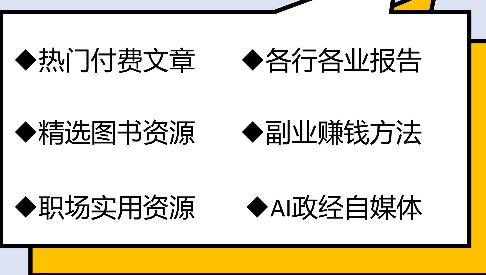

# 汇率的问题

猫哥原创

前几天我的文章提到一个重要的观点，这就是现在央行已经将保汇率放到首要位置，为此甚至不惜收紧银根。

后台小伙伴不大理解，为什么要不惜一切代价保汇率？

这两天甚至有人给我转了一篇奇文，这篇文章观点是这样的是：

从2015年开始，人民币汇率就实施一揽子货币政策，在这个货币篮子中美元占比只有20%，另外，对美进出口在我国进出口中占比也在20%左右，所以，我们不应该过于太看重人民币兑美元汇率。如果撇开美元不计，去年人民币兑欧元、英镑、日元以及全世界其他国家货币都是升值的。

这篇文章的核心观点就是，央行都是笨蛋，为了一个不大重要的人民币兑美元汇率严防死守，付出太大代价，实际上撇开美元不计，人民币兑其他货币都是升值的。

这篇文章貌似很有道理，其实也是不懂进出口贸易的。

我国是制造业大国，我们进口主要是国际大宗产品（也就是资源型产品），而国际大宗产品目前定价货币都是美元！

简单的说就是，不管我们是从沙特进口石油，或者是从澳大利亚进口铁矿石，从智利进口铜矿石，统统都不是按照当地货币定价的，而是按照美元定价的。所以，现阶段，人民币兑美元汇率还是至关重要的。

比如，去年人民币兑美元汇率贬值5.4%，这就意味着对于我国制造业而言，我国进口国际大宗产品价格上涨了5.4%——也就是进口生产原材料成本上涨了5.4%。

这就是去年我国制造业举步维艰的根本原因，上游原材料成本在上涨，下游消费品价格在下降（通缩）。试想，如果央行不采取各种措施保汇率（也就是保人民币兑美元汇率），人民币兑美元汇率在7.3基础上再贬值个5%—10%，也就是进口原材料成本再上涨5%——10%，对于我们很多制造业可能就是灭顶之灾！

当然，在特定情况下，人民币兑其他货币升值也是有价值的。

这个特定情况就是贸易双方实施了货币互换。

举个例子。

我国与阿根廷、巴西实施了货币互换。也就是说，我们可以拿着阿根廷、巴西的货币直接在当地国采购商品，在这种情况下，因为人民币兑这些货币升值，我们就占大便宜了。

2024年，人民币兑阿根廷货币升值22%，兑巴西货币升值19%，这就意味着我们进口巴西与阿根廷商品价格下降了20%，阿根廷是我国牛肉进口大户，因为这个原因，导致我们从阿根廷牛肉价格进口下降了20%，这下进口牛肉优势一下子凸显，2024年1-6月我国牛肉进口一下子相比2019年翻了两倍，所以大家一度觉得进口牛肉性价比太高了。

但是与此同时，国内畜牧业特别是牛肉养殖业就受不了了，大批牛肉养殖户纷纷破产，逼得国内畜牧协会给国家上书，希望管控一下牛肉进口，否则国内牛肉养殖将遭遇灾难性灭顶打击。

所以从2024年7月之后国家有意压缩了牛肉进口，截止到1-11月，我国牛肉进口仅仅只增长了5%左右，牛肉价格得到恢复。

这就是货币互换情况下人民币兑其他货币升值带来的好处。但现在的问题是，人民币不能自由兑换，我们即使拼命在外面搞各种货币互换，这个额度始终是有限的。

站在其他国家立场，目前全世界币值最稳定，最能打的还是美元，所以大部分国家央行只要有条件，还是更愿意用美元计价，出口换取美元。

好了，现在好玩的事情来了，2024年全球货币中最强的就是美元，光是对次强的人民币就升值5.4%左右，对其他发达国家货币包括欧元、英镑、日元都升值10%左右，对发展中国家货币更是升值20%以上，美国又是消费大国，按道理美元这么强，意味着进口商品价格更低，为什么美国通胀始终无法控制下来呢？

唯一符合逻辑的解释就是，美国供应链出了大问题。供应链出了问题一个可能是供应链淤堵，如同类似2021年美国港口世纪大堵塞一样会导致通胀，但是目前没有看到美国供应链出现大规模淤堵现象，那么就剩下一种可能，这就是美国劳动力价格，特别是供应链关联的劳动力价格上涨太快，已经抵消了美元汇率的上涨。

现在特朗普上台，其执政基本思路就是，要清除非法移民——这会导致劳动力价格上涨；要加关税——这会导致商品价格上涨，要美联储降息——这会导致美元走弱，进口商品价格上涨。偏偏特朗普执政最大的承诺还是要控制通胀，而其执政思路中唯一可能压低通胀的就是增加能源开采，压低国际能源价格。

国际能源价格是受多种因素影响的，美国如果仅靠自己增加能源开采，对国际能源价格影响力是有限的，除非美国能说服欧佩克采取一致行动，就算是欧佩克采取一致行动，因为地缘政治原因，美国又要制裁伊朗，还有可能对俄罗斯实施更严厉的制裁，这样七七八八算下来，美国增产的那点能源，可能仅仅只能填补制裁伊朗、俄罗斯份额，如果欧佩克不大规模增产，国际能源价格是很难降下来的。

所以，如果未来特朗普要控制通胀，就必须在其核心执政措施上做出牺牲：

+   ——驱逐非法移民

+   ——对外加征关税

+   ——美联储暂缓降息

以上三条至少要放弃两条，否则通胀就控制不住了！

这才是特朗普未来执政最大的挑战。

# 免费
# 价值
# 及时
# 专注
# 扫码加入 知识星球TOP 免费资源群

√ 每日免费获取有价值资源

√ 可提供各类资源搜索服务

+   * 热门付费文章

+   * 各行业报告

+   * 精选图书资源

+   * 副业赚钱方法

+   * 职场实用资源

+   * AI政经自媒体

公号: 知识星球TOP 微信号: jntsg8 微信号: jntsg2

分享资料仅供个人学习，请及时删除，切勿商用传播