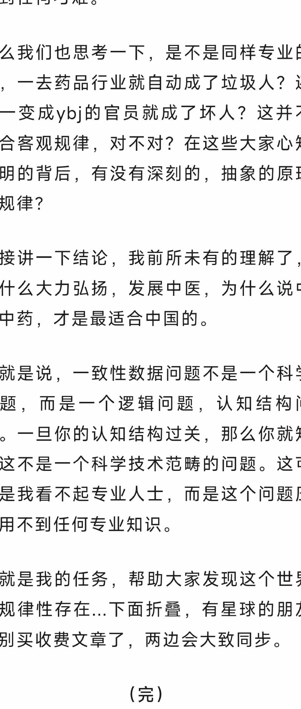
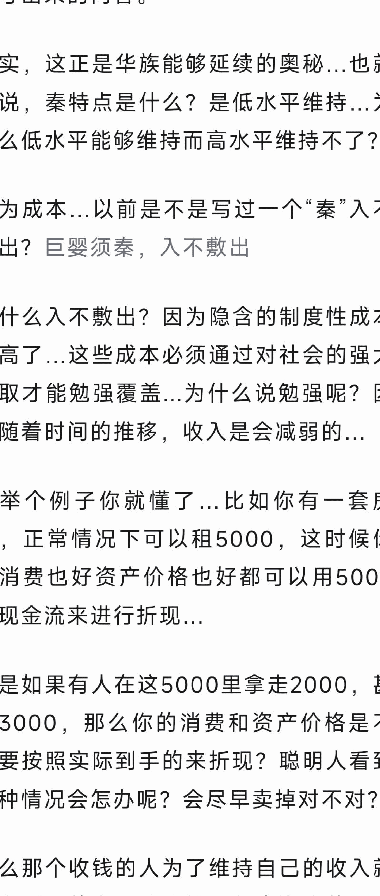
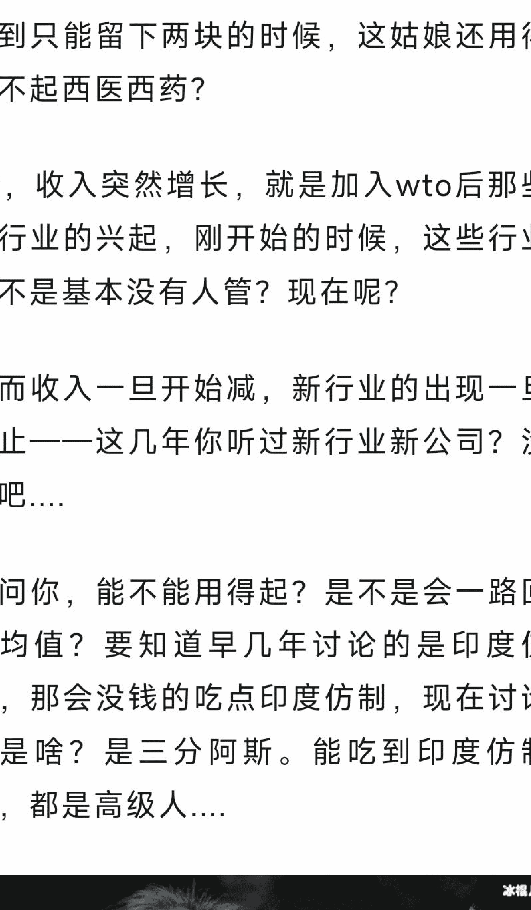
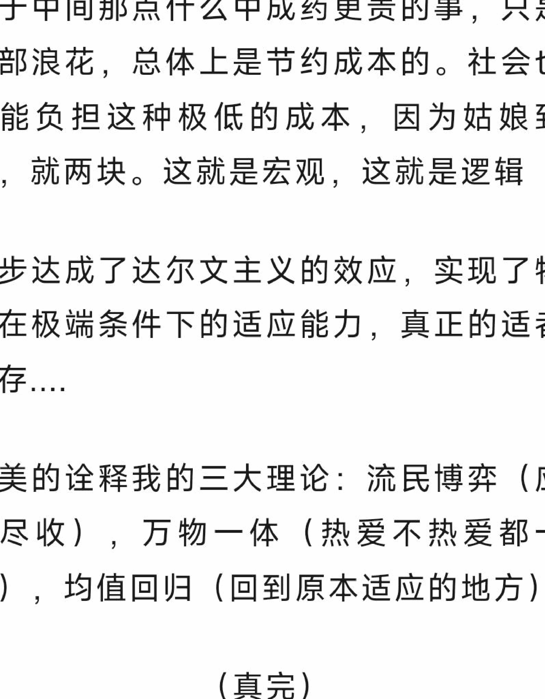

# 辽宁铁岭县交警：一类化粪池清掏已被

作者：匿名用户  来源：网络  发布时间：2025-05-01

近日消息显示，有市民反映在某道路施工区域内，存在化粪池清掏与交通管理相关问题。相关部门已介入核查，并提醒公众注意甄别网络信息。

记者在走访中了解到，事件发酵后引发广泛讨论。部分网友认为应加强源头治理，另有观点建议完善信息披露机制，以减少误读和谣言传播。

从公开信息看，涉事区域曾多次进行市政维护。专家指出，类似问题往往涉及多部门协作，单一部门难以独立完成全部处置流程。

此外，相关法律人士表示，若网络传播内容与事实不符，可能构成对个人或机构名誉权的侵害。建议发布信息前进行必要核验，避免造成不良影响。

有评论称，公共事件舆论场中情绪表达较多，事实细节容易被忽略。媒体在报道时应平衡时效与准确，避免标题化、碎片化叙事。

截至目前，官方尚未发布最终调查结论，后续进展以权威通报为准。

- 免费
- 价值
- 及时
- 专注

# 扫码加入 **知识星球TOP** 免费资源群

- 每日免费获取有价值资源
- 可提供各类资源搜索服务

- 热门付费文章
- 精选图书资源
- 职场实用资源
- 各行各业报告
- 副业赚钱方法
- AI政经自媒体

公号：**知识星球TOP**  
微信号：**jntsg8**  
微信号：**jntsg2**

> 分享资料仅供个人学习，请及时删除，切勿商用传播