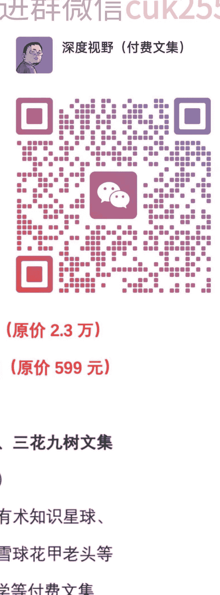

# 鉴茶财经院 251106：产业没有问题

AI 产业链这一轮被杀，是机构们出货保排名，也是大家看到“校花们”三季报不及预期。

那明年及不及预期？

美国同行给出了答案。

Lumentum（LITE）昨天出了25年一季度的业绩，同比涨105%，股价大涨多少呢？23%。

LITE这是咱们讲过美股值得看的公司吧，它做什么？光芯片。

直接对应的是校草源杰，能覆盖的是仕佳。

它在电话会中怎么说：

> “最令我们意外的是客户的需求几乎触达一切，FAU、窄线宽、光模块，所有元器件都在环比上行。  
> 若一定要找个最好的，光模块的环比贡献会最大。  
> 展望未来，供应链仍是一个挑战，但需求确实广泛而强劲。”

再看光模块厂商，Coherent它公布的25年一季报，是同比增长774%。

结果，大涨4.6%，盘后大涨8.8%。

你说美国机构咋就不会砸盘兑现走人，说环比不惊艳？

高意的水平咋样？在旭创等面前是二流，仗着自己是美国公司而已，它的光模块还是华工代工的。

还是我们周末讲的，从光模块、PCB，到液冷、电力、机柜服务器，明年的业绩都是“跨越式”增长而不是“线性的”。

这就是，“算力的逻辑不但没有减弱，反而加强了”，主桌男方也有消息。

外媒传言，拿了国家补贴的，不能用海外芯片，当然利于寒武纪和中芯代表的阵营。

看到这里你是不是又觉得一马平川了？

那如果告诉你，26年上半年，仍然是过渡性产品GB300当主力，革命性的Rubin要下半年才能出货，几个Tier1又可能一季报报业绩miss或者不惊艳呢？

想清楚自己是投什么的，很重要。

看图形的，认为市场总是对的；看逻辑的，认为市场经常是错的。

昨天的AI应用大跌，是美股有人做空Palantir。  
大A有样学样，PLTR是10倍股，408倍PE好么，  
大A挣钱的那几个AI应用几倍？

昨天晚上机构们开始铺天盖地地说北美缺电去推变压器，这种一致性太高的就别追高了，有的你拿着，聪明的看扩散。进群加微信cuk255。

没有的等回调，或者去看PCS变流器的不高开和被打压的机会，一共也没几家。

今天电网分歧了咋整？只能说逻辑还没有走完。

水平不高的，最近不乱折腾是最稳妥的选择，你不能悲观，更不能上头，市场毕竟量能才1.8万亿。

中庸之道。

评论：进群加微信cuk255

释怀&believe：看了这篇文章，心里更加坚定了，希望博创能支棱起来点，走势太弱了！

南院大王回复释怀&believe：它们几个跟谷歌混饭的。

叶枫：左右横跳，双打冠军。

luó o!：加入华工，相信光。

南院大王回复luó o!：你那个长逻辑是相信华为不倒闭。

水镜：仕佳能覆盖这句话，怎么解读？是板块？

蜥蜴回复水镜：土佳不知道多少可以杀回去。

南院大王回复水镜：它面铺得宽，没有源杰那么垂直，有些产品也没经过验证，确定性不够明确。

万然：“水平不高的，最近不乱折腾才是最稳妥的选择。”我昨天的自我反思跟大王说的这句话一致，最近几天的操作简直绝了！买了就跌，卖了就涨停……于是痛定思痛，躺平不动了！

闲闲巴巴：大王，芒果还能继续拿吗？

七月和B宝回复闲闲巴巴：箱体没破，继续。

子曰君子回复七月和B宝：感觉要破。

壁虎漫步回复子曰君子：破了认错出局。

紫木堂回复闲闲巴巴：跌破28.15了。

# 深度视野优质文集圈（[链接优质社群，助你成功](#)）

全部包含以下内容：**限时年费188/年**  **加微信cuk255**

- 1. 吃瓜群众爸爸实时圈文加实时群聊对话（原价365元/年）
- 2. 子明私享汇（会）内部文章（原价568元/年）
- 3. 政事堂（顾子明）付费内容再送顾子明群聊
- 4. 米联储见闻【作者米糕】（原价599元/年）
- 5. 欧洲金靴会员专属文章（原价328元/年）
- 6. 砖瓦厂内部圈文（原价400元/年）
- 7. 卢克文青云读书会专属文章（原价699元/年）
- 8. 鉴茶财经院知识星球（原价3310元/年）
- 9. 猫哥的视界知识星球文章（原价299元/年）
- 10. 财新周刊【独家新闻】（原价1498元/年）
- 11. 杨世光在金钱爆（原价2200元/年）
- 12. 蔡森财经知识星球（原价1600元/年）
- 13. 灏泽异谈付费文章（持续更新）
- 14. 司马林解读毛选全套音频和全套书籍珍藏版无删减（原价2.3万）
- 15. 虚声三部曲【民国梦、帝国齿轮、不被理解的MAO】（原价599元）
- 16. 卢克文知识星球文章（原价268元/年）
- 17. 额外再送：卢麒元新浪微博付费专栏、村西边老王、三花九树文集

不定期内容：__________（更多资源写不下去了......）

- 1. 守夜人司令知识星球、挨踢牛魔王知识星球、生财有术知识星球
- 2. 创始人笔记、达叔天演论知识星球、成竹财富圈、雪球花甲老头等
- 3. A视野、大树乡谈、江宁知府、哔哔说、财上海家学等付费文集
- 4. 西风付费文章、老端、赢在八小时之外、局外人的视界、升值计、老A体制内等等其它一些大V付费文章（每月不低于600元的付费文章）

**限时年费188/年**  低成本链接全网大V优质内容

